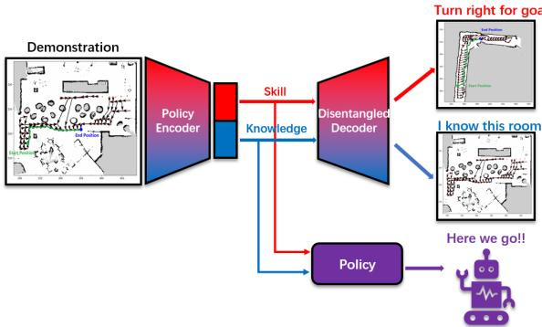
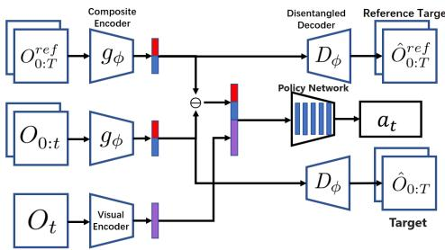
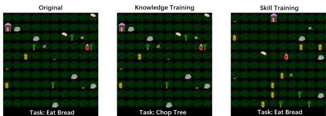
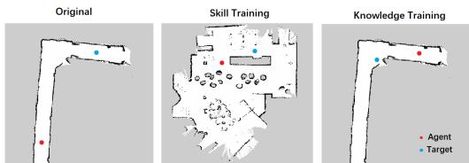
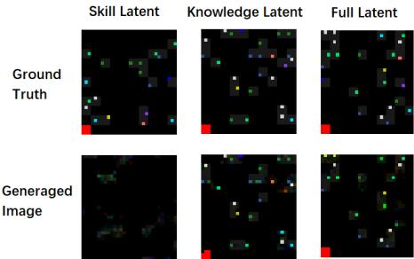

# SKILL-IL：在多任务模仿学习中解构技能与知识

Bian Xihan、Oscar Mendez 和 Simon Hadfield 摘要——在这项工作中，我们引入了一种新的视角，以学习在多任务模仿学习中可转移的内容。人类能够转移技能和知识。如果我们可以骑自行车上班并开车去商店，我们也可以骑自行车去商店并开车上班。我们从中获得灵感，假设策略网络的潜在记忆可以被解开为两个部分。这两个部分包含了任务的环境上下文知识或解决任务所需的可泛化技能。这提高了训练效率，并在相同环境中对之前未见过的技能组合和在未见过的环境中对相同任务的泛化能力。我们使用该方法在两个不同的多任务 $\mathbf{ I L }$ 环境中训练了一个解缠智能体。在这两个案例中，我们的任务成功率超过了最先进技术（SOTA） $30\%$。我们还在真实机器人导航中演示了这一点。

# I. 引言

多任务学习是机器学习中一个快速发展的领域。多任务学习的本质在于允许智能体在不重新训练的情况下执行多个不同的任务。这通常被认为是发展通用人工智能的最可行路径。然而，在诸如模仿学习（IL）等弱监督场景中促进多任务学习是一个新兴领域。模仿学习通过反复试验运作，但我们永远无法进行足够多的试验，以探索所有可能的任务和解决方案的组合。

我们必须学会在不同领域之间进行泛化和信息共享，并重新组合这些信息以应对未见任务。研究人员在任务之间，甚至同一任务的子问题之间有效地转移专业知识时面临挑战。同时，针对之前未见的任务（零样本强化学习/模仿学习）的研究越来越受到关注。为了解决这个问题，我们从人类学习行为中寻找灵感。作为人类，我们花费多年时间学习各种任务，从如何走路和说话到写论文或体操。这种学习是将记忆印刻在大脑中的过程，与训练神经网络的权重有些类似。程序性记忆或“技能”是智能体执行某项任务所需的记忆[10，13]。陈述性记忆或“知识”则涉及与智能体所处环境特定相关的记忆[4，10]。例如，当我们开车去上班时，这需要我们具备开车的技能（程序性记忆）和到达工作地点的路线知识（陈述性记忆）。大多数任务都需要技能和知识同时完成。然而，这些是独立的且可转移的。我们也可以将我们的驾驶技能用于开车去商店，或者利用我们对工作场所的知识骑车去上班。这两种转移都不需要额外的训练。这种能力在多任务学习中将是无价的，因为每个问题都需要不同组合的知识和技能。通常，每种可能的知识和技能组合被视为一个独立的学习问题，或者每个技能独立训练以泛化整体知识。这大大增加了多任务学习的难度，导致可扩展性问题和不切实际的训练需求。在本文中，我们提出了技能与知识独立潜在学习（SKILL）作为一种新的多任务模仿学习方法，明确区分并共享技能和知识，如图1所示。

  
Fig. 1. The policy encoder provides an embedding consisting of both skill and knowledge, coupled with the disentangled decoder to form a gated VAE architecture which partitions the embedded latent.

为了分离技能和知识的学习，我们需要调整向智能体呈现训练示例的方式，以及模型的架构。鉴于所有任务都可以表示为技能和知识的组合，我们借鉴近期关于解耦变分自编码器（VAEs）的研究，学习一个跨所有要执行任务的联合潜在表示。这个潜在表示被划分为两个子领域，专门用于表示任务的技能和知识。这些潜在子领域以弱监督的方式联合训练，同时从潜在观测空间中学习策略。我们通过实验表明，我们能够成功分离多任务学习中的技能和知识。此外，我们还表明，这提高了训练效率和最终性能。总结起来，本研究的主要贡献如下： • 一种基于自监督变分自编码器的架构，用于学习机器人任务的解耦表示 • 一种多任务模仿学习方法，跨潜在子领域共享训练经验 • 一种产生更容易人类理解的潜在空间的方法，适用于多任务模仿学习，使得潜在空间的解码和可视化更容易理解。

# II. 文献综述

# A. 解耦表示

学习解缠结表征的最先进技术主要由变分自编码器（VAE）方法主导。变分自编码器是一种生成模型，它将潜在空间重新参数化为一个可供采样的分布。变分自编码器所学习的潜在表征的每个维度通常被视为一个独立的生成因子。这些表征中的元素能够捕捉和隔离某些潜在因素，而不影响潜在空间中的其他元素。大量研究已经开展，以进一步探讨这些学习表征的解缠结。beta-VAE及随后Burgess等人的研究提出了一种变种的VAE框架，该框架在潜在通道容量与重构精度之间进行平衡。Vowels等人的研究通过一种弱监督的方法颠覆了这一范式，该方法在门控VAE的训练过程中隔离领域知识。该框架使得通过基于共享属性适当划分训练数据来学习潜在子领域成为可能。潜在因子的学习仍然是无监督的，但额外的损失函数作为软约束用于将因子分组到子领域中。该方法被证明更具信息量，并且具有更好的解缠结质量。我们受到此启发，提出了一种学习潜在技能和知识子领域的算法。

# B. 多任务学习

在层次多任务研究中，子任务通常通过特定任务集的语言分类表示进行学习。这些系统所使用的表示有时会无意中探讨技能/知识范式。Oh等人的研究引入了创新的“类比”子任务表示。在这里，目标对象与可应用于目标对象的动作是独立的。Bian等人的研究关注于单一类型任务，但专注于在不同类型的环境中学习不同的行为。[7]的研究引入了组合计划向量（CPV），该方法不是学习每个子任务的表示，而是网络学习一系列子任务组合的嵌入。这使得在没有层次或关系监督的情况下进行任务的分解成为可能。我们的研究桥接了这些不同的思想，学习了一个潜在空间，不仅可以组合子任务，还可以共享和排列子任务的技能和知识成分。这使得解决前所未有的任务组合成为可能，朝着零样本增量学习和通用人工智能迈出了一步。

# III. 方法论

在本文中，我们介绍了技能与知识独立潜在学习（SKILL）架构，如图 2 所示。通过这一架构和训练框架，我们尝试将潜在嵌入中的学习技能和知识分离，并将潜在空间划分为两个子领域，各自包含学习到的技能和知识。该架构由一对门控变分自编码器（VAE）组成，负责划分潜在空间。每个子领域包括一个被屏蔽的潜变量，并通过一对实例之间的相似性损失进行更新。门控 VAE 接收两组轨迹，这些轨迹由智能体的起始状态、结束状态以及当前位置组成。这些信息用于生成一个当前状态到结束状态的行动规划 CPV。门控 VAE 使用共享同一环境、同一任务列表或两者的经验对进行训练，以增强对应子领域的学习。类似于人类通过驾车前往不同的地点来学习驾驶，并通过不同的交通方式在城市中旅行以了解城市布局。

  
, nThe cent requires $O _ { t }$ , rference trajectory $O _ { 0 : T } ^ { \overline { { r } } e f }$ $O _ { 0 : t }$ and two reconstructed image pairs for the reference input and the current input.

智能体需要执行任务，其中包括修改其环境以达到目标状态。智能体可能需要完成多个子任务才能完成一个任务。在完成任务的过程中所访问的状态序列被称为智能体的轨迹。输入并未规定轨迹中子任务的特定顺序。子任务的集合是隐式的，这为智能体确定到达特定目标状态所需的最佳子任务集合提供了自由。剩余要完成任务部分的嵌入（当前到结束）通过计算整体任务的嵌入（起始到结束）与目前进展的嵌入（起始到当前）之间的差异来得到。这与视觉嵌入结合后传递给策略网络，以确定智能体的下一步行动。在我们的实验中，我们进行模仿学习，从时间步 $t \sim 0$ 到最终时间步 $t := T$ 获取完整的状态集，令 $O$ 为在 $O_{0}^{ref} \ldots O_{T}^{ref}$ 中某一状态的观察，该序列为专家参考轨迹。专家参考轨迹是通过在环境中进行贪心搜索以找到最优解提取的。

# A. 变分任务嵌入

我们首先为多任务学习环境中的任何子任务组合定义一个组合表示，以获得一个同时嵌入技能和知识的潜在变量。组合表示是编码空间中项目之间结构关系的嵌入 [11]。这个同时包含技能和知识的表示将用作完整的潜在变量，进行解缠的过程。多任务环境将通过允许任务和环境以不同组合混合，从而提供解缠。考虑一个组合任务嵌入 $\vec { v }$，它将一组任务编码为所有子任务组合嵌入的总和。为了避免强制这些子任务完成的特定顺序，我们的规划空间建立在交换律的基础上，即 $\mathrm { A } { + } \mathrm { B } = \mathrm { B } { + } \mathrm { A }$。根据这个定义，尚未完成的所有任务的嵌入可以计算为 $( \vec { v } - \vec { u } )$，其中 $\vec { u }$ 是已完成任务的嵌入向量。由于我们专注于半监督机器学习，因此不具体指定智能体的确切最终状态。相反，策略 $\pi ( a _ { t } | O _ { t } , \vec { v } - \vec { u } )$ 根据当前状态 $O _ { t }$ 和“待办”任务嵌入生成动作 $a _ { t }$。

接下来，我们介绍模型的不同损失。设函数 $g _ { \phi} ( O _ { a : b } )$ 使用参数 $\phi$ 将时间点 $a$ 和 $b$ 的观察对编码为潜在任务嵌入。为了进一步促进任务嵌入的学习，函数 $g$ 是一个概率编码器，用于预测每个潜在参数的均值和方差。这与解码器 $d _ { \psi}$ 结合形成变分自编码器（VAE），使得 $O \approx d _ { \psi} ( \vec { u } )$，其中 ${ \vec { u } } \sim g _ { \phi} ( O )$。我们将相对于目标 $\hat { O }$ 的重建误差定义为 $i _ { r e c } ( O , \hat { O } ) = | d _ { \psi} ( g _ { \phi} ( O ) - \hat { O } ) |$，此处为了简洁省略了中间采样步骤。完整的重建损失通过将其应用于参考轨迹 $( O _ { 0 : T } ^ { r e f } )$ 和当前轨迹 $( \boldsymbol { O } _ { 0 : t } )$ 输入来获得。

$$
L _ { \delta } ( O _ { 0 : T } ^ { r e f } , O _ { 0 : t } , \hat { O } ^ { r e f } , \hat { O } ) = l _ { \delta } \left( O _ { 0 : T } ^ { r e f } , \hat { O } ^ { r e f } \right) + l _ { \delta } \left( O _ { 0 : t } , \hat { O } \right) .
$$

为了减少空白空间的影响，我们还对重建损失进行遮蔽，仅包括非零像素。这两个损失函数的和用于对模型进行正则化：${ L _ { R } } = { L _ { C } } + { L _ { P } }$ 。智能体使用的潜在表示包含了解决当前任务的能力，也就是技能；以及关于当前环境的信息，即知识。然而，这两种潜在信息目前是错综复杂的。

# B. 解构技能与知识子领域

为了将任务向量 $( \vec { u } )$ 拆分为技能和知识子领域 $( \vec { u } = [ \vec { u } ^ { s } , \vec { u } ^ { k } ] )$，我们采用了带门变分自编码器（gated VAE）[15] 方法，并将 CPV 编码器作为 VAE 的一部分。输入和目标图像首先根据共享的技能因子或共享的知识因子进行分组。具体来说，如果两个训练样本 $\boldsymbol { D }$ 和 $\hat { O }$ 都包含相同的子任务序列但处于不同环境中，则将这些样本按技能分组并添加到技能训练集 $\bar { \mathcal { S } } = \mathcal { S } \bar { \cup } ( \bar { O , } \hat { O } )$ 。类似地，如果训练样本包含不同的子任务序列，但处于相同的环境中，则将它们按知识分组并添加到知识训练集 $\dot { \kappa } = \dot { \kappa } \cup ( O , \hat { O } )$ 。在本研究中，我们通过将潜在空间划分为两个不重叠区域来强制执行硬门控，这两个潜在子领域的大小比可以根据任务进行调整。在我们所有的实验中，我们保持它们相等，各自代表技能或知识。在前向传播过程中，由于解决任务需要同时考虑技能和知识，因此政策网络使用整个潜在空间来选择一个动作。因此，策略函数为 $\pi \left( a _ { t } | O _ { t } , g _ { \phi } \left( O _ { 0 : T } ^ { r e f } \right) - g _ { \phi } \left( O _ { 0 : t } \right) \right)$ 。因此，策略损失 $L _ { a }$ 由损失函数给出：为了将技能与知识分开，我们采用了来自方程 1 的重构损失。两个术语的输入和目标对均来自技能或知识训练集，以便 $( O , { \hat { O } } ) \in ( S \cup { \mathcal { K } } )$ 。我们还基于此适应了通过反向传播更新潜在空间的哪个分区。更正式地，我们定义 $\lfloor \rfloor$ 作为一个在反向传播过程中屏蔽梯度的操作符。然后，我们定义带门潜在空间为，其中 $\hat { a } _ { t }$ 是参考动作。

$$
\Vec { u } = \left\{ \begin{array} { l l } { \left[ \Vec { u } ^ { s } , \lfloor \Vec { u } ^ { k } \rfloor \right] } & { i f ( O , \hat { O } ) \in \mathcal { S } } \\ { \left[ \lfloor \Vec { u } ^ { s } \rfloor , \vec { u } ^ { k } \right] } & { i f ( O , \hat { O } ) \in \mathcal { K } } \\ { \left[ \Vec { u } ^ { s } , \vec { u } ^ { k } \right] } & { i f ( O , \hat { O } ) \in \mathcal { S } \cap \mathcal { K } } \end{array} \right.
$$

$$
{ \cal L } _ { a } ( O _ { t } , \phi ) = - l o g \left( \pi \left( \hat { a } _ { t } | O _ { t } , g _ { \phi } \left( O _ { 0 : T } ^ { r e f } \right) - g _ { \phi } ( O _ { 0 : t } ) \right) \right)
$$

此外，还有两个正则化损失，使用来自[14] 的三元组边际损失 $l _ { m }$。第一个 $L _ { C }$ 通过确保部分完成的嵌入 $( u _ { 0 : t } )$ 与嵌入待办向量 $\left( u _ { t : T } \right)$ 的和等于整个任务的嵌入 $( u _ { 0 : T } )$ 来强制潜在空间的可组合性。

$$
L _ { C } ( O _ { 0 } , O _ { t } , O _ { T } ) = l _ { m } ( g ( O _ { 0 : t } ) + g ( O _ { t : T } ^ { r e f } ) - g ( O _ { 0 : T } ^ { r e f } ) )
$$

其中 $l _ { m }$ 是一个截断的 L1 损失，边际设置为 1。第二个正则化损失旨在确保潜在空间中的相似性与语义上相似的任务相对应。为此，我们确保智能体轨迹的嵌入与专家参考轨迹的嵌入相似。

$$
{ \cal L } _ { P } = l _ { m } ( g ( { \cal O } _ { 0 : T } ) - g ( { \cal O } _ { 0 : T } ^ { r e f } ) )
$$

这意味着对于每个训练对，梯度流和参数更新仅在源和目标共享的潜在空间的细分内进行。有关门控变分自编码器的更多细节，请参阅[15]。总之，这种方法使得在不知道真实潜在因素的情况下能够学习解耦的潜在子领域。我们只需能够根据共享子领域对示例进行聚类。值得注意的是，在我们的框架内，技能或知识目标的分组和后续选择是针对当前分支 $( O , { \hat { O } } )$ 和参考分支 $( O ^ { r e f } , \hat { O } ^ { r e f } )$ 进行的。此外，我们引入了动态损失 $L _ { G }$。虽然 $\alpha , \beta$ 是正则化常数，但通过根据训练模式改变 $\alpha$ 和 $\beta$ 的值，可以改善解耦性能。可以表示为：

$$
L _ { G } = \overleftarrow { \left\{ \alpha L _ { a } + \beta L _ { \delta } \quad i f ( O , \hat { O } ) \in \mathcal { S } \right.}  
$$

其中 $\epsilon$ 是一个小的常数值。

  
Fig. 3. The different inputs for different training modes. In skill mode, the environment differs from the original but the agent is expected to perform the same task. In knowledge mode, the environment is the same but the agent is expected to perform a different task.

动态损失加权的原因在于我们期望智能体在技能训练期间能够正确预测策略行动。然而，由于环境与原始回合不同，重构损失的重要性预计会降低。类似地，可以降低 $\alpha$ 值，以确保在知识训练期间重构损失得到强调。总之，该框架的损失函数 $L$ 包括重构损失和策略损失，采用动态损失加权，并与正则化损失相加：$L = L _ { G } + L _ { R }$。

# IV. 评估

我们评估了SKILL框架，以展示所提议的技能与知识的解耦如何影响智能体的成功率和效率。我们进行了多项定性实验，探索并验证了系统学习到的解耦程度。在此基础上，我们通过消融研究探讨了系统中不同元素的重要性。我们还在两个不同的环境中进行评估，并将其与每个环境中的当前最先进技术进行比较。最后，我们展示了我们的技术在真实机器人执行导航任务中的应用。

a) 工坊环境：我们实验中使用的第一个环境是一个受Minecraft启发的二维工艺世界。该世界具有离散的状态和动作。智能体可以移动、拾取或放置地图上存在的某些物品，并对这些物品执行操作。在这一环境中，我们可以定义诸如砍树、破碎岩石、制作面包、建造房屋等任务，并将它们组合成序列，例如[制作面包，吃面包，砍树，建造房屋]。这提供了一系列独特的任务和序列，有助于生成训练数据。如方法部分所述，智能体的目标通过提供当前轨迹和参考轨迹的观察组成的两个轨迹隐式指定。这种方法的优点在于不需要明确指定子任务的顺序，智能体可以自由以最合适的方式执行任务。我们的框架使用随机生成的起始环境和随机组合的任务进行训练。为实现目标终态所需的任务数量越多，问题的复杂性就越高。该环境中先前的最先进方法使用相同的输入观察和专家参考轨迹。模型接收如图3所示的三组数据。第一组是包含环境和任务序列的原始回合。第二组是相同环境但任务不同的知识训练回合。第三组是相同任务但环境不同的技能训练回合。在图3中，原始回合要求智能体拾起锤子并破碎岩石。在知识训练回合中，环境相同，但任务是拾取小麦并制作面包。在技能训练回合中，环境与原始回合不同，但任务再次是使用锤子破碎岩石。

  
Fig. 4. The navigation environment mimics real maps produced by the gmapping [8] algorithm.

b) 学习导航：第二个环境模拟了二维导航场景。地图是从真实世界地点的 gmapping [8] 输出生成的，以模拟真实世界导航，如图4所示。该环境的目标是到达地图上的一个随机目标位置。智能体在训练期间获得了完整的状态观测以及示范。最先进的 (SOTA) [3] 技术将这一多环境导航问题视为多任务学习场景，使用相机视角而非地图作为输入。然而，动作空间和量化状态空间与原文献保持一致。在这两个环境中，我们关注两个评估指标：任务成功率衡量有多少集结束时目标成功到达。平均集长则衡量智能体实现其目标的速度。

# A. 实现

在这两种环境中，观察结果以图像对的形式提供。共享于参考轨迹 $O _ { 0 : T } ^ { r e f }$ 和当前轨迹 $O _ { 0 : t }$ 的编码器 $g$ 是一个具有共享权重的 4 层卷积神经网络编码器。当前状态输入 $( O _ { t } )$ 通过一个带有最终全连接层的 4 层卷积神经网络进行处理。任务的潜在嵌入被送入一个 5 层策略网络，以在每个时间步生成动作，而每个解耦的潜变量则被送入一个 4 层解码器进行重建。

# B. 探索分离性

在我们的第一组实验中，我们旨在确认我们提出的方法是否能产生一个技能和知识分离的潜在空间。不幸的是，测量分离性是极具挑战性的。文献中提出了许多方法，但大多数需要知道真实因素。相反，为了量化我们对技能和知识的分离性，我们首先对已训练的模型进行固定网络权重处理。接下来，我们记录网络为数据集中所有样本生成的潜在嵌入。最后，我们尝试训练一个简单的网络，仅使用一个潜在部分 $\vec { u } ^ { s }$ 或 $\vec { u } ^ { k }$ 来估计任务ID。当在一组包含500个未见潜在嵌入的验证集上进行测试时，针对技能部分训练的网络在恢复6个不同任务标签上达到了 $9 9 . 2 \%$ 的准确率。然而，针对知识潜在部分训练的网络，其恢复准确率仅为 $1 2 . 7 \%$ 。这表明与解决每个特定任务相关的所有技能信息已有效地分离并集中在潜在技能子域中。我们无法对知识子域进行类似测试，因为我们没有固定数量的环境布局可供识别。相反，我们训练了两个图像解码网络，分别尝试仅使用技能或知识潜在部分来重建环境。这些解码网络将潜在部分作为输入，以生成相应的观测结果，二者都经过训练，直至达到其最高准确率。图5中展示了先前未见潜在嵌入的重建图像示例。

  
Fig. 5. The reconstructed image from the knowledge latent recreated the original image almost perfectly, full latent recreated the image without items unrelated to the current task (red hammer and purple house are not related to chop trees), and skill latent fails to generate an image that resembles the ground truth.

显然，使用之前未见知识潜变量的重建结果远远优于技能潜变量的结果。我们注意到，单独使用技能潜变量无法生成任何有意义的图像，因为它包含的环境信息很少。同时，知识仅重建似乎专注于表示环境中最显著的部分。来自完整潜变量的重建能够重建环境，而不包括当前任务中未使用的一些非关键项目。这表明一些不太显著的最终细节可能在两个潜变量子领域中共同编码。这与神经科学的发现相呼应，表明在生物学习中，声明性知识和程序性知识在很大程度上可以解耦，但永远无法完全分开。在数值上，知识潜变量在验证数据集上的平均重建损失约比技能潜变量低300倍。我们在第二个环境中发现类似的结果，其中知识潜变量数据集的平均重建损失约比技能潜变量低250倍。C. 消融研究

现在我们已经确凿地证明了我们学习的嵌入空间成功解耦，接下来我们将对我们的系统进行消融分析。为此，我们探讨模型中三个部分的贡献。在这个实验中，我们还报告了模仿精度（与专家一致的动作比例）以供比较[7]。如表I所示，我们首先移除了当前状态观察分支（无 $O _ { t } $）。仅使用门控变分自编码器结构时，我们的模型性能与最先进的模型（CPV-FULL [7]）相似。引入当前状态观察分支后，通过为智能体提供更直接的当前状态观察，显著提高了性能。然后我们移除了来自潜在分布的随机采样，转而简单地取均值潜在嵌入。我们将其称为固定采样（FS）。在所有指标上，这提供了一小部分改善。最后，我们引入了在公式6中提出的动态损失（DL）加权方案。这种方法在任务性能和完成速度上进一步改善。根据这种训练模式调整损失函数的比例将提高训练稳定性，但以降低训练速度为代价，因为学习变得不那么激进。有趣的是，尽管在没有DL模型的情况下模仿精度达到了峰值，任务成功率和完成速度在应用DL模型后仍然有所提高。

<table><tr><td>Model</td><td>Imitation accuracy</td><td>Success</td><td>Ep. length</td></tr><tr><td>CPV-FULL [7]</td><td>66.42%</td><td>65%</td><td>69.31</td></tr><tr><td>SKILL-no Ot</td><td>64.18%</td><td>65%</td><td>26.95</td></tr><tr><td>SKILL</td><td>70.61%</td><td>84%</td><td>19.77</td></tr><tr><td>SKILL+FS</td><td>70.89%</td><td>89%</td><td>19.52</td></tr><tr><td>SKILL+FS+DL</td><td>70.62%</td><td>94%</td><td>17.88</td></tr></table>

表 I 消融研究。FS 表示固定采样。DL 表示动态损失加权。

<table><tr><td>Model</td><td>Success</td><td>Ep. Length</td></tr><tr><td>SKILL+FS</td><td>90%</td><td>14.82</td></tr><tr><td>SKILL+FS+DL</td><td>96%</td><td>13.08</td></tr><tr><td>SKILL+FS+KL</td><td>98%</td><td>13.31</td></tr><tr><td>SKILL+FS+SL</td><td>84%</td><td>11.47</td></tr></table>

表 II 环境 2 的消融研究。KL 表示更高的知识划分，SL 表示更高的技能划分。在第二个环境中，我们研究了不同划分比例的影响，如表 II 所示。我们使用 FS 和 $\mathrm { F S + D L }$ 作为参考，潜在空间在技能和知识之间平均划分。当我们将更多的潜在空间分配给知识子域（KL）时，结果在成功率和速度上均超过了 $\mathrm { F S + D L }$ 模型。当技能子域（SL）的划分比例更高时，尽管任务成功率下降了 $15 \%$，但完成速度显著提高。这表明在成功导航的环境知识与效率的技能之间存在有趣的权衡关系。

# D. 与最先进技术的比较

在确定最佳方法后，我们将更加全面地将我们的模型与之前的最先进模型（CPV-FULL [7]）在两个环境中进行比较。对于手工世界 [6]，我们遵循 [7] 中的评估协议。比较手工世界环境中的最先进模型。

<table><tr><td rowspan="2">MODEL</td><td colspan="2">4 SKILLS</td><td colspan="2">8 SKILLS</td><td colspan="2">16 SKILLS</td><td colspan="2">1,1</td><td colspan="2">2,2</td><td colspan="2">4,4</td></tr><tr><td>Success</td><td>Ep. Length</td><td>Success</td><td>Ep. Length</td><td>Success</td><td>Ep. Length</td><td>Success</td><td>Ep. Length</td><td>Success</td><td>Ep. Length</td><td>Success</td><td>Ep. Length</td></tr><tr><td>CPV-NAIVE [7]</td><td>52.5</td><td>82.3</td><td>29.4</td><td>157.9</td><td>17.5</td><td>328.9</td><td>57.7</td><td>36.0</td><td>0.0</td><td></td><td>0.0</td><td></td></tr><tr><td>CPV-FULL [7]</td><td>71.8</td><td>83.3</td><td>37.3</td><td>142.8</td><td>22.0</td><td>295.8</td><td>73.0</td><td>69.3</td><td>58.0</td><td>270.2</td><td>20.0</td><td>379.8</td></tr><tr><td>SKILL</td><td>61.3</td><td>63.3</td><td>37.5</td><td>132.7</td><td>20.0</td><td>277.8</td><td>80.0</td><td>53.3</td><td>55.0</td><td>103.1</td><td>26.3</td><td>198.1</td></tr></table>

表 III

我们模型和最先进的模型均基于包含1-3个不同任务的50,000个样本进行训练，并且我们在4、8和16个任务的序列上对每个模型进行了评估。我们还使用 "1,1" 的任务序列（代表单个任务）和 $^ { \bullet \bullet } 2 , 2 ^ { \bullet }$ 的任务序列（代表从两个参考轨迹中提取的两个任务）来评估模型的能力。如表III所示，在大多数情况下，我们的模型在任务成功率和性能速度上均优于最先进模型。特别是，在最具挑战性的实验中，我们的技术使成功率相对提高了$30 \%$，并且episode长度减少了$50 \%$。这表明我们模型在处理具有更多任务的轨迹以及处理任务组合序列时具有更好的泛化能力。在导航环境中（图4），之前的最先进模型的成功率为$94.6 \%$，而我们的模型能够实现$98.0 \%$的成功率。我们的智能体的平均效率也比之前的最先进模型快$20 \% - 30 \%$。通过技能和知识的解耦，我们可以更好地在不同导航任务之间共享有用的经验。

# E. 现实生活示范

最后，我们使用一个实时的 TurtleBot3 作为平台来演示我们的模型。TurtleBot 首先使用 gmapping 创建区域地图，然后将其处理成智能体可识别的观测格式。目标位置在观测中标记，连同机器人当前的位置。智能体会为机器人生成一个在四个方向之一移动指定长度的指令。这个过程会重复，直到机器人到达目标位置。在没有任何微调的情况下，机器人学会通过在导航过程中执行恢复动作来补偿里程计的不准确性和漂移，尽管在模拟训练中没有暴露于这种漂移。我们的机器人能够在多个位置成功完成任务，演示视频的屏幕截图见视频附件。

# V. 结论

在本研究中，我们从新的视角探讨了多任务学习的问题。受到神经生物学和记忆获取教学法的启发，我们假设策略神经网络中的潜在空间可以解耦为子领域。每个分区负责任务的技能或知识，并应能够转移到未来经历的不同组合中。我们成功地在模仿学习中展示了这种解耦，采用了门控变分自编码器架构。通过我们的方法，在线性成功率和速度方面，我们在两个不同环境中都超越了最先进的模型。能够解耦任务中的技能和知识是实现组合泛化的基本步骤。更好地划分技能和知识潜在空间的模型，或解释纠缠信息，将有助于我们对模仿学习的理解。为复杂任务提供人类可解释的解决方案也是一个有趣的方向，因为这在多任务学习中一直是一个热门选择。

# 致谢

本工作部分得到了英国工程与物理科学研究委员会（EPSRC）资助协议 EP/S035761/1“反射机器人”的支持。

# REFERENCES

[1] Robin Amsters and Peter Slaets. Turtlebot 3 as a robotics education platform. In International Conference on Robotics in Education (RiE), pages 170181. Springer, 2019.   
[2] Abdul Fatir Ansari and Harold Soh. Hyperprior induced unsupervised disentanglement of latent representations. In Proceedings of the AAAI Conference on Artificial Intelligence, volume 33, pages 31753182, 2019.   
[3] Xihan Bian, Oscar Mendez, and Simon Hadfield. Robot in a china shop: Using reinforcement learning for location-specific navigation behaviour. ICRA 2021, 2021.   
[4] Mark Burgin. Theory of Knowledge: Structures and Processes, volume 5. World scientific, 2016.   
[5] Bin Dai and David Wipf. Diagnosing and enhancing vae models. arXiv preprint arXiv:1903.05789, 2019.   
[6] Coline Devin. craftingworld. original-date: 2019-07-11T16:56:42Z.   
[7] Coline M Devin, Daniel Geng, Pieter Abbeel, Trevor Darrell, and Sergey Levine. Compositional plan vectors. 2019.   
[8] Giorgio Grisettiyz, Cyril Stachniss, and Wolfram Burgard. Improving grid-based slam with rao-blackwellized particle filters by adaptive proposals and selective resampling. In Proceedings of the 2005 IEEE international conference on robotics and automation, pages 2432 2437. IEEE, 2005.   
[9] Irina Higgins, Loic Matthey, Arka Pal, Christopher Burgess, Xavier Glorot, Matthew Botvinick, Shakir Mohamed, and Alexander Lerchner. beta-vae: Learning basic visual concepts with a constrained variational framework. 2016.   
[10] Robert McCormick. Conceptual and procedural knowledge. International journal of technology and design education, 7(1):141159, 1997.   
[11] Tomas Mikolov, Ilya Sutskever, Kai Chen, Greg S Corrado, and Jeff Dean. Distributed representations of words and phrases and their compositionality. Advances in neural information processing systems, 26, 2013.   
[12] Junhyuk Oh, Satinder Singh, Honglak Lee, and Pushmeet Kohli. Zeroshot task generalization with multi-task deep reinforcement learning. In International Conference on Machine Learning, pages 26612670. PMLR, 2017.   
[13] Bethany Rittle-Johnson and Robert S Siegler. The relation between conceptual and procedural knowledge in learning mathematics: A review. 1998.   
[14] Florian Schroff, Dmitry Kalenichenko, and James Philbin. Facenet: A unified embedding for face recognition and clustering. In Proceedings of the IEEE conference on computer vision and pattern recognition, pages 815823, 2015.   
[15] Matthew J Vowels, Necati Cihan Camgoz, and Richard Bowden. Gated variational autoencoders: Incorporating weak supervision to encourage disentanglement. In 2020 15th IEEE International Conference on Automatic Face and Gesture Recognition (FG 2020), pages 125132. IEEE, 2020.   
[16] Zhilin Zheng and Li Sun. Disentangling latent space for vae by label relevant/irrelevant dimensions. In Proceedings of the IEEE/CVF Conference on Computer Vision and Pattern Recognition, pages 12192 12201, 2019.