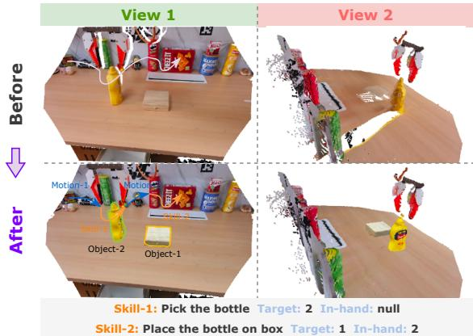
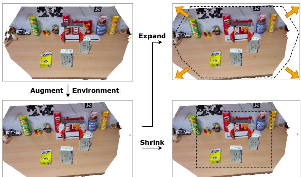
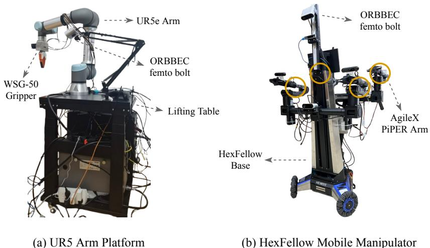
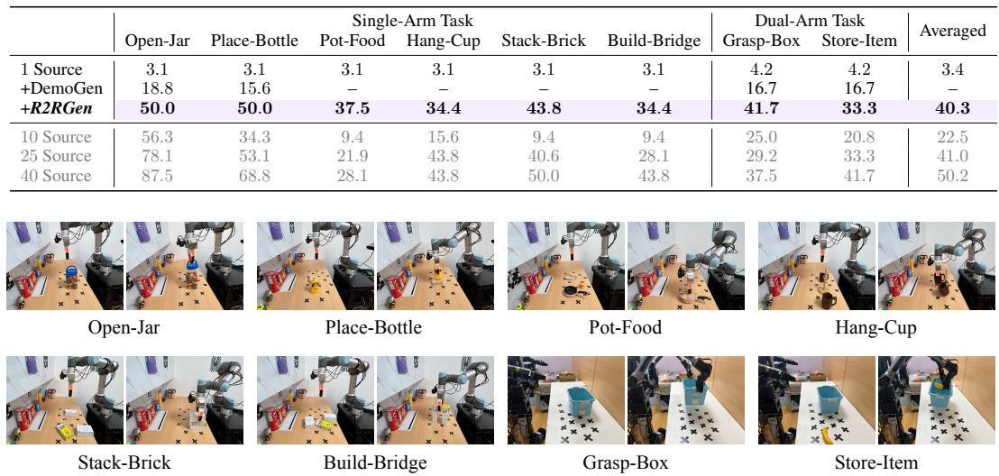
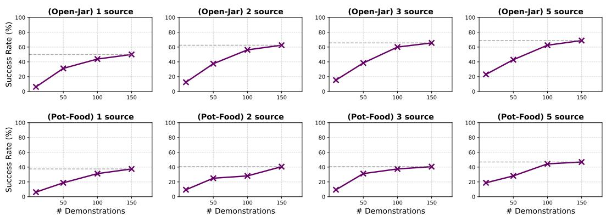
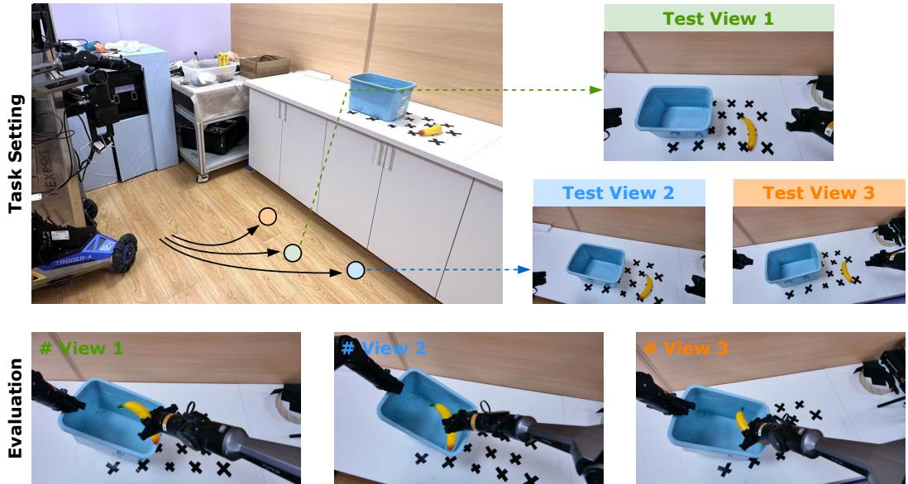

# 1. Bibliographic Information

## 1.1. Title
R2RGEN: Real-to-Real 3D Data Generation for Spatially Generalized Manipulation

The title clearly states the paper's core contribution: a method named `R2RGen` that performs **Real-to-Real (R2R)** data generation. This means it takes real-world data and produces new, synthetic but realistic data, avoiding simulators. The goal of this data generation is to improve a robot's ability to handle variations in the spatial configuration of its environment, a capability referred to as **spatially generalized manipulation**.

## 1.2. Authors
The authors are Xiuwei Xu, Angyuan Ma, Hankun Li, Bingyao Vu, Zheng Zhu, Jie Zhou, and Jiwen Lu. They are affiliated with Tsinghua University and GigaAI.

The corresponding author, Jiwen Lu, is a prominent professor at the Department of Automation at Tsinghua University. His research focuses on computer vision, deep learning, and artificial intelligence, with significant contributions in areas like face recognition, person re-identification, and visual learning. The authors' collective background in computer vision and AI provides a strong foundation for this work, which lies at the intersection of 3D vision and robotic learning.

## 1.3. Journal/Conference
The paper was submitted to arXiv, a popular repository for pre-print academic articles. This means the paper has not yet undergone formal peer review for publication in a journal or conference. The arXiv identifier (`2510.08547`) suggests a submission date in October 2025, which is unusual as it is in the future relative to the current time. This may be a placeholder or a typo in the provided metadata. Given the reference to $Wu et al. (2025)$ in CoRL, the authors are likely targeting a top-tier robotics or machine learning conference such as the Conference on Robot Learning (CoRL) or the International Conference on Robotics and Automation (ICRA) for 2025.

## 1.4. Publication Year
The metadata indicates a publication date of October 9, 2025. As this is an arXiv preprint, this should be considered the submission date to the archive.

## 1.5. Abstract
The abstract outlines the challenge of achieving **spatial generalization** in robotic manipulation, which requires policies to function robustly despite changes in the positions of objects, the robot, and the environment. Traditionally, this requires collecting vast amounts of human demonstrations for imitation learning. The paper critiques prior data generation methods for their reliance on simulators (leading to a **sim-to-real gap**) or their limited applicability (e.g., fixed-base robots, few objects).

To address this, the authors propose `R2RGen`, a **real-to-real 3D data generation framework**. `R2RGen` takes a single source demonstration and directly augments point cloud observation-action pairs to create new data. The framework is simulator-free, making it efficient and easy to use. Key components of `R2RGen` include:
1.  A fine-grained annotation mechanism to parse scenes and trajectories.
2.  A **group-wise augmentation strategy** to manage complex multi-object tasks.
3.  A **camera-aware processing** step to ensure the generated point clouds are realistic and match the output of real 3D sensors.

    Empirically, the authors show that `R2RGen` dramatically improves data efficiency, with a policy trained on data from one demonstration outperforming policies trained on 25 times more human-collected data. The framework also shows strong potential for scaling and for mobile manipulation applications.

## 1.6. Original Source Link
*   **Original Source:** https://arxiv.org/abs/2510.08547
*   **PDF Link:** https://arxiv.org/pdf/2510.08547v1.pdf
*   **Status:** This is a preprint manuscript on arXiv and has not yet been peer-reviewed or officially published in a conference or journal.

# 2. Executive Summary

## 2.1. Background & Motivation
In modern robotics, **imitation learning** is a dominant paradigm for teaching robots complex manipulation skills. A robot learns a **visuomotor policy**—a mapping from visual input to motor commands—by observing human demonstrations. However, a major bottleneck is the sheer volume of data required. To learn a policy that can **spatially generalize** (i.e., perform a task like "put apple on plate" regardless of where the apple, plate, or robot are located), hundreds of demonstrations may be needed to cover the vast space of possible configurations.

Recent works have explored automatic data generation to reduce this human effort. However, they face significant hurdles:
*   **Simulator-based methods** (`MimicGen`): These methods generate new trajectories but need a simulator to render the corresponding visual scenes. This is time-consuming and suffers from the infamous **"sim-to-real" gap**, where policies trained in simulation fail in the real world due to subtle physical and visual differences.
*   **Early real-to-real methods** (`DemoGen`): These methods work directly with real 3D point cloud data, avoiding simulators. However, they are highly constrained. `DemoGen` assumes a fixed-base robot, a pre-cropped environment, a maximum of two objects, and skills that only involve a single target object. Furthermore, large augmentations can create unrealistic point clouds (a "visual mismatch" problem), limiting their practical use, especially for mobile robots where the viewpoint changes.

    This paper's entry point is to create a **general and practical real-to-real data generation framework** that overcomes these limitations. The goal is to develop a method that is simulator-free, works with raw sensor data, handles complex multi-object interactions, and is applicable to mobile manipulators.

## 2.2. Main Contributions / Findings
The paper introduces `R2RGen`, a comprehensive framework for generating spatially diverse, realistic 3D robotic data from minimal human demonstrations. Its main contributions are:

1.  **A General Real-to-Real 3D Data Generation Framework:** `R2RGen` is a complete pipeline that is simulator-free, renderer-free, efficient, and plug-and-play. It works on raw point cloud inputs and supports mobile manipulators, overcoming the key limitations of prior work.

2.  **Group-wise Augmentation Strategy:** To handle complex tasks where the spatial relationship between multiple objects is crucial (e.g., placing a bridge deck on two piers), `R2RGen` introduces a novel strategy. It groups objects involved in a skill and transforms them together. A backtracking mechanism ensures that causal constraints are not violated during augmentation.

3.  **Camera-Aware 3D Post-Processing:** To solve the "visual mismatch" problem where augmented data looks unrealistic, `R2RGen` simulates the image formation process of a real RGB-D camera. It projects the augmented 3D scene onto a virtual camera plane, applies a z-buffer to handle occlusions, and then projects it back to a 3D point cloud, ensuring the final data distribution matches that of a real sensor.

4.  **Significant Improvement in Data Efficiency:** The key finding is that `R2RGen` dramatically reduces the need for human data collection. The experiments show that a policy trained with `R2RGen` using only **one human demonstration** can achieve performance comparable to or even better than a policy trained with **25 to 40 human demonstrations**. This validates its effectiveness in teaching spatial generalization.

# 3. Prerequisite Knowledge & Related Work

## 3.1. Foundational Concepts
*   **Imitation Learning (IL):** A machine learning approach where an agent learns to perform a task by observing and mimicking demonstrations from an expert, typically a human. In robotics, this involves training a policy to map observations (e.g., camera images) to actions (e.g., robot arm movements) based on a dataset of recorded human teleoperations.

*   **Visuomotor Policy:** A function, often represented by a neural network, that directly maps visual inputs (from cameras) to motor commands for a robot. The "end-to-end" nature of these policies, from pixels to actions, makes them powerful but also data-hungry.

*   **Spatial Generalization:** This is a fundamental capability for any practical robot. It refers to the policy's ability to successfully execute a task under varying spatial conditions—when objects are in different locations and orientations, or when the robot itself is positioned differently relative to the scene.

*   **Point Cloud:** A set of data points in a 3D coordinate system. Each point has coordinates (X, Y, Z) and may have additional attributes like color (RGB). RGB-D (Red-Green-Blue-Depth) cameras are a common source of point clouds in robotics, as they provide both a color image and a depth map, which can be converted into a 3D point cloud. Point clouds provide explicit 3D geometric information, which is highly beneficial for manipulation tasks.

*   **SE(3) Pose:** SE(3) stands for the Special Euclidean group in 3 dimensions. It is a mathematical way to represent the **pose** (position and orientation) of a rigid object in 3D space. An SE(3) pose is typically represented by a 4x4 transformation matrix that combines a 3x3 rotation matrix and a 3x1 translation vector. This is the standard way to describe the pose of a robot's end-effector or objects in the environment.

*   **Partially Observable Markov Decision Process (POMDP):** This is a mathematical framework for modeling decision-making problems where the agent cannot observe the full state of the environment. A POMDP is defined by a set of states, actions, observations, a transition function (how states change with actions), an observation function (the probability of seeing an observation in a given state), and a reward function. Robotic manipulation is naturally a POMDP because a robot's sensors (like a camera) only provide a partial view of the world (e.g., objects can be occluded).

## 3.2. Previous Works
The paper positions `R2RGen` in contrast to two main categories of data generation methods:

*   **Simulator-based Generation (e.g., `MimicGen`)**: These methods take a few real-world demonstrations and use them to synthesize a large number of new action trajectories. However, to get the corresponding visual observations for training a visuomotor policy, these trajectories must be executed in a physics simulator. This "on-robot rollout" in simulation is time-consuming and, more critically, introduces the **sim-to-real gap**. Policies trained on simulated data often fail in the real world because of discrepancies in visual appearance, lighting, and physics.

*   **Real-to-Real Generation (e.g., `DemoGen`)**: This recent line of work aims to be simulator-free. `DemoGen` was a pioneering effort that operates directly on 3D point clouds from real demonstrations. It augments the positions of objects and the corresponding robot trajectory in 3D space. However, the paper highlights several key limitations of `DemoGen` that `R2RGen` aims to solve:
    1.  **Constrained Setting:** It only works for fixed-base robots and assumes a pre-processed (cropped) environment.
    2.  **Limited Task Complexity:** It supports a maximum of two objects and assumes each "skill" (e.g., grasping, placing) interacts with only one target object. This fails for tasks requiring coordination between multiple objects.
    3.  **Visual Mismatch:** When large transformations (especially rotations) are applied to the partial point cloud of an object, the resulting view becomes unrealistic. For example, the back of an object, which should be occluded, might become visible while the front, which should now be visible, is missing.

*   **3D Visuomotor Policies (e.g., `iDP3`)**: `R2RGen` is designed to work with policies that consume 3D data directly. The paper uses `iDP3` (`improved 3D Diffusion Policy`), which is a policy that takes point clouds in the camera's coordinate system (`egocentric point clouds`) as input. A key feature of `iDP3` is that it does not require knowledge of the camera's absolute pose in the world, making it robust to viewpoint changes and a perfect fit for mobile manipulation scenarios, which `R2RGen` supports.

## 3.3. Technological Evolution
The field of robotic imitation learning has evolved through several stages:
1.  **Early Imitation Learning:** Focused on learning single skills from a small number of demonstrations in constrained lab environments.
2.  **Large-Scale Data Collection:** With the rise of deep learning, the community recognized the need for large, diverse datasets. This led to projects like RT-X and DROID, which aggregated massive amounts of real-world robot data to train general-purpose "foundation models" for robotics (e.g., RT-2, OpenVLA).
3.  **Data Generation for Efficiency:** The high cost and effort of large-scale data collection spurred research into automatic data generation. Initially, this was heavily simulator-based (`Gen2Sim`, `MimicGen`), but the sim-to-real gap remained a major obstacle.
4.  **Real-to-Real Generation:** `DemoGen` marked a shift towards simulator-free generation by manipulating real 3D data. `R2RGen` builds directly on this idea, but generalizes it to be far more practical and capable, addressing the key bottlenecks of its predecessor.

    `R2RGen` fits into this timeline as a state-of-the-art method for **data-efficient imitation learning** by providing a practical, simulator-free way to synthesize high-quality, spatially diverse training data.

## 3.4. Differentiation Analysis
Compared to the most relevant prior works, `R2RGen`'s innovations are:

| Feature | `MimicGen` (Simulator-based) | `DemoGen` (Early R2R) | **`R2RGen` (Proposed Method)** |
| :--- | :--- | :--- | :--- |
| **Simulator-free** | ❌ (Requires simulator for rendering) | ✅ | ✅ |
| **Task Complexity** | ✅ (Can handle complex tasks in sim) | ❌ (Single target object per skill) | ✅ (**Group-wise augmentation** for multi-object constraints) |
| **Realism** | ❌ (Sim-to-real gap) | ❌ (Visual mismatch on large augmentations) | ✅ (**Camera-aware processing** to mimic real sensor) |
| **Mobile Robots** | ❌ (Typically fixed-base) | ❌ (Fixed-base assumption) | ✅ (Handles viewpoint changes, raw point clouds) |
| **Input Data** | Real demonstrations | Real demos, but requires cropped environment | Real demos, works on **raw sensor input** |

# 4. Methodology

## 4.1. Principles
The core principle of `R2RGen` is to **"remix" a real-world demonstration in 3D space to create new, valid demonstrations**. Instead of re-collecting data for every new spatial configuration, `R2RGen` takes a single demonstration, intelligently parses it, applies geometric transformations to objects and the robot's trajectory, and then meticulously reconstructs what a 3D camera would have seen in that new scenario. This process is designed to be physically and visually plausible, bridging the gap between simple augmentation and realistic data generation.

The entire process is broken down into three main stages: Pre-processing, Group-wise Augmentation, and Camera-aware Post-processing.

The following figure from the paper provides a high-level overview of the pipeline.

![Figure 3: The pipeline of R2RGen. Given processed source demonstration, we backtrack skills and apply group-wise augmentation to maintain the spatial relationships among target objects, where a fixed object set is maintained to judge whether the augmentation is applicable. Then motion planning is performed to generate trajectories that connect adjacent skills. After augmentation, we perform camera-aware processing to make the pointclouds follow distribution of RGB-D camera. The solid arrows indicate the processing flow, while the dashed arrows indicate the updating of fixed object set.](images/3.jpg)
*该图像是R2RGen的流程示意图。左侧展示了经过处理的源演示，经过回溯后，应用了基于组的增强策略以保持目标物体间的空间关系。图中展示了不同技能和运动的连接，最后进行相机感知处理以生成符合RGB-D相机分布的点云数据。*

## 4.2. Core Methodology In-depth

### 4.2.1. Problem Statement (Section 3.1)
The paper models the robotic manipulation task as a **Partially Observable Markov Decision Process (POMDP)**. The goal is to learn a visuomotor policy $\pi: \mathcal{O} \mapsto \mathcal{A}$ that maps an observation $o_t$ to a robot action $a_t$.

*   **Observation $o_t$**: Consists of an RGB image $I_t$ and a point cloud $P_t$ in the camera's coordinate system.
*   **Action $a_t$**: Consists of the end-effector's 6-DoF pose change $\mathbf{A}_t^{ee}$ (an SE(3) transformation) and the gripper state $a_t^{grip}$.
*   **Data:** A typical imitation learning dataset consists of $N$ demonstration trajectories: $\mathcal{D} = \{ (o_1^i, a_1^i, ..., o_{H_i}^i, a_{H_i}^i) \}_{i=1}^N$.

    The paper's objective is to generate a large, spatially diverse dataset $\mathcal{D}'$ from just a **single** source demonstration $D_s$. This can be written as:
\$
\mathcal{D}' = \{ D_s, D_g^1, D_g^2, ..., D_g^N \}, \quad \{ D_g^i \}_{i=1}^N = \mathrm{R2RGen}(D_s)
\$
The policy $\pi$ is then trained purely on this generated dataset $\mathcal{D}'$. The chosen policy is `iDP3`, which takes egocentric point clouds as input.

### 4.2.2. Source Demonstration Pre-processing (Section 3.2)
Given a source demonstration $D_s$, the first step is to parse it into an editable format. This involves segmenting both the scene and the action trajectory.

The figure below illustrates the outcome of this pre-processing stage.

*该图像是示意图，展示了预处理结果。3D场景被解析为完整的物体、环境和机器手臂，轨迹被分解为交错的运动和技能段落。*

*   **Scene Parsing:** The goal is to decompose the point cloud $P_t$ at each timestep $t$ into its constituent parts:
    *   **Object Point Clouds $\{P_t^1, ..., P_t^K\}$:** The paper uses an external tool, `FoundationPose`, which is a template-based 3D object tracking system. First, 3D templates of all $K$ objects are created (e.g., by scanning them with an iPad). Then, during the demonstration, `FoundationPose` tracks the 6-DoF pose of each object. This allows the system to not only segment the visible parts of each object but also to generate a **complete point cloud** $\widetilde{P}_t^i$ for each object by transforming its template to the tracked pose. This completion is crucial for realistic rotations later on.
    *   **Environment Point Cloud $\widetilde{P}^e$:** This is captured once by taking a scan of the scene *before* the objects are placed. Since the environment is static, this point cloud is constant for all timesteps.
    *   **Robot Arm Point Cloud $P_t^a$:** This is obtained by taking the original raw point cloud $P_t$ and subtracting all the complete object and environment point clouds: `P_t^a = P_t \setminus (\widetilde{P}^e \cup \widetilde{P}_t^1 \cup ... \cup \widetilde{P}_t^K)`.

*   **Trajectory Parsing:** The continuous action trajectory $\{a_t\}$ is segmented into alternating **motion** and **skill** segments.
    *   **Skill segments:** Contact-rich parts of the trajectory where the robot interacts with objects (e.g., grasping a block, placing a cup).
    *   **Motion segments:** Free-space movements that connect the skill segments.
        The authors use a lightweight UI where a human annotator watches the demonstration video and labels the start and end frames of each skill. The annotator also specifies, for each skill, the IDs of the **target objects** (what the robot interacts with) and the **in-hand object** (what the robot is holding). This annotation process is reported to take less than a minute per demonstration.

### 4.2.3. Group-wise Data Augmentation (Section 3.3)
This is the core innovative step for handling complex multi-object tasks. Instead of transforming each object independently, which would break crucial spatial relationships, `R2RGen` groups objects and augments them together. The process works backward in time.

*   **Group-wise Backtracking:**
    Let's say a demonstration has $n$ skills. The augmentation starts from the last skill, skill-$n$, and goes backward to skill-1. For each skill-$n$, there is an associated object group $O_n$, which includes its target objects ($O_n^{tar}$) and in-hand object ($O_n^{hand}$). There is also a set of **fixed objects** $\overline{O}_n$, which cannot be moved at this stage.

    The logic is as follows: for the current skill-$n$, the system checks if its object group $O_n$ overlaps with the fixed object set $\overline{O}_n$.
    *   **If $O_n \cap \overline{O}_n = \emptyset$ (no overlap):** The group is free to move. A random transformation $\mathbf{T}_n$ (XY translation and Z-axis rotation) is sampled and applied to this group.
    *   **If $O_n \cap \overline{O}_n \neq \emptyset$ (overlap):** The group is constrained by a later skill and cannot be moved. $\mathbf{T}_n$ is set to the identity transformation.

        After processing skill-$n$, the fixed set for the *previous* skill, $\overline{O}_{n-1}$, is updated. This is the crucial step for enforcing causal consistency. The formula is:
    \$
    \overline{O}_{n-1} = (\overline{O}_n \cup O_n^{tar}) \setminus O_n^{hand}
    \$
    **Explanation of the formula:**
    *   $\overline{O}_n \cup O_n^{tar}$: The target objects of the current skill-$n$ are added to the fixed set. This makes sense: for the "build bridge" task, once the deck is placed on the piers (skill-$n$), the piers must be considered fixed for all prior skills.
    *   $\setminus O_n^{hand}$: The in-hand object of skill-$n$ is *removed* from the fixed set. This is also logical. If skill-$n$ was "place block," the block was in-hand. Its position *before* being picked up is independent of where it was placed. Releasing it from the fixed set allows its initial position to be augmented.

*   **Skill and Motion Augmentation:**
    Once all transformations $\{\mathbf{T}_i\}$ are determined for each skill group:
    *   **Skill Augmentation:** For each skill-$i$ that was not fixed, the corresponding segment of the end-effector trajectory is transformed.
        \$
        \hat{\mathbf{A}}_t^{ee} = \mathbf{A}_t^{ee} \cdot \mathbf{T}_i, \quad \forall t \in [m_i+1, s_i]
        \$
        The gripper action $a_t^{grip}$ remains unchanged. The point clouds of the objects in group $O_i$ and the robot arm are also transformed by $\mathbf{T}_i$.
    *   **Motion Augmentation:** The motion segments are regenerated using a motion planner to create smooth, collision-free paths connecting the new start and end points of the augmented skill segments.
        \$
        \hat{\mathbf{A}}_{t_1:t_2}^{ee} = \mathrm{MotionPlan}(\hat{\mathbf{A}}_{s_{i-1}}, \hat{\mathbf{A}}_{m_i+1})
        \$
    *   **Environment Augmentation:** Finally, a random transformation $\mathbf{T}_e$ is applied to the entire environment point cloud $\widetilde{P}^e$ to simulate the robot moving to a different viewpoint.

### 4.2.4. Camera-Aware 3D Post-Processing (Section 3.4)
After augmentation, the synthesized scene is a "god-mode" collection of complete point clouds. A real RGB-D camera, however, only captures a single viewpoint, resulting in a partial, occluded point cloud. This stage simulates that process to make the data realistic.

The overall transformation is given by:
\$
\hat{P}_t^{adjust} = \mathcal{P}^{-1}(\mathrm{Fill}(\mathrm{z-buffer}(\mathsf{Crop}(\{ (u_i, v_i, d_i) \})))), \text{ where } \{ (u_i, v_i, d_i) \} = \mathcal{P}(\hat{P}_t)
\$

Let's break down the pipeline, which operates in the 2D image plane:
1.  **Project ($\mathcal{P}$):** The full, augmented 3D scene point cloud $\hat{P}_t$ is projected onto a 2D image plane using the camera's intrinsic parameters. Each 3D point becomes a pixel coordinate with a depth value $(u_i, v_i, d_i)$.
2.  **Crop:** Any points that project outside the camera's image boundaries (width $W$ and height $H$) are discarded. This simulates the camera's limited field of view.
3.  **Z-buffer:** This step simulates occlusion. If multiple 3D points project to the same pixel location, only the one with the smallest depth value $d_i$ is kept. The paper mentions a `patch-wise` z-buffer, where a foreground point occludes not just a single pixel but a small $r$-radius neighborhood behind it, creating a more realistic effect.
4.  **Fill:** After augmenting the environment, some parts of the image frame, especially near the borders, might become empty. The `Fill` operation addresses this. The paper explores two options, illustrated in Figure 6 below:
    *   **Shrinking:** The effective image size is shrunk to crop out the empty areas. This is simple to implement.
    *   **Expanding:** The environment point cloud is expanded to fill the empty areas.
        The authors find both are effective and choose shrinking for its simplicity.

        
        *该图像是一个示意图，展示了 Fil1 操作的两种实现方式，分别是扩大和缩小环境的效果。上方显示了扩大环境的示例，下面是缩小环境的示例，左右箭头指示了操作方向。*

5.  **Unproject ($\mathcal{P}^{-1}$):** The final, processed 2D depth image is projected back into a 3D point cloud, $\hat{P}_t^{adjust}$. This point cloud now realistically represents what a real sensor would capture from that viewpoint and is used for training the policy.

# 5. Experimental Setup

## 5.1. Datasets
The authors did not use standard public datasets. Instead, they collected their own data for a series of custom manipulation tasks. The core of their experimental philosophy is **one-shot imitation learning**, meaning they aim to train a competent policy from a single human demonstration.

*   **Data Collection:** For each task, a single human demonstration is recorded. To mitigate sensor noise, this demonstration's action trajectory is replayed two more times to capture three slightly different point cloud sequences.
*   **Data Generation:** `R2RGen` is then used to generate a large synthetic dataset from these three source trajectories. For each generated demonstration, small random perturbations (1.5 cm translation, ±20° rotation) are added three times to further increase diversity. The total number of generated demos is $3 \times N \times 3$, where $N$ is the number of primary augmentation configurations.

## 52. Evaluation Metrics
The primary metric used to evaluate policy performance is the **Success Rate (SR)**.

*   **Conceptual Definition:** The Success Rate measures the percentage of trials in which the robot successfully completes the entire task according to predefined criteria. It is the most direct and common metric for evaluating manipulation policies. A trial is considered a success if all sub-goals of the task are achieved (e.g., for "Stack-Brick", all three bricks are successfully stacked).

*   **Mathematical Formula:**
    \$
    \text{SR} = \frac{\text{Number of Successful Trials}}{\text{Total Number of Trials}} \times 100\%
    \$

*   **Symbol Explanation:**
    *   `Number of Successful Trials`: The count of test runs where the robot achieved the task goal.
    *   `Total Number of Trials`: The total number of test runs performed for that specific evaluation setting.

## 5.3. Baselines
The performance of `R2RGen` is compared against two main baselines:

1.  **Human Demonstrations:** Policies are trained using different numbers of real, human-collected demonstrations (e.g., 1, 25, 40). This baseline helps quantify the data efficiency of `R2RGen`. The goal is to show that `R2RGen` with 1 demo can match or exceed the performance of a policy trained on many human demos.
2.  **`DemoGen`:** This is the most direct competitor, representing the prior state-of-the-art in real-to-real data generation. This comparison is used to demonstrate `R2RGen`'s superior handling of complex tasks and its solution to the visual mismatch problem.

## 5.4. Tasks and Hardware
*   **Hardware:** Two platforms were used, as shown in Figure 9.
    *   A single-arm setup with a 7-DoF UR5e arm.
    *   A bimanual setup based on the MobileAloha design with two 7-DoF arms.

        
        *该图像是机器人平台的概述，展示了两种机器人平台：(a) 单臂 UR5e 系统 和 (b) 双臂 HexFellow 移动操纵器。图中标示了各个组件位置，包括 WSG-50 抓手和 ORBBEC 设备。*

*   **Tasks:** A total of 8 tasks were designed to cover a range of complexities, as shown in Figure 4.
    *   **Simple (single-arm):** `Open-Jar`, `Place-Bottle`.
    *   **Complex (single-arm):** `Pot-Food`, `Hang-Cup`, `Stack-Brick`, `Build-Bridge`. These tasks involve multiple objects and/or constrained spatial relationships that `DemoGen` cannot handle.
    *   **Bimanual:** `Grasp-Box`, `Store-Item`.

        
        *该图像是表格和示意图，展示了利用R2RGen框架在不同任务下（如Open-Jar、Place-Bottle等）的性能对比。表格中列出了不同源演示条件下的任务成功率，体现了R2RGen在数据效率上的优势。*

*   **Evaluation Protocol:** To test spatial generalization rigorously, policies were evaluated across diverse configurations of object locations, rotations, and robot viewpoints. The evaluation space, shown in Figure 10, includes locations that were explicitly *not* covered by the source demonstrations to test out-of-distribution generalization.

    
    *该图像是示意图，展示了单臂和双臂评估协议，左侧为单臂评估，右侧为双臂评估。评估平面上标记了不同的位置，黑色叉表示已见位置，而红色叉表示训练期间未见的位置。*

# 6. Results & Analysis

## 6.1. Core Results Analysis
The central experiment compares the success rate of policies trained on data from `R2RGen` (using 1 human demo) against policies trained on varying numbers of raw human demos and data from `DemoGen`. Although Table 1 is referenced in the text, its data is not provided in the markdown. However, the text summarizes its key findings:

*   **`R2RGen` vs. `DemoGen`:** `R2RGen` consistently and substantially outperforms `DemoGen` on the tasks where both are applicable. This is attributed to `R2RGen`'s superior data quality, stemming from its scene completion and camera-aware processing, which prevent visual mismatch issues during large augmentations.
*   **`R2RGen` vs. Human Demos:** The most striking result is the data efficiency. A policy trained with `R2RGen` from **one** source demonstration achieves performance comparable to a policy trained on **25 human demonstrations**, and on some complex tasks, even surpasses a policy trained on **40 demonstrations**. This strongly validates the claim that `R2RGen` can effectively teach spatial generalization and drastically reduce human labor.
*   **Complex Tasks:** `R2RGen` successfully handles complex, multi-object tasks like `Build-Bridge` that are impossible for `DemoGen` due to its group-wise augmentation strategy.

## 6.2. Performance-Annotation Tradeoff
The authors investigate how performance scales with more source demonstrations. Figure 5 shows the results.

*该图像是一个图表，展示了不同源演示数量对R2RGen最终性能的影响。图中包含了四个开罐和四个锅食物任务的成功率与演示数量的关系，成功率随着演示数量的增加而提升，呈现出明显的趋势。*

*   **More Generated Data Helps:** For a fixed number of source demos, increasing the amount of generated data generally improves performance, but the gains saturate. The authors attribute this saturation to the limited capacity of the policy network (`iDP3`).
*   **More Source Demos Help:** Using more source demonstrations (e.g., 5 vs. 1) provides a richer base of skills and interactions, leading to a higher final performance ceiling. This shows that while `R2RGen` is powerful with one demo, it can also effectively leverage additional human data if available.

## 63. Ablation Studies
Ablation studies were conducted on the `Place-Bottle` task to validate the importance of each component of the `R2RGen` framework.

*   **Pointcloud Processing:** The results from Table 2 of the original paper are transcribed below:
    The following are the results from Table 2 of the original paper:

    | Method | SR |
    | :--- | :--- |
    | Remove pointcloud completion | 12.5 |
    | Remove environment pointcloud | 18.8 |
    | Remove environment augmentation | 28.1 |
    | R2RGen | 50.0 |

    This table clearly shows that every component is crucial. Removing **pointcloud completion** causes a massive performance drop, as rotations lead to unrealistic object views. Removing **environment augmentation** harms generalization to different robot viewpoints.

*   **Camera-Aware Processing:** The results from Table 3 of the original paper are transcribed below:
    The following are the results from Table 3 of the original paper:

    | Method | SR |
    | :--- | :--- |
    | Remove Crop operation | 34.4 |
    | Remove Z-buffer operation | 15.6 |
    | Remove Fill operation | 28.1 |
    | R2RGen | 50.0 |

    This table highlights the critical role of simulating the camera's properties. Removing the **`Z-buffer`** (occlusion simulation) has the most catastrophic effect, dropping the success rate to 15.6%. This confirms that training on "god-mode" complete point clouds creates a significant domain gap with the partial point clouds seen during real-world execution.

## 6.4. Extension and Application

*   **Appearance Generalization:** The paper investigates if `R2RGen`'s spatial generalization can help with appearance generalization (handling novel objects). As shown in Figure 7, for a task with 4 different bottle-base combinations, training on 40 human demos (10 per combo) yielded only a 25% success rate. In contrast, using `R2RGen` with just 4 source demos (1 per combo) achieved a **43.8%** success rate. This suggests `R2RGen`'s ability to thoroughly cover the spatial domain allows the policy to focus its capacity on learning appearance variations more efficiently.

    
    *该图像是图表，展示了 R2RGen 在不同空间分布下的四种外观组合（2 种瓶子和 2 种基础），以及演示中的抓取错误。图中分别列出了四个 10 次演示和四个 1 次演示的成功率，分别为 25.0% 和 43.8%。*

*   **Mobile Manipulation:** `R2RGen`'s robustness to viewpoint changes makes it highly suitable for mobile manipulation. The paper demonstrates a pipeline where a navigation module (`MoTo`) first moves the robot to the vicinity of the task space, and then the policy trained with `R2RGen` takes over to perform the manipulation. As shown in Figure 11, the policy successfully operates from different docking points, a scenario where `DemoGen` would fail due to its fixed-viewpoint assumption and need for careful calibration.

    
    *该图像是一个示意图，展示了移动机器人在不同视角下的操作设置与评估结果。图中包括任务设置、三个测试视角以及对应的评估结果，展示了使用R2RGen训练的策略如何在仅有一个人类收集的示范的情况下成功推广到不同的摄像机视角。*

# 7. Conclusion & Reflections

## 7.1. Conclusion Summary
The paper presents `R2RGen`, a real-to-real 3D data generation framework that significantly improves the data efficiency of learning spatially generalized manipulation policies. By taking a single human demonstration, `R2RGen` synthesizes a large dataset of diverse and realistic observation-action pairs. Its key innovations—**group-wise augmentation** for complex multi-object tasks and **camera-aware post-processing** for visual realism—overcome the primary limitations of prior work. The framework is simulator-free, efficient, and general enough to support mobile manipulators. Extensive real-world experiments validate that `R2RGen` can reduce the need for human demonstrations by over 25-fold while achieving superior performance, demonstrating strong potential for scaling up robot learning.

## 7.2. Limitations & Future Work
The authors acknowledge two main limitations:
1.  **Static Camera Assumption:** The framework requires the RGB-D camera to be fixed relative to the robot's base during a single task execution. This means it cannot be directly applied to demonstrations collected with a moving base or a wrist-mounted camera.
2.  **Rigid Object Assumption:** The pre-processing pipeline relies on a template-based tracking method (`FoundationPose`) to get complete object point clouds. This works well for rigid objects, but the authors note a workaround is needed for non-rigid objects, which involves less aggressive augmentation and may not be as effective. Improving the completion and tracking of non-rigid objects is a direction for future work.

## 7.3. Personal Insights & Critique
`R2RGen` is a well-designed and highly practical contribution to the field of robotic imitation learning. It addresses a critical pain point—data collection—with an elegant and effective solution.

**Strengths and Inspirations:**
*   The **group-wise backtracking** algorithm is a clever and principled way to handle relational constraints in multi-object tasks, a problem that plagues many simpler augmentation schemes.
*   The **camera-aware processing** step is a crucial insight. It recognizes that the *distribution* of the training data must match the sensor's distribution at deployment time. This focus on closing the "real-to-generated-real" gap is a significant step up from prior work.
*   The framework's **simulator-free** nature is a massive practical advantage. Setting up, calibrating, and maintaining high-fidelity simulators is a major engineering burden that this approach completely sidesteps.

**Potential Issues and Areas for Improvement:**
*   **Scalability of Pre-processing:** While the trajectory annotation is lightweight, the object pre-processing requires creating a 3D template for every new object. This initial setup cost could become a bottleneck if one wishes to apply the method to a large variety of novel objects on the fly. Future work could explore template-free or online reconstruction methods.
*   **Automation of Trajectory Parsing:** The reliance on a human to segment skill and motion segments is a minor manual step. While fast, automating this process, perhaps using action chunking models or analyzing gripper-object proximity, could make the pipeline fully automatic.
*   **Quality of Motion Planning:** The paper states that a motion planner is used to connect augmented skill segments, but provides no details. The quality, speed, and success rate of this planner are critical to the overall success of generating valid trajectories. A naive planner might generate jerky or inefficient motions, which could negatively impact the learned policy.
*   **Dynamic Environments:** The current framework assumes a static environment (apart from the manipulated objects). Extending it to handle dynamic elements (e.g., other moving objects, people) would be a challenging but valuable next step.