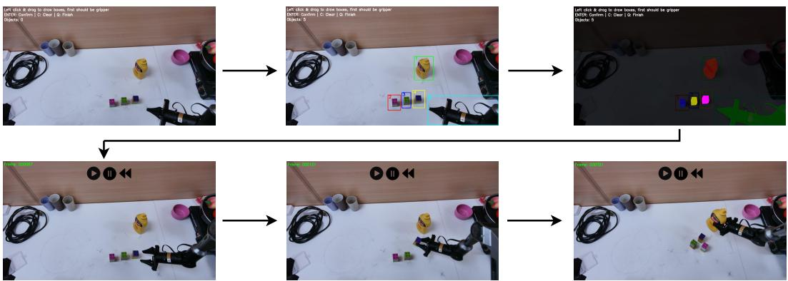

# 1. 论文基本信息

## 1.1. 标题
**R2RGEN: Real-to-Real 3D Data Generation for Spatially Generalized Manipulation**

*   **中文直译：** R2RGEN：用于空间泛化操作的真实到真实三维数据生成
*   **标题解析：**
    *   `R2RGEN` 是 “Real-to-Real Generation” 的缩写，意为“从真实到真实的生成”。这精准地概括了方法的核心特点：它不依赖于虚拟仿真环境，而是直接从真实的传感器数据（点云）出发，通过增强和变换，生成新的、同样符合真实世界物理规律的数据。
    *   `3D Data Generation` 指明了生成的数据类型是三维的，具体来说是点云。
    *   `Spatially Generalized Manipulation` 点出了该研究的核心目标：让机器人能够在物体、环境和自身空间位置发生变化时，依然能够完成操作任务，即具备<strong>空间泛化 (spatial generalization)</strong> 能力。

        综上，标题明确指出本文提出了一种名为 R2RGen 的新框架，旨在通过生成逼真的三维数据，来解决机器人操作中的空间泛化难题，并且这一过程是完全基于真实世界数据、无需仿真的。

## 1.2. 作者
*   **作者列表:** Xiuwei Xu, Angyuan Ma, Hankun Li, Bingyao Vu, Zheng Zhu, Jie Zhou, Jiwen Lu
*   **隶属机构:** 清华大学 (Tsinghua University), GigaAI
*   **背景分析:** 作者团队主要来自清华大学，这是人工智能和机器人学领域的顶尖研究机构之一。纪文学 (Jiwen Lu) 教授是该领域的知名学者，他的团队在计算机视觉和机器人学习方面有深厚的研究积累。这表明该研究具有坚实的学术背景和技术实力。

## 1.3. 发表期刊/会议
论文以预印本 (preprint) 形式发布在 arXiv 上。从其研究主题（机器人学习、数据生成、三维视觉）和引用格式来看，其目标投递方向很可能是机器人学或计算机视觉领域的顶级会议，例如：
*   **ICRA** (International Conference on Robotics and Automation)
*   **CoRL** (Conference on Robot Learning)
*   **CVPR** (Conference on Computer Vision and Pattern Recognition)

## 1.4. 发表年份
*   <strong>预印本发布时间 (UTC):</strong> 2025-10-09T17:55:44.000Z
*   **说明:** 这是一个未来的日期，很可能是提交系统中的占位符或元数据错误。论文中也引用了2025年的文献，这表明这是一篇非常前沿或仍在撰写中的工作。我们将基于当前内容进行分析，并视其为一篇最新的预印本。

## 1.5. 摘要
论文摘要清晰地阐述了研究的核心脉络。为了实现通用的机器人操作，<strong>空间泛化 (spatial generalization)</strong> 是最基本的能力，它要求机器人在不同的物体、环境和自身空间分布下都能稳健工作。然而，通过<strong>模仿学习 (imitation learning)</strong> 训练这种泛化策略需要收集大量覆盖不同空间配置的人类示教数据，成本高昂。现有工作尝试通过数据生成来解决此问题，但大多面临严重的<strong>模拟到真实迁移差距 (sim-to-real gap)</strong>，且局限于固定基座、固定相机视角等受限场景。

为此，本文提出了一个名为 **R2RGen** 的<strong>真实到真实 (real-to-real)</strong> 三维数据生成框架。该框架直接对<strong>点云观测-动作对 (pointcloud observation-action pairs)</strong> 进行增强，以生成新的真实世界数据。R2RGen 完全<strong>无需模拟器和渲染 (simulator- and rendering-free)</strong>，因此效率高且即插即用。具体而言，给定<strong>单个源示教 (single source demonstration)</strong>，论文引入了一种<strong>标注机制 (annotation mechanism)</strong> 对场景和轨迹进行细粒度解析。接着，提出了一种<strong>分组增强策略 (group-wise augmentation strategy)</strong> 来处理复杂的多物体组合和多样的任务约束。最后，还设计了<strong>相机感知处理 (camera-aware processing)</strong> 步骤，以确保生成数据的分布与真实三维传感器的分布对齐。实验证明，R2RGen 极大地提升了数据效率，并在移动操作等应用中展现出巨大的潜力和可扩展性。

## 1.6. 原文链接
*   **原文链接:** https://arxiv.org/abs/2510.08547
*   **PDF 链接:** https://arxiv.org/pdf/2510.08547v1.pdf
*   **发布状态:** 预印本 (Preprint)。

    ---

# 2. 整体概括

## 2.1. 研究背景与动机
*   **核心问题:** 训练一个能在各种空间布局下完成任务的机器人<strong>视觉运动策略 (visuomotor policy)</strong>，需要极其庞大的人类示教数据集。例如，对于“把苹果放到盘子里”这个任务，即使苹果、盘子和抓放技能都一样，仅仅因为物体和机器人位置不同，就需要成百上千次的重复示教。这种数据收集过程既繁琐又昂贵，极大地限制了机器人学习的规模和应用。

*   <strong>重要性与挑战 (Gap):</strong>
    1.  **数据效率瓶颈:** 模仿学习的泛化能力严重依赖于训练数据的多样性，尤其是在空间多样性方面。如何用更少的人力成本获得足够多样化的数据，是机器人领域的一个核心挑战。
    2.  **现有方案的局限性:**
        *   <strong>基于模拟器的方法 (Simulator-based):</strong> 如 `MimicGen`，虽然能自动生成多样的轨迹，但它们需要在真实机器人上重新执行（称为<strong>推演 (rollout)</strong>）以采集真实的视觉数据。这个过程耗时且需要人工监督，并未完全解决效率问题。更重要的是，模拟器与真实世界之间始终存在 <strong>“模拟到真实”</strong>的迁移差距 (sim-to-real gap)。
        *   <strong>基于3D数据的方法 (3D-based):</strong> 如 `DemoGen`，开创了直接在三维空间（点云）中生成数据的新方向，避免了模拟器。但它存在诸多致命缺陷：仅支持固定基座的机器人、最多处理两个物体、每个技能只能关联一个目标物体、且在进行大幅度数据增强时会导致生成的点云失真（<strong>视觉不匹配问题 (visual mismatch problem)</strong>）。这些限制使其难以应用于更复杂的移动操作任务。

*   **本文切入点:** 本文的创新思路是继承并<strong>“修补”</strong> `DemoGen` 的<strong>真实到真实 (real-to-real)</strong> 路线，旨在构建一个更通用、更鲁棒的3D数据生成框架。它直接面对并解决了 `DemoGen` 的所有核心痛点，致力于让“真实到真实”的数据生成范式从一个“有前景但受限的概念”变为一个“真正实用且可扩展的工具”。

## 2.2. 核心贡献/主要发现
*   **核心贡献:** 本文最主要的贡献是提出了 **R2RGen**，一个功能全面且实用的**真实到真实三维数据生成框架**。其关键创新点可总结为：
    1.  <strong>分组增强策略 (Group-wise Augmentation Strategy):</strong> 首次提出了一种能够处理复杂多物体交互的增强方法。通过将一个技能关联到一组物体（而非单个物体），并在增强时保持这组物体间的相对空间关系，成功解决了 `DemoGen` 无法处理如“搭桥”这类需要多个物体协同的任务的难题。
    2.  <strong>相机感知后处理 (Camera-aware 3D Post-processing):</strong> 设计了一套精巧的流程来修正增强后的点云，使其在视觉上（如遮挡、视角边界）与真实RGB-D相机采集的数据分布保持一致。这有效解决了 `DemoGen` 中因大幅度变换导致的视觉失真问题。
    3.  **对移动操作的支持:** 通过环境增强和相机感知处理，R2RGen能够生成不同机器人视角下的数据，使其天然支持移动机器人操作，极大地扩展了应用场景。
    4.  **完整的预处理流程:** 提出了一套包含场景解析、物体补全和轨迹分段的预处理流水线，使得框架能够处理原始的、未分割的场景数据，增强了实用性。

*   **主要发现:**
    1.  **极高的数据效率:** 实验证明，仅使用 **1个** 人类示教，通过 R2RGen 生成的数据训练出的策略，其性能与使用 **25个** 甚至 **40个** 人类示教训练出的策略相当或更优。这颠覆性地降低了机器人学习对数据的依赖。
    2.  **强大的可扩展性:** R2RGen 不仅在单次示教上表现出色，当提供更多源示教时（如2个、3个、5个），策略的性能还能持续提升，表明该框架能有效利用新增的人类知识。
    3.  **促进其他泛化能力:** 实验表明，R2RGen 提供的强大空间泛化能力可以作为基础，有效促进机器人对<strong>外观泛化 (appearance generalization)</strong> 的学习，进一步减少了在多变场景下的数据需求。

        ---

# 3. 预备知识与相关工作

## 3.1. 基础概念
*   <strong>模仿学习 (Imitation Learning):</strong> 一种机器学习方法，智能体 (agent)（如机器人）通过学习专家（如人类）提供的示教数据（即在特定状态下应执行何种动作）来掌握一项技能。其优点是无需手动设计复杂的奖励函数，但缺点是性能受限于示教数据的数量和质量，且容易出现分布偏移问题。
*   <strong>视觉运动策略 (Visuomotor Policy):</strong> 一种直接将视觉输入（如摄像头图像、点云）映射到机器人动作指令（如机械臂末端姿态、夹爪开合）的函数或模型。这种端到端的学习方式省去了传统机器人流程中复杂的中间状态估计步骤，是当前机器人学习的主流范式。
*   <strong>空间泛化 (Spatial Generalization):</strong> 指机器人的策略在训练场景之外的、新的空间配置下依然能够成功执行任务的能力。这些空间配置变化可能包括：物体的初始位置和姿态不同、目标位置不同、甚至机器人自身的起始位置和视角不同。这是衡量机器人策略鲁棒性的关键指标。
*   <strong>点云 (Point Cloud):</strong> 在三维空间中一系列点的集合，每个点通常包含其三维坐标 (x, y, z) 以及可能的颜色 (R, G, B) 或强度等信息。RGB-D相机（如Kinect、RealSense）可以通过深度图像生成点云，是机器人感知三维环境的常用数据格式。
*   <strong>SE(3) 姿态 (SE(3) Pose):</strong> SE(3) 是数学中的<strong>特殊欧几里得群 (Special Euclidean group)</strong>，用于描述三维空间中的刚体变换，即<strong>旋转 (Rotation)</strong> 和 <strong>平移 (Translation)</strong> 的组合。在机器人学中，一个物体的6自由度姿态（3个位置坐标 + 3个旋转角度）通常用一个 SE(3) 变换矩阵（一个4x4的矩阵）来表示。本文中，机械臂末端执行器的动作 $\mathbf{A}_t^{ee}$ 就是一个SE(3)姿态。

## 3.2. 前人工作
本文的工作建立在机器人模仿学习和数据生成两个领域的研究之上。

*   **模仿学习与数据规模:** 近年来，模仿学习在机器人操作领域取得了巨大成功，尤其是在引入了类似大语言模型 (LLM) 的大规模架构后，催生了所谓的<strong>视觉-语言-动作模型 (Vision-Language-Action models, VLA)</strong>。然而，这些模型都非常“数据饥渴”，其泛化能力与训练数据的规模和多样性直接相关。为了解决数据问题，研究者们开发了先进的数据采集系统（如`UMI`、VR遥操作）或研究数据缩放定律，但这些方法本质上仍依赖于更多的人力投入。

*   **数据生成方法:** 为了减少人力，自动数据生成成为一个热门方向。
    *   <strong>从零生成 (Generation from Scratch):</strong> 一些工作利用大语言模型 (LLM) 的常识或模拟器中的特权信息来从零开始生成任务规划和轨迹。但这类方法生成的数据质量和真实性难以保证。
    *   <strong>基于模拟器的增强 (Simulator-based Augmentation):</strong> 以 `MimicGen` 为代表的一系列工作，它们的核心思想是：
        1.  采集少量真实世界的人类示教。
        2.  在模拟器中对这些示教进行变化，例如改变物体位置、合成新的动作序列。
        3.  将这些新生成的轨迹在**真实机器人**上重新执行一遍，并记录下真实的传感器数据（图像、点云）和动作。
            这个流程虽然能生成高质量的真实数据，但最后一步“在真实机器人上执行”非常耗时，且可能需要人工干预失败情况，因此效率提升有限。
    *   <strong>基于3D观测的增强 (3D Observation-based Augmentation):</strong> 以 `DemoGen` 为代表，这是与本文最直接相关的工作。`DemoGen` 首次提出直接在三维观测（点云）和动作轨迹上进行数据增强，从而完全摆脱了模拟器和真实机器人执行环节。其流程大致是：
        1.  采集一次真实示教，获得点云和动作序列。
        2.  对场景中的物体点云施加一个随机变换（如平移、旋转）。
        3.  相应地调整动作轨迹以适应新的物体位置。
        4.  将变换后的点云和调整后的轨迹组合成一条新的、看似真实的示教数据。
            `DemoGen` 的想法极具开创性，但实现上存在诸多局限，这也是 R2RGen 着力解决的问题。

## 3.3. 技术演进
机器人数据生成的技术演进脉络清晰地体现了对**效率**和**真实性**的不断追求：
1.  <strong>阶段一：纯人工收集 (Pure Manual Collection):</strong> 成本最高，真实性最强，但规模和多样性受限。
2.  <strong>阶段二：模拟器生成 (Simulator Generation):</strong> 效率极高，多样性强，但存在<strong>模拟-真实差距 (sim-to-real gap)</strong>，模型在真实世界中表现不佳。
3.  <strong>阶段三：模拟器辅助的真实数据收集 (Simulator-aided Real Collection, e.g., `MimicGen`):</strong> 通过在真实机器人上<strong>推演 (rollout)</strong> 模拟器生成的轨迹来弥合差距。真实性得到保证，但牺牲了部分效率。
4.  <strong>阶段四：真实到真实的生成 (Real-to-Real Generation, e.g., `DemoGen`, `R2RGen`):</strong> 完全抛弃模拟器，直接在真实数据上进行变换和增强。这是目前最有前景的方向之一，因为它兼顾了高效率和高真实性。R2RGen 在 `DemoGen` 的基础上，解决了其在通用性、鲁棒性和真实感方面的关键缺陷，代表了这一方向的最新进展。

## 3.4. 差异化分析
R2RGen 相较于其直接前身 `DemoGen` 的核心区别和创新点如下表所示：

| 特性 | DemoGen (先前工作) | R2RGen (本文工作) | 创新点说明 |
| :--- | :--- | :--- | :--- |
| **机器人平台** | 仅限固定基座机械臂 | 支持**移动操作平台** | R2RGen能生成不同机器人视角的数据，泛化能力更强。 |
| **输入数据** | 经裁剪的环境点云 | **原始**传感器点云 | R2RGen更贴近实际应用，无需繁琐的预处理。 |
| **物体数量** | 最多支持2个物体 | 支持**任意数量**的物体 | 极大地扩展了可处理任务的复杂度。 |
| **任务约束** | 每个技能只能关联1个目标物体 | 支持**多物体**关联的复杂技能 | 通过**分组增强策略**，R2RGen能处理“搭桥”等需要维持物体间相对位置的任务。 |
| **视觉真实性** | 存在**视觉不匹配**问题，大幅度变换后点云失真 | 通过**相机感知后处理**解决 | R2RGen生成的点云在遮挡、边界等方面更符合真实传感器模型，数据质量更高。 |
| **物体模型** | 隐式假设物体点云是完整的 | 显式使用**物体补全**技术 | R2RGen通过补全物体点云，确保从新视角生成的数据是合理的，而非仅有可见部分。 |

---

# 4. 方法论
本节将详细拆解 R2RGen 框架的三个核心阶段：源示教预处理、分组数据增强、以及相机感知3D后处理。

下图（原文 Figure 3）直观地展示了 R2RGen 的整体流水线。

![Figure 3: The pipeline of R2RGen. Given processed source demonstration, we backtrack skills and apply group-wise augmentation to maintain the spatial relationships among target objects, where a fixed object set is maintained to judge whether the augmentation is applicable. Then motion planning is performed to generate trajectories that connect adjacent skills. After augmentation, we perform camera-aware processing to make the pointclouds follow distribution of RGB-D camera. The solid arrows indicate the processing flow, while the dashed arrows indicate the updating of fixed object set.](images/3.jpg)
*该图像是R2RGen的流程示意图。左侧展示了经过处理的源演示，经过回溯后，应用了基于组的增强策略以保持目标物体间的空间关系。图中展示了不同技能和运动的连接，最后进行相机感知处理以生成符合RGB-D相机分布的点云数据。*

## 4.1. 方法原理
R2RGen 的核心思想是：将一次复杂的人类示教分解为可编辑、可重组的基本单元（物体、环境、手臂、以及分段的动作），然后通过对这些单元进行有约束的随机变换，创造出成千上万条新的、逻辑正确且视觉逼真的示教数据。整个过程在三维空间中完成，不依赖任何物理仿真或图形渲染。

## 4.2. 核心方法详解 (逐层深入)
### 4.2.1. 阶段一：源示教预处理 (Source Demonstration Pre-processing)
在对示教数据进行增强之前，必须先对其进行结构化解析。给定一次人类示教 $D_s = \{o_1, a_1, ..., o_{H_s}, a_{H_s}\}$，预处理的目标是将其解析为以下几个部分：

1.  <strong>场景解析 (Scene Parsing):</strong> 将每一帧的原始点云观测 $P_t$ 分割为三个独立的组成部分：
    *   <strong>补全的物体点云 (Complete Object Pointclouds):</strong> $\{\widetilde{P}_t^1, ..., \widetilde{P}_t^K\}$
    *   <strong>补全的环境点云 (Complete Environment Pointcloud):</strong> $\widetilde{P}^e$
    *   <strong>机器人手臂点云 (Robot's Arm Pointcloud):</strong> $P_t^a$

        **挑战与解决方案:** 直接从单视角RGB-D相机获得的物体点云是**不完整**的（例如，只能看到杯子的正面）。如果直接旋转这个不完整的点云来模拟新视角，会产生非常不真实的结果。
    为了解决这个问题，论文采用了一个基于模板的三维物体追踪系统 (`FoundationPose`)。流程如下：
    *   首先，为场景中的每个物体（共 $K$ 个）扫描或提供一个完整的三维模型（模板）。
    *   在示教的第一帧，通过2D框选和分割（如使用`SAM`）来初始化每个物体的位置。
    *   运行 `FoundationPose`，它会追踪整个视频序列中每个物体的6-DoF姿态。
    *   利用追踪到的姿态，将物体的三维模板变换到每一帧的正确位置，从而得到**完整的**物体点云序列 $\{\widetilde{P}_t^i\}$。
    *   环境点云 $\widetilde{P}^e$ 则是在开始示教前，移走所有物体，单独采集一次场景得到的。
    *   最后，通过集合减法得到手臂点云：`P_t^a = P_t \setminus (\widetilde{P}^e \cup \bigcup_{i=1}^{K} \widetilde{P}_t^i)`。

2.  <strong>轨迹解析 (Trajectory Parsing):</strong> 将连续的动作轨迹 $\{a_t\}$ 分割为交错的<strong>技能 (skill)</strong> 和 <strong>运动 (motion)</strong> 片段。
    *   <strong>技能 (Skill):</strong> 指机器人与物体发生交互的关键动作片段，如抓取、放置、开瓶盖等。这些片段信息量大，但通常较短。
    *   <strong>运动 (Motion):</strong> 指机器人在自由空间中移动的片段，如从一个地方移动到另一个地方。这些片段通常可以由运动规划器生成。

        论文设计了一个轻量级标注界面（如下图，原文 Figure 8），标注员只需观看示教视频，标记出每个“技能”片段的起止帧，并指定与该技能相关的<strong>目标物体 (target objects)</strong> 和<strong>手中物体 (in-hand object)</strong>。这为后续的“分组增强”提供了关键信息。

        
        *该图像是一个注释用户界面示意图，展示了用户如何在第一帧中对相关对象进行分割，然后通过点击播放、暂停或回退按钮来捕捉技能/动作的关键帧。*

下图（原文 Figure 2）展示了预处理完成后的结果。

*该图像是示意图，展示了预处理结果。3D场景被解析为完整的物体、环境和机器手臂，轨迹被分解为交错的运动和技能段落。*

### 4.2.2. 阶段二：分组数据增强 (Group-wise Data Augmentation)
这是 R2RGen 的核心创新。它解决了 `DemoGen` 只能处理简单单目标任务的局限性。

**问题:** 在复杂任务中（如用两块积木当桥墩，一块长板当桥面来搭桥），物体之间存在必须维持的空间关系。如果像 `DemoGen` 那样独立地随机移动每个物体，桥墩之间的距离就会改变，导致后续的“放桥面”技能无法成功。

<strong>解决方案：分组回溯增强 (Group-wise Backtracking Augmentation)</strong>
该算法以<strong>回溯 (backtracking)</strong> 的方式，从最后一个技能开始，逆序处理到第一个技能。

1.  **初始化:** 设技能总数为 $n$。从最后一个技能 `skill-n` 开始处理。定义一个<strong>固定物体集 (fixed object set)</strong> $\overline{O}_n$，初始为空集 $\overline{O}_n = \emptyset$。

2.  **分组与决策:** 对于当前处理的技能 `skill-i`（从 $i=n$ 递减到 1），定义其<strong>物体组 (object group)</strong> $O_i = O_i^{tar} \cup O_i^{in\_hand}$，即所有与该技能相关的目标物体和手中物体。
    *   **判断是否可增强:** 检查该组是否与当前的固定集有交集，即 $O_i \cap \overline{O}_i \stackrel{?}{=} \emptyset$。
    *   **如果无交集:** 说明该组内的物体在此刻是“自由的”，可以对它们进行增强。此时，随机采样一个变换矩阵 $\mathbf{T}_i \in \mathbb{R}^{4 \times 4}$（例如，在XY平面上平移和绕Z轴旋转），并将此变换应用到组内所有物体以及相应的技能轨迹上。
    *   **如果有交集:** 说明该组中至少有一个物体的位置已经被后续的某个技能“固定”了，为了维持任务的因果逻辑，不能再移动它。因此，不对该组进行任何增强。

3.  **固定集更新:** 在处理完 `skill-i` 后，需要更新用于处理前一个技能 `skill-(i-1)` 的固定集。更新规则如下：
    $$
    \overline{O}_{i-1} = (\overline{O}_i \cup O_i^{tar}) \setminus O_i^{hand}
    $$
    **公式解释:**
    *   $\overline{O}_i \cup O_i^{tar}$: 当前技能的目标物体 ($O_i^{tar}$) 被加入到固定集中。这意味着，在执行 `skill-i` 之前的任何时刻，这些目标物体的位置都不能再改变了，因为它们是 `skill-i` 成功的前提。
    *   $\setminus O_i^{hand}$: 从固定集中移除当前技能的手中物体 ($O_i^{hand}$)。这是因为，在 `skill-i` 发生之前，这个物体正被手抓着，它的位置是自由的，不应被 `skill-i` 的目标位置所束缚。这个“释放”操作是维持逻辑正确的关键。

4.  **技能与运动轨迹生成:**
    *   <strong>技能增强 (Skill Augmentation):</strong> 对于被增强的技能 `skill-i`，其所有动作的末端执行器姿态都应用相同的变换 $\mathbf{T}_i$：
        $$
        \hat{\mathbf{A}}_t^{ee} = \mathbf{A}_t^{ee} \cdot \mathbf{T}_i, \quad \forall t \in [\text{start}_i, \text{end}_i]
        $$
    *   <strong>运动增强 (Motion Augmentation):</strong> 在所有技能的位置确定后，它们之间的“运动”片段通过运动规划器重新生成，以连接相邻的两个技能。例如，`motion-i` 的轨迹由一个运动规划器生成，起点是 `skill-(i-1)` 增强后的终点，终点是 `skill-i` 增强后的起点。
        $$
        \hat{\mathbf{A}}_{t_1:t_2}^{ee} = \mathrm{MotionPlan}(\hat{\mathbf{A}}_{\text{end}_{i-1}}, \hat{\mathbf{A}}_{\text{start}_i})
        $$

5.  <strong>环境增强 (Environment Augmentation):</strong> 最后，对整个环境点云 $\widetilde{P}^e$ 应用一个随机变换 $\mathbf{T}_e$，以模拟机器人从不同位置和视角进行观察。

### 4.2.3. 阶段三：相机感知 3D 后处理 (Camera-aware 3D Post-processing)
经过增强后，合成的场景点云 $\hat{P}_t$ 是所有物体和环境的“完美”完整点云的集合。这与真实RGB-D相机在单一固定视角下采集到的、有遮挡、有视野边界的**不完整**点云分布有很大差异。直接用这种完美数据训练，会导致策略在真实世界中表现不佳。

为此，论文设计了相机感知的后处理流程，将完美点云“退化”成真实点云。其核心公式如下：
$$
\hat{P}_t^{adjust} = \mathcal{P}^{-1}(\text{Fill}(\text{z-buffer}(\text{Crop}(\{ (u_i, v_i, d_i) \})))), \quad \text{where } \{ (u_i, v_i, d_i) \} = \mathcal{P}(\hat{P}_t)
$$
**流程详解:**
1.  <strong>投影 (Projection) $\mathcal{P}$:</strong> 使用相机内参，将合成的三维点云 $\hat{P}_t$ 投影到二维图像平面上，得到一系列带深度值的像素点 $\{(u_i, v_i, d_i)\}$。
2.  <strong>裁剪 (Crop):</strong> 移除所有投影后超出图像边界（如宽度 $W$ 和高度 $H$）的像素点。这模拟了相机的有限视场。
3.  <strong>Z-缓冲 (z-buffer):</strong> 模拟遮挡。如果多个三维点投影到同一个像素位置 `(u, v)`，只保留深度值 $d$ 最小的那个点，其余被遮挡的点被丢弃。论文还提出了一种更鲁棒的 `patch-wise` z-buffer，即一个前景点可以遮挡其邻近一小块区域内的所有背景点。
4.  <strong>填充 (Fill):</strong> 由于环境点云被随机移动，图像的边缘可能会出现没有点投影的“黑边”。`Fill` 操作通过两种方式解决这个问题：<strong>缩小图像有效区域 (shrinking)</strong> 或 <strong>扩展环境点云 (expanding)</strong>，以确保整个视场都有数据。
5.  <strong>反投影 (Inverse Projection) $\mathcal{P}^{-1}$:</strong> 将经过上述处理后剩余的像素点，使用相机内参反投影回三维空间，得到最终的、符合真实相机模型的点云 $\hat{P}_t^{adjust}$。

    通过这套流程，R2RGen 生成的数据在视觉上与真实传感器数据高度一致，从而有效避免了视觉不匹配问题。

---

# 5. 实验设置

## 5.1. 数据集
本文没有使用公开的标准数据集，而是通过自己提出的 R2RGen 框架，基于少量的人类示教来生成训练数据。

*   **数据来源:** 1到5次人类遥操作示教。对于核心的<strong>单次示教学习 (one-shot imitation learning)</strong> 实验，每个任务仅使用**1次**人类示教。为了减少传感器噪声影响，作者将这次示教的动作序列重播了3次来采集不同的点云观测，这3条轨迹都被用作数据生成的源。
*   **任务设计:** 作者设计了8个具有代表性的真实世界操作任务，覆盖了从简单到复杂的各种场景，并包括了单臂和双臂操作。
    *   <strong>简单单臂任务 (2):</strong> `Open-Jar` (开罐子), `Place-Bottle` (放瓶子)
    *   <strong>复杂单臂任务 (4):</strong> `Pot-Food` (装盘), `Hang-Cup` (挂杯子), `Stack-Brick` (叠砖块), `Build-Bridge` (搭桥)
    *   <strong>双臂任务 (2):</strong> `Grasp-Box` (抓箱子), `Store-Item` (存放物品)
*   **任务可视化:** 下图（原文 Figure 4）展示了这些任务的起始和结束状态。

    
    *该图像是表格和示意图，展示了利用R2RGen框架在不同任务下（如Open-Jar、Place-Bottle等）的性能对比。表格中列出了不同源演示条件下的任务成功率，体现了R2RGen在数据效率上的优势。*

## 5.2. 评估指标
论文使用的主要评估指标是<strong>成功率 (Success Rate, SR)</strong>。

*   <strong>概念定义 (Conceptual Definition):</strong> 成功率是指在多次测试中，机器人能够完全并正确地完成预定任务的试验次数所占的百分比。它是评估机器人策略性能最直接、最常用的指标。一次试验是否“成功”通常由人工根据明确定义的任务完成标准来判断（例如，“瓶子是否被稳定地放在了底座上”）。

*   <strong>数学公式 (Mathematical Formula):</strong>
    $$
    \text{SR} = \frac{N_{\text{success}}}{N_{\text{total}}} \times 100\%
    $$

*   <strong>符号解释 (Symbol Explanation):</strong>
    *   $N_{\text{success}}$: 成功完成任务的试验次数。
    *   $N_{\text{total}}$: 进行的总试验次数。

## 5.3. 对比基线
为了验证 R2RGen 的有效性，论文设置了以下几组对比实验：

*   <strong>人类示教基线 (Human Demonstrations):</strong> 直接使用不同数量的人类示教数据（1次、25次、40次）来训练策略。这组实验的作用是建立一个“黄金标准”，衡量 R2RGen 生成的数据在多大程度上可以替代真实的人类劳动。
*   **DemoGen 基线:** 这是本文最直接的竞争对手，代表了先前最先进的真实到真实数据生成方法。由于 `DemoGen` 的局限性，它只在简单的单臂和双臂任务上进行了比较。
*   <strong>R2RGen (本文方法):</strong> 使用 R2RGen 从少量（主要是1次）人类示教中生成大量数据来训练策略。

    ---

# 6. 实验结果与分析

## 6.1. 核心结果分析
### 6.1.1. 单次示教模仿学习 (One-shot Imitation Learning)
这是验证 R2RGen 数据效率的核心实验。实验比较了仅用1次人类示教生成的 R2RGen 数据训练的策略，与 `DemoGen` 以及用1、25、40次人类示教训练的策略。

<strong>结果描述 (基于原文 Table 1 的文字描述):</strong>
*   **R2RGen vs. DemoGen:** 在所有可比较的任务上，R2RGen 始终显著优于 `DemoGen`。这主要归功于 R2RGen 通过场景解析和相机感知后处理，有效解决了在物体位置、旋转和机器人视角大幅变化下的视觉不匹配问题，从而生成了更高质量的数据。
*   **R2RGen vs. 人类示教:** 惊人的是，由 R2RGen（源于1次示教）训练的策略，其性能与使用 **25次** 人类示教训练的策略相当，在某些困难任务上甚至超过了使用 **40次** 人类示教训练的策略。
*   **结论:** 这个结果强有力地证明了 R2RGen 在提升数据效率和实现空间泛化方面的巨大优势。它表明，大量重复的人类示教工作（主要用于覆盖空间变化）可以被 R2RGen 的自动数据生成过程有效替代。

### 6.1.2. 性能-标注权衡 (Performance-Annotation Tradeoff)
此实验探究了 R2RGen 如何随着源示教数量的增加而扩展。

下图（原文 Figure 5）展示了使用1、2、3、5个源示教时，策略性能随生成数据量的变化情况。

**结果分析:**
1.  **性能饱和:** 对于固定数量的源示教，当生成的数据量达到一定程度后，策略性能的提升会逐渐饱和。作者将此归因于所用策略模型 (`iDP3`) 的容量有限。
2.  **源数据的重要性:** 使用更多的源示教（从1个增加到5个），策略性能的饱和点会更高。这表明 R2RGen 能够有效利用新增源示教中蕴含的更丰富的技能或行为信息，进一步提升策略的上限。

## 6.2. 数据呈现 (表格)
### 6.2.1. 消融实验 (Ablation Study)
为了验证 R2RGen 中各个设计模块的必要性，作者在 `Place-Bottle` 任务上进行了一系列消融实验。

**点云处理模块消融:**
以下是原文 Table 2 的结果：

<table>
<thead>
<tr>
<th>方法</th>
<th>成功率 (SR)</th>
</tr>
</thead>
<tbody>
<tr>
<td>移除物体点云补全 (Remove pointcloud completion)</td>
<td>12.5%</td>
</tr>
<tr>
<td>移除环境点云 (Remove environment pointcloud)</td>
<td>18.8%</td>
</tr>
<tr>
<td>移除环境增强 (Remove environment augmentation)</td>
<td>28.1%</td>
</tr>
<tr>
<td><b>R2RGen (完整版)</b></td>
<td><b>50.0%</b></td>
</tr>
</tbody>
</table>

**分析:**
*   移除**点云补全**后性能下降最严重，说明在进行大幅度空间变换时，使用不完整的物体点云会生成极其不真实的失真数据，严重损害策略学习。
*   移除**环境点云**或**环境增强**都会导致性能显著下降，这证明了模拟机器人视角变化对于学习空间泛化至关重要。

**相机感知后处理模块消融:**
以下是原文 Table 3 的结果：

<table>
<thead>
<tr>
<th>方法</th>
<th>成功率 (SR)</th>
</tr>
</thead>
<tbody>
<tr>
<td>移除裁剪操作 (Remove Crop operation)</td>
<td>34.4%</td>
</tr>
<tr>
<td>移除Z-缓冲操作 (Remove Z-buffer operation)</td>
<td>15.6%</td>
</tr>
<tr>
<td>移除填充操作 (Remove Fill operation)</td>
<td>28.1%</td>
</tr>
<tr>
<td><b>R2RGen (完整版)</b></td>
<td><b>50.0%</b></td>
</tr>
</tbody>
</table>

**分析:**
*   所有后处理操作都至关重要。其中，移除**Z-缓冲**（模拟遮挡）导致性能下降最多，表明让策略学会处理遮挡是成功的关键。
*   移除**裁剪**（模拟视野）和**填充**（处理边界）同样会损害性能，证明了生成数据与真实传感器视场对齐的必要性。

## 6.3. 扩展与应用分析
### 6.3.1. 外观泛化 (Appearance Generalization)
实验探究了 R2RGen 带来的空间泛化能力是否有助于更复杂的**外观泛化**（即适应不同外观的物体）。

下图（原文 Figure 7）展示了在 `Place-Bottle` 任务中，面对2种瓶子和2种底座（共4种外观组合）时的结果。

**结果分析:**
*   **人类示教:** 即便收集了40次人类示教（每种组合10次），策略的成功率也仅有 25%。这说明同时学习空间和外观泛化需要的数据量是巨大的。
*   **R2RGen:** 只需收集4次人类示教（每种组合1次），然后用 R2RGen 生成数据，策略成功率就达到了 **43.8%**。
*   **结论:** R2RGen 通过解决数据需求中最“大头”的空间泛化问题，使得策略可以更专注于从少量示教中学习外观变化，从而以极高的数据效率应对更复杂的泛化挑战。

### 6.3.2. 移动操作 (Mobile Manipulation)
R2RGen 生成的数据能够覆盖不同的机器人视角，这使其非常适合移动操作任务。

下图（原文 Figure 11）展示了移动机器人导航到任务区域附近的不同停靠点后，由 R2RGen 训练的策略成功完成操作的场景。

**结果分析:**
*   实验展示，即使机器人的最终停靠点有超过5厘米的偏差，导致相机视角发生显著变化，策略依然能够稳健地完成任务。
*   这与需要精确相机位姿校准的 `DemoGen` 形成了鲜明对比，凸显了 R2RGen 在真实、非精确校准场景下的实用价值。

    ---

# 7. 总结与思考

## 7.1. 结论总结
本文提出并验证了一个名为 R2RGen 的创新性三维数据生成框架，旨在解决机器人模仿学习中对海量数据的依赖问题，特别是针对空间泛化能力。其核心贡献与意义在于：
1.  **范式创新:** 成功构建了一个**通用且实用**的<strong>真实到真实 (Real-to-Real)</strong> 数据生成流水线，完全摆脱了模拟器和真实机器人<strong>推演 (rollout)</strong> 的束缚，兼顾了数据生成的效率与真实性。
2.  **技术突破:** 通过**分组增强策略**，首次解决了在数据生成中维持复杂多物体空间约束的难题；通过**相机感知后处理**，有效解决了增强后点云的视觉失真问题。
3.  **巨大价值:** 实验证明，R2RGen 能以**单次人类示教**实现超越数十次示教的学习效果，极大地降低了机器人学习的门槛和成本。其对移动操作和外观泛化等更复杂场景的支持，展示了广阔的应用前景。

## 7.2. 局限性与未来工作
论文作者坦诚地指出了当前方法的两个主要局限性：
1.  **静态相机假设:** 在采集源示教时，要求相机（无论是固定在基座还是头上）在任务执行期间保持静止。这使得该方法无法直接应用于使用<strong>腕部相机 (wrist camera)</strong> 或在任务执行中**底盘持续移动**的场景。
2.  **刚性物体限制:** 预处理阶段依赖 `FoundationPose` 进行物体点云补全，而该工具目前仅支持<strong>刚性物体 (rigid objects)</strong>，且需要预先提供物体的三维模型。对于**非刚性或可形变物体**（如布料、电线），目前的处理方式（使用 `SAM2` 追踪但不补全）存在局限，无法进行大幅度的空间增强。

    未来的工作可以围绕这些局限展开，例如：研究如何在动态相机视角下进行数据生成，或探索无需模板的、针对可形变物体的三维补全与增强技术。

## 7.3. 个人启发与批判
*   **启发:**
    1.  <strong>“数据炼金术”</strong>的威力: R2RGen 像一种“数据炼金术”，从少量“黄金”（高质量人类示教）中提炼出大量“白银”（高质量生成数据）。这启发我们，在数据驱动的AI领域，与其盲目追求数据量的堆砌，不如设计更精巧的方法来“压榨”每一份高质量数据的价值。
    2.  <strong>“逆向工程”</strong>的思维: “相机感知后处理”是一个非常精彩的设计。它没有试图去生成完美的数据，而是反其道而行之，将完美数据“退化”成有缺陷的真实数据。这种模拟传感器物理限制的“逆向工程”思维，对于连接理想模型与现实世界具有重要的借鉴意义。
    3.  **分而治之的优雅:** 将复杂的示教轨迹分解为信息密集的“技能”和可由规划器生成的“运动”，并将增强的重点放在“技能”上，是一种非常优雅的“分而治之”策略。

*   **批判性思考:**
    1.  **预处理的隐性成本:** 尽管论文声称标注过程很快（<60秒/条），但整个预处理流程（扫描物体模板、分割第一帧、标注技能）仍然存在一定的人工成本。对于一个拥有数百种物体的泛化场景，为每个物体创建模板将是一项繁重的工作。该框架的“即插即用”性在面对全新、无模型的物体时会受到挑战。
    2.  **运动规划的依赖性:** “运动”片段的质量完全依赖于外部的运动规划器。如果规划器生成的路径与人类示教的自然运动风格差异过大，或者在复杂避障场景中规划失败，生成数据的质量和多样性可能会受到影响。论文对此部分的讨论着墨不多。
    3.  **泛化边界的探索:** 尽管 R2RGen 在空间和外观泛化上表现出色，但它生成的数据仍然是在源示教的“语义邻域”内。它无法创造出源示教中完全不存在的新技能或新交互方式。例如，如果源示教是“把A放到B上”，它无法生成“把A插到B里”的数据。这定义了其作为一种“数据增强”而非“数据创造”方法的边界。