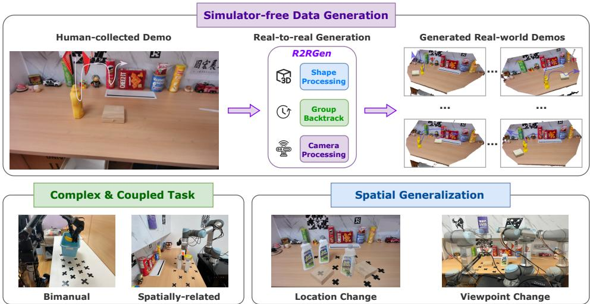
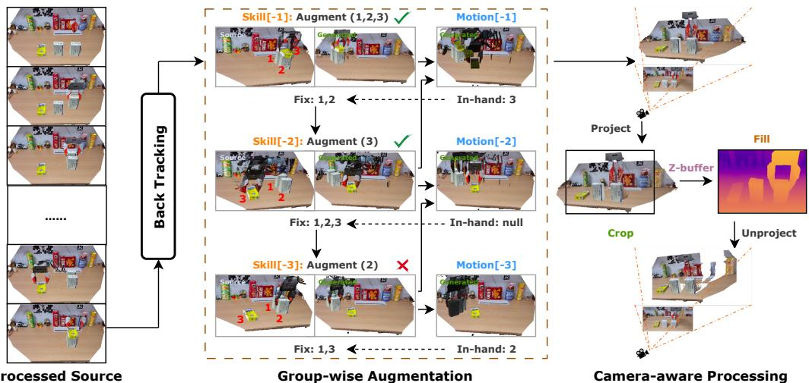
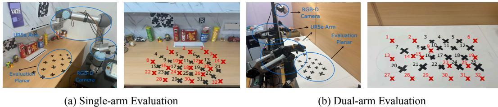

# R2RGEN: 实际到实际的三维数据生成用于空间广义操控

Xiuwei $\mathbf { X } \mathbf { u } ^ { 1 }$ ; Angyuan $\mathbf { M } \mathbf { a } ^ { \mathbf { 1 } }$ ; Hankun $\mathbf { L i } ^ { 1 }$ , Bingyao $\mathbf { V } \mathbf { u } ^ { 1 }$ , Zheng $\mathbf { Z } \mathbf { h } \mathbf { u } ^ { 2 }$ , Jie Zhou1, Jiwen $\mathbf { L u ^ { \mathrm { 1 \dagger } } }$ 1清华大学, GigaAI

# 摘要

为了实现通用机器人操作的目标，空间泛化是最基础的能力，它要求策略能够在不同的物体、环境和智能体自身的空间分布下稳健地工作。为此，需要收集大量的人类示范以覆盖不同的空间配置，从而通过模仿学习训练一个通用的视觉运动策略。先前的研究探索了一种有前景的方向，即利用数据生成从最少的源示范中获取丰富的空间多样数据。然而，大多数方法面临显著的仿真与现实之间的差距，并且通常限制于受限设置，例如固定基座场景和预定义相机视点。本文提出了一种真实到真实的三维数据生成框架（R2RGen），该框架直接增强点云观察-动作对以生成现实世界数据。R2RGen无需模拟器和渲染，因此高效且插件式使用。具体而言，给定一个源示范，我们引入了一种注释机制以对场景和轨迹进行精细解析。提出了一种组级增强策略，以处理复杂的多物体组合和多样的任务约束。我们进一步呈现了相机感知处理，以使生成数据的分布与现实世界的三维传感器对齐。通过广泛实验，实证表明R2RGen显著提高了数据效率，并展示了在移动操作方面的强大潜力。网站。

# 1 引言

在最近几年，基于视觉运动策略的机器人操作 Chi et al. (2023); Zhao et al. (2023); Fu et al. (2024) 取得了重大进展，但在模仿学习过程中对大量人工收集数据的依赖成为了应用和进一步扩展的主要瓶颈 Lin et al. (2024)。与大多数以固定桌面手臂为重点的先前研究不同，本文研究了涉及移动操纵器的更一般的操作设置。由于移动底座可能处于任意位置，导致的视角变化进一步增加了该策略对大量训练数据的依赖 Tan et al. (2024)。

空间泛化构成了视觉运动策略学习中对数据需求的主要驱动因素。正如Garrett等人（2024）所指出的，控制难度并非在人类收集的轨迹中均匀分布。需要注意的是，一条轨迹可以分为两类片段：接触丰富的片段涉及机器人手臂与物体之间的互动，另一类片段仅表示机器人手臂在自由空间中的运动，我们通常称之为技能片段和运动片段。技能片段通常更具挑战性，而运动片段则常常可以通过运动规划有效处理。然而，尽管技能片段提供了更多信息，绝大多数的人类示范努力通常专注于教授运动行为。例如，在“将苹果放在盘子上”这样的任务中——即便是相同的苹果、盘子和捡放技能——可能需要数百次示范来覆盖不同物体的空间排列和机器人基座的位置，以学习一个通用策略。因此，空间泛化仍然是数据效率的一个根本瓶颈。

为了减少在确保空间推广方面的人力重复工作，MimicGen Jiang 等人（2024）及后续工作 Hoque 等人（2024）；Garrett 等人（2024）；Jiang 等人（2024）用自动演示生成替代了繁琐的重新定位和重新收集数据的过程。这些方法只需少量人类收集的数据，在此基础上增强物体配置，并应用变换和插值生成具有不同运动模式的多样轨迹。尽管在模拟中取得了令人满意的性能，但这些方法仍需要在机器人上进行推演以收集真实世界的观察-动作对，这需要花费更多时间，并依赖于人工监督。最近，DemoGen Xue 等人（2025）提出了一种基于三维的数据生成方法，该方法建立在点云输入策略 Ze 等人（2024b）之上。通过直接在三维域中操作，该方法增强物体点云，以合成多样的轨迹及其相应的视觉观察。此流程不依赖于模拟器和渲染，因此非常高效，避免了模拟到现实的差距。然而，DemoGen 存在若干关键限制，限制了其实际应用： (1) 它专注于固定基础设置，因此没有考虑视角变化； (2) 对输入数据施加了严格假设，环境的点云应当被裁剪，最多支持 2 个物体，每个技能必须仅涉及一个目标物体； (3) 它存在视觉不匹配问题，即较大的增强会导致不完整的点云观察。由于这些限制，DemoGen 并未完全实现实际的真实到真实的生成，且在处理移动操控和多样任务配置方面仍然有限。

  

Figure 1: R2RGen is a simulator-free data generation framework. Given one human-collected demonstration, R2RGen directly parses and edits both pointcloud observations and action trajectories in a shared 3D space. R2RGen achieves strong spatial generalization on diverse complex tasks.

在本文中，我们提出了 R2RGen，一个适用于移动机器人 Fu 等（2024）的真实到真实 3D 数据生成框架，能够处理原始点云观测，并支持任意数量的物体和交互模式。给定一个预先分割的源演示，以往的方法对每个物体分别应用空间变换。这种以物体为中心的范式仅能处理与单一目标物体相关的技能。为了解决这个问题，我们提出了基于组的数据增强，将每项技能与一组物体关联，而不是单个目标，以维持复杂技能所需的物体组合。它还利用回溯机制在不干扰每个操作因果顺序的情况下增强 3D 观测。此外，由于来自 3D 传感器（例如 RGB-D 相机）的点云是不完整的，大幅度变换（特别是旋转）会使增强后的 3D 观测变得不合理。例如，应当被观察的点缺失，而应当被遮挡的点存在。为此，我们进一步提出了基于相机的 3D 后处理，以确保增强后的 3D 观测遵循 3D 传感器的分布。通过广泛的真实世界评估，我们展示了 R2RGen 仅用一个人类演示进行训练，便超过了使用 $2 5 \times$ 更多人类收集数据训练的策略。此外，R2RGen 具有强大的可扩展性，随着额外演示表现出良好的泛化能力，并在移动操作等应用中展现出良好的潜力。

# 2 相关工作

针对机器人操作的模仿学习：随着机器人数据收集系统和模型架构的发展，使用模仿学习来训练视觉运动策略。

(2023); Chi et al. (2023); Prasad et al. (2024); Wang et al. (2024a;b); Ze et al. (2024b;a) 开发的端到端方法能够从视觉观察中预测动作，成为从人类示范中学习灵巧操作技能的一种有前景的方法。受到大语言模型（LLM）和视觉语言模型（VLM）成功的启发，最近有多个研究探讨扩大模型规模和数据量，以训练具有模仿学习的通用机器人策略。一种有前景的训练此类通用模型的方法是视觉-语言-动作模型（VLA） Brohan et al. (2023); Kim et al. (2024b); Black et al. (2024); Cheang et al. (2024); Zhang et al. (2024); Cheng et al. (2024a); Li et al. (2024)，该模型在互联网规模数据上微调预训练的VLM以实现机器人控制。尽管具有灵活性，模仿学习方法由于缺乏技能先验而数据密集。事实上，为了实现强大的泛化能力，视觉-运动策略需要大量的数据进行训练/微调。由于最大的赋能数据集 O'Neill et al. (2024); Khazatsky et al. (2024) 仍然远小于视觉和语言领域的对应数据集 Deng et al. (2009); Schuhmann et al. (2022)，当前研究通过先进的数据收集系统，如UMI Chi et al. (2024); Ha et al. (2024) 和虚拟现实 Cheng et al. (2024b); Ding et al. (2024)，或在数据扩展 Zhao et al. (2024); Lin et al. (2024); Zha et al. (2025) 和数据选择 Hejna et al. (2024); Zhang et al. (2025) 技术上的实证研究来解决这一问题。

视觉运动策略的数据生成：为了用更少的人力训练通用的操作视觉运动策略，近几年自动数据生成受到了更多关注。Hua等人（2024年）；Wang等人（2023a;b）；Katara等人（2024年）的一些研究利用了大型语言模型（LLM）/视觉语言模型（VLM）的通识知识和来自模拟器的特权信息，用于零样本任务和运动规划。为了提高数据质量，一些研究通过人类演示视频生成机器人数据（Duan等人，2023年；Lepert等人，2025年；Yu等人，2025年），充分利用人类的结构化技能原语来获取合理的数据。然而，这些方法仍然依赖视觉基础模型（Kim等人，2024a；Kerr等人，2024年）来估计和跟踪手部和物体/部分的姿势，这可能不够准确。与机器人无关的机器人数据生成不同，MimicGen（Mandlekar等人，2023年）及其后续研究（Hoque等人，2024年；Garrett等人，2024年；Jiang等人，2024年）通过在模拟器中合成不同的执行计划，扩展了通过遥操作获取的现实世界演示。这些方法在仿真中表现良好，但在机器人上执行的实际观测-动作对的生成上耗时较长。最近，DemoGen（Xue等人，2025年）提出对现实世界的3D视觉输入以及轨迹进行增强。通过使用3D策略，DemoGen直接将增强后的3D点云作为输入，从而实现无模拟器和渲染。这种真实到真实的生成范式高效且即插即用，无需模拟器设置，但目前DemoGen在强输入假设和视觉不匹配问题上遇到困难，这严重阻碍了其应用。

# 3 方法论

# 3.1 问题陈述

视觉运动策略学习：机器人操控任务可以建模为部分可观察马尔可夫决策过程（POMDP），其中视觉运动策略 $\pi : \mathcal { O } \mapsto \mathcal { A }$ 定义了一个函数，该函数将当前的 RGB-D 观测 $o _ { t } \in \mathcal { O }$ 映射到机器人的动作 $a _ { t } \in { \mathcal { A } }$。$o _ { t } = ( I _ { t } , P _ { t } )$，其中 $I _ { t }$ 是 RGB 观测，$P _ { t }$ 是从深度观测和相机内参提取的相机坐标系中的点云。为了训练这个策略，需要收集大量的演示数据集 $\mathcal { D } = \{ o _ { 1 } ^ { i } , a _ { 1 } ^ { i } , . . . , o _ { H _ { i } } ^ { i } , a _ { H _ { i } } ^ { i } \} _ { i = 1 } ^ { N }$。为了减少人力劳动，我们旨在通过生成空间多样性数据 $\mathcal { D } ^ { \prime }$，仅依赖于一个人类收集的示例源演示 $\mathit { D } _ { s } \in \mathcal { D }$ 来提高数据效率。形式化表示为：

$$
\mathcal { D } ^ { \prime } = \{ D _ { s } , D _ { g } ^ { 1 } , D _ { g } ^ { 2 } , . . . , D _ { g } ^ { N } \} , \{ D _ { g } ^ { i } \} _ { i = 1 } ^ { N } = \mathrm { R 2 R G e n } ( D _ { s } )
$$

预计我们可以仅从 $\mathcal { D } ^ { \prime }$ 训练一个空间泛化的视觉运动策略。作为一个真实到真实的框架，我们直接扩展三维观察和动作轨迹，以生成多样的观察-动作对。因此，$\pi$ 应该是一个直接以点云作为视觉输入的三维策略。我们选择 iDP3 $\mathrm { Z e }$ 等（2024a）作为我们的策略，该策略使用自我中心化的点云 $P _ { t }$，无需相机位置要求。假设：我们做出以下假设：（1）视觉运动策略仅预测机器人手臂的动作。尽管我们支持不同基座位置的操作，但在每个单独任务执行过程中，移动基座保持固定。（2）视觉观察是通过 RGB-D 相机捕获的，该相机在任务执行过程中应与基座固定在一起。（3）与 Mandlekar 等（2023）相似，演示中的动作可以视为连续的序列 $a _ { t } = ( \mathbf { A } _ { t } ^ { e e } , a _ { t } ^ { g r i p } )$，其中 $\mathbf { A } _ { t } ^ { e e }$ 是 SE(3) 工具末端执行器位姿。我们将 $\mathbf { A } _ { t } ^ { e e }$ 的坐标系与相机坐标系对齐，以保持一致的表示。

# 3.2 源演示预处理

给定源演示 $D _ { s } = \{ o _ { 1 } , a _ { 1 } , . . . , o _ { H _ { s } } , a _ { H _ { s } } \}$，我们需要将 3D 观测 $\{ P _ { t } \}$ 完全解析为可编辑的对象组成，并将动作轨迹 $\left\{ a _ { t } \right\}$ 解析为运动和技能段，以便于进一步的数据生成。正式地，这一预处理阶段的目标是：（1）场景解析。假设 $D _ { s }$ 的任务涉及 $K$ 个相关对象。因此，对于每个时间戳 $t$，$o _ { t }$ 应被划分为 $K$ 个对象点云 $\{ P _ { t } ^ { 1 } , . . . , P _ { t } ^ { K } \}$、一个环境点云 $P _ { t } ^ { e }$ 和机器人手臂的点云 $P _ { t } ^ { a }$。（2）轨迹解析。同以前对运动和技能的定义相同，$\left\{ { { a } _ { t } } \right\}$ 应划分为交错的运动/技能段序列 $\{ a _ { 1 } , . . . , a _ { m _ { 1 } } \}$（运动-1），$\{ a _ { m _ { 1 } + 1 } , . . . , a _ { s _ { 1 } } \}$（技能-1），$\{ a _ { s _ { 1 } + 1 } , . . . , a _ { m _ { 2 } } \}$（运动-2），$\{ a _ { m _ { 2 } + 1 } , . . . , a _ { s _ { 2 } } \}$（技能-2）等。与每个技能相关的对象也应为已知。

对于场景解析，我们可以对第一帧 $I_{1}$ 中的 $K$ 个物体进行分割，并在整个视频中进行跟踪。2D 掩膜可以投影到 3D 中以获得每个物体的点云。然而，仅仅对 $\{ P_{t} \}$ 中的每个物体进行分割是不够的，因为 RGBD 观测存在不完整性。例如，一个杯子的点云可能仅表示朝向相机的侧面，导致被遮挡的侧面未被观测到。因此，从相对于物体的新视角生成演示时，观测将是不完整的。为此，除了分割之外，我们进一步补全物体点云 $\widetilde{P}_{t}^{i} = \mathcal{C}(P_{t}^{i})$。我们采用基于模板的 3D 物体跟踪系统（Wen et al.，2024）来实现这一目标，该系统生成所有帧的完整物体点云 $\{\widetilde{P}_{t}^{1}, \ldots, \widetilde{P}_{t}^{K}\}_{t=1}^{H_{s}}$，给定 $I_{1}$ 中的 $K$ 个物体质量。我们还需要获取完整的环境点云 $\widetilde{P}^{e}$。由于相机在任务执行过程中是固定的，$\widetilde{P}^{e}$ 在时间上是静态的。因此，我们可以在收集 $D_{s}$ 之前去掉这 $K$ 个物体，并得到观测 $o_{0}$。然后简单地将 $\widetilde{P}^{e}$ 设置为 $P_{0}$。在得到完整的物体 $\{\widetilde{P}_{t}^{1}, \ldots, \widetilde{P}_{t}^{K}\}$ 和环境 $\widetilde{P}^{e}$ 之后，臂的点云 $P_{t}^{a}$ 可以通过 $P_{t}^{a} = P_{t} \setminus (\widetilde{P}^{e} \cup \widetilde{P}_{t}^{1} \cup \ldots \cup \widetilde{P}_{t}^{K})$ 获得。我们不会补全 $P_{t}^{a}$，因为 $P_{t}$ 在每一帧中被解析为完整物体、环境和机器臂的组合。

  

Figure 2: Pre-processing results. The 3D scene is parsed into complete objects, environment and robot's arm. The trajectory is parsed into interleaved motion and skill segments.

对于轨迹解析，我们引入了一种轻量级的标注系统。该接口播放RGB视频 $\big \{ \boldsymbol { I } _ { 1 } , . . . , \boldsymbol { \bar { I } } _ { H _ { s } } \big \}$，并要求标注者标记每个技能的起始帧和结束帧。两个技能段之间的中间轨迹被分类为运动段。除标注技能段外，标注者还需指定与每个技能相关的对象ID（范围为1到$K$）。具体而言，对于每个技能，同时提供目标对象ID和手中对象ID：手中对象是指在技能执行期间由抓取器持有的物品（如果有的话），而目标对象则表示抓取器与之互动的实体。ID可以为空、单个对象或多个对象，具体取决于任务结构。整个过程仅使用RGB视频作为输入，并且每个演示的时间不超过60秒，从而使其高效且劳动强度低——尤其适合源演示极少的设置。图2展示了一次源演示的解析结果。关于对象解析和轨迹解析系统的更多细节请参见附录A.1。

  

Figure 3: The pipeline of R2RGen. Given processed source demonstration, we backtrack skills and apply group-wise augmentation to maintain the spatial relationships among target objects, where a fixed object set is maintained to judge whether the augmentation is applicable. Then motion planning is performed to generate trajectories that connect adjacent skills. After augmentation, we perform camera-aware processing to make the pointclouds follow distribution of RGB-D camera. The solid arrows indicate the processing flow, while the dashed arrows indicate the updating of fixed object set.

# 3.3 组内数据增强

为合成新的示范，我们随机增强物体和环境的位置与旋转，以获取新的场景配置，并生成相应的行动轨迹。先前基于点云的数据生成方法（Xue 等，2025）假设每个技能只包含一个目标物体，并仅基于该物体的变换来转换技能片段。然后，使用规划器生成运动片段，以将相邻技能连接成完整轨迹。然而，当一个技能涉及多个目标物体且这些物体的空间关系必须保持时，该方法会失败。例如，在图 3 所示的任务“搭建桥梁”中，放置桥面（物体-3）需要两个桥墩（物体-1 和物体-2）被放置在特定的相对距离。独立增强每个桥墩会破坏这一关系，阻碍最终技能的成功执行。为了支持任意的交互模式，我们提出了一种群体增强策略，在数据生成过程中保持多个物体之间的结构约束。

组内回溯：我们不是将技能建模为以对象为中心，而是将每个技能分配给一个包含注释目标和手中对象的对象组。组内的所有对象都经历相同的几何变换（即相同的平移和旋转）。增强操作采用回溯方式进行，以避免对象状态之间的因果冲突。$n$ b $\{ a _ { m _ { n } + 1 } , . . . , a _ { s _ { n } } \}$ 表示 $O _ { n } = O _ { n } ^ { t a r } \cup O _ { n } ^ { \tilde { h } a n d }$ 是当前技能的目标对象和手中对象的 ID 集合，$\overline { { O } } _ { n } = \emptyset$ 是固定对象的 ID 集合（即不能进行增强的对象）。我们根据 ${ \overline { { O } } } _ { n } \cap O _ { n }$ 来决定是否增强当前组。如果交集为 $\mathcal { D }$，我们随机采样变换 $\mathbf { T } _ { n } \in \mathbf { \mathbb { R } } ^ { 4 \times 4 }$，在组 $O _ { n }$ 上应用 XY 平面平移和 $\textsf { Z }$ 轴旋转（XY 平面通过桌面点云拟合得出）。否则，该组在当前时刻保持固定，无法进行增强。在应用组变换后，固定对象集合更新如下：

$$
\overline { { { O } } } _ { n - 1 } = ( \overline { { { O } } } _ { n } \cup O _ { n } ^ { t a r } ) \setminus O _ { n } ^ { h a n d }
$$

当前组被添加到固定集合中以维持空间关系，而手中的物体则被释放，因为其在抓取前的状态与当前技能的约束无关。然后我们继续进行技能-$(n - 1)$，并重复上述操作，直到所有技能被遍历。技能增强：对于技能-$i$，如果相应的组不是固定的，我们应用变换$\mathbf{T}_{i}$来增强末端执行器的姿态，同时保持夹具的状态：

$$
\hat { \mathbf { A } } _ { t } ^ { e e } = \mathbf { A } _ { t } ^ { e e } \cdot \mathbf { T } _ { i } , ~ \hat { a } _ { t } ^ { g r i p } = a _ { t } ^ { g r i p } , ~ \forall t \in [ m _ { i } + 1 , s _ { i } ]
$$

然后，物体的点云 $\widetilde { P } _ { t } ^ { k }$，其中 $k \in O _ { i }$，和手臂 $P _ { t } ^ { a }$ 以相同的方式通过 $\mathbf { T } _ { i }$ 进行变换。运动增强：对于运动 $i$，我们应用运动规划生成一个轨迹，该轨迹从技能 $( i - 1 )$ 的末尾开始，并在技能 $i$ 的开头结束：

$$
\hat { \mathbf { A } } _ { t _ { 1 } : t _ { 2 } } ^ { e e } = \mathrm { M o t ~ i ~ o n P l ~ a n } ( \hat { \mathbf { A } } _ { s _ { i - 1 } } , \hat { \mathbf { A } } _ { m _ { i } + 1 } ) , \hat { a } _ { t _ { 1 } : t _ { 2 } } ^ { g r i p } = a _ { t _ { 1 } : t _ { 2 } } ^ { g r i p } , t _ { 1 } = s _ { i - 1 } + 1 , t _ { 2 } = m _ { i } 
$$

然后手中物体的点云 $\widetilde { P } _ { t } ^ { k }$ $( k \in O _ { i } ^ { h a n d } )$ 和手臂的点云 $P _ { t } ^ { a }$ 通过相对姿态变换 $( \mathbf { A } _ { t } ^ { e e } ) ^ { - 1 } \cdot \hat { \mathbf { A } } _ { t } ^ { e e }$ 进行变换。最后，我们对环境 ${ \widetilde P } ^ { e }$ 应用随机变换 $\mathbf { T } _ { e }$，以模拟机器人视角的变化，包括所有帧。增广管道的分组算法图详见附录 A.2。对于双手操作，我们额外引入约束，以确保生成的演示可执行。有关双手任务的更多细节，请参见附录 A.3。

# 3.4 相机感知的 3D 后处理

在经过生成演示 $\mathcal { D } ^ { \prime }$ 的训练后，3D 策略在真实世界中以 RGB-D 相机作为输入传感器进行部署。因此，$\mathcal { D } ^ { \prime }$ 中的点云观察应与原始的 RGB-D 观察相似。目前主要存在两个差异：（1）生成的点云是过完备的。对于给定的 RGB-D 相机视角，从深度图像转换而来的原始点云仅在此视角下是完整的。（2）由于环境的增强，生成的点云的空间分布发生了偏移。为了解决这个问题，我们提出了一种基于相机的 3D 后处理方法，以调整生成点云观察 $\{ \hat { P } _ { t } \}$ 的分布：

$$
\hat { P } _ { t } ^ { a d j u s t } = \mathcal { P } ^ { - 1 } ( \mathrm { F i } . 1 1 ( \mathrm { z } - \mathrm { b u f f e r } ( \mathsf { C r o p } ( \{ ( u _ { i } , v _ { i } , d _ { i } ) \} ) ) ) ) , \{ ( u _ { i } , v _ { i } , d _ { i } ) \} = \mathcal { P } ( \hat { P } _ { t } )
$$

其中 $\mathcal{P}$ 将三维点云投影到图像平面，使用相机内参。裁剪操作去除那些在图像边界外的像素 $\{ ( u _ { i } , v _ { i } , d _ { i } ) | u _ { i } < 0$ 或 $u _ { i } \geq W$ 或 $v _ { i } < 0$ 或 $v _ { i } \geq H \}$。Z缓冲处理重叠的像素，仅保留深度值最小的像素，从而去除当前视点下的隐藏点。在实践中，我们注意到点云的密度可能并不高，导致前表面无法隐藏所有后面的点。因此，我们提出了一种基于区域的 $\textsf{Z}$-缓冲操作，其中每个深度值较小的点可以在图像平面上隐藏 $r$ 半径邻域内更深的点。由于环境是增强的，靠近图像边界的像素可能是空的（即，没有点投影到这些像素上）。因此，我们通过缩小图像尺寸或扩展环境点云来填充空像素，具体细节将在第 4.4 节中讨论。最后，在图像平面后处理完毕后，我们将像素重新投影到相机坐标系中。调整后的点云 $\hat{P}_{t}^{adj}$ 能够很好地维护 RGB 分布，并直接输入到我们的 3D 策略进行训练。

# 4 实验

在本节中，我们通过广泛的真实世界实验评估R2RGen，展示其在一次性模仿学习中的有效性，以及如何随着更多源示例的增加而扩展。我们还进行全面的消融研究，以探索最佳设计选择。此外，我们表明R2RGen可以扩展以促进外观泛化和移动操作。

# 4.1 实验设置

策略。我们选择 iDP3 Ze 等人（2024a）作为视觉运动策略，它以自我中心的点云（即摄像机坐标系中的点云）和自我感知状态作为输入，不要求摄像机的位姿和标定。关于在每个任务上训练 iDP3 的详细信息，请参见附录 A.4。硬件。我们使用两种机器人平台：单臂和双臂。单臂平台由一个7自由度的 UR5 臂、一个平行爪夹持器和一个移动底座组成。一台 ORBBEC femto bolt 相机通过安装支架固定在移动底座上，提供 RGB-D 观测。双臂平台遵循 Fu 等人（2024）的 MobileAloha 架构，采用两个集成了 HexFellow 全向移动底座的 AgileX PiPER 臂。一个头戴式 RGB-D 相机提供自我中心的感知。有关更多详细信息，请参见附录 B。

  

Figure 4: Visualization of our real-world tasks. We show the start and end moments of each task.

任务与评估。我们设计了8个具有代表性的评估任务，包括两个简单任务（打开罐子、放置瓶子）、四个复杂任务（装食物、挂杯子、堆砖、搭桥）和两个双手任务（抓取箱子、存放物品），如图4所示。我们与DemoGen（Xue等，2025）比较了这两个简单的单臂任务和两个双手任务。对于涉及对象之间复杂空间关系的其他任务，DemoGen未能生成合理的数据。我们在不同对象的位置和旋转以及机器人的视角上评估了不同的方法，包括一部分训练期间未遇到的分布外样本。有关详细的任务定义和评估协议，请参见附录C。

# 4.2 结果：一次性模仿学习

对于单次模仿学习，我们仅收集一个人类示范以便R2RGen生成新数据。与DemoGen类似，我们将收集到的人类示范重放两次，以获取多样化的点云观测，从而显著减少传感器噪声的影响。这三条点云轨迹均用于3D数据生成。然后，我们将基于纯生成数据训练的策略与基于不同数量人类示范训练的策略进行比较，如表1所示。当仅用一个人类示范进行训练时，该策略仅在示范的姿态上成功，却无法实现泛化。DemoGen和R2RGen均提高了其性能。结果表明，R2RGen在所有任务中始终优于DemoGen，尽管DemoGen裁剪了背景的点云而我们并未这样做。这一优势主要源于我们场景解析和相机感知处理技术，使得在物体位置/旋转和机器人视点大幅变化的情况下生成高质量数据成为可能。相较之下，DemoGen在这样的挑战性评估中遭遇了显著的视觉不匹配。R2RGen的性能可与基于25个示范训练的策略媲美，甚至在一些困难任务上超越了40个示范的表现，从而验证了其在空间泛化方面的有效性。

# 4.3 结果：性能与标注之间的权衡

我们进一步研究了 R2RGen 在更多源示范下的扩展性。对于每个任务，我们分别运行 R2RGen，生成 1、2、3 和 5 个人类示范的数据。然后，我们报告在不同源示范数量下，合成数据增加所带来的策略性能提升。如图 5 所示，随着生成示范数量的增加，成功率逐渐饱和——这一趋势在人工收集的数据中也有所观察。这种现象是由于 iDP3 策略的容量有限，它使用了轻量级的 PointNet 编码器。要进一步超越这一平台，需要具有更大 3D 主干网络的策略。我们还注意到，更多的源示范会导致更高的饱和性能，证明了 R2RGen 有效利用额外数据以改善结果的能力。

  

Figure 5: Effects of the number of generated demonstrations and source demonstrations on the final performance of R2RGen.

Table 2: Effects of the pointcloud processing.   

<table><tr><td>Method</td><td>SR</td></tr><tr><td>Remove pointcloud completion</td><td>12.5</td></tr><tr><td>Remove environment pointcloud</td><td>18.8</td></tr><tr><td>Remove environment augmentation</td><td>28.1</td></tr><tr><td>R2RGen</td><td>50.0</td></tr></table>

Table 3: Effects of camera-aware processing.   

<table><tr><td>Method</td><td>SR</td></tr><tr><td>Remove Crop operation</td><td>34.4</td></tr><tr><td>Remove Z-buf fer operation</td><td>15.6</td></tr><tr><td>Remove Fill operation</td><td>28.1</td></tr><tr><td>R2RGen</td><td>50.0</td></tr></table>

# 4.4 消融研究

我们进一步进行消融实验，以研究每个设计选择的影响。分析是在Place-Bottle任务上进行的。点云处理。我们首先研究物体和环境点云如何影响最终性能，如表2所示。我们注意到，在大空间增强下，移除点云补全将导致不现实的数据，而移除环境上的操作会降低策略对视角变化的鲁棒性。相机感知处理。然后我们通过逐一移除每个关键操作来消融相机感知处理。如表3所示，这些操作在确定最终性能中起着关键作用。对于填充操作，我们在图6中进一步比较了两种设计选择：通过缩小图像尺寸或扩展环境点云以填充黑色虚线轮廓（即RGB-D相机的有效深度区域）。如果采用缩小，则在部署使用R2RGen训练的策略时，我们将对原始RGB-D观测应用相同的缩小方法。从经验上看，这两种方法都能实现可比的性能；我们最终选择缩小，因为其操作简单且不需要额外的处理要求。

  

Figure 6: Two implementations of Fil1 operation, i.e., shrinking and expanding.

# 4.5 扩展与应用

扩展：外观泛化。除了空间泛化，机器人操作任务还涉及其他形式的泛化，如外观泛化（即，适应新颖的物体实例和环境）和任务泛化。在这些形式中，空间泛化是其他泛化能力的基本前提。由于本研究专注于单任务视觉运动策略学习，我们探讨了R2RGen所启用的空间泛化是否能进一步促进外观泛化。如图7所示，我们设计了一个更具挑战性的放置瓶子任务，包含四种不同的瓶底外观组合（2种瓶子类型 $\times$ 2种底座类型）。我们观察到，实现外观和空间泛化显著增加了数据需求。即使有40个人工示例（每个瓶底组合10个），策略的成功率仅达到 $25\%$。相比之下，使用R2RGen，仅需每个瓶底组合1个示例（共4个）即可实现 $43.8\%$ 的成功率，展示了其在处理综合泛化挑战方面的效率。

  

Figure 7: Extension on appearance generalization. The spatial generalization of R2RGen can serve as a foundation to achieve other kinds of generalization with much less data.

应用：移动操作。R2RGen 所实现的强大空间泛化能力也有助于解决具有挑战性的移动操作任务。通过对不同相机视角的泛化，我们将移动操作视为导航和固定基座操作的简单组合。在这里，我们采用 MoTo Wu 等（2025）的导航策略来接近目标物体，然后应用使用 R2RGen 训练的策略来完成任务。实验视频演示在我们的项目页面上展示。有关更多细节，请参见附录 D。

# 5 结论性备注

R2RGen 引入了一种真实到真实的 3D 数据生成框架，超越了以往基于点云的方法，如DemoGen（Xue 等，2025）。具体而言，它支持移动操控器、原始传感器输入、任意数量的物体和多样的交互模式，克服了现有方法的关键限制。仅需一个人类演示，我们的方法直接增强了 3D 观察以及动作轨迹，以生成大量的点云动作对，这些数据用于训练空间泛化的 3D 策略。整体流程经过精心设计，具备用户友好的预处理、分组增强和相机感知后处理，这确保了视觉观察的完整性，以及物体之间空间关系的保持。对多个现实世界任务的广泛实验验证了 R2RGen 的有效性。我们进一步扩展其在外观泛化和移动操控场景中的应用，展示了其强大的泛化能力和在广泛现实世界部署的潜力。潜在限制。目前，R2RGen 有两个主要限制。(1) 在任务执行期间，RGB-D 传感器应固定。因此，R2RGen 不能应用于使用腕部相机或移动基座收集的源演示。(2) 在源演示的预处理过程中，我们应用了基于模板的 3D 物体跟踪模型（Wen 等，2024），以获取所有帧的完整物体点云，这仅适用于刚性物体。对于非刚性物体，请参阅附录 A.1 以获取更多细节。

# 可重复性声明

为了支持可重复性，我们在主文和附录中详细描述了 R2RGen 框架，包括算法概述和实现细节。一个简单可运行的示例展示了核心数据生成过程，已在我们的匿名项目页面上提供：https://r2rgen.github.io。该演示允许用户在预定义场景中执行 R2RGen 的关键阶段，并与之互动调整超参数。由于完整流程的综合性质——涉及模板重构、数据标注、轨迹生成和真实机器人部署——完整代码仍在清理中。我们承诺将在论文接受后发布完整代码库（涵盖 R2RGen 方法及真实机器人部署）。

# REFERENCES

Kevin Black, Noah Brown, Danny Driess, Adnan Esmail, Michael Equi, Chelsea Finn, Niccolo Fusai, Lachy Groom, Karol Hausman, Brian Ichter, et al. $\pi _ { 0 }$ : A vision-language-action flow model for general robot control. arXiv preprint arXiv:2410.24164, 2024.   
Anthony Brohan, Noah Brown, Justice Carbajal, Yevgen Chebotar, Xi Chen, Krzysztof Choromanski, Tianli Ding, Danny Driess, Avinava Dubey, Chelsea Finn, et al. Rt-2: Vision-language-action models transfer web knowledge to robotic control. arXiv preprint arXiv:2307.15818, 2023.   
Chi-Lam Cheang, Guangzeng Chen, Ya Jing, Tao Kong, Hang Li, Yifeng Li, Yuxiao Liu, Hongtao Wu, Jiafeng Xu, Yichu Yang, et al. Gr-2: A generative video-language-action model with web-scale knowledge for robot manipulation. arXiv preprint arXiv:2410.06158, 2024.   
An-Chieh Cheng, Yandong Ji, Zhaojing Yang, Zaitian Gongye, Xueyan Zou, Jan Kautz, Erdem B1y1k, Hongxu Yin, Sifei Liu, and Xiaolong Wang. Navila: Legged robot vision-language-action model for navigation. arXiv preprint arXiv:2412.04453, 2024a.   
Xuxin Cheng, Jialong Li, Shiqi Yang, Ge Yang, and Xiaolong Wang. Open-television: Teleoperation with immersive active visual feedback. arXiv preprint arXiv:2407.01512, 2024b.   
Cheng Chi, Zhenjia Xu, Siyuan Feng, Eric Cousineau, Yilun Du, Benjamin Burchfiel, Russ Tedrake, and Shuran Song. Diffusion policy: Visuomotor policy learning via action diffusion. IJRR, 2023.   
Cheng Chi, Zhenjia Xu, Chuer Pan, Eric Cousineau, Benjamin Burchfiel, Siyuan Feng, Russ Tedrake, and Shuran Song. Universal manipulation interface: In-the-wild robot teaching without in-the-wild robots. arXiv preprint arXiv:2402.10329, 2024.   
Jia Deng, Wei Dong, Richard Socher, Li-Jia Li, Kai Li, and Li Fei-Fei. Imagenet: A large-scale hierarchical image database. In CVPR, pp. 248255. Ieee, 2009.   
Runyu Ding, Yuzhe Qin, Jiyue Zhu, Chengzhe Jia, Shiqi Yang, Ruihan Yang, Xiaojuan Qi, and Xiaolong Wang. Bunny-visionpro: Real-time bimanual dexterous teleoperation for imitation learning. arXiv preprint arXiv:2407.03162, 2024.   
Jiafei Duan, Yi Ru Wang, Mohit Shridhar, Dieter Fox, and Ranjay Krishna. Ar2-d2: Training a robot without a robot. arXiv preprint arXiv:2306.13818, 2023.   
Zipeng Fu, Tony Z Zhao, and Chelsea Finn. Mobile aloha: Learning bimanual mobile manipulation with low-cost whole-body teleoperation. arXiv preprint arXiv:2401.02117, 2024.   
Caelan Garrett, Ajay Mandlekar, Bowen Wen, and Dieter Fox. Skillmimicgen: Automated demonstration generation for efficient skill learning and deployment. arXiv preprint arXiv:2410.18907, 2024.   
Huy Ha, Yihuai Gao, Zipeng Fu, Jie Tan, and Shuran Song. Umi on legs: Making manipulation policies mobile with manipulation-centric whole-body controllers. arXiv preprint arXiv:2407.10353, 2024.   
Joey Hejna, Chethan Bhateja, Yichen Jiang, Karl Pertsch, and Dorsa Sadigh. Re-mix: Optimizing

data mixtures for large scale imitation learning. arXiv preprint arXiv:2408.14037, 2024.

Ryan Hoque, Ajay Mandlekar, Caelan Garrett, Ken Goldberg, and Dieter Fox. Intervengen: Inal   o . 28402846. IEEE, 2024.

Pu Hua, Minghuan Liu, Annabella Macaluso, Yunfeng Lin, Weinan Zhang, Huazhe Xu, and Lirui Wang. Gensim2: Scaling robot data generation with multi-modal and reasoning llms. arXiv preprint arXiv:2410.03645, 2024.

Zhenyu Jiang, Yuqi Xie, Kevin Lin, Zhenjia Xu, Weikang Wan, Ajay Mandlekar, Linxi Fan, and Yuke Zhu. Dexmimicgen: Automated data generation for bimanual dexterous manipulation via imitation learning. arXiv preprint arXiv:2410.24185, 2024.

Pushkal Katara, Zhou Xian, and Katerina Fragkiadaki. Gen2sim: Scaling up robot learning in simulation with generative models. In ICRA, pp. 66726679. IEEE, 2024.

Justin Kerr, Chung Min Kim, Mingxuan Wu, Brent Yi, Qianqian Wang, Ken Goldberg, and Angjoo Kanazawa. Robot see robot do: Imitating articulated object manipulation with monocular 4d reconstruction. arXiv preprint arXiv:2409.18121, 2024.

Alexander Khazatsky, Karl Pertsch, Suraj Nair, Ashwin Balakrishna, Sudeep Dasari, Siddharth Karamcheti, Soroush Nasiriany, Mohan Kumar Srirama, Lawrence Yunliang Chen, Kirsty Ellis, et al. Droid: A large-scale in-the-wild robot manipulation dataset. arXiv preprint arXiv:2403.12945, 2024.

Chung Min Kim, Mingxuan Wu, Justin Kerr, Ken Goldberg, Matthew Tancik, and Angjoo Kanazawa. Garfield: Group anything with radiance fields. In CVPR, pp. 2153021539, 2024a.

Moo Jin Kim, Karl Pertsch, Siddharth Karamcheti, Ted Xiao, Ashwin Balakrishna, Suraj Nair, Rafael Rafailov, Ethan Foster, Grace Lam, Pannag Sanketi, et al. Openvla: An open-source vision-language-action model. arXiv preprint arXiv:2406.09246, 2024b.

Alexander Kirillov, Eric Mintun, Nikhila Ravi, Hanzi Mao, Chloe Rolland, Laura Gustafson, Tete Xiao, Spencer Whitehead, Alexander CBerg, Wan-Yen Lo, et al. Segment anything. In ICCV, pp. 40154026, 2023.

Marion Lepert, Jiaying Fang, and Jeannette Bohg. Phantom: Training robots without robots using only human videos. arXiv preprint arXiv:2503.00779, 2025.

Qixiu Li, Yaobo Liang, Zeyu Wang, Lin Luo, Xi Chen, Mozheng Liao, Fangyun Wei, Yu Deng, Sicheng Xu, Yizhong Zhang, et al. Cogact: A foundational vision-language-action model for synergizing cognition and action in robotic manipulation. arXiv preprint arXiv:2411.19650, 2024.

Fanqi Lin, Yingdong Hu, Pingyue Sheng, Chuan Wen, Jiacheng You, and Yang Gao. Data scaling laws in imitation learning for robotic manipulation. arXiv preprint arXiv:2410.18647, 2024.

Ajay Mandlekar, Soroush Nasiriany, Bowen Wen, Iretiayo Akinola, Yashraj Narang, Linxi Fan, Yuke Zhu, and Dieter Fox. Mimicgen: A data generation system for scalable robot learning using human demonstrations. arXiv preprint arXiv:2310.17596, 2023.

Abby O'Neill, Abdul Rehman, Abhiram Maddukuri, Abhishek Gupta, Abhishek Padalkar, Abraham Lee, Acorn Pooley, Agrim Gupta, Ajay Mandlekar, Ajinkya Jain, et al. Open x-embodiment: Robotic learning datasets and rt-x models: Open x-embodiment collaboration 0. In ICRA, pp. 68926903. IEEE, 2024.

Aaditya Prasad, Kevin Lin, Jimmy Wu, Linqi Zhou, and Jeannette Bohg. Consistency policy: Accelerated visuomotor policies via consistency distillation. arXiv preprint arXiv:2405.07503, 2024.

Nikhila Ravi, Valentin Gabeur, Yuan-Ting Hu, Ronghang Hu, Chaitanya Ryali, Tengyu Ma, Haitham Khedr, Roman Rädle, Chloe Rolland, Laura Gustafson, et al. Sam 2: Segment anything in images and videos. arXiv preprint arXiv:2408.00714, 2024.

Christoph Schuhmann, Romain Beaumont, Richard Vencu, Cade Gordon, Ross Wightman, Mehdi Cherti, Theo Coombes, Aarush Katta, Clayton Mullis, Mitchell Wortsman, et al. Laion-5b: An open large-scale dataset for training next generation image-text models. NeurIPS, 35:2527825294, 2022.

Hengkai Tan, Xuezhou Xu, Chengyang Ying, Xinyi Mao, Songming Liu, Xingxing Zhang, Hang Su, and Jun Zhu. Manibox: Enhancing spatial grasping generalization via scalable simulation data generation. arXiv preprint arXiv:2411.01850, 2024.

Dian Wang, Stephen Hart, David Surovik, Tarik Kelestemur, Haojie Huang, Haibo Zhao, Mark Yeatman, Jiuguang Wang, Robin Walters, and Robert Platt. Equivariant diffusion policy. arXiv preprint arXiv:2407.01812, 2024a.

Lirui Wang, Yiyang Ling, Zhecheng Yuan, Mohit Shridhar, Chen Bao, Yuzhe Qin, Bailin Wang, Huazhe Xu, and Xiaolong Wang. Gensim: Generating robotic simulation tasks via large language models. arXiv preprint arXiv:2310.01361, 2023a.

Yufei Wang, Zhou Xian, Feng Chen, Tsun-Hsuan Wang, Yian Wang, Katerina Fragkiadaki, Zackory Erickson, David Held, and Chuang Gan. Robogen: Towards unleashing infinite data for automated robot learning via generative simulation. arXiv preprint arXiv:2311.01455, 2023b.

Zhendong Wang, Zhaoshuo Li, Ajay Mandlekar, Zhenjia Xu, Jiaojiao Fan, Yashraj Narang, Linxi Fan, Yuke Zhu, Yogesh Balaji, Mingyuan Zhou, et al. One-step diffusion policy: Fast visuomotor policies via diffusion distillation. arXiv preprint arXiv:2410.21257, 2024b.

Bowen Wen, Wei Yang, Jan Kautz, and Stan Birchfield. Foundationpose: Unified 6d pose estimation and tracking of novel objects. In CVPR, pp. 1786817879, 2024.

Zhenyu Wu, Angyuan Ma, Xiuwei Xu, Hang Yin, Yinan Liang, Ziwei Wang, Jiwen Lu, and Haibin Yan. Moto: A zero-shot plug-in interaction-aware navigation for general mobile manipulation. In CoRL, 2025.

Zhengrong Xue, Shuying Deng, Zhenyang Chen, Yixuan Wang, Zhecheng Yuan, and Huazhe Xu. Demogen: Synthetic demonstration generation for data-efficient visuomotor policy learning. arXiv preprint arXiv:2502.16932, 2025.

Justin Yu, Letian Fu, Huang Huang, Karim El-Refai, Rares Andrei Ambrus, Richard Cheng, Muhammad Zubair Irshad, and Ken Goldberg. Real2render2real: Scaling robot data without dynamics simulation or robot hardware. arXiv preprint arXiv:2505.09601, 2025.

Yanjie Ze, Zixuan Chen, Wenhao Wang, Tianyi Chen, Xialin He, Ying Yuan, Xue Bin Peng, and Jiajun Wu. Generalizable humanoid manipulation with improved 3d diffusion policies. arXiv preprint arXiv:2410.10803, 2024a.

Yanjie Ze, Gu Zhang, Kangning Zhang, Chenyuan Hu, Muhan Wang, and Huazhe Xu. 3d diffusion policy: Generalizable visuomotor policy learning via simple 3d representations. arXiv preprint arXiv:2403.03954, 2024b.

Lihan Zha, Apurva Badithela, Michael Zhang, Justin Lidard, Jeremy Bao, Emily Zhou, David Snyder, Allen Z Ren, Dhruv Shah, and Anirudha Majumdar. Guiding data collection via factored scaling curves. arXiv preprint arXiv:2505.07728, 2025.

Jiazhao Zhang, Kunyu Wang, Rongtao Xu, Gengze Zhou, Yicong Hong, Xiaomeng Fang, Qi Wu, Zhizheng Zhang, and He Wang. Navid: Video-based vlm plans the next step for vision-andlanguage navigation. arXiv preprint arXiv:2402.15852, 2024.

Yu Zhang, Yuqi Xie, Huihan Liu, Rutav Shah, Michael Wan, Linxi Fan, and Yuke Zhu. Scizor: A self-supervised approach to data curation for large-scale imitation learning. arXiv preprint arXiv:2505.22626, 2025.

Tony Z Zhao, Vikash Kumar, Sergey Levine, and Chelsea Finn. Learning fine-grained bimanual manipulation with low-cost hardware. arXiv preprint arXiv:2304.13705, 2023.

Tony Z Zhao, Jonathan Tompson, Danny Driess, Pete Florence, Kamyar Ghasemipour, Chelsea Finn, and Ayzaan Wahid. Aloha unleashed: A simple recipe for robot dexterity. arXiv preprint arXiv:2410.13126, 2024.

# APPENDIX

Please visit our anonymous website to view robot videos: https://r2rgen.github.io.

# A Implementation Details 14

A.1 Annotation System 14   
A.2 Pipeline of Augmentation 15   
A.3 Bimanual Tasks 16   
A.4 Data Generation and Training . 16   
B Hardware Setup 17   
C Tasks and Evaluations 17   
C.1 Task Definition 17   
C.2 Evaluation Protocol 18   
D Application 19   
E Usage of LLM 19

# A ImPLeMentation Details

# A.1 ANNOTaTION SYSTEM

There are three stages to collect and process source demonstration, as shown below.

Template and environment scanning: To collect demonstration, we first move the robot to the front of a table or any other platform. Then the robot's base and head camera are fixed during task execution. Before we perform teleoperation, we first remove all relevant objects from the table and take a RGB-D image $o _ { 0 }$ as the complete environment. Then we individually scan each object to acquire their 3D template via the RealityComposer App on iPad.

Annotation with UI: After scanning, we put objects back to the table and start teleoperation to collect sequence of observation-action pair. After that, our UI plays the RGB video and ask user to annotate. As shown in Figure 8. The user first draws boxes on the initial frame to label each object with index, which is then processed with SAM Kirillov et al. (2023) to get object masks. Then user watches the video and is able to click Play, St op or Rollback at anytime to capture key frames (i.e., the start / end of skill segments). When the user stops at a key frame, they can press Annot ate and enter annotation mode. In this mode, the user is asked to type in the start and end frame of each skill segment, as well as the target and in-hand object IDs corresponding to each skill. The annotations will be processed into a json file. We show an example as below.

"masks": [ "mask_gripper.png", "mask_1.png", "mask_2.png" "mask_3.png"   
],   
"arms": 2,   
"annotations": [ { "frame": 4, "type": "motion" }, { "frame": 12, "type": "skill", "target": [2], "left_hand": null, "right_hand": null } { "frame": 23, "type": "motion" }, "frame": 31, "type": "skill", "target": [1,3], "left_hand": [2], "right_hand": null }   
]

Object tracking and completion: With the object masks in first frame, the whole RGB-D video and the 3D templates of all objects, we run FoundationPose Wen et al. (2024) to track each object across all frames. FoundationPose can accurately predict the 6-DoF pose of each object. So we use the pose to transform object template into world coordinate system to acquire complete object pointclouds.

  
Figure 8: The annotation UI. The users first segment all relevant objects in the first frame. Then they click Play, St op or Rollback to capture key frames for skill / motion annotation.

With the pointclouds of complete nironments $\widetilde { P } ^ { e }$ and complete objects $\{ \{ \widetilde { P } _ { t } ^ { 1 } , . . . , \widetilde { P } _ { t } ^ { K } \} \}$ , we finally calculate set difference between the above complete pointclouds and the raw observation to isolate the robot's arm $\{ P _ { t } ^ { a } \}$ for all frames.

Parsing non-rigid objects: Our R2RGen is a general framework that can also handle non-rigid objects. However, since currently FoundationPose only supports rigid objects, for non-rigid ones (assume with ID $J$ ), we instead apply SAM2 Ravi et al. (2024) to track and segment the object across all frames. Then we query the object pointclouds $\{ P _ { t } ^ { J } \}$ from the RGB-D images according to the object masks. With this simple modification, our framework is able to support non-rigid objects as Wwell. Different from $\{ \{ \widetilde { P } _ { t } ^ { 1 } , \widetilde { . . . , } \widetilde { P } _ { t } ^ { K } \} \}$ $\{ P _ { t } ^ { J } \}$ them will lead to visual mismatch as in DemoGen. Therefore, we only apply weak augmentation on non-rigid objects and skip camera-aware processing on their pointclouds. This limitation may be solved by 3D pointcloud completion methods or an improved FoundationPose model, which we leave for future work.

# A.2 PIPELINE OF AUGMENTATION

An algorithm diagram of the group-wise augmentation pipeline is shown in Algorithm 1.

To augment pointcloud observations, we can divide the pointcloud of whole scene into three parts, i.e., environments, robot's arm and objects:

$$
\hat { P } _ { t } = \widetilde { P } ^ { e } \cdot { \bf T } _ { e } \cup P _ { t } ^ { a } \cdot ( { \bf A } _ { t } ^ { e e } ) ^ { - 1 } \cdot \hat { \bf A } _ { t } ^ { e e } \cup \mathrm { o b j e c t a u g m e n t } _ { k = 1 } ^ { K } ( \widetilde { P } _ { t } ^ { k } , \{ \hat { a } _ { t } \} )
$$

Here the environment pointcloud is static across all frames. The arm pointcloud is correlated to the pose of end effector. However, different objects are involved in different motion and skill segments, which cannot be augmented as a whole. Therefore, we traverse all objects. For object $k$ , we backtrack all skills that contain thist: $S _ { - 1 } ^ { k } , S _ { - 2 } ^ { k }$ .. Then we augment $\widetilde { P } _ { t } ^ { k }$ according to the timestamp:

$$
\hat { P } _ { t } ^ { k } = \left\{ \begin{array} { l l } { \widetilde { P } _ { t } ^ { k } \cdot ( \mathbf { A } _ { t } ^ { e e } ) ^ { - 1 } \cdot \hat { \mathbf { A } } _ { t } ^ { e e } } & { , t \in \mathrm { M o t ~ i ~ o n H a n d } ( k ) } \\ { \widetilde { P } _ { t } ^ { k } \cdot \mathbf { T } _ { - 1 } ^ { k } } & { , \mathrm { o t h e r w i s e } } \end{array} \right. , \ \mathrm { E n d } ( S _ { - 2 } ^ { k } ) < t
$$

$$
\hat { P } _ { t } ^ { k } = \left\{ \begin{array} { l l } { \widetilde { P } _ { t } ^ { k } \cdot ( \mathbf { A } _ { t } ^ { e e } ) ^ { - 1 } \cdot \hat { \mathbf { A } } _ { t } ^ { e e } } & { , t \in \mathsf { M o t i o n H a n d } ( k ) } \\ { \widetilde { P } _ { t } ^ { k } \cdot \mathbf { T } _ { - 1 } ^ { k } \cdot \mathbf { T } _ { - 2 } ^ { k } } & { , \mathrm { o t h e r w i s e } } \end{array} \right. , \operatorname { E n d } ( \mathcal { S } _ { - 3 } ^ { k } ) < t \leq \operatorname { E n d } ( \mathcal { S } _ { - 2 } ^ { k } )
$$

where $\operatorname { E n d } ( { \mathord { \cdot } } )$ means the end frame of a segment. If the segment does not exist, the value will be set to $- 1$ MotionHand $( k )$ represents the set of timestamps that $k$ is in-hand during motion (the in-hand object of motion $\mathcal { M } _ { i }$ equals to that of skill $s _ { i }$ ). During backtracking, every skill involving the target object triggers cumulative application of its spatial transformation to itself and prior timestamps.

# Algorithm 1: Pipeline of Group-wise Augmentation.

Input: Trajectory of motion $\{ \mathcal { M } _ { 1 } , . . . , \mathcal { M } _ { H } \}$ and skill $\{ S _ { 1 } , . . . , S _ { H } \}$ ; Pointclouds of enironments $\widetilde { P } ^ { e }$ , objects $\{ \{ \widetilde { P } _ { t } ^ { 1 } , . . . , \widetilde { P } _ { t } ^ { K } \} \}$ and robot's arm $\{ P _ { t } ^ { a } \}$ ; Set of target objects $\{ O _ { i } ^ { t a r } \}$ and in-hand object $\{ O _ { i } ^ { h a n d } \}$ of each skill $s _ { i }$ ; Transformation on each skill $\{ \mathbf { T } _ { 1 } , . . . , \mathbf { T } _ { H } \}$ .   
Output: Augmented 3D observation $\{ \hat { P } _ { t } \}$ and action $\left\{ \hat { a } _ { t } \right\}$ .   
Initialize fixed object set $\overline { { O } } _ { H } = \emptyset$ , backtracking index $T = H$ ;   
// Backtrack skills   
while $T > 0$ do // If current group is not fixed, augment the trajectory if $( O _ { T } ^ { t a r } \cup O _ { T } ^ { h a n d } ) \cap \overline { { O } } _ { T } = \emptyset$ then Augment $\mathrm { \Pi } _ { \left. S _ { T } \right. }$ with Eq (3); // otherwise just copy the trajectory else L $\mathsf { S e t } \left\{ \hat { a } _ { t } \vert t \in \mathrm { T i m e s t a m p } ( S _ { T } ) \right\} = S _ { T } ;$ . Update $\overline { { O } } _ { T }$ with Eq (2); $T = T - 1$ ;   
// Interpolate motions   
while $T < H$ do Interpolate motion $\{ \hat { a } _ { t } | t \in \mathbb { T } \mathrm { i m e s t a m p } ( \mathcal { M } _ { T + 1 } ) \}$ with Eq (4); $T = T + 1$ ;   
// Augment 3D observations according to new trajectories   
Acquire $\{ \hat { P } _ { t } \}$ with Eq (6);

# A.3 BIMANUAL TASKS

As a general framework, R2RGen can also support bimanual manipulation with less modification. (1) For source pre-processing: we do not segment skill and motion for each arm separately. We just extend the in-hand information to in-left-hand and in-right-hand when annotate each skill. In this way, both single-arm and dual-arm operations can be unified. Then for the arm pointcloud $P _ { t } ^ { a }$ , we cluster it into two parts to get pointclouds of let arm $P _ { t } ^ { l a }$ and right arm $P _ { t } ^ { r a }$ (2) For group-wise augmentation: if in skill $s _ { i }$ , in-left-hand and in-right-hand objects are the same (not null), this means this object is also held by both arms during motion $\mathcal { M } _ { i }$ . Therefore, the trajectories of both arms during $\mathcal { M } _ { i }$ should follow a fixed spatial relationship to ensure the object can be stably grasped in both hands. For other cases, we individually interpolate the trajectories for both arm during motion.

# A.4 DaTA GENERatioN aNd TrainiNg

Since real-world data always has random noise, one source demonstration may not be enough to cover the distribution of pointclouds. In our experiments, we still collect only one human demonstration, but replay the action trajectory for three times as did in DemoGen. Then we generate demonstrations based on all three source demonstrations. For each new demonstration generated from a source demonstration, we randomly add small perturbations on the augmented locations and rotations for three times. Specifically, we add random tranlsation within a circle of $1 . 5 \mathrm { c m }$ radius and random rotation within $\pm 2 0 ^ { \circ }$ . The total number of generated demonstrations is calculated as $3 \times N \times 3$ , where $N$ is the number of combinations of all augmented locations and rotations.

To train iDP3, denote $T _ { o }$ as the observation horizon, $T _ { p }$ as the action prediction horizon, and $T _ { a }$ as the action execution horizon, we set $T _ { o } = 2$ , $T _ { p } = 1 6$ ,and $T _ { a } = 8$ The visuomotor policy is run at $5 \mathrm { H z }$ Training was performed for 6,000 epochs on a single RTX 4090 GPU (batch size 64) using Adam (learning rate $1 \times 1 0 ^ { - 4 }$ , weight decay $1 \times 1 0 ^ { - 6 }$ Validation performance plateaued after approximately 2,500 epochs, and we selected the checkpoint with the lowest validation loss.

  
Figure 9: Robot platform overview. We employ two robot platforms: (a) single-arm UR5e system and (b) dual-arm Mobile Aloha system.

# B HARDWARE SETUp

We utilize two robot platforms. The primary platform (Figure 9, a) is a single 7-DoF UR5e arm equipped with a Weiss WSG-50 parallel-jaw gripper. A ORBBEC femto bolt RGB-D camera is mounted beside to acquire visual observations. The arm is fixed on a height-adjustable table with movable base, which makes it possible for us to evaluate policy with different viewpoint and height. The action space is 7-dimensional (6-DoF end-effector pose plus gripper width). We use a Xbox controller to teleoperate the robotic arm to collect demonstrations.

The second platform (Figure 9, b) follows the design paradigm of Mobile Aloha Fu et al. (2024), using four AgileX PiPER Arms (two for teleoperation, two for manipulation) and a HexFellow omnidirectional mobile base. We mount one ORBBEC femto bolt RGB-D camera on the robot's head to acquire visual observation. Each robotic arm has 7 dimensions (6-DoF end-effector pose plus gripper width) and the overall action space is 14-dimensional.

# C TaskS and Evaluations

# C.1 Task Definition

We carefully design 8 tasks for evaluation, including 6 single-arm tasks and 2 bimanual tasks. A task summary is provided in Table 4.

We describe these tasks in the text as follows, where skill and motion verbs are highlighted as orange and blue respectively:

(A) Open-Jar. The gripper moves above the jar and lowers to an appropriate height. Then it opens, moves down and closes to grasp the handle. It further rotates to open the jar.

Table 4: A summary of our real-world tasks. #Obj: number of manipulated objects. #Eval: number of evaluated configurations. #Demo: number of generated demonstrations.   

<table><tr><td>Task</td><td>Platform</td><td>#Obj</td><td>#Eval</td><td>#Demo</td></tr><tr><td>Open-Jar</td><td>Single-arm</td><td>1</td><td>32</td><td>144</td></tr><tr><td>Place-Bottle</td><td>Single-arm</td><td>2</td><td>4×8</td><td>144</td></tr><tr><td>Pot-Food</td><td>Single-arm</td><td>3</td><td>2×4×4</td><td>144</td></tr><tr><td>Hang-Cup</td><td>Single-arm</td><td>3</td><td>2×4×4</td><td>144</td></tr><tr><td>Stack-Brick</td><td>Single-arm</td><td>3</td><td>2×4×4</td><td>144</td></tr><tr><td>Build-Bridge</td><td>Single-arm</td><td>3</td><td>2×4×4</td><td>144</td></tr><tr><td>Grasp-Box</td><td>Dual-arm</td><td>1</td><td>24</td><td>108</td></tr><tr><td>Store-Item</td><td>Dual-arm</td><td>2</td><td>3×8</td><td>108</td></tr></table>

(B) Place-Bottle. The gripper first moves to the bottle and grasps it. Then it lifts the bottle up and places it on the base.

  
Figure 10: Protocol for evaluating spatial generalization. We evaluate policies on different robot's viewpoints, object locations and rotations. Black crosses indicate seen locations (if human demonstrations are suffcient to cover) and red ones denote unseen locations during training.

(C) Pot-Food. The gripper first moves to the food and grasps it. Then it moves towards the pot and puts food into pot. Next it moves to the pot lid and picks it up. It finally moves towards the pot again and covers the pot with the lid.

(D) Hang-Cup. The gripper moves to the first cup and picks it up. Then it moves towards the shelf and hangs the cup on the shel. It repeats the same operation on the second cup, but this time the cup should be hanged on a different position of the shelf.

(E) Stack-Brick. The gripper moves to the first brick and picks it up. Then the gripper moves to a designated place and places the brick there. It repeats the same operation on the other two bricks to stack them one-by-one.

() Build-Bridge. The gripper first moves to a white box and picks it up. Then it brings the box to a designated place and places it there. The same operation is repeated on the second white box, where the two white boxes (i.e., the bridge piers) should be placed in proper distance. Then the gripper moves to and grasps the yellow box (i.e., the bridge deck), moves towards the bridge piers and puts deck on piers to build a bridge.

(G) Grasp-Box. The left gripper moves to the left side of the box. Then the right gripper moves to the right side. After that, two grippers simultaneously grasp the box and lift it up.

$\mathbf { ( H ) }$ Store-Item. The left gripper moves to the left side of the box. Then it grasps the box and lifts it up. At the same time, the right gripper moves to the banana and grasps it. It then brings the banana to the box and stores the banana into box.

# C.2 Evaluation Protocol

To evaluate spatial generalization, we define large planar evaluation workspaces as illustrated in Figure 10. For each test trial, the initial positions of the objects are determined by sampling distinct locations from a pre-defined set of 32 points on the workspace. Each object is also assigned a random rotation sampled from the range of -20 to 20 degrees, while the robot's base is initialized at one of three distinct locations. For tasks involving more than one object, we constrain the range of locations for each object to reduce the overall number of combinations. We demonstrate the range of object locations of single-arm tasks in Figure 10 (a):

(A) Open-Jar. The range of jar is $\{ 1 , 2 , . . . , 3 2 \}$ .

$\mathbf { ( B ) }$ Place-Bottle. The range of bottle is $\{ 4 , 1 0 , 8 , 1 7 , 2 2 , 2 4 , 2 8 , 2 9 \}$ , and the range of box is $\{ 1 1 , 1 3 , 2 5 , 2 6 \}$ .

(C) Pot-Food. The range of food is $\{ 2 7 , 3 1 \}$ , the range of lid is $\{ 6 , 1 3 , 1 9 , 2 1 \}$ , and the range of pot is $\{ 9 , 1 7 , 2 3 , 2 9 \}$ .

$\mathbf { \eta } ^ { ( \mathbf { D } ) }$ Hang-Cup. The range of the first cup is $\{ 4 , 1 6 , 2 2 , 2 9 \}$ , the range of the second cup is $\{ 1 3 , 1 4 , 2 0 , 2 7 \}$ , and the range of shelf is $\{ 1 1 , 1 8 \}$ .

$\mathbf { ( E ) }$ Stack-Brick. The range of the first brick is $\{ 8 , 9 , 2 2 , 2 3 \}$ , the range of the second brick is $\{ 1 3 , 1 9 , 2 1 , 2 7 \}$ , and the range of the third brick is $\{ 1 0 , 2 5 \}$

  
Figure 11: Visualization of mobile manipulation results. The policy trained with R2RGen successfully generalizes to different camera views with only one human-collected demonstration.

(F) Build-Bridge. The range of the first bridge pier is $\{ 8 , 9 , 2 2 , 2 3 \}$ , the range of the second pier is $\{ 1 3 , 1 4 , 2 6 , 2 7 \}$ , and the range of the bridge deck is $\{ 1 1 , 2 4 \}$ .

The range of object locations of dual-arm tasks is shown in Figure 10 (b):

(G) Grasp-Box. The range of box is $\{ 1 , 2 , 3 , 4 , 5 , 6 , 7 , 8 , 1 0 , 1 1 , 1 2 , 1 3 , 2 0 , 2 1 , 2 2 , 2 3 , 2 4 , 2 6 , 2 7 , 2 8 ,$ 29, 30, 31, 32}.

$\mathbf { ( H ) }$ Store-Item. The range of box is $\{ 1 , 1 4 , 2 7 \}$ , and the range of banana is $\{ 4 , 6 , 1 7$ ${ 1 9 , 2 3 , 2 6 , 3 0 , 3 2 } \}$ .

Note the black crosses in Figure 10 indicate possibly seen locations during training, where human demonstrations are collected within these locations. The red crosses denote unseen locations which the training set does not cover.

# D APPLICATION

R2RGen makes our 3D policy achieve strong spatial generalization across different viewpoints without camera calibration, so we can achieve mobile manipulation by simply combining a navigation system Wu et al. (2025) and a manipulation policy trained with R2RGen. Since the termination condition of navigation is relatively loose, the robot may stop at different docking point around the manipulation area, which imposes great challenges on the manipulation policy.

According to Figure 11, using iDP3 trained with R2RGen, the policy successfully generalizes to different docking points with maximum distance larger than 5cm. Different from DemoGen (DP3) which requires a careful calibration of the camera pose to crop environment pointclouds, our method directly applies on raw RGB-D observations during both data generation and policy training / inference stages, which is more practical in real-world applications.

# E Usage Of LLM

In the preparation of this manuscript, large language models (LLMs) were employed solely for the purpose of linguistic polishing and refinement of partial sentences. Specifically, LLMs were used to improve grammatical accuracy, enhance sentence fluency, and ensure terminological consistency in certain paragraphs. All conceptual development, theoretical analysis, experimental design, result interpretation, and methodological discussions remain entirely the work of the human authors. The use of LLMs did not contribute to the generation of original ideas, technical content, or scientific conclusions presented in this paper. All authors take full responsibility for the integrity and validity of the research and the content of this publication.