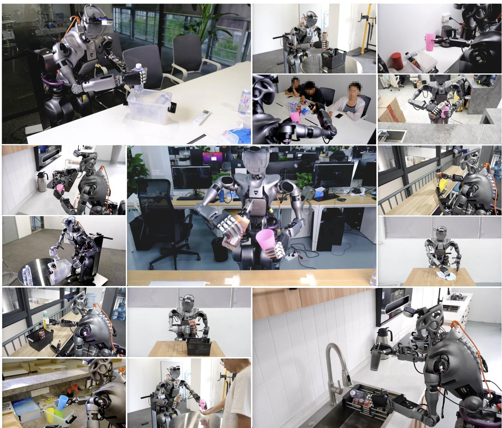
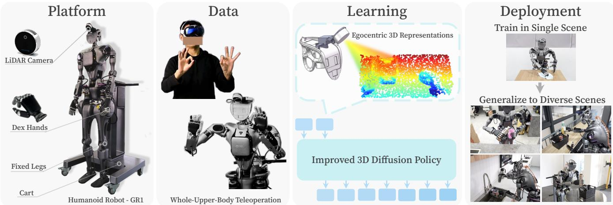
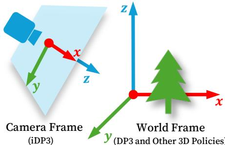
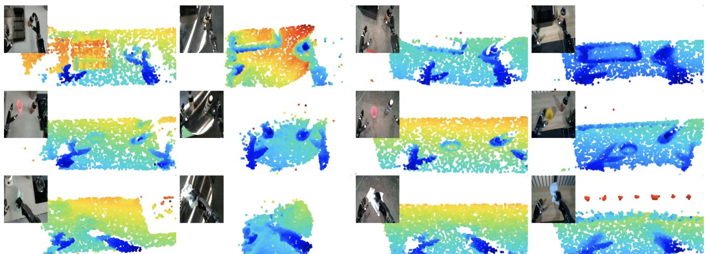
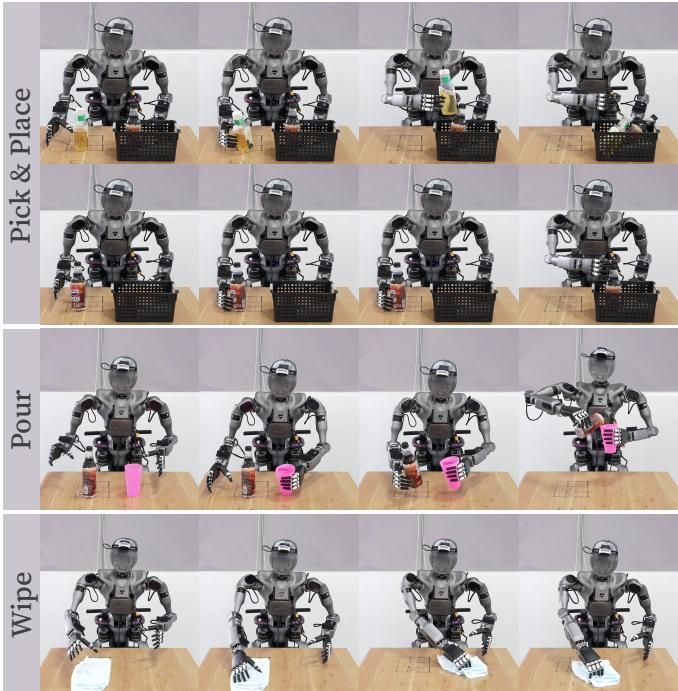
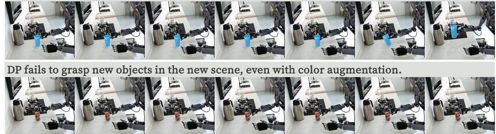
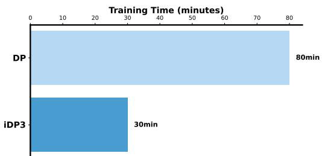
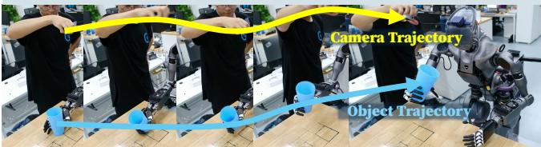
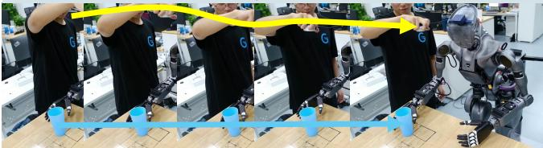

# Generalizable Humanoid Manipulation with 3D Diffusion Policies

Yanjie $\mathrm { Z e ^ { 1 } }$ Zixuan Chen2 Wenhao Wang3 Tianyi Chen3 Xialin He4 Ying Yuan5 Xue Bin Peng2 Jiajun Wu1 1Stanford University 2Simon Fraser University 3UPenn 4UIUC 5CMU HUMANOID-MANIPULATION.GITHUB.IO

  
Fi.  Humanoid manipulation in divereunseen scenarios. With ur system we are abletcollct huma-ike using data only from a single scene, The scenes are not cherry-picked. Videos are available on our website.

Abstract—Humanoid robots capable of autonomous operation in diverse environments have long been a goal for roboticists. However, autonomous manipulation by humanoid robots has largely been restricted to one specific scene, primarily due to the difficulty of acquiring generalizable skills and the expensiveness of in-the-wild humanoid robot data. In this work, we build a real-world robotic system to address this challenging problem. Our system is mainly an integration of 1) a whole-upper-body robotic teleoperation system to acquire human-like robot data, 2) a 25-DoF humanoid robot platform with a height-adjustable cart and a 3D LiDAR sensor, and 3) an improved 3D Diffusion Policy learning algorithm for humanoid robots to learn from noisy human data. We run more than 2000 episodes of policy rollouts on the real robot for rigorous policy evaluation. Empowered by this system, we show that using only data collected in one single scene and with only onboard computing, a full-sized humanoid robot can autonomously perform skills in diverse real-world scenarios. Videos are available at humanoid-manipulation.github.io.

# I. INTRODUCTION

Robots capable of performing diverse tasks in unstructured environments have long been a significant goal in the robotics community, with the development of intelligent humanoid robots representing one promising pathway. Recently, substantial progress has been made in developing humanoid robot hardware [11][15] as well as teleoperation and learning systems for these robots [4], [6], [7], [10], [16]. However, due to the limited generalization capabilities of the employed learning methods [17][21] and the high cost of acquiring humanoid robot data from diverse scenes, these autonomous humanoid manipulation skills are all confined to their training scenarios and hard to generalize to new scenes [3][7], [10], [16], [22], as shown in Table I. In this work, we aim to develop a real-world humanoid robot learning system that can learn generalizable humanoid manipulation skills by 3D visuomotor policies. An overview of our system is in Figure 2. First, we design a humanoid robot learning platform, where a 29-DoF full-sized humanoid robot is fixed on a moveable and height-adjustable cart. This platform can stabilize humanoid robots even when the waist is leaning forward, so that we can safely utilize the waist DoF of humanoid robots. Besides, the robot head is attached with a 3D LiDAR sensor for generalizable policy learning. Second, for human-like data collection, we design a whole-upper-body teleoperation system that maps human joints to a full-sized humanoid robot. Unlike the common bi-manual manipulation system, our teleoperation incorporates waist degrees of freedom and active vision, greatly expanding the robot's operational workspace, particularly when handling tasks at varying heights. We also stream realtime vision from LiDAR sensors to humans for egocentric teleoperation. Third, to learn generalizable manipulation skills with egocentric human data, we re-formulate the third-person 3D learning algorithm 3D Diffusion Policy (DP3, [2]) to an egocentric version, eliminating the need for camera calibration and point cloud segmentation. By more than 2000 realworld evaluation trials, we bring solid improvements over the original DP3 towards real-world humanoid manipulation. The resulting policy is termed as the Improved 3D Diffusion Policy (iDP3). Though this work only applies iDP3 on the Fourier GR1 [15] humanoid robot, we emphasize that iDP3 is a general 3D learning algorithm that can be applied to different robot platforms including mobile robots and humanoid robots. Finally, we deploy our system to unseen real-world scenarios. We surprisingly found that, due to the robustness of our 3D representations and the flexibility of our platform, our policy zero-shot generalize to a lot of randomly selected unseen scenarios, such as kitchens, meeting rooms, and offices, as shown in Figure 1. To summarize our contributions, we build a real-world humanoid robot system that can learn generalizable manipulation skills from only one single scene, utilizing 3D visuomotor policies. As far as we know, we are the first to successfully enable a full-sized humanoid robot to performs skills autonomously in diverse unseen scenes with data only from a single scene using 3D imitation learning.

# II. RELATED WORK

The autonomous execution of diverse skills by humanoid robots in complex, real-world environments has long been a central goal in robotics. Recently, learning-based methods have shown promising progress toward this objective, particularly in the areas of locomotion [23][27], manipulation [4], [10], [28], and loco-manipulation [6], [7], [16], [29]. While several works have successfully demonstrated humanoid locomotion in unstructured, real-world environments [23], [24], [26], manipulation skills in unseen environments remain largely unexplored [6], [7], [10].

In Table I, we list recent works that build real-world robotic systems for humanoid robots/dexterous manipulation. We found that existing works in humanoid robots [3], [4], [6], [7], [10], [22] miss the study of generalization abilities for humanoid manipulation, mainly due to the limited generalization abilities of their algorithm and the limited flexibility of their system. For example, the platform for OpenTeleVision [10] and HATO [22] does not support the movable base and waist, limiting the working space of the robot. HumanPlus [7] and OmniH2O [6] can whole-body teleoperate the humanoid robot, while the manipulation skills learned from their system are only limited to the training scene and can not generalize to other scenes due to the hardness in collect diverse data. Maniwhere [9] achieves real-world scene generalization on simple tabletop pushing tasks, while it is hard to apply their sim-to-real pipeline to humanoid robots due to the system complexity of humanoid robots. Similarly, 3D Diffusion Policy (DP3, [2]) only shows the object/view generalization with tabletop robot arms. The Robot Utility Model [30] also generalizes skills to the new environment with imitation learning, while they have to use data collected from 20 scenes for scene generalization, compared to only 1 scene we use. In this paper, we take a significant step forward by building a real-world humanoid robot learning system that enables a full-sized humanoid robot to perform manipulation tasks in unseen real-world scenes, utilizing 3D visuomotor policies.

# III. GENERALIZABLE HUMANOID MANIPULATION WITH 3D Diffusion Policies

In this section, we present our real-world imitation learning system deployed on a full-sized humanoid robot. An overview of the system is provided in Figure 2. TABLE a f evloiua ar sm  eralizheea polse wor — aspect that has been missing in previous humanoid works.   

<table><tr><td rowspan="2">Method</td><td colspan="4">Teleoperation</td><td colspan="3">Generalization Abilities</td><td>Rigorous Policy Evaluation</td></tr><tr><td>Arm&amp;Hand</td><td>Head</td><td>Wais </td><td></td><td></td><td>Object Camera View</td><td>Scene</td><td>Real-World Episodes</td></tr><tr><td>AnyTeleop [1]</td><td>✓</td><td>X</td><td>X</td><td>X</td><td>✓</td><td>X</td><td>X</td><td>0</td></tr><tr><td>DP3 [2]</td><td></td><td>X</td><td>X</td><td>X</td><td></td><td>√</td><td>X</td><td>186</td></tr><tr><td>BunnyVisionPro [3]</td><td></td><td>X</td><td>X</td><td>X</td><td></td><td>X</td><td>X</td><td>540</td></tr><tr><td>ACE [4]</td><td></td><td>X</td><td>X</td><td>X</td><td>X</td><td>X</td><td>X</td><td>60</td></tr><tr><td>Bi-Dex [5]</td><td></td><td>X</td><td>X</td><td>X</td><td>X</td><td>X</td><td>X</td><td>50</td></tr><tr><td>OmniH20 [6]</td><td></td><td>X</td><td>X</td><td>√</td><td>X</td><td>X</td><td>X</td><td>90</td></tr><tr><td>HumanPlus [7]</td><td></td><td>X</td><td>X</td><td></td><td>X</td><td>X</td><td>X</td><td>160</td></tr><tr><td>Hato [8]</td><td></td><td>X</td><td>X</td><td>X</td><td></td><td>X</td><td>X</td><td>300</td></tr><tr><td>ManiWhere [9]</td><td></td><td>X</td><td>X</td><td>X</td><td></td><td></td><td>√</td><td>20</td></tr><tr><td>OpenTeleVision [10]</td><td></td><td></td><td>X</td><td>X</td><td></td><td></td><td>X</td><td>75</td></tr><tr><td>This Work</td><td></td><td></td><td></td><td>X</td><td></td><td></td><td></td><td>2253</td></tr></table>

# A. Humanoid Robot Platform

Humanoid Robot. We use Fourier GR1 [15], a full-sized humanoid robot, equipped with two Inspire Hands [31]. We enable the whole upper body {head, waist, arms, hands}, totaling 25 degrees-of-freedom (DoF). We disable the lower body for stability and instead use a cart for movement. Though previous systems such as HumanPlus [7] and OmniH2O [6] have shown the usage of humanoid legs, the locomanipulation skills of these systems are still limited due to the hardware constraints. We emphasize that our system with 3D learning algorithms is general and could generalize to other humanoid robots with and without legs. LiDAR Camera. To capture high-quality 3D point clouds, we utilize the RealSense L515 [32], a solid-state LiDAR camera. The camera is mounted on the robot head to provide egocentric vision. Previous studies have demonstrated that cameras with less accurate depth sensing, such as the RealSense D435 [33], can result in suboptimal performance for DP3 [2], [34]. It is important to note that, however, even the RealSense L515 does not produce perfectly accurate point clouds. We also try other LiDAR cameras such as Livox Mid-360, but we found that the resolution and the frequency of such LiDARs do not support contact-rich and real-time robotic manipulation. Height-Adjustable Cart. A major challenge in generalizing manipulation skills to real-world environments is the wide variation in scene conditions, particularly the differing heights of tabletops. To address this, we utilize a heightadjustable cart, eliminating the need for complex whole-body control. While this simplifies the manipulation process, we believe our approach will perform equally well once wholebody control techniques become more mature.

# B. Human-Like Robot Data

Whole-Upper-Body Teleoperation. To obtain human-like humanoid robot data, we design a teleoperation system that can teleoperate the robot's entire upper body, including the head, waist, hands, and arms. We use the Apple Vision Pro (AVP, [35]) to obtain accurate and real-time human data, e.g., the 3D positions and orientations of the head/hands/wrists [36]. With this human data, we compute the corresponding robot joint angles respectively. More specifically, 1) the robot arm joints are computed with Relaxed IK [37] to track human wrist positions; 2) the robot waist and head joints are computed by using the rotation of the human head. We also stream the real-time robot vision back to humans for immersive teleoperation feedback [10]. Latency of Teleoperation. The use of a LiDAR sensor significantly occupies the bandwidth/CPU of the onboard computer, resulting in a teleoperation latency of approximately 0.5 seconds. We also try two LiDAR sensors (one additionally mounted on the wrist), which introduce extremely high latency and thus make the data collection infeasible. Data for Learning. We collect trajectories of observationaction pairs during teleoperation, where observations consist of two parts: 1) visual data, such as point clouds and images, and 2) proprioceptive data, such as robot joint positions. Actions are represented by the target joint positions. We also tried using end-effector poses as proprioceptions/actions, finding that directly applying joint positions as action space is more accurate, mainly due to the noise in the real world to compute the end-effector poses.

# C. Improved 3D Diffusion Policy

3D Diffusion Policy (DP3, [2]) is an effective 3D visuomotor policy that marries sparse point cloud representations with diffusion policies. Although DP3 has shown impressive results across a wide range of manipulation tasks, it is not directly deployable on general-purpose robots such as humanoid robots or mobile manipulators due to its inherent dependency on precise camera calibration and fine-grained point cloud segmentation. Furthermore, the accuracy of DP3 requires further improvements for effective performance in more complex tasks. In the following, we detail several modifications to achieve targeted improvements. The resulting improved algorithm is termed as the Improved 3D Diffusion Policy (iDP3). Egocentric 3D Visual Representations. DP3 leverages a

  
s, hesor pl ear method,and he eal-wor deplymt. Wit th ystm, urun roo performs autonomous skills in diverse real-world scenes.

  
Fig. 3: iDP3 utilizes 3D representations in the camera frame, while the 3D representations of other recent 3D policies including DP3 [2] are in the world frame, which relies on accurate camera calibration and can not be extended to mobile robots.

3D visual representation in the world frame, enabling easy segmentation of the target object [2], [28]. However, for general-purpose robots like humanoids, the camera mount is not fixed, making camera calibration and point cloud segmentation impractical. To tackle this problem, we propose directly using the 3D representation from the camera frame, as shown in Figure 3. We term this class of 3D representations as egocentric 3D visual representations. Scaling Up Vision Input. Leveraging egocentric 3D visual representations presents challenges in eliminating extraneous point clouds, such as backgrounds or tabletops, especially without relying on foundation models. To mitigate this, we propose a straightforward but effective solution: scaling up the vision input. Instead of using standard sparse point sampling as in previous systems [2], [28], [38], we significantly increase the number of sample points to capture the entire scene. Despite its simplicity, this approach proves to be effective in our real-world experiments. Improved Visual Encoder. We replace the MLP visual encoder in DP3 with a pyramid convolutional encoder. We find that convolutional layers produce smoother behaviors than fully-connected layers when learning from human data, and incorporating pyramid features from different layers further enhances accuracy. Longer Prediction Horizon. The jittering from human experts and the noisy sensors exhibit much difficulty in learning from human demonstrations, which causes DP3 to struggle with short-horizon predictions. By extending the prediction horizon, we effectively mitigate this issue. Implementation Details. For the optimization, we train 300 epochs for iDP3 and all other methods with AdamW [39]. For the diffusion process, we use 50 training steps and 10 inference steps with DDIM [40]. For the point cloud sampling, we replace farthest point sampling (FPS) used in DP3 [2] with a cascade of voxel sampling and uniform sampling, which ensures the sampled points cover the 3D space with a faster inference speed.

# D. Real-World Deployment

We train iDP3 on our collected human demonstrations. Notably, we do not rely on camera calibration or manual point cloud segmentation as mentioned before. Therefore, our iDP3 policy can be seamlessly transferred to new scenes without requiring additional efforts such as calibration/segmentation. Besides, iDP3 performs real-time inference (15hz) with only onboard robot computing, making the deployment to the open world accessible.

# IV. EXPERIMENTS AND ANALYSIS

To evaluate the effectiveness of our system, we conduct extensive real-world ablations with our system. We select the Pick&Place task as the primary benchmark for our analysis, and further showcase the Pick&Place, Pour, and Wipe tasks in diverse unseen scenarios.

# A. Experiment Setup

Task Description. In this task, the robot grasps a lightweight cup and moves it aside. The challenge for humanoid robots with dexterous hands is that the cup is similar in size to the hands; thus, even small errors result in collisions or missed grasps. This task requires more precision than using parallel grippers, which can open wider to avoid collisions.

  
lzatn svatshgughtexi ve scenes. Videos are available on our website.

TABLE II: Efficiency of iDP3 compared to baselines. To improve the robustness of the baselines, we have added Random Crop and Color Jitter augmentation to all image-based methods during training. All the methods are evaluated with more than 100 trials, ensuring less randomness in realworld evaluation. Without modification, original DP [17] and DP3 [2] work badly on our humanoid robot.

<table><tr><td>Baselines</td><td>DP</td><td>DP3</td><td>DP (*R3M)</td><td>DP (*R3M)</td><td>iDP3 (DP3 Encoder)</td><td>iDP3</td></tr><tr><td>1st-1</td><td>0/0</td><td>0/0</td><td>11/33</td><td>24/39</td><td>15/34</td><td>21/38</td></tr><tr><td>1st-2</td><td>7/34</td><td>0/0</td><td>10/28</td><td>27/36</td><td>12/27</td><td>19/30</td></tr><tr><td>3rd-1</td><td>7/36</td><td>0/0</td><td>18/38</td><td>26/38</td><td>15/32</td><td>19/34</td></tr><tr><td>3rd-2</td><td>10/36</td><td>0/0</td><td>23/39</td><td>22/34</td><td>16/34</td><td>16/37</td></tr><tr><td>Total</td><td>24/106</td><td>0/0</td><td>62/138</td><td>99/147</td><td>58/127</td><td>75/139</td></tr></table>

Task Setting. We train the Pick&Place task under four settings: $\{$ 1st-1, 1st-2, 3rd-1, 3rd-2}. "1st" uses an egocentric view, and "3rd" uses a third-person view. The numbers behind represent the number of demonstrations used for training, with each demonstration consisting of 20 rounds of successful execution. The training dataset is kept small to highlight the differences between methods. The object position is randomly sampled in a $1 0 \mathrm { c m } \times 2 0 \mathrm { c m }$ region. Evaluation Metric. We run three episodes for each method, each consisting of 1,000 action steps. In total, each method is evaluated with around 130 trials, ensuring a thorough evaluation of each method. We record both the number of successful grasps and the total number of grasp attempts. The successful grasp count reflects the accuracy of the policy. The total number of attempts serves as a measure of the policy's smoothness, since the jittering policies tend to hang around and have few attempts as we observe in experiments.

# B. Effectiveness

We compare iDP3 with several strong baselines, including: a) DP: Diffusion Policy [17] with a ResNet18 encoder; b) DP (\*R3M): Diffusion Policy with a frozen R3M [41] encoder; DP $( { \bf \star R 3 M } )$ : Diffusion Policy with a finetuned R3M encoder; d) original DP3 without any modifications; and e) iDP3 (DP3 Encoder): iDP3 using the DP3 encoder [17]. All image-based methods use the same policy backbone as iDP3 and Random Crop and Color Jitter augmentations to improve robustness and generalization. The RGB image resolution is $2 2 4 \times 2 2 4$ , resized from the raw image from the RealSense camera.

  
Fig. 5: Trajectories of our three tasks in the training scene, including Pick&Place, Pour, and Wipe. We carefully select daily tasks so that the objects are common in daily scenes and the skills are useful across scenes.

The results, presented in Table II, show that iDP3 significantly outperforms vanilla DP and DP3, DP with a frozen R3M encoder, and iDP3 with the DP3 encoder. However, we find that DP with a finetuned R3M is a particularly strong baseline, outperforming iDP3 in these settings. We hypothesize that this is because finetuning pre-trained models are often more effective compared to training-from-scratch [42], and there are currently no similar pre-trained 3D visual models for robotics. DP produces jittering behaviors when grasping the training object in the new scene.

  
Fig. 6: Failure cases of image-based methods in new scenes. Here DP corresponds to DP $( { \bf { \star R 3 M } } )$ in Table II, which is methods still struggle in the new scene/object.

  
Fig. 7: Training time. Due to using 3D representations, iDP3 saves training time compared to Diffusion Policy (DP), even after we scale up the 3D vision input. This advantage becomes more evident when the number of demonstrations gets large.

Though $\mathrm { D P + }$ finetuned R3M is more effective in these settings, we find that image-based methods are overfitting to the specific scenario and object, failing to generalize to wild scenarios, as shown in Section IV-D. Additionally, we believe there is still room for improvement in iDP3. Our current 3D visual observations are quite noisy due to the limitations of the sensing hardware. We expect that more accurate 3D observations could lead to optimal performance in 3D visuomotor policies, as demonstrated in simulation [2].

# C. Ablations

We conduct ablation studies on several modifications to DP3, including improved visual encoders, scaled visual input, and a longer prediction horizon. Our results, given in Table III, demonstrate that without these modifications DP3 either fails to learn effectively from human data or exhibits significantly reduced accuracy. More specifically, we observe that 1) our improved visual encoder could both improve the smoothness and accuracy of the policy; 2) scaled vision inputs are helpful, while the performance gets saturated in our tasks with more points; 3) an appropriate prediction horizon is critical, without which DP3 fails to learn from human demonstrations. Additionally, Figure 7 presents the training time for iDP3, demonstrating a significant reduction compared to Diffusion Policy. This efficiency is maintained even when the number of point clouds increases to several times that of DP3 [2]. TABLE III: Ablation on iDP3. The results demonstrate that removing certain key modifications from iDP3 significantly impacts the performance of DP3, leading to either failure in learning from human data or reduced accuracy. All the methods are evaluated with more than 100 trials, ensuring less randomness in real-world evaluation.   

<table><tr><td>Visual Encoder</td><td>1st-1</td><td>1st-2</td><td>3rd-1</td><td>3rd-2</td><td>Total</td></tr><tr><td>Linear (DP3)</td><td>15/34</td><td>12/27</td><td>15/32</td><td>16/34</td><td>58/127</td></tr><tr><td>Conv</td><td>9/33</td><td>14/32</td><td>14/33</td><td>12/33</td><td>49/131</td></tr><tr><td>Linear+Pyramid</td><td>15/34</td><td>20/31</td><td>13/33</td><td>18/36</td><td>66/134</td></tr><tr><td>Conv+Pyramid (iDP3)</td><td>21/38</td><td>19/30</td><td>19/34</td><td>16/37</td><td>75/139</td></tr><tr><td colspan="6">Number of Points</td></tr><tr><td></td><td>1st-1</td><td>1st-2</td><td>3rd-1</td><td>3rd-2</td><td>Total</td></tr><tr><td>1024 (DP3) 2048</td><td>11/28 17/35</td><td>10/30</td><td>18/35 17/32</td><td>17/36 18/33</td><td>56/129 65/128</td></tr><tr><td>4096 (iDP3)</td><td>21/38</td><td>13/28 19/30</td><td>19/34</td><td>16/37</td><td>75/139</td></tr><tr><td>8192</td><td>24/35</td><td>16/28</td><td>14/33</td><td>18/36</td><td>72/132</td></tr><tr><td></td><td></td><td></td><td></td><td></td><td></td></tr><tr><td colspan="6">Prediction Horizon</td></tr><tr><td></td><td>1st-1</td><td>1st-2</td><td>3rd-1</td><td>3rd-2</td><td>Total</td></tr><tr><td>4 (DP3) 8</td><td>0/0 0/0</td><td>0/0</td><td>0/0</td><td>0/0 12/34</td><td>0/0 33/88</td></tr><tr><td>16 (iDP3)</td><td>21/38</td><td>3/18</td><td>18/36 19/34</td><td>16/37</td><td>75/139</td></tr><tr><td>32</td><td>9/34</td><td>19/30 20/30</td><td>14/33</td><td>12/33</td><td>55/130</td></tr></table>

# D. Capabilities

In this section, we show more generalization capabilities of our system on humanoid robots. We also conduct more comparisons between iDP3 and DP $( { \bf \star R 3 M } )$ (abbreviated as DP in this section) and show that iDP3 is more applicable in the challenging and complex real world. Results are given in Table IV. Tasks. We select three tasks, Pick&Place, Pour, and Wipe, to demonstrate the capabilities of our system. We ensure that these tasks are common in daily life and could be useful for humans. For instance, Pour is frequently performed in restaurants, and Wipe in cleaning tables in households. Data. For each task, we collect 10 demonstrations $\times 1 0$ iDP3 is robust to large view changes. TABLE IV: Capabilities of iDP3. While iDP3 maintains similar efficiency to DP $( { \bf \star R 3 M } )$ (abbreviated as DP), it stands out l wo sett Wi  u as.ot nd ovala kitchen scene.   

<table><tr><td>Training</td><td>DP</td><td>iDP3</td><td>New Object</td><td>DP</td><td>iDP3</td><td>New View</td><td>DP</td><td>iDP3</td><td>New Scene</td><td>DP</td><td>iDP3</td></tr><tr><td>Pick&amp;Place</td><td>9/10</td><td>9/10</td><td>Pick&amp;Place</td><td>3/10</td><td>9/10</td><td>Pick&amp;Place</td><td>2/10</td><td>9/10</td><td>Pick&amp;Place</td><td>2/10</td><td>9/10</td></tr><tr><td>Pour</td><td>9/10</td><td>9/10</td><td>Pour</td><td>1/10</td><td>9/10</td><td>Pour</td><td>0/10</td><td>9/10</td><td>Pour</td><td>1/10</td><td>9/10</td></tr><tr><td>Wipe</td><td>10/10</td><td>10/10</td><td>Wipe</td><td></td><td></td><td>Wipe</td><td></td><td></td><td>Wipe</td><td></td><td></td></tr></table>

  
DP fails to grasp training objects under large view changes.   
Fig. 8: View invariance of iDP3. We find that egocentric 3D representations are surprisingly view-invariant. Here DP corresponds to DP $( { \bf \# } { \bf R } { \bf 3 } { \bf M } )$ in Table II, which is the strongest image-based baseline we have.

rollouts, totalling 300 episodes for all tasks. For Pick&Place and Pour, the object poses are randomized in a region of $1 0 \mathrm { c m } \times 1 0 \mathrm { c m }$ . Effectiveness. As shown in Table IV, both iDP3 and DP achieve high success rates in the training environment with the training objects. Property 1: View Invariance. Our egocentric 3D representations demonstrate impressive view invariance. As shown in Figure 8, iDP3 consistently grasps objects even under large view changes, while DP struggles to grasp even the training objects. DP shows occasional success only with minor view changes. Notably, unlike recent works [38], [43], [44], we did not incorporate specific designs for equivariance or invariance. Property 2: Object Generalization. We evaluated new kinds of cups/bottles beside the training cup, as shown in Figure 9. While DP, due to the use of Color Jitter augmentation, can occasionally handle unseen objects, it does so with a low success rate. In contrast, iDP3 naturally handles a wide range of objects, thanks to its use of 3D representations. Property 3: Scene Generalization. We further deploy our policy in various real-world scenarios, as shown in Figure 1. These scenes are nearby the lab and none of the scenes are cherry-picked. The real world is far noisier and more complex than the controlled tabletop environments used in the lab, leading to reduced accuracy for image-based methods (Figure 6). Unlike DP, iDP3 demonstrates surprising robustness across all scenes. Additionally, we provide visualizations of both 2D and 3D observations in Figure 4.

  
Fig. 9: Objects used in Pick&Place and Pour. We only use the cups as the training objects, while our method naturally handles other unseen bottles/cups.

# V. CONclusionS aND LiMItationS

Conclusions. This work presents a real-world imitation learning system that enables a full-sized humanoid robot to generalize practical manipulation skills to diverse realworld environments, trained with data collected solely in one single scene. With more than 2000 rigorous evaluation trials, we present an improved 3D Diffusion Policy, that can learn robustly from human data and perform effectively on our humanoid robot. The results that our humanoid robot can perform autonomous manipulation skills in diverse realworld scenes show the potential of using 3D visuomotor policies in real-world manipulation tasks with data efficiency. Limitations. 1) Teleoperation with Apple Vision Pro is easy to set up, but it is tiring for human teleoperators, making imitation data hard to scale up within the research lab. 2) The depth sensor still produces noisy and inaccurate point clouds, limiting the performance of iDP3. 3) Collecting fine-grained manipulation skills, such as turning a screw, is time-consuming due to teleoperation with AVP; systems like Aloha [18] are easier to collect dexterous manipulation tasks at this stage. 4) We avoided using the robot's lower body, as maintaining balance is still challenging due to the hardware constraints brought by current humanoid robots. In general, scaling up high-quality manipulation data is the main bottleneck. In the future, we hope to explore how to scale up the training of 3D visuomotor policies with more high-quality data and how to employ our 3D visuomotor policy learning pipeline to humanoid robots with whole-body control.

# ACKNOWLEDGMENTS

We would like to thank Jie Gu, Bin Zhou, and Yusheng Cai from Fourier Intelligence for hardware support, Yuxiang Gao for help in teleoperation, Shuo Hu for help in the 3D printing of the camera mount, Zeqian Bao, Renzhi Tao, and Jiayan Gu for helpful discussions. Besides, we would like to thank Chen Wang, Yunzhi Zhang, Zizhang Li, and Haoyu Xiong from Stanford University for their insightful discussions. This work is in part supported by ONR MURI N00014-22-1-2740, ONR MURI N00014-24-1-2748, and the Okawa Foundation.

# REFERENCES

[1] Y. Qin, W. Yang, B. Huang, K. Van Wyk, H. Su, X. Wang, Y.-W. Chao, and D. Fox, "Anyteleop: A general vision-based dexterous robot armhand teleoperation system," in Robotics: Science and Systems, 2023.   
[2] Y. Ze, G. Zhang, K. Zhang, C. Hu, M. Wang, and H. Xu, "3d diffusion policy: Generalizable visuomotor policy learning via simple 3d representations," arXiv preprint arXiv:2403.03954, 2024. [3] R. Ding, Y. Qin, J. Zhu, C. Jia, S. Yang, R. Yang, X. Qi, and X. Wang, "Bunny-visionpro: Real-time bimanual dexterous teleoperation for imitation learning," arXiv preprint arXiv:2407.03162, 2024. [4] S. Yang, M. Liu, Y. Qin, R. Ding, J. Li, X. Cheng, R. Yang, S. Yi, and X. Wang, "Ace: A cross-platform visual-exoskeletons system for low-cost dexterous teleoperation," arXiv preprint arXiv:2408.11805, 2024.   
[5] K. Shaw, Y. Li, J. Yang, M. K. Srirama, R. Liu, H. Xiong, R. Mendonca, and D. Pathak, "Bimanual dexterity for complex tasks," in 8th Annual Conference on Robot Learning, 2024. [6] T. He, Z. Luo, X. He, W. Xiao, C. Zhang, W. Zhang, K. Kitani, C. Liu, and G. Shi, "Omnih2o: Universal and dexterous human-to-humanoid whole-body teleoperation and learning," in arXiv, 2024. [7] Z. Fu, Q. Zhao, Q. Wu, G. Wetzstein, and C. Finn, "Humanplus: Humanoid shadowing and imitation from humans," in arXiv, 2024.   
[8] T. Lin, Z.-H. Yin, H. Qi, P. Abbeel, and J. Malik, "Twisting lids off with two hands," arXiv:2403.02338, 2024. [9] Z. Yuan, T. Wei, S. Cheng, G. Zhang, Y. Chen, and H. Xu, "Learning to manipulate anywhere: A visual generalizable framework for reinforcement learning," arXiv preprint arXiv:2407.15815, 2024.   
[10] X. Cheng, J. Li, S. Yang, G. Yang, and X. Wang, "Open-television: Teleoperation with immersive active visual feedback," arXiv preprint arXiv:2407.01512, 2024.   
[11] Boston Dynamics, "Atlas," 2024, online. [Online]. Available: https://bostondynamics.com/atlas/   
[12 Tesl, "Optimus," 2024, online. [Online.Available: https://w. tesla.com/en_eu/AI   
[13] Figure, "01," 2024, online. [Online]. Available: https://www.figure.ai/   
[4 Unitree, "H1," 2024, online. [Online].Available: https:/www.unitree. com/h1   
[15] Fourier Intelligence, "Gr1," 2024, online. [Online]. Available: https://www.fourierintelligence.com/gr1   
[16] T. He, Z. Luo, W. Xiao, C. Zhang, K. Kitani, C. Liu, and G. Shi, Learnng human-to-humanoid real-im whole-body teleoperation," in arXiv, 2024.   
. S.Y.  . X  , Diffusion policy: Visuootor policy learning via action diffusion." arXiv preprint arXiv:2303.04137, 2023.   
[18 T. Z. Zhao, V. Kumar, S. Levine, and C. Finn, "Learning fine-grained bimanual manipulation with low-cost hardware," arXiv preprint arXiv:2304.13705, 2023.   
[9] Z. Fu, T. Z. Zhao, and C. Finn, "Mobile aloha: Learning bimanual mobile manipulation with low-cost whole-body teleoperation," in arXiv, 2024.   
[20] A. Brohan, N. Brown, J. Carbajal, Y. Chebotar, J. Dabis, C. Finn, .Gopalakrishnan, K. Hausman, A. Herzog, J. Hsu et al. Rt-: Robotics transformer for real-world control at scale," arXiv preprint arXiv:2212.06817, 2022.   
[21] A. Brohan, N. Brown, J. Carbajal, Y. Chebotar, X. Chen, K. Choromanski, T. Ding, D. Driess, A. Dubey, C. Finn et al., "Rt-2: Visionlanguage-action models transfer web knowledge to robotic control," arXiv preprint arXiv:2307.15818, 2023.   
[22] T. Lin, Y. Zhang, Q. Li, H. Qi, B. Yi, S. Levine, and J. Malik, "Learning visuotactile skills with two multifingered hands," arXiv preprint arXiv:2404.16823, 2024.   
[23] X. Gu, Y.-J. Wang, X. Zhu, C. Shi, Y. Guo, Y. Liu, and J. Chen, "Advancing humanoid locomotion: Mastering challenging terrains with denoising world model learning," arXiv preprint arXiv:2408.14472, 2024.   
[24] I. Radosavovic, B. Zhang, B. Shi, J. Rajasegaran, S. Kamat, T. Darrell K. Sreenath, and J. Malik, "Humanoid locomotion as next token prediction," arXiv preprint arXiv:2402.19469, 2024.   
[25] I. Radosavovic, T. Xiao, B. Zhang, T. Darrell, J. Malik, and K. Sreenath, "Real-world humanoid locomotion with reinforcement learning," Science Robotics, vol. 9, no. 89, p. eadi9579, 2024.   
[26] Z. Zhuang, S. Yao, and H. Zhao, "Humanoid parkour learning," arXiv preprint arXiv:2406.10759, 2024.   
[27] X. Cheng, Y. Ji, J. Chen, R. Yang, G. Yang, and X. Wang, "Expressive whole-body control for humanoid robots," arXiv preprint arXiv:2402.16796, 2024.   
[28] C. Wang, H. Shi, W. Wang, R. Zhang, L. Fei-Fei, and C. K. Liu, Dexcap: Scalable and portable mocap data collection system for dexterous manipulation," arXiv preprint arXiv:2403.07788, 2024.   
[29] M. Seo, S. Han, K. Sim, S. H. Bang, C. Gonzalez, L. Sentis, and Y. Zhu, "Deep imitation learning for humanoid loco-manipulation through human teleoperation," in IEEE-RAS International Conference on Humanoid Robots (Humanoids), 2023.   
[30] H. Etukuru, N. Naka, Z. Hu, J. Mehu, A. Edsinger, C. Paxton, S. Chintala, L. Pinto, and N. M. M. Shafiullah, "General policies for zero-shot deployment in new environments," arXiv, 2024.   
[31] Inspire Robots, "Dexterous hands," 2024, online. [Online]. Available: http://www.inspire-robots.store/collections/the-dexterous-hands   
[32] Intel RealSense, "Lidar camera 1515," 2024, online. [Online]. Available: https://www.intelrealsense.com/lidar-camera-1515/   
[33] "Depth camera d435," 2024, online. [Online]. Available: https://www.intelrealsense.com/depth-camera-d435/   
[34] C. Wang, H. Fang, H.-S. Fang, and C. Lu, "Rise: 3d perception maks real-world robot imitation simple and effective," arXiv preprint arXiv:2404.12281, 2024.   
[35] Apple, "Apple vision pro," 2024, online. [Online]. Available: https://www.apple.com/apple-vision-pro/   
[36] Y. Park and P. Agrawal, "Using apple vision pro to train and control robots," 2024, online. [Online]. Available: https: //github.com/Improbable-AI/VisionProTeleop   
[37] D. Rakita, B. Mutlu, and M. Gleicher, "Relaxedik: Real-time syntheis of accurate and feasible robot arm motion." in Robotics: Science and Systems, vol. 14. Pittsburgh, PA, 2018, pp. 2630.   
[38] J. Yang, Z. ang Cao, C. Deng, R. Antonova, S. Song, and J. Bohg, "Equibot: Sim(3)-equivariant diffusion policy for generalizable and data efficient learning," arXiv preprint arXiv:2407.01479, 2024.   
[39] I. Loshchilov and F. Hutter, "Decoupled weight decay regularization," in International Conference on Learning Representations, 2019. [Online]. Available: https://openreview.net/forum?id=Bkg6RiCqY7   
[40] J. Song, C. Meng, and S. Ermon, "Denoising diffusion implicit models," arXiv preprint arXiv:2010.02502, 2020.   
[41] S. Nair, A. Rajeswaran, V. Kumar, C. Finn, and A. Gupta, "R3m: A universal visual representation for robot manipulation," arXiv preprint arXiv:2203.12601, 2022.   
[42] N. Hansen, Z. Yuan, Y. Ze, T. Mu, A. Rajeswaran, H. Su, H. Xu, and X. Wang, "On pre-training for visuo-motor control: Revisiting a learning-from-scratch baseline," arXiv preprint arXiv:2212.05749, 2022.   
[43] S. Tian, B. Wulfe, K. Sargent, K. Liu, S. Zakharov, V. Guizilini, and J. Wu, "View-invariant policy learning via zero-shot novel view synthesis," arXiv preprint arXiv:2409.03685, 2024.   
[44] D. Wang, S. Hart, D. Surovik, T. Kelestemur, H. Huang, H. Zhao, M. Yeatman, J. Wang, R. Walters, and R. Platt, "Equivariant diffusion policy," arXiv preprint arXiv:2407.01812, 2024.