# PointNet：用于三维分类和分割的点云深度学习

查尔斯·R·齐* 侯·苏* 迈春·莫 莱昂尼达斯·J·吉巴斯 斯坦福大学

# 摘要

点云是一种重要的几何数据结构。由于其不规则的格式，大多数研究者将此类数据转换为规则的三维体素网格或图像集合。然而，这会使数据变得不必要地庞大并导致问题。本文我们设计了一种新型神经网络，能够直接处理点云，充分尊重输入中点的置换不变性。我们的网络名为PointNet，提供了一个统一的架构，可用于对象分类、部件分割和场景语义解析等多个应用。尽管结构简单，PointNet却高度高效且有效。在实证方面，其性能与最先进的技术相当，甚至更优。在理论上，我们提供了分析，以理解网络所学习的内容以及为什么网络在输入扰动和损坏方面具有鲁棒性。

# 1. 引言

在本文中，我们探索了能够推理三维几何数据（如点云或网格）的深度学习架构。典型的卷积架构需要高度规则的输入数据格式，例如图像网格或三维体素，以便进行权重共享和其他卷积核的优化。然而，由于点云或网格不是规则格式，大多数研究人员通常在将这些数据输入深度网络架构之前，会将其转换为规则的三维体素网格或图像集合（例如，视图）。然而，这种数据表示转换使得生成的数据不必要地庞大，同时还引入量化伪影，可能模糊数据的自然不变性。因此，我们专注于使用简单的点云作为三维几何的不同输入表示，并将我们生成的深度网络命名为PointNets。点云是一种简单而统一的结构，避免了网格的组合不规则性和复杂性，从而更容易进行学习。然而，PointNet仍需考虑点云只是点的集合这一事实，因此对其元素的排列不变，这就需要在网络计算中进行某些对称化处理。此外，还需要考虑对刚体运动的不变性。

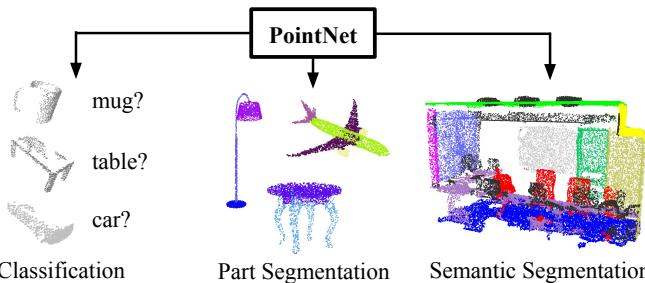  
Figure 1. Applications of PointNet. We propose a novel deep net architecture that consumes raw point cloud (set of points) without voxelization or rendering. It is a unified architecture that learns both global and local point features, providing a simple, efficient and effective approach for a number of 3D recognition tasks.

我们的 PointNet 是一个统一的架构，直接以点云作为输入，并输出整个输入的类别标签或每个点的分段/部分标签。我们网络的基本架构出乎意料地简单，因为在初始阶段每个点都是相同且独立地处理。在基本设置中，每个点仅用其三个坐标 $(x, y, z)$ 表示。通过计算法线和其他局部或全局特征，可能添加额外的维度。我们方法的关键是使用单一的对称函数，即最大池化。有效地说，网络学习了一组优化函数/标准，选择点云中有趣或有信息的点，并编码其选择的原因。网络的最终全连接层将这些学习到的最优值聚合成整个形状的全局描述符（如上所述的形状分类），或用于预测每个点的标签（形状分割）。我们的输入格式可以方便地应用刚性或仿射变换，因为每个点独立变换。因此，我们可以添加一个依赖数据的空间变换网络，试图在 PointNet 处理数据之前对数据进行规范化，以进一步改善结果。我们提供了我们方法的理论分析和实验评估。我们展示了我们的网络可以近似任何连续的集合函数。更有趣的是，事实证明我们的网络通过一组稀疏的关键点来总结输入点云，这大致对应于对象的骨架。理论分析提供了理解为什么我们的 PointNet 对输入点的小扰动以及通过点插入（异常值）或删除（缺失数据）的损坏具有高度鲁棒性的原因。在多个基准数据集上，从形状分类、部分分割到场景分割，我们实验性地将我们的 PointNet 与基于多视角和体积表示的最先进的方法进行比较。在统一架构下，我们的 PointNet 不仅速度更快，而且在性能方面表现强劲，甚至优于最先进的水平。我们工作的主要贡献如下：• 我们设计了一个适合处理无序点集的全新深度网络架构；• 我们展示了如何训练这样的网络来执行 3D 形状分类、形状部分分割和场景语义解析任务；• 我们提供了关于我们方法的稳定性和效率的深入实证和理论分析；• 我们展示了由网络中选定神经元计算的 3D 特征，并为其性能提供直观的解释。神经网络处理无序集合的问题是一个非常普遍且基本的问题，我们期望我们的想法能够转移到其他领域。

# 2. 相关工作

点云特征 现有的大多数点云特征是针对特定任务手工制作的。点特征通常编码点的某些统计属性，并且设计为对某些变换保持不变，这些变换通常被分类为内在特征或外在特征。它们还可以分为局部特征和全局特征。对于特定任务，找到最佳特征组合并非易事。

深度学习在三维数据上 三维数据有多种流行的表示形式，从而导致多种学习方法。体积卷积神经网络（Volumetric CNNs）[28, 17, 18] 是最早将三维卷积神经网络应用于体素化形状的开创者。然而，体积表示受到分辨率的限制，这主要是由于数据稀疏性和三维卷积的计算成本。FPNN [13] 和 Vote3D [26] 提出了处理稀疏性问题的特定方法；然而，它们的操作仍然针对稀疏体积，处理非常大的点云依然具有挑战性。多视角卷积神经网络（Multiview CNNs）[23, 18] 尝试将三维点云或形状渲染为二维图像，然后应用二维卷积网络进行分类。借助经过严格工程设计的图像卷积神经网络，这类方法在形状分类和检索任务中取得了主导性能[21]。然而，将其扩展到场景理解或其他三维任务（如点分类和形状补全）并非易事。谱卷积神经网络（Spectral CNNs）：一些最新的研究[4, 16] 在网格上使用谱卷积神经网络。然而，这些方法目前仅限制于流形网格，例如有机物体，如何将其扩展到非同胚形状（如家具）尚不明晰。基于特征的深度神经网络（Feature-based DNNs）[6, 8] 首先通过提取传统的形状特征将三维数据转换为向量，然后使用全连接网络对形状进行分类。我们认为，它们受到提取特征的表征能力限制。 深度学习在无序集合上 从数据结构的角度来看，点云是一个无序的向量集合。尽管深度学习中的大多数研究集中于序列（在语音和语言处理）、图像和体积（视频或三维数据）等规则输入表示，但在点集深度学习方面的研究不多。Oriol Vinyals 等人的一项最新工作[25] 探讨了这个问题。他们使用具有注意力机制的读-处理-写网络来处理无序输入集合，并展示了他们的网络具有排序数字的能力。然而，由于他们的工作集中在通用集合和自然语言处理应用上，集合中缺乏几何的角色。

# 3. 问题陈述

我们设计了一个深度学习框架，能够直接处理无序的点集作为输入。点云表示为一组三维点 $\{ P _ { i } | \ i = 1 , . . . , n \}$，其中每个点 $P _ { i }$ 是其 $( x , y , z )$ 坐标的向量，以及额外的特征通道，例如颜色、法线等。为简洁起见，除非另有说明，我们仅使用 $( x , y , z )$ 坐标作为点的通道。在物体分类任务中，输入的点云可以是直接从形状中采样得到，或者是从场景点云中预先分割出来的。我们提出的深度网络为所有 $k$ 个候选类别输出 $k$ 个得分。在语义分割任务中，输入可以是单个物体用于部分区域分割，或是来自三维场景的子体积用于物体区域分割。我们的模型将为每个 $n$ 个点和每个 $m$ 个语义子类别输出 $n \times m$ 个得分。

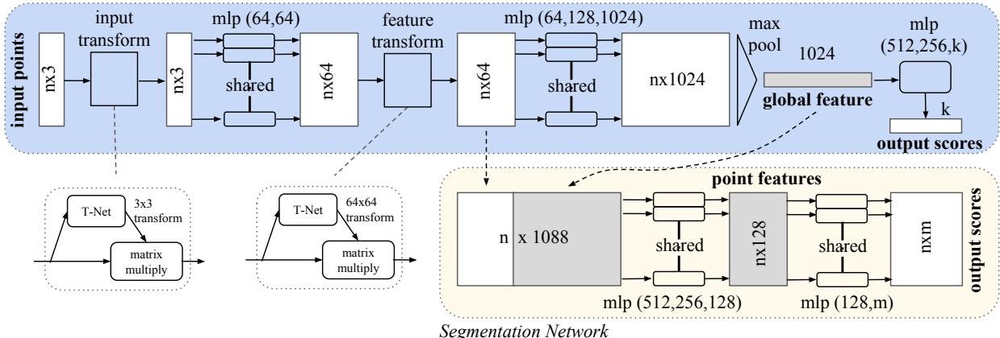  
Figure 2. PointNet Architecture. The classification network takes $n$ points as input, applies input and feature transformations, and then aggregates point features by max pooling. The output is classification scores for $k$ classes. The segmentation network is an extension to the c .

# 4. 点集上的深度学习

我们网络的架构（第4.2节）受到 $\mathbb { R } ^ { n }$ 中点集属性的启发（第4.1节）。

# 4.1. $\mathbb { R } ^ { n }$ 中点集的性质

我们的输入是来自欧几里得空间的点的子集。它具有三个主要特性： • 无序性。与图像中的像素数组或体素网格中的体素数组不同，点云是一组没有特定顺序的点。换句话说，消耗 $N$ 个三维点集的网络需要对输入集的数据输入顺序的 $N !$ 排列保持不变。 • 点之间的交互。点来自具有距离度量的空间。这意味着点不是孤立的，邻近点形成了一个有意义的子集。因此，模型需要能够捕捉附近点的局部结构及其组合交互。 • 变换下的不变性。作为几何对象，点集的学习表示应该对某些变换保持不变。例如，整体旋转和移动点不应改变全局点云类别或点的分割。

# 4.2. PointNet架构

我们的完整网络架构如图2所示，其中分类网络和分割网络共享大量结构。请阅读图2的说明以了解整个流程。我们的网络有三个关键模块：最大池化层作为对称函数，从所有点聚合信息，一个局部和全局信息组合结构，以及两个联合对齐网络，对齐输入点和点特征。我们将在下面的单独段落中讨论这些设计选择背后的原因。 无序输入的对称函数 为了使模型对输入的排列具有不变性，有三种策略：1）将输入排序为规范顺序；2）将输入视为序列以训练RNN，但通过各种排列来增强训练数据；3）使用简单的对称函数从每个点聚合信息。在这里，一个对称函数接受$n$个向量作为输入，输出一个对输入顺序不变的新向量。例如，$^ +$和$^ *$运算符是对称的二元函数。虽然排序听起来像是一个简单的解决方案，但在高维空间中，实际上并不存在一个对点扰动稳定的顺序。这可以通过反证法轻松证明。如果存在这样的排序策略，它定义了高维空间与$1d$实线之间的双射映射。很明显，要求一个排序在点扰动下保持稳定等同于要求这个映射在维度减少时保持空间接近性，而这是在一般情况下无法实现的任务。因此，排序并没有完全解决排序问题，而且网络很难学习从输入到输出的一致映射，因为排序问题依然存在。正如实验所示（图5），我们发现直接在排序点集上应用MLP的表现较差，虽然比直接处理无序输入稍好。使用RNN的想法是将点集视为序列信号，并希望通过用随机排列的序列训练RNN，使其对输入顺序不变。然而，在“OrderMatters”[25]中，作者已经证明顺序确实重要，无法完全忽略。虽然RNN对于小长度（几十）的序列对输入顺序具有相对较好的鲁棒性，但很难扩展到成千上万的输入元素，这正是点集的常见规模。经过实证，我们也表明基于RNN的模型表现不及我们提出的方法（图5）。我们的想法是通过对集合中变换元素应用对称函数，来近似定义在点集上的一般函数：

$$
f ( \{ x _ { 1 } , \ldots , x _ { n } \} ) \approx g ( h ( x _ { 1 } ) , \ldots , h ( x _ { n } ) ) ,
$$

其中 $f : 2^{\mathbb{R}^N} \to \mathbb{R}$, $h : \mathbb{R}^N \to \mathbb{R}^K$ 以及 $\textit{g} : \mathbb{R}^K \times \cdots \times \mathbb{R}^K \to \mathbb{R}$ 是一个对称函数。经验上，我们的基本模块非常简单：我们通过多层感知机网络近似 $h$ ，通过一个单变量函数和一个最大池化函数的组合来近似 $g$。实验表明该方法效果良好。通过对 $h$ 的集合，我们可以学习多个 $f$ 来捕捉集的不同属性。尽管我们的关键模块看似简单，但它具有有趣的性质（见第5.3节）并且在一些不同应用中能够达到强劲的性能（见第5.1节）。由于我们模块的简单性，我们也能够像第4.3节那样提供理论分析。 局部与全局信息聚合 来自上述部分的输出形成一个向量 $[f_1, \ldots, f_K]$ ，这是输入集的全局特征。我们可以很容易地在形状全局特征上训练一个支持向量机（SVM）或多层感知机分类器进行分类。然而，点段分割需要结合局部和全局知识。我们可以通过一种简单但高效的方式实现这一点。我们的解决方案如图2（分割网络）所示。在计算全局点云特征向量后，我们通过将全局特征与每个点特征连接反馈到每个点特征。然后，我们基于结合后的点特征提取新的每个点特征——这次每个点特征能够感知局部和全局信息。通过这种修改，我们的网络能够预测依赖于局部几何形状和全局语义的每个点的量。例如，我们可以准确预测每个点的法线（补充材料中的图），验证网络能够总结点的局部邻域信息。在实验部分，我们还展示了我们的模型在形状部件分割和场景分割上可以实现最先进的性能。 联合对齐网络 点云的语义标注必须在点云经历某些几何变换（例如刚性变换）时保持不变。因此，我们希望我们点集学习的表示对这些变换是不变的。一个自然的解决方案是在特征提取之前将所有输入集对齐到一个典范空间。Jaderberg 等人引入了空间变换器的概念，通过采样和插值对 2D 图像进行对齐，这是通过在 GPU 上实现的专门设计的层实现的。相比于 [9]，我们的点云输入形式使我们能够以更简单的方式实现这一目标。我们不需要发明新的层，并且不会像图像情况那样引入别名。我们通过一个小型网络（图2中的 T-net）预测一个仿射变换矩阵，并直接将该变换应用于输入点的坐标。小型网络本身类似于大网络，由点独立特征提取、最大池化和全连接层的基本模块组成。关于 T-net 的更多细节在补充材料中。这个思想也可以进一步扩展到特征空间的对齐。我们可以在点特征上插入另一个对齐网络，并预测一个特征变换矩阵，以对齐来自不同输入点云的特征。然而，特征空间中的变换矩阵的维度大大高于空间变换矩阵，这极大地增加了优化的难度。因此，我们在 softmax 训练损失中添加了正则化项。我们约束特征变换矩阵接近于正交矩阵：

$$
L _ { r e g } = \| { \cal I } - { \cal A } { \cal A } ^ { T } \| _ { F } ^ { 2 } ,
$$

其中 $A$ 是由小型网络预测的特征对齐矩阵。正交变换不会丢失输入中的信息，因此是理想的。我们发现，通过添加正则化项，优化变得更加稳定，并且我们的模型取得了更好的性能。

# 4.3. 理论分析

通用逼近 我们首先展示我们神经网络对连续集合函数的通用逼近能力。由于集合函数的连续性，从直观上讲，对输入点集的小扰动不应显著改变函数值，例如分类或分割得分。

形式上，设 $\mathcal { X } = \{ S : S \subseteq [ 0 , 1 ] ^ { m } \text{ 且 } | S | = n \}$，$f : \mathcal { X } \to \mathbb { R }$ 是定义在 $\mathcal { X }$ 上的连续集合函数，关于 Hausdorff 距离 $d _ { H } ( \cdot , \cdot )$，即对所有的 $\epsilon > 0$，存在 $\delta > 0$，对于任何 $S , S ^ { \prime } \in \mathcal { X }$，如果 $d _ { H } ( S , S ^ { \prime } ) < \delta$，则 $| f ( S ) - f ( S ^ { \prime } ) | < \epsilon$。我们的定理表明，给定足够的神经元数量在最大池化层中，即式（1）中的 $K$ 足够大，$f$ 可以被我们的网络任意逼近。

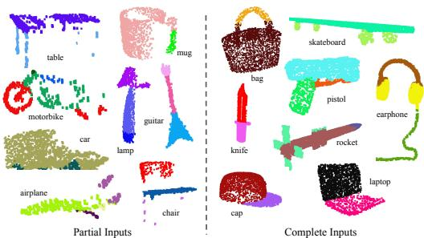  
Figure 3. Qualitative results for part segmentation. We visualize the CAD part segmentation results across all 16 object categories. We show both results for partial simulated Kinect scans (left block) and complete ShapeNet CAD models (right block).

定理 1. 设 $f ~ : ~ \mathcal { X } ~ ~ \mathbb { R }$ 是一个关于 Hausdorff 距离 $d _ { H } ( \cdot , \cdot )$ 的连续集函数，对于任意的 $\epsilon > 0$，存在一个连续函数 $h$ 和一个对称函数 $g ( x _ { 1 } , . . . , x _ { n } ) = \gamma \circ M A X$，使得对于任意 $S \in { \mathcal { X }$，其中 $x _ { 1 } , \ldots , x _ { n }$ 是 $S$ 中所有元素的任意顺序排列，$\gamma$ 是一个连续函数，而 MAX 是一个向量最大值操作符，它接收 $n$ 个向量作为输入并返回一个元素逐个比较的最大值向量。

$$
\left| f ( S ) - \gamma \left( M A X \left\{ h ( x _ { i } ) \right\} \right) \right| < \epsilon
$$

该定理的证明可以在我们的补充材料中找到。关键思想是，在最坏情况下，网络可以学习将点云转换为体积表示，通过将空间划分为相等大小的体素。然而在实践中，网络学习到了一种更智能的策略来探测空间，正如我们将在点函数可视化中所看到的。瓶颈维度和稳定性，我们在理论和实验中发现，最大池化层的维度，即（1）中的 $K$ 强烈影响我们的网络的表达能力。我们提供了一种分析，这也揭示了与我们模型的稳定性相关的特性。我们定义 $\mathbf{u} = \underset{x_i \in S}{\mathbf{M A X}} \{ h(x_i) \}$ 为子网络 $f$，它将 $[0,1]^{m}$ 中的点集映射到 $K$ 维向量。以下定理告诉我们，输入集中小的损坏或额外噪声点不太可能改变我们的网络输出：定理 2。假设 $\mathbf{u} ~ : ~ \boldsymbol{\mathcal{X}} ~ \to ~ \mathbb{R}^{K}$ 使得 ${\bf u} = M A X \{ h(x_i) \}$ 且 $f = \gamma \circ \mathbf{u}$。那么，(a) $\forall S, \exists {\mathcal{C}}_{S}, {\mathcal{N}}_{S} \subseteq {\mathcal{X}}, f(T) = f(S) \text{ if } {\mathcal{C}}_{S} \subseteq T \subseteq {\mathcal{N}}_{S};$ (b) $|{\mathcal{C}}_{S}| \leq K$。

<table><tr><td rowspan=1 colspan=1></td><td rowspan=1 colspan=1>input</td><td rowspan=1 colspan=1>#views</td><td rowspan=1 colspan=1>accuracyavg. class</td><td rowspan=1 colspan=1>accuracyoverall</td></tr><tr><td rowspan=1 colspan=1>SPH [11]</td><td rowspan=1 colspan=1>mesh</td><td rowspan=1 colspan=1>-</td><td rowspan=1 colspan=1>68.2</td><td rowspan=1 colspan=1>-</td></tr><tr><td rowspan=1 colspan=1>3DShapeNets [28]VoxNet [17]Subvolume [18]</td><td rowspan=1 colspan=1>volumevolumevolume</td><td rowspan=1 colspan=1>11220</td><td rowspan=1 colspan=1>77.383.086.0</td><td rowspan=1 colspan=1>84.785.989.2</td></tr><tr><td rowspan=1 colspan=1>LFD [28]MVCNN [23]</td><td rowspan=1 colspan=1>imageimage</td><td rowspan=1 colspan=1>1080</td><td rowspan=1 colspan=1>75.590.1</td><td rowspan=1 colspan=1>--</td></tr><tr><td rowspan=2 colspan=1>Ours baselineOurs PointNet</td><td rowspan=1 colspan=1>point</td><td rowspan=1 colspan=1>-</td><td rowspan=2 colspan=1>72.686.2</td><td rowspan=2 colspan=1>77.489.2</td></tr><tr><td rowspan=1 colspan=1>point</td><td rowspan=1 colspan=1>1</td></tr></table>

Table 1. Classification results on ModelNet40. Our net achieves state-of-the-art among deep nets on 3D input.

我们解释定理的含义。（a）指出，如果保留了所有$\mathcal{C}_S$中的点，则$f(S)$在输入扰动下保持不变；对于额外的噪声点，$f(S)$也在$\mathcal{N}_S$的范围内保持不变。（b）指出$\mathcal{C}_S$仅包含由（1）中的$K$决定的有限数量的点。换句话说，$f(S)$实际上是由不超过$K$个元素的有限子集$\mathcal{C}_S \subseteq S$所完全决定的。因此，我们称$\mathcal{C}_S$为$S$的关键点集，$K$为$f$的瓶颈维度。结合$h$的连续性，这解释了我们模型对于点扰动、损坏和额外噪声点的鲁棒性。鲁棒性是借鉴于机器学习模型中的稀疏性原则。直观地说，我们的网络通过一组稀疏的关键点来学习概括形状。在实验部分，我们看到这些关键点形成了对象的骨架。

# 5. 实验

实验分为四个部分。首先，我们展示了 PointNets 可以应用于多个 3D 识别任务（第 5.1 节）。其次，我们提供了详细的实验以验证我们的网络设计（第 5.2 节）。最后，我们可视化网络的学习内容（第 5.3 节）并分析时间和空间复杂度（第 5.4 节）。

# 5.1. 应用实例

在这一部分，我们展示了我们的网络如何被训练以执行3D物体分类、物体部件分割和语义场景分割。尽管我们处理的是一种全新的数据表示（点集），但我们能够在多个任务的基准测试中实现可比甚至更好的性能。3D物体分类我们的网络学习了可以用于物体分类的全局点云特征。我们在ModelNet40 [28] 形状分类基准上评估了我们的模型。该基准包含来自40个人造物体类别的12,311个CAD模型，其中9,843个用于训练，2,468个用于测试。虽然以往的方法关注于体积和多视图图像表示，但我们是第一个直接在原始点云上进行工作的。

<table><tr><td></td><td>mean</td><td>aero</td><td>bag</td><td>cap</td><td>car</td><td>chair</td><td>ear phone</td><td></td><td>guitar knife</td><td>lamp</td><td>laptop</td><td>motor</td><td>mug pistol</td><td></td><td>rocket</td><td>skate board</td><td>table</td></tr><tr><td># shapes</td><td></td><td>2690</td><td>76</td><td>55</td><td>898</td><td>3758</td><td>69</td><td>787</td><td>392</td><td>1547</td><td>451</td><td>202</td><td>184 283</td><td></td><td>66</td><td>152</td><td>5271</td></tr><tr><td>Wu [27]</td><td>-</td><td>63.2</td><td>-</td><td>-</td><td>-</td><td>73.5</td><td>-</td><td>-</td><td>-</td><td>74.4</td><td>-</td><td>-</td><td>-</td><td>-</td><td>-</td><td>-</td><td>74.8</td></tr><tr><td>Yi [29]</td><td>81.4</td><td>81.0</td><td>78.4</td><td>77.7</td><td>75.7</td><td>87.6</td><td>61.9</td><td>92.0</td><td>85.4</td><td>82.5</td><td>95.7</td><td>70.6</td><td>91.9 85.9</td><td></td><td>53.1</td><td>69.8</td><td>75.3</td></tr><tr><td>3DCNN</td><td>79.4</td><td>75.1</td><td>72.8</td><td>73.3</td><td>70.0</td><td>87.2</td><td>63.5</td><td>88.4</td><td>79.6</td><td>74.4</td><td>93.9</td><td>58.7</td><td>91.8 76.4</td><td></td><td>51.2</td><td>65.3</td><td>77.1</td></tr><tr><td>Ours</td><td>83.7</td><td>83.4</td><td>78.7</td><td>82.5</td><td>74.9</td><td>89.6</td><td>73.0</td><td>91.5</td><td>85.9</td><td>80.8</td><td>95.3</td><td>65.2</td><td>93.0 81.2</td><td></td><td>57.9</td><td>72.8</td><td>80.6</td></tr></table>

Table 2. Segmentation results on ShapeNet part dataset. Metric is $\overline { { \mathrm { m I o U } ( \% ) } }$ on points. We compare with two traditional methods [27] .

我们均匀地在网格面上根据面面积采样1024个点，并将其归一化到单位球体。在训练过程中，我们通过沿上方向随机旋转物体并对每个点的位置施加零均值且标准差为0.02的高斯噪声来实时扩充点云。在表1中，我们将我们的模型与之前的工作及使用多层感知器（MLP）在传统特征（提取自点云的点密度、D2、形状轮廓等）上的基线进行比较。我们的模型在基于3D输入（体积和点云）的方法中达到了最先进的性能。仅使用全连接层和最大池化，我们的网络在推理速度上取得了显著优势，并且能够轻松在CPU上并行化。我们的方法与基于多视图的方法（MVCNN [23]）之间仍存在小幅差距，我们认为这是由于渲染图像可以捕捉到的精细几何细节的丢失。3D对象部件分割 部件分割是一项具有挑战性的细粒度3D识别任务。给定一个3D扫描或网格模型，该任务是为每个点或面分配部件类别标签（例如，椅子腿、杯子把手）。我们在ShapeNet部分数据集上进行评估，该数据集包含来自16个类别的16,881个形状，总共标注了50个部件。大多数物体类别被标记为两个到五个部件。真实标注是在形状上采样的点上标注的。我们将部件分割表述为每点分类问题。评估指标为点的mIoU。对于每个类别C的形状S，计算该形状的mIoU：对于类别C中的每个部件类型，计算真实标签与预测之间的IoU。如果真实标签和预测点的并集为空，则将部件IoU计为1。然后，我们计算类别C中所有部件类型的IoU的平均值，以获得该形状的mIoU。为了计算类别的mIoU，我们对该类别中所有形状的mIoU取平均。在本节中，我们将我们的分割版本PointNet（图2的修改版，分割网络）与两个传统方法[27]和[29]进行比较，这两者都利用了逐点几何特征和形状之间的对应关系，以及我们自己的3D CNN基线。有关3D CNN的详细修改和网络架构，请参见补充材料。在表2中，我们报告了每个类别和均值 $\mathrm { I o U } ( \% )$ 的得分。我们观察到均值IoU提高了$2.3\%$，我们的网络在大多数类别中超越了基线方法。我们还对模拟的Kinect扫描进行了实验，以测试这些方法的鲁棒性。对于ShapeNet部分数据集中每个CAD模型，我们使用Blensor Kinect模拟器[7]从六个随机视角生成不完整的点云。我们在完整形状和部分扫描上使用相同的网络架构和训练设定来训练我们的PointNet。结果显示，我们的均值IoU损失仅为$5.3\%$。在图3中，我们展示了完整和部分数据的定性结果。可以看出，尽管部分数据相当具有挑战性，但我们的预测是合理的。场景中的语义分割 我们的部件分割网络可以轻松扩展到语义场景分割，其中点标签变为语义对象类别而不是对象部件标签。我们在斯坦福3D语义解析数据集[1]上进行实验。该数据集包含来自Matterport扫描仪的6个区域中的3D扫描，涵盖271个房间。扫描中的每个点都标注了来自13个类别（椅子、桌子、地板、墙壁等及杂乱物品）之一的语义标签。为了准备训练数据，我们首先按房间分割点，然后将房间采样为1米乘1米的块。我们训练我们的PointNet分割版本以预测每个块中的每个点的类别。每个点由9维向量表示，包含XYZ、RGB以及相对于房间的归一化位置（从0到1）。在训练时，我们在每个块中实时随机采样4096个点。在测试时，我们对所有点进行测试。我们遵循与[1]相同的协议，使用k折策略进行训练和测试。

Table 3. Results on semantic segmentation in scenes. Metric is average IoU over 13 classes (structural and furniture elements plus clutter) and classification accuracy calculated on points.   

<table><tr><td rowspan=1 colspan=1></td><td rowspan=1 colspan=1>mean IoU</td><td rowspan=1 colspan=1>overall accuracy</td></tr><tr><td rowspan=1 colspan=1>Ours baseline</td><td rowspan=1 colspan=1>20.12</td><td rowspan=1 colspan=1>53.19</td></tr><tr><td rowspan=1 colspan=1>Ours PointNet</td><td rowspan=1 colspan=1>47.71</td><td rowspan=1 colspan=1>78.62</td></tr></table>

<table><tr><td></td><td>table</td><td>chair</td><td>sofa</td><td>board</td><td>mean</td></tr><tr><td># instance</td><td>455</td><td>1363</td><td>55</td><td>137</td><td></td></tr><tr><td>Armeni et al. [1]</td><td>46.02</td><td>16.15</td><td>6.78</td><td>3.91</td><td>18.22</td></tr><tr><td>Ours</td><td>46.67</td><td>33.80</td><td>4.76</td><td>11.72</td><td>24.24</td></tr></table>

Table 4. Results on 3D object detection in scenes. Metric is average precision with threshold IoU 0.5 computed in 3D volumes.

  
Figure 4. Qualitative results for semantic segmentation. Top row is input point cloud with color. Bottom row is output semantic segmentation result (on points) displayed in the same camera viewpoint as input.

我们将我们的方法与使用手工提取的点特征的基线方法进行了比较。基线提取相同的9维局部特征以及三个额外特征：局部点密度、局部曲率和法线。我们使用标准的多层感知器作为分类器。结果如表3所示，我们的PointNet方法显著优于基线方法。在图4中，我们展示了定性分割结果。我们的网络能够输出平滑的预测，并且对缺失点和遮挡具有鲁棒性。基于我们网络的语义分割输出，我们进一步构建了一个使用连接组件进行物体提议的3D物体检测系统（详见补充材料）。我们在表4中与之前的最先进方法进行了比较。之前的方法基于滑动形状方法（带有条件随机场后处理），使用在体素网格中训练的支持向量机，基于局部几何特征和全局房间上下文特征。我们的方案在报告的家具类别上大幅超越了该方法。

# 5.2. 体系结构设计分析

在本节中，我们通过对照实验验证我们的设计选择。我们还展示了网络超参数的影响。与替代的无序方法进行比较如第4.2节所提到的，对于无序集合输入至少有三种选择。我们使用ModelNet40形状分类问题作为这些选择的比较测试平台，以下两个对照实验也会使用这个任务。我们比较的基线（如图5所示）包括对无序和有序点的多层感知机作为 $n \times 3$ 数组，考虑输入点作为序列的RNN模型，以及基于对称函数的模型。我们实验中的对称操作包括最大池化、平均池化以及基于注意力的加权和。注意力方法类似于[25]中的方法，其中从每个点特征预测一个标量分数，然后通过计算softmax对分数在点之间进行归一化。接着根据归一化的分数和点特征计算加权和。如图5所示，最大池化操作以大幅领先的优势实现了最佳性能，验证了我们的选择。

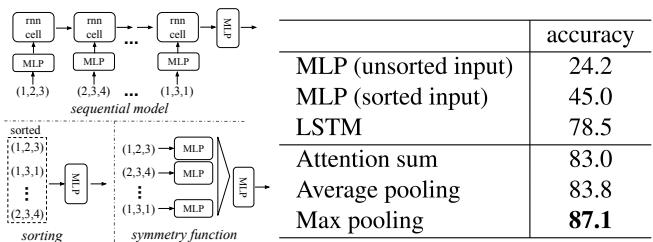  
Figure 5. Three approaches to achieve order invariance. Multilayer perceptron (MLP) applied on points consists of 5 hidden layers with neuron sizes 64,64,64,128,1024, all points share a single copy of MLP. The MLP close to the output consists of two layers with sizes 512,256.

输入和特征变换的有效性 在表5中，我们展示了输入和特征变换（用于对齐）的积极效果。值得注意的是，最基本的架构已经实现了相当合理的结果。使用输入变换可带来$0.8\%$的性能提升。正则化损失对于高维变换的有效性是必要的。通过结合这两种变换和正则化项，我们实现了最佳性能。 鲁棒性测试 我们展示了我们的PointNet，它虽然简单有效，但对各种输入干扰具有鲁棒性。我们使用与图5中最大池化网络相同的架构。输入点被标准化为单位球体。结果见图6。至于缺失点，当有$50\%$的点缺失时，相较于最远和随机输入采样，准确率仅下降$2.4\%$和$3.8\%$。如果网络在训练时见过这些异常点，它对异常点也具有鲁棒性。我们评估了两个模型：一个在具有$(x, y, z)$坐标的点上训练；另一个则是在$(x, y, z)$加上点密度上训练。即使有$20\%$的点是异常点，网络的准确率仍超过$80\%$。图6右侧显示网络对点的扰动具有鲁棒性。

Table 5. Effects of input feature transforms. Metric is overall classification accuracy on ModelNet40 test set.   

<table><tr><td>Transform</td><td>accuracy</td></tr><tr><td>none</td><td>87.1</td></tr><tr><td>input (3x3)</td><td>87.9</td></tr><tr><td>feature (64x64) feature (64x64) + reg.</td><td>86.9</td></tr><tr><td></td><td>87.4</td></tr><tr><td>both</td><td>89.2</td></tr></table>

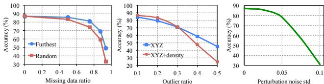  
Figure 6. PointNet robustness test. The metric is overall classification accuracy on ModelNet40 test set. Left: Delete points. Furthest means the original 1024 points are sampled with furthest sampling. Middle: Insertion. Outliers uniformly scattered in the unit sphere. Right: Perturbation. Add Gaussian noise to each point independently.

# 5.3. 可视化 PointNet

在图7中，我们可视化了关键点集 $\mathcal { C } _ { S }$ 和上界形状 $\mathcal { N } _ { S }$（如定理2所讨论）对于一些示例形状 $S$。两个形状之间的点集将精确地给出相同的全局形状特征 $f ( S )$。从图7中我们可以清楚地看到，关键点集 $\mathcal { C } _ { S }$，即贡献于最大池化特征的部分，总结了形状的骨架。上界形状 $\mathcal { N } _ { S }$ 展示了给出与输入点云 $S$ 相同全局形状特征 $f ( S )$ 的最大可能点云，而 $\mathcal { C } _ { S }$ 和 $\mathcal { N } _ { S }$ 反映了 PointNet 的鲁棒性，这意味着丢失一些非关键点并不会改变全局形状特征 $f ( S )$。上界形状 $\mathcal { N } _ { S }$ 是通过将一个边长为2的立方体中的所有点输入网络，并选择其点函数值 $( h _ { 1 } ( p ) , h _ { 2 } ( p ) , \cdot \cdot \cdot , h _ { K } ( p ) )$ 不大于全局形状描述符的点 $p$ 来构造的。

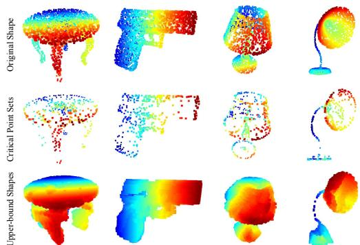  
Figure 7. Critical points and upper bound shape. While critical points jointly determine the global shape feature for a given shape, any point cloud that falls between the critical points set and the upper bound shape gives exactly the same feature. We color-code all figures to show the depth information.

# 5.4. 时间和空间复杂度分析

表6总结了我们分类PointNet的空间复杂度（网络中的参数数量）和时间复杂度（每个样本的浮点运算次数）。我们还将PointNet与以往工作中的一组代表性体积分和多视角基础架构进行了比较。尽管MVCNN和Subvolume（3D CNN）实现了高性能，但在计算成本（以FLOPs/sample衡量：分别为$ l 4 l x $和$ { \it 8 x } $更高效）方面，PointNet的效率更高。此外，在网络中的参数数量方面，PointNet相较于MVCNN具有更高的空间效率（$ l 7 x $更少的参数）。此外，PointNet的可扩展性较好，其空间和时间复杂度是$ O ( N ) $，与输入点的数量呈线性关系。然而，由于卷积操作主导了计算时间，多视角方法的时间复杂度与图像分辨率平方增长，而基于体积卷积的方法则随体积大小立方增长。根据经验，PointNet能够在TensorFlow上使用1080X GPU处理每秒超过一百万个点的点云分类（约每秒1K个对象）或语义分割（约每秒2个房间），显示出在实时应用中的巨大潜力。

<table><tr><td rowspan=1 colspan=1></td><td rowspan=1 colspan=1>#params</td><td rowspan=1 colspan=1>FLOPs/sample</td></tr><tr><td rowspan=1 colspan=1>PointNet (vanilla)PointNet</td><td rowspan=1 colspan=1>0.8M3.5M</td><td rowspan=1 colspan=1>148M440M</td></tr><tr><td rowspan=1 colspan=1>Subvolume [18]</td><td rowspan=1 colspan=1>16.6M</td><td rowspan=1 colspan=1>3633M</td></tr><tr><td rowspan=1 colspan=1>MVCNN [23]</td><td rowspan=1 colspan=1>60.0M</td><td rowspan=1 colspan=1>62057M</td></tr></table>

Table 6. Time and space complexity of deep architectures for 3D data classification. PointNet (vanilla) is the classification PointNet without input and feature transformations. FLOP stands for floating-point operation. The "M" stands for million. Subvolume and MVCNN used pooling on input data from multiple rotations or views, without which they have much inferior performance.

# 6. 结论

在这项工作中，我们提出了一个新颖的深度神经网络PointNet，能够直接处理点云。我们的网络为多个3D识别任务提供了一种统一的方法，包括物体分类、部件分割和语义分割，同时在标准基准测试上获得了与最先进技术相当或更好的结果。我们还提供了理论分析和可视化，以帮助理解我们的网络。致谢。作者感谢三星GRO资助、ONR MURI N00014-13-1-0341资助、NSF资助IIS-1528025、谷歌专注研究奖、来自Adobe公司的捐赠以及NVIDIA的硬件捐赠。

# References

[1] I. Armeni, O. Sener, A. R. Zamir, H. Jiang, I. Brilakis, M. Fischer, and S. Savarese. 3d semantic parsing of large-scale indoor spaces. In Proceedings of the IEEE International Conference on Computer Vision and Pattern Recognition, 2016. 6, 7   
[2] M. Aubry, U. Schlickewei, and D. Cremers. The wave kernel signature: A quantum mechanical approach to shape analysis. In Computer Vision Workshops (ICCV Workshops), 2011 IEEE International Conference on, pages 16261633. IEEE, 2011. 2   
[3] M. M. Bronstein and I. Kokkinos. Scale-invariant heat kernel signatures for non-rigid shape recognition. In Computer Vision and Pattern Recognition (CVPR), 2010 IEEE Conference on, pages 17041711. IEEE, 2010. 2   
[4] J. Bruna, W. Zaremba, A. Szlam, and Y. LeCun. Spectral networks and locally connected networks on graphs. arXiv preprint arXiv:1312.6203, 2013. 2   
[5] D.-Y. Chen, X.-P. Tian, Y.-T. Shen, and M. Ouhyoung. On visual similarity based 3d model retrieval. In Computer graphics forum, volume 22, pages 223232. Wiley Online Library, 2003.2   
[6] Y. Fang, J. Xie, G. Dai, M. Wang, F. Zhu, T. Xu, and E. Wong. 3d deep shape descriptor. In Proceedings of the IEEE Conference on Computer Vision and Pattern Recognition, pages 23192328, 2015. 2   
[7] M. Gschwandtner, R. Kwitt, A. Uhl, and W. Pree. BlenSor: Blender Sensor Simulation Toolbox Advances in Visual Computing. volume 6939 of Lecture Notes in Computer Science, chapter 20, pages 199208. Springer Berlin / Heidelberg, Berlin, Heidelberg, 2011. 6   
[8] K. Guo, D. Zou, and X. Chen. 3d mesh labeling via deep convolutional neural networks. ACM Transactions on Graphics (T0G), 35(1):3, 2015. 2   
[9] M. Jaderberg, K. Simonyan, A. Zisserman, et al. Spatial transformer networks. In NIPS 2015. 4   
[10] A. E. Johnson and M. Hebert. Using spin images for efficient object recognition in cluttered 3d scenes. IEEE Transactions on pattern analysis and machine intelligence, 21(5):433 449, 1999. 2   
[11] M. Kazhdan, T. Funkhouser, and S. Rusinkiewicz. Rotation invariant spherical harmonic representation of 3 d shape descriptors. In Symposium on geometry processing, volume 6, pages 156164, 2003. 5   
[12] Y. LeCun, L. Bottou, Y. Bengio, and P. Haffner. Gradientbased learning applied to document recognition. Proceedings of the IEEE, 86(11):22782324, 1998. 13   
[13] Y. Li, S. Pirk, H. Su, C. R. Qi, and L. J. Guibas. Fpnn: Field probing neural networks for 3d data. arXiv preprint arXiv:1605.06240, 2016. 2   
[14] H. Ling and D. W. Jacobs. Shape classification using the inner-distance. IEEE transactions on pattern analysis and machine intelligence, 29(2):286299, 2007. 2   
[15] L. v. d. Maaten and G. Hinton. Visualizing data using t-sne. Journal of Machine Learning Research, 9(Nov):25792605, 2008. 15 Geodesic convolutional neural networks on riemannian manifolds. In Proceedings of the IEEE International Conference on Computer Vision Workshops, pages 3745, 2015. 2 [17] D. Maturana and S. Scherer. Voxnet: A 3d convolutional neural network for real-time object recognition. In IEEE/RSJ International Conference on Intelligent Robots and Systems, September 2015. 2, 5, 10, 11 [18] C. R. Qi, H. Su, M. NieBner, A. Dai, M. Yan, and L. Guibas. Volumetric and multi-view cnns for object classification on   
3d data. In Proc. Computer Vision and Pattern Recognition (CVPR), IEEE, 2016. 2, 5, 8 [19] R. B. Rusu, N. Blodow, and M. Beetz. Fast point feature histograms (fpfh) for 3d registration. In Robotics and Automation, 2009. ICRA'09. IEEE International Conference on, pages 32123217. IEEE, 2009. 2 [20] R. B. Rusu, N. Blodow, Z. C. Marton, and M. Beetz. Aligning point cloud views using persistent feature histograms. In 2008 IEEE/RSJ International Conference on Intelligent Robots and Systems, pages 33843391. IEEE, 2008. 2 [21] M. Savva, F. Yu, H. Su, M. Aono, B. Chen, D. Cohen-Or, W. Deng, H. Su, S. Bai, X. Bai, et al. Shrec16 track largescale 3d shape retrieval from shapenet core55. 2 [22] P. Y. Simard, D. Steinkraus, and J. C. Platt. Best practices for convolutional neural networks applied to visual document analysis. In ICDAR, volume 3, pages 958962, 2003. 13 [23] H. Su, S. Maji, E. Kalogerakis, and E. G. Learned-Miller. Multi-view convolutional neural networks for 3d shape recognition. In Proc. ICCV, to appear, 2015. 2, 5, 6, 8 [24] J. Sun, M. Ovsjanikov, and L. Guibas. A concise and provably informative multi-scale signature based on heat diffusion. In Computer graphics forum, volume 28, pages   
13831392. Wiley Online Library, 2009. 2 [25] O. Vinyals, S. Bengio, and M. Kudlur. Order matters: Sequence to sequence for sets. arXiv preprint arXiv:1511.06391, 2015. 2, 4, 7 [26] D. Z. Wang and I. Posner. Voting for voting in online point cloud object detection. Proceedings of the Robotics: Science and Systems, Rome, Italy, 1317, 2015. 2 [27] Z. Wu, R. Shou, Y. Wang, and X. Liu. Interactive shape cosegmentation via label propagation. Computers & Graphics,   
38:248254, 2014. 6, 10 [28] Z. Wu, S. Song, A. Khosla, F. Yu, L. Zhang, X. Tang, and J. Xiao. 3d shapenets: A deep representation for volumetric shapes. In Proceedings of the IEEE Conference on Computer Vision and Pattern Recognition, pages 19121920, 2015. 2,   
5, 11 [29] L. Yi, V. G. Kim, D. Ceylan, I-C. Shen, M. Yan, H. Su, C.Lu, Q. Huang, A. Sheffer, and L. Guibas. A scalable active framework for region annotation in 3d shape collections. SIGGRAPH Asia, 2016. 6, 10, 18

# Supplementary

# A. Overview

This document provides additional quantitative results, technical details and more qualitative test examples to the main paper.

In Sec B we extend the robustness test to compare PointNet with VoxNet on incomplete input. In Sec C we provide more details on neural network architectures, training parameters and in Sec D we describe our detection pipeline in scenes. Then Sec E illustrates more applications of PointNet, while Sec F shows more analysis experiments. Sec G provides a proof for our theory on PointNet. At last, we show more visualization results in Sec H.

# B. Comparison between PointNet and VoxNet (Sec 5.2)

We extend the experiments in Sec 5.2 Robustness Test to compare PointNet and VoxNet [17] (a representative architecture for volumetric representation) on robustness to missing data in the input point cloud. Both networks are trained on the same train test split with 1024 number of points as input. For VoxNet we voxelize the point cloud to $3 2 \times 3 2 \times 3 2$ occupancy grids and augment the training data by random rotation around up-axis and jittering.

At test time, input points are randomly dropped out by a certain ratio. As VoxNet is sensitive to rotations, its prediction uses average scores from 12 viewpoints of a point cloud. As shown in Fig 8, we see that our PointNet is much more robust to missing points. VoxNet's accuracy dramatically drops when half of the input points are missing, from $8 6 . 3 \%$ to $4 6 . 0 \%$ with a $4 0 . 3 \%$ difference, while our PointNet only has a $3 . 7 \%$ performance drop. This can be explained by the theoretical analysis and explanation of our PointNet  it is learning to use a collection of critical points to summarize the shape, thus it is very robust to missing data.

# C. Network Architecture and Training Details (Sec 5.1)

PointNet Classification Network As the basic architecture is already illustrated in the main paper, here we provides more details on the joint alignment/transformation network and training parameters.

The first transformation network is a mini-PointNet that takes raw point cloud as input and regresses to a $3 \times 3$ matrix. It's composed of a shared $M L P ( 6 4 , 1 2 8 , 1 0 2 4 )$ network (with layer output sizes 64, 128, 1024) on each point, a max pooling across points and two fully connected layers with output sizes 512, 256. The output matrix is initialized as an identity matrix. All layers, except the last one, include ReLU and batch normalization. The second transformation network has the same architecture as the first one except that the output is a $6 4 \times 6 4$ matrix. The matrix is also initialized as an identity. A regularization loss (with weight 0.001) is added to the softmax classification loss to make the matrix close to orthogonal.

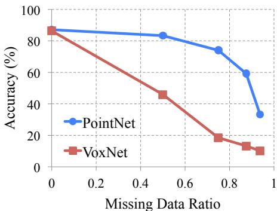  
Figure 8. PointNet v.s. VoxNet [17] on incomplete input data. Metric is overall classification accurcacy on ModelNet40 test set. Note that VoxNet is using 12 viewpoints averaging while PointNet is using only one view of the point cloud. Evidently PointNet presents much stronger robustness to missing points.

We use dropout with keep ratio 0.7 on the last fully connected layer, whose output dimension 256, before class score prediction. The decay rate for batch normalization starts with 0.5 and is gradually increased to 0.99. We use adam optimizer with initial learning rate 0.001, momentum 0.9 and batch size 32. The learning rate is divided by 2 every 20 epochs. Training on ModelNet takes 3-6 hours to converge with TensorFlow and a GTX1080 GPU.

PointNet Segmentation Network The segmentation network is an extension to the classification PointNet. Local point features (the output after the second transformation network) and global feature (output of the max pooling) are concatenated for each point. No dropout is used for segmentation network. Training parameters are the same as the classification network.

As to the task of shape part segmentation, we made a few modifications to the basic segmentation network architecture (Fig 2 in main paper) in order to achieve best performance, as illustrated in Fig 9. We add a one-hot vector indicating the class of the input and concatenate it with the max pooling layer's output. We also increase neurons in some layers and add skip links to collect local point features in different layers and concatenate them to form point feature input to the segmentation network.

While [27] and [29] deal with each object category independently, due to the lack of training data for some categories (the total number of shapes for all the categories in the data set are shown in the first line), we train our PointNet across categories (but with one-hot vector input to indicate category). To allow fair comparison, when testing these two models, we only predict part labels for the given specific object category.

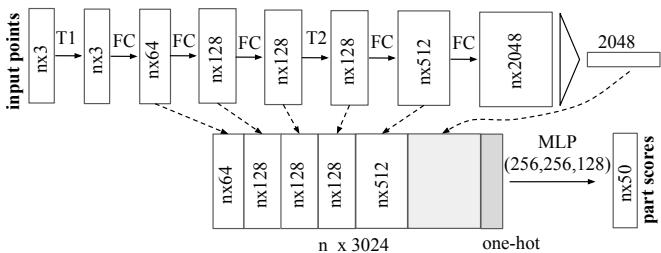  
Figure 9. Network architecture for part segmentation. T1 and T2 are alignment/transformation networks for input points and features. FC is fully connected layer operating on each point. MLP is multi-layer perceptron on each point. One-hot is a vector of size 16 indicating category of the input shape.

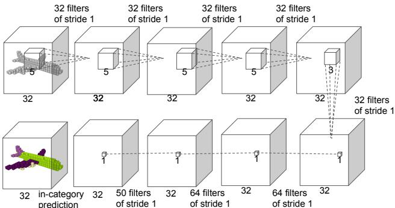  
Figure 10. Baseline 3D CNN segmentation network. The network is fully convolutional and predicts part scores for each voxel.

As to semantic segmentation task, we used the architecture as in Fig 2 in the main paper.

It takes around six to twelve hours to train the model on ShapeNet part dataset and around half a day to train on the Stanford semantic parsing dataset.

Baseline 3D CNN Segmentation Network In ShapeNet part segmentation experiment, we compare our proposed segmentation version PointNet to two traditional methods as well as a 3D volumetric CNN network baseline. In Fig 10, we show the baseline 3D volumetric CNN network we use. We generalize the well-known 3D CNN architectures, such as VoxNet [17] and 3DShapeNets [28] to a fully convolutional 3D CNN segmentation network.

For a given point cloud, we first convert it to the volumetric representation as a occupancy grid with resolution $3 2 \times 3 2 \times 3 2$ .Then, five 3D convolution operations each with 32 output channels and stride of 1 are sequentially applied to extract features. The receptive field is 19 for each voxel. Finally, a sequence of 3D convolutional layers with kernel size $1 \times 1 \times 1$ is appended to the computed feature map to predict segmentation label for each voxel. ReLU and batch normalization are used for all layers except the last one. The network is trained across categories, however, in order to compare with other baseline methods where object category is given, we only consider output scores in the given object category.

# D. Details on Detection Pipeline (Sec 5.1)

We build a simple 3D object detection system based on the semantic segmentation results and our object classification PointNet.

We use connected component with segmentation scores to get object proposals in scenes. Starting from a random point in the scene, we find its predicted label and use BFS to search nearby points with the same label, with a search radius of 0.2 meter. If the resulted cluster has more than 200 points (assuming a 4096 point sample in a 1m by 1m area), the cluster's bounding box is marked as one object proposal. For each proposed object, it's detection score is computed as the average point score for that category. Before evaluation, proposals with extremely small areas/volumes are pruned. For tables, chairs and sofas, the bounding boxes are extended to the floor in case the legs are separated with the seat/surface.

We observe that in some rooms such as auditoriums lots of objects (e.g. chairs) are close to each other, where connected component would fail to correctly segment out individual ones. Therefore we leverage our classification network and uses sliding shape method to alleviate the problem for the chair class. We train a binary classification network for each category and use the classifier for sliding window detection. The resulted boxes are pruned by non-maximum suppression. The proposed boxes from connected component and sliding shapes are combined for final evaluation.

In Fig 11, we show the precision-recall curves for object detection. We trained six models, where each one of them is trained on five areas and tested on the left area. At test phase, each model is tested on the area it has never seen. The test results for all six areas are aggregated for the PR curve generation.

# E. More Applications (Sec 5.1)

Model Retrieval from Point Cloud Our PointNet learns a global shape signature for every given input point cloud. We expect geometrically similar shapes have similar global signature. In this section, we test our conjecture on the shape retrieval application. To be more specific, for every given query shape from ModelNet test split, we compute its global signature (output of the layer before the score prediction layer) given by our classification PointNet and retrieve similar shapes in the train split by nearest neighbor search. Results are shown in Fig 12.

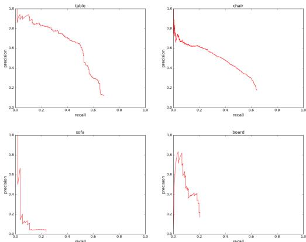  
Figure 11. Precision-recall curves for object detection in 3D point cloud. We evaluated on all six areas for four categories: table, chair, sofa and board. IoU threshold is 0.5 in volume.

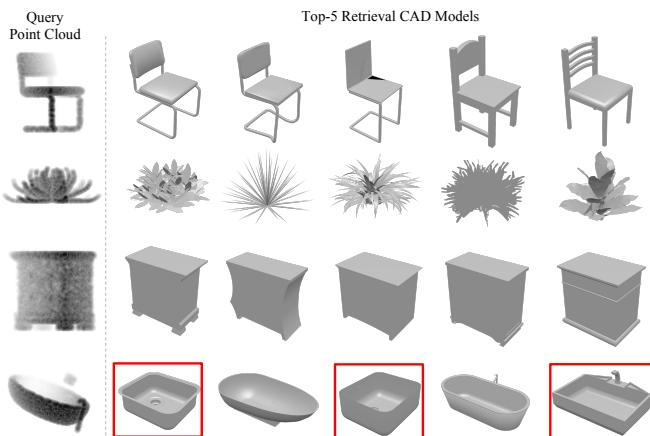  
Figure 12. Model retrieval from point cloud. For every given point cloud, we retrieve the top-5 similar shapes from the ModelNet test split. From top to bottom rows, we show examples of chair, plant, nightstand and bathtub queries. Retrieved results that are in wrong category are marked by red boxes.

Shape Correspondence In this section, we show that point features learnt by PointNet can be potentially used to compute shape correspondences. Given two shapes, we compute the correspondence between their critical point sets $C _ { S }$ 's by matching the pairs of points that activate the same dimensions in the global features. Fig 13 and Fig 14 show the detected shape correspondence between two similar chairs and tables.

# F. More Architecture Analysis (Sec 5.2)

Effects of Bottleneck Dimension and Number of Input Points Here we show our model's performance change with regard to the size of the first max layer output as well as the number of input points. In Fig 15 we see that performance grows as we increase the number of points however it saturates at around 1K points. The max layer size plays an important role, increasing the layer size from

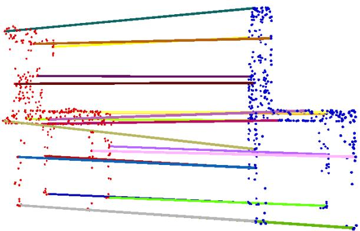  
Figure 13. Shape correspondence between two chairs. For the clarity of the visualization, we only show 20 randomly picked correspondence pairs.

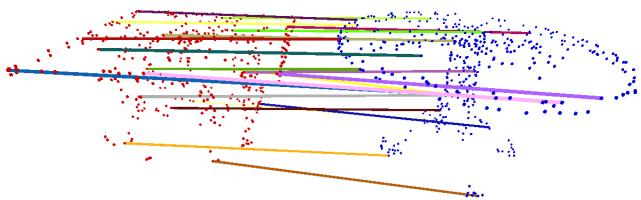  
Figure 14. Shape correspondence between two tables. For the clarity of the visualization, we only show 20 randomly picked correspondence pairs.

64 to 1024 results in a $2 - 4 \%$ performance gain. It indicates that we need enough point feature functions to cover the 3D space in order to discriminate different shapes.

It's worth notice that even with 64 points as input (obtained from furthest point sampling on meshes), our network can achieve decent performance.

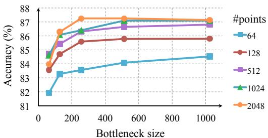  
Figure 15. Effects of bottleneck size and number of input points. The metric is overall classification accuracy on ModelNet40 test set.

MNIST Digit Classification While we focus on 3D point cloud learning, a sanity check experiment is to apply our network on a 2D point clouds - pixel sets.

To convert an MNIST image into a 2D point set we threshold pixel values and add the pixel (represented as a point with $( x , y )$ coordinate in the image) with values larger than 128 to the set. We use a set size of 256. If there are more than 256 pixels int he set, we randomly sub-sample it; if there are less, we pad the set with the one of the pixels in the set (due to our max operation, which point to use for the padding will not affect outcome).

As seen in Table 7, we compare with a few baselines including multi-layer perceptron that considers input image as an ordered vector, a RNN that consider input as sequence from pixel (0,0) to pixel (27,27), and a vanilla version CNN. While the best performing model on MNIST is still well engineered CNNs (achieving less than $0 . 3 \%$ error rate), it's interesting to see that our PointNet model can achieve reasonable performance by considering image as a 2D point set.

Table 7. MNIST classification results. We compare with vanilla versions of other deep architectures to show that our network based on point sets input is achieving reasonable performance on this traditional task.   

<table><tr><td rowspan=1 colspan=1></td><td rowspan=1 colspan=1>input</td><td rowspan=1 colspan=1>error (%)</td></tr><tr><td rowspan=1 colspan=1>Multi-layer perceptron [22]LeNet5 [12]</td><td rowspan=1 colspan=1>vectorimage</td><td rowspan=1 colspan=1>1.600.80</td></tr><tr><td rowspan=1 colspan=1>Ours PointNet</td><td rowspan=1 colspan=1>point set</td><td rowspan=1 colspan=1>0.78</td></tr></table>

Normal Estimation In segmentation version of PointNet, local point features and global feature are concatenated in order to provide context to local points. However, it's unclear whether the context is learnt through this concatenation. In this experiment, we validate our design by showing that our segmentation network can be trained to predict point normals, a local geometric property that is determined by a point's neighborhood.

We train a modified version of our segmentation PointNet in a supervised manner to regress to the groundtruth point normals. We just change the last layer of our segmentation PointNet to predict normal vector for each point. We use absolute value of cosine distance as loss.

Fig. 16 compares our PointNet normal prediction results (the left columns) to the ground-truth normals computed from the mesh (the right columns). We observe a reasonable normal reconstruction. Our predictions are more smooth and continuous than the ground-truth which includes flipped normal directions in some region.

Segmentation Robustness As discussed in Sec 5.2 and Sec B, our PointNet is less sensitive to data corruption and missing points for classification tasks since the global shape feature is extracted from a collection of critical points from the given input point cloud. In this section, we show that the robustness holds for segmentation tasks too. The per-point part labels are predicted based on the combination of perpoint features and the learnt global shape feature. In Fig 17, we illustrate the segmentation results for the given input point clouds $S$ (the left-most column), the critical point sets $\mathcal { C } _ { S }$ (the middle column) and the upper-bound shapes $\mathcal { N } _ { S }$ .

  
Figure 16. PointNet normal reconstrution results. In this figure, we show the reconstructed normals for all the points in some sample point clouds and the ground-truth normals computed on the mesh.

Network Generalizability to Unseen Shape Categories In Fig 18, we visualize the critical point sets and the upperbound shapes for new shapes from unseen categories (face, house, rabbit, teapot) that are not present in ModelNet or ShapeNet. It shows that the learnt per-point functions are generalizable. However, since we train mostly on manmade objects with lots of planar structures, the reconstructed upper-bound shape in novel categories also contain more planar surfaces.

# G. Proof of Theorem (Sec 4.3)

Let ${ \mathcal { X } } = \{ S : S \subseteq [ 0 , 1 ]$ and $\left| S \right| = n \}$ .

$f : \mathcal { X } \ \to \ \mathbb { R }$ is a continuous function on $\mathcal { X }$ w.r.t to Hausdorff distance $d _ { H } ( \cdot , \cdot )$ if the following condition is satisfied:

$\forall \epsilon > 0 , \exists \delta > 0$ , for any $S , S ^ { \prime } \in { \mathcal { X } }$ , if $d _ { H } ( S , S ^ { \prime } ) < \delta$ , then $| f ( S ) - f ( S ^ { \prime } ) | < \epsilon$ .

We show that $f$ can be approximated arbitrarily by composing a symmetric function and a continuous function.

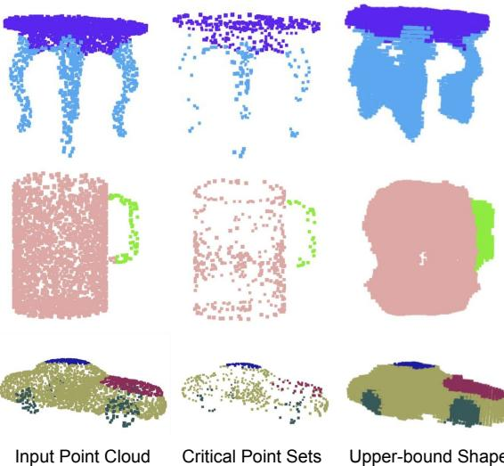  
Figure 17. The consistency of segmentation results. We illustrate the segmentation results for some sample given point clouds $S$ , their critical point sets $\mathcal { C } _ { S }$ and upper-bound shapes $\mathcal { N } _ { S }$ . We observe that the shape family between the $\mathcal { C } _ { S }$ and $\mathcal { N } _ { S }$ share a consistent segmentation results.

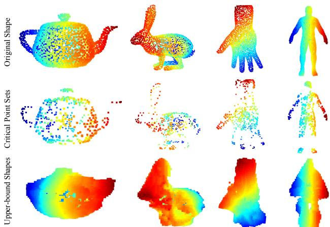  
Figure 18. The critical point sets and the upper-bound shapes for unseen objects. We visualize the critical point sets and the upper-bound shapes for teapot, bunny, hand and human body, which are not in the ModelNet or ShapeNet shape repository to test the generalizability of the learnt per-point functions of our PointNet on other unseen objects. The images are color-coded to reflect the depth information.

Theorem 1. Suppose $f ~ : ~ \mathcal { X } ~  ~ \mathbb { R }$ is a continuous set function w.rt Hausdorff distance $d _ { H } ( \cdot , \cdot )$ $\forall \epsilon \_ >$ 0, 3 a continuous function $h$ and a symmetric function $g ( x _ { 1 } , \dots , x _ { n } ) = \gamma \circ M A X ,$ where $\gamma$ is a continuous function, MAX is a vector max operator that takes n vectors as input and returns a new vector of the element-wise maximum, such that for any $S \in { \mathcal { X } }$ ,

$$
| f ( S ) - \gamma ( M A X ( h ( x _ { 1 } ) , \ldots , h ( x _ { n } ) ) ) | < \epsilon
$$

where $x _ { 1 } , \ldots , x _ { n }$ are the elements of $S$ extracted in certain

order,

Proof. By the continuity of $f$ , we take $\delta _ { \epsilon }$ so that $| f ( S ) -$ $f ( S ^ { \prime } ) | < \epsilon$ for any $S , S ^ { \prime } \in { \mathcal { X } }$ if $d _ { H } ( S , S ^ { \prime } ) < \delta _ { \epsilon }$ .

Define $K = \lceil 1 / \delta _ { \epsilon } \rceil$ , which split $[ 0 , 1 ]$ into $K$ intervals evenly and define an auxiliary function that maps a point to the left end of the interval it lies in:

$$
\sigma ( x ) = { \frac { \lfloor K x \rfloor } { K } }
$$

Let ${ \tilde { S } } = \{ \sigma ( x ) : x \in S \}$ , then

$$
| f ( S ) - f ( \tilde { S } ) | < \epsilon
$$

because $d _ { H } ( S , \tilde { S } ) < 1 / K \le \delta _ { \epsilon }$

Let $h _ { k } ( x ) = e ^ { - d ( x , [ \frac { k - 1 } { K } , \frac { k } { K } ] ) }$ be a soft indicator function where $d ( x , I )$ is the point to set (interval) distance. Let $\mathbf { h } ( x ) = [ h _ { 1 } ( x ) ; \dots ; h _ { K } ( x ) ]$ , then $\mathbf { h } : \mathbb { R }  \mathbb { R } ^ { K }$ .

Let $\dot { v _ { j } } ( x _ { 1 } , \ldots , x _ { n } ) = \operatorname* { m a x } \{ \tilde { h } _ { j } ( x _ { 1 } ) , \ldots , \tilde { h } _ { j } ( x _ { n } ) \}$ , indicating the occupancy of the $j$ -th interval by points in $S$ . Let $\mathbf { v } = [ v _ { 1 } ; \dots ; v _ { K } ]$ , then $\bar { \textbf { v } } : \underbrace { \mathbb { R } \times \ldots \times \bar { \mathbb { R } } } _ { n }  \{ 0 , 1 \} ^ { K }$ is a symmetric function, indicating the occupancy of each interval by points in $S$ .

Define $\tau : \{ 0 , 1 \} ^ { K } \to \mathcal { X }$ as $\begin{array} { r } { \tau ( v ) = \{ \frac { k - 1 } { K } : v _ { k } \geq 1 \} } \end{array}$ , which maps the occupancy vector to a set which contains the left end of each occupied interval. It is easy to show:

$$
\tau ( \mathbf { v } ( x _ { 1 } , \ldots , x _ { n } ) ) \equiv \tilde { S }
$$

where $x _ { 1 } , \ldots , x _ { n }$ are the elements of $S$ extracted in certain order.

Let $\gamma : \mathbb { R } ^ { K }  \mathbb { R }$ be a continuous function such that $\gamma ( \mathbf { v } ) = f ( \tau ( \mathbf { v } ) )$ for $v \in \{ 0 , 1 \} ^ { K }$ Then,

$$
\begin{array} { r l } & { ~ | \gamma ( \mathbf { v } ( x _ { 1 } , \ldots , x _ { n } ) ) - f ( S ) | } \\ & { = | f ( \tau ( \mathbf { v } ( x _ { 1 } , \ldots , x _ { n } ) ) ) - f ( S ) | < \epsilon } \end{array}
$$

Note that $\gamma ( \mathbf { v } ( x _ { 1 } , \ldots , x _ { n } ) )$ can be rewritten as follows:

$$
\begin{array} { r l } { \gamma ( \mathbf v ( x _ { 1 } , \ldots , x _ { n } ) ) } & { = \gamma ( \mathbf { M A X } ( \mathbf h ( x _ { 1 } ) , \ldots , \mathbf h ( x _ { n } ) ) ) } \\ & { = ( \gamma \circ \mathbf M \mathbf A \mathbf X ) ( \mathbf h ( x _ { 1 } ) , \ldots , \mathbf h ( x _ { n } ) ) } \end{array}
$$

Obviously $\gamma \circ \mathbf { M A X }$ is a symmetric function.

Next we give the proof of Theorem 2. We define $\textbf { u } = \underset { x _ { i } \in S } { \mathrm { M A X } } \{ h ( x _ { i } ) \}$ to be the sub-network of $f$ which maps a point set in $[ 0 , 1 ] ^ { m }$ to a $K$ -dimensional vector. The following theorem tells us that small corruptions or extra noise points in the input set is not likely to change the output of our network:

Theorem 2. Suppose u : $\smash { \mathcal { X } \to \mathbb { R } ^ { K } }$ such that ${ \bf u } \ =$ $M A X \{ h ( x _ { i } ) \}$ and $f = \gamma \circ \mathbf { u }$ Then,

(a) $\forall S , \exists \mathcal { C } _ { S } , \mathcal { N } _ { S } \subseteq \mathcal { X } , f ( T ) = f ( S ) i f \mathcal { C } _ { S } \subseteq T \subseteq \mathcal { N } _ { S } ;$

(b) $| { \mathcal { C } } _ { S } | \leq K$

Proof. Obviously, $\forall S \in { \mathcal { X } }$ , $f ( S )$ is determined by $\mathbf { u } ( S )$ . So we only need to prove that $\forall S , \exists { } C _ { S } , { \mathcal { N } } _ { S } \subseteq { \mathcal { X } } , f ( T ) =$ $f ( S )$ if ${ \mathcal { C } } _ { S } \subseteq T \subseteq N _ { S }$ .

For the $j$ th dimension as the output of $\mathbf { u }$ , there exists at least one $x _ { j } \in { \mathcal { X } }$ such that $h _ { j } ( x _ { j } ) = \mathbf { u } _ { j }$ , where $h _ { j }$ is the $j$ th dimension of the output vector from $h$ . Take $\mathcal { C } _ { S }$ as the union of all $x _ { j }$ for $j = 1 , \dots , K$ . Then, $\mathcal { C } _ { S }$ satisfies the above condition.

Adding any additional points $x$ such that $h ( x ) \leq \mathbf { u } ( S )$ at all dimensions to $\mathcal { C } _ { S }$ does not change $\mathbf { u }$ , hence $f$ .Therefore, $\tau _ { S }$ can be obtained adding the union of all such points to $\mathcal { N } _ { S }$ .

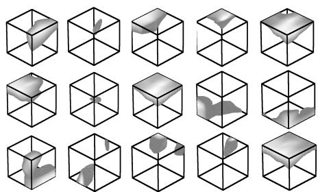  
Figure 19. Point function visualization. For each per-point function $h$ , we calculate the values $h ( p )$ for all the points $p$ in a cube of diameter two located at the origin, which spatially covers the unit sphere to which our input shapes are normalized when training our PointNet. In this figure, we visualize all the points $p$ that give $h ( p ) > 0 . 5$ with function values color-coded by the brightness of the voxel. We randomly pick 15 point functions and visualize the activation regions for them.

# H. More Visualizations

Classification Visualization We use t-SNE[15] to embed point cloud global signature (1024-dim) from our classification PointNet into a 2D space. Fig 20 shows the embedding space of ModelNet 40 test split shapes. Similar shapes are clustered together according to their semantic categories.

Segmentation Visualization We present more segmentation results on both complete CAD models and simulated Kinect partial scans. We also visualize failure cases with error analysis. Fig 21 and Fig 22 show more segmentation results generated on complete CAD models and their simulated Kinect scans. Fig 23 illustrates some failure cases. Please read the caption for the error analysis.

Scene Semantic Parsing Visualization We give a visualization of semantic parsing in Fig 24 where we show input point cloud, prediction and ground truth for both semantic segmentation and object detection for two office rooms and one conference room. The area and the rooms are unseen in the training set.

Point Function Visualization Our classification PointNet computes $K$ (we take $K = 1 0 2 4$ in this visualization) dimension point features for each point and aggregates all the per-point local features via a max pooling layer into a single $K$ -dim vector, which forms the global shape descriptor.

To gain more insights on what the learnt per-point functions $h$ 's detect, we visualize the points $p _ { i }$ 's that give high per-point function value $f ( \boldsymbol { p } _ { i } )$ in Fig 19. This visualization clearly shows that different point functions learn to detect for points in different regions with various shapes scattered in the whole space.

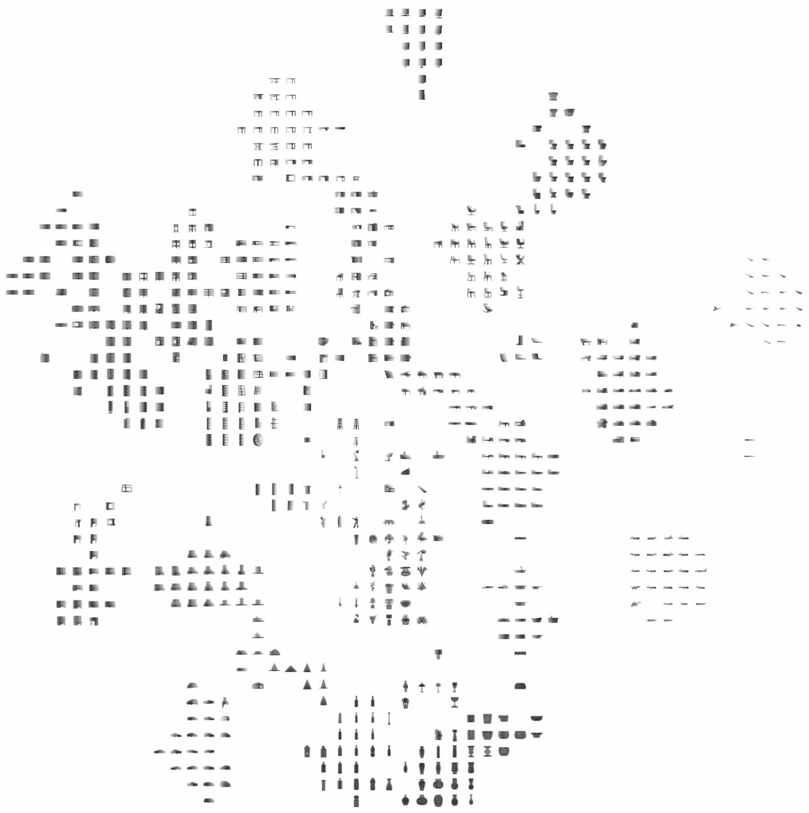  
shapes in ModelNet40 test split.

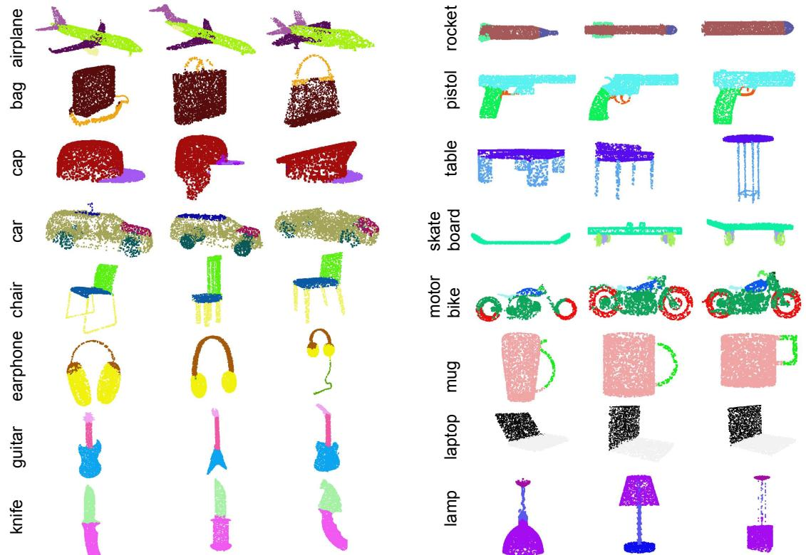  
Figure 21. PointNet segmentation results on complete CAD models.

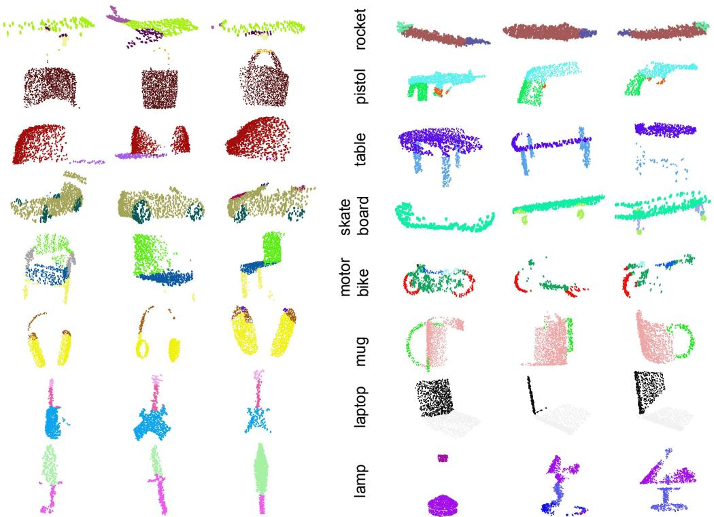  
Figure 22. PointNet segmentation results on simulated Kinect scans.

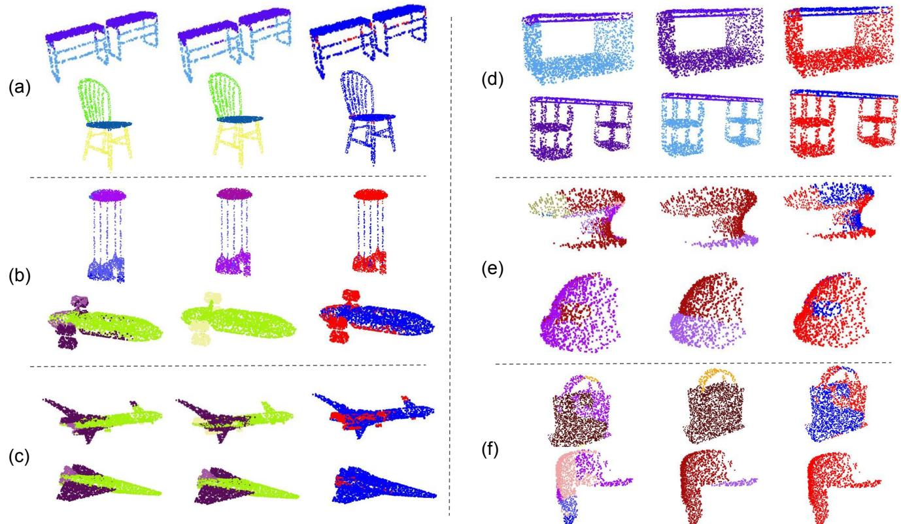  
T enough variety. There are only 54 bags and 39 caps in the whole dataset for the two categories shown here.

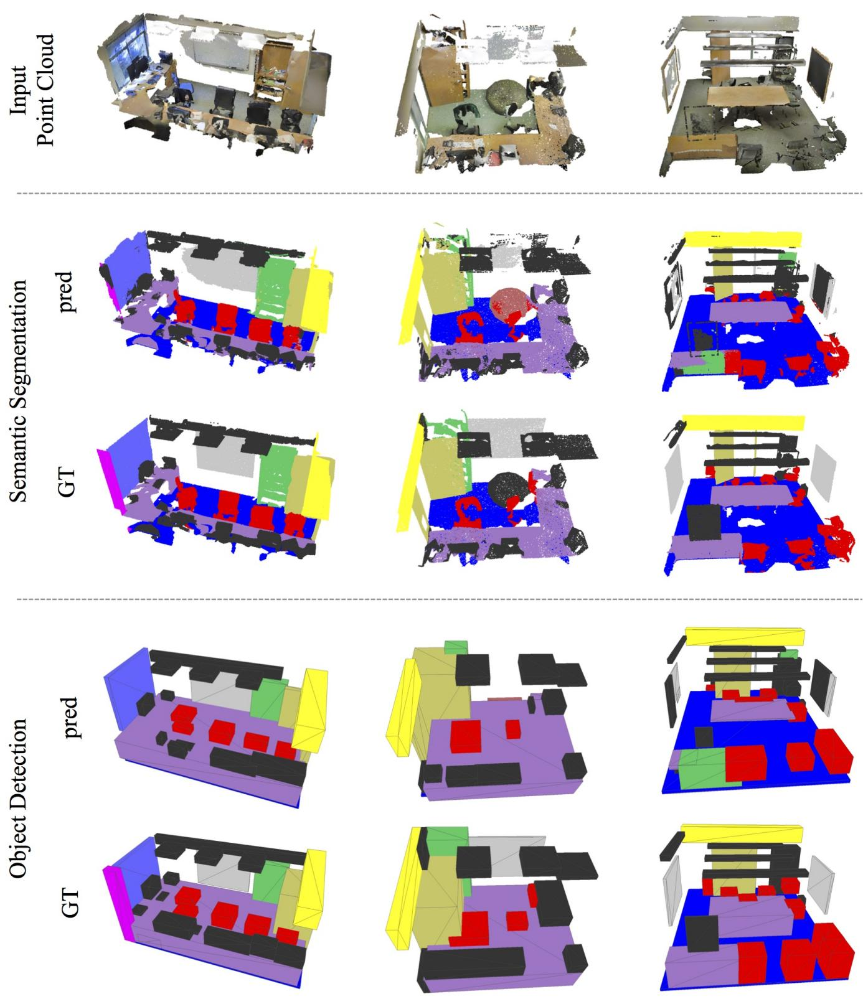  
bounding boxes, where predicted boxes are from connected components based on semantic segmentation prediction.