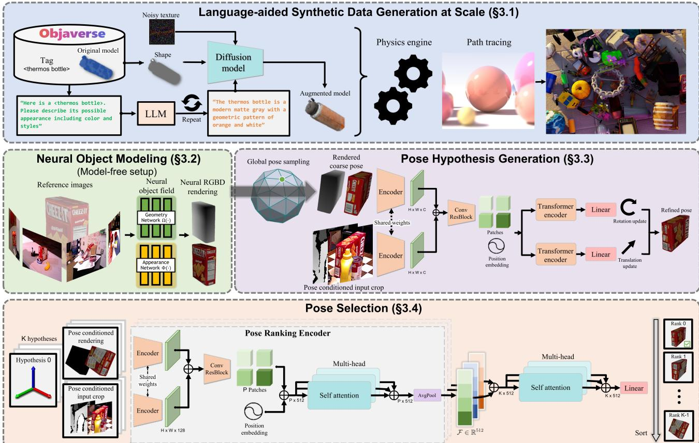

# 1. Bibliographic Information

## 1.1. Title
FoundationPose: Unified 6D Pose Estimation and Tracking of Novel Objects

## 1.2. Authors
Bowen Wen, Wei Yang, Jan Kautz, Stan Birchfield. They are researchers affiliated with **NVIDIA**, a leading company in AI and computer graphics.

## 1.3. Journal/Conference
This paper was published at the **IEEE/CVF Conference on Computer Vision and Pattern Recognition (CVPR) 2024**. CVPR is widely considered the top-tier conference in computer vision research, known for its high selectivity and significant impact on the field.

## 1.4. Publication Year
The paper was first released as a preprint on December 13, 2023, and officially published in 2024.

## 1.5. Abstract
The authors present `FoundationPose`, a unified foundation model designed for **6D object pose estimation and tracking**. Unlike traditional methods that require specific training for each object (instance-level) or category, `FoundationPose` generalizes to **novel objects** instantly at test time. It supports two primary scenarios: **model-based** (where a 3D CAD model is provided) and **model-free** (where only a few reference images are available). The framework uses a **neural implicit representation** to bridge these setups, enabling high-quality view synthesis. Generalization is achieved through large-scale synthetic training using a **Large Language Model (LLM)** for data augmentation, a transformer-based architecture, and contrastive learning. Evaluation across multiple public datasets shows that it significantly outperforms specialized state-of-the-art methods.

## 1.6. Original Source Link
*   **PDF Link:** [https://arxiv.org/pdf/2312.08344.pdf](https://arxiv.org/pdf/2312.08344.pdf)
*   **Project Page:** [https://nvlabs.github.io/FoundationPose/](https://nvlabs.github.io/FoundationPose/)

    ---

# 2. Executive Summary

## 2.1. Background & Motivation
The **6D object pose** refers to the combination of an object's **3D translation** (position in space) and **3D rotation** (orientation) relative to a camera. This is a fundamental requirement for robotics (e.g., a robot arm grasping a tool) and Augmented Reality (AR).

Prior research faced three main limitations:
1.  **Instance-level methods:** Required a textured CAD model and specific training for every single object. They cannot handle a new object they haven't seen during training.
2.  **Category-level methods:** Could handle new objects but only within a specific category (e.g., only different types of "mugs").
3.  **Setup Fragmentation:** Research was split between "model-based" and "model-free" setups, requiring different algorithms for each.

    The core challenge is **generalization**: How can a model estimate the pose of an object it has never seen before, regardless of whether it has a CAD model or just a few photos?

## 2.2. Main Contributions / Findings
*   **Unified Foundation Model:** A single framework that handles both estimation (single frame) and tracking (video) for novel objects in both model-based and model-free modes.
*   **Neural Object Modeling:** Introduced a neural implicit representation (specifically a **Signed Distance Field** or **SDF**) that creates a 3D-like understanding from just a few reference images, making the "model-free" setup look like a "model-based" setup to the rest of the system.
*   **LLM-Aided Data Generation:** Used **ChatGPT** and diffusion models to automatically generate massive amounts of diverse, realistic synthetic training data, bypassing the need for manual real-world labeling.
*   **Transformer-Based Architecture:** A novel network design for pose refinement and selection that leverages global context to rank different pose guesses.
*   **Superior Performance:** Outperformed existing specialized methods by a large margin on datasets like `YCB-Video` and `LINEMOD`, even rivaling methods that were specifically trained on those objects.

    ---

# 3. Prerequisite Knowledge & Related Work

## 3.1. Foundational Concepts
*   **6D Pose (SE(3)):** The pose of a rigid object is defined in a space called $SE(3)$ (Special Euclidean Group). It consists of $R$ (a $3 \times 3$ rotation matrix) and $t$ (a $3 \times 1$ translation vector).
*   **Model-based vs. Model-free:** 
    *   **Model-based:** You have a perfect 3D CAD model (like a `.obj` file) of the object. 
    *   **Model-free:** You only have a few "reference" photos of the object from different angles.
*   **Neural Implicit Representation (SDF):** Unlike a mesh (made of triangles) or a point cloud, a **Signed Distance Field (SDF)** represents a 3D shape as a function. For any point `(x, y, z)` in space, the function returns the distance to the nearest surface. If the value is negative, the point is inside the object; if positive, it's outside. This allows for smooth, continuous shape modeling.
*   **Transformers & Self-Attention:** A neural network architecture originally from NLP. The `Self-Attention` mechanism allows the model to look at different parts of an image (or different pose hypotheses) and understand their relationships.
*   **Render-and-Compare:** A technique where the computer "guesses" a pose, renders an image of the object at that pose, compares it to the real photo, and then adjusts the guess to minimize the difference.

## 3.2. Previous Works
*   **Instance-level (e.g., PVN3D, DeepIM):** These were highly accurate but fragile because they required re-training for every new object.
*   **MegaPose:** A recent milestone in novel object pose estimation. It used "render-and-compare" but relied on standard CNNs and was not unified for tracking or model-free setups as effectively.
*   **FS6D:** A "few-shot" method for novel objects. It used a specific matching strategy but struggled with textureless objects.

## 3.3. Technological Evolution
The field has moved from **geometry-based matching** (finding edges/corners) to **Deep Learning on specific objects** (instance-level) to **Category-level learning**, and finally to **Foundation Models** like `FoundationPose` that aim for "Zero-shot" performance—working on anything right out of the box.

---

# 4. Methodology

## 4.1. Principles
The core intuition of `FoundationPose` is that if we can create a high-quality 3D representation of a novel object (using a CAD model or a few photos), we can use a **general-purpose** neural network to compare that 3D representation against a real-world camera observation. By training on millions of synthetic examples with diverse textures, the model learns the *concept* of "alignment" rather than the features of a specific object.

The following figure (Figure 2 from the original paper) shows the overall system architecture:

*该图像是图解，展示了FoundationPose方法的关键模块，包括语言辅助的合成数据生成、神经对象建模和姿态选择等步骤。左侧表示通过语言模型生成对象示例，右侧描述了姿态假设生成和排名的过程。*

## 4.2. Core Methodology In-depth (Layer by Layer)

### 4.2.1. Step 1: LLM-aided Synthetic Data Generation
To generalize, the model needs to see a massive variety of objects. The authors used the `Objaverse` dataset (40k+ 3D models). However, many models have poor textures.
1.  **Prompting:** They used **ChatGPT** to describe possible appearances for an object (e.g., "a weathered, rusty iron wrench").
2.  **Texture Synthesis:** This text was fed into a diffusion model (`TexFusion`) to create realistic textures.
3.  **Simulation:** Objects were dropped into a physics simulator (`NVIDIA Isaac Sim`) to create realistic clutters and lighting for training.

### 4.2.2. Step 2: Neural Object Modeling (For Model-free Setup)
When no CAD model is available, the system builds an **Object-Centric Neural Field**.
1.  **Geometry Function:** $\Omega : x \mapsto s$. This maps a 3D point $x$ to a signed distance value $s$.
2.  **Appearance Function:** $\Phi : (f_{\Omega(x)}, n, d) \mapsto c$. This takes a feature from the geometry, the surface normal $n$, and view direction $d$ to output a color $c$.
3.  **Learning:** They optimize this field using several losses:
    *   **Color Loss ($\mathcal{L}_c$):** Compares rendered color to reference images.
        \$
        \mathcal{L}_c = \frac{1}{|\mathcal{R}|} \sum_{r \in \mathcal{R}} ||c(r) - \bar{c}(r)||_2
        \$
        Where `c(r)` is the rendered ray color and $\bar{c}(r)$ is the ground truth.
    *   **SDF Losses:** Includes an **Eikonal regularization** ($\mathcal{L}_{eik}$) to ensure the gradient of the SDF has a magnitude of 1, a mathematical property of true distance fields:
        \$
        \mathcal{L}_{eik} = \frac{1}{|\mathcal{X}_s|} \sum_{x \in \mathcal{X}_s} (||\nabla \Omega(x)||_2 - 1)^2
        \$

### 4.2.3. Step 3: Pose Hypothesis Generation & Refinement
1.  **Initialization:** The object is detected in the image. The system samples a set of initial poses from an **icosphere** (a sphere with 42 viewpoints) and in-plane rotations.
2.  **Transformer Refiner:** For a given pose guess, the system renders the object. It then crops the real image and the rendered image and feeds them into a transformer-based network.
3.  **Disentangled Update:** The network predicts an update for translation $\Delta t$ and rotation $\Delta R$. They are applied separately:
    \$
    t^+ = t + \Delta t
    \$
    \$
    R^+ = \Delta R \otimes R
    \$
    This "disentanglement" prevents the rotation update from messing up the translation calculation.

### 4.2.4. Step 4: Hierarchical Pose Selection
Out of many refined guesses, one must be chosen.
1.  **First Level:** A CNN extracts features from the image-render pair.
2.  **Second Level (Global Context):** A transformer looks at the features of **all** $K$ pose hypotheses together. This allows it to compare them relatively.
3.  **Contrastive Ranking Loss:** The model is trained to give higher scores to poses that are closer to the truth using a triplet loss:
    \$
    \mathcal{L}(i^+, i^-) = \max(\mathbf{S}(i^-) - \mathbf{S}(i^+) + \alpha, 0)
    \$
    Where $\mathbf{S}$ is the score, $i^+$ is a "good" pose, $i^-$ is a "bad" pose, and $\alpha$ is a margin (gap).

---

# 5. Experimental Setup

## 5.1. Datasets
The authors used five benchmark datasets:
*   **YCB-Video:** 21 household objects in various cluttered scenes.
*   **LINEMOD & Occluded-LINEMOD:** Challenging objects, some heavily hidden by others.
*   **T-LESS:** Industrial, textureless, and symmetric objects.
*   **YCBInEOAT:** Videos of objects being moved by a robot arm (for tracking).

## 5.2. Evaluation Metrics
1.  **ADD (Average Distance):**
    *   **Definition:** Measures the average distance between 3D points on the object model in the predicted pose vs. the ground truth pose.
    *   **Formula:** $m = \frac{1}{n} \sum_{x \in \mathcal{M}} ||(Rx + t) - (\bar{R}x + \bar{t})||$
    *   **Symbols:** $\mathcal{M}$ is the set of 3D points on the model, $n$ is the count, `(R, t)` is the prediction, $(\bar{R}, \bar{t})$ is the ground truth.
2.  **ADD-S (ADD-Symmetry):**
    *   **Definition:** Used for symmetric objects (like a bowl). It finds the distance to the *closest* point on the ground truth model, so the exact rotation doesn't matter if the object looks the same.
    *   **Formula:** $m = \frac{1}{n} \sum_{x_1 \in \mathcal{M}} \min_{x_2 \in \mathcal{M}} ||(Rx_1 + t) - (\bar{R}x_2 + \bar{t})||$
3.  **AUC (Area Under Curve):** The percentage of test cases where the ADD or ADD-S error is below a certain threshold (usually 10cm).

## 5.3. Baselines
*   **MegaPose:** The previous best for novel objects.
*   **OnePose++:** A model-free competitor.
*   **DeepIM / se(3)-TrackNet:** Instance-level trackers.

    ---

# 6. Results & Analysis

## 6.1. Core Results Analysis
`FoundationPose` set new records across the board. In the model-free setup on `YCB-Video`, it achieved an **ADD-S AUC of 97.4%**, far exceeding the previous best `FS6D` (88.4%). Even more impressive, it beat methods that were specifically trained on those objects.

The following are the results from Table 1 of the original paper (Model-free Pose Estimation on YCB-Video):

<table>
<thead>
<tr>
<th rowspan="2">Object</th>
<th colspan="2">PREDATOR</th>
<th colspan="2">LoFTR</th>
<th colspan="2">FS6D-DPM</th>
<th colspan="2">Ours</th>
</tr>
<tr>
<th>ADD-S</th>
<th>ADD</th>
<th>ADD-S</th>
<th>ADD</th>
<th>ADD-S</th>
<th>ADD</th>
<th>ADD-S</th>
<th>ADD</th>
</tr>
</thead>
<tbody>
<tr>
<td>Master Chef Can</td>
<td>73.0</td>
<td>17.4</td>
<td>87.2</td>
<td>50.6</td>
<td>92.6</td>
<td>36.8</td>
<td><strong>96.9</strong></td>
<td><strong>91.3</strong></td>
</tr>
<tr>
<td>Cracker Box</td>
<td>41.7</td>
<td>8.3</td>
<td>71.8</td>
<td>25.5</td>
<td>83.9</td>
<td>24.5</td>
<td><strong>97.5</strong></td>
<td><strong>96.2</strong></td>
</tr>
<tr>
<td>... (Average)</td>
<td>71.0</td>
<td>24.3</td>
<td>52.5</td>
<td>26.2</td>
<td>88.4</td>
<td>42.1</td>
<td><strong>97.4</strong></td>
<td><strong>91.5</strong></td>
</tr>
</tbody>
</table>

## 6.2. Tracking Results
In the tracking task, `FoundationPose` remained highly robust. Unlike many trackers that drift over time, this method's refinement module keeps the object locked.

The following are the results from Table 4 (Pose tracking on YCBInEOAT):

<table>
<thead>
<tr>
<th>Metric</th>
<th>se(3)-TrackNet</th>
<th>BundleTrack</th>
<th>BundleSDF</th>
<th>Ours</th>
</tr>
</thead>
<tbody>
<tr>
<td>ADD-S AUC</td>
<td>95.53</td>
<td>92.53</td>
<td>93.77</td>
<td><strong>96.42</strong></td>
</tr>
<tr>
<td>ADD AUC</td>
<td>92.66</td>
<td>87.34</td>
<td>86.95</td>
<td><strong>93.09</strong></td>
</tr>
</tbody>
</table>

## 6.3. Ablation Studies
The authors proved that:
1.  **LLM-Augmentation** improved accuracy by making the model robust to different lighting/colors.
2.  **Hierarchical Comparison** was crucial; without it (ranking poses individually), the accuracy dropped significantly because the model couldn't "weigh" different hypotheses against each other.

    ---

# 7. Conclusion & Reflections

## 7.1. Conclusion Summary
`FoundationPose` represents a significant leap toward a general-purpose vision system for robotics. By unifying model-based/model-free setups and estimation/tracking into a single transformer-based framework, it eliminates the need for per-object engineering. Its reliance on massive, high-quality synthetic data proves that we can train "foundation models" for 3D tasks similar to how we train them for language (LLMs).

## 7.2. Limitations & Future Work
*   **Reliance on 2D Detection:** If the initial 2D box is wrong, the 6D pose will fail. The system is only as good as its "object finder."
*   **Symmetry Ambiguity:** While good, it can still struggle with perfectly symmetric objects (like a white sphere) where there are no visual cues for rotation.
*   **Inference Speed:** While tracking is fast (32Hz), the initial pose estimation takes about 1.3 seconds, which might be too slow for some high-speed robotic tasks.

## 7.3. Personal Insights & Critique
This paper is a masterclass in **system integration**. It doesn't just propose a new loss function; it builds an entire data-generation-to-inference pipeline. 
*   **Innovation:** Using LLMs to guide 3D texture synthesis is a clever way to solve the "sim-to-real" gap. 
*   **Critique:** The paper assumes the object is rigid. If the object is deformable (like a piece of clothing) or articulated (like a laptop), this specific framework would likely fail. 
*   **Application:** This technology is a direct enabler for **Universal Robots** that can walk into a new kitchen, look at a tool they've never seen, and immediately know how to pick it up.