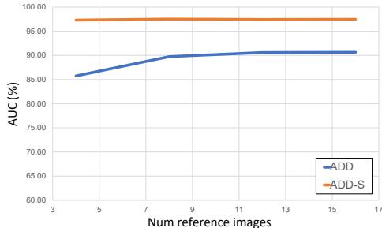
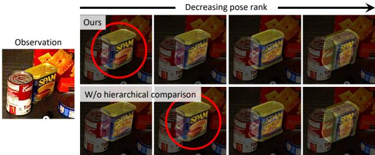

# 1. 论文基本信息

## 1.1. 标题
**FoundationPose: Unified 6D Pose Estimation and Tracking of Novel Objects**
（FoundationPose：统一的新型物体 6D 位姿估计与跟踪框架）

## 1.2. 作者
**Bowen Wen, Wei Yang, Jan Kautz, Stan Birchfield**
隶属于 <strong>NVIDIA (英伟达)</strong>。该团队在计算机视觉、机器人感知和合成數據生成领域具有深厚的研究背景。

## 1.3. 发表期刊/会议
发表于 **CVPR 2024** (IEEE/CVF Conference on Computer Vision and Pattern Recognition)。CVPR 是计算机视觉领域的顶级国际会议（通常被视为 A 类会议），具有极高的学术影响力和认可度。

## 1.4. 发表年份
**2023年12月**（预印本发布），正式发表于 2024 年。

## 1.5. 摘要
本文提出了 `FoundationPose`，这是一个统一的基础模型，用于解决 <strong>6D 物体位姿估计 (6D Object Pose Estimation)</strong> 和 <strong>位姿跟踪 (Pose Tracking)</strong> 任务。该模型具有极强的通用性，支持 <strong>基于模型的 (model-based)</strong>（提供 CAD 模型）和 <strong>无模型的 (model-free)</strong>（仅提供少量参考图像）两种设置。其核心创新在于：通过 <strong>大语言模型 (LLM)</strong> 辅助生成大规模合成数据、设计了新型的 **Transformer** 架构、引入 <strong>对比學習 (Contrastive Learning)</strong> 方案，并利用 <strong>神经隐式表示 (Neural Implicit Representation)</strong> 桥接了有无 CAD 模型之间的鸿沟。实验证明，该方法在无需针对特定物体进行微调的情况下，性能大幅超越了现有的专门化方法。

## 1.6. 原文链接
*   **PDF 链接:** [https://arxiv.org/pdf/2312.08344v2.pdf](https://arxiv.org/pdf/2312.08344v2.pdf)
*   **项目主页:** [https://nvlabs.github.io/FoundationPose/](https://nvlabs.github.io/FoundationPose/)
*   **发布状态:** 已正式发表。

    ---

# 2. 整体概括

## 2.1. 研究背景与动机
*   **核心问题:** 传统的 6D 位姿估计方法通常是 <strong>实例级 (Instance-level)</strong> 的，即模型只能识别训练时见过的特定物体，且通常需要精确的 3D CAD 模型。<strong>类别级 (Category-level)</strong> 方法虽然放宽了限制，但仍局限于预定义的类别（如“椅子”或“瓶子”）。
*   **重要性:** 在机器人抓取、增强现实 (AR) 等应用中，系统经常会遇到全新的、从未见过的物体（即 <strong>新型物体 (Novel Objects)</strong>）。如果每次遇到新物体都要重新训练或寻找 CAD 模型，将极大限制技术的应用范围。
*   **现有挑战:**
    1.  **数据缺失:** 获取真实世界的 6D 位姿标注数据成本极高。
    2.  **设置不统一:** 现有的方法要么针对“有模型”设计，要么针对“无模型”设计，缺乏一个通用的框架。
    3.  **泛化性差:** 模型往往难以适应纹理稀疏、反光或被严重遮挡的物体。
*   **创新思路:** 构建一个“基础模型”，通过大规模合成数据学习通用的几何和纹理对齐特征，使得模型能够直接泛化到任何新物体上。

## 2.2. 核心贡献/主要发现
1.  **统一框架:** 首次提出了一个能同时处理位姿估计与跟踪、支持有/无 CAD 模型设置的统一模型。
2.  **LLM 辅助数据生成:** 利用大语言模型（如 ChatGPT）自动生成描述，指导扩散模型合成多样化的物体纹理，极大地扩展了训练数据集的规模和多样性。
3.  **神经对象建模:** 引入神经隐式场（基于 SDF）对无模型物体进行建模，实现了高效的新视角合成，将“无模型”问题转化为“渲染并比较”的统一流程。
4.  **卓越性能:** 在多个公共数据集上刷新了紀錄，甚至在减少假设的前提下，性能达到了与实例级专门方法相当的水平。

    ---

# 3. 预备知识与相关工作

## 3.1. 基础概念
*   <strong>6D 物体位姿 (6D Object Pose):</strong> 指物体相对于摄像机的 3D 位置（`x, y, z` 翻译）和 3D 姿态（俯仰、偏航、翻滚旋转）。它由一个旋转矩阵 $R \in SO(3)$ 和一个平移向量 $t \in \mathbb{R}^3$ 组成。
*   <strong>基于模型的 (Model-based):</strong> 假设在测试时已知物体的 3D 几何（如 `.obj` 或 `.stl` 文件）。
*   <strong>无模型的 (Model-free):</strong> 假设没有 3D 模型，只有几张从不同角度拍摄的物体参考照片。
*   <strong>神经辐射场 (NeRF) 与 有符号距离函数 (SDF):</strong> 
    *   <strong>神经辐射场 (Neural Radiance Fields, NeRF):</strong> 一种利用神经网络学习 3D 场景并进行高质量渲染的技术。
    *   <strong>有符号距离函数 (Signed Distance Function, SDF):</strong> 一种 3D 表示方法，对于空间中的点 $x$，函数 $\Omega(x)$ 返回该点到物体表面最近的距离。若点在物体内，距离为负；在物体外，距离为正；在表面上，距离为 0。

## 3.2. 前人工作与技术演进
*   <strong>渲染并比较 (Render-and-Compare):</strong> 这是一个经典策略（如 `MegaPose` [32]）。基本思路是：先猜一个位姿，渲染出物体图像，然后将其与实际观察到的图像对比，不断调整猜测位姿直到两者匹配。
*   <strong>位姿跟踪 (Pose Tracking):</strong> 相比于单帧估计，跟踪利用了视频序列的时间连续性，即当前帧的位姿通常与前一帧非常接近。
*   **差异化:** `FoundationPose` 的关键区别在于它不依赖于简单的关键点匹配（这在无纹理物体上容易失败），而是通过大规模合成训练学习了一种对形状和纹理都鲁棒的全局对齐能力。

    ---

# 4. 方法论

## 4.1. 方法原理
`FoundationPose` 的核心思想是：无论是否有 CAD 模型，都将其统一为 <strong>渲染并比较 (Render-and-Compare)</strong> 的架构。如果有 CAD 模型，直接渲染；如果没有，先用参考图像训练一个 <strong>神经对象场 (Neural Object Field)</strong>，再从中渲染。

## 4.2. 核心方法详解

### 4.2.1. 语言辅助的大规模数据生成
为了实现强大的泛化能力，作者构建了一个自动化流水线：
1.  **3D 资源搜集:** 从 `Objaverse` 等数据库获取数万个 3D 模型。
2.  **LLM 纹理增强:** 使用 ChatGPT 生成物体的外观描述（例如：“一个生锈的金属罐子”），然后输入到纹理扩散模型 `TexFusion` 中生成高质量、写实的纹理。
3.  **物理仿真:** 在 `NVIDIA Isaac Sim` 中进行物理模拟，生成包含堆叠、遮挡和复杂光照的真实合成场景。

### 4.2.2. 神经对象建模 (Neural Object Modeling)
在 <strong>无模型 (Model-free)</strong> 设置下，系统需要根据参考图像重建物体。
作者使用两个函数表示物体：
1.  <strong>几何函数 (Geometry Function):</strong> $\Omega : x \mapsto s$，将 3D 点 $x$ 映射到其 SDF 值 $s$。
2.  <strong>外观函数 (Appearance Function):</strong> $\Phi : (f_{\Omega(x)}, n, d) \mapsto c$，其中 $f_{\Omega(x)}$ 是几何特征，$n$ 是表面法向量，$d$ 是观察方向，$c$ 是颜色。

    **渲染过程:** 采用体积渲染 (Volumetric Rendering) 技术。沿着射线的颜色计算公式为：
$$
c(r) = \int_{z(r)-\lambda}^{z(r)+0.5\lambda} w(x_i) \Phi(f_{\Omega(x_i)}, n(x_i), d(x_i)) dt
$$
其中 $w(x_i)$ 是一个基于 SDF 值的钟形概率密度函数：
$$
w(x_i) = \frac{1}{1+e^{-\alpha \Omega(x_i)}} \frac{1}{1+e^{\alpha \Omega(x_i)}}
$$
*   $\alpha$: 调节分布的平滑度。
*   `z(r)`: 深度值。
*   $\lambda$: 截断距离（Truncation distance）。

    通过这种方式，系统可以将几张照片转换成一个可以随时从任意角度渲染的“数字孪生”模型。

### 4.2.3. 位姿假设生成与优化 (Pose Hypothesis Generation & Refinement)
1.  **初始化:** 使用 `CNOS` [47] 等物体检测器找到物体，并均匀采样一组初始旋转角度。
2.  **迭代优化:** 这是一个关键步骤。网络接收“实际观察到的图像裁剪块”和“当前位姿下渲染出的图像”，预测位姿的更新量。
    *   <strong>解耦表示 (Disentangled Representation):</strong> 网络分别预测平移更新 $\Delta t \in \mathbb{R}^3$ 和旋转更新 $\Delta R \in SO(3)$。
    *   **位姿更新公式:**
        $t^{+} = t + \Delta t$
        $R^{+} = \Delta R \otimes R$
        这种解耦方式（如下图 Figure 10 所示）避免了旋转更新影响平移学习，使训练更稳定。

### 4.2.4. 分层位姿选择 (Hierarchical Pose Selection)
由于初始化会产生多个候选位姿，需要选出最好的一个。
1.  **初步比较:** 对于每个候选位姿，计算渲染图与观察图的对齐特征 $\mathcal{F}$。
2.  **全局对比:** 将所有 $K$ 个位姿的特征串联成序列 $\mathbf{F} = [\mathcal{F}_0, \dots, \mathcal{F}_{K-1}]^\top$，输入 **Transformer** 编码器进行自注意力计算。这允许模型在所有候选者之间进行“横向对比”，选出相对最优解。
3.  **训练损失:** 采用 <strong>位姿条件三元组损失 (Pose-conditioned Triplet Loss)</strong>：
    $$
    \mathcal{L}(i^+, i^-) = \max(\mathbf{S}(i^-) - \mathbf{S}(i^+) + \alpha, 0)
    $$
    *   $\mathbf{S}(i)$: 位姿 $i$ 的得分。
    *   $i^+$: 正样本（接近真实位姿）。
    *   $i^-$: 负样本（远离真实位姿）。
    *   $\alpha$: 边缘裕量 (Margin)。

        ---

# 5. 實驗設置

## 5.1. 数据集
实验覆盖了 5 个极具挑战性的数据集：
1.  **LINEMOD & Occluded-LINEMOD:** 包含杂乱背景下的简单物体及严重遮挡情况。
2.  **YCB-Video:** 包含 21 种日常用品的视频序列。
3.  **T-LESS:** 包含形状相似、无纹理的工业零件，极具挑战性。
4.  **YCBInEOAT:** 包含机器人操作物体的动态场景。

    下图（原文 Figure 2）展示了系统处理这些数据的整体流程：

    
    *该图像是图解，展示了FoundationPose方法的关键模块，包括语言辅助的合成数据生成、神经对象建模和姿态选择等步骤。左侧表示通过语言模型生成对象示例，右侧描述了姿态假设生成和排名的过程。*

## 5.2. 评估指标
论文使用了该领域的标准化指标：
1.  **ADD (Average Distance of Model Points):**
    *   **概念定义:** 计算在 <strong>真实标注数据 (Ground Truth)</strong> 位姿下和预测位姿下，物体 3D 模型点之间的平均欧氏距离。
    *   **数学公式:**
        $$
        \mathrm{ADD} = \frac{1}{m} \sum_{x \in \mathcal{M}} \| (Rx + t) - (\bar{R}x + \bar{t}) \|
        $$
    *   **符号解释:** $m$ 为点数；$\mathcal{M}$ 为模型点集；`(R, t)` 为预测位姿；$(\bar{R}, \bar{t})$ 为真实位姿。
2.  **ADD-S (ADD for Symmetric objects):**
    *   **概念定义:** 专门针对对称物体，计算预测点到真实模型上**最近点**的平均距离。
    *   **数学公式:**
        $$
        \mathrm{ADD-S} = \frac{1}{m} \sum_{x_1 \in \mathcal{M}} \min_{x_2 \in \mathcal{M}} \| (Rx_1 + t) - (\bar{R}x_2 + \bar{t}) \|
        $$
3.  **AUC (Area Under Curve):** 指标在不同阈值下的精度曲线下面积。

## 5.3. 对比基线
*   **MegaPose [32]:** 目前最强的基于模型的通用位姿估计方法。
*   **OnePose++ [19], FS6D [22]:** 领先的无模型/少样本位姿估计方法。
*   **DeepIM [36], se(3)-TrackNet [67]:** 经典的位姿跟踪方法。

    ---

# 6. 实验结果与分析

## 6.1. 核心结果分析
*   **卓越的泛化力:** `FoundationPose` 在所有数据集上均显著优于现有方法。特别是在 `YCB-Video` 数据集上（无模型设置），其 `ADD-S` 的 `AUC` 达到了 **97.4%**，远超 `FS6D` 的 **88.4%**。
*   **跨设置统一:** 无论是有 CAD 模型还是只有 16 张参考图，模型的表现都非常稳健（见下图 Figure 6）。

    
    *该图像是图表，展示了参考图像数量对 AUC（%）的影响。随着参考图像数量的增加，ADD 和 ADD-S 的表现逐渐提高，其中 ADD 的 AUC 达到近 95%。*

## 6.2. 实验数据呈现
以下是原文 **Table 1** 关于 <strong>无模型位姿估计 (Model-free Pose Estimation)</strong> 的结果：

<table>
<thead>
<tr>
<th rowspan="2">数据集 (YCB-Video)</th>
<th colspan="2">FS6D-DPM [22]</th>
<th colspan="2">Ours (FoundationPose)</th>
</tr>
<tr>
<th>ADD-S</th>
<th>ADD</th>
<th>ADD-S</th>
<th>ADD</th>
</tr>
</thead>
<tbody>
<tr>
<td>002_master_chef_can</td>
<td>92.6</td>
<td>36.8</td>
<td>96.9</td>
<td>91.3</td>
</tr>
<tr>
<td>003_cracker_box</td>
<td>83.9</td>
<td>24.5</td>
<td>97.5</td>
<td>96.2</td>
</tr>
<tr>
<td>006_mustard_bottle</td>
<td>97.0</td>
<td>71.1</td>
<td>98.4</td>
<td>97.3</td>
</tr>
<tr>
<td>... 其他项略 ...</td>
<td>...</td>
<td>...</td>
<td>...</td>
<td>...</td>
</tr>
<tr>
<td><strong>MEAN (平均值)</strong></td>
<td><strong>88.4</strong></td>
<td><strong>42.1</strong></td>
<td><strong>97.4</strong></td>
<td><strong>91.5</strong></td>
</tr>
</tbody>
</table>

**分析:** 可以看出，FoundationPose 在 `ADD` 指标（衡量旋转精度更严格）上的提升尤为巨大（从 42.1 提升到 91.5），这证明了其 Transformer 架构和对比学习策略能捕捉到更精细的位姿差异。

## 6.3. 消融实验
*   **LLM 纹理增强的作用:** 去掉 LLM 辅助增强后，性能有所下降。这证明了合成数据的多样性对现实世界的泛化至关重要。
*   **分层比较的重要性:** 如下图 Figure 4 所示，引入全局对比（Hierarchical comparison）后，得分趋势变得更加平滑且符合直觉，能更准确地识别出最佳位姿。

    
    *该图像是一个示意图，展示了不同姿态排名的可视化效果。左侧为观察图像，上方展示了姿态排名逐渐降低的多个假设，其中红圈标记的为我们的方法预测的最佳姿态，而"W/o hierarchical comparison"则显示了不使用分层比较时的结果。*

---

# 7. 总结与思考

## 7.1. 结论总结
`FoundationPose` 成功展示了 <strong>基础模型 (Foundation Model)</strong> 在 3D 感知领域的潜力。通过“大规模合成训练 + 神经隐式建模桥接 + Transformer 迭代精炼”，它打破了物体实例和 CAD 模型的束缚，实现了真正意义上的“即插即用”式 6D 位姿处理。

## 7.2. 局限性与未来工作
*   **依赖检测器:** 该方法严重依赖外部的 2D 物体检测器（如 `CNOS`）。如果检测器漏检，位姿估计无从谈起。
*   **极度困难场景:** 在物体完全无纹理且被大面积遮挡的情况下，旋转估计仍可能失败（见 Figure 11）。
*   **未来方向:** 探索端到端的检测-估计-跟踪一体化框架，以及处理非刚性物体（如衣服、绳索）的位姿。

## 7.3. 个人启发与批判
*   **启发:** 这篇论文再次验证了“规模化 (Scaling)”的力量。通过 LLM 和扩散模型生成的合成数据，其质量和多样性已经足以让模型在不接触真实数据的情况下学到通用的物理几何规律。
*   **批判:** 尽管性能强大，但 1.3 秒/物体的推理速度在某些高频机器人控制场景（如 100Hz 以上的动态抓取）中仍显不足。未来的优化重点应在于如何在保持高精度的同时，进一步降低 Transformer 序列对比的计算开销。此外，对神经隐式场的依赖意味着在“无模型”模式下，仍需要一个简短的预处理阶段。