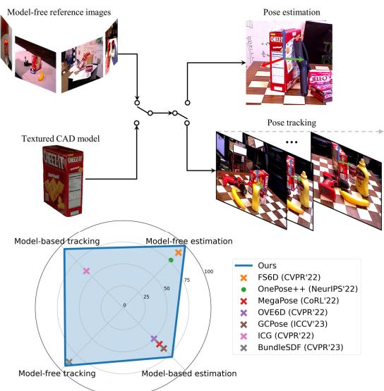
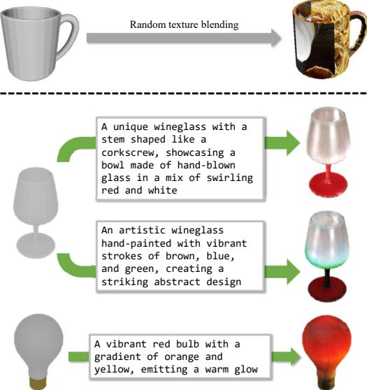
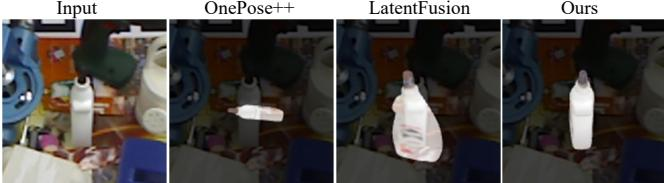
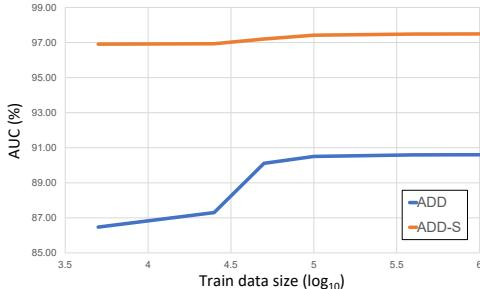
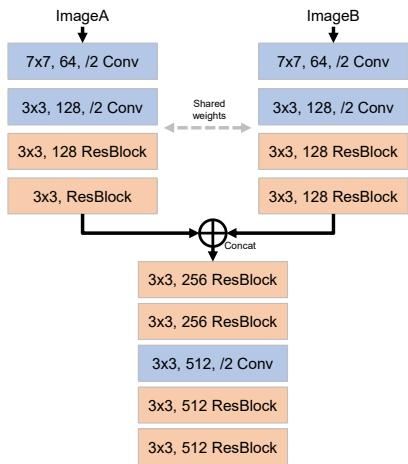
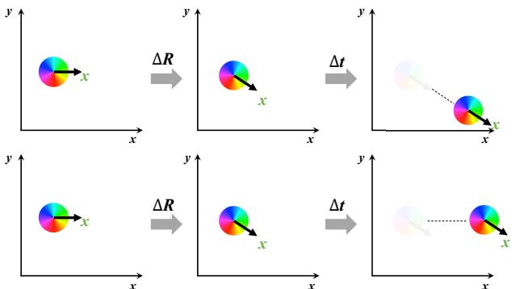
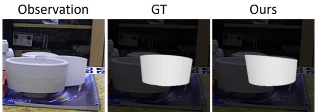

# FoundationPose: Unified 6D Pose Estimation and Tracking of Novel Objects

Bowen Wen Wei Yang Jan Kautz Stan Birchfield NVIDIA

# Abstract

We present FoundationPose, a unified foundation model for 6D object pose estimation and tracking, supporting both model-based and model-free setups. Our approach can be instantly applied at test-time to a novel object without finetuning, as long as its CAD model is given, or a small number of reference images are captured. Thanks to the unified framework, the downstream pose estimation modules are the same in both setups, with a neural implicit representation used for efficient novel view synthesis when no CAD model is available. Strong generalizability is achieved via large-scale synthetic training, aided by a large language model (LLM), a novel transformer-based architecture, and contrastive learning formulation. Extensive evaluation on multiple public datasets involving challenging scenarios and objects indicate our unified approach outperforms existing methods specialized for each task by a large margin. In addition, it even achieves comparable results to instance-level methods despite the reduced assumptions. Project page: https://nvlabs.github.io/FoundationPose/

# 1. Introduction

Computing the rigid 6D transformation from the object to the camera, also known as object pose estimation, is crucial for a variety of applications, such as robotic manipulation [30, 69, 70] and mixed reality [43]. Classic methods [20, 21, 31, 50, 68] are known as instance-level because they only work on the specific object instance determined at training time. Such methods usually require a textured CAD model for generating training data, and they cannot be applied to an unseen novel object at test time. While categorylevel methods [5, 34, 60, 64, 75] remove these assumptions (instance-wise training and CAD models), they are limited to objects within the predefined category on which they are trained. Moreover, obtaining category-level training data is notoriously difficult, in part due to additional pose canonicalization and examination steps [64] that must be applied. To address these limitations, more recent efforts have focused on the problem of instant pose estimation of arbitrary novel objects [19, 32, 40, 55, 58]. Two different setups are considered, depending upon what information is available at test time: model-based, where a textured 3D CAD model of the object is provided, and model-free, where a set of reference images of the object is provided. While much progress has been made on both setups individually, there remains a need for a single method to address both setups in a unified way, since different real-world applications provide different types of information.

  
Figure 1. Our unified framework enables both 6D pose estimation and tracking for novel objects, supporting the model-based and model-free setups. On each of these four tasks, it outperforms prior work specially designed for the task $\left( \bullet \right)$ indicates RGB-only; $\times$ indicates RGBD, like ours). The metric for each task is explained in detail in the experimental results.

Orthogonal to single-frame object pose estimation, pose tracking methods [8, 29, 36, 39, 56, 63, 67, 72] leverage temporal cues to enable more efficient, smooth and accurate pose estimation on a video sequence. These methods share the similar aforementioned issues to their counterparts in pose estimation, depending on their assumptions on the object knowledge. In this paper we propose a unified framework called FoundationPose that performs both pose estimation and tracking for novel objects in both the model-based and model-free setups, using RGBD images. As seen in Fig. 1, our method outperforms existing state-of-art methods specialized for each of these four tasks. Our strong generalizability is achieved via large-scale synthetic training, aided by a large language model (LLM), as well as a novel transformer-based architecture and contrastive learning. We bridge the gap between model-based and model-free setups with a neural implicit representation that allows for effective novel view synthesis with a small number $( \sim 1 6 )$ of reference images, achieving rendering speeds that are significantly faster than previous render-and-compare methods [32, 36, 67]. Our contributions can be summarized as follows: •We present a unified framework for both pose estimation and tracking for novel objects, supporting both modelbased and model-free setups. An object-centric neural implicit representation for effective novel view synthesis bridges the gap between the two setups. We propose a LLM-aided synthetic data generation pipeline which scales up the variety of 3D training assets by diverse texture augmentation. Our novel design of transformer-based network architectures and contrastive learning formulation leads to strong generalization when trained solely on synthetic data. Our method outperforms existing methods specialized for each task by a large margin across multiple public datasets. It even achieves comparable results to instancelevel methods despite reduced assumptions. Code and data developed in this work will be released.

# 2. Related Work

CAD Model-based Object Pose Estimation. Instancelevel pose estimation methods [20, 21, 31, 50] assume a textured CAD model is given for the object. Training and testing is performed on the exact same instance. The object pose is often solved by direct regression [37, 73], or constructing 2D-3D correspondences followed by PnP [50, 61], or 3D-3D correspondences followed by least squares fitting [20, 21]. To relax the assumptions about the object knowledge, category-level methods [5, 34, 60, 64, 75, 77] can be applied to novel object instances of the same category, but they cannot generalize to arbitrary novel objects beyond the predefined categories. To address this limitation, recent efforts [32, 55] aim for instant pose estimation of arbitrary novel objects as long as the CAD model is provided at test time.

Few-shot Model-free Object pose estimation. Modelfree methods remove the requirement of an explicit textured model. Instead, a number of reference images capturing the target object are provided [19, 22, 51, 58]. RLLG [3] and NeRF-Pose [35] propose instance-wise training without the need of an object CAD model. In particular, [35] constructs a neural radiance field to provide semi-supervision on the object coordinate map and mask. Differently, we introduce the neural object field built on top of SDF representation for efficient RGB and depth rendering to bridge the gap between the model-based and model-free scenarios. In addition, we focus on generalizable novel object pose estimation in this work, which is not the case for [3, 35]. To handle novel objects, Gen6D [40] designs a detection, retrieval and refinement pipeline. However, to avoid difficulties with out-of-distribution test set, it requires fine-tuning. OnePose [58] and its extension $\mathrm { O n e P o s e + + }$ [19] leverage structure-from-motion (SfM) for object modeling and pretrain 2D-3D matching networks to solve the pose from correspondences. FS6D [22] adopts a similar scheme and focuses on RGBD modality. Nevertheless, reliance on correspondences becomes fragile when applied to textureless objects or under severe occlusion. Object Pose Tracking. 6D object pose tracking aims to leverage temporal cues to enable more efficient, smooth and accurate pose prediction on video sequence. Through neural rendering, our method can be trivially extended to the pose tracking task with high efficiency. Similar to single-frame pose estimation, existing tracking methods can be categorized into their counterparts depending on the assumptions of object knowledge. These include instance-level methods [8, 11, 36, 67], category-level methods [39, 63], model-based novel object tracking [29, 56, 72] and model-free novel object tracking [66, 71]. Under both model-based and model-free setups, we set a new benchmark record across public datasets, even outperforming state-of-art methods that require instance-level training [8, 36, 67].

# 3. Approach

Our system as a whole is illustrated in Fig. 2, showing the relationships between the various components, which are described in the following subsections.

# 3.1. Language-aided Data Generation at Scale

To achieve strong generalization, a large diversity of objects and scenes is needed for training. Obtaining such data in the real world, and annotating accurate ground-truth 6D pose, is time- and cost-prohibitive. Synthetic data, on the other hand, often lacks the size and diversity in 3D assets. We developed a novel synthetic data generation pipeline for training, powered by the recent emerging resources and techniques: large scale 3D model database [6, 10], large language models (LLM), and diffusion models [4, 24, 53]. This approach dramatically scales up both the amount and diversity of data compared with prior work [22, 26, 32]. 3D Assets. We obtain training assets from recent large scale 3D databases including Objaverse [6] and GSO [10]. For Objaverse [6] we chose the objects from the ObjaverseLVIS subset that consists of more than 40K objects belonging to 1156 LVIS [13] categories. This list contains the most relevant daily-life objects with reasonable quality, and diversity of shapes and appearances. It also provides a tag for each object describing its category, which benefits automatic language prompt generation in the following LLMaided texture augmentation step.

  
y

  
Figure 3. Top: Random texture blending proposed in FS6D [22]. Bottom: Our LLM-aided texture augmentation yields more realistic appearance. Leftmost is the original 3D assets. Text prompts are automatically generated by ChatGPT.

LLM-aided Texture Augmentation. While most Objaverse objects have high quality shapes, their texture fidelity varies significantly. FS6D [22] proposes to augment object texture by randomly pasting images from ImageNet [7] or MS-COCO [38]. However, due to the random UV mapping, this method yields artifacts such as seams on the resulting textured mesh (Fig. 3 top); and applying holistic scene images to objects leads to unrealistic results. In contrast, we explore how recent advances in large language models and diffusion models can be harnessed for more realistic (and fully automatic) texture augmentation. Specifically, we provide a text prompt, an object shape, and a randomly initialized noisy texture to TexFusion [4] to produce an augmented textured model. Of course, providing such a prompt manually is not scalable if we want to augment a large number of objects in diverse styles under different prompt guidance. As a result, we introduce a two-level hierarchical prompt strategy. As illustrated in Fig. 2 top-left, we first prompt ChatGPT, asking it to describe the possible appearance of an object; this prompt is templated so that each time we only need to replace the tag paired with the object, which is given by the Objaverse-LVIS list. The answer from ChatGPT then becomes the text prompt provided to the diffusion model for texture synthesis. Because this approach enables full automation for texture augmentation, it facilitates diversified data generation at scale. Fig. 3 presents more examples including different stylization for the same object. Data Generation. Our synthetic data generation is implemented in NVIDIA Isaac Sim, leveraging path tracing for high-fidelity photo-realistic rendering.1 We perform gravity and physics simulation to produce physically plausible scenes. In each scene, we randomly sample objects including the original and texture-augmented versions. The object size, material, camera pose, and lighting are also randomized; more details can be found in the appendix.

# 3.2. Neural Object Modeling

For the model-free setup, when the 3D CAD model is unavailable, one key challenge is to represent the object to effectively render images with sufficient quality for downstream modules. Neural implicit representations are both effective for novel view synthesis and parallelizable on a GPU, thus providing high computational efficiency when rendering multiple pose hypotheses for downstream pose estimation modules, as shown in Fig. 2. To this end, we introduce an object-centric neural field representation for object modeling, inspired by previous work [45, 65, 71, 74].

Field Representation. We represent the object by two functions [74] as shown in Fig. 2. First, the geometry function $\Omega : x \mapsto s$ takes as input a 3D point $x \in \mathbb { R } ^ { 3 }$ and outputs a signed distance value $s \in \mathbb R$ .Second, the appearance function $\Phi : ( f _ { \Omega ( x ) } , n , d ) \mapsto c$ takes the intermediate feature vector $f _ { \Omega ( x ) }$ from the geometry network, a point normal $n \in \mathbb { R } ^ { 3 }$ , and a view direction $d \in \mathbb { R } ^ { 3 }$ , and outputs the color $c \in \mathbb { R } _ { + } ^ { 3 }$ . In practice, we apply multi-resolution hash encoding [45] to $x$ before forwarding to the network. Both $n$ and $d$ are embedded by a fixed set of second-order spherical harmonic coefficients. The implicit object surface is obtained by taking the zero level set of the signed distance field (SDF): $S = \left\{ x \in \mathbb { R } ^ { 3 } \mid \Omega ( x ) = 0 \right\}$ Compared to NeRF [44], the SDF representation $\Omega$ provides higher quality depth rendering while removing the need to manually select a density threshold. Field Learning. For texture learning, we follow the volumetric rendering over truncated near-surface regions [71]:

$$
c ( r ) = \int _ { z ( r ) - \lambda } ^ { z ( r ) + 0 . 5 \lambda } w ( x _ { i } ) \Phi ( f _ { \Omega ( x _ { i } ) } , n ( x _ { i } ) , d ( x _ { i } ) ) d t ,
$$

$$
w ( x _ { i } ) = \frac { 1 } { 1 + e ^ { - \alpha \Omega ( x _ { i } ) } } \frac { 1 } { 1 + e ^ { \alpha \Omega ( x _ { i } ) } } ,
$$

where $w ( x _ { i } )$ is the bell-shaped probability density function [65] that depends on the signed distance $\Omega ( x _ { i } )$ from the point to the implicit object surface, and $\alpha$ adjusts the softness of the distribution. The probability peaks at the surface intersection. In Eq. (1), $z ( r )$ is the depth value of the ray from the depth image, and $\lambda$ is the truncation distance. We ignore the contribution from empty space that is more than $\lambda$ away from the surface for more efficient training, and we only integrate up to a $0 . 5 \lambda$ penetrating distance to model self-occlusion [65]. During training, we compare this quantity against the reference RGB images for color supervision:

$$
\mathcal { L } _ { c } = \frac { 1 } { \vert \mathcal { R } \vert } \sum _ { r \in \mathcal { R } } \vert \vert c ( r ) - \bar { c } ( r ) \vert \vert _ { 2 } ,
$$

where $\bar { c } ( r )$ denotes the ground-truth color at the pixel where the ray $r$ passes through. For geometry learning, we adopt the hybrid SDF model [71] by dividing the space into two regions to learn the SDF, leading to the empty space loss and the nearsurface loss. We also apply eikonal regularization [12] to the near-surface SDF:

$$
\begin{array} { l } { \displaystyle \mathcal { L } _ { e } = \frac { 1 } { \left| \mathcal { X } _ { e } \right| } \sum _ { x \in \mathcal { X } _ { e } } \left| \Omega ( x ) - \lambda \right| , } \\ { \displaystyle \mathcal { L } _ { s } = \frac { 1 } { \left| \mathcal { X } _ { s } \right| } \sum _ { x \in \mathcal { X } _ { s } } \left( \Omega ( x ) + d _ { x } - d _ { D } \right) ^ { 2 } , } \\ { \displaystyle \mathcal { L } _ { e i k } = \frac { 1 } { \left| \mathcal { X } _ { s } \right| } \sum _ { x \in \mathcal { X } _ { s } } \left( \left\| \nabla \Omega ( x ) \right\| _ { 2 } - 1 \right) ^ { 2 } , } \end{array}
$$

where $x$ denotes a sampled 3D point along the rays in the divided space; $d _ { x }$ and $d _ { D }$ are the distance from ray origin to the sample point and the observed depth point, respectively. We do not use the uncertain free-space loss [71], as the template images are pre-captured offline in the modelfree setup. The total training loss is

$$
\mathcal { L } = w _ { c } \mathcal { L } _ { c } + w _ { e } \mathcal { L } _ { e } + w _ { s } \mathcal { L } _ { s } + w _ { e i k } \mathcal { L } _ { e i k } .
$$

The learning is optimized per object without priors and can be efficiently performed within seconds. The neural field only needs to be trained once for a novel object. Rendering. Once trained, the neural field can be used as a drop-in replacement for a conventional graphics pipeline, to perform efficient rendering of the object for subsequent render-and-compare iterations. In addition to the color rendering as in the original NeRF [44], we also need depth rendering for our RGBD based pose estimation and tracking. To do so, we perform marching cubes [41] to extract a textured mesh from the zero level set of the SDF, combined with color projection. This only needs to be performed once for each object. At inference, given an object pose, we then render the RGBD image following the rasterization process. Alternatively, one could directly render the depth image using $\Omega$ online with sphere tracing [14]; however, we found this leads to less efficiency, especially when there is a large number of pose hypotheses to render in parallel.

# 3.3. Pose Hypothesis Generation

Pose Initialization. Given the RGBD image, the object is detected using an off-the-shelf method such as Mask RCNN [18] or CNOS [47]. We initialize the translation using the 3D point located at the median depth within the detected 2D bounding box. To initialize rotations, we uniformly sample $N _ { s }$ viewpoints from an icosphere centered on the object with the camera facing the center. These camera poses are further augmented with $N _ { i }$ discretized in-plane rotations, resulting in $N _ { s } \cdot N _ { i }$ global pose initializations which are sent as input to the pose refiner.

Pose Refinement. Since the coarse pose initializations from the previous step are often quite noisy, a refinement module is needed to improve the pose quality. Specifically, we build a pose refinement network which takes as input the rendering of the object conditioned on the coarse pose, and a crop of the input observation from the camera; the network outputs a pose update that improves the pose quality. Unlike MegaPose [32], which renders multiple views around the coarse pose to find the anchor point, we observed rendering a single view corresponding to the coarse pose suffices. For the input observation, instead of cropping based on the 2D detection which is constant, we perform a poseconditioned cropping strategy so as to provide feedback to the translation update. Concretely, we project the object origin to the image space to determine the crop center. We then project the slightly enlarged object diameter (the maximum distance between any pair of points on the object surface) to determine the crop size that encloses the object and the nearby context around the pose hypothesis. This crop is thus conditioned on the coarse pose and encourages the network to update the translation to make the crop better aligned with the observation. The refinement process can be repeated multiple times by feeding the latest updated pose as input to the next inference, so as to iteratively improve the pose quality.

The refinement network architecture is illustrated in Fig. 2; details are in the appendix. We first extract feature maps from the two RGBD input branches with a single shared CNN encoder. The feature maps are concatenated, fed into CNN blocks with residual connection [17], and tokenized by dividing into patches [9] with position embedding. Finally, the network predicts the translation update $\Delta \pm \mathbb { R } ^ { 3 }$ and rotation update $\Delta R \in \mathbb { S O } ( 3 )$ , each individually processed by a transformer encoder [62] and linearly projected to the output dimension. More concretely, $\Delta t$ represents the object's translation shift in the camera frame, $\Delta R$ represents the object's orientation update expressed in the camera frame. In practice, the rotations are parameterized in axis-angle representation. We also experimented with the 6D representation [78] which achieves similar results. The input coarse pose $[ R | t ] \in \mathbb { S E } ( 3 )$ is then updated where $\otimes$ denotes update on $\mathbb { S O } ( 3 )$ . Instead of using a single homogeneous pose update, this disentangled representation removes the dependency on the updated orientation when applying the translation update. This unifies both the updates and input observation in the camera coordinate frame and thus simplifies the learning process. The network training is supervised by $L _ { 2 }$ loss:

  
Figure 4. Pose ranking visualization. Our proposed hierarchical comparison leverages the global context among all pose hypotheses for a better overall trend prediction that aligns both shape and texture. The true best pose is annotated with red circle.

$$
\begin{array} { c } { { t ^ { + } = t + \Delta t } } \\ { { R ^ { + } = \Delta R \otimes R , } } \end{array}
$$

$$
\mathcal { L } _ { \mathrm { r e f i n e } } = w _ { 1 } \left\| \Delta t - \Delta \bar { t } \right\| _ { 2 } + w _ { 2 } \left\| \Delta R - \Delta \bar { R } \right\| _ { 2 } ,
$$

where $\bar { \pmb { t } }$ and $\bar { \pmb R }$ are ground truth; $w _ { 1 }$ and $w _ { 2 }$ are the weights balancing the losses, which are set to 1 empirically.

# 3.4. Pose Selection

Given a list of refined pose hypotheses, we use a hierarchical pose ranking network to compute their scores. The pose with the highest score is selected as the final estimate.

Hierarchical Comparison. The network uses a two-level comparison strategy. First, for each pose hypothesis, the rendered image is compared against the cropped input observation, using the pose-conditioned cropping operation was introduced in Sec. 3.3. This comparison (Fig. 2 bottomleft) is performed with a pose ranking encoder, utilizing the same backbone architecture for feature extraction as in the refinement network. The extracted features are concatenated, tokenized and forwarded to the multi-head selfattention module so as to better leverage the global image context for comparison. The pose ranking encoder performs average pooling to output a feature embedding $\mathcal { F } \in \mathbb { R } ^ { 5 1 2 }$ describing the alignment quality between the rendering and the observation (Fig. 2 bottom-middle). At this point, we could directly project $\mathcal { F }$ to a similarity scalar as typically done [2, 32, 46]. However, this would ignore the other pose hypotheses, forcing the network to output an absolute score assignment which can be difficult to learn.

To leverage the global context of all pose hypotheses in order to make a more informed decision, we introduce a second level of comparison among all the $K$ pose hypotheses. Multi-head self-attention is performed on the concatenated feature embedding $\textbf { F } = \ [ \mathcal { F } _ { 0 } , \dotsc , \mathcal { F } _ { K - 1 } ] ^ { \top } \ \in \ \mathbb { R } ^ { K \times 5 1 2 }$ which encodes the pose alignment information from all poses. By treating $\mathbf { F }$ as a sequence, this approach naturally generalizes to varying lengths of $K$ [62]. We do not apply position encoding to $\mathbf { F }$ , so as to be agnostic to the permutation. The attended feature is then linearly projected to the scores $\mathbf { S } \in \mathbb { R } ^ { K }$ to be assigned to the pose hypotheses. The effectiveness of this hierarchical comparison strategy is shown in a typical example in Fig. 4. Contrast Validation. To train the pose ranking network, we propose a pose-conditioned triplet loss:

$$
\begin{array} { r } { \begin{array} { r } { \mathcal { L } ( i ^ { + } , i ^ { - } ) = \operatorname* { m a x } ( { \mathbf { S } } ( i ^ { - } ) - { \mathbf { S } } ( i ^ { + } ) + \alpha , 0 ) , } \end{array} } \end{array}
$$

where $\alpha$ denotes the contrastive margin; $i ^ { - }$ and $i ^ { + }$ represent the negative and positive pose samples, respectively, which are determined by computing the ADD metric [73] using ground truth. Note that different from standard triplet loss [27], the anchor sample is not shared between the positive and negative samples in our case, since the input is cropped depending on each pose hypothesis to account for translations. While we can compute this loss over each pair in the list, the comparison becomes ambiguous when both poses are far from ground truth. Therefore, we only keep those pose pairs whose positive sample is from a viewpoint that is close enough to the ground truth to make the comparison meaningful:

$$
\mathbb { V } ^ { + } = \{ i : D ( R _ { i } , \bar { R } ) < d \}
$$

$$
\mathbb { V } ^ { - } = \{ 0 , 1 , 2 , \ldots , K - 1 \}
$$

$$
\mathcal { L } _ { \mathrm { r a n k } } = \sum _ { i ^ { + } , i ^ { - } } \mathcal { L } ( i ^ { + } , i ^ { - } )
$$

where the summation is over $i ^ { + } \in \mathbb { V } ^ { + } , i ^ { - } \in \mathbb { V } ^ { - } , i ^ { + } \neq i ^ { - }$ ; $R _ { i }$ and $\bar { \pmb R }$ are the rotation of the hypothesis and ground truth, respectively; $D ( \cdot )$ denotes the geodesic distance between rotations; and $d$ is a predefined threshold. We also experimented with the InfoNCE loss [49] as used in [46] but observed worse performance (Sec. 4.5). We attribute this to the perfect translation assumption made in [46] which is not the case in our setup.

# 4. Experiments

# 4.1. Dataset and Setup

We consider 5 datasets: LINEMOD [23], OccludedLINEMOD [1], YCB-Video [73], T-LESS [25], and YCBInEOAT [67]. These involve various challenging scenarios (dense clutter, multi-instance, static or dynamic scenes, table-top or robotic manipulation), and objects with diverse properties (textureless, shiny, symmetric, varying sizes). As our framework is unified, we consider the combinations among two setups (model-free and model-based) and two pose prediction tasks (6D pose estimation and tracking), resulting in 4 tasks in total. For the model-free setup, a number of reference images capturing the novel object are selected from the training split of the datasets, equipped with the ground-truth annotation of the object pose, following [22]. For the model-based setup, a CAD model is provided for the novel object. In all evaluation except for ablation, our method always uses the same trained model and configurations for inference without any fine-tuning.

Table 1. Model-free pose estimation results measured by AUC of ADD and ADD-S on YCB-Video dataset. "Finetuned" means the method was fine-tuned with group split of object instances on the testing dataset, as introduced by [22].   

<table><tr><td></td><td colspan="2">PREDATOR [28]</td><td colspan="2">LoFTR [57]</td><td colspan="2">FS6D-DPM [22]</td><td colspan="2">Ours</td></tr><tr><td>Ref. images</td><td colspan="2">16</td><td colspan="2">16</td><td colspan="2">16</td><td colspan="2">16</td></tr><tr><td>Finetune-free Metrics</td><td colspan="2"></td><td colspan="2">✓</td><td colspan="2">X</td><td colspan="2">√</td></tr><tr><td></td><td>ADD-S</td><td>ADD</td><td>ADD-S</td><td>ADD</td><td>ADD-S</td><td>ADD</td><td>ADD-S</td><td>ADD</td></tr><tr><td>002_master_chef_can</td><td>73.0</td><td>17.4</td><td>87.2</td><td>50.6</td><td>92.6</td><td>36.8</td><td>96.9</td><td>91.3</td></tr><tr><td>003_cracker_box</td><td>41.7</td><td>8.3</td><td>71.8</td><td>25.5</td><td>83.9</td><td>24.5</td><td>97.5</td><td>96.2</td></tr><tr><td>004_sugar_box</td><td>53.7</td><td>15.3</td><td>63.9</td><td>13.4</td><td>95.1</td><td>43.9</td><td>97.5</td><td>87.2</td></tr><tr><td>005_tomato_soup_can</td><td>81.2</td><td>44.4</td><td>77.1</td><td>52.9</td><td>93.0</td><td>54.2</td><td>97.6</td><td>93.3</td></tr><tr><td>006_mustard_bottle</td><td>35.5</td><td>5.0</td><td>84.5</td><td>59.0</td><td>97.0</td><td>71.1</td><td>98.4</td><td>97.3</td></tr><tr><td>007_tuna_fish_can</td><td>78.2</td><td>34.2</td><td>72.6</td><td>55.7</td><td>94.5</td><td>53.9</td><td>97.7</td><td>73.7</td></tr><tr><td>008_pudding_box</td><td>73.5</td><td>24.2</td><td>86.5</td><td>68.1</td><td>94.9</td><td>79.6</td><td>98.5</td><td>97.0</td></tr><tr><td>009_gelatin_box</td><td>81.4</td><td>37.5</td><td>71.6</td><td>45.2</td><td>98.3</td><td>32.1</td><td>98.5</td><td>97.3</td></tr><tr><td>010_potted_meat_can</td><td>62.0</td><td>20.9</td><td>67.4</td><td>45.1</td><td>87.6</td><td>54.9</td><td>96.6</td><td>82.3</td></tr><tr><td>011_banana</td><td>57.7</td><td>9.9</td><td>24.2</td><td>1.6</td><td>94.0</td><td>69.1</td><td>98.1</td><td>95.4</td></tr><tr><td>019_pitcher_base</td><td>83.7</td><td>18.1</td><td>58.7</td><td>22.3</td><td>91.1</td><td>40.4</td><td>97.9</td><td>96.6</td></tr><tr><td>021_bleach_cleanser</td><td>88.3</td><td>48.1</td><td>36.9</td><td>16.7</td><td>89.4</td><td>44.1</td><td>97.4</td><td>93.3</td></tr><tr><td>024_bowl</td><td>73.2</td><td>17.4</td><td>32.7</td><td>1.4</td><td>74.7</td><td>0.9</td><td>94.9</td><td>89.7</td></tr><tr><td>025_mug</td><td>84.8</td><td>29.5</td><td>47.3</td><td>23.6</td><td>86.5</td><td>39.2</td><td>96.2</td><td>75.8</td></tr><tr><td>035_power_drill</td><td>60.6</td><td>12.3</td><td>18.8</td><td>1.3</td><td>73.0</td><td>19.8</td><td>98.0</td><td>96.3</td></tr><tr><td>036_wood_block</td><td>70.5</td><td>10.0</td><td>49.9</td><td>1.4</td><td>94.7</td><td>27.9</td><td>97.4</td><td>94.7</td></tr><tr><td>037_scissors</td><td>75.5</td><td>25.0</td><td>32.3</td><td>14.6</td><td>74.2</td><td>27.7</td><td>97.8</td><td>95.5</td></tr><tr><td>040_large_marker</td><td>81.8</td><td>38.9</td><td>20.7</td><td>8.4</td><td>97.4</td><td>74.2</td><td>98.6</td><td>96.5</td></tr><tr><td>051_large_clamp</td><td>83.0</td><td>34.4</td><td>24.1</td><td>11.2</td><td>82.7</td><td>34.7</td><td>96.9</td><td>92.7</td></tr><tr><td>052_extra_large_clamp</td><td>72.9</td><td>24.1</td><td>15.0</td><td>1.8</td><td>65.7</td><td>10.1</td><td>97.6</td><td>94.1</td></tr><tr><td>061_foam_brick</td><td>79.2</td><td>35.5</td><td>59.4</td><td>31.4</td><td>95.7</td><td>45.8</td><td>98.1</td><td>93.4</td></tr><tr><td>MEAN</td><td>71.0</td><td>24.3</td><td>52.5</td><td>26.2</td><td>88.4</td><td>42.1</td><td>97.4</td><td>91.5</td></tr></table>

# 4.2. Metric

To closely follow the baseline protocols on each setup, we consider the following metrics: $\bullet$ Area under the curve (AUC) of ADD and ADD-S [73]. Recall of ADD that is less than 0.1 of the object diameter (ADD-0.1d), as used in [19, 22]. Average recall (AR) of VSD, MSSD and MSPD metrics introduced in the BOP challenge [26].

# 4.3. Pose Estimation Comparison

Model-free. Table 1 presents the comparison results against the state-of-art RGBD methods [22, 28, 57] on YCB-Video dataset. The baselines results are adopted from [22]. Following [22], all methods are given the perturbed groundtruth bounding box as 2D detection for fair comparison. Table 2 presents the comparison results on LINEMOD dataset. The baseline results are adopted from [19, 22]. RGB-based methods [19, 40, 58] are given the privilege of much larger number of reference images to compensate for the lack of depth. Among RGBD methods, FS6D [22] requires finetuning on the target dataset. Our method significantly outperforms the existing methods on both datasets without fine-tuning on the target dataset or ICP refinement. Fig. 5 visualizes the qualitative comparison. We do not have access to the pose predictions of FS6D [22] for qualitative results, since its code is not publicly released. The severe self-occlusion and lack of texture on the glue largely challenge $\mathrm { O n e P o s e + + }$ [19] and LatentFusion [51], while our method successfully estimates the pose.

<table><tr><td rowspan="2">Method</td><td rowspan="2">Modality</td><td rowspan="2">Finetune- free</td><td rowspan="2">Ref. images</td><td rowspan="2">benchwise ape</td><td colspan="10">cam</td><td rowspan="2"></td><td rowspan="2"></td><td rowspan="2">phone</td><td rowspan="2">Avg.</td></tr><tr><td></td><td></td><td></td><td>can</td><td>driller</td><td>duck</td><td>Objects eggbox</td><td>glue holepuncher</td><td>iron</td><td>lamp</td></tr><tr><td>Gen6D [40]</td><td>RGB</td><td>×</td><td>200</td><td>-</td><td>77</td><td>66.1</td><td>-</td><td>60.7</td><td>67.4</td><td>40.5</td><td>95.7</td><td>87.2</td><td>-</td><td>-</td><td>-</td><td></td><td></td></tr><tr><td>Gen6D* [40]</td><td>RGB</td><td>✓</td><td>200</td><td>-</td><td>62.1</td><td>45.6</td><td>-</td><td>40.9</td><td>48.8</td><td>16.2</td><td>-</td><td>-</td><td>-</td><td>-</td><td>-</td><td>- -</td><td>:</td></tr><tr><td>OnePose [58]</td><td>RGB</td><td></td><td>200</td><td>11.8</td><td>92.6</td><td>88.1</td><td>77.2</td><td>47.9</td><td>74.5</td><td>34.2</td><td>71.3</td><td>37.5</td><td>54.9</td><td>89.2</td><td>87.6</td><td>60.6</td><td>63.6</td></tr><tr><td>OnePose++ [19]</td><td>RGB</td><td></td><td>200</td><td>31.2</td><td>97.3</td><td>88.0</td><td>89.8</td><td>70.4</td><td>92.5</td><td>42.3</td><td>99.7</td><td>48.0</td><td>69.7</td><td>97.4</td><td>97.8</td><td>76.0</td><td>76.9</td></tr><tr><td>LatentFusion [51]</td><td>RGBD</td><td>✓</td><td>16</td><td>88.0</td><td>92.4</td><td>74.4</td><td>88.8</td><td>94.5</td><td>91.7</td><td>68.1</td><td>96.3</td><td>94.9</td><td>82.1</td><td>74.6</td><td>94.7</td><td>91.5</td><td>87.1</td></tr><tr><td>FS6D [22]</td><td>RGBD</td><td>X</td><td>16</td><td>74.0</td><td>86.0</td><td>88.5</td><td>86.0</td><td>98.5</td><td>81.0</td><td>68.5</td><td>100.0</td><td>99.5</td><td>97.0</td><td>92.5</td><td>85.0</td><td>99.0</td><td>88.9</td></tr><tr><td>FS6D [22] + ICP</td><td>RGBD</td><td>X</td><td>16</td><td>78.0</td><td>88.5</td><td>91.0</td><td>89.5</td><td>97.5</td><td>92.0</td><td>75.5</td><td>99.5</td><td>99.5</td><td>96.0</td><td>87.5</td><td>97.0</td><td>97.5</td><td>91.5</td></tr><tr><td>Ours</td><td>RGBD</td><td>√</td><td>16</td><td>99.0</td><td>100.0</td><td>100.0</td><td>100.0</td><td>100.0</td><td>100.0</td><td>99.4</td><td>100.0</td><td>100.0</td><td>99.9</td><td>100.0</td><td>100.0</td><td>100.0</td><td>99.9</td></tr></table>

  
Figure 5. Qualitative comparison of pose estimation on LINEMOD dataset under the model-free setup. Images are cropped and zoomed-in for better visualization.

<table><tr><td>Method</td><td>Unseen objects</td><td>LM-O</td><td>Dataset T-LESS</td><td>YCB-V</td><td>Mean</td></tr><tr><td>SurfEmb [15] + ICP</td><td>×</td><td>75.8</td><td>82.8</td><td>80.6</td><td>79.7</td></tr><tr><td>OSOP [55] + ICP</td><td>✓</td><td>48.2</td><td>-</td><td>57.2</td><td>-</td></tr><tr><td>(PPF, Sift) + Zephyr [48]</td><td>✓</td><td>59.8</td><td>-</td><td>51.6</td><td>-</td></tr><tr><td>MegaPose-RGBD [32]</td><td>✓</td><td>58.3</td><td>54.3</td><td>63.3</td><td>58.6</td></tr><tr><td>OVE6D [2]</td><td></td><td>49.6</td><td>52.3</td><td>-</td><td>-</td></tr><tr><td>GCPose [76]</td><td></td><td>65.2</td><td>67.9</td><td>-</td><td>-</td></tr><tr><td>Ours</td><td>√</td><td>78.8</td><td>83.0</td><td>88.0</td><td>83.3</td></tr></table>

Table 3. Model-based pose estimation results measured by AR score on representative BOP datasets. All methods use the RGBD modality.

Model-based. Table 3 presents the comparison results among RGBD methods on 3 core datasets from BOP: Occluded-LINEMOD [1], YCB-Video [73] and TLESS [25]. All methods use Mask R-CNN [18] for 2D detection. Our method outperforms the existing model-based methods that deal with novel objects, and the instance-level method [15], by a large margin.

# 4.4. Pose Tracking Comparison

Table 4. Pose tracking results of RGBD methods measured by AUC of ADD and ADD-S on YCBInEOAT dataset. Ours‡ represents our unified pipeline that uses the pose estimation module for pose initialization.   

<table><tr><td colspan="2"></td><td>se(3)- TrackNet [67]</td><td>RGF [29]</td><td>Bundle- Track [66]</td><td>Bundle- SDF [71]</td><td>Wüthrich [72]</td><td>Ours</td><td>Ours†</td></tr><tr><td rowspan="2">Properties</td><td>Novel object Initial pose</td><td>×</td><td>✓ GT</td><td>✓</td><td>✓</td><td>✓</td><td>√</td><td>√</td></tr><tr><td></td><td>GT</td><td></td><td>GT</td><td>GT</td><td>GT</td><td>GT</td><td>Est.</td></tr><tr><td rowspan="2">cracker_box</td><td>ADD-S</td><td>94.06</td><td>55.44</td><td>89.41</td><td>90.63</td><td>88.13</td><td>95.10</td><td>94.92</td></tr><tr><td>ADD</td><td>90.76</td><td>34.78</td><td>85.07</td><td>85.37</td><td>79.00</td><td>91.32</td><td>91.54</td></tr><tr><td rowspan="2">bleach_cleanser</td><td>ADD-S</td><td>94.44</td><td>45.03</td><td>94.72</td><td>94.28</td><td>68.96</td><td>95.96</td><td>96.36</td></tr><tr><td>ADD ADD-S</td><td>89.58 94.80</td><td>29.40 16.87</td><td>89.34 90.22</td><td>87.46</td><td>61.47</td><td>91.45 96.67</td><td>92.63 96.61</td></tr><tr><td rowspan="2">sugar_box</td><td>ADD</td><td>92.43</td><td>15.82</td><td>85.56</td><td>93.81 88.62</td><td>92.75 86.78</td><td>94.14</td><td>93.96</td></tr><tr><td>ADD-S</td><td>96.95</td><td>26.44</td><td>95.13</td><td>95.24</td><td>93.17</td><td>96.58</td><td>96.54</td></tr><tr><td rowspan="2">tomato_soup_can</td><td>ADD</td><td>93.40</td><td>15.13</td><td>86.00</td><td>83.10</td><td>63.71</td><td>91.71</td><td>91.85</td></tr><tr><td>ADD-S</td><td>97.92</td><td>60.17</td><td>95.35</td><td>95.75</td><td>95.31</td><td>97.89</td><td>97.77</td></tr><tr><td rowspan="2">mustard_bottle</td><td>ADD</td><td>97.00</td><td>56.49</td><td>92.26</td><td>89.87</td><td>91.31</td><td>96.34</td><td>95.95</td></tr><tr><td></td><td></td><td>39.90</td><td></td><td></td><td></td><td></td><td></td></tr><tr><td rowspan="2">All</td><td>ADD-S</td><td>95.53</td><td></td><td>92.53</td><td>93.77</td><td>89.18</td><td>96.42</td><td>96.40</td></tr><tr><td>ADD</td><td>92.66</td><td>29.98</td><td>87.34</td><td>86.95</td><td>78.28</td><td>93.09</td><td>93.22</td></tr></table>

Unless otherwise specified, no re-initialization is applied to the evaluated methods in the case of tracking lost, in order to evaluate long-term tracking robustness. We defer to our supplemental materials for qualitative results. For comprehensive comparison on the challenges of abrupt out-of-plane rotations, dynamic external occlusions and disentangled camera motions, we evaluate pose tracking methods on the YCBInEOAT [67] dataset which includes videos of dynamic robotic manipulation. Results under the model-based setup are presented in Table 4. Our method achieves the best performance and even outperforms the instance-wise training method [67] with groundtruth pose initialization. Moreover, our unified framework also allows for end-to-end pose estimation and tracking without external pose initialization, which is the only method with such capability, noted as $O u r s ^ { \dagger }$ in the table. Table 5 presents the comparison results of pose tracking on YCB-Video [73] dataset. Among the baselines, DeepIM [36], se(3)-TrackNet [67] and PoseRBPF [8] need training on the same object instances, while Wüthrich et al. [72], RGF [29], ICG [56] and our method can be instantly applied to novel objects when provided with a CAD model.

# 4.5. Analysis

Ablation Study. Table 6 presents the ablation study of critical design choices. The results are evaluated by AUC of ADD and ADD-S metrics on the YCB-Video dataset. Ours (proposed) is the default version under the model-free (16 reference images) setup. W/o LLM texture augmentation removes the LLM-aided texture augmentation for synthetic training. In W/o transformer, we replace the transformerbased architecture by convolutional and linear layers while keeping the similar number of parameters. W/o hierarchical comparison only compares the rendering and the cropped input trained by pose-conditioned triplet loss (Eq. 11) without two-level hierarchical comparison. At test time, it compares each pose hypothesis with the input observation independently and outputs the pose with the highest score. Example qualitative result is shown in Fig. 4. Ours-InfoNCE replaces contrast validated pair-wise loss (Eq. 14) by the InfoNCE loss as used in [46]. Effects of number of reference images. We study how the number of reference images affects the results measured by AUC of ADD and ADD-S on YCB-Video dataset, as shown in Fig. 6. Overall, our method is robust to the number of reference images especially on the ADD-S metric, and saturates at 12 images for both metrics. Notably, even when only 4 reference images are provided, our method still yields stronger performance than FS6D [22] equipped with 16 reference images (Table 1).

<table><tr><td>Approach</td><td colspan="2">DeeplM [36]</td><td colspan="2">se(3)-TrackNet [67]</td><td colspan="2">PoseRBPF [8] Wüthrich [72] +SDF</td><td colspan="2">RGF [29]</td><td colspan="2">ICG [56]</td><td colspan="2">Ours</td><td colspan="2">Ours†</td></tr><tr><td>Initial pose</td><td colspan="2">GT</td><td colspan="2">GT</td><td colspan="2">PoseCNN</td><td colspan="2">GT</td><td colspan="2"></td><td colspan="2"></td><td colspan="2"></td></tr><tr><td>Re-initialization</td><td colspan="2">Yes (290)</td><td colspan="2">No</td><td colspan="2">Yes (2)</td><td colspan="2"></td><td colspan="2"></td><td colspan="2">GT</td><td colspan="2">GT No</td></tr><tr><td>Novel object</td><td colspan="2">X</td><td colspan="2">X</td><td colspan="2">X</td><td colspan="2"></td><td colspan="2">No</td><td colspan="2">No √</td><td colspan="2">√</td></tr><tr><td>Object setup</td><td colspan="2">Model-based</td><td colspan="2">Model-based</td><td colspan="2">Model-based</td><td colspan="2">Model-based Model-based</td><td colspan="2">Model-based</td><td colspan="2">Model-based</td><td colspan="2">Model-free</td></tr><tr><td>Metric</td><td>ADD</td><td>ADD-S ADD</td><td>ADD-S</td><td>ADD</td><td>ADD-S</td><td>ADD</td><td>ADD-S</td><td>ADD</td><td>ADD-S</td><td>ADD ADD-S</td><td>ADD</td><td>ADD-S</td><td>ADD</td><td>ADD-S</td></tr><tr><td>002_master_chef_can</td><td>89.0</td><td>93.8</td><td>93.9 96.3</td><td>89.3</td><td>96.7</td><td>55.6</td><td>90.7</td><td>46.2</td><td>90.2</td><td>66.4</td><td>89.7</td><td>93.6</td><td>97.0</td><td>91.2 96.9</td></tr><tr><td>003_cracker_box</td><td>88.5</td><td>93.0</td><td>96.5 97.2</td><td>96.0</td><td>97.1</td><td>96.4</td><td>97.2</td><td>57.0</td><td>72.3</td><td>82.4</td><td>92.1</td><td>96.9</td><td>97.8 96.2</td><td>97.5</td></tr><tr><td>004_sugar_box</td><td>94.3</td><td>96.3</td><td>97.6 98.1</td><td>94.0</td><td>96.4</td><td>97.1</td><td>97.9</td><td>50.4</td><td>72.7</td><td>96.1</td><td>98.4</td><td>96.9 98.2</td><td>94.5</td><td>97.4</td></tr><tr><td>005_tomato_soup_can</td><td>89.1</td><td>93.2</td><td>95.0 97.2</td><td>87.2</td><td>95.2</td><td>64.7</td><td>89.5</td><td>72.4</td><td>91.6</td><td>73.2</td><td>97.3</td><td>96.3 98.1</td><td>94.3</td><td>97.9</td></tr><tr><td>006_mustard_bottle</td><td>92.0</td><td>95.1</td><td>95.8 97.4</td><td>98.3</td><td>98.5</td><td>97.1</td><td>98.0</td><td>87.7</td><td>98.2</td><td>96.2</td><td>98.4</td><td>97.3 98.4</td><td>97.3</td><td>98.5</td></tr><tr><td>007_tuna_fish_can</td><td>92.0</td><td>96.4</td><td>86.5 91.1</td><td>86.8</td><td>93.6</td><td>69.1</td><td>93.3</td><td>28.7</td><td>52.9</td><td>73.2</td><td>95.8</td><td>96.9 98.5</td><td>84.0</td><td>97.8</td></tr><tr><td>008_pudding_box</td><td>80.1</td><td>88.3</td><td>97.9 98.4</td><td>60.9</td><td>87.1</td><td>96.8</td><td>97.9</td><td>12.7</td><td>18.0</td><td>73.8</td><td>88.9</td><td>97.8 98.5</td><td>96.9</td><td>98.5</td></tr><tr><td>009_gelatin_box</td><td>92.0</td><td>94.4</td><td>97.8 98.4</td><td>98.2</td><td>98.6</td><td>97.5</td><td>98.4</td><td>49.1</td><td>70.7</td><td>97.2</td><td>98.8</td><td>97.7 98.5</td><td>97.6</td><td>98.5</td></tr><tr><td>010_potted_meat_can</td><td>78.0</td><td>88.9</td><td>77.8 84.2</td><td>76.4</td><td>83.5</td><td>83.7</td><td>86.7</td><td>44.1</td><td>45.6</td><td>93.3</td><td>97.3</td><td>95.1 97.7</td><td>94.8</td><td>97.5</td></tr><tr><td>011_banana</td><td>81.0</td><td>90.5</td><td>94.9 97.2</td><td>92.8</td><td>97.7</td><td>86.3</td><td>96.1</td><td>93.3</td><td>97.7</td><td>95.6</td><td>98.4</td><td>96.4 98.4</td><td>95.6</td><td>98.1</td></tr><tr><td>019_pitcher_base</td><td>90.4</td><td>94.7</td><td>96.8 97.5</td><td>97.7</td><td>98.1</td><td>97.3</td><td>97.7</td><td>97.9</td><td>98.2 97.3</td><td>97.0</td><td>98.8</td><td>96.7 98.0</td><td>96.8</td><td>98.0</td></tr><tr><td>021_bleach_cleanser</td><td>81.7</td><td>90.5</td><td>95.9 97.2</td><td>95.9</td><td>97.0</td><td>95.2</td><td>97.2</td><td>95.9</td><td>82.4</td><td>92.6 74.4</td><td>97.5</td><td>95.5 97.8</td><td>94.7</td><td>97.5</td></tr><tr><td>024_bowl</td><td>38.8 83.2</td><td>90.6</td><td>80.9 94.5 96.9</td><td>34.0</td><td>93.0</td><td>30.4</td><td>97.2 93.3</td><td>24.2</td><td>71.2</td><td>95.6</td><td>98.4</td><td>95.2 97.6 97.9</td><td>90.5</td><td>95.3</td></tr><tr><td>025_mug</td><td>85.4</td><td>92.0</td><td>91.5 96.4 97.4</td><td>86.9</td><td>96.7</td><td>83.2</td><td>97.8</td><td>60.0</td><td>98.3</td><td></td><td>98.5 98.5</td><td>95.6</td><td>91.5</td><td>96.1</td></tr><tr><td>035_power_drill</td><td>44.3</td><td>92.3 75.4</td><td>95.2 96.7</td><td>97.8</td><td>98.2 93.6</td><td>97.1 95.5</td><td>96.9</td><td>97.9 45.7</td><td>62.5</td><td>96.7 93.5</td><td>97.2</td><td>96.9 98.2 93.2</td><td>96.3</td><td>97.9 97.0</td></tr><tr><td>036_wood_block</td><td>70.3</td><td>84.5</td><td>95.7 97s</td><td>37.8 72.7</td><td>85.5</td><td>4.2</td><td>16.2</td><td>20.9</td><td>38.6</td><td>93.5</td><td>97.3</td><td>97.0 94.8</td><td>92.9</td><td>97.8</td></tr><tr><td>037_scissors</td><td>80.4</td><td>91.2</td><td>92.2 96.0</td><td>89.2</td><td>97.3</td><td>35.6</td><td>53.0</td><td>12.2</td><td>18.9</td><td>88.5</td><td>97.8 96.9</td><td>97.5</td><td>95.5 96.6</td><td></td></tr><tr><td>040_large_marker</td><td>73.9</td><td></td><td>94.7</td><td>90.1</td><td></td><td></td><td>72.3</td><td></td><td>80.1</td><td></td><td>93.6</td><td>98.6</td><td></td><td>98.6</td></tr><tr><td>051_large_clamp</td><td>49.3</td><td>84.1 90.3</td><td>96.9 91.7 95.8</td><td>84.4</td><td>95.5 94.1</td><td>61.2 93.7</td><td>96.6</td><td>62.8 67.5</td><td>69.7</td><td>91.8 85.9</td><td>96.9 94.3 94.4</td><td>97.3 97.5</td><td>92.5 93.4</td><td>96.7 97.3</td></tr><tr><td>052_extra_large_clamp 061_foam_brick</td><td>91.6</td></table>

TC model-free setup with reference images.

<table><tr><td></td><td>ADD ADD-S</td></tr><tr><td>Ours (proposed)</td><td>91.52 97.40</td></tr><tr><td>W/o LLM texture augmentation</td><td>90.83 97.38</td></tr><tr><td>W/o transformer</td><td>90.77 97.33</td></tr><tr><td>W/o hierarchical comparison</td><td>89.05 96.67</td></tr><tr><td>Ours-InfoNCE</td><td>89.39 97.29</td></tr></table>

Table 6. Ablation study of critical design choices.

Training data scaling law. Theoretically, an unbounded amount of synthetic data can be produced for training. Fig. 7 presents how the amount of training data affects the results measured by AUC of ADD and ADD-S metrics on YCB-Video dataset. The gain saturates around 1M. Running time. We measure the running time on the hardware of Intel i9-10980XE CPU and NVIDIA RTX 3090 GPU. The pose estimation takes about $1 . 3 \mathrm { ~ s ~ }$ for one object, where pose initialization takes $4 \mathrm { m s }$ , refinement takes $0 . 8 8 \mathrm { ~ s ~ }$ pose selection takes $0 . 4 2 \mathrm { ~ s ~ }$ Tracking runs much faster at ${ \sim } 3 2 \ \mathrm { H z }$ , since only pose refinement is needed and there are not multiple pose hypotheses. In practice, we can run pose estimation once for initialization and switch to tracking mode for real-time performance.

  
Figure 6. Effects of number of reference images.

  
Figure 7. Effects of training data size.

# 5. Conclusion

We present a unified foundation model for 6D pose estimation and tracking of novel objects, supporting both modelbased and model-free setups. Extensive experiments on the combinations of 4 different tasks indicate it is not only versatile but also outperforms existing state-of-art methods specially designed for each task by a considerable margin. It even achieves comparable results to those methods requiring instance-level training. In future work, exploring state estimation beyond single rigid object will be of interest.

References   
[1] Eric Brachmann, Alexander Krull, Frank Michel, Stefan Gumhold, Jamie Shotton, and Carsten Rother. Learning 6D object pose estimation using 3d object coordinates. In 13th European Conference on Computer Vision (ECCV), pages 536551, 2014. 6, 7   
[2] Dingding Cai, Janne Heikkilä, and Esa Rahtu. OVE6D: Object viewpoint encoding for depth-based 6D object pose estimation. In Proceedings of the IEEE/CVF Conference on Computer Vision and Pattern Recognition (CVPR), pages 68036813, 2022. 5, 7, 3   
[3] Ming Cai and Ian Reid. Reconstruct locally, localize globally: A model free method for object pose estimation. In Proceedings of the IEEE/CVF Conference on Computer Vision and Pattern Recognition (CVPR), pages 31533163, 2020. 2   
[4] Tianshi Cao, Karsten Kreis, Sanja Fidler, Nicholas Sharp, and Kangxue Yin. TexFusion: Synthesizing 3D textures with text-guided image diffusion models. In Proceedings of the IEEE/CVF International Conference on Computer Vision (ICCV), pages 41694181, 2023. 2, 3   
[5] Dengsheng Chen, Jun Li, Zheng Wang, and Kai Xu. Learning canonical shape space for category-level 6D object pose and size estimation. In Proceedings of the IEEE International Conference on Computer Vision (CVPR), pages 1197311982, 2020. 1, 2   
[6] Matt Deitke, Dustin Schwenk, Jordi Salvador, Luca Weihs, Oscar Michel, Eli VanderBilt, Ludwig Schmidt, Kiana Ehsani, Aniruddha Kembhavi, and Ali Farhadi. Objaverse: A universe of annotated 3D objects. In Proceedings of the IEEE/CVF Conference on Computer Vision and Pattern Recognition (CVPR), pages 1314213153, 2023. 2   
[7] Jia Deng, Wei Dong, Richard Socher, Li-Jia Li, Kai Li, and Li Fei-Fei. ImageNet: A large-scale hierarchical image database. In Proceedings of the IEEE/CVF Conference on Computer Vision and Pattern Recognition (CVPR), pages 248255, 2009. 3   
[8] Xinke Deng, Arsalan Mousavian, Yu Xiang, Fei Xia, Timothy Bretl, and Dieter Fox. PoseRBPF: A Rao-Blackwellized particle filter for 6D object pose tracking. In Robotics: Science and Systems (RSS), 2019. 1, 2, 7, 8   
[9] Alexey Dosovitskiy, Lucas Beyer, Alexander Kolesnikov, Dirk Weissenborn, Xiaohua Zhai, Thomas Unterthiner, Mostafa Dehghani, Matthias Minderer, Georg Heigold, Sylvain Gelly, et al. An image is worth 16x16 words: Transformers for image recognition at scale. In International Conference on Learning Representations (ICLR), 2021. 5   
10] Laura Downs, Anthony Francis, Nate Koenig, Brandon Kinman, Ryan Hickman, Krista Reymann, Thomas B McHugh, and Vincent Vanhoucke. Google scanned objects: A highquality dataset of 3D scanned household items. In International Conference on Robotics and Automation (ICRA), pages 25532560, 2022. 2   
11] Mathieu Garon, Denis Laurendeau, and Jean-François Lalonde. A framework for evaluating 6-dof object trackers. In Proceedings of the European Conference on Computer Vision (ECCV), pages 582597, 2018. 2   
[12] Amos Gropp, Lior Yariv, Niv Haim, Matan Atzmon, and Yaron Lipman. Implicit geometric regularization for learning shapes. In International Conference on Machine Learning (ICML), pages 37893799, 2020. 4   
[13] Agrim Gupta, Piotr Dollar, and Ross Girshick. LVIS: A dataset for large vocabulary instance segmentation. In Proceedings of the IEEE/CVF Conference on Computer Vision and Pattern Recognition (CVPR), pages 53565364, 2019. 2   
[14] John C Hart. Sphere tracing: A geometric method for the antialiased ray tracing of implicit surfaces. The Visual Computer, 12(10):527545, 1996. 4   
[15] Rasmus Laurvig Haugaard and Anders Glent Buch. Surfemb: Dense and continuous correspondence distributions for object pose estimation with learnt surface embeddings. In Proceedings of the IEEE/CVF Conference on Computer Vision and Pattern Recognition (CVPR), pages 67496758, 2022. 7   
[16] Poly Haven. Poly Haven: The public 3D asset library. https: //polyhaven.com/, 2023. 2   
[17] Kaiming He, Xiangyu Zhang, Shaoqing Ren, and Jian Sun. Deep residual learning for image recognition. In Proceedings of the IEEE/CVF Conference on Computer Vision and Pattern Recognition (CVPR), pages 770778, 2016. 5, 2   
[18] Kaiming He, Georgia Gkioxari, Piotr Dollár, and Ross Girshick. Mask R-CNN. In Proceedings of the IEEE/CVF Conference on Computer Vision and Pattern Recognition (CVPR), pages 29612969, 2017. 5, 7, 3   
[19] Xingyi He, Jiaming Sun, Yuang Wang, Di Huang, Hujun Bao, and Xiaowei Zhou. OnePose $^ { + + }$ : Keypoint-free oneshot object pose estimation without CAD models. Advances in Neural Information Processing Systems (NeurIPS), 35: 3510335115, 2022. 1, 2, 6, 7, 3   
[20] Yisheng He, Wei Sun, Haibin Huang, Jianran Liu, Haoqiang Fan, and Jian Sun. PVN3D: A deep point-wise 3D keypoints voting network for 6DoF pose estimation. In Proceedings of the IEEE/CVF Conference on Computer Vision and Pattern Recognition (CVPR), pages 1163211641, 2020. 1, 2   
[21] Yisheng He, Haibin Huang, Haoqiang Fan, Qifeng Chen, and Jian Sun. FFB6D: A full flow bidirectional fusion network for 6D pose estimation. In Proceedings of the IEEE/CVF Conference on Computer Vision and Pattern Recognition (CVPR), pages 30033013, 2021. 1, 2   
[22] Yisheng He, Yao Wang, Haoqiang Fan, Jian Sun, and Qifeng Chen. FS6D: Few-shot 6D pose estimation of novel objects. In Proceedings of the IEEE/CVF Conference on Computer Vision and Pattern Recognition (CVPR), pages 68146824, 2022. 2, 3, 6, 7, 8   
[23] Stefan Hinterstoisser, Stefan Holzer, Cedric Cagniart, Slobodan Ilic, Kurt Konolige, Nassir Navab, and Vincent Lepetit. Multimodal templates for real-time detection of texture-less objects in heavily cluttered scenes. In International Conference on Computer Vision (ICCV), pages 858865, 2011. 6   
[24] Jonathan Ho, Ajay Jain, and Pieter Abbeel. Denoising diffusion probabilistic models. Advances in Neural Information Processing Systems (NeurIPS), 33:68406851, 2020. 2   
[25] Tomá Hodan, Pavel Haluza, tepán Obdrálek, Jiri Matas, Manolis Lourakis, and Xenophon Zabulis. T-LESS: An RGB-D dataset for 6D pose estimation of texture-less objects. In IEEE Winter Conference on Applications of Computer Vision (WACV), pages 880888, 2017. 6, 7   
[26] Tomas Hodan, Frank Michel, Eric Brachmann, Wadim Kehl, Anders GlentBuch, Dirk Kraft, Bertram Drost, Joel Vidal, Stephan Ihrke, Xenophon Zabulis, et al. BOP: Benchmark for 6D object pose estimation. In Proceedings of the European Conference on Computer Vision (ECCV), pages 1934, 2018. 2, 6   
[27] Elad Hoffer and Nir Ailon. Deep metric learning using triplet network. In Third International Workshop on SimilarityBased Pattern Recognition (SIMBAD), pages 8492, 2015. 6   
[28] Shengyu Huang, Zan Gojcic, Mikhail Usvyatsov, Andreas Wieser, and Konrad Schindler. PREDATOR: Registration of 3D point clouds with low overlap. In Proceedings of the IEEE/CVF Conference on Computer Vision and Pattern Recognition (CVPR), pages 42674276, 2021. 6   
[29] Jan Issac, Manuel Wüthrich, Cristina Garcia Cifuentes, Jeannette Bohg, Sebastian Trimpe, and Stefan Schaal. Depthbased object tracking using a robust gaussian filter. In IEEE International Conference on Robotics and Automation (ICRA), pages 608615, 2016. 1, 2, 7, 8   
[30] Daniel Kappler, Franziska Meier, Jan Issac, Jim Mainprice, Cristina Garcia Cifuentes, Manuel Wüthrich, Vincent Berenz, Stefan Schaal, Nathan Ratliff, and Jeannette Bohg. Real-time perception meets reactive motion generation. IEEE Robotics and Automation Letters, 3(3):1864 1871, 2018. 1   
[31] Yann Labbé, Justin Carpentier, Mathieu Aubry, and Josef Sivic. CosyPose: Consistent multi-view multi-object 6D pose estimation. In European Conference on Computer Vision (ECCV), pages 574591, 2020. 1, 2   
[32] Yann Labbé, Lucas Manuelli, Arsalan Mousavian, Stephen Tyree, Stan Birchfield, Jonathan Tremblay, Justin Carpentier, Mathieu Aubry, Dieter Fox, and Josef Sivic. MegaPose: 6D pose estimation of novel objects via render & compare. In 6th Annual Conference on Robot Learning (CoRL), 2022. 1, 2, 5, 7, 3   
[33] Samuli Laine, Janne Hellsten, Tero Karras, Yeongho Seol, Jaakko Lehtinen, and Timo Aila. Modular primitives for high-performance differentiable rendering. ACM Transactions on Graphics, 39(6), 2020.   
[34] Taeyeop Lee, Jonathan Tremblay, Valts Blukis, Bowen Wen, Byeong-Uk Lee, Inkyu Shin, Stan Birchfield, In So Kweon, and Kuk-Jin Yoon. TTA-COPE: Test-time adaptation for category-level object pose estimation. In Proceedings of the IEEE/CVF Conference on Computer Vision and Pattern Recognition (CVPR), pages 2128521295, 2023. 1, 2   
[35] Fu Li, Shishir Reddy Vutukur, Hao Yu, Ivan Shugurov, Benjamin Busam, Shaowu Yang, and Slobodan Ilic. NeRFPose: A first-reconstruct-then-regress approach for weaklysupervised 6D object pose estimation. In Proceedings of the IEEE/CVF International Conference on Computer Vision (ICCV), pages 21232133, 2023. 2   
[36] Yi Li, Gu Wang, Xiangyang Ji, Yu Xiang, and Dieter Fox. DeepIM: Deep iterative matching for 6D pose estimation. In Proceedings of the European Conference on Computer Vision (ECCV), pages 683698, 2018. 1, 2, 7, 8   
[37] Zhigang Li, Gu Wang, and Xiangyang Ji. CDPN: Coordinates-based disentangled pose network for real-time RGB-based 6-DoF object pose estimation. In CVF International Conference on Computer Vision (ICCV), pages 7677 7686, 2019. 2   
[38] Tsung-Yi Lin, Michael Maire, Serge Belongie, James Hays, Pietro Perona, Deva Ramanan, Piotr Dollár, and C Lawrence Zitnick. Microsoft COCO: Common objects in context. In 13th European Conference on Computer Vision (ECCV), pages 740755, 2014. 3   
[39] Yunzhi Lin, Jonathan Tremblay, Stephen Tyree, Patricio A Vela, and Stan Birchfield. Keypoint-based category-level object pose tracking from an RGB sequence with uncertainty estimation. In International Conference on Robotics and Automation (ICRA), 2022. 1, 2   
[0Yua u, Yl Wen, Sia g, Cein, Xig, Taku Komura, and Wenping Wang. Gen6D: Generalizable model-free 6-DoF object pose estimation from RGB images. ECCV, 2022. 1, 2, 6, 7   
[41] William E Lorensen and Harvey E Cline. Marching cubes: A high resolution 3d surface construction algorithm. In Seminal graphics: pioneering efforts that shaped the field, pages 347353. 1998. 4   
[42] Miles Macklin. Warp: A high-performance python framework for gpu simulation and graphics. https://github.com/ nvidia/warp, 2022. NVIDIA GPU Technology Conference (GTC). 1   
[43] Eric Marchand, Hideaki Uchiyama, and Fabien Spindler. Pose estimation for augmented reality: A hands-on survey. IEEE Transactions on Visualization and Computer Graphics (TVCG), 22(12):26332651, 2015. 1   
[44] Ben Mildenhall, Pratul P Srinivasan, Matthew Tancik, Jonathan T Barron, Ravi Ramamoorthi, and Ren Ng. NeRF: Representing scenes as neural radiance fields for view synthesis. Communications of the ACM, 65(1):99106, 2021. 4   
[45] Thomas Müller, Alex Evans, Christoph Schied, and Alexander Keller. Instant neural graphics primitives with a multiresolution hash encoding. ACM Trans. Graph., 41(4):102:1 102:15, 2022. 4, 2   
[46] Van Nguyen Nguyen, Yinlin Hu, Yang Xiao, Mathieu Salzmann, and Vincent Lepetit. Templates for 3D object pose estimation revisited: Generalization to new objects and robustness to occlusions. In Proceedings of the IEEE/CVF Conference on Computer Vision and Pattern Recognition (CVPR), pages 67716780, 2022. 5, 6, 7   
[47] Van Nguyen Nguyen, Thibault Groueix, Georgy Ponimatkin, Vincent Lepetit, and Tomas Hodan. Cnos: A strong baseline for cad-based novel object segmentation. In Proceedings of the IEEE/CVF International Conference on Computer Vision, pages 21342140, 2023. 5, 1, 3   
[48] Brian Okorn, Qiao Gu, Martial Hebert, and David Held. Zephyr: Zero-shot pose hypothesis rating. In IEEE International Conference on Robotics and Automation (ICRA), pages 1414114148, 2021. 7   
[49] Aaron van den Oord, Yazhe Li, and Oriol Vinyals. Representation learning with contrastive predictive coding. arXiv preprint arXiv:1807.03748, 2018. 6   
[50] Kiru Park, Timothy Patten, and Markus Vincze. Pix2Pose: Pixel-wise coordinate regression of objects for 6D pose estimation. In Proceedings of the IEEE/CVF International Conference on Computer Vision (ICCV), pages 76687677, 2019. 1, 2   
[51] Keunhong Park, Arsalan Mousavian, Yu Xiang, and Dieter Fox. LatentFusion: End-to-end differentiable reconstruction and rendering for unseen object pose estimation. In Proceedings of the IEEE/CVF Conference on Computer Vision and Pattern Recognition (CVPR), pages 1071010719, 2020. 2, 7   
[52] Edgar Riba, Dmytro Mishkin, Daniel Ponsa, Ethan Rublee, and Gary Bradski. Kornia: an open source differentiable computer vision library for pytorch. In Proceedings of the IEEE/CVF Winter Conference on Applications of Computer Vision, pages 36743683, 2020. 1   
[53] Robin Rombach, Andreas Blattmann, Dominik Lorenz, Patrick Esser, and Björn Ommer. High-resolution image synthesis with latent diffusion models. In Proceedings of the IEEE/CVF Conference on Computer Vision and Pattern Recognition (CVPR), pages 1068410695, 2022. 2   
[54] Johannes Lutz Schönberger and Jan-Michael Frahm. Structure-from-motion revisited. In Conference on Computer Vision and Pattern Recognition (CVPR), 2016. 3   
[55] Ivan Shugurov, Fu Li, Benjamin Busam, and Slobodan Ilic. OSOP: A multi-stage one shot object pose estimation framework. In Proceedings of the IEEE/CVF Conference on Computer Vision and Pattern Recognition (CVPR), pages 6835 6844, 2022. 1, 2, 7   
[56] Manuel Stoiber, Martin Sundermeyer, and Rudolph Triebel. Iterative corresponding geometry: Fusing region and depth for highly efficient 3D tracking of textureless objects. In Proceedings of the IEEE/CVF Conference on Computer Vision and Pattern Recognition (CVPR), pages 68556865, 2022. 1, 2, 7, 8   
[57] Jiaming Sun, Zehong Shen, Yuang Wang, Hujun Bao, and Xiaowei Zhou. LoFTR: Detector-free local feature matching with transformers. In IEEE/CVF Conference on Computer Vision and Pattern Recognition (CVPR), pages 89228931, 2021.6   
[58] Jiaming Sun, Zihao Wang, Siyu Zhang, Xingyi He, Hongcheng Zhao, Guofeng Zhang, and Xiaowei Zhou. OnePose: One-shot object pose estimation without CAD models. In Proceedings of the IEEE/CVF Conference on Computer Vision and Pattern Recognition (CVPR), pages 68256834, 2022. 1, 2, 6, 7, 3   
[59] Zachary Teed and Jia Deng. DROID-SLAM: Deep visual slam for monocular, stereo, and RGB-D cameras. Advances in Neural Information Processing Systems (NeurIPS), 34: 1655816569, 2021. 3   
[60] Meng Tian, Marcelo H Ang, and Gim Hee Lee. Shape prior deformation for categorical 6D object pose and size estimation. In Proceedings of the European Conference on Computer Vision (ECCV), pages 530546, 2020. 1, 2   
[61] Jonathan Tremblay, Thang To, Balakumar Sundaralingam, Yu Xiang, Dieter Fox, and Stan Birchfield. Deep object pose estimation for semantic robotic grasping of household objects. In Conference on Robot Learning (CoRL), pages 306 316, 2018. 2   
[62] Ashish Vaswani, Noam Shazeer, Niki Parmar, Jakob Uszkoreit, Llion Jones, Aidan N Gomez, Lukasz Kaiser, and Illia Polosukhin. Attention is all you need. Advances in Neural Information Processing Systems (NeurIPS), 30, 2017. 5, 6   
[63] Chen Wang, Roberto Martín-Martín, Danfei Xu, Jun Lv, Cewu Lu, Li Fei-Fei, Silvio Savarese, and Yuke Zhu. 6- PACK: Category-level 6D pose tracker with anchor-based keypoints. In IEEE International Conference on Robotics and Automation (ICRA), pages 1005910066, 2020. 1, 2   
[64] He Wang, Srinath Sridhar, Jingwei Huang, Julien Valentin, Shuran Song, and Leonidas J Guibas. Normalized object coordinate space for category-level 6D object pose and size estimation. In Proceedings of the IEEE International Conference on Computer Vision (CVPR), pages 26422651, 2019. 1,2   
[65] Peng Wang, Lingjie Liu, Yuan Liu, Christian Theobalt, Taku Komura, and Wenping Wang. NeuS: Learning neural implicit surfaces by volume rendering for multi-view reconstruction. In Advances in Neural Information Processing Systems (NeurIPS), 2021. 4   
[66] Bowen Wen and Kostas Bekris. BundleTrack: 6D pose tracking for novel objects without instance or category-level 3D models. In IEEE/RSJ International Conference on Intelligent Robots and Systems (IROS), pages 80678074, 2021. 2, 7   
[67] Bowen Wen, Chaitanya Mitash, Baozhang Ren, and Kostas E Bekris. se(3)-TrackNet: Data-driven 6D pose tracking by calibrating image residuals in synthetic domains. In IEEE/RSJ International Conference on Intelligent Robots and Systems (IROS), pages 1036710373, 2020. 1, 2, 6, 7, 8   
[68] Bowen Wen, Chaitanya Mitash, Sruthi Soorian, Andrew Kimmel, Avishai Sintov, and Kostas E Bekris. Robust, occlusion-aware pose estimation for objects grasped by adaptive hands. In 2020 IEEE International Conference on Robotics and Automation (ICRA), pages 62106217. IEEE, 2020. 1   
[69] Bowen Wen, Wenzhao Lian, Kostas Bekris, and Stefan Schaal. CatGrasp: Learning category-level task-relevant grasping in clutter from simulation. In International Conference on Robotics and Automation (ICRA), pages 64016408, 2022. 1   
[70] Bowen Wen, Wenzhao Lian, Kostas Bekris, and Stefan Scaal. You only demonstrate once: Category-level manipulation from single visual demonstration. RSS, 2022. 1   
[71] Bowen Wen, Jonathan Tremblay, Valts Blukis, Stephen Tyree, Thomas Müller, Alex Evans, Dieter Fox, Jan Kautz, and Stan Birchfield. BundleSDF: Neural 6-DoF tracking and 3D reconstruction of unknown objects. In Proceedings of the IEEE/CVF Conference on Computer Vision and Pattern Recognition (CVPR), pages 606617, 2023. 2, 4, 7, 3   
[72] Manuel Wüthrich, Peter Pastor, Mrinal Kalakrishnan, Jeanusing a range camera. In IEEE/RSJ International Conference on Intelligent Robots and Systems (IROS), pages 31953202, 2013. 1, 2, 7, 8   
[73] Yu Xiang, Tanner Schmidt, Venkatraman Narayanan, and Dieter Fox. PoseCNN: A convolutional neural network for 6D object pose estimation in cluttered scenes. In Robotics: Science and Systems (RSS), 2018. 2, 6, 7   
[74] Lior Yariv, Yoni Kasten, Dror Moran, Meirav Galun, Matan Atzmon, Basri Ronen, and Yaron Lipman. Multiview neural surface reconstruction by disentangling geometry and appearance. Advances in Neural Information Processing Systems (NeurIPS), 33:24922502, 2020. 4   
[75] Ruida Zhang, Yan Di, Fabian Manhardt, Federico Tombari, and Xiangyang Ji. SSP-Pose: Symmetry-aware shape prior deformation for direct category-level object pose estimation. In IEEE/RSJ International Conference on Intelligent Robots and Systems (IROS), pages 74527459, 2022. 1, 2   
[76] Heng Zhao, Shenxing Wei, Dahu Shi, Wenming Tan, Zheyang Li, Ye Ren, Xing Wei, Yi Yang, and Shiliang Pu. Learning symmetry-aware geometry correspondences for 6D object pose estimation. In Proceedings of the IEEE/CVF International Conference on Computer Vision (ICCV), pages 1404514054, 2023. 7, 3   
[77] Linfang Zheng, Chen Wang, Yinghan Sun, Esha Dasgupta, Hua Chen, Ale Leonardis, Wei Zhang, and Hyung Jin Chang. HS-Pose: Hybrid scope feature extraction for category-level object pose estimation. In Proceedings of the IEEE/CVF Conference on Computer Vision and Pattern Recognition (CVPR), pages 1716317173, 2023. 2   
[78] Yi Zhou, Connelly Barnes, Jingwan Lu, Jimei Yang, and Hao Li. On the continuity of rotation representations in neural networks. In Proceedings of the IEEE/CVF Conference on Computer Vision and Pattern Recognition (CVPR), pages 57455753, 2019. 5

# FoundationPose: Unified 6D Pose Estimation and Tracking of Novel Objects

Supplementary Material

# 5.1. Performance on BOP Leaderboard

Fig. 8 presents our results on the BOP challenge of "6D localization of unseen objects".2 At the time of submission, our FoundationPose is #1 on the leaderboard. This corresponds to one of the four tasks considered in this work: model-based pose estimation for novel objects. We use the 2D detection from CNOS [47], which is the default provided by the BOP challenge.

# 5.2. Implementation Details

During training, for each 3D asset we first pretrain the neural object field with a random number of synthetic reference images. The trained neural object field is then frozen and provides rendering which will be mixed with the modelbased OpenGL rendering as input for the pose refinement and selection networks. Such combination better covers the distribution of both model-based and model-free setups, enabling effective generalization as a unified framework. In terms of the refinement and selection networks, we first train them separately. We then perform end-to-end finetuning for another 5 epochs. The whole training process is conducted over synthetic data which takes about a week on 4 NVIDIA V100 GPUs. At test time, the model is directly applied to the real world data and runs on one NVIDIA RTX 3090 GPU. Under the few-shot setup, rendering is obtained from the neural object field which is optimized per object. Under the model-based setup, rendering is obtained via conventional graphics pipeline [33]. We perform denoising to the depth images implemented in Warp [42], which includes erosion and bilateral filtering. The pose-conditioned cropping is implemented in batch using Kornia [52]. Neural Object Field. We normalize the object into the neural volume bound of $[ - 1 , 1 ]$ . The geometry network $\Omega$ consists of two-layer MLP with hidden dimension 64 and ReLU activation except for the last layer. The intermediate geometric feature $f _ { \Omega ( \cdot ) }$ has dimension 16. The appearance network $\Phi$ consists of three-layer MLP with hidden

# BOP: Benchmark for 6D Object Pose Estimation

HOME CHALLENGES DATASETS LEADERBOARDS SUBMIT RESULTS DatASetS: COre datASetS LM LM-O T-LESS ITODD HB HOPE YCB-V RU-APC IC-BIN IC-MI TUD-L TYO-L

# 6D localization of unseen objects - Core datasets

T $\mathsf { A R } _ { \mathsf { C o r e } }$ image processing time averaged over the core datasets.

<table><tr><td></td><td>Date (UTC)</td><td>Method</td><td>Test image </td><td>ARCore </td><td>ARLM-0 </td><td>ART-LESS</td><td>ARTUD-L </td><td>ARiI-BIN </td><td>ARITODD </td><td>ARHB</td><td>ARyCB-V</td><td>Time (s)</td></tr><tr><td>1</td><td>2023-11-19</td><td>FoundationPose</td><td>RGB-D</td><td>0.726</td><td>0.733</td><td>0.617</td><td>0.906</td><td>0.528</td><td>0.609</td><td>0.809</td><td>0.882</td><td></td></tr><tr><td>2</td><td>2023-11-17</td><td>PoMZ</td><td>RGB-D</td><td>0.692</td><td>0.684</td><td>0.521</td><td>0.945</td><td>0.503</td><td>0.559</td><td>0.791</td><td>0.840</td><td></td></tr><tr><td>3</td><td>2023-11-18</td><td>SAM6D</td><td>RGB-D</td><td>0.683</td><td>0.687</td><td>0.498</td><td>0.874</td><td>0.561</td><td>0.577</td><td>0.754</td><td>0.828</td><td>1.950</td></tr><tr><td>4</td><td>2023-09-28</td><td>GenFlow-MultiHlypo16</td><td>RGB-D</td><td>0.674</td><td>0.635</td><td>0.521</td><td>0.862</td><td>0.534</td><td>0.554</td><td>0.779</td><td>0.833</td><td>34.578</td></tr><tr><td>5</td><td>2023-09-25</td><td>GenFlow-MultiHypo</td><td>RGB-D</td><td>0.662</td><td>0.622</td><td>0.509</td><td>0.849</td><td>0.524</td><td>0.544</td><td>0.770</td><td>0.818</td><td>21.457</td></tr><tr><td>6</td><td>2023-09-27</td><td>Megapose-CNOS fastSAM+Multihyp_e...</td><td>RGB-D</td><td>0.628</td><td>0.626</td><td>0.487</td><td>0.851</td><td>0.467</td><td>0.468</td><td>0.730</td><td>0.764</td><td>141.965</td></tr><tr><td>7</td><td>2023-09-27</td><td>Megapose-CNOSfastSAM+MultihyTe</td><td>RGB-D</td><td>0.623</td><td>0.620</td><td>0.485</td><td>0.846</td><td>0.462</td><td>0.460</td><td>0.725</td><td>0.764</td><td>116.564</td></tr><tr><td>8</td><td>2023-09-28</td><td>SAM6D-BOP2023-CNOSmask</td><td>RGB-D</td><td>0.616</td><td>0.648</td><td>0.483</td><td>0.794</td><td>0.504</td><td>0.351</td><td>0.727</td><td>0.804</td><td>3.872</td></tr><tr><td>9</td><td>2023-10-18</td><td>GenFlow-MultiHypo16-RGB</td><td>RGB</td><td>0.576</td><td>0.572</td><td>0.528</td><td>0.688</td><td>0.458</td><td>0.398</td><td>0.746</td><td>0.642</td><td>40.528</td></tr></table>

considerable margin of 0.03 on $\operatorname { A R } _ { \operatorname { C o r e } }$ , setting a new benchmark record on the leaderboard. dimension 64 and ReLU activation except for the last layer, where we apply sigmoid activation to map the color prediction to $[ 0 , 1 ]$ . We implement the multi-resolution hash encoding [45] in CUDA and simplify to 4 levels, with number of feature vectors from 16 to 128. Each level's feature dimension is set to 2. The hash table size is set to $2 ^ { 2 2 }$ . In each iteration the ray batch size is 2048. The truncation distance $\lambda$ is set to $1 \ \mathrm { c m }$ In the training loss, $w _ { e } = 1 , w _ { s } = 1 0 0 0 , w _ { c } = 1 0 0$ Training takes about $2 \mathrm { k }$ steps which is often within seconds.

Pose Hypothesis Generation. For global pose initialization, $N _ { s } = 4 2 , N _ { i } = 1 2$ . To train the refinement network, the pose is randomly perturbed by adding translation noise under the magnitude of $0 . 0 2 m , 0 . 0 2 m , 0 . 0 5 m$ for XYZ axis respectively and rotation under the magnitude of $2 0 ^ { \circ }$ , where the direction is randomized. Both the rendering and input observation are cropped based on the perturbed pose and resized into $1 6 0 \times 1 6 0$ before sending to the network. In the training loss (Eq. 10), $w _ { 1 }$ and $w _ { 2 }$ are both set to 1. The individual training stage takes 50 epochs. The refinement iteration is set to 1 for training efficiency, At test time, it is set to 5 for pose estimation and 1 for tracking. The complete network architecture of the pose refinement module can be found in the main paper (Fig. 2), where the network architecture used for image feature embedding is illustrated in Fig. 9. In the transformer encoder, the embedding dimension is 512, number of heads is 4, feed-forward dimension is 512.

  
Figure 9. Network architecture for image feature embedding used in pose refinement and selection networks. The ResBlock is from ResNet-34 [17].

Pose Selection. The individual training for the selection network takes 25 epochs, where we perform the similar pose perturbation to refinement network, and the number of pose hypotheses $K = 5$ During the end-to-end fine-tuning, the pose hypotheses come from the output of the refinement network. In the training loss (Eq. 11), $\alpha$ is set to 0.1. The valid positive sample's rotation threshold $d$ is set to $1 0 ^ { \circ }$ . The complete network architecture of the pose refinement module can be found in the main paper (Fig. 2), where the network architecture used for image feature embedding is illustrated in Fig. 9. When performing the two-level hierarchical comparison, we use the same architecture for both self-attention modules. Concretely, the embedding dimension is 512, number of heads is 4, feed-forward dimension is 512. Pose Tracking. Our framework can be trivially adapted to the pose tracking task while leveraging temporal cues. To do so, at each timestamp, we send the cropped current frame and the rendering using the previous pose to the pose refinement module. The refined pose becomes the current pose output. This operation repeats along the video sequence. The first frame's pose can be initialized by our pose estimation mode.

Synthetic Data. Objaverse assets vary extremely in the object size and mesh complexity. Therefore, we further normalize the objects and remove the disconnected components automatically based on the mesh edge connectivity graph, to make the objects suitable for learning pose estimation. To create each scene, we randomly sampled 70 to 90 objects and dropped them onto a platform with invisible walls until the object velocities were smaller than a threshold. We randomly scaled the objects from 5 to $3 0 \mathrm { { c m } }$ and sampled the size of the platform between 1 to 1.5 meter. The LLM-aided texture augmentation is applied to each object from Objaverse [6] with 3 to 5 different seeds for various styles. To produce diverse and photorealistic images, we randomly created 0 to 5 lights with varied size, color, intensity, temperature and exposure, and $N _ { c } = 2$ cameras on a hemisphere with radius ranging from 0.2 to 3.0 meter above the platform. We also randomize the material properties, including metallicness and reflection, and textures of the objects and the platform. For the environment, we created a dome light with a random orientation and sampled the background from $6 6 2 \mathrm { H D R }$ images obtained from Poly Haven [16]. In addition to RGBD rendering, we also store the corresponding object segmentation, camera parameters and the object poses similar to [26, 32]. In total, our dataset has about 600K scenes and 1.2M images. The dataset will be released on the project page upon acceptance. Creating Reference Images. In the model-free few-shot setup, similar to [22], on YCB-Video and LINEMOD datasets, we select a subset of reference images $\mathbb { S } _ { r }$ from the training split $\mathbb { S } _ { t }$ . To do so, we first initialize the selection set by choosing the image with the maximum number of pixels according to the mask. Next, for each of the remaining image, we compute its rotational geodesic distance to all the selected reference image, and choose the remaining frame based on:

$$
i ^ { * } = \underset { i \in \mathbb { S } _ { t } , i \notin \mathbb { S } _ { r } } { \mathrm { a r g m a x } } \left( \underset { j \in \mathbb { S } _ { r } } { \operatorname* { m i n } } D ( \pmb { R } _ { i } , \pmb { R } _ { j } ) \right) ,
$$

where $D ( \cdot , \cdot )$ denotes the geodesic distance on $\mathbb { S O } ( 3 )$ . We repeat the process until enough number of reference images is obtained, which is typically set to 16 following [22]. For applications in the wild when the ground truth object pose is not readily available, we can leverage off-the-shelf SLAM algorithms [54, 59, 71] to compute the poses from the video. Please refer to our supplemental video for relevant results.

# 5.3. Details on Disentangled Representation for Pose Updates.

  
Figure 10. Illustration of disentangled representation for pose updates.

As mentioned in the main paper, we disentangle the translation and rotation for two reasons. First, $\Delta t \in \mathbb { R } ^ { 3 }$ and $\Delta R \in \mathbb { S O } ( 3 )$ are variables in two different spaces. Therefore, compared to using a single linear projection at the end to predict them jointly, the early disentanglement benefits the learning process. Second, the disentanglement allows us to represent both $\Delta t$ and $\Delta R$ in the camera's coordinate frame, such that $\Delta t$ is independent of $\Delta R$ This is illustrated by a 2D example in Fig. 10. The top row shows the commonly used homogeneous representation, in which the pose update is: $x ^ { \prime } = \Delta T x \ : = \ : \Delta R x + \Delta t$ . Thus, $\Delta t$ is applied based on the updated local coordinate system of the disk (object) after applying $\Delta R$ , so that the rotation affects the translation. In contrast, the bottom row shows the disentanglement of $\Delta t$ and $\Delta R$ , which resolves the dependency issue and stabilizes training.

  
Figure 11. Failure mode. Under the combination of multiple challenges including texture-less, severe occlusion, and limited edge cues, our method fails to estimate the correct orientation.

# 5.4. Limitations

Similar to related works [2, 19, 22, 32, 58, 76], our approach focuses on 6D pose estimation and tracking, and relies on external 2D detection, which is obtained from methods such as CNOS [47], or Mask-RCNN [18]. We observe false or missing detection frequently bottlenecks the 6D pose estimation. In future work, an end-to-end framework for novel object detection, 6D pose estimation and tracking would be of interest. Additionally, another typical failure mode due to a combination of multiple challenges is illustrated in Fig. 11.

# 5.5. Acknowledgement

We would like to thank Tianshi Cao for the valuable discussions; NVIDIA Isaac Sim and Omniverse team for the support on synthetic data generation.