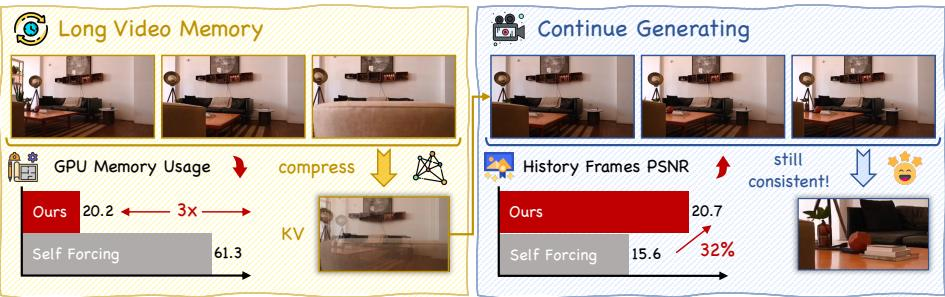
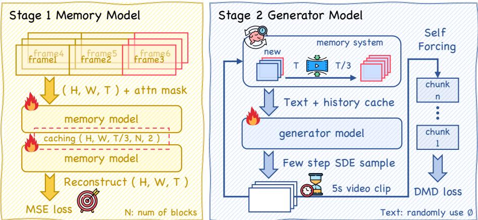
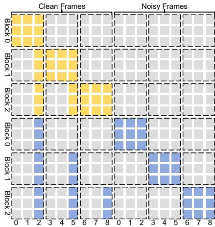
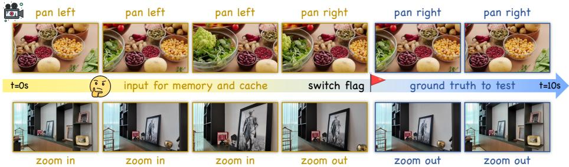
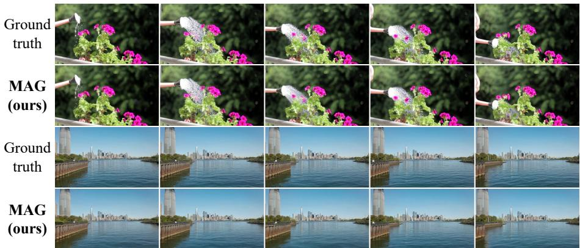
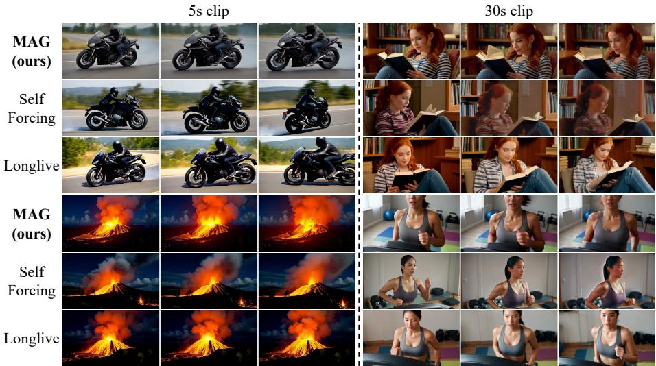
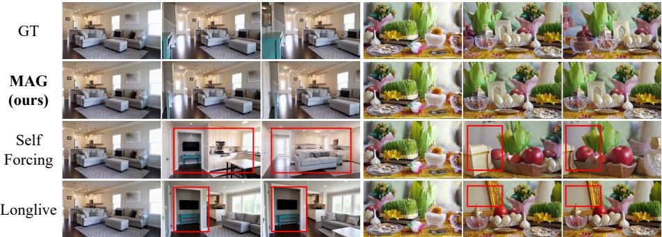

# 记忆与生成：实现实时视频生成中的长期一致性

朱天瑞\*, 张诗逸 $^ { 1 }$ \*, 孙志锐1, 田静琦1, 谭彦松 $^ { . 1 }$ † 1清华大学深圳国际研究生院 {zhutr25, sy-zhang23, sunzr25, tjq25}@mails.tsinghua.edu.cn tang.yansong@sz.tsinghua.edu.cn \*平等贡献 †通讯作者 摘要：帧级自回归（frame-AR）模型在实时视频生成方面取得了显著进展，能够与双向扩散模型相媲美，并为交互式世界模型和游戏引擎提供基础。然而，目前的长视频生成方法通常依赖窗口注意机制，这种方法简单地丢弃窗口外的历史上下文，导致灾难性遗忘和场景不一致；相反，保留完整历史会带来巨大的内存开销。为了解决这一权衡，我们提出了记忆与生成（MAG）框架，该框架将记忆压缩和帧生成解耦为独立任务。具体而言，我们训练一个记忆模型，将历史信息压缩为紧凑的KV缓存，并训练一个独立的生成模型，利用这种压缩表示合成后续帧。此外，我们引入了MAG-Bench，以严格评估历史记忆的保留。大量实验表明，MAG在保持标准视频生成基准上具有竞争性表现的同时，实现了优越的历史场景一致性。

  

关键词：视频生成 $\cdot$ 历史场景一致性 $\cdot$ KV 缓存压缩 图 1：推理流程。MAG 在单个 GPU 上以 16 FPS 的速度进行实时视频生成。与基线相比，MAG 实现了 $3 \times$ 的内存压缩。同时，MAG 能够基于内存生成超出当前视野的场景，确保全局历史一致性。

# 1 引言

视频生成领域的研究正在经历从基于双向注意力的扩散模型到在时间维度上运行的自回归扩散生成模型的范式转变。前者以Wan2.1 [43]为例，能够在有限的时间间隔内根据文本提示生成高保真短视频片段。此外，后续的研究引入了额外的控制条件 [2, 22, 56]，使这些模型能够生成更符合用户需求的多样化视频。然而，双向注意力的计算需求使得用户在生成仅持续几秒的视频片段时，往往需要数分钟的生成时间。此外，由于受固定时间窗口的限制，这些扩散模型仍无法生成分钟级别的视频。因此，自回归帧模型 [1, 12, 23, 55] 已成为高效长视频生成的最有前景的方法。

帧级自回归（frame-AR）视频生成模型基于空间扩散进行训练，并能够利用时间上的KV缓存进行加速。与双向注意力相比，这种因果注意力机制有效地将计算负载减少了一半。然而，实现高保真帧通常需要将去噪步骤设置在20到50之间，这导致在长视频生成过程中存在持续的高延迟和低吞吐量。例如，MAGI-1[1]生成单个帧需要几分钟。为了解决这个问题，CausVid[52]和Self Forcing[20]探索了使用DMD[50, 51]方法将轻量级双向注意力模型转换为因果frame-AR模型，成功将去噪步骤减少到4。Self Forcing[20]能够在消费级GPU上实时生成高质量的短视频内容，并且实现了与原始模型可比的性能。近期的研究[9,30, 48]已成功将Self Forcing[20]的训练方法直接转移到长视频任务中。

尽管取得了这些令人印象深刻的进展，现有的长视频生成方法仍在记忆保留与计算资源消耗之间面临困境。具体而言，确保历史场景一致性——例如，当相机在偏移后返回原始位置时保持场景的完整性——仍然是一个关键挑战。最近的大多数研究采用了窗口注意力或滚动窗口操作，妥协了长视频固有的空间复杂性压力。例如，一个一分钟的视频片段可以占据近1.5GB，这意味着一分钟的内容足以填满当前最先进的GPU。然而，依赖于短窗口注意力会导致灾难性遗忘；之前利用短窗口的世界模型在向左观察随后返回右侧时，往往会生成完全不同的场景。在本文后续部分，我们识别出最近视频生成工作中的类似问题，我们将其归因于过于粗糙的记忆策略设计。Context as Memory尝试将3D视角与2D表示结合，以精确选择必要的帧，从而减少冗余计算，但仍需保留每个历史帧，因为任何帧都可能被重新选择，这导致内存消耗迅速膨胀。另一方面，TTT-video尝试将记忆内化为模型参数，以避免KV缓存的增长。然而，在推理过程中优化这些参数会牺牲实时性能，并且算法的复杂性使得规模化和部署变得困难。

在本研究中，我们分析了近期方法的训练流程，并识别出优化目标中的一项退化解问题。因此，我们重新对Self Forcing [20]进行了训练流程的改进，以历史上下文为基础进行长视频生成，结合无文本条件的损失函数，以增强历史一致性的保留。此外，我们在frame-AR框架中引入了一种可学习的历史记忆压缩策略，以同时解决历史一致性和GPU内存消耗的挑战。我们主张将记忆压缩与历史条件生成解耦为两个独立的任务，需训练不同的模型。记忆模型学习从压缩的KV缓存中重建原始像素帧，而生成模型则学习利用该压缩缓存合成下一帧。基于这些见解，我们提出了Memorize-and-Generate (MAG)这一简洁的范式，不仅能精确记忆和重建历史信息，还能实现高压缩比，显著减少内存使用而不增加额外的计算开销。此外，为了便于对不同方法在历史一致性上的公平比较和评估，我们整理了MAG-Bench，一个完全由摄像机轨迹离开后再返回场景的视频组成的轻量级基准，旨在准确量化模型保持历史场景的能力。实验结果表明，MAG在视频生成任务中展现出卓越的一致性，同时在帧质量和文本对齐指标上保持竞争力。在MAG-Bench上，MAG在历史场景保留方面显著优于现有方法。

# 2 相关工作

双向注意力视频生成。早期研究[6, 15, 16, 46]和近期高质量短视频生成[25, 43, 49]通常采用双向注意力机制。该范式将视频视为一个整体实体，使得模型在生成过程中能够同时感知过去和未来的上下文。目前，主流架构已从早期的时空U-Net[36]演变为扩散变换器(DiT) [32]设计，从而实现了模型参数的高效扩展，并促成了出色的开源模型的出现[25, 33, 43, 49, 59]。值得注意的是，Wan2.1[43]代表了该领域的最先进例子；其轻量级的1.3B变体即使与大得多的模型相比也依然具备高度竞争力。然而，需要注意的是，尽管双向注意力可以确保高质量的上下文，但它与日益增长的实时性能需求本质上是不兼容的。

自回归视频生成。为了超越时长限制并实现流式生成，研究重点逐渐转向时序自回归范式。最初的自回归模型直接通过VQVAE进行视觉词元的离散化以实现全序列生成，但视频质量有限。随后的一些研究将时序自回归与空间扩散结合，逐帧或逐块推进。然而，这些早期的探索面临着严重的曝光偏差，因为错误在时序维度上积累，导致帧质量下降。扩散强制方法提出了对每帧独立添加噪声，以增强模型的错误纠正能力。类似地，滚动扩散设计了一种逐步增加噪声的窗口，以实现联合去噪和流式输出。然而，这些方法未能解决曝光偏差问题。自我强制通过强制训练与推理的一致性，并利用DMD蒸馏框架来实时生成高质量内容。有近期的适应性研究成功将此方法转移至长视频任务，实现了无降质的分钟级视频生成。这表明，通过确保训练和推理过程的一致性，模型能够有效管理时序错误的自主积累。 长时记忆表示保持一致性。尽管在实时性能和内容质量上取得了令人振奋的进展，但在长视频生成中保持历史一致性仍然是一个核心挑战。此外，历史一致性与有限GPU内存之间通常存在内在的权衡。这一问题对于世界模型尤为关键。现有研究主要探讨了三种记忆表示范式。显式3D记忆：具有代表性的方法如记忆强制和WorldExplorer主张将视频转换为3D点云结构。这些方法逐步将新帧添加到全局3D地图中，并利用重投影作为几何约束来指导生成。这种显式记忆在处理空间漂移和历史一致性方面具有天然优势。然而，它们的性能在很大程度上依赖于后端重建算法。在纹理较差或动态场景中，重建错误会导致生成伪影的持续存在。隐式2D潜在记忆：另一类研究探索在2D潜在空间中建立记忆。Genie 3证明仅使用2D表示就可以实现良好的历史一致性，尽管技术细节尚未披露。上下文作为记忆设计了一种记忆提取策略，其中下一帧的生成完全依赖于具有显著视角重叠的历史帧。尽管这种方法有效地将3D视角与2D表示结合起来，但保留每一历史帧的需求仍然对硬件提出了重大挑战。权重记忆：TTT提出在推理过程中更新模型权重，从而有效地将信息压缩到参数中。从理论上讲，这种方法实现了固定的$O ( 1 )$状态大小和无限的上下文记忆，使得远程细节的精确重现成为可能。TTT-video实现了这一方法，成功生成了保留角色一致性的动画短片。然而，推理过程中进行优化会带来巨大的计算负担，从而牺牲实时能力。

# 3 方法

# 3.1 初步阶段

最近的成功研究[9,30,48]将自强制学习[20]转移到了长视频生成。核心方法涉及动态模式分解蒸馏[50,51]，其目的在于最小化生成器输出分布$p _ { \theta } ^ { G } ( x )$与教师模型输出分布$p ^ { \prime } \left( x \right)$之间的KL散度，利用从长视频中均匀采样的短片段进行梯度反向传播。为简洁和清晰起见，在以下部分中，我们省略了随机采样的时间步$t$，去掉了默认期望项以减少公式的长度和复杂性。优化目标的梯度可以近似为两种评分函数之间的差异：

$$
\begin{array} { r l } & { \nabla _ { \boldsymbol { \theta } } \mathcal { L } _ { \mathrm { D M D } } = \mathbb { E } _ { \boldsymbol { x } } \left[ \nabla _ { \boldsymbol { \theta } } \mathrm { K L } \left( p _ { \boldsymbol { \theta } } ^ { \mathcal { S } } ( \boldsymbol { x } ) \ \lVert p ^ { \mathcal { T } } ( \boldsymbol { x } ) \right) \right] } \\ & { \qquad \approx \mathbb { E } _ { i \sim U \{ 1 , k \} } \mathbb { E } _ { z \sim \mathcal { N } ( 0 , I ) } \left[ s ^ { \mathcal { T } } ( \boldsymbol { x } _ { i } ) - s _ { \boldsymbol { \theta } } ^ { \mathcal { S } } ( \boldsymbol { x } _ { i } ) \frac { d G _ { \boldsymbol { \theta } } ( \boldsymbol { z } _ { i } ) } { d \boldsymbol { \theta } } \right] , } \end{array}
$$

其中 $i \sim U \{ 1 , k \}$，$x _ { i }$ 和 $z _ { i }$ 表示从 $k$ 个分段中均匀采样的剪辑，用于计算 DMD 损失。这里，$z$ 表示高斯噪声，$G _ { \theta } ( z )$ 表示由参数 $\theta$ 的生成器的输出，$\tau$ 和 $\boldsymbol { S }$ 分别表示教师模型和学生模型，而 $s ( x _ { i } )$ 是来自教师或学生的评分函数。在训练过程中，学生模型利用流匹配 [29, 31] 学习生成器的输出；因此，学生模型的分布 $p ^ { s }$ 可以视为生成器的代理分布。

# 3.2 重新思考长视频生成中的 DMD 优化

当 $i > 1$ 或视频时长延长时，生成器的输出分布可以表示为 $p _ { \theta } ^ { G } ( x | h , T )$，其中 $h$ 代表历史帧，$T$ 代表文本条件。模型需要生成与历史上下文和文本条件一致的新视频片段。然而，在第3.1节中描述的建模方法，仅依赖随机采样的片段，忽视了历史信息的关键作用。实际上，近期的研究利用原始T2V教师模型作为更强大教师模型的替代，后者能够支持历史条件输入。因此，现有的优化目标被表述为：

$$
p _ { \theta } ^ { G } ( x | h , T )  p ^ { T } ( x | T ) \approx p ^ { T } ( x | h , T )
$$

由于原始教师模型缺乏提供历史一致性的监督信号，这意味着存在捷径或退化解：$p _ { \theta } ^ { G } ( x | h , T ) p _ { \theta } ^ { G } ( x | T )$ 。首先，文本和历史上下文之间存在高度相关性，仅依赖文本便足以生成质量足够的视频。其次，由于基础模型是一个双向T2V模型，当适应于AR模型时，它本质上倾向于首先依赖文本，从而忽视历史信息的利用。为了解决这一退化解，我们引入了一个简单的修改：当 $i > 1$ 时，生成器在空文本条件下预测 $x$ 。损失函数的形式保持不变，但 $x$ 的采样来源发生了变化。新的损失函数定义为：

$$
\begin{array} { r l } & { \nabla _ { \boldsymbol { \theta } } \mathcal { L } _ { \mathrm { h i s t o r y } } = \mathbb { E } _ { \boldsymbol { x } \sim p _ { \boldsymbol { \theta } } ^ { G } ( \boldsymbol { x } | h , \boldsymbol { \vartheta } ) } [ \nabla _ { \boldsymbol { \theta } } D _ { K L } ( p _ { \boldsymbol { \theta } } ^ { S } ( \boldsymbol { x } ) \| p ^ { \mathcal { T } } ( \boldsymbol { x } ) ) ] } \\ & { \qquad \nabla _ { \boldsymbol { \theta } } \mathcal { L } = ( 1 - \lambda ) \nabla _ { \boldsymbol { \theta } } \mathcal { L } _ { \mathrm { D M D } } + \lambda \nabla _ { \boldsymbol { \theta } } \mathcal { L } _ { \mathrm { h i s t o r y } } } \end{array}
$$

在这里，$\lambda$ 是一个超参数，用于平衡两个损失，通过随机抽样进行具体实现。在训练过程中，模型被迫学习仅基于历史片段来生成下一个帧。这是一项更具挑战性的任务，但有助于学习和建模物理一致性和世界知识。相比之下，3.1节中的方法往往过度对齐文本信息，忽略了自回归过程中内在的上下文关联。

  
Fig. 2: The training pipeline. The training process of MAG comprises two stages. In the first stage, we train the memory model for the triple compressed KV cache, retaining only one frame within a full attention block. The loss function requires the model to reconstruct the pixels of all frames in the block from the compressed cache. The process utilizes a customized attention mask to achieve efficient parallel training. In the second stage, we train the generator model within the long video DMD training framework to adapt to the compressed cache provided by the frozen memory model.

# 3.3 记忆与生成框架

因果自回归模型首先通过若干去噪步骤将噪声转换为视频帧。随后，这些视频帧被反馈到模型中，所有标记的 KV 缓存按块保留；这个缓存作为模型的记忆和历史条件。然而，视频序列包含大量标记。由于硬件限制，无法保留所有历史信息。如第 2 节所述，大多数工作应用简单的窗口注意力机制，模型只保留最近 2-3 秒的帧，从而无法实现历史一致性。为了达到这一目标，我们认为所有历史帧信息都应当保留，因为任何细微的细节都有可能被重用。因此，为了减少与此目标相关的内存开销，我们建议将最终步骤 KV 缓存生成的内存过程与管道解耦，并在缓存级别实现压缩。接下来，我们遵循自我强迫方法和第 3.2 节的方法来训练生成器模型。冻结的记忆模型执行最终步骤 KV 缓存的生成，而生成器模型保持其原有的训练目标。这个方案使我们能够在长视频内容上执行近乎无损压缩，并实现实时性能。

# 3.4 记忆模型设计与训练

我们认为内存模型的设计应遵循两个原则：可评估的保真度和推理延迟无增长。理想情况下，它应以 KV 缓存的形式直接存在。首先，内存保真度是最终生成结果的基础；然而，高质量的生成并不一定意味着完美的内存保存。例如，基于滑动窗口的方法或 RNN 隐藏状态通常被认为存在信息瓶颈。然而，这些方法无法量化内存损失的程度或识别瓶颈发生的具体步骤，从而妨碍我们对内存与生成结果之间关系的研究和分析。其次，生成过程中的动态词元压缩通常需要重新生成 KV 缓存或额外计算，从而牺牲实时性能和设计简单性。我们认为在流式生成或输入过程中，一旦完成内存压缩，历史缓存或词元序列不应频繁更改。基于上述原则，并受到自编码器（AE）的启发，我们将 KV 缓存概念化为压缩的潜在特征，并在此基础上构建编码-解码框架。在流式视频生成过程中，最小输出来由几个帧形成一个块，块内应用全注意力机制。我们将块内的全注意力计算视为编码器，仅保留部分 KV 缓存，比如最后一帧。随后，我们要求模型对随机噪声进行去噪，以基于保留的 KV 缓存重构块内的所有帧，充当解码器。由于 KV 缓存的维度相比输入词元有显著扩展，因此在缓存级别存在大量压缩。左侧的图 2 展示了这一可行性。

需要注意的是，编码器和解码器作为单一模型实现，即生成的记忆模型。由于该模型能够同时生成 KV 缓存和重建结果，因此实现了参数共享；这两个输出分支自然构成了编码-解码工作流程。我们采用从少步流匹配训练，这显著提高了训练效率。在损失的梯度驱动下，模型在编码阶段学习通过全注意力将块的信息压缩为单帧，而解码阶段则利用这些压缩的信息重建原始像素。因此，我们可以通过简单观察重建视频来评估记忆保真度。此外，为严格确保训练-推理的一致性，我们随机化了旋转位置嵌入的起始索引。这鼓励模型学习压缩任务与视频的时间持续性是独立的，使得在短片段上训练的记忆模型可以直接应用于长视频。后续实验表明这种方法实现了近乎无损的压缩。此外，训练好的记忆模型可以无缝替代最终流程中的 KV 缓存生成步骤，而不引入任何额外的计算开销。

  
Fig. 3: The attention mask of memory model training. We achieve efficient parallel training of the encode-decode process by concatenating noise and clean frame sequences. By masking out the KV cache of other frames within the block, the model is forced to compress information into the target cache.

# 3.5 流式长视频生成训练

MAG中生成器模型的训练主要遵循LongLive [48] 和Self-forcing++ [9]中建立的协议。然而，与这些研究的不同之处在于，我们采用了第3.2节中详细描述的建模方法。在每个训练步骤中，生成器生成一个5秒的短视频片段，该片段可以根据空文本提示进行条件生成。随后，我们根据该片段计算DMD损失，以获得监督信号。当生成器在空文本条件下工作时，它被迫仅基于历史信息生成正确内容，以与教师模型产生的信号保持一致，从而强化对历史条件的约束。然后，我们进行多个相同的生成步骤，生成的短视频片段用于更新学生模型，确保其代表生成器的当前输出分布。在实践中，通过校准生成器训练步骤与学生模型训练步骤的比例，以及长视频中的短片段数量，我们确保在滚动过程中，生成器的训练在每个时间步骤上提供均匀的监督。这确保了模型在长时间生成过程中的鲁棒性。

  
Fig. 4: Examples from MAG-Bench. MAG-Bench is a lightweight benchmark comprising 176 videos featuring indoor, outdoor, object, and video game scenes. The benchmark also provides appropriate switch times to guide the model toward correct continuation using a few frames.

# 3.6 MAG-Bench：历史一致性评估

历史一致性对于涉及复杂相机运动或场景切换的未来视频生成任务尤为重要。然而，现有基准主要关注图像质量和文本对齐，缺乏专门用于评估模型保持已离开画面的物体能力的前后相机移动数据。为了解决这一问题，我们收集了一个轻量级数据集。此外，我们发现将具有活动相机移动的历史帧直接输入到 KV 缓存中，可以有效指导模型继续生成已移出框架的场景，从而便于评估。由于这一过程遵循“记忆-再生成”的工作流程，我们将其称为 MAG-Bench。为了确保 MAG-Bench 中的视频在相机运动上严格对称以计算重建损失，我们首先收集了具有单一相机运动的高质量视频。随后，我们通过反向播放合成了高质量的“场景回溯”视频。基准中视频的示意图，以及内存与生成部分之间的划分，如图 4 所示。

# 4 实验

# 4.1 实现细节

训练。根据同时进行的研究，我们使用Wan2.1-T2V-1.3B作为基础模型，以确保公平比较；该模型以16生成5秒的片段。

分辨率为832 × 480的FPS。首先，遵循Self Forcing [20]训练流程，我们对ODE初始化模型进行300步训练。这重现了Self Forcing的能力，使得在少步条件下能够生成时长为5秒的短视频。随后，我们根据第3.2节中 outlined 的方案训练记忆模型和生成模型。记忆模型从上述300步的Self Forcing模型初始化，并在VPData [3]上进行2,000步训练，该数据集包含390K高质量的现实世界视频，使用空文本作为条件。生成模型随后从训练好的记忆模型初始化。这个策略确保了在训练的早期阶段，缓存的特征空间得以共享，从而稳定后续过程。在与之并行的工作中，生成模型使用来自VidProM [45]的文本提示进行约1,400步训练，这些提示已由LLM扩展。在所有训练阶段，无论是记忆模型的有监督训练还是生成模型的DMD训练，我们将批量大小设定为64，生成器学习率设为$2.0 \times 10^{-6}$，学生模型学习率设为$4.0 \times 10^{-7}$，与或类似于并行研究[20, 48]一致。此外，在生成器训练期间，我们将使用空文本条件的概率设定为0.6。每个文本提示生成一个由7个片段组成的长视频。为了确保生成器在滚动过程中在时间维度上获得均匀的监督，我们采取一种策略，即学生模型在用于训练生成器模型的每个片段上训练5个片段。

  
Fig. 5: Visualization of Memory Model reconstruction results. We display two examples featuring texture detail variations and significant camera movement. Visually, the trained Memory Model achieves near-lossless reconstruction of the original pixels under a $3 \times$ compression setting.

评估。对于记忆模型，我们采用标准的VPData训练和测试划分 [3]，并在测试集上报告PSNR、SSIM、LPIPS和MSE，以评估压缩和重建的有效性。对于生成模型，我们采用VBench [21] 和 VBench-Long [58]，评估文本到视频任务中的性能，包括质量和文本对齐。需要注意的是，为了确保与近期工作的公平比较，我们遵循Self Forcing [20]，在5秒和30秒的测试中使用扩展提示。对于MAG-Bench，我们参考了 [53]，并报告预测视频与真实标注数据在像素级的PSNR、SSIM和LPIPS，以量化记忆能力。在实验中，我们观察到预测视频与真实标注数据之间摄像机运动速度的轻微差异可能导致显著的像素级错误，即使场景一致性在感知上是准确的。因此，我们基于最佳匹配LPIPS报告度量：我们首先根据预训练模型的感知损失将每个预测帧匹配到最相似的真实标注帧，然后计算剩余度量。所有来自蒸馏模型的生成结果均使用相同的初始噪声和随机种子进行采样，利用相应论文和代码库中提供的参数设置。在H100 GPU上进行FPS测试。

  
Fig. 6: Qualitative comparison on T2V tasks. We present 5-second and 30-second video clips sampled from VBench [21] and VBench-Long [58], respectively. All methods utilize identical prompts and random initialization noise.

# 4.2 文本到视频生成比较

我们选择了代表性的近期模型作为基线。Wan2.1 [43] 作为我们的基础模型，是短视频生成的开源双向注意力模型的优秀示例。SkyReels-V2 [5] 是一个同等规模的扩散强制模型，代表了非蒸馏的自回归生成。Self Forcing [20] 和 LongLive [48] 在近期蒸馏研究中代表了重要的突破；Self-forcing 使用完整历史作为条件生成 5 秒的剪辑，而 LongLive [48] 则采用 6 帧滑动窗口注意力生成分级视频。需要注意的是，Wan2.1 [43] 和 SkyReels-V2 [5] 需要数十个去噪步骤才能实现高质量视频，这自然导致更高的图像质量评分。我们主要将我们的方法与具有一致实验设置的蒸馏作品进行比较，以确保公平评估。如表 1 和图 6 所示，我们的模型在短视频生成任务中获得了 83.52 的高度竞争性得分。此外，我们的方法在背景与对象一致性方面优于现有方法，这归因于我们对缓存保真度的维护和明确优先考虑历史一致性的建模方法。在长视频生成任务中也观察到了类似的结果。此外，我们的模型实现了 21.7 FPS 的实时推理速度，是比较方法中最快的。这一速度优势源于我们对历史信息的更紧密压缩，减少了注意力所需的序列长度。尽管 LongLive [48] 使用了较小的窗口，但其使用的 LoRA [18] 适配器和滑动窗口移动操作增加了计算开销；因此，我们的方法保持了略快于其他方法的平均速度。

Table 1: Quantitative comparison with relevant baselines on the 5-second VBench [21]. We compare against recent and representative open-source methods with similar parameter sizes and distillation processes. Evaluations are conducted using extended VBench prompts. "_" denotes that the data is cited from the reference but this metric was not disclosed. FPS is measured on a single H100 GPU.   

<table><tr><td rowspan="2">Model</td><td rowspan="2">Throughput FPS↑</td><td colspan="5">Vbench scores on 5s ↑</td></tr><tr><td>Total</td><td>Quality</td><td>Semantic</td><td>Background</td><td>Subject</td></tr><tr><td>Multi-step model</td><td></td><td></td><td></td><td></td><td></td><td></td></tr><tr><td>SkyReels-V2 [5]</td><td>0.49</td><td>82.67</td><td>84.70</td><td>74.53</td><td>-</td><td>-</td></tr><tr><td>Wan2.1 [43]</td><td>0.78</td><td>84.26</td><td>85.30</td><td>80.09</td><td>97.29</td><td>96.34</td></tr><tr><td colspan="7">Few-step distillation model</td></tr><tr><td>CausVid [52]</td><td>17.0</td><td>82.46</td><td>83.61</td><td>77.84</td><td>-</td><td>-</td></tr><tr><td>Self Forcing [20]</td><td>17.0</td><td>83.98</td><td>84.75</td><td>80.86</td><td>96.21</td><td>96.80</td></tr><tr><td>Self Forcing++ [9]</td><td>17.0</td><td>83.11</td><td>83.79</td><td>80.37</td><td>-</td><td>-</td></tr><tr><td>Longlive [48]</td><td>20.7</td><td>83.32</td><td>83.99</td><td>80.68</td><td>96.41</td><td>96.54</td></tr><tr><td>MAG</td><td>21.7</td><td>83.52</td><td>84.11</td><td>81.14</td><td>97.44</td><td>97.02</td></tr></table>

Table 2: Quantitative comparison with relevant baselines on the 30-second VBench-long [58]. We compare against recent long video generation methods based on Self Forcing. Evaluations are conducted using extended VBench prompts.   

<table><tr><td rowspan="2">Model</td><td colspan="5">Vbench scores on 30s ↑</td></tr><tr><td>Total</td><td>Quality</td><td>Semantic</td><td>Background</td><td>Subject</td></tr><tr><td rowspan="2">Self Forcing [20] Longlive [48]</td><td>82.57</td><td>83.30</td><td>79.68</td><td>97.03</td><td>97.80</td></tr><tr><td>82.69</td><td>83.28</td><td>80.32</td><td>97.21</td><td>98.36</td></tr><tr><td>MAG</td><td>82.85</td><td>83.30</td><td>81.04</td><td>97.99</td><td>99.18</td></tr></table>

# 4.3 历史一致性比较

我们选择了最近的蒸馏方法进行历史一致性的比较分析。如表 3 所示，我们的方法在定量指标上显著优于现有方法。这主要是因为我们的方法保留了所有历史信息，而滑动窗口操作通常只保留最近的 2-3 秒的历史信息。此外，虽然 Self Forcing 和 CausaVid 也保留了完整的历史帧缓存，但它们并没有在训练期间强制模型学习历史信息的利用。图 7 展示了一个场景，其中相机离开一个场景然后通过相机运动引导返回。只有我们的方法保持了最佳的场景一致性，而其他方法在不同区域表现出遗忘和幻觉现象。

  
Fig. 7: Qualitative comparison on MAG-Bench. We primarily display the visual results of comparable distilled models. Prior to these frames, the models receive and memorize historical frames. Red boxes highlight instances of scene forgetting and hallucinations exhibited by other methods.

Table 3: Quantitative experiments on our MAG-Bench. "Ground Truth" and "History Context" denote the model continuing generation based on ground truth frames and its own predicted frames, respectively, with the latter representing a significantly more challenging task.

<table><tr><td rowspan="2">Method</td><td colspan="3">History Context Comparison</td><td colspan="3">Ground Truth Comparison</td></tr><tr><td>PSNR↑</td><td>SSIM↑</td><td>LPIPS↓</td><td>PSNR↑</td><td>SSIM↑</td><td>LPIPS↓</td></tr><tr><td rowspan="3">Self Forcing [20] CausVid [52] Longlive [48]</td><td>14.46</td><td>0.48</td><td>0.49</td><td>15.65</td><td>0.51</td><td>0.42</td></tr><tr><td>15.13</td><td>0.50</td><td>0.41</td><td>17.21</td><td>0.56</td><td>0.31</td></tr><tr><td>16.42</td><td>0.53</td><td>0.32</td><td>18.92</td><td>0.62</td><td>0.22</td></tr><tr><td rowspan="2">w/o stage 1 MAG</td><td>17.19</td><td>0.54</td><td>0.31</td><td>19.04</td><td>0.60</td><td>0.22</td></tr><tr><td>18.99</td><td>0.60</td><td>0.23</td><td>20.77</td><td>0.66</td><td>0.17</td></tr></table>

# 4.4 消融研究

内存模型压缩率。在对一段帧进行全注意力计算后，我们采用只保留最终帧的缓存以供后续使用的策略。在我们的设置中，压缩率等同于一段内帧的数量，这作为超参数影响着其他研究中的吞吐量。表4显示，随着压缩率的提高，重建质量略有下降。图5表明，当压缩率为3时，模型重建原始像素的视觉影响可以忽略不计。由于三帧的块大小是业界普遍接受的在吞吐量和延迟之间平衡的参数，因此我们选择了3的压缩率。然而，表4中的结果表明，较高的压缩率仍然是未来探索的可行方向。

Table 4: Ablation study on compression rates. We vary the compression rates by adjusting the number of frames contained within a block. "Block=1" indicates no compression.   

<table><tr><td>Rates</td><td>PSNR↑</td><td>SSIM↑</td><td>LPIPS↓</td><td>MSE×102 ↓</td></tr><tr><td>block=1</td><td>34.81</td><td>0.93</td><td>0.025</td><td>0.08</td></tr><tr><td>block=3</td><td>31.73</td><td>0.90</td><td>0.045</td><td>0.56</td></tr><tr><td>block=4</td><td>29.89</td><td>0.88</td><td>0.059</td><td>1.28</td></tr><tr><td>block=5</td><td>28.64</td><td>0.86</td><td>0.071</td><td>1.96</td></tr></table>

内存模型消融研究。为了证明内存压缩的必要性，我们训练了一种基线方法，该方法采用直接的 3 $\times$ 下采样。如表 3 所示，省略内存压缩训练的第一阶段会导致一致性更差。简单的下采样丢弃了大量细节和信息，从而在场景重构过程中导致潜在的遗忘。因此，通过训练的第一阶段确保缓存的保真性被证明是一种有效的策略。

# 5 讨论

结论。在这项工作中，我们提出了MAG，一个用于长视频生成的框架，包括两个模型，分别用于记忆压缩和下一帧生成。为了评估现有方法的历史场景一致性，我们构建了MAG-Bench，一个轻量级基准测试。实验结果表明，记忆模型在3倍压缩下能够重建原始像素。此外，生成模型能够实时合成高质量内容，具有出色的背景和主体一致性。此外，在保持历史一致性方面，它显著优于现有方法。局限性与未来工作。在我们的实验中，我们发现了两个主要局限性。（1）尽管本工作确保了压缩的KV缓存的保真度，但缺乏明确针对上下文一致性的数据，使得生成模型难以学习如何优化选择和利用大量历史帧。（2）尽管DMD蒸馏框架是无数据的，这一特性阻碍了它在基于动作的世界模型中的直接扩展。训练一个能够胜任的教师模型仍然需要大量资源。在未来的工作中，我们旨在解决这些挑战，以增强实现世界模型的可行性。

# References

1. ai, S., Teng, H., Jia, H., Sun, L., Li, L., Li, M., Tang, M., Han, S., Zhang, T., Zh, W.Q., Luo, W., Kag, X., Sun, Y., Cao, Y., Hu, Y., Lin, Y., Fa, Y., T Z. Zha, Z. W, Z. Liu Z. Shi D. u, G. Sun, H. Pan, H. W J., S J., Cui M. Hu, M. Yan . Yin, S. Z, S., Liu T. Yin, X., , X., Song, X., Hu, X., Zhang, Y., Li, Y.: Magi-1: Autoregressive video generation at scale (2025)2   
Bai, J., Xia, . Fu, X., Wag, X., Mu, L. Cao, J., Liu, Z., Hu, H., Bai, X. Wan, P., et al.: Recammaster: Camera-controlled generative rendering from a single video. arXiv preprint arXiv:2503.11647 (2025) 2   
3. Bian, Y., Zhang, Z., Ju, X., Cao, M., Xie, L., Shan, Y., Xu, Q.: Videopainter: Any-length video inpainting and editing with plug-and-play context control. In: SIGGRAPH. pp. 112 (2025) 10   
4. Chen, B., Martí Monsó, D., Du, Y., Simchowitz, M., Tedrake, R., Sitzmann, V.: Diffusion forcing: Next-token prediction meets full-sequence diffusion. In: NeurIPS. pp. 2408124125 (2024) 4   
5. Chen, G., Lin, D., Yang, J., Lin, C., Zhu, J., Fan, M., Zhang, H., Chen, S., Chen, Z., Ma, C., Xiong, W., Wang, W., Pang, N., Kang, K., Xu, Z., Jin, Y., Liang, Y., Song, Y., Zhao, P., Xu, B., Qiu, D., Li, D., Fei, Z., Li, Y., Zhou, Y.: Skyreels-v2: Infinite-length film generative model (2025) 11, 12   
6. Chen, H., Xia, M., He, Y., Zhang, Y., Cun, X., Yang, S., Xing, J., Liu, Y., Chen, Q., Wang, X., Weng, C., Shan, Y.: Videocrafter1: Open diffusion models for highquality video generation (2023) 3   
7.Chen, S., Guo, H., Zhu, S., Zhang, F., Huang, Z., Feng, J., Kang, B.: Video depth anything: Consistent depth estimation for super-long videos. arXiv:2501.12375 (2025) 4   
8. Chen, T., Ding, Z., Li, A., Zhang, C., Xiao, Z., Wang, Y., Jin, C.: Recurrent autoregressive diffusion: Global memory meets local attention. arXiv preprint arXiv:2511.12940 (2025) 7   
9. Cui, J., Wu, J., Li, M., Yang, T., Li, X., Wang, R., Bai, A., Ban, Y., Hsieh, C.J.: Self-forcing++: Towards minute-scale high-quality video generation. arXiv preprint arXiv:2510.02283 (2025) 2, 4, 5, 7, 8, 12, 14   
10. Dalal, K., Koceja, D., Xu, J., Zhao, Y., Han, S., Cheung, K.C., Kautz, J., Choi, Y., Sun, Y., Wang, X.: One-minute video generation with test-time training. In: CVPR. pp. 1770217711 (2025) 3, 5   
11.Deepmind, G.: Genie 3. https://deepmind.google/blog/genie-3-a-new-frontier-forworld-models/ (2025) 4   
12. Gu, Y., Mao, w., Shou, M.Z.: Long-context autoregressive video modeling with next-frame prediction. arXiv preprint arXiv:2503.19325 (2025) 2   
13. Guo, J., Ye, Y., He, T., Wu, H., Jiang, Y., Pearce, T., Bian, J.: Mineworld: a real-time and open-source interactive world model on minecraft. arXiv preprint arXiv:2504.08388 (2025) 2, 4   
14. He, X., Peng, C., Liu, Z., Wang, B., Zhang, Y., Cui, Q., Kang, F., Jiang, B., An, M., Ren, Y., Xu, B., Guo, H.X., Gong, K., Wu, C., Li, W., Song, X., Liu, Y., Li, E., Zhou, Y.: Matrix-game 2.0: An open-source, real-time, and streaming interactive world model. arXiv preprint arXiv:2508.13009 (2025) 2, 4   
15. He, Y., Yang, T., Zhang, Y., Shan, Y., Chen, Q.: Latent video diffusion models for high-fidelity long video generation (2022) 3 ing for text-to-video generation via transformers. arXiv preprint arXiv:2205.15868 (2022) 4   
18. Hu, E.J., Shen, Y., Wallis, P., Allen-Zhu, Z., Li, Y., Wang, S., Wang, L., Chen, W., et al.: Lora: Low-rank adaptation of large language models. In: ICLR. p. 3 (2022) 12   
19. Huang, J., Hu, X., Han, B., Shi, S., Tian, Z., He, T., Jiang, L.: Memory forcing: Spatio-temporal memory for consistent scene generation on minecraft. arXiv preprint arXiv:2510.03198 (2025) 4   
20. Huang, X., Li, Z., He, G., Zhou, M., Shechtman, E.: Self forcing: Bridging the train-test gap in autoregressive video diffusion. arXiv preprint arXiv:2506.08009 (2025) 2, 3, 4, 5, 7, 10, 11, 12, 13, 14   
Hu, Z., He, Y., Yu, J. Zhag, F. Si, C. Jiang, Y. Zhag, Y., Wu, T. Ji, Q, Chanpaisit, N., Wang, Y., Chen, X., Wang, L., Lin, D., Qiao, Y., Liu, Z.: VBench: Comprehensive benchmark suite for video generative models. In: CVPR (2024) 10, 11, 12   
22. Jiang, Z., Han, Z., Mao, C., Zhang, J., Pan, Y., Liu, Y.: Vace: All-in-one video creation and editing. In: ICCV. pp. 1719117202 (2025) 2   
3.Jin, Y., Sun, Z., Li, N. Xu, K. Xu, K., Jiang, H., Zhuang, N., Huang, Q., Song, Y., Mu, Y., Lin, Z.: Pyramidal flow matching for efficient video generative modeling (2024) 2, 4   
24. Kim, J., Kang, J., Choi, J., Han, B.: Fifo-diffusion: Generating infinite videos from text without training. In: NeurIPS. pp. 8983489868 (2024) 4   
2Kong, W., Tian, Q., Zhang, Z., Min, R. Dai, Z., Zhou, J., Xiong, J., Li, X., Wu, B., Zhang, J., et al.: Hunyuanvideo: A systematic framework for large video generative models. arXiv preprint arXiv:2412.03603 (2024) 3   
26. Li, R., Torr, P., Vedaldi, A., Jakab, T.: Vmem: Consistent interactive video scene generation with surfel-indexed view memory. arXiv preprint arXiv:2506.18903 (2025) 4   
27. Li, Z., Hu, S., Liu, S., Zhou, L., Choi, J., Meng, L., Guo, X., Li, J., Ling, H., Wei, F.: Arlon: Boosting diffusion transformers with autoregressive models for long video generation. arXiv preprint arXiv:2410.20502 (2024) 4   
28. Lin, Y., Lee, M., Zhang, Z., AlQuraishi, M.: Out of many, one: Designing and scaffolding proteins at the scale of the structural universe with genie 2. arXiv preprint arXiv:2405.15489 (2024) 4   
29. Lipman, Y., Chen, R.T., Ben-Hamu, H., Nickel, M., Le, M.: Flow matching for generative modeling. arXiv preprint arXiv:2210.02747 (2022) 5, 8   
30. Liu, K., Hu, W., Xu, J., Shan, Y., Lu, S.: Rolling forcing: Autoregressive long video diffusion in real time. arXiv preprint arXiv:2509.25161 (2025) 2, 4, 5   
31. Liu, X., Gong, C., Liu, Q.: Flow straight and fast: Learning to generate and transfer data with rectified flow. arXiv preprint arXiv:2209.03003 (2022) 5, 8   
32. Peebles, W., Xie, S.: Scalable diffusion models with transformers. In: ICCV. pp. 41954205 (2023)3   
33. Peng, X., Zheng, Z., Shen, C., Young, T., Guo, X., Wang, B., Xu, H., Liu, H., Jiang, M., Li, W., Wang, Y., Ye, A., Ren, G., Ma, Q., Liang, W., Lian, X., Wu, X., Zhong, Y., Li, Z., Gong, C., Lei, G., Cheng, L., Zhang, L., Li, M., Zhang, R., Hu, S., Huang, S., Wang, X., Zhao, Y., Wang, Y., Wei, Z., You, Y.: Open-sora 2.0: Training a commercial-level video generation model in \$200k. arXiv preprint arXiv:2503.09642 (2025) 3   
35. Ren, X., Xu, L., Xia, L., Wang, S., Yin, D., Huang, C.: Videorag: Retrieval-augmented generation with extreme long-context videos. arXiv preprint arXiv:2502.01549 (2025) 2   
36. Ronneberger, O., Fischer, P., Brox, T.: U-net: Convolutional networks for biomedical image segmentation. In: MICCAI. pp. 234241. Springer (2015) 3   
37. Ruhe, D., Heek, J., Salimans, T., Hoogeboom, E.: Rolling diffusion models. In: ICML (2024) 4   
38. Rumelhart, D.E., Hinton, G.E., Williams, R.J.: Learning internal representations by error propagation. Tech. rep. (1985) 7   
39. Schneider, M.A., Höllein, L., Niener, M.: Worldexplorer: Towards generating fully navigable 3d scenes. In: SIGGRAPH Asia. pp. 111 (2025) 4   
40. Su, J., Lu, Y., Pan, S., Wen, B., Liu, Y.: Roformer: Enhanced transformer with rotary position embedding. arXiv preprint arXiv:2104.09864 (2021) 8   
41. Sun, Y., Wang, X., Liu, Z. Miller, J., Efros, A., Hardt, M.: Test-time training with self-supervision for generalization under distribution shifts. In: ICML. pp. 92299248 (2020) 4   
42. Van Den Oord, A., Vinyals, O., et al.: Neural discrete representation learning. In: NeurIPS (2017) 4   
43. Wan, T., Wang, A., Ai, B., Wen, B., Mao, C., Xie, C.W., Chen, D., Yu, F., Zhao, H., Yang, J., Zeng, J., Wang, J., Zhang, J., Zhou, J., Wang, J., Chen, J., Zhu, K., Zo, K., Yan, K. Hg, L. Feg M. Zag, N., Li, P. Wu, P. Chu, R.Fg R., Zhang, S., Sun, S., Fang, T., Wang, T., Gui, T., Weng, T., Shen, T., Lin, W., Wang, W., Wang, W., Zhou, W., Wang, W., Shen, W., Yu, W., Shi, X., Huang, X., Xu, X., Kou, Y., Lv, Y., Li, Y., Liu, Y., Wang, Y., Zhang, Y., Huang, Y., Li, Y., Wu, Y., Liu, Y., Pan, Y., Zheng, Y., Hong, Y., Shi, Y., Feng, Y., Jiang, Z., Han, Z., Wu, Z.F., Liu, Z.: Wan: Open and advanced large-scale video generative models. arXiv preprint arXiv:2503.20314 (2025) 2, 3, 9, 11, 12   
44. Wang, J., Chen, M., Karaev, N., Vedaldi, A., Rupprecht, C., Novotn, D.: VGGT: visual geometry grounded transformer. In: CVPR (2025) 4   
45. Wang, W., Yang, Y.: Vidprom: A million-scale real prompt-gallery dataset for text-to-video diffusion models. In: NeurIPS. pp. 6561865642 (2024) 10   
46. Xing, J., Xia, M., Zhang, Y., Chen, H., Wang, X., Wong, T.T., Shan, Y.: Dynamicrafter: Animating open-domain images with video diffusion priors (2023) 3   
7Yan, W., Zhang, Y., Abbeel, P., Srinivas, A.: Videot: Video enerationusing vq-vae and transformers. arXiv preprint arXiv:2104.10157 (2021) 4   
48. Yang, S., Huang, W., Chu, R., Xiao, Y., Zhao, Y., Wang, X., Li, M., Xie, E., Chen, Y., Lu, Y., Chen, S.H.Y.: Longlive: Real-time interactive long video generation (2025) 2, 4, 5, 7, 8, 10, 11, 12, 13, 14   
49. Yang, Z., Teng, J., Zheng, W., Ding, M., Huang, S., Xu, J., Yang, Y., Hong, W., Zhang, X., Feng, G., et al.: Cogvideox: Text-to-video diffusion models with an expert transformer. arXiv preprint arXiv:2408.06072 (2024) 3   
50. Yin, T., Gharbi, M., Park, T., Zhang, R., Shechtman, E., Durand, F., Freeman, W.T.: Improved distribution matching distillation for fast image synthesis. In: NeurIPS (2024) 2, 4, 5   
51. Yin, T., Gharbi, M., Zhang, R., Shechtman, E., Durand, F., Freeman, W.T., Park, T.: One-step diffusion with distribution matching distillation. In: CVPR (2024) 2, 4,5   
52. Yin, T., Zhang, Q., Zhang, R., Freeman, W.T., Durand, F., Shechtman, E., Huang, X.: From slow bidirectional to fast autoregressive video diffusion models. In: CVPR (2025) 2, 12, 13   
53. Yu, J., Bai, J., Qin, Y., Liu, Q., Wang, X., Wan, P., Zhang, D., Liu, X.: Context as memory: Scene-consistent interactive long video generation with memory retrieval. arXiv preprint arXiv:2506.03141 (2025) 2, 4, 11   
54. Yu, J., Qin, Y., Wang, X., Wan, P., Zhang, D., Liu, X.: Gamefactory: Creating new games with generative interactive videos. arXiv preprint arXiv:2501.08325 (2025) 2, 4   
55. Zhang, L., Cai, S., Li, M., Wetzstein, G., Agrawala, M.: Frame context packing and drift prevention in next-frame-prediction video diffusion models. In: NeurIPS (2025) 2, 7   
56. Zhang, S., Zhuang, J., Zhang, Z., Shan, Y., Tang, Y.: Flexiact: Towards flexible action control in heterogeneous scenarios. In: SIGGRAPH. pp. 111 (2025) 2   
57. Zhang, Y., Peng, C., Wang, B., Wang, P., Zhu, Q., Kang, F., Jiang, B., Gao, Z., Li, E., Liu, Y., Zhou, Y.: Matrix-game: Interactive world foundation model. arXiv preprint arXiv:2506.18701 (2025) 2, 4   
58. Zheng, D., Huang, Z., Liu, H., Zou, K., He, Y., Zhang, F., Zhang, Y., He, J., Zheng, W.S., Qiao, Y., Liu, Z.: VBench-2.0: Advancing video generation benchmark suite for intrinsic faithfulness. arXiv preprint arXiv:2503.21755 (2025) 10, 11, 12   
59. Zheng, Z., Peng, X., Yang, T., Shen, C., Li, S., Liu, H., Zhou, Y., Li, T., You, Y.: Open-sora: Democratizing efficient video production for all. arXiv preprint arXiv:2412.20404 (2024) 3