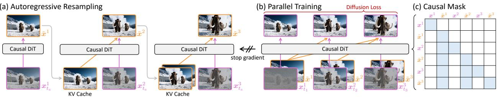
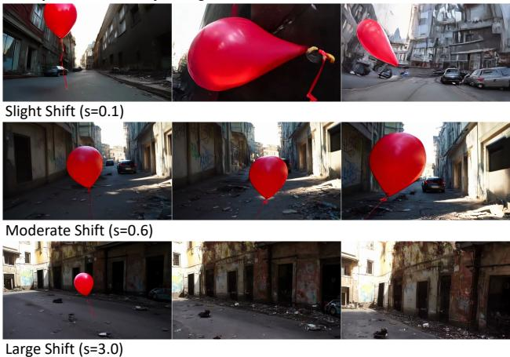
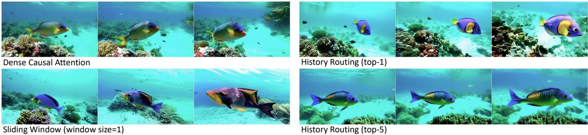
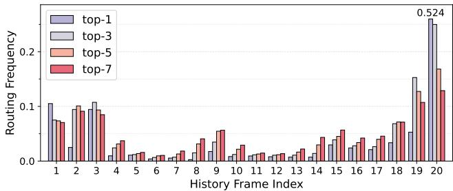

# 1. Bibliographic Information

## 1.1. Title
End-to-End Training for Autoregressive Video Diffusion via Self-Resampling

## 1.2. Authors
-   Yuwei Guo (The Chinese University of Hong Kong, ByteDance Seed)
-   Ceyuan Yang (ByteDance Seed)
-   Hao He (The Chinese University of Hong Kong)
-   Yang Zhao (ByteDance Seed)
-   Meng Wei (ByteDance)
-   Zhenheng Yang (ByteDance)
-   Weilin Huang (ByteDance Seed)
-   Dahua Lin (The Chinese University of Hong Kong)

    The author list indicates a strong collaboration between academia (The Chinese University of Hong Kong) and a major industry research lab (ByteDance). This combination often results in research that is both theoretically grounded and practically focused on scalability and state-of-the-art performance.

## 1.3. Journal/Conference
The paper is available on arXiv, a preprint server. The publication date in the metadata is listed as December 17, 2025, which is a future placeholder date, common for submissions to conferences with future deadlines. This indicates the work is recent but not yet peer-reviewed or officially published at a conference. arXiv is a standard and respected platform in the machine learning community for rapid dissemination of cutting-edge research.

## 1.4. Publication Year
2025 (as a placeholder on arXiv). The content suggests it was developed in late 2024 or early 2025.

## 1.5. Abstract
The paper addresses a critical challenge in autoregressive video diffusion models: **exposure bias**. This bias arises from a mismatch where models are trained on perfect ground-truth data but must rely on their own imperfect, self-generated outputs during inference, leading to error accumulation. While previous methods tackle this with post-training steps involving external "teacher" models, this paper introduces **`Resampling Forcing`**, a novel, teacher-free framework that enables end-to-end training of these models from scratch. The core of the method is a **`self-resampling`** scheme, where the model simulates its own future inference-time errors on past frames during the training process. By training on these "degraded" histories, the model learns to be robust to its own imperfections. The framework uses a sparse causal mask for parallel training and introduces **`history routing`**, an efficient, parameter-free mechanism to handle long videos by dynamically selecting the most relevant past frames. Experiments show that this approach achieves performance comparable to distillation-based methods while demonstrating superior temporal consistency in longer videos, thanks to its ability to train on full-length sequences natively.

## 1.6. Original Source Link
-   **Original Source Link:** https://arxiv.org/abs/2512.15702
-   **PDF Link:** https://arxiv.org/pdf/2512.15702v1.pdf
-   **Publication Status:** This is a preprint available on arXiv and has not yet undergone formal peer review for publication in a journal or conference.

# 2. Executive Summary

## 2.1. Background & Motivation
-   **Core Problem:** The central problem is `exposure bias` in autoregressive video generation models. Autoregressive models generate content sequentially (e.g., frame by frame), where each new frame depends on the previously generated ones. During training, these models are typically fed perfect, ground-truth previous frames (a technique called `teacher forcing`). However, during inference (actual generation), they must use their own, inevitably imperfect, generated frames as input for the next step. This mismatch between training and inference conditions causes small errors to propagate and amplify over time, leading to a significant drop in quality or even "catastrophic collapse" in long videos.

-   **Importance and Gaps:** Solving this problem is crucial for creating reliable "world simulators" or generating long, coherent videos, which have applications in gaming, content creation, and simulation. Existing solutions, such as `Self Forcing`, attempt to fix this by "post-training" the autoregressive model. They use a powerful, pre-trained bidirectional (non-causal) "teacher" model to guide or "distill" knowledge into the autoregressive model. This approach has two major drawbacks:
    1.  **Dependency:** It requires a separate, often much larger, teacher model, which makes the training process complex, computationally expensive, and not "end-to-end".
    2.  **Causality Violation:** The teacher model can see the future, potentially leaking non-causal information that compromises the strict temporal causality desired in a true autoregressive simulator.

-   **Innovative Idea:** The paper's key idea is to eliminate the need for an external teacher by making the model its own teacher. It proposes to explicitly simulate the errors that occur during inference *within the training loop itself*. By forcing the model to generate a clean target frame from a "degraded" history that contains simulated errors, the model learns to become robust and correct its own mistakes, preventing error accumulation. This enables a fully end-to-end, teacher-free training paradigm.

## 2.2. Main Contributions / Findings
The paper presents the following primary contributions:

1.  **`Resampling Forcing` Framework:** A novel, end-to-end, and teacher-free training framework for autoregressive video diffusion models. It directly addresses the `exposure bias` problem without relying on external teacher models or discriminators, making it more scalable and self-contained.

2.  **`Self-Resampling` Mechanism:** This is the core technical innovation. During training, the method takes ground-truth history frames, partially corrupts them with noise, and then uses the model's *current* weights to regenerate them. This process creates "degraded" history frames that mimic the model's own inference-time errors. The model is then trained to predict the next clean frame conditioned on this imperfect history.

3.  **`History Routing` for Efficiency:** To address the computational challenge of generating long videos (where the history grows continuously), the paper introduces a dynamic and parameter-free attention mechanism. Instead of attending to all past frames, `history routing` intelligently selects the top-k most relevant frames for each new frame being generated, keeping attention complexity nearly constant.

4.  **State-of-the-Art Performance with Better Causality:** The experimental results show that this method achieves video quality comparable to existing distillation-based methods. More importantly, because it is trained end-to-end on long videos without a non-causal teacher, it exhibits superior temporal consistency and stricter adherence to physical causality in long-horizon generation tasks.

# 3. Prerequisite Knowledge & Related Work

## 3.1. Foundational Concepts
-   **Diffusion Models:** These are a class of generative models that learn to create data by reversing a gradual noising process. The process involves two steps:
    1.  **Forward Process:** A clean data sample (e.g., an image) is gradually corrupted by adding a small amount of Gaussian noise over many steps, eventually turning it into pure noise.
    2.  **Reverse Process:** A neural network is trained to reverse this process. It takes a noisy sample and a timestep as input and predicts the noise that was added. By repeatedly subtracting the predicted noise, the model can generate a clean data sample starting from pure random noise. The paper uses a variant called `Flow Matching`, which simplifies the training objective.

-   **Autoregressive (AR) Models:** These models generate complex data, like text or video, in a sequential manner. The generation of each element (a word, a pixel, or a video frame) is conditioned on the elements generated before it. The joint probability of a sequence $x_1, x_2, ..., x_N$ is factorized as $p(x) = p(x_1) \cdot p(x_2|x_1) \cdot p(x_3|x_1, x_2) \cdots$. LLMs like GPT are classic examples of AR models. In video, an AR model generates frame $i$ based on frames $1, 2, ..., i-1$.

-   **Teacher Forcing:** This is a standard training technique for AR models. During training, to predict the next element $x_i$, the model is given the *ground-truth* previous element $x_{i-1}$ as input, not its own prediction from the previous step. This stabilizes training and allows for parallel processing of the entire sequence. However, it creates a discrepancy with inference time.

-   **Exposure Bias:** This is the direct consequence of `teacher forcing`. The model is never "exposed" to its own errors during training. At inference, it must use its own (potentially flawed) outputs as inputs for future steps. This can cause errors to compound, leading to a rapid decline in generation quality.

-   **Diffusion Transformer (DiT):** This is a neural network architecture that adapts the Transformer (originally designed for text) to diffusion models. It treats an image or video as a sequence of "patches" (tokens) and uses self-attention to model relationships between them. This architecture has proven to be highly scalable and effective for high-resolution image and video generation.

## 3.2. Previous Works
-   **Bidirectional Video Generation (e.g., Sora, Veo):** These models generate all video frames jointly. Each frame's generation is influenced by both past and future frames through attention mechanisms. This allows for very high global consistency and quality but makes them non-causal. They cannot be used for real-time, interactive, or predictive tasks where the future is unknown.

-   **Autoregressive Video Generation:**
    -   **`Self Forcing` [32] and `CausVid` [77]:** These are key baselines that also aim to solve `exposure bias`. Their approach is a form of **distillation**. They first train a large bidirectional "teacher" model. Then, they train a smaller autoregressive "student" model. During the student's training, it generates a video autoregressively, and the output is compared to the output of the teacher model. The student is trained to match the teacher's output distribution. The main drawback is the reliance on this powerful (and non-causal) teacher model.
    -   **Noise Injection [62, 67]:** A simpler approach where small amounts of noise are added to the ground-truth history frames during training. This crudely approximates inference-time errors, but the paper argues that simple noise doesn't accurately reflect the complex, structured errors a model actually makes.

-   **Efficient Attention for Video Generation:**
    -   **Standard Self-Attention:** The computational core of Transformers. For a set of queries $Q$, keys $K$, and values $V$, the output is calculated as:
        $$
        \mathrm{Attention}(Q, K, V) = \mathrm{softmax}\left(\frac{QK^T}{\sqrt{d_k}}\right)V
        $$
        Here, $d_k$ is the dimension of the keys. The complexity of this operation is quadratic with respect to the sequence length, making it a bottleneck for long videos.
    -   **Sliding-Window Attention:** A simple solution where each frame only attends to a fixed number of recent history frames. This is computationally cheap but sacrifices long-term dependency, leading to content drift over time.
    -   **`Mixture of Block Attention (MoBA)` [46]:** An advanced sparse attention mechanism for LLMs. It dynamically selects a subset of "blocks" (groups of tokens) from the history for each query block to attend to, using a routing mechanism. The paper's `history routing` is directly inspired by this idea, adapting it for autoregressive video generation.

## 3.3. Technological Evolution
The field of video generation has evolved from early GAN-based methods to diffusion models. Initially, these were often bidirectional, prioritizing quality over causality (e.g., Sora). Recognizing the need for simulation and interactivity, the focus shifted towards autoregressive models. The first AR models suffered from `exposure bias`. The next generation of methods, like `Self Forcing`, addressed this using post-training distillation from teacher models. This paper represents the next step in this evolution: an **end-to-end, teacher-free** approach that integrates the correction for `exposure bias` directly into the training process itself, making the framework more elegant, scalable, and causally pure.

## 3.4. Differentiation Analysis
The core differentiation of this paper's method, `Resampling Forcing`, can be summarized in the following table:

| Method Type | Core Idea | Teacher Model? | End-to-End? | Causal Purity |
| :--- | :--- | :--- | :--- | :--- |
| **Teacher Forcing** | Train on ground-truth history. | No | Yes | High |
| **Noise Augmentation** | Add random noise to history. | No | Yes | High |
| **Self Forcing / Distillation** | Match output of a bidirectional teacher. | **Yes (Required)** | No (Post-training) | **Low (Risk of leakage)** |
| **Resampling Forcing (This paper)** | **Simulate and train on own errors.** | **No (Teacher-free)** | **Yes** | **High** |

The key innovation is replacing the external teacher with a **self-correction loop**. Instead of learning from a perfect, non-causal oracle, the model learns from its own simulated imperfections in a causally-strict manner.

# 4. Methodology

## 4.1. Principles
The fundamental principle of `Resampling Forcing` is to bridge the train-test gap (exposure bias) by making the model robust to its own errors. The intuition is that if a model is trained to generate a correct output (`clean frame`) even when given a slightly wrong input (`degraded history`), it will learn a "corrective" function rather than just a predictive one. During inference, when it inevitably produces a slightly wrong frame, this learned robustness will prevent the error from being amplified in subsequent steps. Instead, the model will stabilize, keeping the error level roughly constant.

## 4.2. Core Methodology In-depth
The methodology can be understood as a carefully designed training procedure that modifies the standard `teacher forcing` paradigm.

### 4.2.1. Background: Autoregressive Video Diffusion with Teacher Forcing
First, let's establish the baseline. An autoregressive video diffusion model generates a video $\pmb{x}^{1:N}$ of $N$ frames by factorizing the probability as a product of conditional probabilities, one for each frame:
$$
p ( \pmb { x } ^ { 1 : N } | c ) = \prod _ { i = 1 } ^ { N } p ( \pmb { x } ^ { i } | \pmb { x } ^ { < i } , c ) .
$$
-   $p ( \pmb { x } ^ { i } | \pmb { x } ^ { < i } , c )$ is the probability of the $i$-th frame given all previous frames $\pmb{x}^{<i}$ and an external condition $c$ (e.g., a text prompt).

    Each frame $\pmb{x}^i$ is generated using a diffusion process. Starting from pure noise $\pmb{x}_1^i$, a neural network $\pmb{v}_\theta$ predicts the "velocity" to move towards the clean frame. The final frame is obtained by integrating this velocity from time $t=1$ to $t=0$:
$$
\pmb { x } ^ { i } = \pmb { x } _ { 1 } ^ { i } + \int _ { 1 } ^ { 0 } \pmb { v } _ { \theta } ( \pmb { x } _ { t } ^ { i } , \pmb { x } ^ { < i } , t , c ) \mathrm { d } t ,
$$
-   $\pmb{x}_t^i$ is the noisy version of frame $i$ at time $t$.
-   $\pmb{v}_\theta$ is the neural network (a DiT in this case) that predicts the denoising direction.
-   $\pmb{x}^{<i}$ are the history frames that the model is conditioned on.

    The model is trained using a `Flow Matching` objective. At a random time $t$, a noisy frame $\pmb{x}_t^i$ is created by linearly interpolating the clean frame $\pmb{x}^i$ and a noise sample $\pmb{\epsilon}^i$:
$$
\pmb { x } _ { t } ^ { i } = ( 1 - t ) \cdot \pmb { x } ^ { i } + t \cdot \pmb { \epsilon } ^ { i } .
$$
The network $\pmb{v}_\theta$ is trained to predict the target velocity, which is simply $\pmb{\epsilon}^i - \pmb{x}^i$. The loss function is the mean squared error between the predicted and target velocities:
$$
\mathcal { L } = \mathbb { E } _ { i , t , { \boldsymbol { x } } , { \boldsymbol { \epsilon } } } \left[ \| ( { \boldsymbol { \epsilon } } ^ { i } - { \boldsymbol { x } } ^ { i } ) - { \boldsymbol { v } } _ { \boldsymbol { \theta } } ( { \boldsymbol { x } } _ { t } ^ { i } , { \boldsymbol { x } } ^ { < i } , t , { \boldsymbol { c } } ) \| _ { 2 } ^ { 2 } \right] .
$$
In standard `teacher forcing`, the history condition $\pmb{x}^{<i}$ is the **clean, ground-truth history**. This is the source of exposure bias, as illustrated in the top part of Figure 2.

*该图像是示意图，展示了单步生成与自回归生成的差异。上部分展示了教师强制方法中的历史帧与预测的关系，以及随之产生的累积错误；下部分展示了本研究提出的错误模拟方法，显示了有界错误的生成过程。图中标识了推断步骤和模型误差。*

### 4.2.2. Core Innovation: Autoregressive Self-Resampling
Instead of using the clean history $\pmb{x}^{<i}$, `Resampling Forcing` trains the model on a **degraded history** $\tilde{\pmb{x}}^{<i}$ that contains simulated model errors. This process is called `self-resampling` and is performed autoregressively for each video in a training batch.

The process to generate the degraded history $\tilde{\pmb{x}}^{1:N}$ is shown in Figure 3(a). For each frame $i$ from `1` to $N$:
1.  **Partial Noising:** Take the clean ground-truth frame $\pmb{x}^i$ and noise it up to a specific timestep $t_s$ using Equation (3). This gives you $\pmb{x}_{t_s}^i$.
2.  **Self-Regeneration:** Use the model's **current weights** $\pmb{v}_\theta$ to denoise $\pmb{x}_{t_s}^i$ back to a clean frame. Crucially, this denoising is conditioned on the *previously generated degraded frames* $\tilde{\pmb{x}}^{<i}$. This step simulates the full autoregressive generation process. The resulting degraded frame $\tilde{\pmb{x}}^i$ is given by:
    $$
    \tilde { \pmb { x } } ^ { i } = \pmb { x } _ { t _ { s } } ^ { i } + \int _ { t _ { s } } ^ { 0 } \pmb { v } _ { \theta } ( \pmb { x } _ { t } ^ { i } , \tilde { \pmb { x } } ^ { < i } , t , c ) \mathrm { d } t .
    $$
    -   $\tilde{\pmb{x}}^{<i}$ is the history of *already degraded* frames, which simulates error propagation.
    -   $\pmb{v}_\theta$ is the online model, meaning the model learns from its own current state.
    -   **Important:** The gradients are **detached** from this entire self-resampling process. This prevents the model from learning a trivial solution (e.g., making the resampling process fail to produce errors). The resampling is only used to generate the input conditions.

        After generating the full degraded history $\tilde{\pmb{x}}^{1:N}$, the model is trained using the same loss function as before (Equation 4), but with the degraded history as input:
$$
\mathcal { L } = \mathbb { E } _ { i , t , { \boldsymbol { x } } , { \boldsymbol { \epsilon } } } \left[ \| ( { \boldsymbol { \epsilon } } ^ { i } - { \boldsymbol { x } } ^ { i } ) - { \boldsymbol { v } } _ { \boldsymbol { \theta } } ( { \boldsymbol { x } } _ { t } ^ { i } , \tilde{{ \boldsymbol { x } }} ^ { < i } , t , { \boldsymbol { c } } ) \| _ { 2 } ^ { 2 } \right] .
$$
Note that the prediction target remains the clean frame $\pmb{x}^i$, while the condition is the imperfect history $\tilde{\pmb{x}}^{<i}$.

*该图像是图示，展示了自回归重采样、并行训练和因果掩码的过程。图(a)说明了通过因果 DiT 进行自回归重采样的步骤，图(b)展示了并行训练中的扩散损失，而图(c)展示了因果掩码的结构。这些方法旨在改善视频扩散模型的训练和生成效果。*

### 4.2.3. Controlling the Simulation Strength
The simulation timestep $t_s$ is a crucial hyperparameter.
-   If $t_s$ is very small (close to 0), the resampling is weak, $\tilde{\pmb{x}}^i$ is very similar to $\pmb{x}^i$, and the training is close to teacher forcing. This risks error accumulation.
-   If $t_s$ is very large (close to 1), the resampling is strong, allowing the model to deviate significantly from the history. This risks `content drifting`.

    To balance this, the paper samples $t_s$ from a `LogitNormal(0, 1)` distribution. The logit of $t_s$ follows a standard normal distribution:
$$
\mathrm { l o g i t } ( t _ { s } ) \sim \mathcal { N } ( 0 , 1 ) .
$$
This distribution naturally concentrates probability mass in the intermediate range, avoiding extreme values. To further control the distribution, a shifting parameter $s$ is applied:
$$
{ t _ { s } } \gets s \cdot { t _ { s } } / \left( { 1 + ( s - 1 ) \cdot { t _ { s } } } \right) .
$$
-   $s < 1$ pushes the distribution of $t_s$ towards lower values (weaker resampling).
-   $s > 1$ pushes it towards higher values (stronger resampling).
    The authors use $s=0.6$, biasing the simulation towards weaker resampling to maintain faithfulness to the history.

### 4.2.4. Algorithm Summary and Warmup
The complete training process is detailed in Algorithm 1. In the initial stages of training, the model is too random to generate meaningful content, so `self-resampling` would just introduce noise. Therefore, the authors first **warm up** the model with standard `teacher forcing` until it can generate basic autoregressive sequences, and only then switch to `Resampling Forcing`.

<table>
<tr><td><b>Algorithm 1</b> Resampling Forcing</td></tr>
<tr><td>Require: Video Dataset D</td></tr>
<tr><td>Require: Shift Parameter s</td></tr>
<tr><td>Require: Autoregressive Video Diffusion Model vθ(·)</td></tr>
<tr><td>1: <b>while</b> not converged <b>do</b></td></tr>
<tr><td>2: &nbsp;&nbsp;&nbsp;&nbsp; $t_s \sim \text{LogitNormal}(0, 1)$</td><td>▷ sample simulation timestep</td></tr>
<tr><td>3: &nbsp;&nbsp;&nbsp;&nbsp; $t_s \leftarrow s \cdot t_s / (1 + (s - 1) \cdot t_s)$</td><td>▷ shift timestep (equation (7))</td></tr>
<tr><td>4: &nbsp;&nbsp;&nbsp;&nbsp; Sample video and condition $(x^{1:N}, c) \sim D$</td></tr>
<tr><td>5: &nbsp;&nbsp;&nbsp;&nbsp; <b>with</b> gradient disabled <b>do</b></td></tr>
<tr><td>6: &nbsp;&nbsp;&nbsp;&nbsp;&nbsp;&nbsp;&nbsp;&nbsp; <b>for</b> $i = 1$ to $N$ <b>do</b></td><td>▷ autoregressive resampling</td></tr>
<tr><td>7: &nbsp;&nbsp;&nbsp;&nbsp;&nbsp;&nbsp;&nbsp;&nbsp;&nbsp;&nbsp;&nbsp;&nbsp; $\tilde{x}^i \leftarrow x_{t_s}^i + \int_{t_s}^0 v_\theta(x_t^i, \tilde{x}^{<i}, t, c) dt$</td><td>▷ using numerical solver and KV cache (equation (5))</td></tr>
<tr><td>8: &nbsp;&nbsp;&nbsp;&nbsp;&nbsp;&nbsp;&nbsp;&nbsp; <b>end for</b></td></tr>
<tr><td>9: &nbsp;&nbsp;&nbsp;&nbsp; <b>end with</b></td></tr>
<tr><td>10: &nbsp;&nbsp;&nbsp;&nbsp;Sample training timestep $t^i$</td></tr>
<tr><td>11: &nbsp;&nbsp;&nbsp;&nbsp;Sample $\epsilon^i \sim \mathcal{N}(0, I)$</td></tr>
<tr><td>12: &nbsp;&nbsp;&nbsp;&nbsp;$x_t^i \leftarrow (1 - t^i) \cdot x^i + t^i \cdot \epsilon^i$</td></tr>
<tr><td>13: &nbsp;&nbsp;&nbsp;&nbsp;`\mathcal{L} \leftarrow \frac{1}{N} \sum_{i=1}^N \|(\epsilon^i - x^i) - v_\theta(x_t^i, \tilde{x}^{<i}, t^i, c)\|_2^2`</td><td>▷ parallel training with causal mask (equation (4))</td></tr>
<tr><td>14: &nbsp;&nbsp;&nbsp;&nbsp;Update $\theta$ with gradient descent</td></tr>
<tr><td>15: <b>end while</b></td></tr>
<tr><td>16: <b>return</b> $\theta$</td></tr>
</table>

### 4.2.5. Efficient Long-Horizon Attention: History Routing
For long videos, the history $\tilde{\pmb{x}}^{<i}$ grows, making the attention computation in $\pmb{v}_\theta$ increasingly slow. To solve this, the paper introduces `history routing`, a sparse attention mechanism. For a query token $\pmb{q}_i$ in the current frame, instead of attending to all tokens in the history keys $K_{<i}$ and values $V_{<i}$, it only attends to a small subset.

*该图像是一个示意图，展示了历史路由机制。图中，Top-K Router 动态选择了与当前帧相关的前 $k$ 个重要帧，通过查询令牌 $q_4$ 进行注意力机制处理，以实现高效的视频生成。*

1.  **Selection:** For a query $\pmb{q}_i$, it finds the top-$k$ most relevant history frames. The relevance is measured by the dot product between the query and a descriptor for each history frame $j$, $\phi(\pmb{K}_j)$. The paper uses a simple mean pooling for $\phi(\cdot)$, which is parameter-free. The set of indices of the selected frames is:
    $$
    \Omega ( \pmb { q } _ { i } ) = \arg \operatorname* { m a x } _ { \Omega ^ { * } } \sum _ { j \in \Omega ^ { * } } \left( \pmb { q } _ { i } ^ { \top } \phi ( \pmb { K } _ { j } ) \right) .
    $$
    where $|\Omega^*| = k$.

2.  **Attention:** The attention is then computed only over the keys and values corresponding to the selected frames:
    $$
    \mathrm { A t t e n t i o n } ( q _ { i } , K _ { < i } , V _ { < i } ) = \mathrm { S o f t m a x } \left( \frac { q _ { i } K _ { \Omega ( q _ { i } ) } ^ { \top } } { \sqrt { d } } \right) \cdot V _ { \Omega ( q _ { i } ) } ,
    $$
    This reduces the attention complexity from being linear in the history length $L$ to being constant $\mathcal{O}(k)$. Since different tokens and attention heads can select different sets of frames, the model can still capture complex, long-range dependencies.

# 5. Experimental Setup

## 5.1. Datasets
The paper does not specify the exact training dataset used. It mentions training on a large-scale dataset of **5s and 15s videos**. Given the baseline model (`WAN2.1`) and prompts used in the examples (e.g., "A red balloon floating in an abandoned street"), it is likely a large, diverse internal dataset of text-video pairs curated by ByteDance, similar in nature to those used for training other large-scale generative models. The choice to train on both 5s and 15s videos is to validate the method's ability to handle and benefit from native long-video training.

## 5.2. Evaluation Metrics
The paper uses **`VBench` [34]**, a comprehensive benchmark suite for evaluating video generation models. `VBench` assesses models across multiple dimensions. The key metrics reported are:

-   **Temporal Quality:**
    1.  **Conceptual Definition:** This metric evaluates the smoothness, consistency, and realism of motion and temporal changes in the video. It penalizes flickering, object disappearance/reappearance, and unnatural motion.
    2.  **Calculation:** `VBench` uses multiple sub-metrics for this, including `Temporal Flickering` (measured by computing the temporal variation of frame-level features) and `Motion Smoothness` (often evaluated using optical flow consistency or specialized models trained to detect jerky motion). A higher score indicates better temporal quality.

-   **Visual Quality:**
    1.  **Conceptual Definition:** This measures the aesthetic quality of individual frames in the video, such as sharpness, clarity, color fidelity, and absence of artifacts.
    2.  **Calculation:** `VBench` typically uses no-reference image quality assessment (NR-IQA) models, such as `DOVER`, which are trained on human preference scores to predict the perceptual quality of an image. The scores are averaged across frames. A higher score means better visual quality.

-   **Text-Video Alignment (Text):**
    1.  **Conceptual Definition:** This measures how well the generated video corresponds to the meaning and details of the input text prompt.
    2.  **Calculation:** This is typically measured using a video-text retrieval model like `CLIP` or a dedicated Video-Language Model. The cosine similarity between the embeddings of the generated video and the text prompt is calculated. A higher similarity score indicates better alignment. The formula for cosine similarity between two vectors $A$ and $B$ is:
        $$
        \text{similarity} = \cos(\theta) = \frac{A \cdot B}{\|A\| \|B\|} = \frac{\sum_{i=1}^{n} A_i B_i}{\sqrt{\sum_{i=1}^{n} A_i^2} \sqrt{\sum_{i=1}^{n} B_i^2}}
        $$
        -   $A$ and $B$ are the feature vectors (embeddings) of the video and text, respectively.
        -   $n$ is the dimension of the feature vectors.

## 5.3. Baselines
The paper compares its method against a range of recent autoregressive video generation models:
-   **`SkyReelsV2` [11]:** A clip-level autoregressive model that generates 5s segments sequentially.
-   **`MAGI-1` [60]:** A model that relaxes strict causality by starting the generation of the next chunk before the current one is fully finished.
-   **`NOVA` [17]:** An autoregressive model that operates without vector quantization.
-   **`Pyramid Flow` [35]:** An efficient video generative model based on flow matching.
-   **`CausVid` [77]:** A distillation-based model that learns from a bidirectional teacher.
-   **`Self Forcing` [32]:** A key baseline representing the state-of-the-art in post-training distillation for autoregressive models.
-   **`LongLive` [73]:** A concurrent work similar to `Self Forcing` but designed for longer videos, also using distillation.

    These baselines are representative because they cover different strategies for autoregressive video generation: simple autoregression, relaxed causality, and distillation-based alignment. The comparison with `CausVid`, `Self Forcing`, and `LongLive` is particularly important, as these are the main competitors that rely on teacher models, which the proposed method aims to replace.

# 6. Results & Analysis

## 6.1. Core Results Analysis
The main quantitative results are presented in Table 1, where the performance on 15-second videos is broken down into three 5-second segments to analyze quality over time.

The following are the results from Table 1 of the original paper:

<table>
<thead>
<tr>
<th rowspan="2">Method</th>
<th rowspan="2">#Param</th>
<th rowspan="2">Teacher Model</th>
<th colspan="3">Video Length = 0-5 s</th>
<th colspan="3">Video Length = 5-10 s</th>
<th colspan="3">Video Length = 10-15 s</th>
</tr>
<tr>
<th>Temporal</th>
<th>Visual</th>
<th>Text</th>
<th>Temporal</th>
<th>Visual</th>
<th>Text</th>
<th>Temporal</th>
<th>Visual</th>
<th>Text</th>
</tr>
</thead>
<tbody>
<tr>
<td>SkyReels-V2 [11]</td>
<td>1.3B</td>
<td>-</td>
<td>81.93</td>
<td>60.25</td>
<td>21.92</td>
<td>84.63</td>
<td>59.71</td>
<td>21.55</td>
<td>87.50</td>
<td>58.52</td>
<td>21.30</td>
</tr>
<tr>
<td>MAGI-1 [60]</td>
<td>4.5B</td>
<td>-</td>
<td>87.09</td>
<td>59.79</td>
<td>26.18</td>
<td>89.10</td>
<td>59.33</td>
<td>25.40</td>
<td>86.66</td>
<td>59.03</td>
<td>25.11</td>
</tr>
<tr>
<td>NOVA [17]</td>
<td>0.6B</td>
<td>-</td>
<td>87.58</td>
<td>44.42</td>
<td>25.47</td>
<td>88.40</td>
<td>35.65</td>
<td>20.15</td>
<td>84.94</td>
<td>30.23</td>
<td>18.22</td>
</tr>
<tr>
<td>Pyramid Flow [35]</td>
<td>2.0B</td>
<td>-</td>
<td>81.90</td>
<td>62.99</td>
<td>27.16</td>
<td>84.45</td>
<td>61.27</td>
<td>25.65</td>
<td>84.27</td>
<td>57.87</td>
<td>25.53</td>
</tr>
<tr>
<td>CausVid [77]</td>
<td>1.3B</td>
<td>WAN2.1-14B(5s)</td>
<td>89.35</td>
<td>65.80</td>
<td>23.95</td>
<td>89.59</td>
<td>65.29</td>
<td>22.90</td>
<td>87.14</td>
<td>64.90</td>
<td>22.81</td>
</tr>
<tr>
<td>Self Forcing [32]</td>
<td>1.3B</td>
<td>WAN2.1-14B(5s)</td>
<td>90.03</td>
<td>67.12</td>
<td>25.02</td>
<td>84.27</td>
<td>66.18</td>
<td>24.83</td>
<td>84.26</td>
<td>63.04</td>
<td>24.29</td>
</tr>
<tr>
<td>LongLive [73]</td>
<td>1.3B</td>
<td>WAN2.1-14B(5s)</td>
<td>81.84</td>
<td>66.56</td>
<td>24.41</td>
<td>81.72</td>
<td>67.05</td>
<td>23.99</td>
<td>84.57</td>
<td>67.17</td>
<td>24.44</td>
</tr>
<tr>
<td>Ours (75% sparsity)</td>
<td>1.3B</td>
<td>-</td>
<td>90.18</td>
<td>63.95</td>
<td>24.12</td>
<td>89.80</td>
<td>61.95</td>
<td>24.19</td>
<td>87.03</td>
<td>61.01</td>
<td>23.35</td>
</tr>
<tr>
<td>Ours</td>
<td>1.3B</td>
<td>-</td>
<td><b>91.20</b></td>
<td>64.72</td>
<td>25.79</td>
<td><b>90.44</b></td>
<td>64.03</td>
<td>25.61</td>
<td><b>89.74</b></td>
<td>63.99</td>
<td>24.39</td>
</tr>
</tbody>
</table>

**Analysis:**
-   **Superior Temporal Quality:** The proposed method ("Ours") consistently achieves the highest `Temporal` quality score across all time segments (91.20, 90.44, 89.74). This is a direct validation of the core hypothesis: `Resampling Forcing` effectively mitigates error accumulation, leading to more stable and coherent videos over time. Notably, the distillation-based `Self Forcing` model shows a significant drop in temporal quality from the first to the second segment (90.03 to 84.27), indicating it is more vulnerable to error accumulation in longer rollouts.
-   **Teacher-Free and Competitive:** The most significant finding is that "Ours" achieves this performance **without a teacher model**. It is competitive with or better than `CausVid`, `Self Forcing`, and `LongLive`, all of which require a massive 14B-parameter teacher model. This demonstrates a major leap in training efficiency and practicality.
-   **Effectiveness of History Routing:** The "Ours (75% sparsity)" result, which uses `history routing` with $k=5$, shows only a very minor drop in performance compared to the dense attention version ("Ours"). This confirms that `history routing` is an effective mechanism for reducing computational cost with negligible quality loss, making long-horizon generation feasible.
-   **Qualitative Causality (Figure 5):** The qualitative comparison in Figure 5 provides a powerful, intuitive argument. While `LongLive` produces a physically impossible video (milk level rising and falling during continuous pouring), the proposed model maintains strict causality. This suggests that distillation from a non-causal teacher can "contaminate" the student model with non-causal behaviors, a problem that the end-to-end, causally pure training of `Resampling Forcing` avoids.

    ![Figure 5 Qualitative Comparisons. Top: We compare with representative autoregressive video generation models, showin ur method's stable quality on long video generation.Bottom:Compared with LongLive \[73\] that istill from shor bcialacr, urmethoexhibts bettecusaliye usedashe ienoe thees liquid level, and red arrows to highlight the liquid level in each frame.](images/5.jpg)
    *该图像是展示了不同视频生成模型的定性比较，包括我们的模型与其他几种技术在长视频生成中的稳定性。上半部分展示了各模型的输出效果，下半部分则对比了在倒牛奶过程中液体的变化，红色箭头强调了每帧液体的水平变化。*

## 6.2. Ablation Studies / Parameter Analysis

### 6.2.1. Error Simulation Strategies
Table 2 compares the proposed `autoregressive resampling` with two simpler strategies for simulating errors.

The following are the results from Table 2 of the original paper:

| Simulation Strategies | Temporal | Visual | Text |
| :--- | :--- | :--- | :--- |
| noise augmentation | 87.15 | 61.90 | 21.44 |
| resampling - parallel | 88.01 | 62.51 | 24.51 |
| **resampling - autoregressive** | **90.46** | **64.25** | **25.26** |

**Analysis:** `Autoregressive resampling` significantly outperforms the other two methods. This is strong evidence that both aspects of the simulation are crucial:
1.  **Resampling > Noise:** Simulating errors by regenerating frames (`resampling`) is better than just adding random noise (`noise augmentation`), because the model's errors have a specific structure that noise does not capture.
2.  **Autoregressive > Parallel:** Simulating error *accumulation* (`autoregressive`) is better than simulating per-frame errors independently (`parallel`). This confirms that training the model to handle propagated errors is key to long-term stability.

### 6.2.2. Simulation Timestep Shifting
Figure 6 shows the effect of the shifting factor $s$, which controls the strength of the self-resampling.

**Analysis:**
-   **Small $s$ (Slight Shift):** This corresponds to weak resampling, close to teacher forcing. The figure shows that this leads to quality degradation over time, demonstrating error accumulation.
-   **Large $s$ (Large Shift):** This corresponds to strong resampling, where the model is allowed to deviate heavily from the history. This leads to `content drifting`, where the generated content loses semantic consistency with the initial frames.
-   **Moderate $s$:** This strikes the right balance, mitigating error accumulation while preserving historical context, leading to a stable and coherent generation.

### 6.2.3. Sparse History Strategies
Figure 7 compares `history routing` with `dense causal attention` and the common `sliding-window attention`.

**Analysis:**
-   **`History Routing` vs. `Dense Attention`:** Routing to the top-5 frames (75% sparsity) yields quality nearly identical to dense attention, validating its efficiency. Even with extreme sparsity (top-1, 95% sparsity), the degradation is minor.
-   **`History Routing` vs. `Sliding Window`:** This is the most telling comparison. Both `top-1 routing` and a `sliding window of size 1` have the same sparsity (attending to only one past frame). However, `history routing` maintains much better consistency (the fish's appearance is stable). This is because the sliding window is restricted to the *immediately preceding* frame, exacerbating drift. In contrast, `history routing` can dynamically choose *any* frame from the past (e.g., the very first frame) that is most relevant, allowing it to maintain global consistency.

### 6.2.4. History Routing Frequency
Figure 8 visualizes which history frames are selected by the router.

*该图像是图表，展示了在生成第21帧时，前20帧被选择的频率。不同颜色的条形图分别表示 top-1、top-3、top-5 和 top-7 的选择频率，最大值为 0.524，位于第20帧。*

**Analysis:** The visualization reveals a fascinating and intuitive pattern. The router learns to prioritize two types of frames:
1.  **The most recent frames:** These are crucial for maintaining short-term continuity and motion.
2.  **The very first frames:** These act as an "attention sink," providing a global context anchor that helps prevent semantic drift over long periods.
    This hybrid "sliding-window" + "attention-sink" pattern has been proposed as a handcrafted heuristic in other works. This paper shows that a dynamic, content-aware routing mechanism can *learn* this optimal strategy automatically.

# 7. Conclusion & Reflections

## 7.1. Conclusion Summary
The paper successfully introduces `Resampling Forcing`, a novel and effective end-to-end framework for training autoregressive video diffusion models. By proposing a `self-resampling` mechanism, it elegantly solves the long-standing problem of `exposure bias` without the need for complex post-training or large, external teacher models. This makes training more scalable, efficient, and causally pure. The method's effectiveness is demonstrated through extensive experiments, where it achieves state-of-the-art temporal consistency and competitive overall quality. Furthermore, the introduction of `history routing` provides a practical solution for efficient long-horizon video generation. This work marks a significant step towards building robust and scalable video world models.

## 7.2. Limitations & Future Work
The authors acknowledge two main limitations:
1.  **Inference Latency:** As a diffusion-based model, inference requires multiple iterative denoising steps, which is computationally slow and not suitable for real-time applications without further optimization. They suggest future work could explore few-step distillation or advanced samplers to accelerate inference.
2.  **Training Cost:** The training process involves processing two sequences simultaneously (the noisy diffusion samples and the clean history for the resampling target). While manageable, they suggest architecture optimizations could improve this.

## 7.3. Personal Insights & Critique
-   **Personal Insights:** The core concept of "learning from one's own simulated mistakes" is a powerful and generalizable principle. It feels more fundamentally sound than relying on an external, potentially mismatched supervisor. This idea could be applied to other autoregressive domains beyond video, such as long-form text generation, music composition, or any task prone to error accumulation. The `history routing` analysis is also insightful, as it shows that a simple, dynamic mechanism can learn complex and effective attention patterns that were previously handcrafted.

-   **Critique and Potential Issues:**
    1.  **Computational Overhead of Resampling:** While the paper mentions efficient implementation with KV caching, the `self-resampling` step still introduces a non-trivial computational cost to the training loop, as it involves a full denoising process for every frame in the history. A more detailed analysis of this overhead would be beneficial.
    2.  **Heuristics in Timestep Sampling:** The choice of the `LogitNormal` distribution and the manual setting of the shifting parameter $s$ feel somewhat heuristic. A potential area for future work could be to learn an adaptive schedule for the resampling strength $t_s$, perhaps dependent on the model's training stage or the content of the video.
    3.  **Reproducibility:** The experiments are built upon `WAN2.1-1.3B`, a model whose weights may not be publicly available. This could pose a challenge for the research community to precisely reproduce the results and build upon this work.
    4.  **Evaluation of Causality:** The claim of stricter causality is primarily supported by a single, albeit compelling, qualitative example. A more systematic, quantitative evaluation of physical or logical consistency would further strengthen this important conclusion. For example, testing the model on a dedicated benchmark designed to probe physical laws.