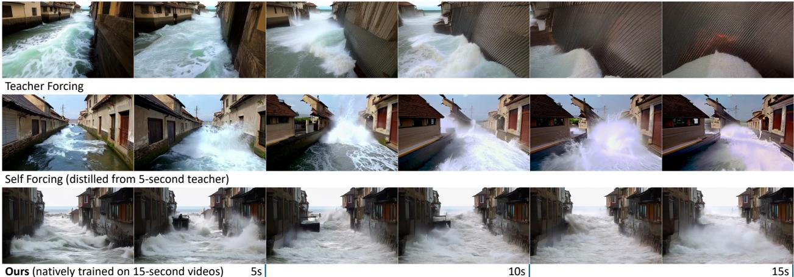
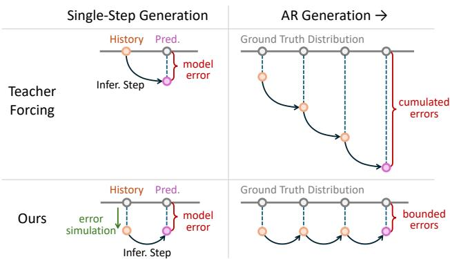
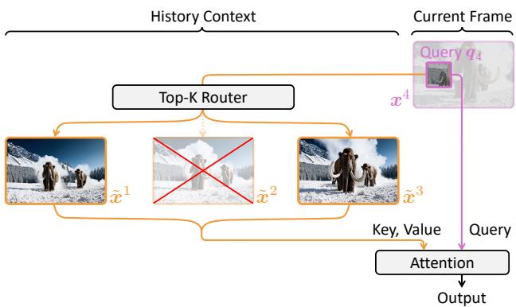
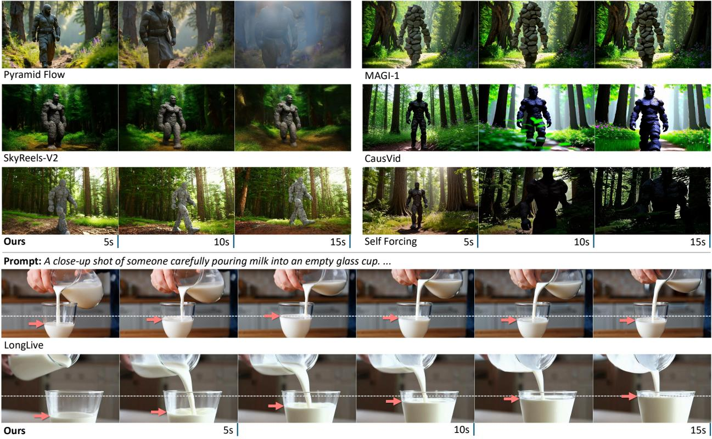

# End-to-End Training for Autoregressive Video Diffusion via Self-Resampling

Yuwei $\pmb { G u o } ^ { 1 , * }$ , Ceyuan Yang2,†, Hao $\mathsf { H } \ @ ^ { 1 }$ , Yang Zhao²2, Meng Wei3, Zhenheng Yang3, Weilin Huang², Dahua Lin1 1The Chinese University of Hong Kong, ByteDance Seed, 3ByteDance \*Work done at ByteDance Seed, †Corresponding authors

# Abstract

Autoregressive video difusion models hold promise for world simulation but are vulnerable to exposure bias arising from the train-test mismatch. While recent works address this via posttraining, they typically rely on a bidirectional teacher model or online discriminator. To achieve an end-to-end solution, we introduce Resampling Forcing, a teacher-free framework that enables training autoregressive video models from scratch and at scale. Central to our approach is a self-resampling scheme that simulates inference-time model errors on history frames during training. Conditioned on these degraded histories, a sparse causal mask enforces temporal causality while enabling parallel training with frame-level diffusion loss. To facilitate efficient long-horizon generation, we further introduce history routing, a parameter-free mechanism that dynamically retrieves the top $k$ most relevant history frames for each query. Experiments demonstrate that our approach achieves performance comparable to distillation-based baselines while exhibiting superior temporal consistency on longer videos owing to native-length training. Date: December 18, 2025 rojectPage: https://guoyww.github.io/projects/resampling-forcing

# 1 Introduction

Recent advances in generative video models have demonstrated strong potential for world modeling by approximating physical dynamics and predicting future states conditioned on current observations [2, 7, 28, 36]. Realizing this vision necessitates an autoregressive video generation paradigm that predicts the next frame conditioned on past context, thereby mirroring the strict causal nature of the physical world. Beyond world simulation, such a paradigm empowers a diverse array of applications, spanning game simulation [1, 62, 78, 85], interactive content creation [42, 54], and temporal reasoning [68]. Despite its conceptual elegance, autoregressive video generation poses significant challenges. The primary hurdle s exposure bias [48, 53]: under teacher forcing, the mode cnditions n ground truh histori uri training, yet must rely on its own generated outputs during inference. This traintest mismatch can induce error accumulation, where small artifacts in model predictions are amplified across the autoregressive rollout, potetialy lding t catastrophicvi collaps euretop.Furhermore, heverexpandinhia context in autoregressive generation exacerbates attention complexity, posing practical obstacles for both training and inference over long horizons.

  

FWeouRepliForg,a nton acreeraiamework utoreive dinmodes.Top:The teacr orciaccuulates erors n leas t video colapsMil: istilledom a oral SFuulBu stable quality by native training on long videos. To mitigate the traintest mismatch, recent works [32, 42] employ post-training strategies aimed at aligning the generated video distribution with real data. For instance, Self Forcing [32] first autoregressively rolls out ful videos, subsequently applying distillation or adversarial objectives to enforce distribution matching. By arheyruhnsH the reliance ona bidirectional teacheror an online discriminator impedes scalable training o autoregressive video models from scratch. A bidirectional teacher can also leak future information, compromising the strict temporal causality of the student model. Additionally, extensions to longer sequences typically use simple sliding-window attentions that disregard the varying importance of historical context, which may undermine long-term consistency.

In this work, we present Resampling Forcing, an end-to-end training framework for autoregressive video diffusion models. Drawing inspiration from the next-token prediction objective in LLMs, we condition each frame on its clean history and train in parallel via a per-frame diffusion loss under causal masking. We posit that, to mitigate error propagation and amplification, the model must be trained for robustness against input perturbations while retaining a clean prediction objective. To this end, the core of our method is a sel-resampling mechanism: the model frst induces errors in the history frames, then utilizes this degraded history to condition next-frame prediction. To simulate inference-time model errors, we autoregressively resample the latter segment of each frame's denoising trajectory with the online model weights. This process is detached from gradient backpropagation to avoid shortcut learning. In addition, we introduce a history routing mechanism that dynamically retrieves the top- $k$ most relevant history frames via a parameter-free router, maintaining a near-constant attention complexity in long-horizon rollout. Empirical results demonstrate that Resampling Forcing effectively mitigates error accumulation in autoregressive videodiffusion models, achieving generation quality comparable to state-of-the-art distilled models. Leveraging native long-video training, our approach outperforms extrapolated baselines in longer video generation.Furthermore, our model exhibits stricter adherence to causal dependencies compared to distillation baselines. We also demonstrate that our history routing mechanism attains a sparse context with negligible quality loss, offering a viable memory design for long-horizon generation. We anticipate that this work will advance scalable training and long-term memory for future video world models.

# 2 Related Works

Bidirectional Video Generation. Bidirectional video generation refers to non-causal models that synthesize all frames jointly, allowing each frame to attend to both past and future context. Early eforts leveraged GANs [55, 61] or adapted UNet-based text-to-image diffusion models [3, 5, 6, 25]. Inspired by SoRA [7], the field shifted towards 3D autoencoders and scalable Diffusion Transformers (DiT) [49], where all video tokens interact via sel-attention, with text conditions injected through MMDiT-style fusion [18, 26, 37] or separate cross-attention layers. State-of-the-art systems include commercial models such as Veo [23], Seedance [21], Kling [38], as wel as open-source ones like CogVideoX [74], LTX-Video [27], HunyuanVideo [37], and WAN [6]. Our approach is built with a DiT-based video diffusion backbone. Autoregressive Video Generation. Recently, autoregressive video generation [24, 29, 41, 44, 45, 51, 67, 79, 8] has gained significant traction due to its potential in world and game simulation. It generates a video sequentially under a causal factorization, conditioning each frame on its historical context. A pivotal challenge for autoregressive video diffusion is the traintest mismatch that leads to error accumulation [66]. Earlier attempts that directly use teacher forcing suffer from degraded quality as video length increases [20, 31, 84]. To counteract this, prior work injects small noise into history frames to approximate inference-time degradation [62, 67]. Another avenue adopts Diffusion Forcing [10, 11, 57], asigning each frame an independent noise level to enable conditioning at arbitrary noise during autoregressive rollout. Other works explorerelaxing stric causality via a rolling denoisingramework [2,58, 60, 72]. In this setup, vidframes within a sliding window maintain non-decreasing noise levels and initiate generation when the preceding frame reaches a target timestep. Some works explore the plan-interpolate strategy, by first generating a future keyframe and then interpolating intermediate frames [82]. Recently, Self Forcing [32, 42] has emerged as a promising post-training solution for train-test alignment. It first autoregressively rolls out the entire video, then computes a holistic distribution matching loss. However, its reliance on online discriminators for adversarial loss [22] or pretrained bidirectional teachers fo distillation [75,7,87 imt scalability d ider raig-r-cratc viability.Whi h the insight of inference simulation, our method uniquely supports end-to-end training without recourse to auxiliary models. Conditioning on Model Predictions.Conditioning the model on its own output is a strategy widely adopted to mitigate exposure bias in autoregressive systems. Schedule Sampling [4, 9, 47] in language models exemplifies this approach, replacing portions of the ground truth sequence with model-predicted tokens. In diffusion models, Self-Conditioning [13] improves sample quality by conditioning the current denoising step on previous estimation. For video generation, Stable Video Infinity [39] adopts an error-recycling strategy to reduce drifting in autoregressive long video inference.

Efficient Attention for Video Generation. As high-dimensional spatiotemporal signals, video representation requires a vast quantity of tokens, making quadratic-cost attention a computational bottleneck. To alleviate complexity, numerous works explore eficient attention design for video generation. One line of work employs linear complexity attention [12, 33, 50, 65]. Others exploit the sparsity in the attention score, pruning less activated tokens via defined attention masks [59, 70, 71, 81, 83]. For instance, Radical Attention [40] observes a spatial-temporal decay and proposes a sparse mask that shrinks importance as temporal distance grows. Recent works also adapt advanced sparse-attention designs from LLMs [46, 80]. For example, MoC [8] and VMoBA [69] integrate Mixture of Block Attention [46] into DiT blocks, where the key and value in attention are dynamically selected via a top- $k$ router. Our work integrates a similar routing mechanism, specifically tailored for handling long histories in autoregressive video generation.

# 3 Method

We begin by reviewing the background ofutoregressivevideo diffusion models and analyzing the exposure bias issue in section 3.1. We then present our Resampling Forcing algorithm for end-to-end training in section 3.2, and the dynamic history routing for efficient long-horizon attention in section 3.3.

# 3.1 Background

Deinition.Autoregressiv (AR) videodiffusionmodels factorize videogenerationintointer-raeautoregression and intra-frame diffusion [30, 56]. Specifically, given condition $c$ , the joint distribution of an $N$ -frame video sequence $\pmb { x } ^ { 1 : N }$ is expressed as

$$
p ( \pmb { x } ^ { 1 : N } | c ) = \prod _ { i = 1 } ^ { N } p ( \pmb { x } ^ { i } | \pmb { x } ^ { < i } , c ) .
$$

To sample from each conditional distribution, the $i$ -th frame $\mathbf { x } ^ { i }$ (denoted as $\mathbf { \Delta } \mathbf { x } _ { 0 } ^ { i }$ at timestep $t = 0$ ) is synthesized by solving the reverse-time ODE starting from Gaussian noise $\pmb { x } _ { 1 } ^ { i } \sim \mathcal { N } ( \mathbf { 0 } , I )$ at timestep $t = 1$ through which can be calculated via numerical solvers like Euler. Here, the neural network $\pmb { v } _ { \theta } ( \cdot )$ with parameter $\theta$ parameterizes the velocity field $\mathrm { d } \pmb { x } _ { t } ^ { i } / \mathrm { d } t$ and is conditioned on history frames $\mathbf { \boldsymbol { x } } ^ { < \imath }$ ,i.e., $\mathrm { d } \pmb { x } _ { t } ^ { i } / \mathrm { d } t = \pmb { v } _ { \theta } ( \pmb { x } _ { t } ^ { i } , \pmb { x } ^ { < i } , t , c )$ . Modern diffusion models typically employ Diffusion Transformer (DiT) [49] architecture, where videos are patchified and processed via attention mechanisms [63]. In practice, it is also common to generate a chunk of frames per autoregressive step. For simplicity, we refer to each chunk as a frame throughout this paper.

$$
\pmb { x } ^ { i } = \pmb { x } _ { 1 } ^ { i } + \int _ { 1 } ^ { 0 } \pmb { v } _ { \theta } ( \pmb { x } _ { t } ^ { i } , \pmb { x } ^ { < i } , t , c ) \mathrm { d } t ,
$$

Teacher Forcing. To train such sequence models, a common approach is teacher forcing, where the model is trained to predict the current frame $\mathbf { x } ^ { i }$ given its ground truth history $\mathbf { \boldsymbol { x } } ^ { < i }$ . In Flow Matching [43], the sample $\mathbf { \Delta } \mathbf { x } _ { t } ^ { i }$ at timestep $t$ is an interpolation between Gaussian noise $\epsilon ^ { i } \sim \mathcal { N } ( 0 , I )$ and the clean frame $\mathbf { x } ^ { i }$ via

$$
\pmb { x } _ { t } ^ { i } = ( 1 - t ) \cdot \pmb { x } ^ { i } + t \cdot \pmb { \epsilon } ^ { i } .
$$

The network $\pmb { v } _ { \theta } ( \cdot )$ is then trained to regress the velocity $\mathrm { d } \pmb { x } _ { t } ^ { i } / \mathrm { d } t = \epsilon ^ { i } - \pmb { x } ^ { i }$ by minimizing

$$
\begin{array} { r } { \mathcal { L } = \mathbb { E } _ { i , t , { \boldsymbol { x } } , { \boldsymbol { \epsilon } } } \left[ \| ( { \boldsymbol { \epsilon } } ^ { i } - { \boldsymbol { x } } ^ { i } ) - { \boldsymbol { v } } _ { \boldsymbol { \theta } } ( { \boldsymbol { x } } _ { t } ^ { i } , { \boldsymbol { x } } ^ { < i } , t , { \boldsymbol { c } } ) \| _ { 2 } ^ { 2 } \right] . } \end{array}
$$

Here, $\pmb { v } _ { \theta } ( \cdot )$ takes two seperate sequences as inputs: the noisy frames $\mathbf { \Delta } \mathbf { x } _ { t } ^ { i }$ as diffusion samples and the noise-free ground truth frames $\mathbf { \boldsymbol { x } } ^ { < i }$ . A causal mask restricts each frame to attend only to its clean history, enabling parallel training for all frames (see fig ure 3 (b,c)). During inference, once a frame is generated, its clean features can be cached and reused for subsequent frame generation (KV cache). Therefore, the number of attention queries remains constant, while the keys and values grow as the video becomes longer.

  
Figure 2 Error Accumulation. Top: Models trained with ground truth input add and compound errors autoregressively. Bottom: We train the model on imperfect input with simulated model errors, stabilizing the long-horizon autoregressive generation. The gray circle represents the closest match in the ground truth distribution.

Error Accumulation. Under teacher forcing, each frame's generation is conditioned on its ground-truth history. However, during inference, model predictions are inevitably imperfect. In other words, model generations always have a non-zero discrepancy from the ground truth distribution, which we refer to as modelerror. The model trained on perfect inputs wil propagate and accumulate such errors through the autoregressive loop, leading to quality degradation and eventual failure in long-horizon rollouts. (see figure 2 top).

# 3.2 Enhancing Error Robustness

As analyzed above, the failure of teacher forcing stems from the distributional mismatch between training and inference inputs, driven by irreducible model errors. With finite model capacity and training samples, elminatng su erosntractablInstead we proposeraininhemode t condition degradehist while maintaining error-free targets for prediction. This relaxes the model from strict adherence to input coitins nabl ion uors.stratathe bottu,alhou thee predictions remain imperfect,errors o longer compound.Instead, the errors are stabilized to a near constant level over the autoregressive process. SimlatinheMor.Torarorrobusutoressivoe, wemus ulateren-time errors on the input conditions. We pursue an end-to-end, teacher-free approach to achieve this, prioritizing simplicity and scalability. There are two major factors that drive the distribution shift in autoregressive diffusion: (1) intra-frame generation errors that come from imperfect score estimation and discretization, whic mainly affect high-frequency details [19, 66]; and (2) inter-frame accumulated errors that propagate through the autoregressive loop [66, 77].

  
FRepligForTulat e-ie moeleo  osevios timestep $t _ { s }$ , then use the online model weights to autoregressively complete the remaining denoising steps. (b) The its clean history frames.

To simulate errors from both aspects, we introduce autoregressive self-resampling on the history condition. To mimic intra-frame errors, we resample the latter denoising trajectory, where high-frequency details are typically synthesized. Specifically, we corrupt ground truth video frame $\mathbf { x } ^ { i }$ to a sampled timestep $t _ { s } \in ( 0 , 1 )$ via equation (3) to obtain $\mathbf { \Delta } \mathbf { x } _ { t _ { s } } ^ { i }$ . Subsequently, we employ the online model $\pmb { v } _ { \theta } ( \cdot )$ to complete the remaining denoising steps and produce a degraded noise-free frame $\tilde { \mathbf { x } } ^ { i }$ that contains model errors. The timestep $t _ { s }$ controls how close $\tilde { \mathbf { x } } ^ { i }$ is to its ground truth version $\mathbf { x } ^ { i }$ . To mimic inter-frame error accumulation, we resample each frame autoregressively, conditioning on degraded history frames $\widetilde { \pmb { x } } ^ { < i }$ (see figure 3 (a)), i.e.,

$$
\tilde { \pmb { x } } ^ { i } = \pmb { x } _ { t _ { s } } ^ { i } + \int _ { t _ { s } } ^ { 0 } \pmb { v } _ { \theta } ( \pmb { x } _ { t } ^ { i } , \tilde { \pmb { x } } ^ { < i } , t , c ) \mathrm { d } t .
$$

Utiliziniemode wghsu hat herorisrbui evolvlongsieraithereye the model to continuously learn to correct its current imperfections.Gradients are detached from this proces to prevent shortcut learning. In practice, this procedure can be eiciently implemented with KV cache.

Sampling Simulation Timestep. The timestep $t _ { s }$ in equation (5) governs the trade-off between history faithfulness and error correction flexibility. A small $t _ { s }$ yields low resampling strength, resulting in a degraded sample $\tilde { \mathbf { x } } ^ { i }$ that closely resembles its ground truth $\mathbf { x } ^ { i }$ . This encourages the model to stay faithful to the history frames and risks error accumulation (teacher forcing is a limiting case where $t _ { s } = 0$ ). On the other hand, a large $t _ { s }$ grants greater fexibility for error correction but raises the chance of content drifting, as the model is permitted to deviate significantly from the historical context. Consequently, the distribution of $t _ { s }$ should concentrate density on intermediate values while suppressing extremes. To model this, we chose to sample $t _ { s }$ from logit-normal distribution LogitNormal $( 0 , 1 )$ that satisfies the above properties:

$$
\mathrm { l o g i t } ( t _ { s } ) \sim \mathcal { N } ( 0 , 1 ) .
$$

Generaly, tronger models induce fewererrors, allowing for a greater mphasis on low resmpling strengt, and vice versa. To manually bias $t _ { s }$ 's distribution, inspired by [18], we apply a timestep shifting with parameter $s$ after sampling $t _ { s }$ from the standard logit normal distribution via

$$
{ t _ { s } } \gets s \cdot { t _ { s } } / \left( { 1 + ( s - 1 ) \cdot { t _ { s } } } \right) .
$$

In implementation, we set $s < 1$ to put more weights on the low-noise part. After resampling, we use the degraded video $\tilde { \pmb { x } } ^ { 1 : N }$ as history condition, and use the ground truth video $\pmb { x } ^ { 1 : N }$ as the training objective. The complete pseudo code for Resampling Forcing is shown in algorithm 1. Teacher Forcing Warmup. In the initial training phase, the model has not yet converged to the causal architecture and is incapable of generating meaningful content autoregressively. The model errors at this

# Algorithm 1 Resampling Forcing stage are dominated by random initialization rather than specific intra-frame imperfections or inter-frame accumulation.Therefore, performing history selresampling can lead touninormative learning signals an will hinder convergence. We therefore first warm up the model using teacher forcing.Once the model acquires basic autoregressive capabilities (though imperfect), we transition to Resampling Forcing and continue training.

<table><tr><td>Require: Video Dataset D</td><td></td><td></td></tr><tr><td></td><td>Require: Shift Parameter s</td><td></td></tr><tr><td></td><td>Require: Autoregressive Video Diffusion Model vθ(·)</td><td></td></tr><tr><td></td><td>1: while not converged do</td><td></td></tr><tr><td>2:</td><td>ts ∼ LogitNormal(0, 1)</td><td> sample simulation timestep</td></tr><tr><td>3:</td><td>ts ← s · ts/ (1 + (s − 1) · ts)</td><td> shift timestep (equation (7))</td></tr><tr><td>4:</td><td>Sample video and condition (x1:N , c) ∼ D</td><td></td></tr><tr><td>5:</td><td></td><td></td></tr><tr><td>6:</td><td>with gradient disabled do</td><td></td></tr><tr><td>7:</td><td>for i = 1 to N do</td><td> autoregressive resampling</td></tr><tr><td>8:</td><td>L0 vθ(xt, x&lt;i, t, c) dt</td><td>&gt; using numerical solver and KV cache (equation (5))</td></tr><tr><td>9:</td><td>Jts end for</td><td></td></tr><tr><td>10:</td><td>end with</td><td></td></tr><tr><td>11:</td><td>Sample training timestep ti</td><td></td></tr><tr><td>12:</td><td>Sample i ∼ N (0, I)</td><td></td></tr><tr><td>13:</td><td>xti ← (1 − ti) · xi + ti · i</td><td></td></tr><tr><td>14:</td><td>N 1 L ← ∑I ∥(i − xi) − vθ(xi, x&lt;i, ti, c)k2 N</td><td>&gt; parallel training with causal mask (equation (4))</td></tr><tr><td>15:</td><td>i=1 Update θ with gradient descent</td><td></td></tr><tr><td></td><td>16: end while</td><td></td></tr><tr><td></td><td>17: return θ</td><td></td></tr></table>

# 3.3 Routing History Context

In autoregressive generation, the number of history frames grows as the video becomes longer. This decelerates generation for subsequent frames, as dense causal attention necessitates attending to the entire historical context. To resolve this, a common solution is to restrict the attention receptive field to a local sliding window [32, 42, 73]. However, this approach compromises long-term dependency, sacrificing global consistency and exacerbating the drifting problem. To maintain stable attention complexity, we opt to optionally replace the dense causal attention with a dynamic routing mechanism, inspired by the advanced sparse attention in LLMs [46, 80]. Specifically, for the query token $\pmb q _ { i }$ of the $i$ -th frame, rather than attending to the full history, we dynamically retrieve and attend to the top- $k$ most relevant history frames (see figure 4), i.e., where $\Omega ( \pmb q _ { i } )$ is set of selected indices of $k$ history frames for query $\pmb { q } _ { i }$ . For selection metric, we use the dot product of $\pmb { q } _ { i }$ and a frame descriptor $\phi ( \pmb { K } _ { j } )$ (for $j$ -th frame), i.e.,

  
Figure 4 History Routing Mechanism. Our routing mechanism dynamically selects the top- $k$ important frames to attend. In this illustration, we show a $k = 2$ example, where only the 1st and 3rd frames are selected for the 4th frame's query token $\mathbf { q } _ { 4 }$ .

$$
\mathrm { A t t e n t i o n } ( q _ { i } , K _ { < i } , V _ { < i } ) = \mathrm { S o f t m a x } \left( \frac { q _ { i } K _ { \Omega ( q _ { i } ) } ^ { \top } } { \sqrt { d } } \right) \cdot V _ { \Omega ( q _ { i } ) } ,
$$

$$
\Omega ( \pmb { q } _ { i } ) = \arg \operatorname* { m a x } _ { \Omega ^ { * } } \sum _ { j \in \Omega ^ { * } } \left( \pmb { q } _ { i } ^ { \top } \phi ( \pmb { K } _ { j } ) \right) .
$$

Following [8, 46, 69], we use mean pool as the descriptor transformation $\phi ( \cdot )$ since it adheres to the attention score computation and is parameter-free. This reduces the per-token attention complexity from linear $\mathcal { O } ( L )$ to constant ${ \mathcal { O } } ( k )$ as the number of history frames $L$ grows, achieving an attention sparsity of $1 - k / L$ . Notably, while $k$ may be set small for high sparsity, the routing mechanism operates in a head-wise and token-wise manner, implying that tokens across different attention heads and spatial locations can route to distinct history mixtures, and collectively yield a receptive field significantly larger than $k$ frames. In implementation, following MoBA [46], we adopt an efficient two-branch attention that fuses an intra-rame pawynasty athway obalexIheameranc, quy only to tokens within its own frame. In the history branch, we select up to top- $k$ relevant past frames for each query token. Both branches are implemented efficiently with the flash_attn_varlen_func() interface from FlashAttention [15, 16]. Outputs are combined by aligning their log-sum-exp terms, yielding a result equivalent to a single softmax over the union of keys.

# 4 Experiments

Model. We build our method upon WAN2.1-1.3B [64] architecture and load its pre-trained weights to speed up convergence. The original model uses bidirectional attention and generates 5s videos (81 frames) in $4 8 0 \times 8 3 2$ resolution. We modify timestep conditioning to support per-frame noise levels, and implement the sparse causal attention in figure 3 (c) with torch.flex_attention(), incurring no additional parameters. Following [14, 32, 73], we use a chunk size of 3 latent frames as the autoregressive unit. Training. After switching to causal attention, the model was trained on 5s videos with the teacher forcing objective for 10K steps to warm up, then transition to Resampling Forcing and trained sequentially on $5 \mathrm { s }$ and 15s (249 frames) videos, for 15K and 5K steps respectively. We then fine-tune with sparse history routing enabled for 1.5K iterations on 15s videos. The training batch size is 64 and the learning rate for the AdamW optimizer is $5 e - 5$ . We set the timestep shifting factor $s = 0 . 6$ (section 3.2), and $k = 5$ in top- $k$ history routing (section 3.3). For efficiency, we use a 1-step Euler solver for history resampling (equation (5)). Inference. We use consistent inference settings to generate al vido frames. We use an Euler sampler with 32 steps and a timestep shifting factor of 5.0. The classifier-free guidance scale is 5.0 for all frames.

# 4.1 Comparisons

Baselines. We compare our method with recent autoregressive video generation baselines, including SkyReelsV2 [1], MAGI-1 [60], NOVA [17], Pyramid Flow [35], CausVid [77], Self Forcing [32], and a concurrent work, LongLive [73]. Notably, SkyReel-V2 operates as a clip-level autoregressive model, generating 5s video segments sequentially. MAGI-1 relaxes the strict causal constraint, initiating next-chunk denoising prior to the completion of the current chunk's generation. LongLive adopts the same principle as Self Forcing but rolls out longer videos, then takes 5 s sub-clips and computes distillation loss with teacher models. Qualitative Comparison. We provide a visual qualitative comparison across different methods in figure 5, where all models are prompted to generate 15-second videos. In the upper panel, we compare the visual quality over time, observing that most strict autoregressive models (e.g., Pyramid Flow [35], CausVid [77], and Self Forcing [32]) exhibit error accumulation, manifested as progressive degradation in color, texture, and overall sharpness. Specifically, CausVid drifts towards over-saturation, while Pyramid Flow and Self Forcing display color and texture distortions. By contrast, approaches that relax strict causality (MAGI-1 [60]) or use large autoregressive chunks (SkyReels-V2 [11]) alleviate long-horizon degradation. However, these relaxed settings compromise intrinsic advantages of stric autoregression, such as per-frame interactivity and faithful causal dependency for future-state prediction.

  
Figure 5 Qualitative Comparisons. Top: We compare with representative autoregressive video generation models, showin ur method's stable quality on long video generation.Bottom:Compared with LongLive [73] that istill from shor bcialacr, urmethoexhibts bettecusaliye usedashe ienoe thees liquid level, and red arrows to highlight the liquid level in each frame.

Within the strict autoregressive paradigm, our method demonstrates superior robustness in long-term visual quality compared to baselines.

In the lower panel, we further compare with a concurrent autoregressive model LongLive [73], which first enerates long videos and then perfors sub-clip distilation using a short-horizon teacher.Although LongLive attis strongong-rangevisul quality weservethatdistlation fromshor birectionalteacherail t ensure stri causality, even with atemporal causal student architecture In the "mil pourin"examplein fgure 5, LongLive produces a liquid level that rises and then falls despite continuous pouring, which violates physical laws. By contrast, our model maintains strict temporal causality: the liquid level monotonically increases while the source container empties. We attribute this non-causal behavior to two factors. First, the bidirectional teacher is inherently non-causal, allowing future information to infuence earlier frames viatention thereby leaking uturecontext tothe student durindistllatio.Second, sub-cip distillatin emphasizes local appearance quality and neglects global causality. Conversely, our training strictly precludes information leakage from the future.

Quantitative Comparison. We evaluate methods using the automatic metrics provided by VBench [34]. All models are prompted to generate 15-second videos, which we partition into three segments and evaluate them separately to betterassess long-term quality.Results are smmarized in table Asevidenced in the table method maintains comparable visual quality and superior temporal quality on all video lengths to baselines. On longer video lengths, our method's performance also matches the long video distilation baseline LongLive. Given that the distill-based methods (i.e., CausVid [77], Self Forcing [32], and LongLive [73]) necesitate a pretrained 14B-parameter bidirectional teacher, our method offrs substantial eiciency and practicality for training autoregressive video models. Moreover, the history routing mechanism achieves an attention sparsity of $7 5 \%$ while incuring only a negligible drop relative to the dense-attention baseline,demonstrating its strong potential for long-horizon generation under constrained compute and memory budgets. Table1uantitativComparisons.We pli the enerate 1seon vido intthree parts,  s, 50 1015 s, and separately evaluate the videos with VBench [34].   

<table><tr><td rowspan="2">Method</td><td rowspan="2">#Param</td><td rowspan="2">Teacher Model</td><td colspan="3">Video Length = 015 s Temporal</td><td colspan="3">Video Length = 510 s</td><td colspan="3">Video Length = 1015 s</td></tr><tr><td></td><td>Visual</td><td>Text</td><td>Temporal</td><td>Visual</td><td>Text</td><td>Temporal</td><td>Visual</td><td>Text</td></tr><tr><td>SkyReels-V2 [11]</td><td>1.3B</td><td></td><td>81.93</td><td>60.25</td><td>21.92</td><td>84.63</td><td>59.71</td><td>21.55</td><td>87.50</td><td>58.52</td><td>21.30</td></tr><tr><td>MAGI-1 [60]</td><td>4.5B</td><td></td><td>87.09</td><td>59.79</td><td>26.18</td><td>89.10</td><td>59.33</td><td>25.40</td><td>86.66</td><td>59.03</td><td>25.11</td></tr><tr><td>NOVA [17]</td><td>0.6B</td><td>-</td><td>87.58</td><td>44.42</td><td>25.47</td><td>88.40</td><td>35.65</td><td>20.15</td><td>84.94</td><td>30.23</td><td>18.22</td></tr><tr><td>Pyramid Flow [ [35]</td><td>2.0B</td><td></td><td>81.90</td><td>62.99</td><td>27.16</td><td>84.45</td><td>61.27</td><td>25.65</td><td>84.27</td><td>57.87</td><td>25.53</td></tr><tr><td>CausVid [77]</td><td>1.3B</td><td>WAN2.1-14B(5s)</td><td>89.35</td><td>65.80</td><td>23.95</td><td>89.59</td><td>65.29</td><td>22.90</td><td>87.14</td><td>64.90</td><td>22.81</td></tr><tr><td>Self Forcing [32]</td><td>1.3B</td><td>WAN2.1-14B(5s)</td><td>90.03</td><td>67.12</td><td>25.02</td><td>84.27</td><td>66.18</td><td>24.83</td><td>84.26</td><td>63.04</td><td>24.29</td></tr><tr><td>LongLive [ [73]</td><td>1.3B</td><td>WAN2.1-14B(5s)</td><td>81.84</td><td>66.56</td><td>24.41</td><td>81.72</td><td>67.05</td><td>23.99</td><td>84.57</td><td>67.17</td><td>24.44</td></tr><tr><td>Ours (75% sparsity)</td><td>1.3B</td><td>-</td><td>90.18</td><td>63.95</td><td>24.12</td><td>89.80</td><td>61.95</td><td>24.19</td><td>87.03</td><td>61.01</td><td>23.35</td></tr><tr><td>Ours</td><td>1.3B</td><td></td><td>91.20</td><td>64.72</td><td>25.79</td><td>90.44</td><td>64.03</td><td>25.61</td><td>89.74</td><td>63.99</td><td>24.39</td></tr></table>

# 4.2 Analytical Studies

In this section, we perform ablation on design components and analyze the model behaviors. Error Simulation Strategies. In section 3.2, we hypothesized that exposing the model to imperfect historical contexts during training mitigates error accumulation, and propose autoregressive selfresampling to simulate model errors. We compare against two alternatives: noise augmentation [62] and parallel resampling. In the first, small Gaussian noise is added to the history frames to improve Table 2 Error Simulation Strategies. Autoregressive resampling achieves the best quality.   

<table><tr><td>Simulation Strategies</td><td colspan="3">Video Length = 015 s</td></tr><tr><td></td><td>Temporal</td><td>Visual</td><td>SText</td></tr><tr><td>noise augmentation</td><td>87.15</td><td>61.90</td><td>21.44</td></tr><tr><td>resampling - parallel</td><td>88.01</td><td>62.51</td><td>24.51</td></tr><tr><td>resampling - autoregressive</td><td>90.46</td><td>64.25</td><td>25.26</td></tr></table>

robustness to inference errors. In the second, all historical frames are resampled in parallel rather than autoregressively. As shown in table 2, the autoregressive resampling strategy achieves the highest quality, followed by paralel resampling and noise augmentation. We attribute this to a mismatch between additive noise and the model's inference-time error mode, as wel as the fact that parallel resampling captures only per-frame degradation while neglecting autoregressive accumulation across time.

Simulation Timestep Shifting. We ablate the shifting factor $s$ that bias the timestep $t _ { s }$ distribution. As defined in equation (7), a small $s$ concentrates $t _ { s }$ in the low-noise region, and a large $s$ shifts $t _ { s }$ toward higher noise. Equivalently, a small $s$ corresponds to weaker history resampling, encouraging faithfulness to past content, whereas a large $s$ enforces stronger resampling, promoting content modifications that may induce drift. We observe that model performance is robust to the choice of $s$ ; therefore, we adopt extreme values in this ablation to better visualize the impact of the shifting factor. In figure 6, the model trained with small $s$ exhibits error accumulation and quality degradation, while a very large $s$ reduces semantic consistency with history, increasing the risk of initial content drifting. Thus, a moderate value for $s$ is essential to strike a balance between mitigating error accumulation and preventing drift.

  

Prompt: A red balloon floating in an abandoned street. ..   
Figure 6 Comparing Timestep Shifting. A moderate shifting scale for resampling timestep $t _ { s }$ is necessary to balance between error accumulation and content drifting.

Sparse History Strategies. We compare three mechanisms for leveraging historical context in autoregressive generation: dense causal attention, dynamic history routing, and sliding-window attention [32, 42]. We show qualitative results for dense attention, top-5 and top-1 routing, and sliding-window attention in figure 7. As shown in the figure, routing to the top-5 of 20 history frames yields $7 5 \%$ sparsity with quality comparable to dense attention. Reducing from top-5 to top-1 ( $9 5 \%$ sparsity) causes only minor quality degradation, demonstrating the robustness of the routing mechanism. We further contrast top-1 routing with a sliding window of size 1. Despite equal sparsity, the routing mechanism maintains superior consistency in the fish's appearance. Wehypothesize that sliding-windowattention's fixed and localized receptive feld exacerbates the risk of drift. By contrast, our dynamic routing enables each query token to select diverse historical context combinations, collectively yielding alarger effective receptivefeld that better preserves global consistency.

  

Prompt: A tropical fish swimming among colorful coral reefs...   
Figure 7 Sparse History Strategies. We compare dense causal attention, dynamic history routing, and sliding window attention in terms of appearance consistency.

History Routing Frequency. To provide deeper insights into history routing, we experiment with $k = 1 , 3 , 5 , 7$ and visualize the selection frequency of each history frame during the generation of the current frame. As shown in figure 8, the selection frequencies exhibit a hybrid "sliding-window" and "attention-sink" pattern: the router prioritizes initial frames alongside the most recent frames preceding the target. This effect is most pronounced under extreme sparsity ( $k = 1$ ) and becomes more distributed as sparsity decreases ( $k = 1  7$ ),encompassing a broader range of intermediate frames. The observation offers empirical support for recent attention designs combining "frame sinks" with slid ing windows for long video rollout [73], which can be viewed as a special case of our approach. Our results susan alterative pathtoattention sparsiy:replaciedheuristicmasks widyamic, content-awre routing mechanism capable of exploring a vastly larger space of context combinations.

  
Figure 8 History Routing Frequency. We visualize the beginning 20 frames' frequency of being selected when generating the 21st frame. For readability, the maximum bar is truncated and labeled with its exact value.

# 5 Discussions

We presented Resampling Forcing, an end-to-end, teacher-freeframework for training autoregressive video diffusion models. Identifying the root cause of error acumulation, we proposed a history self-resampling strategy that effectively mitigates this issue, ensuring stable long-horizon generation. Furthermore, we introduced a history routing mechanism designed to maintain near-constant attention complexity despite the ever-growing historical context.Experiments demonstrate our method's superior visual quality androbustness under high attention sparsity. Limitations. As a diffusion-based approach, our model necessitates iterative denoising steps for inference. Achieving real-time latency may require post-hoc acceleration, such as few-step distillation or improved samplers. Additionally, our training entails processing dual sequence (diffusion samples and clean history), which could be improved with architecture optimizations similar to [42].

# References

[1] Eloi Alonso, Adam Jelley, Vincent Michel, Anssi Kanervisto, Amos J Storkey, Tim Pearce, and Françis Fleuret. Diffusionfor world modeling:Visual details matter in atari.Advances in Neural Information Processing Systems, 37:5875758791, 2024.   
[2] Phil J.Ball, Jakob Bauer, Frank Belltt Bethanie Brownel, Ariel Ephrat, Shlomi Fruchter, Agrim Gupta, Kristian Holsheimer, Aleksander Holynski, Jiri Hron, Christos Kaplanis, Marjorie Limont, Matt McGill, Yanko Olveira, Jack Parkr-Holder, Frank Perbet,Guy Scully, Jremy Shar, Stephen Spencer, Omer Tov, Ruben Vlleas, Emma Wang, Jessica Yung, CipBaetu, Jordi Berbel, David Bridson, Jake Bruce, GavinButtimore, Sarah Chakera, Bilva Chandra, Paul Collins, Alex Cullum, Bogdan Damoc, Vibha Dasagi, Maxime Gazeau, Charles Gbadamosi, Woohyun Han, Ed Hirst, Ashyana Kachra, Lucie Kerley, Kristian Kjems, Eva Knoepfel, Vika Koriakin, Jessica Lo, Cong Lu, Zeb Mehring, Alex Moufarek, Henna Nandwani, Valeria Oliveira, Fabio Pardo, Jane Park, Andrew Pierson, Ben Poole, Helen Ran, Tim Salimans, Manuel Sanchez, Igor Saprykin, Amy Shen, Sailesh Sidhwani, Duncan Smith, Joe Stanton, Hamish Tomlinson, Dimple Vijaykumar, Luyu Wang, Piers Wingfield, Nat Wong, Keyang Xu, Christopher Yew, Nick Young, Vadim Zubov, Douglas Eck, Dumitru Erhan, Koray Kavukcuoglu, Demis Hassabis, Zoubin Gharamani, Raia Hadsell, Aäron van den Oord, Inbar Mosseri, Adrian Bolton, Satinder Singh, and Tim Rocktäschel. Genie 3: A new frontier for world models, 2025.   
[3] Omer Bar-Tal, Hila Chefer, Omer Tov, Charles Herrmann, Roni Paiss, Shiran Zada, Ariel Ephrat, Junhwa Hur, Guanghui Liu, Amit Raj, et al. Lumiere: A space-time diffusion model for video generation. In SIGGRAPH Asia 2024 Conference Papers, pages 111, 2024.   
[4] Samy Bengio, Oriol Vinyals, Navdeep Jaitly, and Noam Shazeer. Scheduled sampling for sequence prediction with recurrent neural networks. Advances in neural information processing systems, 28, 2015.   
[5] Andreas Blattmann, Tim Dockhorn, Sumith Kulal, Daniel Mendelevitch, Maciej Kilian, Dominik Lorenz, Yam Levi Zion English, Vikram Voleti, Adam Letts, et alStable vidodiffusion: Scalnglatent videodiffusion odels to large datasets. arXiv preprint arXiv:2311.15127, 2023.   
[6] Andreas Blattmann, Robin Rombach, Huan Ling, Tim Dockhorn, Seung Wook Kim, Sanja Fidler, and Karsten Kreis. Align your latents: High-resolution video synthesis with latent diffusion models. In Proceedings of the IEEE/CVF Conference on Computer Vision and Pattern Recognition, pages 2256322575, 2023.   
[7] Tim Brooks, Bill Peebles, Connor Holmes, Will DePue, Yufei Guo, Li Jing, David Schnurr, Joe Taylor, Troy Luhman, Eric Luhman, Clarence Ng, Ricky Wang, and Aditya Ramesh. Video generation models as world simulators, 2024. URL https://openai.com/research/video-generation-models-as-world-simulators.   
[8] Shengqu Cai, Ceyuan Yang, Lvmin Zhang, Yuwei Guo, Junfei Xiao, Ziyan Yang, Yinghao Xu, Zhenheng Yang, AlanYuille, Leonidas Guibas alMixture contexts orlongvidogeneration.rXiv prerin arXiv:2508.1058, 2025.   
[9] Zhepeng Cen, Yao Liu, Silang Zeng, Pratik Chaudhari, Huzfa Rangwala, George Karypis, and Raso Fakoor. Briging thetraining-inference gap in ls by leveraging sel-generated tokensarXiv preprintarXiv:2410.1655, 2024.   
[10] Boyuan Chen, Diego Martí Monsó, Yilun Du, Max Simchowitz, Russ Tedrake, and Vincent Sitzmann. Diffusion forcing: Next-token prediction meets full-sequence diusion.Advances inNeural Information Procesing Systems, 37:2408124125, 2025.   
[11] Guibin Chen, Dixuan Lin, Jiangping Yang, Chunze Lin, Junchen Zhu, Mingyuan Fan, Hao Zhang, Sheng Chen, Zheng Chen, Chengcheng Ma, et al. Skyreels-v2: Infinite-length flm generative model. arXiv preprint arXiv:2504.13074, 2025.   
[12] Juns Chen, Yuyang Zhao, Jinchengu, Ruihahu, Junyu Chen, Shuai Yang, Xianba Wng, Yicheg Pan, Daquan Zhou, Huan Ling, et al. Sana-video: Effiient video generation with block linear diffusion transformer. arXiv preprint arXiv:2509.24695, 2025.   
[13] Ting Chen, Ruixing Zhang, nd Geoffy Hinton.Analog bits: Generating discte data using diuion oels with self-conditioning. arXiv preprint arXiv:2208.04202, 2022.   
[14] Justin Cui, Jie Wu, Ming Li, Tao Yang, Xiojie Li, Rui Wang, Andrew Bai, Yuanhao Ban, and Cho-Jui Hieh. Self-forcing++: Towards minute-scale high-quality video generation. arXiv preprint arXiv:2510.02283, 2025.   
[15] Tri Dao. FlashAttention-2: Faster attention with better parallelism and work partitioning. In Interational Conference on Learning Representations (ICLR), 2024.   
[ Ti Dao DanFu, Stamn, AiRudra an Crisher lashAtte: astne-ent exact attention with IO-awareness. In Advances in Neural Information Processing Systems (NeurIPS), 2022.   
[1] Haoge Deng, Ting Pan, Haiwen Diao, Zhenxiong Luo, Yufeng Cui, Huchuan Lu, Shiguang Shan, Yonggang Qi, and Xinlong Wang. Autoregressive video generation without vector quantization. arXiv preprint arXiv:2412.14169, 2024.   
[18] Patric Essr, Smi KulaAndres Blata RhiEntear Jonas Mü, Harry Sai YmLevi D Lore, AxelSauer, FredericBoesel, e alScalng rectife fowtransormers or hig-resolution mage syntheis. In Forty-first international conference on machine learning, 2024.   
[9] Fbian Falck, TeodoraPandeva, Kiarash Zahiria, Rachel Lawrece, Richard Turr, Edward Meeds, JaviZazo, and Sushrut Karmalkar.A fourier space perspective on diffusion models.arXiv preprint arXiv:2505.11278, 2025.   
[20] Kaifeng Gao, Jiaxin Shi, Hanwang Zhang, Chunping Wang, Jun Xiao, and Long Chen. Ca2-vdm: Efficient autoregressive video diffusion model with causal generation and cache sharing.arXiv preprint arXiv:2411.16375, 2024.   
[21] Yu Gao, Haoyuan Guo, Tuyen Hoang, Weilin Huang, Lu Jiang, Fangyuan Kong, Huixia Li, Jiashi Li, Liang Li, Xiaojie Li, et al. Seedance 1.0: Exploring the boundaries of video generation models. arXiv preprint arXiv:2506.09113, 2025.   
[2] Ian Goodelow, Jean Pouget-Abadie,Mehi Mirza,Bing Xu, David Warde-Farley, Sherjl Ozair Aaron Courville, and Yoshua Bengio. Generative adversarial networks. Communications of the ACM, 63(11):139144, 2020.   
[23] Google DeepMind. Veo, 2025. URL https://deepmind.google/models/veo.   
[24] Jiatao Gu, Ying Shen, Tianrong Chen, Laurent Dinh, Yuyang Wang, Miguel Angel Bautista, David Berthelot, Josh Susskind, and Shuangfei Zhai. Starflow-v: End-to-end video generative modeling with normalizing flow. arXiv preprint arXiv:2511.20462, 2025.   
[25] Yuwei Guo, Ceyuan Yang, Anyi Rao, Zhengyang Liang, Yaohui Wang, Yu Qiao, Maneesh Agrawala, Dahua Lin, and Bo Dai. Animatediff: Animate your personalized text-to-image diffusion models without specific tuning. arXiv preprint arXiv:2307.04725, 2023.   
[26] Yuwei Guo, Ceyuan Yang, Ziyan Yang, Zhibei Ma, Zhije Lin, Zhenheg Yang, Dahua Lin, and Lu Jiang. Long context tuning for video generation. arXiv preprint arXiv:2503.10589, 2025.   
[27] Yoav HaCohen, Nisan Chiprut, Benny Brazowski, Daniel Shalem, Dudu Moshe, Eitan Richardson, Eran Levin, Guy Shira, Nir Zabari Ori Gordon, et al. Ltx-videoRealtime video latent diffusionarXiv preprint arXiv:2501.00103, 2024.   
[28] Horan He, Yang Zhang, Liang Lin, Zhongwen Xu, and Ling Pan. Pre-trained video generative models as world simulators. arXiv preprint arXiv:2502.07825, 2025.   
[29] Roberto Henschel, Levon Khachatryan, Hayk Poghosyan, Daniil Hayrapetyan, Vahram Tadevosyan, Zhangyang Wang, Shant Navasardyan, and Humphrey Shi. Streamingt2v: Consistent, dynamic, and extendable long video generation from text.In Procedings ofthe ComputerVision and PatternRecognition Conference, pages 25682577, 2025.   
[30] Jonathan Ho, Ajay Jain, and Pieter Abbeel. Denoising diffusion probabilistic models. Advances in neural information processing systems, 33:68406851, 2020.   
[31] Jinyi Hu, Shengding Hu, Yuxuan Song, Yufei Huang, Mingxuan Wang, Hao Zhou, Zhiyuan Liu, Wei-Ying Ma, and Maosong Sun. Acdit: Interpolating autoregressive conditional modeling and diffusion transformer. arXiv preprint arXiv:2412.07720, 2024.   
[32] Xun Huan, Zhengqi Li, Guande He, Mingyuan Zhou, and Eli Shechman. Sef forcing: Bridging the train-test gap in autoregressive video diffusion. arXiv preprint arXiv:2506.08009, 2025.   
[3] Yushi Huang, Xingtong Ge, Ruihao Gong, Chengtao Lv, and Jun Zhang. Linvideo: A post-training framework towards o (n) attention in efficient video generation. arXiv preprint arXiv:2510.08318, 2025.   
[34] Ziqi Huang, Yinan He, Jiashuo Yu, Fan Zhang, Chenyang Si, Yuming Jiang, Yuanhan Zhang, Tianxing Wu, Qingyang Jin, Nattapol Chanpaisit, et al. Vbench: Comprehensive benchmark suite for video generative models. In Proceedings of the IEEE/CVF Conference on Computer Vision and Pattern Recognition, pages 2180721818, 2024.   
[35] Yang Jin, Zhicheng Sun, Ningyuan Li, Kun Xu, Hao Jiang, Nan Zhuang, Quzhe Huang, Yang Song, Yadong Mu, and Zhouchen Lin. Pyramidal flow matching for efficient video generative modeling. arXiv preprint arXiv:2410.05954, 2024.   
[36] Bingyi Kang, Yang Yue, Rui Lu, Zhijie Lin, Yang Zhao, Kaixin Wang, Gao Huang, and Jiashi Feng. How ar is video generation from world model: A physical law perspective. arXiv preprint arXiv:2411.02385, 2024.   
[37] Weije Kong, Qi Tian, Zijian Zhang, Rox Min, Zuozhuo Dai, Jin Zhou, Jiangfeng Xiong, Xin Li, Bo Wu, Janwi Zhang, t al. Hunyuanvideo:A systematic framework for large video generative models.arXiv preprint arXiv:2412.03603, 2024.   
[38] Kuaishou. Kling video model. https://kling.kuaishou.com/en, 2024.   
[39] Wuyang Li, WentaoPan, Po-Chien Luan, Yang Gao, andAlexande AlahiStable videoifniy: Ifniteeh video generation with error recycling. arXiv preprint arXiv:2510.09212, 2025.   
[40] Xingyang Li, Muyang Li, Tianle Cai, Haocheng Xi, Shuo Yang, Yujun Lin, Lvmin Zhang, Songln Yang, Jinbo Hu, Kelly Peng, et al. Radial attention: ${ \mathcal { O } } ( n \log n )$ sparse attention with energy decay for long video generation. arXiv preprint arXiv:2506.19852, 2025.   
[1 Zny Li,Shuj Hu,Shuj i, Long Zhou, Jeo hoi, L Meng, Xun uo, Jinyu i, Hefei Lig and Furu Wei. Arlon: Boosting diffusion transformers with autoregressive models for long video generation. arXiv preprint arXiv:2410.20502, 2024.   
[42] Shanchuan Lin, Ceyuan Yang, Hao He, Jianwen Jiang, Yuxi Ren, Xin Xia, Yang Zhao, Xuefeng Xiao, and Lu Jiang. Autoregressive adversarial post-training for real-time interactive video generation. arXiv preprint arXiv:2506.09350, 2025.   
[43] Yaron Lipman, Ricky TQ Chen, Heli Ben-Hamu, Maximilian Nickel, and Matt Le. Flow matching for generative modeling. arXiv preprint arXiv:2210.02747, 2022.   
[44] Hozhe Liu, Shikun Liu, Zijan Zhou, Mengmeng Xu, Yanping Xie, Xiao Han, Juan Pérez, Ding Liu, Kumara Kahatapitiya, Menglin Jia, et al.Mardini: Masked autoregressive diffusion for video generation at scale.arXiv preprint arXiv:2410.20280, 2024.   
[45] Jinlai Liu, Jian Han, Bin Yan, Hui Wu, Fenga Zhu, Xing Wang, Yi Jiang, Bingyue Peng, and Zehuan Yuan. Infinitystar: Unifed spacetime autoregressive modeling for visual generation. arXiv preprint arXiv:2511.04675, 2025.   
[6zheLu, Zheu Jiang, ingn Lu, Yuluu,Tao Jang,Chao Hong, ShaeLi, Wera e Euan, Yuzhi Wang, et al. Moba: Mixture of block attention for long-context llms. arXiv preprint arXiv:2502.13189, 2025.   
[47] Tsvetomila Mihaylova and André FT Martins. Scheduled sampling for transformers. arXiv preprint arXiv:1906.07651, 2019.   
[8 Ma Mi  Jn u,AbrSal,analruuEu e i diffusion models. arXiv preprint arXiv:2308.15321, 2023.   
[49] Wllam Peebles and Saining Xie. Scalable diffusion models with transformers. In Proceedings of the IEEE/CVF International Conference on Computer Vision, pages 41954205, 2023.   
[50] Ryan Po, Yotam Nitzan, Richard Zhang, Berlin Chen, Tri Dao, Eli Shechtman, Gordon Wetzstein, and Xun Huang. Long-context state-space video world models. arXiv preprint arXiv:2505.20171, 2025.   
[51] Sucheng Ren, Chen Chen, Zhenbang Wang, Liangchen Song, Xianin Zhu, Alan Yuile, Yinfei Yang, and Jiasen Lu. Autoregressive video generation beyond next frames prediction. arXiv preprint arXiv:2509.24081, 2025.   
[52] David Ruhe, Jonathan Heek, Tim Salimans, and Emiel Hoogeboom. Rolling diffusion models, 2024. URL https://arxiv.org/abs/2402.09470.   
[53] Flori Schmit.Genelization generatioA clse lookat exposure basarXipreprintarXiv:1910.02, 2019.   
[54] Joonghyuk Shin, Zhengqi Li, Richard Zhang, Jun-Yan Zhu, Jaesik Park, Eli Schechtman, and Xun Huang. Motionstream: Real-time video generation with interactive motion controls. arXiv preprint arXiv:2511.01266, 2025.   
[55] Ivan Skorokhodov, Sergey Tulyakov, and Mohamed EhoseinyStylegan-A continuous videogenerator with the price, image quality and perks of stylegan2. In Proceedings of the IEEE/CVF conference on computer vision and pattern recognition, pages 36263636, 2022.   
[6] Jascha Sohl-Dickstein, Eric Wess, Niru Mahewaranathan, and Sury Gangul. Deep unsupervised larnig sing nonequilibrium thermodynamics. In International conference on machine learning, pages 22562265. pmlr, 2015.   
[57] Kiwhan Song, Boyuan Chen, Max Simchowitz, Yilun Du, Russ Tedrake, and Vincent Sitzman. History-guided video diffusion. arXiv preprint arXiv:2502.06764, 2025.   
[58] Minghen Sun, Weing Wang, Gen Li, Jiawei Liu, Jiahu Sun, Wanquan Feng, Shanshan Lao, SiYu Zhou, Qian He, and Jing Liu. Ar-diffusion: Asynchronous video generation with auto-regressive diffusion. In Proceedings the Computer Vision and Pattern Recognition Conference, pages 73647373, 2025.   
[59] Wenho Sun, Rong-Cheng Tu,Yifu Ding Zhao Jin, Jingyi Lio, Shuu Liu, and Dach Tao.Vort:Et video diffusion via routing sparse attention. arXiv preprint arXiv:2505.18809, 2025.   
[60] Hansi Teng, Hongyu Jia, Lei Sun, Lingzhi Li, Maolin Li, Minqu Tang, Shuai Han, Tiang Zhag, WQ Zhang, Weifeng Luo, et al. Magi-1: Autoregressive video generation at scale. arXiv preprint arXiv:2505.13211, 2025.   
[61] Sergey Tulyakov, Ming-Yu Liu, Xiaodong Yang, and Jan Kautz. Mocogan: Decomposing motion and content for video generation. In Proceedings of the IEEE conference on computer vision and pattern recognition, pages 15261535, 2018.   
[62] Dan Valevski, Yaniv Leviathan, Moab Arar, and ShlomiFruchter. Difusn models are real-time game engnes. arXiv preprint arXiv:2408.14837, 2024.   
[63] Ashish Vaswani, Noam Shazeer, Niki Parmar, Jakob Uszkoreit, Llion Jones, Aidan  Gome, Lukasz Kaiser, and Illia Polosukhin. Attention is all you need. Advances in neural information processing systems, 30, 2017.   
[] Team Wan, Ang Wang,Baole Ai Bin Wen, Chaoje Mao,Chen-Wei Xie, DiChen, Feiw u, Haii Zhao, Jaxio Yang, et al. Wan Open and advanced large-scale video generative models. arXiv preprint arXiv:2503.20314, 2025.   
[65] Hongjie Wang, Chih-Yao Ma, Yen-Cheng Liu, Ji Hou, Tao Xu, Jialiang Wang, Felix Juefei-Xu, Yaqio Luo, Peizo Zhang, Tingbo Hou, et al. Lingen: Towards high-resolution minute-length text-to-videogeneration with linear computational complexity. In Proceedings of the Computer Vision and Pattern Recognition Conference, pages 25782588, 2025.   
[66] Jing Wang, Fngzhuo Zhang, Xiaoli Li, Vincent YF Tan, Tianyu Pang, Chao Du, Aixin Sun, and Zhurn Yan. Error analyses of auto-regressive video diffusion models: A unified framework. arXiv preprint arXiv:2503.10704, 2025.   
[67] Wenming Weng, Ruoyu Feng, Yanhui Wang, Qi Dai, Chunyu Wang, Dacheng Yin, Zhiyuan Zhao, Kai Qiu, Jianmin Bao, Yuhui Yuan, et al. Art-v: Auto-regressive text-to-video generation with diffusion models. In Proceedings of the IEEE/CVF Conference on Computer Vision and Pattern Recognition, pages 73957405, 2024.   
[8 Thadäus Wiedemer, Yuxuan Li, Paul Vicol, Shixian Shane Gu, Nick Matarese, Kevin Swersky, Been Kim, rank Jaini, and Robert Geirhos. Video models are zero-shot learners and reasoners. arXiv preprint arXiv:2509.20328, 2025.   
[69] Jianzog Wu, Liang Hou, Haotian Yang, Xin Tao, Ye Tian, Pengei Wan, Di Zhang, and Yunhai Tong. moba: Mixture-of-block attention for video diffusion models. arXiv preprint arXiv:2506.23858, 2025.   
[70] Haocheng Xi, Shuo Yang, Yilong Zhao, Chenfeng Xu, Muyang Li, Xiuyu Li, Yujun Lin, Han Cai, Jintao Zhang, Dacheng Li, et al. Sparse videogen:Accelerating video diffusion transformers with spatial-temporal sparsity. arXiv preprint arXiv:2502.01776, 2025.   
[71]Yifei Xia, Suhan Ling, Fangcheng Fu, Yuje Wang, Huixia Li, Xuefeng Xiao, and Bin Cui.Traini-free nd adaptive sparse attention for efficient long video generation. arXiv preprint arXiv:2502.21079, 2025.   
[72] Desai Xie, Zhan Xu, Yicong Hong, Hao Tan, Difan Liu, Feng Liu, Arie Kauman, and Yang Zhou. Progresive autoregressive video diffusion models.In Procedingsf theComputerVision and Pattern Recognition Conference, pages 63226332, 2025.   
[73] Shuai Yang, Wei Huang, Ruihang Chu, Yicheng Xiao, Yuyang Zhao, Xianbang Wang, Muyang Li, Enze Xie, Yingcon Chen, Yao Lu, et al. Longlive: Real-time interactive long video generation. arXiv preprint arXiv:2509.22622, 2025.   
[74] Zhuoyi Yang, Jiayan Teng, Wendi Zheng, Ming Ding, Shiyu Huang, Jiazheng Xu, Yuanming Yang, Wenyi Hong, Xiaoan Zhang, Guanyu Feng, et al.Cogvideox:Text-to-video diffusion models with an expert transormer.arXiv preprint arXiv:2408.06072, 2024.   
[75] TanweiYin, Micha Gharbi Tesg ark, Richard Zhang, EiShechman, Fred Durand,and BilFreeman. Improved distribution matchingdistillationforfast image synthess.Advancesinneuralinformation procesing systems, 37:4745547487, 2024.   
[76] Tanei Yin, Michal Gharbi, Richard Zhang, Eli Shechtn, Fredo Durand, Wilm TFreman, and Taesng Park. One-step diffsion with distribution matching distillation. In Proceedings of the IEEE/CVF conference on computer vision and pattern recognition, pages 66136623, 2024.   
[77] Tanwei Yin, Qiang Zhang, Richard Zhang, William T Freeman, Fredo Durand, Eli Shechtman, and Xun Huang. From slow bidirectional to fast causal video generators. arXiv e-prints, pages arXiv2412, 2024.   
[78] Jiwen Yu, Yiran Qin, Xintao Wang, Pengei Wan, Di Zhang, and Xihui Liu. Gameacory: Creating new games with generative interactive videos. arXiv preprint arXiv:2501.08325, 2025.   
[79] Hange Yuan, Weiua Chen, Jun Cen, Hu Yu, Jngun Liang, Shu Chang, Zhiui Lin, Tao Feng, Pwei Lu Jiazheng Xing, et al. Lumos-1: On autoregressive video generation from a unified model perspective.arXiv preprint arXiv:2507.08801, 2025.   
[80] Jingyang Yuan, Huazuo Gao, Damai Dai, Junyu Luo, Liang Zhao, Zhengyan Zhang, Zhenda Xie, Yuxing Wei, L WZhip XtivpartteHaralnatiea ar In Proceedings of the 63rd Annual Meeting of the Association for Computational Linguistics (Volume 1: Long Papers), pages 2307823097, 2025.   
[81] Jinto Zhang, Chendog Xiang Haofeg Huang, Jia Wei, Hocheng Xi, Jun Zhu, and Jiani Chen. Spargatt: Accurate sparse attention accelerating any model inference. arXiv preprint arXiv:2502.18137, 2025.   
[82] Lvmin Zhang and Maneesh Agrawala. Packing input frame context in next-frame prediction models for video generation. arXiv preprint arXiv:2504.12626, 2(3):5, 2025.   
[83] Peiyn Zhang Yongqi Chen, Haog Huag Wil Lin, Zhengong Liu, Ion Stoica, Eric Xing, and Hao Zhan. Vsa: Faster video diffusion with trainable sparse attention. arXiv preprint arXiv:2505.13389, 2025.   
[84] Tianyuan Zhang, Sai Bi, Yicong Hong, Kai Zhang, Fujun Luan, Songlin Yang, Kalyan Sunkaval, Wiliam T Freeman, and Hao Tan. Test-time training done right. arXiv preprint arXiv:2505.23884, 2025.   
[85] Yan Zhang, Chunli Peng, Boyang Wang, Puyi Wang, Qingcheng Zhu, Fei Kang, Biao Jiang, Zedong Gao, Eric Li, Yang Liu, et al. Matrix-game: Interactive world foundation model. arXiv preprint arXiv:2506.18701, 2025.   
[86] Yuan Zhang, Jacheg Jang, GuoigMa,Zhiying Lu, Haoyag Huang, JianlogYuan, and Nan Duan. Generativ pre-trained autoregressive diffusion transformer. arXiv preprint arXiv:2505.07344, 2025.   
[87] Mingyuan Zhou, Huange Zheng, Yi Gu, Zhendong Wang, and Hai Huang.Adversarial score identiy istiaton: Rapidly surpassing the teacher in one step. arXiv preprint arXiv:2410.14919, 2024.   
[88] Mingyuan Zhou, Huangjie Zheng, Zhendong Wang, Mingzhang Yin, and Hai Huang.Score identity distilation: Exponentially stdistillation pretrained diffusion model forone-steeneration. InForty-irs Interaial Conference on Machine Learning, 2024.