# DanceGRPO: Unleashing GRPO on Visual Generation

Zeyue $\mathbf { \boldsymbol { x } } \mathbf { \boldsymbol { u } } \mathbf { \Theta } { \mathbf { \Xi } } ^ { 1 , 2 }$ , Jie ${ \pmb { \mathsf { W } } } { \pmb { \mathsf { u } } } ^ { 1 \ddag }$ , Yu Gao1, Fangyuan Kong1, Lingting $\mathbf { z h u ^ { 2 } }$ , Mengzhao Chen², Zhiheng Liu2, Wei Liu1, Qiushan Guo1, Weilin Huang1†, Ping Luo2† 1ByteDance Seed, The University of Hong Kong †Corresponding authors, ‡Project lead

# Abstract

Recent advances in generative AI have revolutionized visual content creation, yet aligning model outputs with human preferences remains a critical challenge. While Reinforcement Learning (RL) has emerged as a promising approach for fine-tuning generative models, existing methods like DDPO and DPOK face fundamental limitations - particularly their inability to maintain stable optimization when scaling to large and diverse prompt sets, severely restricting their practical utility. This paper presents DanceGRPo, a framework that addresses these limitations through an innovative adaptation of Group Relative Policy Optimization (GRPO) for visual generation tasks. Our key insight is that GRPO's inherent stability mechanisms uniquely position it to overcome the optimization challenges that plague prior RL-based approaches on visual generation. DanceGRPO establishes several significant advances: First, it demonstrates consistent and stable policy optimization across multiple modern generative paradigms, including both diffusion models and rectified fows. Second, it maintains robust performance when scaling to complex, real-world scenarios encompassing three key tasks and four foundation models. Third, it shows remarkable versatility in optimizing for diverse human preferences as captured by five distinct reward models assessing image/video aesthetics, text-image alignment, video motion quality, and binary feedback. Our comprehensive experiments reveal that DanceGRPO outperforms baseline methods by up to $1 8 1 \%$ across multiple established benchmarks, including HPS-v2.1, CLIP Score, VideoAlign, and GenEval. Our results establish DanceGRPO as a robust and versatile solution for scaling Reinforcement Learning from Human Feedback (RLHF) tasks in visual generation, offering new insights into harmonizing reinforcement learning and visual synthesis. Date: May 1, 2025 ProjectPage: https://dancegrpo.github.io/ Code: https://github.com/XueZeyue/DanceGRPO

# 1 Introduction

Recent advances in generative models—particularly diffusion models [14] and rectified fows [57]—have transormedvisual content reation by improving output quality andversatilityin mage and vidogeneration. While pretraining establishes foundational data distributions, integrating human feedback during training proves critical for aligning outputs with human preferences and aesthetic criteria [8]. Existing methods face notable limitations: ReFL [9-11] relies on differentiable reward models, which introduce VRAM inefficiency in video generation and require several extensive engineering eforts, while DPO variants (Diffusion-DPO [12, 13], Flow-DPO [14], OnlineVPO [15]) achieve only marginal visual quality improvements. Reinforcement learning (RL)-based methods [16, 17], which optimize rewards as black-box objectives, offer potential solutions but introduce three unresolved challenges: (1) the Ordinary Differential Equations (ODEs)-based sampling of rectifed fow models confict with Markov Decision Process formulations; (2) prior policy gradient approaches (DDPO [18], DPOK [19]) show instability when scaling beyond small datasets (e.g., <100 prompts); and (3) existing methods remain unvalidated for video generation tasks. This work addresses these gaps by reformulating the sampling of diffusion models and rectified fows via Stochastic Differential Equations (SDEs) and applying Group Relative Policy Optimization (GRPO) [20, 21] to stabilize the training process. In this paper, we pioneer the adaptation of GRPO tovisual generation tasks through the DanceGRPO framework, establishing a "harmonious dance" between GRPO and visual generation tasks. Our key insight is that GRPO's architectural stability properties provide a principled solution to the optimization instabilities that have limited previous RL approaches to visual generation. We extend a systematic study of DanceGRPO, evaluating its performance across generative paradigms (diffusion models, rectified fows) and tasks (text-to-image, text-to-video, image-to-video). Our analysis employs diverse foundation models [2, 2224] and reward metrics to assess aesthetic quality, alignment, and motion dynamics. Furthermore, through the proposed framework, we discover insights regarding the rollout initialization noise, the reward model compatibility, the Best-of-N inference scaling, the timestep selection, and the learning on binary feedback. Our contributions can be summarized as follows: •Stability and Pioneering. We present the first discovery that GRPO's inherent stability mechanisms effectively address the core optimization challenges in visual generation that have persistently hindered prior RL-based approaches. We achieve seamless integration between GRPO and visual generation tasks by carefully reformulating the SDEs, selecting appropriate optimized timesteps, initializing noise, and noise scales. Generalization and Scalability. To our knowledge, DanceGRPO is the first RL-based unified application framework capable of seamless adaptation across diverse generative paradigms, tasks, foundational models, and reward models. Unlike prior RL algorithms, primarily validated on text-to-image diffusion models on small-scale datasets, DanceGRPO demonstrates robust performance on large-scale datasets, showcasing both scalability and practical applicability. High Effectiveness. Our experiments demonstrate that DanceGRPO achieves significant performance gains, outperforming baselines by up to $1 8 1 \%$ across multiple academic benchmarks, including HPSv2.1 [25], CLIP score [26], VideoAlign [14], and GenEval [27], in visual generation tasks. Notably, DanceGRPO also enables models to learn the denoising trajectory in Best-of-N inference scaling. We also make some initial attempts to enable models to capture the distribution of binary ( $0 / 1$ ) reward models, showing its ability to capture sparse, thresholding feedback.

# 2 Approach

# 2.1 Preliminary

Diffusion Model [1]. A diffusion process gradually destroys an observed datapoint $\mathbf { x }$ over timestep $t$ , by mixing data with noise, and the forward process of the diffusion model can be defined as :

$$
\mathbf { z } _ { t } = \alpha _ { t } \mathbf { x } + \sigma _ { t } \mathbf { \epsilon } , \mathrm { ~ w h e r e ~ } \epsilon \sim \mathcal { N } ( 0 , \mathbf { I } ) ,
$$

and $\alpha _ { t }$ and $\sigma _ { t }$ denote the noise schedule. The noise schedule is designed in a way such that $\mathbf { z } _ { 0 }$ is close to clean data and $\mathbf { z } _ { 1 }$ is close to Gaussian noise. To generate a new sample, we initialize the sample $\mathbf { z } _ { 1 }$ and define the sample equation of the diffusion model given the denoising model output $\hat { \epsilon }$ at time step $t$ :

$$
{ \bf z } _ { s } = \alpha _ { s } \hat { \bf x } + \sigma _ { s } \hat { \epsilon } ,
$$

where $\hat { \bf x }$ can be derived via Eq.(1) and then we can reach a lower noise level $s$ . This is also a DDIM sampler [28]. Rectified Flow [6]. In rectifed fow, we view the forward process as a linear interpolation between the data $\mathbf { x }$ and a noise term $\epsilon$ :

$$
\mathbf { z } _ { t } = ( 1 - t ) \mathbf { x } + t { \boldsymbol { \epsilon } } ,
$$

where $\epsilon$ is always defined as a Gaussian noise. We define the $\mathbf { u } = \epsilon - \mathbf { x }$ as the "velocity" or "vector field". Similar to diffusion model, given the denoising model output $\hat { \bf { u } }$ at time step $t$ , we can reach a lower noise level $s$ by:

$$
\mathbf { z } _ { s } = \mathbf { z } _ { t } + \hat { \mathbf { u } } \cdot ( s - t ) .
$$

Analysis. Although the diffusion model and rectified fow have different theoretical foundations, in practice, they are two sides of a coin, as shown in the following formula:

$$
\tilde { \mathbf { z } } _ { s } = \tilde { \mathbf { z } } _ { t } + \mathrm { N e t w o r k ~ o u t p u t } \cdot ( \eta _ { s } - \eta _ { t } ) .
$$

For $\epsilon$ -prediction (a.k.a. diffusion model), from Eq.(2), we have $\tilde { \mathbf { z } } _ { s } = \mathbf { z } _ { s } / \alpha _ { s }$ , $\tilde { \mathbf { z } } _ { t } = \mathbf { z } _ { t } / \alpha _ { t }$ , $\eta _ { s } = \sigma _ { s } / \alpha _ { s }$ , and $\eta _ { t } = \sigma _ { t } / \alpha _ { t }$ . For rectified flows, we have $\tilde { \mathbf { z } } _ { s } = \mathbf { z } _ { s }$ , $\tilde { \mathbf { z } } _ { t } = \mathbf { z } _ { t }$ , $\eta _ { s } = s$ , and $\eta _ { t } = t$ from Eq.(4).

# 2.2 DanceGRPO n this section, we first formulate the sampling processes of diffusion models and rectified fows as Markov Decision Processes. Then, we introduce the sampling SDEs and the algorithm of DanceGRPO.

Denoising as a Markov Decision Process. Following DDPO [18], we formulate the denoising process of the diffusion model and rectified fow as a Markov Decision Process (MDP):

$$
\begin{array}{c} \begin{array} { r l } & { \mathbf { s } _ { t } \triangleq ( \mathbf { c } , t , \mathbf { z } _ { t } ) , \quad \pi ( \mathbf { a } _ { t } \mid \mathbf { s } _ { t } ) \triangleq p ( \mathbf { z } _ { t - 1 } \mid \mathbf { z } _ { t } , \mathbf { c } ) , \quad P ( \mathbf { s } _ { t + 1 } \mid \mathbf { s } _ { t } , \mathbf { a } _ { t } ) \triangleq \left( \delta _ { \mathbf { c } } , \delta _ { t - 1 } , \delta _ { \mathbf { z } _ { t - 1 } } \right) } \\ & { \mathbf { a } _ { t } \triangleq \mathbf { z } _ { t - 1 } , \quad R ( \mathbf { s } _ { t } , \mathbf { a } _ { t } ) \triangleq \left\{ \begin{array} { l l } { r ( \mathbf { z _ { 0 } } , \mathbf { c } ) , } & { \mathrm { i f ~ } t = 0 } \\ { 0 , } & { \mathrm { o t h e r w i s e } } \end{array} , \quad \rho _ { 0 } ( \mathbf { s } _ { 0 } ) \triangleq ( p ( \mathbf { c } ) , \delta _ { T } , \mathcal { N } ( \mathbf { 0 } , \mathbf { I } ) ) \right.} \end{array}  ,  \end{array}
$$

where $\mathbf { c }$ is the prompt, and $\pi ( \mathbf { a } _ { t } \mid \mathbf { s } _ { t } )$ is the probability from $z _ { t }$ to $z _ { t - 1 }$ . And $\delta _ { y }$ is the Dirac delta distribution with nonzero density only at $y$ . Trajectories consist of $T$ timesteps, after which $P$ leads to a termination state. $r ( \mathbf { z } _ { 0 } , \mathbf { c } )$ is the reward model, which is always parametrized by a Vision-Language model (such as CLIP [26] and Qwen-VL [29]). Formulation of Sampling SDEs. Since GRPO requires stochastic exploration through multiple trajectory samples, where policy updates depend on the trajectory probability distribution and their associated reward signals, we unify the sampling processes of the diffusion model and rectified flows into the form of SDEs. For the diffusion model, as demonstrated in [30, 31], the forward SDE is given by: $\mathrm { d } \mathbf { z } _ { t } = f _ { t } \mathbf { z } _ { t } \mathrm { d } t + g _ { t } \mathrm { d } \mathbf { w }$ . The corresponding reverse SDE can be expressed as:

$$
\mathrm { d } \mathbf { z } _ { t } = \left( f _ { t } \mathbf { z } _ { t } - \frac { 1 + \varepsilon _ { t } ^ { 2 } } { 2 } g _ { t } ^ { 2 } \nabla \log p _ { t } ( \mathbf { z _ { t } } ) \right) \mathrm { d } t + \varepsilon _ { t } g _ { t } \mathrm { d } \mathbf { w } ,
$$

where dw is a Brownian motion, and $\varepsilon _ { t }$ introduces the stochasticity during sampling. Similarly, the forward ODE of rectified flow is: $\mathrm { d } \mathbf { z } _ { t } = \mathbf { u } _ { t } \mathrm { d } t$ . The generative process reverses the ODE in time. However, this deterministic formulation cannot provide the stochastic exploration required for GRPO. Inspired by [3234], we introduce an SDE case during the reverse process as follows:

$$
\mathrm { d } \mathbf { z } _ { t } = ( \mathbf { u } _ { t } - \frac { 1 } { 2 } \varepsilon _ { t } ^ { 2 } \nabla \log p _ { t } ( \mathbf { z } _ { t } ) ) \mathrm { d } t + \varepsilon _ { t } \mathrm { d } \mathbf { w } ,
$$

where $\varepsilon _ { t }$ also introduces the stochasticity during sampling. Given a normal distribution $p _ { t } ( \mathbf { z } _ { t } ) = \mathcal { N } ( \mathbf { z } _ { t } \mid$ $\alpha _ { t } \mathbf { x } , \sigma _ { t } ^ { 2 } I )$ , we have $\nabla \log p _ { t } ( \mathbf { z } _ { t } ) = - ( \mathbf { z } _ { t } - \alpha _ { t } \mathbf { x } ) / \sigma _ { t } ^ { 2 }$ . We can insert this into the above two SDEs and obtain the $\pi ( \mathbf { a } _ { t } \mid \mathbf { s } _ { t } )$ . More theoretical analysis can be found in Appendix B. Algorithm. Motivated by Deepseek-R1 [20], given a prompt $\mathbf { c }$ , generative models will sample a group of outputs $\left\{ \mathbf { o } _ { 1 } , \mathbf { o } _ { 2 } , . . . , \mathbf { o } _ { G } \right\}$ from the model $\pi _ { \theta _ { o l d } }$ , and optimize the policy model $\pi _ { \theta }$ by maximizing the following objective function:

$$
\mathcal { I } ( \theta ) = \mathbb { E } _ { \{ \mathbf { o } _ { i } \} _ { i = 1 } ^ { G } \sim \pi _ { \theta _ { \mathrm { o l d } } } ( \cdot | \mathbf { c } ) } \bigg [ \frac { 1 } { G } \sum _ { i = 1 } ^ { G } \frac { 1 } { T } \sum _ { t = 1 } ^ { T } \operatorname* { m i n } \Bigg ( \rho _ { t , i } A _ { i } , \mathrm { c l i p } \big ( \rho _ { t , i } , 1 - \epsilon , 1 + \epsilon \big ) A _ { i } \Bigg ) \bigg ] ,
$$

where $\begin{array} { r } { \rho _ { t , i } = \frac { \pi _ { \theta } \left( \mathbf { a } _ { t , i } \left| \mathbf { s } _ { t , i } \right. \right) } { \pi _ { \theta _ { o l d } } \left( \mathbf { a } _ { t , i } \left| \mathbf { s } _ { t , i } \right. \right) } } \end{array}$ ad $\pi _ { \boldsymbol { \theta } } ( \mathbf { a } _ { t , i } | \mathbf { s } _ { t , i } )$ $\mathbf { o } _ { i }$ at time step $t$ $\epsilon$ is a hyper-parameter, and $A _ { i }$ is the advantage function, computed using a group of rewards $\{ r _ { 1 } , r _ { 2 } , . . . , r _ { G } \}$ corresponding to the outputs within each group:

$$
A _ { i } = { \frac { r _ { i } - \operatorname * { m e a n } ( \{ r _ { 1 } , r _ { 2 } , \cdots , r _ { G } \} ) } { \operatorname * { s t d } ( \{ r _ { 1 } , r _ { 2 } , \cdots , r _ { G } \} ) } } .
$$

Due to reward sparsity in practice, we apply the same reward signal across all timesteps during optimization. While traditional GRPO formulations employ KL-regularization to prevent reward over-optimization, we empirically observe minimal performance differences when omitting this component. So, we omit the KLregularization item by default. The full algorithm can be found in Algorithm 1. We also introduce how to train with Classifier-Free Guidance (CFG) [35] in Appendix C. In summary, we formulate the sampling processes of diffusion model and rectified flow as MDPs, use SDE sampling equations, adopt a GRPO-style objective, and generalize to text-to-image, text-to-video, and image-to-video generation tasks. Initialization Noise. In the DanceGRPO framework, the initialization noise constitutes a critical component. Previous RL-based approaches like DDPO use different noise vectors to initialize training samples. However, as shown in Figure 8 in Appendix F, assigning different noise vectors to samples with the same prompts always leads to reward hacking phenomena in video generation, including training instability. Therefore, in our framework, we assign shared initialization noise to samples originating from the same textual prompts. Timestep Selection. While the denoising process can be rigorously formalized within the MDP framework, empiricalobservations reveal that subsets of timesteps within a denoising trajectory can be omitted without compromising performance. This reduction in computational steps enhances eficiency while maintaining output quality, as further analyzed in Section 3.6. Incorporating Multiple Reward Models. In practice, we employ more than one reward model to ensure more stable training and higher-quality visual results. As illustrated in Figure 9 in Appendix, models trained exclusively with HPS-v2.1 rewards [25] tend to generate unnatural ("oily") outputs, whereas incorporating CLIP scores helps preserve more realistic image characteristics. Rather than directly combining rewards, we aggregate advantage functions, as different reward models often operate on different scales. This approach stabilizes optimization and leads to more balanced generations. Extension on Best-of-N Inference Scaling. As outlined in Section 3.6, our methodology prioritizes the use of efficient samples—specifically, those associated with the top k and bottom k candidates selected by the Bes-of-N sampling. This selective sampling strategy optimizes training eficacy by focusing on high-reward and critical low-reward regions of the solution space. We use brute-force search to generate these samples. While alternative approaches, such as tree search or greedy search, remain promising avenues for further exploration, we defer their systematic integration to future research.

# 2.3 Application to Different Tasks with Different Rewards

We verify the effectiveness of our algorithm in two generative paradigms (diffusion/rectified flow) and three tasks (text-to-image, text-to-video, image-to-video). For this, we choose four fundamental models (Stable Diffusion [2], HunyuanVideo [22], FLUX [23], SkyReels-I2V [24]) for the experiment. All of these methods can be precisely constructed within the framework of MDP during their sampling process. This allows us to unify the theoretical bases across these tasks and improve them via DanceGRPO. To our knowledge, this is the first work to apply the unified framework to diverse visual generation tasks.

# Algorithm 1 DanceGRPO Training Algorithm

Require: Initial policy model $\pi \theta$ ; reward models $\{ R _ { k } \} _ { k = 1 } ^ { K }$ ; prompt dataset $_ { \mathcal { D } }$ ; timestep selection ratio $\tau$ ; total sampling steps $T$

Ensure: Optimized policy model $\pi \theta$   
1: for training iteration $= 1$ to $M$ do   
2: Sample batch $\mathcal { D } _ { b } \sim \mathcal { D }$ Batch of prompts   
3: Update old policy: $\pi _ { \theta _ { \mathrm { o l d } } }  \pi _ { \theta }$   
4: for each pron t $\mathbf { c } \in \mathcal { D } _ { b }$ with t iionose   
$G$ $\{ \mathbf { o } _ { i } \} _ { i = 1 } ^ { G } \sim \pi _ { \theta _ { \mathrm { o l d } } } ( \cdot | \mathbf { c } )$   
6: Compute rewards $\{ r _ { i } ^ { k } \} _ { i = 1 } ^ { G }$ using each $R _ { k }$   
7: for each sample do   
8: Callate ae: $\begin{array} { r } { A _ { i } \gets \sum _ { k = 1 } ^ { K } \frac { r _ { i } ^ { k } - \mu ^ { k } } { \sigma ^ { k } } } \end{array}$ $\mathsf { \Gamma } \mathsf { \Gamma } \mathsf { \Gamma } \mathsf { \Gamma } \mathsf { \Gamma } \mathsf { \Gamma } \mathsf { \Gamma } \mathsf { \Gamma } \mathsf { \Gamma } \mathsf { \Gamma } \mathsf { \Gamma } \mathsf { \Gamma } \mathsf { \Gamma } \mathsf { \Gamma } \mathsf { \Gamma } \mathsf { \Gamma } \mathsf { \Gamma } \mathsf { \Gamma } \mathsf { \Gamma } \mathsf { \Gamma } \mathsf { \Gamma } \mathsf { \Gamma } \mathsf { \Gamma } \mathsf { \Gamma } \mathsf { \Gamma } \mathsf { \Gamma } \mathsf { \Gamma } \mathsf { \Gamma } \mathsf { \Gamma } \mathsf { \Gamma } \mathsf { \Gamma } \mathsf { \Gamma } \mathsf { \Gamma } \mathsf { \Gamma } \mathsf { \Gamma } \mathsf { \Gamma } \mathsf { \Gamma } \mathsf { \Gamma } \mathsf { \Gamma } \mathsf { \Gamma } \mathsf { \Gamma } \mathsf { \Gamma } \mathsf { \Gamma } \mathsf { \Gamma } \mathsf { \Gamma } \mathsf \mathsf { \Gamma } \mathsf \mathsf { \Gamma } \mathsf \mathsf { \Gamma } \mathsf \mathsf { \Gamma } \mathsf \mathsf \mathsf { \Gamma } \mathsf \mathsf \mathsf { \Gamma } \mathsf \mathsf \mathsf \mathsf { \Gamma \mathrm \Gamma } \mathsf \mathsf \mathsf \mathsf  \Gamma \mathrm \Gamma \Gamma \mathrm \Gamma \mathrm { \Gamma } \mathrm \mathrm \Gamma \mathrm \Gamma \mathrm  \Gamma \Gamma \Gamma \Gamma \mathrm \Gamma \Gamma \mathrm \Gamma \mathrm \Gamma \Gamma \mathrm \Gamma \Gamma \mathrm \Gamma \Gamma \mathrm \Gamma \mathrm \Gamma \mathrm \Gamma \Gamma \mathrm \Gamma \mathrm \Gamma \mathrm \Gamma \mathrm \Gamma \mathrm \Gamma \mathrm \Gamma \mathrm \Gamma \Gamma \mathrm \mathrm \Gamma \mathrm \Gamma \mathrm \Gamma \mathrm \mathrm \Gamma \mathrm \Gamma \mathrm \mathrm \Gamma \mathrm \mathrm \Gamma \mathrm \Gamma \mathrm \mathrm \Gamma \mathrm \mathrm \mathrm \Gamma \mathrm \mathrm \mathrm \Gamma \mathrm \Gamma \mathrm \mathrm \Gamma \mathrm \mathrm \mathrm \mathrm \mathrm \mathrm \Gamma \mathrm \mathrm \mathrm \mathrm \mathrm \Gamma \mathrm \mathrm \mathrm \mathrm \mathrm \mathrm \mathrm \mathrm \mathrm \mathrm \mathrm \mathrm \Gamma \mathrm \mathrm \mathrm \mathrm \mathrm \mathrm \mathrm \mathrm \mathrm \mathrm \mathrm \mathrm \mathrm \mathrm \mathrm \mathrm \mathrm \mathrm \mathrm \mathrm \mathrm \mathrm \mathrm \mathrm \mathrm \mathrm \mathrm \mathrm \mathrm \mathrm \mathrm \mathrm \mathrm \mathrm \mathrm \mathrm \mathrm \mathrm \mathrm \mathrm \mathrm \mathrm \mathrm \mathrm \mathrm \mathrm \mathrm \mathrm \mathrm \mathrm \mathrm \mathrm \mathrm \mathrm \mathrm \mathrm \mathrm \mathrm \mathrm \mathrm \mathrm \mathrm \mathrm \mathrm \mathrm \mathrm \mathrm \mathrm \mathrm \mathrm \mathrm \mathrm \mathrm \mathrm \mathrm$ per-reward statistics   
9: end for   
10: Subsample $\lceil \tau T \rceil$ timesteps $\mathcal { T } _ { \mathrm { s u b } } \subset \{ 1 . . T \}$   
11: for $t \in \mathcal { T } _ { \mathrm { s u b } }$ do   
12: Update policy via gradient ascent: $\theta \gets \theta + \eta \nabla _ { \theta } \mathcal { I }$   
13: end for   
14: end for   
15: end for Table 1Comparison of alignment methods across key capabilities. VideoGen: Video generation generalization. Scalability: Scalability to datasets with a large number of prompts. Reward $\uparrow$ indicates a significant reward improvement. RFs: Applicable to Rectified Flows. No Diff-Reward: Don't need differentiable reward models.   

<table><tr><td>Method</td><td>RL-based</td><td>VideoGen</td><td>Scalability</td><td>Reward ↑</td><td>RFs</td><td>No Diff-Reward</td></tr><tr><td>DDPO/DPOK</td><td>√</td><td>X</td><td>X</td><td>√</td><td>X</td><td>√</td></tr><tr><td>ReFL</td><td>X</td><td>X</td><td>√</td><td>√</td><td>√</td><td>X</td></tr><tr><td>DPO</td><td>X</td><td>√</td><td>√</td><td>X</td><td>V</td><td>√</td></tr><tr><td>Ours</td><td>√</td><td>√</td><td>√</td><td>√</td><td>√</td><td>√</td></tr></table>

We use five reward models to optimize visual generation quality: (1) Image Aesthetics quantifies visual appeal using a pretrained model fine-tuned on human-rated data [25]; (2) Text-image Alignment employs CLIP [26] to maximize cross-modal consistency between prompts and outputs; (3) Video Aesthetics Quality extends image evaluation to temporal domains using VLMs [14, 29], assessing frame quality and coherence; (4) Video Motion Quality evaluates motion realism through physics-aware VLM[14] analysis of trajectories and deformations; (5) Thresholding Binary Reward employs a binary mechanism motivated by [20], where rewards are discretized viaa fixed threshold (values exceeding the threshold receive 1 others 0), specfically designed to evaluate generative models' ability to learn abrupt reward distributions under threshold-based optimization.

# 2.4 Comparisons with DDPO, DPOK, ReFL, and DPO

As evidenced by our comprehensive capability matrix in Table 1, DanceGRPO establishes new standards for diffuion model algnment.Our method achieves full-spectrum superiority across all evaluationdimensions: (1) seamless video generation, () large-scale dataset scalability, (3) significant reward improvements, ()native compatibility with rectified fows, and (5) independence from differentiable rewards. This integrated capability profile  unobtainable by any single baseline method (DDPO/DPOK/ReFL/DPO)  enables simultaneous optimization across multiple generative domains while maintaining training stability. More comparisons can be found in Appendix D.

# 3 Experiments

# 3.1 General Setup

Text-to-Image Generation. We employ Stable Diffusion v1.4, FLUX, and HunyuanVideo-T2I (using one latent frame in HunyuanVideo) as foundation models, with HPS-v2.1 [25] and CLIP score [26]—alongside their binary rewards—serving as reward models. A curated prompt dataset, balancing diversity and complexity, guides optimization. For evaluation, we select 1,000 test prompts to assess CLIP scores and Pick-a-Pic performance in Section 3.2. We use the official prompts for GenEval and HPS-v2.1 benchmark. Text-to-Video Generation. Our foundation model is HunyuanVideo [22], with reward signals derived from VideoAlign [14]. Prompts are curated using the VidProM [36] dataset, and an additional 1,000 test prompts are filtered to evaluate the VideoAlign scores in Section 3.3. Image-to-Video Generation. We use SkyReels-I2V [24] as our foundation model. VideoAlign [14] serves as the primary reward metric, while the prompt dataset, constructed via ConsisID [37], is paired with reference images synthesized by FLUX [23] to ensure conditional fidelity. An additional 1000 test prompts are filtered to evaluate the VideoAlign score in Section 3.4. Experimental Settings. We implemented all models with scaled computational resources appropriate to task complexity: 32 H800 GPUs for flow-based text-to-image models, 8 H800 GPUs for Stable Diffusion variants, 64 H800 GPUs for text-to-video generation systems, and 32 H800 GPUs for image-to-video transformation architectures. We develop our framework based on FastVideo [38, 39]. Comprehensive hyperparameter configurations and training protocols are detailed in Appendix A. We always use more than 10,000 prompts to optimize the models. All reward curves presented in our paper are plotted using a moving average for smoother visualization. We use ODEs-based samplers for evaluation and visualization. u   a the base model, () the modeltrained with HPS score, and (3)the model optimized with both HPS and CLIP scores. For evaluatin, wereort HPS-v2.1 and GenEval scor usig theol prmts, whil CLIP score and Pic-a-Pic metrics are computed on our test set of 1,000 prompts.   

<table><tr><td>Models</td><td>HPS-v2.1 [25]</td><td>CLIP Score [26]</td><td>Pick-a-Pic [40]</td><td>GenEval [27]</td></tr><tr><td>Stable Diffusion</td><td>0.239</td><td>0.363</td><td>0.202</td><td>0.421</td></tr><tr><td>Stable Diffusion with HPS-v2.1</td><td>0.365</td><td>0.380</td><td>0.217</td><td>0.521</td></tr><tr><td>Stable Diffusion with HPS-v2.1&amp;CLIP Score</td><td>0.335</td><td>0.395</td><td>0.215</td><td>0.522</td></tr></table>

Tab3Results on FLUX. In this table we show the results f FLUX, FLUX trained with HPS score, and FLUX trained with both HPS score and CLIP score. We use the same evaluation prompts as Table 2.

<table><tr><td>Models</td><td>HPS-v2.1 [25]</td><td>CLIP Score [26]</td><td>Pick-a-Pic [40]</td><td>GenEval [27]</td></tr><tr><td>FLUX</td><td>0.304</td><td>0.405</td><td>0.224</td><td>0.659</td></tr><tr><td>FLUX with HPS-v2.1</td><td>0.372</td><td>0.376</td><td>0.230</td><td>0.561</td></tr><tr><td>FLUX with HPS-v2.1&amp;CLIP Score</td><td>0.343</td><td>0.427</td><td>0.228</td><td>0.687</td></tr></table>

Table 4 Comparison of different methods trained on Table 5 The results of HunyuanVideo on Videoalign and diffusion and solely (not combined) with HPS score and VisionReward trained with VideoAlign VQ&MQ. "BaseCLIP score. "Baseline" denotes the original results of line" denotes the original results of HunyuanVideo. We Stable Diffsion. More comparisons with DDPO can be use the weighted sum of the probability for VisionRewardfound in Appendix E. Video.

<table><tr><td>Approach</td><td>Baseline</td><td>Ours</td><td>DDPO</td><td>ReFL</td><td>DPO</td></tr><tr><td>HPS-v2.1</td><td>0.239</td><td>0.365</td><td>0.297</td><td>0.357</td><td>0.241</td></tr><tr><td>CLIP Score</td><td>0.363</td><td>0.421</td><td>0.381</td><td>0.418</td><td>0.367</td></tr></table>

<table><tr><td>Benchmarks</td><td>VQ</td><td>MQ</td><td>TA</td><td>VisionReward</td></tr><tr><td>Baseline</td><td>4.51</td><td>1.37</td><td>1.75</td><td>0.124</td></tr><tr><td>Ours</td><td>7.03 (+56%)</td><td>3.85 (+181%)</td><td>1.59</td><td>0.128</td></tr></table>

# 3.2 Text-to-Image Generation

Stable Diffusion. Stable Diffusion v1.4, a diffusion-based text-to-image generation framework, comprises three core components: a UNet architecture for iterative denoising, a CLIP-based text encoder for semantic conditioning, and a variational autoencoder (VAE) for latent space modeling. As demonstrated in Table 2 and Figure 1(a), our proposed method, DanceGRPO, achieves a significant improvement in reward metrics, elevating the HPS score from 0.239 to 0.365, as well as the CLIP Score from 0.363 to 0.395. We also take the metric like the Pick-a-Pic [40] and GenEval [27] t evaluate our method. The results confrm the effectiveness of our method. Moreover, as shown in Table 4, our method exhibits the best performance in terms of metrics compared to other methods. We implement DPO as an online version following [15]. Building on insights from rule-based reward models such as DeepSeek-R1, we conduct preliminary experiments with a binary reward formulation. By thresholding the continuous HPS reward at 0.28—assigning (CLIP scoreat 0.39) a value of 1 for rewards above this threshold and 0 otherwise, we construct a simplied reward model. Figure 3(a) illustrates that DanceGRPO effectively adapts to this discretized reward distribution, despite the inherent smplicity  the threholdinapproach.Thee results indicate the efectivene iny rewarmodel invisual eneration tasks.Inheuture we wl also striveo exploremore powerful rules visual reward models, for example, making judgments through a multimodal large language model. Best-of-N Inference Scaling. We explore sample efficiency through Best-of-N inference scaling using Stable Diffusion, as detailed in Section 2.2. By training the model on subsets of 16 samples (with the top 8 and bottom 8 rewards) selected from progressively larger pools (16, 64, and 256 samples per prompt), we evaluate the impact of sample curation on convergence dynamics about Stable Diffusion. Figure 4(a) reveals that Best-of-N scaling substantially accelerates convergence. This underscores the utility of strategic sample selection in reducing training overhead while maintaining performance. For alternative approaches, such as tree search or greedy search, we defer their systematic integration to future research. FLUX. FLUX.1-dev is a fow-based text-to-image generation model that advances the state-of-the-art across multiple benchmarks, leveraging a more complex architecture than Stable Diffusion. To optimize performance, we integrate two reward models: HPS score and CLIP score. As ilustrated in Figure 1(b) and Table 3, the proposed training paradigm achieves significant improvements across all reward metrics. HunyuanVideo-T2l. HunyuanVideo-T2I is a text-to-image adaptation of the HunyuanVideo framework, reconfigured by reducing the number of latent frames to one. This modification transforms the original video generation architecture into a fow-based image synthesis model. We further optimize the system using the publicly available HPS-v2.1 model, a human-preference-driven metric for visual quality. As demonstrated in Figure 1(c), this approach elevates the mean reward score from about 0.23 to 0.33, reflecting enhanced alignment with human aesthetic preferences.

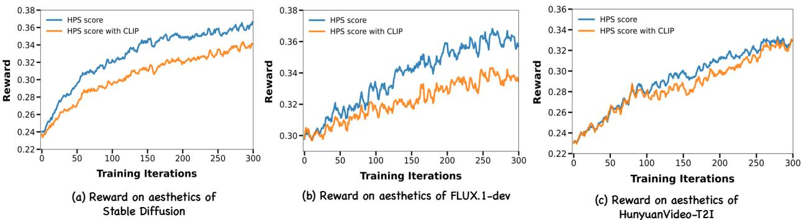  
Fgure1We visualize he reward curve Stable Diffusion,FLUX.1-dev, and Hunyuanideo-T2I n HPS score rom left o right. After applying CLIP score, the HPS score decreases, but the generated images become more natural (Figure 9 in Appendix), and the CLIP score improves (Tables 2 and 3).

# 3.3 Text-to-Video Generation

HunyuanVideo. Optimizing text-to-video generation models presents significantly greater challenges compared to text-to-imageframeworks, primarily due to elevated computational costs during training and inference, as well as slower convergence rates. In the pretraining protocol, we always adopt a progressive strategy:iial training focuses on text-to-image generation, followed by low-resolution video synthesis, and culminates in high-resolution video refinement. However, empirical observations reveal that relying solely on image-centric optimization leads to suboptimal video generation outcomes. To address this, our implementation employs training video samples synthesized at a resolution of 480 $\times$ 480 pixels, but we can visualize the samples with larger pixels.

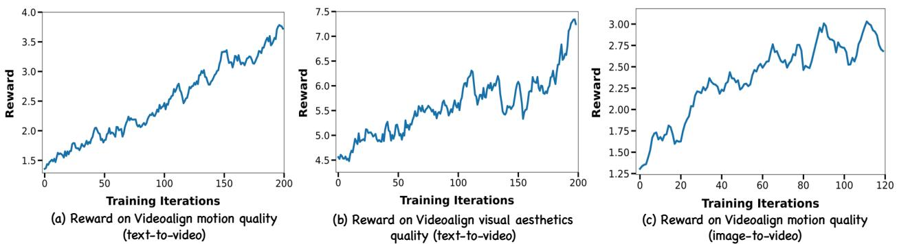  
Ful r qalh qual quality on SkyReels-I2V.

Furthermore, constructingan effectivevideo reward model for trainingalignment poses substantial diculties. Our experiments evaluated several candidates: the Videoscore [41] model exhibited unstable reward distributions, rendering it impractical for optimization, while Visionreward-Video [42], a 29-dimensional metric, yielded semantically coherent rewards but suffered from inaccuracies across individual dimensions. Consequently, we adopted VideoAlign [14], a multidimensional framework evaluating three critical aspects: visual aesthetics quality, motion quality, and text-video alignment. Notably, the text-video alignment dimension demonstrated significant instability, prompting its exclusion from our final analysis. We also increase the number of sampled frames per second for VideoAlign to improve the training stability. As lustrated in Figure 2(a) and Figure 2(b), our methodology achieves relative improvements of $5 6 \%$ and $181 \%$ in visual and motion quality metrics, respectively. Extended qualitative results are provided in the Table 5.

# 3.4 Image-to-Video Generation

SkyReels-2V. SkyReels-I2V represents a state-of-the-art open-source image-to-video (I2V) generation framework, established as of February 2025 at the inception of this study. Derived from the HunyuanVideo architecture, the model is fine-tuned by integrating image conditions into the input concatenation process. A central finding of our investigation is that I2V models exclusively allow optimization of motion quality, encompassing motion coherence and aesthetic dynamics, since visual fidelity and text-video alignment are inherently constrained by the attributes of the input image rather than the parametric space of the model. Consequently, our optimization protocol leverages the motion quality metric from the VideoAlign reward model, achieving a $1 1 8 \%$ relative improvement in this dimension as shown in Figure 2(c). We must enable the CFG-training to ensure the sampling quality during the RLHF training process.

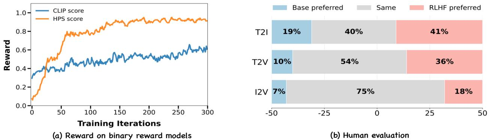  
aWesalz herai crv ia wars.W ho e u valua resu FLUX (T2I), HunyuanVideo (T2V), and SkyReel (I2V), respectively.

# 3.5 Human Evaluation

We present the results of our human evaluation, conducted using in-house prompts and reference images. For text-to-image generation, we evaluate FLUX on 240 prompts. For text-to-video generation, we assess HunyuanVideo on 200 prompts, and for image-to-video generation, we test SkyReels-I2V on 200 prompts paired with their corresponding reference images. As shown in Figure 3(b), human artists consistently prefer outputs refined with RLHF. More visualization results can be found in Figure 10 in Appendix, and Appendix F.

# 3.6 Ablation Study

Ablation on Timestep Selection.As detailed in Section 2.2, we investigate the impact of timestep selection on the training dynamics of the HunyuanVideo-T2I model. We conduct an ablation study across three experimental conditions: (1) training exclusively on the first $3 0 \%$ of timesteps from noise, (2) training on randomly sampled $3 0 \%$ of timesteps, (3) training on the final 40% of timesteps before outputs, (4) training on randomly sampled $6 0 \%$ of timesteps, and (5) training on sampled $1 0 0 \%$ of timesteps. As shown in Figure 4(b), empirical results indicate that the initial $3 0 \%$ of timesteps are critical for learning foundational generative patterns, as evidenced by their disproportionate contribution to model performance. However, restricting trainig solely to this interval leads to performance degradation compared tofull-sequence training,lkey due to insufficient exposure to late-stage refinement dynamics. To reconcile this trade-off between computational efficiency and model fidelity, we always implement a 40% stochastic timestep dropout strategy during training. This approach randomly masks 40% of timesteps across all phases while preserving temporal continuity in the latent diffusion process. The findings suggest that strategic timestep subsampling can optimize resource utilization in flow-based generative frameworks. Ablation on Noise Level $\varepsilon _ { t }$ . We systematically investigate the impact of noise level $\varepsilon _ { t }$ during training on FLUX. Our analysis reveals that reducing $\varepsilon _ { t }$ leads to a significant performance degradation, as quantitatively demonstrated in Figure 4(c). Notably, experiments with alternative noise decay schedules (e.g., those used in DDPM) show no statistically significant differences in output quality compared to our baseline configuration. Futhermore, the noise level larger than 0.3 sometimes leads to noisy images after RLHF training.

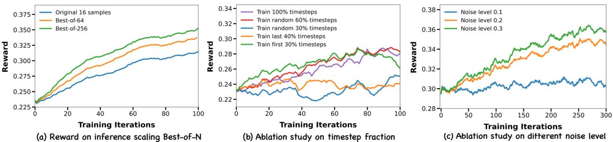  
FurThi ur hows herwar  Bes calnhlatitection,h ablationose evelspectivey.WhilBes ifernce scaln cnsstentlproves perorance wim samples, it reduces sampling efficiency. Therefore, we leave Best-of-N as an optional extension.

# 4 Related Work

Aligning Large Language Models. Large Language Models (LLMs) [4347] are typically aligned with Reinforcement Learning from Human Feedback (RLHF) [4651]. RLHF involves training a reward function based on comparison data of model outputs to capture human preferences, which is then utilized in reinforcement learning to align the policy model. While some approaches leverage policy gradient methods, others focus on Direct Policy Optimization (DPO) [52]. Policy gradient methods have proven effective but are computationally expensive and require extensive hyperparameter tuning. In contrast, DPO offers a more cost-efficient alternative but consistently underperforms compared to policy gradient methods. Recently, DeepSeek-R1 [20] demonstrated that the application of large-scale reinforcement learning with formatting and result-only reward functions can guide LLMs toward the self-emergence of thought processes, enabling human-like complex chain-of-thought reasoning This approach has achieved significant advantages in complex reasoning tasks, showcasing immense potential in advancing reasoning capabilities within Large Language Models. AligDiffi es nRecFowDiffie ndecowlsoby from alignment with human feedback, but the exploration remains primitive compared with LLMs. Key approaches in this area include: (1) Direct Policy Optimization (DPO)-style [12, 14, 42, 53, 54] methods, (2) direct backpropagation with reward signals [5], such as ReFL [9], and (3) policy gradient-based methods, including DPOK [19] and DDPO [18]. However, production-level models predominantly rely on DPO and ReFL, as previous policy gradient methods have demonstrated instability when applied to large-scale settings. Our work addresses this limitation, providing a robust solution to enhance stability and scalability. We also hope our work offers insights into its potential to unify optimization paradigms across different modalities (e.g. image and text) [56, 57].

# 5 Conclusion and Future Work

This work pioneers the integration of Group Relative Policy Optimization (GRPO) into visual generation, establishing DanceGRPO as a unified framework for enhancing diffusion models and rectified flows across text-to-image, text-to-video, and image-to-video tasks. By bridging the gap between language and visual modalitie, ourapproach addresses criticallimitations o priormethods, achieving uperior perormancehrough effcient alignment with human preferences and robust scaling to complex, multi-task settings. Experiments demonstrate substantial improvements in visual fidelity, motion quality, and text-image alignment. Future work wil explore GRPO's extension to multimodal generation, further unifying optimization paradigms across Generative AI.

# References information processing systems, 33:68406851, 2020.   
[2] Robin Rombach, Andreas Blattmann, Dominik Lorenz, Patrick Esser, and Börn Ommer. High-resolution image synthesis with latent diffusion models. In Proceedings of the IEEE/CVF conference on computer vision and pattern recognition, pages 1068410695, 2022.   
[3] Dustin Podell, Zion English, Kyle Lacey, Andreas Blattmann, Tim Dockhorn, Jonas Müller, Joe Penna, and Robin Rombach. Sdxl: Improving latent diffusion models for high-resolution image synthesis. arXiv preprint arXiv:2307.01952, 2023.   
[4] Zeyue Xue, Guanglu Song, Qiushan Guo, Boxiao Liu, Zhuofan Zong, Yu Liu, and Ping Luo. Raphael: Textto-mage generation via large mixture of diffusion paths.Advances in Neural Information Processing Systems, 36:4169341706, 2023.   
[5] Yaron Lipman, Ricky TQ Chen, Heli Ben-Hamu, Maximilian Nickel, and Matt Le. Flow matching for generative modeling. arXiv preprint arXiv:2210.02747, 2022.   
[ Xihao L, Chengyue Gong,and Qiang Liu. Flo traight and ast:Learing ogenerate nd transr ata with rectified flow. arXiv preprint arXiv:2209.03003, 2022.   
[ atric Esser, Smi Kulal, Andres Blatta, RaiEntai, Jnas Müller, Harry Saini Yam Levi Do Lorez Axel Sauer, FrederBoesel, e alScalng rectifed fotransormers or hig-resolution mage sythes. In Forty-first international conference on machine learning, 2024.   
[8] Lixue Gong, Xioia Hou, Fanshi Li, Liang Li, Xiaochn Lian, Fei Liu, Lyang Liu, Wei Liu, Wei Lu, Yichun S e al.Seedream 2.0:A native chinee-english bilngual imagegeneration foundation modelarXiv preprint arXiv:2503.07703, 2025.   
[9]J u, XiaL YuceWu,YTog, Qk  i ng, JieTang nuxo I: Learning and evaluating human preferences for text-to-image generation. Advances in Neural Information Processing Systems, 36:1590315935, 2023.   
[0] Jache Zhang, Jie Wu,Yuxi Ren, Xin Xia, Hua Kuag,Pan Xie, Jashi Li Xuee Xiao, We HuaShil We e alUniImprve latent diffus model vinid eedbackleararXiv preprnt arXiv:2404.05595, 2024.   
[11] Ming Li Taojann Yang, Huafeg Kuang, Jie Wu, Zhng Wang, Xueeng Xiao, and Chen Chen. Controlne++: i plus _plus. In European Conference on Computer Vision, pages 129147. Springer, 2024.   
[12] Bram Wallace, Meihua Dang, Rafael Rafailov, Linqi Zhou, Aaron Lou, Senthil Purushwalkam, StefanoErmon, Caiming Xiong, Shafiq Joty, and Nikhil Naik. Diffusion model alignment using direct preference optimization. In Proceedings of the IEEE/CVF Conference on Computer Vision and Pattern Recognition, pages 82288238, 2024.   
[13] Ziyu Guo, Renrui Zhang, Chengzhuo Tong, Zhizheng Zhao, Peng Gao, Hongsheng Li, and Pheng-Ann Heng. Can we generate images with cot? let's verify and reinforce image generation step by step. arXiv preprint arXiv:2501.13926, 2025.   
[14] Jie Liu, Gongye Liu, Jiajun Liang, Zyag Yuan, Xiokun Liu, Ming Zheng, Xiele Wu, Qiulin Wang, Wenu Qin, Menghan Xia, et al. Improving video generation with human feedback. arXiv preprint arXiv:2501.13918, 2025.   
[15] Jiacheng Zhang, Jie Wu, Weifeng Chen, Yatai Ji, Xuefeng Xiao, Weilin Huang, and Kai Han. Onlinevpo:Align video diffusion model with online video-centric preference optimization. arXiv preprint arXiv:2412.15159, 2024.   
[16] Richard S Sutton, Andrew G Barto, et al. Reinforcement learning: An introduction, volume 1. MIT press Cambridge, 1998.   
[17] John Schulman, Flip Wolski, PrafulaDhariwal, AlecRadord, and Oleg Klimov. roximal polcotiiation algorithms. arXiv preprint arXiv:1707.06347, 2017.   
[18] Kevin Black, Michael Janner, Yilun Du, ya Kostrikov, and Sergey Levine. Training diffusion models with reinforcement learning. arXiv preprint arXiv:2305.13301, 2023.   
[19] Ying Fan, Olivia Watkins, Yuqing Du, Hao Liu, Moonkyung Ryu, Craig Boutilier, Pieter Abbeel, Mohammad Ghavamzadeh, Kangwook Lee, and Kimin Lee. Dpok: Reinforcement learning for fine-tuning text-to-image diffusion models. Advances in Neural Information Processing Systems, 36:7985879885, 2023.   
[20] Daya Guo, Dejan Yang, Haowei Zhang, Junxio Song, Ruoyu Zhang, Runxin Xu, Qiao Zhu, Shirong Ma, Peyi Wan, Xiao Bi, et al.Deepseek-r Incentivizing reasoning capability in lls via reinorcement learning.arXiv preprint arXiv:2501.12948, 2025.   
[21] Zhihong Shao, Peiyi Wang, Qihao Zhu, Runxin Xu, Junxio Song, Xiao Bi, Haowei Zhang, Mingchuan Zhang, YK Li, Y Wu, et al. Deepseekmath: Pushing the limits of mathematical reasoning in open language models. arXiv preprint arXiv:2402.03300, 2024.   
[22] Weijie Kong, Qi Tian, Zijian Zhang, Rox Min, Zuozhuo Dai, Jin Zhou, Jiangfeng Xiong, Xin Li, Bo Wu, Janwei Zhang, et al. Hunyuanvideo:A systematic framework for large video generative models. arXiv preprint arXiv:2412.03603, 2024.   
[23] Black Forest Labs. Flux. https://github.com/black-forest-labs/flux, 2024.   
[24]SkyReels-AI.Skyreels v: Human-centricvideofoundationmodelhttps://github.com/SkyworkAI/SkyReels-V1, 2025.   
[25] Xiaoshi Wu, Keqiang Sun, Feng Zhu, Rui Zhao, and Hongsheng Li. Better aligning text-to-image models with human preference. arXiv preprint arXiv:2303.14420, 1(3), 2023.   
[26] Alec Radford, Jong Wook Kim, Chris Hallacy, Aditya Ramesh, Gabriel Goh, Sandhini Agarwal, Girish Sastry, Amanda Aske Pamela Mishkin, Jack Clark, et al. Learning transferable visual models from natural language supervision. In International conference on machine learning, pages 87488763. PmLR, 2021.   
[7] Drub hosh, Han Hajshirzi, and Ld Scmi. Geneval: Abject-oc fmeork orevalti text-to-image alignment. Advances in Neural Information Processing Systems, 36:5213252152, 2023.   
[28] Jiaming Song, Chenlin Meng, and Stefano Ermon. Denoising diffusion implicit models. arXiv preprint arXiv:2010.02502, 2020.   
[9] eng Wang, Shuai Bai, Sinan Tan, Shij Wang, Zhio an, Jinze Bai, KeqinChen, Xuejng Lu, Jial Wan, Wenbn Ge, et al. Qwen2-v: Enhancing vision-language model's perception of the world at any resolution.arXiv preprint arXiv:2409.12191, 2024.   
[0 Ya S n enrmo.Genetiveli y tiatiadient the daistrbutio.A in neural information processing systems, 32, 2019.   
[31] Yang Song, Jascha Sohl-Dickstein, Diederik P Kingma, Abhishek Kumar, Stefano Ermon, and Ben Poole. Score-based generative modeling through stochastic diferential equations. arXiv preprint arXiv:2011.13456, 2020.   
[32] Michael S Albergo and Eric Vanden-Eijnden. Building normalizing fows with stochastic interpolants.arXiv preprint arXiv:2209.15571, 2022.   
[33] Michael Albergo, Nicholas  Bof and EricVanden-Eijnden. Stochastic interpolants: unifying framework for flows and diffusions, 2023. URL https://arxiv. org/abs/2303.08797, 3.   
[34] Ruiq Gao, Emiel Hoogeboo, Jonathan Heek, Valentin DeBortoli, Kevin P. Murphy, and Tim Salimans. Diffuion meets flow matching: Two sides of the same coin. 2024.   
[35] Jonathan Ho and Tim Salimans. Classifier-free diffusion guidance. arXiv preprint arXiv:2207.12598, 2022.   
[36] Wenhao Wang and Yi Yang.Vidprom:A miion-scale real prompt-gallery dataset for text-to-video diffusion models. arXiv preprint arXiv:2403.06098, 2024.   
[37SenYuan, Jina Hua Xiany He,Yuyag Ge, Yuju hi Lu Chen JieboLuo,and LiYuan. enypreserving text-to-video generation by frequency decomposition. In Proceedings of the Computer Vision and Pattern Recognition Conference, pages 1297812988, 2025.   
[8] Hangliang Ding, Dachng Li, Runng u, Pey Zhang, Zhij Deng, Ion Stoica, and Hao ZhangEft-t: Efficient video diffusion transformers with attention tile, 2025.   
[39] Peiyuan Zhang, Yongqi Chen, Runlong Su, Hangliang Ding, Ion Stoica, Zhenghong Liu, and Hao Zhang. Fast video generation with sliding tile attention, 2025.   
[40] Yuval Kirstain Adam Polyak, Uriel Singer, Shahuland Matiana, JePena, and Omer Levy. Pck-a-pi:An oe dataset of user preferences for text-to-image generation.Advances in Neural Information Processing Systems, 36:3665236663, 2023.   
[41] Xuan He, Dongu Jang, Ge Zhang, Max Ku, Achint Soni, Sherman Siu, Haonan Chen, Abhranil Chandra, Ziyan JAarn Arul Videor:Buildiatoaic meri sulate nerai um ba video generation. arXiv preprint arXiv:2406.15252, 2024.   
[42] Jiazheng Xu, Yu Huang, Jiale Cheng, Yuanming Yang, Jiajun Xu, Yuan Wang, Wenbo Duan, Shen Yang, Qunin Jin, Shurun Li, et al. Visionreward: Finegrained multi-dimensional human preference learning for image and video generation. arXiv preprint arXiv:2412.21059, 2024.   
[43] Josh Achiam, Steven Adler, Sandhini Agarwal, Lama Ahmad, Ige Akkaya, Florencia Leoni Aleman, Diogo Almeida, Janko Altenschmidt, Sam Altman, Shyamal Anadkat, et al. Gpt-4 technical report. arXiv preprint arXiv:2303.08774, 2023.   
[44] Yupeng Chang, Xu Wang, Jindong Wang, Yuan Wu, Linyi Yang, Kaijie Zhu, Hao Chen, Xiaoyuan Yi, Cunxiang Wang, Yidong Wang, et al. A survey on evaluation of large language models. ACM transactions on intelligent systems and technology, 15(3):145, 2024.   
[45] Tom Brown, Benjamin Mann, Nick Ryder, Melanie Subbiah, Jared D Kaplan, Prafulla Dhariwal, Arvind Neelakantan, Pranav Shyam, Girish Sastry, Amanda Askell, et al. Language models are few-shot learners. Advances in neural information processing systems, 33:18771901, 2020.   
[46] Aaron Grattafori, Abhimanyu Dubey, Abhinav Jauhri, Abhinav Pandey, Abhishek Kadian, Ahmad Al-Dahle, Aiesha Letman, Akhil Mathur, Alan Schelten, Alex Vaughan, et al. The lama 3 herd of models. arXiv preprint arXiv:2407.21783, 2024.   
[47] An Yang, Baosong Yang, Beichen Zhang, Binyuan Hui, Bo Zheng, Bowen Yu, Chengyuan Li, Dayiheng Lu, Fei Huang, Haoran Wei, et al. Qwen2. 5 technical report. arXiv preprint arXiv:2412.15115, 2024.   
[48] Long Ouyng, Jeffrey Wu, Xu Jiang, DiogAmeida, Carrol Wainright, Pamea Mishkin, Chong Zhang, Sanii Agarwal, KatariSlamaAl Ray, ealTraii angage modelstooostrucions wihuan eac. Advances in neural information processing systems, 35:2773027744, 2022.   
[49] Harrison Lee, Samrat Phatale, Hassan Mansoor, Kellie Ren Lu, Thomas Mesnard, Johan Ferret, Colton Bishop, Ethan Hall, Victor Carbune, and Abhinav Rastogi. Rlaif:Scalng reinforcement learning from human feedback with ai feedback. 2023.   
[50] Leo Gao, John Schulman, and Jacob Hilton. Scaling laws for reward modeloveroptimization. In International Conference on Machine Learning, pages 1083510866. PMLR, 2023.   
[51] Yuntao Bai, Andy Jones, Kamal Ndousse, Amanda Askell, Anna Chen, Nova DasSarma, Dawn Drain, Stanislav F Dee Gangul Tom Henighan,  l Traig a helpful and hares assistant wih reinorcmet l from human feedback. arXiv preprint arXiv:2204.05862, 2022.   
[52] Rafael Rafailov, Archit Sharma, Eric Mitchell, Christopher D Manning, Stefano Ermon, and Chelsea Finn. Direc preference optimization:Your language model is secrety a rewardmodel.Advances in Neural Information Processing Systems, 36:5372853741, 2023.   
[] Zhan LiangYuhuiYuan, Shuyng Gu, BohanChen, TiankaiHang, Ji Li, and Liang ZhengStep-awae eereoptimization: Aligning preference with denoising performance at eac step. arXiv preprint arXiv:2406.04314, 2(5):7, 2024.   
[54] Tao Zhang, Cheng Da, Kun Ding, Kun Jin, Yan Li, Tingting Gao, Di Zhang, Shiming Xiang, and Chunhong PDiffsn model as a oise-aware latent rewar model or step-evel preference optiization.arXiv preint arXiv:2502.01051, 2025.   
[55] Mihir Prabhudesai, Russel Mendonca, Zheyang Qin, Katerina Fragkiadaki, and Deepak Pathak. Video diffusion alignment via reward gradients. arXiv preprint arXiv:2407.08737, 2024.   
[56] Yyang Ma, Xingchao Liu, Xiaokang Chen, Wen Liu, Chengyue Wu, Zhiy Wu, Zizheng Pan, Zhenda Xie, Haowei Zhang, Liang Zhao, et al. Janusflow: Harmonizing autoregression and rectified fow for unifed multimodal understanding and generation. arXiv preprint arXiv:2411.07975, 2024.

# Appendix

# A Experimental Settings

We provide detaile experimental settigs nTable6, whicapplyexclusively totraii without lassiree guidance (CFG). When enabling CFG, we configure one gradient update per iteration. Additionally, the sampling steps vary by model: we use 50 steps for Stable Diffusion, and 25 steps for FLUX and HunyuanVideo. Table 6 Our Hyper-paramters.   

<table><tr><td>Learning rate</td><td>1e-5</td></tr><tr><td>Optimizer</td><td>AdamW</td></tr><tr><td>Gradient clip norm</td><td>1.0</td></tr><tr><td>Prompts per iteration</td><td>32</td></tr><tr><td>Images per prompt</td><td>12</td></tr><tr><td>Gradient updates per iteration</td><td>4</td></tr><tr><td>Clip range €</td><td>1e-4</td></tr><tr><td>Noise level εt</td><td>0.3</td></tr><tr><td>Timestep Selection T</td><td>0.6</td></tr></table>

# B More Analysis

# B.1 Stochastic Interpolants

The stochastic interpolant framework, introduced by [33], offrs a unifying perspective on generative models like rectified fows and score-based diffusion models. It achieves this by constructing a continuous-time stochastic process that bridges any two arbitrary probability densities, $\rho _ { 0 }$ and $\rho _ { 1 }$ . In our work, we connect with a specic type of stochasticinterpolant known as spatially linear interpolants, defined in Section 4 of [33]. Given densities $\rho _ { 0 } , \rho _ { 1 } : \mathbb { R } ^ { d }  \mathbb { R } _ { \ge 0 }$ , a spatially linear stochasticinterpolant process $x _ { t }$ is defined as:

$$
\mathbf { z } _ { t } = \alpha ( t ) \mathbf { z } _ { 0 } + \beta ( t ) \mathbf { z } _ { 1 } + \gamma ( t ) \mathbf { \epsilon } , \quad t \in [ 0 , 1 ] ,
$$

where $\mathbf { z } _ { 0 } \sim \rho _ { 0 }$ , $\mathbf { z } _ { 1 } \sim \rho _ { 1 }$ , and $\mathbf { \epsilon } \gets \mathcal { N } ( 0 , I )$ is a standard Gaussian random variable independent of $\mathbf { z } _ { 0 }$ and $\mathbf { z } _ { 1 }$ . The functions $\alpha , \beta , \gamma : [ 0 , 1 ]  \mathbb { R }$ are sufficiently smooth and satisfy the boundary conditions:

$$
\alpha ( 0 ) = \beta ( 1 ) = 1 , \quad \alpha ( 1 ) = \beta ( 0 ) = \gamma ( 0 ) = \gamma ( 1 ) = 0 ,
$$

with the additional constraint that $\gamma ( t ) \geq 0$ for $t \in ( 0 , 1 )$ . The term $\gamma ( t ) \mathbf { z }$ introduces latent noise, smoothing the path between densities. Specific choices within this framework recover familiar models: Rectified Flow (RF): Setting $\gamma ( t ) = 0$ (removing the latent noise), $\alpha ( t ) = 1 - t$ , and $\beta ( t ) = t$ yields the linear interpolation ${ \bf z } _ { t } = ( 1 - t ) { \bf z } _ { 0 } + t { \bf z } _ { 1 }$ used in Rectified Flow [6, 33]. The dynamics are typically governed by an ODE $\mathrm { d } { \bf z } _ { t } = { \bf u } _ { t } \mathrm { d } t$ , where $\mathbf { u } _ { t }$ is the learned velocity field. •Score-Based Diffusion Models (sBDM): The framework connects to SBDMs via one-sided linear interpolants (Section 4.4 of [33]), where $\rho _ { 1 }$ is typically Gaussian. The interpolant takes the form $\mathbf { z } _ { t } = \alpha ( t ) \mathbf { z } _ { 0 } + \beta ( t ) \mathbf { z } _ { 1 }$ . The VP-SDE formulation [31] corresponds to choosing $\alpha ( t ) = \sqrt { 1 - t ^ { 2 } }$ and $\beta ( t ) = t$ after a time reparameterization. A pivotal insight is that: "The law of the interpolant $z _ { t }$ at any time $t \in [ 0 , 1 ]$ can be realized by many different processes, including an ODE and forward and backward SDEs whose drifts can be learned from data." The stochastic interpolant framework provides a probability flow ODE for RF:

$$
\mathrm { d } { \mathbf { z } } _ { t } = { \mathbf { u } } _ { t } \mathrm { d } t .
$$

The backward SDE associated with the interpolant's density evolution is given by:

$$
\mathrm { d } { \mathbf { z } } _ { t } = { \mathbf { b } } _ { B } ( t , { \mathbf { x } } _ { t } ) \mathrm { d } t + \sqrt { 2 \epsilon ( t ) } \mathrm { d } { \mathbf { z } } ,
$$

where $\mathbf { b } _ { B } ( t , \mathbf { x } ) = \mathbf { u } _ { t } - \epsilon ( t ) \mathbf { s } ( t , \mathbf { x } )$ is the backward drift, $\underline { { \mathbf { s } ( t , \mathbf { x } ) } }$ is the score function, and $\epsilon ( t ) \geq 0$ is a tunable diffusion coefficient (noise schedule). If we set $\varepsilon _ { t } = \sqrt { 2 \epsilon ( t ) }$ , the backward SDE becomes:

$$
\mathrm { d } \mathbf { z } _ { t } = \left( \mathbf { u } _ { t } - \frac { \varepsilon _ { t } ^ { 2 } } { 2 } \nabla \log p _ { t } ( \mathbf { z } _ { t } ) \right) \mathrm { d } t + \varepsilon _ { t } \mathrm { d } \mathbf { z } ,
$$

which is the same as [34].

# B.2 Connections between Rectified Flows and Diffusion Models

Ne aim to demonstrate the equivalence between certain formulations of diffusion models and fow matching specifically, stochastic interpolants) by deriving the hyperparameters of one model from the other. The forward process of a diffusion model is described by an SDE:

$$
\mathrm { d } \mathbf { z } _ { t } = f _ { t } \mathbf { z } _ { t } \mathrm { d } t + g _ { t } \mathrm { d } \mathbf { w } ,
$$

where dw is a Brownian motion, and $f _ { t } , g _ { t }$ define the noise schedule. The corresponding generative (reverse) process SDE is given by:

$$
\mathrm { d } \mathbf { z } _ { t } = \left( f _ { t } \mathbf { z } _ { t } - \frac { 1 + \eta _ { t } ^ { 2 } } { 2 } g _ { t } ^ { 2 } \nabla \log p _ { t } ( \mathbf { z } _ { t } ) \right) \mathrm { d } t + \eta _ { t } g _ { t } \mathrm { d } \mathbf { w } ,
$$

where $p _ { t } ( \mathbf { z } _ { t } )$ is the marginal probability density of $\mathbf { z } _ { t }$ at time $t$ For flow matching, we consider an interpolant path between data $\mathbf { x } = \mathbf { z } _ { 0 }$ and noise $\epsilon$ (typically $\epsilon \sim \mathcal { N } ( 0 , \bf { I } )$

$$
\mathbf { z } _ { t } = \alpha _ { t } \mathbf { x } + \sigma _ { t } \epsilon .
$$

This path satisfies the ODE:

$$
\mathrm { d } \mathbf { z } _ { t } = \mathbf { u } _ { t } \mathrm { d } t , \quad \mathrm { w h e r e } ~ \mathbf { u } _ { t } = \dot { \alpha } _ { t } \mathbf { x } + \dot { \sigma } _ { t } \epsilon .
$$

This can be generalized to a stochastic interpolant SDE:

$$
\mathrm { d } \mathbf { z } _ { t } = ( \mathbf { u } _ { t } - \frac { 1 } { 2 } \varepsilon _ { t } ^ { 2 } \nabla \log p _ { t } ( \mathbf { z } _ { t } ) ) \mathrm { d } t + \varepsilon _ { t } \mathrm { d } \mathbf { w } .
$$

The core idea is to match the marginal distributions $p _ { t } ( \mathbf { z } _ { t } )$ generated by the forward diffusion process Eq.(16) with those implied by the interpolant path Eq.(18). We will derive $f _ { t }$ and $g _ { t }$ from this requirement, and then relate the noise terms of the generative SDEs Eq.(17) and Eq.(20) to find $\eta _ { t }$ .

Deriving $E [ \mathbf { z } _ { t } ] = \alpha _ { t } \mathbf { x }$ $f _ { t }$ by Matching Means. From Eq.(18), assuming The mean $\mathbf m _ { t } = E [ \mathbf z _ { t } ]$ q is fixed and $\mathbf { z } _ { 0 } = \mathbf { x }$ satisfies the ODE $E [ \epsilon ] = \mathbf { 0 }$ , the mean of $\begin{array} { r } { \frac { \mathrm { d } \mathbf { m } _ { t } } { \mathrm { d } t } = f _ { t } \mathbf { m } _ { t } } \end{array}$ $\mathbf { z } _ { t }$ is We require $\mathbf { m } _ { t } = \alpha _ { t } \mathbf { x }$ for all $t$ . Substituting into the mean ODE:

$$
\frac { \mathrm { d } } { \mathrm { d } t } ( \alpha _ { t } \mathbf { x } ) = f _ { t } ( \alpha _ { t } \mathbf { x } ) , \qquad \dot { \alpha } _ { t } \mathbf { x } = f _ { t } \alpha _ { t } \mathbf { x } .
$$

Assuming this holds for any $\mathbf { x }$ and $\alpha _ { t } \neq 0$ , we divide by $\alpha _ { t } \mathbf { x }$ .

$$
f _ { t } = { \frac { { \dot { \alpha } } _ { t } } { \alpha _ { t } } }
$$

Using the identity $\textstyle { \frac { \mathrm { d } } { \mathrm { d } t } } \log ( y ) = { \dot { y } } / y$ , we get:

$$
f _ { t } = \partial _ { t } \log ( \alpha _ { t } )
$$

Deriving $g _ { t } ^ { 2 }$ by Matching Variances. From Eq.(18), assuming $\mathbf { x }$ is fixed and $V a r ( \epsilon ) = \mathbf { I }$ (identity matrix for standard Gaussian noise), the variance (covariance matrix) of $\mathbf { z } _ { t }$ is $V a r ( \mathbf { z } _ { t } ) = V a r ( \alpha _ { t } \mathbf { x } + \sigma _ { t } \epsilon ) = \sigma _ { t } ^ { 2 } V a r ( \epsilon ) = \sigma _ { t } ^ { 2 } \mathbf { I }$ Let $V _ { t } = \sigma _ { t } ^ { 2 }$ be the scalar variance magnitude. The variance $V _ { t } = \mathrm { T r } ( V a r ( \mathbf { z } _ { t } ) ) / d$ for the process Eq.(16) oig $\begin{array} { r } { \frac { \mathrm { d } V _ { t } } { \mathrm { d } t } = 2 f _ { t } V _ { t } + g _ { t } ^ { 2 } } \end{array}$ (Here, $g _ { t } ^ { 2 }$ n injection rate). We require $V _ { t } = \sigma _ { t } ^ { 2 }$ .Substitute $V _ { t } = \sigma _ { t } ^ { 2 }$ and $f _ { t } = \dot { \alpha } _ { t } / \alpha _ { t }$ into the variance evolution equation:

$$
\frac { \mathrm { d } } { \mathrm { d } t } ( \sigma _ { t } ^ { 2 } ) = 2 \left( \frac { \dot { \alpha } _ { t } } { \alpha _ { t } } \right) \sigma _ { t } ^ { 2 } + g _ { t } ^ { 2 } , \qquad 2 \sigma _ { t } \dot { \sigma } _ { t } = 2 \frac { \dot { \alpha } _ { t } } { \alpha _ { t } } \sigma _ { t } ^ { 2 } + g _ { t } ^ { 2 } .
$$

Solving for $g _ { t } ^ { 2 }$

$$
g _ { t } ^ { 2 } = 2 \sigma _ { t } \dot { \sigma } _ { t } - 2 \frac { \dot { \alpha } _ { t } } { \alpha _ { t } } \sigma _ { t } ^ { 2 } = \frac { 2 } { \alpha _ { t } } ( \alpha _ { t } \sigma _ { t } \dot { \sigma } _ { t } - \dot { \alpha } _ { t } \sigma _ { t } ^ { 2 } ) = \frac { 2 \sigma _ { t } } { \alpha _ { t } } ( \alpha _ { t } \dot { \sigma } _ { t } - \dot { \alpha } _ { t } \sigma _ { t } )
$$

U $\begin{array} { r } { \partial _ { t } ( \sigma _ { t } / \alpha _ { t } ) = \frac { \alpha _ { t } \dot { \sigma } _ { t } - \dot { \alpha } _ { t } \sigma _ { t } } { \alpha _ { t } ^ { 2 } } } \end{array}$ , which implies $\alpha _ { t } \dot { \sigma } _ { t } - \dot { \alpha } _ { t } \sigma _ { t } = \alpha _ { t } ^ { 2 } \partial _ { t } ( \sigma _ { t } / \alpha _ { t } )$ Then we get:

$$
g _ { t } ^ { 2 } = \frac { 2 \sigma _ { t } } { \alpha _ { t } } \left( \alpha _ { t } ^ { 2 } \partial _ { t } \left( \frac { \sigma _ { t } } { \alpha _ { t } } \right) \right) = 2 \alpha _ { t } \sigma _ { t } \partial _ { t } \left( \frac { \sigma _ { t } } { \alpha _ { t } } \right)
$$

Thus, we have:

$$
g _ { t } ^ { 2 } = 2 \alpha _ { t } \sigma _ { t } \partial _ { t } \left( \frac { \sigma _ { t } } { \alpha _ { t } } \right)
$$

Deriving $\eta _ { t }$ by Matching Noise Terms in Generative SDEs. We compare the coeicients of the Brownian motion term (dw) in the reverse diffusion SDE Eq.(17) and the stochastic interpolant SDE Eq.(20). The diffusion coefficient (magnitude of the noise term) is $D _ { \mathrm { d i f f } } = \eta _ { t } g _ { t }$ . The diffusion coefficient is $D _ { \mathrm { i n t } } = \varepsilon _ { t }$ . To match the noise structure in these specific SDE forms, we set $D _ { \mathrm { d i f f } } = D _ { \mathrm { i n t } }$ : $\eta _ { t } g _ { t } = \varepsilon _ { t }$ . Solving for $\eta _ { t }$ (assuming $\begin{array} { r } { g _ { t } \neq 0 ) { : \eta _ { t } } = \frac { \varepsilon _ { t } } { g _ { t } } } \end{array}$ Substitute $g _ { t } = \sqrt { g _ { t } ^ { 2 } }$ using the result from Eq.(7):

$$
\eta _ { t } = \frac { \varepsilon _ { t } } { \sqrt { 2 \alpha _ { t } \sigma _ { t } \partial _ { t } ( \sigma _ { t } / \alpha _ { t } ) } }
$$

Summary of Results. By requiring the forward diffusion process Eq.(16) to match the marginal mean and variance of the interpolant path Eq.(18) at all times $t$ , we derived:

$$
f _ { t } = \partial _ { t } \log ( \alpha _ { t } ) , \quad g _ { t } ^ { 2 } = 2 \alpha _ { t } \sigma _ { t } \partial _ { t } ( \sigma _ { t } / \alpha _ { t } ) , \quad \eta _ { t } = \varepsilon _ { t } / ( 2 \alpha _ { t } \sigma _ { t } \partial _ { t } ( \sigma _ { t } / \alpha _ { t } ) ) ^ { 1 / 2 } .
$$

Thes relationships establish the equivalence between the parameters  the tworameworks under the specid conditions.

# • Classifier-Free Guidance (CFG) Training

Classifier-Free Guidance (CFG) [35] is a widely adopted technique for generating high-quality samples in conditional generative modeling. However, in our settings, integrating CFG into training pipelines introduces instability during optimization. To mitigate this, we empirically recommend disabling CFG during the sampling phase for models with high sample fidelity, such as HunyuanVideo and FLUX, as it reduces gradient oscillation while preserving output quality. For CFG-dependent models like SkyReels-I2V and Stable Diffusion, where CFG is critical for reasonable sampl ualiy dentiykeystabiliy:raiexclusivelhendiialjectiveeaddiv optimization trajectories. This necessitates the joint optimization of both conditional and unconditional outputs, effectively doubling VRAM consumption due to dual-network computations. Morever, we propose reducing the frequency of parameter updates per training iteration. For instance, empirical validation shows that limiting updates to one per iteration significantly enhances training stability for SkyReels-I2V, with minimal impact on convergence rates.

# D Advantages over DDPO and DPOK

Our approach differs from prior RL-based methods for text-to-image diffusion models (e.g., DDPO, DPOK) in three key aspects: (1) We employ a GRPO-style objective function, (2) we compute advantages within prompt-level groups rather than globally, (3) we ensure noise consistency across samples from the same prompt, (4) we generalize these improvements beyond diffusion models by applying them to rectified flows and scaling to video generation tasks.

# E Inserting DDPO into Rectified Flow SDEs

We also insert DDPO-style objective function into rectified fow SDEs, but it always diverges, as shown in Figure 5, which demonstrates the superiority of DanceGRPO.

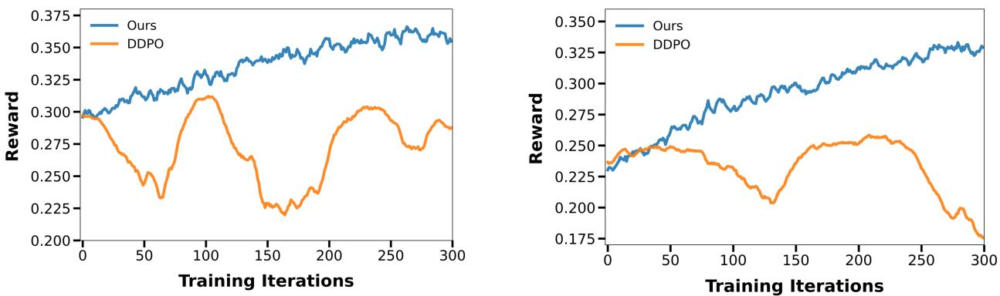  
Figure 5 We visualize the results of DDPO and Ours. DDPO always diverges when applied to rectified fow SDEs

# F More Visualization Results

We provide more visualization results on FLUx, Stable Diffusion, and HunyuanVideo as shown in Figure 6, 7, 10, 11, 12, 13, 14, 15, 16, 17, and 18.

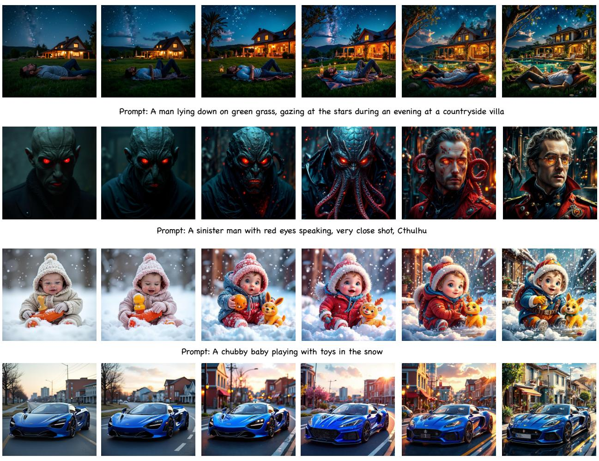  

Prompt: Generate a picture of a blue sports car parked on the road, metal texture   
FuWevisualize he results by selecti FLUX tiiz wit the HPS scorea rations 0, 60,120, 180,4 and The tizoutputs te exhibt rghertoesanrierdetailsHoweveincoorati I regularization is crucial, as demonstrated in Figures 11, 12, and 13.

  

Prompt: a basketball player wearing a jersey with the number _23_

  

Prpt: A boy wih yellow ha s cclng n a county road, realisic full shot, war color palette

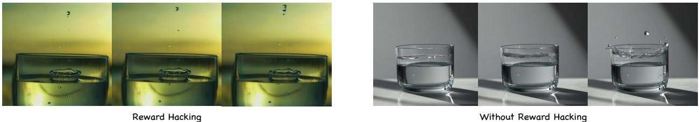  
Figur7Visulization  the iversiy themodel beore nd afterRLHF. Diffent ee tend  ete images after RLHF.   
hciz zHla waa r radiant reflections, sunlight, sparkle

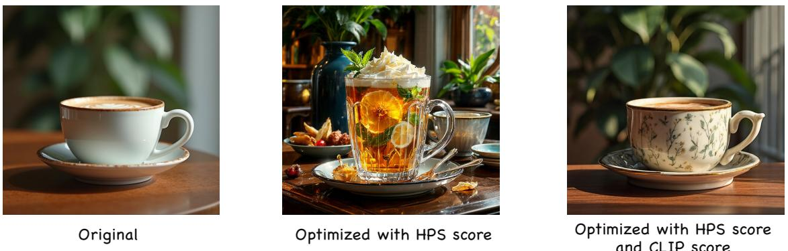  
gu This ure emostrate he pacf theLIP score The prop is  photf cup. We dthat the moel traine solely with HPS-v2.1 rewars tends toproduceunatural (oily)outputs, whil incorporatinCLIP scores helps maintain more natural image characteristics.

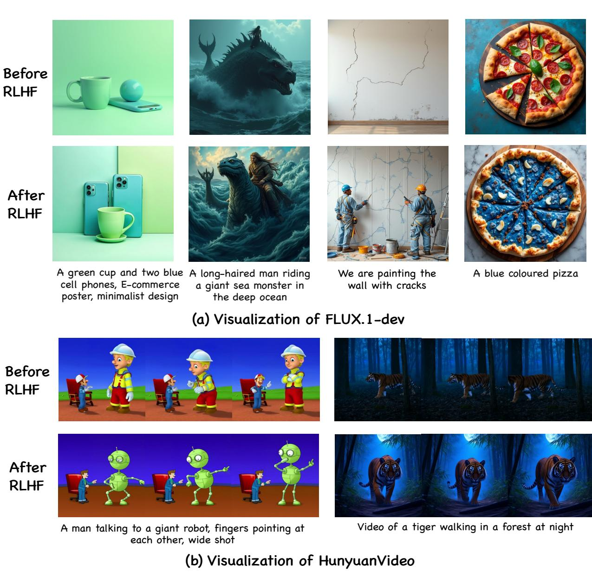  
Figure 10Overall visualization. We visualize the results before and after RLHF of FLUX and HunyuanVido.

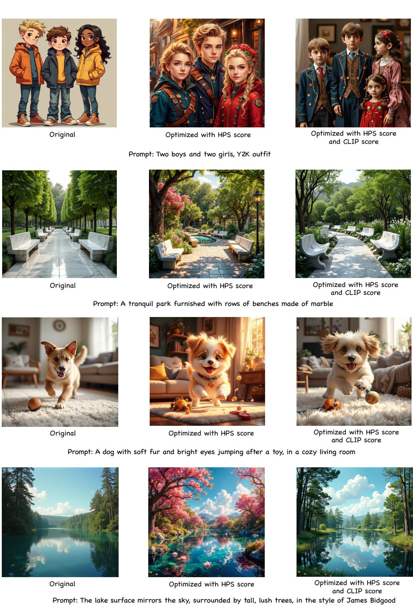  
We e elutpt LUX,iv yhe P enhanced by both the HPS and CLIP scores.

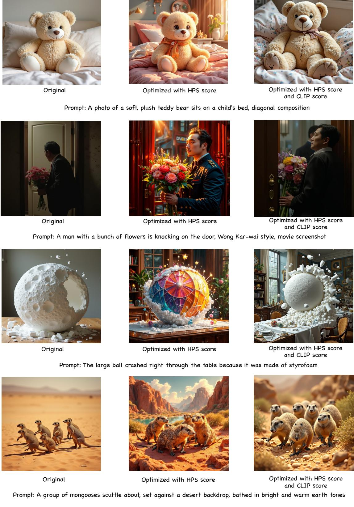  
FWe  eu LUX,v e P enhanced by both the HPS and CLIP scores.

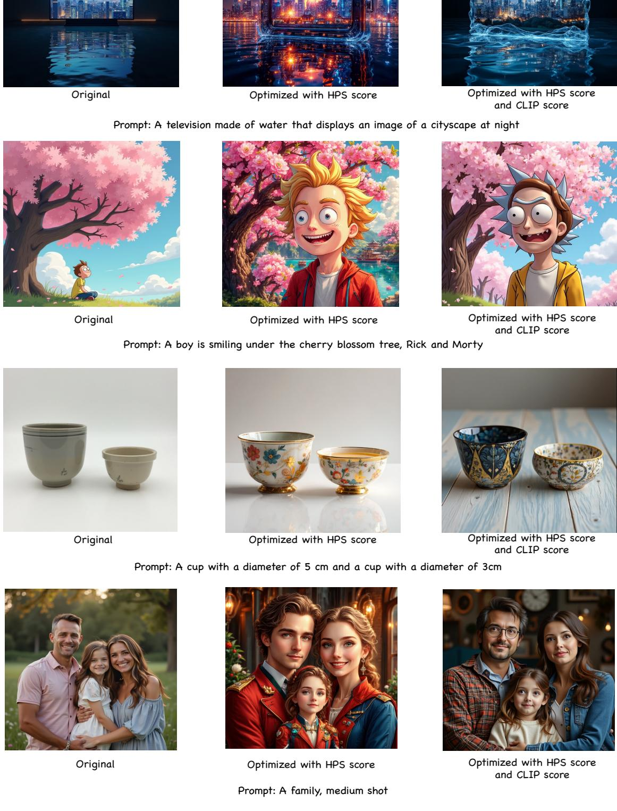  
W  uLUX,v  P enhanced by both the HPS and CLIP scores.

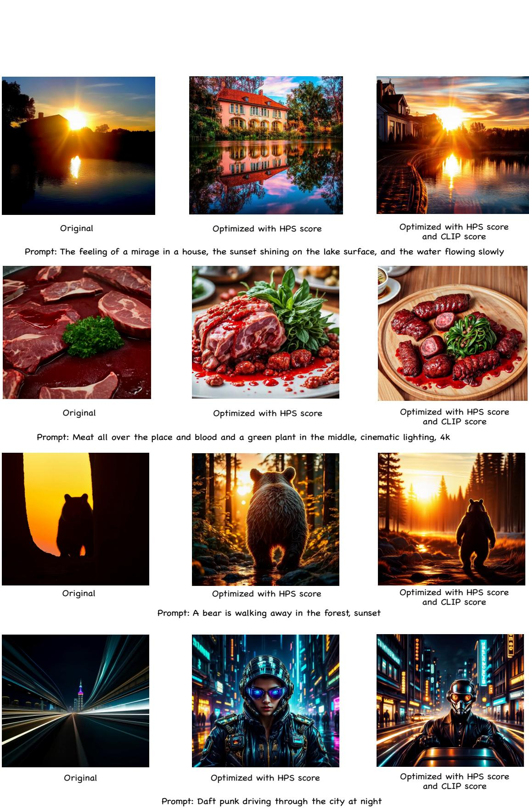  
FigurWe preent herigialutputs HuyuanVideo-T alongsi tiizations drive solly by he HPS score and those enhanced by both the HPS and CLIP scores.

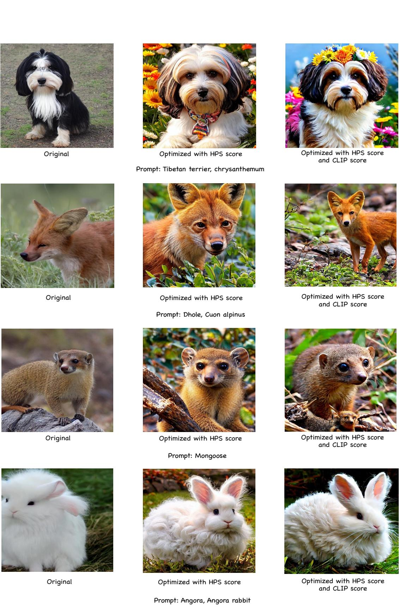  
u  lu  a n   iole h and those enhanced by both the HPS and CLIP scores.

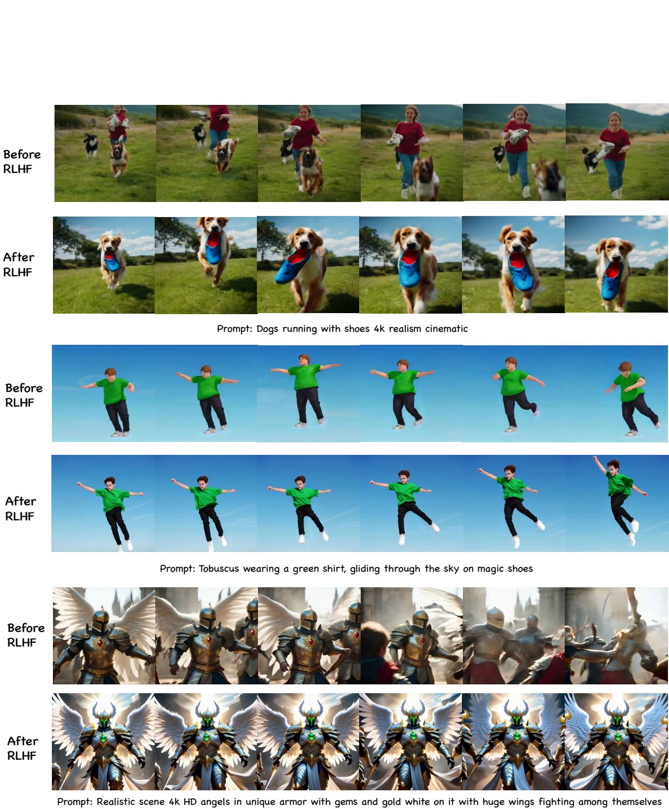  
Figure 16 Visualization results of HunyuanVideo.

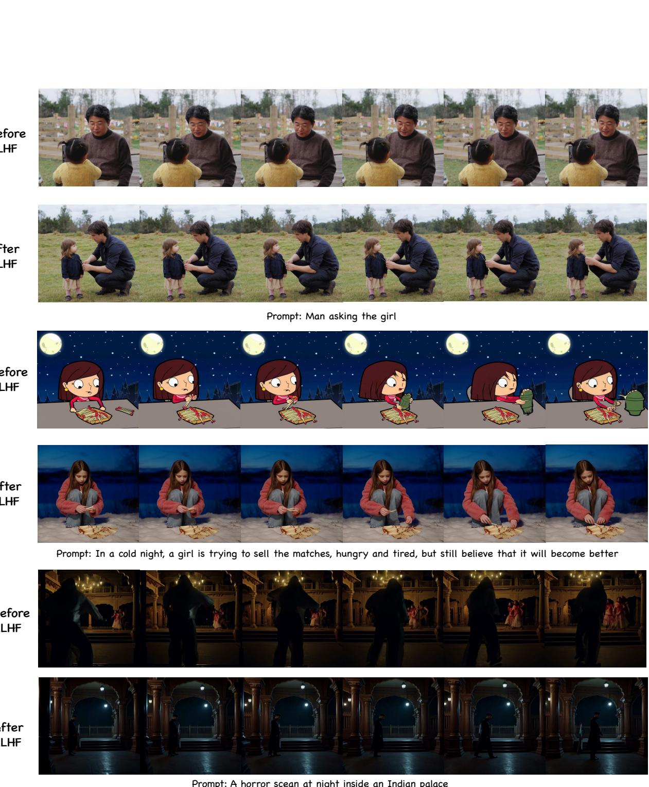  

Figure 17 Visualization results of HunyuanVideo.

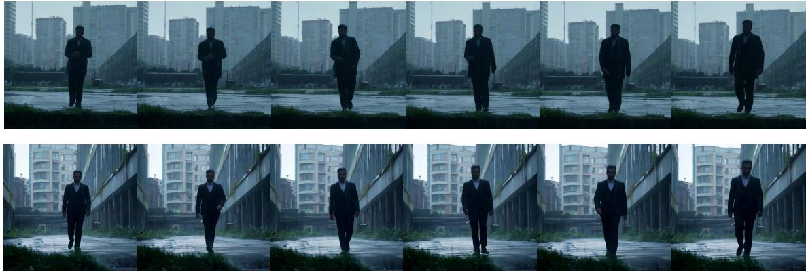  

Prompt: Man walking in an abandoned city in the rain

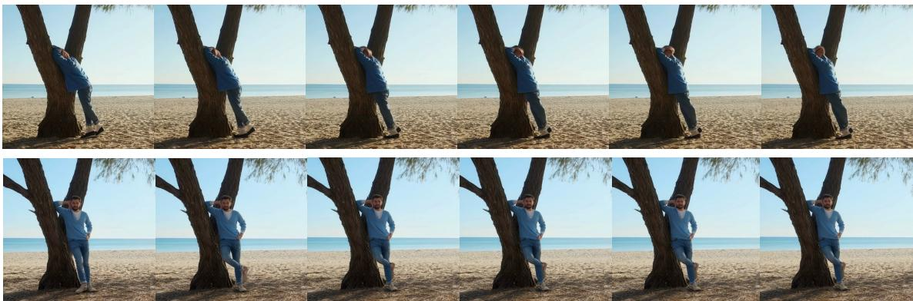  

Prompt: A man leaning on a tree at the beach

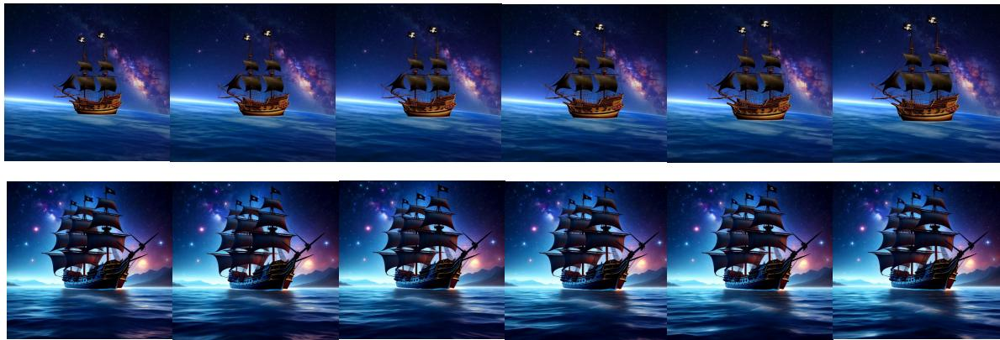  
: h   
Figure 18 Visualization results of HunyuanVideo.

After RLHF

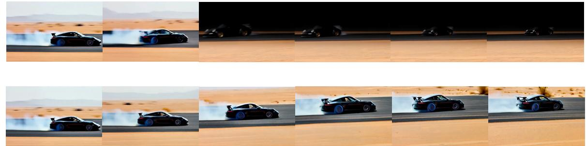  

Prompt: A black Porsche drifting in the desert RLHF

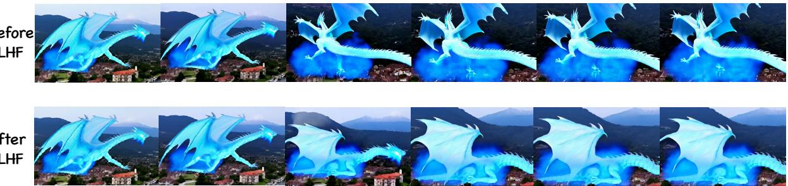  

Prompt: Large light blue ice dragon breathing blue fire on town

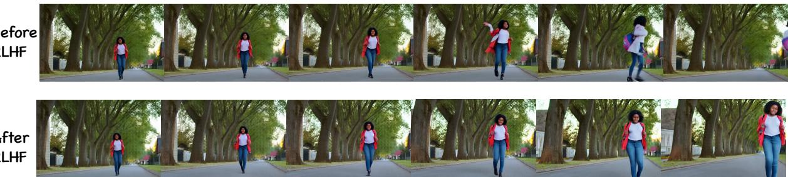  

Prompt: A young black girl walking down a street with a lot of huge trees

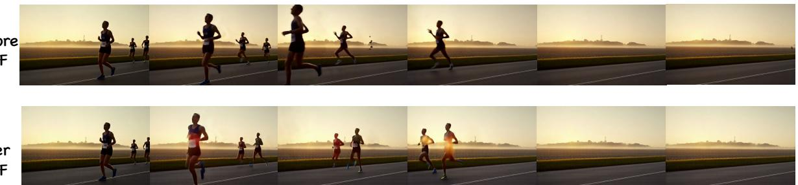  
Figure 19 Visualization results of SkyReels-I2V.

Prompt: a cinematic shot of a group of ultra marathon runners, 1980s, a street surrounded by fields, morning hours, anamorphic lens, Kodak Filmstock