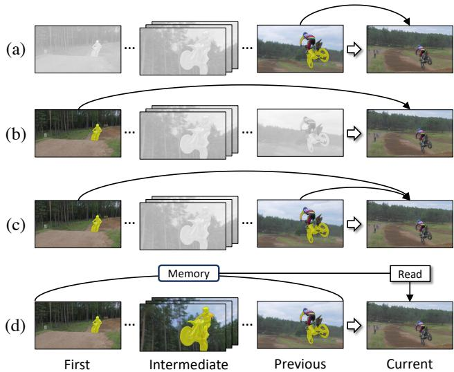
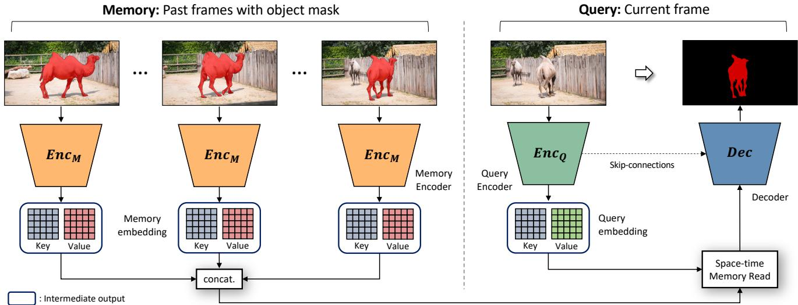
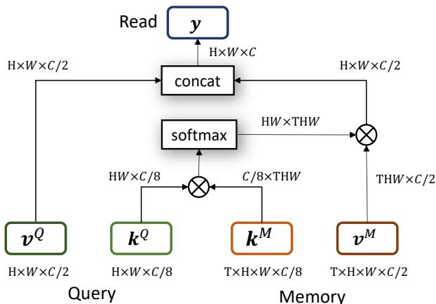
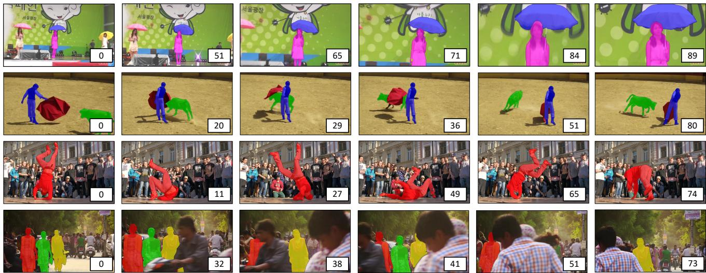
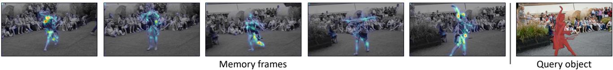
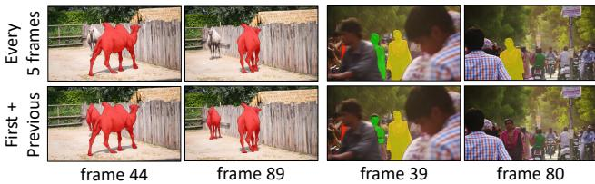
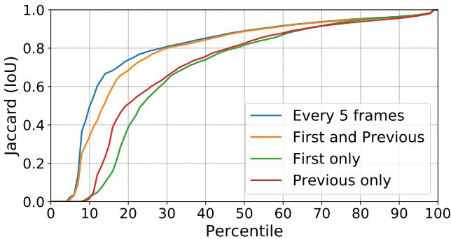

# 基于时空记忆网络的视频目标分割

吴胜旭 李俊英 延世大学 Adobe研究所 许宁 金善周 Adobe研究所 延世大学

# 摘要

我们提出了一种新颖的半监督视频目标分割解决方案。由于问题的性质，随着中间预测的进行，可用的线索（例如，带有目标掩膜的视频帧）变得更加丰富。然而，现有的方法无法充分利用这一丰富的信息来源。我们通过利用记忆网络来解决这个问题，并学习从所有可用来源中读取相关信息。在我们的框架中，过去带有目标掩膜的帧形成了外部记忆，而当前帧作为查询则使用记忆中的掩膜信息进行分割。具体而言，查询和记忆在特征空间中进行密集匹配，以自前馈的方式覆盖所有时空像素位置。与之前的方法相比，充分利用指导信息使我们能够更好地应对外观变化和遮挡等挑战。我们在最新的基准测试集上验证了我们的方法，并取得了最先进的性能（在Youtube-VOS验证集上的整体得分为79.4，DAVIS 2016/2017验证集上的$\mathcal { I }$分别为88.7和79.2），同时具有快速的运行时（在DAVIS 2016验证集上的运行时间为0.16秒/帧）。

# 1. 引言

视频物体分割是一个任务，旨在区分给定视频所有帧中的前景和背景像素。这是许多视频编辑任务中的一个关键步骤，随着视频成为最受欢迎的共享媒体形式，该任务受到了越来越多的关注。我们在半监督设置中解决视频物体分割问题，其中目标物体的真实标注掩码在第一帧中给出，目标是在其他所有帧中估计物体掩码。由于目标物体的外观可能随着时间的推移发生剧烈变化，同时还会受到遮挡和漂移的影响，这是一项非常具有挑战性的任务。

与计算机视觉中的大多数任务一样，许多基于深度学习的算法被提出以解决视频目标分割问题。在深度学习方法中，关键问题是深度网络应该从哪一帧（或哪些帧）学习线索？在一些算法中，特征是从前一帧提取并传播的（如图1(a)所示）[11, 26]。该方法的主要优点在于它能更好地处理外观变化，同时牺牲了对遮挡和误差漂移的鲁棒性。基于深度学习的视频分割的另一个方向是将第一帧作为参考，独立检测每一帧中的目标对象（如图1(b)所示）[2, 42, 12]。该方法的优缺点恰恰与前一种方法相反。结合使用第一帧和前一帧，以利用这两种方法优势的方案在文献[24, 40]中被提出（如图1(c)所示）。通过使用两帧作为线索来源，该算法[24]实现了最先进的准确性，并且运行速度更快，因为该算法不需要像其他方法那样进行在线学习。

  

Figure 1: Previous DNN-based algorithms extract features in different frames for video object segmentation (a-c). We propose an efficient algorithm that exploits multiple frames in the given video for more accurate segmentation (d).

由于使用两个帧已被证明对视频分割有益，自然的扩展是使用更多帧，可能是视频中的每一帧，来进行分割任务。

问题在于如何设计一个高效的深度神经网络（DNN）架构，充分利用所有帧。在本文中，我们提出了一种基于记忆网络的创新DNN系统，该系统针对查询图像中的每个像素，计算视频多帧中每个像素的时空注意力，以确定该像素是否属于前景物体。借助我们的框架，使用帧的数量没有限制，并且新信息可以通过将其放入记忆中轻松添加。此内存更新极大地帮助我们应对外观变化和遮挡等挑战，且没有额外成本。除了使用更多的时间信息外，我们的网络还固有地包含一种非局部空间像素匹配机制，这种机制非常适合像素级估计问题。通过利用丰富的参考信息，我们的方法在处理外观变化、遮挡和漂移方面比以前的方法更具优势。实验结果表明，我们的方法在公共基准数据集上在速度和准确性方面均大幅超越现有的所有方法。

# 2. 相关工作

# 2.1. 半监督视频目标分割

基于传播的方法 [26, 14, 11, 18] 学习一个物体掩膜传播器，这是一个深度网络，用于将错位的掩膜精确到目标物体上（图 1(a)）。为了使网络对物体特定，在线训练数据通过对第一个帧的物体掩膜进行变形 [26] 或合成图像 [14] 来生成，以进行微调。Li 等 [18] 将重新识别模块集成到系统中，以检索由于漂移而丢失的物体。基于检测的方法 [2, 21, 42, 1, 3, 12] 则通过使用第一帧的物体外观学习一个物体检测器（图 1(b)）。在 [2, 21] 中，使用在测试时微调深度网络得到的物体特定检测器来分割目标物体。在 [3, 12] 中，为了避免在线学习，像素被嵌入到特征空间中，并通过与模板匹配进行分类。混合方法 [40, 24] 旨在结合检测和传播方法的优点（图 1(c)）。在 [24, 40] 中，提出了同时利用第一帧的视觉指导和前一帧的空间先验的网络。此外，一些方法尝试利用所有先前的信息 [38, 34]。在 [38] 中，提出了一种学习视频中长期信息的序列到序列网络。Voigtlaender 和 Leibe [34] 采用在线适应的思想，并使用中间输出不断更新检测器。在线/离线学习。许多上述方法在第一帧的初始物体掩膜上微调深度网络模型，以便在测试时记住目标物体的外观 [2, 34, 26, 14, 26, 11, 18]。虽然在线学习提高了准确性，但计算开销大，限制了其实际使用。离线学习方法尝试绕过在线学习，同时保持准确性 [24, 40, 3, 12, 13, 32, 33]。一个普遍的想法是设计能够在测试时进行物体无关分割的深度网络，前提是提供指导信息。我们的框架属于离线学习方法。我们的框架在外部存储器中维护中间输出，而不是固定使用哪些帧作为指导，并在运行时自适应选择必要信息。这种灵活使用指导信息的方式使我们的方法在性能上大幅超越上述方法。我们的记忆网络也很快速，因为内存读取作为网络前向传播的一部分进行，因此不需要在线学习。

# 2.2. 记忆网络

记忆网络是指具有外部记忆的神经网络，信息可以在此处为特定目的进行写入和读取。可以端到端训练的记忆网络首次在自然语言处理研究中提出，目的是用于文档问答。通常在这些方法中，重要信息分别嵌入到键（输入）和值（输出）特征向量中。键用于定位相关的记忆，其对应的值将被返回。最近，记忆网络已被应用于一些视觉问题，如个性化图像描述、视觉跟踪、电影理解和摘要。虽然我们的工作基于记忆网络，但我们扩展了记忆网络的理念，以使其适用于我们的任务——半监督视频目标分割。显然，带有目标掩码的帧被存入记忆中，而待分割的帧作为查询。记忆会随着新预测的掩码动态更新，这大大帮助我们解决了外观变化、遮挡和错误累积等挑战，而无需在线学习。我们的目标是给定一组注释帧作为记忆，进行逐像素的预测。因此，查询帧中的每个像素需要访问在不同时空位置的记忆帧中的信息。为此，我们将记忆设计为4D张量，以包含像素级信息，并提出时空记忆读取操作，从4D记忆中定位和读取相关信息。从概念上讲，我们的记忆读取可以视为一种时空注意力算法，因为我们正在计算每个查询像素的关注时机和位置，以决定该像素是否属于前景目标。

  
eouensr ho nh u space-time memory read block, and a decoder. The memory encoder $( E n c _ { M } )$ takes an RGB frame and the object mask. The $( E n c _ { Q } )$ takes the query image as input.

# 3. 时空记忆网络 (STM)

在我们的框架中，视频帧从第二帧开始顺序处理，使用第一帧中给出的真实标注。视频处理过程中，我们将带有物体掩码的过去帧（无论是在第一帧中给出还是在其他帧中估计）视为记忆帧，而当前没有物体掩码的帧作为查询帧。我们框架的概述如图2所示。记忆帧和查询帧首先通过专用的深度编码器编码为键值映射对。请注意，查询编码器仅接受图像作为输入，而记忆编码器则同时接受图像和物体掩码。每个编码器输出键和值映射。键用于寻址。具体而言，计算查询帧和记忆帧键特征之间的相似性，以确定何时何地检索相关的记忆值。因此，键的学习旨在编码视觉语义，使其在外观变化上具有鲁棒性。另一方面，值存储用于生成掩码估计的详细信息（例如目标物体和物体边界）。查询和记忆的值包含一些不同目的的信息。具体而言，查询帧的值学习用于存储详细的外观信息，以便我们解码准确的物体掩码。记忆帧的值学习编码关于每个特征是否属于前景或背景的视觉语义和掩码信息。键和值随后经过我们的时空记忆读取模块。查询帧和记忆帧的键特征映射上的每个像素在视频的时空空间中进行密集匹配。相对匹配分数随后用于寻址记忆帧的值特征映射，并结合相应的值返回输出。最后，解码器接收读取模块的输出，重建查询帧的掩码。

# 3.1. 键值嵌入

查询编码器。查询编码器将查询帧作为输入。编码器通过附加在主干网络上的两个并行卷积层输出两个特征图——键（key）和值（value）。这些卷积层作为瓶颈层，减少主干网络输出特征通道的大小（键压缩至1/8，值压缩至$1 / 2$），且不施加非线性变换。查询嵌入的输出是一对二维键和值图 $( \mathbf { k } ^ { Q } \in \mathbb { R } ^ { \hat { H } \times W \times C / 8 }$ , $\bar { \mathbf { v } ^ { Q } } \in \mathrm { ~ \bar { \mathbb { R } } ^ { \bar { H } \times W \times C / 2 } ) }$ ，其中 $H$ 是高度，$W$ 是宽度，$C$ 是主干网络输出特征图的特征维度。记忆编码器。记忆编码器的结构相同，仅输入不同。记忆编码器的输入由RGB帧和目标掩码组成。目标掩码表示为0到1之间的单通道概率图（使用softmax输出估计掩码）。在输入送入记忆编码器之前，沿通道维度将它们连接。如果存在多个记忆帧，每个记忆帧独立嵌入为键和值图。然后，不同记忆帧的键和值图在时间维度上进行堆叠。记忆嵌入的输出是一对三维键和值图 $( \mathbf { k } ^ { M } \in \bar { \mathbb { R } } ^ { T \times H \times W \times C / 8 } , \mathbf { \dot { v } } ^ { M } \in \mathbb { R } ^ { T \times H \times W \times C / 2 } )$ ，其中 $T$ 是记忆帧的数量。

  

Figure 3: Detailed implementation of the space-time memory read operation using basic tensor operations as described in Sec. 3.2. $\otimes$ denotes matrix inner-product.

我们将 ResNet50 作为内存编码器和查询编码器的主干网络。我们使用 ResNet50 的第 4 阶段 $( \tt r e s 4 )$ 特征图作为计算关键特征图和值特征图的基础特征图。对于内存编码器，第一层卷积被修改为能够处理 4 通道张量，通过添加额外的单通道滤波器来实现。网络权重从 ImageNet 预训练模型初始化，除了新添加的滤波器外，后者是随机初始化的。

# 3.2. 时空记忆读取

在存储读取操作中，首先通过测量查询键图与存储键图中所有像素之间的相似度来计算软权重。这种相似度匹配是以非局部的方式进行的，即将存储键图中的每个时空位置与查询键图中的每个空间位置进行比较。然后，通过软权重对存储值进行加权求和，并与查询值进行连接。该存储读取操作对查询特征图的每个位置进行，并可以总结为：

$$
\mathbf { y } _ { i } = \big [ \mathbf { v } _ { i } ^ { Q } , ~ \frac { 1 } { Z } \sum _ { \forall j } f ( \mathbf { k } _ { i } ^ { Q } , \mathbf { k } _ { j } ^ { M } ) \mathbf { v } _ { j } ^ { M } \big ] ,
$$

其中 $i$ 和 $j$ 是查询和内存位置的索引，$\begin{array} { r } { Z \doteq \sum _ { \forall j } f ( \mathbf { k } _ { i } ^ { Q } , \mathbf { k } _ { j } ^ { M } ) } \end{array}$ 是归一化因子，$[ \cdot , \cdot ]$ 表示连接。相似度函数 $f$ 如下所示：

$$
f ( \mathbf { k } _ { i } ^ { Q } , \mathbf { k } _ { j } ^ { M } ) = \exp ( \mathbf { k } _ { i } ^ { Q } \circ \mathbf { k } _ { j } ^ { M } ) ,
$$

其中 $\circ$ 表示点积。我们的公式可以看作是对早期差分记忆网络 [30, 22, 16] 的扩展，适用于视频像素匹配的三维时空空间。因此，所提出的读取操作定位了用于检索的记忆的时空位置。它也与非局部自注意机制 [31, 36] 相关，因为它执行非局部匹配。然而，我们的公式出于不同的目的而设计，目的是关注其他（记忆帧）的信息检索，而不是自我注意。正如图 3 所示，我们的记忆读取操作可以通过现代深度学习平台中的基本张量操作的组合轻松实现。

# 3.3. 解码器

解码器接收读取操作的输出并重建当前帧的目标掩码。我们采用文献[24]中使用的细化模块作为解码器的构建块。读取输出首先通过一个卷积层和一个残差块[10]被压缩到256个通道，然后多个细化模块逐步将压缩特征图按每次2倍的比例放大。每个阶段的细化模块同时接收来自前一个阶段的输出和通过跳跃连接从查询编码器获得的相应尺度的特征图。最后一个细化块的输出用于通过最终的卷积层重建目标掩码，随后进行softmax操作。解码器中的每个卷积层使用$3 \times 3$的滤波器，除了最后一个产生2个通道的输出外，其余均产生256个通道的输出。解码器在输入图像的1/4尺度上估计掩码。

# 3.4. 多目标分割

我们框架的描述是基于视频中只有一个目标物体。然而，最近的基准测试要求一种能够处理多目标的方法[28, 38]。为了满足这个要求，我们通过掩膜合并操作扩展了我们的框架。我们独立地为每个物体运行模型，并计算所有物体的掩膜概率图。然后，我们使用类似于[24]的软聚合操作合并预测图。在[24]中，掩膜合并仅在测试期间作为后处理步骤进行。在本研究中，我们将该操作称为差分网络层，并在训练和测试期间均应用它。更多细节包含在补充材料中。

# 3.5. 两阶段训练

我们的网络首先在由静态图像数据生成的模拟数据集上进行预训练。然后，通过主要训练对真实世界视频进一步微调。图像预训练。我们框架的一个优势是它不需要长时间的视频训练。这是因为该方法学习了远距离像素之间的语义时空匹配，而不假设时间上的平滑性。这意味着我们可以仅用少量带有目标掩码的帧来训练我们的网络。这使我们能够使用图像数据集模拟训练视频。之前的一些工作使用静态图像训练他们的网络，我们采取了类似的策略。我们通过对具有不同参数的静态图像应用随机仿射变换，生成由3帧组成的合成视频片段。我们利用带有目标掩码的图像数据集（显著性目标检测 [29, 5]，语义分割 [7, 8, 19]）来预训练我们的网络。通过这样做，我们可以预期我们的模型对各种对象外观和类别具有鲁棒性。视频主要训练。在预训练之后，我们使用真实视频数据进行主要训练。在这一阶段，根据目标评估基准，使用Youtube-VOS [38] 或 DAVIS-2017 [28]。为了制作训练样本，我们从训练视频中抽取3帧按时间顺序排列的帧。为了学习长时间内的外观变化，我们在抽样过程中随机跳过帧。在训练过程中，跳过的最大帧数逐渐从0增加到25，遵循课程学习 [39]。动态记忆训练。在训练过程中，记忆会根据网络的先前输出动态更新。随着系统逐帧向前移动，前一步计算的分割输出会被添加到记忆中以用于下一帧。未经阈值处理的原始网络输出，即前景对象的概率图，直接用于记忆嵌入，以建模估计的不确定性。训练细节。我们使用随机裁剪的 $3 \times 384 \times 384$ 补丁进行训练。在所有实验中，我们将小批量大小设置为4，并禁用所有批归一化层。我们使用固定学习率为1e-5的Adam优化器 [15] 最小化交叉熵损失。预训练大约需要4天，主要训练使用四个NVIDIA GeForce 1080 Ti GPU大约需要3天。

# 3.6. 推理

将所有之前的帧写入内存可能会导致实际问题，例如 GPU 内存溢出和运行速度缓慢。相反，我们通过一个简单的规则选择要放入内存的帧。第一帧和带有物体掩码的前一帧是最重要的参考信息。第一帧总是提供可靠的信息，因为它附带有真实标注掩码。前一帧在外观上与当前帧相似，因此我们可以期待准确的像素匹配和掩码传播。因此，我们默认将这两帧放入内存。对于中间帧，我们每 $N$ 帧简单地保存一个新的内存帧。$N$ 是一个超参数，控制速度和准确性之间的权衡，除非另有说明，我们使用 $N = 5$。值得注意的是，我们的框架实现了在线学习和在线适应的效果，而无需额外训练。在线模型更新的效果通过将前一帧放入内存而轻松实现，无需更新模型参数。因此，我们的方法在实现最先进的准确性时，运行速度明显快于大多数之前的方法。

# 4. 评估

我们在Youtube-VOS [37] 和DAVIS [27, 28] 基准上评估了我们的模型。我们为每个基准的训练集准备了两个训练模型。在Youtube-VOS的评估中，我们使用了3471个训练视频，遵循官方划分 [37]。对于DAVIS，我们使用了来自DAVIS-2017训练集的60个视频。DAVIS 2016和2017的评估使用了一个在DAVIS-2017上训练的单一模型，以便与之前的工作 [24, 40] 进行公平比较。此外，我们提供了使用从Youtube-VOS获取的额外训练数据训练的模型在DAVIS上的结果。注意，我们直接使用网络输出进行评估，并未进行后处理。我们测量了区域相似性 $\mathcal { I }$ 和轮廓准确率 $\mathcal { F }$。对于Youtube-VOS，我们将结果上传到在线评估服务器 [37]。对于DAVIS，我们使用了官方基准代码 [27]。我们的代码和模型将在线发布。

# 4.1. Youtube-VOS

Youtube-VOS 是最新的大规模视频目标分割数据集，包含 4453 个带有多个物体标注的视频。该数据集的规模约为流行的 DAVIS 基准的 30 倍，后者仅包含 120 个视频。数据集还提供了未见物体类别的验证数据，因此适合评估不同算法的泛化性能。验证集包括 474 个视频，涵盖 91 个物体类别，针对 65 个已见物体类别和 26 个未见物体类别提供了单独的评估指标。我们将我们的方法与基于 Youtube-VOS 训练集的现有方法进行比较，如 [13, 37] 所示。在表 1 中，我们的方法在各项评估指标上显著优于所有其他方法。

Table 1: The quantitative evaluation of multi-object video object segmentation on Youtube-VOS [38] validation set. Results for other methods are directly copied from [37, 13, 32, 35].   

<table><tr><td rowspan="2"></td><td colspan="2">Seen</td><td colspan="2">Unseen</td></tr><tr><td>Overall J</td><td>F</td><td>J</td><td>F</td></tr><tr><td>OSMN [40]</td><td>51.2 60.0</td><td>60.1</td><td>40.6</td><td>44.0</td></tr><tr><td>MSK [26] 53.1</td><td>59.9</td><td>59.5</td><td>45.0</td><td>47.9</td></tr><tr><td>RGMP [24] 53.8</td><td>59.5</td><td>-</td><td>45.2</td><td>-</td></tr><tr><td>OnAVOS [34] 55.2</td><td>60.1</td><td>62.7</td><td>46.6</td><td>51.4</td></tr><tr><td>RVOS [32] 56.8</td><td>63.6</td><td>67.2</td><td>45.5</td><td>51.0</td></tr><tr><td>OSVOS [2] 58.8</td><td>59.8</td><td>60.5</td><td>54.2</td><td>60.7</td></tr><tr><td>S2S [38] 64.4</td><td>71.0</td><td>70.0</td><td>55.5</td><td>61.2</td></tr><tr><td>A-GAME [13] 66.1</td><td>67.8</td><td>-</td><td>60.8</td><td>-</td></tr><tr><td>PreMVOS [20] 66.9</td><td>71.4</td><td>75.9</td><td>56.5</td><td>63.7</td></tr><tr><td>BoLTVOS [35] 71.1</td><td>71.6</td><td>-</td><td>64.3</td><td>-</td></tr><tr><td>Ours</td><td>79.4</td><td>79.7</td><td>84.2 72.8</td><td>80.9</td></tr></table>

Table 2: The quantitative evaluation on DAVIS-2016 validation set. OL indicates online learning. $\mathbf { ( + Y V ) }$ indicates the use of Youtube-VOS for training. Methods with $\mathcal { I }$ Mean below 79 are omitted due to the space limit and the complete table is available in the supplementary material.

# 4.2. DAVIS

单目标（DAVIS-2016）。DAVIS-2016 是视频对象分割任务中最受欢迎的基准数据集之一。我们使用包含20个视频的验证集，每个视频为单一目标对象标注了高质量的掩码。我们在表2中将我们的方法与最先进的方法进行比较。在表中，我们标明了在线学习的使用情况，并提供了各方法的大致运行时间。大多数之前表现最好的方法都依赖于在线学习，这严重影响了运行速度。我们的方法在不使用在线学习的情况下，取得了所有竞争方法中最佳的准确率，并且在运行时间上表现出与表现最好的在线学习方法相当的竞争力。我们的方法结合了来自Youtube-VOS的额外数据，表现超越了所有其他方法，优势明显。

Table 3: The quantitative evaluation on DAVIS-2017 validation set. OL indicates online learning. $\mathbf { ( + Y V ) }$ indicates the use of Youtube-VOS for training. \*: average of $\mathcal { I }$ Mean and $\mathcal { F }$ Mean.   

<table><tr><td></td><td>OL J Mean</td><td>F Mean</td><td>Time</td></tr><tr><td>S2S (+YV) [38]</td><td>✓ 79.1</td><td>-</td><td>9s</td></tr><tr><td>MSK [26]</td><td>79.7 V</td><td>75.4</td><td>12s</td></tr><tr><td>OSVOS [2]</td><td>✓ 79.8</td><td>80.6</td><td>9s</td></tr><tr><td>MaskRNN [11]</td><td>80.7</td><td>80.9</td><td>-</td></tr><tr><td>VideoMatch [12]</td><td>81.0</td><td>-</td><td>0.32s</td></tr><tr><td>FEELVOS (+YV) [33]</td><td>81.1</td><td>82.2</td><td>0.45s</td></tr><tr><td>RGMP [24]</td><td>81.5</td><td>82.0</td><td>0.13s</td></tr><tr><td>A-GAME (+YV) [13]</td><td>82.0</td><td>82.2</td><td>0.07s</td></tr><tr><td>FAVOS [4]</td><td>82.4</td><td>79.5</td><td>1.8s</td></tr><tr><td>LSE [6] ✓</td><td>82.9</td><td>80.3</td><td></td></tr><tr><td>CINN [1]</td><td>83.4</td><td>85.0</td><td>&gt;30s</td></tr><tr><td>PReMVOS [20] V</td><td>84.9</td><td>88.6</td><td>&gt;30s</td></tr><tr><td>OSVOSS [21] ✓</td><td>85.6</td><td>86.4</td><td>4.5s</td></tr><tr><td>OnAVOS [34] ✓</td><td>86.1</td><td>84.9</td><td>13s</td></tr><tr><td>DyeNet [18]</td><td>✓ 86.2</td><td>-</td><td>2.32s</td></tr><tr><td>Ours</td><td>84.8</td><td>88.1</td><td>0.16s</td></tr><tr><td>Ours (+YV)</td><td>88.7</td><td>89.9</td><td>0.16s</td></tr></table>

<table><tr><td></td><td>OL J Mean</td><td>F Mean</td></tr><tr><td>OSMN [40]</td><td>52.5</td><td>57.1</td></tr><tr><td>FAVOS [4]</td><td>54.6</td><td>61.8</td></tr><tr><td>VidMatch [12]</td><td>56.5</td><td>68.2</td></tr><tr><td>OSVOS [2]</td><td>✓ 56.6</td><td>63.9</td></tr><tr><td>MaskRNN [11]</td><td>✓ 60.5</td><td>-</td></tr><tr><td>OnAVOS [34] ✓</td><td>64.5</td><td>71.2</td></tr><tr><td>OSVOSS [2] ✓</td><td>64.7</td><td>71.3</td></tr><tr><td>RGMP [24]</td><td>64.8</td><td>68.6</td></tr><tr><td>CINN [1] √</td><td>67.2</td><td>74.2</td></tr><tr><td>A-GAME (+YV) [13]</td><td>67.2</td><td>72.7</td></tr><tr><td>FEELVOS (+YV) [33]</td><td>69.1</td><td>74.0</td></tr><tr><td>DyeNet [18] ✓</td><td>*74.1</td><td></td></tr><tr><td>PReMVOS [20] ✓</td><td>73.9</td><td>81.7</td></tr><tr><td>Ours</td><td>69.2</td><td>74.0</td></tr><tr><td>Ours (+YV)</td><td>79.2</td><td>84.3</td></tr></table>

多个目标（DAVIS-2017）。DAVIS-2017 是 DAVIS-2016 的多目标扩展。验证集包含 30 个视频中的 59 个目标。在表 3 中，我们报告了在验证集上进行的多目标视频分割结果。再次强调，我们的方法在不进行在线学习的快速方法中表现最佳。通过额外的 Youtube-VOS 数据，我们的方法大幅超过了所有之前的最先进方法，包括 2018 年 DAVIS 挑战的获胜者。我们的测试开发集结果包含在附录材料中。使用额外训练数据所带来的显著性能提升表明，由于过拟合，DAVIS 数据集太小，无法训练出可泛化的深度网络。这也解释了为什么在 DAVIS 基准测试中表现最好的在线学习方法在大规模的 Youtube-VOS 基准测试中未能展现出良好性能。在线学习方法很难受益于大量训练数据。这些方法通常需要广泛的参数搜索（例如数据合成方法、优化迭代、学习率和后处理），在大规模基准测试中这并不容易完成。

  
T li ulVt after occlusions).

Table 4: Training data analysis on Youtube-VOS and DAVIS-2017 validation sets. We compare models trained through different training stages (Sec. 3.5). In addition, we report the cross-validation results (i.e. evaluating DAVIS using the model trained on Youtube-VOS, and vice versa.).   

<table><tr><td rowspan="2">Variants</td><td>Youtube-VOS</td><td colspan="2">DAVIS-2017</td></tr><tr><td>Overall</td><td>J</td><td>F</td></tr><tr><td>Pre-training only</td><td>69.1</td><td>57.9</td><td>62.1</td></tr><tr><td>Main-training only</td><td>68.2</td><td>38.1</td><td>47.9</td></tr><tr><td>Full training</td><td>79.4</td><td>69.2</td><td>74.0</td></tr><tr><td>Cross validation</td><td>56.3</td><td>78.6</td><td>83.5</td></tr></table>

# 4.3. 定性结果。

图 4 展示了我们结果的定性实例。我们从 Youtube-VOS 和 DAVIS 验证集中选择了具有挑战性的视频，并提取了重要帧（例如，遮挡前后）。如图所示，我们的方法对遮挡和复杂运动具有鲁棒性。更多结果将提供在补充材料中。

# 5. 分析

# 5.1. 训练数据

我们通过两个训练阶段对模型进行训练：在静态图像上进行预训练 [29, 5, 7, 8, 19]，以及使用 DAVIS [28] 或 Youtube-VOS [38] 进行的主要训练。在表 4 中，我们比较了使用不同训练数据下我们方法的性能。此外，我们提供了跨数据集验证以测量泛化性能。

Table 5: Memory management analysis on the validation sets of Youtube-VOS and DAVIS. We compare results obtained by different memory management rules. We report Overall and $\mathcal { I }$ Mean scores for Youtube-VOS and DAVIS, respectively. Time is measured on DAVIS-2016.   

<table><tr><td rowspan="2">Memory frame(s)</td><td rowspan="2">Youtube -VOS</td><td colspan="2">DAVIS</td><td rowspan="2">Time</td></tr><tr><td>2016</td><td>2017</td></tr><tr><td>First</td><td>68.9</td><td>81.4</td><td>67.0</td><td>0.06</td></tr><tr><td>Previous</td><td>69.7</td><td>83.2</td><td>69.6</td><td>0.06</td></tr><tr><td>First &amp; Previous</td><td>78.4</td><td>87.8</td><td>77.7</td><td>0.07</td></tr><tr><td>Every 5 frames</td><td>79.4</td><td>88.7</td><td>79.2</td><td>0.16</td></tr></table>

仅预训练。我们仅预训练的模型在 YouTube-VOS 上的表现超越了仅主训练模型以及所有其他方法，且未使用任何真实视频。然而，通过结合这两种训练策略，我们能够实现最佳性能。仅主训练。在没有预训练阶段的情况下，我们模型在 YouTube-VOS 上的整体得分下降了 11.2。这表明，尽管 YouTube-VOS 提供了超过 3000 个训练视频，但训练视频数据的数量仍然不足以挖掘我们网络的潜力。此外，在 DAVIS 上表现非常低下则暗示了严重的过拟合问题，因为训练损失与完整模型相似。

  

Figure 6: Visual comparisons of the results with and without using the intermediate frame memories.

（我们没有应用提前停止）。我们推测，在预训练期间遇到的多样化对象帮助了我们模型的泛化能力，也防止了过拟合。交叉验证。我们评估了在DAVIS上训练的模型在Youtube-VOS上的表现，反之亦然。我们在DAVIS上训练的模型在Youtube-VOS上的表现有限。这是一个预期的结果，因为DAVIS的数据集过小，无法学习到泛化能力以适应其他数据集。另一方面，我们在Youtube-VOS上训练的模型在DAVIS上表现良好，并超越了所有其他方法。

# 5.2. 内存管理

为了最小化内存消耗和实现最快的运行时间，我们可以将第一帧和/或前一帧保存在内存中。为了实现最大的准确性，我们的最终模型在每5帧中保存一个新的中间内存帧，除此之外还包括第一帧和前一帧，如第3.6节所述。我们在表5中比较了不同的内存管理规则。将第一帧和前一帧都保存到内存是最重要的，我们的模型凭借这两帧内存实现了最先进的准确性。这是因为我们的模型足够强大，可以应对大幅度外观变化，同时通过有效利用内存对漂移和误差积累具有很强的鲁棒性。此外，具有中间帧内存进一步提升了性能，让我们能够处理极具挑战性的案例，如图6所示。为了进行更深入的分析，我们在图7中展示帧级准确性分布。我们对所有视频帧中所有物体的Jaccard得分进行排序，并绘制得分以分析在具有挑战性的场景中的表现。我们将最终模型（每5帧）与仅使用第一帧和前一帧进行比较，以检验使用额外内存帧的效果。尽管在成功范围（超过30百分位）内这两种设置表现相似，但在困难案例（低于30百分位）中，额外内存帧的效果变得明显。10和30百分位之间巨大的准确度差距表明，我们的网络在处理挑战性案件时，使用额外内存帧表现更好。比较仅使用第一帧和仅使用前一帧，前一帧似乎在处理失败案例时更为有效。

  

Figure 7: Jaccard score distribution on DAVIS-2017.

记忆可视化。在图5中，我们可视化了我们的记忆读取操作，以验证学习到的时空匹配。如可在可视化中观察到的，我们的读取操作准确匹配了查询帧和记忆帧之间的对应像素。

# 6. 结论

我们提出了一种新颖的时空记忆网络用于半监督视频目标分割。我们的方法在现有方法中无论在准确性还是速度上表现最佳。我们相信，所提出的时空记忆网络在许多其他像素级估计问题中具有巨大的突破潜力。我们正在寻找其他适合我们框架的应用作为未来的工作，包括目标跟踪、交互式图像/视频分割和图像修复。致谢。本研究得到了MSIT/IITP信息通信技术研发项目的支持（2017-0-01772，旨在开发视频故事理解的问答系统，以通过视频图灵测试）。

# References

[1] Linchao Bao, Baoyuan Wu, and Wei Liu. Cnn in mrf: Video object segmentation via inference in a cnn-based higherorder spatio-temporal mrf. In IEEE Conference on Computer Vision and Pattern Recognition (CVPR), 2018. 2, 6   
[2] Sergi Caelles, Kevis-Kokitsi Maninis, Jordi Pont-Tuset, Laura Leal-Taixé, Daniel Cremers, and Luc Van Gool. Oneshot video object segmentation. In IEEE Conference on Computer Vision and Pattern Recognition (CVPR). IEEE, 2017. 1, 2, 6   
[3] Yuhua Chen, Jordi Pont-Tuset, Alberto Montes, and Luc Van Gool. Blazingly fast video object segmentation with pixel-wise metric learning. In IEEE Conference on Computer Vision and Pattern Recognition (CVPR), 2018. 2   
[4] Jingchun Cheng, Yi-Hsuan Tsai, Wei-Chih Hung, Shengjin Wang, and Ming-Hsuan Yang. Fast and accurate online video object segmentation via tracking parts. In IEEE Conference on Computer Vision and Pattern Recognition (CVPR), 2018. 6   
[5] Ming-Ming Cheng, Niloy J Mitra, Xiaolei Huang, Philip HS Torr, and Shi-Min Hu. Global contrast based salient region detection. IEEE Transactions on Pattern Analysis and Machine Intelligence, 37(3):569582, 2015. 5, 7   
[6] Hai Ci, Chunyu Wang, and Yizhou Wang. Videoobject segmentation by learning location-sensitive embeddings. In European Conference on Computer Vision (ECCV), 2018. 6   
[7] Mark Everingham, Luc Van Gool, Christopher KI Williams, John Winn, and Andrew Zisserman. The pascal visual object classes (voc) challenge. International Journal of Computer Vision, 88(2):303338, 2010. 5, 7   
[8] Bharath Hariharan, Pablo Arbeláez, Lubomir Bourdev, Subhransu Maji, and Jitendra Malik. Semantic contours from inverse detectors. In IEEE International Conference on Computer Vision (ICCV), pages 991998. IEEE, 2011. 5,   
[9] Kaiming He, Xiangyu Zhang, Shaoqing Ren, and Jian Sun. Deep residual learning for image recognition. In IEEE Conference on Computer Vision and Pattern Recognition (CVPR), pages 770778, 2016. 4   
10] Kaiming He, Xiangyu Zhang, Shaoqing Ren, and Jian Sun. Identity mappings in deep residual networks. In European Conference on Computer Vision (ECCV), pages 630645. Springer, 2016. 4   
11] Yuan-Ting Hu, Jia-Bin Huang, and Alexander Schwing. Maskrnn: Instance level video object segmentation. In Advances in Neural Information Processing Systems, 2017. 1, 2, 6   
12] Yuan-Ting Hu, Jia-Bin Huang, and Alexander Schwing. Videomatch: Matching based video object segmentation. In European Conference on Computer Vision (ECCV), 2018. 1, 2, 6   
13] Joakim Johnander, Martin Danelljan, Emil Brissman, Fahad Shahbaz Khan, and Michael Felsberg. A generative appearance model for end-to-end video object segmentation. In IEEE Conference on Computer Vision and Pattern Recognition (CVPR), 2018. 2, 5, 6   
[14] Anna Khoreva, Rodrigo Benenson, Eddy Ilg, Thomas Brox, and Bernt Schiele. Lucid data dreaming for object tracking. arXiv preprint arXiv:1703.09554, 2017. 2   
[15] Diederik Kingma and Jimmy Ba. Adam: A method for stochastic optimization. In International Conference on Learning Representations, 2015. 5   
[16] Ankit Kumar, Ozan Irsoy, Peter Ondruska, Mohit Iyer, James Bradbury, Ishaan Gulrajani, Victor Zhong, Romain Paulus, and Richard Socher. Ask me anything: Dynamic memory networks for natural language processing. In International Conference on Machine Learning, pages 1378 1387, 2016. 2, 4   
[17] Sangho Lee, Jinyoung Sung, Youngjae Yu, and Gunhee Kim. A memory network approach for story-based temporal summarization of 360 videos. In IEEE Conference on Computer Vision and Pattern Recognition (CVPR), pages 14101419, 2018.2   
[18] Xiaoxiao Li and Chen Change Loy. Video object segmentation with joint re-identification and attention-aware mask propagation. In European Conference on Computer Vision (ECCV), 2018. 2, 6   
[19] Tsung-Yi Lin, Michael Maire, Serge Belongie, James Hays, Pietro Perona, Deva Ramanan, Piotr Dollár, and C Lawrence Zitnick. Microsoft coco: Common objects in context. In European Conference on Computer Vision (ECCV), pages 740 755. Springer, 2014. 5, 7   
[20] Jonathon Luiten, Paul Voigtlaender, and Bastian Leibe. Premvos: Proposal-generation, refinement and merging for video object segmentation. In Asian Conference on Computer Vision, 2018. 6   
[21] Kevis-Kokitsi Maninis, Sergi Caelles, Yuhua Chen, Jordi Pont-Tuset, Laura Leal-Taixé, Daniel Cremers, and Luc Van Gool. Video object segmentation without temporal information. arXiv preprint arXiv:1709.06031, 2017. 2, 6   
[22] Alexander Miller, Adam Fisch, Jesse Dodge, Amir-Hossein Karimi, Antoine Bordes, and Jason Weston. Key-value memory networks for directly reading documents. arXiv preprint arXiv:1606.03126, 2016. 2, 4   
[23] Seil Na, Sangho Lee, Jisung Kim, and Gunhee Kim. A readwrite memory network for movie story understanding. In Proceedings of the IEEE International Conference on Computer Vision, pages 677685, 2017. 2   
[24] Seoung Wug Oh, Joon-Young Lee, Kalyan Sunkavalli, and Seon Joo Kim. Fast video object segmentation by referenceguided mask propagation. In IEEE Conference on Computer Vision and Pattern Recognition (CVPR), 2018. 1, 2, 4, 5, 6   
[25] Cesc Chunseong Park, Byeongchang Kim, and Gunhee Kim. Attend to you: Personalized image captioning with context sequence memory networks. In IEEE Conference on Computer Vision and Pattern Recognition (CVPR), pages 6432 6440. IEEE, 2017. 2   
[26] Federico Perazzi, Anna Khoreva, Rodrigo Benenson, Bernt Schiele, and Alexander Sorkine-Hornung. Learning video object segmentation from static images. In IEEE Conference on Computer Vision and Pattern Recognition (CVPR), 2017. 1, 2, 5, 6   
[27] Federico Perazzi, Jordi Pont-Tuset, Brian McWilliams, Luc Van Gool, Marku Gross, and Aexander Sorke-Hor

[42] Jae Shin Yoon, Francois Rameau, Junsik Kim, Seokju Lee, Seunghak Shin, and In So Kweon. Pixel-level matching for video object segmentation using convolutional neural networks. In IEEE International Conference on Computer Vision (ICCV), 2017. 1, 2

A benchmark dataset and evaluation methodology for video object segmentation. In IEEE Conference on Computer Vision and Pattern Recognition (CVPR), 2016. 5   
[28] Jordi Pont-Tuset, Federico Perazzi, Sergi Caelles, Pablo Arbeláez, Alexander Sorkine-Hornung, and Luc Van Gool. The 2017 davis challenge on video object segmentation. arXiv:1704.00675, 2017. 4, 5, 6, 7   
[29] Jianping Shi, Qiong Yan, Li Xu, and Jiaya Jia. Hierarchical image saliency detection on extended cssd. IEEE Transactions on Pattern Analysis and Machine Intelligence, 38(4):717729, 2016. 5, 7   
[30] Sainbayar Sukhbaatar, Jason Weston, Rob Fergus, et al. Endto-end memory networks. In Advances in neural information processing systems, pages 24402448, 2015. 2, 4   
[31] Ashish Vaswani, Noam Shazeer, Niki Parmar, Jakob Uszkoreit, Llion Jones, Aidan N Gomez, Lukasz Kaiser, and Illia Polosukhin. Attention is all you need. In Advances in Neural Information Processing Systems, pages 59986008, 2017. 4   
[32] Carles Ventura, Miriam Bellver, Andreu Girbau, Amaia Salvador, Ferran Marques, and Xavier Giro-i Nieto. Rvos: Endto-end recurrent network for video object segmentation. In CVPR, 2019. 2, 6   
[33] Paul Voigtlaender, Yuning Chai, Florian Schroff, Hartwig Adam, Bastian Leibe, and Liang-Chieh Chen. Feelvos: Fast end-to-end embedding learning for video object segmentation. In CVPR, 2019. 2, 6   
[34] Paul Voigtlaender and Bastian Leibe. Online adaptation of convolutional neural networks for video object segmentation. In British Machine Vision Conference, 2017. 2, 6   
[35] Paul Voigtlaender, Jonathon Luiten, and Bastian Leibe. Boltvos: Box-level tracking for video object segmentation. arXiv preprint arXiv:1904.04552, 2019. 6   
[36] Xiaolong Wang, Ross Girshick, Abhinav Gupta, and Kaiming He. Non-local neural networks. In IEEE Conference on Computer Vision and Pattern Recognition (CVPR), 2018. 4   
[37] Ning Xu, Linjie Yang, Dingcheng Yue, Jianchao Yang, Yuchen Fan, Yuchen Liang, and Thomas Huang. Youtubevos: A large-scale video object segmentation benchmark. In arXiv preprint arXiv:1809.03327, 2018. 5, 6   
[38] Ning Xu, Linjie Yang, Dingcheng Yue, Jianchao Yang, Brian Price, Jimei Yang, Scott Cohen, Yuchen Fan, Yuchen Liang, and Thomas Huang. Youtube-vos: Sequence-to-sequence video object segmentation. In European Conference on Computer Vision (ECCV), 2018. 2, 4, 5, 6, 7   
[39] Jimei Yang, Scott E Reed, Ming-Hsuan Yang, and Honglak Lee. Weakly-supervised disentangling with recurrent transformations for 3d view synthesis. In Advances in Neural Information Processing Systems, pages 10991107, 2015. 5   
[40] Linjie Yang, Yanran Wang, Xuehan Xiong, Jianchao Yang, and Aggelos K Katsaggelos. Efficient video object segmentation via network modulation. In IEEE Conference on Computer Vision and Pattern Recognition (CVPR), 2018. 1, 2, 5, 6   
[41] Tianyu Yang and Antoni B Chan. Learning dynamic memory networks for object tracking. In Proceedings of the European Conference on Computer Vision (ECCV), pages 152 167, 2018.2