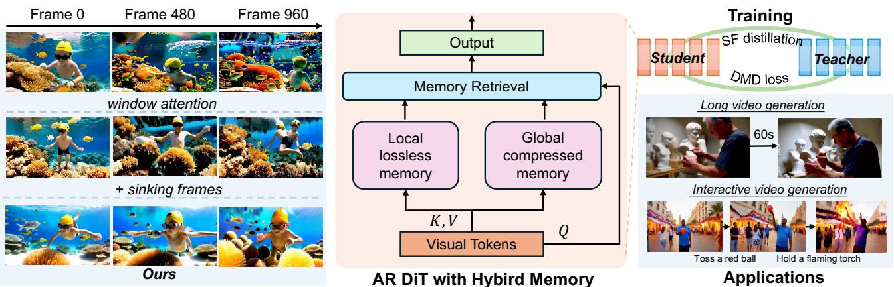
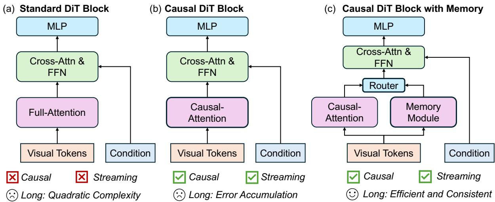
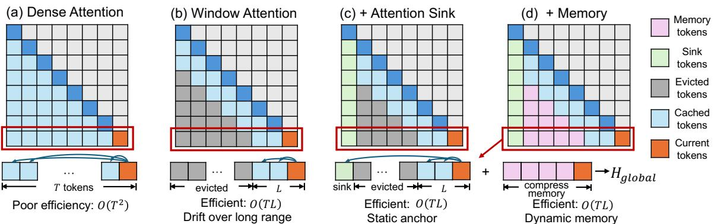
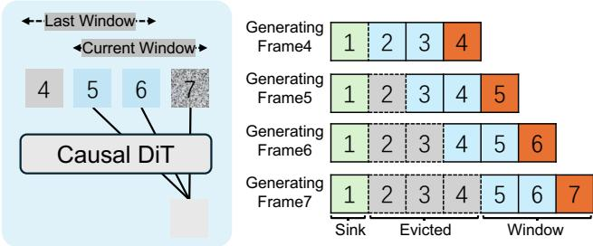
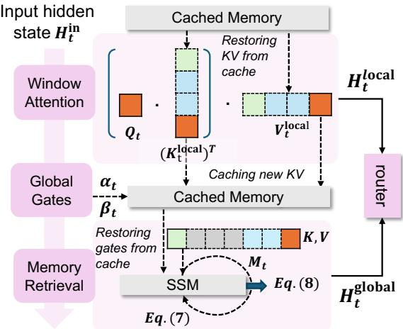
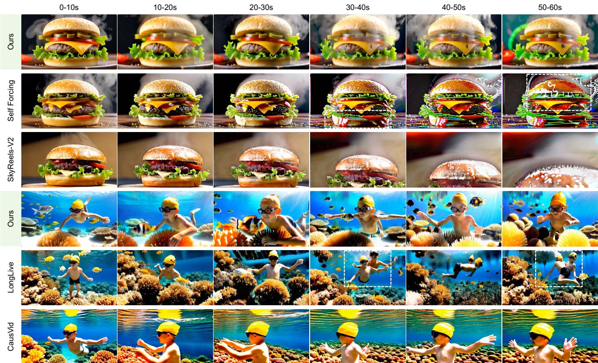
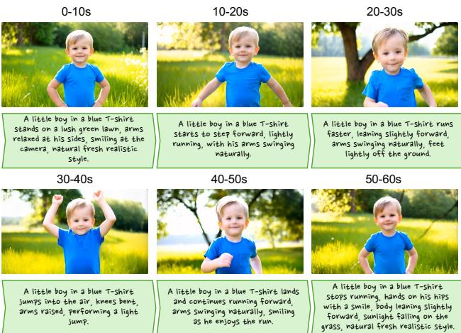

# VideoSSM：结合混合状态空间记忆的自回归长视频生成

Yifei $\mathbf { V } \mathbf { u } ^ { 1 , \dagger , * }$，Xiaoshan $\mathbf { W } \mathbf { u } ^ { 1 , * }$，Xinting $\mathbf { H } \mathbf { u } ^ { 1 }$，Tao $\mathbf { H } \mathbf { u } ^ { 2 , \ P }$，Yang-Tian $\mathbf { S u n ^ { 1 } }$，Xiaoyang Lyu1，Bo Wang1，$\mathbf { L i n M a ^ { 2 } }$，Yuewen $\mathbf { M } \mathbf { a } ^ { 2 , \ddagger }$，Zhongrui $\mathbf { W a n g ^ { 3 , \ddagger } }$，Xiaojuan $\mathbf { Q } \mathbf { i } ^ { 1 , \ddag }$ $^ { 1 } \mathrm { H K U }$ 2PICO，字节跳动 3南方科技大学 项目负责人 通讯作者

  
AR highly stable long video generation and adaptive, interactive prompt-based video generation.

# 摘要

自回归（AR）扩散通过因果生成帧来实现流媒体交互式长视频生成，但在分钟级时间范围内保持连贯性仍然是一个挑战，原因在于积累的误差、运动漂移和内容重复。我们从记忆的角度出发，将视频合成视为一种递归动态过程，需要协调短期和长期的上下文。我们提出了VideoSSM，这是一种将AR扩散与混合状态空间记忆统一的长视频模型。状态空间模型（SSM）作为整个序列场景动态的演变全球记忆，而上下文窗口则提供运动线索和细节的局部记忆。这种混合设计在不产生冻结、重复模式的情况下保持全球一致性，支持提示自适应交互，并能随着序列长度线性扩展。对短期和长期基准的实验表明，尤其在分钟级范围内，自回归视频生成器在时间一致性和运动稳定性方面达到了最先进水平，从而实现了内容多样性和基于交互提示的控制，建立了一个可扩展的、关注记忆的长视频生成框架。

# 1. 引言

长视频生成是推进生成视觉智能的一个长期目标。超越短视频剪辑合成，目标是模拟具有持续身份和时间连贯性的动态视觉世界，支持数字叙事、机器人模拟和世界建模等应用。尽管大型扩散变换器架构快速发展，但当前系统在短时间上下文和全局注意力的二次成本上存在根本性限制，这限制了可扩展性，妨碍了实时的提示自适应更新。自回归（AR）扩散提供了一种替代方案，它以因果方式生成帧，并启用流媒体和交互式合成。然而，将AR扩散推向分钟或小时级别的长时间范围时，会暴露出持续的瓶颈：错误积累、运动漂移和内容重复。近期的研究通过缩小训练和测试差距并扩大上下文来解决这些问题。自强迫方法在训练期间执行短期AR推演，借助动态关键值（KV）缓存作为短期记忆对齐模型的自身预测，抑制即时漂移。Rolling-Forcing扩展了这一点，通过上下文滚动和缓存重用在更长时间窗口传播信息。LongLive引入了一个全局注意力汇聚点，重用最早的帧作为固定锚点，改善长期稳定性。然而，这些设计在时间适应性上仍然狭窄：通过反复关注静态早期帧，它们冻结了全局记忆，促使场景在长序列中循环和重复。人类自然依赖动态记忆，持续更新过去的经验，以便在新事件展开时能够在长时间尺度上连贯推理。受此启发，近期的世界模型研究加强了视频模拟器与空间记忆的结合。例如，VMem构建了一种基于表面的3D视图记忆，而WorldMem和Context-as-Memory维护由3D相机位姿索引的缓存场景标记以实现交互式生成。相比之下，长视频生成寻求在分钟级别进行开放式、感知上真实的合成，通常具有自由的相机运动和高度动态的场景，而没有明确的世界状态。因此，这些与3D耦合的记忆设计在长时间范围和自由视角设置下表现不佳。缺失的内容是在潜在空间中持续更新的全局记忆，它联合捕捉局部运动和全局场景演变，而无需显式的3D假设。我们引入了VideoSSM，一个自回归的长视频扩散模型，配备了混合记忆架构：一个因果滑动窗口局部缓存作为局部记忆和一个状态空间模型（SSM）压缩的全局记忆。我们的设计将视频生成视为一个递归动态过程，通过SSM的压缩状态在每个生成步骤中持续演变，以保持和更新整体场景状态。同时，上下文窗口作为局部无损记忆，捕捉时间运动线索和视觉细节。这种混合记忆结构使模型能够在长时间范围内平衡稳定性和适应性，维护连贯性，同时动态响应新出现的内容。与静态注意力收集点不同，VideoSSM持续更新记忆以保留全局上下文，避免冻结全局记忆和内容重复。总体而言，它实现了长范围的连贯性、内容多样性和交互式适应性，同时具备线性时间成本的可扩展性。在VBench上进行的大量实验表明，VideoSSM在流行的自回归视频生成器中实现了最新的时间一致性和运动稳定性。在分钟级别范围内，它显著减少了累积误差、运动漂移和内容重复。通过提示切换的互动评估进一步展示了更平滑的过渡、更少的残余语义和更高的用户偏好。综合这些结果，VideoSSM被定位为一个可扩展的、关注记忆的长上下文和交互视频生成框架。

# 2. 相关工作

# 2.1. 自回归视频生成

不同于采用双向注意力同时生成所有视频帧的方法，增强现实（AR）视频生成方法允许流式和逐帧视频合成，使其特别适合于实时和交互式提示控制。与大型语言模型中的AR范式相似，一些方法首先将视频离散化为时空词元，然后训练下一个词元或下一个块的预测器。在推理过程中，时空词元按顺序生成，以组成完整的视频。其他一些工作通过在训练期间为各个帧分配不同的噪声水平来修改扩散目标，其中当前帧的噪声水平高于之前的帧。因此，它们通过在推理期间将合成的帧作为上下文反馈来实现AR风格的生成。

# 2.2. 长视频生成

为了将扩散模型扩展到更长的持续时间，一些研究生成具有时间约束的重叠片段，或采用层次化的关键帧到插值管道，这在长视频上仍然计算量较大。无训练的外推方法通过调整位置编码、噪声调度或时间频率在推理阶段延长视频长度，但不适合实时生成。自回归模型在可变长度和实时生成方面表现出强大的可扩展性。为了缓解长期漂移，自回归扩散方法通过KV缓存的推演进行训练-测试对齐，采用DMD损失，利用KV滚动或重新缓存扩展上下文，并将注意力与汇聚令牌结合。然而，当扩展到分钟级时，这些方法仍然面临严重的内容重复问题。

  
and long-context support.

# 2.3. 生成模型中的记忆机制

生成模型中的记忆可以分为局部记忆和全球记忆。局部记忆通常通过滑动窗口注意力和KV缓存实现，但在本质上会丧失窗口外的信息。全球记忆则聚合局部窗口外的历史信息。一些方法利用早期帧作为注意力汇聚点，以提供持久的参考，但它们往往会冻结全球状态并导致内容重复。其他方法则从记忆池中选择关键历史词元，或者将历史压缩成可重用的隐式状态，以保持长距离上下文。具体而言，最近世界模型中使用的几何记忆，通过显式的三维结构和精确的相机控制，解决了长期一致性问题。虽然在视点回访的互动模拟中显示出潜力，但三维耦合记忆在开放式、长时间跨度和自由视角合成中效果不佳。在本研究中，我们介绍了一种作为动态、持续演变的全球记忆的SSM。

# 3. 初步：从 DiT 到 AR DiT

视频的扩散变换器。我们首先回顾用于视频生成的标准扩散变换器（DiT）公式。给定一个清晰的视频样本 $\mathbf { x } _ { 0 } \sim$ $q ( \mathbf { x } _ { 0 } )$，前向扩散过程通过马尔可夫链逐渐破坏 $\mathbf { x } _ { 0 }$：

$$
q ( \mathbf { x } _ { t } \mid \mathbf { x } _ { t - 1 } ) = { \mathcal { N } } \Big ( \mathbf { x } _ { t } ; { \sqrt { 1 - \beta _ { t } } } \mathbf { x } _ { t - 1 } , \beta _ { t } \mathbf { I } \Big ) ,
$$

其中 $\beta _ { t }$ 表示噪声调度。逆过程学习使用由噪声预测网络 $\epsilon _ { \theta }$ 参数化的去噪器来近似真实后验，训练目标为标准目标：

$$
\mathcal { L } = \mathbb { E } _ { \mathbf { x } _ { 0 } , \epsilon , t } \left. \epsilon - \epsilon _ { \theta } ( \mathbf { x } _ { t } , t ) \right. ^ { 2 } , \mathbf { x } _ { t } = \sqrt { \bar { \alpha } _ { t } } \mathbf { x } _ { 0 } + \sqrt { 1 - \bar { \alpha } _ { t } } \epsilon ,
$$

通过 $\begin{array} { r } { \bar { \alpha } _ { t } = \prod _ { s = 1 } ^ { t } ( 1 - \beta _ { s } ) } \end{array}$ 在标准的 DiTs（图 2 (a)）中，$\epsilon _ { \theta }$ 通过一个双向视觉变换器实现，该变换器在从视频帧获取的时空词元上操作，并且每个词元通过全局自注意力机制与所有其他词元进行交互。长视频的自回归 DiT。为了实现长时间范围的视频生成，DiT 被转化为一个因果自回归模型（图 2 (b)）。令 $\mathbf { c } _ { t }$ 表示来自过去帧的条件信号。去噪器因此变为条件形式，$\epsilon _ { \theta } ( \mathbf { x } _ { t } , t , \mathbf { c } _ { t } )$，并通过限制时序上的自注意力来升级变换器主干，使得新帧只能关注于先前的帧词元。在推理时，该模型以自回归的方式生成视频：每个新合成的帧反馈用于更新 $\mathbf { c } _ { t }$，使得未来帧仅基于之前生成的内容进行条件化，而不是基于真实帧。然而，将自回归扩散推向分钟或小时级别的时间范围会导致误差累积、运动漂移和内容重复。在本工作中，我们在图 2 (b) 中的自回归 DiT 上增强了一个混合记忆架构（图 2 (c)）。

# 4. VideoSSM

我们提出了 VideoSSM，一种状态空间长视频模型，它通过混合内存架构增强了自回归 DiT，以实现连贯且可扩展的长时间合成。

  
Figure 3. Illustration of attention mechanisms in AR DiT. Let $T$ be the video token length and $L$ the sliding-window size. (a) Causal Attention: Each query attends to all past tokens. It captures the full context with quadratic $\mathrm { O } ( \mathrm { T } ^ { 2 } )$ complexity, impractical for long ur yte efficiency while providing a dynamic global context, balancing long-term consistency and adaptability.

第4.1节通过检视现有增强现实架构的注意力和缓存策略（见图3）来分析其局限性。第4.2节介绍了我们的混合记忆设计，该设计结合了可学习的全局记忆与局部滑动窗口上下文。第4.3节提出了一种因果蒸馏框架，它有效地将知识从双向教师传递到我们的因果增强现实模型。

# 4.1. 动机

在AR DiT模型中，因果注意力使得时间流式生成成为可能，但需要维护一个KV缓存，其大小随着过去标记数量的增加而线性增长（图3(a)）。为了控制内存增长，许多系统采用滑动窗口注意力和滚动KV缓存 [52, 54]（图3(b)）。这种设计在内存和延迟上都很高效，但在早期标记被驱逐时会出现漂移和误差积累 [52]。为了稳定长范围依赖，注意力汇合机制保留一小组初始“汇合”标记（图3(c)）。在长视频生成中，最早的帧通常用作汇合标记 [31, 57]，结合最近的标记以确保稳定的注意力计算。然而，我们的实验表明，基于汇合的注意力经常产生重复内容或冻结生成模式，尤其是在长视频中。固定的汇合标记过于稳定KV缓存，遮蔽了不断演变的滑动窗口上下文的贡献。

# 4.2. 混合状态空间记忆

我们提出了VideoSSM，一种配备混合记忆架构的自回归扩散模型（图3(d)）。我们引入了一个专门的记忆模块，明确管理短期和长期信息，而非丢弃窗口外的词元或依赖固定的注意力接收器。受到人类记忆层次结构的启发[1, 2, 11]，其中工作记忆保留细节，而长期记忆存储压缩的抽象表示，我们将模型记忆分解为两个互补组件，并将其整合到注意力机制中：• 本地记忆。一个具有缓存KV状态的因果注意力窗口（图3(b)），保留精确、无损的表示，对于捕捉细致的运动和外观细节至关重要（第4.2.1节）。全球记忆。一个不断发展的记忆模块（图2(c)），吸收从本地窗口中推出的词元，并将其反复压缩为一个紧凑、固定大小的状态（图3(d)），提供对所有过往上下文的持续更新摘要（第4.2.2节）。如图3(d)所示，这种混合注意力机制使模型能够访问整个历史，同时保持$O ( T L )$复杂度和完全的流式处理能力。该设计满足现代长视频生成器的核心要求：因果性、自然可流式处理，并且能够高效利用长时间范围的时间上下文。

# 4.2.1. 本地记忆：滑动窗口自注意力

设 $L$ 为滑动窗口大小。给定当前帧 $t$ 的输入隐藏状态 $\mathbf{H}_{t}^{\mathrm{in}}$，查询 $(\mathbf{Q}_{t})$、键 $(\mathbf{K}_{t})$ 和值 $(\mathbf{V}_{t})$ 计算如下：

$$
\{ \mathbf { Q } _ { t } , \mathbf { K } _ { t } , \mathbf { V } _ { t } \} = \{ \mathbf { H } _ { t } ^ { \mathrm { i n } } \mathbf { W } _ { Q } , \mathbf { H } _ { t } ^ { \mathrm { i n } } \mathbf { W } _ { K } , \mathbf { H } _ { t } ^ { \mathrm { i n } } \mathbf { W } _ { V } \} ,
$$

对关键字对 $\mathbf { K } _ { t }$ 和 $\mathbf { V } _ { t }$ 进行附加到本地 KV 缓存中。缓存仅保留沉没标记和最近 $L$ 个标记的键值对，形成 ${ \bf K } _ { t } ^ { \mathrm { l o c a l } } =$ $[ \mathbf { K } _ { \mathrm { s i n k } } , \mathbf { K } _ { t - L + 1 } : \mathbf { K } _ { t } ]$ 和 $\mathbf { V } _ { t } ^ { \mathrm { l o c a l } } = [ \mathbf { V } _ { \mathrm { s i n k } } , \mathbf { V } _ { t - L + 1 } : \mathbf { V } _ { t } ]$。基于本地内存的 $\mathbf { H } _ { t } ^ { \mathrm { l o c a l } }$ 采用标准因果自注意力机制计算：

  
Figure 4. Illustration of how sink, evicted, and window tokens are arranged at different timesteps in a causal DiT with slidingwindow attention. Here window length $L = 3$ .

$$
{ \bf H } _ { t } ^ { \mathrm { l o c a l } } = \mathrm { S e l f A t t e n t i o n } ( { \bf Q } _ { t } , { \bf K } _ { t } ^ { \mathrm { l o c a l } } , { \bf V } _ { t } ^ { \mathrm { l o c a l } } ) .
$$

# 4.2.2. 全局内存：动态状态计算

全局记忆模块将出窗口（被驱逐）词元的完整历史压缩为一个固定大小、持续演变的表示。它通过四个关键组件运作：门控缓存、状态更新、记忆检索和输出门控。同步门控缓存。为了将被驱逐词元的信息整合到全局记忆中，我们在每个时间步 $t$ 维持一个由两个可学习门控控制的递归压缩状态：注入门 $\beta _ { t }$ 和衰减门 $\pmb { \alpha } _ { t }$，$\alpha _ { t } , \beta _ { t } \in \mathbb { R } ^ { d }$，两个门的维度均匹配潜在词元的维度 $d$。注入门控制被驱逐词元对全局状态的更新强度，而衰减门则决定过去记忆的衰退速度。这两个门从词元退出局部窗口之前的隐状态 $\mathbf { H } _ { t } ^ { \mathrm { i n } }$ 计算得出：

$$
\begin{array} { r l } & { \beta _ { t } = \sigma ( \mathbf { W } _ { \beta } \mathbf { H } _ { t } ^ { \mathrm { i n } } ) } \\ & { \alpha _ { t } = - \exp ( \mathbf { A } ) \cdot \mathrm { S o f t P l u s } ( \mathbf { W } _ { \alpha } \mathbf { H } _ { t } ^ { \mathrm { i n } } + \mathbf { B } ) } \end{array}
$$

其中 $\sigma$ 是 sigmoid 函数，SoftPlus 是 ReLU 激活函数的平滑变体；$A$、$\mathbf { W } _ { \alpha }$ 和 $\mathbf { W } _ { \beta }$ 是可学习的权重；$\mathbf { B }$ 是可学习的偏置。门 $\alpha _ { t }$ 和 $\beta _ { t }$ 存储在与滚动 KV 缓存同步更新的门缓存中。

全局记忆状态更新。对于时间 $t$ 的查询，窗口外的 $L$ 长度令牌，索引为 $[ \sinh \mathbf { k } + 1 : t - L ]$ 的部分被视为已驱逐。我们表示 $\{ \mathbf { K } , \mathbf { V } , \alpha , \beta \} _ { t } ^ { \mathrm { ev t } } = \arg [ \{ { \bf K } , { \bf V } , \alpha , \beta \} _ { \mathrm { sink + 1 } } : \{ { \bf K } , { \bf V } , \alpha , \beta \} _ { t - L } ]$。所有信息的摘要直到最近被驱逐的令牌被压缩为全局状态 ${ { \bf { M } } _ { t } }$。我们使用门控 $\Delta$ 规则 [56] 更新 $\mathbf { M } _ { t }$，该规则仅提取传入信息的新颖部分，然后将其整合到状态中：

  
Figure 5. Architecture of the proposed hybrid memory module. The input $H _ { t } ^ { \mathrm { i n } }$ is processed in two streams. The local path (top) uses windowed attention with a sliding KV cache to compute $H _ { t } ^ { \mathrm { l o c a l } }$ To pSaMoSM) to recurrently compress historical information into a memory state $M$ , which is retrieved to produce $H _ { t } ^ { \mathrm { g l o b a l } }$ . A router then dynamically fuses the local and global outputs.

$$
\begin{array} { r l r } & { } & { { \bf V } _ { \mathrm { n e w } , t } ^ { \mathrm { e v t } } = { \bf V } _ { t } ^ { \mathrm { e v t } } - \mathrm { P r e d i c t } ( { \bf M } _ { t - 1 } , { \bf K } _ { t } ^ { \mathrm { e v t } } , \beta _ { t } ^ { \mathrm { e v t } } ) , } \\ & { } & { { \bf M } _ { t } = \exp ( \bar { \bf g } _ { t } ) \cdot { \bf M } _ { t - 1 } + { \bf K } _ { t } ^ { \mathrm { e v t } } \cdot ( { \bf V } _ { \mathrm { n e w } , t } ^ { \mathrm { e v t } } ) ^ { T } , } \end{array}
$$

其中 ${ \bf M } _ { 0 } = { \bf 0 }$，预测函数 $\left( \cdot \right)$ 估计从前一状态 $\mathbf { M } _ { t - 1 }$ 中驱逐值的可预测部分，因此输入的 $\mathbf { V } _ { \mathrm { n e w } , t } ^ { \mathrm { e v t } }$ 以及 $\begin{array} { r } { \bar { \bf g } _ { t } = \sum _ { s = 0 } ^ { t } \alpha _ { s } ^ { \mathrm { e v t } } } \end{array}$ 是一个累积负门（其中 $\alpha _ { s } ^ { \mathrm { e v t } } < 0 $ 控制状态衰减）。第一项 $\exp ( \bar { \bf g } _ { t } ) \cdot { \bf M } _ { t - 1 }$ 确保了受控遗忘和长期稳定，而第二项仅整合不可预测的新信息。通过结合选择性更新和门控衰减，全局记忆保持一个紧凑、稳定和持续演变的表示，随着视频的增长而不断发展，而不是崩溃或漂移，从而为增强现实扩散提供强大的长程上下文。全局记忆检索。我们通过将当前查询 $\mathbf { Q } _ { t }$ 投影到压缩状态 ${ { \bf { M } } _ { t } }$ 上来检索对齐的记忆响应，然后通过输出门来优化，调节揭示多少全局信息 $\mathbf { H } _ { t } ^ { \mathrm { g l o b a l } }$ 的计算方式：

$$
\begin{array} { r } { \mathbf { g } _ { t } ^ { \mathrm { o u t } } = \mathrm { L i n e a r } ( \mathbf { H } _ { t } ^ { \mathrm { i n } } ) , \quad \quad \quad } \\ { \mathbf { H } _ { t } ^ { \mathrm { g l o b a l } } = \mathrm { S w i s h } ( \mathbf { g } _ { t } ^ { \mathrm { o u t } } \odot \mathrm { R M S N o r m } ( \mathbf { Q } _ { t } \mathbf { M } _ { t } ) ) , } \end{array}
$$

其中 $\mathbf { H } _ { t } ^ { \mathrm { in } }$ 是当前的隐藏状态，${ \bf g } _ { t } ^ { \mathrm { out } }$ 是控制信息流的输出门系数向量，而 $\mathrm { Swish } ( x ) = x \cdot \sigma ( x )$ 表示 Swish 激活函数。它首先使用 RMSNorm 对记忆响应进行归一化，然后应用逐元素门控，使得模型能够选择性地过滤和调节全局信息，然后再将其传递给后续层。

# 4.2.3. 位置感知门控融合

最后，我们融合了局部和全局记忆流。我们引入了一种基于位置的路由器，动态控制全局记忆注入的强度。这对于稳定生成至关重要：在序列的早期，模型应主要依赖局部信息，而随着上下文的累积，全局记忆应发挥更大的作用。

我们定义相对位置比率 $\rho _ { t } = ( t + 1 ) / T$，其中 $t$ 是当前帧索引，$T$ 是总上下文长度。接着计算一个记忆门 $\gamma _ { t } \in \mathbb { R } ^ { d }$，匹配词元维度 $d$，其计算方法为 $w _ { \mathrm { r o u t e r } } , b _ { \mathrm { r o u t e r } } \in \mathbb { R } ^ { d }$ 是可学习向量。当 $t$ 趋近于 0 时，$\rho _ { t } \to 0$，$\log ( \rho _ { t } ) \to - \infty$，因此 $\gamma _ { t } \to 0$，有效地抑制了序列开头的全局记忆。当 $t$ 趋近于 $T$ 时，$\rho _ { t } \to 1$，$\log ( \rho _ { t } ) \to 0$，并且 $\gamma _ { t }$ 接近学习到的值 $\sigma ( b _ { \mathrm { r o u t e r } } )$，启用全局记忆流。

$$
\begin{array} { r } { \gamma _ { t } = \sigma ( \pmb { w } _ { \mathrm { r o u t e r } } \log ( \rho _ { t } ) + b _ { \mathrm { r o u t e r } } ) , } \end{array}
$$

最终融合的隐藏状态 $\mathbf { H } _ { t } ^ { \mathrm { fused } }$ 是一个简单的门控求和：

$$
\mathbf { H } _ { t } ^ { \mathrm { f u s e d } } = \mathbf { H } _ { t } ^ { \mathrm { l o c a l } } + \boldsymbol { \gamma } _ { t } \cdot \mathbf { H } _ { t } ^ { \mathrm { g l o b a l } } ,
$$

然后被传递到 DiT 模块的后续交叉注意力和前馈层。这个融合机制使得 VideoSSM 能够保持滑动窗口注意力的 $O ( L )$ 效率，同时引入一个动态的、压缩的全局上下文——缓解了纯窗口注意力的灾难性遗忘和静态注意力汇聚的僵化，产生了在长期范围内具有时间一致性且能响应不断变化的场景内容的动态。

# 4.3. 使用记忆进行训练

为了实现实时生成，我们将高保真教师模型提炼为基于自强的因果框架。我们的模型结合了一种混合记忆以保持流媒体一致性，并采用一种滚动记忆方案以高效进行长时间跨度的训练和交互式提示切换。

阶段 1：因果模型蒸馏。我们从预训练的双向教师模型 $T _ { \phi }$（即，Wan 2.1 [45]）初始化因果学生模型 $G _ { \theta }$，遵循 CausVid 策略 [60]。利用教师的常微分方程（ODE）采样轨迹，学生被训练以匹配教师在 5 秒段内的短视频专业知识。学生因果回归这些轨迹，最小化 $\mathcal { L } = \Vert \hat { \mathbf { x } } _ { 0 } - T _ { \phi } ( \mathbf { x } _ { t } , t ) \Vert ^ { 2 }$，其中 $\hat { \mathbf { x } } _ { 0 } = G _ { \theta } ( \mathbf { x } _ { t } , t )$。梯度被选择性地计算并在步骤之间传播到混合记忆中，通过自生成历史来减轻曝光偏差。此阶段使 $G _ { \theta }$ 具备高质量的短期动态，然后再引入长期自回归行为。通过引入我们的混合记忆，该模型即使只在短片段上训练，也能获得长范围能力。阶段 2：长视频训练。第二阶段通过训练混合记忆以在流式自回归场景中有效运行来减轻长期衰退。我们扩展了使用 DMD 的 SF 风格蒸馏，允许学生模型在训练过程中自我纠正错误，这模拟了使用滚动 KV 缓存和内存进行推理的过程。1. 长期自推演：$G _ { \theta }$ 自回归地产生一个长序列 $\hat { x } ^ { 1 : N }$（例如，$N = 60$ 秒），以块状形式超越教师的 5 秒视野。它仅使用自生成的输出填充其本地 KV 缓存和全局记忆缓存（通过 $\beta$ 和 $\alpha$ 网关），采用滚动 KV 缓存与全局记忆保持固定上下文长度并避免漂移，从而模拟推理。2. 窗口式教师纠正：均匀采样一个短窗口 $K$（$K = 5$ 秒）。在这个窗口上应用 DMD 损失：

$$
\mathcal { L } _ { \mathrm { { D M D } } } = \mathbb { E } _ { t , i \sim \mathrm { { U n i f } } ( 1 , N - K ) } \left[ \nabla _ { \theta } K L ( p _ { \theta , t } ^ { S } ( z _ { i } ) | | p _ { t } ^ { T } ( z _ { i } ) ) \right]
$$

其中 $z _ { i }$ 是从帧 $i$ 开始的窗口。这利用了教师对短片段的熟练性来纠正长距离错误，从而帮助从劣化状态中恢复。

# 5. 实验

# 5.1. 设置

我们基于 Wan 2.1-T2V-1.3B 模型实现了 VideoSSM [45]，该模型是一种流匹配模型，以 16 FPS 的速度生成分辨率为 $8 3 2 \times 4 8 0$ 的 5 秒视频。该经过蒸馏的分块自回归模型使用 4 步扩散，并且分块大小为 3，同时生成 3 幅潜在帧。对于 ODE 初始化和长视频蒸馏，我们从经过过滤和 LLM 扩展的 VidProM [46] 中采样文本提示。我们在 VBench [26] 上评估短视频（5 秒）和长视频（一分钟），测量维度包括主题一致性、背景一致性、运动平滑度、审美质量和成像质量。在用户研究中，我们收集了 40 位参与者的偏好。每位参与者被展示了 8 个提示，对于每个提示，他们对用三种 AR 视频生成模型生成的 4 个一分钟视频进行了排名：Selfforcing [25]、Caus Vid [60]、Longlive [57] 和我们的模型。

# 5.2. 视频质量评估

我们首先在 VBench 基准测试 [25] 上评估短视频（5 秒）生成。表 1 展示了我们将 VideoSSM 与领先的自回归模型进行比较，包括几步蒸馏生成器 [25, 60] 及其长范围变体 [12, 31, 57]，以及其他强基线 [7, 13, 27, 42]。作为参考，我们还列出了最先进的双向模型 [20, 45]。在所有自回归模型中，VideoSSM 的总分（83.95）和质量分（84.88）都达到了最高，超越了 LongLive 和 4.5B 参数的 MAGI-1 等强劲竞争者。这证明了我们的混合记忆机制有效地提升了短视频的保真度。

Table 1. Comparison with relevant baselines. We compare VideoSSM with representative open-source video generation models of similar parameter sizes and resolutions.1   

<table><tr><td rowspan="2">Model</td><td rowspan="2">#Params</td><td colspan="3">Evaluation scores ↑</td></tr><tr><td>Total</td><td>Quality</td><td>Semantic</td></tr><tr><td>Bidirectional Diffusion models</td><td></td><td></td><td></td><td></td></tr><tr><td>LTX-Video [20]</td><td>1.9B</td><td>80.00</td><td>82.30</td><td>70.79</td></tr><tr><td>Wan2.1 [45]</td><td>1.3B</td><td>84.26</td><td>85.30</td><td>80.09</td></tr><tr><td>Autoregressive models</td><td></td><td></td><td></td><td></td></tr><tr><td>SkyReels-V2 [7]</td><td>1.3B</td><td>82.67</td><td>84.70</td><td>74.53</td></tr><tr><td>MAGI-1 [42]</td><td>4.5B</td><td>79.18</td><td>82.04</td><td>67.74</td></tr><tr><td>Caus Vid [60]</td><td>1.3B</td><td>81.20</td><td>84.05</td><td>69.80</td></tr><tr><td>NOVA [13]</td><td>0.6B</td><td>80.12</td><td>80.39</td><td>79.05</td></tr><tr><td>Pyramid Flow [27]</td><td>2B</td><td>81.72</td><td>84.74</td><td>69.62</td></tr><tr><td>Self Forcing [25]</td><td>1.3B</td><td>83.00</td><td>83.71</td><td>80.14</td></tr><tr><td>LongLive [57]</td><td>1.3B</td><td>83.52</td><td>84.26</td><td>80.53</td></tr><tr><td>Self Forcing ++ [12]</td><td>1.3B</td><td>83.11</td><td>83.79</td><td>80.37</td></tr><tr><td>Rolling Forcing [31]</td><td>1.3B</td><td>81.22</td><td>84.08</td><td>69.78</td></tr><tr><td>VideoSSM (Ours)</td><td>1.4B</td><td>83.95</td><td>84.88</td><td>80.22</td></tr></table>

# 5.3. 长视频生成

为了评估长视频能力，我们在 VBench 上使用单一提示评估分钟级生成效果。我们评估了“短训练-长测试”设置，即在 5 秒片段上训练的模型必须推广到长视频的情形，这种情形容易导致灾难性的漂移。如表 2 所示，VideoSSM 在所有 AR 模型中实现了最高的主体和背景一致性，证明了我们混合记忆在防止错误累积方面的有效性。重要的是，这种一致性并没有崩溃为静态或冻结的输出，因为 VideoSSM 达到了明显高于 LongLive 和 Self Forcing 的动态度（50.50），展示了其在保持长期一致性的同时，保持自然时间演变的能力。图 6 提供了定性验证。在汉堡示例中，VideoSSM（我们的模型）在整个 60 秒内维持了主体的身份和结构，而 SkyReelsV2 完全内容崩溃，Self Forcing 则表现出严重漂移。水下场景更具启示性：我们的模型成功捕捉到了动态、向前游动的动作，同时保持了高度的主体一致性。相比之下，竞争方法未能实现这一平衡。CausVid 避免了漂移，但却陷入了运动停滞，孩子在后续帧中几乎静止。使用固定注意力机制的 LongLive 最初保持了主体的一致性，但在存在幻觉的情况下，出现了第二个男孩的实例，从而遭遇降级。这些证据共同证明了我们混合记忆在实现稳定、高保真和真正动态生成方面的卓越能力，远超训练期间观察到的短片段。

Table 2. Performance comparisons of AR models on 60s long videos. Bold highlights the highest, underline the second highest.   

<table><tr><td rowspan=1 colspan=4>Self               VideoSSMMetric                              LongLiveForcing               (Ours)</td></tr><tr><td rowspan=3 colspan=1>Temporal Flickering ↑Subject Consistency ↑Background Consistency ↑</td><td rowspan=1 colspan=1>97.86</td><td rowspan=1 colspan=1>97.24</td><td rowspan=1 colspan=1>97.70</td></tr><tr><td rowspan=1 colspan=1>88.25</td><td rowspan=1 colspan=1>91.09</td><td rowspan=2 colspan=1>92.5193.95</td></tr><tr><td rowspan=1 colspan=1>91.73</td><td rowspan=1 colspan=1>93.23</td></tr><tr><td rowspan=2 colspan=1>Motion Smoothness ↑Dynamic Degree ↑</td><td rowspan=1 colspan=1>98.67</td><td rowspan=1 colspan=1>98.38</td><td rowspan=1 colspan=1>98.60</td></tr><tr><td rowspan=1 colspan=1>35.00</td><td rowspan=1 colspan=1>37.50</td><td rowspan=1 colspan=1>50.50</td></tr><tr><td rowspan=1 colspan=1>Aesthetic Quality ↑</td><td rowspan=1 colspan=1>60.02</td><td rowspan=1 colspan=1>55.74</td><td rowspan=1 colspan=1>60.45</td></tr></table>

# 5.4. 互动视频生成

我们的模型还支持交互式长视频生成，在长时间训练后能够实现无缝的提示切换。通过启用 KV 重新缓存[57]，系统能够在用户提供新指令时高效刷新其内部局部存储，从而防止过时的语义残留，并确保每次过渡能够干净地响应更新后的提示。这使得模型在实时适应新的叙事指令的同时，保持场景的一致性。如图 7 所示，VideoSSM 在提示变化时产生平滑、自然且动态一致的过渡。附加的定性示例已提供在补充材料中。

# 5.5. 用户研究

为了评估超越自动化指标的感知质量，我们进行了一个包含40名参与者的用户研究。我们通过在8个不同的文本提示上运行我们的方法和三个基准（LongLive、Self Forcing、CausVid），生成了32个独特的时长为一分钟的视频。对于每个提示，参与者以随机顺序观看四个生成的视频，并要求对其进行从1（最好）到4（最差）的排名。排名标准包括整体视觉质量、时间和物理一致性，以及对提示的遵循。如表3所示，我们的方法获得了最高的偏好。VideoSSM获得了最多的第一名投票（41.07%），并获得了最佳（最低）平均排名1.85。虽然LongLive通过静态注意力沉没机制（低动态程度37.50）也实现了高一致性，可能最小化感知伪影，但VideoSSM更高的动态程度使复杂的非重复运动成为可能，通过在动态真实感和长期一致性之间平衡，获得了更优的用户偏好。

  
F n generates videos with more coherent motion and stable temporal consistency.

  
Figure 7. Demonstration of interactive long video generation.

Table 3. Vote percentages for each model across different ranks. Cell color intensity indicates higher percentages. The last column shows the average rank.   

<table><tr><td rowspan=1 colspan=6>Model    Rank 1 (%) Rank 2 (%) Rank 3 (%) Rank 4 (%) Avg Rank</td></tr><tr><td rowspan=1 colspan=1>Self Forcing</td><td rowspan=1 colspan=1>11.79</td><td rowspan=1 colspan=1>13.21</td><td rowspan=1 colspan=1>23.21</td><td rowspan=1 colspan=1>51.79</td><td rowspan=1 colspan=1>3.18</td></tr><tr><td rowspan=1 colspan=1>CausVid</td><td rowspan=1 colspan=1>7.50</td><td rowspan=1 colspan=1>16.07</td><td rowspan=1 colspan=1>42.14</td><td rowspan=1 colspan=1>34.29</td><td rowspan=1 colspan=1>3.03</td></tr><tr><td rowspan=1 colspan=1>LongLive</td><td rowspan=1 colspan=1>39.64</td><td rowspan=1 colspan=1>36.43</td><td rowspan=1 colspan=1>15.00</td><td rowspan=1 colspan=1>8.93</td><td rowspan=1 colspan=1>1.92</td></tr><tr><td rowspan=1 colspan=1>Ours</td><td rowspan=1 colspan=1>41.07</td><td rowspan=1 colspan=1>34.29</td><td rowspan=1 colspan=1>19.64</td><td rowspan=1 colspan=1>5.00</td><td rowspan=1 colspan=1>1.85</td></tr></table>

# 6. 结论

在本研究中，我们引入了VideoSSM，一种长期视频自回归扩散模型，将自回归扩散重新构建为具有混合记忆的递归动力学过程：一个作为演变全局记忆的状态空间模型（SSM）和一个作为局部记忆的上下文窗口。该设计在适应新内容的同时保持长时间跨度的一致性，实现了线性时间的可扩展性。实验表明，VideoSSM显著减少了误差累积、运动漂移和内容重复，实现了分钟级的连贯性和鲁棒的提示自适应交互生成。未来的方向包括集成显式的多模态条件，融入相机感知和几何先验，以及将框架扩展到可控的长篇视频编辑。

# References

[1] Richard C Atkinson and Richard M Shittrin. Human memory: A proposed system and its control processes. In Psychology of learning and motivation, pages 89195. Elsevier, 1968. 4   
[2] Alan Baddeley. Working memory. Memory, pages 71111, 2020. 4   
[3] Andreas Blattmann, Tim Dockhorn, Sumith Kulal, Daniel Mendelevitch, Maciej Kilian, Dominik Lorenz, Yam Levi, Zion English, Vikram Voleti, Adam Letts, et al. Stable video diffusion: Scaling latent video diffusion models to large datasets, 2023. arXiv preprint arXiv:2311.15127. 2   
[4] Jake Bruce, Michael Dennis, Ashley Edwards, Jack ParkerHolder, Yuge Shi, Luke Hughes, Matthew Lai, Aditi Mavalankar, Chris Todd, Danny Springborn, Yusra Ghazi, Evgeny Gladchenko, James Molloy, Utsav Prabhu, John Nguyen, Matthew Aitchison, Gabriele Recchia, Izzeddin Gur, Rob Fergus, Aleksandra Faust, and Pierre Sermanet. Genie: Generative interactive environments. In ICML, 2024. 2   
[5] Shengqu Cai, Ceyuan Yang, Lvmin Zhang, Yuwei Guo, Junfei Xiao, Ziyan Yang, Yinghao Xu, Zhenheng Yang, Alan Yuille, Leonidas Guibas, Maneesh Agrawala, Lu Jiang, and Gordon Wetzstein. Mixture of contexts for long video generation, 2025. arXiv preprint arXiv:2508.21058. 3   
[6] Boyuan Chen, Diego Mart'i Mons'o, Yilun Du, Max Simchowitz, Russ Tedrake, and Vincent Sitzmann. Diffusion forcing: Next-token prediction meets full-sequence diffusion. In Advances in Neural Information Processing Systems, 2024. 2   
[7] Guibin Chen, Dixuan Lin, Jiangping Yang, Chunze Lin, Junchen Zhu, Mingyuan Fan, Hao Zhang, Sheng Chen, Zheng Chen, Chengcheng Ma, et al. Skyreels-v2: Infinite-length film generative model. arXiv preprint arXiv:2504.13074, 2025. 1, 2, 7   
[8] Junsong Chen, Yuyang Zhao, Jincheng Yu, Ruihang Chu, Junyu Chen, Shuai Yang, Xianbang Wang, Yicheng Pan, Daquan Zhou, Huan Ling, et al. Sana-video: Efficient video generation with block linear diffusion transformer. arXiv preprint arXiv:2509.24695, 2025. 2   
[9] Xinyuan Chen, Yaohui Wang, Lingjun Zhang, Shaobin Zhuang, Xin Ma, Jiashuo Yu, Yali Wang, Dahua Lin, Yu Qiao, and Ziwei Liu. Seine: Short-to-long video diffusion model for generative transition and prediction. In International Conference on Learning Representations, 2023. 2   
10] Xinle Cheng, Tianyu He, Jiayi Xu, Junliang Guo, Di He, and Jiang Bian. Playing with transformer at $^ { 3 0 + }$ fps via next-frame diffusion. arXiv preprint arXiv:2506.01380, 2025. 3   
11] Nelson Cowan. What are the differences between long-term, short-term, and working memory? Progress in brain research, 169:323338, 2008. 4   
12] Justin Cui, Jie Wu, Ming Li, Tao Yang, Xiaojie Li, Rui Wang, Andrew Bai, Yuanhao Ban, and Cho-Jui Hsieh. Selfforcing $^ { + + }$ Towards minute-scale high-quality video generation arXiv nrenrint arXiv:2510 02283 2025 2.7 [1] Haoge Deng, 1ing Pan, Haiwen Diao, Znengxiong Luo, Yufeng Cui, Huchuan Lu, Shiguang Shan, Yonggang Qi, and Xinlong Wang. Autoregressive video generation without vector quantization. arXiv preprint arXiv:2412.14169,   
2024.7 [14] Patrick Esser, Sumith Kulal, Andreas Blattmann, Rahim Entezari, Jonas Müller, Harry Saini, Yam Levi, Dominik Lorenz, Axel Sauer, Frederic Boesel, Dustin Podell, Tim Dockhorn, Zion English, Kyle Lacey, Alex Goodwin, Yannik Marek, and Robin Rombach. Scaling rectified flow transformers for high-resolution image synthesis. arXiv preprint arXiv:2403.03206, 2024. 1 [15] Yunhao Fang, Weihao Yu, Shu Zhong, Qinghao Ye, Xuehan Xiong, and Lai Wei. Artificial hippocampus networks for efficient long-context modeling. arXiv preprint arXiv:2510.07318, 2025. 3 [16] Songwei Ge, Thomas Hayes, Harry Yang, Xi Yin, Guan Pang, David Jacobs, Jia-Bin Huang, and Devi Parikh. Long video generation with time-agnostic vqgan and timesensitive transformer. In ECCV, 2022. 2 [17] Yuchao Gu, weijia Mao, and Mike Zheng Shou. Longcontext autoregressive video modeling with next-rame prediction. arXiv preprint arXiv:2503.19325, 2025. 2, 3 [18] Yuwei Guo, Ceyuan Yang, Ziyan Yang, Zhibei Ma, Zhijie Lin, Zhenheng Yang, Dahua Lin, and Lu Jiang. Long context tuning for video generation. In Proceedings of the IEEE/CVF International Conference on Computer Vision (ICCV), 2025.   
2 [19] David Ha and Jürgen Schmidhuber. Recurrent world models facilitate policy evolution. Advances in neural information processing systems, 31, 2018. 2 [20] Yoav HaCohen, Nisan Chiprut, Benny Brazowski, Daniel Shalem, Dudu Moshe, Eitan Richardson, Eran Levin, Guy Shiran, Nir Zabari, Ori Gordon, et al. Ltx-video: Realtime video latent diffusion, 2024. arXiv preprint arXiv:2501.00103. 7 [21] Yingqing He, Tianyu Yang, Yong Zhang, Ying Shan, and Qifeng Chen. Latent video diffusion models for high-fidelity long video generation, 2022. arXiv preprint arXiv:2211.13221. 2 [22] Roberto Henschel, Levon Khachatryan, Daniil Hayrapetyan, Hayk Poghosyan, Vahram Tadevosyan, Zhangyang Wang, Shant Navasardyan, and Humphrey Shi. Streamingt2v: Consistent, dynamic, and extendable long video generation from text, 2024. arXiv preprint arXiv:2403.14773. 2 [23] Jonathan Ho, Tim Salimans, Alexey Gritsenko, William Chan, Mohammad Norouzi, and David J Fleet. Video diffusion models. In Advances in Neural Information Processing Systems, 2022. 2 [24] Tianyu Huang, Wangguandong Zheng, Tengfei Wang, Yuhao Liu, Zhenwei Wang, Junta Wu, Jie Jiang, Hui Li, Rynson WH Lau, Wangmeng Zuo, et al. Voyager: Long-ange and world-consistent video diffusion for explorable 3d scene generation. arXiv preprint arXiv:2506.04225, 2025. 2, 3 [25] Xun Huang, Zhengqi Li, Guande He, Mingyuan Zhou, and Eli Shechtman. Self forcing: Bridging the traintest gap in autoregressive video diffusion. arXiv preprint arXiv:2506 08009, 2025, 1,2, 6. 7   
[\~\~] Yuming Jiang, Yuanhan Zhang, Tianxing Wu, Qingyang Jin, Nattapol Chanpaisit, et al. Vbench: Comprehensive benchmark suite for video generative models. In Proceedings of the IEEE/CVF Conference on Computer Vision and Pattern Recognition, pages 2180721818, 2024. 2, 6   
[27] Yang Jin, Zhicheng Sun, Ningyuan Li, Kun Xu, Hao Jiang, Nan Zhuang, Quzhe Huang, Yang Song, Yadong Mu, and Zhouchen Lin. Pyramidal flow matching for efficient video generative modeling. arXiv preprint arXiv:2410.05954, 2024. 7   
[28] Dan Kondratyuk, Lijun Yu, Xiuye Gu, José Lezama, Jonathan Huang, Rachel Hornung, Hartwig Adam, Hassan Akbari, Yair Alon, Vighnesh Birodkar, Yong Cheng, MingChang Chiu, Josh Dillon, Irfan Essa, Agrim Gupta, Meera Hahn, Anja Hauth, David Hendon, Alonso Martinez, David Minnen, David Ross, Grant Schindler, Mikhail Sirotenko, Kihyuk Sohn, Krishna Somandepalli, Huisheng Wang, David Yang, Bryan Seybold, and Lu Jiang. Videopoet: A large language model for zero-shot video generation. In ICML, 2024. 2   
[29] Weijie Kong, Qi Tian, Zijian Zhang, Rox Min, Zuozhuo Dai, Jin Zhou, Jiangfeng Xiong, Xin Li, Bo Wu, Jianwei Zhang, et al. Hunyuanvideo: A systematic framework for large video generative models, 2024. arXiv preprint arXiv:2412.03603. 2   
[30] Runjia Li, Philip Torr, Andrea Vedaldi, and Tomas Jakab. Vmem: Consistent interactive video scene generation with surfel-indexed view memory. arXiv preprint arXiv:2506.18903, 2025. 2, 3   
[31] Kunhao Liu, Wenbo Hu, Jiale Xu, Ying Shan, and Shijian Lu. Rolling forcing: Autoregressive long video diffusion in real time, 2025. arXiv preprint arXiv:2509.25161. 2, 3, 4, 7   
[32] Yu Lu and Yi Yang. Freelong $^ { + + }$ Training-free long video generation via multi-band spectralfusion. arXiv preprint arXiv:2507.00162, 2025. 2   
[33] Yu Lu, Yuanzhi Liang, Linchao Zhu, and Yi Yang. Freelong: Training-free long video generation with spectralblend temporal attention. In The Thirty-eighth Annual Conference on Neural Information Processing Systems, 2024. 2   
[34] Michael Mathieu, Camille Couprie, and Yann LeCun. Deep multi-scale video prediction beyond mean square error. In International Conference on Learning Representations, 2016. 2   
[35] Yuta Oshima, Shohei Taniguchi, Masahiro Suzuki, and Yutaka Matsuo. Ssm meets video diffusion models: Efficient long-term video generation with structured state spaces, 2024. arXiv preprint arXiv:2403.07711. 2, 3   
[36] William Peebles and Saining Xie. Scalable diffusion models with transformers. arXiv preprint arXiv:2212.09748, 2022. 1   
[37] Ryan Po, Yotam Nitzan, Richard Zhang, Berlin Chen, Tri D, Eli Shechman, Gordon Wetzstein, and Xun Huang. Long-context state-space video world models. arXiv preprint arXiv:2505.20171, 2025. 2, 3   
[38] Haonan Qiu, Menghan Xia, Yong Zhang, Yingqing He, Xintao Wang, Ying Shan, and Ziwei Liu. Freenoise: Tuning-free longer video diffusion via noise rescheduling, 2023. 2 [39] Shuhuai Ren, Shuming Ma, Xu Sun, and Furu Wei. Next block prediction: Video generation via semi-autoregressive modeling. arXiv preprint arXiv:2502.07737, 2025. 2 [40] Kiwhan Song, Boyuan Chen, Max Simchowitz, Yilun Du, Russ Tedrake, and Vincent Sitzmann. History-guided video diffusion. arXiv preprint arXiv:2502.06764, 2025. 2 [41] Meituan LongCat Team, Xunliang Cai, Qilong Huang, Zhuoliang Kang, Hongyu Li, Shijun Liang, Liya Ma, Siyu Ren, Xiaoming Wei, Rixu Xie, and Tong Zhang. Longcatvideo technical report, 2025. 1, 2 [42] Hansi Teng, Hongyu Jia, Lei Sun, Lingzhi Li, Maolin Li, Mingqiu Tang, Shuai Han, Tianning Zhang, WQ Zhang, Weifeng Luo, et al. Magi-1: Autoregressive video generation at scale. arXiv preprint arXiv:2505.13211, 2025. 2, 7 [43] Sergey Tulyakov, Ming-Yu Liu, Xiaodong Yang, and Jan Kautz. Mocogan: Decomposing motion and content for video generation. In Proceedings of the IEEE Conference on Computer Vision and Pattern Recognition, 2018. 2 [44] Ruben Villegas, Mohammad Babaeizadeh, Pieter-Jan Kindermans, Hernan Moraldo, Han Zhang, Mohammad Taghi Saffar, Santiago Castro, Julius Kunze, and Dumitru Erhan. Phenaki: Variable length video generation from open domain textual descriptions. In International Conference on Learning Representations, 2023. 2 [45] Team Wan, Ang Wang, Baole Ai, Bin Wen, Chaojie Mao, Chen-Wei Xie, Di Chen, Feiwu Yu, Haiming Zhao, Jianxiao Yang, et al. Wan: Open and advanced large-scale video generative models. arXiv preprint arXiv:2503.20314, 2025. 2,   
6,7 [46] Wenhao Wang and Yi Yang. Vidprom: A million-scale real prompt-gallery dataset for text-to-video diffusion models. Advances in Neural Information Processing Systems, 37:   
6561865642, 2024. 6 [47] Yaohui Wang, Xinyuan Chen, Xin Ma, Shangchen Zhou, Ziqi Huang, Yi Wang, Ceyuan Yang, Yinan He, Jiashuo Yu, Peiqing Yang, et al. Lavie: High-quality video generation with cascaded latent diffusion models. IJCV, 2024. 2 [48] Yuqing Wang, Tianwei Xiong, Daquan Zhou, Zhijie Lin, Yang Zhao, Bingyi Kang, Jiashi Feng, and Xihui Liu. Loong: Generating minute-level long videos with autoregressive language models. arXiv preprint arXiv:2410.02757, 2024. 2 [49] Dirk Weissenborn, Oscar Täckström, and Jakob Uszkoreit. Scaling autoregressive video models. In ICLR, 2020. [50] Chenfei Wu, Jian Liang, Xiaowei Hu, Zhe Gan, Jianfeng Gao, Lijuan Wang, Zicheng Liu, Yuejian Fang, and Nan Duan. Nuwa-infinity: Autoregressive over autoregressive generation for infinite visual synthesis. In NeurIPS, 2022.   
2 [51] Tong Wu, Shuai Yang, Ryan Po, Yinghao Xu, Ziwei Liu, Dahua Lin, and Gordon Wetzstein. Video world models with long-term spatial memory. arXiv preprint arXiv:2506.05284,   
2025. 3 [52] Guangxuan Xiao, Yuandong Tian, Beidi Chen, Song Han, and Mike Lewis. Efficient streaming language models with attention sinks. arXiv, 2023. 3, 4 [53] Zeqi Xiao, Yushi Lan, Yifan Zhou, Wenqi Ouyang, Shuai Yang, Yanhong Zeng, and Xingang Pan. Worldmem: Longpreprint arXiv:2504.12369, 2025. 2   
[54] Ruyi Xu, Guangxuan Xiao, Yukang Chen, Liuning He, Kelly Peng, Yao Lu, and Song Han. Streamingvlm: Real-time understanding for infinite video streams. arXiv preprint arXiv:2510.09608, 2025. 3, 4   
[55] Wilson Yan, Yuchen Zhang, Pieter Abbeel, and Aravind Srinivas. Videogpt: Video generation using vq-vae and transformers, 2021. 2   
[56] Songlin Yang, Jan Kautz, and Ali Hatamizadeh. Gated delta networks: Improving mamba2 with delta rule. arXiv preprint arXiv:2412.06464, 2024. 5   
[57] Shuai Yang, Wei Huang, Ruihang Chu, Yicheng Xiao, Yuyang Zhao, Xianbang Wang, Muyang Li, Enze Xie, Yingcong Chen, Yao Lu, et al. Longlive: Real-time interactive long video generation. arXiv preprint arXiv:2509.22622, 2025. 1, 2, 3, 4, 6, 7   
[58] Zhuoyi Yang, Jiayan Teng, Wendi Zheng, Ming Ding, Shiyu Huang, Jiazheng Xu, Yuanming Yang, Wenyi Hong, Xiaohan Zhang, Guanyu Feng, Da Yin, Xiaotao Gu, Yuxuan Zhang, Weihan Wang, Yean Cheng, Ting Liu, Bin Xu, Yuxiao Dong, and Jie Tang. Cogvideox: Text-to-video diffusion models with an expert transformer, 2024. arXiv preprint arXiv:2408.06072. 2   
[59] Tianwei Yin, Michaël Gharbi, Richard Zhang, Eli Shechtman, Frédo Durand, William T Freeman, and Taesung Park. One-step diffusion with distribution matching distillation. In CVPR, 2024. 1, 2   
[60] Tianwei Yin, Qiang Zhang, Richard Zhang, William T Freeman, Fredo Durand, Eli Shechtman, and Xun Huang. From slow bidirectional to fast autoregressive video diffusion models. In CVPR, 2025. 2, 6, 7   
[61] Jiwen Yu, Jianhong Bai, Yiran Qin, Quande Liu, Xintao Wang, Pengfei Wan, Di Zhang, and Xihui Liu. Context as memory: Scene-consistent interactive long video generation with memory retrieval. arXiv preprint arXiv:2506.03141, 2025. 2, 3   
[62] Shangjin Zhai, Zhichao Ye, Jialin Liu, Weijian Xie, Jiaqi Hu, Zhen Peng, Hua Xue, Danpeng Chen, Xiaomeng Wang, Lei Yang, Nan Wang, Haomin Liu, and Guofeng Zhang. Stargen: A spatiotemporal autoregression framework with video diffusion model for scalable and controllable scene generation, 2025. 3   
[63] Lvmin Zhang and Maneesh Agrawala. Packing input frame context in next-frame prediction models for video generation. arXiv preprint arXiv:2504.12626, 2025. 2, 3   
[64] Min Zhao, Guande He, Yixiao Chen, Hongzhou Zhu, Chongxuan Li, and Jun Zhu. Riflex: A free lunch for length extrapolation in video diffusion transformers. arXiv preprint arXiv:2502.15894, 2025. 2