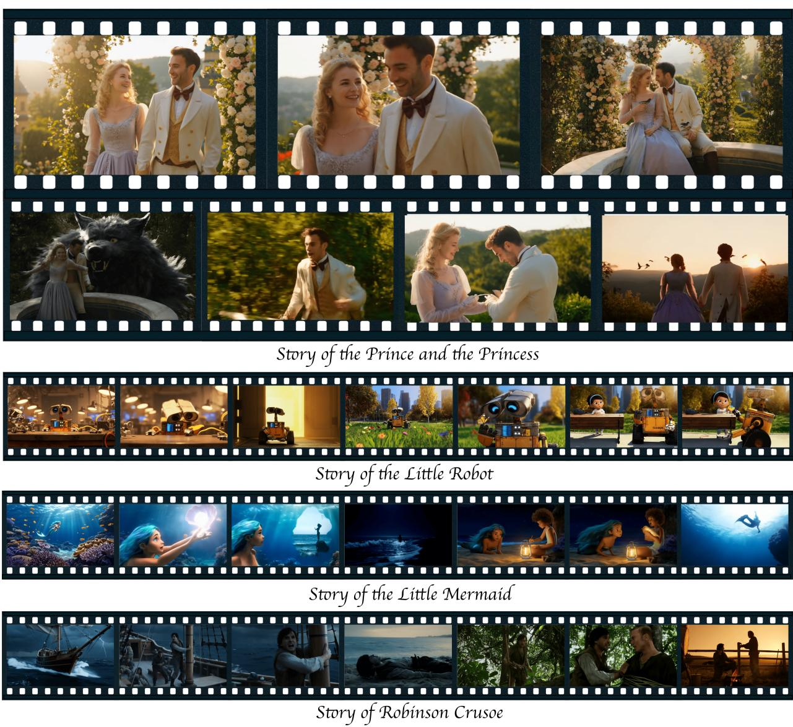
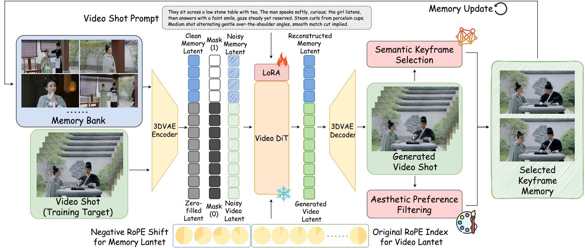
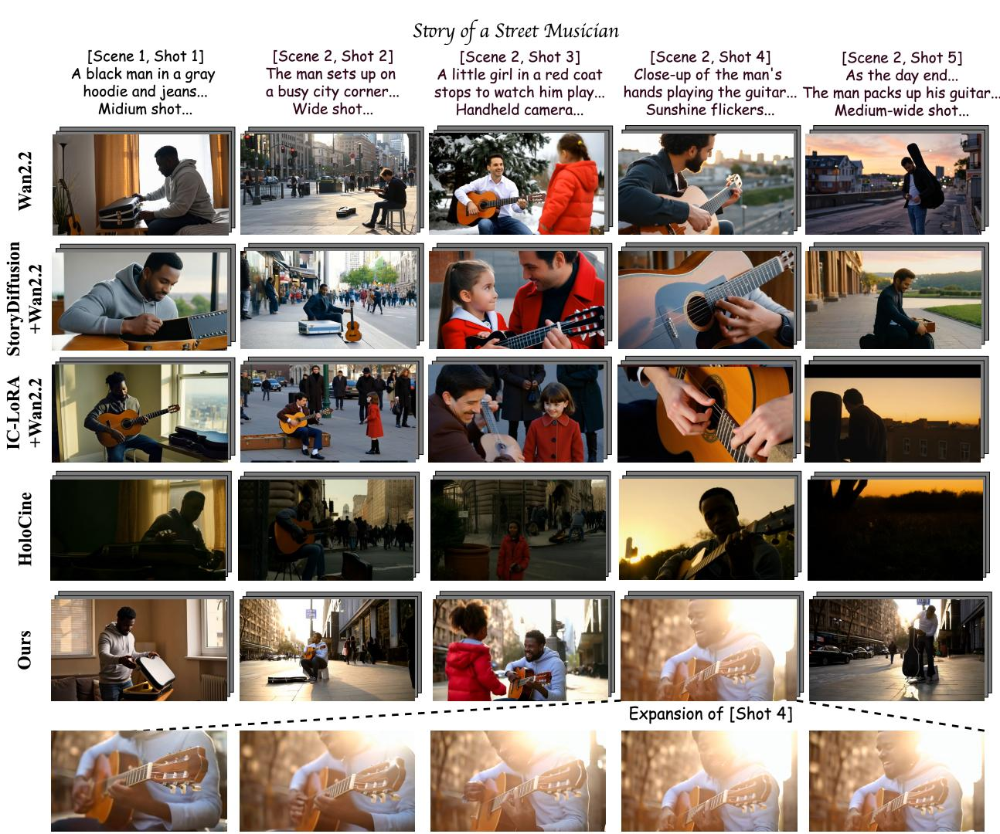
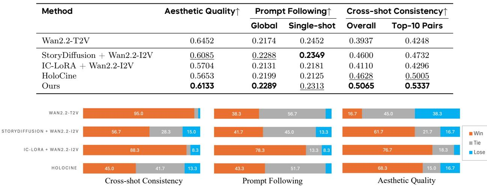
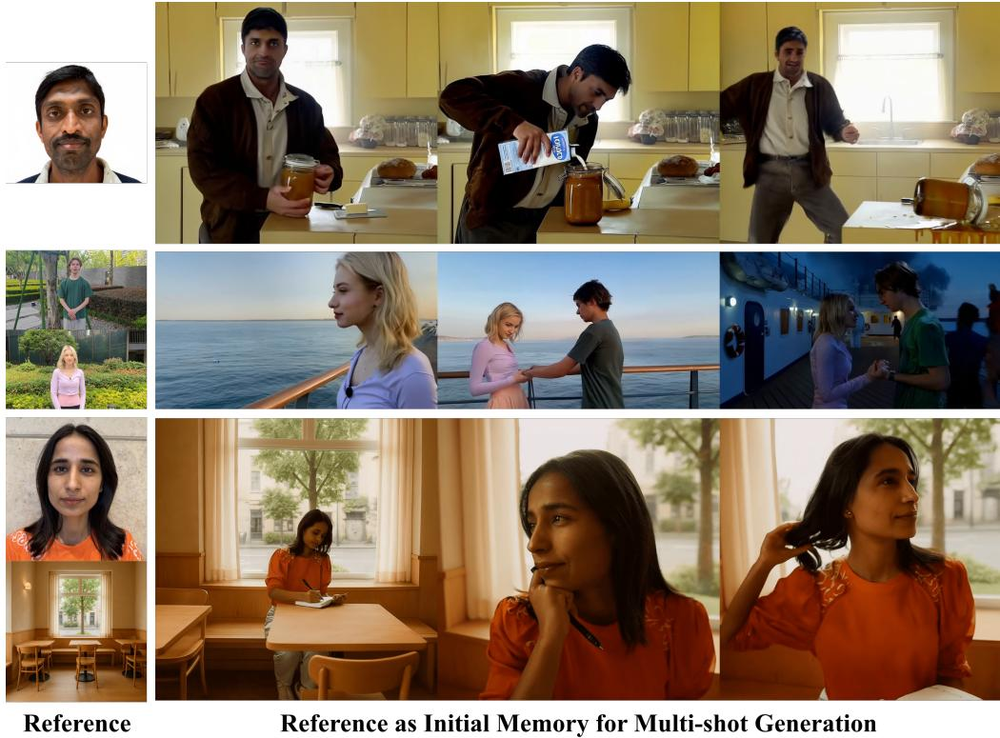
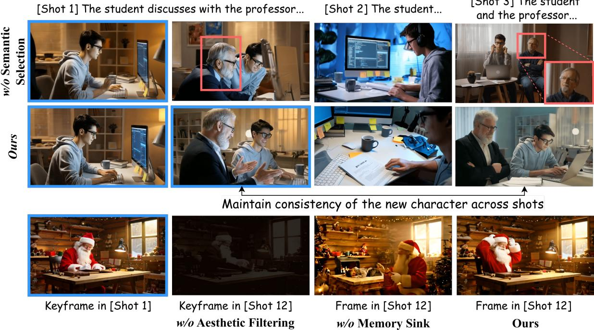
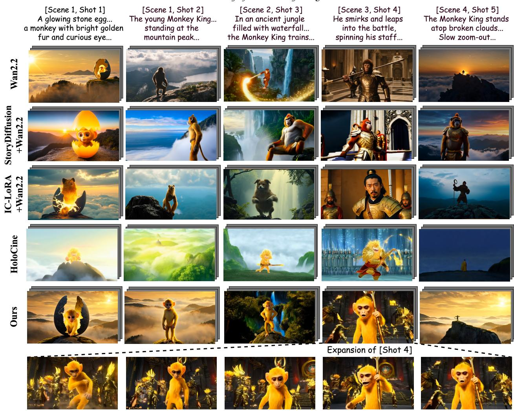
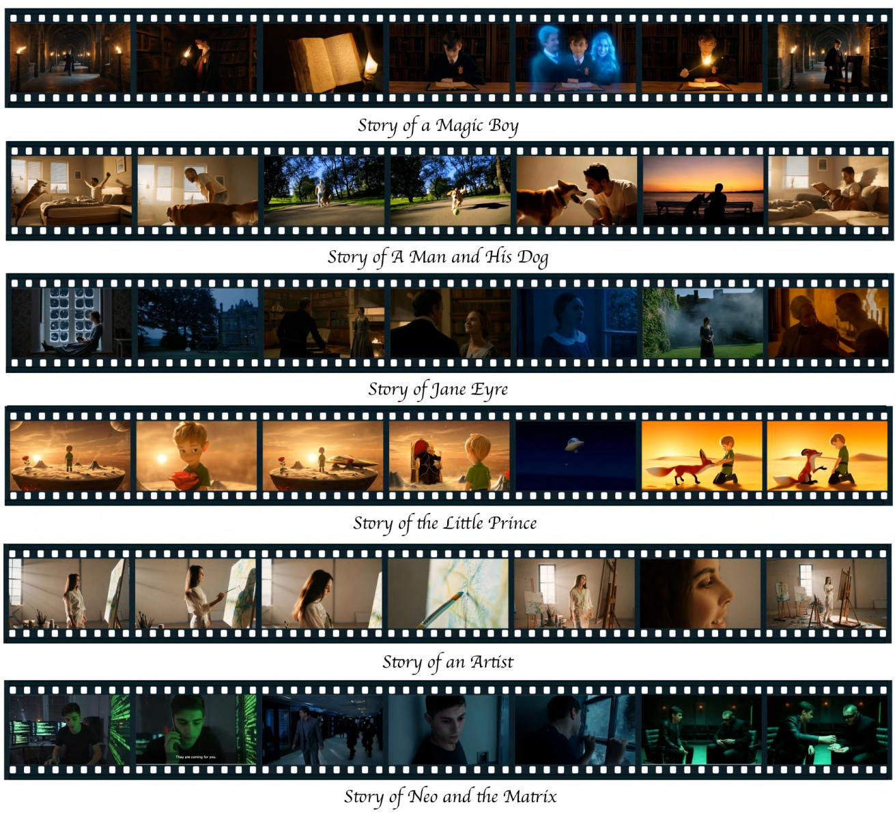
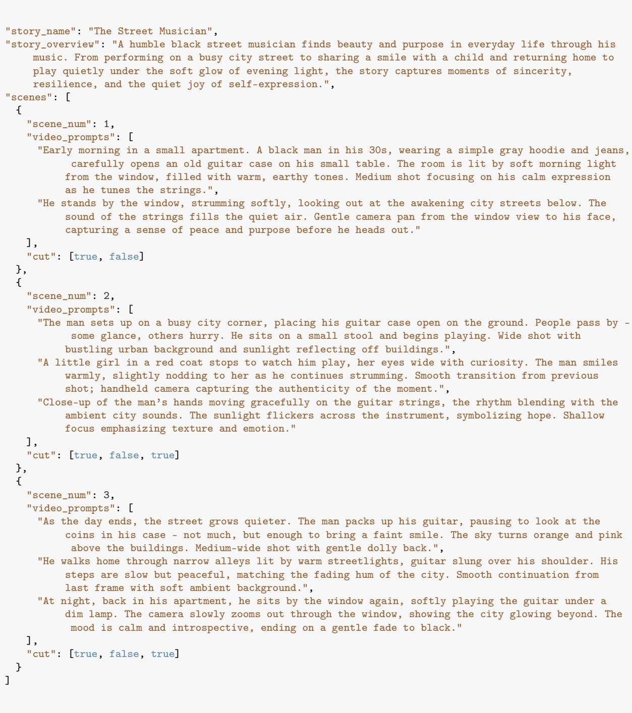

# StoryMem: Multi-shot Long Video Storytelling with Memory

Kaiwen Zhang $^ { 1 , 2 , * }$ , Liming Jiang2†, Angtian Wang2, Jacob Zhiyuan Fang2, Tiancheng $\mathbf { z h i ^ { 2 } }$ , Qing Yan²2, Hao Kang2, Xin Lu²2, Xingang Pan1,3 1S-Lab, Nanyang Technological University, Intelligent Creation, ByteDance \*Work done during internship at ByteDance, †Project Lead, §Corresponding Author

# Abstract

Visual storytelling requires generating multi-shot videos with cinematic quality and long-range consistency. Inspired by human memory, we propose StoryMem, a paradigm that reformulates long-form video storytelling as iterative shot synthesis conditioned on explicit visual memory, transforming pre-trained single-shot video diffusion models into multi-shot storytellers. This is achieved by a novel Memory-to-Video (M2v) design, which maintains a compact and dynamically updated memory bank of keyframes from historical generated shots. The stored memory is then injected into single-shot video diffusion models via latent concatenation and negative RoPE shifts with only LoRA fine-tuning. A semantic keyframe selection strategy, together with aesthetic preference filtering, further ensures informative and stable memory throughout generation. Moreover, the proposed framework naturally accommodates smooth shot transitions and customized story generation application. To facilitate evaluation, we introduce ST-Bench, a diverse benchmark for multi-shot video storytelling. Extensive experiments demonstrate that StoryMem achieves superior cross-shot consistency over previous methods while preserving high aesthetic quality and prompt adherence, marking a significant step toward coherent minute-long video storytelling. Date: December 23, 2025 ProjectPage: https://kevin-thu.github.io/StoryMem

# 1 Introduction

Storytelling is a core expression of human creativity, spanning from cave art to cinema. Recent years have witnesed substantial advances in video diffusion models [, 10, 38], enabling the syntheis of single-shot short videos with near-cinematic visual fidelity [7, 21, 32, 34, 42]. A natural next step is to move beyond isolated clips and enable video models to construct coherent visual narratives. However, genuine storytelling demands multi-layered coherence across shots and scenes, from low-level consistency of characters and environments to high-level alignment of visual style and narrative fow. Achieving such minute-long, multi-shot narrative generation remains a significant challenge.

Existig lutions  intotwomain caters.Ther ateoy odes al hots joitly wihi sigarge video diffusion model. LCT [8], for example, employs full attention with interleaved 3D RoPE [39] to capture cross-shot dependencies, but incurs qadratictraining and inference costs as sequence length grows.Folw-up metho prove efficiency vtoken copreon [47] or sparseattentin [, 17, 31], yet stil reqie laral retrainingon multi-shot videos and oftendegrade visual quality relative to their pretrained single-shot base models. The second one adopts a keyframe-based decoupled pipeline [13, 29, 45, 53, 56]: the first frame of each shot is generated using in-context image models [15, 40, 54] and then expanded into a clip with pretrained image-to-video (I2V) models. Although efficient and leveraging high-quality single-shot models, this independent-shot design lacks temporal awareness, i.e., no context propagates across shots, leading to inconsistent visual details, disconnected scene evolution, and rigid transitions. Consequently, changes such as new character appearances or shifting camera viewpoints cannot be coherently maintained throughout the long video.

  
Figur1 Given a story sript with per-shot text descriptions, StoryMem generates appealing minute-ong, multi-shot iv  uayTro o generation using a memory-conditioned single-shot video diffusion model.

These twolines of research relect a core dilemma in narrative video generation: joint training demand heavy computation and scarce high-quality multi-shot data, while decoupled approaches suffer from inconsistency. In this work, we explore a third path that achieves both high consistency and high efficiency. Our key insight is that high-quality pretrained single-shot video diffusionmodels can be effectively adapted for long-term coherent storytelling when augmented with visual memory. Inspired by how human memory selectively retains salient visual information, we introduce StoryMem, a new paradigm that reformulates long-form video storyteling as iterative shot synthesis conditioned on past keyframes and per-shot descriptions. Central to this paradigm is our Memory-to-Video (M2v) design, a lightweight framework that injects explicit visual memory into single-shot video diffusion models to enforce cross-shot consistency. Instead of training a single monolithic model on long-video data, StoryMem generates stories shot by shot via maintaining a compact memory bank tha stores keyvisul context, e.g characters, scenes, an stylisticcues from previously enerated shot. The memory then serves as a global conditioning signal, guiding subsequent generation toward consistent visual semantics and smooth scene evolution (see Fig. 1).

To realize memory-conditioned generation, we introduce a simple yet effective design that combines memory latent concatenation with a negative RoPE shift, naturally extending pretrained I2V models to capture longterm dependencies and maintain context-level consistency. We further propose a semantic keyframe selection strategy based on CLIP [36] features, along with aesthetic preference filtering via HPSv3 [30], to preserve a compact memory bank that is both informative and reliable. During generation, the memory is dynamically extracted, updated, and injected into the model to guide each new shot. Notably, StoryMem requires only LoRA [12] fine-tuning on semantically coherent short video clips, achieving strong cross-shot consistency without compromising the high visual quality of pretrained single-shot video diffusion models. Beyond textdriven story generation, StoryMem serves as a versatile framework applicable to broader paradigms, enabling natural scene transitions when combined with I2V control, and supporting customized reference-to-video (R2V) generation by incorporating reference images into the memory. To support evaluation and comparison, we introduce ST-Bench, a multi-scene, multi-shot video storytelling benchmark covering diverse complex narratives. Extensive experiments show that StoryMem achieves superior cross-shot consistency while retaining high visual fidelity and strong prompt adherence, surpassing stateof-the-art methods. Our approach marks a significant step toward coherent minute-long video storytelling, bridging the gap between single-shot video diffusion and long-form visual storytelling.

# 2 Related Work

Keyframe-based Story Generation. Prior research on visual storytelling primarily focuses on story image generation [3, 9, 18, 25, 27, 37, 40, 43, 49, 54]. For instance, StoryDiffusion [54] introduces Consistent Self-Attention into a text-to-image (T2I) model [10, 38] to produce character-consistent storyboards. With the emergence of video generation models [1, 7, 20, 21, 32, 34, 42, 50], subsequent works [13, 29, 45, 53, 56] extend image pipelines to videos through an agentic, keyframe-based framework. These methods [13, 29, 45, 53, 56] first generate keyframes using story image models or in-context image editing models [6, 15, 23], then expand them into video clips with image-to-video (I2V) models. However, consistency is guaranteed only at the keyframe level, leaving each shot largely independent and transitions between shots often rigid. In contrast, we introduce a memory-to-video (M2V) framework that generates coherent story videos in a shot-by-shot manner, while preserving contextual information across shots with minimal computational overhead.

Multi-shot Long Video Generation. Beyond keyframe-based storytelling, a parallel line of research targets geeral multi-shot long videogeneration, by fine-tuning pretrained single-shot models (e.g., Wan [42]). LCT [8] pioneers this direction by jointly modeling multi-shot videos using full attention [41] and interleaved 3D RoRE [39], achieving strong cross-shot coherence but incurring quadratic computational cost. Recently, a line of concurrent works follow LCT's framework and improve efficiency via token compression [47] or sparse atein [, 7, 31. However, they requirearge-scale rainion multi-hot  vid data, oten rei in quality degradation compared to their pretrained high-quality single-shot base model. In contrast, our M2V framework requires only lightweight LoRA [12] fine-tuning on short video clips, thereby preserving the visual fidelity of the base model while seamlessly adaptable to other paradigms such as image-to-video (I2V) and reference-to-video (R2V) for customized story generation. Memory Mechanisms in Video Generation. Memory is a fundamental capability of intelligent systems, and has been widely studied in large language models [4, 46, 52]. In contrast, memory mechanisms for video generation remain largely unexplored. Existing attempts introduce memory into video world models through inferencetime training [11], 3D modeling [14, 24], or camera-based memory frame retrieval and cross attention [48, 51]. However, they primarily target spatial consistency under controllable world simulations and rely on auxiliary control inputs such as actions or camera poses, limiting the applicability to general-purpose videogeneration.

  
Figure 2 Overview of StoryMem. StoryMem generates each shot conditioned on a memory bank that stores keams fom previusy nrate shots. Duri eneration, the seecmemory ame are ncoded b 3D VAE, fused with noisy video latents and binary masks, and fed into a LoRA-finetuned memory-conditioned Video DiT to apivo narrative progression. Byerativey enerating shots wihmemory updatesStoryMem produce coherent minue-n, multi-shot story videos.

To the best of our knowledge, we are the first to introduce an explicit memory mechanism into general video generation models. This enables the model to memorize essential characters and background scenes throughout the evolving generation proces, thus maintaining consistency across minute-long generation.

# 3 Methodology

In this section, we present StoryMem, a novel pipeline that builds upon single-shot video diffusion models to address the challenge of coherent multi-shot story generation. We first introduce preliminaries in Sec. 3.1. Then, we formalize the problem in Sec. 3.2, and introduce our proposed Memory-to-Video (M2V) mechanism in Sec. 3.3, which enforces cross-shot consistency via memory-conditioned video generation. Sec. 3.4 further presents our memory extraction and update strategy for applying the fnetuned M2V model to long multi-shot storytelling. Finally, Sec. 3.5 extends M2V to MI2V and MR2V for natural scene transitions and customized control. An overview of StoryMem is shown in Fig. 2.

# 3.1 Preliminary

Video Diffusion Model. Our method is built upon a latent video diffusion model [10, 38, 42]. The diffusion process operates on the video latents $\boldsymbol { z } _ { 0 } = \boldsymbol { \mathcal { E } } ( \boldsymbol { v } ) \in \mathbb { R } ^ { c \times f \times h \times w }$ by encoding RGB video $\boldsymbol { v }$ with 3D VAE [19] encoder $\mathcal { E }$ . The diffusion model learns the distribution of video latents by learning to transform the noise samples $z _ { 1 } = \epsilon \sim \mathcal { N } ( \mathbf { 0 } , \mathbf { I } )$ to target data sample $z _ { 0 }$ in terms of a differential equation:

$$
d z _ { t } = v _ { \Theta } ( z _ { t } , t ) d t , \quad t \in [ 0 , 1 ] ,
$$

where velocity field $\boldsymbol { v } _ { \Theta }$ is parametrized by a neural network $\Theta$ . The network is trained with a velocity prediction loss under the rectified flow [26, 28] formulation:

$$
\begin{array} { r } { z _ { t } = ( 1 - t ) z _ { 0 } + t \epsilon , \quad \epsilon \sim \mathcal { N } ( \mathbf { 0 } , \mathbf { I } ) , \quad } \\ { \mathcal { L } _ { R F } = \mathbb { E } _ { z _ { 0 } , \epsilon , t } \left[ \left\| v _ { \Theta } ( z _ { t } , t ) - ( z _ { 0 } - \epsilon ) \right\| ^ { 2 } \right] . } \end{array}
$$

MoArchitectureToreacciematic-evel qualityweadop stateotheartsingleshot videodifusinode Wan2.2-I2V [42] as our base model, which uses diffusion transformer (DiT) [35] as the velocity prediction network $\Theta$ . Each DiT block contains self-attention for intra-video dependency modeling and cross-attention for text conditioning, and uses 3D Rotary Position Embedding (RoPE) [39] to encode spatial and temporal coordinates. Wan-I2V model further conditions on an first-frame image to guide video synthesis. The image is concatenated with zero-filled frames and encoded by the 3D VAE into a conditional latent $\boldsymbol { z } _ { c } \in \mathbb { R } ^ { c \times f \times h \times w }$ A binary mask $M \in \{ 0 , 1 \} ^ { s \times f \times h \times w }$ indicates which frames are preserved or generated, where $s$ denotes the temporal stride of the 3D VAE, and $F = s \times f$ is the original frame count of the raw video. During the diffusion process, the noisy latent $z _ { t }$ , the conditional latent $z _ { c }$ , and the mask $M$ are concatenated along the channel dimension and fed into the DiT. Our M2V design leverages this mask-guided conditional diffusion architecture, extending the conditioning to keyframe-based memory contexts for multi-shot generation.

# 3.2 Problem Formulation

Give  soy  cnsti   su  textl dtions o  so $\mathcal { T } = \{ t _ { i } \} _ { i = 1 } ^ { N }$ , our goal is to generate a coherent multi-shot narrative video $\mathcal { V } = \{ v _ { i } \} _ { i = 1 } ^ { N }$ . This task can be expressed as learning the conditional distribution:

$$
p _ { \Theta } ( \mathcal { V } \mid \mathcal { T } ) = p _ { \Theta } ( v _ { 1 : N } \mid t _ { 1 : N } ) ,
$$

which captures both the semantic relations among textual prompts and the visual coherence among generated shots. To leverage the strong capability of existing single-shot video diffusion models, we decompose the joint distribution in an autoregressive form, which aligns with the natural progression of stories:

$$
p _ { \Theta } ( \mathcal { V } \mid \mathcal { T } ) = \prod _ { i = 1 } ^ { N } p _ { \Theta } ( v _ { i } \mid v _ { 1 : i - 1 } , \mathcal { T } ) .
$$

However, sincevideoframes containmassivtemporal redundancy,conditioning directl on all past vide shots $v _ { 1 : i - 1 }$ $\mathcal { K } = \{ k _ { i } \} _ { i = 0 } ^ { N }$ with a consistent image generator $p _ { \psi }$ and then independently synthesize each shot with an image-to-video model, i.e.,

$$
p _ { \Theta , \psi } ( \mathcal { V } , K \mid \mathcal { T } ) \approx p _ { \psi } ( \mathcal { K } \mid \mathcal { T } ) \prod _ { i = 1 } ^ { N } p _ { \Theta } ( v _ { i } \mid t _ { i } , k _ { i } ) .
$$

However, this formulation lacks temporal awareness and inherently suffers from limited video context and rigid transitions, failing to capture the evolving narrative across shots. Inspired by human memory, which selectively retains key visual impressions rather than full experiences, we introduce an explicit keyframe-based memory mechanism, where a compact memory $m _ { i }$ stores key visual contexts up to shot $i$ Let $\mathcal { M } = \{ m _ { i } \} _ { i = 0 } ^ { N }$ to unc. y , $m _ { 0 }$ is empty and the first shot is generated solely from its textual description $t _ { 1 }$ , but our framework also support an alternative initialization if desired. The joint distribution $p _ { \Theta , \phi } ( \mathcal { V } , \mathcal { M } \mid \mathcal { T } )$ can be written as:

$$
p _ { \phi } ( m _ { 0 } ) \prod _ { i = 1 } ^ { N } p _ { \Theta } \big ( v _ { i } \mid t _ { i } , m _ { i - 1 } \big ) p _ { \phi } \big ( m _ { i } \mid m _ { i - 1 } , v _ { i } , t _ { i } \big ) ,
$$

where $p _ { \Theta }$ parameterizes the shot-level video generator and $p _ { \phi }$ denotes the memory update mechanism. In our framework, $m _ { i }$ is realized as a small set of keyframes extracted from previous shots, providing explici visual anchors for subsequent generation. The memory update is implemented as a deterministic function:

$$
m _ { i } = f _ { \phi } ( m _ { i - 1 } , v _ { i } ) ,
$$

yielding the simplified factorization:

$$
p _ { \Theta } ( \mathcal { V } \mid \mathcal { T } ) \approx \prod _ { i = 1 } ^ { N } p _ { \Theta } ( v _ { i } \mid t _ { i } , m _ { i - 1 } ) .
$$

This formulation enables memory-based multi-shot generation, where each shot is conditioned on both its textual description and an evolving memory that summarizes characters, scenes, and stylistic information from previous shots, thereby ensuring cross-shot consistency and narrative coherence throughout the entire video.

# 3.3 Memory-to-Video (M2V)

Based on the above formulation, we propose the Memory-to-Video (M2V) mechanism, which realizes the conditional distribution $p _ { \Theta } ( v _ { i } \mid t _ { i } , m _ { i - 1 } )$ via a memory-conditioned video diffusion model with negative RoPE shift.

Memory as Condition. To achieve memory-conditioned video generation, we leverage the architecture design of pretrained image-conditioned video model Wan-I2V. We first encode the memory frames into memory latents $\boldsymbol { z } _ { m } \in \mathbb { R } ^ { c \times f _ { m } \times h \times w }$ using the same 3D VAE encoder $\varepsilon$ used by the base model, where each latent corresponds to one memory frame without temporal compression. These memory latents are concatenated with latents encoded from zero-filled frames along the temporal dimension to form the conditional latent $z _ { c }$ . A binary mmask $M \in \{ 0 , 1 \} ^ { s \times ( f _ { m } + f ) \times h \times w }$ rk   iv the DiT to generate only the unmasked frames. Following the I2V model design, the noisy latent, the memory conditional latent, and the mask is concatenated together along channel dimension and fed into DiT for velocity prediction.

Negative RoPE Shift. Incorporating memory frames into the video sequence raises a positional encoding issue: memory frames are not temporally continuous with the current shot but represent discrete keyframes summarizing past content. To handle this, we leverage the generalizability of 3D RoPE and extend it by assigning negative frame indices to memory latents. Specifically, for a shot with $f$ latent frames and $f _ { m }$ memory frames, the temporal positional indices are defined as $\{ - f _ { m } S , - ( f _ { m } - 1 ) S , \ldots , - S , 0 , 1 , \ldots , f - 1 \} ,$ where $S$ is a fixed ofset indicating the temporal gap between memory latents and video latents. This negative RoPE shift naturally embeds memory frames as preceding events, preserving the original temporal encoding of the current video starting rom zero, whichallows the DiT to seamlessly attend across previous and current contexts within a unified temporal space. Data Curation and Training. Unlike joint modeling methods that rely on multi-shot long sequences, our model can be effectively trained on single-shot videos. To curate memoryvido coherent data, we collct training data from: (1) visually related short clips grouped from cinematic single-shot video datasets by shot-level silariyan h-quali gubjemulscee horvideoshataturalhibictey. Durinri e specpwthinac group is electes targe, wimeomtheris anm sampled as the memory. The model is then trained to reconstruct the target video conditioned on the provided memory frames, following the rectified fow loss used in I2V model (Eq. 3). At inference time, the memory part is discarded and only the newly generated segment is decoded as the video shot.

# 3.4 Memory Extraction and Update

After training, the finetuned M2V model learns to retrieve relevant context from the memory bank following the prompt instruction, generating diverse shots with coherent characters and backgrounds. To apply our M2V model for multi-shot long video generation, we further design a memory update function $f _ { \phi }$ that mimics human memory by preserving representative, meaningful moments and discarding redundancy. To this end, we propose a memory frame extraction strategy that selects semantically important and aesthetically reliable keyframes as memory. Semantic Keyframe Selection. For eac generated shot, we aim to identiy a small set of distinct keyframes as memory. To capture frame-wise semantics, we compute CLIP [36] embeddings for all frames and sequentially select keyframes:the first frame is fixed, and each subsequent frame is compared with the latest keyframe via cosine similarity. A new keyframe is added when the similarity drops below a dynamic threshold, which starts low and increases if the number of selected frames exceeds a preset upper bound. This adaptive strategy removes redundancy while preserving diverse visual context for memory construction. Aesthetic Preference Filtering.While semantic selection effectively identifes distinct content, it does no guarante mage quality blureor nyames fromvideos with largemotion maybe wrongy elecd as keyframes, providing limited contextual guidance. We address this by further fltering using the HPSv3 [30] as aesthetic reward model, ensuring clear and visually reliable memories.

  
Figure 3 Qualitative comparison. Our StoryMem generates coherent multi-scene, multi-shot story videos aligned w per-ho eptions.n ontrast,he reraimode ankeambasbaselnes  preeveo character and scene consistency, while HoloCine [31] exhibits noticeable degradation in visual quality.

Multi-shot Long Video Generation. Integrating the above components, we use the M2V model for multi-shot generation with a dynamic memory bank that updates keyframes across shots. After generating each shot $v _ { i }$ we compare its extracted keyframes with existing memories in CLIP [36] space and add only semantically distinct ones, updating $m _ { i - 1 }$ to $m _ { i }$ . To prevent uncontrolled growth of memory bank, we adopt a hybrid memory-sink $^ +$ sliding-window strategy: early keyframes are fixed as long-term anchors preserving the global consistency, while recent ones form a short-term window capturing local dependencies. If the capacity lmit is reached, the oldest short-term memories are discarded. If desired, human creators or large visionlanguage models can further review and refine the selected keyframes for finer story-specific control, although this option is not used in our results.

# 3.5 Extension to MI2V and MR2V

As mentioned in Sec. 3.2, our framework provides a flexible design space and can be seamlessly adaptable with other orthogonal video generation paradigms.

  
Figur4User study.Our method is consistently prefered over all baselines in most dimensions, highlighting its supuloeaivcehaus preethe Tie indicates no significant preference, and Lose indicates that users prefer the baseline.

One important design choice is to combine M2V with I2V. While the memory-conditioned paradigm ffectively addresses cross-shot consistency, the transitions between shots may still appear unnatural when concatenated intoa long video, and sometimes leading to non-causal motions.A practical solution is to include a scene-ut indicator the storyscrptallowin he cript creator (LLMoruman) t decide whether scne cut hould o between each two adjacent shots. If no cut is specifed, the model reuses the last frame of the previous shot as the first frame of the next one, achieving smoother and more natural continuity. Another application is to personalize the initialization of the memory state $m _ { 0 }$ . For instance, users can provide character or background reference images as the initil memory, enabling customized multi-shot video generation.

# 4 Experiments

# 4.1 Implementation Details

Our framework is built upon the state-of-the-art open-source video generation model Wan2.2-I2V-A14B [42] with 14B active parameters. We finetune it using a rank-128 LoRA applied to allinear layers in the DiT blocks, adding ${ \sim } 0 . 7 \mathrm { B }$ active parameters.. The M2V model is trained on a curated dataset of 400K five-second single-shot videos, where each clip is matched with 15 semantically coherent videos. During training, the memory length is randomly sampled from 1-10 frames, and the negative RoPE shift offset $S$ is set to 5. During inference, we use a memory sink size of 3 frames, a per-shot keyframe limit of 3, an initial semantic similarity threshold of 0.9, and an aesthetic score threshold of 3.0.

# 4.2 ST-Bench

Multi-shot long video storytelling remains a relatively new and underexplored research area, with no standard evaluation benchmark. The most relevant open benchmark, ViStoryBench [55], focuses on storyboard image generation, making it unsuitable for our video generation task. To comprehensively evaluate our method, we establish a new multi-scene, multi-shot story video generation benchmark, termed ST-Bench. We prompt GPT-5 [33] to create 30 long story scripts spanning diverse styles, each containing a story overview, 812 shot-level text prompts, corresponding frst-frame prompts (only for two-stage keyframe-based methods), and scene-cut indicators. In total, ST-Bench provides 300 detailed video prompts describing characters, scenes, dynamic events, shot types, and possibly camera movements. More details about ST-Bench are presented in Appendix B. We hope this benchmark can facilitate future research in long-form story video generation.

  
FuR ults.SorMemnable si soviatinus eeae  h memory. The real-person reference images were used with proper consent from the individuals involved.

# 4.3 Evaluation

Basli Setup.To demonstrate the superiorityf StoryMem, we follow the evaluation protocol of HoloCine [31] and compare StoryMem with three representative paradigms of multi-shot long video generation: (1) a pretrained video diffusion model, Wan2.2-T2V-A14B, applied independently to each shot, serving as a reference for single-shot quality; (2) two-stage keyframe-based approaches, StoryDiffusion [54] and IC-LoRA [15], with keyframes expanded using Wan2.2-I2V-A14B; and (3) the state-of-the-art joint multi-shot model HoloCine [31], which finetunes Wan2.2-T2V-A14B for holistic one-minute video generation. For compatibility, prompts in ST-Bench are converted to HoloCine's required format using GPT-5. Qualitative Results. We provide a qualitative comparison to illustrate the superiority of our method. As shown in Fig. 3, our StoryMem generates coherent multi-shot story videos that closely follow the per-shot descriptions while maintaining high visual fdelity. The character's identity, appearance and outfits remain consistent across different scenes and shots. Notably, in [Shot 5], our model effectively retrieves contextual information from [Shot 2], producing highly consistent street scenes even after multiple shot transitions. In contrast, the pretrained model and keyframe-based baselines fail to preserve long-term consistency (e.g., mismatched character identity, alteredoutfits, inconsistent street appearance), and HoloCine exhibits notable degradation in visual quality. Additional qualitative examples are provided in Appendix A. Quantitative Results. Following previous works [8, 31], we evaluate all methods across three aspects: (1) Aesthetic Quality is measured using the LAION aesthetic predictor adopted in VBench [16], refecting visual appeal including color harmony, realism, and naturalness. (2) Prompt Following is assessed with ViCLIP [44] by comparing generated videos with the story scripts; the global score computes the cosine similarity between the entire multi-shot video and the story overview, while the single-shot score compares each shot with its corresponding prompt. (3) Cross-shot Consistency is computed as the mean ViCLIP similarity across all shot pairs. Since different shots may depict distinct characters or scenes, we additionally report a Top-10 Consistency score by averaging the ten most relevant shot pairs selected via their prompt feature similarities.

  
[Shot 3] The student   
Figur6Ablation study. Top:our method ectively preserves newly merged characer consisency.Bottom:u method can maintain long-term visual fidelity. The selected keyframe in [Shot 1] is highlighted in blue box.

Tab. 1 reports the quantitative results of all methods on ST-Bench. Our method surpasses all baselines in Cross-shot Consistency metrics by a large margin, outperforming the base model by $2 8 . 7 \%$ and the previous state-of-the-art HoloCine by $9 . 4 \%$ in overall consistency. This highlights the strength of our memoryconditioned design in maintaining long-range coherence across shots. Our approach also attains strong performance in both Aesthetic Quality and Prompt Following, achieving the highest aesthetic score and the best global semantic alignment among all consistent video generation methods. Although the single-shot prompt following score is sightly lower, this is expected underour MI2 setting which introduces addiional control to achiev moother an morenatural shot transitions,andmay sghtl constrain single-shot alm. User Study. Video storytelling is a complex and human-centered task. Existing metrics cannot fully capture aspects such as character-level cross-shot consistency or the naturalness of shot transitions. Therefore, we additionally conduct a comprehensive user study, where human evaluators compare our generated results against each baseline in pairwise settings. As shown in Fig. 4, our results are strongly preferred over all baselines across most evaluation dimensions. Although the pretrained Wan2.2 model performs well on singleshot quality due to its independent shot generation setting, it lacks consistency mechanisms and performs significantly worse on other dimensions. Extended Application. Thanks to the flexible design of our memory-conditioned framework, StoryMem can also supportcustomized story generation by treating referenceimages s the nital memory, s shown inFig. . Compared with conventional reference-based methods, our approach enables natural narrative progression by both preserving newly generated scenes and selectively leveraging relevant context stored in memory. Our framework is also compatible with other specialized reference-preserving techniques, which is not the focuso our work.

# 4.4 Ablation Study

We conduc ablation studis to validatethe effectiveness four proposed techniques.To evaluate ur sanic keyframe selection, we compare it with a naive strategy that always selects the first generated frame of each shot as memory. As shown in the top example of Fig. 6, this naive choice fails to capture newly introduced characters (e.g., the professor) within video shots, leading to inconsistent appearance and outfts. To assess Table 2 Ablation study. We study the effectiveness of each proposed techniques in StoryMem.   

<table><tr><td rowspan="2">Method</td><td rowspan="2">Aesthetic Quality↑</td><td colspan="2">Prompt Following↑</td><td colspan="2">Cross-shot Consistency↑</td></tr><tr><td>Global</td><td>Single-shot</td><td>Overall</td><td>Top-10 Pairs</td></tr><tr><td>w/o Semantic Selection</td><td>0.6076</td><td>0.2257</td><td>0.2295</td><td>0.4878</td><td>0.5287</td></tr><tr><td>w/o Aesthetic Filtering</td><td>0.6018</td><td>0.2251</td><td>0.2313</td><td>0.4844</td><td>0.5330</td></tr><tr><td>w/o Memory Sink</td><td>0.6093</td><td>0.2277</td><td>0.2330</td><td>0.4891</td><td>0.5241</td></tr><tr><td>Ours</td><td>0.6133</td><td>0.2289</td><td>0.2313</td><td>0.5065</td><td>0.5337</td></tr></table>

Sheldon sits in a classroom full of older kids, wearing a bow tie and plaid shirt. He raises his hand... Sheldon confidently explains the answer on the chalkboard with neat handwriting.. Sheldon sits alone under a tree, reading a physics book while other kids play soccer...

  
Improves consistency when character details are explicitly specified in each shot prompt

  
Figure7 Limitation. Top: Our method may struggle to preserve consistency in complex multi-character scenarios where pure visual memory becomes ambiguous.Bottom: Explicitly providing character details in each shot prompt will mitigate the problem.

the importance of aesthetic fltering, we remove this step durin memory extraction. The bottom examplein Fig. 6 shows that without aesthetic fltering, the semantic selection becomes noise-sensitive and may include lowqualityrniormativerames, resulting inthe lwest aestheti score  Tab.Finally, to examihe memory sink mechanism, we replace it with a full sliding-window strategy once the memory bank is full. This leads to degradation in long-range visual fidelity, whereas our method preserves high quality and consistency in minute-scale generation. Overall, as shown in Tab. 2, our method achieves the best performance across most metrics, with only a slight drop in single-shot prompt following due to the additional initial-memory constraints.

# 5 Conclusion

We presented StoryMem, a paradigm for coherent multi-shot long video storytelling. To this end, we introduced a Memory-to-Video (M2V) framework, which augments single-shot diffusion models with explicit visual memory through latent concatenation, negative RoPE shifts, and lightweight LoRA fine-tuning. Combined with a delicate memory extraction and update strategy, StoryMem enables shot-by-shot synthesis of minute-long narrative videos. Extensive experiments show that StoryMem outperforms state-of-the-art methods, delivering robust cross-shot coherence while preserving aesthetic quality and prompt adherence. While effective, StoryMem may still struggle in complex multi-character scenarios where pure visual memory becomes ambiguous, and in achieving fully smooth transitions when adjacent shots exhibit large motion discrepancies. Future work will explore more structured, entity-aware memory representations and improved transition modeling to better support rich and fuid narratives.

References   
[1] A. Blattmann, Tim Dockhorn, Sumith Kulal, Daniel Mendelevitch, Maciej Kilian, and Dominik Lorenz. Stable video difusion: Scaling latent video difusion models to large datasets. ArXiv, abs/2311.15127, 2023. URL https://api.semanticscholar.org/CorpusID:265312551.   
[2] Shengqu Cai, Ceyuan Yang, Lvmin Zhang, Yuwei Guo, Junfei Xiao, Ziyan Yang, Yinghao Xu, Zhenheng Yang, Alan L. Yuille, Leonidas J. Guibas, Maneesh Agrawala, Lu Jiang, and Gordon Wetzstein. Mixture of contexts for long video generation. ArXiv, abs/2508.21058, 2025. URL https://api.semanticscholar.org/CorpusID: 280950315.   
[3] David Dinkevich, Matan Levy, Omri Avrahami, Dvir Samuel, and Dani Lischinski. Story2board: A training-free approach for expressive storyboard generation. ArXiv, abs/2508.09983, 2025. URL https://apiemanticschoar. org/CorpusID:280642114.   
[4] Yiming Du, Wenyu Huang, Danna Zheng, Zhaowei Wang, Sbastien Montella, Mirella Lapata, Kam-Fai Wong, and Jeff Z. Pan. Rethinking memory inai: Taxonomy, operations, topics, and future directions. ArXiv, abs/2505.00675, 2025. URL https://api.semanticscholar.org/CorpusID:278237720.   
[5] Patrick Esser, Sumith Kulal, A. Blattmann, Rahim Entezari, Jonas Muller, Harry Saini, Yam Levi, Domink Lorenz, Axel Sauer, Frederic Boesel, Dustin Podell, Tim Dockhorn, Zion English, Kyle Lacey, Alex Goodwin, Yannik Marek, and Robin Rombach. Scaling rectified fow transformers for high-resolution image synthesis. ArXiv, abs/2403.03206, 2024. URL https://api.semanticscholar.org/CorpusID:268247980.   
[6] Google Deepmind. Gemini 2.5 fash image (nano banana): Create and edit images with gemini. https: //deepmind.google/models/gemini/image, 2025.   
[7] Google Deepmind. Veo3 video model. https://deepmind.google/models/veo/, 2025.   
[8] Yuwei Guo, Ceyuan Yang, Ziyan Yang, Zhibei Ma, Zhijie Lin, Zhenheng Yang, Dahua Lin, and Lu Jiang. Long context tuning for video generation. ArXiv, abs/2503.10589, 2025. URL https://api.semanticscholar.org/ CorpusID:276961453.   
[9] Huiguo He, Huan Yang, Zixi Tuo, Yuan Zhou, Qiuyue Wang, Yuhang Zhang, Zeyu Liu, Wenhao Huang, Hongyang Chao, and Jian Yin. Dreamstory: Open-domain story visualization by llm-guided multi-subject consistent diffusion. IEEE transactions on pattern analysis and machine intelligence, PP, 2024. URL https: //api.semanticscholar.org/CorpusID:271270047.   
[10] Jonathan Ho, Ajay Jain, and P. Abbeel. Denoising diffusin probabilstic models. ArXiv, abs/2006.11239, 2020. URL https://api.semanticscholar.org/CorpusID:219955663.   
[11] Yinig Hong, Beide Liu, Maxine Wu, Yuanho Zhai, Kai-Wei Chang, Lingjie Li, Kevin Qinghong Lin, Chung-Ching LinJiang WangZhengnYng Yin Wu and Lijun Wanows-venloastear orctndriven long video generation. ArXiv, abs/2410.23277, 2024. URL https://api.semanticscholar.org/CorpusID: 273696012.   
[12] J. Edward Hu, Yelong Shen, Phillip Walls, Zeyuan Allen-Zhu, Yuanzhi Li, Shean Wang, and Weizhu Chen. Lora: Low-rank adaptation of large language models. ArXiv, abs/2106.09685, 2021. URL https: //api.semanticscholar.org/CorpusID:235458009.   
[3] Panwen Hu, Jin Jiang, Jianqi Chen, Minei Han, Shengai Liao, XiaojuChang, and Xiaodan Liang.Storagnt: Customized storytellng video generation via multi-agent collaboration. ArXiv, abs/2411.04925, 2024. URL https://api.semanticscholar.org/CorpusID:273878062.   
[14] Junc Huang, Xintng Hu, Boyo Han, Shaosuai Shi, Zhuoo Tian, Tianyu He, and Li Jiang Memyorcin: Spatio-temporal memory for consistent scene generation on minecraft, 2025. URL https://arxiv.org/abs/2510. 03198.   
[15] Lianghua Huang, Wei Wang, Zhigang Wu, Yupeng Shi, Huanzhang Dou, Chen Liang, Yutong Feng, Yu Liu, and Jingren Zhou. In-context lora for diffusion transformers. ArXiv, abs/2410.23775, 2024. URL https: //api.semanticscholar.org/CorpusID:273707547.   
[16] Ziqi Huang, Yinan He, Jiashuo Yu, Fan Zhang, Chenyang Si, Yuming Jiang, Yuanhan Zhang, Tianxing Wu, Qingyang Jin, Nattapol Chanpaisit, Yaohui Wang, Xinyuan Chen, Limin Wang, Dahua Lin, Yu Qiao, and Ziwei

Liu. VBench: Comprehensive benchmark suite for video generative models. In Proceedings of the IEEE/CVF Conference on Computer Vision and Pattern Recognition, 2024. [17] Weinan Jia, Yuning Lu, Mengqi Huang, Hualiang Wang, Binyuan Huang, Nan Chen, Mu Liu, Jidong Jiang, and Zhendong Mao. Moga: Mixture-of-groups attention for end-to-end long video generation, 2025. URL https://arxiv.org/abs/2510.18692. [18] Jia ju Mao, Xioke Huang, Yunfei Xie, Yuanqi Chang, Mude Hui, Bingje Xu, and Yuyin Zhou. Story-adapter: A training-free iterative framework for long story visualization. ArXiv, abs/2410.06244, 2024. URL https: //api.semanticscholar.org/CorpusID:273227855. [19] Diederik P. Kingma and Max Welling. Auto-encoding variational bayes. ICLR, abs/1312.6114, 2014. URL https://api.semanticscholar.org/CorpusID:216078090. [20] Weijie Kong, Qi Tian, Zijian Zhang, Rox Min, ZuozhuoDai, Jin Zhou, Jia-Liang Xiong, Xin Li, Bo Wu, Jianwei Zhang, Kathrina Wu, Qin Lin, Junkun Yuan, Yanxin Long, Aladdin Wang, Andong Wang, Changlin Li, Duojun Huang, Fan Yang, Hao Tan, Hongmei Wang, Jacob Song, Jiawang Bai, Jianbing Wu, Jinbao Xue, Joey Wang, Kai Wang, Mengyang Liu, Peng-Yu Li, Shuai Li, Weiyan Wang, Wenqing Yu, Xi Deng, Yang Li, Yi Chen, Yutao Cui, Yuanbo Peng, Zhen Yu, Zhiyu He, Zhiyong Xu, Zixiang Zhou, Z. Xu, Yang-Dan Tao, Qinglin Lu, Songtao Liu, Daquan Zhou, Hongfa Wang, Yong Yang, Di Wang, Yuhong Liu, Jie Jiang, and Caesar Zhong. Hunyuanvideo: A systematic framework for large video generative models. ArXiv, abs/2412.03603, 2024. URL https://api.semanticscholar.org/CorpusID:274514554. [21] Kuaishou. Kling video model. https://kling.kuaishou.com, 2025. [22] Black Forest Labs. Flux. https://github.com/black-forest-labs/flux, 2024. [3] Black Forest Labs, StepheBatiol,A.Blattn,FredercBoesel aksham Consul, yril Diagne, Tim Dockn, Jack English, Zion English, Patrick Esser, Sumith Kulal, Kyle Lacey, Yam Levi, Cheng Li, Dominik Lorenz, Jonas Muller, Dustin Podel, Robin Rombach, Harry Saini, Axel Sauer, and Luke Smith. Flux.1 kontext: Flow matching for in-context image generation and editing in latent space. ArXiv, abs/2506.15742, 2025. URL https://api.semanticscholar.org/CorpusID:279464475. [] Runja Li, Philip H. S. Torr, Andrea Vedaldi, and Tomas Jakab.Vmem:Consistent interactive video scene generation with surfel-indexed view memory. ArXiv, abs/2506.18903, 2025. URL https://api.semanticscholar. org/CorpusID:279999602. [25] Yitong Li, Zhe Gan, Yelong Shen, Jinging Liu, Yu Cheng, Yuexin Wu, Lawrence Carin, David Edwin Carson, and Jianfeng Gao. Storygan: A sequential conditional gan for story visualization. CVPR, 2019. [26] Yaron Lipman, Ricky T. Q. Chen, Heli Ben-Hamu, Maximilian Nickel, and Mat Le. Flow matching for generative modeling. ArXiv, abs/2210.02747, 2022. URL https://api.semanticscholar.org/CorpusID:252734897. [27] Chang Liu, Haoning Wu, Yujie Zhong, Xiaoyu Zhang, and Weidi Xie. Intelligent grimm - open-ended visual storytelling via latent diffusion models. CVPR, 2024. URL https://api.semanticscholar.org/CorpusID: 258999141. [8 XiL Che GonganQaLFlo rndsLeandn rectified flow. ArXiv, abs/2209.03003, 2022. URL https://api.semanticscholar.org/CorpusID:25211177. [29] Fuchen Long, Zhaofan Qiu, Ting Yao, and Tao Mei. Vidostudio: Generating consistet-content and multi-scene videos. In ECCV, 2024. URL https://api.semanticscholar.org/CorpusID:266725702. [30] Yuhang Ma, Xiaoshi Wu, Keqiang Sun, and Hongsheng Li. Hpsv3: Towards wide-spectrum human preference score, 2025. URL https://arxiv.org/abs/2508.03789. [31] Yihao Meng, Hao Ouyang, Yue Yu, Qiuyu Wang, Wen Wang, Ka Leong Cheng, Hanlin Wang, Yixuan Li, Cheng Chen, Yanhong Zeng, Yujun Shen, and Huamin Qu. Holocine: Holistic generation of cinematic multi-shot long video narratives. arXiv preprint arXiv:2510.20822, 2025. [32] OpenAI. Video generation models as world simulators. https://openai.com/research/ video-generation-models-as-world-simulators, 2024. [33] OpenAI. Gpt-5 model. https://openai.com/gpt-5, 2025. [34] OpenAI. Sora2 video model. https://openai.com/research/sora-2, 2025.

[35] William S. Peebles and Saining Xie. Scalable difusion models with transformers. ICCV, pages 41724182, 2023. URL https://api.semanticscholar.org/CorpusID:254854389.   
[36] Alec Radford, Jong Wook Kim, Chris Hallacy, Aditya Ramesh, Gabriel Goh, Sandhini Agarwal, Girish Sastry, AmndAskel Pamel Mishki, JackClark, GretcheKrueer and  SutskeverLearg tranerablevisual models from natural language supervision. 2021. URL https://api.semanticscholar.org/CorpusID:231591445.   
[TanzilaRahmn, Hsin-Ying Lee, JanRen, S.Tulyakov, ShwtaMahajan, and Leonid Sigal Make-a-story:Visual memory conditioned consistent story generation. CVPR, 2023.   
[38] Robin Rombach, A. Blattmann, Dominik Lorenz, Patrick Esser, and Björn Ommer. High-resolution image synthesis with latent diffusion models. CVPR, pages 1067410685, 2022. URL https://api.semanticscholar. org/CorpusID:245335280.   
[9Janu,YuLu, She an, Bo We, nd un LRoo:ho  roa embedding. ArXiv, abs/2104.09864, 2021. URL https://api.semanticscholar.org/CorpusID:233307138.   
[40] Yoad Tewel, Omri Kaduri, Rinon Gal, Yoni Kasten, Lior Wolf, Gal Chechik, and Yuval Atzmon. Training-free consistent text-to-image generation. ACM Transactions on Graphics (TOG), 43:1  18, 2024. URL https: //api.semanticscholar.org/CorpusID:267412997.   
[1shishVswani Noa. Shazeer, NikiParmar, Jakob Uszkort, Lion JoeAidan. ome, LukKi, a Illia Polosukhin.Attention is all you need 2017.URL https://apiemanticscholar.org/CorpusID:13756489.   
[42] Team Wan, Ang Wang, Baole Ai, Bin Wen, Chaojie Mao, Chen-Wei Xie, Di Chen, Feiwu Yu, Haiming Zhao, Jiaxio Yang, Jianyuan Zeng, Jiayu Wang, Jingeng Zhang, Jingren Zhou, Jinkai Wang, Jixuan Chen, Kai Zhu, Kang Zhao, Keyu Yan, Lianghua Huang, Mengyang Feng, Ningyi Zhang, Pandeng Li, Pingyu Wu, Ruihang Chu, Ruili Feng, Shiwei Zhang, Siyang Sun, Tao Fang, Tianxing Wang, Tianyi Gui, Tingyu Weng, Tong Shen, Wei Lin, Wei Wang, Wei Wang, Wenmeng Zhou, Wente Wang, Wenting Shen, Wenyuan Yu, Xianzhong Shi, Xio Huang, Xin Xu, Yan Kou, Yangyu Lv, Yifei Li, Yijng Liu, Yimi Wang, Yingya Zhang, Ytong Huang, Yong Li, You Wu, Yu Liu, Yulin Pan, Yun Zheng, Yuntao Hong, Yupeng Shi, Yutong Feng, Zeyinzi Jiang, Zhen Han, Zhi-Fan Wu, and Ziyu Liu. Wan: Open and advanced large-scale video generative models. arXiv preprint arXiv:2503.20314, 2025.   
[43] Mengyu Wang, Henghui Ding, Jianing Peng, Yao Zhao, Yunpeng Chen, and Yunchao Wei. Characonsist: Fine-grained consistent character generation. ICCV, 2025.URL https://api.semanticscholar.org/CorpusID: 280296701.   
[44] Yi Wang, Yinan He, Yizuo Li, Kunchang Li, Jashuo Yu, Xin Ma, Xinhao Li, Guo Chen, Xinyuan Chen, Yaohui Wang, et al. Internvid:A large-scale video-text dataset for multimodal understanding and generation. In The Twelfth International Conference on Learning Representations, 2023.   
[5] Weija Wu, Zeyu Zhu, and Mike Zheng Shou. Automated movie generation via multi-agent cot planning. ArXiv, abs/2503.07314, 2025. URL https://api.semanticscholar.org/CorpusID:276929150.   
[46 Yaxiong Wu, Sheng Liang, Chen Zhang, Yichao Wang, Yongye Zhang, Huifeng Guo, Ruimig Tang, and Yong Liu. From human memory to ai memory: A survey on memory mechanisms in the era of llms. ArXiv, abs/2504.15965, 2025. URL https://api.semanticscholar.org/CorpusID:277993681.   
[47] Junfei Xiao, Ceyuan Yang, Lvmin Zhang, Shengqu Cai, Yang Zhao, Yuwei Guo, Gordon Wetzstein, Maneesh Agrawala, Alan L. Yuille, and Lu Jiang. Captain cinema Towards short movie generation. ArXiv, abs/2507.1834, 2025. URL https://api.semanticscholar.org/CorpusID:280017397.   
[48] Zeqi Xiao, Yushi Lan, Yifan Zhou, Wenqi Ouyang, Shuai Yang, Yanhong Zeng, and Xingang Pan. Worldmem: Long-term consistent world simulation with memory. ArXiv, abs/2504.12369, 2025. URL https: //api.semanticscholar.org/CorpusID:277857150.   
[49] Shuai Yang, Yuying Ge, Yang Li, Yukang Chen, Yixiao Ge, Ying Shan, and Yingcong Chen. Seed-story: Multimodal long story generation with large language model. ArXiv, abs/2407.08683, 2024. URL https: //api.semanticscholar.org/CorpusID:271097376.   
[50] Zhuoyi Yang, Jiayan Teng, Wendi Zheng, Ming Ding, Shiyu Huang, Jiazheng Xu, Yuanming Yang, Wenyi Hong, Xiaohan Zhang, Guanyu Feng, Da Yin, Xiaotao Gu, Yuxuan Zhang, Weihan Wang, Yean Cheng, Ting Liu, Bin Xu, Yuxio Dong, and Jie Tang.Cogvideox: Text-to-video diffusion models with an expert transformer. ArXiv, abs/2408.06072, 2024. URL https://api.semanticscholar.org/CorpusID:271855655.   
[51 Jiwen Yu, Jianhong Bai,Yiran in, Quande Liu, Xint Wang,Pengei Wan, Di Zhang, and Xihui Liuontext as memory: Scene-consistent interactive long video generation with memory retrieval. ArXiv, abs/2506.03141, 2025. URL https://api.semanticscholar.org/CorpusID:279119340.   
[52] Zeyu Zhang, Quanyu Dai, Xiaohe Bo, Chen Ma, Rui Li, Xu Chen, Jieming Zhu, Zhenhua Dong, and Ji-Rong Wen. A survey on the memory mechanism of large language model-based agents. ACM Transactions on Information Systems, 43:1-47, 2024. URL https://api.semanticscholar.org/CorpusID:269293320.   
[53] Canyu Zhao, Mingyu Liu, Wen Wang, Jian wei Yuan, Hao Chen, Bo Zhang, and Chunhua Shen. Moviedreamer: Hierarchical generation for coherent long visual sequence. ArXiv, abs/2407.16655, 2024. URL https://api. semanticscholar.org/CorpusID:271334414.   
[54] Yupeng Zhou, Daquan Zhou, Ming-Ming Cheng, Jiashi Feng, and Qibin Hou. Storydiffusion: Consistent selfattention for long-range image and video generation. abs/2405.01434, 2024. URL https://apisemanticscholar. org/CorpusID:269502120.   
[55] Cailn Zhuang, Ailn Huang, Wei Cheng, Jinwei Wu, Yoqi Hu, Jiaqi Liao, Honguan Wang, Xinyo Liao, Weiei Cai, Hengyuan Xu, et al. Vistorybench: Comprehensive benchmark suite for story visualization. arXiv preprint arxiv:2505.24862, 2025.   
[56] Shaobin Zhuang, Kunchang Li, Xinyuan Chen, Yaohui Wang, Ziwei Liu, Yu Qiao, and Yali Wang. Vlogger: Make your dream a vlog. CVPR, pages 88068817, 2024. URL https://api.semanticscholar.org/CorpusID: 267028492.

# Appendix

# A More Qualitative Results

Here we present additional qualitative results to further demonstrate the effectiveness of StoryMem. Fig. 8 provides anotherexample illustrating the superiority of our method across diverse visual styles.Fig.9 shows more results generated by our approach, further highlighting its versatility in story video generation.

# B More Details of ST-Bench

Here we provide additional details on the construction of ST-Bench. As described in the main paper, ST-Bench consists of 30 long-form story scripts generated using GPT-5, yielding 300 video prompts in total. Each story adheres to a unified JSON schema that includes a short story overview, 1-4 scenes, 8-12 shot-level video prompts, corresponding first-frame prompts (only for keyframe-based two-stage methods), and cut indicators specifying whether a shot begins with a hard scene transition or continues smoothly from the previous one. To ensure high-quality and model-friendly prompts, we desi astructuredsystem instruction that restrics eah shot description to 1-4 concise sentences, emphasizing character appearance, simple motions, scene layout, moo, and lightweight camera guidance, as shown in Fig. 10. The resulting benchmark spans diverse styles, ranging from realistic to fairy-tale stories, from ancient to modern settings, and from Western to Eastern cultural aesthetics, ensuring that different generation paradigms receive standardized and well-structured inputs. A complete example story script (excluding frst-rame prompts) is provided in Fig.11 to illustrate the format used in ST-Bench. All story scripts will be released to support future research in this area.

# C Limitation and Future Work

One major limitation of our visual memory mechanism is the ambiguous retrieval problem. Limited by the architecture design of our base model Wan2.2, which uses cross-attention-based DiT instead of more fexible MMDiT [5, 20, 22], our memory is purely visual and does not incorporate textual meta information. In other words, the memory update function $m _ { i } = f _ { \phi } ( m _ { i - 1 } , v _ { i } )$ (Eq. 8) does not include the textual information $t _ { i }$ , as required in the standard formulation in Eq.7. As a result, in complex multi-character scenarios, the model may fail to retrieve the correct context from memory given the current shot prompt, lading to inconsistent character appearance across shots, as illustrated in the top row of Fig.7. A simple mitigation is to provide more explicit character descriptions in each shot prompt, helping the model match the intended memory, as shown in the bottom row of Fig. 7. In the future, we plan to explore more structured, entity-aware memory representations to address this limitation more fundamentally. Another minor limitation lies in achieving fully smooth shot transitions. Although our autoregressive shot generation process and MI2V design significantly alleviate the rigid transitions in prior keyframe-based approaches, the single-frame connection mechanism does not convey video speed information. As a result, when two adjacent MI2V-connected shots differ significantly in motion speed, the transitions may still appear unnatural, as seen in some provided vido results. In future work, we plan to achieve smoother transitions by overlapping more frames across consecutive shots where no scene-cut is intended.

# Story of the Monkey King

  
Figure 8 Additional qualitative comparison.

  
Figure 9 More qualitative results.

You are an expert director of story videos. Your task is to design a story script about [...]. The script should be divided into 1-4 scenes, eac maintaining consistent background and character design, and containing no more than 12 prompts in total. Each prompt corresponds to a five-second video clip, so avoid overly complex text rendering, extreme motions, or audio-dependent effects.The overall story should remain simple, clear, and easy to follow. Your output must follow the JSON format shown in the example: [ ... an example json story script here ...

# Field Instructions:

story_overview: A concise summary of the whole story. • scene_num: Sequential index of the scene. • cut: Whether this prompt starts with a scene cut: - "True": a new cut. "False": continue smoothly from the last frame of the previous prompt. Must ensure the two adjacent prompts can be naturally concatenated into a smooth continuous clip. - The first prompt in the story must always have "True". video_prompts: A list of text-to-video prompts forming the story beats within the scene. Prompts should reflect natural, smooth, and logical story progression.

# What Each Video Prompt Should Describe (if relevant):

Characters: appearance, attire, age, style. •Actions&interactions: Motion, gestures, expressions, eye contact, simple physical actions. Scene& background: Indoor/outdoor location, props, layout, lighting, environment details. •Atmosphere& mood: Emotional tone, colors, aesthetic feeling. Camera&editing: Shot type (e.g., close-up/medium/wide), simple camera movement, transitions. Return only a valid JsoN story script.

  
Figure 11 Example of story script in ST-Bench.