# FilmWeaver：借助缓存引导的自回归扩散编织一致的多镜头视频

向阳 $\mathbf { 罗 } ^ { 1 , 2 * }$ , 青余 $\mathbf { 李 } ^ { 2 \dagger }$ , 小鲲 $\mathbf { 刘 } ^ { 2 }$ , 文宇 $\mathbf { 秦 } ^ { 2 }$ , 苗 $\mathbf { 杨 ^ { 2 } }$ , 蒙王2, 彭飞 $\mathbf { 万 } ^ { 2 }$ , 狄张2, $\mathbf { 堃 6 a i ^ { 2 } }$ , 绍伦 黄1 1清华大学深圳国际研究生院 2快手科技Kling团队

# 摘要

当前的视频生成模型在单次合成方面表现良好，但在多次镜头视频中面临重大挑战，主要体现在保持角色和背景一致性以及灵活生成任意长度和镜头数量的视频。为了解决这些局限性，我们引入了FilmWeaver，这是一个旨在生成一致的多镜头任意长度视频的新框架。首先，它采用自回归扩散范式来实现任意长度的视频生成。为了解决一致性问题，我们的关键见解是将问题解耦为镜头间的一致性和镜头内的连贯性。我们通过双层缓存机制实现这一点：镜头记忆缓存来自前一个镜头的关键帧，以保持角色和场景的身份，而时间记忆则保留当前镜头的帧历史，以确保平滑、连续的运动。该框架允许灵活的多轮用户交互，以创建多镜头视频。此外，由于这个解耦设计，我们的方法表现出高度的灵活性，支持多种下游任务，如多概念注入和视频扩展。为促进我们一致性感知方法的训练，我们还开发了一个综合管道来构建高质量的多镜头视频数据集。大量实验结果表明，我们的方法在一致性和美学质量的指标上超越了现有方法，为创造更一致、可控和叙事驱动的视频内容开辟了新可能。项目页面：https://filmweaver.github.io

# 引言

随着视频扩散模型的持续进步（Blattmann et al. 2023；Kong et al. 2024；Wan et al. 2025），视频生成系统展现了显著的能力，并在多个领域得到了应用（Xue et al. 2024）。然而，这些模型主要设计用于单个视频生成。与传统的单镜头视频生成相比，多镜头视频在电影制作、讲故事和其他创意领域提供了显著更高的实际价值，因为它们能够构建更复杂的叙事。不过，这项任务面临更大的挑战，主要体现在两个方面：i）在不同镜头间保持相同主体或背景的一致性，ii）管理镜头时长和镜头数量。这些需求无法通过传统视频生成模型直接解决。多镜头生成的最简单方法是使用多个提示独立生成每个镜头，然后将其串联。然而，粗粒度的文本表示难以确保镜头间的一致性。为了解决多镜头生成中的一致性问题，早期方法通常采用复杂的管道，涉及多个模型（Lin et al. 2023；Long et al. 2024；Yuan et al. 2024；Xiao et al. 2025），将多镜头视频生成拆分为关键帧生成和图像到视频合成。这些方法通过在关键帧生成过程中使用对象插入技术或注意力参考机制（Zhou et al. 2024）实现多镜头一致性。然而，这些方法过于依赖复杂的管道设计，并且由于独立生成单个段落而未考虑全局时间一致性，往往导致视觉不连贯和突然的场景转换。最近的研究提出了同时多镜头生成的方法，将视频生成模型生成的视频划分为多个段落（Kara et al. 2025；Qi et al. 2025；Guo et al. 2025），每个段落对应一个镜头。这些方法在相应的多镜头数据集上训练，达成了改善的镜头间一致性。然而，由于多个镜头共享一个序列，单个镜头的时长受到严重限制。TTT（Dalal et al. 2025）在DiT（Peebles 和 Xie 2023）的中间层引入了类似RNN的机制以保持镜头一致性，但这些缺乏长期记忆，具有固定的镜头时长，并且训练成本较高。LCT（Guo et al. 2025）采用额外的位置编码来实现多镜头生成和镜头扩展，但需要两阶段训练且仅支持MM-DiT（Yang et al. 2024）架构。为了解决这些局限性，我们提出了一种新颖的基于缓存引导的自回归框架，用于多镜头视频生成。我们的方法基于一个关键见解：明确解耦镜头间一致性和镜头内一致性。为此，我们设计了一种由镜头缓存和时间缓存组成的双层缓存系统。镜头缓存负责保持镜头间的一致性；它存储先前镜头中主体和背景的识别视觉特征。在生成新镜头时，它允许模型根据提示检索相关上下文，确保在叙事中断时角色和风格的连续性。与此同时，时间缓存通过保留当前镜头内紧接着的帧的记忆来管理镜头内一致性，确保流畅的运动并防止视觉闪烁。

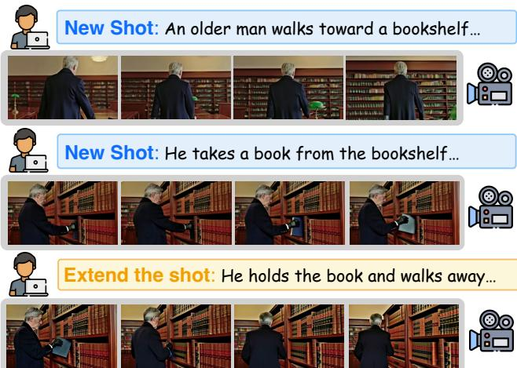  

Figure 1: Our framework supports interactive creation of multi-shot sequences. Users can generate new shots or extend existing ones to build a coherent narrative.

我们的框架通过上下文注入集成了这一双层缓存系统，该机制避免了架构修改，从而确保与现有的预训练文本到视频模型具有广泛的兼容性。正如图1所示，这种方法提供了对叙事流的直观交互控制。这一核心灵活性是生成任意数量镜头和持续时间视频的关键，同时也能支持一系列具有挑战性的下游任务，如多概念注入（Huang et al. 2025；Luo et al. 2025b）和交互式视频扩展。训练该模型需要构建高质量、一致的多镜头视频数据集，而目前这样的数据集较为稀缺。我们提出了一条数据收集流程，用于构建高质量的多镜头数据集，包括镜头到场景的镜头收集和场景到镜头的多级注释精炼，以确保高质量一致的字幕构建。鉴于缺乏多镜头视频评估方法，我们提出了基于身份一致性、背景一致性和视频质量的评估指标和几个基线。总之，我们的贡献如下： • 我们引入了一种新颖的缓存引导自回归框架，用于多镜头视频生成。该架构独特地将双层缓存集成到自回归流程中，通过显式管理镜头内和镜头间的一致性，使得合成任意长度的一致视频成为可能。 • 所提出的框架表现出卓越的灵活性，支持一系列具有挑战性的下游任务，包括多概念角色注入、交互式视频扩展，展示了其广泛适用性。 • 我们提出了一条高质量一致的镜头收集流程，包括镜头分割和聚类，并通过多级智能体注释，我们收集了高质量的多镜头数据集。 • 大量实验表明，我们的框架在视频质量及角色/背景一致性方面超过了现有方法。

# 相关工作

# 单次视频生成

视频扩散模型（Blattmann et al. 2023; Kong et al. 2024; Wan et al. 2025; Yang et al. 2024）已从其在图像合成中的成功应用中演变而来，其核心挑战在于建模时间一致性。早期的方法（Blattmann et al. 2023; Guo et al. 2023）通过插入额外的时间注意力模块利用图像生成模型先验以学习运动动态，但视频质量受限。某些方法（Voleti et al. 2024; Wan et al. 2024）将图像划分为网格区域以实现一致的多视角或视频生成。目前的视频生成模型（Kong et al. 2024; Wan et al. 2025）通常采用3D-DiT架构，将视频的高度、宽度和时间维度压平为单一维度进行注意力计算，进一步提高生成的视频质量。

长视频生成 将视频生成扩展至长片段仍然是一个重大挑战。早期的研究采用了各种策略，例如利用潜在扩散模型（Rombach等，2022年）、从文本序列生成可变长度视频，以及实施粗到精的架构（Jin等，2024年）。其他的研究则侧重于通过分布式生成实现时间一致性，或通过噪声重新调度技术扩展预训练模型（Cai等，2025年）。最近，研究重心转向长上下文视频建模，以更好地利用历史信息（Chen等，2024a, 2025年）。FAR（Gu, Mao和Shou，2025年）提出了一种基于长期和短期上下文窗口的框架，而FramePack（Zhang和Agrawala，2025年）引入了上下文帧的层次压缩。这些方法突显了上下文作为一种记忆形式在实现场景一致的长视频生成中的关键作用。与这些方法不同，在多镜头场景中，我们提出了一种二级缓存系统，以同时实现镜头间的一致性和镜头内的连贯性。

# 多轮生成

多镜头生成，特别是在叙事上下文中，面临保持一致性的挑战。早期的故事视觉化研究集中在图像生成上。为此，开发了各种技术；例如，AutoStudio（Cheng et al. 2024）采用IP-Adapter（Ye et al. 2023）进行角色身份注入，而StoryDiffusion（Zhou et al. 2024）和Consistory（Tewel et al. 2024）利用注意力连接机制（Luo et al. 2025a）来实现视觉一致性。早期的多镜头视频生成方法采用关键帧生成和I2V视频生成的两阶段范式。Mora（Yuan et al. 2024）和MovieAgent（Wu, Zhu, and Shou 2025）采用多智能体框架，而VideodirectorGPT（Lin et al. 2023）引入了布局到视频生成，VideoStudio（Long et al. 2024）则使用动作信息区分前景和背景。然而，这些复杂的多模型范式独立生成片段，常常导致视觉不连续现象。

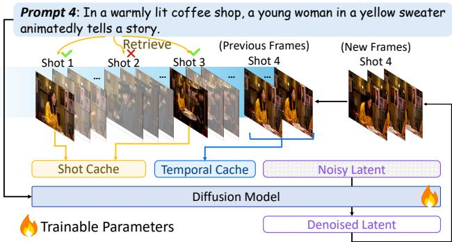  

Figure 2: The framework of FilmWeaver. New video frames are generated autoregressively and consistency is enforced via a dual-level cache mechanism: a Shot Cache for longterm concept memory, populated through prompt-based keyframes retrieval from past shots, and a Temporal Cache for intra-shot coherence.

最近的方法通过将生成的序列分解为多个镜头，增强了镜头间的一致性，采用了同时多镜头生成的方式（Qi et al. 2025；Kara et al. 2025）。然而，原始视频长度的分割导致每个镜头的持续时间过短，降低了实际应用性。TTT（Dalal et al. 2025）在中间的DiT层引入了递归神经网络，但缺乏长程依赖性且训练成本较高。LCT（Guo et al. 2025）与EchoShot（Wang et al. 2025）采用复杂的位置信息编码来区分镜头。相比之下，我们采用了简单的位置信息编码，并辅以两级缓存系统，通过自回归单步训练同时确保镜头间的一致性和镜头内的连贯性。

# 方法

我们提出的框架 FilmWeaver 引入了一种自回归视频生成范式，能够生成任意长度和镜头数量的多镜头视频。我们方法的核心是一个新颖的双层缓存机制，旨在保持镜头内部的一致性和镜头之间的连贯性。这一机制辅之以战略性的两阶段训练过程和精心设计的数据整理流程，以支持稳健的学习。

# 双层缓存的自回归生成

如图2所示，我们框架的核心创新是一个双层缓存，它为扩散模型提供上下文信息。该框架包括两个关键组件：时间缓存（Temporal Cache），作为短期记忆，以确保在单次生成中内容的流畅一致性；镜头缓存（Shot Cache），提供长期记忆，以维持不同镜头间核心概念（如角色和背景）的连贯性。两个缓存通过上下文学习注入模型。这会修改去噪器的条件输入，现在它将文本提示 $\mathbf { c _ { \mathrm { t e x t } } }$、时间缓存 $C _ { \mathrm { t e m p } }$ 和镜头缓存 $C _ { \mathrm { s h o t } }$ 作为输入。因此，模型的训练目标如下：

$$
\mathcal { L } = \mathbb { E } _ { \mathbf { v } _ { 0 } , \mathbf { c } _ { \mathrm { t e x t } } , \epsilon , t } \left[ \left| \left| \epsilon - \epsilon _ { \theta } ( \mathbf { v } _ { t } , t , \mathbf { c _ { \mathrm { t e x t } } } , C _ { \mathrm { t e m p } } , C _ { \mathrm { s h o t } } ) \right| \right| ^ { 2 } \right] .
$$

这种方法在不改变模型架构的情况下，基于相关的过去信息对生成过程进行条件限制。用于单次生成连续性的时间缓存。为了确保单次生成过程中的无缝连续性，我们采用了时间缓存。该缓存作为一个滑动窗口，存储当前生成块最近的条件帧。随着新帧的生成，它们被添加到缓存中，而最旧的帧则被丢弃。考虑到视频中存在高时间冗余，存储所有过去的帧在计算上是不可行的。因此，受近期研究的启发，我们实施了一种差异压缩策略。靠近当前生成窗口的帧以更高的保真度被保留，而更早的帧则逐渐被压缩。这种方法有效保存了重要的运动和内容信息，同时最小化了计算开销。镜头缓存用于镜头间的一致性。为了确保镜头间的一致性，我们引入了镜头缓存。当生成新镜头时，该缓存通过选择与新文本提示最语义相关的前K个关键帧构建。相关性通过计算提示与每个候选关键帧的CLIP嵌入之间的余弦相似度来确定。所得到的缓存提供了叙事历史的简洁而高度相关的视觉摘要，引导模型保持一致性。检索过程被表述为：

$$
C _ { \mathrm { s h o t } } = \underset { k f \in \mathcal { K F } } { \arg \operatorname { t o p - k } } \left( \sin ( \phi _ { T } ( \mathbf { c _ { \mathrm { t e x t } } } ) , \phi _ { I } ( k f ) ) \right) ,
$$

其中 $C _ { \mathrm { s h o t } }$ 是生成的镜头缓存，$\kappa { \mathcal { F } }$ 是来自先前镜头的所有关键帧 $( k f )$ 的集合，而 $\mathbf { c } _ { \mathrm { t e x t } }$ 是新镜头的文本提示。此外，$\phi _ { T }$ 和 $\phi _ { I }$ 分别是预训练的 CLIP 文本和图像编码器，$\mathrm { s i m } ( \cdot , \cdot )$ 表示余弦相似度函数，而 arg top $\mathrm { k \Omega }$ 操作符选择具有最高相似度分数的 $\mathbf { K }$ 个关键帧。推理阶段和模式 如图 3 所示，我们的多镜头生成过程分为四个顺序阶段。每个阶段由一个独特的推理模式控制，这由我们双层缓存的状态决定，从而实现灵活且一致的视频创作。

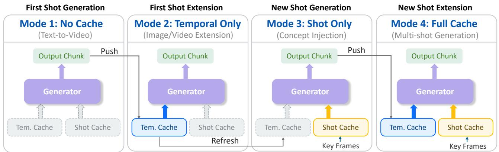  
; ou.

• 首次镜头生成（无缓存）。该过程开始时两个缓存均为空 $( C _ { \mathrm { t e m p } } ~ = ~ \emptyset , C _ { \mathrm { s h o t } } ^ { \mathrm { ^ { - } } } = ~ \emptyset )$ 。模型作为标准的文本到视频（T2V）生成器运作，从文本提示创建初始视频片段并填充后续阶段的缓存。 • 首次镜头扩展（仅时间）。为了在同一镜头内生成后续片段，模型利用已填充的时间缓存 $( C _ { \mathrm { t e m p } } \neq \emptyset , C _ { \mathrm { s h o t } } = \varnothing )$ 。这确保了高时间连贯性和平滑运动，适用于视频扩展或图像到视频（I2V）生成等应用。 • 新镜头生成（仅镜头）。为了切换到新的镜头，时间缓存被清空，而镜头缓存则从之前的镜头中填充关键帧 $( C _ { \mathrm { t e m p } } = \emptyset , C _ { \mathrm { s h o t } } \neq \emptyset )$ 。这种模式生成新的场景，保持角色和背景等关键元素的长期一致性。我们还可以人为设置参考帧以实现多概念注入。 • 新镜头扩展（全缓存）。在扩展新镜头时，两个缓存都是活动的 $( C _ { \mathrm { t e m p } } \neq \emptyset , C _ { \mathrm { s h o t } } \neq \emptyset )$ 。生成器利用时间缓存以确保即时连贯性，并利用镜头缓存以保持长期一致性，无缝融合两者的背景。我们的训练过程旨在适应所有四种场景，确保模型在整个多镜头生成序列中稳健运行。

# 训练策略

为了简化学习任务并促进稳定收敛，我们采用了两阶段训练策略，并结合数据增强技术以减少模型对缓存的过度依赖。逐步训练课程。我们的策略分为两个逐步的阶段。第一阶段专注于教会模型仅通过文本输入生成长而连贯的一次性视频。在此阶段，镜头缓存被禁用（即其输入被归零），模型仅使用时间缓存进行训练。这一基础步骤使模型能够掌握镜头内部动态，而不需要考虑镜头间一致性的额外复杂性。在此基础上，第二阶段激活镜头缓存，并在包含所有四种基于缓存的场景的混合课程上微调模型。这种逐步方法使模型在较简单的长视频任务上进行预训练，从而能够更高效、更快速地应对多镜头一致性这一更复杂的挑战。

数据增强。在训练过程中，我们观察到模型对提供的视觉上下文产生了过度依赖，从而导致了“复制粘贴”现象。这种行为显著降低了运动的动态性，并减弱了模型对文本提示的遵循能力。为了减轻这种问题，我们采用了几种有针对性的正则化技术。首先，我们通过随机引入无关的关键帧，在训练过程中对镜头缓存（Shot Cache）施加负采样。这迫使模型在文本提示的指导下区分有用的上下文和分散注意力的干扰信息。此外，受之前策略的启发，我们对两个缓存引入噪声，以抑制准确的复制。然而，我们发现，过量的噪声会导致时间缓存（Temporal Cache）的视频连贯性下降。因此，我们采用不对称的噪声策略：对镜头缓存施加相对较高的噪声水平，相应于从100到400的随机扩散时间步；而对时间缓存施加的噪声水平则要轻得多（0100时间步）。这种双重方法有效地抑制了对视觉上下文的过度依赖，从而增强了对文本提示的遵循能力和生成质量。

# 多轮数据策展

多镜头视频生成中的一个主要障碍是缺乏高质量、标注一致的数据集。为了解决这一问题，我们开发了一套综合的数据整理流程，如图5所示。在初始的镜头分割阶段，我们使用专家模型（Chen et al. 2024b）将源视频分割为单个镜头。这些镜头随后通过场景聚类过程被分组为连贯的多镜头序列，该过程利用滑动窗口评估剪辑之间的CLIP相似性。聚类之后，场景经过严格的过滤协议，以确保数据质量，移除短于一秒的剪辑和包含超过三位不同个体的场景。我们的标注流程始于组字幕策略。我们将场景中的整个镜头序列提供给Gemini $2 . 5 \mathrm { P r o }$，该模型同时生成所有镜头的描述。这种联合标注方法能够在不同镜头中保持对同一角色的一致描述，同时准确反映出电影的变化，例如从广角镜头到特写镜头的过渡。随后，每个生成的标注都经过验证步骤。在这一阶段，每个单独的镜头及其对应的字幕被反馈回模型，以验证其准确性并细化任何模糊或普通的表述。

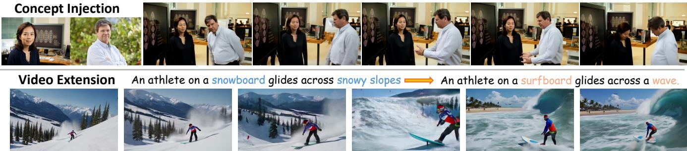  
board" to a "surfboard" scene, while maintaining the athlete's appearance.

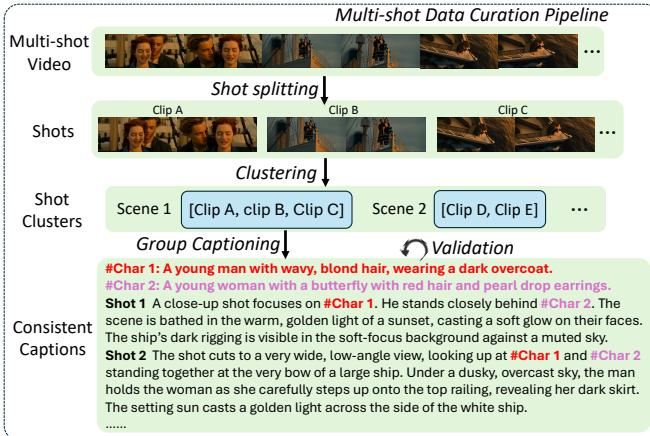  

Figure 5: The pipeline of Multi-shot data curation, which first segments videos into shots and clusters them into coherent scenes. We then introduce a Group Captioning strategy that jointly describes all shots within a scene, enforcing consistent attributes for characters and objects. This process, finalized with a validation step, yields a high-quality dataset of video-text pairs with strong temporal coherence.

# 扩展应用

FilmWeaver 的架构支持多样化的下游应用。如图 4 所示，我们的框架能够轻松处理多概念注入和视频扩展。首先，对于多概念注入（顶部），我们手动将提供的概念图像填充到镜头缓存中，这标志着图 3 中的模式 3。然后，FilmWeaver 可以生成一个连贯且动态的场景，顺畅地整合这些多个主题，同时忠实地保留它们各自的身份。此外，该框架在动态视频扩展（底部）方面表现出色。这是通过在序列中段修改文本提示，同时保持时间缓存以维持连续性来实现的。此过程对应于图 3 中的模式 2（仅时间），允许叙事及时调整。例如，它可以流畅地将视频从“运动员在雪坡上滑雪”的背景切换到“在海浪上冲浪”，以直接响应新的提示。模型能够利用其独特的缓存模式来执行如此复杂的任务，突显了其在高级视频编辑和创意叙事探索方面的潜力。

# 实验

# 实现细节

对于我们的实现，我们采用 Hunyuan Video（Kong 等，2024）。批量大小设置为 16。第一阶段训练 10K 步，第二阶段训练 10K 步。

# 与现有方法的比较

为了评估 FilmWeaver 的性能，我们将其与现有多镜头视频生成方法的两个主要类别进行对比。第一个类别利用完整的管道生成多镜头视频，以 VideoStudio（Long et al. 2024）为代表。第二个类别指的是关键帧基础的方法，由两阶段管道组成，首先生成关键帧，然后使用 I2V 模型为其动画化。对于这些管道，我们使用 StoryDiffusion（Zhou et al. 2024）和 IC-LoRA（Huang et al. 2024）实现一致的关键帧生成，随后采用强大的 Hunyuan I2V 模型进行动画化步骤。由于 IC-LoRA 每次运行生成的图像数量有限，我们多次调用它以生成所需的关键帧。鉴于 VideoStudio 和 IC-LoRA 需要结构化输入，我们使用 Gemini 2.5 Pro（Comanici et al. 2025）相应地重新格式化提示。

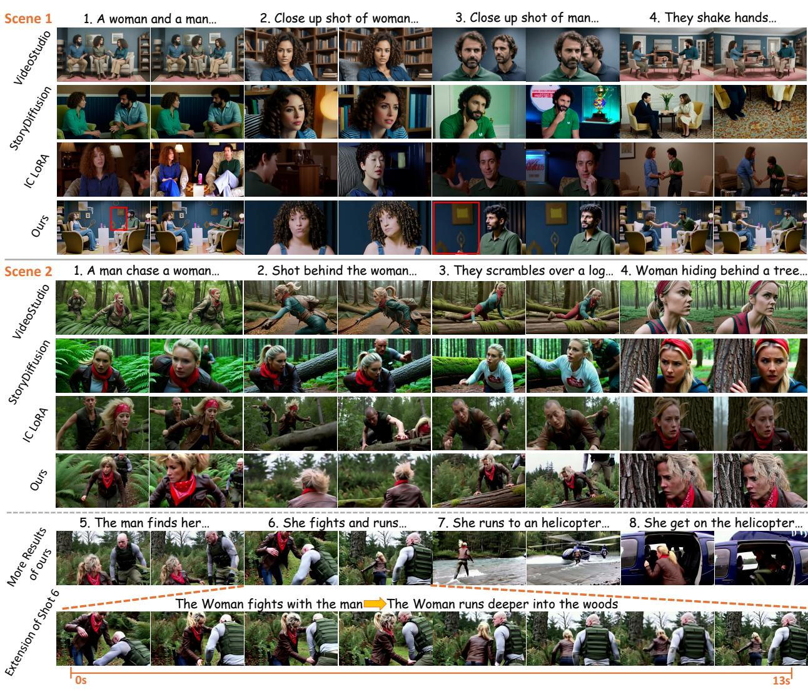  
ualiav parioulhoerapareas hexisth so in See wedemstraturidoextensiapabiliy y ceatin oherent onidousingtwo pots.

定性比较。我们在图6中提供了全面的定性比较，评估我们的方法与领先方法在两个不同且具有挑战性的叙事场景中的表现。在场景1中，这是一个交替使用广角和特写镜头的对话场景，竞争方法表现出严重的一致性失败。它们在多人物身份保持方面苦苦挣扎，导致特征纠缠，角色之间的属性如衣物和面部结构混合在一起，背景不一致。相比之下，我们的方法成功地保持了每个个体的独特外观，并在所有镜头中维持了稳定的背景。如第四行的红框所示，镜头3中男子身后的墙面艺术与镜头1保持完美一致。类似地，我们的方法在场景2的动态动作中稳健地保持了角色身份，克服了竞争模型常见的外观不一致性。重要的是，我们框架的能力远超短小的四镜头序列。我们通过为场景2生成一个连续且连贯的8镜头叙事来证明这一点，展现了其在长篇叙事中的优势。此外，我们明确突出在“镜头6的扩展”中我们的视频扩展能力，在这一部分中，我们使用第二个提示无缝延续单个镜头内的动作，创建一个更长且更具动态感的片段。这些结果强调了我们的模型在生成一致、可控和长篇叙事驱动的视频内容方面的卓越能力。有关更多示例，请参见附录。

Table 1: Quantitative comparison with existing methods.   

<table><tr><td rowspan="2">Method</td><td colspan="5">Visual Quality Consistency(%) Text Alignment</td></tr><tr><td>Aes.↑ Incep.↑</td><td></td><td>Char.↑</td><td>All↑</td><td>Char. ↑ All. ↑</td></tr><tr><td>VideoStudio</td><td>32.02</td><td>6.81</td><td>73.34</td><td>62.40</td><td>20.88</td><td>31.52</td></tr><tr><td>StoryDiffusion</td><td>35.61</td><td>8.30</td><td>70.03</td><td>67.15</td><td>20.21</td><td>30.86</td></tr><tr><td>IC-LoRA</td><td>31.78</td><td>6.95</td><td>72.47</td><td>71.19</td><td>22.16</td><td>28.74</td></tr><tr><td>Ours</td><td>33.69</td><td>8.57</td><td>74.61</td><td>75.12</td><td>23.07</td><td>31.23</td></tr></table>

定量比较。这些视觉观察通过我们的定量评估得到了证实，详见表1。对于定量评估，我们在三个关键维度上评估性能：视觉质量、一致性和文本对齐。对于视觉质量，我们采用MovieBench（Wu et al. 2025）中的评估协议，该协议包含美学得分（Aes.）和生成对抗网络得分（Incep.）。对于一致性和文本对齐，我们报告字符特定（Char.）和总体（All.）方面的指标。表1中的定量结果验证了我们方法的优越性。我们在一致性指标和字符级文本对齐方面均取得了最先进的结果。关键是，我们的方法还获得了最高的生成对抗网络得分，展示了顶级的视觉质量，并在所有其他指标上保持了高度竞争力。我们认为，通过改进数据管理和优化训练策略，我们的方法的视觉质量可以进一步提升。

Table 2: Quantitaive results of ablation study.   

<table><tr><td rowspan="2">Method</td><td>Visual Quality</td><td></td><td>Consistency(%)</td><td></td><td>Text Alignment</td><td></td></tr><tr><td>Aes.↑</td><td>Incep.↑</td><td>Char.↑</td><td>All.↑</td><td>Char. ↑</td><td>All.↑</td></tr><tr><td>w/o A</td><td>30.04</td><td>7.77</td><td>72.36</td><td>75.92</td><td>21.88</td><td>28.12</td></tr><tr><td>w/o S</td><td>33.92</td><td>8.63</td><td>68.11</td><td>65.44</td><td>22.41</td><td>31.79</td></tr><tr><td>w/o T</td><td>31.61</td><td>8.36</td><td>70.79</td><td>70.57</td><td>20.21</td><td>30.70</td></tr><tr><td>Ours</td><td>33.69</td><td>8.57</td><td>74.61</td><td>75.12</td><td>23.07</td><td>31.23</td></tr></table>

# 消融研究

我们进行消融研究以验证我们的核心组件：镜头缓存（S）、时间缓存（T）和噪声增强（A）策略。如图7所示，移除镜头缓存（w/o S）导致长时间视觉一致性严重下降，未能保持角色外观和场景风格。移除时间缓存（w/o T）则导致时间上不连贯和不连贯的运动。此外，图8证明了若没有噪声增强（w/o A），模型过度依赖时间缓存中的视觉上下文，妨碍了其适应动态提示的能力，从而减少了视频扩展过程中的提示可控性。表2定量证实了这些发现。没有缓存的变体在一致性指标上显示出显著下降，而缺乏噪声增强则导致文本对齐得分显著降低。这些结果确认了每个组件的重要性：镜头缓存用于镜头间一致性，时间缓存用于镜头内连贯性，噪声增强用于稳健的提示遵循。

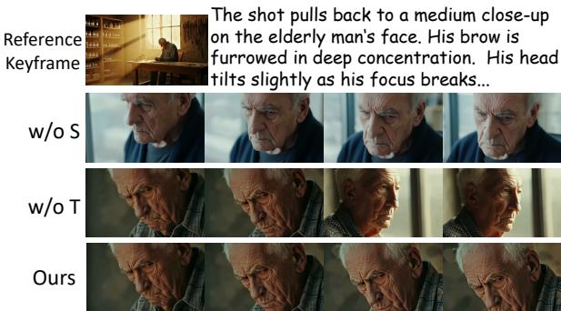  

Figure 7: Qualitative ablation study of our dual-level cache. Without the shot cache (w/o S), the model fails to maintain visual style and the clothes of character. Without the temporal cache (w/o T), the generated sequence lacks coherence, resulting in disjointed motion. Our full method successfully preserves both appearance and motion continuity.

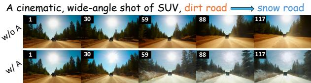  

Figure 8: Qualitative ablation study on noise augmentation. Without noise augmentation, the model over-relies on past frames, hindering the ability of prompt following, which is crucial in video extension. Applying noise reduces this dependency and improves the ability of prompt following.

# 结论

我们提出了FilmWeaver，一种新颖的缓存引导自回归框架，旨在解决多镜头视频生成中的一致性和持续时间问题。我们的关键贡献是一个双层缓存机制，结合了基于检索的镜头缓存以实现长期一致性，以及用于镜头内运动连贯性的时间缓存。借助噪声增强以促进更好的提示遵循，该架构能够生成任意长度的连贯视频。针对一个精心策划的数据集的实验表明，FilmWeaver在视觉一致性和美学质量上明显优于现有方法。其灵活性使其可以直接应用于视频扩展等任务。FilmWeaver代表了在创建复杂、可控叙事视频方面的一项重大进展，为自动化叙事开辟了新的可能性。

参考文献 Blattmann, A.; Dockhorn, T.; Kulal, S.; Mendelevitch, D.; Kilian, M.; Lorenz, D.; Levi, Y.; English, Z.; Voleti, V.; Letts, A.; et al. 2023. 稳定的视频扩散：将潜在视频扩散模型扩展到大规模数据集。arXiv 预印本 arXiv:2311.15127。 Cai, M.; Cun, X.; Li, X.; Liu, W.; Zhang, Z.; Zhang, Y.; Shan, Y.; 和 Yue, X. 2025. Ditctrl：探索多模态扩散变换器中的注意力控制，以便无调优的多提示长视频生成。在计算机视觉与模式识别会议论文集中，77637772。 Chen, B.; Martí Monsó, D.; Du, Y.; Simchowitz, M.; Tedrake, R.; 和 Sitzmann, V. 2024a. 扩散强制：下一个令牌预测与全序列扩散相遇。神经信息处理系统进展，37：2408124125。 G. in DYa JLi C.hu JanM. H.; Chen, S.; Chen, Z.; Ma, C.; et al. 2025. Skyreelsv2：无限长度的影片生成模型。arXiv 预印本 arXiv:2504.13074。 Chen, T.-S.; Siarohin, A.; Menapace, W.; Deyneka, E.; C, H.-w Jeon, B.E. Fang, Y.; Lee, H.-Y.; Ren, J.Yan, M.-H.; et al. 2024b. Panda-70m：使用多个跨模态教师为7000万视频生成字幕。在IEEE/CVF计算机视觉与模式识别会议论文集中，1332013331。 Cheng, J.; Lu, X.; Li, H.; Zai, K. L.; Yin, B.; Cheng, Y.; Yan, Y.; 和 Liang, X. 2024. Autostudio：在多轮交互图像生成中创造一致的主题。arXiv 预印本 arXiv:2406.01388。 Comanici, G.; Bieber, E.; Schaekermann, M.; Pasupat, I.; Seva .Dhilon, I. Blistn, M. Ram O. Zhang D.; Rosen, E.; et al. 2025. Gemini 2.5：通过高级推理、多模态、长上下文和下一代代理能力推动前沿。arXiv 预印本 arXiv:2507.06261。 Dalal, K.; Kceja, D.; Xu, J.; Zhao, Y.; Han, S.; Cheung, K. C.; Kautz, J.; Choi, Y.; Sun, Y.; 和 Wang, X. 2025. 通过测试时间训练进行一分钟视频生成。在计算机视觉与模式识别会议论文集中，1770217711。 Gu, Y.; Mao, W.; 和 Shou, M. Z. 2025. 长上下文自回归视频建模与下一帧预测。arXiv 预印本 arXiv:2503.19325。 Gu, Y.; Yang, C.; Rao, A.; Liang, Z.; Wang, Y.; Qiao, Y.; Agrawala, M.; Lin, D.; 和 Dai, B. 2023. Animatediff：在没有特定调优的情况下为你的个性化文本到图像扩散模型动画。arXiv 预印本 arXiv:2307.04725。 Guo, Y.; Yang, C.; Yang, Z.; Ma, Z.; Lin, Z.; Yang, Z.; Lin, D.; 和 Jiang, L. 2025. 视频生成的长上下文调优。arXiv 预印本 arXiv:2503.10589。 Huang, L.; Wang, W.; Wu, Z.-F; Shi, Y.; Dou, H.; Liang, FY.Y.Zo J. 0在扩散变换器中。arXiv 预印本 arXiv:2410.23775。Huang, Y.; Yuan, Z.; Liu, Q.; Wang, Q.; Wang, X.; Zhang, R.; Wan, P.; Zhang, D.; 和 Gai, K. 2025. Conceptmaster：在扩散变换器模型上进行多概念视频定制，无需测试时间调优。arXiv 预印本 arXiv:2501.04698。 Jin, Y.; Sun, Z.; Li, N.; Xu, K.; Jiang, H.; Zhuang, N.; Huag Q.; Song, Y.; Mu, Y.; 和 Lin, Z. 2024. 金字塔流匹配用于高效视频生成建模。arXiv 预印本 arXiv:2410.05954。 Kara, O.; Singh, K. K.; Liu, F.; Ceylan, D.; Rehg, J. M.; 和 Hinz, T. 2025. ShotAdapter：使用扩散模型进行文本到多镜头视频生成。在计算机视觉与模式识别会议论文集中，28405 28415。 Kong, W.; Tian, Q.; Zhang, Z.; Min, R.; Dai, Z.; Zhou, J.; Xiong, J.; Li, X.; Wu, B.; Zhang, J.; et al. 2024. Hunyuanvideo：大规模视频生成模型的系统框架。arXiv 预印本 arXiv:2412.03603。 Lin, H.; Zala, A.; Cho, J.; 和 Bansal, M. 2023. Videodirectorgpt：通过 llm 引导规划生成一致的多场景视频。arXiv 预印本 arXiv:2309.15091。 Long, F.; Qiu, Z.; Yao, T.; 和 Mei, T. 2024. VideoStudio：生成一致内容和多场景视频。在欧洲计算机视觉会议，468485。Springer。 Luo, X.; Cheng, J.; Xie, Y.; Zhang, X.; Feng, T.; Liu, Z.; Ma, F.; 和 Yu, F. 2025a. 物体孤立注意力用于一致的故事可视化。arXiv 预印本 arXiv:2503.23353。Luo, X.; Zhu, Y.; Liu, Y.; Lin, L.; Wan, C.; Cai, Z.; Li, Y.; 和 Huang, S.-L. 2025b. CanonSwap：通过规范空间调制进行高保真且一致的视频人脸交换。在IEEE/CVF国际计算机视觉会议论文集中，1006410074。 Peebles, W.; 和 Xie, S. 2023. 使用变压器的可扩展扩散模型。在IEEE/CVF国际计算机视觉会议论文集中，41954205。 Qi, T.; Yuan, J.; Feng, W.; Fang, S.; Liu, J.; Zhou, S.; He, Q.; Xie, H.; 和 Zhang, Y. 2025. Mask^ 2DiT：用于多场景长视频生成的双掩码扩散变换器。在计算机视觉与模式识别会议论文集中，1883718846。 Radford, A.; Kim, J. W.; Hallacy, C.; Ramesh, A.; Goh, G.; Agarwal, S.; Sastry, G.; Askell, A.; Mishkin, P.; Clark, J.; et al. 2021. 从自然语言监督中学习可转移的视觉模型。在国际机器学习会议，87488763。PmLR。 Rombach, R.; Blattmann, A.; Lorenz, D.; Esser, P.; 和 Ommer, B. 2022. 使用潜在扩散模型进行高分辨率图像合成。在IEEE/CVF计算机视觉与模式识别会议论文集中，10684 10695。 Tewel, Y.; Kaduri, O.; Gal, R.; Kasten, Y.; Wolf, L.; Chechik, G.; 和 Atzmon, Y. 2024. 无需训练的一致文本到图像生成。ACM图形事务（TOG），43(4)：118。Voleti, V.; Yao, C.-H.; Boss, M.; Letts, A.; Pankratz, D.; Tochilkin, D.; Laforte, C.; Rombach, R.; 和 Jampani, V. 2024. Sv3d：采用潜在视频扩散进行单幅图像的新型多视角合成和三维生成。在欧洲计算机视觉会议，439457。Springer。 Wan, C.; Luo, X.; Luo, H.; Cai, Z.; Song Y.; Zhao, Y.; Bai, Y.; He, Y.; 和 Gong, Y. 2024. Grid：全视觉生成。arXiv 预印本 arXiv:2412.10718。 Wan, T.; Wang, A.; Ai, B.; Wen, B.; Mao, C.; Xie, C.-W.; Chen, D.; Yu, F.; Zhao, H.; Yang, J.; et al. 2025. Wan：开放和先进的大规模视频生成模型。arXiv 预印本 arXiv:2503.20314。 Wang, J.; Sheng, H.; Cai, S.; Zhang, W.; Yan, C.; Feng, Y.; Deng, B.; 和 Ye, J. 2025. EchoShot：多镜头肖像视频生成。arXiv 预印本 arXiv:2506.15838。 Wu W.; Liu, M.; Zhu, Z.; Xia, X.; Feng, H.; Wang, W.; Lin, K. Q.; Shen, C.; 和 Shou, M. Z. 2025. Moviebench：用于长视频生成的分级电影级数据集。在计算机视觉与模式识别会议论文集中，2898428994。 Wu, W.; Zhu, Z.; 和 Shou, M. Z. 2025. 通过多智能体共同规划自动生成电影。arXiv 预印本 arXiv:2503.07314。 Xiao, J.; Yang, C.; Zhang, L.; Cai, S.; Zhao, Y.; Guo, Y; Wetzstein, G.; Agrawala, M.; Yuille, A.; 和 Jiang, L. 2025. Captain Cinema：朝着短电影生成迈进。arXiv 预印本 arXiv:2507.18634。 Xue, H.; Luo, X.; Hu, Z.; Zhang, X.; Xiang, X.; Dai, Y.; Liu, J.; Zhang, Z.; Li, M.; Yang, J.; et al. 2024. 人体运动视频生成：一项调查。Authorea 预印本。 Yang, Z.; Teng, J.; Zheng, W.; Ding, M.; Huang, S.; Xu, J.; Yang, Y.; Hong, W.; Zhang, X.; Feng, G.; et al. 2024. Cogvideox：具有专家变换器的文本到视频扩散模型。arXiv 预印本 arXiv:2408.06072。 Ye, H.; Zhang, J.; Liu, S.; Han, X.; 和 Yang, W. 2023. Ipadapter：文本到图像扩散模型的文本兼容图像提示适配器。arXiv 预印本 arXiv:2308.06721。Yuan, Z.; Liu, Y.; Cao, Y.; Sun, W.; Jia, H.; Chen, R.; Li, Z.; Lin B. Yuan, L.He, Lt al. 02Mor：通过多智能体框架生成的易变视频。arXiv 预印本 arXiv:2403.13248。 Zhang, L.; 和 Agrawala, M. 202. 在下一帧预测模型中打包输入帧上下文以用于视频生成。arXiv 预印本 arXiv:2504.12626。 Zhou, Y.; Zhou, D.; Cheng, M.-M.; Feng, J.; 和 Hou, Q. .Storydiffusion：一致的自注意力对范围图像和视频生成。神经信息处理系统进展，37：110315110340。

# 双层缓存

在本节中，我们将展示我们提出的双层缓存的更多细节。

# 双级缓存细节

在我们的方法中，我们采用了一个双层缓存系统，包括镜头缓存和时间缓存。镜头缓存通过存储来自先前镜头的关键帧来保持镜头间的一致性，而时间缓存则通过当前展开镜头中最近帧的滑动窗口来确保镜头内的一致性。在实际应用中，这两个缓存存储的不是原始像素，而是由变分自编码器（VAE）编码的潜在表示。

对于镜头缓存，我们将 K 设置为 3，这基于性能与效率之间的重要权衡。虽然使用更多的关键帧可以提供额外的视觉上下文，但我们发现生成质量的改善几乎微乎其微。相反，就计算和训练复杂度而言，成本持续上升。正如我们的定性分析所示（参见图 10），如此大小的缓存足以捕捉到在复杂的多镜头生成场景中维持一致性所需的多样化概念。在时间缓存方面，我们的方法是基于这样的直觉：离当前帧较近的历史帧比远离的帧更为重要。因此，遵循最近的自回归方法，我们采用了分层压缩策略。我们将滑动窗口的压缩分为三个层级：最新的隐变量保持未压缩，接下来的两个隐变量进行 $4 \mathbf { x }$ 压缩，最后的 16 个隐变量压缩因子为 32。该方法有效管理了随着隐变量增加而导致的词元消耗。这种压缩滑动窗口设计显著降低了计算开销。在我们的设置中，单个自回归步骤生成 6 个隐变量，相当于 24 帧视频。在标准的 24 FPS 帧率下，该配置允许每个镜头的长度以精确的秒增量进行控制。

# 额外消融实验结果

为了进一步验证我们的镜头缓存的有效性，我们呈现一个案例研究，单独分析其概念注入的核心功能。在图9中，两个生成的视频都使用了镜头缓存，但参考内容不同。当参考中包括一个老年男性的正面视图时（A），缓存成功将该身份注入视频中，并保持一致。当参考中缺少此概念时（B），生成的视频则创建了一个身份。这种参考概念与生成输出之间的直接对应关系清楚地证明了镜头缓存的作用。它确认了缓存按预期操作，作为从给定源维持身份一致性的主要机制。

# 关键帧检索分析

在本节中，我们对镜头缓存的关键帧检索机制进行了详细分析，涉及其实现细节、超参数敏感性和定性性能。

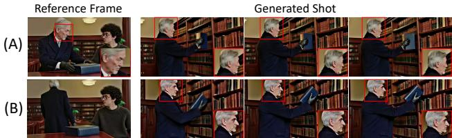  

Figure 9: Effectiveness of the Shot Cache demonstrated via an additional ablation. In (A), the generated shot correctly inherits the character identity from the reference image. In (B), without the character ID in the reference, a new identity is created. This further validates the effectiveness of our Shot Cache.

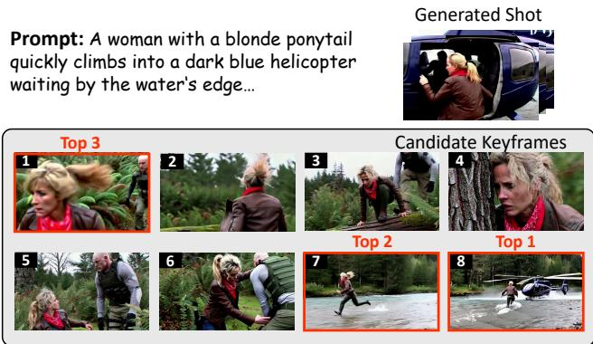  

Figure 10: A qualitative example of our prompt-based retrieval. The system correctly identifies the Top-3 keyframes (8, 7, and 1) from the shot history that are most relevant to the text prompt, demonstrating the effectiveness of our approach.

# 检索过程的定性可视化

为了展示我们框架的有效性，图10呈现了我们检索增强生成管道的完整案例研究。给定一个文本提示（“一个扎着金色马尾的女人……”），我们的系统搜索摄像历史中的候选关键帧集合。可视化结果突出显示了Top-3检索到的帧，这些帧是我们模型识别出的最语义相关的。例如，排名第一的关键帧#8提供了关于直升机和水域的核心背景，而其他帧（#7，#1）则提供了更多细节。这种有效的检索也验证了我们将镜头缓存大小设置为3的设计选择，证明其足以应对复杂的多镜头场景。此外，生成的最终镜头展示了我们的模型如何合成来自这些检索关键帧的视觉信息，创建出一个新的、连贯的场景，准确匹配提示内容。这确认了我们框架不仅能够检索相关概念，而且能够利用这些概念生成一致的新内容。

# 通过负采样实现容错

我们框架的一个关键优势是其对不完美关键帧检索的鲁棒性，这种韧性是通过负反馈培养出来的。请帮助我构建一个由多个场景描述组成的测试。 详细的中文说明。角色外观：任何出现在画面中的角色的外观及其在画面中的位置。 表情和动作：角色的面部表情及其动作或行为。 色彩调色板：该画面的主导颜色和光照情况。

# 3.字符约束：

每个场景最多允许三个角色。 不使用专有名词（例如：“约翰”、“玛丽”）。场景对象必须包含两个键：

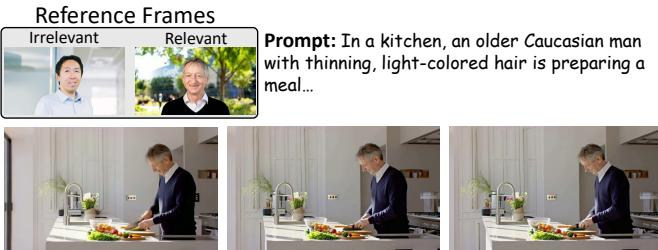  

Figure 11: The prompt for test set construction.   

Figure 12: Demonstration of fault tolerance. Despite an irrelevant reference frame in the Shot Cache (left), our model ignores the incorrect visual information and generates an output that aligns with the text prompt.

在训练过程中采用的主动采样策略。如主文献中详细描述，我们在训练过程中随机向镜头缓存中引入不相关的关键帧。这迫使模型发展出一种复杂的、以提示为导向的判别能力，而不是天真地复制缓存中的所有视觉信息。模型学习将缓存中的视觉上下文与文本提示中的语义指导进行交叉参考。因此，它能够识别并选择性地利用参考帧中与提示相关的概念。如图12所示，即使检索机制错误地提供了不相关的关键帧，模型仍能有效忽略干扰性的视觉信息。这防止了不正确的角色或背景的插入，从而维护了叙事的一致性，并展示了我们方法的容错能力。

# 实验设置细节 测试集构建

由于缺乏适用于文本到多镜头视频生成的公共基准，我们构建了一个新的测试集以严格评估我们的方法。为此，我们利用 Gemini 2.5 Pro 生成了 20 个不同的叙事场景。每个场景由 5 个相互关联的镜头序列组成。测试集构建的提示如图 11 所示。

# 评估指标

为了严格量化我们框架的性能，我们在三个关键维度上进行评估：视觉质量、一致性和文本对齐，如表1所示。

对于视觉质量，我们采用MovieBench的标准化评估协议，报告每帧的平均美学分数（Aes.）和 inception 分数（Incep.）。对于一致性，我们评估角色特定和整体视觉风格。角色一致性（Char. Cons.）通过首先使用Gemini 2.5 Pro及角色描述生成边界框，然后计算同一角色在场景内不同镜头中所有裁剪图像的平均成对CLIP相似度来得出。整体一致性（All. Cons.）通过计算同一场景中所有镜头关键帧之间的成对CLIP相似度的平均值，来衡量视觉风格（例如背景和灯光）的连贯性。对于文本对齐，我们同样在角色和整体层面进行评估。角色文本对齐（Char. Align.）是裁剪角色图像与提示中相应文本描述之间的CLIP相似度。整体文本对齐（All. Align.）则是整个关键帧与其完整提示之间的CLIP相似度，计算过程中对所有生成的镜头进行平均。

# 计算效率

我们的框架旨在实现高计算效率。这种效率的核心在于我们的下一块预测范式，与传统模型基于完整视频历史自回归生成内容形成鲜明对比。通过根据来自双层缓存的固定大小上下文进行生成，我们避免了随着视频长度线性增长的内存需求扩展问题。这一架构选择带来了两个主要好处。首先，在训练过程中，恒定且适中的显存占用允许使用更大的批次大小。其次，在推理过程中，内存消耗保持稳定，使得能够生成任意长度的视频序列而无内存溢出错误的风险。这使得我们的方法不仅有效，而且在实际部署中具有很高的扩展性和实用性。

此外，我们的基于块的方法还降低了注意力机制的计算成本，这往往是主要的瓶颈。注意力操作的复杂度与序列长度呈平方关系 $( \dot { O } ( n ^ { 2 } ) )$。为了说明这一点，考虑生成21个潜在变量的任务。基线模型一次性生成完整序列，即使使用3个关键帧的快照缓存，也将处理总序列长度为 $n = 2 4$（3缓存 $+ ~ 2 1$ 生成的）。因此，其计算成本与 $2 4 ^ { 2 } = 5 7 6$ 成正比。相比之下，我们的方法大约以3.5倍的速度生成21个潜在变量（每块生成 $^ \textrm { \scriptsize / 6 }$ 个潜在变量）。在每一步中，注意力计算是在一个大约包含11个潜在变量的较短固定大小上下文中进行的（3个快照缓存 $^ +$ 时间缓存 $^ +$ 块）。因此，总计算成本大约与 $3 . { \dot { 5 } } \times 1 1 ^ { 2 } = 4 2 3 . 5$ 成正比。这一比较显示了注意力机制计算需求的显著降低，除了节省内存外，还减少了计算预算。