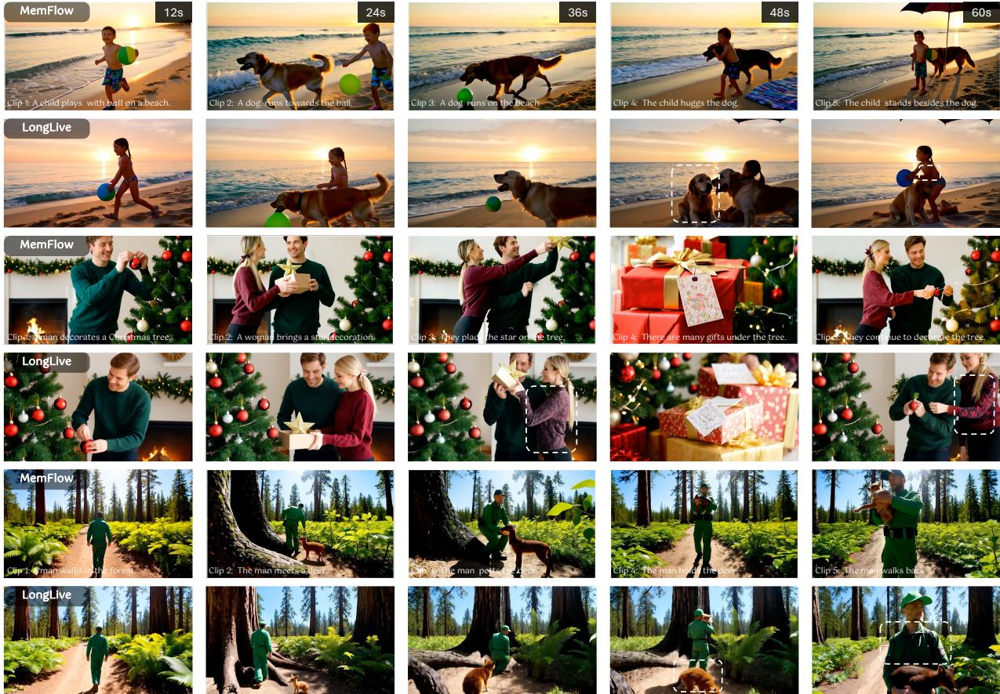
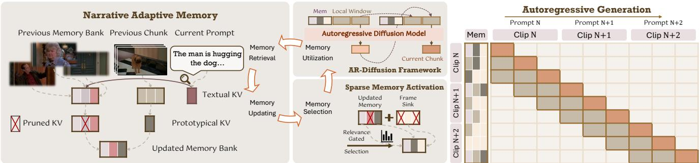
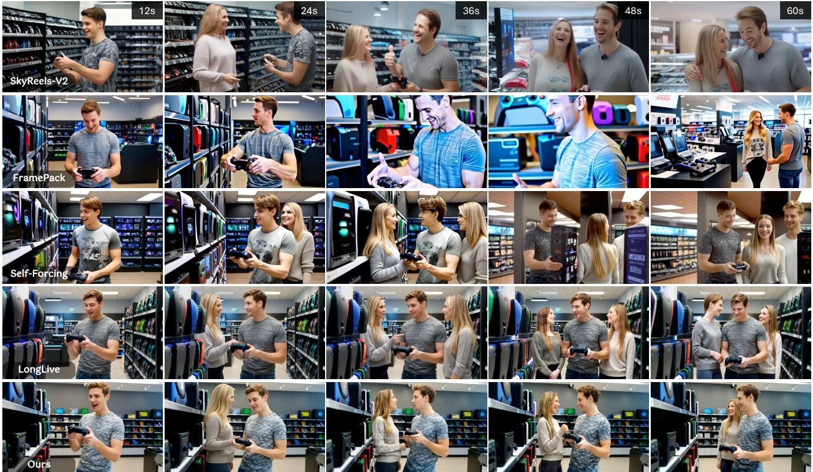
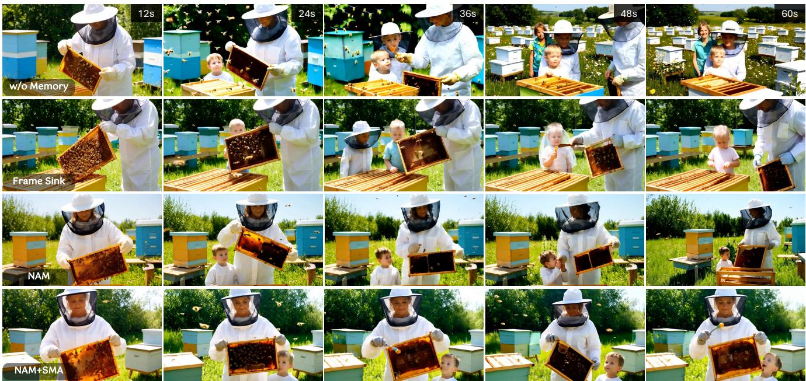
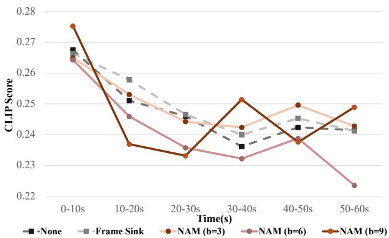

# MemFlow：用于一致且高效的长视频叙事的流动自适应记忆

吉思慧1，† 陈希1 杨帅3 陶鑫2 万鹏飞2 赵恒霜1 1香港大学 2快手科技Kling团队 3香港科技大学（广州） https://github.com/KlingTeam/MemFlow

  
long-term consistency, enabling narrative coherence even if new subjects appear or scenario switches.

# 摘要

流视频生成的核心挑战是保持长时间上下文中的内容一致性，这对内存设计提出了很高的要求。大多数现有解决方案通过预定义策略压缩历史帧来维护内存。然而，不同待生成的视频片段应参考不同的历史线索，这很难通过固定策略来满足。在这项工作中，我们提出了MEMFLoW来解决这个问题。具体而言，在生成即将到来的片段之前，我们通过检索与该片段文本提示最相关的历史帧动态更新内存库。这个设计不仅准确提供了维持视觉一致性所需的上下文，还确保了即使在新事件展开或场景转换时的语义连贯。此外，在生成过程中，我们仅在注意力层中激活内存库中与每个查询最相关的词元，这有效地保证了生成效率。通过这种方式，MEMFLow 实现了卓越的长时间上下文一致性，同时计算负担微不足道（与无内存基线相比，速度减少 $7.9 \%$）并保持与任何使用 KV 缓存的流视频生成模型的兼容性。

# 1. 引言

视频生成已达到显著的质量，使其扩展到长时段对于推动创意和电影应用至关重要。尽管扩散变换器（DiT）模型利用双向注意力捕捉复杂的时空依赖关系，但其固有的计算成本和GPU内存限制使得它们仅限于短视频生成。自回归（AR）扩散模型通过将长视频分解为顺序片段，提供了一种有前景的替代方案，从而通过减少注意力窗口缓解了计算瓶颈。交互式视频生成已成为一项关键应用，使用户能够通过流式提示输入引导叙事。大多数现有工作采用块级自回归生成，其中新的视频片段基于先前生成的内容和新提供的文本提示进行流式生成。这种具动态提示转换的交互式范式允许在扩展的时间范围内引入新元素和场景切换。然而，由于片段间复杂的依赖关系，它也给有效保留长程内容一致性带来了困难。首先，由于不同的视频片段生成应参考不同的历史线索，因此内存需要根据流式提示自适应地提供相关上下文；其次，存储内存的容量必须受到高度限制，这是由GPU内存的硬件限制和生成效率的需求所决定的。虽然这种自适应和高效内存模块的必要性显而易见，但许多现有方法过于简单，未能充分解决上述双重挑战。它们在预定义的范式中保留内存，有些仅将第一个视频片段作为内存源，有些则试图通过固定压缩方案存储更多的历史帧，有些则试图通过可训练的内存模块隐式地嵌入上下文。然而，这些刚性策略很难动态提供与不同提示输入相对应的历史内容，尤其是在提示转换中新元素的出现或场景切换。为此，我们创新性地设计了叙事自适应内存（NAM），一种自适应检索相关历史内容的内存机制，用于交互式流媒体视频生成。具体而言，我们引入了一个内存库，聚合从流式生成的片段中提取的历史视觉词元（KV缓存）。在每个片段的顺序生成过程中，我们首先通过计算提示文本词元与内存中视觉词元之间的注意力分数，检索与当前提示最匹配的上下文。具有较高分数的上下文帧被认为在语义上与当前片段生成相关，并将与紧接着的片段的压缩表示一起更新内存。这一设计使当前片段能够利用与新提示真正相关的历史线索。我们的NAM在即使出现新事件或场景切换时也能有效保持叙事连贯性，这一点是固定内存策略难以满足的。然而，引入内存不可避免地增加了额外的计算负担，这妨碍了实时生成。因此，我们提出了稀疏内存激活（SMA），根据从查询（当前片段）和键（内存中的上下文）计算的注意力分数，策略性地仅激活注意力层中最相关的词元，采用前 $k$ 选取。之后，注意力仅在这些选定的词元中应用，这有效地通过降低计算成本同时保持质量，加速了推理。通过这种方式，我们的MEMFLow有效地维护了长时段的上下文一致性，并灵活地平衡了内存效率的权衡。与无内存基线相比，它在互动视频生成中达到了最先进的质量，仅降低了 $7.9\%$ 的速度。我们的框架在单个NVIDIA H100上维持18.7 FPS，展示了在复杂人物和场景切换的情况下，生成叙事连贯、长期一致性视频的明显优势。

# 2. 相关工作

长视频生成。先前扩展视频生成至更长时间的努力大致可分为三种方法。自回归-扩散混合方法通过迭代预测帧生成长视频。扩散强制通过调整去噪调度减轻了错误传播。CausVid将双向模型提炼为高效的少步因果模型，Self Forcing进一步解决了训练与测试之间的差距。MAGI-1和SkyReels-V2成功扩展了这一自回归-扩散范式。多阶段方法将长视频分解为多个单独生成的片段。它们或者首先合成一系列连贯的关键帧，然后为每个片段进行视频填充，或者草拟顺序提示，使用T2V模型合成各个段落。这些方法的一个基本限制是片段生成的隔离性，通常导致长时间范围内缺乏时间一致性。第三类方法应用高效架构来管理计算成本。TTTVideo和LaCT使用具有线性注意力的神经网络学习上下文。TokensGen用凝练的词元表示视频片段。情境混合动态选择与注意力计算相关的上下文。这些方法常常为了效率牺牲视觉保真度。

  
attention computation, improving the generation efficiency without sacrificing visual quality. (Sec 3.3).

视频生成中的记忆机制。有效的记忆机制对于在长视频生成中保持一致性至关重要。基于动作的视频生成通常依赖几何和空间依赖性 [5, 33, 41]。Worldmem [33] 和 Context as memory [40] 基于条件相机姿态之间的视野（FOV）重叠进行记忆检索。VMem [22] 引入了基于表面元素的视图记忆以实现高效检索，通过用3D表面元素索引过去的视图。然而，这些方法高度依赖空间先验，因此缺乏泛化能力。通用视频生成主要通过上下文压缩来维持记忆 [8, 12, 42]。FramePack [42] 将输入帧压缩为固定大小的上下文，以管理记忆和效率。FAR [8] 和 StreamingT2V [11] 分别通过多尺度压缩和可学习模块结合短期和长期记忆。这些方法通常在没有自适应检索的情况下维持记忆，因此在相关上下文与当前生成片段之间建立动态连接面临挑战。

# 3. 方法

MEMFLow通过将一种新颖的动态记忆库融入流媒体视频生成框架，从而增强长视频叙事一致性（第3.1节）。为了根据当前提示动态回忆相关的历史上下文，我们首先采用（1）叙事自适应记忆（NAM）机制进行记忆检索和更新（第3.2节）；接着使用（2）稀疏记忆激活（SMA）进行记忆选择，以解决记忆效率的权衡（第3.3节）。更新后的记忆随后被AR扩散模型利用，以合成当前视频片段，随后此过程在更长的时间范围内持续进行。整个框架采用端到端训练方式，使用流式长调优策略，使模型能够学习如何有效管理其在长时间推演过程中的记忆。图2提供了我们框架的高层次示意图。

# 3.1. 整体框架

基准线。我们的工作基于一种混合自回归扩散框架，该框架将自回归分块视频生成与去噪扩散相结合。在每次生成迭代中，模型根据紧邻的 $n$ 帧生成 $T$ 帧的块。这种自回归过程自然产生了来自先前迭代的关键-值（KV）缓存，作为我们内存库的基础结构。这种设计使我们能够高效地存储历史上下文，而不产生额外的计算开销。在标准配置下，自回归注意力机制在 $( n + T )$ 个局部帧上操作（最后 $n$ 帧和当前生成的 $T$ 帧）。通过整合我们包含 $B$ 帧的内存库，注意力操作被扩展到覆盖 $( n + B + T )$ 帧， seamless地融合了短期依赖和长期记忆。

训练机制。我们使用基于蒸馏的方法训练具有记忆增强的AR-扩散模型，具体采用自我增强[15]范式。我们特别采用分布匹配蒸馏（DMD）损失[38]，以最小化学生生成器与教师生成器的输出分布之间的差距，将预训练的双向模型蒸馏为一个少步因果模型。为了使模型具备长上下文能力，我们采用了流式长调优策略[35]。在这一阶段，生成器基于先前的片段在每轮采样一个短视频片段（例如，5秒），而教师通过DMD对新生成的短片段提供可靠的指导。我们可以重复这种滚动扩展以生成长序列，直到视频达到预设的最大长度，并在整个推理过程中应用监督。至关重要的是，我们在这一调优过程中整合了我们的记忆机制（NAM和SMA）：在流式调优中利用NAM使模型能够在训练期间学习如何从自生成帧中检索相关历史，将训练与推理对齐并提高长程一致性；而SMA减轻了由记忆引入的计算开销，与无记忆基线相比，仅造成$7.9\%$的效率损失。

# 3.2. 故事适应性记忆 (NAM)

我们首先在NAM中构建记忆库的组成部分。在每次迭代中，以自回归方式生成一个新块，在此过程中它通过DiT处理，以提取每个变换器层$l$上的$\{ K _ { m } ^ { l } , V _ { m } ^ { l } \} _ { l = 1 } ^ { L }$，其中$m$表示块生成迭代的索引。在下一次迭代开始时，记忆更新为$\{ K _ { m } ^ { l ^ { \prime } } , \bar { V } _ { m } ^ { l ^ { \prime } } \} _ { l = 1 } ^ { L }$以进行后续计算。我们的记忆机制旨在为即将生成的内容提供与内容对齐的上下文，这要求其能够检索与即时提示相关的历史记录，并纳入最新生成的内容进行更新。为了避免在生成过程中记忆库的过度膨胀，我们引入两种协同技术：（i）语义检索，通过基于文本查询与视觉键之间的跨注意力相关性检索最具信息量的上下文；（ii）冗余移除，利用时间冗余选择第一个潜在帧的KV特征作为整个局部块的原型。语义检索。在生成过程中，每个变换器层$l$生成当前块的键值表示，同时关注当前序列、局部窗口中的KV缓存和全局记忆库。检索标准源于文本标记作为查询与KV缓存中的视觉标记作为键之间的跨注意力得分，这在大型视觉语言模型的先前工作中已被证明是有效的。在我们的设计中，文本标记是从待生成块的提示计算得出的，因此具有更高得分的视觉标记在语义上与该块对齐。通过检索记忆库中的这些KV缓存，我们期望模型关注与内容相关的视觉特征。

设 $Q _ { \mathrm { t e x t } } ^ { l } \in \mathbb { R } ^ { d }$ 为层 $l$ 中当前文本提示的文本查询。对于存储在 ${ \cal K } _ { m , i } ^ { l } \in \mathbb { R } ^ { n \times d }$ 中的每个 $b$ 帧，$S _ { m , i } ^ { l }$ 其中 $i = 1 , \ldots , b$，我们计算语义相关性，其中 $\operatorname { S o f t m a x } ( \cdot )$ 计算注意力权重，而 Aggregate $( \cdot )$ 在此处为均值池化，以生成标量分数 $S _ { m , i } ^ { l } \in \mathbb { R }$。然后，我们可以识别出前 $k$ 个语义上最一致的帧来保留。

$$
\mathcal { S } _ { m , i } ^ { l } = \mathrm { A g g r e g a t e } \left( \mathrm { S o f t m a x } \left( \frac { Q _ { \mathrm { t e x t } } ^ { l } ( K _ { m , i } ^ { l } ) ^ { \top } } { \sqrt { d } } \right) \right) ,
$$

冗余移除。在语义检索之后，将前一个块合并为一个代表性原型，然后整合到记忆中。我们并没有采用依赖于重要性加权的计算密集型上下文合并技术，而是提出了一种高效的启发式方法。我们利用短视频块中固有的高时间冗余性，其中视觉信息在连续帧之间表现出强烈的相似性。我们认为单帧足以概括整个块的核心视觉内容。因此，我们简单选择前一个块中第一帧的键值对作为其紧凑原型。然后通过将选定的历史帧与新合并的局部原型连接形成更新的记忆库 $\{ K _ { m } ^ { l \prime } , V _ { m } ^ { l \prime } \}$。这两种策略确保了记忆在语义上相关且实时更新，使模型能够建立叙事连贯性所需的长期和短期依赖关系。

# 3.3. 稀疏记忆激活 (SMA)

直接扩展局部上下文窗口以融入内存库会引入计算负担，因为注意力的复杂度与上下文大小成正比。虽然严格压缩上下文可以提高效率，但这往往会损害内存质量，因为重要的历史线索可能会被任意丢弃。为了应对这种内存与效率之间的权衡，我们提出了稀疏内存激活，这是一种基于相关性门控的内存选择技术，用于在注意力计算之前进行动态内存修剪。

我们的方法基于选择性注意力的原理，其中当前视频片段的查询词元仅关注内存中最相关的历史帧的子集。形式上，我们首先将内存库中的键 $( { \pmb K } _ { m } ^ { l } )$ 和值 $( V _ { m } ^ { l } )$ 划分为 $b$ 帧。然后，我们通过对词元维度的均值池化计算当前片段的查询 $( Q _ { \mathrm { v i s } } ^ { l } )$ 和每帧的键的紧凑描述符，这对于生成任务来说是高度足够且富有表现力的，以前的研究也证明了这一点 [1]。这产生了一个单一的查询描述符 $\bar { q } _ { \mathrm { v i s } } \in \mathbb { R } ^ { 1 \times d }$ 和一组帧级键描述符 $\{ \bar { \pmb { k } } _ { j } \} _ { j = 1 } ^ { b } \in \mathbb { R } ^ { 1 \times d }$，这里为了简便省略了片段索引 $m$。当前查询与内存中帧级键之间的相关性由各自描述符的内积来确定。

<table><tr><td rowspan="2">Method</td><td rowspan="2">Quality Score ↑</td><td rowspan="2">Consistency Score ↑</td><td rowspan="2">Aesthetic Score ↑</td><td colspan="6">CLIP Score ↑</td></tr><tr><td>0-10 s</td><td>1020 s</td><td>2030 s</td><td>3040 s</td><td>4050 s</td><td>5060 s</td></tr><tr><td>SkyReels-V2 [3]</td><td>81.55</td><td>94.72</td><td>56.83</td><td>25.31</td><td>23.40</td><td>22.50</td><td>21.62</td><td>21.67</td><td>20.91</td></tr><tr><td>Self Forcing [15]</td><td>83.94</td><td>95.74</td><td>58.45</td><td>26.24</td><td>24.87</td><td>23.46</td><td>21.92</td><td>22.05</td><td>21.07</td></tr><tr><td>LongLive [35]</td><td>84.28</td><td>96.05</td><td>59.89</td><td>26.63</td><td>25.77</td><td>24.65</td><td>23.99</td><td>24.52</td><td>24.11</td></tr><tr><td>FramePack [15]</td><td>84.40</td><td>96.77</td><td>59.44</td><td>26.51</td><td>22.60</td><td>22.18</td><td>21.53</td><td>21.98</td><td>21.62</td></tr><tr><td>MeMFLOW</td><td>85.02</td><td>96.60</td><td>61.07</td><td>6.31</td><td>24.70</td><td>23.94</td><td>24.13</td><td>24.90</td><td>24.22</td></tr></table>

$$
s _ { j } = \bar { q } _ { \mathrm { v i s } } ^ { \top } \bar { k } _ { j } , \quad \mathrm { f o r } \quad j = 1 , \ldots , b
$$

基于这些相关性评分，我们确定与前 $k$ 个最相关帧相对应的索引集合 $\mathcal { T } _ { k }$：

$$
\mathcal { T } _ { k } = \underset { I \subseteq \{ 1 , \dots , b \} , | I | = k } { \arg \operatorname* { m a x } } \sum _ { j \in I } s _ { j }
$$

该公式选择大小为 $k$ 的索引子集 $I$，以最大化相关性得分的总和。最后，对查询 $Q _ { \mathrm { v i s } } ^ { l }$ 的注意力计算限制在属于所选前 $k$ 个块的键值对。

$$
\mathrm { A t t n } ( Q _ { \mathrm { v i s } } ^ { l } , K _ { m } ^ { l } , V _ { m } ^ { l } ) \approx \mathrm { A t t n } ( Q _ { \mathrm { v i s } } ^ { l } , K _ { m , \mathcal { T } _ { k } } ^ { l } , V _ { m , \mathcal { T } _ { k } } ^ { l } )
$$

其中 ${ \cal K } _ { m , { \mathcal { T } } _ { k } } ^ { l }$ 和 $V _ { m , { \mathcal { T } } _ { k } } ^ { l }$ 是由集合 $\mathcal { T } _ { k }$ 索引的块的拼接键和值张量。通过激活部分内存库，SMA 降低了计算延迟，同时保留了最相关的历史信息。这种策略使模型能够在正确的时间选择性地回忆起正确的上下文，从而保持长距离依赖关系和叙事连贯性。此外，通过隐式地过滤掉历史中较少相关或潜在错误的信息，我们的方法减轻了错误积累。这使得 MEMFLow 能够实现强大的记忆能力和计算效率，确保生成的长视频在时间上不会出现视觉质量下降的情况。

# 4. 实验

# 4.1. 实现细节

我们基于 Wan2.1-T2V-1.3B [29] 构建了 MEMFLOw，遵循 LongLive [35] 的训练和推理流程，同时启用了我们的记忆库和稀疏激活。我们使用 LongLive 构建的 switchprompt 数据集，通过 Qwen2-72BInstruct [34] 实现了自我强迫 [15] DMD 流水线，在 60 秒序列上进行流式长调优。我们进行了为期 3000 步的流式长调优，配备记忆库。在训练过程中，每次迭代通过生成下一个 5 秒的视频片段继续模型自己的推演，直到达到最大长度 60 秒。

# 4.2. 多提示生成的比较

由于我们的记忆机制是为具有多个提示的交互式长视频设计的，因此我们首先将MEMFLow的能力与具有代表性的长视频生成模型进行比较。为了公平比较，我们对现有方法进行了适配，包括SkyReels-V2、FramePack和Self Forcing，以便通过在自回归合成过程中切换提示进行多提示视频生成。值得注意的是，LongLive本身支持生成具有交互指令的视频。按照LongLive的思路，我们定制了100组叙事脚本，每组包含6个连续的10秒提示，共计100个时长为60秒的视频。我们使用VBench-Long提供的指标来评估所有生成视频的视觉质量，其中强调了一致性和美学两个维度，以比较主题、背景和视觉美感的长程一致性。表1显示，MEMFLOw在所有方法中获得了最佳质量分数，验证了其在感知质量上的综合竞争力。在一致性分数方面，我们的方法优于除了Framepack之外的所有其他模型，而Framepack倾向于合成动态减弱的镜头，这在“一致性”上显示出优势。因此，该结果仍然可以证明我们在全球一致性方面的优越性能，得益于特别设计的记忆机制。我们在美学分数上的优势也凸显了我们的方法在长时间推演过程中减轻错误累积的有效性。

为了与交互式提示进行文本对齐，视频根据提示边界进行分段，以评估片段级的语义一致性。每个视频片段与其对应文本之间的 CLIP 分数在每 10 秒的时间间隔内进行计算。结果显示出卓越的提示遵循性和叙事连贯性，特别是在视频被扩展到更长时长时，这得益于模型建立长期上下文关联的能力。图 3 中的定性结果进一步证明了这种优越性。我们的叙事自适应记忆成功将提示中的描述"穿着休闲毛衣的女性"与之前帧中的确切人物进行关联，从而保持主题一致性。而我们的基线模型 LongLive [35] 未能在视觉线索和语义指令之间建立连接，因此在提示切换后持续引入新角色，表现出较差的时间连贯性和提示遵循性。其他方法则表现出更严重的错误累积，SkyReels-V2 [3] 中存在主题不一致，而 FramePack 存在颜色漂移。Self Forcing [15] 也面临与 LongLive 相似的问题，展示了在提示脚本和跨片段叙事进展之间的不对齐，因为角色在持续场景中被反复引入。此外，我们还进行了一项用户研究，邀请了 20 名参与者将我们的方法与上述模型进行比较，并在补充材料中报告结果。该结果包括在视觉质量、指令遵循和全局一致性方面的人类偏好率，进一步支持了我们方法的有效性。在速度方面，MEMFLOW 比 SkyReels-v2 [3] 快超过 $3 8 \times$，略快于 Self Forcing [15]，而由于内存更新和激活，速度略慢于 LongLive [35]。文本检索基础的记忆导致的语义分数变化。 表示我们复现的分数。

<table><tr><td rowspan="2">Model</td><td rowspan="2">#Params</td><td rowspan="2">Resolution</td><td rowspan="2">Throughput (FPS) ↑</td><td colspan="3">Evaluation scores ↑</td></tr><tr><td>Total</td><td>Quality</td><td>Semantic</td></tr><tr><td>Diffusion models</td><td></td><td></td><td></td><td></td><td></td><td></td></tr><tr><td>LTX-Video [9]</td><td>1.9B</td><td>768×512</td><td>8.98</td><td>80.00</td><td>82.30</td><td>70.79</td></tr><tr><td>Wan2.1 [29]</td><td>1.3B</td><td>832×480</td><td>0.78</td><td>84.26</td><td>85.30</td><td>80.09</td></tr><tr><td>Autoregressive models</td><td></td><td></td><td></td><td></td><td></td><td></td></tr><tr><td>SkyReels-V2 [3]</td><td>1.3B</td><td>960×540</td><td>0.49</td><td>82.67</td><td>84.70</td><td>74.53</td></tr><tr><td>MAGI-1 [28]</td><td>4.5B</td><td>832×480</td><td>0.19</td><td>79.18</td><td>82.04</td><td>67.74</td></tr><tr><td>CausVid [39]</td><td>1.3B</td><td>832×480</td><td>17.0</td><td>81.20</td><td>84.05</td><td>69.80</td></tr><tr><td>NOVA [7]</td><td>0.6B</td><td>768×480</td><td>0.88</td><td>80.12</td><td>80.39</td><td>79.05</td></tr><tr><td>Pyramid Flow [19]</td><td>2B</td><td>640×384</td><td>6.7</td><td>81.72</td><td>84.74</td><td>69.62</td></tr><tr><td>Self Forcing, chunk-wise [15]</td><td>1.3B</td><td>832×480</td><td>17.0</td><td>84.31</td><td>85.07</td><td>81.28</td></tr><tr><td>Self Forcing, frame-wise [15]</td><td>1.3B</td><td>832×480</td><td>8.9</td><td>84.26</td><td>85.25</td><td>80.30</td></tr><tr><td>LongLive [35]</td><td>1.3B</td><td>832×480</td><td>20.3†</td><td>84.87</td><td>86.97</td><td>76.47</td></tr><tr><td>MeMFLOW</td><td>1.3B</td><td>832×480</td><td>18.7</td><td>85.14</td><td>85.95</td><td>81.90</td></tr></table>

  
lv

  
aliv nalyfe eo e po whole memory bank without filtering, and "NAM $^ +$ SMA" is our full model which compresses memory by relevance-gated selection.

# 4.3. 单次提示生成的比较

尽管我们的模型并未专门针对单次提示生成进行训练，但在 VBench [16] 官方提示集上，对于 5 秒和 30 秒的时长，其表现优于最先进的模型。

短视频生成。我们评估了MEMFLOw的短视频生成能力，并将其与相关的其他同规模开源模型进行比较，包括LTXVideo [9]、Wan2.1 [29]、SkyReels-V2 [3]、MAGI-1 [28]、CausVid [39]、NOVA [7]、Pyramid Flow [19]、Self Forcing [15] 和 LongLive [15]。对于5秒的视频，MEMFLOw在总体质量上表现强劲，获得最高的总分，相较于最先进的模型，如表2所示。通过通过提示查询从叙事自适应记忆中检索相关上下文，我们的模型在语义分数上超过了所有其他模型。由于内存更新和激活的计算成本，我们的MEMFLoW在推理速度上比LongLive降低了8.6%，但在实时推理中仍以18.7 FPS超越其他方法。结果还表明，我们的框架并未降低短片生成能力。长视频生成。在30秒视频的长时域单提示生成中，我们的方法的优势更加明显。我们观察到在表4中质量和语义指标上的一致性提升，使整体性能优于SkyReels-V2 [3]、FramePack [42]、Self Forcing [15] 和 LongLive [35]。这验证了我们的叙事自适应记忆相比仅使用局部上下文窗口（SkyReels-V2、Self Forcing）、上下文压缩（FramePack）或将第一个块作为记忆（LongLive）提供了更具语义一致性的长时间视频生成上下文。此外，基于检索的内存更新策略隐式地中断了在记忆过程中错误的传播——仅包含高度语义一致的上下文进行注意力计算，从而减轻了由于时间推移而导致的视觉质量下降。MEMFLOW在长视频生成质量上保持优势，并在效率上具有可比性能。

<table><tr><td rowspan="2">Memory Mechanism</td><td rowspan="2">Subject Consistency ↑</td><td rowspan="2">Background Consistency ↑</td><td rowspan="2">Throughput (FPS) ↑</td><td colspan="6">CLIP Score ↑</td></tr><tr><td>0-10 s</td><td>1020 s</td><td>2030 s</td><td>3040 s</td><td>4050 s</td><td>5060 s</td></tr><tr><td>w/o Memory</td><td>94.41</td><td>95.15</td><td>23.5</td><td>26.74</td><td>25.10</td><td>24.60</td><td>23.61</td><td>24.23</td><td>24.14</td></tr><tr><td>Frame Sink [35]</td><td>97.66</td><td>96.20</td><td>20.3</td><td>26.63</td><td>25.77</td><td>24.65</td><td>23.99</td><td>24.52</td><td>24.11</td></tr><tr><td>NAM+SMA</td><td>98.01</td><td>96.70</td><td>18.7</td><td>26.31</td><td>24.70</td><td>23.94</td><td>24.13</td><td>24.90</td><td>24.22</td></tr><tr><td>NAM</td><td>98.05</td><td>96.57</td><td>17.6</td><td>26.50</td><td>25.30</td><td>24.42</td><td>24.23</td><td>24.96</td><td>24.28</td></tr></table>

Table 4. Quantitative comparisons for single-prompt 30- second setting with representative long video generation models, showing more pronounced superiority than 5-second setting on all metrics with efficiency comparable to state-of-the-art models.   

<table><tr><td>Model</td><td>Total Score ↑</td><td>Quality Score ↑</td><td>Semantic Score ↑</td><td>Throughput (FPS) ↑</td></tr><tr><td>SkyReels-V2 [3]</td><td>75.29</td><td>80.77</td><td>53.37</td><td>0.49</td></tr><tr><td>FramePack [42]</td><td>81.95</td><td>83.61</td><td>75.32</td><td>0.92</td></tr><tr><td>Self Forcing [15]</td><td>81.59</td><td>83.82</td><td>72.70</td><td>17.0</td></tr><tr><td>LongLive [35]</td><td>83.52</td><td>85.44</td><td>75.82</td><td>20.3</td></tr><tr><td>MEMFLOW</td><td>84.51</td><td>85.92</td><td>78.87</td><td>18.7</td></tr></table>

  
Figure 5. Quantitative analysis of different memory capacity under multi-prompt 60-second setting. "w/o Memory" means only attending to the local attention window, "Frame Sink" refers to keeping KV cache from the first chunk as memory [35], "NAM" adopts the whole memory bank including $^ { b }$ latent frames.

# 4.4. 消融研究

我们对框架的核心设计进行了一项消融研究，具体包括叙事自适应记忆和稀疏记忆激活，设置为60秒的互动多提示视频生成环境，包含五次提示切换。记忆机制。在表3中，我们通过比较不同的记忆机制进行消融实验，包括(i) 无记忆：仅依赖于局部上下文窗口；(ii) 帧汇聚：额外保留第一块中的KV缓存；(iii) 叙事自适应记忆（NAM）：维护我们的动态记忆库；以及(iv) 叙事自适应记忆和稀疏记忆激活 $\begin{array} { r } { ( \mathrm { N A M + S M A } ) } \end{array}$：我们的完整模型。帧汇聚被LongLive [35] 使用，因此可以与其模型进行直接比较。无记忆的配置也在LongLive的基线中实现，通过移除汇聚潜在帧。表3突显了我们的NAM的有效性，它在保持时间一致性和语义连贯性方面始终优于其他方法。基于检索的记忆在上下文之间建立了内在依赖性，使得即使在主题插入或切换的情况下，也能实现稳定的叙事过渡。通过SMA，推理效率从每秒17.6帧提高到18.7帧，质量下降甚微。如图4所示，移除记忆会导致场景突变，而帧汇聚仅能在初始主题中保持连续性，但在后续主题上会崩溃。相对而言，我们的模型捕捉到现有主题与新出现主题之间的关系，在切换提示上实现了更优的语义对齐，特别是在视频长度超过30秒时。

内存容量。在图5中，我们在60秒设置下分析了两个关键组成部分的影响：NAM中的原始内存容量和SMA之后的激活内存。左侧面板分析了不同容量$b = \{ 3, 6, 9 \}$的NAM与两个基线“无内存”和“帧接收器”的对比。结果表明，更大的内存容量并不一定保证更好的性能。值得注意的是，NAM $b = 6$ 的表现始终低于基线，而NAM $\mathrm { \Delta } \mathrm { b } = 9$ 则表现出显著的性能不稳定性。我们将这一现象归因于注意力感受字段内部的不平衡：随着内存容量$b$的增加，来自内存的全局上下文所占比例显著超过局部窗口的比例。这种对全局上下文的过度依赖可能会干扰短期叙事流，从而导致CLIP评分的波动。因此，我们选择NAM $\mathrm { b } = 3$ ，该容量相当于我们局部上下文窗口大小的一半，因为它在局部和全局上下文之间提供了最稳定的平衡，并有效增强了语义连贯性。

# 5. 结论

在本研究中，我们提出了MEMFLoW，这是一种记忆机制，旨在为交互式长视频生成提供长距离一致性，而不显著降低效率。为了维持叙事的一致性，我们设计了叙事自适应记忆，以通过文本查询动态检索语义对齐的上下文。我们还引入了稀疏记忆激活，通过相关性门控的记忆过滤平衡记忆和效率之间的权衡。我们的模型在单个NVIDIA H100 GPU上实现了18.7 FPS的推理，并支持交互式视频生成，同时在复杂的叙事转换和角色切换下保持一致性、视觉质量和叙事连贯性。

# References

[1] Shengqu Cai, Ceyuan Yang, Lvmin Zhang, Yuwei Guo, Junfei Xiao, Ziyan Yang, Yinghao Xu, Zhenheng Yang, Alan Yuille, Leonidas Guibas, eal.Mixture f contexts r video generation. arXiv preprint arXiv:2508.21058, 2025. 3, 4   
[2] Boyuan Chen, Diego Martí Monsó, Yilun Du, Max Simchowitz, Russ Tedrake, and Vincent Sitzmann. Diffusion forcing: Next-token prediction meets full-sequence diffusion. In NeurIPS, 2025. 2   
[3] Guibin Chen, Dixuan Lin, Jiangping Yang, Chunze Lin, Junchen Zhu, Mingyuan Fan, Hao Zhang, Sheng Chen, Zheng Chen, Chengcheng Ma, Weiming Xiong, Wei Wang, Nuo Pang, Kang Kang, Zhiheng Xu, Yuzhe Jin, Yupeng Liang, Yubing Song, Peng Zhao, Boyuan Xu, Di Qiu, Debang Li, Zhengcong Fei, Yang Li, and Yahui Zhou. Skyreels-v2: Infinite-length film generative model. CoRR, abs/2504.13074, 2025. 2, 5, 6, 7, 8   
[4] Liang Chen, Haozhe Zhao, Tianyu Liu, Shuai Bai, Junyang Lin, Chang Zhou, and Baobao Chang. An image is worth 1/2 tokens after layer 2: Plug-and-play inference acceleration for large vision-language models. In European Conference on Computer Vision, pages 1935. Springer, 2024. 4   
[5] Taiye Chen, Xun Hu, Zihan Ding, and Chi Jin. Learning world models for interactive video generation. arXiv preprint arXiv:2505.21996, 2025. 3   
[6] Karan Dalal, Daniel Koceja, Jiarui Xu, Yue Zhao, Shihao Han, Ka Chun Cheung, Jan Kautz, Yejin Choi, Yu Sun, and Xiaolong Wang. One-minute video generation with test-time training. In CVPR, pages 1770217711, 2025. 2, 3   
[7] Haoge Deng, Ting Pan, Haiwen Diao, Zhengxiong Luo, Yufeng Cui, Huchuan Lu, Shiguang Shan, Yonggang Qi, and Xinlong Wang. Autoregressive video generation without vector quantization. In ICLR, 2025. 6, 7   
[8] Yuchao Gu, Weijia Mao, and Mike Zheng Shou. Longcontext autoregressive video modeling with next-frame prediction. CoRR, abs/2503.19325, 2025. 2, 3   
[9] Yoav HaCohen, Nisan Chiprut, Benny Brazowski, Daniel Shalem, Dudu Moshe, Eitan Richardson, Eran Levin, Guy Shiran, Nir Zabari, Ori Gordon, Poriya Panet, Sapir Weissbuch, Victor Kulikov, Yaki Bitterman, Zeev Melumian, and Ofir Bibi. Ltx-video: Realtime video latent diffusion. CoRR, abs/2501.00103, 2025. 6, 7   
10] Bo He, Hengduo Li, Young Kyun Jang, Menglin Jia, Xuefei Cao, Ashish Shah, Abhinav Shrivastava, and Ser-Nam Lim. Ma-lmm: Memory-augmented large multimodal model for long-term video understanding. In Proceedings of the IEEE/CVF Conference on Computer Vision and Pattern Recognition, pages 1350413514, 2024. 4   
[11] Roberto Henschel, Levon Khachatryan, Hayk Poghosyan, Daniil Hayrapetyan, Vahram Tadevosyan, Zhangyang Wang, Shant Navasardyan, and Humphrey Shi. Streamingt2v: Consistent, dynamic, and extendable long video generation from text. In Proceedings of the Computer Vision and Pattern Recognition Conference, pages 25682577, 2025. 3   
[12] Yining Hong, Beide Liu, Maxine Wu, Yuanhao Zhai, KaiWei Chang, Linjie Li, Kevin Lin, Chung-Ching Lin, Jianfeng Wang, Zhengyuan Yang, et al. Slowfast-vgen: Slowfast learning for action-driven long video generation. arXiv preprint arXiv:2410.23277, 2024. 2, 3   
[13] Kaiyi Huang, Yukun Huang, Xintao Wang, Zinan Lin, Xuefei Ning, Pengfei Wan, Di Zhang, Yu Wang, and Xihui Liu. Filmaster: Bridging cinematic principles and generative ai for automated film generation. arXiv preprint arXiv:2506.18899, 2025. 2   
[14] Lianghua Huang, Wei Wang, Zhi-Fan Wu, Yupeng Shi, Huanzhang Dou, Chen Liang, Yutong Feng, Yu Liu, and Jingren Zhou. In-context lora for diffusion transformers. arXiv preprint arXiv:2410.23775, 2024. 2   
[15] Xun Huang, Zhengqi Li, Guande He, Mingyuan Zhou, and Eli Shechtman. Self forcing: Bridging the train-test gap in autoregressive video diffusion. CoRR, abs/2506.08009, 2025. 2, 3, 5, 6, 7, 8   
[16] Ziqi Huang, Yinan He, Jiashuo Yu, Fan Zhang, Chenyang Si, Yuming Jiang, Yuanhan Zhang, Tianxing Wu, Qingyang Jin, Nattapol Chanpaisit, Yaohui Wang, Xinyuan Chen, Limin Wang, Dahua Lin, Yu Qiao, and Ziwei Liu. VBench: Comprehensive benchmark suite for video generative models. In CVPR, 2024. 7   
[17] Ziqi Huang, Fan Zhang, Xiaojie Xu, Yinan He, Jiashuo Yu, Ziyue Dong, Qianli Ma, Nattapol Chanpaisit, Chenyang Si, Yuming Jiang, Yohui Wang, Xinyuan Chen, Yng-Cong Chen, Limin Wang, Dahua Lin, Yu Qiao, and Ziwei Liu. Vbench $^ { + + }$ :Comprehensive and versatile benchmark suite for video generative models. In arXiv, 2024. 5   
[18] Jiaxiu Jiang, Wenbo Li, Jingjing Ren, Yuping Qiu, Yong Guo, Xiaogang Xu, Han Wu, and Wangmeng Zuo. Lovic: Efficient long video generation with context compression. arXiv preprint arXiv:2507.12952, 2025. 2   
[19] Yang Jin, Zhicheng Sun, Ningyuan Li, Kun Xu, Hao Jiang, Nan Zhuang, Quzhe Huang, Yang Song, Yadong Mu, and Zhouchen Lin. Pyramidal flow matching for efficient video generative modeling. In ICLR, 2025. 6, 7   
[20] Weijie Kong, Qi Tian, Zijian Zhang, Rox Min, Zuozhuo Dai, Jin Zhou, Jiangfeng Xiong, Xin Li, Bo Wu, Jianwei Zhang, et al. Hunyuanvideo: A systematic framework for large video generative models. arXiv:2412.03603, 2024. 2   
[21] Kuaishou. Kling video model. https : / / kling. kuaishou.com/en,2024.2   
[22] Runjia Li, Philip Torr, Andrea Vedaldi, and Tomas Jakab. Vmem: Consistent interactive video scene generation with surfel-indexed view memory. arXiv preprint "V:.2506 10002, 20252   
[∠5] ruclel Long, Lllaval iu, 1ig 1au, anu lav vel. Videostudio: Generating consistent-content and multi-scene videos. In European Conference on Computer Vision, pages 468485. Springer, 2024. 2   
[24] OpenAI. Sora: Creating video from text, 2024. 2   
[25] Wenqi Ouyang, Zeqi Xiao, Danni Yang, Yifan Zhou, Shuai Yang, Lei Yang, Jianlou Si, and Xingang Pan. Tokensgen: Harnessing condensed tokens for long video generation. In Proceedings of the IEEE/CVF International Conference on Computer Vision, pages 1819718206, 2025. 3   
[26] William Peebles and Saining Xie. Scalable diffusion models with transformers. In ICCV, pages 41724182, 2023. 2   
[27] Alec Radford, Jong Wook Kim, Chris Hallacy, Aditya Ramesh, Gabriel Goh, Sandhini Agarwal, Girish Sastry, Amanda Askell, Pamela Mishkin, Jack Clark, Gretchen Krueger, and Ilya Sutskever. Learning transferable visual models from natural language supervision. In ICML, pages 87488763, 2021. 5   
[28] Hansi Teng, Hongyu Jia, Lei Sun, Lingzhi Li, Maolin Li, Mingqiu Tang, Shuai Han, Tiannig Zhang, W. Q. Zhang, Weifeng Luo, Xiaoyang Kang, Yuchen Sun, Yue Cao, Yunpeng Huang, Yutong Lin, Yuxin Fang, Zewei Tao, Zheng Zhang, Zhongshu Wang, Zixun Liu, Dai Shi, Guoli Su, Hanwen Sun, Hong Pan, Jie Wang, Jiexin Sheng, Min Cui, Min Hu, Ming Yan, Shucheng Yin, Siran Zhang, Tingting Liu, Xianping Yin, Xiaoyu Yang, Xin Song, Xuan Hu, Yankai Zhang, and Yuqiao Li. MAGI-1: autoregressive video generation at scale. CoRR, abs/2505.13211, 2025. 2, 3, 6, 7   
[29] Team Wan, Ang Wang, Baole Ai, Bin Wen, Chaojie Mao, Chen-Wei Xie, Di Chen, Feiwu Yu, Haiming Zhao, Jianxiao Yang, et al. Wan: Open and advanced large-scale video generative models. arXiv preprint arXiv:2503.20314, 2025. 2, 5, 6,7   
[30] Xiao Wang, Qingyi Si, Shiyu Zhu, Jianlong Wu, Li Cao, and Liqiang Nie. Adaretake: Adaptive redundancy reduction to perceive longer for video-language understanding. In Findings of the Association for Computational Linguistics: ACL 2025, pages 54175432, 2025. 4   
[31] Xunzhi Xiang, Yabo Chen, Guiyu Zhang, Zhongyu Wang, Zhe Gao, Quanming Xiang, Gonghu Shang, Junqi Liu, Haibin Huang, Yang Gao, et al. Macro-from-micro planning for high-quality and parallelized autoregressive long video generation. arXiv preprint arXiv:2508.03334, 2025. 2   
[32] Junfei Xiao, Ceyuan Yang, Lvmin Zhang, Shengqu Cai, Yang Zhao, Yuwei Guo, Gordon Wetzstein, Maneesh Agrawala, Alan Yuille, and Lu Jiang. Captain cinema: Towards short movie generation. arXiv preprint arXiv:2507.18634, 2025. 2   
[33] Zeqi Xiao, Yushi Lan, Yifan Zhou, Wenqi Ouyang, Shuai Yang, Yanhong Zeng, and Xingang Pan. Worldmem: Longterm consistent world simulation with memory. arXiv preprint arXiv:2504.12369, 2025. 3   
[34] An Yang, Jinze Bai, et al. Qwen2 technical report. arXiv, 2024. 5   
[35] Shuai Yang, Wei Huang, Ruihang Chu, Yicheng Xiao, Yuyang Zhao, Xianbang Wang, Muyang Li, Enze Xie, Yingcong Chen, Yao Lu, et al. Longlive: Real-time interactive long video generation. arXiv preprint arXiv:2509.22622, 2025. 1, 2, 4, 5, 6, 7, 8   
[36] Yanlai Yang, Zhuokai Zhao, Satya Narayan Shukla, Aashu Singh, Shlok Kumar Mishra, Lizhu Zhang, and Mengye Ren. Streammem: Query-agnostic kv cache memory for streaming video understanding. arXiv preprint arXiv:2508.15717, 2025. 4   
[37] Zhuoyi Yang, Jiayan Teng, Wendi Zheng, Ming Ding, Shiyu Huang, Jiazheng Xu, Yuanming Yang, Wenyi Hong, Xiaohan Zhang, Guanyu Feng, et al. Cogvideox: Text-to-video diffusion models with an expert transformer. arXiv:2408.06072, 2024. 2   
[38] Tianwei Yin, Michaël Gharbi, Richard Zhang, Eli Shechtman, Frédo Durand, William T. Freeman, and Taesung Park. One-step diffusion with distribution matching distillation. In CVPR, pages 66136623, 2024. 3   
[39] Tianwei Yin, Qiang Zhang, Richard Zhang, William T Freeman, Fredo Durand, Eli Shechtman, and Xun Huang. From slow bidirectional to fast autoregressive video diffusion models. In CVPR, 2025. 2, 3, 6, 7   
[40] Jiwen Yu, Jianhong Bai, Yiran Qin, Quande Liu, Xintao Wang, Pengfei Wan, Di Zhang, and Xihui Liu. Context as memory: Scene-consistent interactive long video generation with memory retrieval. arXiv preprint arXiv:2506.03141, 2025. 3   
[41] Shangjin Zhai, Zhichao Ye, Jialin Liu, Weijian Xie, Jiaqi Hu, Zhen Peng, Hua Xue, Danpeng Chen, Xiaomeng Wang, Lei Yang, et al. Stargen: A spatiotemporal autoregression framework with video diffusion model for scalable and controllable scene generation. In Proceedings of the Computer Vision and Pattern Recognition Conference, pages 26822- 26833, 2025. 3   
[42] Lvmin Zhang and Maneesh Agrawala. Packing input frame context in next-frame prediction models for video generation. CoRR, abs/2504.12626, 2025. 2, 3, 5, 7, 8   
[43] Tianyuan Zhang, Sai Bi, Yicong Hong, Kai Zhang, Fujun Luan, Songlin Yang, Kalyan Sunkavalli, William T Freeman, and Hao Tan. Test-time training done right. In arXiv, 2025. 3   
[44] Yiming Zhang, Zhuokai Zhao, Zhaorun Chen, Zenghui Ding, Xianjun Yang, and Yining Sun. Beyond training: Dynamic token merging for zero-shot video understanding. In Proceedings of the IEEE/CVF International Conference on Computer Vision, pages 2204622055, 2025. 4   
[45] Canyu Zhao, Mingyu Liu, Wen Wang, Weihua Chen, Fan Wang, Hao Chen, Bo Zhang, and Chunhua Shen. Moviedreamer: Hierarchical generation for coherent long visual sequences. In ICLR, 2025. 2   
[46] Yupeng Zhou, Daquan Zhou, Ming-Ming Cheng, Jiashi Feng, and Qibin Hou. Storydiffusion: Consistent selfattention for long-range image and video generation. Advances in Neural Information Processing Systems, 37: 110315110340, 2024. 2   
[47] Shaobin Zhuang, Kunchang Li, Xinyuan Chen, Yaohui Wang, Ziwei Liu, Yu Qiao, and Yali Wang. Vlogger: Make your dream a vlog. In Proceedings of the IEEE/CVF Conference on Computer Vision and Pattern Recognition, pages 88068817, 2024. 2