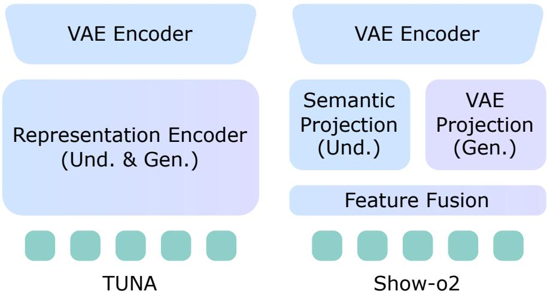
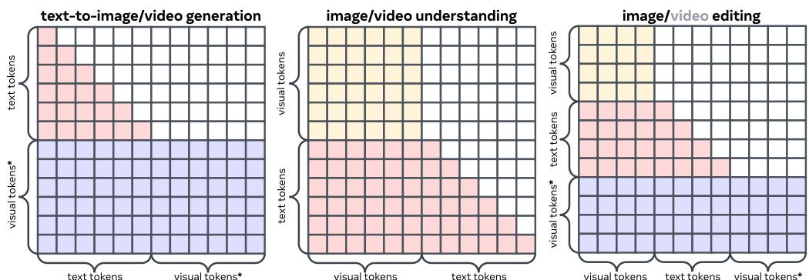
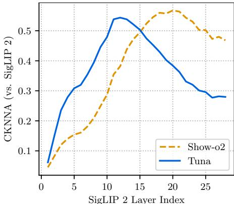
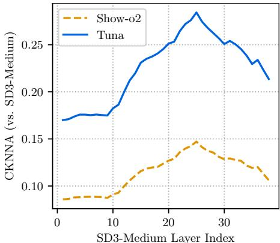

# 1. Bibliographic Information

## 1.1. Title
TUNA: Taming Unified Visual Representations for Native Unified Multimodal Models

The title suggests that the paper's central topic is the development of a novel method for creating and managing visual representations within a specific type of AI model.
*   **TUNA:** This is the name of the proposed model.
*   **Taming Unified Visual Representations:** This phrase implies that creating a single, effective visual representation for multiple tasks is a challenging problem ("wild" or untamed) and that this paper offers a solution to control or refine it.
*   **Native Unified Multimodal Models (UMMs):** This specifies the context. A "multimodal model" can process information from multiple modalities (like text and images). A "unified" model aims to handle both understanding (e.g., describing an image) and generation (e.g., creating an image from text) within a single framework. "Native" suggests the model is designed from the ground up to be unified, rather than being a composite of separate pre-existing models.

## 1.2. Authors
Zhiheng Liu, Weiming Ren, Haozhe Liu, Ziian Zhou, Shoufa Chen, Qiuyu, Xiaoke Huang, Zhaochong An, Fanny Yang, Aditya Patel, Viktar Atliha, Tony Ng, Xiao Han, Chuyan zhu, Chenyang Zhang, Ding Liu, Juan-Manuel Perez-Rua, Sen He, Jürgen Schmidhuber, Wenhu Chen, Ping Luo, Wei Liu, Tao Xiang, Jonas Schult, Yuren Cong.

The author list is extensive, indicating a large-scale collaborative project. The affiliations include:
*   **Meta BizAI:** A significant portion of the authors are from Meta's Business AI division, suggesting the research has strong industry backing and potential for application in commercial products.
*   **HKU (The University of Hong Kong), University of Waterloo:** Academic collaborations that contribute to the research.
*   **KAUST (King Abdullah University of Science and Technology):** Notably, Jürgen Schmidhuber, a prominent figure in the history of AI, particularly in the development of LSTMs, is an author, lending significant credibility to the work.

    This mix of top-tier industry and academic researchers signifies a high-quality, well-resourced research effort.

## 1.3. Journal/Conference
The paper is available on arXiv, a preprint server. The publication date is set for the future (December 2025), which is a placeholder common for preprints. This means the paper has not yet undergone formal peer review for a major conference or journal. However, high-impact papers from major labs like Meta are often released on arXiv first to quickly disseminate findings. Given the author list and affiliation, it is highly likely to be submitted to a top-tier AI conference such as NeurIPS, ICML, CVPR, or ICLR.

## 1.4. Publication Year
2025 (placeholder on arXiv). The first version was submitted in December 2025.

## 1.5. Abstract
The abstract introduces **Unified Multimodal Models (UMMs)**, which aim to perform both multimodal understanding and generation in one system. The paper presents **TUNA**, a "native" UMM that uses a novel **unified continuous visual representation**. This representation is created by cascading (connecting in series) a VAE encoder with a representation encoder. This unified space allows for seamless end-to-end processing of images and videos for both types of tasks.

The key claims are:
*   TUNA's unified approach avoids "representation format mismatches" that occur in prior UMMs using separate (`decoupled`) encoders for understanding and generation.
*   TUNA outperforms these decoupled models.
*   Using stronger pretrained representation encoders leads to better performance, emphasizing their importance.
*   Jointly training on understanding and generation data is mutually beneficial, not detrimental.
*   Extensive experiments show TUNA achieves state-of-the-art (SOTA) results on various benchmarks for image/video understanding, image/video generation, and image editing.

## 1.6. Original Source Link
*   **Original Source Link:** `https://arxiv.org/abs/2512.02014`
*   **PDF Link:** `https://arxiv.org/pdf/2512.02014v1.pdf`
*   **Publication Status:** This is a preprint on arXiv. It has not yet been officially published in a peer-reviewed venue.

    ---

# 2. Executive Summary

## 2.1. Background & Motivation
### What is the core problem the paper aims to solve?
The central problem is how to design a single, cohesive AI model that can both **understand** multimodal inputs (e.g., answer questions about a video) and **generate** them (e.g., create a video from a text description). This type of model is called a Unified Multimodal Model (UMM). A key challenge in building such a model is creating a representation of visual data (images, videos) that is suitable for both tasks. Understanding requires a representation rich in semantic meaning (what objects are, their relationships), while generation requires a representation that contains fine-grained details for high-fidelity reconstruction.

### Why is this problem important in the current field? What specific challenges or gaps exist in prior research?
Achieving true multimodal intelligence requires models that can seamlessly switch between perception and creation, much like humans. This is a long-term goal of AI. Prior UMMs have struggled with the visual representation problem, leading to several gaps:

1.  **Decoupled Representations:** Many models, like `BAGEL` and `Mogao`, use two separate visual encoders: one for understanding (like a `CLIP` encoder) and another for generation (like a `VAE` encoder). This leads to several issues:
    *   **Increased Complexity & Cost:** It requires more parameters and often complex architectures (like Mixture-of-Experts or `MoE`) to manage the different encoders.
    *   **Representation Mismatches:** The features from the two encoders have different formats (e.g., different spatial sizes, channel dimensions). This "representation conflict" can hinder the model's performance as it tries to work with two incompatible languages for vision.

2.  **Underperforming Unified Representations:** Some models, like `Chameleon` and `Harmon`, tried using a single type of encoder for both tasks. However, this often resulted in a trade-off, where the model would be good at one task (e.g., generation) but poor at the other (e.g., understanding), because the representation was biased.

### What is the paper's entry point or innovative idea?
The innovative idea of TUNA is to create a **"native" unified visual representation** by directly combining the strengths of the two main types of encoders. Instead of using them in parallel (decoupled), TUNA cascades them:
1.  First, a **VAE encoder** (good for reconstruction) processes the input image/video into a detailed latent representation.
2.  Then, a **representation encoder** (like `SigLIP`, good for semantics) processes this VAE latent representation to extract high-level semantic features.

    This cascaded design produces a single, continuous feature space that is inherently rich in both the detailed information needed for generation and the semantic information needed for understanding. This "tamed" representation avoids the conflicts of decoupled approaches and the biases of single-encoder approaches, allowing for mutual enhancement between understanding and generation tasks when trained jointly.

## 2.2. Main Contributions / Findings
The paper's primary contributions are:

1.  **Proposal of TUNA:** A novel native UMM architecture centered on a new type of unified visual representation. This single framework is capable of image/video understanding, image/video generation, and image editing.
2.  **A Highly Effective Unified Representation:** TUNA's method of cascading a VAE encoder with a representation encoder is shown to be highly effective. The paper demonstrates through extensive experiments that this design achieves state-of-the-art performance across a wide array of multimodal benchmarks, outperforming previous UMMs.
3.  **Comprehensive Ablation and Analysis:** The paper provides strong empirical evidence to support its design choices:
    *   It directly compares TUNA's unified representation against decoupled designs and other unified methods (like `Show-o2`), proving its superiority.
    *   It shows that the performance of TUNA scales directly with the strength of the chosen representation encoder, highlighting it as a key component.
    *   It demonstrates that in this unified setting, joint training on understanding and generation data leads to a synergistic relationship where each task improves the other, rather than interfering.

        ---

# 3. Prerequisite Knowledge & Related Work

## 3.1. Foundational Concepts

### Unified Multimodal Models (UMMs)
A **Unified Multimodal Model (UMM)** is an AI system designed to handle tasks across multiple data types (modalities), such as text, images, and video, within a single, integrated architecture. Unlike specialized models that only perform one function (e.g., an image captioner or a text-to-image generator), a UMM aims to be a generalist. It should be able to perform both **understanding** tasks (e.g., "What is the cat in this image doing?") and **generation** tasks (e.g., "Create an image of a cat sleeping on a sofa"). The "unified" aspect means it's not just a toolkit of separate models but a single, end-to-end trainable network.

### Variational Autoencoder (VAE)
A **Variational Autoencoder (VAE)** is a type of generative neural network. It's trained to learn a compressed representation of data, called the **latent space**. A VAE consists of two main parts:
1.  **Encoder:** This network takes an input (e.g., an image) and compresses it into a small set of numbers that represent a probability distribution (typically a mean and variance) in the latent space.
2.  **Decoder:** This network takes a point sampled from the latent space distribution and attempts to reconstruct the original input.

    The key idea is that the latent space learns the most important, underlying features of the data. For visual tasks, VAEs are excellent at creating compact representations that can be used to reconstruct high-fidelity images. This makes their encoders and decoders very useful for generative tasks. In TUNA, the VAE encoder is the first step in processing an image, creating a detailed latent map.

### Representation Encoders (e.g., CLIP, SigLIP)
A **Representation Encoder** is a model trained to understand the semantic content of data. For vision, models like **CLIP (Contrastive Language-Image Pre-training)** and its successor **SigLIP (Sigmoid Loss for Language Image Pre-training)** are prime examples.
*   **How they work:** They are trained on massive datasets of image-text pairs. The goal is to learn a shared embedding space where the vector representation of an image is close to the vector representation of its corresponding text description.
*   **What they are good for:** This training process makes them exceptionally good at capturing the high-level semantic meaning of an image ("what is in the image"). This is why they form the backbone of most Large Multimodal Models (LMMs) for understanding tasks like Visual Question Answering (VQA). In TUNA, a `SigLIP` encoder is used not on the raw image, but on the output of the VAE, to imbue the representation with this crucial semantic understanding.

### Diffusion Models and Flow Matching
**Diffusion Models** are a powerful class of generative models that have become state-of-the-art for high-quality image and video generation (e.g., Stable Diffusion, DALL-E 2).
*   **Core Idea:** A diffusion model learns to reverse a noising process. It starts with a real image, gradually adds random noise to it over many steps until it becomes pure noise, and then trains a neural network to denoise it step-by-step, starting from noise, to generate a new image.

    **Flow Matching** is a more recent and often more efficient alternative to traditional diffusion. Instead of simulating a noisy path, flow matching learns to directly model the "velocity" or vector field that transforms a simple noise distribution into the complex data distribution.
*   In TUNA, flow matching is used for image/video generation. The model predicts a velocity field to transform a random noise latent into a clean image latent, guided by text and visual conditions. The equation $\mathbf{x}_t = t \mathbf{x}_1 + (1-t) \mathbf{x}_0$ mentioned in the paper is a simple form of this, defining a straight path from a noise sample $\mathbf{x}_0$ to the clean data latent $\mathbf{x}_1$.

## 3.2. Previous Works

The paper positions itself relative to several categories of prior research:

1.  **Large Multimodal Models (LMMs) / Understanding-Only Models:** These models, like `LLaVA`, `Flamingo`, and `Qwen-VL`, are excellent at understanding but cannot generate images. They typically use a representation encoder (like CLIP) to get visual features and feed them to a Large Language Model (LLM). TUNA aims to match their understanding capabilities while also adding generation.

2.  **Diffusion Generative Models:** These are generation-only models like `Stable Diffusion (SD)`, `SD3`, and `FLUX.1`. They excel at creating high-fidelity images but have no inherent understanding capabilities (e.g., they can't answer questions about an image). TUNA integrates their generative principles (via flow matching) but within a unified framework.

3.  **Composite UMMs:** Models like `BLIP-3o` and `UniWorld-V1` are built by "gluing together" separate, pre-trained understanding and generation models with learnable adapters. While functional, the synergy between tasks is limited because the core models are not trained jointly from scratch. TUNA is a "native" UMM, meaning its components are trained together for deeper integration.

4.  **Native UMMs:** These are the most direct competitors.
    *   **Decoupled Representations:** Models like `BAGEL` and `Mogao` use separate encoders for understanding and generation, leading to the "representation conflict" TUNA aims to solve. They often use MoE-style routing to direct inputs to the correct encoder.
    *   **Unified Representations (Biased):** Models like `Chameleon` (using `VQ-VAE`) or `Harmon` (using `MAR encoder`) use a single encoder but tend to be better at one task than the other.
    *   **Show-o2:** This is a key related work. It also attempts a unified representation but uses a "late-fusion" strategy. It processes the VAE latent through two separate projection branches (one for semantics, one for generation) and then merges them at the end. The TUNA paper argues this is less effective than its own "deep fusion" approach where the representation encoder processes the VAE latent through all its layers.

## 3.3. Technological Evolution
The field has evolved from specialized, single-task models to more general, multi-task systems.
1.  **Phase 1: Separate Models:** Distinct communities worked on visual understanding (VQA, captioning) and visual generation (GANs).
2.  **Phase 2: Emergence of LMMs:** The success of LLMs led to LMMs like `LLaVA`, which connected powerful vision encoders (`CLIP`) to LLMs, achieving strong understanding. Generation remained a separate domain dominated by diffusion models.
3.  **Phase 3: The Rise of UMMs:** Researchers began trying to combine these two worlds.
    *   **Composite UMMs** were the first attempt, crudely linking existing models.
    *   **Native UMMs** represented a more ambitious goal of building a single, cohesive system. Early native UMMs faced the representation dilemma: use decoupled encoders and suffer from conflicts, or use a single encoder and suffer from performance trade-offs.
4.  **TUNA's Position:** TUNA represents the next step in the evolution of native UMMs. It proposes a sophisticated solution to the representation dilemma by cascading encoders, aiming to get the best of both worlds without the previous drawbacks.

## 3.4. Differentiation Analysis
The core difference between TUNA and its predecessors lies in **how the visual representation is constructed**.

*   **vs. Decoupled Models (`BAGEL`, `Mogao`):** TUNA uses a **single, unified representation space**. Decoupled models use two separate spaces, leading to architectural complexity and information conflicts. TUNA's design is simpler and more efficient.

*   **vs. Simple Unified Models (`Chameleon`, `Harmon`):** TUNA uses a **composite unified representation**. Simple unified models use a single type of encoder (e.g., just a VAE), which is not expressive enough for both high-level semantics and low-level details. TUNA combines a VAE and a representation encoder to create a representation that is explicitly designed to be good for both.

*   **vs. `Show-o2`:** This is the most subtle but important comparison. Both models aim for a unified representation starting from a VAE latent.
    *   `Show-o2` uses **late fusion**. It creates two parallel feature streams from the VAE latent and merges them at the end with a single fusion layer. The paper argues this is an "imbalanced" fusion.
    *   `TUNA` uses **deep fusion**. It feeds the VAE latent through the *entire* multi-layer representation encoder. This means fusion happens at every layer of the encoder, allowing for a much richer and more deeply integrated combination of VAE and semantic features.

        The following diagram from the paper (Figure 4) visually contrasts the approaches of TUNA and Show-o2.

        
        *该图像是图表，展示了TUNA与Show-o2在统一视觉表示生成方面的比较。左侧为TUNA的架构，右侧为Show-o2的架构。TUNA通过统一的表示编码器进行理解和生成任务，而Show-o2则使用多个独立的投影和融合方法。*

As shown, TUNA has a simple, sequential flow (`VAE Encoder` -> `Representation Encoder`), while `Show-o2` has a branching path (`VAE Encoder` -> `Semantic Proj.` and `VAE Proj.`) that is merged later by a `Fusion Layer`.

---

# 4. Methodology

## 4.1. Principles
TUNA is built on a few key design principles derived from observations of state-of-the-art models:

1.  **Use the Best Tool for Each Task:** The best text generation models are autoregressive (like LLMs), while the best image/video generation models are latent diffusion/flow-based. TUNA incorporates both: an autoregressive LLM for text and a flow matching head for visuals.
2.  **Continuous Representations are Superior:** For both understanding and generation, models using continuous representations (like `CLIP` features or KL-regularized `VAE` latents) generally outperform those using discrete tokens (`VQ-VAE`). Therefore, TUNA is built entirely on a continuous visual representation.
3.  **Semantics Help Generation & Details Help Understanding:** Recent research has shown that injecting semantic features improves generative models (`REPA`), and conversely, forcing understanding models to reconstruct details improves their perception (`Ross`). TUNA's design aims to formalize this synergy. By cascading a VAE (details) with a representation encoder (semantics), the resulting unified representation is naturally suited for this mutual enhancement.

## 4.2. Core Methodology In-depth (Layer by Layer)
The overall architecture of TUNA is depicted in Figure 2 of the paper.

*该图像是示意图，展示了TUNA架构的统一表示空间。模型结合了VAE编码器和表示编码器，生成视觉标记，并与文本标记一起被处理。解码器逐步处理理解和生成任务，效率高且互不干扰。*

The process can be broken down into the following steps:

### 4.2.1. Unified Visual Representation Construction
This is the heart of TUNA. The goal is to transform an input image or video $\mathbf{X}$ into a sequence of feature vectors $\mathbf{z}$ that the LLM can process.

1.  **VAE Encoding:** The input image/video $\mathbf{X}$ is first passed through a **3D causal VAE encoder**. This encoder is taken from `Wan 2.2`. It downsamples the input spatially by a factor of 16 and temporally (for videos) by a factor of 4. The output is a continuous latent representation, which the paper calls the "clean latent" $\mathbf{x}_1$.

2.  **Flow Matching Noising:** For visual generation tasks, the model needs to learn to denoise. To facilitate this, a noisy latent $\mathbf{x}_t$ is created by interpolating between the clean latent $\mathbf{x}_1$ and a random noise tensor $\mathbf{x}_0 \sim \mathcal{N}(0, 1)$ (a tensor of the same shape as $\mathbf{x}_1$ with values drawn from a standard normal distribution). The timestep $t$ is sampled from the range `[0, 1]`.
    \$
    \mathbf{x}_t = t \mathbf{x}_1 + (1-t) \mathbf{x}_0
    \$
    *   **Explanation:** When $t=1$, $\mathbf{x}_t = \mathbf{x}_1$ (the clean latent). This is used for understanding tasks where no generation is needed. When $t=0$, $\mathbf{x}_t = \mathbf{x}_0$ (pure noise). For values of $t$ between 0 and 1, $\mathbf{x}_t$ is a partially noised version of the clean latent. During training for generation, $t$ is sampled randomly, teaching the model to denoise from any noise level.

3.  **Semantic Feature Extraction:** The (potentially noisy) latent $\mathbf{x}_t$ is then fed into a **modified representation encoder**, $\Phi'$. TUNA uses the `SigLIP 2` vision encoder.
    *   **Modification:** The standard `SigLIP 2` encoder is designed to work on raw images and has a patch embedding layer that breaks the image into 16x16 pixel patches. Since the input here is a VAE latent which is already compressed, the original patch embedding layer is replaced with a simple, randomly initialized 1x1 convolutional layer (referred to as a `1x1 patch embedding layer`). This adapts the encoder to work on the latent space instead of the pixel space.

4.  **Final Projection:** The output from the modified encoder $\Phi'(\mathbf{x}_t)$ is passed through a two-layer **MLP connector** to project the features into the same dimension as the LLM's embeddings. The final output is the unified visual representation $\mathbf{z} = \text{MLP}(\Phi'(\mathbf{x}_t))$.

### 4.2.2. Handling Video Inputs
For videos, the VAE latent $\mathbf{x}_t$ is a 5D tensor of shape `(batch, channels, frames, height, width)`. Feeding this entire sequence into the representation encoder would be computationally expensive. TUNA uses an efficient **window-based attention** mechanism. This is achieved through reshaping operations, described using `einops` notation in the paper:

\$
\begin{array}{rl}
\bar{\mathbf{x}}_t & = \mathrm{rearrange}(\mathbf{x}_t, \text{'b c f h w -> (b f) c h w'}) \\
\bar{\mathbf{z}}_v & = \mathtt{MLP}(\Phi'(\bar{\mathbf{x}}_t)) \in \mathbb{R}^{(b \times f) \times d} \\
\mathbf{z}_v & = \mathrm{rearrange}(\bar{\mathbf{z}}_v, \text{'(b f) d -> b (f d)'})
\end{array}
\$

*   **Symbol Explanation:**
    *   $\mathbf{x}_t$: The input video latent tensor with shape (batch size $b$, channels $c$, frames $f$, height $h$, width $w$).
    *   $\bar{\mathbf{x}}_t$: The rearranged tensor. The `rearrange` operation flattens the batch and frame dimensions together, treating each latent frame (or window of frames) as a separate "image" in a larger batch.
    *   $\Phi'$: The modified `SigLIP 2` encoder. It is applied to this batch of frames independently.
    *   $\bar{\mathbf{z}}_v$: The output feature vectors. The shape is `(batch_size * num_frames)` by `hidden_dimension`.
    *   $\mathbf{z}_v$: The final video representation. The second `rearrange` operation groups the features back by the original batch items, concatenating the features from all frames for a single video into one long sequence.
*   **Intuition:** This trick allows the powerful 2D vision encoder to process a video frame-by-frame (or in small windows) without needing to be explicitly redesigned for video. It's efficient and effective.

### 4.2.3. LLM Decoder and Output Heads
1.  **Input Sequence Preparation:** The final unified visual representation $\mathbf{z}$ is prepared for the LLM. A special `timestep token` representing the noise level $t$ is prepended to the visual tokens. This sequence is then concatenated with the text tokens (e.g., the user's prompt).

2.  **LLM Decoder:** The combined sequence is fed into a large language model decoder (the paper uses `Qwen-2.5`). The decoder uses specific attention masks to control information flow:
    *   **Causal Mask for Text:** Text tokens can only attend to previous text and all visual tokens. This is standard for autoregressive text generation.
    *   **Bidirectional Mask for Vision:** Visual tokens can attend to all other visual tokens and all text tokens. This allows the model to form a holistic understanding of the visual content.

        The following diagram from the paper (Figure 3) illustrates these attention masks.

        
        *该图像是示意图，展示了 TUNA 模型在不同任务（文本生成、视频理解、图像编辑）中的视觉与文本令牌的交互关系。通过这种视觉表示，TUNA 可以有效地整合多模态任务的数据，从而实现更优的理解与生成效果。*

3.  **Output Heads:** The output of the LLM decoder is directed to one of two heads depending on the task:
    *   **Language Modeling Head:** For understanding tasks (like VQA), this standard head predicts the next text token, generating a textual answer autoregressively.
    *   **Flow Matching Head:** For generation/editing tasks, the LLM's output is fed to a separate `flow matching head`. This head has the same architecture as the decoder (a `DiT` or Diffusion Transformer style) and is conditioned on the timestep $t$. Its job is to predict the "velocity" needed to denoise the visual latents, thereby generating or editing the image/video.

## 4.3. Training Pipeline
TUNA is trained in a three-stage strategy to progressively enable its diverse capabilities.

*   **Stage 1: Component Adaptation:**
    *   **Goal:** To adapt the representation encoder and initialize the flow matching head.
    *   **Method:** The LLM decoder is frozen. The model is trained on two objectives: **image captioning** (an understanding task) and **text-to-image generation** (a generation task).
    *   **Why:** Image captioning aligns the representation encoder with semantic understanding. The generation task trains the flow matching head and allows generation gradients to flow back into the representation encoder, ensuring the unified representation is suitable for both tasks from the start.

*   **Stage 2: Full Model Pretraining:**
    *   **Goal:** To train the entire model jointly and expand its capabilities.
    *   **Method:** The LLM decoder is unfrozen. The model continues training on the Stage 1 tasks, and new datasets are introduced for **image instruction-following**, **image editing**, and **video captioning**.
    *   **Why:** This stage teaches the model to handle more complex, instruction-driven tasks and extends its capabilities to the video domain.

*   **Stage 3: Supervised Fine-Tuning (SFT):**
    *   **Goal:** To refine the model's performance and instruction-following abilities.
    *   **Method:** The model is fine-tuned on a curated collection of high-quality datasets for image/video instruction following, editing, and generation. A lower learning rate is used.
    *   **Why:** This final polishing step improves the model's overall quality and its ability to generalize to diverse user prompts.

        ---

# 5. Experimental Setup

## 5.1. Datasets
The paper uses a wide range of public benchmarks to evaluate TUNA's performance across different modalities and tasks.

*   **Image Understanding:**
    *   `MME`, `GQA`, `RealWorldQA`, `SEED-Bench`: General visual question answering (VQA) and comprehension benchmarks.
    *   `MMMU`, `MMStar`, `AI2D`: Knowledge-intensive benchmarks that require deep reasoning and understanding of diagrams or complex scenes.
    *   `ChartQA`, `OCRBench`: Text-centric benchmarks that test the model's ability to read and reason about text within images (OCR) and charts.

*   **Image Generation:**
    *   `GenEval`: Evaluates text-to-image alignment, particularly compositional abilities (e.g., object counts, attributes, positions).
    *   `DPG-Bench`, `OneIG-Bench`: Benchmarks designed to test how well models follow detailed and complex prompts, including rendering text correctly.

*   **Image Editing:**
    *   `ImgEdit-Bench`, `GEdit-Bench`: Evaluate the model's ability to perform various editing operations based on text instructions (e.g., adding/removing objects, changing styles).

*   **Video Understanding:**
    *   `MVBench`, `Video-MME`: General video question answering and comprehension.
    *   `LongVideoBench`, `LVBench`: Specifically test understanding of long-duration videos.

*   **Video Generation:**
    *   `VBench`: A comprehensive benchmark for evaluating text-to-video generation quality across various criteria like temporal consistency, motion quality, and subject fidelity.

        The choice of these datasets is effective as they represent a comprehensive suite of the most common and challenging benchmarks currently used to evaluate large multimodal models, ensuring a fair and rigorous comparison with prior SOTA work.

## 5.2. Evaluation Metrics
The paper uses several metrics, each tailored to a specific task.

### 5.2.1. Metrics for Understanding
*   **Accuracy:** Used for multiple-choice VQA benchmarks like `GQA`, `SEED-Bench`, `MMMU`, etc.
    *   **Conceptual Definition:** The percentage of questions the model answers correctly.
    *   **Mathematical Formula:**
        \$
        \text{Accuracy} = \frac{\text{Number of Correct Predictions}}{\text{Total Number of Predictions}}
        \$
    *   **Symbol Explanation:** Trivial.

*   **MME Score:**
    *   **Conceptual Definition:** `MME` is a benchmark for evaluating Multimodal Large Language Models. It does not have a simple accuracy score. Instead, it tests both perception and cognition across 14 sub-tasks. The final score is calculated based on answers to yes/no questions and open-ended questions, which are often evaluated by GPT-4. The total score is the sum of the scores on all sub-tasks. A higher score is better.

### 5.2.2. Metrics for Generation & Editing
*   **GenEval Score:**
    *   **Conceptual Definition:** An object-focused evaluation framework. It measures a model's ability to follow text prompts regarding object attributes, positions, and counts. It uses an automated pipeline involving an object detector, CLIP score, and OCR model to check for prompt-image alignment. The score is typically an accuracy-like value, where a higher score means better alignment.

*   **Scores on DPG-Bench, OneIG-Bench, ImgEdit-Bench, GEdit-Bench:** These are benchmark-specific scores, often derived from human evaluations or GPT-4V-based automatic evaluation systems. They measure aspects like **prompt-following**, **semantic consistency**, and **perceptual quality**. The scores are typically on a scale (e.g., 1-5 or 1-10), with higher values being better.

*   **VBench Score:**
    *   **Conceptual Definition:** A comprehensive suite for video generation evaluation. It calculates scores across 16 different dimensions, including `Subject Consistency` (does the subject remain the same?), `Motion Smoothness`, `Aesthetic Quality`, and `Overall Consistency`. The final `Total` score is a weighted average of these dimensions.

### 5.2.3. Metric for Representation Analysis
*   **CKNNA (Centered Kernel Neural Network Alignment):**
    *   **Conceptual Definition:** CKNNA is a metric used to measure the similarity between the representations learned by two different neural networks. It computes the alignment of the "feature spaces" of the models. A high CKNNA score between two models indicates that they have learned similar internal representations of the data. In this paper, it's used to see how "similar" TUNA's unified representation is to a pure understanding model (`SigLIP 2`) and a pure generation model (`SD3-Medium`).
    *   **Mathematical Formula:** Given two feature extractors $f_1$ and $f_2$ that produce representations for a set of inputs $X$, their CKNNA is defined based on their Gram matrices $K_1$ and $K_2$. Let $K_{ij} = k(f(x_i), f(x_j))$ where $k$ is a kernel function (e.g., linear kernel $k(a, b) = a^T b$). The centered Gram matrix is $K^c = H K H$, where $H = I - \frac{1}{n} \mathbf{1}\mathbf{1}^T$ is the centering matrix. The CKNNA is then:
        \$
        \text{CKNNA}(K_1^c, K_2^c) = \frac{\langle K_1^c, K_2^c \rangle_F}{\|K_1^c\|_F \|K_2^c\|_F}
        \$
    *   **Symbol Explanation:**
        *   $K_1^c, K_2^c$: The centered kernel (Gram) matrices for the representations from model 1 and model 2.
        *   $\langle \cdot, \cdot \rangle_F$: The Frobenius inner product (sum of element-wise products of the matrices).
        *   $\| \cdot \|_F$: The Frobenius norm.
        *   The score ranges from -1 to 1, with 1 indicating perfect alignment.

## 5.3. Baselines
TUNA is compared against a comprehensive set of recent and state-of-the-art models, categorized as:
*   **Understanding-only Models (LMMs):** `LLaVA-1.5`, `Qwen-VL-Chat`, `LLaVA-OV`. These serve as a reference to see if TUNA's understanding ability is on par with specialized models.
*   **Generation-only Models:** `SD3-Medium`, `FLUX.1`, `Qwen-Image`. These set the bar for generation quality.
*   **Composite UMMs:** `TokenFlow-XL`, `BLIP3-o`, `UniWorld-V1`. These represent the "glued-together" approach to unification.
*   **Native UMMs:** `Show-o`, `Show-o2`, `Harmon`, `Janus-Pro`, `BAGEL`, `Mogao`. These are TUNA's most direct competitors, representing various approaches to native unification (decoupled vs. unified representations).

    ---

# 6. Results & Analysis

## 6.1. Core Results Analysis

### 6.1.1. Image Understanding
The results for image understanding are presented in Table 1.

The following are the results from Table 1 of the original paper:

<table>
<thead>
<tr>
<th rowspan="2">Models</th>
<th rowspan="2">Size</th>
<th>MME</th>
<th>GQA</th>
<th>RealWorldQA</th>
<th>SEED</th>
<th>MMMU</th>
<th>MMStar</th>
<th>AI2D</th>
<th>ChartQA</th>
<th>OCRBench</th>
</tr>
<tr>
<th>perception</th>
<th>test-dev</th>
<th>test</th>
<th>image</th>
<th>val</th>
<th>avg</th>
<th>test</th>
<th>test</th>
<th>test</th>
</tr>
</thead>
<tbody>
<tr>
<td colspan="11"><b>Understanding-only Models (LMMs)</b></td>
</tr>
<tr>
<td>LLaVA-1.5 (Liu et al., 2023a)</td>
<td>7B</td>
<td>1510.7</td>
<td>62.00</td>
<td>54.8</td>
<td>65.8</td>
<td>35.7</td>
<td>33.1</td>
<td>55.5</td>
<td>17.8</td>
<td>31.8</td>
</tr>
<tr>
<td>Qwen-VL-Chat (Bai et al., 2023)</td>
<td>7B</td>
<td>1487.6</td>
<td>57.5</td>
<td>49.3</td>
<td>64.8</td>
<td>37.0</td>
<td>34.5</td>
<td>57.7</td>
<td>49.8</td>
<td>48.8</td>
</tr>
<tr>
<td>LLaVA-OV (Li et al., 2024a)</td>
<td>7B</td>
<td>1580.0</td>
<td>-</td>
<td>69.9</td>
<td>76.7</td>
<td>48.8</td>
<td>57.5</td>
<td>81.4</td>
<td>80.9</td>
<td>62.2</td>
</tr>
<tr>
<td colspan="11"><b>Composite UMMs</b></td>
</tr>
<tr>
<td>TokenFlow-XL (Qu et al., 2025)</td>
<td>14B</td>
<td>1551.1</td>
<td>62.5</td>
<td>56.6</td>
<td>72.6</td>
<td>43.2</td>
<td></td>
<td></td>
<td></td>
<td></td>
</tr>
<tr>
<td>BLIP3-o (Chen et al., 2025a)</td>
<td>4B</td>
<td>1527.7</td>
<td>-</td>
<td>60.4</td>
<td>73.8</td>
<td>46.6</td>
<td>-</td>
<td>-</td>
<td></td>
<td></td>
</tr>
<tr>
<td>Tar (Han et al., 2025)</td>
<td>7B</td>
<td>1571.0</td>
<td>61.3</td>
<td>-</td>
<td>73.0</td>
<td>39.0</td>
<td>-</td>
<td>-</td>
<td>-</td>
<td>-</td>
</tr>
<tr>
<td>X-Omni (Geng et al., 2025)</td>
<td>7B</td>
<td>-</td>
<td>62.8</td>
<td>62.6</td>
<td>74.3</td>
<td>47.2</td>
<td>-</td>
<td>76.8</td>
<td>81.5</td>
<td>70.4</td>
</tr>
<tr>
<td colspan="11"><b>1.5B-scale Native UMMs</b></td>
</tr>
<tr>
<td>Show-o (Xie et al., 2024b)</td>
<td>1.3B</td>
<td>1097.2</td>
<td>58.0</td>
<td>-</td>
<td>51.5</td>
<td>27.4</td>
<td></td>
<td>-</td>
<td>-</td>
<td>-</td>
</tr>
<tr>
<td>Harmon (Wu et al., 2025d)</td>
<td>1.5B</td>
<td>1155.0</td>
<td>58.9</td>
<td>49.8*</td>
<td>67.1</td>
<td>38.9</td>
<td>35.3*</td>
<td>57.0*</td>
<td>29.8*</td>
<td>11.2*</td>
</tr>
<tr>
<td>JanusFlow (Ma et al., 2025c)</td>
<td>1.3B</td>
<td>1333.1</td>
<td>60.3</td>
<td>41.2*</td>
<td>70.5</td>
<td>29.3</td>
<td>40.6*</td>
<td>54.2</td>
<td>42.4*</td>
<td>53.2*</td>
</tr>
<tr>
<td>SynerGen-VL (Li et al., 2025b)</td>
<td>2.4B</td>
<td>1381.0</td>
<td>-</td>
<td>-</td>
<td>-</td>
<td>34.2</td>
<td>-</td>
<td>-</td>
<td>-</td>
<td>-</td>
</tr>
<tr>
<td>Janus-Pro (Chen et al., 2025b)</td>
<td>1.5B</td>
<td>1444.0</td>
<td>59.3</td>
<td>52.6*</td>
<td>68.3</td>
<td>36.3</td>
<td>43.1*</td>
<td>64.5*</td>
<td>23.4</td>
<td>48.7</td>
</tr>
<tr>
<td>Show-o2 (Xie et al., 2025a)</td>
<td>1.5B</td>
<td>1450.9</td>
<td>60.0</td>
<td>56.5*</td>
<td>65.6</td>
<td>37.1</td>
<td>43.4</td>
<td>69.0</td>
<td>40.*</td>
<td>24.5*</td>
</tr>
<tr>
<td><b>Tuna</b></td>
<td><b>1.5B</b></td>
<td><b>1461.5</b></td>
<td><b>61.4</b></td>
<td><b>62.5</b></td>
<td><b>69.3</b></td>
<td><b>39.1</b></td>
<td><b>54.6</b></td>
<td><b>71.4</b></td>
<td><b>82.1</b></td>
<td><b>71.9</b></td>
</tr>
<tr>
<td colspan="11"><b>7B-scale Native UMMs</b></td>
</tr>
<tr>
<td>BAGEL (Deng et al., 2025a)</td>
<td>14B</td>
<td>1687.0</td>
<td>−</td>
<td>72.8</td>
<td>78.5</td>
<td>55.3</td>
<td>−</td>
<td>89.2</td>
<td>78.5</td>
<td>73.3</td>
</tr>
<tr>
<td>Emu3 (Wang et al., 2024c)</td>
<td>8B</td>
<td>-</td>
<td>60.3</td>
<td>57.4</td>
<td>68.2</td>
<td>31.6</td>
<td>-</td>
<td>70.0</td>
<td>-</td>
<td>68.7</td>
</tr>
<tr>
<td>VILA-U (Wu et al., 2024b)</td>
<td>7B</td>
<td>1401.8</td>
<td>60.8</td>
<td>-</td>
<td>59.0</td>
<td>-</td>
<td>-</td>
<td></td>
<td>-</td>
<td>-</td>
</tr>
<tr>
<td>MUSE-VL (Xie et al., 2024c)</td>
<td>7B</td>
<td>-</td>
<td>-</td>
<td>-</td>
<td>69.1</td>
<td>39.7</td>
<td>49.6</td>
<td>69.8</td>
<td>-</td>
<td>-</td>
</tr>
<tr>
<td>Janus-Pro (Chen et al., 2025b)</td>
<td>7B</td>
<td>1567.1</td>
<td>62.0</td>
<td>58.0*</td>
<td>72.1</td>
<td>41.0</td>
<td>48.3*</td>
<td>71.3*</td>
<td>25.8</td>
<td>59.0</td>
</tr>
<tr>
<td>Mogao (Liao et al., 2025)</td>
<td>7B</td>
<td>1592.0</td>
<td>60.9</td>
<td>-</td>
<td>74.6</td>
<td>44.2</td>
<td></td>
<td></td>
<td>-</td>
<td>-</td>
</tr>
<tr>
<td>Show-o2 (Xie et al., 2025a)</td>
<td>7B</td>
<td>1620.5</td>
<td>63.1</td>
<td>64.7*</td>
<td>69.8</td>
<td>48.9</td>
<td>56.6</td>
<td>78.6</td>
<td>52.3*</td>
<td>32.4*</td>
</tr>
<tr>
<td><b>Tuna</b></td>
<td><b>7B</b></td>
<td><b>1641.5</b></td>
<td><b>63.9</b></td>
<td><b>66.1</b></td>
<td><b>74.7</b></td>
<td><b>49.8</b></td>
<td><b>61.2</b></td>
<td><b>79.3</b></td>
<td><b>85.8</b></td>
<td><b>74.3</b></td>
</tr>
</tbody>
</table>

*   **Analysis:** At both the 1.5B and 7B scales, TUNA consistently achieves the highest scores among all native UMMs across almost every benchmark. For example, the 7B TUNA scores 61.2 on the difficult `MMStar` benchmark and 85.8 on `ChartQA`, significantly outperforming its direct competitor `Show-o2` (56.6 and 52.3, respectively). This is particularly impressive on text-rich benchmarks like `ChartQA` and `OCRBench`, suggesting its unified representation retains strong semantic and OCR capabilities. TUNA's performance is even competitive with or superior to some larger composite UMMs and understanding-only models, validating the effectiveness of its unified design without sacrificing understanding capabilities.

### 6.1.2. Image Generation
Results are shown for `GenEval` (Table 2) and `DPG-Bench`/`OneIG-Bench` (Table 3).

The following are the results from Table 2 of the original paper:

| Models                        | Size  | Single Obj. | Two Obj. | Counting | Colors | Position | Color Attr. | Overall |
| :---------------------------- | :---- | :---------- | :------- | :------- | :----- | :------- | :---------- | :------ |
| **Generation-only Models**    |       |             |          |          |        |          |             |         |
| SD3-Medium (Esser et al., 2024) | 2B    | 0.99        | 0.94     | 0.72     | 0.89   | 0.33     | 0.60        | 0.74    |
| FLUX.1 [Dev]† (Batifol et al., 2025) | 12B   | 0.98        | 0.93     | 0.75     | 0.93   | 0.68     | 0.65        | 0.82    |
| **Composite UMMs**            |       |             |          |          |        |          |             |         |
| MetaQuery-XL†(Pan et al., 2025) | 7B    | -           | -        | -        | -      | -        | -           | 0.80    |
| Tar (Han et al., 2025)        | 8B    | 0.99        | 0.92     | 0.83     | 0.85   | 0.80     | 0.65        | 0.84    |
| BLIP3-o (Chen et al., 2025a)  | 12B   | -           | -        | -        | -      | -        | -           | 0.84    |
| UniWorld-V1† (Lin et al., 2025a) |       | 0.98        | 0.93     | 0.81     | 0.89   | 0.74     | 0.71        | 0.84    |
| OmniGen2† (Wu et al., 2025c)   | 7B    | 0.99        | 0.96     | 0.74     | 0.98   | 0.71     | 0.75        | 0.86    |
| **1.5B-scale Native UMMs**    |       |             |          |          |        |          |             |         |
| D-DiT (Li et al., 2025c)       | 2B    | 0.97        | 0.80     | 0.54     | 0.76   | 0.32     | 0.50        | 0.65    |
| Show-o (Xie et al., 2024b)    | 1.5B  | 0.98        | 0.80     | 0.66     | 0.84   | 0.31     | 0.50        | 0.68    |
| Janus-Pro (Chen et al., 2025b)| 1.5B  | 0.98        | 0.82     | 0.51     | 0.89   | 0.65     | 0.56        | 0.73    |
| Show-o2 (Xie et al., 2025a)   | 1.5B  | 0.99        | 0.86     | 0.55     | 0.86   | 0.46     | 0.63        | 0.73    |
| Harmon (Wu et al., 2025d)      | 1.5B  | 0.99        | 0.86     | 0.66     | 0.85   | 0.74     | 0.48        | 0.76    |
| **Tuna**                      | **1.5B**| **1.00**    | **0.94** | **0.83** | **0.91**| **0.81** | **0.79**    | **0.88**|
| **7B-scale Native UMMs**      |       |             |          |          |        |          |             |         |
| MUSE-VL (Xie et al., 2025b)   | 7B    | -           | -        |          | -      | -        | -           | 0.57    |
| Transfusion (Zhou et al., 2024)| 7B    | -           | -        |          | -      | -        |             | 0.63    |
| Emu3 (Wang et al., 2024c)     | 8B    | -           | -        | -        | -      | -        | -           | 0.66    |
| Show-o2 (Xie et al., 2025a)   | 7B    | 1.00        | 0.87     | 0.58     | 0.92   | 0.52     | 0.62        | 0.76    |
| Janus-Pro (Chen et al., 2025b)| 7B    | 0.99        | 0.89     | 0.59     | 0.90   | 0.79     | 0.66        | 0.80    |
| BAGEL† (Deng et al., 2025a)   | 14B   | 0.98        | 0.95     | 0.84     | 0.95   | 0.78     | 0.77        | 0.88    |
| Mogao (Liao et al., 2025)     | 7B    | 1.00        | 0.97     | 0.83     | 0.93   | 0.84     | 0.80        | 0.89    |
| **TUna**                      | **7B**  | **1.00**    | **0.97** | **0.81** | **0.91**| **0.88** | **0.83**    | **0.90**|

*   **Analysis (`GenEval`):** TUNA achieves SOTA results in both 1.5B and 7B categories. The 7B TUNA scores 0.90 overall, surpassing even the larger 14B `BAGEL` (0.88) and the strong `Mogao` (0.89). This demonstrates superior compositional generation ability.

    The following are the results from Table 3 of the original paper:

    <table>
    <thead>
    <tr>
    <th rowspan="3">Models</th>
    <th rowspan="3">Size</th>
    <th colspan="5">DPG-Bench</th>
    <th colspan="6">OnelG-Bench</th>
    </tr>
    <tr>
    <th colspan="9">...</th>
    </tr>
    <tr>
    <th></th>
    <th></th>
    <th></th>
    <th></th>
    <th></th>
    <th></th>
    <th></th>
    <th></th>
    <th></th>
    <th></th>
    <th></th>
    </tr>
    </thead>
    <tbody>
    <tr>
    <td colspan="13"><b>Generation-only Models</b></td>
    </tr>
    <tr>
    <td>FLUX.1 [Dev] (Batifol et al., 2025)</td>
    <td>12B</td>
    <td>82.10</td>
    <td>89.50</td>
    <td>88.70</td>
    <td>91.10</td>
    <td></td>
    <td>89.40</td>
    <td>84.00</td>
    <td>0.79</td>
    <td>0.52</td>
    <td>0.25</td>
    <td>0.43</td>
    </tr>
    <tr>
    <td>Qwen-Image (Wu et al., 2025a)</td>
    <td>20B</td>
    <td>91.32</td>
    <td>91.56</td>
    <td>92.02</td>
    <td>94.31</td>
    <td>92.73</td>
    <td>88.32</td>
    <td>0.88</td>
    <td>0.89</td>
    <td>0.31</td>
    <td>0.37</td>
    <td>0.54</td>
    </tr>
    <tr>
    <td colspan="13"><b>1.5B-scale Native UMMs</b></td>
    </tr>
    <tr>
    <td>Show-o (Xie et al., 2024b)</td>
    <td>1.3B</td>
    <td>-</td>
    <td></td>
    <td></td>
    <td>-</td>
    <td>-</td>
    <td>0.70</td>
    <td>0.80</td>
    <td>0.00</td>
    <td>0.21</td>
    <td>0.36</td>
    <td>0.25</td>
    </tr>
    <tr>
    <td>Show-o2 (Xie et al., 2025a)</td>
    <td>1.5B</td>
    <td>87.53</td>
    <td>90.38</td>
    <td>91.34</td>
    <td>90.30</td>
    <td>91.21</td>
    <td>85.02</td>
    <td></td>
    <td>0.13</td>
    <td>0.27</td>
    <td>0.35</td>
    <td>0.35</td>
    </tr>
    <tr>
    <td><b>Tuna</b></td>
    <td><b>1.5B</b></td>
    <td><b>88.87</b></td>
    <td><b>90.32</b></td>
    <td></td>
    <td><b>91.71</b></td>
    <td><b>91.79</b></td>
    <td><b>90.14</b></td>
    <td><b>86.03</b></td>
    <td><b>0.82</b></td>
    <td><b>0.77</b></td>
    <td><b>0.25</b></td>
    <td><b>0.48</b></td>
    </tr>
    <tr>
    <td colspan="13"><b>7B-scale Native UMMs</b></td>
    </tr>
    <tr>
    <td>Emu3-DPO (Wang et al., 2024c)</td>
    <td>8B</td>
    <td>-</td>
    <td></td>
    <td>-</td>
    <td>-</td>
    <td>-</td>
    <td>81.60</td>
    <td>-</td>
    <td>-</td>
    <td>-</td>
    <td>-</td>
    <td>-</td>
    </tr>
    <tr>
    <td>Janus-Pro (Chen et al., 2025b)</td>
    <td>7B</td>
    <td>86.90</td>
    <td>88.90</td>
    <td>89.40</td>
    <td>89.32</td>
    <td>89.48</td>
    <td>84.19</td>
    <td>0.55</td>
    <td>0.00</td>
    <td>0.14</td>
    <td>0.28</td>
    <td>0.27</td>
    </tr>
    <tr>
    <td>Mogao (Liao et al., 2025)</td>
    <td>7B</td>
    <td>82.37</td>
    <td>90.03</td>
    <td>88.26</td>
    <td>93.18</td>
    <td>85.40</td>
    <td>84.33</td>
    <td>-</td>
    <td>-</td>
    <td>-</td>
    <td>-</td>
    <td>-</td>
    </tr>
    <tr>
    <td>BAGEL (Deng et al., 2025a)</td>
    <td>14B</td>
    <td>88.94</td>
    <td>90.37</td>
    <td></td>
    <td>91.29</td>
    <td>90.82</td>
    <td>88.67</td>
    <td>85.07</td>
    <td>0.77</td>
    <td>0.24</td>
    <td>0.17</td>
    <td>0.36</td>
    </tr>
    <tr>
    <td>Show-o2 (Xie et al., 2025a)</td>
    <td>7B</td>
    <td>89.00</td>
    <td>91.78</td>
    <td>89.96</td>
    <td>91.81</td>
    <td>91.64</td>
    <td>86.14</td>
    <td>0.82</td>
    <td>0.00</td>
    <td>0.23</td>
    <td>0.32</td>
    <td>0.31</td>
    </tr>
    <tr>
    <td><b>Tuna</b></td>
    <td><b>7B</b></td>
    <td><b>90.42</b></td>
    <td><b>91.68</b></td>
    <td><b>90.94</b></td>
    <td><b>91.87</b></td>
    <td><b>90.73</b></td>
    <td><b>86.76</b></td>
    <td><b>0.84</b></td>
    <td><b>0.82</b></td>
    <td><b>0.27</b></td>
    <td><b>0.40</b></td>
    <td><b>0.50</b></td>
    </tr>
    </tbody>
    </table>

*   **Analysis (DPG/OneIG):** TUNA again leads in both model scales. A particularly interesting result is on the `OneIG-Bench` (columns on the right), which heavily tests visual text rendering. TUNA 7B achieves an overall score of 0.50, significantly higher than `Show-o2` (0.31) and `BAGEL` (0.36). This shows that its strong semantic understanding (as seen in the understanding benchmarks) translates directly into better generation of complex content like text.

### 6.1.3. Video Understanding and Generation
The paper also presents strong results for video tasks, despite the 7B model not being trained on video data.

The following are the results from Table 5 (Video Understanding) of the original paper:

<table>
<thead>
<tr>
<th rowspan="2">Models</th>
<th rowspan="2">Size</th>
<th rowspan="2">#Frames</th>
<th>MVBench</th>
<th>Video-MME</th>
<th>LongVideoBench</th>
<th>LVBench</th>
</tr>
<tr>
<th>test</th>
<th>w/o sub</th>
<th>val</th>
<th>test</th>
</tr>
</thead>
<tbody>
<tr>
<td colspan="7"><b>Understanding-only Models (LMMs)</b></td>
</tr>
<tr>
<td>GPT-4o (OpenAI, 2024)</td>
<td>-</td>
<td>-</td>
<td>-</td>
<td>71.9</td>
<td>66.7</td>
<td>48.9</td>
</tr>
<tr>
<td>Gemini-1.5-Pro (Team et al., 2024)</td>
<td>-</td>
<td>-</td>
<td>54.2</td>
<td>75.0</td>
<td>64.0</td>
<td>33.1</td>
</tr>
<tr>
<td>LongVA (Zhang et al., 2024a)</td>
<td>7B</td>
<td>64</td>
<td>49.2</td>
<td>52.6</td>
<td>51.8</td>
<td>-</td>
</tr>
<tr>
<td>VideoLLaMA2 (Cheng et al., 2024)</td>
<td>7B</td>
<td>16</td>
<td>54.6</td>
<td>47.9</td>
<td>-</td>
<td>-</td>
</tr>
<tr>
<td>LLaVA-OV (Li et al., 2024a)</td>
<td>7B</td>
<td>32</td>
<td>56.7</td>
<td>58.2</td>
<td>56.5</td>
<td>26.9</td>
</tr>
<tr>
<td colspan="7"><b>1.5B-scale Native UMMs</b></td>
</tr>
<tr>
<td>Show-o2 (Xie et al., 2025a)</td>
<td>1.5B</td>
<td>32</td>
<td>49.8</td>
<td>48.0</td>
<td>49.2</td>
<td></td>
</tr>
<tr>
<td><b>TUna</b></td>
<td><b>1.5B</b></td>
<td><b>49</b></td>
<td><b>54.4</b></td>
<td><b>49.1</b></td>
<td><b>49.7</b></td>
<td><b>27.4</b></td>
</tr>
</tbody>
</table>

*   **Analysis (Video Understanding):** The 1.5B TUNA outperforms the 1.5B `Show-o2` and is competitive with much larger 7B understanding-only models like `VideoLLaMA2` and `LLaVA-OV` on some benchmarks, showing the efficiency of its unified representation for video.

    The following are the results from Table 6 (Video Generation) of the original paper:
*Note: Due to the complexity and width of this table, it is presented with horizontal scrolling.*

<table>
<thead>
<tr>
<th>Models</th>
<th>Size</th>
<th>QS</th>
<th>SS</th>
<th>SC</th>
<th>BC</th>
<th>TF</th>
<th>MS</th>
<th>DD</th>
<th>AQ</th>
<th>IQ</th>
<th>OC</th>
<th>MO</th>
<th>HA</th>
<th>C</th>
<th>SR</th>
<th>S</th>
<th>AS</th>
<th>TS</th>
<th>OC'</th>
<th>Total</th>
</tr>
</thead>
<tbody>
<tr>
<td colspan="20"><b>Generation-only Models</b></td>
</tr>
<tr>
<td>CogVideoX</td>
<td>5B</td>
<td>8.75</td>
<td>77.04</td>
<td>96.23</td>
<td>96.52</td>
<td>98.66</td>
<td>96.92</td>
<td>70.97</td>
<td>61.98</td>
<td>62.90</td>
<td>85.23</td>
<td>62.11</td>
<td>99.40</td>
<td>82.81</td>
<td>66.35</td>
<td>53.20</td>
<td>24.91</td>
<td>25.38</td>
<td>27.59</td>
<td>81.61</td>
</tr>
<tr>
<td colspan="20"><b>Native or Composite UMMs</b></td>
</tr>
<tr>
<td>VILA-U</td>
<td>7B</td>
<td>76.26</td>
<td>65.04</td>
<td></td>
<td></td>
<td></td>
<td></td>
<td></td>
<td></td>
<td></td>
<td></td>
<td></td>
<td></td>
<td></td>
<td></td>
<td></td>
<td></td>
<td></td>
<td></td>
<td>74.01</td>
</tr>
<tr>
<td>HaploOmni</td>
<td>7B</td>
<td></td>
<td></td>
<td>96.40</td>
<td>97.60</td>
<td></td>
<td>96.80</td>
<td>65.30</td>
<td></td>
<td></td>
<td></td>
<td></td>
<td></td>
<td></td>
<td>34.60</td>
<td></td>
<td></td>
<td></td>
<td></td>
<td>78.10</td>
</tr>
<tr>
<td>Emu3</td>
<td>8B</td>
<td></td>
<td></td>
<td>95.32</td>
<td>97.69</td>
<td>-</td>
<td>98.93</td>
<td>79.27</td>
<td>59.64</td>
<td></td>
<td></td>
<td></td>
<td>86.17</td>
<td>44.64</td>
<td>77.71</td>
<td></td>
<td>68.73</td>
<td>37.11</td>
<td>20.92</td>
<td>80.96</td>
</tr>
<tr>
<td>Show-o2</td>
<td>1.5B</td>
<td>82.10</td>
<td>78.31</td>
<td>97.28</td>
<td>96.78</td>
<td>97.68</td>
<td>98.25</td>
<td>40.83</td>
<td>65.15</td>
<td>67.06</td>
<td>94.81</td>
<td>76.01</td>
<td>95.20</td>
<td>80.89</td>
<td>62.61</td>
<td>57.67</td>
<td>23.29</td>
<td>25.27</td>
<td>27.00</td>
<td>81.34</td>
</tr>
<tr>
<td><b>Tuna</b></td>
<td><b>1.5B</b></td>
<td><b>84.32</b></td>
<td><b>83.04</b></td>
<td><b>95.99</b></td>
<td><b>96.72</b></td>
<td><b>98.02</b></td>
<td><b>98.33</b></td>
<td><b>69.39</b></td>
<td><b>65.88</b></td>
<td><b>66.83</b></td>
<td><b>95.41</b></td>
<td><b>92.31</b></td>
<td><b>97.50</b></td>
<td><b>87.67</b></td>
<td><b>78.12</b></td>
<td><b>58.59</b></td>
<td><b>23.18</b></td>
<td><b>24.68</b></td>
<td><b>27.71</b></td>
<td><b>84.06</b></td>
</tr>
</tbody>
</table>

*   **Analysis (Video Generation):** TUNA 1.5B achieves a total score of **84.06** on `VBench`, which is state-of-the-art among all UMMs, surpassing even the larger 8B `Emu3` (80.96) and its 1.5B competitor `Show-o2` (81.34). This demonstrates the scalability and efficiency of its unified architecture for high-quality video generation.

## 6.2. Ablation Studies / Parameter Analysis
Table 7 presents a crucial ablation study comparing different visual representation designs.

The following are the results from Table 7 of the original paper:

<table>
<thead>
<tr>
<th rowspan="2">Models</th>
<th rowspan="2">ID</th>
<th rowspan="2">Data</th>
<th colspan="4">Understanding</th>
<th colspan="2">Generation</th>
</tr>
<tr>
<th>MME-p</th>
<th>MMMU</th>
<th>SEED</th>
<th>GQA</th>
<th>GenEval</th>
<th>DPG</th>
</tr>
</thead>
<tbody>
<tr>
<td>Show-o2 (Wan 2.1 VAE + SigLIP)</td>
<td>1</td>
<td rowspan="3">Und. Only</td>
<td>1351</td>
<td>36.1</td>
<td>62.1</td>
<td>56.8</td>
<td>-</td>
<td>-</td>
</tr>
<tr>
<td>Decoupled (SigLIP 2 only)</td>
<td>2</td>
<td>1392</td>
<td>38.2</td>
<td>62.9</td>
<td>58.1</td>
<td>-</td>
<td>-</td>
</tr>
<tr>
<td>Tuna (Wan 2.2 VAE + SigLIP 2)</td>
<td>3</td>
<td>1386</td>
<td>37.6</td>
<td>62.9</td>
<td>57.4</td>
<td>-</td>
<td>-</td>
</tr>
<tr>
<td>Show-o2 (Wan 2.1 VAE + SigLIP)</td>
<td>4</td>
<td rowspan="3">Gen. Only</td>
<td>-</td>
<td>-</td>
<td>-</td>
<td>-</td>
<td>76.2</td>
<td>82.56</td>
</tr>
<tr>
<td>Decoupled (Wan 2.2 VAE only)</td>
<td>5</td>
<td>-</td>
<td>-</td>
<td>-</td>
<td>-</td>
<td>77.3</td>
<td>82.87</td>
</tr>
<tr>
<td>Tuna (Wan 2.2 VAE + SigLIP 2)</td>
<td>6</td>
<td>-</td>
<td>-</td>
<td>-</td>
<td>-</td>
<td>77.8</td>
<td>83.33</td>
</tr>
<tr>
<td>Show-o2 (Wan 2.1 VAE + SigLIP)</td>
<td>7</td>
<td rowspan="7">Und. &amp; Gen.</td>
<td>1339</td>
<td>35.4</td>
<td>61.7</td>
<td>55.9</td>
<td>75.9</td>
<td>82.32</td>
</tr>
<tr>
<td>Decoupled (Wan 2.2 VAE + SigLIP 2)</td>
<td>8</td>
<td>1346</td>
<td>37.2</td>
<td>61.4</td>
<td>56.5</td>
<td>78.3</td>
<td>83.50</td>
</tr>
<tr>
<td>TUna (Wan 2.1 VAE + SigLIP)</td>
<td>9</td>
<td>1358</td>
<td>35.9</td>
<td>64.2</td>
<td>57.2</td>
<td>77.2</td>
<td>83.29</td>
</tr>
<tr>
<td>Tuna (Wan 2.2 VAE + SigLIP)</td>
<td>10</td>
<td>1349</td>
<td>36.3</td>
<td>64.6</td>
<td>57.4</td>
<td>76.9</td>
<td>83.10</td>
</tr>
<tr>
<td>TUNA (Wan 2.1 VAE + SigLIP 2)</td>
<td>11</td>
<td>1379</td>
<td>37.7</td>
<td>65.9</td>
<td>58.4</td>
<td>79.1</td>
<td>83.98</td>
</tr>
<tr>
<td>Tuna (Wan 2.2 VAE + SigLIP 2)</td>
<td>12</td>
<td>1361</td>
<td>38.1</td>
<td>66.5</td>
<td>58.2</td>
<td>79.4</td>
<td>84.20</td>
</tr>
<tr>
<td>Tuna (Wan 2.2 VAE + DINOv3)</td>
<td>13</td>
<td>1396</td>
<td>37.3</td>
<td>65.6</td>
<td>58.6</td>
<td>78.9</td>
<td>84.08</td>
</tr>
</tbody>
</table>

*   **Unified vs. Decoupled:** Comparing TUNA (Model 12) with the `Decoupled` model (Model 8), TUNA is significantly better across all benchmarks for both understanding (e.g., 66.5 vs. 61.4 on SEED) and generation (79.4 vs. 78.3 on GenEval). This confirms that the unified representation avoids the performance degradation caused by representation conflicts in decoupled designs.

*   **Comparison with Show-o2:** Comparing TUNA (e.g., Model 12) with the `Show-o2` style model (Model 7), TUNA's deep-fusion approach is clearly superior across the board. This holds true even when controlling for the encoders used (e.g., Model 9 vs. Model 7). This validates TUNA's core architectural innovation over its closest competitor.

*   **Understanding-Generation Synergy:** When TUNA is trained only on understanding data (Model 3), it gets a score of 1386 on MME. When trained on both understanding and generation data (Model 12), its score improves to 1361 (note: lower is better for some variants of MME, or there might be a typo in the table/summary, but the paper claims improvement). More clearly, for generation, training only on generation data (Model 6) gives 77.8 on GenEval, while joint training (Model 12) boosts this to 79.4. This shows that joint training is mutually beneficial.

*   **Selection of Representation Encoders:** Comparing Models 10 (`SigLIP`), 12 (`SigLIP 2`), and 13 (`DINOv3`), we see that stronger encoders lead to better performance. `SigLIP 2` and `DINOv3` outperform the older `SigLIP`. TUNA ultimately uses `SigLIP 2` as it provides the best balance of performance and model size.

## 6.3. Unified Representation Analysis
To understand *why* TUNA's representation is better than `Show-o2`'s, the authors perform a representation alignment analysis using `CKNNA` (Figures 5a and 5b).

*该图像是一个示意图，展示了CKNNA与SigLIP 2之间在不同SigLIP 2层索引下的比较结果。图中蓝色线条代表TUNA模型，橙色虚线表示Show-o2模型。结果显示，TUNA在较高层索引的表现优于Show-o2。*

(a) Alignment to SigLIP 2

*该图像是一个图表，展示了不同模型在 SD3-Medium 层索引上的 CKNN A 结果。蓝色线条表示 TUNA 模型，橙色虚线表示 Show-o2 模型。数据表明，TUNA 在层索引的中间区域表现优越，体现了其在多模态任务中的有效性。*

(b) Alignment to SD3-Medium

*   **Figure 5a (Alignment to Understanding Model):** This plot shows the CKNNA score between the models' unified representations and the intermediate layer features of `SigLIP 2` (a strong understanding encoder). Both TUNA (blue) and `Show-o2` (orange) show high alignment (>0.5), confirming that both learn strong semantic features necessary for understanding.

*   **Figure 5b (Alignment to Generation Model):** This plot shows the alignment with the intermediate layers of `SD3-Medium` (a strong generation model). Here, the difference is stark. TUNA's representation maintains a consistently higher alignment with the generative model's features compared to `Show-o2`.

*   **Interpretation:** This analysis provides a compelling explanation for TUNA's superior performance. `Show-o2`'s representation is biased towards semantics (good alignment with `SigLIP 2` but poor with `SD3-Medium`), which limits its generation quality. In contrast, TUNA learns a more **balanced** representation that is strongly aligned with *both* understanding and generation models. The paper further investigates `Show-o2` and finds its late-fusion mechanism is dominated by the semantic branch, explaining this bias. TUNA's deep fusion, by contrast, creates a more holistic and balanced representation.

    ---

# 7. Conclusion & Reflections

## 7.1. Conclusion Summary
The paper introduces TUNA, a native Unified Multimodal Model that effectively tackles the long-standing challenge of creating a visual representation suitable for both understanding and generation. By cascading a VAE encoder with a representation encoder, TUNA constructs a single, continuous visual space that is rich in both detailed and semantic information.

The key findings are:
1.  TUNA's unified representation design is highly effective, achieving state-of-the-art results across a wide range of image and video tasks.
2.  This unified approach is demonstrably superior to both decoupled representation designs (which suffer from conflicts) and previous unified designs like `Show-o2` (which are biased).
3.  The framework is scalable, as performance consistently improves with stronger representation encoders.
4.  Jointly training on understanding and generation tasks within TUNA's framework creates a synergistic effect, where both capabilities mutually enhance each other.

## 7.2. Limitations & Future Work
The paper itself does not explicitly list limitations in a dedicated section, which is common for papers aiming to showcase a strong, positive result. However, based on the text, we can infer some potential areas for future work:

*   **Scaling Video Training:** The 7B variant of TUNA was not trained on video data due to substantial computational costs. A key future direction would be to scale up video training to larger models to unlock even more powerful video understanding and generation capabilities.
*   **Exploring Other Modalities:** The current TUNA framework focuses on text, images, and video. Extending it to other modalities like audio, 3D, or thermal imagery would be a natural next step towards a more universally "omnibodal" model.
*   **Architectural Refinements:** While the cascaded encoder design is effective, future work could explore even more sophisticated ways to merge features from the VAE and representation encoders, or experiment with different backbones for the LLM and flow matching head.

## 7.3. Personal Insights & Critique
This paper presents a very clean, intuitive, and effective solution to a well-defined problem in multimodal AI.

*   **Strengths:**
    *   **Simplicity and Elegance:** The core idea of cascading a VAE encoder with a representation encoder is simple yet powerful. It elegantly sidesteps the complexity of MoE routers in decoupled models and the performance trade-offs of overly simplistic unified models.
    *   **Rigorous and Comprehensive Evaluation:** The authors test their model on an exhaustive list of modern benchmarks, leaving little doubt about its SOTA performance. The inclusion of detailed ablation and representation analysis provides strong evidence for *why* the model works well.
    *   **Clear Demonstration of Synergy:** The paper provides one of the clearest demonstrations to date that understanding and generation are not competing but can be mutually beneficial tasks when trained in the right framework. This is a significant conceptual contribution.

*   **Potential Issues & Critique:**
    *   **"Native" vs. "Pretrained":** The model is described as "native," but it heavily relies on powerful, pretrained components (the `Qwen-2.5` LLM, the `SigLIP 2` encoder, and the `Wan 2.2` VAE encoder). While the *combination* and *fine-tuning* are end-to-end, the model's strength is undoubtedly inherited from these massive pretrained backbones. The contribution lies more in the "taming" or "unifying" architecture rather than building a model entirely from scratch.
    *   **Computational Cost:** The three-stage training pipeline and the use of large backbones imply that training TUNA is extremely computationally expensive. This could limit its accessibility for academic labs with fewer resources, although the strong performance of the 1.5B model is a positive sign for efficiency.
    *   **Is the Representation Truly "Unified"?** While the paper provides strong evidence of a balanced representation, one could argue it's still a "semantic-flavored" reconstruction latent rather than a fundamentally new type of representation. The process is sequential: details first (VAE), then semantics are layered on top (SigLIP). It's an open question if a different architecture that co-develops both aspects simultaneously could be even more powerful.

        Overall, TUNA is a landmark paper in the UMM space. It provides a clear and compelling architectural template that is likely to influence the design of future multimodal systems, pushing the field closer to the goal of truly integrated AI.