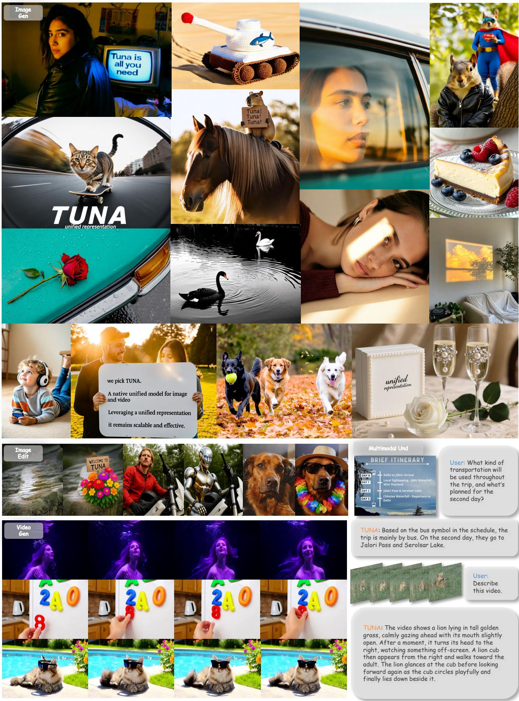

# 1. 论文基本信息

## 1.1. 标题
**TUNA: Taming Unified Visual Representations for Native Unified Multimodal Models**

中文可译为：**TUNA：为原生统一多模态模型驯服统一视觉表示**

论文标题中的 "TUNA" 是一个精心设计的缩写，同时也是模型的名称。"Taming"（驯服）一词非常传神，它暗示了先前的“统一视觉表示”方案是“狂野不羁”的，难以在理解和生成这两个看似矛盾的任务之间取得平衡，而 TUNA 模型则成功地“驯服”了这种表示，使其能够和谐地服务于两个任务。

## 1.2. 作者
论文作者团队规模庞大，主要来自 **Meta BizAI**，同时也有来自香港大学 (HKU)、滑铁卢大学 (University of Waterloo) 和阿卜杜拉国王科技大学 (KAUST) 的研究人员。项目负责人包括 Jonas Schult 和 Yuren Cong。这种来自顶尖工业界实验室和学术机构的合作，通常意味着研究工作具备充足的计算资源和前沿的学术洞察力。

## 1.3. 发表期刊/会议
论文在 `arXiv` 上作为预印本提交，标注的发表时间为未来的 `2025-12-01`。这表明该论文在当前时间点（2025年12月29日）尚未经过同行评审，也未在任何学术会议或期刊上正式发表。`arXiv` 是一个开放获取的预印本平台，研究人员可以在此分享他们最新的研究成果，以获得快速的反馈和广泛的传播。

## 1.4. 发表年份
2025 (根据 `arXiv` 提交信息)

## 1.5. 摘要
统一多模态模型（Unified Multimodal Models, UMMs）旨在单一框架内同时实现多模态的理解与生成。本文提出了 TUNA，一个原生的 UMM。TUNA 通过将一个变分自编码器（VAE）编码器与一个表示编码器（representation encoder）级联，构建了一个**统一的连续视觉表示空间**。这个统一的空间使得模型能够端到端地处理图像和视频，以完成理解和生成任务。与先前采用解耦表示的 UMM 相比，TUNA 的统一视觉空间避免了因使用独立编码器而产生的表示格式不匹配问题，在理解和生成任务上均超越了解耦方案。此外，研究发现，使用更强大的预训练表示编码器能够持续地提升所有多模态任务的性能，凸显了表示编码器的重要性。最后，在这种统一的设定下，同时在理解和生成数据上进行联合训练，能让两个任务**互相增益而非互相干扰**。在多模态理解和生成基准测试上的大量实验表明，TUNA 在图像/视频理解、图像/视频生成以及图像编辑方面均取得了最先进的（state-of-the-art）成果，证明了其统一表示设计的有效性和可扩展性。

## 1.6. 原文链接
*   **arXiv 链接:** [https://arxiv.org/abs/2512.02014](https://arxiv.org/abs/2512.02014)
*   **PDF 链接:** [https://arxiv.org/pdf/2512.02014v1.pdf](https://arxiv.org/pdf/2512.02014v1.pdf)
*   **发布状态:** 预印本 (Preprint)

# 2. 整体概括

## 2.1. 研究背景与动机
当前多模态人工智能领域的一个核心目标是构建能够无缝**理解**和**生成**多种模态（如文本、图像、视频）的单一模型，即<strong>原生统一多模态模型 (Native Unified Multimodal Models, UMMs)</strong>。然而，实现这一目标的关键瓶颈在于如何为视觉输入（图像/视频）设计一个合适的表示（representation）。

现有的方法主要分为两派，但都存在明显缺陷：

1.  <strong>解耦表示 (Decoupled Representations):</strong> 这类模型（如 BAGEL, Mogao）为理解和生成任务使用**不同**的视觉编码器。例如，用一个善于提取语义的编码器（如 SigLIP）来处理理解任务，用另一个善于重建细节的编码器（如 VAE）来处理生成任务。
    *   <strong>挑战/空白 (Gap):</strong>
        *   **效率低下:** 需要维护两套独立的编码器和处理逻辑（有时通过 `MoE` 架构），增加了训练和推理的成本。
        *   <strong>表示冲突 (Representation Conflicts):</strong> 两种编码器产生的特征在空间压缩率、时间压缩率和通道维度上都大相径庭，这种“格式不匹配”会给模型融合信息带来困难，导致性能下降。

2.  <strong>统一表示 (Unified Representations):</strong> 这类模型（如 Chameleon, Harmon）尝试为所有任务使用**单一**的视觉编码器，以期简化模型、提升效率。
    *   <strong>挑战/空白 (Gap):</strong>
        *   **性能偏科:** 现有的统一表示方案往往顾此失彼。例如，使用为生成设计的 `VQ-VAE` 会损害理解能力，而使用为理解设计的编码器又会降低生成质量。即使是像 `Show-o2` 这样尝试融合两种特征的模型，其最终表示仍然偏向于语义特征，导致生成效果不佳。

            **本文的切入点**正是针对上述空白：设计一种**既统一又高效，且能在理解和生成任务上取得双赢**的视觉表示方法。TUNA 的创新思路是，不将两种表示方式视为对立，而是将它们<strong>级联 (cascade)</strong>：先用一个 `VAE` 编码器将图像转化为适合重建的连续潜空间表示，再将这个潜空间表示送入一个强大的`表示编码器`（如 SigLIP 2）来提取高级语义。这样得到的最终表示，既保留了生成任务所需的细节信息（来自 VAE），又富含理解任务所需的高级语义（来自表示编码器），从而“驯服”了统一表示。

## 2.2. 核心贡献/主要发现
1.  **提出 TUNA 模型架构:** 提出了一种原生的 UMM，其核心是一种新颖的**统一视觉表示**构建方式——通过级联 `VAE` 编码器和`表示编码器`，实现了在单一框架内处理图像/视频的理解、生成和编辑任务。

    下图（原文 Figure 1）直观展示了 TUNA 的多功能性。

    
    *该图像是一个示意图，展示了TUNA这一统一多模态模型的多种应用场景，包括图像生成、理解和编辑等功能。图中包含多个视觉元素，如动物、自然场景和文本信息，突出显示了模型的灵活性和有效性。*

2.  **实现最先进的性能:** 大量实验证明，TUNA 在 1.5B 和 7B 两种模型规模下，均在多个权威基准测试中取得了最先进的（state-of-the-art）结果，涵盖了图像/视频理解、图像/视频生成和图像编辑等广泛任务，全面验证了其设计的有效性。

3.  **验证统一表示的优越性:** 通过详尽的消融实验，论文证明了 TUNA 的统一表示设计优于：
    *   **解耦表示方案:** 避免了表示冲突，性能更强。
    *   <strong>先前的统一表示方案 (如 Show-o2):</strong> TUNA 的“深度融合”机制比 Show-o2 的“后期融合”机制更平衡、更有效。

4.  **揭示任务间的协同效应:** 论文的一个关键发现是，在 TUNA 的统一框架下，联合训练理解和生成任务能够<strong>相互促进 (mutual enhancement)</strong>，而不是相互干扰。这为构建更强大的通用多模态模型指明了方向。

# 3. 预备知识与相关工作

## 3.1. 基础概念
### 3.1.1. 统一多模态模型 (Unified Multimodal Models, UMMs)
传统上，多模态任务由不同的专用模型处理：大型多模态模型（LMMs）负责理解（如看图回答问题），而扩散模型等负责生成（如文生图）。<strong>统一多模态模型 (UMMs)</strong> 的目标是打破这种隔阂，用**一个模型**同时执行这两类任务。根据实现方式，UMMs 分为：
*   <strong>复合型 (Composite) UMMs:</strong> 像搭乐高一样，将预训练好的理解模型和生成模型用一个小的“适配器”连接起来。优点是开发快，但潜力受限于各组件的独立性。
*   <strong>原生 (Native) UMMs:</strong> 从头开始设计一个能够同时进行理解和生成的单一、完整的架构。这类模型被认为更有可能实现真正的多模态智能，也是 TUNA 所属的类别。

### 3.1.2. 变分自编码器 (Variational Autoencoder, VAE)
<strong>变分自编码器 (VAE)</strong> 是一种深度生成模型，其核心思想是将输入数据（如图像）压缩到一个低维的<strong>连续潜空间 (continuous latent space)</strong>，并能从这个潜空间中采样来生成新的数据。
*   **结构:** 它由两部分组成：
    1.  <strong>编码器 (Encoder):</strong> 将输入图像 $\mathbf{X}$ 编码成潜空间中的一个概率分布（通常是高斯分布的均值 $\mu$ 和方差 $\sigma^2$）。
    2.  <strong>解码器 (Decoder):</strong> 从该分布中采样一个潜向量 $\mathbf{z}$，然后尝试将 $\mathbf{z}$ 解码回原始图像 $\mathbf{X'}$。
*   **特点:** VAE 学习到的潜空间是连续且结构化的，非常适合图像重建和生成任务。像 Stable Diffusion 等模型就是在 VAE 的潜空间中进行扩散操作，因为这个空间维度更低、语义更丰富，处理起来比原始像素空间高效得多。TUNA 正是利用了 VAE 潜空间对图像细节的强大重建能力。

### 3.1.3. 向量量化-变分自编码器 (Vector Quantized-VAE, VQ-VAE)
**VQ-VAE** 是 VAE 的一个变种，其关键区别在于它的潜空间是<strong>离散的 (discrete)</strong> 而非连续的。编码器输出的特征向量会通过查表的方式，被替换成一个有限“码本 (codebook)”中最接近的码向量（或称为“视觉词元”）。
*   **缺点:** 论文指出，这种离散化过程会造成**信息损失**，从而影响生成图像的保真度和质量。这也是 TUNA 选择基于连续 VAE 潜空间构建其表示的原因之一。

### 3.1.4. 表示编码器 (Representation Encoder)
**表示编码器**是指那些通过大规模数据预训练，专门用于从图像中提取高级<strong>语义特征 (semantic features)</strong> 的视觉模型。这些模型善于“理解”图像内容，而不是“重建”图像像素。
*   **例子:**
    *   `CLIP`: 通过对比学习对齐图像和文本，使其特征富含跨模态语义。
    *   `SigLIP`: CLIP 的一种改进，使用 Sigmoid 损失函数，在语义理解上更强。
    *   `DINOv2`: 一种自监督学习模型，能学到不依赖文本标注的强大视觉特征。
*   **在 TUNA 中的作用:** TUNA 使用这类编码器（特别是 `SigLIP 2`）来处理 VAE 输出的潜空间特征，为其注入丰富的语义信息，从而增强模型的理解能力。

### 3.1.5. 流匹配 (Flow Matching)
<strong>流匹配 (Flow Matching)</strong> 是一种用于训练生成模型的新技术，被视为扩散模型（Diffusion Models）的推广和改进。
*   **核心思想:** 传统扩散模型通过模拟一个从数据到噪声的固定过程（加噪），然后学习反向去噪。而流匹配则定义了一个从简单先验分布（如高斯噪声）到复杂数据分布的连续“流动”路径（一个常微分方程，ODE）。模型的目标是直接学习这个流动路径上的<strong>速度场 (velocity field)</strong>。
*   **优点:** 相比传统扩散模型，流匹配的训练过程更稳定、更灵活，并且采样生成速度更快。TUNA 使用流匹配作为其视觉生成部分的核心技术。

## 3.2. 前人工作
TUNA 的设计站在了多个研究领域的肩膀上：

1.  <strong>大型多模态模型 (LMMs):</strong> 遵循了 `LLaVA` 范式，即 `视觉编码器 + 大型语言模型` 的基本架构。但 LLaVA 等模型仅专注于理解。
2.  <strong>扩散生成模型 (Diffusion Models):</strong> 借鉴了 `Latent Diffusion Model (LDM)` 的思想，即在 VAE 的潜空间中进行生成，以提高效率和质量。同时采用了更先进的`流匹配`作为训练目标。
3.  <strong>统一多模态模型 (UMMs):</strong>
    *   <strong>解耦表示派 (Decoupled):</strong> 如 `BAGEL` 和 `Mogao`，它们使用不同的编码器处理不同任务，但面临表示冲突和效率问题。
    *   <strong>统一表示派 (Unified):</strong>
        *   如 `Chameleon` 和 `Harmon`，它们使用单一的 `VQ-VAE`，但生成质量和理解能力难以兼顾。
        *   **`Show-o2`** 是与 TUNA 最相关的工作。它也试图统一表示，但采用了一种“后期融合 (late-fusion)”策略：它将 VAE 潜变量分别送入两个并行的分支（一个用于语义，一个用于生成），最后再将两个分支的输出融合。TUNA 认为这种方式融合不充分，导致表示不平衡。

## 3.3. 技术演进
多模态模型的技术演进路线可以概括为：
**分离 -> 复合 -> 原生 -> 更优的原生**
1.  **分离时代:** 理解模型（如 LLaVA）和生成模型（如 Stable Diffusion）各行其道。
2.  **复合时代:** 研究者开始尝试用适配器连接现成的理解和生成模型（如 BLIP-3o），实现统一功能，但效果受限。
3.  **原生时代:** 研究者开始设计全新的端到端模型，直接进行统一训练（如 Janus, Show-o2, TUNA）。
4.  **更优的原生探索:** 在原生 UMM 内部，关于**如何设计视觉表示**的争论成为核心。从 `解耦表示` 到 `有缺陷的统一表示`，再到 TUNA 提出的**新型级联统一表示**，正是在探索这条道路上更优的解决方案。

## 3.4. 差异化分析
TUNA 与其他方法的核心区别在于其**构建统一视觉表示的方式**：

*   <strong>vs. 解耦模型 (e.g., BAGEL):</strong> TUNA 使用**单一、统一**的表示，而解耦模型使用**两个独立**的表示。TUNA 避免了表示冲突，模型更简洁高效。

*   <strong>vs. 早期统一模型 (e.g., Chameleon):</strong> TUNA 基于**连续**的 VAE 潜空间，而早期模型多基于**离散**的 VQ-VAE，因此 TUNA 的生成保真度更高。

*   **vs. Show-o2:** 这是最关键的对比。
    *   <strong>Show-o2 (后期融合):</strong> 输入图像先经过 VAE，然后 VAE 潜变量进入两个**并行**的分支，最后才**融合**。这是一种浅层、后期的融合。
    *   <strong>TUNA (深度级联):</strong> 输入图像先经过 VAE，然后 VAE 潜变量被**整个**强大的`表示编码器`（如 SigLIP 2）**从头到尾地处理**。这是一种深度、端到端的融合，允许生成任务的底层特征和理解任务的高层语义在表示编码器的每一层都进行交互。

        下图（原文 Figure 4）清晰地展示了 TUNA 和 Show-o2 在架构上的根本不同。

        
        *该图像是图表，展示了TUNA与Show-o2在统一视觉表示生成方面的比较。左侧为TUNA的架构，右侧为Show-o2的架构。TUNA通过统一的表示编码器进行理解和生成任务，而Show-o2则使用多个独立的投影和融合方法。*

# 4. 方法论

## 4.1. 方法原理
TUNA 的核心设计理念源于对现有模型的观察和反思：
1.  **生成任务偏爱连续表示:** 顶级的图像/视频生成器（如 Stable Diffusion 3）都工作在连续的 VAE 潜空间，因为这能保留更多细节，生成更高质量的图像。
2.  **理解任务也可用 VAE 特征:** 虽然理解任务通常用 CLIP/SigLIP 等语义编码器，但研究表明 VAE 潜空间特征本身也包含足够的语义信息来支持理解任务。
3.  **语义能增强生成:** 将高级语义特征（如 DINOv2）融入扩散模型可以提升生成质量和可控性。

    基于这些观察，TUNA 的方法原理可以概括为：**以生成为基石，以理解来升华**。
它首先使用 `VAE` 编码器为视觉输入构建一个高质量的、适合重建的**连续潜空间表示**（基石）。然后，它不直接使用这个表示，而是将其送入一个强大的预训练`表示编码器`（如 SigLIP 2），利用其强大的语义提取能力对这个潜空间表示进行深度加工和提炼，从而得到一个**既富含细节又语义丰富的统一视觉表示**（升华）。这个最终的表示对于下游的 LLM 来说，既容易“看懂”（用于理解），又能提供足够的信息去“画画”（用于生成）。

## 4.2. 核心方法详解 (逐层深入)

下图（原文 Figure 2）展示了 TUNA 的整体架构，我们将结合此图分步详解其工作流程。

*该图像是示意图，展示了TUNA架构的统一表示空间。模型结合了VAE编码器和表示编码器，生成视觉标记，并与文本标记一起被处理。解码器逐步处理理解和生成任务，效率高且互不干扰。*

### 4.2.1. 统一视觉表示的构建
这是 TUNA 的核心创新，整个过程可以分为四个步骤：

**第一步：VAE 编码**
给定一个输入图像或视频 $\mathbf{X}$，模型首先使用一个预训练好的 3D 因果 VAE 编码器（本文采用 `Wan 2.2` VAE）将其编码成一个潜空间表示 $\mathbf{x}_1$。这个编码器会将输入的空间分辨率下采样 16 倍，时间维度（对于视频）下采样 4 倍。这一步的目的是将高维、冗余的像素数据压缩成一个低维、紧凑的潜空间表示，为后续处理减负。

**第二步：为流匹配加噪**
为了训练生成任务，模型需要学习从噪声恢复到干净数据的能力。这里采用了流匹配的线性插值方法，生成一个带噪的潜变量 $\mathbf{x}_t$。
$$
\mathbf{x}_t = t \mathbf{x}_1 + (1 - t) \mathbf{x}_0
$$
*   $\mathbf{x}_1$ 是上一步得到的**干净**潜变量。
*   $\mathbf{x}_0$ 是从标准正态分布 $\mathcal{N}(0, 1)$ 中采样的**纯噪声**。
*   $t \in [0, 1]$ 是一个随机采样的时间步。当 $t=1$ 时，$\mathbf{x}_t = \mathbf{x}_1$（完全干净）；当 $t=0$ 时，$\mathbf{x}_t = \mathbf{x}_0$（完全是噪声）。
*   **关键设定:** 在训练**生成任务**时，$t$ 在 `[0, 1]` 之间随机采样。而在训练**理解任务**时，$t$ 被固定为 1，确保模型总是看到干净的、无噪声的视觉信息。

**第三步：通过表示编码器提取语义**
这是 TUNA 与其他方法的关键区别。上一步得到的（可能带噪的）潜变量 $\mathbf{x}_t$ 被送入一个强大的`表示编码器` $\Phi'$ 进行处理。
*   **编码器选择:** TUNA 采用了 `SigLIP 2` 作为其表示编码器。
*   **架构修改:** 原始的 `SigLIP 2` 是为处理图像而设计的，它的第一层是一个 `16x16` 的 `patch embedding` 层，用于将图像切块并嵌入。但现在 `SigLIP 2` 的输入是 VAE 潜变量 $\mathbf{x}_t$，其空间尺寸已经被 VAE 压缩了 16 倍。为了匹配这个尺寸，作者将 `SigLIP 2` 的 `16x16` `patch embedding` 层替换成了一个随机初始化的 `1x1` `patch embedding` 层。这个修改后的编码器被称为 $\Phi'$。这一精巧的设计确保了处理流程的顺畅和序列长度的一致性。

**第四步：MLP 连接器得到最终表示**
表示编码器 $\Phi'$ 的输出会再经过一个简单的两层 MLP（多层感知机）连接器，最终得到统一的视觉表示 $\mathbf{z}$。
$$
\mathbf{z} = \text{MLP}(\Phi'(\mathbf{x}_t))
$$
这个 $\mathbf{z}$ 就是 TUNA 的“魔法”所在，它既包含了 VAE 提供的重建细节，又被 SigLIP 2 注入了丰富的语义，成为了一个理想的统一表示。

### 4.2.2. 视频处理的效率优化
当处理长视频时，潜变量 $\mathbf{x}_t$ 的序列长度会变得非常大，直接送入表示编码器 $\Phi'$ 会导致巨大的计算开销。为此，TUNA 设计了一种基于窗口的注意力机制。
假设视频潜变量的维度是 $\mathbf{x}_t \in \mathbb{R}^{b \times c \times f \times h \times w}$ (批大小、通道、帧数、高、宽)。TUNA 不会将所有帧 $f$ 展平处理，而是通过变形操作，将帧维度 $f$ 移入批大小维度 $b$ 中，让表示编码器 $\Phi'$ 在每个时间窗口（本文为4帧）上独立运算，然后再将结果合并。这个过程可以用 `einops` 符号清晰地表示：
$$
\begin{array}{rl}
& \bar{\mathbf{x}}_t = \mathrm{rearrange}(\mathbf{x}_t, \text{'b c f h w -> (b f) c h w'}) \\
& \bar{\mathbf{z}}_v = \mathrm{MLP}(\Phi'(\bar{\mathbf{x}}_t)) \in \mathbb{R}^{(b \times f) \times d} \\
& \mathbf{z}_v = \mathrm{rearrange}(\bar{\mathbf{z}}_v, \text{'(b f) d -> b (f d)'})
\end{array}
$$
*   **第一行:** 将形状为 `(b, c, f, h, w)` 的张量重排为 $(b*f, c, h, w)$。这相当于把每一帧都看作一个独立的样本。
*   **第二行:** 将重排后的张量送入表示编码器和 MLP，得到形状为 $(b*f, d)$ 的输出，其中 $d$ 是每个视频词元的隐藏维度。
*   **第三行:** 将结果重排回 $(b, f*d)$，合并所有帧的表示。
    这个操作极大地提高了处理长视频的效率。

### 4.2.3. LLM 解码器与任务头
得到统一视觉表示 $\mathbf{z}$ 后，模型将其与文本词元拼接，并送入一个大型语言模型解码器（本文使用 `Qwen-2.5`）进行联合处理。
*   **输入序列:** 最终输入 LLM 的序列是 `[timestep_token] + [visual_tokens (z)] + [language_tokens]`。
*   **注意力机制:**
    *   在 LLM 内部，对语言词元使用<strong>因果注意力掩码 (causal attention mask)</strong>，确保文本生成是自回归的。
    *   对视觉词元使用<strong>双向注意力掩码 (bidirectional attention mask)</strong>，允许所有视觉词元相互关注。
    *   下图（原文 Figure 3）展示了不同任务中注意力掩码的配置。

        
        *该图像是示意图，展示了 TUNA 模型在不同任务（文本生成、视频理解、图像编辑）中的视觉与文本令牌的交互关系。通过这种视觉表示，TUNA 可以有效地整合多模态任务的数据，从而实现更优的理解与生成效果。*

*   <strong>任务头 (Task Heads):</strong>
    *   <strong>理解任务 (如 VQA):</strong> LLM 的输出经过一个标准的语言模型头来预测下一个文本词元。
    *   **生成/编辑任务:** LLM 的输出被送入一个随机初始化的<strong>流匹配头 (flow matching head)</strong>，该头用于预测恢复干净图像所需的速度场。这个头与 LLM 解码器具有相同的架构，并通过 `AdaLN-Zero` 机制来接收时间步 $t$ 的信息。

### 4.2.4. 三阶段训练流程
为了高效地训练整个模型，TUNA 采用了一个循序渐进的三阶段策略：

*   **阶段一：适配表示编码器和流匹配头。** 在此阶段，冻结 LLM 解码器的参数，仅训练`表示编码器` $\Phi'$ 和 `流匹配头`。训练任务包括<strong>图像描述 (image captioning)</strong> 和<strong>文生图 (text-to-image generation)</strong>。这个阶段的目标是让表示编码器学会从 VAE 潜空间中提取有用的特征，并为流匹配头提供一个良好的初始化。
*   **阶段二：全模型继续预训练。** 解冻 LLM 解码器，对整个模型进行端到端训练。训练任务在阶段一的基础上，增加了<strong>图像指令遵循 (image instruction-following)</strong>、<strong>图像编辑 (image editing)</strong> 和 <strong>视频描述 (video-captioning)</strong>。此阶段旨在让 LLM 学会处理和整合统一视觉表示，以完成更复杂的推理和生成任务。
*   <strong>阶段三：监督微调 (Supervised Fine-Tuning)。</strong> 使用更小的学习率，在高质量的指令微调数据集上对模型进行最后的精调。这些数据涵盖了图像编辑、图像/视频指令遵循等。此阶段旨在进一步提升模型的性能和遵循复杂指令的能力。

# 5. 实验设置

## 5.1. 数据集
论文在大量的公开基准数据集上对 TUNA 进行了全面评估，覆盖了理解、生成和编辑三大类任务。

*   **图像理解:**
    *   <strong>通用视觉问答 (General VQA):</strong> `MME`, `GQA`, `RealWorldQA`, `SEED-Bench`。这些数据集测试模型对图像内容的综合理解能力。
    *   **知识密集型 VQA:** `MMMU`, `MMStar`, `AI2D`。这些数据集需要模型结合常识或领域知识来回答问题。
    *   **文本中心型 VQA:** `ChartQA`, `OCRBench`。这些数据集专注于模型对图表、OCR（光学字符识别）等含文本图像的理解能力。

*   **图像生成:**
    *   `GenEval`, `DPG-Bench`, `OneIG-Bench`。这些基准从多个维度评估文生图的质量，包括与文本提示的对齐度、物体计数、空间关系、文本渲染能力等。

*   **图像编辑:**
    *   `ImgEdit-Bench`, `GEdit-Bench`。这些基准评估模型根据指令修改图像的能力，如改变风格、添加/删除物体、改变背景等。

*   **视频理解:**
    *   `MVBench`, `Video-MME`, `LongVideoBench`, `LVBench`。这些数据集测试模型对短视频和长视频内容的理解能力。

*   **视频生成:**
    *   `VBench`。这是一个全面的视频生成评估基准，从主题一致性、时间连贯性、运动质量等多个方面评估生成视频的质量。

## 5.2. 评估指标
论文中使用了多个基准测试，每个基准都有其特定的评估指标，大部分是准确率（Accuracy）或基于 GPT-4/人类评估的分数。这里解释一个在论文分析部分（Section 3.4）出现的关键分析指标：

*   **CKNNA (Centered Kernel and Neural Network Alignment)**
    1.  <strong>概念定义 (Conceptual Definition):</strong> CKNNA 是一种用来衡量两个神经网络（或一个网络的不同层）所学习到的**表示相似度**的指标。它的核心思想是，如果两个网络对同一批输入数据产生的内部特征具有相似的几何结构，那么它们的 CKNNA 分数就会很高。分数范围通常在 0 到 1 之间，1 表示完美的对齐（即表示完全相同）。在 TUNA 论文中，作者用它来分析模型的统一表示与纯粹的“语义编码器”（如 SigLIP 2）和纯粹的“生成模型”（如 SD3）的表示有多相似，从而判断该统一表示是偏向理解还是偏向生成，亦或是取得了平衡。
    2.  <strong>数学公式 (Mathematical Formula):</strong> 对于两个网络在同一组输入 $\mathcal{X}$ 上产生的特征矩阵 $X_1$ 和 $X_2$（假设样本已中心化），它们的 CKNNA 分数计算如下：
        $$
        \text{CKNNA}(X_1, X_2) = \frac{\text{Tr}(K_1 K_2)}{\sqrt{\text{Tr}(K_1^2) \text{Tr}(K_2^2)}}
        $$
    3.  <strong>符号解释 (Symbol Explanation):</strong>
        *   $K_1 = X_1 X_1^T$ 是网络 1 的<strong>中心核矩阵 (Centered Kernel Matrix)</strong>。它衡量了网络 1 对不同输入样本产生的特征之间的相似性。
        *   $K_2 = X_2 X_2^T$ 是网络 2 的中心核矩阵。
        *   $\text{Tr}(\cdot)$ 表示矩阵的<strong>迹 (Trace)</strong>，即主对角线元素之和。
        *   $\text{Tr}(K_1 K_2)$ 衡量了两个核矩阵的对齐程度。

## 5.3. 对比基线
TUNA 与当前领域内各类最先进的模型进行了广泛比较，主要包括：
*   <strong>仅理解模型 (Understanding-only Models):</strong> 如 `LLaVA-1.5`, `Qwen-VL-Chat` 等。这类模型是大型多模态模型（LMMs）的代表，只能理解不能生成。
*   <strong>复合型 UMMs (Composite UMMs):</strong> 如 `TokenFlow-XL`, `BLIP3-o` 等。它们通过连接不同的预训练模型实现统一功能。
*   <strong>原生 UMMs (Native UMMs):</strong> 这是最直接的竞争对手，包括：
    *   `Show-o2`: 采用后期融合统一表示的代表。
    *   `Janus-Pro`, `Harmon`: 其他原生 UMM 架构。
    *   `BAGEL`, `Mogao`: 采用解耦表示的原生 UMM 代表。
*   <strong>仅生成模型 (Generation-only Models):</strong> 如 `SD3-Medium`, `FLUX.1` 等。在生成和编辑任务上，TUNA 直接与这些最强的专业生成模型进行比较。

# 6. 实验结果与分析

## 6.1. 核心结果分析
TUNA 在所有参与评估的任务和基准上都表现出极强的竞争力，甚至在多个方面刷新了最先进水平。

### 6.1.1. 图像理解 (Image Understanding)
如下方原文 Table 1 所示，无论是在 1.5B 还是 7B 的参数规模下，TUNA 在九个主流图像理解基准测试上都取得了顶级成绩。特别是在 7B 规模下，TUNA 在 `MMStar`（61.2%）、`ChartQA`（85.8%）和 `OCRBench`（74.3%）等高难度基准上大幅领先于其他所有 UMMs，甚至超越了许多专用的理解模型。这充分证明了 TUNA 的统一表示在保留生成能力的同时，丝毫没有牺牲其强大的语义理解能力。

<table>

<caption>以下是原文 Table 1 的结果：Comparisons between TuNA and baseline models on multimodal understanding benchmarks.</caption>
<thead>
<tr>
<th rowspan="2">Models</th>
<th rowspan="2">Size</th>
<th>MME</th>
<th>GQA</th>
<th>RealWorldQA</th>
<th>SEED</th>
<th>MMMU</th>
<th>MMStar</th>
<th>AI2D</th>
<th>ChartQA</th>
<th>OCRBench</th>
</tr>
<tr>
<th>perception</th>
<th>test-dev</th>
<th>test</th>
<th>image</th>
<th>val</th>
<th>avg</th>
<th>test</th>
<th>test</th>
<th>test</th>
</tr>
</thead>
<tbody>
<tr>
<td colspan="11"><strong>Understanding-only Models (LMMs)</strong></td>
</tr>
<tr>
<td>LLaVA-1.5 (Liu et al., 2023a)</td>
<td>7B</td>
<td>1510.7</td>
<td>62.00</td>
<td>54.8</td>
<td>65.8</td>
<td>35.7</td>
<td>33.1</td>
<td>55.5</td>
<td>17.8</td>
<td>31.8</td>
</tr>
<tr>
<td>Qwen-VL-Chat (Bai et al., 2023)</td>
<td>7B</td>
<td>1487.6</td>
<td>57.5</td>
<td>49.3</td>
<td>64.8</td>
<td>37.0</td>
<td>34.5</td>
<td>57.7</td>
<td>49.8</td>
<td>48.8</td>
</tr>
<tr>
<td>LLaVA-OV (Li et al., 2024a)</td>
<td>7B</td>
<td>1580.0</td>
<td>-</td>
<td>69.9</td>
<td>76.7</td>
<td>48.8</td>
<td>57.5</td>
<td>81.4</td>
<td>80.9</td>
<td>62.2</td>
</tr>
<tr>
<td colspan="11"><strong>Composite UMMs</strong></td>
</tr>
<tr>
<td>TokenFlow-XL (Qu et al., 2025)</td>
<td>14B</td>
<td>1551.1</td>
<td>62.5</td>
<td>56.6</td>
<td>72.6</td>
<td>43.2</td>
<td></td>
<td></td>
<td></td>
<td></td>
</tr>
<tr>
<td>BLIP3-o (Chen et al., 2025a)</td>
<td>4B</td>
<td>1527.7</td>
<td>-</td>
<td>60.4</td>
<td>73.8</td>
<td>46.6</td>
<td>-</td>
<td>-</td>
<td></td>
<td></td>
</tr>
<tr>
<td>Tar (Han et al., 2025)</td>
<td>7B</td>
<td>1571.0</td>
<td>61.3</td>
<td>-</td>
<td>73.0</td>
<td>39.0</td>
<td>-</td>
<td>-</td>
<td>-</td>
<td>-</td>
</tr>
<tr>
<td>X-Omni (Geng et al., 2025)</td>
<td>7B</td>
<td>-</td>
<td>62.8</td>
<td>62.6</td>
<td>74.3</td>
<td>47.2</td>
<td>-</td>
<td>76.8</td>
<td>81.5</td>
<td>70.4</td>
</tr>
<tr>
<td colspan="11"><strong>1.5B-scale Native UMMs</strong></td>
</tr>
<tr>
<td>Show-o (Xie et al., 2024b)</td>
<td>1.3B</td>
<td>1097.2</td>
<td>58.0</td>
<td>-</td>
<td>51.5</td>
<td>27.4</td>
<td></td>
<td>-</td>
<td>-</td>
<td>-</td>
</tr>
<tr>
<td>Harmon (Wu et al., 2025d)</td>
<td>1.5B</td>
<td>1155.0</td>
<td>58.9</td>
<td>49.8*</td>
<td>67.1</td>
<td>38.9</td>
<td>35.3*</td>
<td>57.0*</td>
<td>29.8*</td>
<td>11.2*</td>
</tr>
<tr>
<td>JanusFlow (Ma et al., 2025c)</td>
<td>1.3B</td>
<td>1333.1</td>
<td>60.3</td>
<td>41.2*</td>
<td>70.5</td>
<td>29.3</td>
<td>40.6*</td>
<td>54.2</td>
<td>42.4*</td>
<td>53.2*</td>
</tr>
<tr>
<td>SynerGen-VL (Li et al., 2025b)</td>
<td>2.4B</td>
<td>1381.0</td>
<td>-</td>
<td>-</td>
<td>-</td>
<td>34.2</td>
<td>-</td>
<td>-</td>
<td>-</td>
<td>-</td>
</tr>
<tr>
<td>Janus-Pro (Chen et al., 2025b)</td>
<td>1.5B</td>
<td>1444.0</td>
<td>59.3</td>
<td>52.6*</td>
<td>68.3</td>
<td>36.3</td>
<td>43.1*</td>
<td>64.5*</td>
<td>23.4</td>
<td>48.7</td>
</tr>
<tr>
<td>Show-o2 (Xie et al., 2025a)</td>
<td>1.5B</td>
<td>1450.9</td>
<td>60.0</td>
<td>56.5*</td>
<td>65.6</td>
<td>37.1</td>
<td>43.4</td>
<td>69.0</td>
<td>40.*</td>
<td>24.5*</td>
</tr>
<tr>
<td>Tuna</td>
<td>1.5B</td>
<td><strong>1461.5</strong></td>
<td><strong>61.4</strong></td>
<td><strong>62.5</strong></td>
<td><strong>69.3</strong></td>
<td><strong>39.1</strong></td>
<td><strong>54.6</strong></td>
<td><strong>71.4</strong></td>
<td><strong>82.1</strong></td>
<td><strong>71.9</strong></td>
</tr>
<tr>
<td colspan="11"><strong>7B-scale Native UMMs</strong></td>
</tr>
<tr>
<td>BAGEL (Deng et al., 2025a)</td>
<td>14B</td>
<td>1687.0</td>
<td>−</td>
<td>72.8</td>
<td>78.5</td>
<td>55.3</td>
<td>−</td>
<td>89.2</td>
<td>78.5</td>
<td>73.3</td>
</tr>
<tr>
<td>Emu3 (Wang et al., 2024c)</td>
<td>8B</td>
<td>-</td>
<td>60.3</td>
<td>57.4</td>
<td>68.2</td>
<td>31.6</td>
<td>-</td>
<td>70.0</td>
<td>-</td>
<td>68.7</td>
</tr>
<tr>
<td>VILA-U (Wu et al., 2024b)</td>
<td>7B</td>
<td>1401.8</td>
<td>60.8</td>
<td>-</td>
<td>59.0</td>
<td>-</td>
<td>-</td>
<td></td>
<td>-</td>
<td>-</td>
</tr>
<tr>
<td>MUSE-VL (Xie et al., 2024c)</td>
<td>7B</td>
<td>-</td>
<td>-</td>
<td>-</td>
<td>69.1</td>
<td>39.7</td>
<td>49.6</td>
<td>69.8</td>
<td>-</td>
<td>-</td>
</tr>
<tr>
<td>Janus-Pro (Chen et al., 2025b)</td>
<td>7B</td>
<td>1567.1</td>
<td>62.0</td>
<td>58.0*</td>
<td>72.1</td>
<td>41.0</td>
<td>48.3*</td>
<td>71.3*</td>
<td>25.8</td>
<td>59.0</td>
</tr>
<tr>
<td>Mogao (Liao et al., 2025)</td>
<td>7B</td>
<td>1592.0</td>
<td>60.9</td>
<td>-</td>
<td>74.6</td>
<td>44.2</td>
<td></td>
<td></td>
<td>-</td>
<td>-</td>
</tr>
<tr>
<td>Show-o2 (Xie et al., 2025a)</td>
<td>7B</td>
<td>1620.5</td>
<td>63.1</td>
<td>64.7*</td>
<td>69.8</td>
<td>48.9</td>
<td>56.6</td>
<td>78.6</td>
<td>52.3*</td>
<td>32.4*</td>
</tr>
<tr>
<td>Tuna</td>
<td>7B</td>
<td><strong>1641.5</strong></td>
<td><strong>63.9</strong></td>
<td><strong>66.1</strong></td>
<td><strong>74.7</strong></td>
<td><strong>49.8</strong></td>
<td><strong>61.2</strong></td>
<td><strong>79.3</strong></td>
<td><strong>85.8</strong></td>
<td><strong>74.3</strong></td>
</tr>
</tbody>
</table>

### 6.1.2. 图像生成与编辑 (Image Generation & Editing)
*   **图像生成:** 在 `GenEval` (Table 2), `DPG-Bench` 和 `OneIG-Bench` (Table 3) 上，TUNA 均取得了 SOTA 成绩。值得注意的是，在 `GenEval` 上，7B 的 TUNA (0.90) 甚至超越了 14B 的 BAGEL (0.88) 和 7B 的 Mogao (0.89)。在 `OneIG-Bench` 上，TUNA 在文本渲染子项上得分很高，这得益于其强大的语义理解能力。
*   **图像编辑:** 在 `ImgEdit-Bench` 和 `GEdit-Bench` (Table 4) 上，TUNA 在所有 UMMs 中排名第一，并且其性能已经非常接近甚至在某些子项上超过了专门的生成模型如 `FLUX.1 Kontext`。

    这些结果共同表明，TUNA 的统一表示设计在生成任务上也非常成功，实现了高质量、高可控的图像生成和编辑。

以下是原文 Table 2 的结果：

<table>

<caption>Table 2. Image generation results on GenEval.</caption>
<thead>
<tr>
<th>Models</th>
<th>Size</th>
<th>Single Obj.</th>
<th>Two Obj.</th>
<th>Counting</th>
<th>Colors</th>
<th>Position</th>
<th>Color Attr.</th>
<th>Overall</th>
</tr>
</thead>
<tbody>
<tr>
<td colspan="9"><strong>Generation-only Models</strong></td>
</tr>
<tr>
<td>SD3-Medium (Esser et al., 2024)</td>
<td>2B</td>
<td>0.99</td>
<td>0.94</td>
<td>0.72</td>
<td>0.89</td>
<td>0.33</td>
<td>0.60</td>
<td>0.74</td>
</tr>
<tr>
<td>FLUX.1 [Dev]† (Batifol et al., 2025)</td>
<td>12B</td>
<td>0.98</td>
<td>0.93</td>
<td>0.75</td>
<td>0.93</td>
<td>0.68</td>
<td>0.65</td>
<td>0.82</td>
</tr>
<tr>
<td colspan="9"><strong>Composite UMMs</strong></td>
</tr>
<tr>
<td>MetaQuery-XL†(Pan et al., 2025)</td>
<td>7B</td>
<td>-</td>
<td>-</td>
<td>-</td>
<td>-</td>
<td>-</td>
<td>-</td>
<td>0.80</td>
</tr>
<tr>
<td>Tar (Han et al., 2025)</td>
<td>8B</td>
<td>0.99</td>
<td>0.92</td>
<td>0.83</td>
<td>0.85</td>
<td>0.80</td>
<td>0.65</td>
<td>0.84</td>
</tr>
<tr>
<td>BLIP3-o (Chen et al., 2025a)</td>
<td>12B</td>
<td>-</td>
<td>-</td>
<td>-</td>
<td>-</td>
<td>-</td>
<td>-</td>
<td>0.84</td>
</tr>
<tr>
<td>UniWorld-V1† (Lin et al., 2025a)</td>
<td></td>
<td>0.98</td>
<td>0.93</td>
<td>0.81</td>
<td>0.89</td>
<td>0.74</td>
<td>0.71</td>
<td>0.84</td>
</tr>
<tr>
<td>OmniGen2† (Wu et al., 2025c)</td>
<td>7B</td>
<td>0.99</td>
<td>0.96</td>
<td>0.74</td>
<td>0.98</td>
<td>0.71</td>
<td>0.75</td>
<td>0.86</td>
</tr>
<tr>
<td colspan="9"><strong>1.5B-scale Native UMMs</strong></td>
</tr>
<tr>
<td>D-DiT (Li et al., 2025c)</td>
<td>1.5B</td>
<td>0.97</td>
<td>0.80</td>
<td>0.54</td>
<td>0.76</td>
<td>0.32</td>
<td>0.50</td>
<td>0.65</td>
</tr>
<tr>
<td>Show-o (Xie et al., 2024b)</td>
<td></td>
<td>0.98</td>
<td>0.80</td>
<td>0.66</td>
<td>0.84</td>
<td>0.31</td>
<td>0.50</td>
<td>0.68</td>
</tr>
<tr>
<td>Janus-Pro (Chen et al., 2025b)</td>
<td>1.5B</td>
<td>0.98</td>
<td>0.82</td>
<td>0.51</td>
<td>0.89</td>
<td>0.65</td>
<td>0.56</td>
<td>0.73</td>
</tr>
<tr>
<td>Show-o2 (Xie et al., 2025a)</td>
<td>1.5B</td>
<td>0.99</td>
<td>0.86</td>
<td>0.55</td>
<td>0.86</td>
<td>0.46</td>
<td>0.63</td>
<td>0.73</td>
</tr>
<tr>
<td>Harmon (Wu et al., 2025d)</td>
<td>1.5B</td>
<td>0.99</td>
<td>0.86</td>
<td>0.66</td>
<td>0.85</td>
<td>0.74</td>
<td>0.48</td>
<td>0.76</td>
</tr>
<tr>
<td>Tuna</td>
<td>1.5B</td>
<td><strong>1.00</strong></td>
<td><strong>0.94</strong></td>
<td><strong>0.83</strong></td>
<td><strong>0.91</strong></td>
<td><strong>0.81</strong></td>
<td><strong>0.79</strong></td>
<td><strong>0.88</strong></td>
</tr>
<tr>
<td colspan="9"><strong>7B-scale Native UMMs</strong></td>
</tr>
<tr>
<td>MUSE-VL (Xie et al., 2025b)</td>
<td>7B</td>
<td>-</td>
<td>-</td>
<td>-</td>
<td>-</td>
<td>-</td>
<td>-</td>
<td>0.57</td>
</tr>
<tr>
<td>Transfusion (Zhou et al., 2024)</td>
<td></td>
<td>-</td>
<td>-</td>
<td>-</td>
<td>-</td>
<td>-</td>
<td></td>
<td>0.63</td>
</tr>
<tr>
<td>Emu3 (Wang et al., 2024c)</td>
<td>8B</td>
<td>-</td>
<td>-</td>
<td>-</td>
<td>-</td>
<td>-</td>
<td>-</td>
<td>0.66</td>
</tr>
<tr>
<td>Show-o2 (Xie et al., 2025a)</td>
<td>7B</td>
<td>1.00</td>
<td>0.87</td>
<td>0.58</td>
<td>0.92</td>
<td>0.52</td>
<td>0.62</td>
<td>0.76</td>
</tr>
<tr>
<td>Janus-Pro (Chen et al., 2025b)</td>
<td>7B</td>
<td>0.99</td>
<td>0.89</td>
<td>0.59</td>
<td>0.90</td>
<td>0.79</td>
<td>0.66</td>
<td>0.80</td>
</tr>
<tr>
<td>BAGEL† (Deng et al., 2025a)</td>
<td>14B</td>
<td>0.98</td>
<td>0.95</td>
<td>0.84</td>
<td>0.95</td>
<td>0.78</td>
<td>0.77</td>
<td>0.88</td>
</tr>
<tr>
<td>Mogao (Liao et al., 2025)</td>
<td>7B</td>
<td>1.00</td>
<td>0.97</td>
<td>0.83</td>
<td>0.93</td>
<td>0.84</td>
<td>0.80</td>
<td>0.89</td>
</tr>
<tr>
<td>TUna</td>
<td>7B</td>
<td><strong>1.00</strong></td>
<td><strong>0.97</strong></td>
<td><strong>0.81</strong></td>
<td><strong>0.91</strong></td>
<td><strong>0.88</strong></td>
<td><strong>0.83</strong></td>
<td><strong>0.90</strong></td>
</tr>
</tbody>
</table>

### 6.1.3. 视频理解与生成 (Video Understanding & Generation)
*   **视频理解:** 在 Table 5 中，1.5B 的 TUNA 在多个视频理解基准上超越了同规模的 `Show-o2`，并与 7B 的 `LLaVA-OV` 等更大模型性能相当，展示了其高效的视频处理能力。
*   **视频生成:** 在 Table 6 中，1.5B 的 TUNA 在 `VBench` 视频生成基准上获得了 84.06 的总分，超越了包括 8B 的 `Emu3` 在内的所有其他 UMMs，成为视频生成能力最强的统一模型。

### 6.1.4. 定性结果分析
论文中的定性结果图（Figure 6, 7, 8）直观地展示了 TUNA 的强大能力。
*   <strong>图像生成 (Figure 6):</strong> TUNA 在处理复杂组合提示（如包含多个物体、特定位置、特定文字）时表现出色，例如能准确地在白板上为特定短语**加上下划线**，这是其他模型难以做到的，体现了其精确的指令遵循能力。
*   <strong>图像编辑 (Figure 7):</strong> TUNA 能够准确执行各种编辑指令，如风格转换（狗 -> 黏土动画）、环境改变（白天 -> 夜晚）、物体替换（船 -> 带游泳圈的小狗），效果自然且保真度高。
*   <strong>视频生成 (Figure 8):</strong> TUNA 能够生成高质量、内容连贯的短视频，展示了其统一表示空间对图像和视频联合建模的有效性。

## 6.2. 消融实验/参数分析
论文在 Section 3.3 中进行了一系列关键的消融实验（见 Table 7），系统地验证了其设计选择的正确性。

以下是原文 Table 7 的结果：

<table>

<caption>Table 7. Ablation study results.</caption>
<thead>
<tr>
<th rowspan="2">Models</th>
<th rowspan="2">ID</th>
<th rowspan="2">Data</th>
<th colspan="4">Understanding</th>
<th colspan="2">Generation</th>
</tr>
<tr>
<th>MME-p</th>
<th>MMMU</th>
<th>SEED</th>
<th>GQA</th>
<th>GenEval</th>
<th>DPG</th>
</tr>
</thead>
<tbody>
<tr>
<td>Show-o2 (Wan 2.1 VAE + SigLIP)</td>
<td>1</td>
<td rowspan="3">Und. Only</td>
<td>1351</td>
<td>36.1</td>
<td>62.1</td>
<td>56.8</td>
<td>-</td>
<td>-</td>
</tr>
<tr>
<td>Decoupled (SigLIP 2 only)</td>
<td>2</td>
<td>1392</td>
<td>38.2</td>
<td>62.9</td>
<td>58.1</td>
<td>-</td>
<td>-</td>
</tr>
<tr>
<td>Tuna (Wan 2.2 VAE + SigLIP 2)</td>
<td>3</td>
<td>1386</td>
<td>37.6</td>
<td>62.9</td>
<td>57.4</td>
<td>-</td>
<td>-</td>
</tr>
<tr>
<td>Show-o2 (Wan 2.1 VAE + SigLIP)</td>
<td>4</td>
<td rowspan="3">Gen. Only</td>
<td>-</td>
<td>-</td>
<td>-</td>
<td>-</td>
<td>76.2</td>
<td>82.56</td>
</tr>
<tr>
<td>Decoupled (Wan 2.2 VAE only)</td>
<td>5</td>
<td>-</td>
<td>-</td>
<td>-</td>
<td>-</td>
<td>77.3</td>
<td>82.87</td>
</tr>
<tr>
<td>Tuna (Wan 2.2 VAE + SigLIP 2)</td>
<td>6</td>
<td>-</td>
<td>-</td>
<td>-</td>
<td>-</td>
<td>77.8</td>
<td>83.33</td>
</tr>
<tr>
<td>Show-o2 (Wan 2.1 VAE + SigLIP)</td>
<td>7</td>
<td rowspan="7">Und. & Gen.</td>
<td>1339</td>
<td>35.4</td>
<td>61.7</td>
<td>55.9</td>
<td>75.9</td>
<td>82.32</td>
</tr>
<tr>
<td>Decoupled (Wan 2.2 VAE + SigLIP 2)</td>
<td>8</td>
<td>1346</td>
<td>37.2</td>
<td>61.4</td>
<td>56.5</td>
<td>78.3</td>
<td>83.50</td>
</tr>
<tr>
<td>TUna (Wan 2.1 VAE + SigLIP)</td>
<td>9</td>
<td>1358</td>
<td>35.9</td>
<td>64.2</td>
<td>57.2</td>
<td>77.2</td>
<td>83.29</td>
</tr>
<tr>
<td>Tuna (Wan 2.2 VAE + SigLIP)</td>
<td>10</td>
<td>1349</td>
<td>36.3</td>
<td>64.6</td>
<td>57.4</td>
<td>76.9</td>
<td>83.10</td>
</tr>
<tr>
<td>TUNA (Wan 2.1 VAE + SigLIP 2)</td>
<td>11</td>
<td>1379</td>
<td>37.7</td>
<td>65.9</td>
<td>58.4</td>
<td>79.1</td>
<td>83.98</td>
</tr>
<tr>
<td>Tuna (Wan 2.2 VAE + SigLIP 2)</td>
<td>12</td>
<td>1361</td>
<td>38.1</td>
<td>66.5</td>
<td>58.2</td>
<td>79.4</td>
<td>84.20</td>
</tr>
<tr>
<td>Tuna (Wan 2.2 VAE + DINOv3)</td>
<td>13</td>
<td>1396</td>
<td>37.3</td>
<td>65.6</td>
<td>58.6</td>
<td>78.9</td>
<td>84.08</td>
</tr>
</tbody>
</table>

1.  **统一表示 vs. 解耦表示:** 比较联合训练下的模型 8（解耦）和模型 12（TUNA统一）。模型 12 在所有理解和生成指标上均优于模型 8。这表明 TUNA 的统一表示设计确实比解耦设计更有效，能更好地避免表示冲突。

2.  **表示编码器的选择:** 比较模型 10 (`SigLIP`)、12 (`SigLIP 2`) 和 13 (`DINOv3`)。使用更强大的表示编码器（`SigLIP 2` 和 `DINOv3`）的模型性能普遍更好。这验证了 TUNA 架构的一个重要假设：表示编码器的能力直接影响最终模型的性能。

3.  **理解-生成任务的协同作用:** 比较模型 12（联合训练）与模型 3（仅理解训练）和模型 6（仅生成训练）。
    *   模型 12 的理解性能全面超越模型 3。
    *   模型 12 的生成性能全面超越模型 6。
        这强有力地证明了，在 TUNA 的框架下，联合训练**实现了 1+1 > 2 的效果**，两个任务相互促进，而不是相互拖累。

4.  **与 Show-o2 的比较:** 比较模型 7（Show-o2 风格）与模型 9-12（TUNA 风格）。在所有配置下，TUNA 的性能都显著优于 Show-o2。这表明 TUNA 的“深度级联”融合方式比 Show-o2 的“后期融合”要优越得多。

## 6.3. 统一表示的深度分析 (Representation Analysis)
为了探究为什么 TUNA 的统一表示比 Show-o2 的更好，作者在 Section 3.4 进行了一项基于 `CKNNA` 的表示对齐分析。

*   **分析方法:** 作者分别提取了 TUNA 和 Show-o2 的统一视觉表示，并计算了它们与两个“黄金标准”参考模型的表示相似度（CKNNA 分数）：
    1.  一个强大的**语义编码器** `SigLIP 2`（代表“纯理解”）。
    2.  一个强大的**生成模型** `SD3-Medium`（代表“纯生成”）。

*   <strong>分析结果 (见下图 Figure 5a 和 5b):</strong>
    *   <strong>对齐 SigLIP 2 (Figure 5a):</strong> TUNA 和 Show-o2 的表示都与 `SigLIP 2` 的各层特征有很高的对齐度（CKNNA > 0.5）。这说明**两者都具备很强的语义理解能力**。
    *   <strong>对齐 SD3-Medium (Figure 5b):</strong> **关键区别出现于此**。TUNA 的表示与 `SD3-Medium` 的各层特征保持了持续较高的对齐度，而 Show-o2 的对齐度则低得多。这表明 **TUNA 的表示更平衡**，同时兼顾了生成任务所需的信息，而 **Show-o2 的表示则严重偏向于语义特征**，这限制了其生成质量。

        

        

        

     
    <small>Figure 5. Representation alignment analysis with SigLIP 2 and SD3-Medium.</small>

*   **原因探究:** 论文进一步分析发现，Show-o2 的最终融合表示与其内部的“语义分支”的 CKNNA 分数高达 0.45，而与其“生成分支”的 CKNNA 分数仅为 0.07。这证实了其后期融合机制存在严重的**不平衡问题**，语义分支完全主导了最终表示。相比之下，TUNA 的端到端训练让理解和生成信号在表示编码器的每一层都得以交互，实现了更鲁棒、更平衡的深度融合。

# 7. 总结与思考

## 7.1. 结论总结
本文成功地提出并验证了一种名为 TUNA 的原生统一多模态模型。其核心贡献是设计了一种新颖且高效的**统一视觉表示**构建方法，即通过**级联 VAE 编码器与表示编码器**，成功“驯服”了原本难以平衡的理解与生成任务。

主要结论如下：
1.  **架构有效性:** TUNA 的统一表示架构在图像/视频的理解、生成和编辑任务上均取得了最先进的性能，超越了此前的解耦方案和统一方案。
2.  **表示的平衡性:** 深度分析表明，TUNA 的表示在强大的语义能力和生成保真度之间取得了出色的平衡，优于 `Show-o2` 等采用后期融合的方案。
3.  **任务协同效应:** 实验证明，在 TUNA 的统一框架下，联合训练理解和生成任务可以实现相互增益，为构建更通用的多模态 AI 提供了有力证据。
4.  **组件的重要性:** 实验还揭示，使用更强大的预训练`表示编码器`能稳定地提升 TUNA 的整体性能，凸显了该组件在架构中的核心地位。

## 7.2. 局限性与未来工作
尽管论文取得了显著成功，但仍可从以下角度思考其潜在的局限性和未来方向：

*   **计算成本:**
    *   **局限性:** 论文提到，由于计算成本巨大，7B 版本的 TUNA 未进行视频训练。这表明该方法的视频处理能力在扩展到更大模型时面临挑战。
    *   **未来工作:** 研究更高效的视频训练策略，例如更智能的帧采样方法或更轻量级的视频表示，是降低成本的关键。

*   **对预训练模型的依赖:**
    *   **局限性:** TUNA 的性能高度依赖于强大的、预训练好的 `VAE` 和 `表示编码器`。这意味着其性能上限受限于这些外部组件，并且需要承担使用这些庞大模型的成本。
    *   **未来工作:** 探索能否从零开始端到端地训练整个 TUNA 模型（包括 VAE 和表示编码器部分），或者研究如何更高效地“蒸馏”这些强大预训练模型的能力，可能会是更有趣的研究方向。

*   **可解释性:**
    *   **局限性:** 论文证明了理解和生成任务的协同效应，但其内在机制仍是一个“黑箱”。具体是哪部分参数共享、哪部分梯度流带来了增益，尚不明确。
    *   **未来工作:** 开展更深入的可解释性研究，分析 TUNA 内部的信息流动和特征变化，以揭示任务协同效应的根本原因。

## 7.3. 个人启发与批判
*   **启发:**
    1.  <strong>“级联”</strong>而非“替代”的思维模式: TUNA 最巧妙的地方在于，它没有试图用一种特征去“替代”另一种，而是通过“级联”的方式，让两种特征的优势（VAE 的重建能力和 SigLIP 的语义能力）得以结合。这种“强强联合”、“优势互补”的设计思想，在解决多目标优化问题时极具启发性。
    2.  **架构设计的简洁之美:** TUNA 的核心架构 $VAE -> Representation Encoder -> LLM$ 非常简洁、优雅，且逻辑清晰。它为如何构建下一代原生 UMM 提供了一个非常清晰且被证明有效的蓝图。
    3.  **实验的严谨性:** 论文的实验设计非常全面和严谨，特别是消融实验和表示分析部分，为自己的设计选择提供了强有力的支撑，是学术写作的典范。

*   **批判性思考:**
    1.  <strong>“统一”</strong>的真实含义: TUNA 虽然在模型架构上是统一的，但其核心组件（VAE 编码器、表示编码器、LLM 解码器）仍然是预训练好后拼接起来的。这引发了一个更深层次的问题：一个真正的“原生统一模型”，是否应该从更基础的层面（例如，从随机初始化的权重）开始进行端到端的统一训练？目前的方法更像是“系统级”的统一，而非“模型级”的完全统一。
    2.  **性能提升的归因:** 论文证明了联合训练带来了性能提升，但这种提升有多少来自于**更多样化的数据**（同时看到描述、问答、生成等数据），又有多少来自于**架构本身的协同效应**（梯度在不同任务头之间的共享），这一点值得进一步探究。如果增益主要来自数据多样性，那么对于其他架构，采用类似的联合训练策略可能也会获得相似的提升。
    3.  **对“驯服”的再思考:** TUNA 的成功在很大程度上依赖于一个极其强大的、预训练好的`表示编码器`。这似乎表明，“驯服”统一表示的关键，可能不是一个全新的架构，而是在一个合适的架构上，插入一个足够强大的“语义大脑”。这是否意味着未来 UMM 的发展将越来越依赖于这些基础视觉模型的进步？这既是机遇，也可能成为瓶颈。