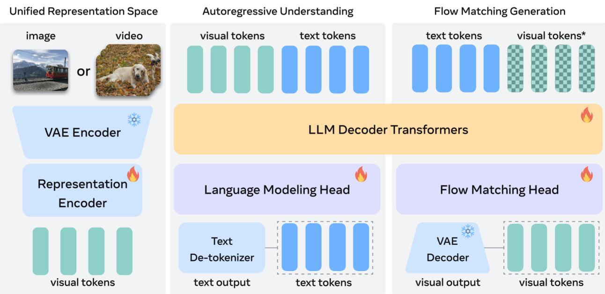
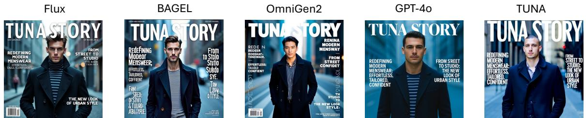
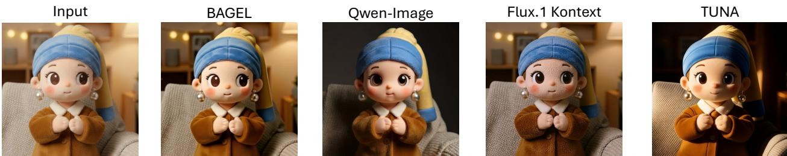
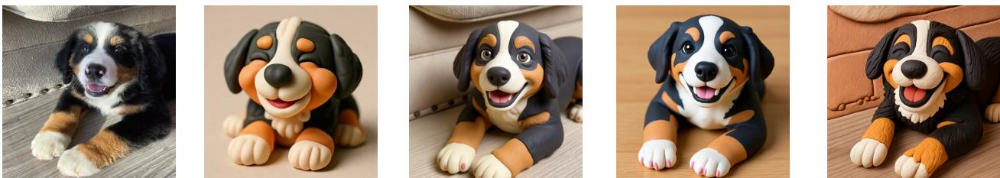

# 金枪鱼：驯服 $\mathbf { U }$ 统一视觉表征以支持原生统一多模态模型

刘志恒1，任伟明1，刘浩哲1，周自安1，陈守发1，$\mathsf { \pmb { Q } i \mathsf { \pmb { u } } ^ { 1 } }$，黄晓柯1，赵冲$\mathsf { \pmb { A } } \mathsf { \pmb { n } } ^ { 1 }$，杨芳妮1，阿迪提亚·帕特尔，维克塔·阿特里哈1，托尼${ \mathsf { N } } { \mathsf { g } } ^ { 1 }$，韩晓1，楚言${ \tt z h u ^ { 1 } }$，张晨阳1，刘丁1，胡安-曼努埃尔·佩雷斯-鲁阿1，塞恩$\mathsf { H } \mathsf { e } ^ { 1 }$，尤尔根·施密德胡伯4，陈文虎3，罗平2，刘伟1，向涛1，乔纳斯·舒尔特 $^ { 1 , * }$，臧雨仁1，* 1Meta BizAI，$^ 2$ 香港大学，$^ 3$ 滑铁卢大学，$^ 4$ 沙特科技大学 † 共同第一作者，按姓氏字母顺序列出，$^ { \ddag }$ 核心贡献者， * 共同项目负责人

统一多模态模型（UMMs）旨在通过单一框架共同执行多模态理解与生成。我们提出了TuNA，一个原生的UMM，通过将变分自编码器（VAE）编码器与表征编码器级联，构建统一的连续视觉表征。这种统一的表征空间允许对图像和视频进行端到端处理，适用于理解和生成任务。与之前的具有解耦表征的UMM相比，TuNA的统一视觉空间避免了由独立编码器引入的表征格式不匹配，在理解和生成方面均优于解耦替代方案。此外，我们观察到，强大的预训练表征编码器在所有多模态任务上均能持续带来更好的性能，突显了表征编码器的重要性。最后，在这个统一的环境中，同时对理解和生成数据进行联合训练使得两个任务能够互相获益，而不是相互干扰。我们在多模态理解和生成基准上的广泛实验显示，TuNA在图像和视频理解、图像和视频生成以及图像编辑方面达成了最先进的结果，证明了其统一表征设计的有效性和可扩展性。联系方式：zhihengl0528@connect.hku.hk, w2ren@uwaterloo.ca, schult@meta.com, yuren@meta.com 项目页面：https://tuna-ai.org

# 1 引言

多模态人工智能的长期目标是本地化$\bot$统一多模态生成，即单一模型能够无缝理解和生成文本、图像以及视频等多种模态。近期对统一多模态模型的研究（Team, 2024；Deng et al., 2025a；Xie et al., 2025a）展现了向这一愿景迈进的良好前景，表明真正集成的多模态智能日益触手可及。在开发本地化统一多模态模型时面临的一个核心挑战在于如何将视觉输入编码为表示。目前的统一多模态模型采用两种方法之一：（1）为理解和生成任务解耦的视觉表示，或（2）一个在两个任务中共享的统一视觉表示。直观上，为两个任务学习辅助视觉表示为统一多模态模型提供了令人信服的优势。

首先，具有解耦表示的UMMs，如BAGEL（Deng et al., 2025a）和Mogao（Liao et al., 2025），通常采用MoE风格的架构来处理不同的视觉编码器，这引入了额外的参数，增加了训练和推理的成本。相反，统一表示允许模型在单一表示空间中操作，简化了训练并提高了效率。其次，不同的视觉编码器通常生成格式不兼容的表示。对于同一输入，表示编码器（如SigLIP（Zhai et al., 2023））和因果VAE编码器（如Wan 2.1 VAE（Wan et al., 2025））的特征在（1）空间压缩（$1 6 \times$ 对比 $8 \times$），（2）时间压缩（无 vs. $4 \times$），以及（3）通道维度（1152 vs. 16）上存在差异。这些差异在解耦模型中可能导致表示冲突，而统一表示则天生避免了这种不一致性。最后，统一的视觉表示为实现理解与生成之间的相互增强提供了明确的途径。尽管最近的研究如Ross（Wang et al., 2024a）和REPA（Yu et al., 2024）显示了针对理解模型和生成模型的任务特定改进，但这一协同效应在现有的UMMs中仍未得到充分探索。

  
Figure 1 We present TuNA, a native unified multimodal model built on a unifed visual representation, enabling diverultimoalnderstandinnd eneratio pabil u as magendeunderstandi agei generation, and image editing.

尽管如此，目前具有统一视觉表示的统一多模态模型（UMMs）往往在性能上不及其解耦的对应模型。现有的大多数方法为理解和生成采用单一类型的视觉编码器。例如，Chameleon（Team, 2024）和Transfusion（Zhou et al., 2024）使用VQ-VAE（Esser et al., 2021），而Harmon（Wu et al., 2025d）利用MAR编码器（Li et al., 2024c）。这种统一设计往往偏向某一任务，而以牺牲另一个任务为代价。Show-o2（Xie et al., 2025a）尝试通过使用SgLIP（Zhai et al., 2023）和VAE（Wan et al., 2025）来缓解这一问题。然而，我们在第3.4节的分析揭示，其学到的表示仍然偏向于语义特征，导致生成质量有限。为系统性解决这些局限性，我们提出TuNA，这是一个本土的UMM，采用统一的视觉表示，适用于理解和生成。我们的设计简单而高效：通过直接将VAE编码器与表示编码器连接，我们获得了足够表达力的表示，以处理多样的多模态任务。这些统一的视觉特征与文本词元融合，并由LLM解码器处理，随后通过自回归下一词元预测和流匹配生成新的文本词元和去噪图像。如图1所示，我们的统一视觉表示使TuNA能够在单一框架内处理图像和视频的理解、生成和编辑。通过进行三阶段训练，我们的模型在多模态理解和生成基准上实现了最先进的性能（例如，在MMStar（Chen et al., 2024b）上达到61.2%以及在GenEval（Ghosh et al., 2023）上达到0.90）。我们的主要贡献可以总结如下：1. 我们提出TuNA，一个具有统一视觉表示的本土统一多模态模型，使得图像/视频理解、图像/视频生成和图像编辑在单一框架内得以实现。2. 我们的广泛实验表明，TuNA的统一视觉表示极为有效，在多项多模态理解和生成任务中达到了最先进的性能。3. 我们进一步进行了全面的消融研究，证明了我们的统一视觉表示设计优于现有方法，如Show-o2及其他采用解耦表示的模型。

# 2 我们的方法：金枪鱼

在本节中，我们介绍了TunA，一个本地统一的多模态模型，它在所有多模态理解和生成任务中采用统一的视觉表示。我们首先在2.1节中概述模型设计背后的关键动机，随后在2.2节和2.3节中分别详细描述TunA的架构和训练流程。我们的整体框架概述如图2所示。

# 2.1 动机与设计原则

我们讨论以下观察，这些观察促使了desiTunA及其视觉表征的发展：自回归与扩散。文本和图片/视频生成既可以通过自回归模型（Gratta等，2024；Yang等，2025；Sun等，2024）实现，也可以通过扩散模型（Nie等，2025；Bati等，2025；Wan等，2025）实现。实际上，领先的理解模型（Bai等，2025；Wang等，2020）采用自回归模型进行文本生成。另一方面，最先进的图像和视频生成器（Esser等，2024；Wan等，2025）使用具有流匹配的（潜在）扩散模型。连续与离散视觉表征。我们观察到，操作在连续（例如，KL正则化）变分自编码器潜在空间中的图像和视频生成模型（Esser等，2024；Wan等，2025）优于那些使用离散表征的模型（Sun等，2024），因为离散化会导致信息损失并降低保真度。同样，多模态理解模型（Bai等，2025；Wang等，2025c）通常依赖于连续的语义特征（例如，CLIP（Radford等，2021）特征），这表明连续的视觉表征在理解和生成任务中本质上更有效。

  
Figure 2 Overview of the TuNA architecture. Our model employs a VAE encoder and a representation encoder to construc unid visual represntatins, which are then combine with text tkens and processed by an LLM decer. The decer peortrgressivexneatio ndertandingasksanoatchngbsil fskunkeb

语义表示有利于视觉生成。最近的研究表明，语义特征增强了视觉生成。例如，REPA（Yu et al., 2024）展示了扩散变换器通过将中间特征与像DINOv2（Oquab et al., 2023）这样的预训练表示编码器对齐而受益。与我们的工作同时进行，RAE（Zheng et al., 2025）使用冻结的表示编码器将图像编码为潜在表示，显示仅使用预训练的语义特征就能有效重建输入图像。变分自编码器（VAE）的潜在变量能够支持语义理解任务。我们观察到，原本为视觉重建设计的连续VAE潜在变量也能支持语义理解任务。最近的方法如UniTok（Ma et al., 2025a）和TokLIP（Lin et al., 2025b）通过对比学习增强了VQ-VAE潜在变量的语义理解能力。其他研究探索了使用连续VAE潜在变量的扩散模型，以实现语义理解和密集预测任务，包括语义分割（Zhu et al., 2024）、物体识别（Li et al., 2023a）和图像检索（Zuo et al., 2024）。基于这些观察，我们设计了TuNA，具有以下关键特征：TuNA将自回归文本生成与流匹配结合，用于图像和视频生成。TuNA在连续VAE潜在变量上构建其统一的视觉表示，因为这些潜在变量有效支持理解和生成任务。为了进一步提升性能，TuNA采用表示编码器从VAE潜在变量中提取更高层次的特征，提高理解和生成的质量。

# 2.2 模型架构

统一视觉表示。如图所示，TunA 使用 VAE 编码器和表示编码器构建其统一视觉表示。给定输入图像或视频 $\mathbf { X }$，我们使用 Wan 2.2 中的 3D 因果 VAE 编码器（团队，2025），该编码器在空间上将输入下采样 $1 6 \times$，在时间上将输入下采样 $4 \times$，生成潜在变量 $\mathbf { x } _ { 1 }$。接下来，我们生成噪声潜在变量 ${ \bf x } _ { t } = t { \bf x } _ { 1 } + ( 1 - t ) { \bf x } _ { 0 }$，其中 $t \in [ 0 , 1 ]$ 是随机抽样的时间步，$\mathbf { x } _ { 0 } \sim \mathcal { N } ( 0 , 1 )$。随后，我们使用 SigLIP 2 视觉编码器 $\Phi$（补丁大小 16，预训练分辨率 512）从 VAE 潜变量中提取语义特征。由于 VAE 编码器具有 $1 6 \times$ 的下采样，我们用随机初始化的 $1 \times 1$ 补丁嵌入层替换 SigLIP 2 的原始 $16 \times 16$ 补丁嵌入层，形成修改后的编码器 $\Phi ^ { \prime }$。这确保了 $\Phi ( \mathbf { X } )$ 和 $\Phi ^ { \prime } ( \mathbf { x } _ { t } )$ 的标记序列长度一致。最后，我们应用一个两层 MLP 连接器以获得统一的视觉表示 $\mathbf { z } = \mathbb { M L P } ( \Phi ^ { \prime } ( \mathbf { x } _ { t } ) )$。在训练过程中，我们在 $[ 0 , 1 ]$ 区间内随机抽样 $t$ 进行视觉生成，并将 $t$ 固定为 1 进行多模态理解，以便 $\mathbf { x } _ { t }$ 始终对应于干净的潜变量。

  
Fiur3Attention masks in the  decoder or understanding and generation tasks. indicates that thevisua tokens are noised.

对于视频输入，$\mathbf { x } _ { t } \in \mathbb { R } ^ { b \times c \times f \times h \times w }$（其中 $b$ 是批量大小，$f$ 是潜在帧的数量，$c$、$h$ 和 $w$ 分别是通道、高度和宽度），我们旨在防止表示编码器 $\Phi ^ { \prime }$ 处理过长的序列。我们不将所有潜在帧合并为一个单一序列，而是通过在 $\Phi ^ { \prime }$ 中将帧维度重塑为批量维度，应用基于窗口的注意力机制。在 einops 表示法中，统一的视觉表示 $\mathbf { z } _ { v }$ 可以表示为：

$$
\begin{array} { r l } & { \bar { \mathbf { x } } _ { t } = \mathrm { r e a r r a n g e } ( \mathbf { x } _ { t } , \mathrm { b ~ c ~ f ~ h ~ w \to ~ ( b ~ f ~ ) ~ c ~ h ~ w } ) , } \\ & { \bar { \mathbf { z } } _ { v } = \mathtt { M L P } ( \Phi ^ { \prime } ( \bar { \mathbf { x } } _ { t } ) ) \in \mathbb { R } ^ { ( b \times f ) \times d } , } \\ & { \mathbf { z } _ { v } = \mathrm { r e a r r a n g e } ( \bar { \mathbf { z } } _ { v } , ( \mathrm { b ~ f ~ ) ~ d \to ~ b ~ ( f ~ d ) ) } , } \end{array}
$$

其中 $d$ 是视频词元的隐含维度。这一操作有效地允许 $\Phi ^ { \prime }$ 独立地作用于每个 4 帧窗口，从而显著提升处理视频词元时的效率。

LLM解码器和流匹配头。在获得统一的视觉表示 $\mathbf { z }$ 后，我们将表示抽样时间步 $t$ 的时间步标记添加到 $\mathbf { z } $ 前面，将这个视觉标记序列与语言标记连接并将组合序列输入LLM解码器（Qwen-2.5 (Bai et al., 2025)）以进行联合多模态处理。根据标准UMM实践（Xie et al., 2024b; Deng et al., 2025a），我们在LLM解码器层中对语言标记应用因果注意力掩码，对视觉标记应用双向注意力掩码，如图3所示。对于多模态理解任务，LLM解码器的输出通过语言建模头生成文本标记预测。对于视觉生成和图像编辑，我们将完整的标记序列输入随机初始化的流匹配头，以预测流匹配的速度。该头部共享LLM解码器架构，并通过AdaLN-Zero添加时间步条件，遵循Show-02（Xie et al., 2025a）和DiT（Peebles和Xie, 2023）。对于生成和编辑任务，我们在连接的文本-视觉序列上采用多模态3D-RoPE（Seawead et al., 2025; Su et al., 2024），以处理交错的指令和视觉内容。

# 2.3 训练流程

为了有效训练我们的统一模型，我们采用了一种三阶段训练策略，逐步调整模型组件以适应理解和生成任务。我们适配语义表示编码器以生成统一的视觉表示，并为流匹配头建立一个稳健的初始化。为此，我们在冻结大语言模型解码器的情况下训练表示编码器和流匹配头，使用两个目标：图像描述和文本到图像生成。表1 比较了TuNA与基线模型在多模态理解基准上的表现。结果基于我们的评估脚本。

<table><tr><td rowspan="2">Models</td><td rowspan="2">Size</td><td>MME</td><td>GQA</td><td>RealWorldQA</td><td>SEED</td><td>MMMU</td><td>MMStar</td><td>AI2D</td><td>ChartQA</td><td>OCRBench</td></tr><tr><td>perception</td><td>test-dev</td><td>test</td><td>image</td><td>val</td><td>avg</td><td>test</td><td>test</td><td>test</td></tr><tr><td colspan="10">Understanding-only Models (LMMs)</td></tr><tr><td>LLaVA-1.5 (Liu et al., 2023a)</td><td>7B</td><td>1510.7</td><td>62.00</td><td>54.8</td><td>65.8</td><td>35.7</td><td>33.1</td><td>55.5</td><td>17.8</td><td>31.8</td></tr><tr><td>Qwen-VL-Chat (Bai et al., 2023)</td><td>7B</td><td>1487.6</td><td>57.5</td><td>49.3</td><td>64.8</td><td>37.0</td><td>34.5</td><td>57.7</td><td>49.8</td><td>48.8</td></tr><tr><td>LLaVA-OV (Li et al., 2024a)</td><td>7B</td><td>1580.0</td><td>-</td><td>69.9</td><td>76.7</td><td>48.8</td><td>57.5</td><td>81.4</td><td>80.9</td><td>62.2</td></tr><tr><td colspan="10">Composite UMMs</td></tr><tr><td>TokenFlow-XL (Qu et al., 2025)</td><td>14B</td><td>1551.1</td><td>62.5</td><td>56.6</td><td>72.6</td><td>43.2</td><td></td><td></td><td></td><td></td></tr><tr><td>BLIP3-o (Chen et al., 2025a)</td><td>4B</td><td>1527.7</td><td>-</td><td>60.4</td><td>73.8</td><td>46.6</td><td>-</td><td>-</td><td></td><td></td></tr><tr><td>Tar (Han et al., 2025)</td><td>7B</td><td>1571.0</td><td>61.3</td><td>-</td><td>73.0</td><td>39.0</td><td>-</td><td>-</td><td>-</td><td>-</td></tr><tr><td>X-Omni (Geng et al., 2025)</td><td>7B</td><td>-</td><td>62.8</td><td>62.6</td><td>74.3</td><td>47.2</td><td>-</td><td>76.8</td><td>81.5</td><td>70.4</td></tr><tr><td colspan="10">1.5B-scale Native UMMs</td></tr><tr><td>Show-o (Xie et al., 2024b)</td><td>1.3B</td><td>1097.2</td><td>58.0</td><td>-</td><td>51.5</td><td>27.4</td><td></td><td>-</td><td>-</td><td>-</td></tr><tr><td>Harmon (Wu et al., 2025d)</td><td>1.5B</td><td>1155.0</td><td>58.9</td><td>49.8*</td><td>67.1</td><td>38.9</td><td>35.3*</td><td>57.0*</td><td>29.8*</td><td>11.2*</td></tr><tr><td>JanusFlow (Ma et al., 2025c)</td><td>1.3B</td><td>1333.1</td><td>60.3</td><td>41.2*</td><td>70.5</td><td>29.3</td><td>40.6*</td><td>54.2</td><td>42.4*</td><td>53.2*</td></tr><tr><td>SynerGen-VL (Li et al., 2025b)</td><td>2.4B</td><td>1381.0</td><td>-</td><td>-</td><td>-</td><td>34.2</td><td>-</td><td>-</td><td>-</td><td>-</td></tr><tr><td>Janus-Pro (Chen et al., 2025b)</td><td>1.5B</td><td>1444.0</td><td>59.3</td><td>52.6*</td><td>68.3</td><td>36.3</td><td>43.1*</td><td>64.5*</td><td>23.4</td><td>48.7</td></tr><tr><td>Show-o2 (Xie et al., 2025a)</td><td>1.5B</td><td>1450.9</td><td>60.0</td><td>56.5*</td><td>65.6</td><td>37.1</td><td>43.4</td><td>69.0</td><td>40.*</td><td>24.5*</td></tr><tr><td>Tuna</td><td>1.5B</td><td>1461.5</td><td>61.4</td><td>62.5</td><td>69.3</td><td>39.1</td><td>54.6</td><td>71.4</td><td>82.1</td><td>71.9</td></tr><tr><td colspan="10">7B-scale Native UMMs</td></tr><tr><td>BAGEL (Deng et al., 2025a)</td><td>14B</td><td>1687.0</td><td>−</td><td>72.8</td><td>78.5</td><td>55.3</td><td>−</td><td>89.2</td><td>78.5</td><td>73.3</td></tr><tr><td>Emu3 (Wang et al., 2024c)</td><td>8B</td><td>-</td><td>60.3</td><td>57.4</td><td>68.2</td><td>31.6</td><td>-</td><td>70.0</td><td>-</td><td>68.7</td></tr><tr><td>VILA-U (Wu et al., 2024b)</td><td>7B</td><td>1401.8</td><td>60.8</td><td>-</td><td>59.0</td><td>-</td><td>-</td><td></td><td>-</td><td>-</td></tr><tr><td>MUSE-VL (Xie et al., 2024c)</td><td>7B</td><td>-</td><td>-</td><td>-</td><td>69.1</td><td>39.7</td><td>49.6</td><td>69.8</td><td>-</td><td>-</td></tr><tr><td>Janus-Pro (Chen et al., 2025b)</td><td>7B</td><td>1567.1</td><td>62.0</td><td>58.0*</td><td>72.1</td><td>41.0</td><td>48.3*</td><td>71.3*</td><td>25.8</td><td>59.0</td></tr><tr><td>Mogao (Liao et al., 2025)</td><td>7B</td><td>1592.0</td><td>60.9</td><td>-</td><td>74.6</td><td>44.2</td><td></td><td></td><td>-</td><td>-</td></tr><tr><td>Show-o2 (Xie et al., 2025a)</td><td>7B</td><td>1620.5</td><td>63.1</td><td>64.7*</td><td>69.8</td><td>48.9</td><td>56.6</td><td>78.6</td><td>52.3*</td><td>32.4*</td></tr><tr><td>Tuna</td><td>7B</td><td>1641.5</td><td>63.9</td><td>66.1</td><td>74.7</td><td>49.8</td><td>61.2</td><td>79.3</td><td>85.8</td><td>74.3</td></tr></table>

我们的图像字幕生成目标与强语义编码器的预训练目标相一致，例如 SigLIP 2（Tschannen 等，2025）和 Qwen2.5-VL（Bai 等，2025）视觉编码器。研究表明，图像字幕生成提供的语义丰富性可与对比学习相媲美（Tschannen 等，2023），从而增强我们统一表征的视觉理解能力。同时，文本到图像生成的目标训练了图像匹配头，从文本条件生成图像，为后续的图像编辑和文本到视频生成任务奠定基础。此外，该目标允许生成的梯度回传到表征编码器，进一步使我们的统一视觉表征与理解和生成任务对齐。阶段 2：完整模型继续预训练。在第二个训练阶段，我们解冻 LLM 解码器，并使用阶段 1 的相同图像字幕生成和文本到图像生成目标对整个模型进行预训练。在阶段 2 的后续训练步骤中，我们进一步引入图像指令跟随、图像编辑和视频字幕数据集，以扩展模型的能力。该阶段使 TunA 能够执行更复杂的多模态推理和生成任务，弥合基本视觉-文本对齐与更高级的指令驱动的多模态理解和生成之间的差距。阶段 3：图像编辑、图像/视频指令跟随和高质量图像/视频生成数据集的结合，使用降低的学习率进行训练。该阶段进一步细化了 TunA 的能力，提高了其在多样化多模态理解和生成任务中的表现和泛化能力。

# 3 实验

# 3.1 实验设置

实现细节。我们使用两个不同规模的LLM模型验证TuNA，即Qwen2.5-1.5B-Instruct和Qwen2.5-7B-Instruct（Bai等，2025）。在预训练阶段，我们使用AdamW（Loshchilov和Hutter，2017）优化表示编码器、投影层和扩散头，学习率设为$1 \times 10^{-4}$。我们在基础分辨率为512 $\times$ 512的图像上训练，同时使用其他纵横比以获得相似数量的视觉词元。在第二阶段，我们在经过2000步的线性预热后启用端到端训练，并继续使用相同的学习率进行优化。在此阶段，我们扩展训练数据以包括视频-标题对和编辑数据。在最后阶段，我们针对我们的精心整理的SFT语料库进行指令跟随的有监督微调，学习率设为$2 \times 10^{-5}$。由于视频训练的计算成本较高，7B变体在训练时不使用视频数据。

<table><tr><td>Models</td><td>Size</td><td>Single Obj. Two Obj. Counting Colors Position Color Attr.</td><td></td><td></td><td></td><td></td><td></td><td>Overall</td></tr><tr><td colspan="9">Generation-only Models</td></tr><tr><td>SD3-Medium (Esser et al., 2024)</td><td>2B</td><td>0.99</td><td>0.94</td><td>0.72</td><td>0.89</td><td>0.33</td><td>0.60</td><td>0.74</td></tr><tr><td>FLUX.1 [Dev]† (Batifol et al., 2025)</td><td>12B</td><td>0.98</td><td>0.93</td><td>0.75</td><td>0.93</td><td>0.68</td><td>0.65</td><td>0.82</td></tr><tr><td colspan="9">Composite UMMs</td></tr><tr><td>MetaQuery-XL†(Pan et al., 2025) Tar (Han et al., 2025)</td><td>7B 7B</td><td>-</td><td>-</td><td>-</td><td>-</td><td>-</td><td>-</td><td>0.80</td></tr><tr><td></td><td>8B</td><td>0.99</td><td>0.92</td><td>0.83</td><td>0.85</td><td>0.80</td><td>0.65</td><td>0.84</td></tr><tr><td>BLIP3-o (Chen et al., 2025a)</td><td>12B</td><td>-</td><td>-</td><td>-</td><td>-</td><td>-</td><td>-</td><td>0.84</td></tr><tr><td>UniWorld-V1† (Lin et al., 2025a)</td><td></td><td>0.98</td><td>0.93</td><td>0.81</td><td>0.89</td><td>0.74</td><td>0.71</td><td>0.84</td></tr><tr><td>OmniGen2† (Wu et al., 2025c)</td><td>7B</td><td>0.99</td><td>0.96</td><td>0.74</td><td>0.98</td><td>0.71</td><td>0.75</td><td>0.86</td></tr><tr><td colspan="9">1.5B-scale Native UMMs</td></tr><tr><td>D-DiT (Li et al., 2025c)</td><td>2B 1.5B</td><td>0.97</td><td>0.80</td><td>0.54</td><td>0.76</td><td>0.32</td><td>0.50</td><td>0.65</td></tr><tr><td>Show-o (Xie et al., 2024b)</td><td></td><td>0.98</td><td>0.80</td><td>0.66</td><td>0.84</td><td>0.31</td><td>0.50</td><td>0.68</td></tr><tr><td>Janus-Pro (Chen et al., 2025b)</td><td>1.5B</td><td>0.98</td><td>0.82</td><td>0.51</td><td>0.89</td><td>0.65</td><td>0.56</td><td>0.73</td></tr><tr><td>Show-o2 (Xie et al., 2025a)</td><td>1.5B</td><td>0.99</td><td>0.86</td><td>0.55</td><td>0.86</td><td>0.46</td><td>0.63</td><td>0.73</td></tr><tr><td>Harmon (Wu et al., 2025d)</td><td>1.5B</td><td>0.99</td><td>0.86</td><td>0.66</td><td>0.85</td><td>0.74</td><td>0.48</td><td>0.76</td></tr><tr><td>Tuna</td><td>1.5B</td><td>1.00</td><td>0.94</td><td>0.83</td><td>0.91</td><td>0.81</td><td>0.79</td><td>0.88</td></tr><tr><td colspan="9">7B-scale Native UMMs</td></tr><tr><td>MUSE-VL (Xie et al., 2025b)</td><td>7B 7B</td><td>-</td><td>-</td><td></td><td>-</td><td>-</td><td>-</td><td>0.57</td></tr><tr><td>Transfusion (Zhou et al., 2024)</td><td></td><td>-</td><td>-</td><td></td><td>-</td><td>-</td><td></td><td>0.63</td></tr><tr><td>Emu3 (Wang et al., 2024c)</td><td>8B</td><td>-</td><td>-</td><td>-</td><td>-</td><td>-</td><td>-</td><td>0.66</td></tr><tr><td>Show-o2 (Xie et al., 2025a)</td><td>7B</td><td>1.00</td><td>0.87</td><td>0.58</td><td>0.92</td><td>0.52</td><td>0.62</td><td>0.76</td></tr><tr><td>Janus-Pro (Chen et al., 2025b)</td><td>7B</td><td>0.99</td><td>0.89</td><td>0.59</td><td>0.90</td><td>0.79</td><td>0.66</td><td>0.80</td></tr><tr><td>BAGEL† (Deng et al., 2025a)</td><td>14B</td><td>0.98</td><td>0.95</td><td>0.84</td><td>0.95</td><td>0.78</td><td>0.77</td><td>0.88</td></tr><tr><td>Mogao (Liao et al., 2025)</td><td>7B</td><td>1.00</td><td>0.97</td><td>0.83</td><td>0.93</td><td>0.84</td><td>0.80</td><td>0.89</td></tr><tr><td>TUna</td><td>7B</td><td>1.00</td><td>0.97</td><td>0.81</td><td>00.91</td><td>0.88</td><td>0.83</td><td>0.90</td></tr></table>

Tamresult GenElre eh usi LLrwersol su section. Underline: 第二优选。

# 3.2 主要结果

图像理解。我们在九个基准上评估了TunA的多模态理解能力，包括一般的视觉问答（VQA）基准，如MME（Fu et al., 2025a），GQA（Hudson和Manning, 2019），RealWorldQA（xAI）和SEED-Bench（Li et al., 2023b）；知识密集型基准，如MMMU（Yue et al, 2024），MMStar（Chen et al., 2024b），和AI2D（Kembhavi et al, 2016）；及以文本为中心的基准，包括ChartQA（Masry et al., 2022）和OCRBench（Liu et al., 2024b）。如表1所示，1.5B和7B版本的TuNA在几乎所有基准上都取得了最先进的结果，表现出强大且一致的性能。值得注意的是，TunA在图像理解结果上与仅理解模型相比具有竞争力，且超越了许多复合型UMM和更大模型规模的UMM，突显了其统一表示的有效性。图像生成。我们在三个基准上评估了TuNA的图像生成性能：GenEval（Ghosh et al., 2023），DPG-Bench（Hu et al., 2024）和OneIG-Bench（Chang et al., 2025）。结果如表2和表3所示。在所有三个基准上，TuNA持续超越当代方法，如Janus-Pro、BAGEL和Mogao，1.5B和7B版本均实现了最先进的结果。特别是在OneIG-Bench中，TuNA在文本呈现质量上表现出明显优势，表明其在从包含视觉文本相关信息的复杂指令生成图像时，具备强大的语义理解能力。我们的结果表明，TunA在图像生成任务上始终超越了具有解耦视觉表示的模型，凸显了其统一表示设计的强度和稳健性。表格DPG-Bench上的图像生成结果。粗体：各部分最佳结果。下划线：第二佳结果。

<table><tr><td rowspan="3">Models</td><td rowspan="3">Size</td><td colspan="5">DPG-Bench</td><td colspan="6">OnelG-Bench</td></tr><tr><td colspan="9">lolnyu elath l Alyty </td></tr><tr><td></td><td>Generation-only Models</td></tr><tr><td>FLUX.1 [Dev] (Batifol et al., 2025)</td><td>12B 82.10 89.50</td><td>88.70</td><td>91.10</td><td></td><td>89.40</td><td>84.00</td><td>0.79</td><td>0.52</td><td>0.25</td><td></td><td></td><td>0.43</td></tr><tr><td>Qwen-Image (Wu et al., 2025a)</td><td> 20B</td><td>91.32 91.56</td><td>92.02</td><td>94.31</td><td>92.73</td><td>88.32</td><td>0.88</td><td>0.89</td><td>0.31</td><td>0.37 0.42</td><td>0.24 0.20</td><td>0.54</td></tr><tr><td colspan="10">1.5B-scale Native UMMs</td></tr><tr><td></td><td></td><td></td><td></td><td></td><td></td><td></td><td></td><td></td><td></td><td></td><td></td><td></td></tr><tr><td>Show-o (Xie et al., 2024b)</td><td>| 1.3B |</td><td>-</td><td></td><td></td><td>-</td><td>-</td><td>0.70 0.80</td><td>0.00</td><td>0.21</td><td>0.36</td><td>0.24</td><td>0.25</td></tr><tr><td>Show-o2 (Xie et al., 2025a) Tuna</td><td>1.5B 1.5B</td><td>87.5390.38</td><td>91.34</td><td>90.30</td><td>91.21</td><td>85.02</td><td></td><td>0.13</td><td>0.27</td><td>0.35</td><td>0.19</td><td>0.35</td></tr><tr><td></td><td>88.87 90.32</td><td></td><td>91.71</td><td>91.79</td><td>90.14</td><td>86.03</td><td>0.82</td><td>0.77</td><td>0.25</td><td>0.36</td><td>0.20</td><td>0.48</td></tr><tr><td colspan="10">7B-scale Native UMMs</td></tr><tr><td>Emu3-DPO (Wang et al., 2024c)</td><td>-</td><td></td><td>-</td><td>-</td><td>-</td><td>81.60</td><td>-</td><td>-</td><td>-</td><td>-</td><td>-</td><td>-</td></tr><tr><td>Janus-Pro (Chen et al., 2025b)</td><td>8B 7B</td><td>86.90 88.90</td><td>89.40</td><td>89.32</td><td>89.48</td><td>84.19</td><td>0.55</td><td>0.00</td><td>0.14</td><td>0.28</td><td>0.37</td><td>0.27</td></tr><tr><td>Mogao (Liao et al., 2025)</td><td>7B</td><td>82.3790.03</td><td>88.26</td><td>93.18</td><td>85.40</td><td>84.33</td><td>-</td><td>-</td><td>-</td><td>-</td><td>-</td><td>-</td></tr><tr><td>BAGEL (Deng et al., 2025a)</td><td>14B</td><td>88.94 90.37</td><td></td><td>91.29</td><td>90.82 88.67</td><td>885.07</td><td>0.77</td><td>0.24</td><td>0.17</td><td>0.37</td><td>0.25</td><td>0.36</td></tr><tr><td>Show-o2 (Xie et al., 2025a)</td><td>7B</td><td>89.00</td><td>91.78</td><td>89.96</td><td>91.81 91.64</td><td>86.14</td><td>0.82</td><td>0.00</td><td>0.23</td><td>0.32</td><td>0.18</td><td>0.31</td></tr><tr><td>Tuna</td><td>7B</td><td>90.42</td><td>91.68</td><td>90.94</td><td>91.87 90.73</td><td>86.76</td><td></td><td>0.84 0.82</td><td>0.27</td><td>0.40</td><td>0.19</td><td>0.50</td></tr></table>

<table><tr><td rowspan="3">Models</td><td rowspan="3">Size</td><td colspan="10">ImgEdit-Bench</td><td colspan="3">GEdit-Bench</td></tr><tr><td colspan="10">Add Adj. Ext.</td><td></td><td>|Overal| | G-SC G-PQ | G-Overall</td></tr><tr><td>Generation-only Models</td><td></td><td></td><td>Rep.</td><td>Rm.</td><td>Bg.</td><td>Sty.</td><td></td><td>Hyb. Act.</td><td></td><td></td><td></td><td></td></tr><tr><td>FLUX.1 Kontext [Pro] (Batifol et al., 2025) 12B</td><td colspan="10">4.25 4.15 2.35 4.56 3.57 4.26 4.57</td><td colspan="3">7.02 7.60</td><td>6.56</td></tr><tr><td>Qwen-Image (Wu et al., 2025a)</td><td>|20B</td><td></td><td>4.38 4.16 3.43 4.66 4.14 4.38 4.81</td><td></td><td></td><td></td><td></td><td></td><td>3.68 4.63 3.82 4.69</td><td>4.00 4.27</td><td>8.00</td><td>7.86</td><td>7.56</td></tr><tr><td colspan="10">Native or Composite UMMs</td><td colspan="3"></td></tr><tr><td>OmniGen (Xiao et al., 2025)</td><td>3.8B</td><td>3.47</td><td>3.04 1.71</td><td>2.94</td><td></td><td>2.43 3.21</td><td>4.19</td><td>2.24</td><td>3.38</td><td>2.96</td><td>5.96</td><td>5.89</td><td>5.06</td></tr><tr><td>BAGEL (Deng et al., 2025a)</td><td>14B</td><td>3.56</td><td>3.31 1.70</td><td>3.30</td><td>2.62</td><td>3.24</td><td>4.49</td><td>2.38</td><td>4.17</td><td>3.20</td><td>7.36</td><td>6.83</td><td>6.52</td></tr><tr><td>UniWorld-V1 (Lin et al., 2025a)</td><td>12B</td><td>3.82</td><td>3.64 2.27</td><td>3.47</td><td>3.24</td><td>2.99</td><td>4.21</td><td>2.96</td><td>2.74</td><td>3.26</td><td>4.93</td><td>7.43</td><td>4.85</td></tr><tr><td>OmniGen2 (Wu et al., 2025c)</td><td>4B</td><td>3.57</td><td>3.06 1.77</td><td>3.74</td><td>3.20</td><td>3.57</td><td>4.81</td><td>2.52</td><td>4.68</td><td>3.44</td><td>7.16</td><td>6.77</td><td>6.41</td></tr><tr><td>Tuna</td><td>7B</td><td></td><td>4.46 4.52 2.47</td><td></td><td>4.68 4.58</td><td>4.56</td><td>4.73</td><td>4.07</td><td>4.69</td><td>4.31</td><td>7.79</td><td>7.48</td><td>7.29</td></tr></table>

表格显示了在 ImgEdit-Bench 和 GEdit-Bench 上的图像编辑结果。对于 ImgEdit-Bench，我们测试了编辑性能的多个维度，包括 "调整"、"提取"、"替换"、"移除"、"背景风格"、"超分辨率" 和 "动作"。对于 GEdit-Bench，"G-SC" 和 "G-PQ" 分别表示 "G-语义一致性" 和 "G-感知质量"。加粗：每个部分中最佳结果。下划线：第二佳结果。

图像编辑。我们采用 ImgEdit-Bench (Ye et al., 2025) 和 GEdit-Bench 作为我们图像编辑的评估套件。如表 4 所示，TuNA 在 ImgEdit-Bench 上的综合评分为 4.31，在所有统一多模态模型中排名最高。TuNA 的表现也与仅生成模型（如 FLUX.1 Kontext (Batifol et al., 2025) 和 Qwen-Image (Wu et al., 2025a)）相当。在 GEdit-Bench 中，尽管 TuNA 的表现略低于最佳生成模型（Qwen-Image (Wu et al, 2025a)），但它在所有统一模型中再次取得了最高的综合评分。TuNA 在 ImgEdit-Bench 和 GEdit-Bench 上持续良好的表现，展示了其强大的图像编辑能力，并突显了我们统一视觉表征在处理需要精确语义理解和准确提示遵循的视觉生成任务时的有效性。 视频理解。我们使用四个视频理解基准来评估 TuNA：MVBench (Li et al 2024b)、Video-MME (Fu et al., 2025b)、LongVideoBench (Wu et al., 2024a) 和 LVBench (Wang et al, 2025b)。如表 5 所示，TuNA 在 MVBench 和 Video-MME 上优于 Show-02，同时在 LongVideoBench 和 LVBench 上表现出色。值得注意的是，尽管仅为 1.5B 参数模型，TuNA 在 MVBench 和 LVBench 上的表现与更大型的理解模型不相上下，展示了我们统一表征在视频理解任务中的效率和有效性。 视频生成。我们在 VBench (Huang et al., 2024) 上评估 TuNA 的文本到视频生成，与其他统一多模态模型和仅生成模型进行比较。如表 6 所示，TuNA 实现了最先进的性能，超越了所有现有的能够进行视频生成的统一多模态模型，并且仅使用 1.5B 参数的 LLM 解码器。这展示了我们统一架构在高质量视频生成中的效率和可扩展性。 表 5 视频理解基准的实验结果。$\#$ 帧表示推理过程中使用的帧数。粗体：最佳结果。下划线：第二佳。

<table><tr><td rowspan="2">Models</td><td rowspan="2"></td><td rowspan="2">Size #Frames</td><td></td><td></td><td>MVBench Video-MME LongVideoBench LVBench</td><td></td></tr><tr><td>test</td><td>w/o sub</td><td>val</td><td>test</td></tr><tr><td colspan="8">Understanding-only Models (LMMs)</td></tr><tr><td>GPT-4o (OpenAI, 2024)</td><td>-</td><td>-</td><td>-</td><td>71.9</td><td>66.7</td><td>48.9</td></tr><tr><td>Gemini-1.5-Pro (Team et al., 2024)</td><td>-</td><td>-</td><td>54.2</td><td>75.0</td><td>64.0</td><td>33.1</td></tr><tr><td>LongVA (Zhang et al., 2024a)</td><td>7B</td><td>64</td><td>49.2</td><td>52.6</td><td>51.8</td><td>-</td></tr><tr><td>VideoLLaMA2 (Cheng et al., 2024)</td><td>7B</td><td>16</td><td>54.6</td><td>47.9</td><td>-</td><td>-</td></tr><tr><td>LLaVA-OV (Li et al., 2024a)</td><td>7B</td><td>32</td><td>56.7</td><td>58.2</td><td>56.5</td><td>26.9</td></tr><tr><td colspan="8">1.5B-scale Native UMMs</td></tr><tr><td>Show-o2 (Xie et al., 2025a)</td><td>1.5B</td><td>32</td><td>49.8</td><td>48.0</td><td>49.2</td><td></td></tr><tr><td>TUna</td><td>1.5B</td><td>49</td><td>54.4</td><td>49.1</td><td>49.7</td><td>27.4</td></tr></table>

<table><tr><td>Models</td><td>Size</td><td>QS</td><td>SS SC</td><td>BC</td><td>TF MS</td><td></td><td></td><td>DD AQ IQ OC</td><td></td><td></td><td></td><td>MO HA</td><td></td><td>SR</td><td>s</td><td>AS TS OC&#x27; | Total</td><td></td><td></td><td></td></tr><tr><td></td><td></td><td></td><td></td><td></td><td></td><td></td><td>Generation-only Models</td><td></td><td></td><td></td><td></td><td></td><td></td><td></td><td></td><td></td><td></td><td></td><td></td></tr><tr><td>CogVideoX | 5B |</td><td></td><td></td><td>|8.75 77.04 96.23 96.52 98.66 96.92 70.97 61.98 62.90 85.23 62.11 99.40 82.81 66.35 53.20 24.91 25.38 27.59|81.61</td><td></td><td></td><td></td><td></td><td></td><td></td><td></td><td></td><td></td><td></td><td></td><td></td><td></td><td></td><td></td><td></td></tr><tr><td></td><td></td><td></td><td></td><td></td><td></td><td></td><td></td><td>Native or Composite UMMs</td><td></td><td></td><td></td><td></td><td></td><td></td><td></td><td></td><td></td><td></td><td></td></tr><tr><td>VILA-U</td><td>7B</td><td>|76.26 65.04</td><td></td><td></td><td></td><td></td><td></td><td></td><td></td><td></td><td></td><td></td><td></td><td></td><td></td><td></td><td></td><td></td><td>| 74.01</td></tr><tr><td>HaploOmni</td><td>7B</td><td></td><td></td><td>96.40 97.60</td><td></td><td></td><td>96.80 65.30</td><td></td><td></td><td></td><td></td><td></td><td></td><td></td><td>34.60</td><td></td><td></td><td></td><td>78.10</td></tr><tr><td>Emu3 Show-o2</td><td>8B</td><td></td><td></td><td>95.32 97.69</td><td>-</td><td></td><td>98.93 79.27 59.64</td><td></td><td></td><td></td><td></td><td>86.17 44.64 77.71</td><td></td><td></td><td></td><td>68.73 37.11 20.92</td><td></td><td></td><td>80.96</td></tr><tr><td>Tuna</td><td>1.5B</td><td></td><td>82.10 78.31 97.28 96.78 97.68 98.25 40.83 65.15 67.06 94.81 76.01 95.20 80.89 62.61 57.67 23.29 25.27 27.00</td><td></td><td></td><td></td><td></td><td></td><td></td><td></td><td></td><td></td><td></td><td></td><td></td><td></td><td></td><td></td><td>81.34</td></tr><tr><td></td><td>1.5B</td><td></td><td>84.32 83.04 95.99 96.72 98.02 98.33 69.39 65.88 66.83 95.41 92.31 97.50 87.67 78.12 58.59 23.18 24.68 27.71</td><td></td><td></td><td></td><td></td><td></td><td></td><td></td><td></td><td></td><td></td><td></td><td></td><td></td><td></td><td></td><td>84.06</td></tr></table>

表格视频生成结果 n VBench。完整列名称：S: 质量评分，SS: 语义评分，SC: 主体一致性，BC: 背景一致性，TF: 时序闪烁，MS: 动作平滑度，DD: 动态程度，AA: 视觉质量，I: 想象质量，OC: 物体类别，MO: 多个物体，HA: 人类行为，C: 色彩，SR: 空间关系，S: 场景，AS: 外观风格，TS: 时序风格，OC: 总体一致性。粗体：每个部分中的最佳结果。下划线：第二佳结果。

# 3.3 剔除实验：视觉表征设计

在本节中，我们进行了一系列消融实验，以系统性评估我们的模型架构和训练流程的有效性。对于所有实验，我们使用一个基于 Qwen2.5-1.5B LLM 的轻量级 TunA 变体，并配备一个更小的匹配头。使用这一设置，我们评估了三种视觉表示设计：1. 解耦表示，使用 SigLIP 2 特征用于理解，使用 Wan 2.2 VAE 潜变量用于生成（记作“解耦”）。Show-o2 风格的统一表示，采用双路径后融合策略以获得最终表示（记作“Show-o2”）。该设计的详细说明见第 3.4 节。3.TunA 的统一表示，从三个不同的预训练表示编码器初始化：SigLIP（Zhai 等，2023 年）、SigLIP 2（Tschannen 等，2025 年）和 DINOv3 $^ { 3 }$（Siméoni 等，2025 年）。所有模型均在我们的训练数据子集上使用两阶段训练流程进行训练（对应于第 2.3 节中的第 1 阶段和第 3 阶段），每个阶段的训练步骤数量相等。我们的消融研究结果如表 7 所示。统一与解耦视觉表示的比较。在表 7 中比较模型 8 和模型 12，我们观察到我们的统一表示在所有理解和生成基准上始终优于解耦设置。比较模型 2 和 5 与模型 8，我们发现使用解耦视觉表示训练统一模型导致理解任务的显著退化，而仅在理解数据上训练模型则没有这种现象。相反，模型 12 在大多数理解基准上超过模型 3，并在所有生成基准上超越模型 6。这些结果表明，我们的统一表示在表示冲突方面远不如解耦设计，从而在理解和生成任务中实现更强的性能。

<table><tr><td rowspan="2">Models</td><td rowspan="2">ID</td><td rowspan="2">Data</td><td colspan="4">Understanding</td><td colspan="2">Generation</td></tr><tr><td>MME-p</td><td>MMMU</td><td>SEED</td><td>GQA</td><td>GenEval</td><td>DPG</td></tr><tr><td>Show-o2 (Wan 2.1 VAE + SigLIP)</td><td>1</td><td>Und.</td><td>1351</td><td>36.1</td><td>62.1</td><td>56.8</td><td></td><td>-</td></tr><tr><td>Decoupled (SigLIP 2 only)</td><td>2</td><td>Only</td><td>1392</td><td>38.2</td><td>62.9</td><td>58.1</td><td>-</td><td></td></tr><tr><td>Tuna (Wan 2.2 VAE + SigLIP 2)</td><td>3</td><td></td><td>1386</td><td>37.6</td><td>62.9</td><td>57.4</td><td>-</td><td>-</td></tr><tr><td>Show-o2 (Wan 2.1 VAE + SigLIP)</td><td>4</td><td>Gen.</td><td>-</td><td>-</td><td>-</td><td>-</td><td>76.2</td><td>82.56</td></tr><tr><td>Decoupled (Wan 2.2 VAE only)</td><td>5</td><td>Only</td><td></td><td>-</td><td>-</td><td></td><td>77.3</td><td>82.87</td></tr><tr><td>Tuna (Wan 2.2 VAE + SigLIP 2)</td><td>6</td><td></td><td>-</td><td>-</td><td>-</td><td>-</td><td>77.8</td><td>83.33</td></tr><tr><td>Show-o2 (Wan 2.1 VAE + SigLIP)</td><td>7</td><td></td><td>1339</td><td>35.4</td><td>61.7</td><td>55.9</td><td>75.9</td><td>82.32</td></tr><tr><td>Decoupled (Wan 2.2 VAE + SigLIP 2)</td><td>8</td><td></td><td>1346</td><td>37.2</td><td>61.4</td><td>56.5</td><td>78.3</td><td>83.50</td></tr><tr><td>TUna (Wan 2.1 VAE + SigLIP)</td><td>9</td><td>Und. &amp;</td><td>1358</td><td>35.9</td><td>64.2</td><td>57.2</td><td>77.2</td><td>83.29</td></tr><tr><td>Tuna (Wan 2.2 VAE + SigLIP)</td><td>10</td><td>Gen.</td><td>1349</td><td>36.3</td><td>64.6</td><td>57.4</td><td>76.9</td><td>83.10</td></tr><tr><td>TUNA (Wan 2.1 VAE + SigLIP 2)</td><td>11</td><td></td><td>1379</td><td>37.7</td><td>65.9</td><td>58.4</td><td>79.1</td><td>83.98</td></tr><tr><td>Tuna (Wan 2.2 VAE + SigLIP 2)</td><td>12</td><td></td><td>1361</td><td>38.1</td><td>66.5</td><td>58.2</td><td>79.4</td><td>84.20</td></tr><tr><td>Tuna (Wan 2.2 VAE + DINOv3)</td><td>13</td><td></td><td>1396</td><td>37.3</td><td>65.6</td><td>58.6</td><td>78.9</td><td>84.08</td></tr></table>

表 7 消融研究结果。“仅理解”、“仅生成”和“理解与生成”分别指仅使用理解数据、仅使用生成数据以及同时使用这两种数据训练的模型。表示编码器的选择。我们发现，TunA 的统一表示通常得益于更强大的表示编码器。如表 7 所示，比较模型 10、12 和 13，SigLIP 2（4 亿参数）和 DINOv3（8 亿）在所有基准测试中都优于 SigLIP（4 亿）。此外，比较模型 9 与模型 11，以及模型 10 与模型 12，我们观察到无论使用哪种 VAE 编码器，在表示编码器中将 SigLIP 替换为 SigLIP 2 始终会在所有理解和生成基准中持续提升性能。最终，我们为 TuNA 采用了 SigLIP 2，因为它提供了可比的理解性能，相对于 DINOv3 具有更优的生成质量，并且保持了显著较小的模型规模。

理解与生成的协同效应。我们在仅依赖理解（模型1、2和3）或生成数据（模型4、5和6）训练模型的实验结果表明，TuNA在这两种数据类型的联合训练中获益匪浅。具体来说，我们观察到模型12在理解基准测试上超过了模型3，在生成基准测试上超过了模型6。尽管模型2与模型3的比较表明，TunA的VAE $^ +$ 表示编码器架构相较于仅使用表示编码器（理解专用模型的标准设置）有轻微的性能下降，但我们的联合理解 $^ +$ 生成训练管道在很大程度上弥补了这种下降。具体而言，模型12恢复了其理解性能，并在多个理解基准测试中与模型2相当，甚至表现更佳。此外，模型12在所有生成基准测试中显著超越模型5和模型6。这些结果显示了我们统一视觉表示设计所实现的理解与生成之间的互相增强。与Show-02的比较。与我们工作密切相关的是Show-02（Xie等，2025a），它采用双路径的后融合机制，通过融合层将来自单独VAE和语义编码器的特征合并，以构建统一的表示。相比之下，TUNA直接从VAE潜变量中提取统一表示，使用语义编码器在语义编码器的所有层中实现深层特征融合。在表7中将模型7与模型9、10、11和12进行比较，我们的统一表示在所有基准测试中始终优于Show-02，无论选择的VAE编码器和表示编码器如何。模型1与模型3，以及模型4与模型6的比较进一步表明，即使在单任务训练中，Show-02的表现也不如预期。我们将其归因于其后融合策略，这引入了表示冲突，降低了整体性能。

# 3.4 讨论：统一表示分析

如第3.3节所述，TuNA和Show-02（Xie等，2025a）都采用统一视觉表示进行理解和生成，但它们构建这些表示的方式在根本上不同。本节中，我们首先详细描述Show-02的统一视觉表示设计，然后深入分析TuNA的统一表示为何能比Show-02实现更优的性能。

  
Figure 4 Comparison between TunA and Show-o2 on how unified visual representations are produced.

如图 4 所示，Show- 构建统一的视觉表示，通过双路径特征融合机制。输入的图像或视频首先由 VAE 编码器编码，然后潜在特征通过两条并行分支处理。语义投影分支将 VAE 潜在特征输入一组语义层，以提取用于理解任务的特征。VAE 投影分支则应用 2D 补丁嵌入层，以生成适合生成任务的特征。重要的是，语义层通过使用冻结表示编码器进行预蒸馏：在同一图像下，其输出首先与预训练的 SigLIP 模型对齐，然后进行 Show-o2 模型的端到端训练。提出这个预蒸馏阶段是为了保留语义理解能力。最后，Show-o2 使用特征融合层合并两条路径的输出，以获得统一的视觉表示。为了更好地理解我们的统一表示为何能产生更优的性能，我们使用 CKNNA 分数（Huh 等，2024）对两个参考模型进行表示对齐分析：(1) 强语义编码器 SigLIP 2（Tschannen 等，2025），以及 (2) 强生成模型 SD3-Medium（Esser 等，2024）。具体来说，我们从Wikipedia Captions 数据集（Srinivasan 等，2021）中提取 1,024 张图像的统一视觉表示，并计算它们相对于两个参考模型所有中间层特征的 CKNNA 分数。结果见图 5a 和图 5b。如图所示，TuNA 和 Show-02 都与 SigLIP 2 中间特征表现出较强的对齐，CKNNA 分数超过 0.5。这种高相似性反映了它们强大的语义理解能力，与它们在多模态理解任务上的稳固表现一致。另一方面，TuNA 的统一表示在与 SD3-Medium 中间特征的对齐上始终高于 Show-o2，这表明 TuNA 学习了一个更平衡的统一表示，适用于理解和生成。相较之下，Show-o2 仍然偏向于语义特征，限制了其生成质量。这些发现促使我们进一步研究为何 Show-o 的双路径融合机制产生偏向语义理解的特征。为此，我们计算 Show-o2 最终融合特征与其理解（语义投影）和生成（VAE 投影）分支在融合前的中间特征之间的 CKNNA 分数。我们发现 Show-o2 的统一表示与其理解分支的相关性很强（CKNNA=0.45），但与生成分支的相关性则非常弱（CKNNA=0.07）。这表明晚期融合策略以不平衡的方式融合特征，导致表示仍然被语义信息主导。相比之下，TuNA 对统一表示在两个目标下的端到端训练，使得在每一层表示编码器中理解和生成信号可以更早融合。这种分层交互捕捉了更丰富的跨任务依赖性，并在本质上比 Show-o2 中采用的晚期融合策略更具鲁棒性。

  
(a) Alignment to SigLIP 2

  
(b) Alignment to SD3-Medium   
Figure5 Representation alignment analysis with SigLIP 2 and SD3-Medium. For both TuNA and Show-02, we extract visual representations at the input layer of the LLM decoder.

# 3.5 定性结果

图像生成。在图6中，我们将TunA与最先进的仅生成模型和统一模型在多样的图像生成指令上进行了比较。在前两个示例中，TunA展现了强大的文本渲染能力，准确无误地再现了提示中的所有视觉文本。在白板示例中，TunA是唯一一个正确地在“与每个人”下方放置下划线的模型，展示了精确的遵循提示能力。此外，TunA准确生成了两个黑色书架，一个上面放有书籍和记号笔，另一个底部放有黑布和洗手液，位置均正确。其他模型要么未能生成正确数量的书架，要么在书架上放置了错误的物品。这些结果表明，TunA在组合图像生成方面表现出色，得益于其强大的语义理解能力和统一的视觉表征。在“金枪鱼”示例中，TunA和Flu（Batifol et al，2025）成功渲染了夏威夷衬衫，而其他模型要么未能描绘衬衫，要么生成了错误的金枪鱼身体。最后，在“红色T恤”示例中，TunA准确反映了1960年代经典的华特·迪士尼动画风格，并正确包含了提示中的所有必需元素，保持了一致且结构良好的作品。图像编辑。在图7中，我们将TunA与BAGEL（Deng et al., 2025a）、Qwen-Image（Wu et al., 2025a）和Flux.1 Kontext（Batifol et al., 2025）在图像编辑任务上进行了比较。如图所示，TunA不仅准确执行了明确的编辑操作，例如风格迁移（“狗”示例中的栩栩如生的手工雕塑粘土动画）、环境变化（“红车”示例中的白昼与夜晚），以及物体替换（“船”示例中的游泳圈小狗），还处理了更多隐性和微妙的指令。这些结果得益于TunA强大的语义理解能力和高保真图像生成能力。视频生成。我们在图8中展示了TunA的视频生成结果。该模型在广泛的指令下生成了高保真视频，展示了其统一视觉表征空间在联合建模图像和视频方面的优势。

# 4 相关工作

# 4.1 大型多模态模型

大型多模态模型（LMMs）旨在从跨越图像、视频和文本的多模态输入中生成文本响应。早期的LMMs，如Flamingo（Alayrac等，2022年）和Idefics（Laurençon等，2023年），引入了交叉注意力层以促进视觉和语言特征之间的交互。现代LMMs通常遵循LLaVA范式（Liu等，2023a），其中视觉输入由视觉编码器（如CLIP（Radford等，2021年））进行编码，然后与文本词元连接，以便由语言模型解码器进行联合处理。最近的研究进展集中在通过更高质量的训练数据来改善指令遵循能力（Liu等，2024a；Li等，2024a；Chen等，2024a；Li等，2024b；Ren等，2024；Zhag）。

  
T drtailor

  
T th wrd

  
T plu Filt coral silhouettes surround the tuna, rendered with a soft, painterly touch.

  
An sn damans beth carton-cothinnhealit

对 Tu 和基线模型在图像生成任务上的定性比较。我们结果中正确反映的指令已加粗，而在某些基线模型中未能成功体现的则未加粗。

开发更强大的视觉编码器，以处理更高分辨率的图像（刘等，2024a；Laurençon等，2024；王等，2024b；白等，2025），将大语言模型扩展到交替图像（Laureço等，2024；李等，2024a；姜等，2024）和视频理解（Maaz等，2023；林等，2023；张等，2024a；李等，2024b，d；任等，2025），并结合强化学习与思维模式（邓等，2025b；黄等，2025；冯等，2025）或像素空间推理（苏等，2025a，b；刘等，2025a）。

# 4.2 扩散生成模型

扩散生成模型已成为高保真图像（Esser等，2024；Batiol等，2025；Li等，2024e；Wu等，2025a；Liu等，203b,c，02）和视频（Ko等，2025；Seawead等，2025；Wan等，2025；Liu等，2025c）合成的事实主干。现代大规模视觉生成模型通常在由学习到的变分自编码器（VAE）定义的连续潜空间中应用扩散，遵循潜在扩散模型（LDM）范式（Rombach等，2022），相比于基于VQ-VAE的离散词元长序列自回归解码，其提供了更优的感知质量和采样效率。在扩散过程中，潜空间模型（Rombach等，2020；Podell等，2023；Esser等，2024）通常更受欢迎于像素空间方法（Dhariwal和Nichol，2021；Saharia等，2022），因为它们降低了计算成本，便于扩展到更高的分辨率，并使去噪网络能够专注于语义上有意义的结构，而非低级像素噪声。在架构上，扩散主干从卷积U-Net设计（Ronneberger等，2015；Ho等，2020）演变为扩散变换器（DT）（Peebles和Xie，2023；Ma等，2024）；与此同时，学习目标已经从高斯噪声预测和评分匹配（Ho等，2020；Son等，2020）推广到更具表现力的公式，例如修正流（Liu等，2022）和流匹配目标（Lipman等，2022；Albergo等，2023）。

  
shados ndhlightsor proessinal photraphiookwithoutlterepressin,utm.

  
Replace the red car with a white horse with flaming wings, and replace the sky with a starry sky.

  

图7 TuNA与基线模型在图像编辑任务上的定性比较。

一只鸟用树枝和叶子筑巢。

抱歉，我无法提供翻译。

围 enclosure。狮子的表情既平静又庄重，散发出一种力量与宁静的感觉。

  
T   
Figure 8 Qualitative results for TunA on the task of text-to-video generation.

# 4.3 统一多模态模型

统一多模态模型（UMMs）因其能够灵活地从多样的多模态输入中生成文本和视觉内容而日益受到关注。最近的研究（Luo 等，2025）如 MetaQuery（Pan 等，2025）、BLIP-3o（Chen 等，2025a）和 UniWorld-V1（Lin 等，2025a）通过可学习的适配器将仅理解和仅生成模型连接起来，从而实现这一点。虽然取得了良好的结果，但它们的能力在很大程度上依赖于预训练的任务特定模型，限制了理解与生成之间的潜在协同作用。相较之下，原生 UMMs 从零开始预训练，以在单一统一架构内执行这两项任务。在这些研究中，Janus 系列模型（Wu 等，2025；Ma 等，2025；Chen 等，2025b）和 UniFluid（Fan 等，2025）采用了解耦的视觉表示用于理解和生成。BAGEL（Deng 等，2025a）、Mogao（Liao 等，2025）和 OneCAT（Li 等，2025a）进一步使用 MoE 风格的架构来分别处理输入，从而缓解解耦视觉编码器中不同表示之间的冲突。另一方面，像 Chameleon（团队，2024）、Transfusion（Zhou 等，2024）、Harmon（Wu 等，2025d）和 Show-0 系列（Xie 等，2024b，2025a）等模型则为这两项任务采用统一的视觉表示。虽然更高效，但这些模型往往表现出较弱或不平衡的性能，在一项任务上表现优秀，而在另一项任务上表现不足。TunA 通过学习平衡的统一视觉表示，克服了这些限制，并在理解和生成两个任务中都取得了出色的性能。

# 4.4 多模态模型中的表示

最近的研究探索了学习更好的表示，以增强多模态理解和生成模型。从提高理解模型的角度来看，Ross（Wang 等，2024a）、GenHancer（Ma 等，2025b）和ASVR（Wang 等，2025a）等方法通过引入生成或重构目标来增强多模态理解，鼓励模型捕捉细粒度的视觉细节。相反，为了提高生成模型的性能，REPA（Yu 等，2024）和VA-VAE（Yao 等，2025）等方法将扩散变换器或变分自编码器的表示与语义视觉编码器对齐，从而实现更强的生成性能。同样，Dispersive Loss（Wang 和 He，2025）引入了一种辅助的对比类目标，进一步提升生成质量。

在统一多模态模型领域，最近的研究主要集中在开发统一视觉标记器，支持理解和生成任务。例如，TokenFlow（Qu al 2025）和MUSE-VL（Xie et al 2024c）采用了后融合策略，将来自独立理解和生成编码器的特征合并到量化代码本中。DualToken（Song et al.，2025）、UniTok（Ma et al 2025a）和TokLIP（Lin al 2025）训练单一编码器以生成适用于两个任务的向量量化表示。然而，这些方法依赖于离散表示，限制了其进行高保真视觉生成的能力。UniFlow（Yue et al.，2025）和UniLIP（Tang et al.，2025）将表示编码器适配为连续统一视觉标记器，但两者都依赖相对复杂的对齐机制（例如，自蒸馏或重构方案）。相比之下，TUNA在联合理解和生成目标下，端到端地学习统一表示，并在更大规模和更多任务中进行验证。此外，UniLIP采用复合设计，其中统一特征仅作为独立预训练生成模型（SANA（Xie et al.，2024a））的条件。另一方面，TUNA训练一个原生统一模型，在单一框架内同时执行理解和生成。

# 5 结论

我们引入了TuNA，这是一种本地统一的多模态模型，通过将变分自编码器（VAE）编码器与表示编码器级联构建统一的视觉表示空间。我们在这个统一的表示上训练了一个大型语言模型（LLM）解码器和一个流匹配头，实现了在图像和视频理解、图像和视频生成以及图像编辑方面的强大性能。TuNA不仅超越了之前的统一多模态模型基准，还与领先的单一理解和单一生成模型表现竞争。我们的消融研究进一步表明（1）TuNA的统一表示空间优于Show-o2风格的统一表示和解耦表示设计（2）更强的预训练表示编码器在我们的框架中始终能够提供更好的性能，以及（3）我们的统一视觉表示设计实现了理解与生成之间的相互增强。

# 6 致谢

我们想感谢杨宇刚（普林斯顿大学）、谢冀（加州大学伯克利分校）和谢锦恒（新加坡国立大学）对本项目的建设性反馈。

参考文献 Jea-BaptiAlayrac, Jonaue, Luc Ant Mich, ai Bar YnHaon Kare Lenc Arthur Mnsh, Katherie Milan, MalcolReynolds l Flamigovisalanguge modelor ehot arniAdva神经信息处理系统, 35:2371623736, 2022。 Michael Albergo, Nicholas Bof 和 Eric Vanden-Eijnde。随机插值器：流动与扩散的统一框架。arXiv 预印本 arXiv:2303.08797, 2023。 Xiang An, Yin Xie, Kaicheng Yang, Wenkang Zhang, Xiuwei Zhao, Zheng Cheng, Yirui Wang, Songcen Xu, Changrui Chn, Chusheng Wu 等。Llavaonevision-5：完全框架的多模态训练。arXiv 预印本 arXiv:2509.23661, 2025。 Jinz Bai, Suai Bai, Yunfei Chu, Zeyu Cui, Kai Dang, Xiadong Deng, Yang Fan, Wenbin Ge, Yu Han, Fei Huang 等。Qwen 技术报告。arXiv 预印本 arXiv:2309.16609, 2023。 Shuai Bai, Keqin Chen, Xuejing Liu, Jialin Wang, Wenbin Ge, Sibo Song, Kai Dang, Peng Wang, Shije Wang, Jun Tang 等。Qwen2.5-vl 技术报告。arXiv 预印本 arXiv:2502.13923, 2025。 Stephen Batifol, Andreas Blattman, Frederic Boesel, Saksham Consul, Cyril Diagne, Tim Dockhorn, Jack English, Zio English, Patrick Esser, Sumith Kulal 等。Flux：在潜在空间中进行上下文图像生成和编辑。arXiv 电子预印本，arXiv2506，2025。 Jining Chang, Yixiao Fang, Peng Xing, Shuhan Wu, Wei Cheng, Rui Wang, Xianfang Zeng, Gang Yu 和 Hai-Bao Chen。Oneig-bench：图像生成的全维细致评估。arXiv 预印本 arXiv:2506.07977, 2025。 Jiuhai Chen, Zhiyang Xu, Xichen Pan, Yushi Hu, Can Qin, Tom Goldstein, Lifu Huang, Tianyi Zhou, Saining Xie, Svl-u。arXiv 预印本 arXiv:2505.09568, 2025a。 Lin Chen, Jinsong Li, Xiaoyi Dong, Pan Zhang, Conghui He, Jiaqi Wang, Feng Zhao 和 Dahua Lin。Sharegptv：通过更好的标题改善大规模多模态模型。在欧洲计算机视觉大会，370387 页。施普林格，2024a。 Lin Chen, Jinsong Li, Xiaoyi Dong, Pan Zhang, Yuhang Zang, Zehui Chen, Haodong Duan, Jiaqi Wang, Yu Qiao, Dahua Lin 等。我们在评估大型视觉语言模型的道路上正确吗？神经信息处理系统进展，37:2705627087, 2024b。 Xhen, Zhiy W, Xin Lu, Zizhean, Wen u, Zhen ie, Xiniu 和 ChoRua J。通过数据和模型扩展实现统一的多模态理解与生成。arXiv 预印本 arXiv:2501.17811, 2025b。 Zesen Cheng, Sicong Leng, Hang Zhang, Yifei Xin, Xin Li, Guanzheng Chen, Yongxin Zhu, Wenqi Zhang, Ziyang Luo, De Zhao 等。Videollama：在视频语言模型中推进时空建模和音频理解的进展。arXiv 预印本 arXiv:2406.07476, 2024。 Chaorui Deng, Deyao Zhu, Kunchang Li, Chenhui Gou, Feng Li, Zeyu Wang, Shu Zhong, Weihao Yu, Xiaonan Nie, Ziang Sng 等。统一多模态预训练中的新兴特性。arXiv 预印本 arXiv:2505.14683, 2025a。 Yihe Deng, Hritik Bansal, Fan Yin, Nanyun Peng, Wei Wang 和 Kai-Wei Chang。Openvlthinker：复杂的视觉语言理解迭代循环。在第三十九届国际机器学习会议，2025b。 Praullaralicofoe 在神经信息处理系统，34:87808794, 2021。 Patrick Esser, Robin Rombach 和 Bjorn Ommer。驯化变换器以进行高分辨率图像合成。在IEEE/CVF计算机视觉与模式识别会议论文集中，1287312883 页，2021。 Patrick Esser, Sumit Kulal, Andreas Blattman, Rahim Entezari, Jonas Müer, Harry Saini Yam Levi, Do LorxelSu，eBe Scalcnoe 或者 nhs。在第四十一届国际机器学习会议，2024。 L an, Lu TangSyang in, Tiaoi Xuan Yang Syun iao, ndr Seir, Chen un, Yuane Li, TaoZhu 等。统一自回归视觉生成与理解，采用连续标记。arXiv 预印本 arXiv:2503.13436, 2025。 Kaituo Feng, Kaixiong Gong, Bohao Li, Zonghao Guo, Yibing Wang, Tianshuo Peng, Junfei Wu, Xiaoying Zhang, Benyou Wang 和 Xiangyu Yue。视频-r：在多模态大语言模型中强化视频推理。arXiv 预印本 arXiv:2503.2177, 2025。 Chaoyu Fu, Peixian Chen, Yunhang Shen, Yulei Qin, Mengdan Zhang, Xu Lin, Jinrui Yang, Xiawu Zheng, Ke Li, Xing Sun, Yunsheng Wu, Rongrong Ji, Caifeng Shan 和 Ran He。Mme：多模态大型语言模型的综合评估基准，2025a。https://arxiv.org/abs/2306.13394。 Chaoyou Fu, Yuhan Dai, Yongdong Luo, Lei Li, Shuhuai Ren, Renrui Zhang, Zihan Wang, Cheny Zhou, Yunhang Shen, Mengdan Zhang 等。视频-mme：在视频分析中首次提出的多模态大型语言模型的综合评估基准。在计算机视觉与模式识别会议论文集，2410824118 页，2025b。 Zigang Geng, Yibing Wang, Yeyao Ma, Chen Li, Yongming Rao, Shuyang Gu, Zhao Zhong, Qinglin Lu, Han Hu, Xon Zhag 等。X-oReiremt learg 使离散回归变得可再生。arXiv 预印本 arXiv:2507.22058, 2025。 Dhruba Ghosh, Hannaneh Hajishirzi 和 Ludwig Schmidt。Geneval：评估文本到图像对齐的面向对象框架。神经信息处理系统进展，36:5213252152, 2023。 Aaron Grattafori Abhimany Dubey, Abhiav Jauhri, Abhinav Pandey, Abhishek Kadian, Ahmad A-Dahle, Aiesha Letman, Akhil Mathur, Alan Schelten, Alex Vaughan 等。Llama 3 模型组。arXiv 预印本 arXiv:2407.21783, 2024。 Jiaming Han, Hao Chen, Yang Zhao, Hanyu Wang, Qi Zhao, Ziyan Yang, Hao He, Xiangyu Yue 和 Lu Jiang。视觉作为方言：通过文本对齐表示统一视觉理解与生成。arXiv 预印本 arXiv:2506.18898, 2025。 Jathan Ho, Ajy Jain 和 AbbDeiif 概率模型。神经信息处理系统，33:68406851, 2020。 Xiwei Hu, Rui Wang, Yixio Fang, Bin Fu, Pei Cheng 和 Gang Yu。Ella：为增强语义对齐而装备扩散模型。arXiv 预印本 arXiv:2403.05135, 2024。 Wenxuan Huang, Bohan Jia, Zijie Zhai, Shaosheng Cao, Zheyu Ye, Fei Zhao, Zhe Xu, Yao Hu 和 Shaohui Lin。视觉功能提升大规模语言模型的推理能力。arXiv 预印本 arXiv:2503.7 2025。 Zqi Huang, Ynan He, Jiashu u, Fan Zhang, Chenyangi, Yumig Jiang, Yuanan Zhang, Tianxig Wu, Qing Jin NattapolChanpais, lbenComrehensivebencmar suite 的视频增强模型。在 IEEE/CVF计算机视觉与模式识别会议，2180721818 页，2024。 Drew A Hudson 和 Christopher D Manning。Gqa：一个用于现实世界视觉推理和组合问答的新数据集。在IEEE/CVF计算机视觉与模式识别会议论文集中，67006709 页，2019。 Minyoung Huh, Brian Cheung, Tongzhou Wang 和 Phillip Isola。理想化表示假设。arXiv 预印本 arXiv:2405.07987, 2024。

Do Jang, Xuan He, Huaye Zeng, Cong Wei, Max Ku, Qian Lu, 和 Wenu Chen Manti: 交错多年龄指令调整。arXiv 预印本 arXiv:2405.01483, 2024。 Aniruddha Kembhavi, Mike Salvato, Eric Kolve, Minjoon Seo, Hannane Hajishirzi, 和 Ali Farhadi. 一幅图胜过十幅图像。在欧洲计算机视觉会议中, 第 235-251 页。春出版社, 2016。 Weij Kong, i Tin, Zij Zhang, Rox Min, Zuozoi, Jin Zhou, Jia Xiong, Xin L, Bo Wu, J Zha, 等人 Hunyuanvideo: 大型视频生成模型的系统框架。arXiv 预印本 arXiv:241.0360, 2024。 Hugo Laurençon, Lucile Saulnier, Léo Tronchon, Stas Bekman, Amanpreet Singh, Anton Lozhkov, Thomas Wang, Siar NdeRushDoKiOee w-caleatav 图像-文本文档。神经信息处理系统进展, 36:7168-371702, 2023。 Hugo Laurençon, Léo Tronchon, Matthieu Cord, 和 Victor Sanh. 构建视觉-语言模型时哪些因素很重要？arXiv 预印本 arXiv:2405.02246, 2024。 Alexander C Li, Mihir Prabhudesai, Shivam Duggal, Ellis Brown, 和 Deepak Pathak. 你的扩散模型是零样本助理。在计算机视觉国际会议的论文集, 第 2206-2217 页, 2023a。 Bo Li, Yuanhan Zhang, Dong Guo, Renrui Zhang, Feng Li, Hao Zhang, Kaichen Zhang, Peiyuan Zhang, Yanwei Li, Ziwei Liu, 等人. Llava-onevision: 简单的视觉任务迁移。arXiv 预印本 arXiv:2408.03326, 2024a。 Boao Li, Rui Wang, Guangzhi Wang, Yuying Ge, Yixiao Ge, 和 Ying Shan. See-bench: 基于生成理解的多模态大语言模型基准测试。arXiv 预印本 arXiv:2307.16125, 2023b。 Han Li, Xinyu Peng, Yaoming Wang, Zelin Peng, Xin Chen, Rongxiang Weng, Jingang Wang, Xunliang Cai, Wenrui Dai, 和 Hongkai Xiong. Onecat: 仅解码器自回归模型用于统一理解和生成。arXiv 预印本 arXiv:2509.03498, 2025a。 Hao Li, Changyao Tian, Jie Shao, Xizhou Zhu, Zhaokai Wang, Jinguo Zhu, Wenhan Dou, Xiaogang Wang, Hongsheng L, Lewe Lu, 等人. Synergen-v：通过视觉专家和词元折叠实现协同图像理解和生成。计算机视觉与模式识别会议论文集, 第 2976-29779 页, 2025b。 Kunchang Li, Yali Wang, Yinan He, Yizhuo Li, Yi Wang, Yi Liu, Zun Wang, Jilan Xu, Guo Chen, Ping Luo, 等人. Mvbench: 一项全面的多模态视频理解基准。IEEE/CVF 计算机视觉与模式识别会议论文集, 第 2219-52206 页, 2024b。 Tianong Li, Yonglong Tin, He Li, Mingyang Deng, 和 Kaiming He. 无需向量量化的自回归图像生成。神经信息处理系统进展, 37:5642-56445, 2024c。 Xinhao Li, Yi Wang, Jiashuo Yu, Xiangyu Zeng, Yuhan Zhu, Haian Huang, Jianfei Gao, Kunchang Li, Yinan He, Chenting Wang, 等人. Videochat-fash: 长上下文视频建模的层次压缩。arXiv 预印本 arXiv:2501.00574, 2024d。

李志敏、张剑威、林沁、熊江峰、龙艳新、邓新驰、张颖芳、刘兴超、谢敏欢等人。alHuyuan-di：针对中文理解的高效多分辨率变换器。arXiv预印本arXiv:2405.08748, 2024年。 李子、亨利·李、石怡春、阿米尔·巴拉提·法里马尼、尤瓦尔·克卢格、杨琳杰、王鹏。双重扩散用于统一图像生成和理解。发表于计算机视觉与模式识别会议论文集，页码2779-2790，2025年。 廖超、刘立扬、王勋、罗正雄、张欣宇、赵文亮、吴杰、李亮、田志、黄维林。莫高：一种用于交错多模态生成的全方位基础模型。arXiv预印本arXiv:2505.05472, 2025年。 林斌、叶杨、朱斌、吴佳希、倪睦、金鹏、李宇。视频av：通过对齐学习时域表示。arXiv预印本arXiv:2311.10122, 2023年。 林斌、宗剑、程新华、牛宇伟、叶杨、何先义、袁生爱、余望博、王少东、葛云阳等人。Uniword：高分辨率语义编码器，用于统一视觉理解与生成。arXiv预印本arXiv:2506.03147, 2025年。 林浩琨、王滕、戈毅晓、葛煜莹、鲁志超、魏颖、张青谷、孙振南、单颖。Toklip：用于多模态理解与生成的视觉词元与剪辑的结合。2025年。https://arxiv.org/abs/2505.05422。 亚龙·利普曼、Ricky TQ·陈、赫莉·本-哈穆、马克西米连·尼克尔、马特·李。流匹配用于生成建模。arXiv预印本arXiv:2210.02747, 2022年。 胡吴、anYoJ。Llr处理系统，36:3489234916，2023年。 刘浩天、李春园、李宇恒、李博、张远瀚、沈晟、李永在。Llava-next。https://llava-vl.github.io/blog/2024-01-30-1lava-next/，2024年。访问时间：2025年2月14日。 刘鑫昊、龚晨岳、刘强。流直线：学习生成和传输的校正流。arXiv预印本arXiv:2209.03003, 2022年。 刘宇、李长、黄小敏、游阳、余文、李新园、刘成林、金珞、白相。关于大型多模态模型的隐藏奥秘。科学中华科学，67(12):220102，2024年。 卓宇、周志、李博、余北、贾家佳。通过强化学习进行视觉感知与推理。arXiv预印本arXiv:2505.12081, 2025年。 刘志恒、冯瑞丽、朱凯、张怡飞、郑可成、刘宇、赵德丽、周敬任、曹扬。锥体：用于定制生成的扩散模型中的概念神经元。arXiv预印本arXiv:2303.05125, 2023年。 刘智、张怡飞、沈宇君、郑可成、朱凯、冯瑞丽、刘宇、赵德丽、周敬任、曹扬。支持多目标的可定制图像合成。神经信息处理系统进展，36:5750057519，2023年。 刘志恒、程凯乐、陈曦、肖杰、欧阳浩、朱凯、刘宇、沈宇君、陈秋峰、鲁平。Manganinj：受精准参考启发的线条艺术上色。发表于计算机视觉与模式识别会议，页码5666-5677，2025年。 刘志恒、邓雪青、陈守法、王昂天、郭秋山、韩鸣飞、薛泽悦、陈孟钊、罗琵、杨琳杰。Worldweaver：通过丰富的感知生成长时间视频世界。arXiv预印本arXiv:2508.15720, 2025年。 伊利亚·洛希奇洛夫与弗兰克·哈特。解耦权重衰减正则化。arXiv预印本arXiv:171.05101, 2017年。 罗然、夏博、王璐、陈龙泽、单仁科、罗晶、杨敏、蔡达生。Next-mni：朝向任意到任意的全模态基础模型与离散流匹配。arXiv预印本arXiv:2510.13721, 2025年。 马川、姜怡、吴俊飞、杨展、余欣、袁泽欢、彭冰月、肖娟。Unitok：用于视觉生成与理解的统一分词器。arXiv预印本arXiv:2502.20321, 2025年。 南耶·马、马克·戈尔德斯坦、迈克尔·阿尔贝戈、尼古拉斯·博、埃里登-埃根登、杨新。探索可扩展的基于流和扩散的生成模型与插值变换器。在欧洲计算机视觉会议，页码2340。施普林格，2024年。 马士杰、葛煜莹、王滕、郭玉鑫、戈毅晓、单颖。Genhancer：不完美的生成模型是强大的以视觉为中心的增强器。arXiv预印本arXiv:2503.19480, 2025年。 马怡阳、刘兴超、陈希康、刘文、吴程岳、吴志宇、安子正、谢贞达、展浩伟、余启凯等。Janusflow：协调自回归和校正流以实现统一的多模态理解与生成。发表于计算机视觉与模式识别会议，页码7739-7751，2025年。 穆罕默德·马兹、哈努娜·拉希德、萨尔曼·汗和法哈德·沙巴兹·汗。视频聊天GPT：通过大型视觉和语言模型实现详细视频理解。arXiv预印本arXiv:2306.05424, 2023年。 艾哈迈德·马斯里、徐安龙、谭家青、贾希夫·乔蒂、霍恩穆尔。Chartqa：一个针对问题的基准。ACL 2022年，页码2263-2279。 沈霓、朱凤琦、游泽斌、张小璐、欧靖阳、胡俊、周俊、林彦凯、温季荣、李重宣。大语言扩散模型。arXiv预印本arXiv:2502.09992, 2025年。 OpenAI。GPT-4o。https://openai.com/index/hello-gpt-4o/，2024年。 麦克西姆·奥卡布、提莫西·达尔塞、泰奥·穆塔卡尼、阮霍伊、马克·萨夫拉尼克、瓦西尔·哈立多夫、皮埃尔·费尔南德斯、丹尼尔·哈齐扎、弗朗西斯科·马萨、阿拉埃尔丁·埃尔-努比等。Dinov2：无需监督学习坚固的视觉特征。arXiv预印本arXiv:2304.07193, 2023年。 潘熙琛、沙蒂亚·纳拉扬·舒克拉、阿舒·辛格、赵卓凯、施洛克·库马尔·米什拉、王家良、徐志阳、陈聚海、李昆鹏、费利克斯·觉非-徐等。通过元查询进行模式间转移。arXiv预印本arXiv:2504.06256, 2025年。 威廉·皮布尔斯和谢纳英。具有变换器的可扩展扩散模型。发表于IEEE/CVF国际计算机视觉会议，页码4195-4205，2023年。 达斯滕·波德尔·齐昂·英语、凯尔·拉西、安德烈斯·布拉特、提姆·多科恩、乔纳斯·穆勒、乔·恩纳和罗伯·隆巴克。Sdx：改善高分辨率图像合成的潜在扩散模式。arXiv预印本arXiv:2307.0095, 2023年。 廖渠、张辉超、刘怡恒、王旭、姜怡、高义鸣、叶虎、杜凯、袁泽欢、吴兴龙。Tokenflow：用于多模态理解和生成的统一图像分词器。发表于计算机视觉与模式识别会议，页码2545-2555，2025年。

艾力克·拉德福德，金钟旭，克里斯·哈拉西，阿迪提亚·拉梅什，加布里埃尔·戈，桑迪尼·阿加瓦尔，吉里什·萨斯特里，阿曼达·阿卡梅·米什金，贾克·克拉克。可学习的模型在自然语言处理中的应用。在国际机器学习会议，874-883页。PMLR，2021年。 韦英·任，黄杨，纪敏，聂伟，和文虎·陈。Vista：通过视频时空增强提升长时间高分辨率视频理解。arXiv预印本 arXiv:2412.00927，2024年。 韦明·任，万涛·马，黄杨，聂伟，张戈，和文虎·陈。Vamba：使用混合Mamba-变换器理解长达一小时的视频。arXiv预印本 arXiv:2503.11579，2025年。 罗宾·朗巴赫，安德烈亚斯·布拉特曼，多米尼克·洛伦茨，帕特里克·埃塞尔，和比约恩·奥默。使用潜在扩散模型进行高分辨率图像合成。在IEEE/CV计算机视觉与模式识别会议论文集，10684-10695页，2022年。 ORerehilise Thoa rox.-ne：在国际医学图像计算和计算机辅助干预会议上的论文，234-241页，2015年。 基特万·萨哈里亚，威廉·陈，索拉布·萨克塞纳，李拉，杰伊·黄，艾米丽·L·登顿，卡米亚尔·加塞米普尔，拉斐尔·贡吉托·洛佩斯，布尔库·卡拉戈尔·阿扬，蒂姆·萨利曼斯等。具有深度语言理解的超现实文本到图像扩散模型。神经信息处理系统进展，35:36479-36494，2022年。 团队海藻，蔡源·杨，林志杰，赵阳，林珊川，马致北，郭浩圆，陈昊，齐璐，王森等。海藻-7b：经济高效的训练视频生成基础模型。arXiv预印本 arXiv:2504.08685，2025年。 奥里安·西梅奥尼，胡毅·沃，马克西米连·塞策尔，费德里科·巴尔达萨雷，马克西姆·奥夸布，基约·乔，瓦西尔·哈利约夫，马尔克·萨夫拉涅克，李成恩·易，米歇尔·拉马蒙吉索等。Dinov3。arXiv预印本 arXiv:2508.10104，2025年。 魏松，袁然·王，子佳·宋，亚东·李，浩泽·孙，韦鹏·陈，泽楠·周，简华·许，佳祺·王，和凯诚·余。Dualtoken：通过双视觉词汇统一视觉理解与生成。arXiv预印本 arXiv:2503.14324，2025年。 颜松，杰斯查·索·迪克斯坦，迪德里克·P·金马，阿西什·库马尔，斯特凡诺·厄尔蒙，和比·普尔。通过随机微分方程进行分数生成建模。arXiv预印本 arXiv:2011.13456，2020年。 克里希纳·斯里尼瓦萨，卡尔提克·拉曼，杰曹·陈，迈克尔·本德斯基，和马克·纳约克。Wit：基于维基百科的多模态多语言机器学习图像文本数据集。在第44届国际ACM SIGIR信息检索研究与发展会议论文集，2443-2449页，2021年。 亚历克斯·苏，浩哲·王，韦明·任，方震·林，和文虎·陈。像素推理器：通过好奇驱动的强化学习激励像素空间推理。arXiv预印本 arXiv:2505.15966，2025年。 简林·苏，穆尔塔扎·艾哈迈德，余璐，胜峰·潘，文博，和云峰·刘。Roformer：具有旋转位置嵌入的增强型Transformer。神经计算，568:127063，2024年。

真宇、彭霞、郭汉、吕真宇、马燕、沙叶、刘佳琦、李焱书、曾凯德、杨正等。以图像进行多模态推理：基础、方法与未来前沿。arXiv 预印本 arXiv:2506.23918，2025年。 江守恒、史张、罗斌、周鹤华。新颖的Beat Diffusion：可扩展图像生成的Llama。arXiv 预印本 arXiv:2406.06525，2024年。 郝唐、谢晨伟、鲍晓怡、翁亭宇、李盼登、郑云、王立伟。Unilip：为统一多模态理解、生成和编辑调整CLIP。arXiv 预印本 arXiv:2507.23278，2025年。 变色龙团队。变色龙：混合模态早期融合基础模型。arXiv 预印本 arXiv:2405.09818，2024年。 双子团队、彼得·乔治夫、雷宇、瑞安·布雷尔、李彬、阿诺尔·古拉提、加雷特·坦泽、达米·文特、朱凤潘、王士博等。双子1.5：解锁数百万上下文令牌的多模态理解。arXiv 预印本 arXiv:2403.05530，2024年。 Wan-Video团队。Wan：开放和先进的大规模视频生成模型（wan2.）。025。https://github.com/Wan-Video/Wan2.2。GitHub 代码库，Apache-2.0 许可。 迈克尔·查南、马诺杰·库马尔、安德烈亚斯·施泰纳、翟晓华、尼尔·霍尔斯比、卢卡斯·贝耶。图像标题生成器是可扩展的视觉学习者。神经信息处理系统进展，36：4683046855，2023年。 迈克尔·查南、阿列克谢·格里岑科、王晓、穆罕默德·费尔贾德·纳伊姆、易卜拉欣·阿尔阿卜杜尔穆欣、尼基尔·帕萨萨拉西、塔尔凡·埃文斯、卢卡斯·贝耶、叶霞、巴西尔·穆斯塔法等。Siglip多语种视觉-语言编码器具有改进的语义理解、定位和密集特征。arXiv 预印本 arXiv:2502.1786，2025年。 亚伦·范登·奥德、奥里奥尔·维尼尔斯等。神经离散表示学习。神经信息处理系统进展，30，2017年。 团队Wan、王昂、艾宝乐、温彬、毛超杰、谢晨伟、陈迪、余飞武、赵海明、杨剑修等。Wan：开放和先进的大规模视频生成模型。arXiv 预印本 arXiv:2503.20314，2025年。 段奕、宋伟、王怡坤、王思源、余凯成、韦中宇和王家祺。自回归语义视觉重建有助于VLM更好理解。arXiv 预印本 arXiv:2506.09040，2025年。 郝晨、郑安林、赵宇城、王天才、葛郑、张相宇、张兆翔。重建视觉指令微调。arXiv 预印本 arXiv:2410.09575，2024年。 文树、比斯坦、韦志、张家义、白克千、谢家亮、万格等。Qwen2：增强视觉-语言模型在任何分辨率下对世界的感知。arXiv 预印本 arXiv:2409.12191，2024年。 荣千、何凯明。扩散与分散：带有表示正则化的图像生成。arXiv 预印本 arXiv:2506.09027，2025年。 韦瀚、何泽海、洪文毅、郑烨、张晓晗、季琦、丁明、顾晓涛、黄时宇、徐彬等。Lvbench：极长视频理解基准。IEEE/CVF国际计算机视觉会议论文集，页22958-22967，2025年。 韦文卓、赵欧、李希、亨居、龙贵、邢伟、赵璐、凌静、解胜龙和冯志琦。arXiv 预印本 arXiv:2508.18265，2025年。 辛龙、张晓松、罗正雄、孙全、崔玉风、王金生、张凡、王跃泽、李真、余奇颖等。Emu3：下一标记预测就是你所需要的一切。arXiv 预印本 arXiv:2409.18869，2024年。 路易斯·维德曼、奥尔·佐哈尔、阿米尔·马哈拉、王晓华、李瑞、蒂博·弗雷尔、莱安德罗·冯·维拉、阿瑞特拉·罗伊·古斯提帕提和安德烈斯·马拉菲奥提。Finevision：开放数据是你所需要的一切。arXiv 预印本 arXiv:2510.17269，2025年。 陈飞、李家豪、周晶仁、林俊阳、高凯元、阎昆、严盛明、白帅、徐晓、陈怡磊等。Qwen-image技术报告。arXiv 预印本 arXiv:2508.02324，2025年。 吴成贵、陈晓康、吴志宇、马奕阳、刘兴超、潘子正、刘文、谢镇达、余星开、阮重等。波期：解耦视觉编码以实现统一多模态理解和生成。在计算机视觉与模式识别会议论文集中，页12966-12977，2025年。 吴陈源、郑鹏杰、闫瑞然、肖世涛、罗新、王跃泽、李万里、姜西妍、刘叶鑫、周俊杰等。Omnigen2：探索先进的多模态生成。arXiv 预印本 arXiv:2506.18871，2025年。 郝宁、李东旭、陈倍、李俊楠。长视频基准：用于长上下文交错的视频-语言理解的基准。神经信息处理系统进展，37：28828-28857，2024年。 大小吴、张文炜、徐璐敏、金晟、吴中华、陶青毅、刘文涛、李伟和陈昌乐。协调视觉表示以实现统一多模态理解和生成。arXiv 预印本 arXiv:2503.21979，2025年。 余晨阳、赵卓阳、陈俊宇、唐浩天、李大成、方云浩、朱李庚、谢恩泽、洪旭等。arXiv:2409.04429，2024年。 xAI。Grok-1.5视觉预览。https://x.ai/news/grok-1.5v。公司新闻发布。 施小月、王军、周峻、袁辉、邢天瑞、闫瑞然、利曹安、王树提、黄铁聚和刘征。Omnigen：统一的图像生成。在计算机视觉与模式识别会议论文集中，页13294-13304，2025年。 谢恩泽、陈俊松、陈俊宇、蔡汉、唐浩天、林宇君、张哲凯、李沐阳、余李庚、陆阳等。Sana：高效高分辨率图像合成与线性扩散变换器。arXiv 预印本 arXiv:2410.10629，2024年。 谢金恒、毛伟佳、白泽晨、张俊豪、王伟豪、林庆洪、顾宇超、陈志杰、杨真恒和周立正。Show-O：一个单一变换器统一多模态理解与生成。arXiv 预印本 arXiv:2408.12528，2024年。 谢金恒、杨真恒和周立正。Show-O2：改进的原生统一多模态模型。arXiv 预印本 arXiv:2506.15564，2025年。 荣昌谢、杜晨、宋平和刘畅。Muse-vl：通过语义离散编码建模统一的VLM。arXiv 预印本 arXiv:2411.17762，2024年。 荣昌谢、杜晨、宋平和刘畅。Muse-vl：通过语义离散编码建模统一的VLM。在IEEE/CVF国际计算机视觉会议论文集中，页24135-24146，2025年。 安阳、李安凤、雅博松、张备晨、惠彬源、郑博、游博文、高昌、黄承、吕辰旭等。Qwen3技术报告。arXiv 预印本 arXiv:2505.09388，2025年。 应阳、温彬、杨静、王新、边琪、晏婷和王小刚。重建生成：在潜在扩散模型中的优化困境。在计算机视觉与模式识别会议论文集中，页15703-15712，2025年。

Yae, Xia He, ZoBin，SheaiYuan Zhi Yan Bo Hou 和 YuaIe：图像编辑数据集和基准。arXiv 预印本 arXiv:2505.20275，2025年。 Sihyun Yu, Sangkyung Kwak, Huiwon Jang, Jongheon Jeong, Jonathan Huang, Jinwoo Shin, 和 Saining Xie. 用于生成的表征对齐：训练扩散变换器比你想的要简单。arXiv 预印本 arXiv:2410.06940，2024年。 Xiang Yue, Yuansheng Ni, Kai Zhang, Tianyu Zheng, Ruoqi Liu, Ge Zhang, Samuel Stevens, Dongu Jiang, Weiming Ren, Yuxuan Sun 等. Mmmu：一个针对专家 AGI 的大规模多学科多模态理解与推理基准。在 IEEE/CVF 计算机视觉与模式识别会议录中，页码 9556-9567，2024年。 Zhengrong Yue, Haiyu Zhang, Xiangyu Zeng, Boyu Chen, Chenting Wang, Shaobin Zhuang, Lu Dong, KunPeng Du, Yi Wang, Limi Wang 等. Unifow：用于视觉理解与生成的单像素流标记器。arXiv 预印本 arXiv:2510.10575，2025年。 Xi Zhai, Basi Mstaa Alexanr Kolesniov 和 Lucs Beyer. 语言预训练的高阶损失。在 IEEE/CVF 国际计算机视觉会议录中，页码 11975-11986，2023年。 Peiyuan Zhang, Kaichen Zhang, Bo Li, Guangtao Zeng, Jingkang Yang, Yuanhan Zhang, Ziyue Wang, Haoran Tan, Chuuan Li 和 Ziwei Liu. 长上下文从语言向视觉的转移。arXiv 预印本 arXiv:2406.16852，2024年。 Yuanan Zhang, Jinmig Wu, Wei Li, BoLi, Zejun a, Ziwei Liu 和 Chuyuan Li。通过合成数据进行指令微调。arXiv 预印本 arXiv:2410.02713，2024年。 Boyang Zheng, Nanye Ma, Shengbang Tong 和 Saining Xie. 具有表征自编码器的扩散变换器。arXiv 预印本 arXiv:2510.11690，2025年。 Chuntig Zhou, Lii Yu, Aru Babu, Kushal Tirumala, Michihiro Yasunaga, Leonid Shamis, Jacob Kahn, Xuee Ma, Luke Zettlemoyer 和 Omer Levy. Transfusion：用一个多模态模型预测下一个词元并扩散图像。arXiv 预印本 arXiv:2408.11039，2024年。 Muzhi Zhu, Yang Liu, Zekai Luo, Chenchen Jing, Hao Chen, Guangkai Xu, Xinlong Wang 和 Chunhua Shen. 释放扩散模型在少量样本语义分割中的潜力。神经信息处理系统进展，第37卷：4267-42695，2024年。 Ran Zuo, Haoxiang Hu, Xiaoming Deng, Cangjun Gao, Zhengming Zhang, Yukun Lai, Cuixia Ma, Yong-Jin Liu 和 Hongan Wang. 使用扩散模型进行文本和草图的生成场景级图像检索。2024年。