# IP-Adapter: Text Compatible Image Prompt Adapter for Text-to-Image Diffusion Models

Hu Ye, Jun Zhang, Sibo Liu, Xiao Han, Wei Yang Tencent AI Lab {huye, junejzhang, siboliu, haroldhan, willyang}@tencent.com

# ABSTRACT

Recent years have witnessed the strong power of large text-to-image diffusion models for the impressive generative capability to create high-fidelity images. However, it is very tricky to generate desired images using only text prompt as it often involves complex prompt engineering. An alternative to text prompt is image prompt, as the saying goes: "an image is worth a thousand words". Although existing methods of direct fine-tuning from pretrained models are effective, they require large computing resources and are not compatible with other base models, text prompt, and structural controls. In this paper, we present IP-Adapter, an effective and lightweight adapter to achieve image prompt capability for the pretrained text-to-image diffusion models. The key design of our IP-Adapter is decoupled cross-attention mechanism that separates cross-attention layers for text features and image features. Despite the simplicity of our method, an IP-Adapter with only 22M parameters can achieve comparable or even better performance to a fully fine-tuned image prompt model. As we freeze the pretrained diffusion model, the proposed IP-Adapter can be generalized not only to other custom models fine-tuned from the same base model, but also to controllable generation using existing controllable tools. With the benefit of the decoupled cross-attention strategy, the image prompt can also work well with the text prompt to achieve multimodal image generation. The project page is available at https://ip-adapter .github. io.

# 1 Introduction

Imsb exo GLIDE [1], DALL-E  [2], Image [3], Stable iffusn (SD) [4], eDifI [5] and RAPHAEL [6]. Users can wriext e  exeu roxt d onten is ot as a pe popt [] is e equieMoreove, tex is o o o thi  o thouand wor". DALL-E 2[2] makes he rst ttpt  rt mae propt, the diffuin mode is cndd oage mbeing rather than text being, and a prior model require to achive the text-o-imageby. Howvr, osexisti ext--imifusonmodels renditnentext  eatemag  eamle, e 8 u blportheext--iffoels?ur rattets ab eivpabi image prompt for these text-to-image diffusion models in a simple manner. P works, u  aVs  ablenCL,have e fi the text-conditne diffusion models directly on mage mbeding  achi mage promt capabilities However, tex--osMoveo islnol Ce [9]   a  psu , 0    h. t s ne ex n popt ce.urhe e the image encoder is often not suffcient to guarantee image quality, and could lead to generalization issues.

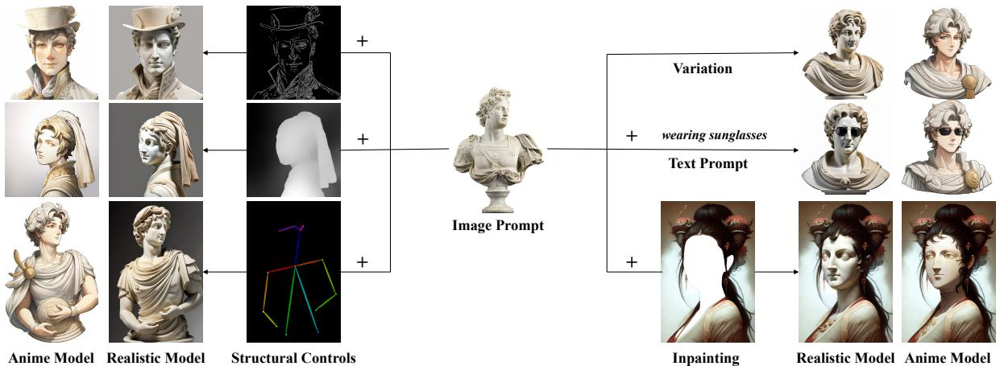  
FurVariusimag ynthei with ur propose -Adapter pplinhe preti text--mageu m wi diffeent yle.The ae  thht how esult is ula anipaintg wi a propt, whi he e exampe how he esul  nrollab neratn wie prompt and additional structural conditions.

In   he l ex--odesoray, prevus work ecaiRec van  cnollab at ial uonouaet n B heypt  I-ptr []  goal-et [1T h e fu orhe te prompt models, let alone the model trained from scratch. Wergue that e  poblmhei thods  nhecos-aten moul  exohe y  ro hehe ef oplishehelntmaue text atue bu hi potentaly sommag y image. To this end, we propose a more effective image prompt adapter named IP-Adapter to avoid the shortcomings of the previous methos.Specificay, I-Adapter adopts a decouple cross-attentin mechanim or text featue n o  osttyeeoe wealost o   h u poan IP-Apt iy  prmeer  parable  fuly - rot mo theex-oMoantrAai excelezaa is cpatib i ex propt.Witur propos Adapt vau merat sk  eas as illustrated in Figure 1. To sum up, our contributions are as follows: We present IP-Adapter, a lightweight image prompt adaptation method with the decoupled cross-attention strategy for existing text-to-image diffusion models. Quantitative and qualitative experimental results show that a small IP-Adapter with about 22M parameters is comparable or even better than the fully fine-tuned models for image prompt based generation. Our IP-Adapte is reusable and fexibleI-Adapterraine n the base dfusn model can egeneli t other custom models fine-tuned from the same base diffusion model. Moreover, IP-Adapter is compatible with other controllable adapters such as ControlNet, allowing for an easy combination of image prompt with structure controls. Due to the decoupled cross-attention strategy, image prompt is compatible with text prompt to achieve multimodal image generation.

# 2 Related Work

W de o pte  he xisex--oeIn hi c w review recent works on text-to-image diffusionmodels, as well as relevant studies on adapters for large mels.

# 2.1 Text-to-Image Diffusion Models

Larg text-o-image models are mainly divided into two categorie:autoregressive models and diffusion models. Early works, such as DALLE [13], CogView [14, 15] and Make-A-Scene [16], are autoregressive models. For the -   ke transormer [18] conditione n text tokens is traine to predic mage tokens. However, utoregressiv ode e require large parameters and computing resources to generate high-quality images, as seen in Parti [19].

Recently, ifsinmodels (DMs) [20, 21, 22, 23] has emerged as the ne state-of-he-art model for text-to-e ats pu ifet-alf $6 4 \times 6 4$ resolution and a 1.5B text-conditional upsampling diffusion model at $2 5 6 \times 2 5 6$ resolution. DALL-E 2 employs a a tex prompt. ALL-E2 not n ports ext prompt ormag eraton but alo ma promt. To ha e t 4 eex oeR-Im [5] e vhedeli am abateelu wiy modeTvext lt, ws dese wit  eslexto-maiffuimode, utilizimuleconditns iludiT ext, CLIP text, nd CLIPma edins.ersatiDiffuin [26] rets nif muli-owiffusr exT Co [] pnt jo-at u ns  pafo o image embeding RAPHAEL introduces a mixture-o-experts (MoEs) strategy [28, 29] into the text-conditional image diffusion model to enhance image quality and aesthetic appeal. AA H alosome works  explor suormag popt r he text--agsnmodes ondtine ly ext. SDI       h x io LIP tabl nCLI  ls -ode D whi h u .

# 2.2 Adapters for Large Models p  e  av , apter ave beeiliz hivvisgudtandi nguodel [, , 3,,].

Wte aexoptrhavberoo 9  - T]u an adapter for various local controls. A ct nd syl the proviemagCnroNe Shutrae repomage, cn es gnerationby  uerprovidemageMoreover, ContoNet Refereceony was prente  chivemagvant nTy isdee cntro hey  neatm useere mag y pendnaate ext I  xus.The oo ap  U-oNe l oe embedding from CLIP image encoder into condition embeddings by a small network and concatenates them with l x edi n   ie a h ynt SeeCoder [10] presents  semanticcontext encoder treplace heriginal ext encoder o enerateimag vants.

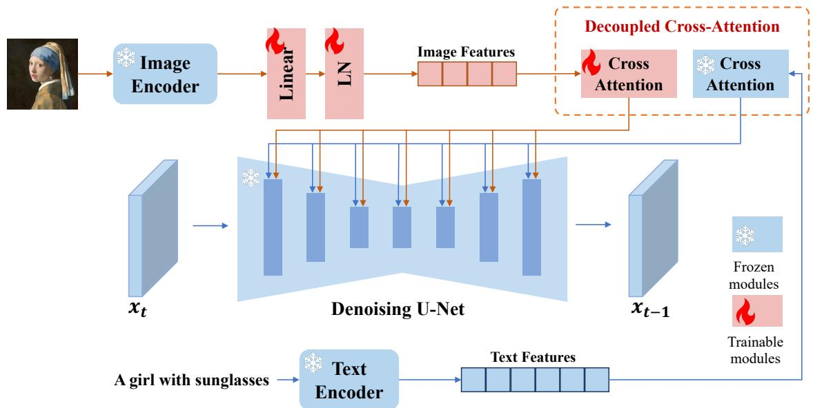  
T    atera added modules (in red color) are trained while the pretrained text-to-image model is frozen.

A pt moels,  lo ai o srat.I h suy rucecu ost mani to achivea ore effeciveage prompt adaptr.The propose adapter emains smple nd sal ut outperforms previous adapter methods, and is even comparable to fine-tuned models.

# 3 Method

I   h e the motivation and the design of the proposed IP-Adapter.

# 3.1 Prelimiaries

Dfion modes are class  enerative odels that copriseo processes  diusion proess (also own the forward process), which gradually adds Gaussian noise to the data using a fixed Markov chain of $T$ steps, and a denosi proeshat enerates ample fromGaussian nois with  learablemode Dfusion models canls e of a diffusion model, denoted as $\epsilon _ { \theta }$ , which predicts noise, is defined as a simplified variant of the variational bound:

$$
L _ { \mathrm { s i m p l e } } = \mathbb { E } _ { \mathbf { \boldsymbol { x } } _ { 0 } , \epsilon \sim \mathcal { N } ( \mathbf { \boldsymbol { 0 } } , \mathbf { I } ) , c , t } \| \epsilon - \epsilon _ { \theta } \left( \boldsymbol { x } _ { t } , \boldsymbol { c } , t \right) \| ^ { 2 } ,
$$

where $\scriptstyle { \mathbf { { \mathit { x } } } } _ { 0 }$ represents the real data with an additional conditon $^ c$ $t \in [ 0 , T ]$ denotes the time step of diffusion process, ${ \pmb x } _ { t } = \alpha _ { t } { \pmb x } _ { 0 } + \sigma _ { t } { \pmb \epsilon }$ is the noisy data at $t$ step, and $\alpha _ { t }$ , $\sigma _ { t }$ are predefined functions of $t$ that determine the diffusion process. Once the model $\epsilon _ { \theta }$ is trained, images can be generated from random noise in an iterative manner. Generally, fast samplers suc as DDIM [21], PNDM [36] and DPM-Solver [37, 38], are dopted in the ierece stage  acae the generation process. For he daliusoelclass ia [3]s rairar ni u  blae adeae p, the conditional and unconditional diffusion models are jointly trained by randomly dropping $^ c$ during training. In the sampling stage, the predicted noise is calculated based on the prediction of both the conditional model $\mathbf { \epsilon } \epsilon _ { \theta } ( \boldsymbol { x } _ { t } , \boldsymbol { c } , t )$ and unconditional model $\epsilon _ { \theta } ( x _ { t } , t )$ :

$$
\hat { \epsilon } _ { \theta } ( x _ { t } , c , t ) = w \epsilon _ { \theta } ( x _ { t } , c , t ) + ( 1 - w ) \epsilon _ { \theta } ( x _ { t } , t ) ,
$$

here, $w$ , otname guidance scal r uidance weight, s ascalar value that adjusts the aligment with condition $^ c$ Fx of generated samples. In r study, weutilize heopen-source  mode as our example base mode t plement the I-AdapteSDis latexu difsin models base n UNet [40] withatentn ayers.Compare o piel-ase diffusnmodels ike In, SD is more efficient since it is constructed on the latent space from a pretrained auto-encoder model.

# 3.2 Image Prompt Adapter

In this papehe  dat ab rextofe o  ap be effectively ebedded in the pretrained model.Most methods simply feed concatenated features into therozen ctte eeodt o ade crosatentnayersTheveralrcitctur ur propoe -Adapte demstrate FiguThe ar modules withdecouplecross-attention to embemageeaturesintothe pretained text-to-image difsonmoel.

# 3.2.1 Image Encoder

Followg mos  themethos, we us  pretrain LIP mencoer mode to extrac imag atue fom the pot   al m ai yti ge-text pairs. We utilize the global image beding rom the LIP image encoder, which is wel-aligned with is frozen. T embedding into a sequence of features with length $N$ (we use $N = 4$ in this study), the dimension of the image features this study consists of a linear layer and a Layer Normalization [41].

# 3.2.2 Decoupled Cross-Attention

Tha ee apu In te a m he xtom LIPex  pteUNede b the cross-attention layers. Given the query features $\mathbf { Z }$ and the text features $c _ { t }$ , the output of cross-attention $\mathbf { Z } ^ { \prime }$ can be defined by the following equation:

$$
\mathbf { Z } ^ { \prime } = \operatorname { A t t e n t i o n } ( \mathbf { Q } , \mathbf { K } , \mathbf { V } ) = \operatorname { S o f t m a x } ( { \frac { \mathbf { Q } \mathbf { K } ^ { \top } } { \sqrt { d } } } ) \mathbf { V } ,
$$

where $\mathbf { Q } = \mathbf { Z } \mathbf { W } _ { q }$ , $\mathbf { K } = \pmb { c } _ { t } \mathbf { W } _ { k }$ , $\mathbf { V } = { \pmb { c } } _ { t } \mathbf { W } _ { v }$ are the query, key, and values matrices of the attention operation respectively, and $\mathbf { W } _ { q }$ , $\mathbf { W } _ { k }$ , $\mathbf { W } _ { v }$ are the weight matrices of the trainable linear projection layers. A H To b spe we  anew coss-attentin lyeorac coss-attenin layer the ria UNet model t image features. Given the image features $c _ { i }$ , the output of new cross-attention $\mathbf { Z } ^ { \prime \prime }$ is computed as follows:

$$
\mathbf { Z } ^ { \prime \prime } = \operatorname { A t t e n t i o n } ( \mathbf { Q } , \mathbf { K } ^ { \prime } , \mathbf { V } ^ { \prime } ) = \operatorname { S o f t m a x } ( \frac { \mathbf { Q } ( \mathbf { K } ^ { \prime } ) ^ { \top } } { \sqrt { d } } ) \mathbf { V } ^ { \prime } ,
$$

where, $\mathbf { Q } = \mathbf { Z } \mathbf { W } _ { q }$ , $\mathbf { K } ^ { \prime } = \pmb { c } _ { i } \mathbf { W } _ { k } ^ { \prime }$ and $\mathbf { V } ^ { \prime } = \pmb { c } _ { i } \mathbf { W } _ { v } ^ { \prime }$ are the query, key, and values matrices from the image features. $\mathbf { W } _ { k } ^ { \prime }$ and $\mathbf { W } _ { v } ^ { \prime }$ ar the condng wegh matri It should benote that we us he same query or macoss-attn as for text cross-attention. Consequently, we only need add two paramemters $\mathbf { W } _ { k } ^ { \prime }$ , $\mathbf { W } _ { v } ^ { \prime }$ for each cross-attention layer. In order to speed up the convergence, $\mathbf { W } _ { k } ^ { \prime }$ and $\mathbf { W } _ { v } ^ { \prime }$ are initialized from $\mathbf { W } _ { k }$ and $\mathbf { W } _ { v }$ . Then, we simply add the output of is defined as follows:

$$
\begin{array} { r } { \mathbf { Z } ^ { n e w } = \mathrm { S o f t m a x } ( \frac { \mathbf { Q } \mathbf { K } ^ { \top } } { \sqrt { d } } ) \mathbf { V } + \mathrm { S o f t m a x } ( \frac { \mathbf { Q } ( \mathbf { K } ^ { \prime } ) ^ { \top } } { \sqrt { d } } ) \mathbf { V } ^ { \prime } } \\ { \mathbf { Q } = \mathbf { Z } \mathbf { W } _ { q } , \mathbf { K } = c _ { t } \mathbf { W } _ { k } , \mathbf { V } = c _ { t } \mathbf { W } _ { v } , \mathbf { K } ^ { \prime } = c _ { i } \mathbf { W } _ { k } ^ { \prime } , \mathbf { V } ^ { \prime } = c _ { i } \mathbf { W } _ { v } ^ { \prime } } \end{array}
$$

Sine we freeze the original UNet model, only the $\mathbf { W } _ { k } ^ { \prime }$ and $\mathbf { W } _ { v } ^ { \prime }$ are trainable in the above decoupled cross-attention.

# 3.2.3 Training and Inference

Du  -a h e e ei T x D

$$
L _ { \mathrm { s i m p l e } } = \mathbb { E } _ { \mathbf { { x } _ { 0 } } , \mathbf { { \epsilon } } , \mathbf { { c } } _ { t } , \mathbf { { c } } _ { i } , t } | | \epsilon - \epsilon _ { \theta } \left( \mathbf { { x } } _ { t } , \mathbf { { c } } _ { t } , \mathbf { { c } } _ { i } , t \right) | | ^ { 2 } .
$$

W

$$
\hat { \epsilon } _ { \theta } ( x _ { t } , c _ { t } , c _ { i } , t ) = w \epsilon _ { \theta } ( x _ { t } , c _ { t } , c _ { i } , t ) + ( 1 - w ) \epsilon _ { \theta } ( x _ { t } , t )
$$

Here, we simply zero out the CLIP image embedding if the image condition is dropped. A in the inference stage:

$$
\mathbf { Z } ^ { n e w } = \operatorname { A t t e n t i o n } ( \mathbf { Q } , \mathbf { K } , \mathbf { V } ) + \lambda \cdot \operatorname { A t t e n t i o n } ( \mathbf { Q } , \mathbf { K } ^ { \prime } , \mathbf { V } ^ { \prime } )
$$

where $\lambda$ is weight factor, and the model becomes the original text-to-image diffusion model if $\lambda = 0$

# 4 Experiments

# 4.1 Experimental Setup

# 4.1.1 Training Data o train he IP-Adapter, e bil ultialdata iludng about 10 milion tex-mage pairs o two source datasets - LAION-2B [42] and COYO-700M [43].

# 4.1.2 Implementation Details

Our experiments are based on SD v $1 . 5 ^ { 2 }$ , and we use OpenCLIP ViT-H/14 [44] as the image encoder. There are 16 cosaentn ayers   modean we  a neag cossattenin layerr eac thelayers.T al trainable parameers  ur IP-Adapterncludin a projectionetworkand daptemodules, mount about 22M, maki he P-Adapter quiteightweht.Weplemen ur -Adapter with HugiFaciffur lbrar [5] and emplo DeepSpeed ZeRO-2 [13] for fast training. IP-Adapter is trained on a single machine with 8 V100 GPUs for 1eps wi ba iz 8 per U We us eamWtzr 46] wi   rat .001and o  o with $5 1 2 \times 5 1 2$ resolution. To enable classifier-free guidance, we use a probability of 0.05 to drop text and image l  .extm sapler wi 0 ses, and set he ian scale .When y usi mage prompt,  t the text pr empty and $\lambda = 1 . 0$ .

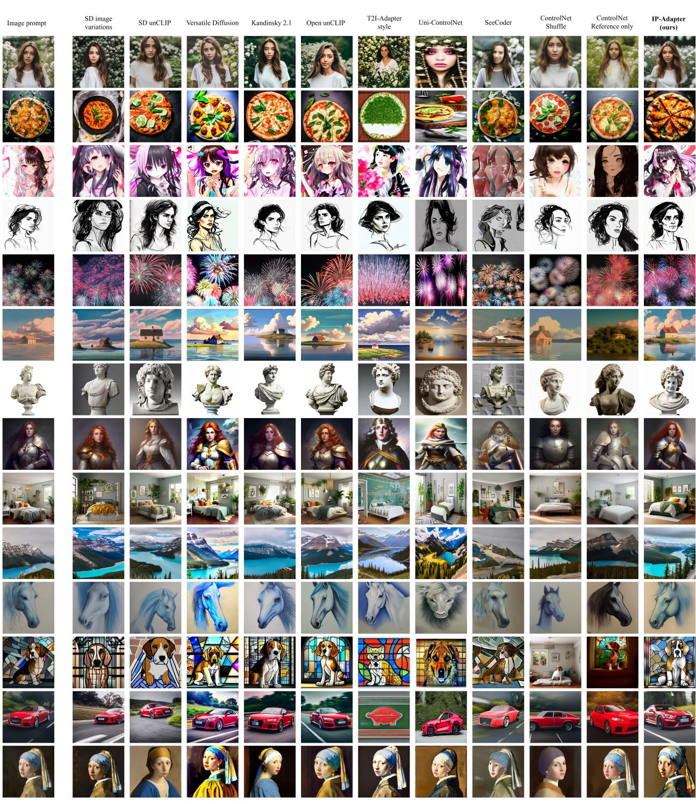  
Figur The isual coparison our proposed I-Adapter with othermethods conditioned n different kins n styles of images.

Table: Quantitative comparison f the proposed I-Adapter with other methods on COCOvalidation t. The best results are in bold.

<table><tr><td>Method</td><td>Reusable to custom models</td><td>Compatible with controllable tools</td><td>Multimodal prompts</td><td>Trainable parameters</td><td>CLIP-T↑</td><td>CLIP-I↑</td></tr><tr><td>Training from scratch</td><td></td><td></td><td></td><td></td><td></td><td></td></tr><tr><td>Open unCLIP</td><td></td><td></td><td></td><td>893M</td><td>0.608</td><td>0.858</td></tr><tr><td>Kandinsky-2-1</td><td>×</td><td>×</td><td></td><td>1229M</td><td>0.599</td><td>0.855</td></tr><tr><td>Versatile Diffusion</td><td></td><td>×</td><td>*</td><td>860M</td><td>0.587</td><td>0.830</td></tr><tr><td>Fine-tunining from text-to-image model</td><td></td><td></td><td></td><td></td><td></td><td></td></tr><tr><td>SD Image Variations</td><td></td><td>×</td><td>×</td><td>860M</td><td>0.548</td><td>0.760</td></tr><tr><td>SD unCLIP</td><td>×</td><td></td><td></td><td>870M</td><td>0.584</td><td>0.810</td></tr><tr><td>Adapters</td><td></td><td></td><td></td><td></td><td></td><td></td></tr><tr><td>Uni-ControlNet (Global Control)</td><td></td><td>√</td><td></td><td>47M</td><td>0.506</td><td>0.736</td></tr><tr><td>T2I-Adapter (Style)</td><td>:</td><td>J</td><td>:</td><td>39M</td><td>0.485</td><td>0.648</td></tr><tr><td>ControlNet Shuffle</td><td></td><td>✓</td><td></td><td>361M</td><td>0.421</td><td>0.616</td></tr><tr><td>IP-Adapter</td><td></td><td>✓</td><td>✓</td><td>22M</td><td>0.588</td><td>0.828</td></tr></table>

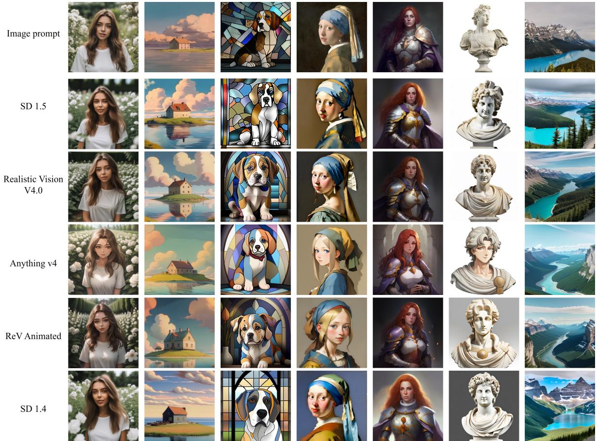  
ure  The eneat mages f dfferet diffusin odes with ur proposed I-Adapte. The I-Adapte trained once.

# 4.2 Comparison with Existing Methods

Tot e ivee t a -a h isetho oe x po of DALL-E 2, Kandinsky-2-1 2 which is a mixture of DALL-E 2 and latent dffusion, and Versatile Diffusion [26]. For the fine-tuned models, we choose D Image Variations and S unCLI. For the adapters, we compare r IPAapteriyleaptT-Aapter,heobacoUniCnoNetontroeShufonNe Reference-only and SeeCoder.

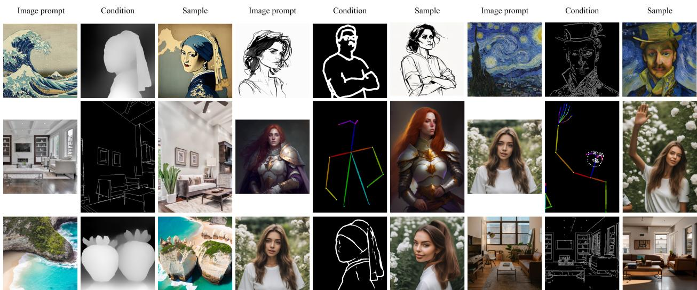

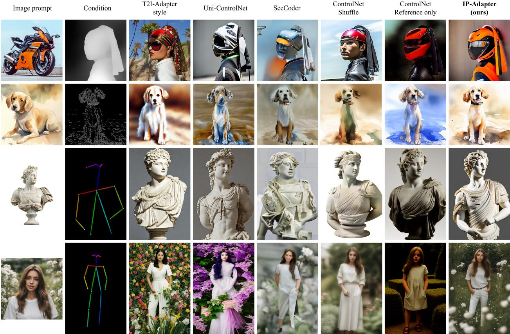  
FurVisualizatio enerate sample wiima propt and ditioal ructural conditions Note ha we don't need fine-tune the IP-Adapter.   

Figure 6: Comparison of our IP-Adapter with other methods on different structural conditions.

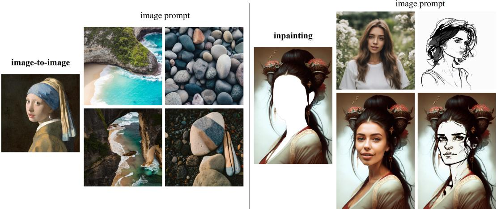  

Figure 7: Examples of image-to-image and inpainting with image prompt by our IP-Adapter.

# 4.2.1 Quantitative Comparison

We us e validation e  C2017 [7] containi5,000mages wih captions r qanttativ evaluation. Fr faparion  neate dine  e  propt r  smp heatast, u total 2,am vala CLIP-I: the similarity in CLIP image embedding of generated images with the image prompt. CLIP-T: the CLIPScore [48] of the generated images with captions of the image prompts. We calculate the average value of the two metrics on all generated images with CLIP ViT-L/ $1 4 ^ { 1 }$ model. As the open sourc SeeCode is use widitinalructural controls and Controe Refrence-ony is eleasnde we r   alavvaasTe r sl  os s met bethanhdaptelarabbetan-mo w 22M parameters.

# 4.2.2 Qualitative Comparison

W wrlfacntheFor SeeCodelsoshe cbcnol wi CnroNe ra.Fo CNe Ren  u    LI  el [] Fo , ran ertle nelec e es ametho siss wean  , the ap hahptbo ul w Mue ehneahe from scratch in most cases. Inue  Iathtihivb image prompt for the pretrained text-to-image diffusion models.

# 4.3 More Results

Alh  Ap  ehhea  opt  u calwr  angepats.s how Tab, ur-apte s oty iox    u that our adapter can generate.

# 4.3.1 Generalizable to Custom Models

A  z me f-tune fromDv.like othe dapters (. Controet.  ther words, once I-Adapte is a, i   abso un mboTvlite comunity models from HuggingFace model library1 Realistic Vision 4.0, Anything v4, and ReAnimated These models are al fne-tuned from SD v1..As shown in Figure 4, our IP-Adapter works well on these community mlFreoe, er niheyheio  a e yhyyhaper SD v1.4, as SD v1.5 is trained with more steps based on SD v1.4.

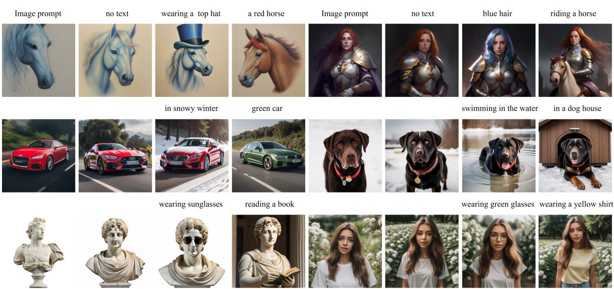  

Figure 8: Generated examples of our IP-Adapter with multimodal prompts.

# 4.3.2 Structure Control

Foxe aa Asap oanu hat  ppa exisollab tolsreul e an oolla m wi rot n cs. ee urap ixisoab olsoeT-apt to rows are generated with ControlNet model, while the samples in the st row re generated with TI-Adpters. Our adapter effectively works with these tools to produce more controllable images without fine-tuning. Waapptuo 6For T2I-Adapter and Uni-ControlNet, we use the default composable multi-conditions. For SeeCoder and our I-Adpter, weuse ControlNet tachive tructural control. For ControNet Shufe nd ControlNet Referen, eo     au also produces images that better align with the reference image.

# 4.3.3 Image-to-Image and Inpainting

Apar from text-to-imageeraton,text-to-imagiffuinmodels also canachieve text-guidimage-to-e and inpaintng with DEdit [0]. As demostrat i Figure7, we can alsoobtai mage-guide mage-to-im nd inpainting by simply replacing text prompt with image prompt.

# 4.3.4 Multimodal Prompts

Fohe ue-tuema pro odel, hegal ex-toma bily  lst st. Hower  the proposed I-Adapter, we can generate mages with multimodal prompts including image prompt and text prompt. We foud that th apablty peors particulary we cuiymodes. I theerencsage with mulal prompts, we adjust $\lambda$ to make a balance between image prompt and text prompt. Figure 8 displays various results with multoal propts usiRealisVisin .modes we n  e anus tial xt propt t e prompt using simple text descriptions.

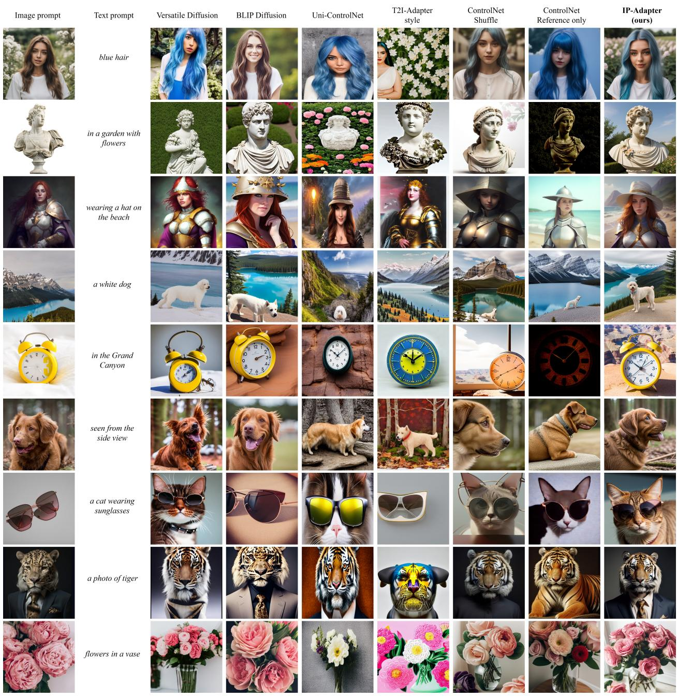  

Figure 9: Comparison with multimodal prompts between our IP-Adapter with other methods.

Welsoar I-Adapteriheret cdVersa sn, BLIP sn [31],Uni-ConNet, TI-Adapter, ControlNet Shuffle, and ControlNet Reference-only. The comparison results are shown in Figure 9 Copa wi ohe exist mths, urmethon e upe esultn bot a quality nd l with multimodal prompts.

# 4.4 Ablation Study

# 4.4.1 Importance of Decoupled Cross-Attention dcratentenatixtatueheee r cttyeoron ai o at 0 e i Figure 10 provides comparativ examples wih the I-Adapter wit decouple cross-attention and the mple ptr. A seo lanapu generate more consistent images with image prompts.

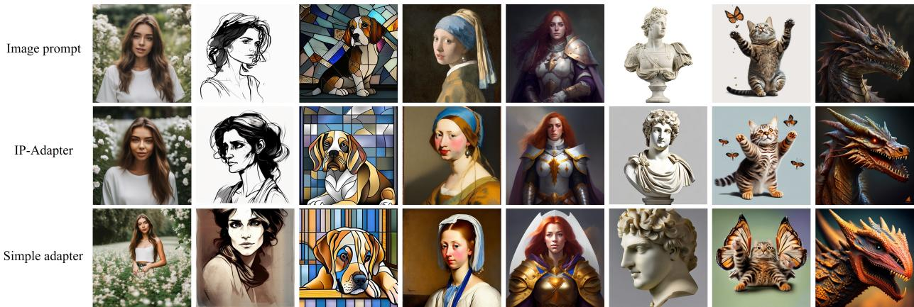

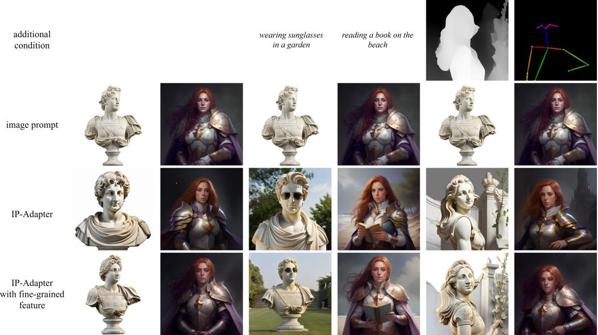  
u 0:Comparion results fur I-Adapter wit simple adaptr. The decoupled cross-attentio srateg is no used in the simple adapter.   
Tal c  beh -Ape i oal  an e -A with fine-grained features.

# 4.4.2 Comparison of Fine-grained Features and Global Features

I-izLI hmaTee  adaiatueirs ko transformer model. The token features from the query network serve as input to the cross-attention layers. Tu ver ro orveosan h ov i additional human poses.

# 5 Conclusions and Future Work

In this work wepropose -Adapter chivemag prot capabliyorhe pretrainetexto-magis mlsThe  aptbasecostray whoa cttnyauBo niav litavpeult IP-Adapter with only 22M parameters perorms comparably o even beter than some fully fne-tune image prompt iptr p w   o  a e is bo e its applicability More importantly, image prompt can be combined with text prompt to achieve multimodal image generation. Deith y    a li istmetho,  Textal Inversn [] nd DreBot [2]. In he ture, eaim deve powerful image prompt adapters to enhance consistency.

# References

[1] Alex Nichol, rafulla Dhariwal, AdityaRamesh, Pranav Shyam, Pamela Mishkin, Bob McGrew, Iya Sutskever, and Mark Chen. Glide: Towards photorealistic image generation and editing with text-guided diffusion models. arXiv preprint arXiv:2112.10741, 2021.   
[2 AdityaRamesh, PrafullaDhariwal, Alex Nichol, Casey Chu, and Mark Chen. Hierarchical text-conditionalage generation with clip latents. arXiv preprint arXiv:2204.06125, 2022.   
[3] Chitwan Saharia, William Chan, Saurabh Saxena, Lala Li, Jay Whang, Emily L Denton, Kamyar Ghasemipour, Raphael Gontijo Lopes, Burcu Karagol Ayan, Tim Salimans, et al. Photorealistic text-to-image diffusion models with deep language understanding. Advances in Neural Information Processing Systems, 35:3647936494, 2022.   
[4] Robin Rombach, Andreas Blattmann, Dominik Lorenz, Patrick Esser, and Björn Ommer. High-resolution image synthesis with latent diffusion models. In Proceedings of the IEEE/CVF conference on computer vision and pattern recognition, pages 1068410695, 2022.   
[5] Yogesh Balaji, Seungun Nah, Xun Huang, Arash Vahdat, Jiaming Song, Karsten Kreis, MikaAittala, TimAila, Sam LaieBryCatazarodiText-o-maiff e wi  eepe er. arXiv preprint arXiv:2211.01324, 2022.   
[] Zeyue Xue, Guanglu Song, Qushan Guo, Boxiao Liu, Zhuofan Zong, Yu Liu, and Png Luo. Raphael: Text-toimage generation via large mixture of diffusion paths. arXiv preprint arXiv:2305.18295, 2023.   
[7] Sam Witteveen and Martin Andrews. Investigating prompt engineering in diffusion models. arXiv preprint arXiv:2211.15462, 2022.   
[8] Alec Radford, Jong Wook Kim, Chris Hallacy, Aditya Ramesh, Gabriel Goh, Sandhini Agarwal, Girish Sastry, AmandAske Pamela Mishkin, Jack Clark,  al Learni ansrabl isal mode fromatural ane supervision. In International conference on machine learning, pages 87488763. PMLR, 2021.   
[9] Lvmin Zhang and Maneesh Agrawala. Adding conditional control to text-to-image diffusion models. arXiv preprint arXiv:2302.05543, 2023.   
10Xingqian Xu, Jiayi Guo, Zhangyang Wang, Gao Huang, Ifan Essa, and Humphrey Shi. Prompt-reediffuson: Taking" text" out of text-to-image diffusion models. arXiv preprint arXiv:2305.16223, 2023.   
11Chong Mou, Xintao Wang, Liangbin Xie, Jian Zhang, Zhongang Qi, Ying Shan, and Xiaohu Qie. T2i-adapter: Learning adapters to dig out more controllable ability for text-to-image diffusion models. arXiv preprint arXiv:2302.08453, 2023.   
12 Shihao Zhao, Dongdong Chen, Yen-Chun Chen, Jianmin Bao, Shaozhe Hao, Lu Yuan, and Kwan-Yee K Wong. Uni-controlnet: All-in-one control to text-to-image diffusion models. arXiv preprint arXiv:2305.16322, 2023.   
13 Aditya Ramesh, Mikhail Pavlov, Gabriel Goh, Scott Gray, Chelsea Voss, Alec Radford, Mark Chen, and Ilya Sutskever. Zero-shot text-to-image generation. In International Conference on Machine Learning, pages 8821 8831. PMLR, 2021.   
14] Ming Ding, Zhuoyi Yang, Wenyi Hong, Wendi Zheng, Chang Zhou, Da Yin, Junyang Lin, Xu Zou, Zhou Shao, Hongxia Yang, et al. Cogview: Mastering text-to-image generation via transformers. Advances in Neural Information Processing Systems, 34:1982219835, 2021.   
[15] Ming Ding, Wendi Zheng, Wenyi Hong, and Jie Tang. Cogview2: Faster and better text-to-image generaton vi hierarchical transformers. Advances in Neural Information Processing Systems, 35:1689016902, 2022.   
[16] Oran Gafni, Adam Polyak, Oron Ashual, Shelly Sheynin, Devi Parikh, and Yaniv Taigman. Make-a-scene: Scene-based text-to-image generation with human priors. In European Conference on Computer Vision, pages 89106. Springer, 2022.   
[ne orol iyal e r processing systems, 30, 2017.   
[18 Ashish Vaswani, Noam Shazeer, Niki Parmar, Jakob Uszkoreit, Llion Jones, Aidan  Gomez, ukasz Kaiser, and Illia Polosukhin. Attention is all you need. Advances in neural information processing systems, 30, 2017.   
[9] Jiahui Yu,Yuanhong Xu, Jing uKoh, Than Luon Guna Baid, Zirui Wang, Vijay Vasudevan AlexanrKu, Yini Yang, Burcu KaragolAyan, e al.Scalingautoregressive models or conten-rich text-to-image generation. arXiv preprint arXiv:2206.10789, 2022.   
[20] Jascha Sohl-Dickstein, Eric Weiss, Nir Maheswaranathan, and Sury Ganguli. Deep unsupervisedlearnigusing nonequilibrium thermodynamics. In International conference on machine learning, pages 22562265. PMLR, 2015.   
[21] Jiaming Song, Chenlin Meng, and Stefano Ermon. Denoising diffusion implicit models. arXiv preprint arXiv:2010.02502, 2020.   
[22] Yang Song, Jascha Sohl-Dickstein, Diederik P Kingma, Abhishek Kumar, Stefano Ermon, and Ben Poole. Score-based generative modeling through stochastic differential equations. arXiv preprint arXiv:2011.13456, 2020.   
[3] Prafulla Dhariwal and Alexander Nichol. Diffusion models beat gans on image synthesis. Advances inneural information processing systems, 34:87808794, 2021.   
[24] Colin Rafel, Noam Shazeer, Adam Roberts, Katherine Lee, Sharan Narang, Michael Matena, Yanqi Zhou, Wei ph ex--eTh Machine Learning Research, 21(1):54855551, 2020.   
[25] Wenhu Chen, Hexiang Hu, Chitwan Saharia, and Wiiam W Cohen. Re-imagen: Retrieval-augmented text-toimage generator. arXiv preprint arXiv:2209.14491, 2022.   
[6 Xingn Xu, Zhangyag Wang, EricZhang, Kai Wang and Huprey Shirsi iffusin: Text, ma and variations all in one diffusion model. arXiv preprint arXiv:2211.08332, 2022.   
[Hua henL u e li ZhaondJiZovn image synthesis with composable conditions. arXiv preprint arXiv:2302.09778, 2023.   
[28 Noam Shazer, AzaliMirhoseii, KrzyoMaziar, Andy Davis, Quoc Le, Geoffey Hinton, and Jeff Dean. Outragusly large neural networks: The sparsely-gated mixture-o-experts layer. arXiv preprint arXiv:1701.06538, 2017.   
[9] Willim Fedus, Barret Zoph, and Noam Shazee. witc tranormers: Scalig totrillion paramee odels with simple and efficient sparsity. The Journal of Machine Learning Research, 23(1):52325270, 2022.   
[0 Neil Houlsby,AdeGiurg,Stanis Jastrzebski Brunaorroe, Quentin De Laroue,AdreGeu, MoAttarya, and Sylvain Gelly.Parameter-effciet transerlearning or lp.In Interational Conferec Machine Learning, pages 27902799. PMLR, 2019.   
[ JunanLi, Donxu Li, SilvioSavaree, and Steve Hoi.Bli-2: Boottrappgane-image pre-rai ih frozen image encoders and large language models. arXiv preprint arXiv:2301.12597, 2023.   
2 Dy Zhuunhe Xin i  y 4 inunderstanding with advanced large language models. arXiv preprint arXiv:2304.10592, 2023.   
[3 R Zhan J Han,Aojun Zhou, Xia Hu, ShilYan, an Lu, HonhegLi, PengGao, andYu Q. LladapterEffcet fe-nnanggeoel withzero-niattentiorXipreri arXiv:303.1199, 2023.   
[4] Peng Gao, Jiami Han, Renr Zhang, Ziyi Lin Shijie Geng, Aojun Zhou, Wi Zhang, Pan Lu, Conhui He, XiYueladapt PrftaltroeriprerXiv:30.01 2023.   
[35] Yan Zeng, Hanbo Zhang, Jiani Zheng, Jiangnan Xia, Guoqiang Wei, Yang Wei, Yuchen Zhang, and Tao Kong. What maters in training a gpt4-style language model with multimodal inputs? arXiv preprint arXiv:2307.02469, 2023.   
[36] Luping Liu, Yi Ren, Zhijie Lin, and Zhou Zhao. Pseudonumerical methods for diffusion models on maniolds. arXiv preprint arXiv:2202.09778, 2022.   
[Cheng Lu, Yuho Zhou, Fan Bao, Jian Chen, Chonun Li, and Jun Zhu m-solverast de solver for diffusion probabilistic model sampling in around 10 steps. Advances in Neural Information Processing Systems, 35:57755787, 2022.   
[38Cheng Lu, Yuhao Zhou, Fan Bao, Jianei Chen, Chongxuan Li, and Jun Zhu. Dpm-solver++: Fast solver for guided sampling of diffusion probabilistic models. arXiv preprint arXiv:2211.01095, 2022.   
[39] Jonathan Ho and Tim Salimans. Classifer-free diffusion guidance. arXiv preprint arXiv:2207.12598, 2022.   
[0 Ola Rer, il ier, d Thos ox. -ne: ota t o lm - mentation. In Medical Image Computing and Computer-Assisted InterventionMICCAI 2015: 18th International Conference, Munich, Germany, October 5-9, 2015, Proceedings, Part II 18, pages 234241. Springer, 2015.   
[41] Jimmy Lei Ba, Jami Ryan Kiros, and Geoffrey E Hinton. Layer normalization. arXiv preprint arXiv:1607.06450, 2016.   
[42] Christoph Schuhmann, Romain Beaumont, Richard Vencu, Cade Gordon, Ross Wightman, Mehdi Cherti, Theo Coombes, Aarush Katta, Clayton Mullis, Mitchell Wortsman, et al. Laion-5b: An open large-scale dataset for training next generation image-text models. Advances in Neural Information Processing Systems, 35:2527825294, 2022.   
[43] Minwoo Byeon, Beomhee Park, Haecheon Kim, Sungjun Lee, Woonhyuk Baek, and Saehoon Kim. Coyo-700m: Image-text pair dataset. https://github.com/kakaobrain/coyo-dataset, 2022.   
[44] Gabriel Iharco, Mitchell Wortsman, Ross Wightman, Cade Gordon, Nicholas Carlii, Rohan Taori, Achal Dave, Vaishaal Shankar, Hongseok Namkoong, John Miller, Hannaneh Hajishirzi, Ali Farhadi, and Ludwig Schmidt. Openclip. https://github.com/mlfoundations/open_clip, 2021.   
[45] PatricvonPlaten, SurajPatilAnton Lozhkov, PedroCea, Natha Lambert, Kashi Rasul, MishDav, and Thomas Wolf. Diffusers: State-of-the-art diffusion models. https://github.com/huggingface/ diffusers, 2022.   
[46] Iya Loshchilov and Frank Huter. Decoupled weight decay regularization. arXiv preprint arXiv:1711.05101, 2017.   
[47] Tsung-Yi Lin, Michael Maire, Serge Belongie, James Hays, Pietro Perona, DevaRamanan, Piotr Dollár, and C Lawrence Zitnick. Microsoft coco: Common objects in context. In Computer VisionECCV 2014: 13th European Conference, Zurich, Switzerland, September 6-12, 2014, Proceedings, Part V 13, pages 740755. Springer, 2014.   
[48] Jack Hessel, Ari Holtzman, Maxwell Forbes, Ronan Le Bras, and Yejin Choi.Clipscore: A reference-free evaluation metric for image captioning. arXiv preprint arXiv:2104.08718, 2021.   
[49] Junan Li, Dongxu Li, Caimig Xiong, and Steven Hoi. Blip: Bootstrappig language-image pre-trainig for unified vision-language understanding and generation. In International Conference on Machine Learning, pages 1288812900. PMLR, 2022.   
[50] Chenlin Meng, Yutong He, Yang Song, Jiamig Song, Jiajun Wu, Jun-Yan Zhu, and Steano Ermo.dedit: Guide image yntheis and editig with stochasti differental equations.arXiv preprint arXiv:2108.01073, 2021.   
[51] Rinon Gal, Yuval Alaluf, Yuval Atzmon, Or Patashnik, Amit H Bermano, Gal Chechik, and Daniel Cohen-Or. An image is worth one word: Personalizing text-to-image generation using textual inversion.arXiv preprint arXiv:2208.01618, 2022.   
[52] Nataniel Ruiz, Yuanzhen Li, Varun Jampani, Yael Pritch, Michael Rubinstein, and KfrAberman. Dreamboth: Fine tuning text-to-image diffusion models for subject-driven generation. In Proceedings of the IEEE/CVF Conference on Computer Vision and Pattern Recognition, pages 2250022510, 2023.