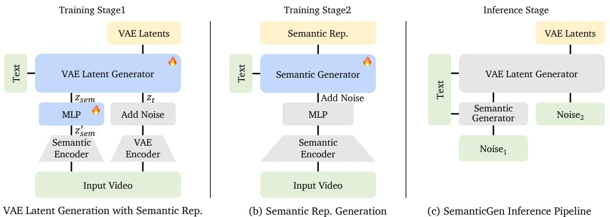
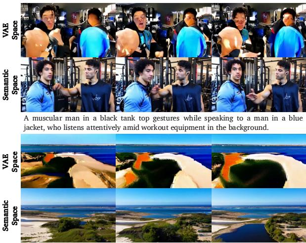

# 1. 论文基本信息

## 1.1. 标题
SemanticGen: Video Generation in Semantic Space (SemanticGen：在语义空间中生成视频)

## 1.2. 作者
论文作者团队由来自浙江大学、快手科技 Kling 团队、香港中文大学（CUHK）、大连理工大学（DLUT）和华中科技大学（HUST）的研究人员组成。主要作者包括 Jianhong Bai, Xiaoshi Wu, Xintao Wang 等。这表明该研究是学术界与工业界紧密合作的产物，特别是快手 Kling 团队在视频生成领域有深厚的技术积累。

## 1.3. 发表期刊/会议
该论文目前以预印本（preprint）形式发布在 arXiv 上。arXiv 是一个广泛用于物理学、数学、计算机科学等领域学者发布最新研究成果的平台。虽然未经同行评审，但它是了解前沿技术动态的重要渠道。

## 1.4. 发表年份
2025 年（根据 arXiv 提交日期推断）。

## 1.5. 摘要
当前最先进的 (state-of-the-art) 视频生成模型通常在 `VAE` 空间中学习视频潜变量的分布，并使用 `VAE` 解码器将其映射到像素空间。尽管这种方法能生成高质量视频，但它存在收敛速度慢和生成长视频时计算成本高昂的问题。本文介绍了 `SemanticGen`，一种通过在语义空间中生成视频来解决这些局限性的新方法。核心洞见在于，由于视频固有的冗余性，生成过程应从一个紧凑、高层次的语义空间开始进行全局规划，然后再添加高频细节，而不是直接用双向注意力对大量低级视频词元 (token) 进行建模。`SemanticGen` 采用两阶段生成过程：第一阶段，一个扩散模型生成紧凑的语义视频特征，定义视频的全局布局；第二阶段，另一个扩散模型在这些语义特征的条件下生成 `VAE` 潜变量，以产生最终输出。研究发现，在语义空间中生成比在 `VAE` 潜变量空间中生成收敛更快。该方法在扩展到长视频生成时也表现出高效性和计算效率。大量实验证明 `SemanticGen` 能生成高质量视频，并优于现有的先进方法和强大的基线模型。

## 1.6. 原文链接
*   **原文链接:** https://arxiv.org/abs/2512.20619
*   **PDF 链接:** https://arxiv.org/pdf/2512.20619v3.pdf
*   **发布状态:** 预印本 (Preprint)。

    ---

# 2. 整体概括

## 2.1. 研究背景与动机
### 2.1.1. 核心问题
当前主流的视频生成模型（特别是基于扩散的模型）面临两大瓶颈：
1.  **训练效率低下：** 为了生成高质量视频，模型需要在庞大的 `VAE` 潜变量空间中学习，这导致模型收敛速度极慢，需要消耗巨大的计算资源（论文中提到高达数十万 GPU 小时）。
2.  **长视频生成困难：** 视频数据量随时间线性增长。一个 60 秒、480p、24fps 的视频会被 `VAE` 编码成超过 50 万个 `token`。在如此长的序列上使用标准的 `Transformer` 结构（其核心是自注意力机制）会导致计算复杂度呈二次方增长，这在计算上是不可行的。

### 2.1.2. 现有研究的挑战与空白 (Gap)
为了解决长视频生成的难题，现有工作尝试了多种方案，但各有缺陷：
*   <strong>稀疏注意力 (Sparse Attention):</strong> 通过限制注意力计算的范围来降低复杂度，但这可能损害全局信息的捕捉，影响视频的长期一致性。
*   <strong>自回归 (Autoregressive) 或混合框架:</strong> 逐帧或逐片段生成视频，虽然能处理长序列，但容易出现<strong>时间漂移 (temporal drift)</strong>（即视频内容随时间推移逐渐偏离初始主题或风格）和视觉质量下降的问题。
*   **直接在 `VAE` 潜变量空间建模:** 这种方法没有充分利用视频内容的高度冗余性。视频的相邻帧之间通常只有微小变化，而 `VAE` 潜变量仍然保留了大量的低级纹理和细节信息，使得模型需要花费大量精力去学习这些高度相关的低级特征，而不是专注于视频的宏观结构和动态变化。

### 2.1.3. 本文的切入点与创新思路
`SemanticGen` 的核心思想是**分而治之，先规划后细化**。作者认为，视频生成不应该一步到位地在充满细节的低级空间中进行，而应该模仿人类创作的过程：
1.  <strong>全局规划 (Global Planning):</strong> 首先在一个**高度紧凑、高层次的语义空间**中生成视频的“故事板”或“草图”。这个语义表示只包含视频的核心内容，如物体、场景、运动轨迹和镜头切换，而忽略了具体的颜色、纹理等高频细节。由于这个空间非常紧凑，模型可以高效地进行全局建模，确保长期一致性。
2.  <strong>细节填充 (Detail Refinement):</strong> 在全局规划完成后，再以这个语义“草图”为条件，生成包含丰富细节的 `VAE` 潜变量，最终解码成高清视频。

    这种“语义先行”的策略，旨在通过解耦视频的全局结构和局部细节，来提高训练效率和长视频生成质量。

## 2.2. 核心贡献/主要发现
1.  **提出了 `SemanticGen` 框架:** 一种新颖的视频生成范式，它将生成过程分解为两个阶段：首先在紧凑的语义空间中生成全局规划，然后映射到 `VAE` 潜变量空间以添加细节。
2.  **引入语义表示压缩:** 论文发现直接使用高维的语义特征进行训练效果不佳。为此，他们提出使用一个轻量级的 `MLP` 对语义特征进行压缩和正则化，使其更适合被扩散模型学习，从而显著加速了模型的收敛。
3.  **验证了语义空间的优越性:** 通过实验证明，在语义空间中训练生成模型比在（同样压缩过的）`VAE` 潜变量空间中训练，收敛速度要快得多。这为视频生成提供了一个更高效的训练路径。
4.  **实现了高效的长视频生成:** `SemanticGen` 通过在紧凑的语义空间上使用<strong>全注意力 (full-attention)</strong> 保证全局一致性，同时在扩展到高维 `VAE` 空间时采用<strong>移位窗口注意力 (shifted window attention)</strong> 来控制计算成本，成功地生成了高质量、高一致性的长视频，并优于现有方法。

    ---

# 3. 预备知识与相关工作

## 3.1. 基础概念
### 3.1.1. 变分自编码器 (Variational Autoencoder, VAE)
`VAE` 是一种深度生成模型，由<strong>编码器 (Encoder)</strong> 和<strong>解码器 (Decoder)</strong> 两部分组成。
*   **编码器:** 负责将高维的输入数据（如视频帧）压缩成一个低维的<strong>潜变量 (latent variable)</strong>，这个低维空间被称为<strong>潜空间 (latent space)</strong>。`VAE` 的特别之处在于，它学习的是数据在潜空间中的概率分布（通常是高斯分布），而不是一个确定的点。
*   **解码器:** 负责从潜空间中采样一个潜变量，并将其重建回原始的高维数据。
    在视频生成任务中，`VAE` 的作用是将视频从复杂的像素空间转换到一个更紧凑、更易于建模的潜空间，从而让后续的生成模型（如扩散模型）可以专注于学习潜变量的分布，而不是像素的分布。

### 3.1.2. 扩散模型 (Diffusion Models)
扩散模型是当前最主流的生成模型之一，其核心思想源于热力学。它包含两个过程：
*   <strong>前向过程（加噪）:</strong> 在这个过程中，模型逐步、多次地向原始数据（如一张图片或视频潜变量）添加少量高斯噪声，直到数据完全变成纯粹的噪声。这个过程是固定的，不需要学习。
*   <strong>反向过程（去噪）:</strong> 这是模型学习的核心。模型需要学习如何从一个纯噪声的输入开始，逐步、多次地去除噪声，最终恢复出符合原始数据分布的清晰数据。这个去噪网络通常以当前的时间步和条件信息（如文本描述）作为输入。
    通过学习这个去噪过程，扩散模型能够生成非常高质量和多样化的数据。

### 3.1.3. 扩散 Transformer (Diffusion Transformer, DiT)
`DiT` 是一种将 `Transformer` 架构应用于扩散模型中的去噪网络的模型。传统的扩散模型通常使用 `U-Net` 架构，而 `DiT` 将加噪后的潜变量视为一个序列的 `token`，并利用 `Transformer` 强大的序列建模能力来进行去噪。这种架构被证明具有很好的可扩展性，模型参数越大，生成效果越好。

### 3.1.4. 注意力机制 (Attention Mechanism)
注意力机制是 `Transformer` 的核心组件，它允许模型在处理一个序列时，动态地计算序列中不同元素之间的重要性。其基本计算过程如下：
对于一个查询（Query, $Q$），模型会计算它与所有键（Key, $K$）的相似度，然后将这些相似度分数进行归一化（通常使用 `softmax`），最后用这些归一化的分数对对应的值（Value, $V$）进行加权求和。
$$
\mathrm{Attention}(Q, K, V) = \mathrm{softmax}\left(\frac{QK^T}{\sqrt{d_k}}\right)V
$$
*   **符号解释:**
    *   `Q, K, V`: 分别代表查询、键和值的矩阵。在自注意力中，它们都来自于同一个输入序列。
    *   $d_k$: 键向量的维度。除以 $\sqrt{d_k}$ 是为了缩放，防止梯度过小。
    *   `softmax`: 归一化函数，将相似度分数转换为总和为 1 的权重。
        <strong>双向注意力 (Bi-directional Attention)</strong> 或 <strong>全注意力 (Full Attention)</strong> 指的是序列中的每个 `token` 都可以关注到其他所有 `token`（包括过去和未来），这使得模型能捕捉全局依赖关系，但其计算复杂度是序列长度的平方，即 $O(N^2)$，这也是长视频生成的主要瓶颈。

## 3.2. 前人工作
`SemanticGen` 的研究建立在两大技术路线之上：视频生成模型和利用语义表示进行生成。

### 3.2.1. 视频生成模型
*   **基于扩散的方法:** 这类方法通过在 `VAE` 潜空间中训练扩散模型来生成视频，如 `Imagen Video`、`Latte` 等。它们通常使用双向注意力来同时生成所有帧，保证了短视频的高质量，但难以扩展到长视频。
*   **自回归方法:** 如 `Genie`、`VideoPoet`，它们像语言模型一样逐个 `token` 或逐帧生成视频。这种方式可以自然地处理任意长度的视频，但容易出现误差累积，导致长期一致性差（即“漂移”）。
*   **混合方法:** 如 `Diffusion Forcing`、`Self-forcing`，试图结合扩散模型的生成质量和自回归模型的长度可扩展性。但这些方法通常在性能上仍不及纯扩散模型。

### 3.2.2. 用于生成的语义表示
将语义信息融入生成模型是近年来的一个热门方向。
*   <strong>优化 <code>VAE</code>:</strong> 一些工作（如 `VA-VAE`, `DC-AE`）在训练 `VAE` 时，加入了语义层面的目标函数，使得 `VAE` 学习到的潜空间不仅能重建像素，还包含了丰富的语义信息，从而让后续的生成模型更容易学习。这类工作与 `SemanticGen` 是<strong>正交的 (orthogonal)</strong>，意味着 `SemanticGen` 可以直接受益于一个更好的、语义更丰富的 `VAE`。
*   **优化潜变量生成器:** 另一些工作直接在生成阶段利用语义特征。
    *   `RCG` 提出先生成自监督学习到的图像特征，再映射到图像分布。
    *   `REPA` 将扩散模型中间层的隐藏状态与预训练的语义特征进行对齐，以加速收敛。
    *   `TokensGen` 是与 `SemanticGen` 最相关的工作。它也采用两阶段生成，但它第一阶段生成的是**被进一步压缩的 `VAE` 潜变量**，而不是**语义特征**。`SemanticGen` 的核心论点是，在语义空间中生成比在压缩的 `VAE` 空间中生成更高效、收敛更快。

## 3.3. 技术演进
视频生成技术从最初的 `GAN` 模型发展到如今以扩散模型为主流的时代。早期的模型主要关注短视频生成，通过将图像生成模型扩展到时域来实现。随着 `Transformer` 在视觉领域的成功，`DiT` 等架构进一步提升了视频生成的质量和可扩展性。当前，该领域的主要挑战已经从“能否生成”转向“能否高效地生成高质量、高一致性的长视频”，而 `SemanticGen` 正是针对这一核心挑战提出的解决方案。

## 3.4. 差异化分析
`SemanticGen` 与先前工作最核心的区别在于其**生成空间的战略性选择**。
*   **与主流扩散模型的区别:** 主流方法直接在低级的 `VAE` 潜空间中操作，试图一步到位地生成所有细节。`SemanticGen` 则将问题解耦，先在高层的语义空间中解决全局一致性问题，再在低层空间中解决细节渲染问题。
*   **与 `TokensGen` 的区别:** `TokensGen` 的第一阶段压缩和生成的是 `VAE` 潜变量的“浓缩版”，它仍然是低级视觉特征的表示。而 `SemanticGen` 的第一阶段生成的是来自视频理解模型的**语义特征**，这是一种更高层次、更抽象的表示，天然地过滤掉了冗余的纹理细节，更专注于内容和动态。论文的消融实验（Figure 9）有力地证明了这一选择的优越性。

    ---

# 4. 方法论

`SemanticGen` 的整体框架是一个两阶段的生成流程，如下图所示（原文 Figure 3）。它首先训练一个能够根据语义特征生成视频 `VAE` 潜变量的模型（阶段二），然后训练另一个模型来根据文本生成这些语义特征（阶段一）。

*该图像是示意图，展示了SemanticGen的训练和推理流程，包括两个阶段的生成过程以及输入文本与视频之间的关系。在训练阶段1，VAE潜在生成器生成语义表示；在训练阶段2，语义生成器基于文本生成视频特征；推理阶段则利用VAE潜在生成器最终生成视频。*

## 4.1. 方法原理
该方法的核心思想是利用视频理解模型提取的紧凑语义表示作为中间桥梁。这个语义表示充当了视频的“蓝图”，它捕捉了视频的全局布局、物体运动和场景动态等核心信息。整个生成过程分为两个独立的扩散模型训练阶段，最终在推理时串联起来。

## 4.2. 核心方法详解 (逐层深入)

### 4.2.1. 预备知识：基础文生视频模型
`SemanticGen` 建立在一个预训练的文生视频（Text-to-Video, T2V）基础模型之上。该模型是一个标准的**潜变量扩散模型**，由一个 3D `VAE` 和一个 `DiT` 组成。
模型采用 `Rectified Flow` 框架进行扩散和去噪。
*   <strong>前向过程（加噪）:</strong> 数据 $z_0$ 和噪声 $\epsilon$ 之间的路径被定义为一条直线。
    $$
    z _ { t } = ( 1 - t ) z _ { 0 } + t \epsilon
    $$
    *   **符号解释:**
        *   $z_0$: 原始的视频 `VAE` 潜变量。
        *   $\epsilon$: 从标准正态分布 $\mathcal{N}(0, I)$ 中采样的噪声。
        *   $t$: 时间步，取值范围为 `[0, 1]`。$t=0$ 时为原始数据，$t=1$ 时为纯噪声。

*   <strong>反向过程（去噪）:</strong> 去噪过程被建模为一个常微分方程（ODE）。
    $$
    d z _ { t } = v _ { \Theta } ( z _ { t } , t ) d t
    $$
    *   **符号解释:**
        *   $v_{\Theta}$: 一个由神经网络（参数为 $\Theta$）参数化的速度场，模型需要学习这个速度场来指导去噪方向。

*   **训练目标:** 模型通过 `Conditional Flow Matching` 进行训练，其损失函数为：
    $$
    \mathcal { L } _ { L C M } = \mathbb { E } _ { t , p _ { t } ( z , \epsilon ) , p ( \epsilon ) } | | v _ { \Theta } ( z _ { t } , t ) - u _ { t } ( z _ { 0 } | \epsilon ) | | _ { 2 } ^ { 2 }
    $$
    *   **符号解释:**
        *   $v_{\Theta}(z_t, t)$: 模型在时间步 $t$ 对加噪数据 $z_t$ 预测的速度。
        *   $u_t(z_0 | \epsilon)$: 从 $z_0$ 到 $\epsilon$ 的真实速度场。
        *   $\mathbb{E}$: 期望。模型的目标是最小化预测速度和真实速度之间的均方误差。

### 4.2.2. 第一阶段：使用语义嵌入生成视频 (训练 VAE 潜变量生成器)
这是整个流程的第二步，但却是第一个被训练的模型。该模型的任务是：**给定一个语义表示，生成对应的视频 `VAE` 潜变量**。

#### 4.2.2.1. 语义编码器的选择
论文指出，一个好的视频语义编码器应满足三个条件：
1.  **大规模视频数据预训练:** 能够捕捉时间动态，如物体运动。
2.  **时空维度紧凑:** 能有效压缩视频，去除冗余。
3.  **支持多样化输入:** 能处理不同长度、分辨率的视频。
    基于此，论文选择了 `Qwen-2.5-VL` 的视觉塔作为语义编码器。它将视频 $V \in \mathbb { R } ^ { 3 \times F \times H \times W }$ 编码为一个紧凑的语义表示 $\boldsymbol { z } _ { s e m } ^ { ' } \in \mathbb { R } ^ { d \times F _ { s } / 2 \times H / 2 8 \times W / 2 8 }$。

#### 4.2.2.2. 语义表示压缩
直接使用 `Qwen-2.5-VL` 输出的高维语义特征 `z'_{sem}` (维度为 2048) 会导致训练收敛慢、性能差。作者推测原因有二：一是信息过于丰富，模型难以拟合；二是原始语义空间不适合扩散模型采样。
为此，他们引入一个可学习的轻量级 `MLP` 网络来压缩语义空间。
*   **作用:**
    1.  **降维:** 将 2048 维的特征压缩到更低的维度（如 64 或 8）。
    2.  **高斯正则化:** `MLP` 输出压缩后特征空间的均值和方差，并引入 <strong>KL 散度 (KL divergence)</strong> 损失，强制该空间服从高斯分布。这使得后续的语义生成模型更容易学习和采样。

#### 4.2.2.3. 条件注入
训练流程如原文 Figure 3a 所示。
1.  输入视频首先通过语义编码器和 `MLP` 得到其紧凑且正则化后的语义表示 $z_{sem}$。
2.  将加噪后的 `VAE` 潜变量 $z_t$ 和语义表示 $z_{sem}$ 在 `token` 维度上拼接起来，即 $z_{input} := [z_t, z_{sem}]$。
3.  将拼接后的 $z_{input}$ 输入到预训练的 `DiT` 模型中进行微调 (fine-tuning)，使其学习在 $z_{sem}$ 的条件下对 $z_t$ 进行去噪。

### 4.2.3. 第二阶段：语义表示生成
在第一阶段训练好 VAE 潜变量生成器后，第二阶段的目标是训练一个模型，使其能**根据文本提示生成第一阶段所需的语义表示 $z_{sem}$**。
*   **流程:** 这一阶段的训练如原文 Figure 3b 所示。
*   **模型:** 同样使用一个扩散模型（微调自基础 T2V 模型）。
*   **输入/输出:** 输入是文本提示，输出是视频的压缩语义表示 $z_{sem}$。
*   **训练:** 在此阶段，语义编码器和 `MLP` 被冻结，只微调扩散模型本身。由于经过 `MLP` 压缩和正则化，语义空间更易于学习，因此这一阶段的训练收敛速度非常快。

### 4.2.4. 推理流程
在推理时，两个阶段的模型被串联起来（如原文 Figure 3c）：
1.  用户提供文本提示。
2.  **语义表示生成模型**（第二阶段训练的模型）根据文本生成视频的压缩语义表示 $z_{sem}$。
3.  **VAE 潜变量生成模型**（第一阶段训练的模型）以 $z_{sem}$ 为条件，从随机噪声开始去噪，生成视频的 `VAE` 潜变量 $z_0$。
4.  最后，使用 `VAE` 的解码器将 $z_0$ 解码为最终的像素视频。

### 4.2.5. 扩展到长视频生成
`SemanticGen` 通过一种混合注意力策略来高效生成长视频。
*   **核心思想:** 在高层次、低维度的语义空间中进行全局建模，在低层次、高维度的 `VAE` 空间中进行局部建模。
*   **实现方式:**
    1.  **语义表示生成:** 由于语义表示 $z_{sem}$ 的 `token` 数量非常少（论文中为 `VAE` 潜变量的 1/16），模型可以负担得起在其上使用<strong>全注意力 (Full Attention)</strong>，从而捕捉整个视频的长期依赖关系，确保全局一致性。
    2.  **VAE 潜变量生成:** 在这一阶段，`token` 数量巨大。模型采用<strong>移位窗口注意力 (Shifted Window Attention, Swin-Attention)</strong>。如下图（原文 Figure 5）所示，注意力计算被限制在不重叠的局部窗口（window）内，并在不同层之间移动窗口的划分，从而在保持线性计算复杂度的同时，实现了跨窗口的信息流动。
    
        ![Figure 5. Implementation of Swin-Attention. When generating long videos, we apply full attention to model the semantic representations and use shifted-window attention \[43\] to map them into the VAE space. Thebluesquares indicate VAE latents, while the yellow squares denote semantic representations.](images/5.jpg)
        *该图像是示意图，展示了Swin-Attention的实现过程。在生成长视频时，图中表明应用全注意力机制来建模语义表示，并使用移位窗口注意力将其映射到VAE空间。蓝色方块表示VAE潜变量，而黄色方块表示语义表示。图中还标注了各个部分的宽度，如$T_w$和$T_w/2$。*

    *   **图解:** 蓝色方块代表 `VAE` 潜变量 `token`，黄色方块代表语义表示 `token`。注意力计算被限制在每个窗口内部。在奇数层，窗口会向下移动半个窗口大小，从而让原本在不同窗口的 `token` 有机会在新的窗口中交互。

        ---

# 5. 实验设置

## 5.1. 数据集
*   **短视频生成:** 使用了一个**内部的文本-视频对数据集**进行训练。
*   **长视频生成:** 通过将电影和电视节目剪辑成 60 秒的片段来构建训练数据，并使用<strong>内部的字幕生成器 (captioner)</strong> 为这些片段生成文本描述。
*   **数据预处理:**
    *   输入给 `VAE` 的视频帧率为 24 fps。
    *   输入给语义编码器的视频帧率仅为 1.6 fps，这体现了语义编码器在时间维度上的高压缩率。

## 5.2. 评估指标
论文使用了 `VBench` 和 `VBench-Long` 这两个标准的视频生成评测基准。
*   **VBench / VBench-Long:** 这是一个综合性的评测套件，包含多个维度的自动评估指标，用于衡量生成视频的质量。
    *   <strong>Subject Consistency (主体一致性):</strong>
        *   **概念定义:** 衡量视频中的核心主体（如人物、物体）在外观上是否保持一致，没有发生无端的变化或扭曲。
        *   **计算方式:** 通常使用一个在图像上预训练的特征提取器（如 CLIP 或 DINO）来计算视频不同帧中主体区域的特征相似度。
    *   <strong>Background Consistency (背景一致性):</strong>
        *   **概念定义:** 衡量视频背景是否稳定，没有不合理的抖动或内容突变。
        *   **计算方式:** 与主体一致性类似，但计算的是背景区域的特征相似度。
    *   <strong>Temporal Flickering (时间闪烁):</strong>
        *   **概念定义:** 量化视频中是否存在不自然的亮度或颜色快速闪烁。
        *   **计算方式:** 计算视频相邻帧之间像素值的平均差异，差异越小表示闪烁越少。
    *   <strong>Motion Smoothness (运动平滑度):</strong>
        *   **概念定义:** 评估视频中的运动是否流畅，没有卡顿或突兀的跳跃。
        *   **计算方式:** 通常通过计算光流（Optical Flow）的幅度和变化来衡量。平滑的运动其光流场也应是平滑变化的。
    *   <strong>Imaging Quality (图像质量) &amp; Aesthetic Quality (美学质量):</strong>
        *   **概念定义:** `Imaging Quality` 关注图像的基本属性，如清晰度、噪声水平。`Aesthetic Quality` 则评估视频是否符合人类的美学偏好，如构图、色彩和谐度等。
        *   **计算方式:** 通常使用在大量带有美学评分的数据集上训练的图像质量评估模型来打分。

*   <strong>$\Delta_{\mathrm{drift}}^{M}$ (质量漂移度):</strong>
    *   **概念定义:** 这是专门为长视频设计的指标，用于量化视频质量随时间的衰减程度。它衡量视频开头和结尾部分在某个特定指标 $M$ 上的表现差异。
    *   **数学公式:**
        $$\Delta_{\mathrm{drift}}^{M} = | \text{Metric}_M(\text{final\_segment}) - \text{Metric}_M(\text{initial\_segment}) |$$
    *   **符号解释:**
        *   $\text{Metric}_M$: 指某个具体的评估指标，如图像质量。
        *   $\text{initial\_segment}$: 视频开头的一个片段（论文中为前 15%）。
        *   $\text{final\_segment}$: 视频结尾的一个片段（论文中为后 15%）。
    *   该值越小，说明视频的质量一致性越高，漂移问题越不严重。

## 5.3. 对比基线
*   **短视频生成:**
    *   `Wan2.1-T2V-14B`: 一个强大的开源文生视频模型。
    *   `HunyuanVideo`: 腾讯发布的文生视频模型。
    *   `Base-CT`: **一个重要的控制变量**。该基线使用与 `SemanticGen` 相同的预训练基础模型，并在相同的数据上继续用标准的扩散损失进行训练，训练步数也相同。这用于验证 `SemanticGen` 的方法本身是否优于单纯地增加训练。

*   **长视频生成:**
    *   `SkyReels-V2`, `Self-Forcing`, `LongLive`: 当前领域内具有代表性的开源长视频生成模型。
    *   `Base-CT-Swin`: 另一个**重要的控制变量**。该基线在基础模型上直接采用 `Swin-Attention` 进行训练，但**没有引入语义空间进行全局规划**。这用于证明 `SemanticGen` 的性能提升不仅仅来自于 `Swin-Attention`，而是来自于“语义全局规划 + 局部细节渲染”的核心思想。

        ---

# 6. 实验结果与分析

## 6.1. 核心结果分析
### 6.1.1. 短视频生成结果
以下是原文 Table 1 的结果：

<table>
<thead>
<tr>
<th>Method</th>
<th>Subject Consistency</th>
<th>Background Consistency</th>
<th>Temporal Flickering</th>
<th>Motion Smoothness</th>
<th>Imaging Quality</th>
<th>Aesthetic Quality</th>
</tr>
</thead>
<tbody>
<tr>
<td>Hunyuan-Video [38]</td>
<td>91.11%</td>
<td>95.32%</td>
<td>97.49%</td>
<td>99.07%</td>
<td>64.23%</td>
<td>62.60%</td>
</tr>
<tr>
<td>Wan2.1-T2V-14B [59]</td>
<td>97.23%</td>
<td>98.28%</td>
<td>98.35%</td>
<td>99.08%</td>
<td>66.63%</td>
<td>65.61%</td>
</tr>
<tr>
<td>Base-CT</td>
<td>96.17%</td>
<td>97.27%</td>
<td>98.07%</td>
<td>99.07%</td>
<td>65.77%</td>
<td>63.97%</td>
</tr>
<tr>
<td>SemanticGen</td>
<td><strong>97.79%</strong></td>
<td><strong>97.68%</strong></td>
<td><strong>98.47%</strong></td>
<td><strong>99.17%</strong></td>
<td>65.23%</td>
<td>64.60%</td>
</tr>
</tbody>
</table>

*   **分析:** 在短视频生成任务上，`SemanticGen` 的性能与最先进的模型（如 `Wan2.1-T2V-14B`）以及控制变量基线 `Base-CT` **基本持平，甚至在一致性、闪烁和运动平滑度上略有优势**。这表明 `SemanticGen` 的两阶段方法在不牺牲短视频生成质量的前提下，为提升训练效率和长视频生成能力打下了基础。

### 6.1.2. 长视频生成结果
以下是原文 Table 2 的结果：

<table>
<thead>
<tr>
<th rowspan="2">Method</th>
<th rowspan="2">Subject Consistency</th>
<th rowspan="2">Background Consistency</th>
<th rowspan="2">Temporal Flickering</th>
<th rowspan="2">Motion Smoothness</th>
<th rowspan="2">Imaging Quality</th>
<th rowspan="2">Aesthetic Quality</th>
<th rowspan="2">Drift (ΔMdrift)</th>
</tr>
<tr></tr>
</thead>
<tbody>
<tr>
<td>SkyReels-V2 [10]</td>
<td>93.13%</td>
<td>95.11%</td>
<td>98.41%</td>
<td>99.24%</td>
<td>66.00%</td>
<td>62.17%</td>
<td>9.00%</td>
</tr>
<tr>
<td>Self-Forcing [30]</td>
<td>90.41%</td>
<td>93.42%</td>
<td>98.51%</td>
<td>99.17%</td>
<td>70.23%</td>
<td>62.73%</td>
<td>12.39%</td>
</tr>
<tr>
<td>LongLive [70]</td>
<td>94.77%</td>
<td>95.90%</td>
<td>98.48%</td>
<td>99.21%</td>
<td>70.17%</td>
<td>64.73%</td>
<td>4.08%</td>
</tr>
<tr>
<td>Base-CT-Swin</td>
<td>94.01%</td>
<td>94.84%</td>
<td>98.64%</td>
<td>99.32%</td>
<td>68.15%</td>
<td>61.66%</td>
<td>5.20%</td>
</tr>
<tr>
<td>SemanticGen</td>
<td><strong>95.07%</strong></td>
<td><strong>96.70%</strong></td>
<td>98.31%</td>
<td><strong>99.55%</strong></td>
<td><strong>70.47%</strong></td>
<td>64.09%</td>
<td><strong>3.58%</strong></td>
</tr>
</tbody>
</table>

*   **分析:**
    *   **全面超越:** 在长视频生成任务上，`SemanticGen` 的优势非常明显。它在**主体一致性、背景一致性、运动平滑度和图像质量**等多个关键指标上均超过了所有基线模型。
    *   **显著降低漂移:** 最关键的指标是漂移度 `Drift`。`SemanticGen` 取得了 **3.58%** 的最低分，远低于其他模型，特别是自回归类的 `Self-Forcing`（12.39%）。这强有力地证明了其“在语义空间进行全局规划”的策略能有效维持长视频的长期一致性。
    *   **与 `Base-CT-Swin` 的对比:** `SemanticGen` 在各项指标上都优于 `Base-CT-Swin`，这表明仅仅使用 `Swin-Attention` 不足以解决长视频的一致性问题，必须结合高层次的语义全局规划才能达到最佳效果。

## 6.2. 消融实验/参数分析
### 6.2.1. 语义空间压缩的有效性
为了验证使用 `MLP` 压缩语义空间的必要性，作者比较了不同压缩维度下的生成效果。
以下是原文 Table 3 的结果：

<table>
<thead>
<tr>
<th>Method</th>
<th>Subject Consistency</th>
<th>Background Consistency</th>
<th>Temporal Flickering</th>
<th>Motion Smoothness</th>
<th>Imaging Quality</th>
<th>Aesthetic Quality</th>
</tr>
</thead>
<tbody>
<tr>
<td>w.o. compression (dim=2048)</td>
<td>96.29%</td>
<td>96.54%</td>
<td>96.39%</td>
<td>99.31%</td>
<td>67.42%</td>
<td>58.88%</td>
</tr>
<tr>
<td>w. compression (dim=64)</td>
<td>97.36%</td>
<td>96.85%</td>
<td>98.23%</td>
<td>98.34%</td>
<td>68.16%</td>
<td>60.62%</td>
</tr>
<tr>
<td>w. compression (dim=8)</td>
<td><strong>97.49%</strong></td>
<td><strong>97.34%</strong></td>
<td><strong>98.27%</strong></td>
<td><strong>99.38%</strong></td>
<td><strong>68.43%</strong></td>
<td><strong>60.95%</strong></td>
</tr>
</tbody>
</table>

*   **分析:** 从表格和原文 Figure 8 的可视化结果可以看出，**随着压缩维度的降低，各项指标反而稳步提升**。不使用压缩（维度 2048）时性能最差，而压缩到 8 维时性能最好。这验证了作者的假设：高维、原始的语义空间信息过于冗余，不利于扩散模型学习；通过 `MLP` 进行压缩和正则化，可以提炼出最核心的语义信息，并塑造一个更“友好”的分布空间，从而加速收敛并提升最终生成质量。

### 6.2.2. 语义空间 vs. 压缩 VAE 潜变量空间
这是论证本文核心思想的关键实验。作者将 `SemanticGen` 的语义编码器换成 `VAE` 编码器，让模型在同样的两阶段框架下学习生成**压缩后的 `VAE` 潜变量**，而不是**语义特征**。
下图（原文 Figure 9）展示了在相同训练步数（10K 步）下的对比结果。

*该图像是示意图，展示了VAE空间与语义空间中的视频生成过程的对比。在上部分，描绘了一名穿黑色背心的肌肉男子与一名听讲的蓝衣男子的互动；下部分呈现自然风光的变化。该研究的重点在于语义空间中生成视频的有效性。*

*   **分析:** 结果对比非常鲜明。
    *   <strong>SemanticGen (语义空间):</strong> 在仅训练 10K 步后，已经能够生成结构合理、内容清晰的视频。
    *   <strong>TokensGen-like (压缩 VAE 空间):</strong> 在相同的训练步数下，生成的视频还只是一些模糊的、无意义的色块，远未收敛。
*   **结论:** 这个实验强有力地证明了，<strong>在语义空间中学习生成任务比在低级的视觉特征空间（即使是压缩过的）中学习要容易得多，收敛速度也快得多</strong>。这构成了 `SemanticGen` 方法论的基石。

    ---

# 7. 总结与思考

## 7.1. 结论总结
`SemanticGen` 提出了一种新颖且高效的视频生成框架。通过将生成过程解耦为“语义规划”和“细节渲染”两个阶段，该方法成功地解决了现有模型在训练效率和长视频生成方面的核心痛点。
*   **主要发现:**
    1.  在紧凑的语义空间中进行生成，能显著加快模型的收敛速度。
    2.  通过对语义特征进行压缩和正则化，可以进一步提升训练效率和生成质量。
    3.  “语义空间全局规划 + VAE 空间局部渲染”的混合注意力策略，是实现高质量、高一致性长视频生成的有效途径。
*   **贡献与意义:** `SemanticGen` 为视频生成领域提供了一个新的思路，即从更高层次的抽象表示出发进行生成，而不是直接在低级特征空间中挣扎。这不仅提升了计算效率，也为解决视频生成的长期一致性问题提供了强有力的解决方案。

## 7.2. 局限性与未来工作
论文作者坦诚地指出了当前方法的局限性，并展望了未来的研究方向。
*   **局限性:**
    1.  **纹理细节一致性:** 在长视频中，由于语义特征主要捕捉宏观信息，一些精细的纹理或小物体可能无法保持完全一致。
    2.  **依赖于语义编码器:** `SemanticGen` 的性能上限受制于其所使用的语义编码器。例如，当前编码器为了压缩，输入帧率很低（1.6 fps），这导致模型难以捕捉和生成高频的时间变化（如闪电的快速闪烁），如原文 Figure 14 所示。

*   **未来工作:**
    1.  **系统性分析不同语义编码器:** 探究使用不同类型（如视觉-文本对齐、自监督学习等）的语义编码器对生成性能的影响。
    2.  **开发更强大的视频语义编码器:** 未来需要能够同时实现高压缩率和高采样率的语义编码器，以更好地建模高频时间信息，从而进一步提升 `SemanticGen` 的能力。

## 7.3. 个人启发与批判
*   **启发:**
    1.  **分层与解耦思想的威力:** `SemanticGen` 的成功再次印证了在复杂生成任务中“分而治之”思想的重要性。将一个宏大、困难的问题（如生成长视频）分解为多个更小、更易于解决的子问题（全局规划、局部渲染），往往能取得突破。这种思想可以广泛应用于其他生成领域，如故事生成、音乐创作等。
    2.  <strong>“理解”</strong>赋能“生成”: 该工作巧妙地利用了强大的视频**理解**模型 (`Qwen-2.5-VL`) 来指导和简化视频**生成**任务。这揭示了一个趋势：随着多模态理解能力的增强，我们可以利用这些预训练的“大脑”来为生成模型提供更高质量的先验知识和条件引导，从而降低生成任务的难度。

*   **批判与思考:**
    1.  **对特定编码器的强依赖:** 论文的成功在很大程度上依赖于 `Qwen-2.5-VL` 这一强大的（且可能是闭源的）视觉编码器。这使得研究的可复现性受到一定挑战。如果换用一个较弱的开源视频编码器，`SemanticGen` 的性能优势是否依然存在？这是一个值得探究的问题。
    2.  <strong>“语义鸿沟”</strong>问题: 尽管语义空间更易于学习，但从语义到像素的映射仍然存在“语义鸿沟”。即一个语义表示可能对应多个合理的视觉实现。当前模型是如何选择其中一个的？是否存在模式坍塌（mode collapse）的风险，即对同一语义总是生成相似的细节？论文对此未做深入探讨。
    3.  **计算成本的全面考量:** 论文强调了训练阶段的“更快收敛”，但总体的计算成本还应包括预训练基础模型、语义编码器以及两阶段微调的成本。一个更全面的计算效率分析将更有说服力。此外，两阶段的推理流程可能会比单阶段模型引入更多的延迟，这在实时应用中可能是一个需要考虑的因素。