# SemanticGen：语义空间中的视频生成

简宏 $\mathbf { B a i } ^ { * }$ , 萧石 $\mathbf { W _ { u } } ^ { 2 ^ { \dag } }$ , 王新涛2, 肖 $\mathbf { F u } ^ { 3 }$ , 张元兴², 王清和4, 施小宇 $\mathbf { S } \mathbf { h } \mathbf { i } ^ { 2 }$ , 夏萌翰 $\mathbf { X i a } ^ { 5 }$ , 刘作竹 $\mathbf { L i u } ^ { 2 }$ , 胡浩基 $\mathbf { H } \mathbf { u } ^ { 1 ^ { \dag } }$ , 万鹏飞2, 盖坤2 1浙江大学, 2快手科技Kling团队, 3香港中文大学, 4大连理工大学, 5华中科技大学 项目网页：https://jianhongbai.github.io/SemanticGen/

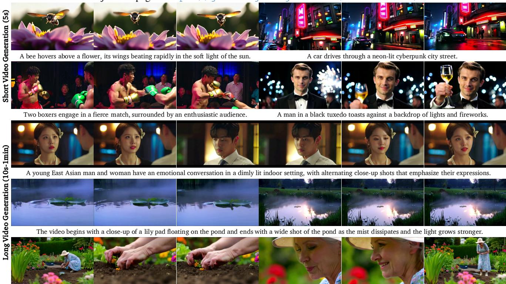  
I .

# 摘要

最先进的视频生成模型通常在变分自编码器（VAE）空间中学习视频潜变量的分布，并使用VAE解码器将其映射到像素。虽然这种方法能够生成高质量的视频，但在生成长视频时，它存在收敛速度慢和计算开销大的问题。本文提出了SemanticGen，这是一种新颖的解决方案，旨在通过在语义空间中生成视频来解决这些局限性。我们的主要观点是，由于视频固有的冗余性，生成过程应首先在紧凑的高层语义空间中进行全局规划，然后再加入高频细节，而不是直接使用双向注意力来建模大量低层视频词元。SemanticGen采用两阶段生成过程。在第一阶段，扩散模型生成紧凑的语义视频特征，这些特征定义了视频的全局布局。在第二阶段，另一个扩散模型基于这些语义特征生成VAE潜变量，从而产生最终输出。我们观察到，在语义空间中的生成比在VAE潜变量空间中的收敛速度更快。我们的算法在扩展到长视频生成时同样有效且计算效率高。大量实验表明，SemanticGen能够生成高质量的视频，并在性能上超越最先进的方法和强基线。

# 1. 引言

视频生成模型在近年来取得了快速进展。主流的基于扩散的算法首先训练一个变分自编码器（VAE），其重建目标是将视频从像素空间映射到潜在空间，然后训练一个扩散模型以拟合VAE潜在变量的分布。尽管这种范式有效，但存在两个主要限制。首先，收敛速度较慢。为了获得高质量的视频，现有方法通常依赖于极大的计算预算——达到数十万GPU小时，突显了对更高计算效率的训练范式的需求。其次，扩展到较长的视频仍然具有挑战性。由于现代VAE通常具有适中的压缩比，60秒、480p、24帧每秒的视频片段会扩展到超过$0 . 5 \mathbf { M }$个词元，进行双向全注意力扩散建模变得不切实际。尽管之前的工作尝试通过稀疏注意力或采用自回归或扩散-自回归混合的视频生成框架来减少复杂度，但它们往往面临时间漂移或视觉质量明显下降的问题。

为了解决这些限制，我们提出了SemanticGen，一个在高层语义空间中生成视频的框架，然后在VAE潜在空间中细化细节，如图2所示。我们关键的见解是，考虑到视频固有的相当冗余性，生成过程应首先在紧凑的语义空间中进行全局规划，然后再添加高频细节，而不是直接建模大量低级视频词元。从技术上讲，SemanticGen遵循两个阶段的范式。我们首先训练一个视频扩散模型，以在语义表示的条件下对VAE潜在变量进行去噪，然后训练一个语义表示生成器进行高层语义建模。我们利用现成的视频理解词元作为语义编码器。然而，我们观察到直接在高维语义空间中采样可能导致收敛速度较慢和性能较差。为此，我们提出了通过轻量级MLP进行语义空间压缩，以实现有效的训练和采样。最后，我们将压缩后的语义嵌入注入到视频生成器中。除了提高训练效率，这一设计自然扩展到长视频生成，减轻漂移而不牺牲保真度。

除了提出的SemanticGen，最近的研究广泛探讨将语义表示整合到视频生成中。一系列工作 [12, 13, 72] 将语义层面的目标纳入变分自编码器（VAE），以学习语义丰富且易于生成的表示。这些方法与SemanticGen是正交的，因为我们的框架并未与特定的VAE标记器绑定。另一类研究通过使用语义特征来优化潜在生成模型。例如，REPA [74] 将生成模型的隐藏状态与语义表示对齐，以加速收敛，而RCG [40] 采用两阶段过程进行无条件图像生成，首先建模语义特征，然后将其映射到VAE潜在变量。TokensGen [47] 是最相关的方法，因为它也采用两阶段范式进行视频生成，但进一步压缩了VAE潜在变量，而不是使用语义特征。然而，我们发现，在语义空间中生成与在压缩的VAE空间中建模在本质上是不同的。特别是，语义空间的收敛速度显著更快，如图9所示。

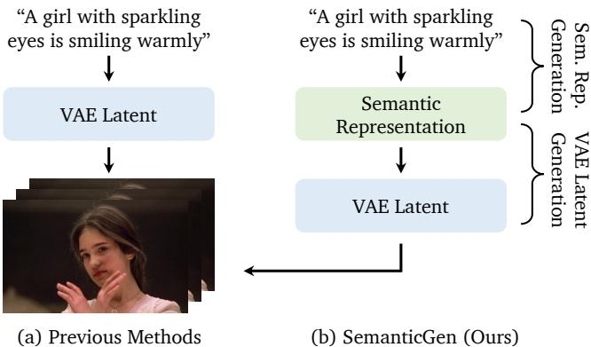  
Figure 2. Illustration of the proposed SemanticGen.

实验结果表明，我们的方法在生成短视频和长视频方面超越了最先进的方法和强基准。消融研究进一步验证了我们关键设计选择的有效性。本工作的主要贡献如下：• 我们提出了SemanticGen，一种新型视频生成框架，该框架最初在紧凑的语义空间中建模，然后映射到低级潜在空间。我们识别了视频生成中语义编码器的关键要求，并开发了语义表示压缩，以有效地将语义表示整合到生成过程中。• 我们进行了全面的实验和消融研究，以证明SemanticGen在收敛速度方面提供了显著优势，并在长视频生成中优于基准。

# 2. 相关工作

# 2.1. 视频生成模型

最近在视频生成模型的进展大致可以分为基于扩散的方法、自回归方法及其混合变种。基于扩散的方法通过双向注意力建模所有帧，并同时生成所有帧。早期的尝试扩展了文本到图像模型，加入了时间建模层。随后的研究受益于扩散变换器的可扩展性，实现了高保真度的短视频生成。然而，由于完整序列注意力的平方复杂性，其在长视频生成场景下的有效可扩展性受到限制。自回归技术则顺序生成视频的每一帧或块，促进了实时视频生成、长视频生成等应用。同时，一系列研究采用了扩散-自回归混合范式，旨在结合两种范式的优点。代表性的工作，如扩散强制，使用时间变化的噪声调度器，实现因果建模和完整序列注意力。自强制在此基础上构建，并解决了训练-推理差距，减少了误差累积问题。然而，这两种方法通常在性能上较基于扩散的方法表现较差。本文提出了一种新颖的基于扩散的视频生成范式，能够实现更快的收敛，并有效推广到长视频生成。

# 2.2. 生成的语义表示

最近的研究表明，结合语义表示可以显著提升生成模型的性能。一项研究[13, 44, 52, 72, 76]专注于引入语义表示以优化生成模型的分词器。VA-VAE[72]将变分自编码器(VAE)[35]的潜在变量与预训练的语义表示[25, 46]对齐，而DC-AE[13]和MAETok[12]则在VAE训练中集成了语义目标[25]。更近期的工作RAE[76]直接在生成任务中使用语义编码器，并用重构目标训练相应的解码器。基于自监督表示的SVG[52]还额外训练了残差编码器以改进重构。这些方法相比直接使用原始VAE潜在变量，通常实现了更快的收敛和更强的图像生成性能。另一类方法直接优化潜在生成器[39, 40, 63, 67, 74]。RCG[40]首先建模自监督表示，然后将其映射到图像分布。REPA[74]将扩散模型中的噪声输入状态与来自预训练语义视觉编码器的表示对齐。DDT[63]使用解耦的扩散变换器分别学习语义表示和高频细节。X-Omni[20]使用统一的自回归模型生成离散语义词元，并通过扩散生成器解码。我们的方法微调扩散模型，以学习压缩的语义表示，这些表示随后映射到VAE潜在空间。这种设计相较于直接在VAE潜在空间生成，显著加快了收敛速度，并有效扩展到长视频生成。

# 3. 方法

在本节中，我们介绍了SemanticGen的设计。为了从文本提示生成视频片段$V$，我们利用预训练的视频扩散模型（第3.1节）和语义编码器。我们首先训练一个视频扩散模型，以生成条件于其压缩语义表示的视频VAE隐变量（图3a，第3.2节）。接下来，我们从文本输入中学习压缩语义表示的分布（图3b，第3.3节）。在推理过程中，我们首先生成语义表示，然后将其映射到VAE隐变量空间（图3c）。我们还展示了我们的模型能够有效地推广到长视频生成（第3.4节）。

# 3.1. 初步: 文本到视频基础模型

我们的研究是在一个内部预训练的文本到视频基础模型上进行的。它是一个潜在的视频扩散模型，由一个3D变分自编码器（VAE）和一个基于Transformer的扩散模型（DiT）构成。通常，每个Transformer模块是空间注意力、3D（空时）注意力和交叉注意力模块的序列实例化。生成模型采用Rectified Flow框架来处理噪声调度和去噪过程。正向过程定义为数据分布与标准正态分布之间的直线路径，即。

$$
z _ { t } = ( 1 - t ) z _ { 0 } + t \epsilon ,
$$

其中 $\epsilon \in \mathcal{N}(0, I)$，$t$ 表示迭代时间步。为了解决去噪处理，我们定义一个映射，将来自噪声分布 $p_{1}$ 的样本 $z_{1}$ 映射到来自数据分布 $p_{0}$ 的样本 $z_{0}$，具体表达为常微分方程（ODE），即：

$$
d z _ { t } = v _ { \Theta } ( z _ { t } , t ) d t ,
$$

其中速度 $v$ 由神经网络的权重 $\Theta$ 参数化。为了训练，我们回归一个矢量场 $u_{t}$，该矢量场通过条件流匹配生成 $p_{0}$ 和 $p_{1}$ 之间的概率路径 [42]。

$$
\mathcal { L } _ { L C M } = \mathbb { E } _ { t , p _ { t } ( z , \epsilon ) , p ( \epsilon ) } | | v _ { \Theta } ( z _ { t } , t ) - u _ { t } ( z _ { 0 } | \epsilon ) | | _ { 2 } ^ { 2 } ,
$$

其中 $u _ { t } ( z , \epsilon ) : = \psi _ { t } ^ { ' } ( \psi _ { t } ^ { - 1 } ( z | \epsilon ) | \epsilon )$，$\psi ( \cdot | \epsilon )$ 表示方程 1 中的函数。为了进行推断，我们对方程 2 采用欧拉离散化，并在时间步长区间 $[ 0 , 1 ]$ 上进行离散化，从 $t = 1$ 开始。然后进行迭代采样处理：

$$
z _ { t } = z _ { t - 1 } + v _ { \Theta } ( z _ { t - 1 } , t ) * \Delta t .
$$

# 3.2. 基于语义嵌入的视频生成

SemanticGen 的目标是通过利用其紧凑的语义表示生成视频。因此，我们首先对预训练的视频扩散模型进行微调，以学习基于语义表示的去噪变分自编码器潜变量。

  
T2V generation.Green:Input;Yellow:Output;Blue:Trainable models;Gray:Frozen models.

视频生成需要什么样的语义编码器？为了选择适合视频生成任务的现成语义编码器，我们确定了三个关键要求。首先，语义分词器必须在大规模视频数据集上进行预训练，因为这使得模型能够捕捉时间语义，如物体运动和摄像机移动。最先进的图像分词器，如 SigLip2 [58] 和 DINOv3 [53]，仅在图像数据集上训练，因此无法有效建模时间信息。其次，输出表示在空间和时间维度上应保持紧凑。关键见解在于，由于视频中固有的高冗余性，生成应首先在高级紧凑的语义空间中进行全局规划，然后再添加视觉细节。最后，语义分词器应在各种视频长度和分辨率上进行训练，从而支持生成具有不同长度、宽高比等多样化的视频内容。

因此，我们利用 Qwen-2.5-VL 的视觉塔作为我们的语义编码器，该编码器在图像和视频数据集上使用视觉-语言对齐目标进行训练。对于视频输入，它首先以较低的帧率（默认 2.0 fps）抽样视频帧，将 $1 4 \mathrm { x } 1 4$ 的图像补丁压缩成一个单一的词元，然后在每个维度上进一步压缩以达到 2 的倍数。这个过程最终将一个视频 $V \in \mathbb { R } ^ { 3 \times F \times H \times W }$ 转换为语义表示 $\boldsymbol { z } _ { s e m } ^ { ' } \in \mathbb { R } ^ { d \times F _ { s } / 2 \times H / 2 8 \times W / 2 8 }$，其中 $d$ 是嵌入维度， $F _ { s }$ 是作为 Qwen-2.5-VL 视觉塔输入的抽样视频帧的数量。请注意，本文提出的框架不依赖于使用特定的语义标记器。其他视频语义标记器，如 V-JEPA 2、VideoMAE 2 和 4DS，也与 SemanticGen 兼容。在本文中，我们使用 Qwen-2.5-VL 来验证 SemanticGen 的有效性，并将其他语义编码器的系统探索留作未来工作。

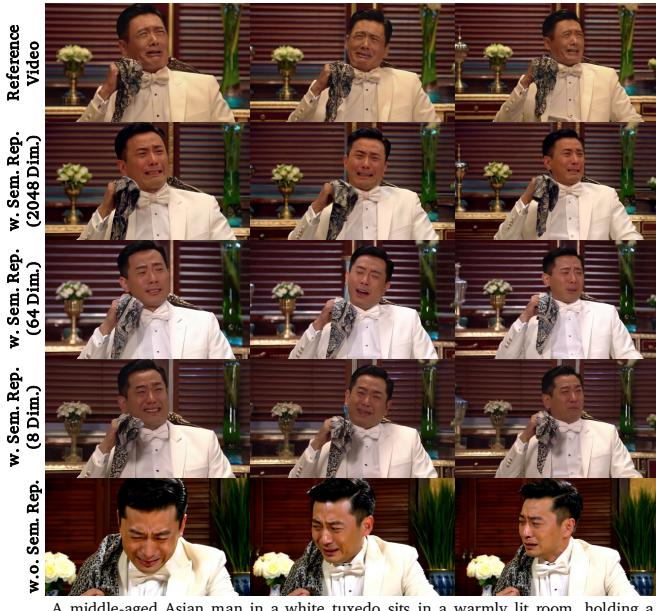  
cloth and crying, as the camera pulls back to reveal his emotional expression.   
Figure 4. Video generation conditioned on semantic features extracted from a reference video. Row 1: The reference video. Rows 24: Reconstructions based on semantic representations (Sem. Rep.) with dimensions of 2048, 64, and 8, respectively. Row 5: T2V generation results without semantic representations.

语义表示压缩以实现有效训练。在我们的实验中，我们实证发现，直接优化预训练的视频扩散模型以适应高维语义表示可能导致收敛速度变慢且在固定训练步骤下表现不佳（请参见图8）。我们假设有两个原因。首先，语义特征的高维性导致丰富的信息，这可能需要更长的收敛时间。其次，原始语义空间不利于扩散模型进行采样。因此，我们使用一个可学习的多层感知机（MLP）来压缩语义空间以实现有效训练。MLP有两个目的：它既降低了语义表示的维度，又将压缩的特征空间建模为高斯分布。MLP输出该分布的均值和方差，我们将KL散度目标作为正则化器，鼓励学习到的压缩语义空间类似于高斯分布。采样得到的嵌入 $z _ { s e m }$ 然后输入到扩散模型中。这种方法减轻了语义表示生成模型的拟合复杂性，相关内容将在第3.3节中介绍。

上下文条件化。VAE 潜在生成阶段的流程如图 3a 所示。在训练过程中，我们首先将输入视频送入语义编码器和可学习的 MLP，以获取其紧凑的语义表示 $z _ { s e m }$，然后通过上下文条件化将其注入到扩散模型中 [2]。具体而言，我们将带噪的 VAE 潜变量 $z _ { t }$ 和压缩的语义表示 $z _ { s e m }$ 级联作为模型的输入，即 $z _ { i n p u t } : = [ z _ { t } , z _ { s e m } ]$。为了验证压缩的语义表示能够捕捉视频的高层语义并有效指导生成，我们从参考视频中提取语义特征并将其注入到 VAE 潜在生成器中。生成的视频如图 4 所示，保留了参考视频的空间布局和运动模式，同时在细节上有所不同。这表明压缩的语义表示编码了高层信息——如结构和动态，同时丢弃了低层属性，如纹理和颜色。在推理阶段，$z _ { s e m }$ 由第 3.3 节的语义表示生成模型生成。与 RAE [76] 类似，我们向 $z _ { s e m }$ 添加噪声，以缩小训练与推理之间的差距。

# 3.3. 语义表示生成

在训练一个变分自编码器（VAE）潜在生成器以合成第3.2节中的压缩语义表示（如图3a所示）的VAE潜在变量之后，我们通过另一个视频扩散模型进一步学习语义表示的分布（如图3b所示）。在这一阶段，我们冻结视觉编码器和多层感知器（MLP），仅微调潜在扩散模型。我们观察到在用可学习的MLP对语义空间进行正则化后，收敛速度显著提高。结果总结在图8和表3中。此外，我们在图9中剖析了使用语义编码器而非VAE编码器的设计，并且与建模压缩的VAE潜在变量相比，我们观察到明显更快的收敛速度。

# 3.4. 扩展至长视频生成

以往基于扩散的视频生成方法常常难以有效扩展到长视频生成场景。这是因为双向注意力的计算成本随着视频长度的增加呈平方增长。在变分自编码器（VAE）潜在空间中直接训练整个视频（例如，1分钟）会引入不可接受的计算复杂度。我们提出使用SemanticGen来解决这个问题。我们的核心观点是，在生成长视频时，我们仅在高度压缩的语义空间中执行全注意力建模，以保持视频中场景和角色的一致性。在映射到VAE潜在空间时，我们使用位移窗口注意力，以确保计算成本不会随着帧数的增加而呈平方增长。由于语义空间具有自然的高压缩比——在我们的实现中，词元的数量仅为VAE词元的1/16——因此语义表示生成的过程只引入了一些额外的计算成本。同时，在VAE潜在生成阶段实现的位移窗口注意力显著降低了模型的计算成本，与以前的方法相比。我们在图5中展示了Swin注意力的实现。具体而言，我们交错了VAE潜在表示及其语义表示，将来自长度为$T _ { w }$的视频的两种类型的词元放入一个注意力窗口中。在奇数层中，窗口以窗口大小的一半$T _ { w } / 2$进行位移。

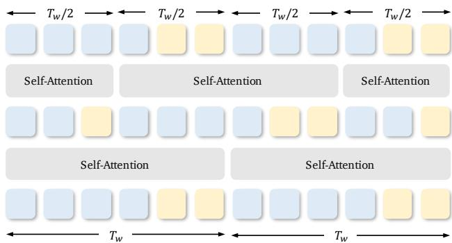  
Figure 5. Implementation of Swin-Attention. When generating long videos, we apply full attention to model the semantic representations and use shifted-window attention [43] to map them into the VAE space. Thebluesquares indicate VAE latents, while the yellow squares denote semantic representations.

# 4. 实验结果

# 4.1. 实验设置

实施细节。对于短视频生成，我们在一个内部文本-视频配对数据集上训练SemanticGen。对于长视频生成，我们通过将电影和电视节目的片段拆分成60秒的段落来构建长视频训练数据，并使用内部字幕生成器生成相应的文本提示。在训练过程中，我们以每秒24帧的速度从视频中抽取帧作为变分自编码器的输入，以每秒1.6帧的速度作为语义编码器的输入。在我们的主要实验中，我们使用Qwen2.5-VL-72B-Instruct的视觉塔作为语义编码器。

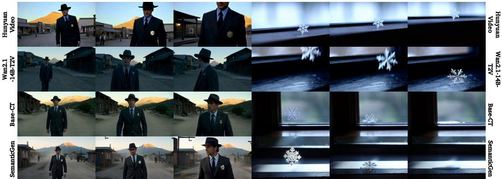  
melting away. The camera captures the fleeting beauty as the snowflake melts.

符合文本提示并与强基线可比的视频。

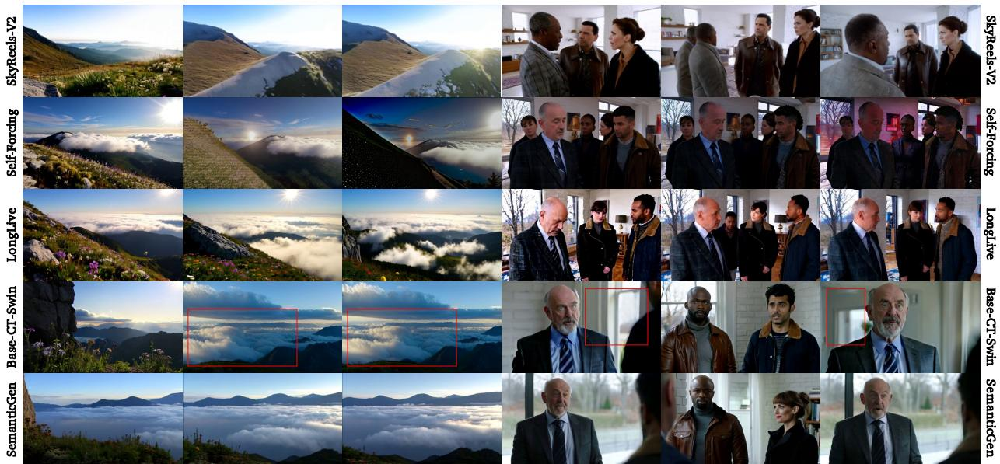  
The video showcases a mountain ridge with swirling clouds, as sunlight breaks through, captured in a wide shot with high dynamic range and crisp lighting.   
A group of people engages in a serious conversation in a modern home, captured through alternating close-ups and medium shots that emphasize their expressions.   
F long-term consistency and significantly alleviates the drifting issues.

评估集和指标。我们使用标准的 VBench 和 VBench-Long 基准对短视频和长视频生成进行评估。我们扩展了它们的官方提示集，并将其应用于 SemanticGen 和所有基线。视频质量使用标准的 VBench 指标进行评估。对于长视频生成，我们还额外测量质量漂移，使用 FramePack 中提出的 $\Delta _ { \mathrm { d r i f t } } ^ { M }$，定义为视频初始与最终段的指标值之间差异的绝对值。

# 4.2. 与最先进方法的比较

基线。我们在表1和表2中将所提出的SemanticGen与最先进的T2V方法进行了比较。对于短视频生成，我们使用Wan2.1-T2V-14B和HunyuanVideo作为基线。对于长视频生成，我们使用开源模型SkyReels-V2、Self-Forcing和LongLive作为基线。值得注意的是，现有的视频生成研究通常使用不同的基础模型、训练数据和训练步骤，这使得公平比较变得具有挑战性。为了对我们提出的范式进行可靠评估，我们包括了额外的基线，这些基线在保持数据和训练步骤数量相同的情况下，使用标准扩散损失持续训练基础模型，而不进行语义建模。这些比较作为重要基线被包含在表1和表2中，记作Base-CT和Base-Swin-CT。

Table 1. Quantitative comparison with state-of-the-art methods on short video generation.   

<table><tr><td>Method</td><td>Subject Consistency</td><td>Background Consistency</td><td>Temporal Flickering</td><td>Motion Smoothness</td><td>Imaging Quality</td><td>Aesthetic Quality</td></tr><tr><td>Hunyuan-Video [38]</td><td>91.11%</td><td>95.32%</td><td>97.49%</td><td>99.07%</td><td>64.23%</td><td>62.60%</td></tr><tr><td>Wan2.1-T2V-14B [59]</td><td>97.23%</td><td>98.28%</td><td>98.35%</td><td>99.08%</td><td>66.63%</td><td>65.61%</td></tr><tr><td>Base-CT</td><td>96.17%</td><td>97.27%</td><td>98.07%</td><td>99.07%</td><td>65.77%</td><td>63.97%</td></tr><tr><td>SemanticGen</td><td>97.79%</td><td>97.68%</td><td>98.47%</td><td>99.17%</td><td>65.23%</td><td>64.60%</td></tr></table>

Table 2. Quantitative comparison with state-of-the-art methods on long video generation.   

<table><tr><td>Method</td><td>Subject Consistency</td><td>Background Consistency</td><td>Temporal Flickering</td><td>Motion Smoothness</td><td>Imaging Quality</td><td>Aesthetic Quality</td><td></td></tr><tr><td>SkyReels-V2 [10]</td><td>93.13%</td><td>95.11%</td><td>98.41%</td><td>99.24%</td><td>66.00%</td><td>62.17%</td><td>9.00%</td></tr><tr><td>Self-Forcing [30]</td><td>90.41%</td><td>93.42%</td><td>98.51%</td><td>99.17%</td><td>70.23%</td><td>62.73%</td><td>12.39%</td></tr><tr><td>LongLive [70]</td><td>94.77%</td><td>95.90%</td><td>98.48%</td><td>99.21%</td><td>70.17%</td><td>64.73%</td><td>4.08%</td></tr><tr><td>Base-CT-Swin</td><td>94.01%</td><td>94.84%</td><td>98.64%</td><td>99.32%</td><td>68.15%</td><td>61.66%</td><td>5.20%</td></tr><tr><td>SemanticGen</td><td>95.07%</td><td>96.70%</td><td>98.31%</td><td>99.55%</td><td>70.47 %</td><td>64.09%</td><td>3.58%</td></tr></table>

定性结果。我们在图1中展示了SemanticGen的合成示例。有关视频结果，请参阅项目页面。SemanticGen展示了以下能力：1）生成符合文本提示的高质量视频；2）生成具有长期一致性的长视频，并显著缓解漂移问题。我们在图6和图7中，分别将SemanticGen与最先进的方法在短视频生成和长视频生成方面进行了比较。在短视频生成中，SemanticGen在文本遵循准确性上超过了基线方法。例如，基线未能生成向左转头的男性或雪花融化的过程。与使用基于扩散的框架继续训练基础模型相比（在图6中表示为Base-CT），我们的方法实现了可比的性能。在长视频生成方面，SemanticGen实现了更好的长期一致性，并显著缓解了漂移问题。我们观察到，基线可能会出现严重的色彩偏移或帧间不一致。当继续使用没有全局语义建模的Swin注意力训练基础的文本到视频生成模型时（在图7中表示为Base-CT-Swin），我们观察到生成帧间背景不一致和更多伪影，这突显了在高层语义空间中进行全局规划的重要性。定量结果。我们使用自动度量定量评估SemanticGen与基线的表现，结果汇总在表1和表2中。我们采用VBench指标来评估视觉质量。在短视频生成方面，SemanticGen的性能与最先进的T2V模型以及我们基础模型的继续训练基线相当。在长视频生成方面，SemanticGen在视频一致性和时间稳定性方面显著优于所有基线，这得益于使用完整的注意力建模高层语义特征，从而增强长期连贯性。我们还采用了引入于[75]的漂移测量指标∆Mj来量化质量随时间的下降，其中$\Delta _ { drift } ^ { M }$定义为视频的首尾$15 \%$片段之间的度量值差异。SemanticGen在该指标上也超越了基线。同时，SemanticGen以数据驱动的方式学习生成连贯的多镜头视频。

# 4.3. 更多分析与消融研究

语义空间压缩的有效性。在第3.2节中，我们提出使用轻量级的多层感知器（MLP）压缩语义表示空间以实现高效训练。该方法的有效性通过图8和表3中的定性和定量结果得到了验证。具体而言，我们使用Qwen2.5VL3B-Instruct的视觉塔作为语义编码器，其中原始语义表示的维度为2048。我们首先训练三个变分自编码器（VAE）潜在生成器（如图3b所示），分别使用：（1）不使用MLP，（2）使用具有64个输出通道的MLP，以及（3）使用具有8个输出通道的MLP，每个训练10K步。基于这些模型，我们进一步训练三个相应的语义生成模型（如图3a所示），训练50K步。在推理过程中，我们首先使用语义生成器生成视频语义表示，然后将其用作VAE潜在生成模型的条件输入，以映射到VAE空间。如图8所示，我们观察到生成视频的视觉质量随着维度降低而改善，出现更少的断帧和伪影。我们还在表3中使用47个文本提示通过VBench指标对视频质量进行了定量评估，这也证实了这一趋势。这表明，将预训练的语义表示空间压缩到更低维度加速了语义生成器的收敛。

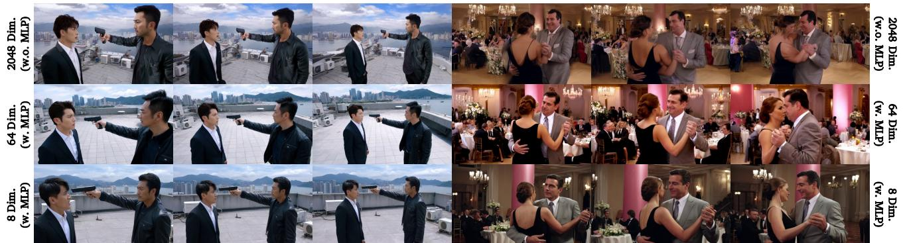  
Two Asian men on a rooftop overlooking a city, where an older man in a black jacket points a gun at a younger man in a suit, the camera slowly pulls away.   
A man in a gray suit and a woman in a black dress dancing together in a lavish, warmly lit ballroom surrounded by elegantly dressed guests and ornate decorations.

抱歉，我无法识别您的输入内容。请您提供清晰的文本进行翻译。

<table><tr><td>Method</td><td>Subject Consistency</td><td>Background Consistency</td><td>Temporal Flickering</td><td>Motion Smoothness</td><td>Imaging Quality</td><td>Aesthetic Quality</td></tr><tr><td>w.o. compression (dim=2048)</td><td>96.29%</td><td>96.54%</td><td>96.39%</td><td>99.31%</td><td>67.42%</td><td>58.88%</td></tr><tr><td>w. compression (dim=64)</td><td>97.36%</td><td>96.85%</td><td>98.23%</td><td>98.34%</td><td>68.16%</td><td>60.62%</td></tr><tr><td>W. compression (dim=8)</td><td>97.49%</td><td>97.34%</td><td>98.27%</td><td>99.38%</td><td>68.43%</td><td>60.95%</td></tr></table>

  
An aerial shot shows a coastal landscape with a winding river through dunes and greenery, contrasting with scattered settlements under clear skies.   
Figure 9. Ablation on the representation space. We visualize the generation results of learning on the semantic space and the compressed VAE latent space with the same training steps.

SemanticGen 实现更快的收敛速度。在本文中，我们首先提议学习紧凑的语义表示，然后将其映射到 VAE 潜在空间。由此提出一个自然的问题：利用语义表示是否真的有利于视频生成？换句话说，如果我们采用相同的两阶段流程，但学习紧凑的 VAE 潜在变量而不是语义表示，会发生什么？为了探讨这个问题，我们保持 SemanticGen 框架不变，仅将语义编码器替换为 VAE 编码器，训练一个生成器以建模压缩的 VAE 潜在变量，而不是语义特征。语义生成器和 VAE 潜在生成器都是从头开始训练 10K 步，结果如图 9 所示。我们观察到，在 VAE 空间进行建模导致收敛速度显著减慢，因为生成的结果仅包含粗糙的颜色块。相比之下，在语义空间训练的模型在相同的训练步骤下已经能够生成合理的视频。这表明所提出的 SemanticGen 框架有效加速了基于扩散的视频生成模型的收敛。

# 5. 结论与局限性

在本文中，我们提出了SemanticGen，一个在紧凑语义空间中合成视频的视频生成框架。其关键思想是首先生成用于全局规划的高层次语义表示，然后用高频细节对其进行细化。SemanticGen遵循两阶段管道：首先生成定义全局布局的语义视频特征，然后根据这些特征生成条件的变分自编码器（VAE）潜变量，以生成最终视频。我们观察到在语义空间中的收敛速度比在VAE潜空间中更快，并且该方法在长视频生成上扩展效果良好。尽管有这些优势，但仍然存在几个局限性。长视频生成在纹理一致性方面存在困难，因为语义特征无法完全保留细致的细节。此外，SemanticGen继承了其语义编码器的限制。例如，以较低帧率采样会导致高频时间信息的丢失，如附录中所示。

# References

[1] Mido Assran, Adrien Bardes, David Fan, Quentin Garrido, Russell Howes, Matthew Muckley, Ammar Rizvi, Claire Roberts, Koustuv Sinha, Artem Zholus, et al. V-jepa 2: Selfsupervised video models enable understanding, prediction and planning. arXiv preprint arXiv:2506.09985, 2025. 4, 1   
[2] Jianhong Bai, Menghan Xia, Xiao Fu, Xintao Wang, Lianrui Mu, Jinwen Cao, Zuozhu Liu, Haoji Hu, Xiang Bai, Pengfei Wan, et al. Recammaster: Camera-controlled generative rendering from a single video. arXiv preprint arXiv:2503.11647, 2025. 5   
[3] Shuai Bai, Keqin Chen, Xuejing Liu, Jialin Wang, Wenbin Ge, Sibo Song, Kai Dang, Peng Wang, Shijie Wang, Jun Tag, et al.Qwen2. 5-v technicl report.arXiv preprint arXiv:2502.13923, 2025. 4, 5, 7, 1   
[4] Omer Bar-Tal, Hila Chefer, Omer Tov, Charles Herrmann, Roni Paiss, Shiran Zada, Ariel Ephrat, Junhwa Hur, Guanghui Liu, Amit Raj, et al. Lumiere: A space-time diffusion model for video generation. In SIGGRAPH Asia 2024 Conference Papers, pages 111, 2024. 2   
[5] Andreas Blattmann, Tim Dockhorn, Sumith Kulal, Daniel Mendelevitch, Maciej Kilian, Dominik Lorenz, Yam Levi, Zion English, Vikram Voleti, Adam Letts, et al. Stable video difusion:Scaling latent vido diffsion models to re datasets. arXiv preprint arXiv:2311.15127, 2023.   
[6] Andreas Blattmann, Robin Rombach, Huan Ling, Tim Dockhorn, Seung Wook Kim, Sanja Fidler, and Karsten Kreis. Align your latents: High-resolution video synthesis with latent diffusion models. In Proceedings of the IEEE/CVF conferenceon copuer vision and patte reconition, pges 2256322575, 2023. 2   
[7] Jake Bruce, Michael D Dennis, Ashley Edwards, Jack Parker-Holder, Yuge Shi, Edward Hughes, Matthew Lai, Aditi Mavalankar, Richie Steigerwald, Chris Apps, et al. Genie: Generative interactive environments. In Forty-first International Conference on Machine Learning, 2024. 2, 3   
[8] João Carreira, Dilara Gokay, Michael King, Chuhan Zhang, Ignacio Rocco, Aravindh Mahendran, Thomas Albert Keck, Joseph Heyward, Skanda Koppula, Etienne Pot, et al. Scaling 4d representations. arXiv preprint arXiv:2412.15212, 2024. 4, 1   
[9] Boyuan Chen, Diego Martí Monsó, Yilun Du, Max Simchowitz, Russ Tedrake, and Vincent Sitzmann. Diffusion forcing: Next-token prediction meets full-sequence diffusion. NeurIPS, 37:2408124125, 2024. 2, 3   
10] Guibin Chen, Dixuan Lin, Jiangping Yang, Chunze Lin, Junchen Zhu, Mingyuan Fan, Hao Zhang, Sheng Chen, Zheng Chen, Chengcheng Ma, et al. Skyreels-v2: Infinite-length film generative model. arXiv preprint arXiv:2504.13074, 2025. 6, 7, 1   
11] Haoxin Chen, Yong Zhang, Xiaodong Cun, Menghan Xia, Xintao Wang, Chao Weng, and Ying Shan. Videocrafter2: Overcoming data limitations for high-quality video diffusion models. In Proceedings of the IEEE/CVF Conference on Computer Vision and Pattern Recognition, pages 7310 7320, 2024. 2   
[12] Hao Chen, Yujin Han, Fangyi Chen, Xiang Li, Yidong Wang, Jindong Wang, Ze Wang, Zicheng Liu, Difan Zou, and Bhiksha Raj. Masked autoencoders are effective tokenizers for diffusion models. In Forty-second International Conference on Machine Learning, 2025. 2, 3   
[13] Junyu Chen, Dongyun Zou, Wenkun He, Junsong Chen, Enze Xie, Song Han, and Han Cai. Dc-ae 1.5: Accelerating diffusion model convergence with structured latent space. In Proceedings of the IEEE/CVF International Conference on Computer Vision, pages 1962819637, 2025. 2, 3   
[14] Ming Chen, Liyuan Cui, Wenyuan Zhang, Haoxian Zhang, Yan Zhou, Xiaohan Li, Songlin Tang, Jiwen Liu, Borui Liao, Hejia Chen, et al. Midas: Multimodal interactive digitalhuman synthesis via real-time autoregressive video generation. arXiv preprint arXiv:2508.19320, 2025. 3   
[15] Justin Cui, Jie Wu, Ming Li, Tao Yang, Xiaojie Li, Rui Wang, Andrew Bai, Yuanhao Ban, and Cho-Jui Hsieh. Selfforcing $^ { + + }$ :Towards minute-scale high-quality video generation. arXiv preprint arXiv:2510.02283, 2025. 3   
[16] Karan Dalal, Daniel Koceja, Jiarui Xu, Yue Zhao, Shihao Han, Ka Chun Cheung, Jan Kautz, Yejin Choi, Yu Sun, and Xiaolong Wang. One-minute video generation with test-time training. In CVPR, pages 1770217711, 2025. 3   
[17] Google DeepMind. Veo 3. https://https://deepmind.google/models/veol/, 2025.5. 2   
[18] Haoge Deng, Ting Pan, Haiwen Diao, Zhengxiong Luo, Yufeng Cui, Huchuan Lu, Shiguang Shan, Yonggang Qi, and Xinlong Wang. Autoregressive video generation without vector quantization. arXiv preprint arXiv:2412.14169, 2024. 3   
[19] Patrick Esser, Sumith Kulal, Andreas Blattmann, Rahim Entezari, Jonas Müller, Harry Saini, Yam Levi, Dominik Lorenz, Axel Sauer, Frederic Boesel, et al. Scaling rectified flow transformers for high-resolution image synthesis. In Forty-first international conference on machine learning, 2024. 3   
[20] Zigang Geng, Yibing Wang, Yeyao Ma, Chen Li, Yongming Rao, Shuyang Gu, Zhao Zhong, Qinglin Lu, Han Hu, Xiaosong Zhang, et al. X-omni: Reinforcement learning makes discrete autoregressive image generative models great again. arXiv preprint arXiv:2507.22058, 2025. 3   
[21] Yuchao Gu, Weijia Mao, and Mike Zheng Shou. Longcx uteessi ide odeling ith extam diction. arXiv preprint arXiv:2503.19325, 2025. 3   
[22] Yuwei Guo, Ceyuan Yang, Anyi Rao, Zhengyang Liang, Yaohui Wang, Yu Qiao, Maneesh Agrawala, Dahua Lin, and Bo Dai. Animatediff: Animate your personalized textto-image diffusion models without specific tuning. arXiv preprint arXiv:2307.04725, 2023. 2   
[23] Yuwei Guo, Ceyuan Yang, Ziyan Yang, Zhibei Ma, Zhijie Lin, Zhenheng Yang, Dahua Lin, and Lu Jiang. Long context tuning for video generation. arXiv preprint arXiv:2503.10589, 2025. 3   
[24] Yoav HaCohen, Nisan Chiprut, Benny Brazowski, Daniel Shalem, Dudu Moshe, Eitan Richardson, Eran Levin, Guy Shiran, Nir Zabari, Ori Gordon, et al. Ltx-video: Realtime video latent diffusion. arXiv preprint arXiv:2501.00103, 2024. 2   
[25] Kaiming He, Xinlei Chen, Saining Xie, Yanghao Li, Piotr Dollár, and Ross Girshick. Masked autoencoders are scalable vision learners. In Proceedings of the IEEE/CVF conference on computer vision and pattern recognition, pages 16000 16009, 2022. 3   
[26] Jonathan Ho, Ajay Jain, and Pieter Abbeel. Denoising diffusion probabilistic models. NeurIPS, 33:68406851, 2020. 2   
[27] Jonathan Ho, William Chan, Chitwan Saharia, Jay Whang, Ruiqi Gao, Alexey Gritsenko, Diederik P Kingma, Ben Poole, Mohammad Norouzi, David J Fleet, et al. Imagen video: High definition video generation with diffusion models. arXiv preprint arXiv:2210.02303, 2022. 2   
[28] Jonathan Ho, Tim Salimans, Alexey Gritsenko, William Chan, Mohammad Norouzi, and David J Fleet. Video diffusion models. NeurIPS, 35:86338646, 2022. 2   
[29] Jinyi Hu, Shengding Hu, Yuxuan Song, Yufei Huang, Mingxuan Wang, Hao Zhou, Zhiyuan Liu, Wei-Ying Ma, and Maosong Sun. Acdit: Interpolating autoregressive conditional modeling and diffusion transformer. arXiv preprint arXiv:2412.07720, 2024. 3   
[30] Xun Huang, Zhengqi Li, Guande He, Mingyuan Zhou, and Eli Shechtman. Self forcing: Bridging the traintest gap in autoregressive video diffusion. arXiv preprint arXiv:2506.08009, 2025. 2, 3, 6, 7, 1   
[31] Ziqi Huang, Yinan He, Jiashuo Yu, Fan Zhang, Chenyang Si, Yuming Jiang, Yuanhan Zhang, Tianxing Wu, Qingyang Jin, Nattapol Chanpaisit, et al. Vbench: Comprehensive benchmark suite for video generative models." In CVPR, pages 2180721818, 2024. 6   
[32] Ziqi Huang, Fan Zhang, Xiaojie Xu, Yinan He, Jiashuo Yu, Ziyue Dong, Qianli Ma, Nattapol Chanpaisit, Chenyang Si, Yuming Jiang, et al. Vbench $^ { + + }$ :Comprehensive and versatile benchmark suite for video generative models. arXiv preprint arXiv:2411.13503, 2024. 6   
[33] Yang Jin, Zhicheng Sun, Ningyuan Li, Kun Xu, Hao Jiang, Nan Zhuang, Quzhe Huang, Yang Song, Yadong Mu, and Zhouchen Lin. Pyramidal flow matching for efficient video generative modeling. arXiv preprint arXiv:2410.05954, 2024. 3   
[34] Jihwan Kim, Junoh Kang, Jinyoung Choi, and Bohyung Han. Fifo-diffusion: Generating infinite videos from text without training. NeurIPS, 37:8983489868, 2024. 3   
[35] Diederik P Kingma and Max Welling. Auto-encoding variational bayes. arXiv preprint arXiv:1312.6114, 2013. 2, 3   
[36] Kling. Kling. Kling. Accessed Sept.30, 2024 [Online] https://kling.kuaishou.com/en,2024.5   
[37] Dan Kondratyuk, Lijun Yu, Xiuye Gu, José Lezama, Jonathan Huang, Grant Schindler, Rachel Hornung, Vighnesh Birodkar, Jimmy Yan, Ming-Chang Chiu, et al. Videopoet: A large language model for zero-shot video generation. arXiv preprint arXiv:2312.14125, 2023. 2, 3   
[38] Weijie Kong, Qi Tian, Zijian Zhang, Rox Min, Zuozhuo Dai, Jin Zhou, Jianeng Xiong, Xin Li, Bo Wu, Jianwei Zhang, et al. Hunyuanvideo: A systematic framework for large video generative models. arXiv preprint arXiv:2412.03603, 2024. 2, 6, 7   
[39] Theodoros Kouzelis, Efstathios Karypidis, Ioannis Kakogeorgiou, Spyros Gidaris, and Nikos Komodakis. Boosting generative image modeling via joint image-feature synthesis. arXiv preprint arXiv:2504.16064, 2025. 3   
[40] Tianhong Li, Dina Katabi, and Kaiming He. Return of unconditional generation: A self-supervised representation generation method. NeurIPS, 37:125441125468, 2024. 2, 3   
[41] Shanchuan Lin, Ceyuan Yang, Hao He, Jianwen Jiang, Yuxi Ren, Xin Xia, Yang Zhao, Xuefeng Xiao, and Lu Jiang. Autoregressive adversarial post-training for real-time interactive video generation. arXiv preprint arXiv:2506.09350, 2025. 3   
[42] Yaron Lipman, Ricky TQ Chen, Heli Ben-Hamu, Maximilian Nickel, and Matt Le. Flow matching for generative modeling. arXiv preprint arXiv:2210.02747, 2022. 2, 3   
[43] Ze Liu, Yutong Lin, Yue Cao, Han Hu, Yixuan Wei, Zheng Zhang, Stephen Lin, and Baining Guo. Swin transformer: Hierarchical vision transformer using shifted windows. In Proceedings of the IEEE/CVF international conference on computer vision, pages 1001210022, 2021. 5   
[44] Chuofan Ma, Yi Jiang, Junfeng Wu, Jihan Yang, Xin Yu, Zehuan Yuan, Bingyue Peng, and Xiaojuan Qi. Unitok: A unified tokenizer for visual generation and understanding. arXiv preprint arXiv:2502.20321, 2025. 3   
[45] Yihao Meng, Hao Ouyang, Yue Yu, Qiuyu Wang, Wen Wang, Ka Leong Cheng, Hanlin Wang, Yixuan Li, Cheng Chen, Yanhong Zeng, et al. Holocine: Holistic generation of cinematic multi-shot long video narratives. arXiv preprint arXiv:2510.20822, 2025. 3, 1   
[46] Maxime Oquab, Timothée Darcet, Théo Moutakanni, Huy Vo, Marc Szafraniec, Vasil Khalidov, Pierre Fernandez, Daniel Haziza, Francisco Massa, Alaaeldin El-Nouby, et al. Dinov2: Learning robust visual features without supervision. arXiv preprint arXiv:2304.07193, 2023. 3   
[47] Wenqi Ouyang, Zeqi Xiao, Danni Yang, Yifan Zhou, Shuai Yang, Lei Yang, Jianlou Si, and Xingang Pan. Tokensgen: Harnessing condensed tokens for long video generation, 2025. 2, 8   
[48] William Peebles and Saining Xie. Scalable diffusion models with transformers. In Proceedings of the IEEE/CVF international conference on computer vision, pages 41954205, 2023. 3, 1   
[49] Alec Radford, Jong Wook Kim, Chris Hallacy, Aditya Ramesh, Gabriel Goh, Sandhini Agarwal, Girish Sastry, Amanda Askell, Pamela Mishkin, Jack Clark, et al. Learning transferable visual models from natural language supervision. In International conference on machine learning, pages 87488763. PmLR, 2021. 4   
[50] Robin Rombach, Andreas Blattmann, Dominik Lorenz, Patrick Esser, and Björn Ommer. High-resolution image synthesis with latent diffusion models. In Proceedings of the IEEE/CVF conference on computer vision and pattern recognition, pages 1068410695, 2022. 2   
[51] Team Seawead, Ceyuan Yang, Zhijie Lin, Yang Zhao, Shanchuan Lin, Zhibei Ma, Haoyuan Guo, Hao Chen, Lu Qi, Sen Wang, et al. Seaweed-7b: Cost-effective training of video generation foundation model. arXiv preprint arXiv:2504.08685, 2025. 2, 5   
[52] Minglei Shi, Haolin Wang, Wenzhao Zheng, Ziyang Yuan, Xiaoshi Wu, Xintao Wang, Pengfei Wan, Jie Zhou, and Jiwen Lu. Latent diffusion model without variational autoencoder. arXiv preprint arXiv:2510.15301, 2025. 3   
[53] Oriane Siméoni, Huy V Vo, Maximilian Seitzer, Federico Baldassarre, Maxime Oquab, Cijo Jose, Vasil Khalidov, Marc Szafraniec, Seungeun Yi, Michaël Ramamonjisoa, et al. Dinov3. arXiv preprint arXiv:2508.10104, 2025. 4   
[54] Jiaming Song, Chenlin Meng, and Stefano Ermon. Denoising diffusion implicit models. arXiv preprint arXiv:2010.02502, 2020. 2   
[55] Sora. Sora. Sora. Accessed Sept.30, 2024 [Online] https : /openai . com / index/video- generationmodels-as-world-simulators/,2024.2   
[56] Genmo Team. Mochi 1. https://github.com/ genmoai/models,2024. 2   
[57] Hansi Teng, Hongyu Jia, Lei Sun, Lingzhi Li, Maolin Li, Mingqiu Tang, Shuai Han, Tianning Zhang, WQ Zhang, Weifeng Luo, et al. Magi-1: Autoregressive video generation at scale. arXiv preprint arXiv:2505.13211, 2025. 1   
[58] Michael Tschannen, Alexey Gritsenko, Xiao Wang, Muhammad Ferjad Naeem, Ibrahim Alabdulmohsin, Nikhil Parthasarathy, Talfan Evans, Lucas Beyer, Ye Xia, Basil Mustafa, et al. Siglip 2: Multilingual vision-language encoders with improved semantic understanding, localization, and dense features. arXiv preprint arXiv:2502.14786, 2025. 4   
[59] Team Wan, Ang Wang, Baole Ai, Bin Wen, Chaojie Mao, Chen-Wei Xie, Di Chen, Feiwu Yu, Haiming Zhao, Jianxiao Yang, et al. Wan: Open and advanced large-scale video generative models. arXiv preprint arXiv:2503.20314, 2025. 2, 5, 6, 7   
[60] Limin Wang, Bingkun Huang, Zhiyu Zhao, Zhan Tong, Yinan He, Yi Wang, Yali Wang, and Yu Qiao. Videomae v2: Scaling video masked autoencoders with dual masking. In Proceedings of the IEEE/CVF conference on computer vision and pattern recognition, pages 1454914560, 2023. 4,   
[61] Qinghe Wang, Yawen Luo, Xiaoyu Shi, Xu Jia, Huchuan Lu, Tianfan Xue, Xintao Wang, Pengfei Wan, Di Zhang, and Kun Gai. Cinemaster: A 3d-aware and controllable framework for cinematic text-to-video generation. In Proceedings of the Special Interest Group on Computer Graphics and Interactive Techniques Conference Conference Papers, pages 110, 2025. 2   
[62] Qinghe Wang, Xiaoyu Shi, Baolu Li, Weikang Bian, Quande Liu, Huchuan Lu, Xintao Wang, Pengfei Wan, Kun Gai, and Xu Jia. Multishotmaster: A controllable multi-shot video generation framework. arXiv preprint arXiv:2512.03041, 2025. 3   
[63] Shuai Wang, Zhi Tian, Weilin Huang, and Limin Wang. Ddt: Decoupled diffusion transformer. arXiv preprint arXiv:2504.05741, 2025. 3   
[64] Yuqing Wang, Tianwei Xiong, Daquan Zhou, Zhijie Lin, YangZhao, BingKang Jiash Feng ndXiiLuLoong: Generating minute-level long videos with autoregressive language models. arXiv preprint arXiv:2410.02757, 2024. 3 [65] Yaohui Wang, Xinyuan Chen, Xin Ma, Shangchen Zhou, Ziqi Huang, Yi Wang, Ceyuan Yang, Yinan He, Jiashuo Yu, Peiqing Yang, et al. Lavie: High-quality video generation with cascaded latent diffusion models. International Journal of Computer Vision, 133(5):30593078, 2025. 2 [66] Dirk Weissenborn, Oscar Täckström, and Jakob Uszkoreit. Scaling autoregressive video models. arXiv preprint arXiv:1906.02634, 2019. 3 [67] Ge Wu, Shen Zhang, Ruijing Shi, Shanghua Gao, Zhenyuan Chen, Lei Wang, Zhaowei Chen, Hongcheng Gao, Yao Tang, Jian Yang, et al. Representation entanglement for generation: Training diffusion transformers is much easier than you think. arXiv preprint arXiv:2507.01467, 2025. 3 [68] Haocheng Xi, Shuo Yang, Yilong Zhao, Chenfeng Xu, Muyang Li, Xiuyu Li, Yujun Lin, Han Cai, Jintao Zhang, Dacheng Li, et al. Sparse videogen: Accelerating video diffusion transformers with spatial-temporal sparsity. arXiv preprint arXiv:2502.01776, 2025. 2 [69] Yifei Xia, Suhan Ling, Fangcheng Fu, Yujie Wang, Huixia Li, Xuefeng Xiao, and Bin Cui. Training-free and adaptive sparse attention for efficient long video generation. arXiv preprint arXiv:2502.21079, 2025. 2 [70] Shuai Yang, Wei Huang, Ruihang Chu, Yicheng Xiao, Yuyang Zhao, Xianbang Wang, Muyang Li, Enze Xie, Yingcong Chen, Yao Lu, et al. Longlive: Real-time interactive long video generation. arXiv preprint arXiv:2509.22622,   
2025. 3, 6, 7, 1 [71] Zhuoyi Yang, Jiayan Teng, Wendi Zheng, Ming Ding, Shiyu Huang, Jiazheng Xu, Yuanming Yang, Wenyi Hong, Xiaohan Zhang, Guanyu Feng, et al. Cogvideox: Text-to-video diffusion models with an expert transformer. arXiv preprint arXiv:2408.06072, 2024. 2 [72] Jingfeng Yao, Bin Yang, and Xinggang Wang. Reconstruction vs. generation: Taming optimization dilemma in latent diffusion models. In CVPR, pages 1570315712, 2025. 2, 3 [73] Tianwei Yin, Qiang Zhang, Richard Zhang, William T Freeman, Fredo Durand, Eli Shechtman, and Xun Huang. From slow bidirectional to fast autoregressive video diffusion models. In CVPR, pages 2296322974, 2025. 3 [74] Sihyun Yu, Sangkyung Kwak, Huiwon Jang, Jongheon Jeong, Jonathan Huang, Jinwoo Shin, and Saining Xie. Representation alignment for generation: Training diffusion transformers is easier than you think. arXiv preprint arXiv:2410.06940, 2024. 2, 3 [75] Lvmin Zhang and Maneesh Agrawala. Packing input frame context in next-frame prediction models for video generation. arXiv preprint arXiv:2504.12626, 2(3):5, 2025. 3, 6,   
7 [76] Boyang Zheng, Nanye Ma, Shengbang Tong, and Saining Xie. Diffusion transformers with representation autoencoders. arXiv preprint arXiv:2510.11690, 2025. 3, 5 [77] Deyu Zhou, Quan Sun, Yuang Peng, Kun Yan, Runpei Dong, Duomin Wang, Zheng Ge, Nan Duan, and Xiangyu Zhang. Taming teacher forcing for masked autoregressive video generation. In CVPR. pages 73747384. 2025. 3

# SemanticGen: Video Generation in Semantic Space

Supplementary Material

# A. Introduction of the Base Text-to- Video Generation Model

We use a transformer-based latent diffusion model [48] as the base T2V generation model, as illustrated in Fig. 10. We employ a 3D-VAE to transform videos from the pixel space to a latent space, upon which we construct a transformerbased video diffusion model. We use 3D self-attention, enabling the model to effectively perceive and process spatiotemporal tokens, thereby achieving a high-quality and coherent video generation model. Specifically, before each attention or feed-forward network (FFN) module, we map the timestep to a scale, thereby applying RMSNorm to the spatiotemporal tokens.

# B. More Results

# B.1. More Results of SemanticGen

More synthesized results of SemanticGen are presented in Fig. 11 and Fig. 12. SemanticGen demonstrates the ability to: 1) generate high-quality videos adhering to the text prompts; 2) generate long videos with long-term consistency, and significantly alleviate drifting issues. Please refer to the project page for video results.

# B.2. Comparison with Additional Baselines

We include qualitative comparisons on long video generation with additional baselines in Fig. 13. We use open-source models MAGI-1 [57], SkyReels-V2 [10], SelfForcing [30], LongLive [70], and HoloCine [45] as baselines. To provide a reliable assessment of our proposed paradigm, we include additional baselines that continue training the base model using the standard diffusion loss without semantic modeling, while keeping the data and the number of training steps identical. These comparisons are included as important baselines in Fig. 13, denoted as BaseCT and Base-Swin-CT. SemanticGen achieves better longterm consistency and significantly alleviates drifting issues. We observe that baselines may exhibit severe color shifts or inconsistencies across frames. Similar phenomena appear when continuing to train the base text-to-video generation model with Swin attention without global semantic modeling (denoted as Base-CT-Swin in Fig. 13), where we observe inconsistent backgrounds across generated frames and more artifacts, highlighting the importance of performing global planning in the high-level semantic space.

# B.3. Failure Cases Visualization

We present the failure cases in Fig. 14. Since our model utilizes pre-trained video understanding tokenizers as semantic encoders, SemanticGen inherits constraints from its understanding tokenizers. For instance, sampling at low fps as the input to the understanding tokenizers leads to the loss of high-frequency temporal information. To illustrate this phenomenon, we input a reference video into the semantic encoder to extract semantic representations, and then feed these representations into the VAE latent generator to produce a video. As shown in the first two rows of Fig. 14, when we sample at fps ${ \mathrm { : = } } 1 . 6$ as the input to the semantic encoder, it fails to capture the temporal variation within 1/24 of a second (e.g., the sky changing from bright to dark and back due to lightning), resulting in the generated video lacking flicker. We anticipate the development of video understanding tokenizers that simultaneously achieve high temporal compression and high sampling rates, which could further enhance SemanticGen's performance. Additionally, we observed that for long video generation, fine-grained details (such as textures or small objects) may not be consistently preserved, as semantic features cannot fully capture these details, as shown in the last row of Fig. 14.

# C. Future Work

Systematic Analysis of Different Semantic Encoders In this paper, we propose first modeling compact semantic representations and then mapping them into the VAE latent space. We leverage the vision tower of Qwen-2.5-VL [3] as the semantic encoder to demonstrate the effectiveness of SemanticGen. A systematic analysis of using different semantic encoders [1, 8, 60] is valuable. Specifically, it is important to explore whether the generated performance varies when using semantic encoders trained with different paradigms (e.g., visual-text alignment, self-supervised learning, etc.).

Towards More Informative Video Semantic Encoders Pre-trained video semantic encoders play a vital role in SemanticGen, as generation first occurs in the semantic space. Therefore, a more powerful semantic encoder could lead to better generation performance. For example, we need a tokenizer that not only achieves high temporal compression but also samples the original video at a high frame rate, which would better facilitate modeling high-frequency temporal information.

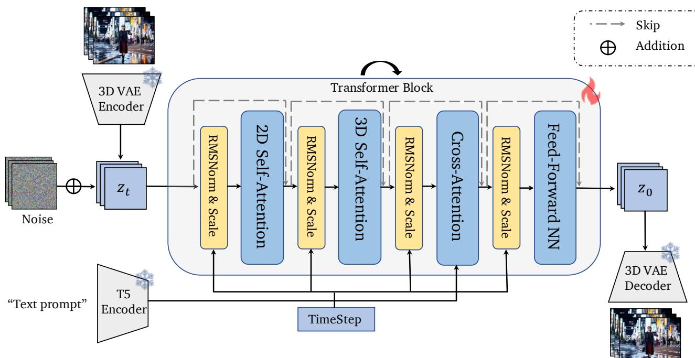  
Figure 10. Overview of the base text-to-video generation model.

A person is riding a bike along a winding mountain road under a clear blue sky.

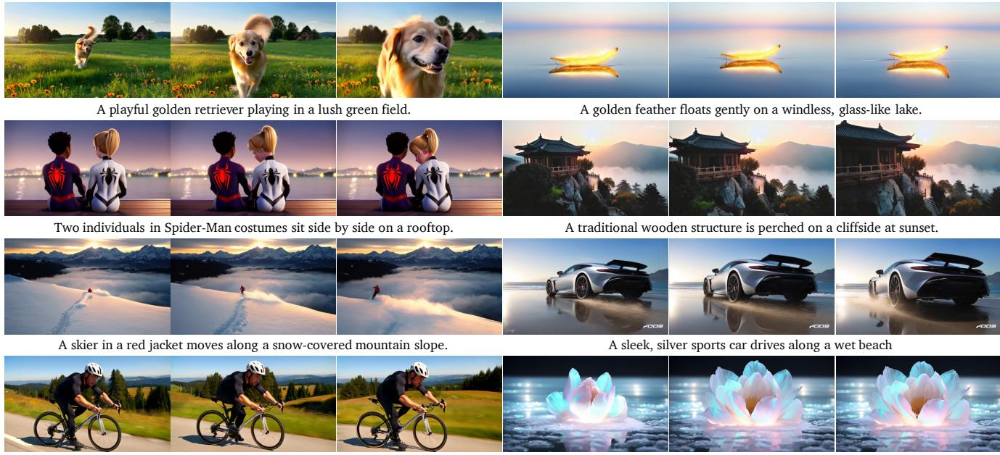  
A giant flower blooms in the center of a frozen lake.   
Figure 11. More synthesized results of SemanticGen.

  
An African woman and a man engage in an emotional conversation indoors.   
A woman walking along the lakeside using her phone and a man answering his phone.

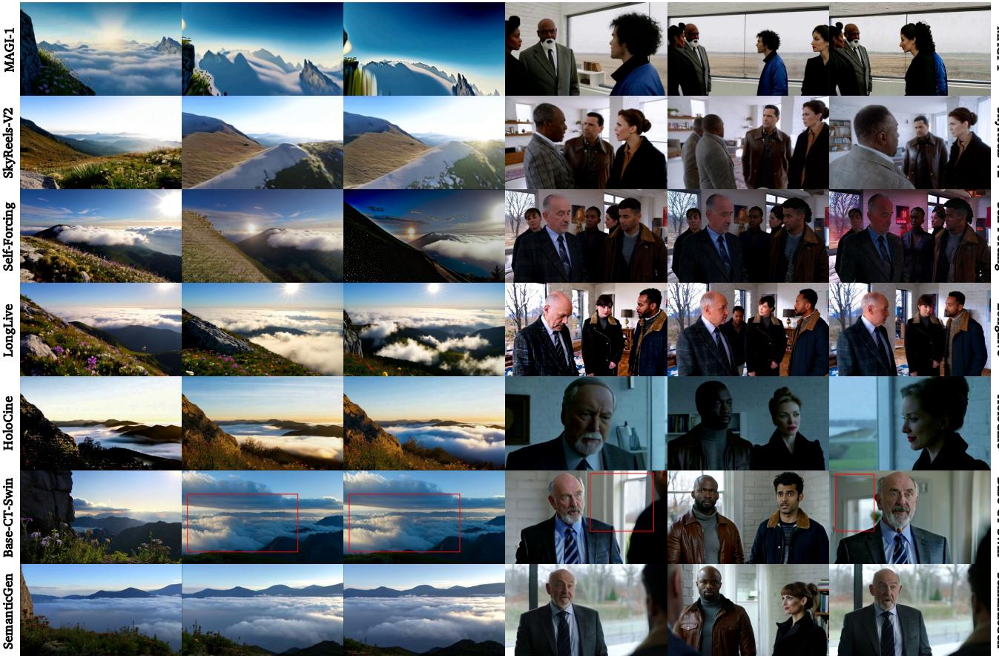  
Figure 12. More synthesized results of SemanticGen.   
A group of people engages in a serious conversation in a modern home, captured through alternating close-ups and medium shots that emphasize their expressions.   
Figure 13. Comparison with additional baselines.

The video showcases a mountain ridge with swirling clouds, as sunlight breaks through, captured in a wide shot with high dynamic range and crisp lighting.

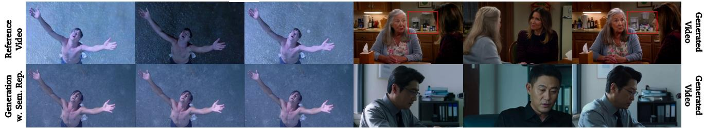  
Figure 14. Visualization of failure cases.