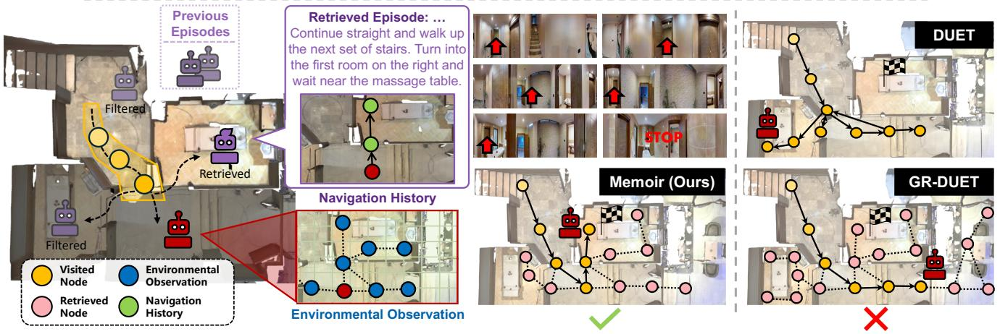
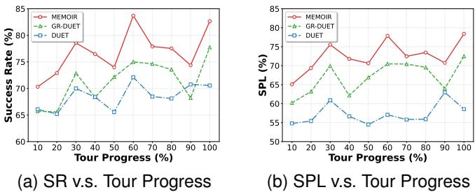

# 1. Bibliographic Information

## 1.1. Title
Dream to Recall: Imagination-Guided Experience Retrieval for Memory-Persistent Vision-and-Language Navigation

The title effectively encapsulates the core concept of the paper. "Dream to Recall" is a metaphor for the agent's process of using imagination (dreaming) to guide the retrieval (recall) of past experiences. "Imagination-Guided Experience Retrieval" specifies the technical mechanism, while "Memory-Persistent Vision-and-Language Navigation" defines the specific problem domain.

## 1.2. Authors
Yunzhe Xu, Yiyuan Pan, Zhe Liu.

Based on their prior publications and affiliations, the authors appear to be active researchers in the fields of embodied AI, computer vision, and natural language processing. Their work often focuses on navigation, planning, and the integration of large language models into autonomous agents.

## 1.3. Journal/Conference
The paper is available as a preprint on arXiv. The metadata indicates a publication date in October 2025, and a reference within the paper ([6] Hong et al.) is cited as an ICLR 2025 publication. This suggests the paper was likely submitted to a top-tier AI conference such as CVPR, ICCV, NeurIPS, or ICLR for the 2025 cycle. ArXiv is a common platform for researchers to share their work before or during the peer-review process, allowing for rapid dissemination of new ideas.

## 1.4. Publication Year
2025 (based on arXiv metadata and internal references).

## 1.5. Abstract
The paper addresses key limitations in **memory-persistent Vision-and-Language Navigation (VLN)**, where agents must improve their performance by learning from accumulated experiences. Current methods either use the entire memory inefficiently or rely on simplistic fixed-range lookups. They also tend to store only environmental observations, ignoring valuable behavioral patterns from past navigation attempts.

To solve this, the authors propose **Memoir**, a novel agent that uses "imagination" as a retrieval mechanism. A **world model** imagines future navigation states, which then serve as queries to selectively retrieve relevant **environmental observations** and **behavioral histories** from an explicit memory. The framework consists of three main components:
1.  A **language-conditioned world model** that imagines future states for generating retrieval queries.
2.  A **Hybrid Viewpoint-Level Memory (HVM)** that stores both visual observations and behavioral patterns tied to specific locations (viewpoints).
3.  An **experience-augmented navigation model** that integrates the retrieved knowledge for decision-making.

    Evaluated on several memory-persistent VLN benchmarks, Memoir shows significant improvements over existing baselines, including a 5.4% gain in SPL (a key navigation metric) on the IR2R dataset. It also demonstrates remarkable efficiency, with an 8.3x training speedup and a 74% reduction in inference memory compared to the best previous method. The authors conclude that this imagination-guided retrieval paradigm is highly effective and has substantial potential for future development.

## 1.6. Original Source Link
*   **Original Source Link:** https://arxiv.org/abs/2510.08553
*   **PDF Link:** https://arxiv.org/pdf/2510.08553v1.pdf
*   **Publication Status:** This is a preprint available on arXiv and has not yet undergone formal peer review for a conference or journal publication.

    ---

# 2. Executive Summary

## 2.1. Background & Motivation
The core problem addressed by this paper lies within the domain of **Vision-and-Language Navigation (VLN)**, a task where an autonomous agent must navigate a 3D environment by following natural language instructions.

*   **The Limitation of Episodic VLN:** Traditional VLN tasks are *episodic*. An agent starts a new task with no memory of its past attempts. This is unrealistic for real-world applications, where a robot operating continuously in the same environment (e.g., a home or office) should learn and improve over time.
*   **The Rise of Memory-Persistent VLN:** To address this, *memory-persistent VLN* benchmarks were developed. In these tasks, the agent retains memory across multiple navigation episodes, allowing it to build familiarity with the environment and learn from its experiences.
*   **Gaps in Existing Memory-Persistent Methods:** The authors identify two critical gaps in prior research:
    1.  **Ineffective Memory Access:** Existing methods struggle with how to use the accumulated memory. Some try to incorporate the *entire* memory bank into every decision, which is computationally expensive and introduces noise from irrelevant information. Others use a simple *fixed-horizon* lookup (e.g., retrieving information only from nearby locations), which risks missing valuable, long-distance context. There is no intelligent, adaptive mechanism to decide *what* memory is relevant at a given moment.
    2.  **Neglect of Behavioral History:** Previous methods predominantly store *what the agent saw* (environmental observations like images and spatial layouts). They largely ignore *how the agent behaved* (the sequence of decisions and interpretations that led to an outcome). This behavioral history contains valuable strategic knowledge about how to successfully (or unsuccessfully) follow certain types of instructions in specific contexts.

*   **The Paper's Innovative Idea:** The paper's entry point is inspired by human cognition. When planning a route, humans often engage in mental simulation—they "imagine" the path ahead. This imagined future serves as a mental query to recall past experiences relevant to that imagined path. The authors propose to build an AI agent that does the same: use a **world model** to "dream" or "imagine" future states, and then use these imagined states as queries to selectively retrieve the most relevant memories—both environmental and behavioral.

## 2.2. Main Contributions / Findings
The paper makes several key contributions to the field of embodied AI and VLN:

1.  **A Novel Paradigm for Memory Retrieval:** It introduces **imagination-guided retrieval**, where a predictive world model's imagined future states are used to query an explicit memory. This provides an adaptive and task-relevant way to filter experiences, directly addressing the limitations of complete memory incorporation and fixed-horizon lookup.
2.  **The Memoir Framework:** The paper operationalizes this paradigm with a unified framework called **Memoir**, which includes:
    *   A **language-conditioned world model** that is trained not just to predict the future but also to generate representations suitable for memory querying.
    *   A **Hybrid Viewpoint-Level Memory (HVM)** that is novel in its explicit storage of both environmental observations and behavioral patterns, both anchored to discrete viewpoints in the environment.
    *   An **experience-augmented navigation model** with specialized encoders to effectively fuse current sensory input with retrieved historical knowledge.
3.  **State-of-the-Art Performance and Efficiency:** Through extensive experiments, the paper demonstrates that Memoir significantly outperforms existing methods on challenging memory-persistent VLN benchmarks.
    *   It achieves a **5.4% absolute improvement in Success rate penalized by Path Length (SPL)** on the IR2R benchmark over the previous best model.
    *   Crucially, it is also vastly more efficient, achieving an **8.3x speedup in training** and a **74% reduction in memory usage during inference**. This makes the concept of continuous learning on embodied agents far more practical.
4.  **Demonstrating Future Potential:** An oracle analysis, where the model is given access to perfect retrieval, shows performance jumping to 93.4% SPL. This reveals a substantial performance gap (from Memoir's 73.3% SPL) and indicates that the imagination-guided paradigm has enormous headroom for improvement, primarily by developing more accurate world models.

    ---

# 3. Prerequisite Knowledge & Related Work

## 3.1. Foundational Concepts

To understand this paper, one must be familiar with the following concepts:

*   **Vision-and-Language Navigation (VLN):** VLN is a task in embodied AI where an agent, typically placed in a photorealistic 3D environment, must follow natural language instructions to navigate from a starting point to a target destination. The agent receives visual input (e.g., panoramic images from its current location) and the instruction text. At each step, it must decide which direction to move or whether to stop. The environment is often represented as a **connectivity graph**, where nodes are navigable viewpoints and edges represent paths between them.

*   **Memory-Persistent VLN:** This is a more advanced version of VLN. Unlike standard episodic VLN where the agent's memory is wiped after each task, in memory-persistent VLN, the agent accumulates knowledge across a sequence of tasks (often called a "tour"). This allows the agent to become familiar with the environment and learn from past successes and failures, which is crucial for long-term autonomy.

*   **World Models:** A world model is a component of an intelligent agent that learns a model of its environment. Instead of learning a policy directly from observations to actions (model-free), a model-based agent first learns the "rules" or "dynamics" of the world. It can then use this internal model to simulate future outcomes and plan actions by "imagining" what would happen. This paper uses a world model to imagine future states to guide memory retrieval.

*   **Recurrent State-Space Model (RSSM):** This is a specific and popular architecture for building world models, particularly for environments with partial observability. The RSSM operates in a compressed **latent space**. It uses a recurrent neural network (like a GRU or LSTM) to predict the next latent state based on the previous latent state and action. This allows it to model temporal dependencies and infer the state of the world even from incomplete sensory information.

*   **Contrastive Learning:** This is a self-supervised learning technique used to learn representations. Instead of learning to reconstruct the input (like in an autoencoder), a contrastive model learns to pull representations of "similar" data points closer together in an embedding space while pushing "dissimilar" ones apart. In this paper, the world model is trained contrastively: it learns to associate a latent state $z$ with its correct corresponding observation $o$, distinguishing it from a batch of "negative" observations. This is more computationally efficient than reconstructing high-dimensional images.

*   **Topological Maps:** A topological map is a simplified representation of space that focuses on connectivity and relationships between locations rather than their precise geometric coordinates. In VLN, this is typically a graph where nodes are viewpoints and edges represent traversability. This is computationally more efficient than dense, metric maps (like occupancy grids) and is well-suited for planning high-level routes.

## 3.2. Previous Works

The paper builds upon and differentiates itself from several lines of prior research.

*   **Single-Episode VLN Models (e.g., DUET):**
    *   **DUET (Dual-Scale Graph Transformer)** is a prominent VLN model that this paper uses as a base architecture. DUET maintains a topological map of the explored environment. Its key idea is to plan at two scales:
        1.  **Coarse-scale planning:** A Graph Transformer reasons over the entire explored map to identify a high-level goal viewpoint.
        2.  **Fine-scale planning:** Another Transformer looks at the immediate panoramic view to decide on the very next step.
    *   These models are powerful but are fundamentally episodic; they cannot retain knowledge between navigation tasks.

*   **Memory-Persistent VLN Models:**
    *   **TourHAMT:** An early approach that simply stacked the complete navigation histories (observations and actions) from previous episodes. This suffered from massive redundancy and performance degradation as the memory grew.
    *   **GR-DUET:** A more recent and powerful baseline. It extends DUET by retaining the *entire* topological map and all associated visual features from all previous episodes. While effective, this approach is computationally demanding as the agent must process an ever-growing graph. It also treats all memories as equally important, lacking a mechanism for selective attention.
    *   **Other approaches (OVER-NAV, MAPCMA):** These methods construct various forms of memory (e.g., semantic maps, omni-graphs) but typically rely on simplistic retrieval mechanisms like fixed-distance lookup, which is not adaptive to the specific instruction or context.

*   **World Models in Reinforcement Learning:**
    *   The paper's world model is based on the **RSSM** architecture, popularized by models like **Dreamer**. Dreamer learns a world model and then trains an agent entirely within the "dreamed" latent space, which is highly data-efficient.
    *   This paper's innovation is not in the world model architecture itself, but in its *application*. Instead of using the world model primarily for planning in a latent space, `Memoir` uses it to generate **queries for an external, explicit memory**.

## 3.3. Technological Evolution
The field of VLN has evolved from stateless agents to agents with increasingly sophisticated memory systems:
1.  **Stateless/RNN-based Agents:** Early models used simple RNNs (like LSTMs) to encode the instruction and the history of observations within a single episode.
2.  **Structured Episodic Memory:** Models like DUET introduced structured representations like topological maps, providing a more robust spatial memory *within* an episode.
3.  **Persistent Memory (Accumulation):** The introduction of memory-persistent tasks led to models like GR-DUET that focused on how to *accumulate* and *store* knowledge across episodes, typically by retaining the entire observation history in a structured map.
4.  **Persistent Memory (Intelligent Access):** `Memoir` represents the next logical step. It argues that simply accumulating memory is not enough; the crucial challenge is **intelligent access**. Its contribution is a mechanism for *adaptive retrieval* based on the agent's forward-looking intent, which is a more sophisticated and scalable approach to memory management.

## 3.4. Differentiation Analysis

| Feature | Typical Memory-Persistent VLN (e.g., GR-DUET) | Memoir (This Paper's Approach) |
| :--- | :--- | :--- |
| **Memory Access** | **Exhaustive or Fixed-Horizon.** Incorporates the entire memory bank or retrieves based on a fixed spatial distance. | **Adaptive and Predictive.** Uses imagined future states as dynamic queries to retrieve only the most relevant memories. |
| **Memory Content** | **Primarily Environmental Observations.** Stores visual features and the spatial layout of the environment. | **Hybrid: Environmental + Behavioral.** Stores both what the agent saw (observations) and how it acted (inferred states and imagined trajectories), capturing strategic patterns. |
| **Role of World Model** | Not typically used. | **Central to the framework.** The world model serves as the engine for generating memory retrieval queries. |
| **Computational Efficiency** | **Low.** Processing the entire memory bank is slow and memory-intensive, scaling poorly with more experience. | **High.** Selective retrieval significantly reduces computational overhead, making it much faster and more memory-efficient. |

In essence, `Memoir` shifts the research focus from "how to store everything" to "how to recall the right thing at the right time."

---

# 4. Methodology

## 4.1. Principles
The core principle of `Memoir` is to mimic the human cognitive process of using mental simulation to guide memory recall. The agent doesn't just react to its current perception; it actively predicts, or **imagines**, where it might go next based on the instruction. This imagined future trajectory then serves as a powerful, context-sensitive query to retrieve relevant past experiences from a long-term memory. This process is grounded, meaning the imagination is tied to retrieving information from an explicit memory, preventing the agent from hallucinating or planning in isolation from past knowledge.

The methodology is broken down into three main components, which work in a synergistic loop:
1.  **Language-Conditioned World Model:** This module learns the dynamics of the environment. Its dual purpose is to (a) imagine future states to form a retrieval query and (b) encode the current navigation history into a latent state for storage.
2.  **Hybrid Viewpoint-Level Memory (HVM):** A dual-bank memory system that stores both (a) environmental observations (what the world looks like) and (b) behavioral histories (how the agent navigated in the past), all indexed by their physical viewpoint location.
3.  **Experience-Augmented Navigation Model:** This is the agent's decision-making module. It extends a standard VLN navigator (DUET) with specialized encoders to integrate the retrieved memories into its planning process.

    The overall architecture is depicted in Figure 2 of the paper.

    
    *该图像是一幅示意图，展示了Memoir模型的三个主要组件：世界模型、混合视点级记忆和导航模型。图中包含了不同的导航历史和观测数据，通过对比损失（`Contrastive Loss`）和检索机制，增强了环境信息和行为记忆的使用，提升了视觉和语言导航的有效性。*

## 4.2. Core Methodology In-depth

### 4.2.1. Language-Conditioned World Model
The world model is the engine that drives the imagination process. It is a probabilistic, recurrent model based on the RSSM architecture. To adapt it for the VLN task, the authors make it conditional on the language instruction $l$. The model is trained to optimize the Evidence Lower Bound (ELBO) on the likelihood of observing environmental data, which is a standard technique for training variational models.

The paper presents a modified objective function that incorporates the instruction $l$ and a reward signal $\gamma_t$ (distance to goal):

$$
\ln p ( o , \gamma \mid \ell ) \geq \sum _ { t = 1 } ^ { T } \Big ( \mathbb { E } _ { q ( z _ { t } \mid o _ { \le t } , \ell ) } \Big [ \underbrace { \ln p ( \gamma _ { t } \mid z _ { t } ) } _ { \mathcal{T}_{\text{REWARD}} } \Big ] \\
+ \mathbb { E } _ { q ( z _ { t } \mid o _ { \le t } , \ell ) } \Big [ \underbrace { \ln p ( z _ { t } \mid o _ { t } ) - \ln \sum _ { o ^ { \prime } \in \mathcal { D } } p ( z _ { t } \mid o ^ { \prime } ) } _ { \mathcal{T}_{\text{NCE}} } \Big ] \\
- \mathbb { E } _ { q ( z _ { t - 1 } \mid o _ { \le t } , \ell ) } \Big [ \underbrace { \mathrm { K L } \big [ q ( z _ { t } \mid o _ { \le t } , \ell ) \big \| p \big ( z _ { t } \mid z _ { t - 1 } \big ) \big ] } _ { \text{KL term} } \Big ] \Big ) ,
  $$

Let's break down this objective:
*   **$z_t$**: The latent state of the world at time $t$. This is a compact representation of everything the agent needs to know.
*   **$o_t$**: The visual observation at time $t$.
*   **$q(z_t | o_{\le t}, l)$**: The *inference model* (or posterior), which infers the current latent state $z_t$ based on the history of observations and the instruction.
*   **$p(z_t | z_{t-1})$**: The *transition model* (or prior), which predicts the next latent state based on the previous one. This is what the agent uses to "imagine" the future.
*   **The first term, $\mathcal{T}_{\text{REWARD}}$**: This is a reward prediction term. The model learns to predict the distance to the goal ($\gamma_t$) from the latent state $z_t$. This is crucial because it allows the imagination to terminate when it predicts it has reached the goal.
*   **The second term, $\mathcal{T}_{\text{NCE}}$**: This is the **Noise-Contrastive Estimation** loss. Instead of reconstructing the image $o_t$ from $z_t$ (which is computationally expensive), the model learns a compatibility score between a state and an observation. It is trained to give a high score to the correct $(z_t, o_t)$ pair and low scores to incorrect pairs $(z_t, o')$, where $o'$ is a "negative sample" from a dataset $\mathcal{D}$. This is the core of the contrastive learning approach.
*   **The third term, KL term**: This is a Kullback-Leibler divergence term that regularizes the model. It encourages the inferred state distribution $q$ to be close to the predicted state distribution $p$, keeping the model's beliefs consistent over time.

    The compatibility between a state and an observation is calculated using a learnable function:
$$
f ( z _ { t } , o _ { t } ) = \frac { 1 } { \zeta } \cos ( \psi _ { s } ( z _ { t } ) , \psi _ { o } ( x _ { t } ) ) \\
p ( z _ { t } \mid o _ { t } ) \propto \exp ( f ( z _ { t } , o _ { t } ) ) ,
$$
where:
*   $x_t$ is the visual feature extracted from observation $o_t$.
*   $\psi_s$ and $\psi_o$ are embedding functions (neural networks) that map the latent state and observation feature into a shared embedding space.
*   $\cos(\cdot, \cdot)$ is the cosine similarity.
*   $\zeta$ is a temperature parameter that controls the sharpness of the distribution.
    This compatibility function is vital, as it will be reused during retrieval to measure the similarity between an imagined state and a stored observation.

To improve long-range prediction, the model is also trained with a **multi-step overshooting** objective (Formulas 7 & 8), which encourages the model to make accurate predictions not just one step ahead, but up to $D$ steps into the future.

### 4.2.2. Hybrid Viewpoint-Level Memory (HVM)
The HVM is the agent's long-term memory, organized around the persistent topological graph $\mathcal{G}^{(k)}$ built over $k$ episodes. It consists of two banks:

1.  **Observation Bank ($\mathcal{M}_o$):** This is a simple key-value store. The keys are viewpoints $v_j$, and the values are their corresponding visual features $x_j$. It answers the question: "What did this place look like?"
2.  **History Bank ($\mathcal{M}_h$):** This bank is more complex. For each viewpoint $v_j$, it stores a list of past behavioral patterns. Each pattern consists of:
    *   The inferred agent state $z_j$ from a past visit.
    *   The imagined trajectory $\tau_j$ that the agent generated from that viewpoint during that visit.
        It answers the question: "When I was here before, what was I trying to do and where did I think I was going?"

At each timestep $t$, the HVM is updated: the current viewpoint feature $x_t$ is added to $\mathcal{M}_o$, and the inferred state $z_t$ and newly imagined trajectory $\tau_t$ are added to $\mathcal{M}_h$.

### 4.2.3. Experience Retrieval
This is where the imagination is used to query the HVM. The agent generates an imagined trajectory $\tau_t = \{ \hat{z}_{t+i} \}_{i=1}^{H_t}$ from its current location $v_t$. This trajectory is then used to retrieve information from both memory banks.

#### Environmental Observation Retrieval (Algorithm 1)
This process aims to retrieve relevant locations from the map based on the imagined future.
The key steps are:
1.  For each step $i$ in the imagined trajectory (from 1 to $H_t$), the algorithm considers all viewpoints that are $i$ steps away from the agent's current location $v_t$ in the persistent graph. These are the $i$-th order neighbors, $\mathcal{N}_i(v_t)$.
2.  For each candidate viewpoint $v_j$ in $\mathcal{N}_i(v_t)$, it calculates a compatibility score between the $i$-th imagined state $\hat{z}_{t+i}$ and the stored visual feature $x_j$ of that viewpoint. This is done using the same compatibility function from the world model training:
    $$
    c _ { i , j } = \frac { 1 } { 2 } ( \cos ( \psi _ { s } ( \hat { z } _ { t + i } ) , \psi _ { o } ( x _ { j } ) ) + 1 )
    $$
3.  The viewpoints are then filtered. First, a percentile-based filter with a decaying threshold keeps the most promising candidates. Then, a hard limit keeps only the top-$W$ candidates.
4.  Finally, the shortest paths from the agent's current location to these top-ranked retrieved viewpoints are found, and all viewpoints along these paths are added to the agent's *episodic* graph, $\mathcal{G}_t$, which is used for immediate planning.

#### Navigation History Retrieval (Algorithm 2)
This process aims to find past navigation episodes where the agent had a similar "intent" or "plan."
The key steps are:
1.  The agent retrieves all historical patterns $(\tau', z')$ stored at its current viewpoint $v_t$ from the history bank $\mathcal{M}_h$.
2.  For each historical trajectory $\tau'$, it performs a step-by-step comparison with the current imagined trajectory $\tau_t$. At each step $i$, it computes the compatibility between the current imagined state $\hat{z}_{t+i}$ and the historical imagined state $\hat{z}'_i$:
    $$
    c _ { i } = \frac { 1 } { 2 } ( \cos ( \psi _ { s } ( \hat { z } _ { t + i } ) , \psi _ { s } ( \hat { z } _ { i } ^ { \prime } ) ) + 1 )
    $$
3.  The matching continues as long as the compatibility score $c_i$ is above a decaying threshold.
4.  The historical patterns are ranked based on how long they matched the current imagination and the quality of the match. The top-$P$ patterns are selected.
5.  For each selected pattern, the sequence of viewpoints and associated historical states from that successful match are retrieved and added to the current episodic graph $\mathcal{G}_t$.

### 4.2.4. Navigation Model
The navigation model takes the augmented episodic graph $\mathcal{G}_t$ (which now contains both current observations and retrieved memories) and makes a move decision. It extends the DUET architecture with a third, specialized encoder for history.

1.  **Coarse-Scale Encoder:** This is DUET's global planner. It operates on the full episodic graph $\mathcal{G}_t$, which now includes the retrieved observations, to get a global sense of where to go.
2.  **Fine-Scale Encoder:** This is DUET's local planner. It looks only at the immediate panoramic observation $r_t$ to decide on the next adjacent step.
3.  **Navigation-History Encoder (New):** This is a new Transformer-based encoder designed specifically to process the retrieved behavioral patterns. For each viewpoint $v_j$ that has retrieved historical states, it creates a fused representation by taking a weighted average of the historical states (weighted by their compatibility scores) and adding it to the viewpoint's visual feature:
    $$
    u _ { j } = \left( \operatorname { softmax } \left( \frac { C _ { j } } { \zeta } \right) \right) ^ { \top } Z _ { j } + x _ { j }
    $$
    This fused representation $u_j$ is then processed by the encoder to produce action scores informed by past behaviors.

Finally, a **Dynamic Fusion** mechanism learns to combine the outputs of these three encoders. It computes weights $(\sigma_f, \sigma_c, \sigma_h)$ based on the current context and produces a final action score by taking a weighted sum:
$$
s _ { j } = \sigma _ { f } s _ { j } ^ { ( f ^ { \prime } ) } + \sigma _ { c } s _ { j } ^ { ( c ) } + \sigma _ { h } s _ { j } ^ { ( h ^ { \prime } ) }
$$
The agent then selects the action corresponding to the viewpoint with the highest score $s_j$. The entire navigation loop is summarized in Algorithm 3.

---

# 5. Experimental Setup

## 5.1. Datasets
The authors evaluate `Memoir` on two established memory-persistent VLN benchmarks:

*   **Iterative Room-to-Room (IR2R):**
    *   **Source and Characteristics:** This dataset is built upon the popular Room-to-Room (R2R) dataset, which uses Matterport3D scans of real indoor environments. IR2R extends R2R by organizing individual navigation tasks into long "tours," where an agent completes multiple episodes sequentially within the same set of houses.
    *   **Scale:** It contains 183 training tours (avg. 76.6 episodes each). The validation set is split into "seen" environments (159 tours, avg. 6.4 episodes) and "unseen" environments (33 tours, avg. 71.2 episodes).
    *   **Purpose:** This dataset is ideal for testing an agent's ability to build and leverage familiarity within a consistent set of environments over a long operational period.

*   **General Scene Adaptation (GSA-R2R):**
    *   **Source and Characteristics:** This benchmark uses the Habitat-Matterport3D (HM3D) dataset, which provides a larger and more diverse set of scenes. It is designed to evaluate an agent's ability to adapt to new environments and instruction styles.
    *   **Scale:** It contains 150 scenes with 600 paths per scene, totaling 90,000 episodes. It features 10 distinct evaluation scenarios.
    *   **Purpose:** This dataset tests the generalizability of the agent's learned strategies. The scenarios include different environments (residential vs. non-residential) and instruction types (basic commands, scene-specific descriptions, and personalized user instructions), making it a comprehensive test of robustness.

## 5.2. Evaluation Metrics
The paper uses standard VLN metrics and introduces four new metrics to specifically evaluate the quality of memory retrieval.

### Standard Navigation Metrics:
*   **Trajectory Length (TL):**
    *   **Conceptual Definition:** The total length of the path taken by the agent, in meters. Shorter is generally better, assuming success.
*   **Navigation Error (NE):**
    *   **Conceptual Definition:** The final Euclidean distance in meters between the agent's stopping position and the true target location. Lower is better.
*   **Success Rate (SR):**
    *   **Conceptual Definition:** The percentage of episodes where the agent stops within a certain threshold distance (typically 3 meters) of the target location. Higher is better.
    *   **Mathematical Formula:**
        \$
        SR = \frac{1}{N} \sum_{i=1}^{N} \mathbb{I}(NE_i < d_{success})
        \$
    *   **Symbol Explanation:** $N$ is the total number of episodes, $NE_i$ is the navigation error for episode $i$, and $d_{success}$ is the success threshold (3m). $\mathbb{I}(\cdot)$ is the indicator function (1 if true, 0 if false).
*   **Success rate penalized by Path Length (SPL):**
    *   **Conceptual Definition:** This is considered the primary metric in VLN as it jointly measures success and efficiency. It penalizes successful paths that are unnecessarily long. Higher is better.
    *   **Mathematical Formula:**
        \$
        SPL = \frac{1}{N} \sum_{i=1}^{N} S_i \frac{L_i^*}{\max(L_i, L_i^*)}
        \$
    *   **Symbol Explanation:** $N$ is the total number of episodes, $S_i$ is a binary value indicating success (1) or failure (0) for episode $i$, $L_i$ is the length of the agent's path, and $L_i^*$ is the length of the shortest path to the goal.
*   **Normalized Dynamic Time Warping (nDTW) & Tour-nDTW (T-nDTW):**
    *   **Conceptual Definition:** nDTW measures the fidelity of the agent's path to the expert's path, accounting for differences in speed. It is a measure of path shape similarity. T-nDTW is the same metric aggregated over an entire tour. Higher is better.

### Custom Retrieval Quality Metrics:
*   **Observation Accuracy (OA):**
    *   **Conceptual Definition:** Measures the precision of observation retrieval. Of all the viewpoints retrieved, what fraction were actually relevant (i.e., on or near the future ground-truth path)?
    *   **Mathematical Formula:**
        \$
        \mathrm { O A } = \frac { | \bigcup _ { t = 1 } ^ { T } ( \mathcal { R } _ { t } \cap \mathcal { V } _ { \mathrm { gt } , t } ^ { o } ) | } { | \bigcup _ { t = 1 } ^ { T } \mathcal { R } _ { t } | }
        \$
    *   **Symbol Explanation:** $\mathcal{R}_t$ is the set of viewpoints retrieved at time $t$. $\mathcal{V}_{\mathrm{gt}, t}^o$ is the set of ground-truth viewpoints on the optimal path ahead of time $t$. $T$ is the episode length.
*   **Observation Recall (OR):**
    *   **Conceptual Definition:** Measures the coverage of observation retrieval. Of all the relevant viewpoints that could have been retrieved, what fraction did the agent actually retrieve?
    *   **Mathematical Formula:**
        \$
        \mathrm { O R } = \frac { \vert \bigcup _ { t = 1 } ^ { T } ( \mathcal { R } _ { t } \cap \mathcal { V } _ { \mathrm { gt } , t } ^ { o } ) \vert } { \vert \bigcup _ { t = 1 } ^ { T } \mathcal { V } _ { \mathrm { gt } , t } ^ { o } \vert }
        \$
*   **History Accuracy (HA):**
    *   **Conceptual Definition:** Measures the precision of history retrieval. Of all the viewpoints contained in the retrieved historical paths, what fraction were relevant?
    *   **Mathematical Formula:**
        \$
        \mathrm { H A } = \frac { \sum _ { t = 1 } ^ { T } \sum _ { j = 1 } ^ { | Q _ { t } | } | \mathcal { V } _ { \mathrm { traj } , t , j } ^ { h } \cap \mathcal { V } _ { \mathrm { gt } , t , j } ^ { h } | } { \sum _ { t = 1 } ^ { T } \sum _ { j = 1 } ^ { | Q _ { t } | } | \mathcal { V } _ { \mathrm { traj } , t , j } ^ { h } | }
        \$
*   **History Recall (HR):**
    *   **Conceptual Definition:** Measures the coverage of history retrieval. Of all the relevant historical viewpoints that could have been retrieved, what fraction did the agent actually retrieve?
    *   **Mathematical Formula:**
        \$
        \mathrm { H R } = \frac { \sum _ { t = 1 } ^ { T } \sum _ { j = 1 } ^ { \lvert Q _ { t } \rvert } \lvert \mathcal { V } _ { \mathrm { traj } , t , j } ^ { h } \cap \mathcal { V } _ { \mathrm { gt } , t , j } ^ { h } \rvert } { \sum _ { t = 1 } ^ { T } \sum _ { j = 1 } ^ { \lvert Q _ { t } \rvert } \lvert \mathcal { V } _ { \mathrm { gt } , t , j } ^ { h } \rvert }
        \$

## 5.3. Baselines
`Memoir` is compared against a comprehensive set of models:
*   **Traditional (Episodic) VLN Models:**
    *   `DUET`: The base architecture for `Memoir`. This comparison shows the benefit of adding the memory and retrieval system.
    *   `ScaleVLN`: Another strong episodic VLN model, used to show that `Memoir`'s framework is general and not just tied to DUET.
*   **Memory-Persistent VLN Models:**
    *   `TourHAMT`: A baseline that stacks raw history, representing a naive approach to memory.
    *   `OVER-NAV`: A method that uses open-vocabulary detection and fixed-distance retrieval.
    *   `GR-DUET`: The main and strongest baseline. It represents the state-of-the-art in memory-persistent VLN, which uses the entire accumulated topological map for navigation. The comparison against `GR-DUET` is crucial for validating the benefits of selective retrieval over exhaustive memory usage.

        ---

# 6. Results & Analysis

## 6.1. Core Results Analysis

### 6.1.1. Iterative Room-to-Room (IR2R) Results
The following are the results from Table 2 of the original paper:

<table>
<thead>
<tr>
<th rowspan="2">Methods</th>
<th rowspan="2">PH</th>
<th rowspan="2">TH</th>
<th rowspan="2">PHI</th>
<th rowspan="2">IW</th>
<th colspan="5">Val Seen</th>
<th colspan="5">Val Unseen</th>
</tr>
<tr>
<th>TL↓</th>
<th>NE↓</th>
<th>nDTW↑</th>
<th>SR↑</th>
<th>SPL↑</th>
<th>t-nDTW↑</th>
<th>TL↓</th>
<th>NE↓</th>
<th>nDTW↑</th>
<th>SR↑</th>
<th>SPL↑</th>
<th>t-nDTW↑</th>
</tr>
</thead>
<tbody>
<tr>
<td>HAMT [20]</td>
<td></td>
<td></td>
<td></td>
<td></td>
<td>10.1 ±0.1</td>
<td>4.2 ±0.1</td>
<td>71 ±1</td>
<td>63 ±1</td>
<td>61 ±1</td>
<td>58 ±1</td>
<td>9.4 ±0.1</td>
<td>4.7 ±0.0</td>
<td>66 ±0</td>
<td>56 ±0</td>
<td>54 ±0</td>
<td>50 ±0</td>
</tr>
<tr>
<td>TourHAMT [5]</td>
<td>✓</td>
<td>✓</td>
<td>✓</td>
<td>✓</td>
<td>9.4 ±0.4</td>
<td>5.8 ±0.1</td>
<td>59 ±0</td>
<td>45 ±1</td>
<td>43 ±1</td>
<td>45 ±0</td>
<td>10.0 ±0.2</td>
<td>6.2 ±0.1</td>
<td>52 ±0</td>
<td>39 ±1</td>
<td>36 ±0</td>
<td>32 ±1</td>
</tr>
<tr>
<td>OVER-NAV [7]</td>
<td></td>
<td></td>
<td></td>
<td></td>
<td>9.9 ±0.1</td>
<td>3.7 ± 0.1</td>
<td>73 ±1</td>
<td>65 ±1</td>
<td>63 ±1</td>
<td>62 ±0</td>
<td>9.4 ±0.1</td>
<td>4.1 ±0.1</td>
<td>69 ±0</td>
<td>60 ±1</td>
<td>57 ±0</td>
<td>55 ±1</td>
</tr>
<tr>
<td colspan="15"><strong>Comparison with Traditional VLN Models:</strong></td>
</tr>
<tr>
<td colspan="15">VLN models pretrained with default protocol:</td>
</tr>
<tr>
<td>DUET [9]</td>
<td></td>
<td></td>
<td></td>
<td></td>
<td>12.5 ±0.4</td>
<td>2.2 ±0.1</td>
<td>79.8 ±1.1</td>
<td>79.8 ±0.7</td>
<td>74.5 ±0.9</td>
<td>69.1 ±1.7</td>
<td>14.4 ±0.1</td>
<td>3.5 ±0.0</td>
<td>65.0 ±0.1</td>
<td>69.2 ±0.3</td>
<td>58.0 ±0.1</td>
<td>47.0 ±0.8</td>
</tr>
<tr>
<td>+Memoir (Ours)</td>
<td></td>
<td></td>
<td></td>
<td></td>
<td>11.5 ±0.1</td>
<td>2.6 ±0.2</td>
<td>78.9 ±0.9</td>
<td>77.1 ±0.5</td>
<td>72.8 ±0.5</td>
<td>68.0 ±0.8</td>
<td>11.0 ±0.0</td>
<td>2.8 ±0.1</td>
<td>75.2 ±0.0</td>
<td>75.4 ±0.2</td>
<td>69.1 ±0.3</td>
<td>58.8 ±0.4</td>
</tr>
<tr>
<td colspan="15">VLN models pretrained with environmental augmentation:</td>
</tr>
<tr>
<td>ScaleVLN [16]</td>
<td></td>
<td></td>
<td></td>
<td></td>
<td>12.8 ±0.0</td>
<td>2.2 ±0.0</td>
<td>79.6 ±0.4</td>
<td>79.5 ±0.5</td>
<td>74.1 ±0.6</td>
<td>67.0 ±0.2</td>
<td>13.5 ±0.0</td>
<td>2.7 ±0.0</td>
<td>71.6 ±0.1</td>
<td>76.2 ±0.1</td>
<td>66.5 ±0.2</td>
<td>53.4 ±0.2</td>
</tr>
<tr>
<td>+Memoir (Ours)</td>
<td></td>
<td></td>
<td></td>
<td></td>
<td>11.6 ±0.2</td>
<td>2.5 ±0.1</td>
<td>78.7 ±0.1</td>
<td>76.1 ±0.5</td>
<td>71.3 ±0.1</td>
<td>67.1 ±0.0</td>
<td>10.9 ±0.2</td>
<td>2.6 ±0.0</td>
<td>77.2 ±0.6</td>
<td>77.4 ±0.2</td>
<td>72.1 ±0.4</td>
<td>60.6 ±0.2</td>
</tr>
<tr>
<td colspan="15"><strong>Comparison with Memory-Persistent VLN Models:</strong></td>
</tr>
<tr>
<td colspan="15">VLN models pretrained with full navigation graph:</td>
</tr>
<tr>
<td>GR-DUET [6]</td>
<td></td>
<td></td>
<td></td>
<td></td>
<td>9.8 ±0.1</td>
<td>4.5 ±0.2</td>
<td>64.3 ±0.8</td>
<td>55.1 ±1.0</td>
<td>50.4 ±1.1</td>
<td>46.9 ±0.8</td>
<td>10.3 ±0.3</td>
<td>3.5 ±0.1</td>
<td>67.6 ±0.7</td>
<td>67.9 ±0.3</td>
<td>61.9 ±0.5</td>
<td>51.3 ±0.6</td>
</tr>
<tr>
<td>GR-DUET* [6]</td>
<td></td>
<td></td>
<td></td>
<td></td>
<td>9.7 ±0.4</td>
<td>4.3 ±0.3</td>
<td>66.0 ±0.8</td>
<td>58.8 ±1.1</td>
<td>55.1 ±1.2</td>
<td>51.2 ±0.9</td>
<td>10.8 ±0.3</td>
<td>3.1 ±0.1</td>
<td>71.7 ±0.3</td>
<td>72.9 ±0.3</td>
<td>67.9 ±0.3</td>
<td>57.3 ±0.5</td>
</tr>
<tr>
<td>+Memoir (Ours)</td>
<td></td>
<td></td>
<td></td>
<td></td>
<td>11.0 ±0.2</td>
<td>2.7 ±0.1</td>
<td>77.2 ±0.6</td>
<td>76.7 ±0.4</td>
<td>72.4 ±0.3</td>
<td>65.1 ±0.5</td>
<td>10.3 ±0.0</td>
<td>2.5 ±0.1</td>
<td>79.5 ±0.1</td>
<td>78.0 ±0.4</td>
<td>73.3 ±0.1</td>
<td>66.4 ±0.1</td>
</tr>
</tbody>
</table>

*Note: `GR-DUET*` refers to the authors' reproduction of the baseline under their aligned experimental conditions.*

**Analysis:**
*   **Outperforming Memory-Persistent Baselines:** The most important comparison is in the last block. On the challenging **Val Unseen** split, `Memoir` achieves **73.3% SPL**, a massive **+5.4%** absolute improvement over the reproduced state-of-the-art `GR-DUET*` (67.9% SPL). This strongly validates the core hypothesis that selective, imagination-guided retrieval is superior to exhaustive memory incorporation. By filtering out irrelevant noise, `Memoir` makes more robust decisions.
*   **Enhancing Traditional Models:** When `Memoir`'s system is added to standard episodic models like `DUET` and `ScaleVLN`, their performance on unseen environments skyrockets. For `DUET`, SPL improves from 58.0% to **69.1% (+11.1%)**. This shows that the framework is a powerful enhancement that can provide strong priors even for models not designed for persistence.
*   **Seen vs. Unseen Environments:** The authors note an interesting phenomenon where memory-persistent models like `GR-DUET` perform worse on "seen" environments than their episodic counterparts (`DUET` gets 74.5% SPL while `GR-DUET*` gets 55.1%). They attribute this to the short tour lengths in the seen split (less experience to learn from) and a regularization effect where long-term memory prevents overfitting. `Memoir` significantly mitigates this drop (72.4% SPL), indicating a more balanced and effective use of memory.

### 6.1.2. General Scene Adaptation (GSA-R2R) Results
Tables 3, 4, and 5 show results across 10 different scenarios. Across all of them, `Memoir` consistently outperforms `GR-DUET*`. For example, in Table 5 (Test-N-Basic scenario), `Memoir` achieves **52.0% SPL** compared to `GR-DUET*`'s 50.4%. The authors note the performance gains are smaller than on IR2R. This is likely because GSA-R2R has very dense experience (600 episodes per scene), making `GR-DUET`'s "use everything" strategy less harmful, as most of the memory is indeed relevant. Nonetheless, `Memoir`'s superior performance even in this scenario demonstrates its robustness.

### 6.1.3. Qualitative Analysis
The paper provides a compelling visual example of `Memoir`'s strengths in Figure 3.

*该图像是示意图，展示了Memoir在视觉与语言导航中的效率对比。左侧显示了导航历史及环境观察，右侧展示了不同模型的路径选择，其中Memoir模型表现最佳。图中包含了关键节点及导航指示，强化了行为模式与环境观察的联系。*

*   **Scenario:** The instruction is to find a "massage table." There are two rooms with such tables, and the correct one is further away.
*   **DUET's Failure:** The standard DUET agent, lacking long-term memory, gets distracted by the first, incorrect massage table it sees and stops there.
*   **GR-DUET's Failure:** The GR-DUET agent, which incorporates its entire memory, is overwhelmed by the number of potential locations and becomes confused, ultimately failing.
*   **Memoir's Success:** `Memoir` succeeds through its dual-retrieval mechanism:
    *   **Observation Retrieval** identifies paths towards both potential rooms, providing relevant spatial context.
    *   **History Retrieval** recalls a past episode where the agent successfully navigated to a "massage room." This behavioral pattern provides a strong signal that guides the agent to explore more thoroughly and find the correct destination.

## 6.2. Ablation Studies / Parameter Analysis

### 6.2.1. Computational Efficiency
The following are the results from Table 6 of the original paper:

<table>
<thead>
<tr>
<th rowspan="2">Methods</th>
<th colspan="2">Training</th>
<th colspan="2">Inference</th>
</tr>
<tr>
<th>Memory↓</th>
<th>Latency↓</th>
<th>Memory↓</th>
<th>Latency↓</th>
</tr>
</thead>
<tbody>
<tr>
<td>DUET [9]</td>
<td>7.2 GB</td>
<td>0.15s</td>
<td>2.2 GB</td>
<td>0.13s</td>
</tr>
<tr>
<td>GR-DUET [6]</td>
<td>29.4 GB</td>
<td>4.39s</td>
<td>9.9 GB</td>
<td>0.25s</td>
</tr>
<tr>
<td>Memoir (Ours)</td>
<td>13.1 GB (-55%)</td>
<td>0.53s (-88%)</td>
<td>2.6 GB (-74%)</td>
<td>0.31s (+28%)</td>
</tr>
</tbody>
</table>

**Analysis:** This table highlights one of `Memoir`'s most significant advantages. Compared to `GR-DUET`, `Memoir` reduces training memory by **55%** and training latency by **88% (an 8.3x speedup)**. During inference, memory usage is cut by **74%**. This makes continuous learning with persistent memory practical for real-world deployment on resource-constrained hardware. The small increase in inference latency over `GR-DUET` is due to the retrieval process, but this is a small price for the massive memory savings and performance gains.

### 6.2.2. Performance Scaling
The chart in Figure 4 shows how performance evolves as an agent completes more episodes in a tour.

*该图像是一个图表，展示了三种算法在不同游览进度下的成功率和 SPL（Success Percentage）。左侧图表显示了成功率（SR）随游览进度（Tour Progress）的变化，右侧图表展示了 SPL 相对于游览进度的变化。从图中可以看出，Memoir 算法表现优异，逐步提高成功率和 SPL。*
**Analysis:** `Memoir` shows a clear, positive trend: its success rate and SPL consistently increase as it gains more experience. In contrast, `GR-DUET`'s performance is inconsistent and even deteriorates towards the end of the tour, suggesting that simply accumulating more memory without filtering can become detrimental.

### 6.2.3. Memory Components Analysis
The following are the results from Table 7 of the original paper:

<table>
<thead>
<tr>
<th colspan="3">Observation</th>
<th colspan="3">History</th>
<th colspan="9">IR2R Val Unseen</th>
</tr>
<tr>
<th>Retr</th>
<th>Rand</th>
<th>Full</th>
<th>Perf</th>
<th>Retr</th>
<th>Rand</th>
<th>Full</th>
<th>Perf</th>
<th>TL↓</th>
<th>NE↓</th>
<th>SR↑</th>
<th>SPL↑</th>
<th>NDTW↑</th>
<th>OR↑</th>
<th>OA↑</th>
<th>HR↑</th>
<th>HA↑</th>
</tr>
</thead>
<tbody>
<tr>
<td colspan="8">The upper-bound of long-term memory retrieval</td>
<td></td>
<td></td>
<td></td>
<td></td>
<td></td>
<td></td>
<td></td>
<td></td>
<td></td>
</tr>
<tr>
<td></td>
<td></td>
<td></td>
<td>✓</td>
<td></td>
<td></td>
<td></td>
<td>✓</td>
<td>9.77</td>
<td>0.51</td>
<td>95.44</td>
<td>93.40</td>
<td>93.68</td>
<td>100</td>
<td>100</td>
<td>100</td>
<td>100</td>
</tr>
<tr>
<td></td>
<td></td>
<td></td>
<td></td>
<td></td>
<td></td>
<td></td>
<td></td>
<td>12.24</td>
<td>2.81</td>
<td>72.33</td>
<td>63.97</td>
<td>70.35</td>
<td>0.0</td>
<td>0.0</td>
<td>0.0</td>
<td>0.0</td>
</tr>
<tr>
<td></td>
<td></td>
<td>✓</td>
<td></td>
<td></td>
<td></td>
<td>✓</td>
<td></td>
<td>10.44</td>
<td>2.86</td>
<td>74.67</td>
<td>69.98</td>
<td>76.29</td>
<td>100</td>
<td>9.81</td>
<td>100</td>
<td>19.33</td>
</tr>
<tr>
<td></td>
<td>✓</td>
<td></td>
<td></td>
<td></td>
<td>✓</td>
<td></td>
<td></td>
<td>10.97</td>
<td>2.76</td>
<td>75.82</td>
<td>70.34</td>
<td>76.03</td>
<td>59.05</td>
<td>21.31</td>
<td>36.65</td>
<td>22.11</td>
</tr>
<tr>
<td>✓</td>
<td></td>
<td></td>
<td></td>
<td></td>
<td></td>
<td></td>
<td></td>
<td>10.77</td>
<td>2.58</td>
<td>76.63</td>
<td>71.70</td>
<td>78.08</td>
<td>97.05</td>
<td>23.33</td>
<td>36.24</td>
<td>21.94</td>
</tr>
<tr>
<td></td>
<td></td>
<td></td>
<td></td>
<td>✓</td>
<td></td>
<td></td>
<td></td>
<td>10.80</td>
<td>2.61</td>
<td>76.63</td>
<td>71.03</td>
<td>76.98</td>
<td>58.83</td>
<td>21.72</td>
<td>98.36</td>
<td>22.40</td>
</tr>
<tr>
<td>✓</td>
<td></td>
<td></td>
<td></td>
<td>✓</td>
<td></td>
<td></td>
<td></td>
<td>10.32</td>
<td>2.53</td>
<td>78.03</td>
<td>73.46</td>
<td>79.46</td>
<td>96.49</td>
<td>24.58</td>
<td>96.52</td>
<td>24.21</td>
</tr>
</tbody>
</table>

*Note: Retr=Retrieval via imagination, Rand=Random sampling, Full=Complete incorporation, Perf=Perfect oracle retrieval.*

**Analysis:**
*   **Oracle Upper Bound:** The "Perf" row shows the performance with a perfect oracle that retrieves the ground truth future path. It achieves **93.40% SPL**. This demonstrates the massive potential of having the right information at the right time.
*   **Full vs. Retrieved:** Incorporating the full memory ("Full") gives 69.98% SPL. `Memoir`'s retrieval ("Retr" on both) achieves **73.46% SPL**. This confirms that selective retrieval is better than using everything.
*   **Observation vs. History:** Using only observation retrieval or only history retrieval improves performance over the baseline, but using **both together yields the best results**. This proves that environmental and behavioral memories are complementary and both are valuable.
*   **Retrieval Quality:** The imagination-guided approach ("Retr") achieves high recall (OR: 96.49%, HR: 96.52%) while maintaining reasonable accuracy (OA: 24.58%, HA: 24.21%). The gap between `Memoir` (73.46%) and the Oracle (93.40%) highlights that the current bottleneck is the world model's predictive accuracy, a clear direction for future work.

### 6.2.4. World Model and Hyperparameter Analysis
*   **World Model Architecture (Table 8):** A **Transformer-based** world model significantly outperforms a GRU-based one. Training with **multi-step overshooting** is crucial for improving retrieval quality and final navigation performance.
*   **Hyperparameter Study (Figure 5):** The 3D plots show that retrieval performance is sensitive to hyperparameters. For observation retrieval, a balance is needed; retrieving too little context is bad, but retrieving too much introduces noise. For history retrieval, the model performs best with a high precision threshold, indicating that retrieving a few highly relevant historical patterns is more effective than many loosely related ones.

    ---

# 7. Conclusion & Reflections

## 7.1. Conclusion Summary
This paper introduces **Memoir**, a novel framework for memory-persistent VLN that addresses two fundamental limitations of prior work: ineffective memory access and the neglect of behavioral history. The core innovation is the concept of **imagination-guided retrieval**, where a language-conditioned world model imagines future navigation states to form adaptive queries for a hybrid memory system. This allows the agent to selectively recall both relevant environmental observations and strategic behavioral patterns from its past.

Extensive experiments demonstrate that `Memoir` not only sets a new state-of-the-art in navigation performance (e.g., +5.4% SPL on IR2R) but also achieves dramatic improvements in computational efficiency (8.3x faster training, 74% less inference memory). The work successfully establishes a powerful and practical paradigm that grounds predictive simulation in explicit memory, paving the way for more intelligent and scalable long-term learning in embodied agents.

## 7.2. Limitations & Future Work
The authors provide a thoughtful failure analysis, identifying key limitations and suggesting future research directions.

*   **Limitations:**
    1.  **Imperfect World Model:** The primary bottleneck is the world model's predictive accuracy. As shown in the failure case (Figure 6), the model can struggle to distinguish between spatially distinct but semantically similar locations (e.g., two different bedrooms). Furthermore, premature termination of the imagination process can limit the scope of retrieval, causing the agent to miss more distant but correct goals.
    2.  **Exploration-Exploitation Imbalance:** The current model can over-trust its retrieved memories. If both observation and history retrieval point to the same incorrect location, the agent is likely to exploit this "high-confidence" but flawed information rather than exploring alternative paths. It also doesn't distinguish between retrieved histories that led to success versus failure.

*   **Future Work:**
    1.  **Enhanced World Modeling:** The significant gap between `Memoir`'s performance and the oracle retrieval upper bound points directly to the need for better world models. This could be achieved through larger-scale pretraining, more sophisticated model architectures, or by explicitly incorporating spatial relationship modeling.
    2.  **Confidence-Aware Retrieval:** To address the exploration-exploitation problem, future work could focus on developing mechanisms for the agent to estimate its confidence in the retrieved memories. This would allow it to dynamically decide when to trust its experience and when to discard it in favor of exploration.

## 7.3. Personal Insights & Critique
This paper presents a compelling and well-executed piece of research.

*   **Strengths:**
    *   **Cognitive Inspiration:** The core idea of linking imagination to memory recall is highly intuitive and provides a strong conceptual foundation. It's an elegant solution that moves beyond brute-force engineering approaches.
    *   **Holistic Solution:** The paper addresses two distinct but related problems (memory access and memory content) with a single, unified framework. The design of the hybrid memory and the dual-purpose world model is particularly clever.
    *   **Practicality and Scalability:** The massive efficiency gains are a huge contribution. By making memory-persistent learning computationally tractable, the paper makes a significant step towards real-world applicability.
    *   **Rigorous Evaluation:** The experiments are thorough, including multiple benchmarks, detailed ablations, a qualitative analysis, and a failure analysis. The inclusion of the oracle upper bound is excellent, as it clearly quantifies the potential of the proposed paradigm.

*   **Potential Issues and Further Thoughts:**
    *   **System Complexity:** The `Memoir` framework has many components and hyperparameters, which could make it difficult to reproduce and tune. The interaction between the world model's training and the navigation model's performance could be complex.
    *   **Static Environment Assumption:** Like most current VLN research, this work operates in static environments where the world's connectivity graph is fixed. A major challenge for future work would be to extend this memory and retrieval system to dynamic environments where objects move and layouts change. How would the agent update or invalidate outdated memories?
    *   **Generalization to Other Tasks:** While the paper focuses on VLN, the imagination-guided retrieval paradigm seems highly generalizable. It could potentially be applied to other long-horizon, memory-intensive tasks in robotics, such as complex object manipulation, mobile fetching, or conversational interaction with users over long periods.

        Overall, "Dream to Recall" is a standout paper that not only pushes the state of the art on a specific task but also introduces a powerful, generalizable, and cognitively-inspired paradigm for how autonomous agents can learn from and interact with their long-term experiences.