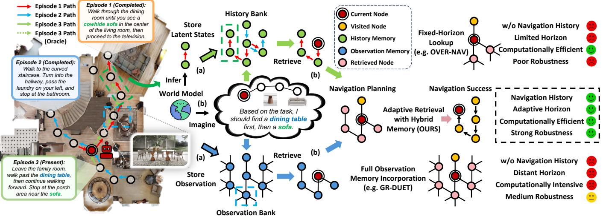
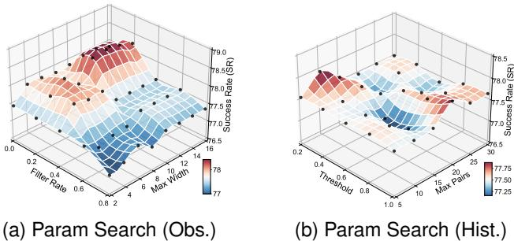
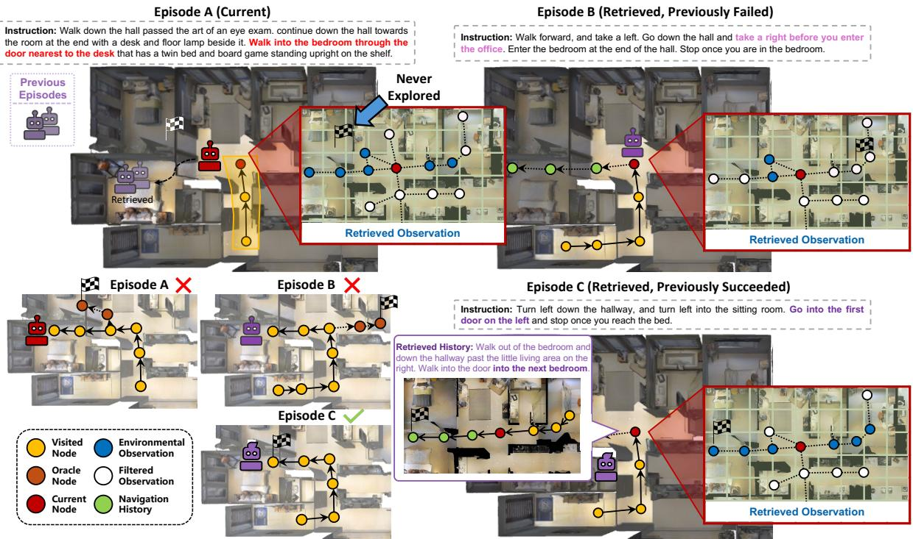

# 1. 论文基本信息

## 1.1. 标题
**Dream to Recall: Imagination-Guided Experience Retrieval for Memory-Persistent Vision-and-Language Navigation**

中文翻译：**梦想以回忆：用于记忆持久性视觉与语言导航的想象引导式经验检索**

这篇论文的核心主题是为<strong>视觉与语言导航 (Vision-and-Language Navigation, VLN)</strong> 任务设计一种更高效、更智能的长期记忆机制。标题中的“Dream to Recall”（梦想以回忆）生动地概括了其核心思想：智能体通过“想象”（Dream）未来的导航路径，来决定应该从过去的经验中“回忆”（Recall）哪些最相关的信息，从而做出更好的导航决策。这主要应用于需要长期运行并不断学习的“记忆持久性”导航场景。

## 1.2. 作者
Yunzhe Xu, Yiyuan Pan, Zhe Liu

这些作者是人工智能，特别是具身智能和计算机视觉领域的研究人员。虽然论文没有明确列出他们的隶属机构，但从论文的引用风格和研究方向来看，他们很可能来自顶尖的学术研究机构或企业AI实验室。

## 1.3. 发表期刊/会议
论文元数据显示其发表于 UTC 时间 `2025-10-09T17:58:01.000Z`。这是一个未来的日期，表明这篇论文是一份<strong>预印本 (Preprint)</strong>，很可能正在或准备提交给2025年的顶级人工智能会议，如 **ICLR (International Conference on Learning Representations)**、**CVPR (Conference on Computer Vision and Pattern Recognition)** 或 **NeurIPS (Conference on Neural Information Processing Systems)**。这些会议在人工智能领域享有极高的声誉和影响力。

## 1.4. 发表年份
2025 (根据预印本信息)

## 1.5. 摘要
本文聚焦于<strong>记忆持久性视觉与语言导航 (memory-persistent VLN)</strong>，这类任务要求智能体在多轮导航中持续积累经验并提升性能。现有方法存在两大关键局限：
1.  **无效的记忆访问机制**：它们要么将所有记忆全部加载（计算开销大且引入噪声），要么采用固定的范围查找（可能丢失重要信息）。
2.  **忽略行为模式**：它们大多只存储环境的视觉观察，而忽略了编码了宝贵决策策略的导航行为模式。

    为了解决这些问题，论文提出了一个名为 **`Memoir`** 的新框架。`Memoir` 的核心思想是**使用想象力作为一种检索机制**。它通过一个<strong>世界模型 (world model)</strong> 来想象未来的导航状态，并将这些“想象”作为查询，以选择性地从一个显式的记忆库中检索相关的**环境观察**和**行为历史**。

该方法主要包含三个部分：
1.  一个**语言条件的世界模型**，其想象的未来状态有两个用途：一是将当前经验编码后存入记忆；二是生成用于检索的查询。
2.  一个<strong>混合视点级记忆库 (Hybrid Viewpoint-Level Memory, HVM)</strong>，它将环境观察和行为模式都与具体的视点（viewpoint）关联起来，从而实现对两种信息的混合检索。
3.  一个**经验增强的导航模型**，它通过专门的编码器整合检索到的知识，以做出更明智的决策。

    在10个不同的记忆持久性VLN测试场景中进行的大量实验表明，`Memoir` 在所有场景下都取得了显著提升。例如，在 `IR2R` 数据集上，其**SPL (Success Rate penalized by Path Length)** 指标比目前最好的基线模型高出 **5.4%**。同时，它还带来了 **8.3倍** 的训练速度提升和 **74%** 的推理时内存减少。分析表明，这种想象引导的范式还有巨大的提升空间。

## 1.6. 原文链接
*   **原文链接:** https://arxiv.org/abs/2510.08553
*   **PDF 链接:** https://arxiv.org/pdf/2510.08553v1.pdf
*   **发布状态:** 本文目前是 <strong>预印本 (Preprint)</strong> 状态，发布于 arXiv 平台。

# 2. 整体概括

## 2.1. 研究背景与动机
### 2.1.1. 核心问题
传统的<strong>视觉与语言导航 (VLN)</strong> 任务通常是“一次性”的：智能体在一个任务（episode）结束后，会完全忘记所有经验，下一个任务从零开始。这极大地限制了其在需要持续运行的真实世界场景（如家庭服务机器人）中的应用。为了解决这个问题，学术界提出了<strong>记忆持久性导航 (Memory-Persistent Navigation)</strong> 任务，要求智能体能够跨任务积累经验，变得越来越“熟悉”环境。

然而，现有的记忆持久性方法在“如何利用记忆”上做得并不好。它们面临两大挑战：

1.  **如何有效访问记忆？**
    *   一些方法简单粗暴地将过去所有的经历（如完整的导航轨迹或环境地图）全部加载进来。这不仅计算成本极高，而且会引入大量与当前任务无关的“噪声”信息，反而干扰决策。
    *   另一些方法则采用固定的、短视的查找方式，比如只看周围一定范围内的记忆。这又可能导致智能体错过远处但至关重要的信息。

2.  **应该记住什么？**
    *   现有方法大多只关注存储<strong>环境观察 (Environmental Observations)</strong>，即“在某个地方看到了什么”。
    *   它们普遍忽略了同样宝贵的<strong>导航行为模式 (Navigation Behavioral Patterns)</strong>，即“在那种情况下，我是如何思考并做出行动选择的”。这种行为历史包含了智能体对指令的理解方式和决策策略，是宝贵的经验知识。

### 2.1.2. 创新思路
本文的作者从人类导航的方式中获得启发：当我们在一个熟悉的地方规划路线时，我们常常会在脑海中<strong>进行心理模拟或“想象” (imagination)</strong>。例如，“我想去楼下的咖啡店，我可能会先经过大厅，然后左转……”。这个“想象”的过程，自然而然地会触发我们回忆起与这条想象路线相关的过去经验，比如“哦对了，上次左转后那个门是锁的，我得走另一边”。

基于此，论文提出了一个全新的切入点：**将“想象”作为一种主动的、有目的的记忆检索机制**。智能体不再被动地接收所有记忆，而是：
1.  **主动“想象”**：根据当前指令和位置，预测自己接下来可能会去哪里。
2.  **用“想象”作为查询**：将这些想象出的未来状态作为“关键词”，去庞大的记忆库中搜索最匹配的过往经验。
3.  **检索混合记忆**：不仅检索“在那些地方看到了什么”（环境观察），还检索“当我对未来有类似预期时，我过去是怎么做的”（行为模式）。

    这种“<strong>梦想以回忆 (Dream to Recall)</strong>”的范式，旨在让记忆的利用变得更加**高效、选择性和智能化**。

## 2.2. 核心贡献/主要发现
本文的核心贡献可以总结为以下两点：

1.  **提出了一种新的记忆检索范式**：
    首次提出了<strong>想象引导式经验检索 (Imagination-Guided Experience Retrieval)</strong> 范式。这一范式的创新之处在于，它将<strong>世界模型 (world model)</strong> 的预测能力（想象）与<strong>显式记忆 (explicit memory)</strong> 的存储能力相结合。想象不再是孤立的规划，而是作为一种<strong>接地气的 (grounded)</strong> 查询生成器，确保检索到的经验与智能体的当前意图直接相关，从而有效过滤无关信息。

2.  <strong>设计并验证了一个统一的框架 <code>Memoir</code></strong>：
    `Memoir` 是实现上述范式的具体技术方案。它巧妙地集成了三个关键组件：
    *   **语言条件的世界模型**：负责编码历史和生成想象。
    *   <strong>混合视点级记忆 (HVM)</strong>：同时存储和管理环境与行为两种记忆。
    *   **经验增强的导航模型**：负责整合检索到的知识并做出决策。

        通过这个框架，论文得出了以下关键发现：
*   **有效性**：选择性地检索**环境**和**行为**两种记忆，比仅使用其中一种或全部使用，能带来更有效的导航。实验结果显示，在 `IR2R` 基准测试中，`Memoir` 的 `SPL` 指标比最强的基线模型提升了 **5.4%**。
*   **高效性**：由于避免了加载全部记忆，`Memoir` 在计算效率上取得了巨大优势，实现了 **8.3倍** 的训练加速和 **74%** 的推理内存削减，使其在资源受限的设备上部署成为可能。
*   **巨大潜力**：通过与一个“理想”的、总能检索到正确记忆的“神谕”模型 (`oracle`) 对比，发现 `Memoir` 的性能（73.3% SPL）与理论上限（93.4% SPL）之间仍有巨大差距。这表明，**提升世界模型的想象能力**是未来工作的关键方向，该范式潜力巨大。

# 3. 预备知识与相关工作

## 3.1. 基础概念

### 3.1.1. 视觉与语言导航 (Vision-and-Language Navigation, VLN)
VLN是一项典型的<strong>具身AI (Embodied AI)</strong> 任务。它要求一个智能体（如机器人）能够理解自然语言指令，并在一个（通常是三维的）虚拟环境中，仅依靠其第一人称视角下的视觉观察，导航到指定的目标位置。
*   **输入**: 一条自然语言指令（如：“从沙发后面走，进入厨房，在冰箱前停下”）和智能体当前的视觉画面。
*   **动作**: 智能体可以在离散的导航点之间移动（前进、左转、右转）或选择停止。
*   **目标**: 成功在指令描述的目标位置停止。
*   **示例**:

    
    *该图像是示意图，展示了基于记忆的视觉与语言导航(VLN)的流程。图中包括了历史银行、观察银行和导航成功的不同策略，以及通过世界模型进行的想象和检索过程。主要内容强调了记忆检索的适应性和导航的成功率。*

    上图展示了VLN任务的一个例子。智能体根据指令“走向按摩床”，需要在一系列可能的导航点中选择正确的路径。

### 3.1.2. 记忆持久性导航 (Memory-Persistent Navigation)
这是VLN任务的一个进阶变种。与传统VLN中每个任务（episode）都是独立的、健忘的不同，记忆持久性导航要求智能体在一系列连续的任务中**积累经验**。智能体在同一个环境中执行多个导航任务，并被期望能够利用从先前任务中获得的知识（如环境布局、物体位置等），在后续任务中表现得更好。这更贴近真实世界机器人的应用场景。

### 3.1.3. 世界模型 (World Model)
世界模型是一种能够学习环境动态的生成模型。通俗地说，它试图在自己的“头脑”中构建一个关于世界如何运转的微缩模型。给定当前状态和将要执行的动作，一个好的世界模型可以<strong>预测 (或“想象”)</strong> 出下一个状态会是什么样子。
在本文中，世界模型的核心作用是**生成想象的未来轨迹**，这些轨迹随后被用作检索记忆的查询。

### 3.1.4. 拓扑图 (Topological Graph)
在导航任务中，环境可以被表示为一个拓扑图 $\mathcal{G} = (\mathcal{V}, \mathcal{E})$。
*   <strong>节点 (Nodes, $\mathcal{V}$)</strong>: 代表环境中可以导航到达的离散位置点，也称为<strong>视点 (viewpoints)</strong>。
*   <strong>边 (Edges, $\mathcal{E}$)</strong>: 代表两个视点之间是直接可通行的。
    智能体在导航时，本质上是在这个图上从一个节点移动到另一个节点。这种表示方式比精细的几何地图（如点云地图）更轻量、更抽象。

## 3.2. 前人工作

### 3.2.1. 单 эпизод VLN 模型
早期的VLN研究主要集中在如何更好地完成单个、独立的导航任务。
*   **历史记忆**: 模型如 `HAMT` [20] 使用循环网络（如LSTM或Transformer）来记住智能体在当前任务中已经走过的路径和看到过的景象。
*   **结构化空间记忆**: 为了更好地理解空间关系，`DUET` [9] 等模型引入了<strong>拓扑观察记忆 (topological observation memory)</strong>。智能体在探索时会动态构建一个局部的拓扑图，这使得它能进行更长远的规划。

**`DUET` 模型详解:**
由于本文的方法是基于 `DUET` 扩展而来的，理解 `DUET` 至关重要。`DUET` 的核心思想是“<strong>全局思考，局部行动 (Think Global, Act Local)</strong>”，它通过两个并行的规划器来实现：
1.  <strong>粗尺度规划器 (Coarse-Scale Planner)</strong>: 在智能体已经探索过的**拓扑图**上进行全局规划。它评估图中所有已知节点（包括遥远的节点）作为潜在目标的可能性。
2.  <strong>细尺度规划器 (Fine-Scale Planner)</strong>: 在当前位置的**全景图**上进行局部规划。它只关注与当前位置直接相邻的可行走方向。
    最后，模型动态地融合这两个规划器的评分，做出最终的行动决策。其中，粗尺度规划器使用了一种名为<strong>图感知自注意力 (Graph-Aware Self-Attention, GASA)</strong> 的机制，其计算公式为：
$$
\mathrm { GASA } ( X ) = \mathrm { Softmax } \left( \frac { X W _ { q } ( X W _ { k } ) ^ { T } } { \sqrt { d } } + M \right) X W _ { v }
$$
*   **公式解释**: 这是一个标准的自注意力公式，但增加了一个关键项 $M$。
    *   $X$: 图中所有节点（视点）的特征表示矩阵。
    *   $W_q, W_k, W_v$: 可学习的权重矩阵，用于生成查询、键和值。
    *   $M = E W_e + b_e$: **距离编码矩阵**。$E$ 是一个矩阵，存储了图中任意两个节点之间的最短路径距离。$M$ 将这个纯粹的距离信息编码成一个偏置项，注入到注意力计算中。这使得注意力机制不仅关注节点间的特征相似性，还能感知到它们的**空间距离**，从而做出更合理的全局规划。

### 3.2.2. 记忆持久性 VLN 模型
为了让智能体能够跨任务学习，研究者们探索了不同的长期记忆方案。
*   `TourHAMT` [5]: 直接将过去所有任务的完整导航序列堆叠起来作为记忆。这种方法简单，但很快会因为信息冗余而导致性能下降。
*   `GR-DUET` [6]: 这是本文的一个重要基线。它扩展了 `DUET`，让智能体**保留所有**在过去任务中构建的拓扑图记忆。这虽然提升了性能，但随着探索的增加，记忆库会无限膨胀，导致巨大的计算和内存开销。
*   `OVER-NAV` [7] 和 `MAPCMA` [5]: 这些方法尝试构建全局地图，并使用固定距离或范围的查找来检索记忆，但这种固定的访问方式不够灵活。

### 3.2.3. 世界模型
世界模型在模型 기반 强化学习中取得了巨大成功。
*   `RSSM` [34]: <strong>循环状态空间模型 (Recurrent State-Space Model)</strong> 是其中的主流架构。它使用一个循环神经网络来处理历史信息，并结合变分自编码器的思想，在低维的<strong>潜空间 (latent space)</strong> 中对世界状态进行建模和预测。
*   <strong>对比变分世界模型 (Contrastive Variational World Model)</strong> [35, 39]: 传统的生成式世界模型需要从潜状态重构出高维的图像，计算成本高且细节容易模糊。对比学习的方法巧妙地回避了这一点，它不要求模型“画出”未来的图像，而只要求模型能<strong>“区分”</strong> 出哪个潜状态对应哪个真实的未来图像。这是通过一个<strong>对比损失 (contrastive loss)</strong> 实现的，大大提升了训练效率。本文的世界模型正是基于这种对比学习的范式。

## 3.3. 技术演进
VLN领域关于记忆机制的演进路线大致如下：
1.  **无记忆**: 最早期的模型，每一步决策都是独立的。
2.  <strong>短期（任务内）记忆</strong>: 使用 `RNN` 或 `Transformer` 记录当前任务的轨迹，代表作如 `HAMT`。
3.  **结构化短期记忆**: 引入拓扑图等结构来组织任务内的空间信息，代表作如 `DUET`。
4.  <strong>长期（跨任务）记忆 - 朴素方法</strong>: 开始探索跨任务学习，采用简单的方法如堆叠历史 (`TourHAMT`)或保留所有地图 (`GR-DUET`)。这些方法证明了长期记忆的潜力，但也暴露了效率和可扩展性问题。
5.  <strong>长期记忆 - 选择性访问 (本文)</strong>: `Memoir` 标志着一个新的阶段。它不再是“记住所有”或“记住部分”，而是提出了一套**智能化的访问机制**。通过“想象”来主动、按需地从庞大的记忆库中检索信息，实现了性能和效率的统一。

## 3.4. 差异化分析
与之前的相关工作相比，`Memoir` 的核心区别和创新点在于：
*   <strong>vs. `GR-DUET` (完整记忆)</strong>: `GR-DUET` 是“存储所有，使用所有”，而 `Memoir` 是“存储所有，**选择性使用**”。`Memoir` 通过想象引导的检索机制，主动过滤无关信息，从而更高效、更精准。
*   <strong>vs. `TourHAMT` (历史堆叠)</strong>: `TourHAMT` 仅堆叠行为历史，且不加区分。`Memoir` 不仅同时存储**行为历史**和**环境观察**，还通过与视点锚定将它们统一起来，并使用智能检索。
*   <strong>vs. 传统世界模型 (规划)</strong>: 传统世界模型通常用于在潜空间中进行<strong>想象规划 (imagine-planning)</strong>，即在“梦境”中直接规划出一条完整的路径。而 `Memoir` 的世界模型用途不同，它将“想象”作为**查询生成器**，去查询一个**显式的、真实的**记忆库，从而使想象“接地气”，避免了纯粹想象可能带来的“幻觉”问题。

# 4. 方法论

本节将深入拆解 `Memoir` 框架的三个核心组件。其整体工作流程如下图所示：

*该图像是一幅示意图，展示了Memoir模型的三个主要组件：世界模型、混合视点级记忆和导航模型。图中包含了不同的导航历史和观测数据，通过对比损失（`Contrastive Loss`）和检索机制，增强了环境信息和行为记忆的使用，提升了视觉和语言导航的有效性。*

上图展示了 `Memoir` 的三大模块：(1) <strong>世界模型 (World Model)</strong> 负责想象未来并编码历史；(2) <strong>混合视点级记忆 (Hybrid Viewpoint-Level Memory)</strong> 存储过去的观察和行为；(3) <strong>导航模型 (Navigation Model)</strong> 整合所有信息进行决策。

## 4.1. 方法原理
`Memoir` 的核心思想是模仿人类的“心理模拟”导航方式。智能体在每一步决策前，都会利用其内部的**世界模型**来“想象”或预测接下来的几个步骤可能会发生什么。这个想象出的短轨迹（一系列未来状态）就像一个“搜索计划”，被用来从一个庞大的、持久的记忆库中检索两种信息：
1.  **环境记忆**：与想象路径上的地点相匹配的过去视觉观察（“我想象我会走到客厅，我以前在客厅看到过什么？”）。
2.  **行为记忆**：过去当智能体也曾有过类似“想象”时，它最终采取了什么行动序列（“上次我也想去客厅时，我是怎么走的？”）。

    这两种检索到的记忆会极大地丰富智能体对当前情况的理解，并被送入一个增强的导航模型，以做出更明智、更具前瞻性的决策。

## 4.2. 核心方法详解 (逐层深入)

### 4.2.1. 语言条件的世界模型 (Language-Conditioned World Model)
这是 `Memoir` 的“想象力”引擎。它的目标是学习一个能够根据<strong>语言指令 ($\ell$)</strong> 预测环境动态的模型。它基于<strong>对比变分世界模型 (Contrastive Variational World Model)</strong> 构建，但进行了扩展以适应VLN任务。

模型的训练目标是最大化证据下界 (Evidence Lower Bound, ELBO)，其公式如下：
$$
\ln p ( o , \gamma \mid \ell ) \geq \sum _ { t = 1 } ^ { T } \Big ( \mathbb { E } _ { q ( z _ { t } \mid o _ { \le t } , \ell ) } \Big [ \underline { { \ln p ( \gamma _ { t } \mid z _ { t } ) } } \Big ] + \mathbb { E } _ { q ( z _ { t } \mid o _ { \le t } , \ell ) } \Big [ \underline { { \ln p ( z _ { t } \mid o _ { t } ) - \ln \sum _ { o ^ { \prime } \in \mathcal { D } } p ( z _ { t } \mid o ^ { \prime } ) } } \Big ] - \mathbb { E } _ { q ( z _ { t - 1 } \mid o _ { \le t } , \ell ) } \Big [ \underline { { \mathrm { K L } \big [ q ( z _ { t } \mid o _ { \le t } , \ell ) \big ] \mid p \big ( z _ { t } \mid z _ { t - 1 } \big ) } } \Big ] \Big ) 
$$
*   **公式解释**: 这个目标函数由三部分组成：
    1.  <strong>奖励预测项 ($\ln p(\gamma_t | z_t)$)</strong>: 训练模型根据潜状态 $z_t$ 预测奖励 $\gamma_t$（此处为到目标的距离）。这使得模型能够判断想象的路径是否正在接近目标，对于决定想象何时停止至关重要。
    2.  <strong>对比项 ($\ln p(z_t | o_t) - \ln \sum_{o' \in \mathcal{D}} p(z_t | o')$)</strong>: 这是<strong>噪声对比估计 (Noise-Contrastive Estimation, NCE)</strong> 的形式。它不要求模型从潜状态 $z_t$ 重构出真实的观察 $o_t$，而是要求模型能够将 $z_t$ 与其对应的真实观察 $o_t$ 匹配起来（提高 $p(z_t|o_t)$），同时与一个 mini-batch 中的其他负样本观察 $o'$ 区分开（降低 $p(z_t|o')$）。这使得模型学习到的潜状态 $z_t$ 能够蕴含丰富的视觉信息。
    3.  <strong>KL散度项 ($\mathrm{KL}[\dots]$)</strong>: 这是一个正则化项。它约束了从真实观察推断出的后验状态 $q(z_t | o_{\le t}, \ell)$ 不要偏离模型根据历史预测出的先验状态 $p(z_t | z_{t-1})$ 太远，保证了模型动态预测的连贯性。

        为了实现对比项，模型需要一个函数来衡量潜状态 $z_t$ 和观察 $o_t$ 之间的<strong>兼容性 (compatibility)</strong>，定义如下：
$$
\begin{array} { l } { { f ( z _ { t } , o _ { t } ) = \displaystyle \frac { 1 } { \zeta } \sin ( \psi _ { s } ( z _ { t } ) , \psi _ { o } ( x _ { t } ) ) } } \\ { { p ( z _ { t } \mid o _ { t } ) \propto \exp ( f ( z _ { t } , o _ { t } ) ) , } } \end{array}
$$
*   **公式解释**:
    *   $x_t$: 从全景观察 $o_t$ 中提取的视觉特征。
    *   $\psi_s$ 和 $\psi_o$: 两个可学习的嵌入函数，分别将潜状态 $z_t$ 和视觉特征 $x_t$ 映射到同一个共享的嵌入空间。
    *   $\sin(a, b)$: 计算两个向量的<strong>余弦相似度 (cosine similarity)</strong>。
    *   $\zeta$: 温度参数，用于调节分布的平滑度。
        这个兼容性函数是后续进行记忆检索的关键，因为它提供了一种度量“想象的状态”和“真实的观察”之间相似性的方法。

为了提升模型的远见，论文还引入了<strong>多步过射 (multi-step overshooting)</strong> 训练。即不仅要求模型预测下一步，还要求它能连续预测未来 $D$ 步，并让每一步的预测都尽可能准确。最终的优化目标 $\mathcal{T}$ 是所有步数（从1到D）的损失之和。

在架构上，该世界模型采用了经典的<strong>循环状态空间模型 (Recurrent State-Space Model, RSSM)</strong>，包含四个关键模块：
*   <strong>推理模型 (Inference Model)</strong>: 从当前观察 $o_t$ 和历史信息中推断出当前最准确的潜状态 $z_t$。
*   <strong>转移模型 (Transition Model)</strong>: 根据上一时刻的状态 $z_{t-1}$，预测（想象）出当前时刻的潜状态 $\hat{z}_t$。**这是“想象力”的来源**。
*   <strong>兼容性模型 (Compatibility Model)</strong>: 计算潜状态和观察之间的相似度。
*   <strong>奖励模型 (Reward Model)</strong>: 预测当前状态离目标的距离。

### 4.2.2. 混合视点级记忆 (Hybrid Viewpoint-Level Memory, HVM)
这是 `Memoir` 的“记忆库”，它由两个部分组成，都围绕一个持久化的环境拓扑图 $\mathcal{G}^{(k)}$ 进行组织：

1.  <strong>观察库 (Observation Bank, $\mathcal{M}_o$)</strong>: 一个键值对存储。
    *   **键**: 视点 (viewpoint) 的ID。
    *   **值**: 该视点的视觉特征 $x_j$（从全景图中提取）。
    *   **作用**: 存储“在什么地方看到了什么”。

2.  <strong>历史库 (History Bank, $\mathcal{M}_h$)</strong>: 存储更复杂的行为信息。
    *   **键**: 视点 (viewpoint) 的ID。
    *   **值**: 一个列表，包含了每次访问该视点时记录的信息，每条记录包括：
        *   当时推断出的潜状态 $z_j^{(k)}$。
        *   当时想象出的未来轨迹 $\tau_j^{(k)}$。
    *   **作用**: 存储“在某个地方时，我正在思考什么（对未来的预期）”。

        在每个时间步 $t$，智能体会将当前的视点特征 $x_t$、推断状态 $z_t$ 和想象轨迹 $\tau_t$ 存入这两个库中。

#### <strong>环境观察检索 (Environmental Observation Retrieval)</strong>
此过程旨在回答：“根据我的想象，我应该去关注过去看到的哪些地方？”

<strong>算法流程 (如 Algorithm 1 所述):</strong>
1.  **生成查询**: 智能体在当前位置 $v_t$ 生成一个想象轨迹 $\tau_t = \{\hat{z}_{t+i}\}_{i=1}^{H_t}$。
2.  **逐级搜索**: 对于想象中的第 $i$ 步（对应状态 $\hat{z}_{t+i}$），算法在持久拓扑图 $\mathcal{G}^{(k)}$ 中搜索与 $v_t$ 距离为 $i$ 的所有邻居节点 $\mathcal{N}_i(v_t)$。
3.  **计算兼容性**: 对于每个邻居节点 $v_j \in \mathcal{N}_i(v_t)$，计算其存储在 $\mathcal{M}_o$ 中的视觉特征 $x_j$ 与想象状态 $\hat{z}_{t+i}$ 的兼容性得分：
    $$
    c _ { i , j } = \frac { 1 } { 2 } ( \sin ( \psi _ { s } ( \hat { z } _ { t + i } ) , \psi _ { o } ( x _ { j } ) ) + 1 ) 
    $$
    *   **公式解释**: 这是对公式(6)中余弦相似度的一个归一化，将得分范围调整到 `[0, 1]`。
4.  **过滤与选择**: 对得分进行排序，并通过一个带衰减的百分比过滤器（保留前 $(1 - \rho_o \cdot \gamma_o^{i-1})$ 的节点）和一个Top-W截断，选出最相关的少数几个候选视点。衰减因子 $\gamma_o$ 使得对更远的想象步骤的检索更加宽松。
5.  **更新情节图**: 将所有被选中的视点以及从当前位置 $v_t$ 到它们的**最短路径**，一起加入到当前任务的临时拓扑图 $\mathcal{G}_t$ 中。

#### <strong>导航历史检索 (Navigation History Retrieval)</strong>
此过程旨在回答：“过去有没有哪次，我的‘想法’和现在很像？那次我是怎么做的？”

<strong>算法流程 (如 Algorithm 2 所述):</strong>
1.  **获取历史模式**: 从历史库 $\mathcal{M}_h$ 中，取出所有在当前视点 $v_t$ 存储过的历史导航模式（即过去的想象轨迹 $\tau'$）。
2.  **序列匹配**: 将当前的想象轨迹 $\tau_t$ 与每个历史轨迹 $\tau'$ 进行**逐帧比较**。在第 $i$ 步，计算当前想象状态 $\hat{z}_{t+i}$ 和历史想象状态 $\hat{z}'_i$ 的兼容性：
    $$
    c _ { i } = \frac { 1 } { 2 } ( \sin ( \psi _ { s } ( \hat { z } _ { t + i } ) , \psi _ { s } ( \hat { z } _ { i } ^ { \prime } ) ) + 1 ) 
    $$
    *   **公式解释**: 注意这里是两个潜状态 $\psi_s(\cdot)$ 之间的比较，衡量的是“想法”的相似度。
3.  **匹配与截断**: 匹配过程会一直持续，直到两条轨迹中较短的一条结束，或者某一步的兼容性得分 $c_i$ 低于一个带衰减的阈值 $\theta_h \cdot \gamma_h^{i-1}$。
4.  **排序与选择**: 根据**匹配的长度**（越长越好）和**匹配段的最低分**（越高越好）对所有历史模式进行排序，选出最匹配的 Top-P 个模式。
5.  **更新情节图**: 对于每个被选中的历史模式，将其对应的导航路径（视点、潜状态等信息）也加入到当前的情节图 $\mathcal{G}_t$ 中。

### 4.2.3. 导航模型 (Navigation Model)
这个模块负责利用当前观察和所有检索到的信息，做出最终的导航决策。它扩展了 `DUET` 的双尺度架构，包含三个专门的编码器分支：

1.  <strong>粗尺度编码器 (Coarse-Scale Encoder)</strong>: 与 `DUET` 类似，处理全局拓扑图。但现在这个图 $\mathcal{G}_t$ 已经被**环境观察检索**的结果所扩充，包含了更多远处的、但可能相关的节点。它输出全局的动作分数 $s_j^{(c)}$。

2.  <strong>细尺度编码器 (Fine-Scale Encoder)</strong>: 与 `DUET` 相同，处理当前位置的全景视觉特征 $r_t$，关注直接相邻的动作。它输出局部的动作分数 $s_j^{(f)}$。

3.  <strong>导航历史编码器 (Navigation-History Encoder)</strong>: 这是 `Memoir` 新增的模块，专门处理**导航历史检索**的结果。对于图中的每个节点 $v_j$，如果它有关联的被检索出的历史状态 $Z'_j = [z'^{(1)}_j, \dots]$ 和对应的兼容性分数 $C_j = [c^{(1)}_j, \dots]$，该编码器会通过以下方式融合这些信息：
    $$
    u _ { j } = \left( \operatorname { s o f t m a x } \left( \frac { C _ { j } } { \zeta } \right) \right) ^ { \top } Z _ { j } + x _ { j } 
    $$
    *   **公式解释**:
        *   $Z_j$ 是一个矩阵，包含了在 $v_j$ 处检索到的所有历史状态。
        *   $\mathrm{softmax}(C_j / \zeta)$ 将兼容性分数转换为一个注意力权重。
        *   整个第一项是一个加权平均，用注意力权重来聚合所有相关的历史状态，得到一个“历史共识”状态。
        *   最后再加上当前节点的视觉特征 $x_j$，得到融合了历史行为模式的节点表示 $u_j$。
            这些融合后的表示 $U$ 会被送入一个 Transformer，输出基于历史的动作分数 $s_i^{(h)}$。

#### <strong>动态融合 (Dynamic Fusion)</strong>
最后，模型需要决定在当前情况下，应该更相信哪个编码器的建议。它通过一个学习到的动态融合机制来实现：
$$
[ \sigma _ { f } , \sigma _ { c } , \sigma _ { h } ] = { \mathrm { Softmax } } ( { \mathrm { FFN } } ( [ \hat { r } _ { 0 } ; \hat { x } _ { 0 } ; \hat { u } _ { 0 } ] ) )
$$
*   **公式解释**:
    *   $\hat{r}_0, \hat{x}_0, \hat{u}_0$ 分别是三个编码器输出中对应“停止”动作的特征表示。模型认为这些特征蕴含了对当前整体情况的判断。
    *   将它们拼接后送入一个前馈网络 (FFN) 和 Softmax，得到三个权重 $\sigma_f, \sigma_c, \sigma_h$，分别代表细尺度、粗尺度和历史编码器的重要性。

        最终的导航动议分数是三个分支分数的加权和：
$$
s _ { j } = \sigma _ { f } s _ { j } ^ { ( f ^ { \prime } ) } + \sigma _ { c } s _ { j } ^ { ( c ) } + \sigma _ { h } s _ { j } ^ { ( h ^ { \prime } ) } 
$$
智能体会选择分数最高的动作 $a_t = \arg\max_j s_j$ 来执行。

整个导航循环由 **Algorithm 3** 总结，清晰地展示了从推断、想象、检索到行动的完整流程。

# 5. 实验设置

## 5.1. 数据集
实验在两个为记忆持久性导航设计的标准基准数据集上进行：

1.  **Iterative Room-to-Room (IR2R)** [5]:
    *   **来源**: 扩展自经典的 `R2R` 数据集。
    *   **特点**: 它将 `R2R` 中的单个任务组织成结构化的“<strong>游览 (tours)</strong>”。一个游览包含在一个大场景（如一栋房子）中的一系列连续导航任务。
    *   **规模**: 训练集包含183个游览，平均每个游览长达76.6个任务。验证集分为“已见环境”和“未见环境”两部分，其中未见环境的游览更长（平均71.2个任务），更考验模型的泛化和长期学习能力。
    *   **适用性**: 非常适合评估智能体在同一环境中通过多次任务积累经验的能力。

2.  **General Scene Adaptation (GSA-R2R)** [6]:
    *   **来源**: 基于 `Habitat-Matterport3D (HM3D)` [51] 场景构建。
    *   **特点**: 规模宏大，场景多样。包含了150个不同的3D场景，覆盖了住宅和非住宅环境。指令类型也极为丰富，包括基本导航指令、场景特定描述和**用户个性化指令**（如“像Sheldon一样说话”）。
    *   **规模**: 总共包含90,000个任务，分为10个不同的评估场景。每个场景平均有600个任务，提供了非常密集的经验积累机会。
    *   **适用性**: 极好地测试了模型在多样化环境和语言风格下的适应能力和记忆利用能力。

## 5.2. 评估指标
论文使用了标准的VLN评估指标和四项专门为评估记忆检索质量而设计的新指标。

### 5.2.1. 标准导航指标

1.  <strong>轨迹长度 (Trajectory Length, TL)</strong>
    *   **概念定义**: 智能体完成任务所走过的路径总长度，单位是米。该指标越低越好。
    *   **数学公式**: $TL = \sum_{t=1}^{N-1} \text{distance}(v_t, v_{t+1})$
    *   **符号解释**:
        *   $v_t$: 智能体在时间步 $t$ 的位置。
        *   $N$: 轨迹中的总步数。
        *   $\text{distance}(v_t, v_{t+1})$: 两个连续位置之间的欧氏距离。

2.  <strong>导航误差 (Navigation Error, NE)</strong>
    *   **概念定义**: 智能体停止位置与目标位置之间的最短路径距离，单位是米。该指标越低越好。
    *   **数学公式**: $NE = \text{shortest\_path\_distance}(v_{final}, v_{goal})$
    *   **符号解释**:
        *   $v_{final}$: 智能体最终停止的位置。
        *   $v_{goal}$: 真实的目标位置。
        *   $\text{shortest\_path\_distance}$: 导航图中两点之间的最短路径长度。

3.  <strong>成功率 (Success Rate, SR)</strong>
    *   **概念定义**: 导航任务成功的比例。当导航误差（NE）小于3米时，任务被认为是成功的。该指标越高越好。
    *   **数学公式**: $SR = \frac{1}{N_{total}} \sum_{i=1}^{N_{total}} \mathbb{I}(NE_i < 3.0)$
    *   **符号解释**:
        *   $N_{total}$: 总任务数量。
        *   $NE_i$: 第 $i$ 个任务的导航误差。
        *   $\mathbb{I}(\cdot)$: 指示函数，当条件为真时为1，否则为0。

4.  <strong>路径长度加权成功率 (Success Rate penalized by Path Length, SPL)</strong>
    *   **概念定义**: 这是VLN任务中最核心的综合性指标。它同时衡量了**效率**（路径是否最短）和**效果**（是否成功）。只有当任务成功时，该指标才不为零。智能体走的路径越接近最短路径，得分越高。该指标越高越好。
    *   **数学公式**: `SPL = \frac{1}{N_{total}} \sum_{i=1}^{N_{total}} S_i \frac{L_i}{\max(P_i, L_i)}`
    *   **符号解释**:
        *   $S_i$: 第 $i$ 个任务是否成功的标志（1或0）。
        *   $L_i$: 第 $i$ 个任务中，从起点到目标点的**最短路径长度**。
        *   $P_i$: 第 $i$ 个任务中，智能体实际走过的**路径长度**。

5.  <strong>归一化动态时间规整 (normalized Dynamic Time Warping, nDTW)</strong>
    *   **概念定义**: 衡量智能体实际轨迹与专家（最短路径）轨迹在形状上的相似度，不受速度变化影响。它越高，说明智能体“走对了路”，即使步数可能不同。
    *   **数学公式**: `nDTW = \exp(-k \cdot DTW(P_{agent}, P_{expert}) / L_{expert})`
    *   **符号解释**:
        *   $DTW(\cdot, \cdot)$: 计算两条轨迹之间的动态时间规整距离。
        *   $P_{agent}$: 智能体的轨迹。
        *   $P_{expert}$: 专家的轨迹（最短路径）。
        *   $L_{expert}$: 专家轨迹的长度。
        *   $k$: 一个缩放常数。

6.  <strong>游览归一化动态时间规整 (Tour-normalized Dynamic Time Warping, T-nDTW)</strong>
    *   **概念定义**: 在 `IR2R` 数据集上，衡量智能体在整个游览（tour）中的导航连贯性。

### 5.2.2. 记忆检索质量指标

1.  <strong>观察准确率 (Observation Accuracy, OA)</strong>
    *   **概念定义**: 衡量从**观察库**中检索出的视点有多大比例是真正有用的（即位于未来真实的最短路径上）。这是一个<strong>精确率 (Precision)</strong> 指标。
    *   **数学公式**:
        $$
        \mathrm { O A } = \frac { | \bigcup _ { t = 1 } ^ { T } ( \mathcal { R } _ { t } \cap \mathcal { V } _ { \mathrm { g t } , t } ^ { o } ) | } { | \bigcup _ { t = 1 } ^ { T } \mathcal { R } _ { t } | }
        $$
    *   **符号解释**:
        *   $\mathcal{R}_t$: 在时间步 $t$ 从观察库 $\mathcal{M}_o$ 中检索到的视点集合。
        *   $\mathcal{V}_{\mathrm{gt}, t}^{o}$: 在时间步 $t$ 的“真实”相关视点，定义为未来 $D$ 步最短路径上且已存在于观察库中的视点。
        *   $T$: 任务总步数。

2.  <strong>观察召回率 (Observation Recall, OR)</strong>
    *   **概念定义**: 衡量所有真正有用的视点中，有多大比例被成功检索出来了。这是一个<strong>召回率 (Recall)</strong> 指标。
    *   **数学公式**:
        $$
        \mathrm { O R } = \frac { \vert \bigcup _ { t = 1 } ^ { T } ( \mathcal { R } _ { t } \cap \mathcal { V } _ { \mathrm { g t } , t } ^ { o } ) \vert } { \vert \bigcup _ { t = 1 } ^ { T } \mathcal { V } _ { \mathrm { g t } , t } ^ { o } \vert }
        $$

3.  <strong>历史准确率 (History Accuracy, HA)</strong>
    *   **概念定义**: 衡量从**历史库**中检索出的导航模式（轨迹）有多大比例是真正相关的。这也是一个**精确率**指标。
    *   **数学公式**:
        $$
        \mathrm { H A } = \frac { \sum _ { t = 1 } ^ { T } \sum _ { j = 1 } ^ { | Q _ { t } | } | \mathcal { V } _ { \mathrm { t r a j } , t , j } ^ { h } \cap \mathcal { V } _ { \mathrm { g t } , t , j } ^ { h } | } { \sum _ { t = 1 } ^ { T } \sum _ { j = 1 } ^ { | Q _ { t } | } | \mathcal { V } _ { \mathrm { t r a j } , t , j } ^ { h } | }
        $$
    *   **符号解释**:
        *   $Q_t$: 在时间步 $t$ 检索到的历史模式集合。
        *   $\mathcal{V}_{\mathrm{traj}, t, j}^{h}$: 第 $j$ 个被检索出的历史轨迹上的视点序列。
        *   $\mathcal{V}_{\mathrm{gt}, t, j}^{h}$: 与该历史轨迹对应的“真实”相关视点。

4.  <strong>历史召回率 (History Recall, HR)</strong>
    *   **概念定义**: 衡量所有相关的历史模式中，有多大比例被成功检索。这是一个**召回率**指标。
    *   **数学公式**:
        $$
        \mathrm { H R } = \frac { \sum _ { t = 1 } ^ { T } \sum _ { j = 1 } ^ { \lvert Q _ { t } \rvert } \lvert \mathcal { V } _ { \mathrm { t r a j } , t , j } ^ { h } \cap \mathcal { V } _ { \mathrm { g t } , t , j } ^ { h } \rvert } { \sum _ { t = 1 } ^ { T } \sum _ { j = 1 } ^ { \lvert Q _ { t } \rvert } \lvert \mathcal { V } _ { \mathrm { g t } , t , j } ^ { h } \rvert }
        $$

## 5.3. 对比基线
论文将 `Memoir` 与两类模型进行了比较：
1.  **传统VLN模型**:
    *   `DUET` [9]: 一个强大的、基于拓扑图的单任务模型，是 `Memoir` 的架构基础。
    *   `ScaleVLN` [16]: 另一个在传统VLN任务上表现优异的模型。
        将 `Memoir` 应用于这些模型，可以验证其记忆机制是否能为非记忆持久性模型带来提升。

2.  **记忆持久性VLN模型**:
    *   `GR-DUET` [6]: **最主要的竞争对手**。它通过保留所有历史地图来实现记忆持久性，代表了“完整记忆”方法的SOTA。
    *   `TourHAMT` [5]: 代表了通过堆叠历史序列来实现记忆的方法。
    *   `OVER-NAV` [7]: 代表了通过构建全局图和固定范围查找来实现记忆的方法。

# 6. 实验结果与分析

## 6.1. 核心结果分析

### 6.1.1. 在 IR2R 数据集上的性能
以下是原文 Table 2 的结果，展示了在 IR2R 数据集上 `Memoir` 与其他方法的性能对比。

<table>
<thead>
<tr>
<th rowspan="2">Methods</th>
<th rowspan="2">PH</th>
<th rowspan="2">TH</th>
<th rowspan="2">PHI</th>
<th rowspan="2">IW</th>
<th colspan="5">Val Seen</th>
<th colspan="5">Val Unseen</th>
</tr>
<tr>
<th>TL↓</th>
<th>NE↓</th>
<th>nDTW↑</th>
<th>SR↑</th>
<th>SPL↑</th>
<th>t-nDTW↑</th>
<th>TL↓</th>
<th>NE↓</th>
<th>nDTW↑</th>
<th>SR↑</th>
<th>SPL↑</th>
<th>t-nDTW↑</th>
</tr>
</thead>
<tbody>
<tr>
<td>HAMT [20]</td>
<td></td>
<td></td>
<td></td>
<td></td>
<td>10.1 ±0.1</td>
<td>4.2 ±0.1</td>
<td>71 ±1</td>
<td>63 ±1</td>
<td>61 ±1</td>
<td>58 ±1</td>
<td>9.4 ±0.1</td>
<td>4.7 ±0.0</td>
<td>66 ±0</td>
<td>56 ±0</td>
<td>54 ±0</td>
<td>50 ±0</td>
</tr>
<tr>
<td>TourHAMT [5]</td>
<td>✓</td>
<td>✓</td>
<td>✓</td>
<td>✓</td>
<td>9.4 ±0.4</td>
<td>5.8 ±0.1</td>
<td>59 ±0</td>
<td>45 ±1</td>
<td>43 ±1</td>
<td>45 ±0</td>
<td>10.0 ±0.2</td>
<td>6.2 ±0.1</td>
<td>52 ±0</td>
<td>39 ±1</td>
<td>36 ±0</td>
<td>32 ±1</td>
</tr>
<tr>
<td>OVER-NAV [7]</td>
<td></td>
<td></td>
<td></td>
<td></td>
<td>9.9 ±0.1</td>
<td>3.7 ±0.1</td>
<td>73 ±1</td>
<td>65 ±1</td>
<td>63 ±1</td>
<td>62 ±0</td>
<td>9.4 ±0.1</td>
<td>4.1 ±0.1</td>
<td>69 ±0</td>
<td>60 ±1</td>
<td>57 ±0</td>
<td>55 ±1</td>
</tr>
<tr>
<td colspan="14"><b>Comparison with Traditional VLN Models:</b></td>
</tr>
<tr>
<td colspan="14">VLN models pretrained with default protocol:</td>
</tr>
<tr>
<td>DUET [9]</td>
<td></td>
<td></td>
<td></td>
<td></td>
<td>12.5 ±0.4</td>
<td>2.2 ±0.1</td>
<td>79.8 ±1.1</td>
<td>79.8 ±0.7</td>
<td>74.5 ±0.9</td>
<td>69.1 ±1.7</td>
<td>14.4 ±0.1</td>
<td>3.5 ±0.0</td>
<td>65.0 ±0.1</td>
<td>69.2 ±0.3</td>
<td>58.0 ±0.1</td>
<td>47.0 ±0.8</td>
</tr>
<tr>
<td>+Memoir (Ours)</td>
<td></td>
<td></td>
<td></td>
<td></td>
<td>11.5 ±0.1</td>
<td>2.6 ±0.2</td>
<td>78.9 ±0.9</td>
<td>77.1 ±0.5</td>
<td>72.8 ±0.5</td>
<td>68.0 ±0.8</td>
<td>11.0 ±0.0</td>
<td>2.8 ±0.1</td>
<td>75.2 ±0.0</td>
<td>75.4 ±0.2</td>
<td>69.1 ±0.3</td>
<td>58.8 ±0.4</td>
</tr>
<tr>
<td colspan="14">VLN models pretrained with environmental augmentation:</td>
</tr>
<tr>
<td>ScaleVLN [16]</td>
<td></td>
<td></td>
<td></td>
<td></td>
<td>12.8 ±0.0</td>
<td>2.2 ±0.0</td>
<td>79.6 ±0.4</td>
<td>79.5 ±0.5</td>
<td>74.1 ±0.6</td>
<td>67.0 ±0.2</td>
<td>13.5 ±0.0</td>
<td>2.7 ±0.0</td>
<td>71.6 ±0.1</td>
<td>76.2 ±0.1</td>
<td>66.5 ±0.2</td>
<td>53.4 ±0.2</td>
</tr>
<tr>
<td>+Memoir (Ours)</td>
<td></td>
<td></td>
<td></td>
<td></td>
<td>11.6 ±0.2</td>
<td>2.5 ±0.1</td>
<td>78.7 ±0.1</td>
<td>76.1 ±0.5</td>
<td>71.3 ±0.1</td>
<td>67.1 ±0.0</td>
<td>10.9 ±0.2</td>
<td>2.6 ±0.0</td>
<td>77.2 ±0.6</td>
<td>77.4 ±0.2</td>
<td>72.1 ±0.4</td>
<td>60.6 ±0.5</td>
</tr>
<tr>
<td colspan="14"><b>Comparison with Memory-Persistent VLN Models:</b></td>
</tr>
<tr>
<td colspan="14">VLN models pretrained with full navigation graph:</td>
</tr>
<tr>
<td>GR-DUET [6]</td>
<td></td>
<td></td>
<td></td>
<td></td>
<td>9.8 ±0.1</td>
<td>3.9 ±0.1</td>
<td>68.3 ±1.0</td>
<td>59.8 ±0.9</td>
<td>55.1 ±1.1</td>
<td>52.7 ±1.2</td>
<td>10.7 ±0.1</td>
<td>3.0 ±0.1</td>
<td>72.6 ±0.4</td>
<td>72.2 ±0.6</td>
<td>67.9 ±0.7</td>
<td>59.4 ±1.0</td>
</tr>
<tr>
<td>+Memoir (Ours)</td>
<td></td>
<td></td>
<td></td>
<td></td>
<td>10.5 ±0.1</td>
<td>3.2 ±0.1</td>
<td>73.0 ±0.4</td>
<td>68.3 ±0.4</td>
<td>66.7 ±0.5</td>
<td>60.6 ±0.3</td>
<td>10.3 ±0.0</td>
<td>2.5 ±0.1</td>
<td>79.5 ±0.4</td>
<td>78.0 ±0.6</td>
<td><b>73.3 ±0.6</b></td>
<td><b>66.4 ±0.3</b></td>
</tr>
</tbody>
</table>

**分析**:
*   **超越记忆持久性基线**: 在最具挑战性的“未见环境”(Val Unseen) 中，`Memoir` 的 SPL 指标达到了 **73.3%**，显著高于最强基线 `GR-DUET` 的 67.9%，**提升了 5.4%**。这证明了 `Memoir` 的选择性检索机制比 `GR-DUET` 的“全部记忆”策略更有效，能够更好地从经验中提炼知识，避免噪声干扰。
*   **赋能传统模型**: 当 `Memoir` 的记忆机制被添加到 `DUET` 和 `ScaleVLN` 这类原本没有长期记忆能力的模型上时，它们的性能也得到了巨大提升。例如，在 `DUET` 上，未见环境的 SPL 从 58.0% 提升到 69.1%（**+11.1%**）。这说明 `Memoir` 是一种通用的、可插拔的记忆增强模块。
*   **已见环境的性能**: 一个有趣的现象是，在“已见环境”(Val Seen) 中，记忆持久性模型（如 `GR-DUET` 和 `Memoir`）的性能反而不如原始的 `DUET` 模型。论文解释这是因为：(1) 已见环境的游览非常短（平均6.4个任务），能积累的经验有限；(2) 长期记忆的引入起到了一种**正则化**作用，防止模型对训练环境过拟合，这在需要泛化到未见环境时是好事，但在已见环境测试中可能略微拉低性能。尽管如此，`Memoir` (66.7% SPL) 相比 `GR-DUET` (55.1% SPL) 大大缩小了与 `DUET` (74.5% SPL) 的差距，表明其记忆利用方式更均衡。

### 6.1.2. 在 GSA-R2R 数据集上的性能
以下是原文 Table 3, 4, 5 的结果，展示了在 GSA-R2R 数据集上，`Memoir` 在不同场景和指令类型下的表现。

**Table 3: 用户个性化指令场景**

<table>
<thead>
<tr>
<th rowspan="2">Methods</th>
<th colspan="2">Child</th>
<th colspan="2">Keith</th>
<th colspan="2">Moira</th>
<th colspan="2">Rachel</th>
<th colspan="2">Sheldon</th>
</tr>
<tr>
<th>SR ↑</th>
<th>SPL↑</th>
<th>SR ↑</th>
<th>SPL↑</th>
<th>SR ↑</th>
<th>SPL↑</th>
<th>SR ↑</th>
<th>SPL↑</th>
<th>SR ↑</th>
<th>SPL↑</th>
</tr>
</thead>
<tbody>
<tr>
<td>GR-DUET* [6]</td>
<td>64.9 ±0.5</td>
<td>60.5 ±0.4</td>
<td>65.1 ±0.3</td>
<td>61.4 ±0.4</td>
<td>60.5 ±0.3</td>
<td>56.6 ±0.2</td>
<td>65.7 ±0.5</td>
<td>61.7 ±0.4</td>
<td>63.0 ±0.4</td>
<td>59.0 ±0.4</td>
</tr>
<tr>
<td>+Memoir (Ours)</td>
<td><b>66.5 ±0.5</b></td>
<td><b>61.3 ±0.5</b></td>
<td><b>68.0 ±0.1</b></td>
<td><b>63.6 ±0.2</b></td>
<td><b>62.5 ±0.3</b></td>
<td><b>57.5 ±0.4</b></td>
<td><b>68.2 ±0.1</b></td>
<td><b>63.6 ±0.3</b></td>
<td><b>65.3 ±0.1</b></td>
<td><b>60.4 ±0.3</b></td>
</tr>
</tbody>
</table>

(\* 表示在对齐的实验条件下复现的结果)

**Table 4 & 5: 不同场景和指令复杂度的结果** (摘要)
*   <strong>Test-N-Scene (非住宅场景，场景描述指令)</strong>: `Memoir` 的 SR/SPL 为 50.2%/44.8%，优于 `GR-DUET`* 的 47.1%/42.2%。
*   <strong>Test-R-Basic (住宅场景，基础指令)</strong>: `Memoir` 的 SR/SPL 为 69.8%/64.9%，优于 `GR-DUET`* 的 67.6%/63.6%。
*   <strong>Test-N-Basic (非住宅场景，基础指令)</strong>: `Memoir` 的 SR/SPL 为 57.7%/52.0%，优于 `GR-DUET`* 的 55.3%/50.4%。

    **分析**:
*   **全面领先**: 在 GSA-R2R 的所有10个测试场景中，`Memoir` 的性能都稳定地超过了 `GR-DUET`。尤其是在处理**用户个性化指令**时（Table 3），`Memoir` 的优势更加明显。
*   **行为记忆的作用**: 这种优势很可能来自于**导航历史检索**。当面对“像Sheldon一样说话”这种独特的指令时，仅有环境观察是不够的。`Memoir` 能够检索到过去处理类似奇特指令时的成功行为模式，从而学习到如何将这种语言风格与导航动作联系起来。这是 `GR-DUET` 的纯观察记忆无法做到的。

### 6.1.3. 定性分析
下图（原文 Figure 3）生动地展示了 `Memoir` 在一个挑战性任务中的决策过程。

*该图像是示意图，展示了Memoir在视觉与语言导航中的效率对比。左侧显示了导航历史及环境观察，右侧展示了不同模型的路径选择，其中Memoir模型表现最佳。图中包含了关键节点及导航指示，强化了行为模式与环境观察的联系。*

*   **任务**: 指令是找到“按摩床”。环境中存在两个可能的“卧室”入口，但目标实际在较远的一个里面。
*   **`DUET` 的失败**: `DUET` 作为一个没有长期记忆的模型，在走廊里无法看到目标，它错误地进入了第一个（错误的）卧室。
*   **`GR-DUET` 的失败**: `GR-DUET` 虽然有完整的环境记忆，但这些庞杂的信息反而让它“困惑”，在多个候选位置之间犹豫不决，最终也做出了错误的选择。
*   **`Memoir` 的成功**:
    1.  **观察检索**: `Memoir` 的想象力引导它检索了通往两个卧室的路径，识别出它们都是有希望的候选区域。
    2.  **历史检索**: 更关键的是，`Memoir` 检索到了一个过去成功的、目标是“按摩房”的任务历史。这个历史经验强有力地指引智能体走向了正确的卧室，最终成功找到目标。
        这个案例清晰地表明，**环境观察**和**行为历史**的结合，能够帮助智能体在模糊和困难的情境下做出正确决策。

## 6.2. 数据呈现 (表格)

### 6.2.1. 计算效率对比
以下是原文 Table 6 的结果，比较了不同方法的计算资源消耗。

<table>
<thead>
<tr>
<th rowspan="2">Methods</th>
<th colspan="2">Training</th>
<th colspan="2">Inference</th>
</tr>
<tr>
<th>Memory↓</th>
<th>Latency↓</th>
<th>Memory↓</th>
<th>Latency↓</th>
</tr>
</thead>
<tbody>
<tr>
<td>DUET [9]</td>
<td>7.2 GB</td>
<td>0.15s</td>
<td>2.2 GB</td>
<td>0.13s</td>
</tr>
<tr>
<td>GR-DUET [6]</td>
<td>29.4 GB</td>
<td>4.39s</td>
<td>9.9 GB</td>
<td>0.25s</td>
</tr>
<tr>
<td>Memoir (Ours)</td>
<td><b>13.1 GB (-55%)</b></td>
<td><b>0.53s (-88%)</b></td>
<td><b>2.6 GB (-74%)</b></td>
<td>0.31s (+28%)</td>
</tr>
</tbody>
</table>

**分析**:
`Memoir` 在效率上取得了压倒性优势。与 `GR-DUET` 相比：
*   **训练**: 内存消耗降低了 **55%**，训练延迟降低了 **88%**（速度提升 **8.3倍**）。
*   **推理**: 内存消耗降低了 **74%**，几乎与无长期记忆的 `DUET` 模型相当。
    这证明了选择性检索不仅提升了性能，还极大地解决了记忆持久性方法长期存在的效率瓶颈，使得在资源有限的设备上进行持续学习成为可能。推理延迟略有增加，是因为需要运行世界模型进行想象和检索，但这个开销是完全可以接受的。

### 6.2.2. 性能随经验增长的变化
下图（原文 Figure 4）展示了在 IR2R 游览过程中，随着完成的任务越来越多，各个模型性能的变化趋势。

*该图像是一个图表，展示了三种算法在不同游览进度下的成功率和 SPL（Success Percentage）。左侧图表显示了成功率（SR）随游览进度（Tour Progress）的变化，右侧图表展示了 SPL 相对于游览进度的变化。从图中可以看出，Memoir 算法表现优异，逐步提高成功率和 SPL。*
**分析**:

*   `DUET` 的性能基本保持平稳，因为它无法从经验中学习。
*   `GR-DUET` 的性能曲线波动较大，在游览后期甚至出现了明显的性能衰退。这可能是因为过多的冗余记忆开始产生负面影响。
*   `Memoir` 的曲线则展现出最理想的状态：随着经验的积累，其性能（SR 和 SPL）**持续稳定地提升**，并在游览结束时达到最高点。这有力地证明了其记忆机制能够有效地从积累的经验中获益。

## 6.3. 消融实验/参数分析

### 6.3.1. 记忆组件的有效性
以下是原文 Table 7 的结果，通过移除或替换 `Memoir` 的不同组件来验证其作用。

<table>
<thead>
<tr>
<th colspan="3">Observation</th>
<th colspan="3">History</th>
<th colspan="6">IR2R Val Unseen</th>
<th rowspan="2">OR↑</th>
<th rowspan="2">OA↑</th>
<th rowspan="2">HR↑</th>
<th rowspan="2">HA↑</th>
</tr>
<tr>
<th>Retr</th>
<th>Rand</th>
<th>Full</th>
<th>Perf</th>
<th>Retr</th>
<th>Rand</th>
<th>Full</th>
<th>Perf</th>
<th>TL↓</th>
<th>NE↓</th>
<th>SR↑</th>
<th>SPL↑</th>
<th>NDTW↑</th>
</tr>
</thead>
<tbody>
<tr>
<td colspan="10">The upper-bound of long-term memory retrieval</td>
<td>9.77</td>
<td>0.51</td>
<td>95.44</td>
<td><b>93.40</b></td>
<td>93.68</td>
<td>100</td>
<td>100</td>
<td>100</td>
<td>100</td>
</tr>
<tr>
<td></td>
<td></td>
<td></td>
<td></td>
<td></td>
<td></td>
<td></td>
<td></td>
<td>12.24</td>
<td>2.81</td>
<td>72.33</td>
<td>63.97</td>
<td>70.35</td>
<td>0.0</td>
<td>0.0</td>
<td>0.0</td>
<td>0.0</td>
</tr>
<tr>
<td></td>
<td></td>
<td>✓</td>
<td></td>
<td></td>
<td></td>
<td>✓</td>
<td></td>
<td>10.44</td>
<td>2.86</td>
<td>74.67</td>
<td>69.98</td>
<td>76.29</td>
<td>100</td>
<td>9.81</td>
<td>100</td>
<td>19.33</td>
</tr>
<tr>
<td></td>
<td>✓</td>
<td></td>
<td></td>
<td></td>
<td>✓</td>
<td></td>
<td></td>
<td>10.97</td>
<td>2.76</td>
<td>75.82</td>
<td>70.34</td>
<td>76.03</td>
<td>59.05</td>
<td>21.31</td>
<td>36.65</td>
<td>22.11</td>
</tr>
<tr>
<td>✓</td>
<td></td>
<td></td>
<td></td>
<td></td>
<td></td>
<td></td>
<td></td>
<td>10.77</td>
<td>2.58</td>
<td>76.63</td>
<td>71.70</td>
<td>78.08</td>
<td>97.05</td>
<td>23.33</td>
<td>0.0</td>
<td>0.0</td>
</tr>
<tr>
<td></td>
<td></td>
<td></td>
<td></td>
<td>✓</td>
<td></td>
<td></td>
<td></td>
<td>10.80</td>
<td>2.61</td>
<td>76.63</td>
<td>71.03</td>
<td>76.98</td>
<td>0.0</td>
<td>0.0</td>
<td>98.36</td>
<td>22.40</td>
</tr>
<tr>
<td><b>✓</b></td>
<td></td>
<td></td>
<td></td>
<td><b>✓</b></td>
<td></td>
<td></td>
<td></td>
<td>10.32</td>
<td>2.53</td>
<td>78.03</td>
<td><b>73.46</b></td>
<td>79.46</td>
<td>96.49</td>
<td>24.58</td>
<td>96.52</td>
<td>24.21</td>
</tr>
</tbody>
</table>

(RETR: 想象引导检索; RAND: 随机采样; FULL: 完整合并; PERF: 理想检索)

**分析**:
*   **性能上界**: 第一行的“理想检索 (Perf)”模拟了一个能完美检索到所有正确记忆的神谕模型，其 SPL 高达 **93.40%**。这与 `Memoir` 的 73.46% 之间存在巨大差距，说明**提升世界模型的想象和检索能力**是未来的关键，潜力巨大。
*   **检索的必要性**: 对比“完整合并 (Full)”和“想象引导检索 (Retr)”，后者的 SPL (73.46%) 远高于前者 (69.98%)。这证明了选择性检索的重要性，无差别地合并所有记忆会引入噪声，损害性能。
*   **两种记忆的互补性**: 单独使用观察检索 (SPL 71.70%) 或历史检索 (SPL 71.03%) 都能带来提升，但同时使用两者时效果最好 (SPL **73.46%**)。这表明环境观察和行为模式是互补的两种重要信息。
*   **检索质量**: `Memoir` 的检索机制（最后一行）在召回率 (OR, HR) 上都接近100%，但在准确率 (OA, HA) 上只有约24%。这说明模型倾向于检索一个较宽泛的候选集以确保不漏掉重要信息，而导航模型有能力从中筛选出真正有用的部分。

### 6.3.2. 世界模型变体分析
以下是原文 Table 8 的节选结果，比较了不同世界模型架构和训练策略。

<table>
<thead>
<tr>
<th rowspan="2">MODEL</th>
<th rowspan="2">Dist</th>
<th colspan="5">IR2R Val Unseen</th>
</tr>
<tr>
<th>SR ↑</th>
<th>SPL ↑</th>
<th>OR ↑</th>
<th>OA ↑</th>
<th>HR↑</th>
<th>HA↑</th>
</tr>
</thead>
<tbody>
<tr>
<td>Transformer</td>
<td>5</td>
<td>77.14</td>
<td>72.11</td>
<td>96.44</td>
<td>17.86</td>
<td>28.58</td>
<td>32.32</td>
</tr>
<tr>
<td><b>+overshoot</b></td>
<td><b>5</b></td>
<td><b>78.03</b></td>
<td><b>73.46</b></td>
<td>96.49</td>
<td><b>24.58</b></td>
<td><b>96.52</b></td>
<td><b>24.21</b></td>
</tr>
</tbody>
</table>

**分析**:
*   **架构选择**: `Transformer` 架构的世界模型优于 `GRU` 架构。
*   <strong>想象步数 (Dist)</strong>: 增加想象的步数（从1到5）通常能提升性能，因为它提供了更广阔的探索视野，提高了召回率。
*   <strong>过射训练 (+overshoot)</strong>: 引入多步过射训练目标能显著提升检索的准确率 (OA, HA) 和最终的导航性能 (SPL +1.35%)。这说明训练模型进行更长远的、更准确的预测是提升想象质量的关键。

### 6.3.3. 超参数研究
下图（原文 Figure 5）展示了关键检索超参数对性能的影响。

*该图像是一个三维图表，展示了在IR2R验证集上，环境观察（图左）和导航历史（图右）的超参数搜索结果。左侧图表显示填充率与最大宽度的组合对成功率（Success Rate, SR）的影响，右侧图表则探讨阈值与最大对数的关系对成功率的影响。图中使用不同颜色表示成功率的变化，提供了对模型性能调优的重要可视化分析。*
**分析**:

*   <strong>观察检索 (左图)</strong>: 性能随着<strong>过滤率 ($\rho_o$) 的降低</strong>和<strong>搜索宽度 ($W$) 的增加</strong>而提升，在 $\rho_o=0.2, W=12$ 处达到峰值。这说明检索更广泛的观察候选集有助于导航，但过多的信息会引入噪声导致性能下降。
*   <strong>历史检索 (右图)</strong>: 模型在两种策略下表现良好。一种是**高精度策略**（低阈值 $\theta_h=0.2$，少量模式 $P=10$），优先选择最相似的几个历史模式。另一种是**高置信度策略**（高阈值 $\theta_h=1.0$, 较多模式 $P=20$），通过非常严格的相似度要求来保证每个模式的质量，并通过增加接受数量来弥补。

# 7. 总结与思考

## 7.1. 结论总结
本文针对记忆持久性视觉与语言导航中存在的**记忆访问效率低下**和**忽略行为模式**两大核心问题，提出了一个名为 `Memoir` 的创新框架。其核心思想是<strong>“梦想以回忆 (Dream to Recall)”</strong>，即利用一个语言条件的世界模型来**想象**未来的导航状态，并将这些想象作为**查询**，从一个存储了**环境观察**和**行为历史**的混合记忆库中，**选择性地检索**最相关的信息。

主要贡献与发现如下：
1.  **提出了一个新的范式**：将想象力作为连接预测与显式记忆的桥梁，实现了智能、高效、有目的的记忆访问。
2.  **验证了混合记忆的价值**：证明了同时检索环境观察和导航行为模式比单一信息源更有效。
3.  **实现了性能与效率的双重突破**：`Memoir` 不仅在多个基准测试上取得了SOTA的导航性能（如在 IR2R 上 SPL 提升5.4%），还大幅降低了计算成本（训练速度提升8.3倍，推理内存减少74%），为记忆持久性方法的实际应用铺平了道路。

## 7.2. 局限性与未来工作
论文在 `Failure Analysis` (5.5节) 和 `Conclusion` 中坦诚地指出了方法的局限性，并展望了未来工作。

*该图像是示意图，展示了三个导航实例（Episode A、B 和 C），包括指令、已访问节点和检索观察。每个实例的路径和决策历史通过不同颜色的节点表示，强调了如何利用之前的经验改进导航策略。*

上图的失败案例揭示了以下问题：

*   **世界模型的局限性**: `Memoir` 的成功高度依赖于世界模型的“想象”质量。当前的失败案例表明：
    *   **预测不准确**: 世界模型可能无法区分空间上邻近但语义上不同的目标（如图中两个卧室入口），导致检索偏差。
    *   **想象力短视**: 如果想象的步数太短，可能会导致检索范围过小，无法发现真正的目标。
*   <strong>探索与利用的困境 (Exploration-Exploitation Trade-off)</strong>:
    *   智能体目前倾向于过度<strong>利用 (exploit)</strong> 检索到的、高度相似的记忆，即使这些记忆指向错误的目标。它缺少一种机制来判断“我的记忆是否可靠？”或“我是否应该尝试一些新的、未知的路径？”（即<strong>探索 (explore)</strong>）。
    *   模型无法区分检索到的历史经验是**成功**还是**失败**的，导致它可能会重复过去的错误。

        基于以上局限，作者提出了两个未来研究方向：
1.  **增强世界模型**: 通过更大规模的预训练、更先进的架构（如引入显式空间关系建模），来提升世界模型的预测准确性和想象的远见。
2.  <strong>置信度感知的检索 (Confidence-aware Retrieval)</strong>: 研究如何让模型评估其检索到的记忆的**置信度**，从而能够动态地在“相信经验”（利用）和“勇于探索”之间做出权衡。

## 7.3. 个人启发与批判
这篇论文给我带来了深刻的启发，也引发了一些批判性思考。

**启发**:
1.  **生物启发的优雅范式**: “Dream to Recall”这个想法非常优雅且符合直觉。它将AI领域两个强大的工具——世界模型（代表预测/推理）和大规模记忆（代表知识存储）——以一种非常自然的方式结合起来，为“如何让AI更智能地使用经验”提供了一个极具前景的答案。
2.  <strong>“查询”</strong>的重要性: 本文强调了从“被动接收记忆”到“主动查询记忆”的转变。这对于处理任何信息过载的系统都具有借鉴意义。重要的不是拥有多少数据，而是能否在需要时准确、高效地找到正确的数据。
3.  **解耦设计**: `Memoir` 将记忆的存储、检索和使用三个环节清晰地解耦，使得每个模块都可以独立优化。例如，未来可以直接替换一个更强大的世界模型来提升检索质量，而无需改动整个框架。

    **批判与思考**:
1.  **对世界模型的强依赖**: 这是该方法最大的“阿喀琉斯之踵”。如作者所承认，世界模型的任何瑕疵都会被放大并直接影响最终的导航决策。在动态、复杂或噪声巨大的真实世界中，训练一个足够鲁棒的世界模型本身就是一个巨大的挑战。
2.  **系统复杂性**: `Memoir` 是一个相当复杂的系统，包含了多个神经网络模块（世界模型、三个导航编码器、融合模块）和复杂的算法流程（两种检索机制），并引入了大量需要调整的超参数。这可能会使其训练不稳定，且难以复现和推广。
3.  **泛化到更复杂的场景**:
    *   **动态环境**: 当前的实验环境都是静态的。如果环境中的物体或连接关系发生变化（如门被锁上、家具被移动），当前的记忆库更新和检索机制是否还能有效工作？智能体需要一种机制来判断记忆是否“过时”。
    *   **连续空间**: 目前的导航是在离散的图节点上进行的。在连续的物理空间中，如何定义和锚定“视点”，以及如何进行有效的检索，将是一个更复杂的问题。
4.  <strong>“失败”</strong>的价值: 当前模型无法从失败的经验中学习。然而，在人类学习过程中，“知道什么行不通”和“知道什么行得通”同样重要。未来的工作可以探索如何将失败的经验作为一种“负向约束”或“避障指南”融入到决策中，这或许能进一步提升模型的鲁棒性。

    总而言之，`Memoir` 是一项里程碑式的工作，它为解决记忆持久性导航的核心挑战提供了一个强大而富有启发性的新范式。尽管它自身存在局限性，但其揭示的“想象-检索-决策”闭环，以及对未来研究方向的清晰指引，无疑将对具身AI领域的发展产生深远影响。