# 1. Bibliographic Information

## 1.1. Title
Wan: Open and Advanced Large-Scale Video Generative Models

The title clearly states the paper's subject: the introduction of "Wan," a suite of large-scale video generation models that are both open-source and technologically advanced.

## 1.2. Authors
The authors are listed as "Wan Team, Alibaba Group," indicating this is a large-scale project developed by a corporate research team rather than individual academics. The full list of contributors is provided at the end of the paper, reflecting the collaborative effort required for such a large model. Alibaba Group is a major global technology company with significant resources in cloud computing and AI research, which is a prerequisite for training models of this scale (e.g., 14 billion parameters).

## 1.3. Journal/Conference
The paper was submitted to arXiv, which is a preprint server for academic papers in fields like physics, mathematics, and computer science. This means the paper has not yet undergone a formal peer-review process for publication in a conference or journal. It serves as a rapid way to disseminate research findings to the community.

## 1.4. Publication Year
The paper was submitted to arXiv on March 26, 2025, with the identifier `arXiv:2503.20314`. The future date is likely a convention or placeholder based on the arXiv submission system's versioning.

## 1.5. Abstract
The abstract introduces Wan, an open-source suite of video foundation models based on the diffusion transformer paradigm. The authors highlight key innovations in their VAE, training strategies, data curation, and evaluation metrics. Wan is characterized by four main features:
1.  **Leading Performance:** The 14B parameter model, trained on billions of images and videos, outperforms existing open-source and commercial models on benchmarks.
2.  **Comprehensiveness:** It includes a 1.3B model for efficiency and a 14B model for performance, covering eight downstream tasks like image-to-video and video editing.
3.  **Consumer-Grade Efficiency:** The 1.3B model can run on consumer GPUs with only 8.19 GB of VRAM.
4.  **Openness:** The entire series, including code and models, is open-sourced to support the academic and industrial communities.

## 1.6. Original Source Link
*   **Original Source Link:** https://arxiv.org/abs/2503.20314
*   **PDF Link:** https://arxiv.org/pdf/2503.20314v2.pdf
*   **Publication Status:** Preprint on arXiv.

    ---

# 2. Executive Summary

## 2.1. Background & Motivation
The paper addresses a significant gap in the field of AI video generation. While closed-source models from large tech companies like OpenAI (Sora), Kuaishou (Kling), and Google (Veo) have demonstrated remarkable capabilities, the open-source community has struggled to keep pace. The authors identify three primary challenges faced by existing open-source models:
1.  **Suboptimal Performance:** A noticeable quality and capability gap exists compared to leading commercial models.
2.  **Limited Capabilities:** Most models are restricted to the basic text-to-video (T2V) task, failing to meet the diverse needs of creative video production which include editing, personalization, and more.
3.  **Insufficient Efficiency:** Large models are often too computationally expensive for individuals or smaller teams to use, hindering widespread adoption and innovation.

    To tackle these issues, the Wan team at Alibaba aimed to create a comprehensive, high-performance, and efficient suite of video generation models and, crucially, to make them fully open-source. The motivation is to democratize advanced video generation technology, empowering the community to build upon a strong foundation and accelerate progress in the field.

## 2.2. Main Contributions / Findings
The paper's main contribution is the introduction and open-sourcing of the **Wan** model suite. The key findings and contributions can be broken down as follows:

1.  **A State-of-the-Art Model Family:** Wan includes a highly performant **14B parameter model** that establishes a new benchmark for open-source video generation and an efficient **1.3B parameter model** designed for consumer-grade hardware.
2.  **Technical Innovations Across the Stack:** The project involved innovations at every stage of development:
    *   **`Wan-VAE`:** A novel and efficient spatio-temporal Variational Autoencoder designed for high-quality video compression with causal properties for streaming.
    *   **Large-Scale Data Curation:** A sophisticated, automated pipeline for processing billions of images and videos, focusing on quality, diversity, motion, and specialized content like visual text.
    *   **Scalable Training Strategies:** Advanced distributed training techniques (e.g., 2D Context Parallelism) to efficiently train a 14B parameter model on sequences with up to 1 million tokens.
3.  **Comprehensive Application Support:** Wan is not just a T2V model. It is a foundation for a wide range of applications, including image-to-video, instruction-guided video editing, video personalization, real-time streaming video generation, and synchronized audio generation.
4.  **`Wan-Bench` - A New Evaluation Benchmark:** To address the limitations of existing metrics, the authors developed `Wan-Bench`, an automated and comprehensive benchmark that evaluates models on 14 fine-grained metrics across dynamic quality, image quality, and instruction following.
5.  **Pioneering Bilingual Visual Text Generation:** Wan is presented as the first model capable of accurately generating both Chinese and English text within videos, a significant feature for practical applications.
6.  **Full Open-Sourcing:** The authors released the source code, all model weights, and detailed documentation, providing the community with a powerful tool for research and creative production.

    The following figure from the paper shows a high-level comparison of Wan's performance against other models, demonstrating its superiority in both automated benchmarks and human evaluations.

    
    *该图像是图表，展示了Wan与其他先进模型在Wan-Bench分数和人类偏好胜率上的比较。Wan2.1-14B模型得分0.72，显著高于其他模型。同时，在人类偏好的比较中，Wan显示出更高的胜率，强化了其在视频生成领域的领先地位。*

---

# 3. Prerequisite Knowledge & Related Work

## 3.1. Foundational Concepts
To understand this paper, one must be familiar with the following core concepts in generative AI:

*   **Diffusion Models:** These are a class of generative models that learn to create data by reversing a gradual noising process. The process works in two stages:
    1.  **Forward Process:** A clean data sample (e.g., an image) is progressively destroyed by adding a small amount of Gaussian noise over many steps.
    2.  **Reverse Process:** A neural network is trained to "denoise" the data at each step. By starting with pure random noise and iteratively applying this denoising network, the model can generate a new, clean data sample.
*   **Variational Autoencoders (VAE):** A VAE is a type of neural network used for learning a compressed representation of data, known as the **latent space**. It consists of two parts:
    *   **Encoder:** Compresses the high-dimensional input data (e.g., a 480p video frame) into a low-dimensional latent vector.
    *   **Decoder:** Reconstructs the original data from the latent vector.
        In diffusion models for images and videos, a VAE is used to first compress the video into a much smaller latent space. The diffusion process then operates on these compact latent representations, which is computationally much cheaper than working with raw pixels.
*   **Transformers:** Originally designed for natural language processing, the Transformer architecture is based on the **self-attention mechanism**. This allows the model to weigh the importance of different parts of the input sequence when processing a specific part. Its ability to capture long-range dependencies and its excellent scaling properties have made it dominant in many AI domains.
*   **Diffusion Transformer (DiT):** A DiT is a diffusion model that uses a Transformer architecture as its denoising network, replacing the previously standard U-Net architecture. DiTs have shown superior scaling laws, meaning their performance improves more predictably and effectively as model size and data increase. Wan is built on the DiT paradigm.
*   **Flow Matching:** A more recent framework for training generative models that is related to diffusion. Instead of learning to reverse a stochastic noising process, Flow Matching models learn to transform a simple distribution (like Gaussian noise) into the target data distribution by following a deterministic path defined by an Ordinary Differential Equation (ODE). The paper mentions using this framework for more stable and efficient training.

## 3.2. Previous Works
The paper positions Wan within a rapidly evolving landscape of video generation models.

### 3.2.1. Closed-Source Models
These are models developed by large corporations and are not publicly available. They set the state-of-the-art for quality but lack transparency.
*   **Sora (OpenAI):** Marked a significant leap in AI video generation with its ability to create long, coherent, and high-fidelity videos.
*   **Kling (Kuaishou), Luma (LUMA AI), Gen-3 (Runway):** Commercial competitors that offer powerful video generation capabilities, often through public web interfaces.
*   **Vidu (Shengshu AI), Hailuo Video (MiniMax), Veo (Google):** Other major players in the commercial space, each with unique architectural choices and strengths.

### 3.2.2. Open-Source Community Contributions
The open-source community has been crucial for democratizing the technology. Wan builds upon several key architectural ideas from this community.
*   **Architectural Components:**
    *   **Backbone Network:** Early models adapted the `U-Net` from image generation by adding temporal dimensions. However, the `Diffusion Transformer (DiT)` has emerged as a superior alternative due to its scalability. Wan uses a DiT architecture.
    *   **Autoencoder:** Models use VAEs to compress videos. The paper mentions `VQ-VAE` and `VQGAN` as related works and proposes its own `Wan-VAE` to improve on them, particularly for video's temporal dimension.
    *   **Text Encoder:** Models need to understand the input text prompt. `CLIP` and `T5` encoders are commonly used. Wan opts for `umT5` for its strong multilingual capabilities and better performance in compositional generation.
*   **Notable Open-Source Models:**
    *   **HunyuanVideo, Mochi, CogVideoX:** These are mentioned as leading open-source projects that have made their code and weights public, narrowing the gap with commercial models. Wan aims to surpass them.

        The core mechanism in the Transformer architecture, which is central to Wan's DiT, is the **scaled dot-product attention**. It is crucial for understanding how the model processes information. Its formula is:
\$
\mathrm{Attention}(Q, K, V) = \mathrm{softmax}\left(\frac{QK^T}{\sqrt{d_k}}\right)V
\$
*   **Explanation of Symbols:**
    *   $Q$ (Query), $K$ (Key), and $V$ (Value) are matrices derived from the input sequence. The attention mechanism calculates an output for each element in the sequence based on a "query" against a set of "keys" and their associated "values".
    *   $QK^T$ computes the dot product between each query and all keys, measuring their similarity.
    *   $\sqrt{d_k}$ is a scaling factor, where $d_k$ is the dimension of the key vectors. This scaling prevents the dot products from becoming too large, which would lead to vanishing gradients in the `softmax` function.
    *   `softmax` converts the similarity scores into probabilities (weights), ensuring they sum to 1.
    *   The final output is a weighted sum of the `Value` vectors, where the weights are determined by the query-key similarities.

## 3.3. Technological Evolution
The field has evolved from image generation to video generation.
1.  **Early Video Models:** Adapted image diffusion models (like Stable Diffusion, which uses a U-Net) by inserting temporal attention layers to handle the time dimension. This was computationally expensive and often struggled with long-term consistency.
2.  **Rise of Transformers:** The success of Transformers in language and image generation led to the `DiT` architecture, which proved to be more scalable.
3.  **Scaling Era:** Models like Sora demonstrated that massive scaling of DiT models, combined with vast amounts of high-quality data, leads to emergent capabilities like physical world simulation and long-duration coherence.
4.  **Open-Source Catch-Up:** Projects like Wan represent the open-source community's effort to replicate this scaling success, focusing on building not just the model but the entire ecosystem around it: data pipelines, training infrastructure, and evaluation benchmarks.

## 3.4. Differentiation Analysis
Compared to previous work, Wan's innovations are:
*   **Scale and Openness:** Wan is one of the largest (14B) and most comprehensive *open-source* video models, directly competing with closed-source giants.
*   **Holistic System Design:** The paper details the entire end-to-end system, from data curation to model training, inference optimization, and evaluation. This is a significant contribution beyond just releasing a model.
*   **`Wan-VAE`:** A purpose-built VAE for video that prioritizes temporal causality and inference efficiency for long videos, a specific pain point in previous models.
*   **`Wan-Bench`:** Proposing a new, more comprehensive benchmark moves the field towards more human-aligned and detailed evaluation, away from simplistic metrics like FVD.
*   **Multi-Task and Multilingual Capabilities:** Wan is designed as a foundational model for many tasks (not just T2V) and uniquely supports bilingual (Chinese/English) text generation, making it more versatile for real-world applications.

    The following figure from the paper shows samples generated by Wan, highlighting its ability to create high-fidelity videos with large motion and render text accurately.

    
    *该图像是由Wan生成的样本，展示了一系列真实感强、细节丰富的视频场景。Wan支持文本到视频、图像到视频和视频编辑等多种功能，能够生成中英文文本。此图展示了Wan的多样化生成能力。*

---

# 4. Methodology

The methodology of Wan is a comprehensive, multi-stage process that covers data processing, model architecture, training, and inference optimization.

## 4.1. Data Processing Pipeline
High-quality, large-scale, and diverse data is the foundation of Wan. The authors developed an automated pipeline to curate a dataset of billions of images and videos.

### 4.1.1. Pre-training Data Curation
A four-step filtering and cleaning process was applied to a massive candidate dataset.
1.  **Fundamental Dimensions Filtering:** Initial, efficient filtering based on intrinsic attributes:
    *   **Text/Watermark/Logo Detection:** Removing or cropping images/videos with excessive text or watermarks.
    *   **Aesthetic & Quality Scoring:** Using classifiers to filter out low-quality, blurry, or overexposed content.
    *   **NSFW Filtering:** Removing unsafe or inappropriate content.
    *   **Synthetic Image Detection:** Filtering out AI-generated images to prevent model degradation from "data contamination."
    *   **Duration/Resolution:** Ensuring videos meet minimum length and resolution requirements.
2.  **Visual Quality Selection:**
    *   **Clustering:** Data is divided into 100 clusters to preserve diversity and avoid losing data from long-tail distributions.
    *   **Scoring:** An expert model, trained on manually annotated samples, assigns a quality score (1-5) to all data, allowing for staged selection of higher-quality content.
3.  **Motion Quality Assessment:** Videos are classified into six tiers to select for natural, significant motion and filter out static or shaky footage. Tiers range from "Optimal motion" to "Shaky camera footage."
4.  **Visual Text Data:** A novel approach was used to enable bilingual text generation:
    *   **Synthetic Data:** Hundreds of millions of images were created by rendering Chinese characters on white backgrounds.
    *   **Real-World Data:** Real images/videos containing text were collected. OCR models extracted the text, and a multimodal LLM (`Qwen2-VL`) generated descriptive captions that accurately incorporated the extracted text.

        The paper provides a diagram illustrating how the data proportions are adjusted across different training stages.

        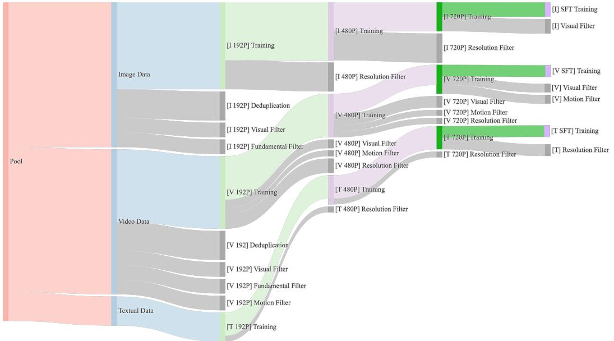
        *该图像是数据在不同训练阶段的配置示意图。每个阶段根据数据处理量动态调整与运动、质量和类别相关的数据比例，以优化视频生成模型的训练效率。*

### 4.1.2. Dense Video Captioning
To improve the model's ability to follow complex prompts, a custom captioning model was developed to generate highly descriptive captions for the training data.
*   **Architecture:** The caption model uses a `LLaVA-style` architecture, with a ViT encoder for visual features and a `Qwen` LLM to generate text. It employs a slow-fast encoding strategy for videos to efficiently process long sequences.
*   **Training Data:** It was trained on a mix of open-source datasets and specialized in-house datasets for:
    *   Recognizing celebrities, landmarks, and movie characters.
    *   Object counting, OCR, and camera motion/angle prediction.
    *   Fine-grained category recognition and relational understanding.
*   **Evaluation:** The caption model's performance was evaluated against Google Gemini 1.5 Pro, showing competitive or superior results in several dimensions like camera motion and style.

    The following figure compares the caption model's performance to Gemini 1.5 Pro.

    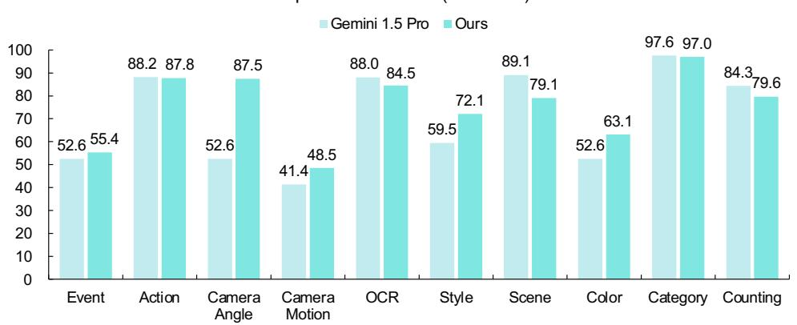
    *该图像是一个柱状图，展示了Gemini 1.5 Pro与本研究模型在多个任务（如事件、动作、摄像机角度等）上的性能对比。图中数据显示，在大部分任务中，本研究模型的表现优于Gemini 1.5 Pro，特别是在类别和计数任务上，达到了97.6和84.3的高分。*

## 4.2. Model Architecture
Wan's architecture consists of three main components: a spatio-temporal VAE, a text encoder, and the core Video Diffusion Transformer. The overall architecture is shown below.

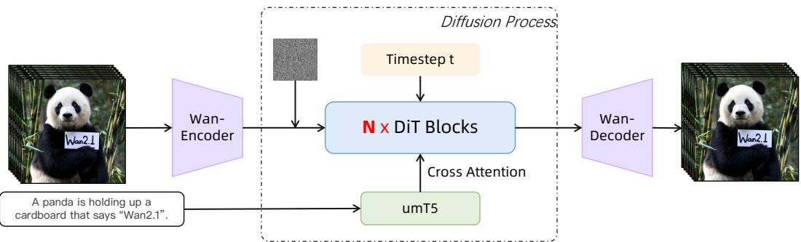
*该图像是Wan的体系结构示意图，展示了在扩散过程中如何通过Wan编码器和Wan解码器处理数据。图中包含了一个时间步$t$、NiT块及交叉注意力机制，用于提高视频生成的效果。*

### 4.2.1. Spatio-temporal VAE (`Wan-VAE`)
The `Wan-VAE` is a novel 3D causal VAE designed to efficiently compress videos into a latent space while preserving temporal information.
*   **Design:** It compresses a video's spatio-temporal dimensions by a factor of $4 \times 8 \times 8$. It uses `RMSNorm` instead of `GroupNorm` to maintain temporal causality (ensuring future frames don't influence past ones). This design, along with other optimizations, results in a small model size (127M parameters).
*   **Training:** It is trained in three stages: 1) Train as a 2D image VAE. 2) Inflate to a 3D video VAE and train on low-res videos. 3) Fine-tune on high-quality videos with a GAN loss.
*   **Efficient Inference:** A key innovation is the **feature cache mechanism**. For long videos, it processes the video in chunks. To maintain continuity, it caches features from the end of one chunk and reuses them as context for the start of the next, enabling stable inference for arbitrarily long videos.

    The `Wan-VAE` framework and its feature cache mechanism are illustrated in the figures below.

    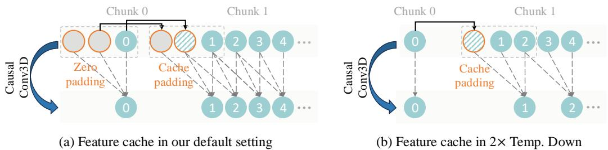
    *该图像是示意图，展示了Wan-VAE框架。Wan-VAE可以通过 `4 imes 8 imes 8` 倍的压缩比例有效降低视频的时空维度，其中橙色矩形表示 `2 imes` 的时空压缩，绿色矩形表示 `2 imes` 的空间压缩。*

### 4.2.2. Video Diffusion Transformer (DiT)
The core of Wan is a DiT that operates on the latent representations from the `Wan-VAE`.
*   **Transformer Block:** The DiT is composed of a series of transformer blocks. Within each block:
    *   **Text Conditioning:** Text prompt embeddings are injected using **cross-attention**, which is effective for instruction following.
    *   **Time Step Conditioning:** The diffusion time step is processed by a shared MLP whose output modulates the network's behavior. Sharing this MLP across blocks reduces parameter count by ~25% without sacrificing performance.
        The structure of a single transformer block is shown below.

        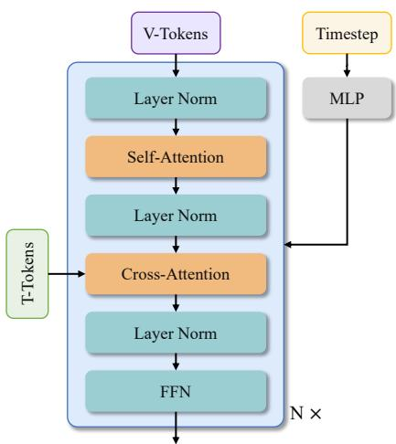
        *该图像是Wan的Transformer块示意图。图中展示了V-Tokens和T-Tokens的处理流程，包括层归一化、自注意力、交叉注意力和前馈网络等模块结构，体现了模型的计算逻辑和架构层次。*

*   **Text Encoder:** The model uses **`umT5`**, a multilingual text encoder. The authors found it superior to other LLMs for its bilingual capabilities, better compositional understanding (due to its bidirectional attention), and faster convergence.

## 4.3. Model Training
The training process uses the Flow Matching framework and a multi-stage curriculum.

### 4.3.1. Training Objective
The model is trained using **Flow Matching**, specifically Rectified Flows (RFs).
*   **Principle:** Given a data point $x_1$ and a noise vector $x_0$, an intermediate point $x_t$ is formed by linear interpolation:
    \$
    x_t = t x_1 + (1 - t) x_0
    \$
    where $t \in [0, 1]$ is the timestep.
*   The model's goal is to predict the "velocity" vector $v_t$, which is the direction from noise to data:
    \$
    v_t = \frac{d x_t}{d t} = x_1 - x_0
    \$
*   The loss function is the Mean Squared Error (MSE) between the model's predicted velocity $u(x_t, c_{txt}, t; \theta)$ and the ground truth velocity $v_t$:
    \$
    \mathcal{L} = \mathbb{E}_{x_0, x_1, c_{txt}, t} ||u(x_t, c_{txt}, t; \theta) - v_t||^2
    \$
    *   **Explanation of Symbols:**
        *   $x_0$: A random noise vector sampled from a standard normal distribution $\mathcal{N}(0, I)$.
        *   $x_1$: A real video latent from the dataset.
        *   $x_t$: The noisy input to the model at timestep $t$.
        *   $c_{txt}$: The text conditioning embeddings from the `umT5` encoder.
        *   $\theta$: The trainable weights of the DiT model.
        *   $u(\cdot)$: The DiT model which predicts the velocity.
        *   $v_t$: The ground truth velocity vector.

### 4.3.2. Staged Training Curriculum
To manage the high computational cost of training on long, high-resolution videos, Wan is trained in stages:
1.  **Image Pre-training:** The model is first trained only on low-resolution (256px) images. This efficiently teaches it basic semantic-visual alignment and structural concepts.
2.  **Image-Video Joint Training:** The model is then trained on a mix of images and videos with progressively increasing resolutions:
    *   Stage 1: 256px images and low-res videos.
    *   Stage 2: 480px images and videos.
    *   Stage 3: 720px images and videos.
3.  **Post-training:** The model is fine-tuned on a smaller, curated dataset of very high-quality images and videos to further enhance visual fidelity and motion dynamics.

## 4.4. Model Scaling and Optimization
Training a 14B model is a significant engineering challenge. The paper details several optimizations for both training and inference.

### 4.4.1. Training Efficiency
*   **Workload Analysis:** The attention mechanism's computational cost grows quadratically with sequence length, making it the primary bottleneck for long videos.
*   **Parallelism Strategy:** A hybrid parallelism strategy was developed to distribute the workload across many GPUs.
    *   **Parameter Sharding:** `Fully Sharded Data Parallel (FSDP)` is used to split the model's weights, gradients, and optimizer states across GPUs.
    *   **Activation Sharding:** To handle the massive activation memory for long sequences, a **2D Context Parallelism** strategy is used, which combines `Ulysses` and `Ring Attention`. This shards the input sequence across GPUs, dramatically reducing the memory footprint on each device.
        The overall parallel strategy is depicted in the figure below.

        
        *该图像是示意图，展示了DiT并行性的结构，假设总共有128个GPU。图中最内层由Ulysses ${ := } 8$ 和 ${ \mathrm{Ring} } = 2$ 组成，外层采用 $\mathrm{FSDP} { = } 32$，而最外层使用 $\mathrm{DP} { = } 4$。整体批量大小是微批量大小的8倍。*

*   **Memory Optimization:** A combination of **activation offloading** (moving activations to CPU memory) and **gradient checkpointing** (recomputing activations during the backward pass instead of storing them) is used to manage memory.

### 4.4.2. Inference Efficiency
*   **Parallelism:** The same FSDP and 2D Context Parallelism used in training are applied during inference to achieve near-linear speedup with more GPUs.

    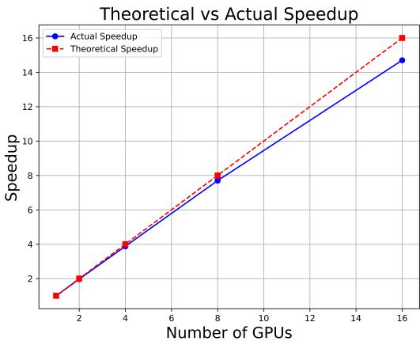
    *该图像是图表，展示了计算资源在不同 GPU 数量下的实际加速与理论加速的对比。横轴表示 GPU 的数量，纵轴表示加速比，蓝线代表实际加速，红虚线代表理论加速。数据表明，实际加速略低于理论预期。*

*   **Diffusion Cache:** This technique exploits similarities across denoising steps to reduce computation.
    *   **Attention Cache:** The attention output is computed only every few steps and the cached result is reused for intermediate steps.
    *   **CFG Cache:** For classifier-free guidance, the unconditional forward pass (which is computationally expensive) is also performed only every few steps. This resulted in a 1.62x speedup.
*   **Quantization:** Model weights and activations are converted to lower precision formats to accelerate computation.
    *   **FP8 GEMM:** Matrix multiplications are performed using 8-bit floating-point numbers.
    *   **8-Bit FlashAttention:** A custom, numerically stable version of FlashAttention using 8-bit integers is implemented, providing a >1.27x speedup.

## 4.5. Prompt Alignment
To improve the model's response to user prompts, which are often shorter and less descriptive than the training captions, an LLM (`Qwen2.5-Plus`) is used to **rewrite user prompts**. The rewriting process adds detail, suggests natural motion, and structures the prompt in a style similar to the high-quality captions used during post-training.

The following table shows examples of user prompts and their rewritten versions.

<table><tr><td>User prompts</td><td>Rewritten results</td></tr><tr><td>A Viking warrior wields a great axe with both hands, battling a mammoth at dusk, amidst a snowy landscape with snowflakes swirling in the air.</td><td>An epic battle scene, unfolds as a tall and muscular Viking war- rior wields a heavy great axe with both hands, facing off against a massive mammoth. The warrior is clad in leather armor and a horned helmet, with prominent muscles and a fierce, determined expression. The mammoth is covered in long hair, with sharp tusks, and roars angrily. It is dusk, and the snowy landscape is filled with swirling snowflakes, creating an intense and dramatic atmosphere. The backdrop features a barren ice field with the faint outlines of distant mountains. The use of cool-toned light- ing emphasizes strength and bravery. The scene is captured in a dynamic close-up shot from a high-angle perspective.</td></tr><tr><td>The camera follows a motor- boat chasing dolphins in the sea.</td><td>In a documentary photography style, the camera follows a motor- boat chasing a pod of dolphins leaping out of the vast ocean. On the motorboat, there is a driver wearing a life jacket and a safety helmet, with a focused and excited expression. The dolphins are sleek and smooth-skinned, occasionally leaping out of the water and diving back in with agility. The sky is bright blue, the sun is shining, and the sea is shimmering with light. A few white clouds dot the distant sky. The scene is dynamic and full of energy, captured from a medium shot in a tracking perspective.</td></tr><tr><td>The tiny Potato King, wearing a majestic crown, sits on the throne as potato subjects pay homage to it.</td><td>In a surrealist style, the tiny Potato King wears a magnificent gold crown and sits on a towering throne. Its skin has a natural earthy yellow tone with subtle bumpy textures. The potato subjects are lined up on either side, bowing their heads in homage to the king. The background features the grand interior of a palace, with gold and red decorations that appear luxurious and solemn. A beam of light shines down from above, creating a sacred atmosphere. The scene is captured in a close-up shot from a high-angle perspective.</td></tr></table>

---

# 5. Experimental Setup

## 5.1. Datasets
The paper does not use standard public datasets but instead describes the creation of a massive, proprietary dataset through the extensive **data processing pipeline** detailed in Section 4.1. The dataset consists of **billions of images and videos** sourced from internal copyrighted data and publicly accessible web data. The curation process was designed to ensure high quality in aesthetics, motion, and semantic content, as well as high diversity across various categories (e.g., technology, animals, humans). The final dataset used for training amounts to trillions of tokens.

## 5.2. Evaluation Metrics
The authors argue that standard metrics like FVD and FID are not well-aligned with human perception. They propose their own benchmark, `Wan-Bench`, and also report results on the public `VBench` leaderboard and human evaluations.

### 5.2.1. Wan-Bench
This is a comprehensive, automated benchmark designed to be human-aligned. It evaluates models across three core dimensions with 14 fine-grained metrics.

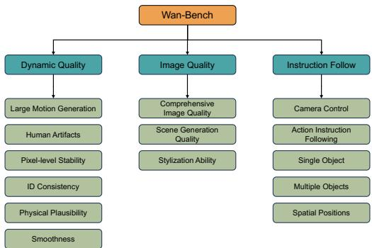
*该图像是图示，展示了 WanBench 的不同维度，主要分为动态质量、图像质量和指令跟随三个部分。动态质量包括大规模运动生成、人类伪影等；图像质量涵盖综合图像质量、场景生成质量和风格化能力；指令跟随则包括摄像机控制和多个对象的动作指令跟随等。*

The distribution of prompts across these dimensions is shown below.

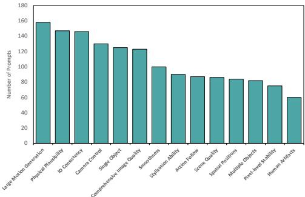
*该图像是图表，展示了不同维度下WanBench的提示数量分布。纵轴表示提示数量，横轴列出了各个维度，包括大规模视频生成、物理可用性等。*

*   **Dynamic Quality:**
    *   `Large Motion Generation`: Measured using the magnitude of optical flow calculated by RAFT.
    *   `Human Artifacts`: A custom YOLOv3 model trained to detect common AI-generated artifacts.
    *   `Physical Plausibility & Smoothness`: Uses a multimodal LLM (`Qwen2-VL`) to assess videos for violations of physical laws (e.g., unrealistic collisions).
    *   `Pixel-level Stability`: Measures frame-wise differences in static regions of the video.
    *   `ID Consistency`: Uses DINO features to measure the frame-wise similarity of objects, humans, and animals.
*   **Image Quality:**
    *   `Comprehensive Image Quality`: An average score from three models: `MANIQA` (fidelity), `LAION aesthetic predictor`, and `MUSIQ` (aesthetics).
    *   `Scene Generation Quality`: Measures scene consistency (CLIP similarity between frames) and scene-text alignment (CLIP similarity between frames and prompt).
    *   `Stylization`: Uses `Qwen2-VL` to assess how well the generated video matches a requested artistic style.
*   **Instruction Following:**
    *   `Object & Spatial Accuracy`: Uses `Qwen2-VL` to verify the presence, count, and spatial relationships of objects mentioned in the prompt.
    *   `Camera Control`: Evaluates five types of camera movements (panning, zooming, etc.) using optical flow and `Qwen2-VL`.
    *   `Action Instruction Following`: Uses `Qwen2-VL` to check if the subject correctly performs the specified action.

### 5.2.2. VBench
A widely-used public benchmark for video generation. It evaluates models across 16 different dimensions covering visual quality and semantic consistency.

### 5.2.3. Standard Metrics (for Ablations)
*   **Peak Signal-to-Noise Ratio (PSNR):** Measures the quality of reconstruction by comparing the pixel-wise difference between an original and a reconstructed image. Higher PSNR indicates better reconstruction quality.
    *   **Conceptual Definition:** It quantifies the ratio between the maximum possible power of a signal (the pixel values) and the power of corrupting noise that affects its fidelity.
    *   **Mathematical Formula:**
        \$
        \text{PSNR} = 10 \cdot \log_{10}\left(\frac{\text{MAX}_I^2}{\text{MSE}}\right)
        \$
    *   **Symbol Explanation:**
        *   $\text{MAX}_I$: The maximum possible pixel value of the image (e.g., 255 for an 8-bit grayscale image).
        *   $\text{MSE}$: The Mean Squared Error between the original image $I$ and the reconstructed image $K$ of size $m \times n$. It is calculated as:
            \$
            \text{MSE} = \frac{1}{mn} \sum_{i=0}^{m-1} \sum_{j=0}^{n-1} [I(i,j) - K(i,j)]^2
            \$
*   **Fréchet Inception Distance (FID):** Measures the quality and diversity of generated images compared to a set of real images. It calculates the distance between the feature distributions of real and generated images, extracted from an InceptionV3 model. A lower FID score is better.
    *   **Conceptual Definition:** FID assesses how similar the distribution of generated images is to the distribution of real images in a deep feature space. It captures both fidelity (are the images realistic?) and diversity (does the generator produce a wide variety of images?).
    *   **Mathematical Formula:**
        \$
        \text{FID}(x, g) = ||\mu_x - \mu_g||^2 + \text{Tr}(\Sigma_x + \Sigma_g - 2(\Sigma_x \Sigma_g)^{1/2})
        \$
    *   **Symbol Explanation:**
        *   $\mu_x$ and $\mu_g$: The mean of the feature vectors for real ($x$) and generated ($g$) images, respectively.
        *   $\Sigma_x$ and $\Sigma_g$: The covariance matrices of the feature vectors for real and generated images.
        *   $\text{Tr}(\cdot)$: The trace of a matrix (the sum of the elements on the main diagonal).

## 5.3. Baselines
Wan was compared against a strong set of both commercial and open-source models:
*   **Commercial Models:** Sora, Kling, Hailuo, Runway, Vidu.
*   **Open-Source Models:** Mochi, CogVideoX, HunyuanVideo.
    These models represent the state-of-the-art in video generation at the time of writing, making them suitable and challenging baselines for comparison.

---

# 6. Results & Analysis

The paper presents a comprehensive evaluation of Wan's performance using automated benchmarks, human evaluations, and qualitative examples.

## 6.1. Core Results Analysis

### 6.1.1. Quantitative Results on Wan-Bench
The results on the custom `Wan-Bench` show that the `Wan 14B` model achieves the highest overall weighted score, surpassing both leading commercial models like Sora and other open-source models.

The following are the results from Table 2 of the original paper:

<table>
<thead>
<tr>
<th>Wan-Bench Dimension</th>
<th>CNTopB</th>
<th>Hunyuan</th>
<th>Mochi</th>
<th>CNTopA</th>
<th>Sora</th>
<th>Wan 1.3B</th>
<th>Wan 14B</th>
</tr>
</thead>
<tbody>
<tr>
<td>Large Motion Generation</td>
<td>0.405</td>
<td>0.413</td>
<td>0.420</td>
<td>0.284</td>
<td>0.482</td>
<td>0.468</td>
<td>0.415</td>
</tr>
<tr>
<td>Human Artifacts</td>
<td>0.712</td>
<td>0.734</td>
<td>0.622</td>
<td>0.833</td>
<td>0.786</td>
<td>0.707</td>
<td>0.691</td>
</tr>
<tr>
<td>Pixel-level Stability</td>
<td>0.977</td>
<td>0.983</td>
<td>0.981</td>
<td>0.974</td>
<td>0.952</td>
<td>0.976</td>
<td>0.972</td>
</tr>
<tr>
<td>ID Consistency</td>
<td>0.940</td>
<td>0.935</td>
<td>0.930</td>
<td>0.936</td>
<td>0.925</td>
<td>0.938</td>
<td>0.946</td>
</tr>
<tr>
<td>Physical Plausibility</td>
<td>0.836</td>
<td>0.898</td>
<td>0.728</td>
<td>0.759</td>
<td>0.933</td>
<td>0.912</td>
<td>0.939</td>
</tr>
<tr>
<td>Smoothness</td>
<td>0.765</td>
<td>0.890</td>
<td>0.530</td>
<td>0.880</td>
<td>0.930</td>
<td>0.790</td>
<td>0.910</td>
</tr>
<tr>
<td>Comprehensive Image Quality</td>
<td>0.621</td>
<td>0.605</td>
<td>0.530</td>
<td>0.668</td>
<td>0.665</td>
<td>0.596</td>
<td>0.640</td>
</tr>
<tr>
<td>Scene Generation Quality</td>
<td>0.369</td>
<td>0.373</td>
<td>0.368</td>
<td>0.386</td>
<td>0.388</td>
<td>0.385</td>
<td>0.386</td>
</tr>
<tr>
<td>Stylization Ability</td>
<td>0.623</td>
<td>0.386</td>
<td>0.403</td>
<td>0.346</td>
<td>0.606</td>
<td>0.430</td>
<td>0.328</td>
</tr>
<tr>
<td>Single Object Accuracy</td>
<td>0.987</td>
<td>0.912</td>
<td>0.949</td>
<td>0.942</td>
<td>0.932</td>
<td>0.930</td>
<td>0.952</td>
</tr>
<tr>
<td>Multiple Object Accuracy</td>
<td>0.840</td>
<td>0.850</td>
<td>0.693</td>
<td>0.880</td>
<td>0.882</td>
<td>0.859</td>
<td>0.860</td>
</tr>
<tr>
<td>Spatial Position Accuracy</td>
<td>0.518</td>
<td>0.464</td>
<td>0.512</td>
<td>0.434</td>
<td>0.458</td>
<td>0.476</td>
<td>0.590</td>
</tr>
<tr>
<td>Camera Control</td>
<td>0.465</td>
<td>0.406</td>
<td>0.605</td>
<td>0.529</td>
<td>0.380</td>
<td>0.483</td>
<td>0.527</td>
</tr>
<tr>
<td>Action Instruction Following</td>
<td>0.917</td>
<td>0.735</td>
<td>0.907</td>
<td>0.783</td>
<td>0.721</td>
<td>0.844</td>
<td>0.860</td>
</tr>
<tr>
<td><strong>Weighted Score</strong></td>
<td><strong>0.690</strong></td>
<td><strong>0.673</strong></td>
<td><strong>0.639</strong></td>
<td><strong>0.693</strong></td>
<td><strong>0.700</strong></td>
<td><strong>0.689</strong></td>
<td><strong>0.724</strong></td>
</tr>
</tbody>
</table>

**Analysis:** The `Wan 14B` model achieves the highest weighted score of **0.724**, surpassing Sora's 0.700. It particularly excels in `Physical Plausibility` (0.939, even higher than Sora), `ID Consistency` (0.946), and `Spatial Position Accuracy` (0.590), indicating a strong understanding of object relations and physical world dynamics. The `Wan 1.3B` model is also highly competitive, outperforming several larger models.

### 6.1.2. Public Leaderboard and Human Evaluation
*   **VBench Leaderboard:** The `Wan 14B` model achieved a leading score of **86.22%**, significantly outperforming Sora (84.28%) and other commercial models. The efficient `Wan 1.3B` also scored very well (83.96%), demonstrating its excellent performance-to-size ratio.

    The following are the results from Table 4 of the original paper:

    <table>
    <thead>
    <tr>
    <th>Model Name</th>
    <th>Quality Score</th>
    <th>Semantic Score</th>
    <th>Total Score</th>
    </tr>
    </thead>
    <tbody>
    <tr>
    <td>MiniMax-Video-01 (MiniMax, 2024.09)</td>
    <td>84.85%</td>
    <td>77.65%</td>
    <td>83.41%</td>
    </tr>
    <tr>
    <td>Hunyuan (Open-Source Version) (Kong et al., 2024)</td>
    <td>85.09%</td>
    <td>75.82%</td>
    <td>83.24%</td>
    </tr>
    <tr>
    <td>Gen-3 (2024-07) (Runway, 2024.06)</td>
    <td>84.11%</td>
    <td>75.17%</td>
    <td>82.32%</td>
    </tr>
    <tr>
    <td>CogVideoX1.5-5B (5s SAT prompt-optimized) (Yang et al., 2025b)</td>
    <td>82.78%</td>
    <td>79.76%</td>
    <td>82.17%</td>
    </tr>
    <tr>
    <td>Kling (2024-07 high-performance mode) (Kuaishou, 2024.06)</td>
    <td>83.39%</td>
    <td>75.68%</td>
    <td>81.85%</td>
    </tr>
    <tr>
    <td>Sora (OpenAI, 2024)</td>
    <td>85.51%</td>
    <td>79.35%</td>
    <td>84.28%</td>
    </tr>
    <tr>
    <td><strong>Wan 1.3B</strong></td>
    <td><strong>84.92%</strong></td>
    <td><strong>80.10%</strong></td>
    <td><strong>83.96%</strong></td>
    </tr>
    <tr>
    <td><strong>Wan 14B (2025-02-24)</strong></td>
    <td><strong>86.67%</strong></td>
    <td><strong>84.44%</strong></td>
    <td><strong>86.22%</strong></td>
    </tr>
    </tbody>
    </table>

*   **Human Evaluation:** In pairwise comparisons, `Wan 14B` consistently outperformed competitors across visual quality, motion quality, prompt matching, and overall ranking, with win rates as high as 67.6% against some models.

    The following are the results from Table 3 of the original paper:

    <table>
    <thead>
    <tr>
    <th></th>
    <th>CN-TopA</th>
    <th>CN-TopB</th>
    <th>CN-TopC</th>
    <th>Runway</th>
    <th>All Rounds</th>
    </tr>
    </thead>
    <tbody>
    <tr>
    <td>Visual Quality</td>
    <td>30.6%</td>
    <td>15.9%</td>
    <td>27.8%</td>
    <td>48.1%</td>
    <td>5710</td>
    </tr>
    <tr>
    <td>Motion Quality</td>
    <td>16.1%</td>
    <td>9.7%</td>
    <td>14.9%</td>
    <td>40.3%</td>
    <td>5785</td>
    </tr>
    <tr>
    <td>Matching</td>
    <td>46.0%</td>
    <td>57.9%</td>
    <td>56.7%</td>
    <td>69.1%</td>
    <td>5578</td>
    </tr>
    <tr>
    <td>Overall Ranking</td>
    <td>44.0%</td>
    <td>44.0%</td>
    <td>48.9%</td>
    <td>67.6%</td>
    <td>5560</td>
    </tr>
    </tbody>
    </table>

*\* The table displays the win rate of Wan 14B against other models.*

### 6.1.3. Qualitative Results
The paper provides numerous visual examples (Figures 15-22) that showcase Wan's capabilities in generating high-quality, dynamic, and creative videos. These examples demonstrate:
*   **Complex Motion:** Synthesizing scenes with large-scale movements like dancing, sports, and explosions.
*   **Cinematic Quality:** Producing videos with high fidelity, realistic details, and artistic styles.
*   **Bilingual Text Generation:** Accurately rendering both Chinese and English text within video scenes.

    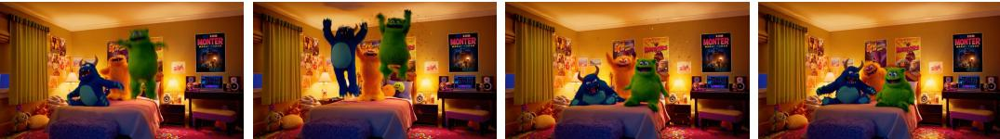
    *该图像是插图，展示了几个卡通怪物在房间中跳舞的场景。环境温馨，兼具趣味性，似乎是在表现一种欢乐的氛围。*

## 6.2. Ablation Studies / Parameter Analysis
The authors conducted several ablation studies to validate their design choices for the 1.3B model.

*   **Adaptive Normalization Layers (`adaLN`):** They compared four configurations for the `adaLN` layers in the DiT blocks. The results showed that a deeper model with shared `adaLN` parameters (`Full-shared-adaLN-1.5B`) achieved a lower training loss than wider models with more `adaLN` parameters. This justifies their design choice to share `adaLN` parameters across all blocks, which saves parameters while allowing for increased model depth.

    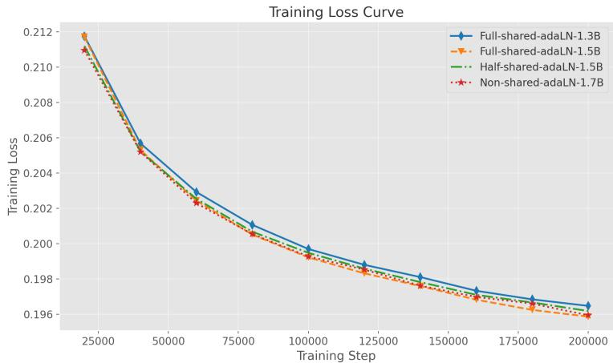
    *该图像是图表，展示了不同配置下的训练损失曲线。横轴为训练步数，纵轴为训练损失，各曲线代表不同的模型配置，包括 Full-shared-adaLN-1.3B、Full-shared-adaLN-1.5B、Half-shared-adaLN-1.5B 及 Non-shared-adaLN-1.7B。*

*   **Text Encoder:** They compared their chosen encoder, `umT5`, against other powerful bilingual LLMs like `Qwen2.5-7B` and `GLM-4-9B`. The results show that `umT5` achieved faster convergence and lower training loss, validating its superiority for this task, likely due to its bidirectional attention mechanism being more suitable for diffusion conditioning.

    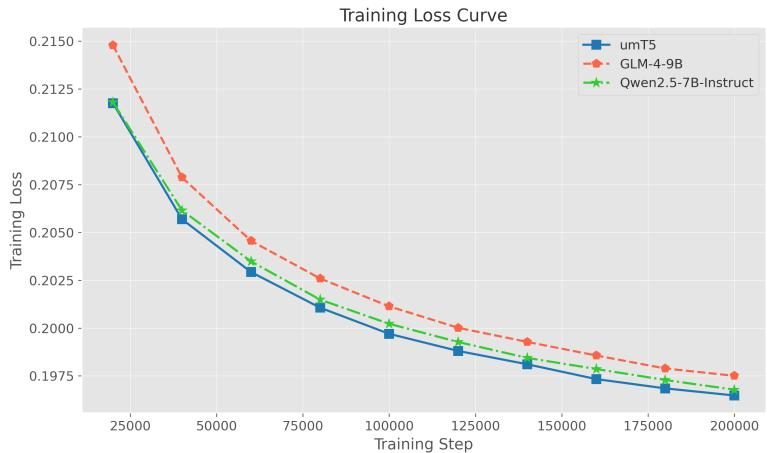
    *该图像是一个训练损失曲线图，展示了不同文本编码器（umT5、GLM-4-9B 和 Qwen2.5-7B-Instruct）在训练步骤上的损失变化。曲线随着训练步骤的增加而下降，反映出模型性能的提升。*

*   **Autoencoder:** They compared their `Wan-VAE` (trained with reconstruction loss) against a variant `VAE-D` (trained with a diffusion loss). The standard VAE achieved better FID scores, confirming the effectiveness of their chosen VAE architecture and training objective.

    The following are the results from Table 5 of the original paper:

    <table>
    <thead>
    <tr>
    <th>Model</th>
    <th>VAE</th>
    <th>VAE-D</th>
    </tr>
    </thead>
    <tbody>
    <tr>
    <td>10k steps</td>
    <td>42.60</td>
    <td>44.21</td>
    </tr>
    <tr>
    <td>15k steps</td>
    <td>40.55</td>
    <td>41.16</td>
    </tr>
    </tbody>
    </table>

---

# 7. Conclusion & Reflections

## 7.1. Conclusion Summary
The paper successfully introduces **Wan**, a powerful and comprehensive suite of open-source video generative models. It establishes a new state-of-the-art for the open-source community, significantly narrowing the gap with leading closed-source commercial models. The authors provide a holistic overview of their entire development process, from a meticulously designed data curation pipeline and a novel `Wan-VAE` to scalable DiT training strategies and a new human-aligned evaluation benchmark, `Wan-Bench`. The release of both a top-performing 14B model and an efficient 1.3B model that runs on consumer hardware demonstrates a commitment to both pushing the performance frontier and ensuring accessibility. By open-sourcing the entire toolchain, the Wan team aims to foster innovation and accelerate the advancement of video generation technology for both industry and academia.

## 7.2. Limitations & Future Work
The authors acknowledge several remaining limitations:
1.  **Fine-Grained Details in Large Motion:** Like many video generation models, Wan can struggle to preserve fine details in scenes with very large or complex motion, leading to occasional artifacts or loss of fidelity.
2.  **Computational Cost:** Despite optimizations, inferencing with the 14B model is still computationally intensive and slow on a single GPU, posing a barrier to real-time applications without specialized hardware or further optimization.
3.  **Lack of Domain-Specific Expertise:** As a general-purpose foundational model, Wan may lack the specialized knowledge required for high performance in niche domains like medicine or education.

    For future work, the team plans to continue scaling both data and model architectures to address these challenges. They also aim to encourage community-driven development to adapt Wan for more specialized applications.

## 7.3. Personal Insights & Critique
This paper is less of a traditional academic paper focused on a single theoretical novelty and more of a **landmark engineering report** that documents a massive and successful systems-building effort. Its value is immense.

*   **Strengths and Inspirations:**
    *   **Transparency and Openness:** The most significant contribution is the full open-sourcing of not just the model, but the methodology. The detailed breakdown of data processing, training challenges, and evaluation provides an invaluable roadmap for other researchers and organizations. This level of transparency is rare and commendable.
    *   **Holistic Approach:** The project's success stems from excellence at every level of the stack—data, architecture, training, and evaluation. It underscores the idea that state-of-the-art AI is not just about a clever model architecture but about the entire ecosystem that supports it.
    *   **`Wan-Bench`:** The creation of a comprehensive, multi-faceted benchmark is a crucial contribution. The field of generative AI has long been plagued by metrics that don't align with human perception. Pushing for more detailed and meaningful evaluation is a step in the right direction.
    *   **Pragmatism:** The release of both a 14B and a 1.3B model shows a deep understanding of the community's needs, balancing the quest for ultimate performance with the practical necessity of accessibility.

*   **Potential Issues and Areas for Improvement:**
    *   **Evaluation Reliance on MLLMs:** While `Wan-Bench` is a step forward, its reliance on Multimodal Large Language Models (MLLMs) like `Qwen2-VL` for evaluating complex concepts like "physical plausibility" has inherent limitations. These MLLMs have their own biases, knowledge gaps, and failure modes, so the evaluation is only as good as the evaluator model. More extensive, controlled human studies would be needed for definitive claims.
    *   **Comparison with Closed Models:** Comparisons to closed-source models like Sora are based on their publicly released videos or APIs. This is an imperfect comparison, as the full capabilities of these models might not be represented in the tested samples.
    *   **Reproducibility Challenge:** Despite being open-source, reproducing the training of a 14B model is beyond the reach of almost all academic labs and most companies. The primary beneficiaries of the training details will be other large-scale industrial labs. However, the open-source models themselves will be invaluable for downstream research and applications.

        Overall, "Wan" represents a major milestone in the democratization of high-end AI video generation. It provides the open-source community with a powerful new foundation to build upon, and its detailed report serves as a masterclass in the engineering of large-scale generative models.