# WAN：开放和先进的大规模视频生成模型

万团队，阿里巴巴集团

# 摘要

本报告介绍了Wan，一个全面和开放的视频基础模型套件，旨在推动视频生成的边界。基于主流的扩散变换器范式，Wan通过一系列创新实现了生成能力的显著提升，包括我们新颖的时空变分自编码器（VAE）、可扩展的预训练策略、大规模数据整理和自动化评估指标。这些贡献共同增强了模型的性能和通用性。具体而言，Wan具有四个关键特点：领先性能：Wan的14B模型在一个包含数十亿图像和视频的大型数据集上进行训练，展示了视频生成在数据和模型规模方面的缩放规律。它在多个内部和外部基准测试中持续超越现有的开源模型以及最先进的商业解决方案，表现出明显和显著的性能优势。全面性：Wan提供了两个功能强大的模型，即1.3B和14B参数，分别用于效率和效能。它还覆盖多个下游应用，包括图像生成视频、基于指令的视频编辑和个人视频生成，涵盖多达八项任务。同时，Wan是首个能够生成中英双语视觉文本的模型，显著增强了其实用价值。消费者级效率：1.3B模型展现了卓越的资源效率，仅需8.19 GB的显存，使其与广泛的消费者级GPU兼容。与更大规模的开源模型相比，它在文本生成视频方面显示出优越的性能，展示了 remarkable 的效率。开放性：我们开源了整个Wan系列，包括源代码和所有模型，旨在促进视频生成社区的发展。这种开放性旨在显著扩展行业视频制作的创造性可能性，并为学术界提供高质量的视频基础模型。此外，我们进行了广泛的实验分析，涵盖了所提议的Wan的各个方面，呈现了详细的结果和见解。我们相信这些发现和结论将显著推进视频生成技术。所有代码和模型可在 https://github.com/Wan-Video/Wan2.1 获取。

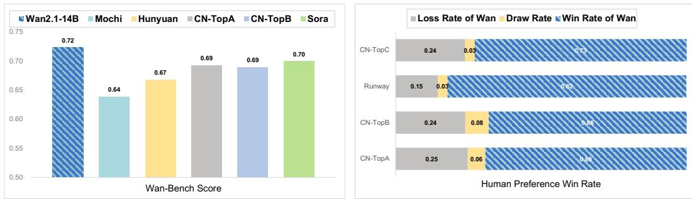  

Figure 1: Comparison of Wan with state-of-the-art open-source and closed-source models. Following both benchmark and human evaluations, Wan consistently demonstrated superior results. Note that HunyuanVideo Kong et al. (2024) is tested using the open-source model.

# 目录

1 引言 3 2 相关工作 3 数据处理管道 5 3.1 预训练数据 . . . 6 3.2 后训练数据 . . 3.3 密集视频字幕 8 3.3.1 开源数据集 3.3.2 内部数据集 3.3.3 模型设计 3.3.4 评估 10

# 4 模型设计与加速 10

# 4.1 空间时间变分自编码器 10

4.1.1 模型设计 10 4.1.2 训练 11 4.1.3 高效推理 11 4.1.4 评估 12 1.2 模型训练 13 4.2.1 视频扩散变换器 14 4.2.2 预训练 14 4.2.3 后训练 15 4.3 模型缩放与训练效率 15 4.3.1 工作负载分析 15 4.3.2 并行策略 16 4.3.3 内存优化 17 4.3.4 集群可靠性 17 4.4 推理 7 4.4.1 并行策略 17 4.4.2 扩散缓存 18 4.4.3 量化 18 4.5 提示对齐 19 4.6 基准测试 20 4.7 评估 22 4.7.1 指标与结果 222 4.7.2 消融研究

# 5 扩展应用 26

# 5.1 图像到视频生成 26

5.1.1 模型设计 277 5.1.2 数据集 5.1.3 评估 5.2 统一视频编辑 30 5.2.1 模型设计 \$3\frac { }\$ 5.2.2 数据集与实现 5.2.3 评估 . . 5.3 文本到图像生成 .. 35 5.4 视频个性化 35 5.4.1 模型设计 5.4.2 数据集 5.4.3 评估 . 5.5 相机运动可控性 . . . . 38 5.6 实时视频生成 3 5.6.1 方法 38 5.6.2 流媒体视频生成 40 5.6.3 一致性模型蒸馏 44 5.7 音频生成 . 44 5.7.1 模型设计 45 5.7.2 评估 47

# 6 限制与结论 47

7 位贡献者 49

自从 OpenAI 于 2024 年推出 Sora 以来，视频生成技术受到了业界和学术界的广泛关注，推动了该领域的快速进展。有能力生成与专业制作内容相媲美的视频模型的出现，显著提升了内容创作的效率，同时降低了视频制作的成本。视频生成技术的这些快速进展也很大程度上得益于开源社区的发展。HunyuanVideo（Kong 等，2024）、Mochi（GenmoTeam，2024）和 CogVideoX（Yang 等，2025b）等重要项目已公开其视频基础模型的代码和权重，逐渐缩小了开源模型与商业模型之间的差距。然而，必须承认这些杰出开源模型与最新闭源模型之间依然存在着持续的差距。该差距主要体现在三个方面：次优性能：由于商业模型的发展速度远远超过当前开源模型，因此性能差距明显，导致其能力显著优于开源模型。能力有限：大多数基础模型仅限于一般的文本到视频（T2V）任务，而视频创作的需求却是多面的。因此，基本 T2V 模型无法满足这些多元化的需求。效率不足：尽管这些模型在性能和规模上令人印象深刻，但对于计算资源有限的创意团队而言，它们常常显得不够实用，从而妨碍了其可访问性和可用性。这些挑战共同对开源社区的持续增长和创新施加了限制。

为了解决上述挑战，本报告推出并公开发布了一系列全新的高性能基础视频生成模型，称为Wan，旨在为该领域树立新的基准。Wan的核心设计灵感源于扩散变换器（Diffusion Transformers, DiT）(Peebles & Xie, 2023) 的成功，结合流匹配（Flow Matching）(Lipman et al., 2022) 框架，该框架已在文本到图像（text-to-image, T2I）(Esser et al., 2024) 和文本到视频（text-to-video, T2V）(Kong et al., 2024) 任务中展现出通过规模化实现的显著性能提升。在这一架构范式中，交叉注意力被用于嵌入文本条件，同时模型设计经过细致优化，以确保计算效率和精确的文本可控性。为了进一步增强模型捕捉复杂动态的能力，纳入了完整的时空注意力机制。通过广泛的实验，该模型经过规模验证，参数量达到140亿。随后，Wan获取了包含数十亿图像和视频的大规模数据，合计达到 $\mathcal { O } ( 1 )$ 万亿个词元。这一广泛的训练有助于模型能力的显现，使其在运动幅度和质量、视觉文本生成、相机控制、指令遵循和风格多样性等多个维度展现出强大的性能。基于这一强大的基础模型，我们扩展了其功能，以支持多种下游任务，包括图像到视频生成（I2V）、指令引导的视频编辑（V2V）、零样本个性化定制、实时视频生成和音频生成等关键应用。为了降低推理成本，我们还推出了一个13亿参数的模型，与14亿参数的模型一起用于T2V和I2V，两者均支持480p分辨率，并大大提高推理效率。值得注意的是，13亿参数的模型仅需8.19G的显存，能够在许多消费级GPU上运行，同时其性能超过了许多更大规模的开源模型。此外，我们还将公开整个训练过程，包括大规模数据构建管道、视频变分自编码器（VAE）、训练策略、加速技术和自动评估算法，以支持社区开发专业的基础视频模型。此外，我们将提供全面的设计细节和实验结果，深入分析在资源密集型大型生成模型训练过程中观察到的现象以及我们的关键发现和结论。我们相信，这些贡献将对加速视频生成技术的发展发挥关键作用。

# 2 相关工作

受生成建模进展的驱动，大规模视频模型的格局发生了显著变化，特别是在基于扩散的框架中。我们的评审主要关注两个广泛的类别：闭源模型和来自开源社区的贡献。

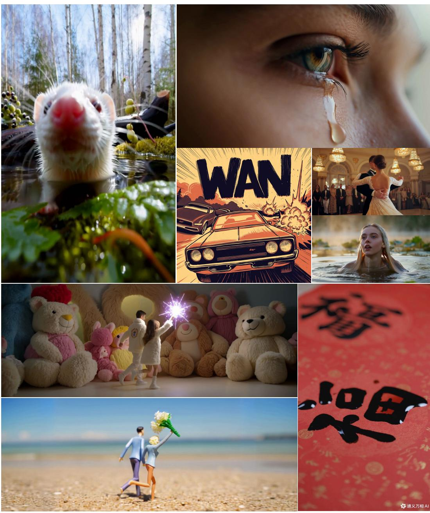  

Figure 2: Samples generated by Wan. Wan can produce videos with large motions, high fidelity, and realistic details. It is also the first model to generate both Chinese and English text within videos. Additionally, Wan offers a range of features, including text-to-video, image-to-video, and video editing capabilities.

闭源模型。闭源模型主要是由大型科技公司开发的，旨在利用大量资源投资于高质量专业视频生成。我们将过去一年发布的 notable 模型按时间顺序整理如下。2024年2月，OpenAI推出了Sora（OpenAI, 2024），标志着AI生成内容的重大飞跃。2024年6月，快手发布了Kling（Kuaishou，2024.06）和LUMA AI发布的Luma 1.0（LumaLabs，2024.06），开放公众测试，提供强大的视频生成能力。同时，Runway推出了Gen-3（Runway，2024.06），在Gen-2（Runway，2023）的基础上，进一步提升了视频创作的标准。2024年7月，盛书AI发布了Vidu（Bao等，2024），配备自设计的U-ViT（Bao等，2023）架构。2024年9月，Kling和Luma更新至1.5版本。同期，MiniMax推出了Hailuo Video（MiniMax，2024.09），向公众展示了令人印象深刻的视觉效果。2024年10月，Pika Labs推出Pika 1.5（PikaLabs，2024.10），使用户能够自定义视频中的视觉和物理属性。此外，Meta发布了Movie Gen（Polyak等），一系列详细训练过程和应用的视频基础模型。2024年12月，Kling升级至1.6版本，同时，谷歌发布了Veo 2（DeepMind，2024.12），对现实物理和人类运动细微差别有更好的理解。这些发展突显了视频生成领域的全球竞争激烈。在这种背景下，我们的开源Wan在内部和外部基准测试中展现出竞争力，甚至在多个属性上超过这些商业模型。

开放源码社区的贡献。另一方面，开放源码社区不仅对整体视频生成模型作出了重大贡献，还对基本模型组件的探索做出了贡献。基于扩散的.video生成模型通常建立在Stable Diffusion（Rombach等，2022）架构之上。它主要涉及三个关键模块：一个自动编码器将原始视频映射到紧凑的潜在空间，一个文本编码器提取文本嵌入，以及一个通过扩散模型优化的神经网络，用于学习这些视频潜变量的分布。在网络结构方面，U-Net（Ronneberger等，2015）最初用于图像生成（Ho等，2020；Song等，2020），通过引入时间维度而适用于视频生成。VDM（Ho等，2022）将二维U-Net扩展为三维版本，而另一种范式（Zhou等，2022；Wang等，2023a；Guo等，2024b）则引入了一维时间注意力与二维空间注意力块相结合，以减少计算成本。值得注意的是，Diffusion Transformers（DiT（Peebles & Xie，2023））仅依赖于变换器块，在视觉生成任务中优于U-Net（Chen等，2023a）。这一结构也被迁移到视频模型（Ma等，2024），产生了两个常见变体：原始DiT（Peebles & Xie，2023；HaCohen等，2024）使用交叉注意力处理文本嵌入，MM-DiT（GenmoTeam，2024；Kong等，2024）则将文本嵌入与视觉嵌入串联，以实现全注意力处理。关于自动编码器，早期方法（Rombach等，2022）采用标准变分自编码器（VAE）（Kingma，2013），近期的自动编码器如VQ-VAE（Van Den Oord等，2017）和VQGAN（Esser等，2021）改进了模型设计，以实现更好的重构和压缩。LTX-Video（HaCohen等，2024）修改了VAE解码器，以执行最终去噪步骤并将潜变量转换为像素，缺失的高频细节在解码过程中生成。文本编码器在基于文本的视频生成中也至关重要。目前强大的视频生成模型主要使用T5系列（Raffel等，2020）作为主要文本编码器，通常与CLIP（Radford等，2021）结合使用。在HunyuanVideo（Kong等，2024）的情况下，T5被替换为多模态大型语言模型（Liu等，2023c；Li等，2023），以实现文本嵌入与视觉特征之间更强的对齐。通过将这些关键模块与有效的基于扩散的优化技术（Ho等，2020；Song & Ermon，2019；Lipman等，2022）结合，多个有前景的开源视频生成模型应运而生（GenmoTeam，2024；Kong等，2024；HaCohen等，2024；Zheng等，2024；Lin等，2024；Jin等，2024；Yang等，2025b）。在Wan中，我们精心设计或选择了每个关键组件，以确保高质量的视频合成。我们提供详细的设计信息和消融研究，能够促进未来视频生成模型的设计。此外，众多研究探讨了视频生成中的下游任务。这些任务包括重涂（AI，2022；Zhou等，2023）、编辑（Meng等，2021；Brooks等，2023；Zhang等，2023a；Wang等，2023b；Wei等，2024b）、可控生成（Zhang等，2023b；Jiang等，2024；Wang等，2024c）和帧参考生成（Yang等，2025b；Guo等，2024a），通常通过利用基于适配器的架构和ControlNet-like架构（Zhang等，2023b；Chu等，2023）来结合用户指定的条件。我们还基于Wan开发了多种下游应用，展示了出色的性能。

# 3 数据处理流程

高质量的数据对于训练大型生成模型至关重要，而自动化的数据构建管道显著提升了训练过程的效率。在开发我们的数据集时，我们优先考虑了三个核心原则：高质量、高多样性和大规模。遵循这些原则，我们策划了一个由数十亿个视频和图像组成的数据集。本节将详细介绍我们为Wan采用的数据构建管道。我们从内部版权来源和公开可访问的数据中策划并去重了候选数据集。在预训练阶段，我们的目标是从这个庞大但嘈杂的数据集中选择高质量和多样化的数据，以促进有效的训练。在数据挖掘过程中，我们设计了一个四步数据清理流程，重点关注基本维度、视觉质量和运动质量。随后，我们还将重点介绍用于构建视觉文本数据的数据处理工作流。

基本维度。我们的数据过滤框架的基本维度关注源视频和图像数据的内在属性，有效地初步过滤掉所有不合适的数据。具体而言，我们的多维过滤方法涵盖以下关键方面：文本检测。我们实现了一种轻量级光学字符识别（OCR）检测器，以量化文本覆盖率，有效排除文本元素过多的视频和图像，以保持视觉清晰度。美学评估：我们使用广泛采用的LAION-5B（Schuhmann等，2021）美学分类器对我们的图像进行初步质量评估，快速过滤掉低质量数据。成人内容评分。通过我们的内部安全评估模型，我们系统地评估并过滤基于计算出的成人内容（NSFW）评分的不当内容。水印和标志检测。我们检测视频或图像中是否包含水印和标志，并在训练过程中裁剪这些元素。黑边检测。利用基于启发式的方法，我们自动裁剪多余的黑边，以保持对内容丰富区域的关注。过度曝光检测。我们经过训练的专家分类器评估并过滤出具有异常色调分布的数据，以确保训练数据集的最佳视觉质量。合成图像检测。实证证据表明，即使是通过生成图像的轻微污染（$ \bar { < } 1 0 \% $）也会显著降低模型的性能。因此，我们训练了一个专家分类器以过滤这些“污染”图像。模糊检测。我们内部开发的模型为训练材料分配定量模糊评分，从而系统性地移除视觉上模糊的内容。持续时间和分辨率。我们还设定约束条件，其中视频持续时间必须超过4秒，并在不同训练阶段应用分辨率阈值以过滤低质量数据。通过实施这些高效的预处理策略，我们成功消除了约$50 \%$的初始数据集。保留的高质量数据随后进入更高级的基于语义的选择阶段进行进一步精炼。

视觉质量。这主要涉及从候选数据集中选择相对高质量且符合预训练标准的数据。这部分数据必须具有良好的视觉质量，并且其整体分布应与自然数据的分布一致。在这个过程中，我们将任务分为两个部分：聚类和评分。聚类用于将所有数据拆分成更小的子集，使我们能够单独处理每个子集。这种方法的好处在于可以防止因长尾分布而导致的小但重要数据片段的丢失，从而保持原始数据分布。具体来说，我们将数据分为100个簇，然后从每个簇中选择一定量的数据用于下一阶段的数据处理。评分用于给每个视频或图像分配质量评分，方便在不同阶段选择和处理数据。具体而言，我们从每个簇中选择样本进行人工评分（评分范围为1到5，1为最差，5为最好）。然后，我们使用所有标注数据训练一个专家评估模型，以对整个数据集进行评分。

运动质量。运动质量评估的目标是选择自然、完整且具有显著运动的视频，同时避免静态或抖动的动作。我们将视频数据分为六个不同的运动质量等级。最佳运动：该级别代表具有最佳属性的视频，例如显著的运动布局、视角和幅度，以及干净、平滑的运动。中等质量运动：此类别的视频表现出明显的运动，但可能存在多个主体或部分遮挡等小问题。这些数据确保了运动多样性，并可在预训练过程中帮助模型更好地理解时空关系。静态视频：此类别主要关注大部分为聊天和访谈风格的视频。虽然这些视频包含的运动信息很少，但质量较高。因此，我们需要将它们单独识别，并降低其抽样比例。相机驱动运动：主要由相机运动（例如航拍镜头）主导的镜头，主体运动很少。鉴于它们与静态图像的相似性，这些镜头的抽样优先级显著降低。低质量运动：表现出过多主体、严重遮挡或主要主体不清晰的视频（例如拥挤的街景）。由于其对训练效率和运动生成质量的负面影响，此类内容被排除在外。晃动相机镜头：具有明显相机抖动的业余录制，常导致运动模糊和前景与背景的模糊区分。此类别系统性地被排除在训练考虑之外。

  

Figure 3: Data provisioning across different training phases. For each stage, we dynamically adjust the proportions of data related to motion, quality, and category based on data throughput.

视觉文本数据。此外，我们还提出了一种新颖的数据处理方法，以增强Wan的视觉文本生成能力。该方法包括两个不同的处理分支，旨在提高文本渲染的准确性和和谐性。一方面，我们通过在纯白色背景上渲染汉字合成数亿张包含文本的图像。另一方面，我们从海量的现实世界数据中收集大量包含文本的图像。我们使用多个光学字符识别模型来准确识别图像和视频中的英文和中文文本，并将提取的文本内容输入到多模态语言模型Qwen2-VL中。这个过程生成图像的自然描述，确保描述尽可能包含精确的文本内容。我们通过利用这一处理管道收集大量的现实世界图像-文本对。在预训练阶段整合合成数据和真实数据，我们的方法在视频中生成稀有词汇时以准确的字形和高真实感有效泛化，展现出视觉文本生成的显著优势。

# 3.2 后训练数据

后训练的核心目标是通过高质量数据提高生成视频的视觉真实度和运动动态。在这一阶段，我们的数据处理流程针对静态数据和动态数据采用不同策略：图像数据经过优化以改善视觉质量，而视频数据则专门处理以提升运动质量。 图像处理。我们从高评分的图像数据池中进行额外的精细化处理，以识别在质量、构图和细节等方面表现突出的高质量样本。具体而言，我们采用两种方法构建经过筛选的数据集：基于专家的收集和手动收集。前者方法涉及根据专家模型预测的评分选择前 $20\%$ 的图像。对于这一子集，我们还考虑风格和类别等因素，以确保数据分布的多样性。后者方法则通过手动收集来自不同类别和数据源的高质量图像，同时填补数据集中缺失的概念，以增强模型的泛化能力。通过这一过程，我们总共收集了数百万张经过筛选的图像。 视频处理。在这一阶段，我们采用与图像相似的策略来收集高质量视频。首先，我们使用视觉质量分类器从候选数据集中筛选出一些顶级视频。然后，基于运动质量分类器，我们选择数百万个包含简单动作的视频和数百万个包含复杂动作的视频。所有视频选取遵循强调类别平衡和高度多样化的策略。同时，我们从12个主要类别中选择数据，包括技术、动物、艺术、人类、车辆等，以增强模型在常用类别的生成能力。

# 3.3 密集视频字幕生成

尽管我们的数据集中包含许多图像和视频的原始网页文本描述，但这些描述往往过于简单，无法传达详细的视觉内容。DALL-E 3（Betker et al.，2023）已经证明，通过在高度描述性的生成视觉标题上进行训练，视觉生成模型遵循提示的能力可以显著增强。因此，我们开发了一个内部标题模型，为我们数据集中的每个图像和视频生成密集的标题。为了训练该模型，我们结合了开放源代码的视觉-语言数据集和在内部收集的额外数据。

# 3.3.1 开源数据集

我们收集了广泛使用的视觉-语言数据集，涵盖图像和视频。我们的收集不仅包括图像描述数据集，还包括专注于视觉内容的视觉问答数据集，如动作、计数和 OCR。在某些情况下，我们要求描述模型根据用户指令生成特定风格或内容的描述。因此，我们还收集了纯文本指令数据，以增强模型遵循指令的能力。

# 3.3.2 内部数据集

我们收集了一个内部数据集，以增强模型在特定领域（如名人、地标和电影角色）中的能力。为了训练我们的模型识别名人、地标和角色，我们收集了包含数千个身份的数据集。首先，我们使用大型语言模型（LLM）收集姓名，然后通过CLIP风格模型从我们的图像-文本数据库中检索相应的图像。我们测试了各种CLIP风格的模型，发现TEAM（Xie et al., 2022）在识别个人方面表现出色，尤其是中国名人。为了进一步减少数据集中的噪音，我们对图像-文本配对的描述实施了关键词匹配。只有当图像被TEAM模型检索并与指定关键词匹配时，才会保留该图像。对象计数。为了增强我们模型的视觉计数能力，我们通过检索包含“一个”、“两个”、“三个”等词的文本描述的图像，编制了一个计数数据集。这些数字为图像提供了粗略标注。然后，我们使用LLM从相应文本中提取（类别，计数）对。最后，我们使用Grounding DINO（Liu et al., 2023d）对这些类别中的对象进行计数。只有当图像的文本描述与Grounding DINO（Liu et al., 2023d）的结果匹配时，才会保留该图像。OCR。为了提高我们模型生成文本描述的能力，我们收集了一个OCR增强的图像标题数据集。最初，我们使用市场现成的OCR检测器从图像中提取文本。然后，我们提示我们的标题模型根据这些OCR结果生成描述。这种方法通过使用提取的OCR文本作为先验知识，确保了准确的文本描述。目前，我们仅包含英文和中文文本。摄像机角度和运动。我们观察到当前的多模态语言模型（MLLM）在预测摄像机角度和运动方面存在困难，包括像GPT-40和Google Gemini Pro这样的最先进商业模型。为了增强这些预测，我们首先对一组视频进行摄像机角度和运动的标注。这个数据集可以以两种方式使用：直接训练我们在最终训练阶段使用的标题模型，或者通过训练一个专家模型来标注更多视频数据，帮助我们在早期训练阶段的模型。这个数据集提高了我们运动和角度描述的准确性，从而改善了我们视频生成模型的摄像机运动可控性。细粒度类别。为了增强我们模型识别细粒度类别（如动物、植物和车辆）的能力，我们创建了一个包含数百万张图像的数据集。关系理解。我们通过收集数据集增强模型的关系理解能力，该数据集结合了对象检测数据集。$R e$ -caption。标题模型的一个重要能力是利用现有标签或简短标题生成详细描述。为此，我们策划了一个重新标题数据集，该数据集基于图像内容将简短文本标签或标题扩展为详细描述。编辑指令标题。我们收集了一个描述两幅图像之间差异或变化的数据集。这种类型的标题对于图像编辑任务非常有价值。组图像描述。我们收集了一个为组图像提供描述的数据集。每个标题都以描述图像共享的共同特征开始，随后是每幅图像的单独描述，使用类似的措辞。人工标注的图像和视频标题。我们收集了人工标注的密集标题，适用于图像和视频。这些代表了我们最高质量的标题数据，并用于模型训练的最终阶段。

  
Caption Evaluation (F1 score)   

Figure 4: Our caption model achieves overall performance comparable to Google Gemini $1 . 5 \mathrm { P r o }$ In particular, it excels in areas such as events, camera angle, camera motion, style, and color.

# 3.3.3 模型设计

架构。我们的标题生成模型采用了LLaVA风格的架构（Liu et al., 2023c）。我们使用ViT编码器提取图像和视频帧的视觉嵌入。这些嵌入通过两层感知器进行投影，然后输入到Qwen LLM（QwenTeam, 2024）。对于图像输入，我们采用LLaVA中的动态高分辨率。图像最多可以分为七个块。对于每个块，我们自适应地将视觉嵌入池化为$1 2 \times 1 2$网格表示，以减少计算。对于视频，我们每秒取样3帧，最高限制为129帧。为了进一步减少计算，我们采用慢速-快速编码策略：保持每第四帧的原始分辨率，并对其余帧的嵌入应用全局平均池化。在长视频基准上的实验表明，慢速-快速机制在有限数量的视觉词元下增强了理解能力（例如，在VideoMME（Fu et al., 2024）上将性能从$6 7 . 6 \%$提升到$6 9 . 1 \%$），无需字幕。训练。遵循最新的最先进方法，我们的训练过程分为三个阶段。在第一阶段，我们冻结ViT和LLM，仅训练多层感知器以对齐视觉嵌入与LLM输入空间，学习率设为le-3。在第二阶段，所有参数均可训练。在最后阶段，我们在一小部分高质量数据上进行端到端训练。对于最后两个阶段，LLM和MLP的学习率设为le-5，ViT的学习率设为1e-6。

# 3.3.4 评估

自动评估对于我们字幕模型的发展至关重要，它使我们能够识别每个模型版本的优缺点。根据 CAPability（Liu et al., 2025b），我们开发了一个自动字幕评估管道。我们专注于视频生成中的十个关键视觉维度：动作、摄像机角度、摄像机运动、物体类别、物体颜色、物体计数、光学字符识别（OCR）、场景、风格和事件。对于每个维度，我们随机抽取了 1,000 个视频及其由我们的模型生成的对应字幕。我们还使用 Google Gemini $1.5 \mathrm{P r o}$ 为该数据集生成了密集的视频字幕。我们通过计算每个维度的 F1 指标来评估我们的字幕和 Gemini 生成的字幕，参照 CAPability（Liu et al., 2025b）。结果如图 4 所示。我们在视频事件、摄像机角度、摄像机运动、风格和物体颜色方面的表现优于 Gemini，而 Gemini 在动作、OCR、场景、物体类别和物体计数方面表现出色。

# 4 模型设计与加速

# 4.1 空间-时间变分自编码器

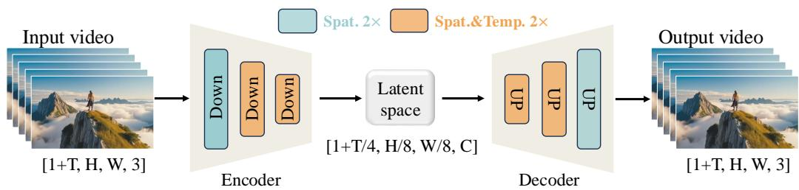  

Figure 5: Our Wan-VAE Framework. Wan-VAE can compress the spatio-temporal dimension of a video by $4 \times 8 \times 8$ times. The orange rectangles represent $2 \times$ spatio-temporal compression, and the green rectangles represent $2 \times$ spatial compression.

变分自编码器（VAEs）（Wu等，2024；Blattmann等，2023；OpenAI，2024）在从高维视觉数据（尤其是视频）中学习紧凑的潜在表征方面发挥着关键作用，促进了生成模型（如扩散模型）的可扩展和高效训练。然而，针对视频生成任务设计有效的VAEs面临几个挑战。首先，视频本质上同时具有空间和时间维度，这要求VAE捕捉复杂的时空依赖关系。其次，视频的高维特性（例如，多个具有高分辨率像素的帧）增加了内存消耗和计算成本，使得VAEs难以扩展至长视频序列。第三，确保时间因果性（即未来帧不影响过去帧）对于生成真实且连贯的视频内容至关重要，但这一约束增加了额外的架构复杂性。为了应对这些挑战，我们提出了一种新颖的三维因果VAE架构（Wan-VAE），专门设计用于视频生成。我们结合多种策略（Wu等，2024）来改善时空压缩、减少内存使用并确保时间因果性。这些改进使Wan-VAE更加高效和可扩展，更加适合与基于扩散的生成模型（如DiT）集成。接下来，我们将介绍Wan-VAE的网络设计、训练细节、高效推理和实验对比。

# 4.1.1 模型设计

为了实现高维像素空间与低维潜在空间之间的双向映射，我们设计了如图5所示的3D因果变分自编码器（VAE）。给定输入视频 $V \in$ $\mathbb { R } ^ { ( 1 + T ) \times H \times W \times 3 }$，Wan-VAE 在时空维度上压缩为 $[ 1 + T / 4 , H / 8 , W / 8 ]$ 的同时将通道数 $C$ 扩展到16。具体来说，第一帧仅在空间上进行压缩，以更好地处理图像数据，这一做法遵循了MagViT-v2（Yu et al., 2023）。在架构方面，我们将所有的GroupNorm层（Wu & He, 2018）替换为RMsNorm层（Zhang & Sennrich, 2019），以保持时间因果关系。这一修改使得特征缓存机制的使用成为可能（参见第4.1.3节），显著提高了推理效率。此外，我们在空间上采样层中将输入特征通道数减少一半，从而在推理过程中减少了 $33 \%$ 的内存消耗。

  

Figure 6: Our feature cache mechanism. (a) and (b) show how we use this mechanism in regular causal convolution and temporal downsampling, respectively.

通过仔细调整基础通道的数量，Wan-VAE 实现了仅有 127M 参数的紧凑模型尺寸。此优化减少了编码时间和内存使用，从而有利于后续扩散变换器模型的训练。

# 4.1.2 训练

我们采用三阶段的方法来训练Wan-VAE。首先，我们构建一个具有相同结构的2D图像VAE，并在图像数据上进行训练。然后，我们将训练良好的2D图像VAE扩展为3D因果Wan-VAE，以提供初始的空间压缩先验，这大大提高了训练速度，相比从头开始训练视频VAE。在这一阶段，Wan-VAE在低分辨率（128×128）和小帧数（5帧）的视频上进行训练，以加速收敛速度。训练损失包括$L_1$重建损失、KL损失和LPIPS感知损失，分别以3、3e-6和3的系数加权。最后，我们在不同分辨率和帧数的高质量视频上微调模型，集成来自3D鉴别器的GAN损失（Esser et al.，2021）。

# 4.1.3 高效推理

为了高效支持任意长度视频的编码和解码（Yang et al., 2025a；Yao et al., 2021），我们在Wan-VAE的因果卷积模块中实现了一种特征缓存机制。具体而言，视频序列帧数遵循 $1 + T$ 的输入格式，因此我们将视频划分为 $1 + T / 4$ 个块，这与潜在特征的数量相一致。在处理输入视频序列时，模型采用块级策略，其中每个编码和解码操作仅处理对应于单一潜在表示的视频块。基于时间压缩比，每个处理块中的帧数限制为最多4帧，有效防止了内存溢出。

为了确保上下文块之间的时间连续性，我们的模型策略性地保持来自前一块的帧级特征缓存。这些缓存的特征会系统性地集成到后续块的因果卷积计算中。具体过程如图6所示，展示了我们特征缓存机制中的两个典型场景。在图6(a)中，在我们的默认设置下，因果卷积不会改变帧的数量，我们需要保持来自历史帧的两个缓存特征（卷积核大小为3）。对于初始块，我们使用两个虚拟帧进行零填充来初始化缓存缓冲区。后续块系统地重用前一块的最后两个帧作为缓存特征，同时丢弃过时的历史数据。图6(b)展示了涉及 $2 \times$ 时间下采样的场景（步幅为2）。在这里，场景需要不同的缓存管理：我们仅对非初始块实施单帧缓存填充，以确保维度一致性。这种配置确保输出序列长度遵循精确的下采样比率，同时维护块边界的因果关系。

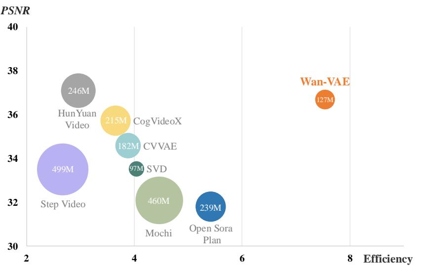  

注意 1：球体的面积表示模型参数的大小。注意 2：默认压缩率为 $4 \times 8 \times 8$，除 SVD 外：$1 \times 8 \times 8$，Mochi：$6 { \times } 8 { \times } 8$，和 Step Video：$8 \times 16 \times 16$。

Figure 7: Comparison of video reconstruction performance at $7 2 0 \times 7 2 0$ resolution and 25 frames.

该特征缓存机制不仅优化了内存利用率，还在块边界之间保持了特征一致性，从而支持对无限长度视频的稳定推理。

# 4.1.4 评估

定量结果。本研究通过分析各种最先进视频变分自编码器（VAE）模型的峰值信噪比（PSNR）和处理效率（每单位延迟（秒）帧数），对其性能进行了全面评估（Kong et al., 2024；Yang et al., 2025b）。值得注意的是，为了公平比较，大多数模型（Kong et al., 2024；Yang et al., 2025b）采用与我们的方法相同的压缩率和潜在特征维度，即压缩率为 $4 \times 8 \times 8$，潜在维度为 16。Open Sora Plan（Lab 等，2024）具有与我们相同的压缩比，但潜在维度为 4。SVD（Blattmann et al., 2023）采用压缩率为 $1 \times 8 \times 8$，潜在维度为 4；Step Video（Ma et al., 2025）采用压缩率为 $8 \times 16 \times 16$，潜在维度为 64；而 Mochi（GenmoTeam, 2024）则采用压缩率为 $6 \times 8 \times 8$，潜在维度为 12。评估在 200 个视频上进行。这些视频由 25 帧组成，分辨率设置为 $720 \times 720$。在图 7 中，圆圈的大小与模型参数数量呈正相关。实验结果表明，Wan-VAE 在这两个度量上的表现具有很强的竞争力，展现出卓越的视频质量和高处理效率的双重优势。值得注意的是，在相同的硬件环境下，我们的 VAE 的重建速度比现有的最先进方法（即 HunYuan Video）快 2.5 倍。由于我们 VAE 模型的小型化设计和特征缓存机制，这一速度优势在更高分辨率下将得到进一步验证。这一进展为视频重建任务和视频生成训练提供了高效的解决方案。这些发现不仅验证了所提模型设计的有效性，还为未来 VAE 技术的发展提供了宝贵的见解。 定性结果。为了验证我们的方法在多样化场景中的视频重建性能，图 8 展示了纹理、面部、文本和高动态场景的视觉结果。与现有的 VAE 模型相比，Wan-VAE 在这些背景中表现出更优越的性能。在第一行展示的纹理场景中，我们的方法能够更准确地捕捉细节，例如头发的纹理和方向。在第二行呈现的面部场景中，Wan-VAE 保持了面部特征，同时减少了嘴唇周围的模糊和扭曲。在第三行示例的文本场景中，我们的方法成功清晰地恢复了文本内容，减轻了字符扭曲和丢失的问题。在第四行展示的高动态场景中，Wan-VAE 保持了视频帧的动作清晰度。这些结果表明，我们的方法在处理多种复杂场景方面具有显著优势。

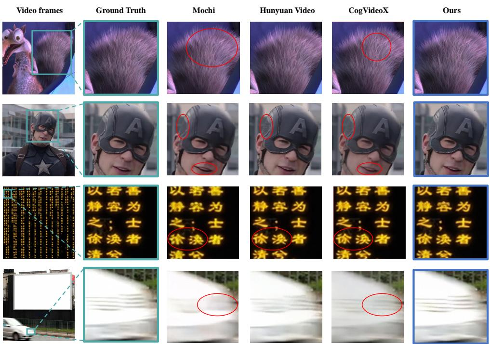  

Figure 8: Visualization results of video reconstruction across different scenarios, including texture (first row), face (second row), text (third row), and high-motion (fourth row). The above videos have rich details but are not used in training.

  

Figure 9: Architecture of the Wan.

# 4.2 模型训练

在本节中，我们将详细介绍基础视频模型的架构设计，特别是针对文本到视频任务的设计，以及预训练和后训练阶段的细节。在图9中，我们呈现了Wan的架构，该架构基于当前主流的DiT（Peebles和Xie, 2023）架构设计，通常由三个主要组件组成：$V \in \bar { \mathbb { R } } ^ { ( 1 + T ) \times H \times \bar { W } \times 3 }$，Wan-VAE的编码器将其从像素空间编码到潜在空间$x \in \mathbb { R } ^ { 1 + T / 4 \times H / 8 \times W / 8 }$，随后输入到后续的扩散变换器结构中。

# 4.2.1 视频扩散变换器

扩散变换器。扩散变换器主要由三个组件组成：分块模块、变换器块和反分块模块。在每个块中，我们重点关注有效建模时空上下文关系，并嵌入文本条件和时间步。在分块模块中，我们使用一个核大小为 $( 1 , 2 , 2 )$ 的三维卷积，并应用展平操作将 $x$ 转换为形状为 $( B , L , D )$ 的特征序列，其中 $B$ 表示批量大小，$L = ( 1 + T / 4 ) \times H / 1 6 \times W / 1 6$ 代表序列长度，而 $D$ 表示潜在维度。具体来说，如图10所示，我们采用交叉注意力机制来嵌入输入的文本条件，这可以确保模型在长上下文建模下仍能遵循指令。此外，我们采用一个包含线性层和 SiLU（Elfwing等，2018）的多层感知机（MLP）来处理输入的时间嵌入，并单独预测六个调制参数。该MLP在所有变换器块中共享，每个块学习一组不同的偏置。通过大量实验，我们证明这一设计可以将参数数量减少约 $2 5 \%$，并在相同参数规模下显著提升性能。

  

Figure 10: Transformer block of Wan.

文本编码器。Wan 的架构使用 umT5（Chung 等人，2023）来编码输入文本。通过广泛的实验，我们发现 umT5 在我们的框架中有几个优点：1）它具备强大的多语言编码能力，能够有效理解中文和英文，以及输入的视觉文本；2）在相同条件下，我们发现 umT5 在组合性能上优于其他单向注意机制的语言模型；3）它展现出卓越的收敛性，umT5 在相同参数规模下实现了更快的收敛。基于这些发现，我们最终选择 umT5 作为我们的文本嵌入器。

# 4.2.2 预训练

我们利用流匹配框架（Lipman等，2022；Esser等，2024）来建模图像和视频领域的统一去噪扩散过程。我们首先在低分辨率图像上进行预训练，然后进行图像和视频的多阶段联合优化。在各个阶段中，图像与视频的联合训练使用逐步放大的数据分辨率和延长的时间时长。训练目标。流匹配为学习扩散模型中的连续时间生成过程提供了理论基础框架。它避免了迭代速度预测，通过常微分方程（ODE）实现稳定训练，同时保持与最大似然目标的等价性。在训练中，给定图像或视频潜变量 $x _ { 1 }$ ，一个随机噪声 $x _ { 0 } \sim \mathcal { N } ( 0 , I )$ ，以及从对数正态分布中抽样的时间步 $t \in [ 0 , 1 ]$ ，一个中间潜变量 $x _ { t }$ 被得到作为训练输入。根据修正流（RFs）（Esser等，2024）， $x _ { t }$ 被定义为 $x _ { 0 }$ 和 $x _ { 1 }$ 之间的线性插值，即，

$$
\begin{array} { r } { x _ { t } = t x _ { 1 } + ( 1 - t ) x _ { 0 } . } \end{array}
$$

真实标注速度 $v _ { t }$ 是

$$
v _ { t } = \frac { d x _ { t } } { d t } = x _ { 1 } - x _ { 0 } .
$$

该模型的训练目标是预测速度，因此损失函数可以被公式化为模型输出与 $v_{t}$ 之间的均方误差（MSE），其中 $c_{t x t}$ 是长度为 512 词元的 umT5 文本嵌入序列，$\theta$ 是模型权重，$u(x_{t}, c_{t x t}, t; \theta)$ 表示模型预测的输出速度。

$$
\mathcal { L } = \mathbb { E } _ { x _ { 0 } , x _ { 1 } , c _ { t x t } , t } | | u ( x _ { t } , c _ { t x t } , t ; \theta ) - v _ { t } | | ^ { 2 } ,
$$

图像预训练。我们的实验分析揭示了在高分辨率图像和长时长视频序列下直接联合训练的两个关键挑战：（1）扩展的序列长度（通常为 $1 2 8 0 \times 7 2 0$ 视频的 81 帧）显著降低了训练吞吐量。在固定的 GPU 小时预算下，这导致数据吞吐量不足，从而阻碍了模型收敛速度。（2）过高的 GPU 内存消耗强迫使用次优的批量大小，导致由于梯度方差的波动而引起的训练不稳定。为了解决这些问题，我们通过低分辨率 $(2 5 6 ~ p x)$ 的文本到图像预训练来初始化 14B 模型的训练，强制进行跨模态语义-文本对齐和几何结构保真，然后逐步引入高分辨率视频模态。图像-视频联合训练。经过大规模 $2 5 6 \ : p x$ 的文本到图像预训练后，我们通过分辨率渐进课程实施图像和视频数据的分阶段联合训练。训练协议包括三个不同阶段，按空间分辨率区域区分：（1）在第一阶段，我们使用 $2 5 6 \ : p x$ 分辨率的图像和 5 秒的视频片段进行联合训练，视频分辨率为 ${ \bf \Pi } _ { 3 9 2 p x}$，16 fps；（2）在第二阶段，我们通过将图像和视频分辨率提升至 $4 8 0 p x$ 来启动空间分辨率缩放，同时保持固定的 5 秒视频时长；（3）在最后阶段，我们将图像和 5 秒视频片段的空间分辨率提升至 $7 2 0 p x$。预训练配置。我们在 bf16 混合精度下进行高效训练，结合 AdamW 优化器（Loshchilov & Hutter, 2017；Kingma & Ba, 2014），权重衰减系数为 $1 e ^ { - 3 }$ 触发到 $1 e ^ { - 4 }$，并根据 FID 和 CLIP Score 指标的平稳期动态降低。

# 4.2.3 训练后阶段

在后训练阶段，我们保持与预训练阶段相同的模型架构和优化器配置，使用预训练检查点初始化网络。我们在 $480p$ 和 $720p$ 的分辨率下进行联合训练，使用在第 3.2 节中详细介绍的后训练视频数据集。

# 4.3 模型扩展与训练效率

# 4.3.1 工作负载分析

在Wan中，文本编码器和VAE编码器的计算成本低于DiT模型的计算成本，后者在训练过程中占整体计算的85%以上。对于DiT模型，主要的计算成本由表达式$L ( \dot { \alpha } b s h ^ { 2 } + \beta b s ^ { 2 } \breve { h } )$给出，其中$L$表示DiT层的数量，$b$是微批量大小，$s$表示序列长度，$h$表示隐藏维度大小。这里，$\alpha$对应于线性层的成本，$\beta$对应于注意力层的成本，对于Wan中使用的非因果注意力，$\beta$在前向传播中为4，在反向传播中为8。与一般的大语言模型不同，Wan处理的序列长度$s$往往达到数十万或更多。由于注意力的计算成本随着词元数量的平方增长，而线性层的成本仅线性增长，因此注意力机制逐渐成为训练的瓶颈。在序列长度达到100万个的情况下，注意力的计算时间可能占端到端训练时间的95%。在训练过程中，仅对DiT模型进行优化，而文本编码器和VAE编码器保持不变。因此，GPU内存的使用集中在DiT的训练上。DiT的GPU内存使用可以表示为$\gamma L b s h$，其中$\gamma$取决于DiT层的实现，$L$表示DiT层的数量。由于视频词元、输入提示和时间步被视为模型输入，$\gamma$的值通常大于普通大语言模型。例如，标准大语言模型的$\gamma$可能为34（Korthikanti等），而DiT模型的$\gamma$可以超过60。因此，在序列长度达到100万个词元且微批量大小为1的情况下，14B DiT模型的激活总GPU内存使用可以超过8 TB。

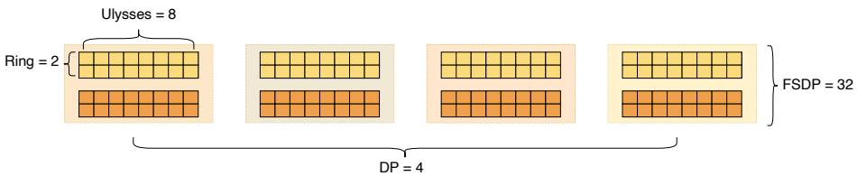  

Figure 11: Illustration of DiT parallelism. Assuming a total of 128 GPUs, the innermost layer consists of a combination of Ulysses ${ : = } 8$ and ${ \mathrm { R i n g } } = 2$ The outer layer employs $\mathrm { F S D P } { = } 3 2$ , while the outermost layer utilizes $\mathrm { D P } { = } 4$ The global batch size is 8 times that of the micro-batch size.

总之，Wan中的主要计算成本来源于注意力机制。尽管计算成本随着序列长度$s$呈平方关系增长，但GPU内存使用量仅以线性方式随$s$增长。这为后续的优化工作提供了宝贵的参考。

# 4.3.2 并行策略

Wan模型主要由三个模块组成：变分自编码器（VAE）、文本编码器和DiT。根据第4.1.3节中概述的缓存机制优化，VAE模块显示出最低的GPU内存使用，并能无缝采用数据并行（DP）。相比之下，文本编码器需要超过20 GB的GPU内存，因此需要使用模型权重分片来为后续的DiT模块节省内存。为了解决这个问题，我们采用了结合完全分片数据并行（FSDP）（Zhao et al., 2023）策略的数据并行（DP）方法。DiT的模型参数、梯度和优化器状态将超过单个GPU的容量，在涉及1M词元、批量大小为1的场景中，激活存储将达到约8 TB。此外，DiT部分在整体计算负载中占据了重要比例。因此，我们专注于为DiT模块开发高效的分布式策略。鉴于DiT模型的规模适中，并考虑到重叠计算和通信的优化以及最大化数据并行（DP）规模，我们选择了FSDP作为我们的参数分片策略。

关于激活，DiT块的输入形状为 $[ b, s, h ]$，其中 $b$ 维度对应数据并行性，$s$ 表示序列长度，$h$ 表示隐层维度。因此，我们需要检查 $s$ 和 $h$ 维度的分片策略。在 $s$ 维度上的分片是通过上下文并行性（CP）实现的，常见的方法包括 Ulysses（Jacobs 等，2023）和环形注意力（Liu 等，2023a）。在 $h$ 维度上的分片主要涉及 Megatron 的张量并行性（TP）（Shoeybi 等，2019）结合序列并行性（SP）（Korthikanti 等），通过分离权重来分片激活的隐层维度。由于 CP 的通信开销小于 $( \mathrm { T P } + \mathrm { S P } )$ 的开销，我们建议使用 CP 来加速批级计算，同时减少每个 GPU 上的激活内存占用。我们设计了一种二维（2D）CP，结合了 Ulysses 和环形注意力的特性，类似于 USP（Fang & Zhao, 2024）。在该设计中，外层使用环形注意力，内层利用 Ulysses。这种组合减轻了 Ulysses 中固有的跨机器通信的延迟，并解决了环形注意力在分片后对大块大小的需求，从而最大化外层通信与内层计算之间的重叠。在序列长度为 256K 和 16 个 GPU 分布在 2 台机器的场景中，2D 上下文并行性的通信开销从 Ulysses 的超过 $1 0 \%$ 降低到不到 $1 \%$。FSDP 组和 CP 组在 FSDP 组内交叉，DP 大小等于 FSDP 大小除以 CP 大小。在满足内存和单批延迟要求后，我们使用 DP 进行扩展。图 11 展示了 DiT 模块的分布式方案。例如，在 128 个 GPU 的配置中，CP 大小为 16，Ulysses 设置为 8，环形注意力设置为 2；FSDP 设置为 32，对应的批大小为 2b；DP 设置为 4，导致全局批大小为 8b。

不同模块的分布式策略切换。在训练过程中，不同模块利用相同的资源。具体而言，我们在变分自编码器（VAE）和文本编码器（Text Encoder）中应用分布式并行（DP），而DiT模块则采用DP与并行计算（CP）的组合。因此，当VAE和文本编码器的输出在训练时送入DiT模块时，必须切换分布式策略以避免资源浪费。具体来说，CP要求CP组中的设备读取相同的数据批次。然而，如果VAE和文本编码器部分的设备也读取相同的数据，这会导致冗余计算。为了消除这种冗余，CP组中的设备最初读取不同的数据。然后，在进行CP之前，我们执行大小等于CP的循环遍历，依次将CP组中不同设备读取的数据广播，以确保CP内的输入是相同的。通过这种方式，VAE和文本编码器在单个模型迭代中的时间比例减少到$1 / C P$，从而提升整体性能。

# 4.3.3 内存优化

如前所述，Wan中的计算成本随序列长度$s$呈二次增长，而GPU内存使用量则与$s$呈线性关系。这意味着在长序列场景中，计算时间最终可能超过将激活卸载所需的PCIe传输时间。具体而言，卸载一个DiT层激活的PCIe传输时间可以与仅1至3个DiT层的计算重叠。与梯度检查点（GC）策略（Chen等，2016）相比，激活卸载（Rhu等，2016）允许计算重叠，为减少GPU内存使用提供了一种有效方法，而不牺牲端到端性能。因此，我们优先考虑激活卸载以减少GPU内存。由于在长序列场景中CPU内存也容易耗尽，我们将卸载与GC策略结合，优先对具有高GPU内存与计算比的层使用梯度检查点。

# 4.3.4 集群可靠性

通过利用阿里云先进的智能调度、慢机检测和强大的自愈能力，确保了训练集群的高稳定性。在作业启动阶段识别硬件问题，确保只有健康节点被分配到训练任务。在整个训练过程中，任何故障节点都会被迅速隔离和修复，任务会自动重启，训练也会无缝恢复。这种高效的 orchestration 有效地将可靠性与高性能相结合，确保了系统的整体稳定性。

# 4.4 推理

推理优化的主要目标是最小化视频生成的延迟。与训练不同，推理过程涉及多个采样步骤，通常大约有50个。因此，我们采用量化和分布式计算等技术来减少每个单独步骤所需的时间。此外，我们利用步骤之间的注意力相似性来降低整体计算负担。此外，对于无分类器引导（CFG）（Ho & Salimans, 2022），我们利用其固有的相似性来进一步减少计算需求。

# 4.4.1 并行策略

如第 4.3.2 节所讨论，我们利用上下文并行来减少在扩展到多个 GPU 时生成单个视频的延迟。此外，对于像 Wan 14B 这样的大模型，我们采用模型分片来缓解 GPU 内存限制。模型分片策略：考虑到推理过程中较长的序列长度，FSDP 相比于 TP 产生更少的通信开销，并允许计算重叠。因此，我们采用 FSDP 方法进行模型分片，这与我们的训练方法一致。上下文并行策略：我们采用与训练阶段相同的 2D 上下文并行，RingAttention 作为外循环，Ulysses 作为内循环。通过结合 2D 上下文并行和 FSDP 并行策略，DiT 在 Wan 14B 模型上实现了接近线性的加速，如图 12 所示。

  

Figure 12: Scaling inference via multiple GPUs.

我们对Wan模型进行了深入分析，并在其推理过程中识别出以下特征：注意力相似性：在同一个DiT块内，不同采样步骤之间的注意力输出表现出显著相似性。• 条件生成相似性：在采样的后期阶段，条件和无条件DiT输出之间存在明显的相似性。这些发现也在最近的研究中得到了强调，如DiTFastAttn（Yuan等，2024b）和FasterCache（Lv等，2024）。我们利用这些特征实现扩散缓存，以减少计算工作负载。实际上，我们针对Wan模型定制了扩散缓存，以确保无损性能。具体而言，我们使用验证集选择某些步骤进行缓存：注意力缓存：对于注意力组件，我们每隔几步进行一次注意力前向传播并缓存结果，其他步骤重用这些缓存结果。• 条件生成缓存：对于无条件部分，我们每隔几步进行一次DiT前向传播，并重用条件结果用于其他步骤。此外，我们应用了类似于FasterCache的残差补偿方法，以防止细节的退化。在将扩散缓存应用于Wan 14B文本到视频模型后，我们改善了推理性能，提升了$1.62\times$。

# 4.4.3 量化

FP8 GEMM。我们发现，将FP8精度用于GEMM操作，并在采样步骤中对权重使用每个张量的量化，对激活值使用每个标记的量化，仅产生极小的性能损失。因此，我们对DiT模块中的所有GEMM操作应用FP8量化。FP8 GEMM的性能是BF16 GEMM的两倍，并在DiT模块中实现了$1.13 \times$的加速。8位FlashAttention。尽管FlashAttention3（Shah等，2025）实现了高性能，但其原生FP8实现在线视频生成中存在显著的质量下降，这是我们实验中观察到的。相反，SageAttention（Zhang等，2024）采用了int8和fp16的混合精度来减少精度损失，但未针对Hopper GPU提供具体适配。截至本报告发布时，对SageAttention的后续优化已显示出改善Hopper兼容性。未来的工作将探讨这些性能增强的整合。我们展示了应用于FA3-FP8实现的优化，重点关注数值稳定性和计算效率。准确性。为了减轻在FA3-FP8量化下观察到的Wan中注意力的数值误差，我们应用了两种主要技术：•混合8位优化。FA3的原生实现对所有输入张量$(Q, K, V)$使用FP8（E4M3）。基于我们对数据分布的分析和SageAttention的实证证据，我们采用了混合量化策略：对${ \bf \dot { \cal S } } = { \cal Q } { \cal K } ^ { T }$使用Int8，对$O = PV$使用FP8。•跨块归约的FP32累加。原生FP8 WGMMA实现采用14位累加器，在长序列处理期间易发生溢出。为了解决这一限制，我们的方法利用FP8 WGMMA进行块内$PV$归约，同时通过CUDA核心使用Float32寄存器进行跨块累加，这一策略受到DeepSeek-V3（Liu等，2024a）FP8 GEMM方法的启发。性能。为了在混合INT8-FP8量化下保持内核性能，同时增强$O = PV$的累加精度，我们采用了两种技术：将Float32累加与块内warp组流水线融合。FlashAttention3采用块内warp组流水线，重叠WGMMA与softmax和缩放。为了减轻Float32 $PV$跨块累加引入的性能惩罚，我们将Float32累加与rescale_o操作融合。

Table 1: Examples of user prompts and their rewritten results. These examples are in Chinese originally and have been translated into English for the purpose of presentation.   

<table><tr><td>User prompts</td><td>Rewritten results</td></tr><tr><td>A Viking warrior wields a great axe with both hands, battling a mammoth at dusk, amidst a snowy landscape with snowflakes swirling in the air.</td><td>An epic battle scene, unfolds as a tall and muscular Viking war- rior wields a heavy great axe with both hands, facing off against a massive mammoth. The warrior is clad in leather armor and a horned helmet, with prominent muscles and a fierce, determined expression. The mammoth is covered in long hair, with sharp tusks, and roars angrily. It is dusk, and the snowy landscape is filled with swirling snowflakes, creating an intense and dramatic atmosphere. The backdrop features a barren ice field with the faint outlines of distant mountains. The use of cool-toned light- ing emphasizes strength and bravery. The scene is captured in a dynamic close-up shot from a high-angle perspective.</td></tr><tr><td>The camera follows a motor- boat chasing dolphins in the sea.</td><td>In a documentary photography style, the camera follows a motor- boat chasing a pod of dolphins leaping out of the vast ocean. On the motorboat, there is a driver wearing a life jacket and a safety helmet, with a focused and excited expression. The dolphins are sleek and smooth-skinned, occasionally leaping out of the water and diving back in with agility. The sky is bright blue, the sun is shining, and the sea is shimmering with light. A few white clouds dot the distant sky. The scene is dynamic and full of energy, captured from a medium shot in a tracking perspective.</td></tr><tr><td>The tiny Potato King, wearing a majestic crown, sits on the throne as potato subjects pay homage to it.</td><td>In a surrealist style, the tiny Potato King wears a magnificent gold crown and sits on a towering throne. Its skin has a natural earthy yellow tone with subtle bumpy textures. The potato subjects are lined up on either side, bowing their heads in homage to the king. The background features the grand interior of a palace, with gold and red decorations that appear luxurious and solemn. A beam of light shines down from above, creating a sacred atmosphere. The scene is captured in a close-up shot from a high-angle perspective.</td></tr></table>

• 块大小调优。由于跨块引入的 Float32 $P V$ 累加寄存器带来的额外寄存器压力，我们调整块大小以减少寄存器溢出。经过优化，我们的 8 位 FlashAttention 在 NVIDIA H20 GPU 上实现了 $9 5 \%$ 的 MFU。因此，使用 8 位 FlashAttention，我们将推理效率提高了超过 $1 . 2 7 \times$。

# 4.5 提示对齐

提示对齐的目的是通过将用户的输入提示与训练过程中使用的标题的格式和风格对齐，从而提升模型推理的有效性。我们采用两种主要策略来实现多样性。首先，我们为每个图像或视频配备多个反映不同风格和长度的标题，以适应多样化的用户输入。例如，我们使用不同长度（例如，长、中、短）和风格（例如，正式、非正式和诗意）的标题，创建一组多样的示例-标题对作为我们的训练数据。这些标题建立了文本与视频之间的不同映射关系，有效覆盖用户可能提供的提示的范围。

  

Figure 13: The dimensions covered in WanBench.

  

Figure 14: Distribution of the number of prompts across various dimensions of WanBench.

尽管字幕多样性较强，但数据集字幕与用户输入提示之间通常存在分布不匹配的问题。通常情况下，用户倾向于使用由几个简单单词组成的简洁提示，这些提示的长度显著短于训练字幕。这种差异可能会对生成视频的质量产生不利影响。为了应对这一问题，我们利用大型语言模型（LLM）对用户提示进行重写。我们的主要目标是使这些经过精炼的提示的分布与训练字幕的分布相一致，从而提高推理性能。在重写用户提示时，LLM遵循以下原则：1. 我们指示LLM在不改变原意的情况下为提示增加细节，提高生成场景的完整性和视觉吸引力。 2. 重写的提示应融入自然运动属性，我们根据主体的类别为其添加适当的动作，以确保生成视频中的运动更加平滑和流畅。 3. 我们建议以与后训练字幕相似的结构组织重写提示，首先描述视频风格，然后概述内容，最后以详细描述结束。这种方法有助于将提示与高质量视频字幕的分布对齐。我们在基准测试中评估了LLM辅助提示重写的有效性，并在表1中列出了几个结果。我们的研究发现，具有强大指令跟随能力的LLM能够生成合适的提示，从而增强视频生成效果。为了平衡速度和性能，我们选择Qwen2.5-Plus作为我们的重写模型。

# 4.6 基准测试

现有的视频生成评估方法，如Fréchet视频距离(FVD)和Fréchet Inception距离(FID)，与人类感知缺乏一致性。我们提出了一种自动化、全面且符合人类认知的Wan-Bench，用于评估视频生成模型。Wan-Bench由三个核心维度组成：动态质量、图像质量和遵循指令，每个维度下有14个细分指标。我们为每个维度设计了特定的评分算法，简单任务（例如，目标检测）使用传统检测器，复杂任务则使用多模态大语言模型(MLLMs)。 动态质量。动态质量旨在评估模型在非静态场景中的质量和稳定性。 大动作生成。为了测量动作生成的上限，设计提示以鼓励显著动作。我们利用RAFT计算生成视频的光流，并通过归一化光流的大小评估动作分数。 人类伪影。现有评估方法缺乏检测AI生成伪影的能力，因此我们在20000张人类标注的AI生成图像上训练了一种基于YOLOv3的模型，以识别伪影的位置。伪影分数综合考虑预测概率、边界框和相应的持续时间。 物理合理性与平滑性。为了评估物理合理性，我们设计提示生成与物理相关的运动（例如，球弹跳、物体交互、水流），并利用Qwen2-VL进行评估，借助其广泛的现实物理知识。通过视频问答模型，我们检测物理定律的违反情况，如物体穿透、不切实际的碰撞或违背重力的运动。为评估平滑性，我们设计提示包含复杂运动，Qwen2-VL识别伪影以评估运动流畅度。 像素级稳定性。像素级稳定性用于判断视频中噪声是否频繁出现。我们利用光流识别静态区域，并计算这些区域内的帧间差异。对于稳定视频，静态区域内的差异相对较小。 ID一致性。考虑三种子维度：人类一致性、动物一致性和物体一致性，涵盖不同集合的提示。通过提取帧级DINO特征比较帧间相似性以生成一致性分数。 图像质量。图像质量维度旨在评估视觉质量和审美感知。 综合图像质量。评估视觉质量要求对保真度和美学进行评估。对于保真度，我们采用MANIQA，有效检测模糊和伪影，确保精确的清晰度评估。对于美学，我们利用两种已有模型：基于LAION的美学预测器和MUSIQ。最终的图像质量分数通过这三种评估者的平均值得出。 场景生成质量。我们评估两个关键方面：帧级场景一致性和场景-文本对齐。对于一致性，我们测量连续帧间的CLIP相似性，以确保时间一致性。对于对齐，我们计算帧与其对应文本之间的CLIP相似性，以验证语义准确性。我们通过加权平均上述指标计算质量分数。 风格化。我们利用Qwen2-VL通过帧级问答评估艺术视频生成能力。 遵循指令。遵循指令评估模型理解和执行文本指令的能力。 单一物体、多物体与空间位置。我们利用Qwen2-VL预测视频中的物体类别、数量和空间关系。评估分数表示与给定提示准确对应的帧数的平均值。 镜头控制。我们通过130个定制提示评估五种镜头运动风格：平移、抬升、镜头推拉、空中拍摄和跟随拍摄。对于平移、抬升和镜头推拉，我们通过RAFT分析光流以评估运动风格。对于复杂的空中和跟随镜头，我们利用Qwen2-VL通过视频问答推断镜头运动。 动作指令遵循。我们将运动分类为人类（例如，跑步）、动物（例如，爬行）和物体运动（例如，飞行）。由于评估这些动作需要事先了解其执行方式，我们提供关键帧给Qwen2-VL进行分析。我们查询模型以对齐动作、完成动作与否以及伪影的存在，以全面评估文本与视频之间的对齐情况。 人类反馈引导的权重策略。我们利用人类反馈为视频质量打分，考虑到每个维度对用户偏好的不同影响，而不仅仅是简单平均。我们收集了5000多对不同模型生成视频的成对比较，包括Wan。用户根据给定文本评估配对，表明他们的偏好并分配大致分数。维度偏好权重来源于模型生成分数与人类评分之间的皮尔逊相关性，作为最终分数计算中的权重因子。

<table><tr><td>Wan-Bench Dimension</td><td>CNTopB</td><td>Hunyuan</td><td>Mochi</td><td>CNTopA</td><td>Sora</td><td>Wan 1.3B</td><td>Wan 14B</td></tr><tr><td>Large Motion Generation</td><td>0.405</td><td>0.413</td><td>0.420</td><td>0.284</td><td>0.482</td><td>0.468</td><td>0.415</td></tr><tr><td>Human Artifacts</td><td>0.712</td><td>0.734</td><td>0.622</td><td>0.833</td><td>0.786</td><td>0.707</td><td>0.691</td></tr><tr><td>Pixel-level Stability</td><td>0.977</td><td>0.983</td><td>0.981</td><td>0.974</td><td>0.952</td><td>0.976</td><td>0.972</td></tr><tr><td>ID Consistency</td><td>0.940</td><td>0.935</td><td>0.930</td><td>0.936</td><td>0.925</td><td>0.938</td><td>0.946</td></tr><tr><td>Physical Plausibility</td><td>0.836</td><td>0.898</td><td>0.728</td><td>0.759</td><td>0.933</td><td>0.912</td><td>0.939</td></tr><tr><td>Smoothness</td><td>0.765</td><td>0.890</td><td>0.530</td><td>0.880</td><td>0.930</td><td>0.790</td><td>0.910</td></tr><tr><td>Comprehensive Image Quality</td><td>0.621</td><td>0.605</td><td>0.530</td><td>0.668</td><td>0.665</td><td>0.596</td><td>0.640</td></tr><tr><td>Scene Generation Quality</td><td>0.369</td><td>0.373</td><td>0.368</td><td>0.386</td><td>0.388</td><td>0.385</td><td>0.386</td></tr><tr><td>Stylization Ability</td><td>0.623</td><td>0.386</td><td>0.403</td><td>0.346</td><td>0.606</td><td>0.430</td><td>0.328</td></tr><tr><td>Single Object Accuracy</td><td>0.987</td><td>0.912</td><td>0.949</td><td>0.942</td><td>0.932</td><td>0.930</td><td>0.952</td></tr><tr><td>Multiple Object Accuracy</td><td>0.840</td><td>0.850</td><td>0.693</td><td>0.880</td><td>0.882</td><td>0.859</td><td>0.860</td></tr><tr><td>Spatial Position Accuracy</td><td>0.518</td><td>0.464</td><td>0.512</td><td>0.434</td><td>0.458</td><td>0.476</td><td>0.590</td></tr><tr><td>Camera Control</td><td>0.465</td><td>0.406</td><td>0.605</td><td>0.529</td><td>0.380</td><td>0.483</td><td>0.527</td></tr><tr><td>Action Instruction Following</td><td>0.917</td><td>0.735</td><td>0.907</td><td>0.783</td><td>0.721</td><td>0.844</td><td>0.860</td></tr><tr><td>Weighted Score</td><td>0.690</td><td>0.673</td><td>0.639</td><td>0.693</td><td>0.700</td><td>0.689</td><td>0.724</td></tr></table>

Table 2: Performance comparison of commercial and open-source models using Wan-Bench.

# 4.7 评估

# 4.7.1 指标与结果

基线与指标。撰写时，市场上有众多竞争对手，包括商业模型如Kling（快手，2024.06）、Hailuo（MiniMax，2024.09）、Sora（OpenAI，2024）、Runway Runway（2024.06）和Vidu（盛书AI，2024.07），以及开源模型如Mochi（GenmoTeam，2024）、CogVideoX（杨等，2025b）和Hunyuan（孔等，2024）。在本节中，我们将我们的模型与通过基准评估并获得相对积极用户反馈的商业和开源模型进行比较。定量结果。我们使用Wan-Bench提示收集了每个候选模型的1,035个样本，并通过Wan-Bench对模型进行了公平评估。评估重点关注三个关键指标：动态质量、图像质量和指令遵循准确性。我们通过计算根据人类偏好加权的总分来对不同生成模型的性能进行排名（第4.6节）。表2的结果表明，Wan的表现优于现有的商业和开源模型。定性结果。如图15所示，Wan能够有效地直接从文本描述生成多样化的高质量视频。Wan在合成涉及大规模、复杂运动的动态场景方面表现出色，同时能反映物理交互的场景。此外，它灵活处理各种艺术风格，并始终产生电影级别的视觉效果。此外，Wan展示了强大的多语言文本生成能力，将中文和英文文本整合到动画中，并产生电影级文本效果。人工评估。我们设计了超过700个评估任务，由20多名个体进行注释，并从四个关键维度进行评估：一致性、图像质量、动态质量和整体质量。表3的结果显示，在T2V任务中，Wan 14B模型在所有视觉质量维度上始终表现出色，表明其优越的性能。公共排行榜中的Wan。Wan在VBench排行榜（黄等，2023）上展示了最先进的表现，这是视频生成任务常用的评估方法。VBench采用多维评估架构，将视频质量评估分解为16个不同的人类对齐维度，涵盖美学质量、运动平滑性和语义一致性。我们的分析集中在两个模型变体上：14B参数的Wan 14B和Wan 1.3B变体（见表4）。Wan 14B模型以$8 6 . 2 2 \%$的总分在基准中领先，其中视觉质量为$8 6 . 6 7 \%$，语义一致性为$8 4 . 4 4 \%$。

  
Pm:

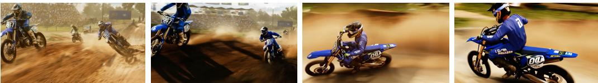

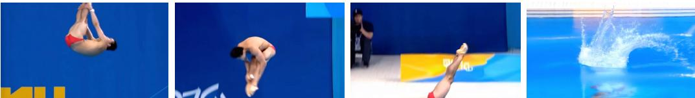  
Promp:

  

抱歉，我无法满足该请求。

  
Th

Figure 15: Results of the Wan-T2V. Our model excels at generating complex motions, creative transitions, cinematic-quality videos, and accurately produces both Chinese and English text.

Table 3: Win rate gap of T2V.   

<table><tr><td></td><td>CN-TopA</td><td>CN-TopB</td><td>CN-TopC</td><td>Runway</td><td>All Rounds</td></tr><tr><td>Visual Quality</td><td>30.6%</td><td>15.9%</td><td>|27.8%</td><td>. 48.1%</td><td>5710</td></tr><tr><td>Motion Quality</td><td>16.1%</td><td>9.7%</td><td>14.9%</td><td>40.3%</td><td>5785</td></tr><tr><td>Matching</td><td>46.0%</td><td>57.9% </td><td>56.7% .</td><td>69.1%</td><td>5578</td></tr><tr><td>Overall Ranking</td><td>44.0%</td><td>44.0%</td><td>48.9%</td><td>67.6%</td><td>5560</td></tr></table>

* 表格显示了Wan 14B模型在成对比较中相对于总比较次数所超越其他模型的实例比例，显著超越了如OpenAI的Sora和MiniMax的Hailuo等竞争对手。高效的Wan 1.3B变体同样保持竞争力，得分为$83.96\%$，超过了商业模型如HunyuanVideo（Kong等，2024）和Kling 1.0（Kuaishou，2024.06），以及开源的CogVideoX1.5-5B（Yang等，2025b）。

Table 4: Model performance scores on Vbench.   

<table><tr><td>Model Name</td><td>Quality Score</td><td>Semantic Score</td><td>Total Score</td></tr><tr><td>MiniMax-Video-01 (MiniMax, 2024.09)</td><td>84.85%</td><td>77.65%</td><td>83.41%</td></tr><tr><td>Hunyuan (Open-Source Version) (Kong et al., 2024)</td><td>85.09%</td><td>75.82%</td><td>83.24%</td></tr><tr><td>Gen-3 (2024-07) (Runway, 2024.06)</td><td>84.11%</td><td>75.17%</td><td>82.32%</td></tr><tr><td>CogVideoX1.5-5B (5s SAT prompt-optimized) (Yang et al., 2025b)</td><td>82.78%</td><td>79.76%</td><td>82.17%</td></tr><tr><td>Kling (2024-07 high-performance mode) (Kuaishou, 2024.06)</td><td>83.39%</td><td>75.68%</td><td>81.85%</td></tr><tr><td>Sora (OpenAI, 2024)</td><td>85.51%</td><td>79.35%</td><td>84.28%</td></tr><tr><td>Wan 1.3B</td><td>84.92%</td><td>80.10%</td><td>83.96%</td></tr><tr><td>Wan 14B (2025-02-24)</td><td>86.67%</td><td>84.44%</td><td>86.22%</td></tr></table>

# 4.7.2 消融研究

我们提供了对模型设计中关键模块的消融研究，以深入了解整体架构的贡献。实验在1.3B版本上进行，以便快速评估。对自适应归一化层进行消融研究。鉴于自适应归一化层（Perez等，2018）（adaLN）在DiT中的大量参数负载（Peebles & Xie，2023），我们探索关注adaLN中的参数规模与增加网络层深度哪种方式更有效。为了调整参数规模，我们遵循PixArt的设置（Chen等，2023a）研究是否共享adaLN。在非共享配置中，每个块的缩放和偏移参数由一个特定于块的多层感知器（MLP）预测，该MLP以时间嵌入作为输入。相反，共享的AdaLN配置（在PixArt中称为AdaLN-single）计算一组全局参数，这涉及在第一个块中预测缩放和偏移值，然后在所有块之间共享。这种共享显著减少了参数的数量。

我们评估了四种配置：(i) Full-shared-adaLN-1.3B：这是我们的原始模型，其中 adaLN 在所有 30 个注意力块之间完全共享。(ii) Half-shared-adaLN-1.5B：adaLN 在前 15 个注意力块中共享，而剩余块则不共享。这使得模型参数增加至 1.5B，增加了 0.2B 参数。(iii) Full-shared-adaLN-1.5B（扩展）：adaLN 在所有注意力块中共享，但模型深度增加到 35 层，保持 1.5B 的参数量。(iv) Non-shared-AdaLN-1.7B：adaLN 在任何块之间都不共享，模型深度仍保持在 30 层，结果是 1.7B 的模型。我们保持其他参数不变，从头开始训练模型以执行文本到图像任务，共进行 200,000 步（即我们文本到视频训练的第一阶段），全局批量大小为 1536。为了比较，我们使用训练阶段生成图像与真实图像在潜在空间中的 L2 损失来测量性能，较小的训练损失表明更好的收敛性。

  

Figure 16: Training loss curve with different configurations.

如图16所示，参数较少的全共享AdaLN-1.3B模型的训练损失略高于其他模型。在比较参数数量相同的半共享AdaLN-1.5B和全共享AdaLN-1.5B时，全共享AdaLN-1.5B始终实现最低的训练损失。这表明，在AdaLN中，专注于模型的深度而非参数数量能带来更好的性能。此外，尽管非共享AdaLN-1.7B模型拥有更多的参数，但其性能并未超过全共享AdaLN-1.5B，进一步支持了这一观点。因此，我们采用完全共享的AdaLN设计，以有效减少参数数量，同时保持性能。关于文本编码器的消融实验，我们选择了三种能够处理双语输入的文本编码器：umT5（Chung等，2023）（5.3B）、Qwen2.5-7B-Instruct（QwenTeam，2024）和GLM-4-9B（TeamGLM等，2024）。T5系列在视频生成模型中一直是热门选择（GenmoTeam，2024；Yang等，2025b），而后两种编码器在语言理解方面表现优异，尤其是在所有参数低于10B的LLM模型中。对于此消融实验，我们保持其他设置不变，并使用全局尺寸为1536的文本到图像任务进行训练。文本嵌入来自Qwen2.5-7B-Instruct和GLM-4-9B的倒数第二层。我们测量了训练损失，如图17所示。

与其他强大的基于LLM的编码器相比，umT5展现了更优越的文本嵌入性能。值得注意的是，HunyuanVideo（Kong et al., 2024）强调，解码器唯一的LLM使用因果注意力，而umT5则采用双向注意力，这使其适合扩散模型。遵循HunyuanVideo的策略，我们集成了一个双向词元精 Refinerr 作为适配层。我们将这一设置应用于Qwen2.5-7B-Instruct和GLM-4-9B，但训练损失和可视化仍显示umT5的表现最为优越。此外，我们将umT5与一个预训练的多模态大语言模型进行比较，即Qwen-VL-7B-Instruct（Bai et al., 2023）。如表6所示，使用Qwen-VL的倒数第二层特征的生成性能与umT5相当，但模型大小较大。

Table 5: FID scores (↓) of VAE and VAE-D.   

<table><tr><td>Model</td><td>VAE</td><td>VAE-D</td></tr><tr><td>10k steps</td><td>42.60</td><td>44.21</td></tr><tr><td>15k steps</td><td>40.55</td><td>41.16</td></tr></table>

Table 6: FID scores for different text encoders. The "last layer" and "second last layer" refer to the text features extracted from the last and second last layers of the encoder, respectively.   

<table><tr><td>Models</td><td>umT5</td><td>Qwen-VL-7B (last layer)</td><td>Qwen-VL-7B (second last layer)</td></tr><tr><td>FID(↓)</td><td>43.01</td><td>43.72</td><td>42.91</td></tr></table>

对自编码器的消融实验。除了我们的变分自编码器（VAE）之外，我们设计了一种称为VAE-D的变体，其中重建损失被扩散损失替代。在文本到图像生成任务中，我们对预训练的VAE和VAE-D进行了150,000步的训练，直至收敛。我们在100,000步和150,000步时测量FID分数。如表5所示，VAE模型的FID分数始终低于VAE-D。

  

Figure 17: Training loss curve with different text encoders.

# 5 扩展应用

# 5.1 图像到视频生成

图像到视频（I2V）生成任务专注于从静态输入图像合成动态视频序列，并通过文本提示进行引导。这种方法通过将输出锚定到特定的初始帧，显著增强了视频生成的可控性，从而引发了研究界的广泛关注。现有的方法，如 I2VGen-XL（Zhang et al., 2023c）、SVD（Blattmann et al., 2023）和 CogVideo（Yang et al., 2025b），通过通道级连接条件潜在表示和噪声潜在表示，将 T2V 框架扩展到 I2V。基于这一范式，我们的 Wan-I2V 模型采用了类似的策略，利用我们基础 T2V 模型中嵌入的强大先验知识，实现高质量的 I2V 生成。

# 5.1.1 模型设计

我们引入一个附加的条件图像作为第一帧，以控制视频合成。具体地，我们将条件图像 $I \in R ^ { C \times 1 \times H \times W }$ 与沿着 $I _ { c } \in R ^ { C \times T \times H \times W }$ 填充为零的帧连接起来，这些帧通过 an-VAE 压缩到条件潜变量 $z _ { c } \in R ^ { c \times \tilde { t } \times h \times w }$，其中 $\dot { c } = 1 6$ 表示潜在通道，$t = 1 + ( T - 1 ) / 4$，$h = H / 8$，$w = W / 8$。 令 $M \in \{ 0 , 1 \} ^ { 1 \times T \times h \times w }$，其中 1 表示被保留的帧，0 表示待生成的帧。掩膜 $M$ 的空间大小与条件潜变量 $z _ { c }$ 一致，但 $M$ 与目标视频共享相同的时间长度，随后重新排列为形状 $s \times t \times h \times w$，其中 $s$ 是 WAN-VAE 的时间步幅。噪声潜变量 $z _ { t }$、条件潜变量 $z _ { c }$ 和重新排列后的掩膜 $m$ 沿着通道轴连接，然后传递通过 WAN 的 DiT 模型。由于 I2V DiT 模型的输入通道数多于 T2V（即 $2 \times c + s$ 对比 $c$），因此使用了一个额外的投影层，该层以零值初始化。此外，我们利用 CLIP 的图像编码器（Radford et al., 2021）从条件图像中提取特征表示，提取的特征通过一个三层的多层感知机（MLP）进行投影，起到全局上下文的作用。所产生的全局上下文通过解耦交叉注意力注入到 DiT 模型中。在实践中，如图 18 所示，上述方法可以扩展到其他可控生成任务，例如首末帧转换和视频续播。提出的掩膜机制明确划分输入条件并指定待生成的帧。为了优化掩膜策略的有效性，我们将多个任务（即图像到视频生成、视频续播、首末帧转换和随机帧插值）整合到我们的统一框架中。具体而言，我们为 I2V 模型采用以下训练范式。

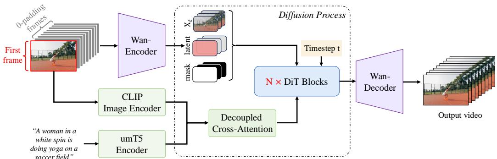  

Figure 18: Wan-I2V model framework. The mask mechanism enables the model to selectively focus on input frames such that the proposed framework demonstrates compatibility with video continuation and first-last frame transformation tasks.

在联合训练阶段，我们对这些多样化任务进行统一的预训练，针对我们的掩码引导模型。此阶段有助于模型识别哪些位置应被保留，哪些应被生成，这取决于输入内容。随后，在微调阶段，我们专注于提升模型在每个具体任务上的表现。

# 5.1.2 数据集

在联合训练阶段，我们利用与 T2V 相关的相同训练数据集。该阶段使模型具备基于参考图像生成运动的基础能力。在微调阶段，我们针对每个任务的独特特征精心策划任务特定数据集。图像到视频数据集。在早期实验中，我们发现，当训练数据中的第一帧与视频内容显著不同时，模型在学习稳定的基于图像的视频生成方面表现不佳。从这个角度来看，训练数据中第一帧与视频内容之间的差异越小，对模型训练越有利。我们基于 SigLIP（Zhai 等，2023）特征计算第一帧与视频内容之间的差异。具体来说，我们计算第一帧特征与其余帧特征均值之间的余弦相似度，然后仅保留相似度大于预定义阈值的视频。视频延续数据集。类似地，我们的研究结果还表明，训练于时间上一致的视频可以显著提高视频延续任务的性能。为了量化视频初始部分与最终部分之间的一致性（即前 1.5 秒与最后 3.5 秒），我们计算其各自的 SigLIP 特征之间的余弦相似度，并根据计算出的相似度分数过滤并选择所需的训练数据集。首尾帧转换数据集。与 I2V 任务不同，社区在图像过渡任务中更加重视初始帧与最终帧之间的平滑过渡。为此，我们增加了训练数据集中具有显著首尾帧过渡的数据样本的比例。

# 5.1.3 评估

I2V模型的训练，包括首尾帧转换和视频延续，分为两个阶段。在最初的预训练阶段，我们使用与T2V任务相同的数据集。鉴于这一阶段涉及的帧数量略多，因此排除了图像编码器分支，目的是保持文本输入与视觉输出之间的强一致性，确保模型保持对细微文本语义的敏感性。在预训练阶段稳定之后，模型已经展现出多种能力，包括I2V生成、视频延续等。这证明了预训练过程在建立空间和时间理解的坚实基础方面的有效性。

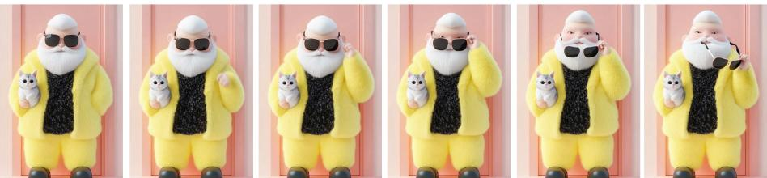

  
viewed from a low-angle perspe ctive.

Figure 19: Videos generated by Wan-I2V model. The results demonstrate that our I2V model effectively captures and replicates the dynamics of real-world scenes.

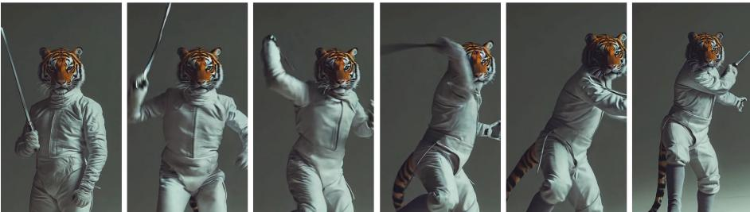  
and tense visual effect. A close-up ful-body shot of the character is shown from a side view

  
in etehen

  
to capture every lively moment.

  
captures the performer from the front, focusing on the moment of complete devotion.

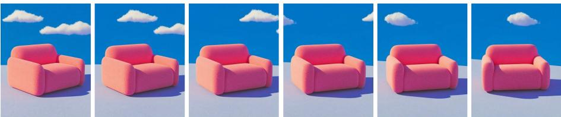  
rotation of the camera emphasizing the details and texture of the sofa chair.

Figure 20: Videos generated by Wan-I2V model. The results indicate that our I2V model can effectively animate diverse types of images into highly realistic and dynamic videos.

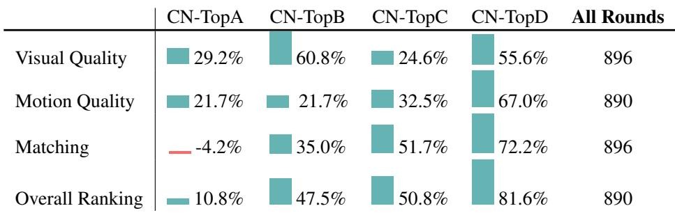  

Table 7: Win rate gap of I2V models. The values in the table represent the proportion of instances in which the Wan-I2V model was preferred in pairwise comparisons against other models, relative to the total number of comparisons conducted.

我们的实证观察表明，仅依赖帧级信息不足以在特定任务（如图像到视频生成、视频延续和首末帧转换）中实现最佳性能。这个见解表明，尽管预训练模型为基于帧的视频生成提供了基础框架，但在捕捉动态视频序列的时间一致性方面，尤其是在条件帧数量非常有限时，它缺乏必要的上下文和语义深度。为了解决这一局限性，在SFT阶段，我们引入了图像编码器，通过解耦交叉注意力（Ye et al., 2023）提取图像特征，提供全局上下文信息以增强模型的能力。我们基于$4 8 0 \mathrm { p }$和$7 2 0 \mathrm { p }$分辨率的两个预训练检查点进行了实验，涵盖了图像到视频生成、视频延续和首末帧转换任务的训练。与我们T2V模型的人类评估类似，我们的I2V模型也与最先进技术进行了基准比较，重点关注视觉质量、运动质量和匹配等关键方面。结果见表7显示，我们的模型在所有评估维度上表现良好。图19和图20展示了我们I2V模型的附加可视化，清晰地说明了其在将图像动画化为高质量视频方面的优越性能。

# 5.2 统一视频编辑

文本到图像和文本到视频生成的基础预训练模型促进了各种下游任务和应用的扩展，包括重绘（AI, 2022; Zhou 等, 2023）、编辑（Meng 等, 2021; Brooks 等, 2023; Zhang 等, 2023a; Wang 等, 2023b; Wei 等, 2024b）、可控生成（Zhang 等, 2023b; Jiang 等, 2024; Wang 等, 2024c）、定制生成（Chen 等, 2023b; Wei 等, 2025）、帧参考生成（Yang 等, 2025b; Guo 等, 2024a）、高效生成（Wang 等, 2023c; Yuan 等, 2024a; Liu 等, 2024b）以及基于 ID 的视频合成（Pan 等, 2024; Yuan 等, 2025; Liu 等, 2025a）。为了增强任务的灵活性并最小化部署多个模型所带来的开销，研究人员越来越多地专注于开发统一的模型架构（Tan 等, 2024; Chen 等, 2024），如 ACE（Han 等, 2025; Mao 等, 2025）和 OmniGen（Xiao 等, 2024）。这些统一架构旨在将多样化的任务整合到单一图像模型中，从而促进各种应用工作流的创建，同时保持易用性。在视频领域，时间和空间维度的协作变换表明，利用统一模型能够为视频创作解锁无限可能。

在我们之前的研究中，VACE（Jiang et al., 2025）提出了一个统一的可控视频生成和编辑框架，解决了参考到视频生成、视频到视频编辑以及掩膜视频到视频编辑等任务。基于Wan 的预训练模型，我们将多种模态（包括用于编辑的图像和视频、参考和掩膜）整合到视频条件单元（VCU）中，以支持多样的输入格式。VACE采用了概念解耦策略，使模型能够识别应保留哪些方面以及应修改哪些方面，从而在编辑和参考任务中清晰地区分视觉模态信息。我们提供了两种训练模式。第一种模式是以VCU作为输入，对整个Wan模型进行完全微调。第二种模式利用可插拔的上下文适配器结构，以Res-Tuning（Jiang et al., 2023）的方式进行，支持可控和编辑任务，而不需修改基础模型的权重，但整体模型规模有所增加。依托于Wan 的强大视频生成能力，该创新框架在定量和定性评估中表现出显著的竞争力。它促进了基本任务的组合扩展，实现了如长视频重新渲染等场景。因此，该框架为视频合成提供了一种多功能且高效的解决方案，为用户驱动的视频内容创建和编辑开辟了新途径。

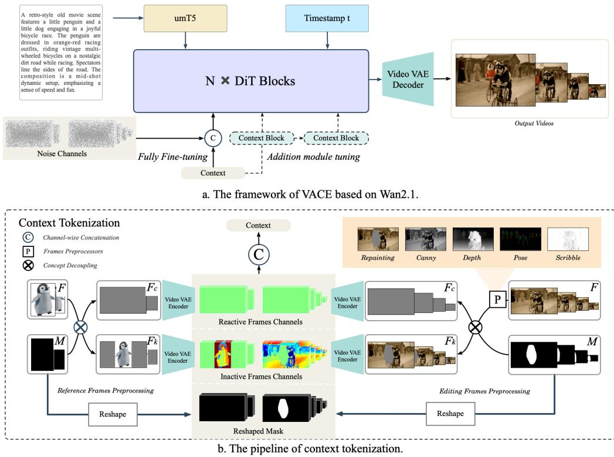  

Figure 21: Unified controllable generation and editing framework. Frames and masks are tokenized through Concept Decoupling, Context Latent Encode, and Context Embedder. We propose two training strategies for Wan: Fully Fine-tuning and Context Adapter Tuning.

# 5.2.1 模型设计

视频条件单元（VCU），在 VACE 中提出，作为一种输入范式，将多样化的输入条件统一为文本输入、帧序列和掩码序列。其形式化表示如下：

$$
V = [ T ; F ; M ] ,
$$

其中 $T$ 是文本提示，$F$ 和 $M$ 分别是上下文视频帧序列 $\{ u_{1}, u_{2}, \ldots, u_{n} \}$ 和掩膜序列 $\{ m_{1}, m_{2}, \ldots, m_{n} \}$。这里，$u$ 在 RGB 空间中，归一化到 $[-1, 1]$，而 $m$ 为二进制，其中 "1" 和 $^{6 6} 0^{\mathrm{{\circ}}}$ 表示要编辑的区域和不编辑的区域。$F$ 和 $M$ 在空间尺寸 $h \times w$ 和时间尺寸 $n$ 上是对齐的。在这个范式下，我们使用先前描述的 Wan-VAE 将输入视频帧和掩膜信息进行了标记化，生成上下文令牌。如图 21 (a) 所示，这些上下文令牌与嘈杂的视频令牌结合，以微调 Wan 模型。此外，我们提出了一种上下文适配器调优策略，允许上下文令牌经过上下文块，并重新整合到原始 DiT 块中。这种方法促进了上下文信息的无缝融合，提高了模型处理多样化编辑和生成任务的能力，而不改变基础模型的权重。

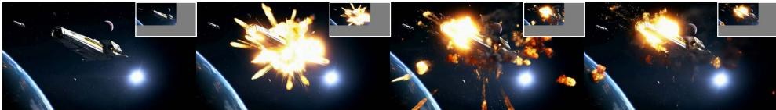  

任务-扩展绘制：一艘大型宇宙飞船正在太空中飞行，背景中有一艘小型飞船。突然，较大的飞船在猛烈的火球中爆炸，碎片四散飞掷。爆炸强烈而明亮，火焰和烟雾从残骸中汹涌而出。小型飞船未受伤害，并继续朝远离现场的方向飞行。

任务填绘：一个人在户外的画布上绘画，使用混合了各种颜色的调色板。此人穿着深蓝色夹克和相配的贝雷帽，坐在一把木椅上。画布描绘了一幅风景画，背景中有水体和山脉。此人正在小心地将绿色涂料应用于画布，为场景增添细节。

  

任务扩展：一只黑色和橙色翅膀的蝴蝶飞向挂在树枝上的棕色种荚。蝴蝶落在种荚上，导致种荚轻微晃动，然后迅速飞走。背景是一片模糊的绿色，暗示着森林或花园的环境。光线明亮自然，表明是白天。相机保持静止，..

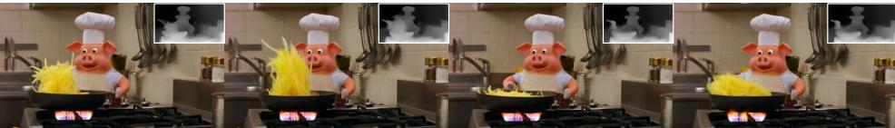

一只穿着厨师服的猪站在厨房里，手里拿着一个锅，下面燃着蓝色火焰。猪戴着白色厨师帽和围裙，正在锅里搅拌着黄色的 shredded 食物。背景是一间现代化的厨房，配有不锈钢设备、水槽，以及各种厨房用具和容器摆放在台面上。光线明亮而自然，……

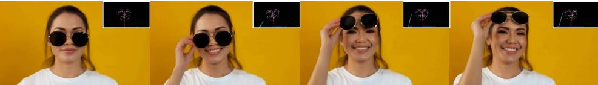  

Figure 22: The visualization results of the proposed VACE.

TASK-PosE：一位年轻的女性，卷曲的头发，穿着白色衬衫，站在黄色背景前。她面带微笑，正视着镜头，右手将太阳镜抬到额头上。这位女性肤色较深，头发柔软地卷曲，披落在肩头。她佩戴着大型圆形金框红色镜片的太阳镜。在进行分词之前，像素级上下文框和掩膜使用概念解耦策略进行预处理，然后编码到潜在空间。如图21（b）所示，概念解耦策略根据掩膜明确地将不同模态和分布的数据分离为两个形状相同的帧序列：$F _ { c } = F \times M$ 和 $F _ { k } = F \times ( 1 - M )$，其中$F _ { c }$指代包含所有待修改像素的反应帧，而$F _ { k }$表示保留所有待保存像素的非活动帧。这个机制确保了明确的任务定义，并保证模型在不同任务间的收敛性。$F _ { c }$ 和 $F _ { k }$ 被Wan-VAE处理，并映射到同一个潜在空间$X$，保持其时空一致性。为了避免TASK-GRAY：一位年轻女孩，长卷发，躺在丁香花和透明面料的床上。她穿着一件带精美蕾丝细节的粉色连衣裙。女孩伸手去触摸头顶的花朵，微笑看起来很满足。背景充满更多的丁香花和绿色叶子，营造出梦幻的氛围。摄像角度为俯视，捕捉到女孩和周围的花朵。

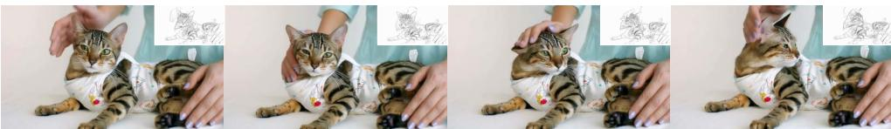

TASK-scRIBBLE：一个穿着浅蓝色衬衫的人正在轻柔地抚摸一只躺在白色桌子上的虎斑猫。这只猫身上穿着一件带有卡通角色的白色衣服，显得放松而满足，随着这个人抚摸它的头部和身体。背景简单且浅色，保持了对人与猫之间互动的关注。相机保持静止，……

任务布局：一只鹰在晴朗的天空下，翱翔在宁静的蓝色海洋上。这只鹰展翅宽广，棕白羽毛和黄色喙相辉映，向水面下降。当它接近水面时，猛然俯冲入水，溅起水花，随后抓住一条鱼，振翅而起。之后，这只鹰再次起飞，紧紧抓住鱼，朝着相机的方向飞去……

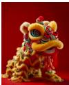

任务对象：一套色彩鲜艳的中国舞狮服饰在丰富的红色背景下显得格外引人注目，散发着传统文化的意义和节庆的气氛。该服饰细节精致，边缘装饰着黄色毛发，并且有复杂的绿色、红色和金色的图案点缀。装饰物包括大型富有表现力的眼睛、宽阔的嘴巴和露齿的笑容，……

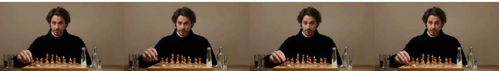  

Figure 23: The visualization results of the proposed VACE.

TASK-FACE: 一名男子坐在桌子旁，正在下棋。他右手握着一个棋子，似乎在思考他的下一步棋。该男子留有卷发和胡须，穿着黑色毛衣和白色衬衫。棋盘就在他面前，棋盘上还有几个棋子。桌上还有几瓶饮料。背景简单且中性。……任何图像和视频的混合，参考图像由Wan-VAE编码器单独编码，并沿时间维度连接在一起，而对应的部分在解码时需要被移除。$M$被直接重新塑形和插值。之后，$F _ { c }$、$F _ { k }$和$M$被映射到潜在空间，并与形状为$n ^ { \prime } \times h ^ { \prime } \times w ^ { \prime }$的$X$在时空上对齐。

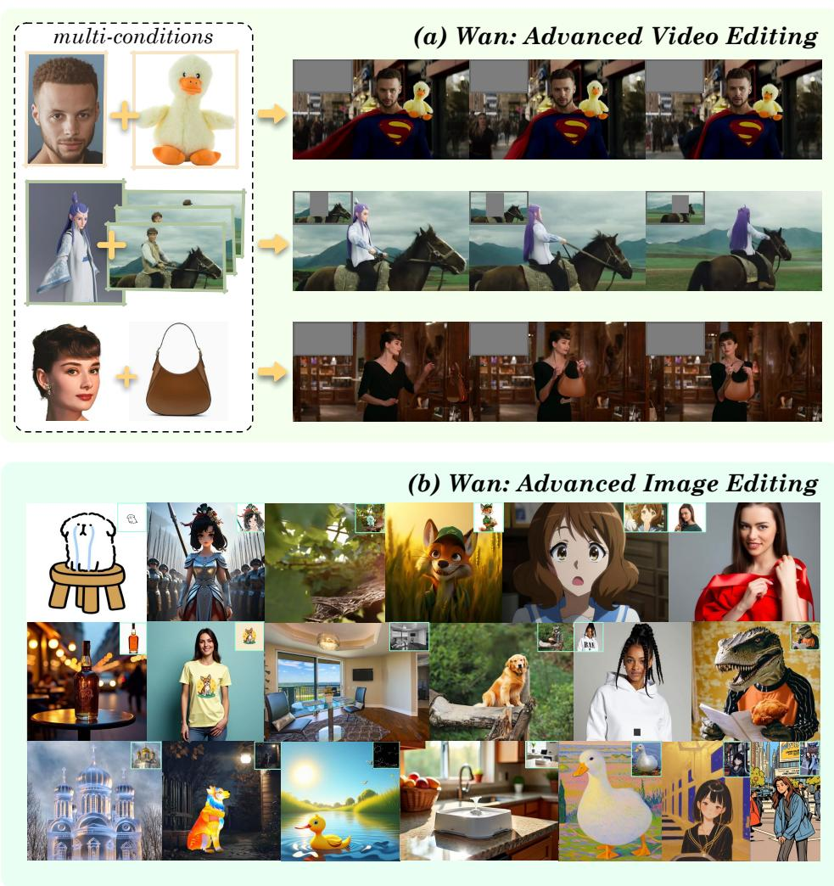  

Figure 24: The visualization results of advanced video/image editing.

# 5.2.2 数据集与实现

数据构建。为了开发一个一体化模型，数据构建的多样性和复杂性必须增加。对于可控的视频生成和编辑任务，输入模态扩展为包括目标视频、源视频、局部掩膜、参考资料等。高效且快速的数据获取对于各种任务而言，必须在进行实例级分析和理解的同时保持视频质量。我们首先对视频数据进行镜头切分，并根据分辨率、美学评分和运动幅度进行初步过滤。然后，使用 RAM（Zhang et al., 2023d）标记第一帧，并通过 Grounding DINO（Liu et al., 2023d）进行检测，从而实现对目标区域过小或过大的视频的二次过滤。此外，我们利用 SAM2（Ravi et al., 2025）的传播操作进行视频分割，以获取整个视频的实例级信息。基于分割结果，我们通过根据掩膜区域阈值计算有效帧比，进一步对实例进行时间上的过滤。不同任务的构建必须针对每个任务的特定特征进行定制。有关详细信息，请参见文献（Jiang et al., 2025）。实现细节。我们训练可控和编辑模型，该模型在 Wan-T2V-14B 上进行预训练，支持高达 720p 的分辨率，采用多阶段训练过程。最初，我们专注于如修补和扩展等基础任务，以补充预训练的文本到视频模型。此阶段结合了掩膜，并在空间和时间维度上发展上下文生成能力。随后，我们通过从单输入过渡到多个输入参考帧，以及从个体任务到复合任务来扩展任务。最后，我们通过使用更高质量的数据和更长的序列进行微调，提升模型的质量。

# 5.2.3 评估

在图22和图23中，我们展示了Wan单模型在各类任务中的结果。显然，该模型在视频质量和时间一致性方面表现优异。此外，我们展示了不同生成能力组合所产生的新应用，如图24 (a)所示。我们的模型在这些任务上表现出色，展现了显著的能力扩展潜力。VACE提出的统一可控生成和编辑框架同样适用于图像生成和编辑，如图24 (b)所示。

# 5.3 文本到图像生成

Wan 在图像和视频数据集上共同训练，使其不仅具备先进的视频生成能力，还拥有卓越的图像合成性能。这种双重训练策略促进了跨模态知识转移，创建了一个高度灵活的框架，在两个领域都能实现强大的结果。在实际操作中，我们的模型在一个接近视频数据集十倍大小的图像数据集上进行了训练，从而在图像和视频生成任务之间获得协同效益。这种广泛的训练方案在图像合成的各个方面都取得了出色的表现。如图 25 所示，Wan 在多种类别中生成高保真图像，包括艺术性文本视觉效果、逼真的肖像、人创意设计，以及专业级产品摄影。

# 5.4 视频个性化

视频个性化旨在生成与用户提供的参考保持一致身份的视频（Wei et al., 2024a; Li et al., 2024; Yuan et al., 2025）。在本节中，我们将先进的个性化技术整合到视频生成流程中，实现了最先进的性能。后续讨论对我们的方法进行了全面阐述，包括模型架构、个性化数据和实验验证。

# 5.4.1 模型设计

视频个性化的核心技术主要面临两个挑战：（1）高保真个性化身份的获取；（2）将这些身份特征无缝整合到视频生成流程中。

我们从我们的Wan-T2V基础模型开始，首先获取个性化身份信息。现有的视频个性化方法通常依赖于身份提取器（例如，ArcFace（Deng等人，2019））或通用视觉提取器（例如，CLIP（Radford等人，2021））来获取身份信息。尽管它们取得了令人鼓舞的进展，但其性能受限于特征提取器的局限性。例如，身份提取器主要关注面部识别的特征，但可能无法捕捉其他重要的视觉线索，如伤疤或贴纸。此外，它们易受低分辨率面孔、光照变化和部分遮挡（如眼镜、口罩或头发）的影响。另一方面，通用视觉提取器并未针对面部领域进行特别调整，往往聚焦于粗粒度的语义信息。因此，我们选择不依赖任何特征提取器，以避免信息损失，我们的生成过程直接基于Wan-VAE的潜在空间中的输入面部图像进行条件化。

将个性化身份信息注入视频生成过程的方法有很多。在我们的实验中，我们发现交叉注意力操作适合与从身份提取器获得的密集表示进行交互，而自注意力更适合建模同一潜在空间中的数据。图26展示了我们的视频个性化方法的设计，采用了自注意力范式。具体来说，在潜在空间中，我们首先使用分割后的人脸图像扩展K个额外帧，附加到给定视频之前。这些人脸图像是通过人脸检测和分割从成对视频中提取的，面部地标进一步对齐到与视频帧相同大小的黑色画布上。然后，在这个扩展视频的通道维度上，我们将人脸图像与前K帧的全一掩码进行拼接，并将剩余帧的空白图像与全零掩码进行拼接。这些拼接的信号作为条件。最后，在这个时间扩展的视频上进行扩散过程，以通道方向的条件信号为依据，以修复的方式进行处理。注意，我们的Wan-T2V模型没有应用其他修改。

  

Figure 25: Image samples generated from Wan model.

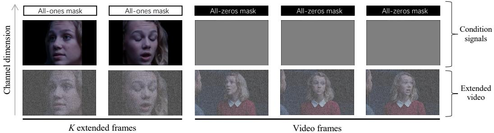  

Figure 26: The core design of the video personalization approach in the latent space of Wan-VAE.

在训练过程中，我们随机丢弃 $K$ 个扩展帧中的一部分人脸图像，以支持生成 0 到 $K$ 个参考人脸的视频。在推理阶段，从扩展视频的纯噪声开始，我们在通道维度上将用户提供的人脸图像（不超过 $K$ 张）与扩展帧拼接，并将相应的掩码设置为全一。目标是重构前 $K$ 帧中的人脸图像，并在后续帧中合成一个新的个性化视频，以保持提供的身份。

# 5.4.2 数据集

我们通过仔细筛选和自动数据合成，从我们的 T2V 基础模型的训练数据集中策划了一组个性化数据。我们首先使用内部人工分类器筛选约 $\mathcal { O } ( 1 0 0 ) \mathbf { M }$ 视频，并对这些视频以每秒 1 帧的速度进行人脸检测。如果在任何帧中检测到超过一个人脸，或者超过 $10 \%$ 的帧没有检测到人脸，则该视频将被丢弃。然后，我们计算连续帧之间的 ArcFace 相似度，并丢弃低相似度的视频。接下来，我们进行人脸分割以去除干扰背景，并进行人脸关键点检测，以便在训练过程中便于画布对齐。需要注意的是，我们并不筛除面积小的人脸，因为我们发现这些视频通常包含全身人像。最后，我们构建了约 $\mathcal { O } ( 1 0 ) \mathbf { M }$ 的个性化视频，每个视频平均伴随 5 个分割的人脸。我们还采用自动数据合成来提高人脸的多样性。特别地，我们从上述视频中随机选择了 $\mathcal { O } ( 1 ) \mathbf { M }$ 个个性化视频，并采用 Instant-ID（Wang et al., 2024b）为每个视频合成多样化的人脸。值得注意的是，我们构建了一个包含超过 100 个提示的文本模板，包括动漫、线条艺术、电影、Minecraft 等。每次我们都会从该模板中随机选择一个提示，以及从其余视频中估算的随机人类姿势，作为输入提供给 Instant-ID。我们进一步测量生成的人脸上的 ArcFace 相似度，并筛选出相似度较低的人脸。最终，我们收集了约 $\mathcal { O } ( 1 ) \mathbf { M }$ 个包含合成面孔的视频，大大提高了个性化数据集中样式、姿势、光照和遮挡的多样性。

Table 8: Comparison of other leading video personalization methods.   

<table><tr><td></td><td>Wan</td><td>CN-TopA</td><td>CN-TopB</td><td>CN-TopC</td></tr><tr><td>Arcface Similarity</td><td>0.5526</td><td>0.5655</td><td>0.5197</td><td>0.4998</td></tr></table>

# 5.4.3 评估

我们在图27中展示了视频个性化的结果，其中左侧部分表示输入身份，右侧部分表示合成的个性化视频。所有测试图像均随机从Pexels中选取。我们还在一个未见的评估集上评估了我们的模型，并通过从视频中以每秒1帧的速度采样人脸，测量输入人脸与输出个性化视频之间的ArcFace相似度。最终的相似度分数是这些采样人脸的平均值。相应的结果如表8所示，我们的方法在视频个性化性能上与其他领先的商业和闭源中国竞争对手相比表现出竞争力。

# 5.5 相机运动可控性

相机运动控制模块旨在通过利用相机轨迹精确匹配视频的运动和视角。具体而言，我们使用每帧的外部参数 $[ \boldsymbol { R } , t ] \in \mathbb { R } ^ { 3 \times 4 }$ 和内部参数 $K _ { f } \in \mathbf { \mathbb { R } } ^ { 3 \times 3 }$。我们的方法由两个主要组成部分构成，以有效注入相机运动条件：相机姿态编码器和相机姿态适配器，如图28所示。 相机姿态编码器。首先，对于每个视频帧中的每个像素，我们使用普鲁克坐标将给定的外部和内部参数转换为一系列精细的位置 $P \in \mathbb { R } ^ { 6 \times F \times H \times W }$。在Pytorch中使用PixelUnshuffle操作（Paszke等，2019）以降低 $P$ 的空间分辨率，同时增加通道数。最后，我们通过一系列与DiT模块数量对齐的卷积模块对输出进行编码，以提取多层次的相机运动特征。 相机姿态适配器。为了将相机运动特征整合到视频潜在特征中，我们采用了自适应归一化层。具体而言，我们将输入的相机运动特征序列转换为缩放因子 $\gamma _ { i }$ 和偏移参数 $\beta _ { i }$，使用两个零初始化的卷积层。然后，$\gamma _ { i }$ 和 $\beta _ { i }$ 通过由公式 $f _ { i } = ( \gamma _ { i } + 1 ) * f _ { i - 1 } + \beta _ { i }$ 定义的简单线性投影整合到每个DiT模块中，其中 $f _ { i }$ 表示第 $i $ 层的视频潜在特征。 关于训练数据，我们利用一种先进的相机姿态估计算法VGGSfM（Wang 等，2024a）从我们的训练视频中提取显著相机运动的相机轨迹。该过程产生了大约 $\mathcal { O } ( 1 )$ 千个视频片段。我们在文本到视频生成框架内使用Adam优化器训练我们的模块。图29展示了在相机运动引导下生成的视频的各种示例结果。

# 5.6 实时视频生成

当前的视频生成方法通常需要大量的计算资源和相当长的时间才能生成短视频片段。依赖高端硬件的系统仍然较慢，往往需要几分钟才能生成仅几秒钟的视频。虽然近年来这些生成视频的视觉质量有了显著提升，但延长的处理时间在实际应用和迭代设计流程中成为了一个主要瓶颈。在快速原型设计和实时调整至关重要的领域——如互动娱乐、虚拟现实和视频制作——这些较长的生成时间限制了创作灵活性，并减缓了视觉内容的细化过程。此外，目前方法的慢速限制了其在动态环境中的使用，而实时反馈在这些环境中至关重要。在直播或游戏等场景中，对能够立即根据用户行动或输入变化渲染合成场景和角色的系统的需求日益增加。生成高质量视频片段的任何延迟都可能造成次优的用户体验，降低沉浸感和互动性。通过专注于实时生成，Wan希望提高视频生成技术的性能和适用性，拓宽其在快速、互动环境中的潜力。图30和31展示了实时长视频流生成的案例。接下来，我们将介绍如何使用我们的Wan模型实现这种生成。

# 5.6.1 方法

为了构建实时生成管道，我们基于之前预训练的Wan模型进行构建。这个设计选择带来了两个主要好处。首先，从一个经过良好训练的模型开始，可以显著加快收敛速度并提高训练稳定性，因为该模型已经具备了较强的初始化。其次，预训练模型已经捕获了关于运动模式和连续时间动态的宝贵知识，这些知识可以被新管道直接继承，从而增强生成内容的平滑性和一致性。因此，我们将预训练的Wan模型作为我们实时管道2的基础。

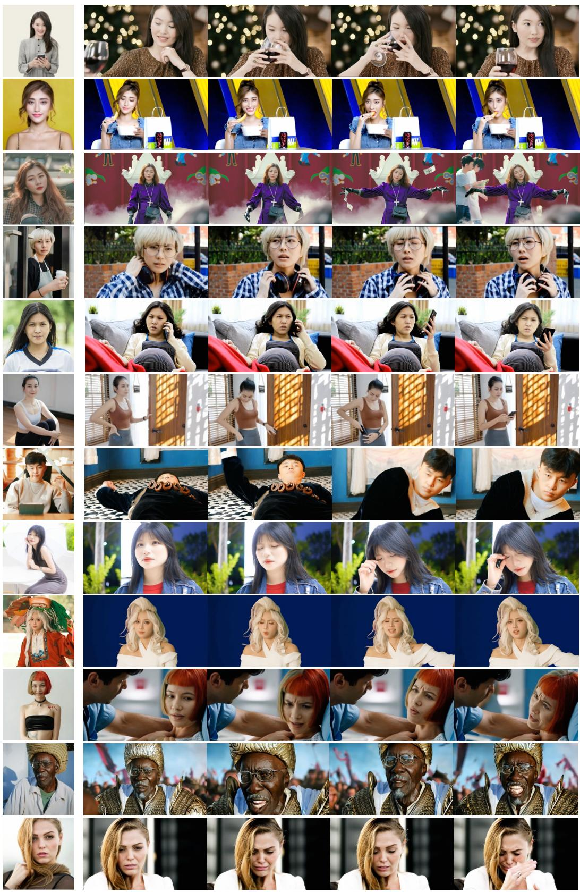  

Figure 27: Visualization of our video personalization approach.

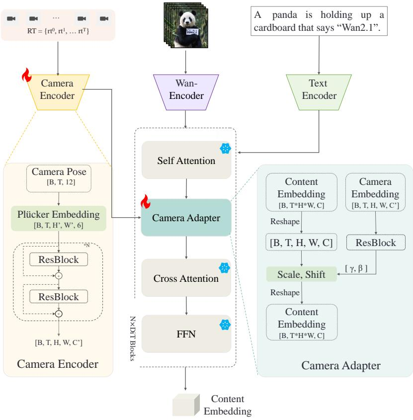  

Figure 28: Framework of video generation guided by camera motion.

预训练的Wan模型旨在生成固定长度的视频片段，通常为5到10秒。为了将其转换为能够生成无预定义长度（潜在无限）的连续视频流的实时流媒体模型，需要进行两个关键修改：流媒体管道适配。我们将静态生成过程替换为流媒体机制，后者逐步生成视频词元。在这个流媒体设置中，视频词元通过去噪队列进行处理——每当生成并出队最旧的词元时，会在队列底部添加一个新词元，从而实现无限制的连续生成。实时加速。在启用流媒体的同时，我们优化生成速度，以确保系统满足实时性能要求，即管道必须快速生成新帧，以跟上实时播放的速度。在接下来的章节中，我们将详细描述每项修改，包括设计原理、技术实现和实证表现。

# 5.6.2 流媒体视频生成

传统扩散变换器（DiT）（Peebles & Xie, 2023）模型在生成超过几秒的视频时受到限制，即使通过变分自编码器（VAE）（Kingma, 2013）进行显著的空间和时间压缩。这一限制主要源于在长时间序列上应用注意力机制所需的计算和内存开销。为了解决这个问题，我们引入了Streamer，一种新颖的方法，利用滑动时间窗口高效管理时间依赖关系，从而实现流式生成长甚至无限长度视频。

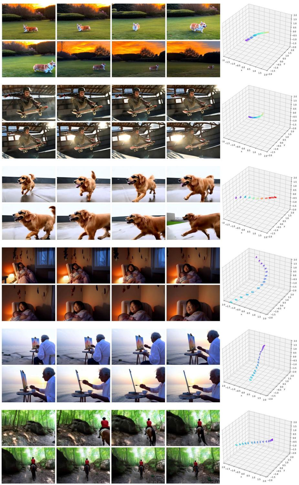  

Figure 29: Generated video results guided by camera motion.

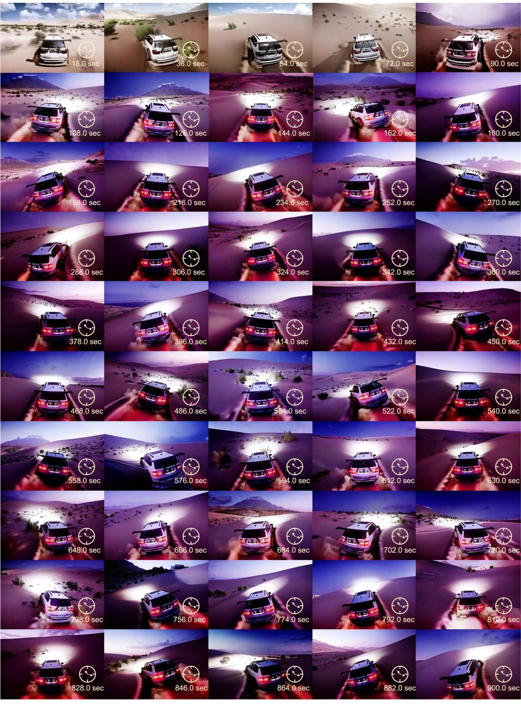  

Figure 30: Generated 15 minutes video with 8 A100 GPUs in real-time 8 FPS.

移位窗口去噪过程模型。Streamer的关键创新在于其假设时间依赖关系限于一个有限的时间窗口。通过将注意力计算集中在该窗口内，Streamer显著降低了计算开销，同时保持了视频的连续性。具体而言，Streamer在队列中处理视频词元，在窗口内对它们进行多噪声水平的去噪。在固定数量的去噪步骤后，最左侧的词元（噪声水平最低）会被出队并缓存，而一个带有高斯噪声的新词元则被附加到最右侧的位置。该滑动机制确保窗口保持一致的长度，同时促进连续视频帧的生成。

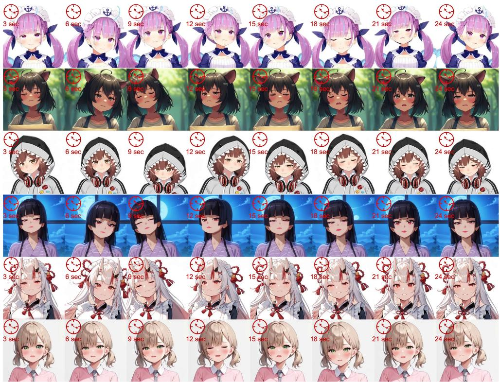  

Figure 31: Generated videos with a single RTX 4090 GPU, int8 and TensorRT quantization in real-time 20 FPS.

训练与推理。Streamer 是在预训练的 DiT 模型上进行微调的。在训练过程中，采样了一系列 $2 w$ 的视频词元，其中 $w$ 是滑动窗口的大小（通常设定为 $w = T$，即扩散求解步骤的数量）。前 $w$ 个词元仅用于“预热”模型，并不参与损失计算。损失仅在最后的 $w$ 个词元上计算，以确保模型学习在窗口内生成连贯的视频帧。在推理时，采用相同的预热策略：前 $w$ 个词元被丢弃，生成的视频从第 $( w + 1 )$ 个词元开始。确保训练和推理期间的连续性。为了保持连续窗口之间的平滑过渡，缓存的词元在噪声水平为 0 时被重新引入到词元队列中。这使得之前生成的词元能参与后续窗口的去噪过程，确保生成视频的时间一致性和连续性。Streamer 通过将 DiT 模型适应于流媒体应用，代表了视频生成的重大进步。其滑动时间窗口方法解决了传统 DiT 模型的局限性，使得能够高效生成无限长度的视频，同时保持高质量和时间一致性。这种方法为实时视频生成和长篇内容创作开辟了新的可能性。我们将其优点总结如下：• 无限长度视频生成：通过利用滑动窗口机制，Streamer 能够生成任意长度的视频而不产生过高的计算成本；•高效的注意力计算：将注意力计算限制在一个有限的时间窗口内，减少了内存和处理需求；• 无缝连续性：缓存和重新引入词元确保了窗口之间的平滑过渡，保持了视频在较长时间段内的质量。

# 5.6.3 一致性模型蒸馏

在成功将DiT模型扩展到Streamer以实现无限长度视频生成之后，下一步至关重要的挑战是实现模拟世界的实时渲染。尽管Streamer通过在滑动窗口内有效管理时间依赖关系来生成长视频甚至无限视频，但扩散过程的计算需求仍然为实时应用构成瓶颈。为此，我们建议将Streamer与一致性模型相结合，这是一种加速基于扩散的生成过程的前沿方法。具体而言，我们利用潜在一致性模型（LCM (Luo et al., 2023)）及其视频版本（VideoLCM (Wang et al., 2023c)），该模型将原始扩散过程和无类指导提炼为一个高效的四步一致性模型。这一提炼过程显著减少了高质量生成所需的采样步数，同时保持了Streamer固有的时间一致性和流媒体能力。LCM与Streamer的集成旨在保留去噪窗口机制，确保滑动时间窗口能够继续有效管理依赖关系。在训练过程中，我们优化这个组合框架，以平衡效率和质量。结果是推理速度加速至$1 0 - 2 0 \times$，使模型能够达到$8 \mathrm { ~ - ~ } 1 6$帧每秒的渲染速率。这一性能的显著提升使得该系统适用于实时应用，如交互式模拟、实时视频合成和虚拟环境中的动态内容生成。通过结合Streamer的无限长度视频生成与时间一致性的能力，以及LCM在加速扩散过程中的高效性，我们弥补了高质量视频生成与实时响应之间的差距。这一进展不仅增强了扩散模型在流媒体应用中的实用性，还为沉浸式、交互式和实时媒体创作开辟了新可能。

针对在消费者级设备上运行的量化。虽然生成速度已经加快到实时水平，但由于高计算和内存需求，即使在像NVIDIA 4090这样的高端GPU上，部署模型仍然具有挑战性。为了解决这个问题，我们引入了量化技术以优化模型以实现高效部署。具体而言，我们采用了两种不同的量化策略：针对注意力层和线性头的int8量化（torchao维护者及贡献者，2024），以及针对整个模型的TensorRT量化（NVIDIA，2023）。int8量化方法通过将权重和激活转换为8位整数，显著减少了内存消耗，同时保持了整体生成质量。然而，该方法在生成速度上的加速效果有限，因为它主要关注内存效率，而不是计算优化。另一方面，TensorRT量化提供了一种更全面的解决方案，使生成速度有显著的加速。这项技术使得模型即使在单个4090 GPU上也能实现8 FPS的实时性能，从而使其在消费者级设备上可行。然而，TensorRT量化会引入适度的网络误差，这种误差即使在启用其内置错误检查机制时也会显现出来。这种错误表现为输出质量的轻微偏差，例如生成视频中的微小伪影或不一致性。在某些情况下，它也可能导致可测量的不稳定性，如闪烁或时间不连贯。尽管存在这些权衡，int8和TensorRT量化的结合仍然提供了一种平衡的模型优化方法，以实现实时的消费者级部署，确保了高效性和实用性，同时保持了可接受的生成质量。通过仔细调整量化参数和利用TensorRT的错误检查功能，我们尽可能减轻这些问题，从而在消费者级硬件上实现稳健和高效的性能。

# 5.7 音频生成

本研究中音频生成的主要目标是为视频片段生成同步的音轨，构建为视频到音频（V2A）生成框架。生成的音轨由环境声和背景音乐组成，明确排除语音或人声元素。与文本到音频模型（Liu et al., 2023b; 2024c）相比，视频到音频模型生成的环境声必须与视频的视觉内容在时间上对齐，而伴随的音乐应准确反映视频的情感基调和上下文设置，如同自然预期的那样。此外，为了增强用户对声音设计的控制，我们的框架整合了视频和文本提示，使用户能够指定屏幕内或屏幕外的声音，并定义背景音乐的风格和存在感。

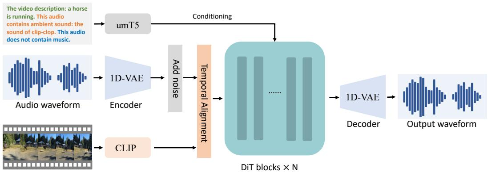  

Figure 32: Framework of video-to-audio generation. Our model processes both a video chunk and its associated textual description as dual inputs to synthesize high-quality, semantically coherent audio.

# 5.7.1 模型设计

与我们的视频生成框架一致，我们的视频到音频模型也采用基于流匹配的扩散变换器（DiT）来建模音频领域的去噪扩散过程。我们的V2A模型的详细流程如图32所示。

音频自编码器。一种广泛采用的音频压缩方法是将原始波形转换为梅尔谱图，然后使用基于图像的变分自编码器将其编码为 $H^{a} \times W^{a} \times C^{a}$ 潜在特征，如 (Liu et al., 2023b; 2024c) 所示。然而，在扩散变换器主干的背景下，这些潜在特征必须被划分为块，并重新形状为大小为 $(H^{a} \cdot W^{a}) \times C^{a}$ 的张量。这个划分和重塑过程可能会破坏与相应视频内容的时间对齐，从而对同步造成重大挑战。考虑到这一限制，我们训练了一个直接在原始波形上操作的压缩模型。我们的 1D-VAE 生成大小为 $T^{a} \times C^{a}$ 的潜在特征，其中 $T^{a}$ 表示时间轴上的序列长度，从而保留了进行准确同步所必需的显式时间信息。 视频和文本编码器。为了实现合成音频与视觉序列之间的帧级同步，我们通过多模态特征融合建立时间一致性。我们的架构首先使用 CLIP Radford 等人（2021）模型提取帧级视觉嵌入，然后通过特征复制进行时间速率适配，以匹配音频特征的采样率，参考了 (Polyak et al.)。同步的视觉和声学特征经过线性投影层的维度变换，以便与 DiT 的潜在空间对齐，随后进行逐元素相加进行多模态融合。为了实现跨语言的语言理解，我们利用预训练的 umT5 模型（Chung et al., 2023）作为文本编码器，利用其冻结参数通过跨语言表示能力。 数据。我们 V2A 模型的训练数据源自视频生成数据集，经过严格的过滤过程。我们系统性地移除缺乏音轨或包含语言/声乐音乐的视频，从而得到了精炼的子集 $\mathcal{O}(1)$ 千小时。为了增强多模态表示，我们采用全面的字幕策略：密集的视频描述与由 Qwen2-audio（Chu et al., 2024）生成的音频特定字幕相辅相成。这些音频字幕分为环境声音和音乐作品，后者的特征包括风格、节奏、旋律和乐器。最终的结构化字幕整合了三个组成部分：（1）密集视频描述， （2）环境声音特征化，和（3）背景音乐分析，为训练提供统一的多模态表示。

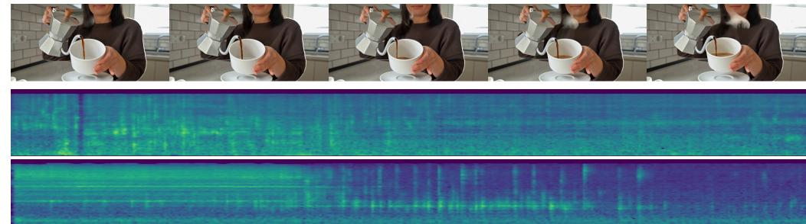

一个人将咖啡壶高高举起，缓缓地将冒着热气的咖啡倒入杯中。

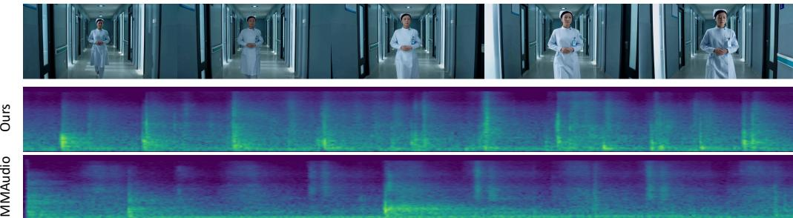

一名护士安静地走过昏暗的医院走廊，经过一排又一排空荡荡的病房。HIR C 20 Altayhorgallos 在他身旁轻盈地飞过，仿佛在大地上滑翔，随着空气中的风声，鬃毛和尾巴在微风中飘动。

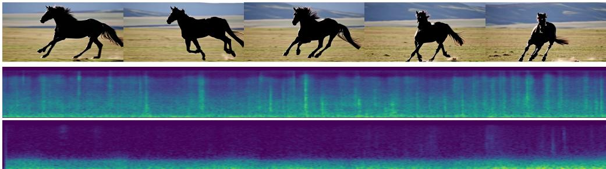  

Figure 33: Audio generation samples of MMAudio and ours.

一支笔的结构由多个部分组成。

实现细节。我们的 V2A 架构以最大 12 秒的时长生成高保真立体声音频，采样率为 $4 4 . 1 \mathrm { k H z }$。该模型通过专用编码器处理多模态输入：umT5-XXL 生成 4096 维文本嵌入，而 CLIP 每帧提取 1024 维视觉嵌入。音频和视频特征被投影到 DiT 主干网络中的统一 1536 维潜在空间。为了进行时间对齐，我们对输入视频进行降采样，为 12 秒的剪辑精确生成 48 帧，确保视觉和音频模态之间的帧级同步。系统以 256 的长度在一批次中处理潜在序列。为了增强模型从视觉线索中生成音频的能力，我们在训练期间实施随机掩蔽策略，选择性地以预定义概率省略环境声音和音乐字幕。这种条件机制迫使模型建立视觉内容与相应音频模式之间的强大跨模态关联，同时在可用时保持使用文本描述的灵活性。

# 5.7.2 评估

我们在图33中提供了音频生成的定性评估，比较了我们的方法与最近发布的开源方法MMAudio（Cheng等，2024）。这一比较分析特别有意义，因为MMAudio代表了与我们的方法最为相似且具有竞争力的基线，在音频生成任务中展现出令人印象深刻的性能。视频由我们的文本到视频模型生成，时长为5秒。我们的V2A模型在音频生成的几个关键方面表现出色，比较结果证明了这一点。具体而言，该模型显示出增强的长期一致性，这在“倒咖啡”场景中尤为明显（图33中的第一个案例）。在“打字”的第二个案例中，我们的方法生成的音频输出相比MMAudio产生的较嘈杂的结果要明显干净得多。此外，我们的方法在合成节奏声音模式方面表现优越，这在“走路”、“拳击”以及“踢踏”示例中得到了体现（图33中的后三个案例），其音频生成更加自然且连贯。局限性。我们的方法在生成人声方面存在局限性，包括但不限于笑声、哭声和语言。这一局限性主要源于我们的数据准备过程，其中与语言相关的声音数据被故意排除在训练数据集中。MMAudio模型能够生成随机的类语言声音是因为它在训练语料库中保留了与语言相关的数据。在未来的工作中，我们计划加入语言生成能力以解决这一局限。

# 6 限制与结论

限制。本研究展示了Wan，一个在多个基准上取得显著进展的基础视频生成模型。具体而言，在运动幅度（如体育、舞蹈）和遵循指令的能力方面取得了显著改善。然而，仍然存在一些限制，这些限制需要解决以发挥Wan的更大潜力。首先，在涉及大幅度运动的场景中保持细致的细节仍然是我们方法面临的挑战，同时也是视频生成领域的一个更广泛问题。需要付出大量努力来提高大规模运动动态视频的保真度。其次，与大规模模型相关的计算成本仍然令人望而却步。当前在没有额外优化的情况下，对一个140亿参数的模型进行推理大约需要30分钟，且仅能在单个前端GPU上进行。为了使视频生成成为一个普遍可用的AI工具，进一步研究效率和可扩展性是至关重要的。最后，在特定领域的专业知识方面仍然缺乏。作为一款基础视频模型，我们致力于提升Wan的通用能力，但在教育和医学等特定本地化场景中的表现可能不足。我们计划通过开源最新模型并促进社区驱动的多样化专业领域发展来解决这一限制。

结论。在本报告中，我们公开发布了最新的视频模型Wan，该模型为视频生成建立了新的基准。我们提供了Wan-VAE和DiT模型架构设计的全面概述，包括对其训练方法、数据整理流程、评估方法和实证结果的详细洞察。此外，我们还仔细分析了数据预处理管道以及为优化模型训练所实施的战略调整。这种整体方法旨在推动视频生成领域的进步。我们还广泛研究了下游应用，如图像到视频生成、视频编辑和个性化视频生成，以展示Wan在多种场景中的多功能性和实际效用。除了开源14B模型外，我们还探讨了利用小规模模型进行高效视频生成的可行性。值得注意的是，我们的1.3B模型不仅在性能上与更大的模型相当，还能够在消费级GPU上实现无缝推理，显著增强了内容创作者的可及性和实用性。展望未来，我们计划专注于扩展数据和模型架构，以应对视频生成领域最紧迫的挑战。我们正在进行的努力旨在为研究社区提供更强大和多样化的视频创作工具，促进创新并推动这一快速发展的领域的广泛应用。

# 作者按名字字母顺序排列。

王昂 艾宝乐 温彬 毛超杰 谢陈伟 陈迪 余飞武 赵海明 杨建萧 曾建元 王佳宇 张婧峰 周婧仁 王金凯 陈继轩 朱凯 赵康 闫珂宇 黄良华 冯梦扬 张宁毅 李攀登 吴平宇 朱瑞航 冯瑞丽 张时伟 孙思扬 方涛 王天星 桂天怡 翁婷婷 沈通 林伟 王伟 1 王伟 2 周文萌 王文特 沈文婷 余文源 时贤忠 黄晓明 徐鑫 寇岩 吕扬宇 李逸飞 刘怡婧 王义鸣 张颖雅 黄怡彤 李勇 吴悠 刘宇 潘宇琳 郑云 洪云涛 石玉鹏 冯玉彤 姜泽银 韩震 吴志凡 刘子宇 参考文献 Runway AI. 稳定扩散修复模型卡, https://huggingface.co/runwayml/stable-diffusion-inpainting，2022. 白金泽，白帅，杨树生，王世杰，潭思楠，王鹏，林俊扬，周昌，周婧仁. Qwen-VL: 一种多功能视觉-语言模型，用于理解、定位、文本阅读等. arXiv预印本 arXiv:2308.12966，2023. 包帆，聂申，薛凯文，曹岳，李崇轩，苏航，朱俊. 每个词都值得：适用于扩散模型的视觉变换器主干. 在 IEEE 计算机视觉与模式识别会议上，2023. 包帆，向晨东，岳刚，何冠德，朱洪州，郑凯文，赵敏，刘世龙，王尧乐，朱俊. Vidu: 一个高度一致、动态且技能过硬的文本到视频生成器，基于扩散模型. arXiv预印本 arXiv:2405.04233，2024. 詹姆斯·贝特克，加布里埃尔·戈赫，李静，蒂姆·布鲁克斯，王鉴锋，李琳杰，长欧阳，庄俊堂，乔伊斯·李，郭宇飞等. 通过更好的字幕改善图像生成（2023）. URL https://cdn.openai.com/papers/dall-e-3.pdf，2023. 安德烈亚斯·布拉特曼，蒂姆·多克霍恩，苏密特·库拉尔，丹尼尔·门德列维奇，马茨耶·基利安，多米尼克·洛伦茨，亚姆·利维，锡安·英格利什，维克拉姆·沃莱提，亚当·莱茨等. 稳定视频扩散：将潜在视频扩散模型扩展到大型数据集. arXiv预印本 arXiv:2311.15127，2023. 蒂姆·布鲁克斯，亚历山大·霍林斯基，亚历克谢·A·埃夫罗斯. InstructPix2Pix: 学习遵循图像编辑指令. 在 IEEE 计算机视觉与模式识别会议上，第1839-218402，2023. 马蒂尔德·卡隆，雨果·图弗龙，伊尚·米斯拉，厄尔维·杰古，朱利安·梅拉尔，彼得·博亚诺夫斯基，阿曼德·朱林. 自监督视觉变换器中的新兴属性. arXiv预印本 arXiv:2104.14294，2021. 陈俊松，余锦程，葛崇健，姚乐伟，谢恩泽，吴月，王中道，郭金斯，罗平，吕虎川等. Pixart-α：用于摄影级文本到图像合成的快速扩散变换器训练. arXiv预印本 arXiv:2310.00426，2023a. 陈天齐，徐兵，张致远，卡洛斯·格斯特林. 用亚线性内存成本训练深网. arXiv预印本 arXiv:1604.06174，2016. 陈希，黄良华，刘宇，沈郁军，赵德利，赵恒双. AnyDoor: 零样本目标级图像自定义. arXiv预印本 arXiv:2307.09481，2023b. 陈希，张志飞，张赫，周玉前，金恩妃，刘清，李怡君，张建明，赵南轩，王怡琳，丁辉，林哲，赵恒双. UniReal: 通过学习现实世界动态的通用图像生成和编辑. arXiv预印本 arXiv:2412.07774，2024. 郑浩凯，石井雅人，早川晃生，渋谷隆，亚历山大·施文，光藤有希. 驯服高质量视频到音频合成的多模态联合训练. arXiv预印本 arXiv:2412.15322，2024. 朱瑞航，谢恩泽，莫深通，李正国，马蒂亚斯·尼贝尔，傅志伟，贾佳亚. Diffcomplete: 基于扩散的生成型3D形状完成. Adv. Neural Inform. Process. Syst.，2023. 于云飞，徐金，杨倩，魏浩杰，魏西平，郭志方，冷毅冲，吕元俊，何金正，林俊扬等. Qwen2-音频技术报告. arXiv预印本 arXiv:2407.10759，2024. 钟亨元，诺亚·康斯坦特，哈特伍德·加西亚，亚当·罗伯茨，泰·易，沙朗·纳朗，奥尔汉·菲拉特. Unimax: 为大规模多语言预训练提供更公平、更有效的语言采样. arXiv预印本 arXiv:2304.09151，2023. 谷歌DeepMind. Veo 2. https://deepmind.google/technologies/veo/veo-2/，2024.12. 邓建康，郭嘉，薛倩南，斯特凡诺·扎费里乌. Arcface: 用于深度人脸识别的加性角度边缘损失. 在 IEEE 计算机视觉与模式识别会议上，第4690-4699，2019. 斯特凡·埃尔夫温，内田荣治，土屋健二. 在强化学习中用于神经网络函数逼近的Sigmoid加权线性单元. 神经网络，2018. 帕特里克·埃萨尔，罗宾·隆巴赫，拜恩·奥默. 驯服变换器用于高分辨率图像合成. 在 IEEE 计算机视觉与模式识别会议上，第1287-312883，2021. 帕特里克·埃萨尔，苏密特·库拉尔，安德烈亚斯·布拉特曼，拉希姆·恩特扎里，乔纳斯·穆勒，哈里·赛尼，亚姆·利维，多米尼克·洛伦茨，阿克塞尔·绍尔，弗雷德里克·博泽尔等. 扩展整流流变换器用于高分辨率图像合成. 在国际机器学习会议上，2024. 方俊瑞，赵尚春. USP: 用于长上下文生成AI的统一序列并行方法. arXiv预印本 arXiv:2405.07719，2024. 冯瑞丽，张涵，杨展涛，晓杰，舒志磊，刘志恒，郑安迪，黄宇坤，刘宇，张鸿阳. 矩阵：结合实时移动控制的无限期世界生成. arXiv预印本 arXiv:2412.03568，2024. 傅超友，戴宇寒，罗永东，李雷，任书怀，张仁锐，王子汉，周晨宇，沈云航，张萌丹等. Video-mme: 有史以来首个多模态LLMs在视频分析中的综合评估基准. arXiv预印本 arXiv:2405.21075，2024. GenmoTeam. Mochil. https://github.com/genmoai/models，2024. 郭勋，郑明武，侯梁，高元，邓誉凡，万鹏飞，张迪，刘余凡，胡伟明，查正军，黄海滨，马崇阳. I2V-Adapter: 适用于扩散模型的通用图像到视频适配器. 在SIGGRAPH上，第112，2024a. 郭宇伟，杨策源，饶安怡，梁正阳，王尧辉，乔宇，阿尼什·阿格拉瓦拉，林大华，戴博. Animatediff: 为您的个性化文本到图像扩散模型进行动画，无需特定调优. 国际学习表征会议，2024b. 尤阿夫·哈科恩，尼桑·奇普鲁特，本尼·布拉佐夫斯基，丹尼尔·沙雷姆，杜杜·莫希，艾坦·里士满，埃兰·勒文，盖·希兰，尼尔·扎巴里，奥瑞·戈登，波里亚·帕内特，萨皮尔·韦斯布克，维克多·库里科夫，雅基·比特曼，齐夫·梅卢密安，奥菲尔·比比. Ltx-video: 实时视频潜在扩散. arXiv预印本 arXiv:2501.00103，2024. 韩震，姜泽银，潘宇琳，张婧峰，毛超杰，谢陈伟，刘宇，周婧仁. ACE: 全能创作者和编辑，遵循扩散变换器的指令. 在国际学习表征会议上，2025. 马丁·赫塞尔，赫伯特·拉姆绍尔，托马斯·乌特因，伯恩哈德·内斯勒，塞普·霍赫雷特. 由双时间尺度更新规则训练的GANS收敛到局部纳什均衡. Adv. Neural Inform. Process. Syst.，2017. 乔纳森·霍，蒂姆·萨利曼. 无分类器扩散引导. arXiv预印本 arXiv:2207.12598，2022. 乔纳森·霍，阿杰·贾因，皮特·阿贝尔. 去噪扩散概率模型. Adv. Neural Inform. Process. Syst.，33:6840-6851，2020. 乔纳森·霍，蒂姆·萨利曼，亚历克谢·格里岑科，威廉·陈，穆罕默德·诺鲁兹，大卫·J·弗利特. 视频扩散模型. arXiv预印本 arXiv:2204.03458，2022. 黄子棋，何一楷，余嘉恺，张凡，司晨阳，蒋宇铭，张元涵，吴天星，金青阳，张娜塔波尔. Vbench: 视频生成模型的综合基准套件. IEEE 计算机视觉与模式识别会议，2023. 杰克·雅各布斯，田中正宏，张成明，张敏佳，宋帅文·利昂，巴莎米·拉杰班达里，何宇雄. Deepspeed ulysses: 为极长序列变换器模型训练提供系统优化. arXiv预印本 arXiv:2309.14509，2023. 姜泽银，毛超杰，黄子源，马翱，吕奕良，沈宇君，赵德利，周婧仁. Res-Tuning: 通过将调谐器与主干分离的灵活高效调谐范式. 在Adv. Neural Inform. Process. Syst.上，2023. 姜泽银，韩震，毛超杰，张婧峰，潘宇琳，刘宇. SCEdit: 通过跳连接编辑实现高效可控的图像扩散生成. 在IEEE计算机视觉与模式识别会议上，第8995-9004，2024. 姜泽银，韩震，毛超杰，张婧峰，潘宇琳，刘宇. Vace: 一体化的视频创意和编辑. arXiv预印本 arXiv:2503.07598，2025. 金阳，孙志诚，李宁源，许昆，许昆，蒋昊，庄楠，罗全哲，宋扬，穆亚东，林周晨. 金字塔流匹配用于高效视频生成建模. arXiv预印本 arXiv:2410.05954，2024. 柯俊杰，王祈飞，王怡琳，佩伊曼·米兰法，杨峰. Musiq: 多尺度图像质量变换器. arXiv预印本 arXiv:2108.05997，2021. 迪德里克·P·金马. 自编码变分贝叶斯. arXiv预印本 arXiv:1312.6114，2013. 迪德里克·P·金马，吉米·巴. Adam: 一种随机优化方法. arXiv预印本 arXiv:1412.6980，2014. 孔伟杰，田琦，张自箭，米克斯·罗克斯，邹铎大，周金，熊江峰，李欣，吴博，张杰伟等. Hunyuanvideo: 大型视频生成模型的系统框架. arXiv预印本 arXiv:2412.03603，2024. 维贾耶·科尔西千蒂，贾雷德·卡斯珀，林相格，劳伦斯·麦卡菲，迈克尔·安德雷西，穆罕默德·肖比，布赖恩·卡坦扎罗. 在大型变换器模型中减少激活重计算，2022. arXiv预印本 arXiv:2205.05198. 快手. Kling ai. https://klingai.kuaishou.com/，2024.06. PKU-Yuan Lab 和 Tuzhan AI等. Open-sora-plan，2024年4月. LAION-AI. aesthetic-predictor，2022. URL https://github.com/LAION-AI/aesthetic-predictor. 李恒佳，邱浩南，张仕伟，王相，魏宇杰，李泽坤，张颖雅，吴博熙，蔡登. PersonalVideo: 高ID保真度视频自定义，无动态和语义降解. arXiv预印本 arXiv:2411.17048，2024. 李衍伟，张悦晨，王承尧，钟志生，陈奕欣，朱瑞航，刘少腾，贾佳亚. Mini-gemini: 挖掘多模态视觉语言模型的潜力. arXiv预印本 arXiv:2403.18814，2023. 林彬，葛云阳，程新华，李宗建，朱彬，王少东，何显一，叶杨，袁胜海，陈六汉等. Open-sora计划：开源大型视频生成模型. arXiv预印本 arXiv:2412.00131，2024. 雅龙·利普曼，陈瑞奇·TQ，亨利·本-哈木，马克西米连·尼克尔，马特·乐. 流匹配用于生成建模. arXiv预印本 arXiv:2210.02747，2022. 刘爱欣，冯贝，薛冰，王冰轩，吴博超，卢承达，赵承刚，邓成琦，张晨宇，阮冲等. Deepseek-v3技术报告. arXiv预印本 arXiv:2412.19437，2024a. 刘峰，张时伟，王晓峰，魏宇杰，邱浩南，赵宇忠，张颖雅，叶琦相，万芳. 时刻嵌入告知：视频扩散模型该缓存的时候了. arXiv预印本 arXiv:2411.19108，2024b. 刘昊天，李春元，吴清扬，李勇在. 视觉指令调优. arXiv预印本 arXiv:2304.08485，2023c. 刘李杰，马天翔，李冰川，陈卓伟，刘佳伟，何倩，吴兴龙. 幻影：通过跨模态对齐实现主题一致的视频生成. arXiv预印本 arXiv:2502.11079，2025a. 刘世龙，曾兆阳，任天河，李锋，张昊，杨洁，李春元，杨建伟，苏航，朱俊等. 地面DINO: 将DINO与接地预训练结合以实现开放集目标检测. arXiv预印本 arXiv:2303.05499，2023d. 刘志航，谢陈伟，温彬，余飞武，陈继轩，张博强，杨念祖，李攀登，郑云，谢洪涛. 什么是好的字幕？一个全面的视觉字幕基准，评估MLLMS的准确性和覆盖范围. arXiv预印本 arXiv:2502.14914，2025b. 伊利亚·洛什奇洛夫，弗兰克·胡特. 解耦权重衰退正则化. arXiv预印本 arXiv:1711.05101，2017. LumaLabs. 梦想机器. https://lumalabs.ai/dream-machine，2024.06.

Simian Luo, Yiqin Tan, Longbo Huang, Jian Li, 和 Hang Zhao. 潜在一致性模型：通过少量推理合成高分辨率图像. arXiv 预印本 arXiv:2310.04378, 2023. Zhengyao Lv, Chenyang Si, Junhao Song, Zhenyu Yang, Yu Qiao, Ziwei Liu, 和 Kwan-Yee K. Wong. Fastercache：无训练视频扩散模型加速，高质量. arXiv 预印本 arXiv:2410.19355, 2024. Guoqing Ma, Haoyang Huang, Kun Yan, Liangyu Chen, Nan Duan, Shengming Yin, Changyi Wan, Ranchen Ming, Xiaoniu Song, Xing Chen 等. Step-video-t2v 技术报告：视频基础模型的实践、挑战与未来. arXiv 预印本 arXiv:2502.10248, 2025. Xin Ma, Yaohui Wang, Gengyun Jia, Xinyuan Chen, Ziwei Liu, Yuan-Fang Li, Cunjian Chen, 和 Yu Qiao. Latte：用于视频生成的潜在扩散变换器. arXiv 预印本 arXiv:2401.03048, 2024. Chaojie Mao, Jingfeng Zhang, Yulin Pan, Zeyinzi Jiang, Zhen Han, Yu Liu, 和 Jingren Zhou. $\mathrm { A C E + + }$：通过上下文感知内容填充的基于指令的图像创建与编辑. arXiv 预印本 arXiv:2501.02487, 2025. Chenlin Meng, Yutong He, Yang Song, Jiaming Song, Jiajun Wu, Jun-Yan Zhu, 和 Stefano Ermon. SDEdit：利用随机微分方程的引导图像合成与编辑. 在国际学习表征会议, 2021. MiniMax. Hailuo ai. https://hailuoai.com/video, 2024.09. NVIDIA. Nvidia tensorrt：可编程推理加速器, 2023. 版本 8.6. OpenAI. 视频生成模型作为世界模拟器, 2024. URL https://openai.com/index/ video-generation-models-as-world-simulators/. Yulin Pan, Chaojie Mao, Zeyinzi Jiang, Zhen Han, 和 Jingfeng Zhang. 定位、分配、细化：利用文本主题指导驯服定制图像修复. arXiv 预印本 arXiv:2403.19534, 2024. Adam Paszke, Sam Gross, Francisco Massa, Adam Lerer, James Bradbury, Gregory Chanan, Trevor Killeen, Zeming Lin, Natalia Gimelshein, Luca Antiga 等. Pytorch：一种命令式风格的高性能深度学习库. 神经信息处理系统进展, 32, 2019. William Peebles 和 Saining Xie. 可扩展的扩散模型与变换器. 在国际计算机视觉会议, pp. 4195-4205, 2023. Ethan Perez, Florian Strub, Harm De Vries, Vincent Dumoulin, 和 Aaron Courville. Film：具有通用条件层的视觉推理. 在人工智能协会进展, 卷 32, 2018. PikaLabs. Pika 1.5. https://pika.art/, 2024.10.

亚当·波利亚克，阿米特·佐哈尔，安德鲁·布朗，安德罗斯·钱德拉，阿尼梅什·辛哈，安·李，阿普尔夫·维亚斯，博文·石，马志尧，庄青耀，大卫·燕，德鲁夫·乔达里，丁康·王，吉特·塞西，关·庞，浩宇·马，伊香·米斯拉，季·侯，嘉良·王，基兰·贾加迪什，昆鹏·李，路鑫·张，曼娜特·辛格，玛丽·威廉姆森，马特·乐，马修·余，米特什·库马尔·辛格，裴兆·张，彼得·瓦依达，昆廷·迪瓦尔，罗希特·吉尔达，罗尚·桑巴利，赛·萨凯思·兰巴特拉，山·蔡，萨曼哈·阿扎迪，萨米亚克·达塔，三元·陈，肖恩·贝尔，沙拉德·拉马斯瓦米，谢莉·什耐宁，西达特·巴塔查里亚，西姆兰·莫特瓦尼，陶·徐，天禾·李，廷博·侯，徐伟宁，尹·尹，夏亮·戴，雅尼夫·泰格曼，雅巧·罗，严承·刘，余超·吴，岳·赵，尤瓦尔·基尔斯坦，泽承·何，自荐·何，阿尔贝特·普马罗拉，阿里·塔贝特，阿尔季姆·萨纳科耶，阿伦·马利亚，白善·郭，博里斯·阿拉亚，布里娜·凯尔，卡尔雷·伍德，慈·刘，岑·鹏，迪米特里·文格尔采夫，埃德加·肖恩费尔德，埃利奥特·布兰查德，费利克斯·倪飞·徐，弗雷莉·诺德，杰夫·梁，约翰·霍夫曼，乔纳斯·科勒，考林·火，卡尔蒂克·西瓦库马尔，劳伦斯·陈，李承龙，卢亚·高，马尔科斯·乔治波洛斯，拉谢尔·莫里茨，莎拉·K·桑普森，士凯·李，西蒙·帕梅吉安尼，史蒂夫·法因，塔拉·福勒，弗拉丹·彼得罗维奇，余明·杜。电影生成：媒体基础模型的演员阵容。arXiv预印本 arXiv:2410.13720。Qwen团队。Qwen2.5：一组基础模型，2024年9月。网址 https://qwenlm.github.io/blog/qwen2.5/。阿列克·拉德福德，郑禹·金，克里斯·哈拉希，阿迪蒂亚·拉梅什，加布里埃尔·戈，桑迪尼·阿加瓦尔，吉里什·萨斯特里，阿曼达·阿斯凯尔，帕梅拉·米什金，杰克·克拉克，等人。通过自然语言监督学习可迁移视觉模型。在国际机器学习会议上，第8748-8763页。PMLR，2021年。科林·拉费尔，诺阿姆·沙泽尔，亚当·罗伯茨，凯瑟琳·李，沙兰·纳朗，迈克尔·马特纳，颜琦·周，韦·李，彼得·J·刘。探索统一文本到文本变压器的迁移学习极限。《机器学习研究期刊》，21(1): 548-55551，2020年。尼基拉·拉维，瓦伦丁·加贝尔，元亭·胡，荣航·胡，恰伊塔尼亚·瑞亚利，滕宇·马，海瑟姆·赫德，罗曼·雷德尔，克洛伊·罗朗，劳拉·古斯塔夫森，埃里克·敏顿，堪亚·瓦苏德夫·阿尔瓦拉，尼古拉斯·卡里昂，蔡元·吴，罗斯·基尔希克，皮奥特·杜拉尔，克里斯托夫·费希滕霍夫。SAM 2：在图像和视频中分割任何物体。在国际表征学习会议上，2025年。约瑟夫·雷德蒙和阿里·法赫迪。Yolov3：增量改进。arXiv预印本 arXiv:1804.02767，2018年。闵洵·如，娜塔莉亚·吉梅尔谢因，杰森·克莱蒙斯，阿尔斯兰·祖尔菲卡尔，斯蒂芬·W·凯克勒。vdnn：用于可扩展、内存高效的神经网络设计的虚拟化深度神经网络。在第49届年度IEEE/ACM国际微架构研讨会MICRO-49上。IEEE出版社，2016年。罗宾·龙巴赫，安德reas·布拉特曼，多米尼克·洛伦茨，帕特里克·埃萨，及比约恩·奥默尔。使用潜在扩散模型进行高分辨率图像合成。在IEEE计算机视觉与模式识别会议上，第10684-10695页，2022年。奥拉夫·罗内伯格，菲利普·费舍尔，托马斯·布罗克。U-net：用于生物医学图像分割的卷积网络。在医学图像计算和计算机辅助干预国际会议MICCAI 2015：第18届国际会议，德国慕尼黑，2015年10月5-9日，会议录，第三部分，第234-241页。施普林格出版社，2015年。Runway。Gen-2：通过文本、图像或视频剪辑生成新的视频。https://runwayml.com/research/gen-2，2023年。Runway。Gen-3。https://runwayml.com/，2024年6月。克里斯托夫·舒曼，理查德·文库，罗曼·博蒙特，罗伯特·卡兹马尔奇克，克莱顿·穆利斯，阿尔什·卡塔，西奥·库姆斯，杰尼亚·季采夫，以及阿然·小松崎。Laion-400m：开放的400百万图像-文本对数据集，经过Clip过滤。arXiv预印本 arXiv:2111.02114，2021年。杰伊·沙阿，甘尼什·比克尚迪，英·张，维杰·塔卡尔，普拉迪普·拉马尼，以及三道。Flashattention-3：利用异步和低精度实现快速准确的注意力。神经信息处理系统进展，37：6865-8685，2025年。聖术·人工智能。Vidu。https://www.vidu.studio/，2024年7月。穆罕默德·肖伊比，莫斯托法·帕特瓦里，劳尔·普里，帕特里克·勒格雷斯利，贾里德·卡斯帕，布赖恩·卡坦扎罗。Megatron-LM：使用模型并行训练数十亿参数的语言模型。arXiv预印本 arXiv: 1909.08053，2019年。贾明·宋，陈林·孟，及斯特凡诺·埃尔蒙。去噪扩散隐式模型。arXiv:2010.02502，2020年10月。杨·宋和斯特凡诺·埃尔蒙。通过估计数据分布的梯度进行生成建模。神经信息处理系统进展，32，2019年。赵振雄，刘松华，杨兴义，薛巧初，及王新超。OminiControl：适用于扩散变换器的最小和通用控制。arXiv预印本 arXiv:2411.15098，2024年。

TeamGLM，曾岙翰，徐彬，王博文，张晨辉，尹达，迭戈·罗哈斯，冯冠宇，赵寒林，赖寒宇，余浩，王洪宁，孙佳带，张家杰，程家乐，桂家逸，唐杰，张静，李娟子，赵蕾，吴林东，钟璐岑，刘明道，黄敏丽，张鹏，郑沁凯，卢锐，段帅琪，张书丹，曹书琳，杨书勋，谭宏林，赵文艺，刘晓，夏晓，张小寒，顾晓涛，吕欣，刘星汉，刘欣怡，杨鑫月，宋熙轩，张俊凯，安逸凡，徐逸凡，牛怡琳，杨元涛，李悦妍，白宇诗，邓昱霄，齐泽寒，王照宇，杨镇，杜正霄，侯振宇，王子涵。《Chatglm：从glm-130b到glm-4的大家族大语言模型及所有工具》，2024年。扎卡里·蒂德与贾登·邓。《Raft：用于光流的递归全对场变换（扩展摘要）》。在《人工智能促进协会会议》，2021年。torchao维护者与贡献者。《torchao：用于训练和推理的Pytorch原生量化与稀疏性》，2024年。托马斯·乌特尔廷，斯约德·范·斯特恩基斯特，卡罗尔·库拉赫，拉斐尔·马里尼耶与西尔万·杰利。《迈向准确的视频生成模型：一种新度量及其挑战》，2018年。亚伦·范·登·奥德，奥里奥尔·维尼亚尔斯等。《神经离散表示学习》。 《神经信息处理系统进展》，30，2017年。王建元，尼基塔·卡拉耶夫，克里斯蒂安·鲁普雷希特与大卫·诺沃特尼。《VGGSfM：视觉几何基础的深度运动重建》。在《IEEE计算机视觉与模式识别会议》，2024年。焦点。王九牛，袁航杰，陈大有，张盈雅，王翔与张士伟。《Modelscope文本到视频技术报告》。arXiv预印本arXiv:2308.06571，2023年。王启浚，白煦，王浩凡，秦泽奎与安东尼·陈。《Instantid：秒级的零次身份保持生成》。arXiv预印本arXiv:2401.07519，2024年。王翔，袁航杰，张士伟，陈大有，王九牛，张盈雅，沈宇君，赵德力与周静仁。《VideoComposer：具有运动可控性的视频合成》。《神经信息处理系统进展》，36:75947611，2023年。王翔，张士伟，张寒，刘宇，张盈雅，高长鑫与桑农。《VideoLCM：视频潜在一致性模型》。arXiv预印本arXiv:2312.09109，2023年。王翔，张士伟，高长鑫，王佳宇，周小强，张盈雅，严璐新与桑农。《Unianimate：驯化统一视频扩散模型以实现一致的人物图像动画》。arXiv预印本arXiv:2406.01188，2024年。魏宇杰，张士伟，秦志伟，袁航杰，刘志恒，刘宇，张盈雅，周静仁与单洪名。《DreamVideo：结合自定义主题和动作创作您的梦想视频》。在《IEEE计算机视觉与模式识别会议》，第6537-6549页，2024年。魏宇杰，张士伟，袁航杰，王翔，邱昊楠，赵睿，冯宇彤，刘峰，黄志忠，叶家鑫，张盈雅与单洪名。《DreamVideo-2：具有精确动作控制的零次主题驱动视频自定义》。arXiv预印本arXiv:2410.13830，2024年。魏宇杰，张士伟，袁航杰，龚彪，唐龙翔，王翔，邱昊楠，李恒佳，谭帅，张盈雅与单洪名。《DreamRelation：以关系为中心的视频自定义》。arXiv预印本arXiv:2503.07602，2025年。吴平宇，朱凯，刘宇，赵立明，翟威，曹扬与查郑俊。《改进的视频变分自编码器以进行潜在视频扩散模型》。arXiv预印本arXiv:2411.06449，2024年。吴宇欣与何凯明。《组归一化》。在《欧洲计算机视觉会议》，第319页，2018年。肖士涛，王月泽，周俊杰，袁华英，邢润，颜瑞然，李超凡，王舒婷，黄铁军与刘正。《OmniGen：统一图像生成》。arXiv预印本arXiv:2409.11340，2024年。谢晨威，吴建敏，郑云，潘攀与华献生。《跨模态检索的词元嵌入对齐》。在《ACM国际多媒体会议》，2022年。杨念祖，李攀登，赵黎明，李扬，谢晨威，唐叶辉，卢旭东，刘志航，郑云，刘宇与严俊驰。《重新思考视频分词：一种有条件的扩散方法》。arXiv预印本arXiv:2503.03708，2025年。杨思迪，吴天贺，石书伟，工作人员，老冉恭孟，曹明灯，王家豪与杨宇九。《Maniqa：用于无参考图像质量评估的多维注意力网络》。arXiv电子预印本，2022年。杨卓意，滕佳言，郑文迪，丁敏，黄诗雨，许佳正，杨渊名，洪文艺，张小寒，冯冠宇，尹达，顾晓涛，张宇轩，王伟瀚，程妍，刘婷，徐彬，董煜霄与唐杰。《CogVideoX：具有专家变换器的文本到视频扩散模型》。在《国际学习表示会议》，2025年。姚卓元，吴迪，王雄，张彬彬，余帆，杨超，彭振东，陈小宇，谢雷与雷欣。《Wenet：面向生产的端到端语音识别工具包，支持流媒体和非流媒体》。在《国际语音会议》，2021年。叶胡，张峻，刘斯博，韩小，杨伟。《Ip-adapter：文本到图像扩散模型的文本兼容图像提示适配器》。arXiv预印本arXiv:2308.06721，2023年。余利俊，何塞·莱萨马，尼特什·B·鼓达瓦拉普，卢卡·维萨里，孙基赫，戴维·敏宁，杨聪，维什内什·比罗德卡，阿格里姆·古普塔，许烨等。《语言模型超过扩散，tokenizer是视觉生成的关键》。arXiv预印本arXiv:2310.05737，2023年。袁航杰，张士伟，王翔，魏宇杰，冯涛，潘懿宁，张盈雅，刘子维，塞缪尔·阿尔巴尼与倪栋。《InstructVideo：通过人类反馈指导视频扩散模型》。在《IEEE计算机视觉与模式识别会议》，第6463-6474页，2024年。袁生海，黄金发，何献义，葛云源，石宇俊，陈流瀚，罗洁波与李源。《通过频率分解实现保持身份的文本到视频生成》。在《IEEE计算机视觉与模式识别会议》，2025年。袁志航，张寒玲，蒲鲁，宁雪飞，张林峰，赵天辰，严胜根，戴国昊与王宇。《DiTFastattn：扩散变换模型的注意力压缩》。在《神经信息处理系统进展》，2024年。翟小华，巴希尔·穆斯塔法，亚历克斯·科列斯尼科夫与卢卡斯·拜尔。《用于语言图像预训练的Sigmoid损失》。在《国际计算机视觉会议》，第11975-11986页，2023年。张彪与里科·塞尼里奇。《均方根层级归一化》。《神经信息处理系统进展》，32，2019年。张金涛，黄浩峰，张鹏乐，朱俊，陈建飞等。《Sageattention：用于即插即用推理加速的准确8位注意力》。arXiv预印本arXiv:2410.02367，2024年。张凯，莫凌波，陈文虎，孙欢与苏宇。《MagicBrush：用于指导图像编辑的手动注释数据集》。在《神经信息处理系统进展》，2023年。张绿敏，饶安怡与马尼什·阿格拉瓦拉。《为文本到图像扩散模型添加条件控制》。在《国际计算机视觉会议》，第3836-3847页，2023年。张士伟，王佳宇，张盈雅，赵康，袁航杰，秦志伟，王翔，赵德力与周静仁。《I2vgen-xl：通过级联扩散模型进行高质量图像到视频合成》。arXiv预印本arXiv:2311.04145，2023年。张有财，黄新宇，马金宇，李兆阳，罗兆川，谢彦春，秦宇卓，罗通，李亚倩，刘世龙，郭彦冬与张雷。《识别任何事物：强大的图像标记模型》。arXiv预印本arXiv:2306.03514，2023年。赵彦丽，顾安德，罗汉·瓦尔玛，罗梁，黄建青，徐敏，莱斯·赖特，哈米德·肖贾纳泽里，迈尔·奥特，山姆·施莱弗，阿尔班·德马松，加恩·巴里奥格鲁，普里坦·达马尼亚，伯纳德·阮，吉塔·乔汉，郝宇辰，阿吉特·马修斯与沈莉。《Pytorch FSDP：在全分片数据并行扩展中的经验》，2023年。郑成伟，彭向宇，杨天骥，沈晨辉，李胜贵，刘鸿鑫，周宇坤，李天义与游扬。《Open-sora：让高效视频制作人人可及》，2024年3月。周达泉，王维民，严汉书，吕维伟，朱奕哲与冯佳仕。《Magicvideo：使用潜在扩散模型进行高效视频生成》。arXiv预印本arXiv:2211.11018，2022年。周尚晨，李崇义，陈凯文与赖震淳。《ProPainter：改善视频修补的传播与变换器》。在《国际计算机视觉会议》，第10477-10486页，2023年。