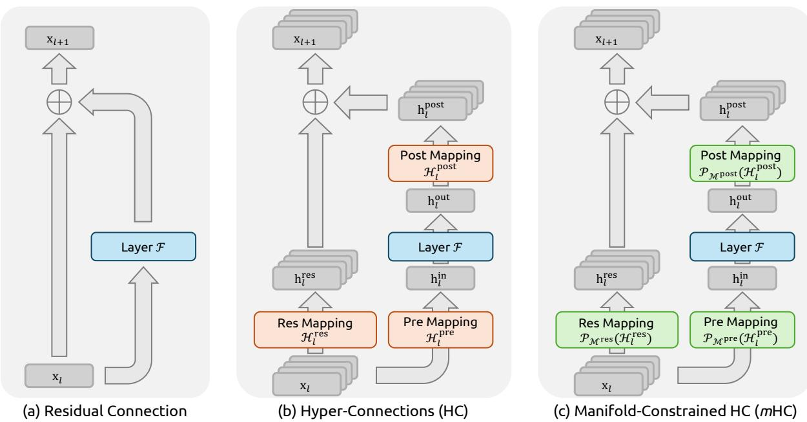
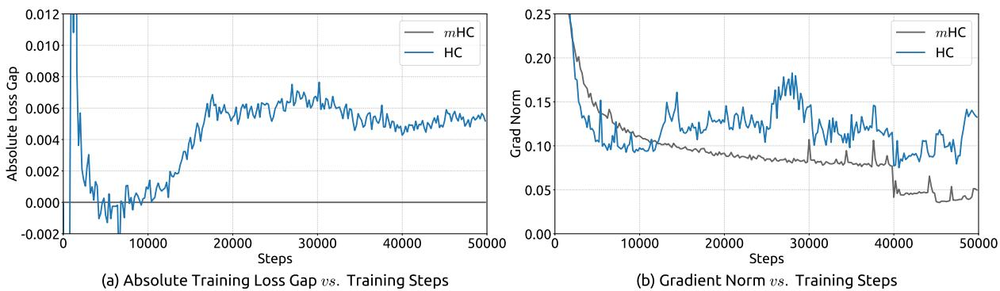
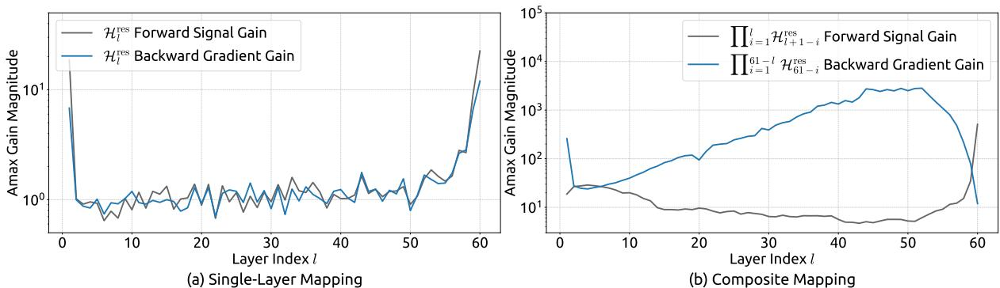
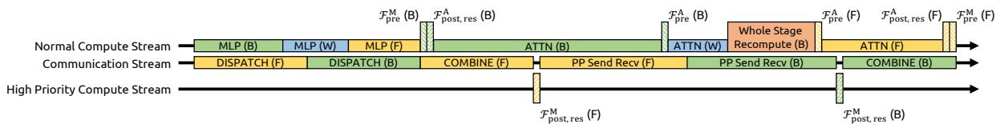
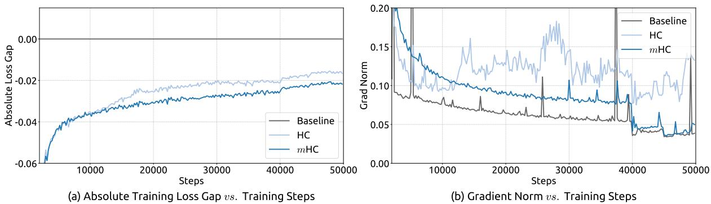
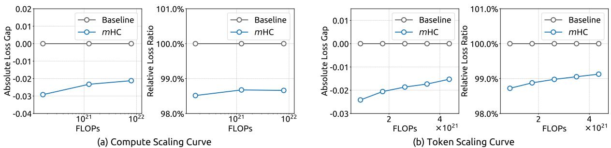
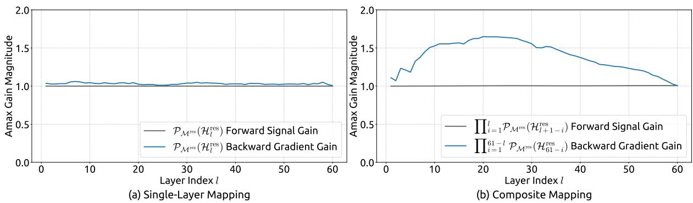
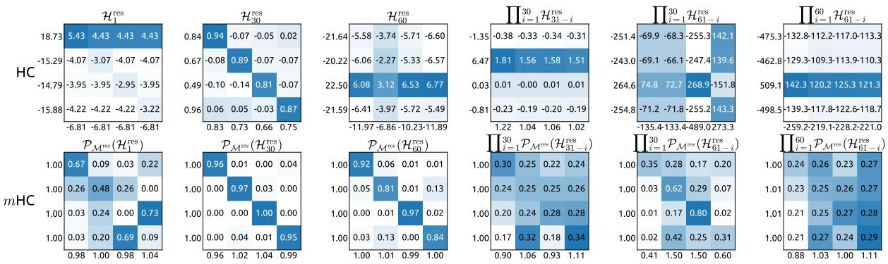

# mHC: 流形约束超连接

谢真达\*†, 魏奕轩\*, 曹焕琦\*, 赵承刚, 邓承祺, 李嘉世, 戴达迈, 高华佐, 常江, 赵亮, 周尚彦, 许哲安, 张正炎, 曾望丁, 胡胜丁, 王宇青, 袁晶扬, 王廉, 梁文峰

# DeepSeek-AI

# 摘要

最近的研究，例如超连接（HC），通过扩大残差流的宽度和多样化连接模式，拓展了过去十年中建立的普遍残差连接范式。尽管这一多样化带来了显著的性能提升，但从根本上削弱了残差连接固有的恒等映射属性，这导致严重的训练不稳定性和受限的可扩展性，并且还会增加显著的内存访问开销。为了解决这些挑战，我们提出了流形约束超连接 $( m \mathbf { H } \mathbf { C } )$，这是一种通用框架，它将HC的残差连接空间投影到特定流形上，以恢复恒等映射属性，同时纳入严格的基础设施优化以确保效率。实证实验表明，mHC在大规模训练中有效，提供了切实的性能提升和优越的可扩展性。我们预期，mHC作为HC的灵活而实用的扩展，将有助于更深入地理解拓扑架构设计，并为基础模型的演进提供有前景的方向。

  
Figure 1 | Illustrations of Residual Connection Paradigms. This figure compares the structural design of (a) standard Residual Connection, (b) Hyper-Connections (HC), and (c) our proposed Manifold-Constrained Hyper-Connections $( m \mathbf { H } \mathbf { C } )$ . Unlike the unconstrained HC, mHC focuses on optimizing the residual connection space by projecting the matrices onto a constrained manifold to ensure stability.

# 目录

1 引言 3

# 2 相关工作 4

2.1 微观设计 4 2.2 宏观设计 5

# 3 初步 5

3.1 数值不稳定性 . . . 6 3.2 系统开销 . . .

4.1 流形约束超连接 8 4.2 参数化与流形投影 . 9 4.3 高效基础设施设计 . 9 4.3.1 核融合 9 4.3.2 重新计算 . 10 4.3.3 双管道中的重叠通信 11

# 5 实验 12

5.1 实验设置 . 12 5.2 主要结果 . 12 5.3 扩展实验 13 5.4 稳定性分析 14

# 6 结论与展望 15

附录19 A.1 详细模型规格与超参数。19

# 1. 引言

自从引入残差网络（ResNets）以来，深度神经网络架构经历了快速演变（He等人，2016a）。如图1(a)所示，单层的结构可以表述为：

$$
\mathbf { x } _ { l + 1 } = \mathbf { x } _ { l } + \mathcal { F } ( \mathbf { x } _ { l } , \mathcal { W } _ { l } ) ,
$$

其中 $\mathbf{x}_{l}$ 和 $\mathbf{x}_{l+1}$ 分别表示第 $l$ 层的 $C$ 维输入和输出，$\mathcal{F}$ 表示残差函数。尽管在过去的十年中，残差函数 $\mathcal{F}$ 经过演变，包含了卷积、注意力机制和前馈网络等多种操作，但残差连接的范式始终保持其原有形式。随着 Transformer（Vaswani 等，2017）架构的发展，这一范式目前已在大型语言模型（LLMs）（Brown 等，2020；Liu 等，2024b；Touvron 等，2023）中确立了其作为基本设计元素的地位。这一成功主要归功于残差连接的简洁形式。更重要的是，早期研究（He 等，2016b）表明，残差连接的恒等映射性质在大规模训练过程中保持了稳定性和效率。通过在多个层之间递归扩展残差连接，得到式（1）：

$$
\pmb { x } _ { L } = \mathbf { x } _ { l } + \sum _ { i = l } ^ { L - 1 } \mathcal { F } ( \mathbf { x } _ { i } , \mathcal { W } _ { i } ) ,
$$

其中 $L$ 和 $l$ 分别对应于较深和较浅的层。身份映射一词指的是组件 $\mathbf{x}_{l}$ 本身，它强调了来自较浅层的信号直接映射到较深层而不进行任何修改的特性。最近，由 Hyper-Connections (HC) (Zhu et al., 2024) 代表的研究为残差连接引入了一个新维度，并实证展示了其性能潜力。HC 的单层架构如图 1(b) 所示。通过扩展残差流的宽度并增强连接的复杂性，HC 在不改变单位在 FLOPs 方面的计算开销的情况下，显著增加了拓扑复杂性。形式上，HC 中的单层传播定义为：

$$
\begin{array} { r } { \pmb { x } _ { l + 1 } = \mathcal { H } _ { l } ^ { \mathrm { r e s } } \pmb { x } _ { l } + \mathcal { H } _ { l } ^ { \mathrm { p o s t } \top } \mathcal { F } ( \mathcal { H } _ { l } ^ { \mathrm { p r e } } \pmb { x } _ { l } , \mathcal { W } _ { l } ) , } \end{array}
$$

其中 $\mathbf{x}_{l}$ 和 $\mathbf{x}_{l + 1}$ 分别表示第 $l$ 层的输入和输出。与公式 (1) 中的表述不同，$\mathbf{x}_{l}$ 和 $\mathbf{x}_{l + 1}$ 的特征维度从 $C$ 扩展至 $n \times C$ ，其中 $n$ 为扩展率。术语 $\mathcal{H}_{l}^{\mathrm{res}} \in \mathbb{R}^{n \times n}$ 表示一个可学习的映射，用于混合特征 $\mathcal{H}_{l}^{\mathrm{pre}} \in \mathbb{R}^{1 \times n}$，将来自 $nC$ 个流的特征聚合为 $C$。$\mathcal{H}_{l}^{\mathrm{post}} \in \mathbb{R}^{1 \times n}$ 将层输出映射回流中。然而，随着训练规模的增加，HC 引入了潜在的不稳定风险。主要关注点在于，HC 的非约束性质在架构跨越多个层时会损害恒等映射特性。在由多个并行流组成的架构中，理想的恒等映射作为保护机制，确保在前向和反向传播过程中，各流之间的平均信号强度保持不变。通过公式 (3) 递归地将 HC 扩展到多个层，得到：

$$
\pmb { x } _ { L } = \left( \prod _ { i = 1 } ^ { L - l } \mathcal { H } _ { L - i } ^ { \mathrm { r e s } } \right) \pmb { x } _ { l } + \sum _ { i = l } ^ { L - 1 } \left( \prod _ { j = 1 } ^ { L - 1 - i } \mathcal { H } _ { L - j } ^ { \mathrm { r e s } } \right) \mathcal { H } _ { i } ^ { \mathrm { p o s t } \top } \mathcal { F } ( \mathcal { H } _ { i } ^ { \mathrm { p r e } } \pmb { x } _ { i } , \mathcal { W } _ { i } ) ,
$$

其中 $L$ 和 $l$ 分别表示深层和浅层。与公式 (2) 相比，复合映射 $\Pi _ { i = 1 } ^ { L - l } \dot { \mathcal { H } } _ { L - i } ^ { \mathrm { r e s } }$ 的差异导致信号放大或衰减不受限制，从而在大规模训练过程中造成不稳定性。进一步考虑的是，尽管 HC 在计算效率方面（以 FLOPs 为单位）保持了较高水平，但对于扩展残差流在内存访问成本方面的硬件效率问题在原始设计中尚未得到解决。这些因素共同限制了 HC 的实际可扩展性，并阻碍了其在大规模训练中的应用。

为了应对这些挑战，我们提出了流形约束超连接（$ m \mathbf { H } \mathbf { C } $），如图 1(c) 所示，这是一个通用框架，它将 HC 的残差连接空间投影到特定流形上，以恢复恒等映射特性，同时结合严格的 UUF.L.O 算法（Sinkhorn 和 Knopp, 1967）以产生熵投影，将 $\mathcal { H } _ { l } ^ { \mathrm { r e s } }$ 投影到 Birkhoff 多面体上。该操作有效地将残差连接矩阵约束在由双随机矩阵构成的流形内。由于这些矩阵的行和列之和均为 1，操作 $\mathcal { H } _ { l } ^ { \mathrm { r e s } } \mathbf { x } _ { l }$ 实际上充当了输入特征的凸组合。此特性促进了良好条件下的信号传播，其中特征均值得以保留，信号范数严格正规化，有效减轻了消失或爆炸信号的风险。此外，由于矩阵乘法对于 $\Pi _ { i = 1 } ^ { L - l } \mathcal { H } _ { L - i } ^ { \mathrm { r e s } }$ 的封闭性，mHC 有效地保持了任意深度之间恒等映射的稳定性。为了确保效率，我们采用核融合，并利用 TileLang（Wang 等, 2025）开发混合精度核。此外，我们通过选择性重计算和在 DualPipe 调度内仔细重叠通信来减少内存占用（Liu 等, 2024b）。在语言模型预训练的大量实验表明，mHC 展现出卓越的稳定性和可扩展性，同时保持 HC 的性能优势。内部大规模训练表明，当扩展率 $n = 4$ 时，mHC 支持大规模训练，并仅引入 $6.7\%$ 的额外时间开销。

# 2.相关工作

深度学习的架构进展主要可分为微设计和宏设计。微设计关注计算模块的内部架构，具体规定特征在空间、时间和通道维度上的处理方式。相比之下，宏设计则确定模块间的拓扑结构，从而决定特征表示在不同层之间的传播、路由和合并方式。

# 2.1. 微观设计

受参数共享和平移不变性的驱动，卷积最初主导了结构化信号的处理。虽然随后出现的深度可分卷积（Chollet, 2017）和分组卷积（Xie et al., 2017）优化了效率，但Transformer的出现（Vaswani et al., 2017）确立了注意力机制和前馈网络（FFNs）作为现代架构的基本构件。注意力机制促进了全局信息的传播，而FFNs增强了单一特征的表示能力。为了在性能与大语言模型（LLMs）的计算需求之间达到平衡，注意力机制向高效变体演变，例如多查询注意力（MQA）（Shazeer, 2019）、分组查询注意力（GQA）（Ainslie et al., 2023）和多头潜在注意力（MLA）（Liu et al., 2024a）。与此同时，FFNs通过专家混合（MoE）（Fedus et al., 2022；Lepikhin et al., 2020；Shazeer et al., 2017）被推广为稀疏计算范式，使得在不成比例增加计算成本的情况下实现大规模参数扩展成为可能。

# 2.2. 宏观设计

宏观设计主导着网络的全局拓扑结构（Srivastava 等，2015）。继 ResNet（He 等，2016a）之后，DenseNet（Huang 等，2017）和 FractalNet（Larsson 等，2016）等架构旨在通过密集连接和多路径结构来增加拓扑复杂性，从而提高性能。深层聚合（DLA）（Yu 等，2018）通过在不同深度和分辨率上递归聚合特征进一步扩展了这一范式。

近年来，宏观设计的重点已经转向扩大残差流的宽度（Chai et al., 2020；Fang et al., 2023；Heddes et al., 2025；Mak and Flanigan, 2025；Menghani et al., 2025；Pagliardini et al., 2024；Xiao et al., 2025；Xie et al., 2023；Zhu et al., 2024）。超连接（Hyper-Connections，HC）（Zhu et al., 2024）引入了可学习矩阵，以调节不同深度特征之间的连接强度，而残差矩阵变换器（Residual Matrix Transformer，RMT）（Mak and Flanigan, 2025）则用外积记忆矩阵替代了标准残差流，以促进特征存储。同样，MUDDFormer（Xiao et al., 2025）采用多路动态密集连接来优化跨层信息流。尽管这些方法具有潜力，但它们妥协了残差连接固有的恒等映射特性，从而引入不稳定性并阻碍可扩展性。此外，由于特征宽度的扩大，这些方法还导致了显著的内存访问开销。在HC的基础上，所提出的mHC将残差连接空间限制在特定流形上，以恢复恒等映射特性，同时结合严格的基础架构优化以确保效率。这种方法在保持连接拓扑优势的同时，提高了稳定性和可扩展性。

# 3. 初步阶段

我们首先建立本文所使用的符号。在HC公式中，第$l \cdot$层的输入$\mathbf { x } _ { l } \in \mathbb { R } ^ { 1 \times C }$被扩展了一个因素$n$，其最大值为$\begin{array} { r } { \mathbf { x } _ { l } = ( \mathbf { x } _ { l , 0 } ^ { \top } , \ldots , \mathbf { x } _ { l , n - 1 } ^ { \top } ) ^ { \top } \in \mathbb { R } ^ { n \times C } . } \end{array}$这可以被视为$n$流的残差。这一操作有效地扩展了残差流的宽度。为了控制该流的读出、写入和更新过程，HC的$\mathcal { H } _ { l } ^ { \mathrm { p r e } } , \mathcal { H } _ { l } ^ { \mathrm { p o s } \bar { \mathrm { t } } } \in \mathbb { R } ^ { 1 \times \bar { n } }$和$\mathcal { H } _ { l } ^ { \mathrm { r e s } } \in \mathbb { R } ^ { n \times n }$。这些映射修改了在公式(1)中显示的标准残差连接，导致公式(3)中给出的公式。在HC公式中，可学习的映射由两部分系数组成：一个是输入依赖的，另一个是全局的，分别称为动态映射和静态映射。正式地，HC计算系数如下：

$$
\begin{array} { r l } & { \left\{ \tilde { \mathbf { x } } _ { l } = \mathrm { R M S N o r m } ( \mathbf { x } _ { l } ) \right. } \\ & { \left. \mathcal { H } _ { l } ^ { \mathrm { p r e } } = \alpha _ { l } ^ { \mathrm { p r e } } \cdot \operatorname { t a n h } ( \theta _ { l } ^ { \mathrm { p r e } } \tilde { \mathbf { x } } _ { l } ^ { \top } ) + \mathbf { b } _ { l } ^ { \mathrm { p r e } } \right. } \\ & { \left. \mathcal { H } _ { l } ^ { \mathrm { p o s t } } = \alpha _ { l } ^ { \mathrm { p o s t } } \cdot \operatorname { t a n h } ( \theta _ { l } ^ { \mathrm { p o s t } } \tilde { \mathbf { x } } _ { l } ^ { \top } ) + \mathbf { b } _ { l } ^ { \mathrm { p o s t } } \right. } \\ & { \left. \mathcal { H } _ { l } ^ { \mathrm { r e s } } = \alpha _ { l } ^ { \mathrm { r e s } } \cdot \operatorname { t a n h } ( \theta _ { l } ^ { \mathrm { r e s } } \tilde { \mathbf { x } } _ { l } ^ { \top } ) + \mathbf { b } _ { l } ^ { \mathrm { r e s } } , \right. } \end{array}
$$

在最后一个维度上应用 RMSNorm(·)（Zhang 和 Sennrich，2019），标量 $\alpha _ { l } ^ { \mathrm { p r e } } , \alpha _ { l } ^ { \mathrm { p o s t } }$ 和 $\alpha _ { l } ^ { \mathrm { r e s } } \in \mathbb { R }$ 是可学习的门控因子，初始化为较小的值。动态映射通过参数为 $\theta _ { l } ^ { \mathrm { { p r e } } } , \theta _ { l } ^ { \mathrm { { p o s t } } } \in \mathbb { R } ^ { 1 \times C }$ 和 $\theta _ { l } ^ { \mathrm { r e s } } \in \mathbb { R } ^ { n \times C }$ 的线性投影得出。 $\mathbf { b } _ { l } ^ { \mathrm { p r e } } , \mathbf { b } _ { l } ^ { \mathrm { p o s t } } \in \mathbb { R } ^ { 1 \times n }$ 和 $\mathbf { b } _ { l } ^ { \mathrm { r e s } } \in \mathbb { R } ^ { n \times n }$。值得注意的是，这些映射的引入— $\mathcal { H } _ { l } ^ { \mathrm { p r e } }$，$\mathcal { H } _ { l } ^ { \mathrm { p o s t } }$，以及 $\mathcal { H } _ { l } ^ { \mathrm { r e s } }$ 所带来的计算开销微乎其微，因为典型的扩展率 $n$（如 4）远小于输入维度 C。通过这种设计，HC 有效地将残差流的信息容量与层的输入维度解耦，而后者与模型的计算复杂度（FLOPs）密切相关。因此，HC 提供了一种调整残差流宽度的新途径，在规模化时补充了预训练规模法则中讨论的模型 FLOPs 和训练数据规模的传统缩放维度（Hoffmann et al.，2022）。尽管 HC 需要三个映射来管理残差流与层输入之间的维度不匹配，表 1 中提供的初步实验表明，残差映射 $\mathcal { H } _ { l } ^ { \mathrm { r e s } }$ 可带来最显著的性能提升。这个发现凸显了在残差流内有效信息交换的关键重要性。如果禁用 $( \mathcal { H } _ { l } ^ { \mathrm { p r e } } , \mathcal { H } _ { l } ^ { \mathrm { p o s t } }, \mathcal { H } _ { l } ^ { \mathrm { r e s } } )$，我们采用固定映射以保持维度一致性：对于 $\mathcal { H } _ { l } ^ { \mathrm { p r e } }$ 采用均匀权重 $1 / n$，对于 $\mathcal { H } _ { l } ^ { \mathrm { p o s t } }$ 和 $\mathcal { H } _ { l } ^ { \mathrm { r e s } }$ 。

<table><tr><td>Hres</td><td>$Hpr</td><td>Hpost</td><td>Absolute Loss Gap</td></tr><tr><td></td><td></td><td></td><td>0.0</td></tr><tr><td>✓</td><td></td><td></td><td>- 0.022</td></tr><tr><td>✓</td><td>✓</td><td></td><td>- 0.025</td></tr><tr><td>✓</td><td>✓</td><td>L</td><td>- 0.027</td></tr></table>

# 3.1. 数值不稳定性

虽然残差映射 $\mathcal { H } _ { l } ^ { \mathrm { r e s } }$ 对于性能至关重要，但其顺序应用会显著影响数值稳定性。如在式 (4) 中所述，当 HC 在多个层中展开时，从层 l 到层 $L$ 的有效信号传播由复合映射 $\dot { \Pi } _ { i = 1 } ^ { L - l } \mathcal { H } _ { L - i } ^ { \mathrm { r e s } }$ 控制，$\mathcal { H } _ { l } ^ { \mathrm { r e s } }$ 不可避免地偏离恒等映射。因此，信号的幅度在前向传播和反向传播过程中容易出现爆炸或消失。这一现象破坏了残差学习的基本前提，即不受阻碍的信号流，从而使得在更深或更大规模的模型中训练过程不稳定。

实证证据支持该分析。我们在大规模实验中观察到不稳定的损失行为，如图 2 所示。以 mHC 作为基线，HC 在大约 $1 2 \mathrm{ k}$ 步骤时展示出意外的损失激增，这与梯度范数的不稳定性高度相关。此外，对 $\mathcal{H}_{l}^{\mathrm{res}}$ 的分析验证了这种不稳定性的机制。为了量化复合映射 $\Pi_{i=1}^{L-l} \mathcal{H}_{L-i}^{\mathrm{res}}$ 在前向传播中捕捉的最坏情况扩展，第二个度量基于最大绝对列和，表示后向传播。我们将这些度量称为复合映射的 Amax 增益幅度。如图 3 (b) 所示，Amax 增益幅度产生极端值，峰值达到 3000，与 1 的显著差异确认了爆炸性残差流的存在。

  
Figure 2 | Training Instability of Hyper-Connections (HC). This figure illustrates (a) the absolute loss gap of HC relative to mHC, and (b) the comparisons of gradient norms. All results are based on 27B models.

  
Figure 3 | Propagation Instability of Hyper-Connections (HC). This figure illustrates the propagation dynamics of (a) the single-layer mapping $\mathcal { H } _ { l } ^ { \mathrm { r e s } }$ ad (b) the composite mapping $\Pi _ { i = 1 } ^ { L - l } \mathcal { H } _ { L - i } ^ { \mathrm { r e s } }$ $\mathbf { \hat { x } } \mathbf { \cdot }$ block into two independent layers (Attention and FFN). The Amax Gain Magnitude (y-axis) is calculated as the maximum absolute row sum (for the forward signal) and column sum (for the backward gradient), averaged over all tokens in a selected sequence.

# 3.2. 系统开销

尽管 HC 的计算复杂度由于额外映射的线性特性仍在可控范围内，但系统级开销带来了不可忽视的挑战。具体来说，内存访问 $\left( \mathrm { I } / \mathrm { O } \right)$ 成本往往构成现代模型架构中的主要瓶颈之一，通常被称为“内存墙”（Dao et al., 2022）。这个瓶颈在架构设计中经常被忽视，但它对运行时效率有着决定性的影响。

聚焦于广泛采用的预归一化Transformer（Vaswani等，2017）架构，我们分析了HC固有的I/O模式。表2总结了$n$流残差设计在单个残差层中引入的每个token的内存访问开销。分析表明，HC使内存访问成本大约增加了$n$倍。这种过度的I/O需求在没有融合内核的缓解下，显著降低了训练吞吐量。此外，由于需要$\mathcal { H } _ { l } ^ { \mathrm { p r e } } , \mathcal { H } _ { l } ^ { \mathrm { p o s t } } .$和$\mathcal { H } _ { l } ^ { \mathrm { r e s } }$中间激活进行反向传播，导致GPU内存占用大幅增加，通常需要梯度检查点以维持可行的内存使用。此外，HC在流水线并行中需要$n$倍的通信成本（Qi等，2024），导致更大的气泡并降低训练吞吐量。表2 | 每个token的内存访问成本比较。该分析考虑了在前向传播中残差流维护引入的开销，排除了层函数$\mathcal { F }$的内部$\mathrm { I } / \mathrm { O }$。

<table><tr><td>Method</td><td>Operation</td><td>Read (Elements)</td><td>Write (Elements)</td></tr><tr><td rowspan="2">Residual Connection</td><td>Residual Merge</td><td>2C</td><td>C</td></tr><tr><td>Total I/O</td><td>2C</td><td>C</td></tr><tr><td rowspan="6">Hyper- Connections</td><td>Calculate Hpre, Hpost st, Hres 1</td><td>nC</td><td>n{ +2n</td></tr><tr><td>Hre</td><td>nC + n</td><td>C</td></tr><tr><td>Hpt</td><td>C +n</td><td>nC</td></tr><tr><td>Hres</td><td>n + n{2</td><td>nC</td></tr><tr><td>Residual Merge</td><td>2nC</td><td>nC</td></tr><tr><td>Total I/O</td><td>(5n + 1)C + n² + 2n</td><td>(3n + 1)C + n² + 2n</td></tr></table>

# 4. 方法

# 4.1. 流形约束的超连接

借鉴恒等映射原则（He et al., 2016b），多重隐层结构的核心前提是将残差映射 $\mathcal { H } _ { l } ^ { \mathrm { r e s } }$ 限制在特定流形上。虽然原始的恒等映射通过强制 $\mathcal { H } _ { l } ^ { \mathrm { r e s } } = \mathbf { I }$ 确保了稳定性，但这从根本上限制了残差流中的信息交换，而信息交换对于最大化多流架构的潜力至关重要。因此，我们建议将残差映射投影到一个流形上，该流形同时保持跨层信号传播的稳定性并促进残差流间的相互作用，从而保留模型的表达能力。为此，我们将 $\mathcal { H } _ { l } ^ { \mathrm { r e s } }$ 限制为一个双随机矩阵，该矩阵具有非负项，且其行和列的总和均为1。形式上，令 $M ^ { \mathrm { r e s } }$ 表示双随机矩阵的流形（也称为 Birkhoff 多面体）。我们将 $\mathcal { H } _ { l } ^ { \mathrm { r e s } }$ 限制为 $\mathcal { P } _ { M ^ { \mathrm { r e s } } } ( \mathcal { H } _ { l } ^ { \mathrm { r e s } } )$，定义如下：

$$
\mathcal { P } _ { \mathcal { M } ^ { \mathrm { r e s } } } ( \mathcal { H } _ { l } ^ { \mathrm { r e s } } ) : = \left\{ \mathcal { H } _ { l } ^ { \mathrm { r e s } } \in \mathbb { R } ^ { n \times n } \ : | \ : \mathcal { H } _ { l } ^ { \mathrm { r e s } } \mathbf { 1 } _ { n } = \mathbf { 1 } _ { n } , \ : \mathbf { 1 } _ { n } ^ { \top } \mathcal { H } _ { l } ^ { \mathrm { r e s } } = \mathbf { 1 } _ { n } ^ { \top } , \ : \mathcal { H } _ { l } ^ { \mathrm { r e s } } \geqslant 0 \right\} ,
$$

其中 ${ \bf 1 } _ { n }$ 表示由全为1的 $n$ 维向量。值得注意的是，当 $n = 1$ 时，双重随机性条件退化为标量1，从而恢复原始的恒等映射。选择双重随机性赋予了多个对大规模模型训练有利的严格理论属性：1. 范数保持：双重随机矩阵的谱范数被限制在1以下（即 $\| \mathcal { H } _ { l } ^ { \mathrm { r e s } } \| _ { 2 } \leq 1 $）。这意味着可学习映射是非扩张的，有效减轻了梯度爆炸问题。2. 组合闭包：双重随机矩阵的集合在矩阵乘法下是封闭的。这确保了多个层之间的复合残差映射为 $\begin{array} { r } { \prod _ { i = 1 } ^ { L - l } \dot { \mathcal { H } } _ { L - i } ^ { \mathrm { r e s } } , } \end{array}$ 3. 通过毕尔可夫多胞体的几何解释：集合 $M ^ { \mathrm { r e s } }$ 形成毕尔可夫多胞体，即置换矩阵集合的凸包。这提供了明确的几何解释：残差映射作为置换的凸组合。从数学上看，这种矩阵的重复应用往往会单调地增加信息在流之间的混合，有效地充当一个强健的特征融合机制。此外，对映射 $\mathcal { H } _ { l } ^ { \mathrm { p r e } }$ 和输出映射 $\mathcal { H } _ { l } ^ { \mathrm { p o s t } }$ 的附加负约束，由正负系数构成，也可以被视为一种特殊的流形投影。

# 4.2. 参数化和流形投影 $\mathcal { H } _ { l } ^ { \mathrm { p r e } } , \mathcal { H } _ { l } ^ { \mathrm { p o s t } }$ 和 $\mathcal { H } _ { l } ^ { \mathrm { r e s } }$ 在 mHC 中。给定第 l 层的输入隐含矩阵 $\mathbf { x } _ { l } \in \mathbb { R } ^ { n \times C }$，我们首先将其展平为向量 $\vec { \bf x } _ { l } = \mathrm { v e c } ( { \bf x } _ { l } ) \in \mathbb { R } ^ { 1 \times n C }$ 以保留完整的上下文信息。然后，我们按照原始 HC 的公式得到动态映射和静态映射，具体如下：

$$
\left\{ \begin{array} { l l } { \vec { \mathbf { x } } _ { l } ^ { \prime } = \mathbf { R M S N o r m } ( \vec { \mathbf { x } } _ { l } ) } \\ { \mathcal { \tilde { H } } _ { l } ^ { \mathrm { p r e } } = \alpha _ { l } ^ { \mathrm { p r e } } \cdot ( \vec { \mathbf { x } } _ { l } ^ { \prime } \boldsymbol { \varphi } _ { l } ^ { \mathrm { p r e } } ) + \mathbf { b } _ { l } ^ { \mathrm { p r e } } } \\ { \mathcal { \tilde { H } } _ { l } ^ { \mathrm { p o s t } } = \alpha _ { l } ^ { \mathrm { p o s t } } \cdot ( \vec { \mathbf { x } } _ { l } ^ { \prime } \boldsymbol { \varphi } _ { l } ^ { \mathrm { p o s t } } ) + \mathbf { b } _ { l } ^ { \mathrm { p o s t } } } \\ { \mathcal { \tilde { H } } _ { l } ^ { \mathrm { r e s } } = \alpha _ { l } ^ { \mathrm { r e s } } \cdot \mathrm { m a t } ( \vec { \mathbf { x } } _ { l } ^ { \prime } \boldsymbol { \varphi } _ { l } ^ { \mathrm { r e s } } ) + \mathbf { b } _ { l } ^ { \mathrm { r e s } } , } \end{array} \right.
$$

其中 $\varphi _ { l } ^ { \mathrm { p r e } } , \varphi _ { l } ^ { \mathrm { p o s t } } \in \mathbb { R } ^ { n C \times n }$ 和 $\varphi _ { l } ^ { \mathrm { r e s } } \in \mathbb { R } ^ { n C \times n ^ { 2 } }$，$\mathrm { \ m a t } ( \cdot )$ 是一个将 $\mathbb { R } ^ { 1 \times n ^ { 2 } }$ 重塑为 $\mathbb { R } ^ { n \times n }$ 的重塑函数。然后，最终的约束映射通过以下方式获得：

$$
\left\{ \begin{array} { l l } { \mathcal { H } _ { l } ^ { \mathrm { p r e } } = \sigma ( \tilde { \mathcal { H } } _ { l } ^ { \mathrm { p r e } } ) } \\ { \mathcal { H } _ { l } ^ { \mathrm { p o s t } } = 2 \sigma ( \tilde { \mathcal { H } } _ { l } ^ { \mathrm { p o s t } } ) } \\ { \mathcal { H } _ { l } ^ { \mathrm { r e s } } = \mathrm { S i n k h o r n – K n o p p } ( \tilde { \mathcal { H } } _ { l } ^ { \mathrm { r e s } } ) , } \end{array} \right.
$$

其中 $\sigma ( \cdot )$ 表示 Sigmoid 函数。Sinkhorn-Knopp(·) 算子首先通过指数运算将所有元素转换为正值，然后进行交替归一化过程，以使行和列的总和均为 1。具体来说，给定一个正矩阵 $\mathbf { M } ^ { ( 0 ) } = \exp ( \mathcal { \tilde { H } } _ { l } ^ { \mathrm { r e s } } )$ 作为起始点，归一化迭代过程如下：

$$
\mathbf { M } ^ { ( t ) } = \mathcal { T } _ { r } \left( \mathcal { T } _ { c } ( \mathbf { M } ^ { ( t - 1 ) } ) \right) ,
$$

其中 $\mathcal{T}_{r}$ 和 $\mathcal{T}_{c}$ 分别表示行标准化和列标准化。该过程随着 $t_{\mathrm{max}} \to \infty$ 收敛到一个双随机矩阵 $\mathcal{H}_{l}^{\mathrm{res}} = \mathbf{M}^{(t_{\mathrm{max}})}$。我们在实验中选择 $t_{\mathrm{max}} = 20$ 作为一个实用值。

# 4.3. 高效的基础设施设计

在本节中，我们详细描述了针对 mHC 的基础设施设计。通过严格的优化，我们在大规模模型中实现了 mHC（$n = 4$），仅增加了 $6.7\%$ 的训练开销。

# 4.3.1. 核融合

观察到在高维隐藏状态 $\vec { \bf x } _ { l } \in \mathbb { R } ^ { 1 \times n C }$ 矩阵乘法上执行的 RMSNorm 在 mHC 中引入了显著延迟。该优化在保持数学等价性的同时提高了效率。此外，我们采用混合精度策略，以在不影响速度的情况下最大化数值准确性，并将多个操作与共享内存访问融合成统一的计算内核，以减少内存带宽瓶颈。基于公式 (10) 到 (13) 中详细的输入和参数，我们实现了三个专用的 mHC 内核来计算 $\bar { \mathcal { H } } _ { l } ^ { \mathrm { p r e } } , \mathcal { H } _ { l } ^ { \mathrm { p o s t } } ,$ 和 $\mathcal { H } _ { l } ^ { \mathrm { r e s } }$ ${ \bf b } _ { l }$ 和 $\varphi _ { l } ,$ RMSNorm 权重也被吸收进 $\varphi _ { l }$。 • 公式 (14) 到 (15)：我们开发了一个统一的内核，融合了对 $\vec { \bf x } _ { l }$ 的两个扫描，利用矩阵乘法单元以最大限度地提高内存带宽利用率。反向传播包括两个矩阵乘法，同样被整合为一个内核，消除了对 $\vec { \bf x } _ { l }$ 的冗余重载。这两个内核都具有精细调整的流水线（加载、转换、计算、存储）以高效处理混合精度处理。公式 (16) 到 (18)：这些针对小系数的轻量级操作被有利地融合到一个内核中，从而显著减少内核启动开销。 • 公式 (19)：我们在单个内核中实现了 Sinkhorn-Knopp迭代。对于反向传播，我们推导出一个定制的反向内核，重新计算片上中间结果并遍历整个迭代。

$$
\left[ n C , n ^ { 2 } + 2 n \right]
$$

$$
\begin{array} { r l r } & { } & { { \varphi } _ { i } : \mathrm { f i d o a t i 2 } } \\ & { } & { \vec { x } _ { i } : \mathrm { b i f o a t i 2 } } \\ & { } & { \vec { x } _ { i } : \mathrm { b i f o a t i 2 } } \\ & { } & { \alpha _ { 1 } ^ { \mathrm { R e l } } , \alpha _ { 1 } ^ { \mathrm { R e l } } , \alpha _ { 1 } ^ { \mathrm { R e l } } ; \mathrm { f o a t i 2 } } \\ & { } & { \mathrm { b i f ~ } \mathrm { f l o a t i 2 } } \\ & { } & { \mathrm { i f ~ } \vec { H } _ { i } ^ { \mathrm { R e l } } , \beta _ { 1 } ^ { \mathrm { R e l } } , \vec { H } _ { i } ^ { \mathrm { R e l } } ; \mathrm { i ~ } \mathrm { j i } \mathrm { a n t i 2 } } \\ & { } & { \mathrm { ~ \ \ } } \\ & { } & { \mathrm { { \Gamma : ~ f i d o a t i 2 } } } \\ & { } & { \left( \vec { H } _ { i } ^ { \mathrm { R e } } , \vec { H } _ { i } ^ { \mathrm { R e l } } , \vec { H } _ { i } ^ { \mathrm { R e l } } \right) : \mathrm { ( f l o a t i 2 ) } } \\ & { } & { \mathcal { H } _ { i } ^ { \mathrm { R e } } : \mathrm { f l o a t i 2 } } \\ & { } & { \mathcal { H } _ { i } ^ { \mathrm { R e l } } : \mathrm { f l o a t i 2 } } \\ & { } & { \mathcal { H } _ { i } ^ { \mathrm { R e l } } : \mathrm { f l o a t i 2 } } \\ & { } & { \mathcal { H } _ { i } ^ { \mathrm { R e l } } : \mathrm { f l o a t i 2 } . } \end{array}
$$

$$
\begin{array} { r l } & { [ 1 , n ^ { 2 } + 2 n ] } \\ & { = \bar { x } _ { i } \varphi n } \\ & { = \bigl \| \vec { \bf x } _ { i } \bigr \| _ { 2 } / \sqrt { n c } } \\ & { = 1 / r \left[ \alpha _ { i } ^ { \mathrm { P r e } } \bar { \mathcal { H } } _ { l } ^ { \mathrm { P r e } } , \alpha _ { i } ^ { \mathrm { P o t . } } \bar { \mathcal { H } } _ { l } ^ { \mathrm { P o t . } } , \alpha _ { i } ^ { \mathrm { P r e } } \bar { \mathcal { H } } _ { l } ^ { \mathrm { e x . } } \right] + { \bf b } _ { i } } \\ & { = \sigma \left( \bar { \mathcal { H } } _ { l } ^ { \mathrm { P r e } } \right) } \\ & { = 2 \sigma \left( \tilde { \mathcal { H } } _ { l } ^ { \mathrm { P o t . } } \right) } \\ & { = \mathrm { S i n k l o r n - K n o p p } \left( \tilde { \mathcal { H } } _ { l } ^ { \mathrm { r e s } } \right) } \end{array}
$$

利用上述核所导出的系数，我们引入两个额外的$\mathcal { F } _ { \mathrm { p r e } } : = \mathcal { H } _ { l } ^ { \mathrm { p r e } } \mathbf { x } _ { l }$和另一个用于$\mathcal { F } _ { \mathrm { p o s t , r e s } } : = \mathcal { H } _ { l } ^ { \mathrm { r e s } } \mathbf { x } _ { l } + \mathcal { H } _ { l } ^ { \mathrm { p o s t } \top } \mathcal { F } ( \cdot , \cdot )$的核。通过残差合并，我们将读取的元素数量从$( 3 n + 1 ) C$减少到$( n + 1 ) C$，将写入的元素数量从$3 n C$减少到$n C$。我们使用TileLang（Wang et al., 2025）高效实现了大多数核（不包括方程（14）至（15））。该框架简化了复杂计算过程的核的实现，允许我们以最小的工程努力充分利用内存带宽。

# 4.3.2. 再计算

$n$流残差设计在训练过程中引入了显著的内存开销。为了解决这个问题，我们在前向传播后丢弃mHC核的中间激活，并在反向传播中动态重新计算它们，方法是重新执行没有重层函数$\mathcal{F}$的mHC核。因此，对于一组连续的$L_{r}$层，我们只需存储第一层的输入$\mathbf{x}_{l_{0}}$。在考虑$\mathcal{F}_{\cdot}$中的预归一化时，排除轻量级系数，表3总结了为反向传播保留的中间激活。表3 | 存储和重新计算的中间激活 我们列出了为反向传播保留的每个token激活及在$L_{r}$连续层中重新计算的瞬态激活。层$l_{0}$表示$L_{r}$层中的第一层，层$l$在$[l_{0}, l_{0} + L_{r} - 1]$中。

<table><tr><td>Activations</td><td>xl</td><td></td><td></td><td>F(HPrex1, W1) | x] Hpre| RMSNorm(H prex1)</td></tr><tr><td>Size (Elements)</td><td>nC</td><td>C</td><td>nC C</td><td>C</td></tr><tr><td>Stored Method</td><td>Every Lr layers</td><td>Every layer</td><td></td><td>Transient inside Lr layers</td></tr></table>

由于 mHC 核心重计算是在 $L _ { r }$ 个连续层的块中进行的，考虑到总共有 $L$ 层，我们必须为所有 $\left\lceil { \frac { L } { L _ { r } } } \right\rceil$ 个块持久存储第一层输入 $\mathbf { x } _ { l _ { 0 } }$ 以进行反向传播。除了这部分常驻内存之外，重计算过程还会为活动块引入 $( n + 2 ) C \times L _ { r }$ 元素的瞬时内存开销，这决定了反向传播期间的峰值内存使用量。因此，我们通过最小化与 $L _ { r }$ 相关的总内存占用来确定最优块大小 $L _ { r } ^ { * }$：

$$
L _ { r } ^ { * } = \arg \operatorname* { m i n } _ { L _ { r } } \left[ n C \times \left\lceil \frac { L } { L _ { r } } \right\rceil + ( n + 2 ) C \times L _ { r } \right] \approx \sqrt { \frac { n L } { n + 2 } } .
$$

此外，大规模训练中的流水线并行性施加了一个约束：重计算块不得跨越流水线阶段边界。观察到理论最优值 $L _ { r } ^ { * }$ 通常与每个流水线阶段的层数对应，我们选择将重计算边界与流水线阶段进行同步。

# 4.3.3. DualPipe 中的重叠通信

在大规模训练中，管道并行性是减轻参数和梯度内存占用的标准做法。具体而言，我们采用了DualPipe调度（Liu et al., 2024b），该调度有效地重叠规模扩展的互联通信流量，例如专家和管道并行性的通信。然而，与单流设计相比，所提议的$n$-流残差在mHC中在管道阶段之间引入了大量的通信延迟。此外，在阶段边界，对所有$L _ { r }$层的mHC内核进行重新计算引入了不可忽视的计算开销。为了解决这些瓶颈，我们扩展了DualPipe调度（见图4），以促进管道阶段边界的通信与计算的更好重叠。值得注意的是，为了防止阻塞通信流，我们在专用的高优先级计算流上执行MLP（即FFN）层的$\mathcal { F } _ { \mathrm { p o s t , r e s } }$内核。此外，我们还避免在注意力层中采用持久内核进行长时间运行的操作，从而防止了延长的停顿。该设计允许对重叠的注意力计算进行抢占，实现灵活调度，同时保持计算设备处理单元的高利用率。此外，重新计算过程与管道通信依赖性解耦，因为每个阶段的初始激活$\mathbf { x } _ { l _ { 0 } }$已经在本地缓存。

  
Figure 4 | Communication-Computation Overlapping for mHC. We extend the DualPipe schedule to handle the overhead introduced by mHC. Lengths of each block are illustrative only and do not represent actual duration. (F), (B), (W) refers to forward pass, backward pass, weight gradient computation, respectively. $\mathcal { F } ^ { \mathrm { A } }$ and ${ \mathcal { F } } ^ { \mathrm { M } }$ represents kernels corresponded to Attention and MLP, respectively.

# 5. 实验

# 5.1. 实验设置

我们通过语言模型预训练验证了所提出的方法，对比分析了基线、HC 和我们提议的 mHC。利用受 DeepSeek-V3 启发的 MoE 架构（Liu et al., 2024b），我们训练了四种不同的模型变体，以覆盖不同的评估模式。具体而言，HC 和 mHC 的扩展率 $n$ 设置为 4。我们的主要关注点是一个参数为 27B 的模型，其训练的数据集大小与其参数成比例，该模型是我们系统级主要结果的研究对象。在此基础上，我们分析了计算扩展行为，结合了小型的 3B 和 9B 模型，这些模型是在成比例的数据上训练的，使我们能够观察到不同计算量下的性能趋势。此外，为了具体研究词元扩展行为，我们在一个固定语料库（包含 1 万亿个词元）上训练了一个独立的 3B 模型。详细的模型配置和训练超参数已在附录 A.1 中提供。

# 5.2. 主要结果

  
Figure 5 | Training Stability of Manifold-Constrained Hyper-Connections $\textstyle ( m \mathbf { H } \mathbf { C } )$ . This figure illustrates (a) the absolute training loss gap of mHC and HC relative to the baseline, and (b) the gradient norm of the three methods. All experiments utilize the 27B model. The results demonstrate that mHC exhibits improved stability in terms of both loss and gradient norm.

我们首先考察27B模型的训练稳定性和收敛性。如图5(a)所示，mHC有效缓解了HC中观察到的训练不稳定性，相较于基线模型，其最终损失降低了0.021。这种改善的稳定性在图5(b)中的梯度范数分析中得到了进一步验证，mHC的表现明显优于HC，保持了与基线相当的稳定特性。表4 | 27B模型的系统级基准结果。该表比较了基线、HC和mHC在8个不同下游基准上的零样本和少样本性能。mHC在大多数基准中始终优于基线，并超越了HC，证明了其在大规模预训练中的有效性。

<table><tr><td>Benchmark (Metric)</td><td>BBH (EM)</td><td>DROP (F1)</td><td>GSM8K (EM)</td><td>HellaSwag (Acc.)</td><td>MATH (EM)</td><td>MMLU (Acc.)</td><td>PIQA (Acc.)</td><td>TriviaQA (EM)</td></tr><tr><td># Shots</td><td>3-shot</td><td>3-shot</td><td>8-shot</td><td>10-shot</td><td>4-shot</td><td>5-shot</td><td>0-shot</td><td>5-shot</td></tr><tr><td>27B Baseline</td><td>43.8</td><td>47.0</td><td>46.7</td><td>73.7</td><td>22.0</td><td>59.0</td><td>78.5</td><td>54.3</td></tr><tr><td>27B w/ HC</td><td>48.9</td><td>51.6</td><td>53.2</td><td>74.3</td><td>26.4</td><td>63.0</td><td>79.9</td><td>56.3</td></tr><tr><td>27B w/ mHC</td><td>51.0</td><td>53.9</td><td>53.8</td><td>74.7</td><td>26.0</td><td>63.4</td><td>80.5</td><td>57.6</td></tr></table>

表 4 展示了在多样化基准上的下游性能（Bisk et al., 2020；Cobbe et al., 2021；Hendrycks et al., 2020, 2021；Joshi et al., 2017；Zellers et al., 2019）。mHC 产生了全方面的改进，持续优于基线，并在大多数任务上超越了 HC。值得注意的是，与 HC 相比，mHC 进一步增强了模型的推理能力，在 BBH（Suzgun et al., 2022）上获得了 $2.1\%$ 的性能提升，在 DROP（Dua et al., 2019）上获得了 $2.3\%$ 的性能提升。

# 5.3. 扩展实验

  
Figure 6 | Scaling properties of mHC compared to the Baseline. (a) Compute Scaling Curve. Solid lines depict the performance gap across different compute budgets. Each point represents a specific compute-optimal configuration of model size and dataset size, scaling from 3B and 9B to 27B parameters. (b) Token Scaling Curve. Trajectory of the 3B model during training. Each point represents the model's performance at different training tokens. Detailed architectures and training configurations are provided in Appendix A.1.

为了评估我们方法的可扩展性，我们报告了 mHC 相对于基线在不同规模下的相对损失改善。在图 6 (a) 中，我们绘制了涵盖 3B、9B 和 27B 参数的计算扩展曲线。轨迹表明，即使在更高的计算预算下，性能优势依然得以稳健维持，仅有微弱的减弱。此外，我们在图 6 (b) 中检查了运行内的动态，展示了 3B 模型的词元扩展曲线。总体来看，这些发现验证了 mHC 在大规模场景中的有效性。这一结论得到了我们内部大规模训练实验的进一步 corroboration。

  
Figure 7 | Propagation Stability of Manifold-Constrained Hyper-Connections $\textstyle ( m \mathbf { H } \mathbf { C } )$ . This figure illustrates the propagation dynamics of (a) the single-layer mapping $\mathcal { P } _ { M ^ { \mathrm { r e s } } } ( \mathcal { H } _ { l } ^ { \mathrm { r e s } } )$ and (b) the composite mapping $\Pi _ { i = 1 } ^ { L - l } { \mathcal { P } } _ { M ^ { \mathrm { r e s } } } ( { \mathcal { H } } _ { L - i } ^ { \mathrm { r e s } } )$ w h  me Te sult demott mHC significantly enhances propagation stability compared to HC.

  
Figure 8 | Visualizations of Learnable Mappings. This figure displays representative singlelayer and composite mappings for HC (first row) and mHC (second row). Each matrix is computed by averaging over all tokens within a selected sequence. The labels annotated along the y-axis and x-axis indicate the forward signal gain (row sum) and the backward gradient gain (column sum), respectively.

# 5.4. 稳定性分析

与图3类似，图7展示了mHC的传播稳定性。理想情况下，单层映射满足双重随机约束，这意味着前向信号增益和后向梯度增益均应等于1。然而，实际实施中使用Sinkhorn-Knopp算法时必须限制迭代次数以实现计算效率。在我们的设置中，我们使用20次迭代以获得近似解。因此，如图7(a)所示，后向梯度增益稍微偏离1。在图7(b)所示的复合情况下，偏差增加但仍保持有界，最大值约为1.6。值得注意的是，与HC中接近3000的最大增益幅度相比，mHC显著将其减少了三个数量级。这些结果表明，与HC相比，mHC显著增强了传播稳定性，确保了前向信号和后向梯度流的稳定。此外，图8显示了代表性的映射。我们观察到，对于HC，当最大增益较大时，其他值也趋向显著，这表明所有传播路径的整体不稳定性。相比之下，mHC始终产生稳定的结果。

# 6. 结论与展望

在本文中，我们指出，虽然扩展残差流的宽度和多样化连接能够提升性能，如超连接（Hyper-Connections, HC）所提议，但这些连接的无约束性质导致信号发散。这种扰动损害了跨层信号能量的保持，导致训练不稳定，并阻碍了深度网络的可扩展性。为了应对这些挑战，我们引入了流形约束超连接（Manifold-Constrained Hyper-Connections，$ m \mathbf { H } \mathbf { C } $），这是一个将残差连接空间映射到特定流形的广义框架。通过使用Sinkhorn-Knopp算法对残差映射施加双重随机约束，mHC将信号传播转化为特征的凸组合。实证结果证实，mHC有效恢复了恒等映射特性，使得大规模训练稳定，并相比于传统的HC具有更优的可扩展性。至关重要的是，通过高效的基础设施级优化，mHC以微不足道的计算开销实现了这些改进。作为HC范式的广泛扩展，mHC为未来研究开辟了多个有前景的方向。虽然本工作利用双重随机矩阵确保稳定性，但该框架允许探索多样的流形约束，以针对特定学习目标进行调整。我们预期进一步探讨不同的几何约束能够产生新方法，优化可塑性与稳定性之间的权衡。此外，我们希望mHC能重新激发社区对宏观架构设计的兴趣。通过深入理解拓扑结构如何影响优化和表征学习，mHC将有助于解决当前的局限性，并可能开辟新路径，推动下一代基础架构的发展。

# References

J. Ainslie, J. Lee-Thorp, M. De Jong, Y. Zemlyanskiy, F. Lebrón, and S. Sanghai. Gqa: Training generalized multi-query transformer models from multi-head checkpoints. arXiv preprint arXiv:2305.13245, 2023.   
Y. Bisk, R. Zellers, R. L. Bras, J. Gao, and Y. Choi. PIQA: reasoning about physical commonsense in natural language. In The Thirty-Fourth AAAI Conference on Artificial Intelligence, AAAI 2020, The Thirty-Second Innovative Applications of Artificial Intelligence Conference, IAAI 2020, The Tenth AAAI Symposium on Educational Advances in Artificial Intelligence, EAAI 2020, New York, NY, USA, February 7-12, 2020, pages 74327439. AAAI Press, 2020. doi: 10.1609/aaai.v34i05.6239. URL https://doi .org/10 . 1609/aaai. v34i05 .6239.   
T. Brown, B. Mann, N. Ryder, M. Subbiah, J. D. Kaplan, P. Dhariwal, A. Neelakantan, P. Shyam, G. Sastry, A. Askell, et al. Language models are few-shot learners. Advances in neural information processing systems, 33:18771901, 2020.   
Y. Chai, S. Jin, and X. Hou. Highway transformer: Self-gating enhanced self-attentive networks. In D. Jurafsky, J. Chai, N. Schluter, and J. Tetreault, editors, Proceedings of the 58th Annual Meeting of the Association for Computational Linguistics, pages 68876900, Online, July 2020. Association for Computational Linguistics. doi: 10.18653/v1/2020.acl-main.616. URL https://aclanthology.org/2020.acl-main.616/.   
F. Chollet. Xception: Deep learning with depthwise separable convolutions. In Proceedings of the IEEE conference on computer vision and pattern recognition, pages 12511258, 2017.   
K. Cobbe, V. Kosaraju, M. Bavarian, M. Chen, H. Jun, L. Kaiser, M. Plappert, J. Tworek, J. Hilton, R. Nakano, et al. Training verifiers to solve math word problems. arXiv preprint arXiv:2110.14168, 2021.   
T. Dao, D. Y. Fu, S. Ermon, A. Rudra, and C. Ré. FlashAttention: Fast and memory-efficient exact attention with IO-awareness. In Advances in Neural Information Processing Systems (NeurIPS), 2022.   
D.Dua, Y. Wang, P. Dasigi, G. Staosky, S. Singh, and M. Gardner. DROP: A redi comprehension benchmark requiring discrete reasoning over paragraphs. In J. Burstein, C. Doran, and T. Solorio, editors, Proceedings of the 2019 Conference of the North American Chapter of the Association for Computational Linguistics: Human Language Technologies, NAACL-HLT 2019, Minneapolis, MN, USA, June 2-7, 2019, Volume 1 (Long and Short Papers), pages 2368 2378. Association for Computational Linguistics, 2019. doi: 10.18653/V1/N19-1246. URL https://doi.org/10.18653/v1/n19-1246.   
Y. Fang, Y.CAI, J.Chen, J. Zhao, G. Tian, and G. Li. Cross-ayer rerospecive reriving viayer attention. In The Eleventh International Conference on Learning Representations, 2023. URL https://openreview.net/forum?id $\cdot ^ { = }$ pvgEL1yS3Q1.   
W. Fedus, B. Zoph, and N. Shazeer. Switch transformers: Scaling to trillion parameter models with simple and efficient sparsity. Journal of Machine Learning Research, 23(120):139, 2022. of the IEEE conference on computer vision and pattern recognition, pages 770778, 2016a.   
K. He, X. Zhang, S. Ren, and J. Sun. Identity mappings in deep residual networks. In European conference on computer vision, pages 630645. Springer, 2016b.   
M. Heddes, A. Javanmard, K. Axiotis, G. Fu, M. Bateni, and V. Mirrokni. Deepcrossattention: Supercharging transformer residual connections. In Forty-second International Conference on Machine Learning, 2025. URL https://openreview.net/forum?id=j3JBfFnGYh.   
.Hck C. B S. , A.ZM. Mz D.S  J M massive multitask language understanding. arXiv preprint arXiv:2009.03300, 2020.   
D. Hendrycks, C. Burns, S. Kadavath, A. Arora, S. Basart, E. Tang, D. Song, and J. Steinhardt. Measuring mathematical problem solving with the math dataset. arXiv preprint arXiv:2103.03874, 2021.   
J. Hoffmann, S. Borgeaud, A. Mensch, E. Buchatskaya, T. Cai, E. Rutherford, D. de Las Casas, L. A. Hendricks, J. Welbl, A. Clark, T. Hennigan, E. Noland, K. Millican, G. van den Driessche, B. Damoc, A. Guy, S. Osindero, K. Simonyan, E. Elsen, O. Vinyals, J. Rae, and L. Sifre. An empirical analysis of compute-optimal large language model training. In S. Koyejo, S. Mohamed, A. Agarwal, D. Belgrave, K. Cho, and A. $\mathrm { O h } ,$ editors, Advances in Neural Information Processing Systems, volume 35, pages 3001630030. Curran Associates, Inc., 2022. URLhttps://proceedings.neurips.cc/paper_files/paper/2022/file/c1e2faf f6f588870935f114ebe04a3e5-Paper-Conference.pdf.   
G. Huang, Z. Liu, L. Van Der Maaten, and K. Q. Weinberger. Densely connected convolutional networks. In Proceedings of the IEEE conference on computer vision and pattern recognition, pages 47004708, 2017.

M. Joshi, E. Choi, D. Weld, and L. Zettlemoyer. TriviaQA: A large scale distantly supervised challenge dataset for reading comprehension. In R. Barzilay and M.-Y. Kan, editors, Proceedings of the 55th Annual Meeting of the Association for Computational Linguistics (Volume 1: Long Papers), pages 16011611, Vancouver, Canada, July 2017. Association for Computational Linguistics. doi: 10.18653/v1/P17-1147. URL https://aclanthology .org/P17-1147.

G. Larsson, M. Maire, and G. Shakhnarovich. Fractalnet: Ultra-deep neural networks without residuals. arXiv preprint arXiv:1605.07648, 2016.

D. Lepikhin, H. Lee, Y. Xu, D. Chen, O. Firat, Y. Huang, M. Krikun, N. Shazeer, and Z. Chen. Gshard: Scaling giant models with conditional computation and automatic sharding. arXiv preprint arXiv:2006.16668, 2020.

A. Liu, B. Feng, B. Wang, B. Wang, B. Liu, C. Zhao, C. Dengr, C. Ruan, D. Dai, D. Guo, et al. Deepseek-v2: A strong, economical, and efficient mixture-of-experts language model. arXiv preprint arXiv:2405.04434, 2024a.

A. Liu, B. Feng, B. Xue, B. Wang, B. Wu, C. Lu, C. Zhao, C. Deng, C. Zhang, C. Ruan, et al. Deepseek-v3 technical report. arXiv preprint arXiv:2412.19437, 2024b.

I. Loshchilov and F. Hutter. Decoupled weight decay regularization. arXiv preprint arXiv:1711.05101, 2017.

B. Mak and J. Flanigan. Residual matrix transformers: Scaling the size of the residual stream. arXiv preprint arXiv:2506.22696, 2025.

G. Menghani, R. Kumar, and S. Kumar. LAurel: Learned augmented residual layer. In Forty-second International Conference on Machine Learning, 2025. URL https : / /open review.net/forum?id $\equiv$ rUDRWP9WvZ.

M. Pagliardini, A. Mohtashami, F. Fleuret, and M. Jaggi. Denseformer: Enhancing information flow in transformers via depth weighted averaging. In The Thirty-eighth Annual Conference on Neural Information Processing Systems, 2024. URL https : //openreview . net/forum ?id=kMnoh7CXrq.

P. Qi, X. Wan, G. Huang, and M. Lin. Zero bubble (almost) pipeline parallelism. In The Twelfth International Conference on Learning Representations, 2024. URL https : //openreview .net/forum?id $\equiv$ tuzTNOe105.

N. Shazeer. Fast transformer decoding: One write-head is all you need. arXiv preprint arXiv:1911.02150, 2019.

N. Shazeer, A. Mirhoseini, K. Maziarz, A. Davis, Q. Le, G. Hinton, and J. Dean. Outrageously large neural networks: The sparsely-gated mixture-of-experts layer. arXiv preprint arXiv:1701.06538, 2017.

R. Sinkhorn and P. Knopp. Concerning nonnegative matrices and doubly stochastic matrices. Pacific Journal of Mathematics, 21(2):343348, 1967.

R. K. Srivastava, K. Greff, and J. Schmidhuber. Training very deep networks. In C. Cortes, N. Lawrence, D. Lee, M. Sugiyama, and R. Garnett, editors, Advances in Neural Information Processing Systems, volume 28. Curran Associates, Inc., 2015. URL https : //proceedings . neurips.cc/paper_files/paper/2015/file/215a71a12769b056c3c32e7299f1c5e d-Paper.pdf.

J.S, M. Am, Y. Lu, S. Pan, W. Bo, and Y. Liu. Roorm: Ehan tranormr wit rary position embedding. Neurocomputing, 568:127063, 2024.   
M. Suzgun, N. Scales, N. Schärli, S. Gehrmann, Y. Tay, H. W. Chung, A. Chowdhery, Q. V. Le, E. H. Chi, D. Zhou, et al. Challenging big-bench tasks and whether chain-of-thought can solve them. arXiv preprint arXiv:2210.09261, 2022.   
H. Touvron, T. Lavril, G. Izacard, X. Martinet, M.-A. Lachaux, T. Lacroix, B. Rozière, N. Goyal, E. Hambro, F. Azhar, et al. Llama: Open and efficient foundation language models. arXiv preprint arXiv:2302.13971, 2023.   
A. Vaswani, N. Shazeer, N. Parmar, J. Uszkoreit, L. Jones, A. N. Gomez, L. Kaiser, and I. Polosukhin. Attention is all you need. Advances in neural information processing systems, 30, 2017.   
L. Wang, H. Gao, C. Zhao, X. Sun, and D. Dai. Auxiliary-loss-free load balancing strategy for mixture-of-experts. arXiv preprint arXiv:2408.15664, 2024.   
L. Wang, Y. Cheng, Y. Shi, Z. Tang, Z. Mo, W. Xie, L. Ma, Y. Xia, J. Xue, F. Yang, et al. Tilelang: A composable tiled programming model for ai systems. arXiv preprint arXiv:2504.17577, 2025.   
D. Xiao, Q. Meng, S. Li, and X. Yuan. Muddformer: Breaking residual bottlenecks in transformers via multiway dynamic dense connections. arXiv preprint arXiv:2502.12170, 2025.   
S. Xi, R. Girshic, P. Dolá, Z. Tu, an K. He. Agegat riual traorais r dee neural networks. In Proceedings of the IEEE conference on computer vision and pattern recognition, pages 14921500, 2017.   
S. Xie, H. Zhang, J. Guo, X. Tan, J. Bian, H. H. Awadalla, A. Menezes, T. Qin, and R. Yan. Residual: Transformer with dual residual connections, 2023. URL https : //arxiv . org/abs/2304 . 1 4802.   
F. Yu, D. Wang, E. Shelhamer, and T. Darrell. Deep layer aggregation. In Proceedings of the IEEE conference on computer vision and pattern recognition, pages 24032412, 2018.   
R. Zellers, A. Holtzman, Y. Bisk, A. Farhadi, and Y. Choi. HellaSwag: Can a machine really finish your sentence? In A. Korhonen, D. R. Traum, and L. Marquez, editors, Proceedings of the 57th Conference of the Association for Computational Linguistics, ACL 2019, Florence, Italy, July 28- August 2, 2019, Volume 1: Long Papers, pages 47914800. Association for Computational Linguistics, 2019. doi: 10.18653/v1/p19-1472. URL https://doi .org/10.18653/v1/p1 9-1472.   
B. Zhang and R. Sennrich. Root mean square layer normalization. Advances in neural information processing systems, 32, 2019.   
D. Zhu, H. Huang, Z. Huang, Y. Zeng, Y. Mao, B. Wu, Q. Min, and X. Zhou. Hyper-connections. arXiv preprint arXiv:2409.19606, 2024.

# A. Appendix

# A.1. Detailed Model Specifications and Hyper-parameters.

Table 5 | Detailed Model Specifications and Hyper-parameters. This table presents the architectural configurations for the 3B, 9B, and 27B models based on the DeepSeek-V3 (Liu et al., 2024b) architecture. It outlines the specific hyper-parameters for mHC and HC, including the residual stream expansion and Sinkhorn-Knopp settings, alongside the optimization and training protocols used in the experiments.

<table><tr><td>Attribute</td><td>3B</td><td>9B</td><td>27B</td><td>3B 1T Tokens</td></tr><tr><td>Vocab Params</td><td>331M</td><td>496M</td><td>662M</td><td>331M</td></tr><tr><td>Active Params</td><td>612M</td><td>1.66B</td><td>4.14B</td><td>612M</td></tr><tr><td>Total Params</td><td>2.97B</td><td>9.18B</td><td>27.0B</td><td>2.97B</td></tr><tr><td>Layers</td><td>12</td><td>18</td><td>30</td><td>12</td></tr><tr><td>Leading Dense Layers</td><td>64</td><td>1</td><td></td><td>1</td></tr><tr><td>Routed Experts</td><td></td><td>64</td><td>72</td><td>64</td></tr><tr><td>Active Experts</td><td></td><td>6</td><td></td><td>6</td></tr><tr><td>Shared Experts</td><td></td><td>2</td><td></td><td>2</td></tr><tr><td>Dimension</td><td>1280</td><td>1920</td><td>2560</td><td>1280</td></tr><tr><td>FFN Dimension</td><td>896</td><td>1280</td><td>1536</td><td>896</td></tr><tr><td>Load Balancing Method</td><td></td><td>Loss-Free (Wang et al., 2024)</td><td></td><td>Loss-Free</td></tr><tr><td>Attention Heads</td><td>16</td><td>24</td><td>32</td><td>16</td></tr><tr><td>Attention Dimension Attention Variant</td><td></td><td>128</td><td></td><td>128</td></tr><tr><td>KV Rank</td><td></td><td>MLA (Liu et al., 2024a) 512</td><td></td><td>MLA 512</td></tr><tr><td>Position Embedding RoPE Dimension</td><td></td><td>RoPE (Su et al., 2024)</td><td></td><td>RoPE</td></tr><tr><td>RoPE θ</td><td></td><td>64</td><td></td><td>64</td></tr><tr><td>Layer Norm Type</td><td></td><td>10000</td><td></td><td>10000</td></tr><tr><td>Layer Norm ε</td><td></td><td>RMSNorm (Zhang and Sennrich, 2019)</td><td></td><td>RMSNorm</td></tr><tr><td>mHC/HC Expansion Rate n mHC/HC Gating Factor Init α</td><td></td><td>1e-20 4</td><td></td><td>1e-20 4</td></tr><tr><td>mHC Sinkhorn-Knopp tmax</td><td></td><td>0.01 20</td><td></td><td>0.01 20</td></tr><tr><td>Sequence Length Vocab Size</td><td></td><td>4096</td><td></td><td>4096</td></tr><tr><td>Batch Size</td><td></td><td>129280</td><td></td><td>129280</td></tr><tr><td></td><td>320</td><td>512</td><td></td><td></td></tr><tr><td>Training Steps</td><td></td><td></td><td>1280</td><td>2560</td></tr><tr><td></td><td>30000</td><td>50000</td><td>50000</td><td>100000</td></tr><tr><td>Training Tokens</td><td>39.3B</td><td></td><td></td><td></td></tr><tr><td></td><td></td><td>105B</td><td>262B</td><td>1.05T</td></tr><tr><td>Warmup Steps</td><td></td><td>2000</td><td></td><td>2000</td></tr><tr><td>Optimizer</td><td>AdamW (Loshchilov and Hutter, 2017)</td><td></td><td></td><td>AdamW</td></tr><tr><td>AdamW Betas</td><td></td><td>(0.9, 0.95)</td><td></td><td>(0.9, 0.95)</td></tr><tr><td>AdamW ε</td><td></td><td>1e-20</td><td></td><td>1e-20</td></tr><tr><td>Base Learning Rate</td><td>8.6e-4</td><td>5.9e-4</td><td>4.0e-4</td><td>9.0e-4</td></tr><tr><td>Lr Scheduler</td><td></td><td>Step</td><td></td><td>Step</td></tr><tr><td>Lr Decay Step Ratio</td><td></td><td></td><td></td><td>[0.8 x, 0.9 x]</td></tr><tr><td></td><td></td><td>[0.8 x, 0.9 ×]</td><td></td><td></td></tr><tr><td>Lr Decay Rate</td><td></td><td>[0.316, 0.1]</td><td></td><td>[0.316, 0.1]</td></tr><tr><td>Weight Decay</td><td></td><td>0.1</td><td></td><td>0.1</td></tr></table>