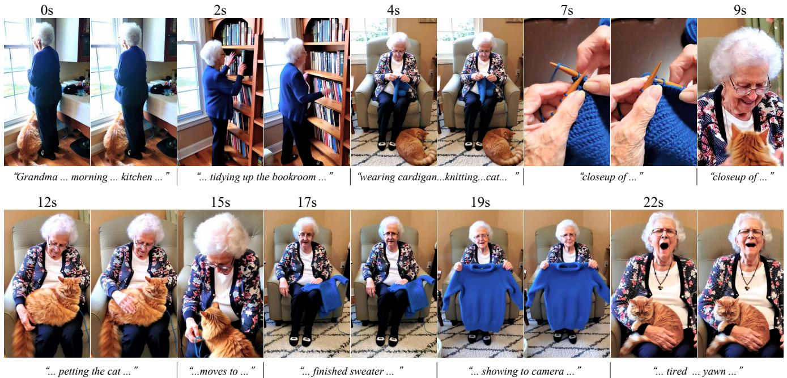
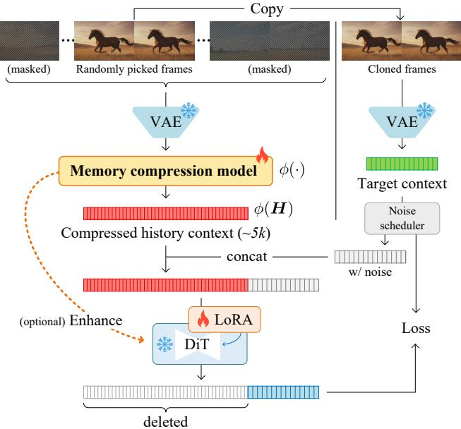
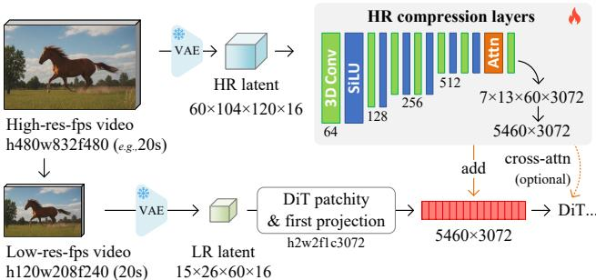
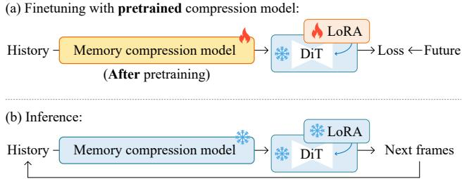
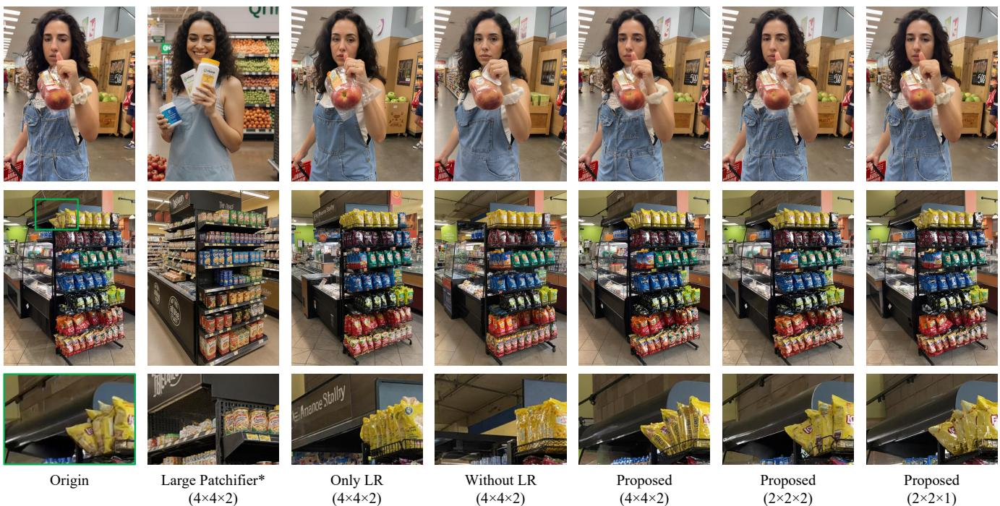
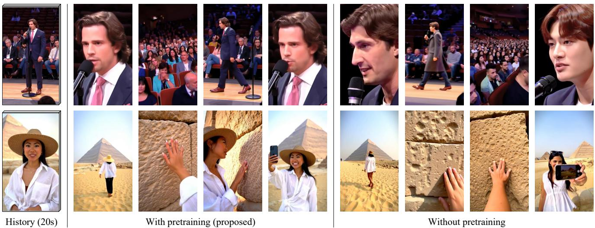
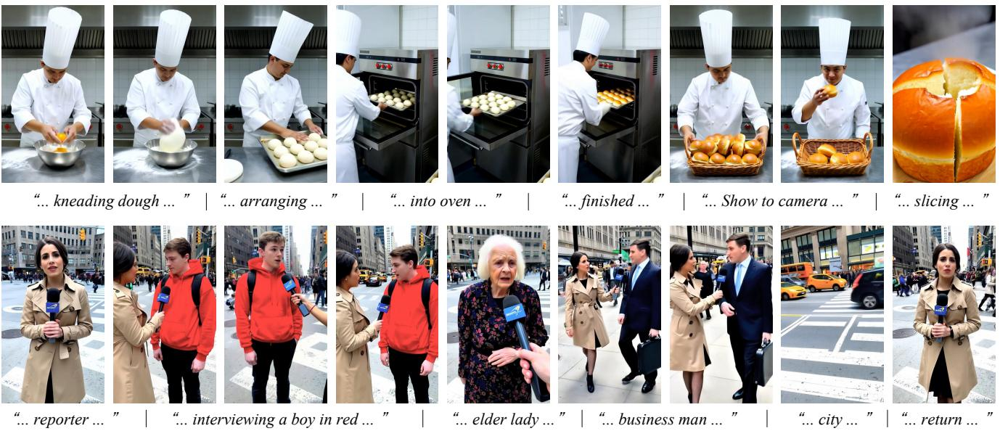
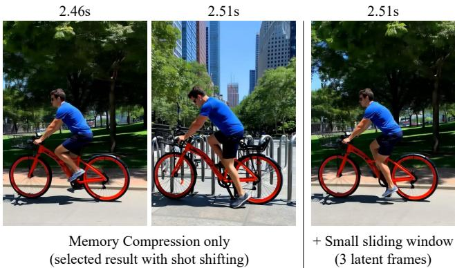
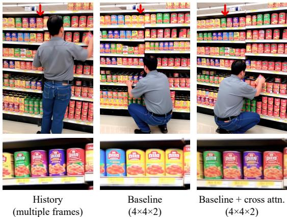
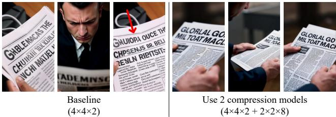

# 自回归视频记忆压缩中的预训练框架保留

张绿敏1 蔡胜渠1 李慕阳2 曾冲1 陆贝佳3 谭安毅4 韩松2 韦伯斯坦1 阿格拉瓦尔1 1斯坦福大学 2麻省理工学院 3卡内基梅隆大学 4香港科技大学

  
The $^ { 2 0 + }$ second history was compressed into a ${ \sim } 5 \mathrm { k }$ context length and processed by an RTX 4070 12GB.

# 摘要

我们提出了一种神经网络结构，将长视频压缩为短上下文，具备明确的预训练目标，以保留任意时间位置单帧的高频细节。基线模型能够将一个20秒的视频压缩为约5k长度的上下文，其中可以以感知保留的外观检索随机帧。这种预训练模型可以直接微调为自回归视频模型的记忆编码器，从而以较低的上下文成本和相对较低的保真度损失实现长时记忆。我们通过消融实验评估该框架，并讨论可能的神经网络架构设计的权衡。

# 1. 引言

叙事能力、叙事连贯性和上下文质量在视频生成领域中越来越重要。最新的商业模型如 Sora2、Veo3.1 和 Kling2.5 支持基于分镜头创作、场景规划和动态镜头（例如，类似于 TikTok 或 YouTube Shorts 的风格）。近期的学术模型也集中于长视频流、场景规划和视频上下文一致性。在这些方法中，自回归模型是视频叙事的关键范式，支持原生视频延续和分镜头流。自回归模型将视频历史视为上下文，并在处理诸如野外视频和电影等长格式内容时面临独特挑战。

视频上下文建模中，上下文质量与长度之间的权衡是一个典型且关键的问题。简单的滑动窗口方法将所有距离较远的帧切断，保持固定的上下文长度，却失去了长程历史。各种压缩方法已被广泛研究；例如，像LTXV [23] 和DC-AE [9]等高度压缩的变分自编码器（VAE）表明，可以将像素空间视频压缩成更紧凑的上下文，而混合方法 [1, 32, 88] 如FramePack [78]则显示出压缩可以在多个层次上进行，尽管代价是高频图像细节的丧失。另一种策略是保持上下文长度但减少计算（例如，使用稀疏 [64, 65, 77, 80] 或线性 [5, 11, 33, 58, 68, 74] 注意力），尽管线性层的成本仍然是训练和双向推理的开销。更专业的方法如词元合并 [2, 4] 也表明更高的合并率会导致更大的细节损失。这些研究工作隐含地收敛于一个观察，即上下文质量与长度受限于一个基本的权衡关系，而最佳平衡尚未达到。这一观察引发了一系列悬而未决的问题。上下文长度与质量之间是否存在明确的相关性，我们该如何建模？上下文质量应该通过物体、一致场景或面部一致性来衡量，或可能通过全帧重建质量？为了实现从人类视角出发的可接受品质，最大的压缩程度是多少，理想的平衡点在哪里？如何找到这种平衡？不同的任务和目标对这一权衡是否有不同的要求？在各种任务中，空间和时间压缩的重要性是否存在差异？上下文长度的边际效应是否使得一个足够长的上下文实际上变得冗余？为了研究这些问题，本文针对一个明确的目标：一个学习任务，直接将视频历史帧压缩为最小化的上下文长度，同时最大化帧检索质量。这个设置允许我们通过定量指标和人类感知评估明确研究上下文长度与重建质量之间的相关性。我们能够独立研究压缩模型的质量、影响和成本，然后再进行实际的自回归视频生成。这种白箱反馈简化了成本管理，并有助于自回归视频模型中各个编码组件的可解释性。为此，一个挑战是学习压缩和转换较长的视频上下文会导致计算瓶颈。我们观察到，视频压缩机制 preserving 上下文细节的能力的一个强指标是其在任意时间位置进行高质量帧重建的能力。这导致了一种随机化方法：我们首先预训练一个记忆编码器，以随机时间位置重建帧，然后使用该压缩模型作为历史记忆编码器微调自回归视频模型。通过数百万视频的预训练，我们表明这种方法大幅降低了视频模型训练成本，并促进了更强的神经表示以进行细节帧检索。实验表明，预训练的记忆编码器能够独立高质量地重建历史帧（通过PSNR/SSIM [60] 测量）。当与视频扩散模型连接以进行自回归微调时，该编码器提供了长程一致性。该框架在上下文长度与质量的权衡中达到了平衡和优化的点，从而基于其长程历史实现了一个具有相对较短上下文长度和感知高一致性的实用自回归视频模型。总之，我们（1）讨论了自回归视频生成中上下文长度与质量之间的权衡；（2）提出为帧检索预训练一个明确的压缩任务，以改进自回归视频记忆；（3）建立一个自回归系统，以微调预训练的压缩模型作为DiTs的历史记忆编码器；（4）进行广泛的实验，包括定量、定性和消融研究，以分析不同压缩设计的影响；并且（5）提供预训练模型以用于实际的视频生成和编辑应用。

# 2. 相关工作

自回归视频扩散与长视频。扩散已成为视频合成的驱动力，其中一个中心挑战是长度扩展。无训练的长度扩展方法 [43, 44, 48, 49, 84] 通过重新调度噪声或重新平衡时间频率，将预训练模型的能力扩展至其训练范围之外。一种互补的方法是将扩散与因果预测相结合：Diffusion Forcing [7] 和 HistoryGuidance [52] 通过噪声注入实现可变视域的条件和稳定的长时间推演。这些方法已应用于工业系统，如 SkyReels-V2 [8] 和 Magi-1 [55]。另外，StreamingT2V [24] 通过随机混合增强现有模型的短期和长期记忆，从而生成更长的视频。FAR [21] 研究具有灵活 RoPE [53] 衰减和混合短/长窗口的长上下文自回归，而 CausVid [72] 将双向教师提炼为几步因果生成器。StreamDiT [35] 结合多步蒸馏与移动帧缓冲区和混合分区训练，以实时生成结果。为减轻自回归生成过程中的误差累积，Self-Forcing [27] 在训练期间模拟自回归推演，而其扩展方法 [12, 41, 69] 进一步改善长度泛化。上下文学习与压缩。随着我们将视频生成扩展到几秒钟以上，长上下文的持久性至关重要。一种选择是检索，这为生成提供了持久状态作为基础。WorldMem [67] 和 Context-as-Memory [73] 利用基于视场的历史检索增强自回归视频世界模型，而 VMem [39] 通过表面点索引过去的视图以检索最相关的视角。Memory Forcing [25] 将几何索引空间记忆与定制训练模式相结合，以平衡探索与重访。超越固定检索规则，Mixture-of-Contexts [6] 学习一个动态稀疏注意力上下文路由器，使得词元仅关注最显著的部分。同样，MoGA [30] 和 Holocine [45] 也提出了词元级稀疏关注策略。Pack-and-Force [63] 则提出了一种可学习的上下文语义检索器。与检索相对，历史的压缩将无界上下文转化为紧凑的状态。FramePack [78] 将先前帧压缩为固定大小的潜在“打包”上下文。Captain Cinema [66] 则对关键帧使用类似的压缩方法。StateSpaceDiffuser [50] 和 Po 等 [47] 用递归状态交换二次注意力，以维持长期记忆。TTTVideo [13] 和 LaCT [81] 使用轻量级多层感知器的测试时间训练层作为学习到的上下文表示。

高效的视频扩散设计。随着视频生成的规模扩大到长时间范围，大上下文窗口成为瓶颈，推动了一系列高效的计算设计。像 FlashAttention 这样的内核进展提高了吞吐量。静态或硬件友好的稀疏模式包括滑动/切片的 3D 窗口、径向时空掩模，以及无训练的头部/剪枝启发式方法。动态或学习剪枝/路由进一步选择显著的词元对或块，粗到细的稀疏词元选择，Sage/SpargeAttention 家族，具有缓存搜索的分块路由，以及渐进式分块雕刻。另一项工作利用压缩潜在空间或词元序列：词元合并和补丁缩放，紧凑/可变速率的词元化工具，高度压缩的潜在空间，或具有再噪声的多尺度金字塔。SANA 引入了一种用于图像的线性注意力扩散变换器，而 SANA-Video 在此基础上扩展了块线性注意力和常量内存 KV 缓存。此外，该方法与变分自编码器（VAE）存在区别：VAE 在 4、16 或 64 通道中存在瓶颈，而该方法直接在 DiT 内部通道（如 3072 或 5120）上工作，具有不同的特征范围；VAE 在处理完整上下文时存在训练开销，而该方法以轻量级的部分开销（检索目标）运作。

# 3. 方法

我们通过预训练一个视频压缩模型，目标是能够在任意时间位置检索帧，同时保持帧的细节（第3.1节）。然后，将预训练的压缩模型微调为自回归视频扩散模型的记忆编码器（第3.2节）。

预备知识。我们明确典型自回归视频扩散模型的符号表示。除非另有说明，所有帧、像素等均指潜在概念。我们考虑像Wan [56]和HunyuanVideo [36]这样的典型扩散变换器（DiTs），并使用流匹配调度。纠正流模型将嘈杂的潜在变量 $\boldsymbol { X } _ { t _ { i } } \in \mathbb { R } ^ { T \times H \times \bar { W } \times C }$ 映射到干净的潜在变量 $X _ { 0 }$ ，其中 $t _ { i } \sim ( 0 , 1 ]$ 是扩散时间步。自回归模型通常将历史记录 $\bar { \pmb { H } } \in \mathbb { R } ^ { T _ { h } \times H \times \bar { W } \times C }$ 作为条件输入。为了学习自回归生成器 $G _ { \theta } ( \cdot )$，学习目标为，其中 $^ c$ 是一组条件，例如文本提示（单个提示或来自故事板的流式提示），$t _ { i } \sim \mathcal { L } ( 0 , 1 )$ 是用于流匹配的偏移对数正态分布 [18]。

$$
\begin{array} { r } { \mathbf { } \mathbf { } X _ { t _ { i } } = ( 1 - t _ { i } ) \mathbf { } X _ { 0 } + t _ { i } \mathbf { \epsilon } , \quad \mathbf { \epsilon } \in \mathcal { N } \mathbf { ( 0 , I ) } , } \end{array}
$$

  
Figure 2. Pretraining of memory compression models. The memory compression model has to compress long videos (e.g., 20 seconds) into short contexts (e.g., of length 5k). The objective of the pretraining is to retrieve frames with high-frequency details in arbitrary history time positions.

$$
\begin{array} { r } { \mathbb { E } _ { X _ { 0 } , H , c , \epsilon , t _ { i } \sim \mathcal { L } ( 0 , 1 ) } \bigg | \bigg | \big ( \epsilon - X _ { 0 } \big ) - G _ { \theta } \big ( X _ { t _ { i } } , t _ { i } , c , H \big ) \bigg | \bigg | _ { 2 } ^ { 2 } , } \end{array}
$$

# 3.1. 预训练记忆压缩模型

考虑一个典型案例，我们有一个60秒视频的历史记录，想要生成接下来的1秒，典型设置为480p，24fps，使用标准的Hunyuan/Wan VAE和分块方法。历史上下文长度为 $8 \times 3 \times 2 / 16 \times 480 / 16 \times 60 \times 24 / 4 = 561,600$，这对于具有有限GPU内存的消费级设备造成了推理瓶颈（对于即使采用因果计算或KV缓存设计的集群来说，也造成了训练瓶颈）。一个简单的滑动窗口方法将无法有效建模长距离一致性。典型的开销降低方法如词元合并、下采样、更大的分块尺寸、紧凑型VAE等，在不同层级上都会带来图像细节的丢失。我们观察到，一个适合的指标，用于衡量视频压缩机制保持上下文细节的能力，是其在任意时间位置高质量帧检索的能力。对于高压缩率，完美检索变得不切实际，因此目标是最大化任意帧的检索质量。我们将这一目标形成技术性描述。考虑到压缩过程 $\phi ( \cdot )$ 接收历史 $\pmb { H }$ 的

  
Figure 3. Architecture of memory compression model. We use 3D convolution, SiLU, and attention to establish a lightweight neural structure as the baseline compression model. Different alternative architectures (e.g., various channels, full transformer, etc.) are possible and will be discussed in ablation.

$T_{h}$ 将其帧压缩成上下文 $\phi(H)$，给定任意帧索引集合 $\Omega \subseteq \mathbb{N}$，并将以索引检索过程表示为 $\phi^{-1}(\cdot, \Omega)$，我们希望最小化特征距离 $\| H_{\Omega} - \phi^{-1}(\phi(H), \Omega) \|_{2}^{2}$ 以实现优化重建。

如图2所示，帧选择 $\pmb { \Omega }$ 和检索 $\phi ^ { - 1 } ( \cdot , \Omega )$ 可以建立为一个自回归视频扩散框架。我们随机采样视频作为历史数据，然后随机选取帧 $\pmb { \Omega }$ ：具体来说，我们随机选择一部分帧的索引 $\pmb { \Omega }$ 保持不变，随后掩蔽所有剩余帧。可以使用各种类型的掩蔽，例如范围缩放、平移等。在此，我们使用一种噪声掩蔽方法：从 $\mathcal { L } ( 0 . 2 , 1 )$ 添加潜在噪声级别。之后，我们克隆选定的干净帧作为扩散目标，从而使扩散系统尝试在任意位置重建目标帧。该过程也可以与公式(2)相一致地书写，其中 $G _ { \theta } ( \cdot )$ 可以是一个可训练的视频扩散模型，如WAN或带有LoRA的HunyuanVideo。

$$
{ { \mathbb E } _ { H , \Omega , c , \epsilon , t _ { i } } } \bigg | \bigg | \big ( \epsilon - H _ { \Omega } \big ) - { { G } _ { \theta } } \big ( \big ( H _ { \Omega } \big ) _ { t _ { i } } , t _ { i } , c , \phi ( H ) \big ) \bigg | \bigg | _ { 2 } ^ { 2 } ,
$$

当压缩模型 $\phi ( \cdot )$ 的输出长度较短时，例如每20秒仅约5千字节，检索任务变得非常困难，因此非常适合利用数百万个野外视频进行强上下文压缩模型的预训练。我们还指出帧索引 $\pmb { \Omega }$ 选择中的随机性的重要性：如果帧没有被随机选取，例如仅使用固定的起始或结束位置进行训练，框架将学会一种作弊的解决方案，例如利用所有5千字节的上下文来编码少量的结束帧，同时忽略所有其他帧。此外，注意直接训练以检索所有帧在分钟级数据上是不切实际的，即使对于高效的基础设施也是如此。

网络架构。如图3所示，我们提出了一种轻量级基线架构用于压缩模型 $\phi ( \cdot )$ 。我们并不是从头构建压缩表示，而是重用DiT的上下文表示：我们首先将高分辨率高帧率视频降采样为低分辨率低帧率视频，并使用变分自编码器（VAE）和DiT的分块处理器及第一层投影进行处理。之后，我们将高分辨率原始视频编码为残差增强向量，并将其添加到上下文向量中。需要注意的是，特征的添加发生在DiT的第一层投影之后，这意味着编码器不经过VAE的16通道瓶颈，而是直接在内部通道（如WAN-5B的3072通道）输出，以获得最佳保真度。基线编码器使用3D卷积作为起始层，并以注意力层结束。此外，还可以将DiT与编码器最后隐藏状态的交叉注意力连接以进行另一轮细化，但质量提升非常有限，将在消融实验中讨论。

  
Figure 4. Finetuning autoregressive video models. We illustrate the finetuning and inference of the final autoregressive video models. The pretraining of the memory compression model is finished before the finetuning.

# 3.2. 微调视频扩散模型

通过预训练的内存压缩模型 $\phi ( \cdot )$ ，我们可以通过微调视频扩散模型，如 WAN（使用 LoRAs），并将预训练的压缩模型作为历史记忆编码器，来形成自回归视频生成系统。这将导致一个具有较长的历史窗口（例如，$> 20 \mathrm { s }$ ），较短的历史上下文长度（例如，大约 $5 \mathrm { k }$ ），并且显式优化帧检索质量的自回归视频模型。扩散过程可以按照公式 (2) 编写，过程如图 4-(a) 所示。推理过程遵循自回归生成，通过重复地将生成的部分拼接到历史中，如图 4-(b) 所示。注意，由于基准编码器（图 3）几乎完全是卷积型的，因此压缩的历史也可以即时拼接，而无需重新计算。

$$
\begin{array} { r } { \mathbb { E } _ { X _ { 0 } , H , c , \epsilon , t _ { i } } \bigg \| ( \epsilon - X _ { 0 } ) - G _ { \theta } \big ( X _ { t _ { i } } , t _ { i } , c , \phi ( H ) \big ) \bigg \| _ { 2 } ^ { 2 } , } \end{array}
$$

# 4. 实验

# 4.1. 实验细节

实施细节。我们使用 $8 \times \mathrm{H100}$ GPU 集群进行预训练，并使用 $1 \times$ 进行 LoRA 微调。

  
t   8.

H100s 或 A100s。该方法的上下文长度压缩能够在没有专用基础设施的情况下实现高效训练。我们使用纯 PyTorch 和 Accelerate，利用预计算的潜变量和条件，并且不进行梯度累积。该方法在单个 $8 \times \mathrm { A 1 0 0 } – 8 0 \mathrm { G }$ 节点上实现了大约 64 的批量大小，使用 12.8B 的 HunyuanVideo 模型以 480p 分辨率进行 LoRA 训练，窗口大小为 2 或 3（或窗口大小为 4 或 5 时的批量大小为 32）。这适合个人或实验室规模的训练和实验。在 DiTs 中的 LoRA，我们始终使用秩 128。

超参数。在构建记忆压缩模型的编码器时，我们使用符号 $H \times W \times T$ 来表示压缩率，例如，$4 \times 4 \times 2$ 表示潜在宽度压缩 4 倍，高度压缩 4 倍，时间长度压缩 2 倍。请注意，这个压缩率是基于潜在空间，可以与潜在率和分块率相乘以计算最终相对于像素空间的压缩率。在构建 3D 卷积层时，我们遵循的规则是始终先减少时间维度，然后再减少空间维度（使用卷积中的步幅）。编码器的隐藏通道遵循模式 $6 4 \to 1 2 8 \to 2 5 6 \to 5 1 2$，然后始终保持在 512（例如，在最后的注意力层中），在最后的 $1 \times 1$ 卷积之前，将特征投射到与 DiT 上下文相同的维度（如 3072、5120 等）。基础模型。所有实验均在 HunyuanVideo 和 Wan 系列的基础模型上进行。对于 Wan 2.2，涉及的模型是 5B 模型和 14B 高噪声模型。仅使用高噪声模型以简化实验（与 WanAnimate 的设计选择类似）。数据准备。数据集由来自多个网站的约 500 万个互联网视频准备而成。大约一半的数据是竖屏短视频，其余是常见的横屏视频。数据经过质量清洗，随后高质量部分由 Gemini-2.5-flash VLM 进行字幕处理，其余部分由 QwenVL 等本地 VLM 处理。生成的字幕采用带时间戳的故事板格式。在训练自回归模型时，模型仅接收最近时间戳的提示。故事板。如果未注意到，本文中的所有故事板提示均由 Gemini-2.5-pro 撰写。我们也测试了开源替代方案，如 Qwen，质量差异微乎其微。有关说明，请参见补充材料。测试样本。测试集包括 1000 个由 Gemini-2.5-pro 撰写的故事板提示和 4096 个与训练数据集无关的未见视频。

# 4.2. 消融研究

压缩模型架构。如图5所示，我们比较了不同架构在各种压缩率下的图像重建细节，重点关注Only LR、Without LR、Large Patchifier和我们提出的方法。Only LR变体仅保留图3中的低分辨率分支，而Without LR去除了此部分，仅保留高分辨率分支。Large Patchifier方法通过扩大DiT的分块投影核而不引入新的层来增加压缩率，等同于FramePack [78]，我们直接使用其实现。结果表明，Only LR和Without $L R$变体生成的重建图像与原始图像之间存在显著差异。Large Patchifier方法导致结构上发生显著变化。即使在如$4 \times 4 \times 2$这样的高压缩率下，所提方法仍能保留图像的大部分外观。较低的压缩率，如$2 \times 2 \times 1$，提供了最佳的细节保留，尽管代价是更长的上下文长度。

Table 1. Quantitative results on compression structures. We show numerical tests with different ablative compression architectures. \* The "Large Patchifier" is technically equivalent to [78].   

<table><tr><td>Method</td><td>PSNR ↑</td><td>SSIM↑</td><td>LPIPS ↓</td></tr><tr><td>Large Pachifier* (4×4×2)</td><td>12.93</td><td>0.412</td><td>0.365</td></tr><tr><td>Only LR (4×4×2)</td><td>15.21</td><td>0.472</td><td>0.212</td></tr><tr><td>Without LR (4×4×2)</td><td>15.73</td><td>0.423</td><td>0.198</td></tr><tr><td>Proposed (4×4×2)</td><td>17.41</td><td>0.596</td><td>0.171</td></tr><tr><td>Proposed (2×2×2)</td><td>19.12</td><td>0.683</td><td>0.152</td></tr><tr><td>Proposed (2×2×4)</td><td>18.63</td><td>0.637</td><td>0.153</td></tr><tr><td>Proposed (2×2×1)</td><td>20.19</td><td>0.705</td><td>0.121</td></tr></table>

定量结果如表1所示。这些结果表明该方法在PSNR和SSIM等指标上实现了相对更高的性能。此外，即使在 $4 \times 4 \times 2$ 的较高压缩比下，该方法也有效地保留了原始图像结构。预训练的影响。我们在图6中展示了预训练的影响，通过比较有无预训练的模型进行说明。我们保持模型架构和20秒历史输入一致。一个模型是从随机初始化的编码器权重训练而来，而另一个模型则使用经过预训练的记忆编码器进行微调。两个模型均经过$1 0 0 \mathrm { k }$ 次足够的训练步骤。结果显示出显著差异。通过预训练，模型保持了强大的时间一致性，从而显著提升了面部特征、服装、整体视频风格、叙事情节和镜头运动协调性。相比之下，未进行预训练的模型在某些情况下无法关注历史中的相关帧，导致不一致性。误差积累（漂移）。误差积累的问题在很大程度上依赖于训练数据集。令人惊讶的是，我们发现当在镜头变换频繁的视频上进行训练时，如短风格视频，误差积累问题似乎不存在或不明显。对于其他需要长时间连续镜头的视频，补充材料中讨论了多种设计选择 [7, 27, 78]。

Table 2. Quantitative results on video content consistency. We present the performance of different possible architectures on content consistency. The "1p" in Qwen means using 1 image as an image model input. Methods with severe artifacts are excluded from human ELO scores.   

<table><tr><td rowspan="2">Method</td><td colspan="2">Human</td><td rowspan="2">Object</td><td rowspan="2">User Study ELO ↑</td></tr><tr><td>Cloth ↑</td><td>Identity ↑</td></tr><tr><td>WanI2V [56] + QwenEdit [61] (1p)</td><td>94.10</td><td>68.45</td><td>85.21</td><td>I</td></tr><tr><td>WanI2V [56] + QwenEdit [61] (2p)</td><td>95.09</td><td>68.22</td><td>91.19</td><td>1198</td></tr><tr><td>WanI2V [56] + QwenEdit [61] (3p)</td><td>94.28</td><td>67.30</td><td>80.34</td><td>1</td></tr><tr><td>Only LR (4×4×2)</td><td>91.98</td><td>69.22</td><td>85.32</td><td>1194</td></tr><tr><td>Without LR (4×4×2)</td><td>89.64</td><td>67.41</td><td>82.85</td><td>,</td></tr><tr><td>Without Pretrain (4×4×2)</td><td>87.12</td><td>66.99</td><td>81.13</td><td>I</td></tr><tr><td>Proposed (4×4×2)</td><td>96.12</td><td>70.73</td><td>89.89</td><td>1216</td></tr><tr><td>Proposed (2×2×2)</td><td>96.71</td><td>72.12</td><td>90.27</td><td>1218</td></tr></table>

# 4.3. 定性结果

故事板结果。如图7所示，我们展示了我们的模型能够处理多样化的提示和故事板，同时在角色、场景、物体和情节方面保持一致性。

# 4.4. 定量结果

度量标准。我们包括了来自 VBench [29]、VBench2 [85] 等多个视频评估的度量标准，并进行了某些修改。衣物：通过向 VLM 提问评估衣物一致性。我们将 VBench2 [85] 的 LLaVA 升级为 Gemini2.5-pro；实例：通过向 VLM 提问评估物体级质量，关注不自然或不一致的实例。我们将 VBench2 [85] 的 Qwen 升级为 Gemini-2.5-pro；身份：使用 ArcFace [16] 结合人脸检测的 RetinaFace [17] 评估人脸相似性；清晰度：基于 SPAQ [19] 训练的 MUSIQ [34] 图像质量预测器。该度量评估诸如噪声等伪影；美学：LAION 美学预测器 [51]，通过 CLIP 估算器测量感知到的美学价值；动态性：RAFT [54] 经过 VBench 修改，用于估计动态程度。需要注意的是，多镜头视频直观上在镜头之间存在特殊的 RAFT 流动，但实际上，RAFT 在镜头之间似乎输出接近零的值，使得与常规视频的差异可忽略不计；语义：由 ViCLIP [59] 计算的视频-文本分数。该度量评估整体语义一致性和提示对齐情况。一致性分析。我们比较了我们方法的各种架构，包括不同的压缩率和有无预训练及 LR 分支的消融实验。我们还与一个常见基准进行比较，该基准将 Wan-2.2-I2V [56] 与 Qwen-Image-Edit-2509 [61] 结合。该基准首先使用图像模型生成一系列初始帧，将它们动画化为视频剪辑，然后连接这些剪辑。我们使用 1、2 和 3 张图像作为 Qwen-Edit 的历史上下文测试该基准（因为模型最多支持 3 个输入）。我们的评估重点关注衣物、身份和物体的一致性。针对几种实用且表现良好的模型，我们还进行了用户研究并评估了它们的 ELO 分数。

  
whe  pot coverteamTheboar t tel gus.

如表2所示，我们提出的方法在多个一致性指标上报告了合理的得分。Wan+Qwen组合在实例得分上表现出领先，这可能是因为图像模型并未显著改变或移动物体，从而避免了被VLM问答检测到的伪影。我们的方法在物体一致性方面展示了相当的得分。此外，用户研究和ELO得分验证了我们提出的架构，确认其在压缩和质量之间达到有效的权衡。不同基础模型。如表3所示，我们还评估了不同基础模型的性能，重点关注单帧质量、时间动态和整体语义对齐。结果表明，Wan系列模型在多个指标上实现了高质量。同时，较大的模型，如14B和12.8B变体，在多个指标上优于5B模型。用户得分确认14B Wan模型是一个适合的模型。

  
Figure 8. Adding sliding window. We show that the framework can be combined with a small sliding window to facilitate a continuous shot covering multiple generations.

Table 3. Quantitative results on different base models. We discuss the results using different alternative models as base models. All models are trained as LoRA at rank 128. \* The 14B Wan 2.2 is the high noise model.   

<table><tr><td></td><td colspan="2">Frame</td><td>Temporal</td><td colspan="2">Alignment</td></tr><tr><td>Method</td><td>Aesthetic ↑</td><td>Clarity ↑</td><td>Dynamics ↑</td><td>Semantic ↑</td><td>ELO ↑</td></tr><tr><td>HunyuanVideo [36] 12.8B (4×4×2)</td><td>61.27</td><td>67.49</td><td>71.22</td><td>26.29</td><td>1189</td></tr><tr><td>Wan [56] 2.2 14B* (4×4×2)</td><td>67.22</td><td>69.37</td><td>69.81</td><td>27.12</td><td>1231</td></tr><tr><td>Wan [56] 2.2 5B (4×4×2)</td><td>66.25</td><td>69.01</td><td>65.13</td><td>25.99</td><td>1215</td></tr><tr><td>Wan [56] 2.2 5B (2×2×2)</td><td>66.37</td><td>68.95</td><td>66.29</td><td>26.13</td><td>1224</td></tr></table>

# 4.5. 替代架构

添加滑动窗口。如图8所示，该方法可以与较小的滑动窗口（如3个潜在帧）结合，以调整镜头切换的发生情况。通过滑动窗口，镜头变化的频率在某些情况下降低，使得自回归模型能够在多个生成迭代中生成连续镜头，从而在某些场景下获取更理想的视频。对于没有这种滑动窗口的生成，我们建议在每次生成中产生一个完整的镜头。引入滑动窗口会略微增加上下文长度。交叉注意力增强。如图9所示，我们展示了通过交叉注意力（例如IP-Adapter [71]）将编码器倒数第二层的特征连接到DiT的每个块，可以进一步增强模型的一致性。这在高度挑战的场景中是有效的，例如，在超市货架上维持物品的排列顺序。在这些注重细节的情况下，增加交叉注意力提供了合理的一致性提升，但代价是额外的计算成本。结合多个压缩模型。如图10所示，另一个增强方法是同时使用多个记忆编码器。例如，一个标准的$4 \times 4 \times 2$编码器可以与一个$2 \times 2 \times 8$编码器配对，后者优先考虑时间压缩，同时保留更多的空间细节。使用多个编码器可以使模型捕捉历史的不同方面。这种架构提供了诸如在报纸、杂志或广告牌上保留细微细节的优势，但代价是增加了上下文长度。

  
Figure 9. Adding cross-attention enhancing. We show that connecting the compression model and the DiT with cross-attention layers can improve consistency in difficult cases.

  
Figure 10. Using multiple memory compression models. We show that using multiple compression models at the same time with different compression patterns, e.g., higher temporal and higher spatial, can facilitate detail consistency in difficult cases, at the cost of doubling the context length.

# 5. 结论

在本研究中，我们探讨了自回归视频生成中上下文长度与质量之间的基本权衡，这对于创建长篇连贯叙事构成了一个关键挑战。我们引入了一个框架，对记忆压缩模型进行预训练，明确目标为高保真地从长视频历史中检索任意帧。这个预训练阶段迫使模型学习一种紧凑而丰富的细节表示，从而有效地保留高频细节。随后，我们在自回归视频扩散系统中对这个预训练的编码器进行了微调，开发出了一个实用高效的模型，能够处理长期依赖关系，例如保持角色身份和场景一致性。

参考文献 [1] Roman Bachmann, Jesse Allardice, David Mizrahi, Enrico Fini, Ouzhan Fatih Kar, Elmira Amirloo, Alaaeldin ElNouby, Amir Zamir, 和 Afshin Dehghan. Flextok: 重新采样图像为灵活长度的1d词元序列. 在arXiv, 2025. 1, 3 [2] Daniel Bolya 和 Judy Hoffman. 令牌合并以实现快速稳定扩散. CVPR计算机视觉高效深度学习研讨会, 2023. 2 [3] Daniel Bolya, Cheng-Yang Fu, Xiaoliang Dai, Peizhao Zhang, Csh uy Hon T 你更快的ViT. 在arXiv, 2022. 3 [4] Daniel Bolya, Cheng-Yang Fu, Xiaoliang Dai, Peizhao Zhang, Christoph Feichtenhofer, 和 Judy Hoffman. 令牌合并: 更快的ViT. 在国际学习表征会议, 2023. 2 [5] Han Cai, Junyan Li, Muyan Hu, Chuang Gan, 和 Song Han. Efficientvit: 用于高分辨率密集预测的轻量级多尺度注意力. 在IEEE/CVF国际计算机视觉会议论文集, 页17302-17313, 2023. 2 [6] Shengqu Cai, Ceyuan Yang, Lvmin Zhang, Yuwei Guo, Junfei Xiao, Ziyan Yang, Yinghao Xu, Zhenheng Yang, Alan Yuille, Leonidas Guibas, Maneesh Agrawala, Lu Jiang, 和 Gordon Wetzstein. 用于长视频生成的上下文混合. 在arXiv, 2025. 2 [7] Boyuan Chen, Diego Martí Monsó, Yilun Du, Max Simchowitz, Russ Tedrake, 和 Vincent Sitzmann. 扩散强制: 下一个令牌预测与全序列扩散相碰撞. 神经信息处理系统进展, 37:24081-24125, 2025. 2, 6 [8] Guibin Chen, Dixuan Lin, Jiangping Yang, Chunze Lin, Junchen Zhu, Mingyuan Fan, Hao Zhang, Sheng Chen, Zheng Chen, Chengcheng Ma, Weiming Xiong, Wei Wang, Nuo Pang, Kang Kang, Zhiheng Xu, Yuzhe Jin, Yupeng Liang, Yubing Song, Peng Zhao, Boyuan Xu, Di Qiu, Debang Li, Zhengcong Fei, Yang Li, 和 Yahui Zhou. Skyreels-v2: 无限长度的电影生成模型, 2025. 2 [9] Junyu Chen, Han Cai, Junsong Chen, Enze Xie, Shang Yang, Haotian Tang, Muyang Li, Yao Lu, 和 Song Han. 用于高分辨率扩散模型的深度压缩自编码器. arXiv预印本arXiv:2410.10733, 2024. 1 [10] Junsong Chen, Yuyang Zhao, Jincheng Yu, Ruihang Chu, Junyu Chen, Shuai Yang, Xianbang Wang, Yicheng Pan, Daquan Zhou, Huan Ling, 等. Sana-video: 使用块线性扩散变换器的高效视频生成. 在arXiv, 2025. 3 [11] Krzysztof Choromanski, Valerii Likhosherstov, David Dohan, Xingyou Song, Andreea Gane, Tamas Sarlos, Peter Hawkins, Jared Davis, Afroz Mohiuddin, Lukasz Kaiser, 等. 重新思考执行注意力. arXiv预印本arXiv:2009.14794, 2020. 2 [12] Justin Cui, Jie Wu, Ming Li, Tao Yang, Xiaojie Li, Rui Wang, Andrew Bai, Yuanhao Ban, 和 Cho-Jui Hsieh. 自我强制 $^{++}$ 旨在产生分钟级高质量视频. 在arXiv, 2025. 2 [13] Karan Dalal, Daniel Koceja, Gashon Hussein, Jiarui Xu, Yue Zhao, Youjin Song, Shihao Han, Ka Chun Cheung, Jan Kautz, Carlos Guestrin, Tatsunori Hashimoto, Sanmi Koyejo, Yejin Choi, Yu Sun, 和 Xiaolong Wang. 一分钟视频生成与测试时训练, 2025. 3 [14] Tri Dao. FlashAttention-2: 通过更好的并行性和工作划分加速注意力. 在ICLR, 2024. 3 [15] Tri Dao, Daniel Y. Fu, Stefano Ermon, Atri Rudra, 和 Christopher Ré. Flashattention: 使用IO感知的快速且内存高效的精确注意力, 2022. 3 [16] Jiankang Deng, Jia Guo, Niannan Xue, 和 Stefanos Zafeiriou. Arcface: 用于深度人脸识别的加性角度间隔损失. 在IEEE/CVF计算机视觉与模式识别会议论文集, 页4690-4699, 2019. 6 [17] Jiankang Deng, Jia Guo, Yuxiang Zhou, Jinke Yu, Irene Kotsia, 和 Stefanos Zafeiriou. Retinaface: 在野外的单阶段密集人脸定位, 2019. 6 [18] Patrick Esser, Sumith Kulal, Andreas Blattmann, Rahim Entezari, Jonas Müller, Harry Saini, Yam Levi, Dominik Lorenz, Axel Sauer, Frederic Boesel, 等. 扩大归一化流变换器以实现高分辨率图像合成. 在第四十一届国际机器学习会议, 2024. 3 [19] Yuming Fang, Hanwei Zhu, Yan Zeng, Kede Ma, 和 Zhou Wang. 智能手机摄影的感知质量评估. 在2020 IEEE/CVF计算机视觉与模式识别会议(CVPR), 页3674-3683, 2020. 6 [20] Google. Ve03.1, 2025. 访问于2025年11月9日. 1 [21] Yuchao Gu, Weijia Mao, 和 Mike Zheng Shou. 下一帧预测的长上下文自回归视频建模, 2025. 2 [22] Yuwei Guo, Ceyuan Yang, Ziyan Yang, Zhibei Ma, Zhijie Lin, Zhenheng Yang, Dahua Lin, 和 Lu Jiang. 视频生成的长上下文调优. 在ICCV, 2025. 1 [23] Yoav HaCohen, Nisan Chiprut, Benny Brazowski, Daniel Shalem, Dudu Moshe, Eitan Richardson, Eran Levin, Guy Shiran, Nir Zabari, Ori Gordon, 等. Ltx-video: 实时视频潜在扩散. arXiv预印本arXiv:2501.00103, 2024. 1, 3 [24] Roberto Henschel, Levon Khachatryan, Daniil Hayrapetyan, Hayk Poghosyan, Vahram Tadevosyan, Zhangyang Wang, Shant Navasardyan, 和 Humphrey Shi. Streamingt2v: 从文本生成一致、动态且可扩展的长视频. arXiv预印本arXiv:2403.14773, 2024. 2 [25] Junchao Huang, Xinting Hu, Boyao Han, Shaoshuai Shi, Zhuotao Tian, Tianyu He, 和 Li Jiang. 记忆强制: 用于在Minecraft上进行一致场景生成的时空记忆. 在arXiv, 2025. 2 [26] Lianghua Huang, Wei Wang, Zhi-Fan Wu, Yupeng Shi, Huanzhang Dou, Chen Liang, Yutong Feng, Yu Liu, 和 Jingren Zhou. 用于扩散变换器的上下文lora. arXiv预印本arXiv:2410.23775, 2024. 1 [27] Xun Huang, Zhengqi Li, Guande He, Mingyuan Zhou, 和 Eli Shechtman. 自我强迫: 弥合自回归视频扩散中的训练-测试差距. 在arXiv, 2025. 1, 2, 6 [28] Yuzhou Huang, Ziyang Yuan, Quande Liu, Qiulin Wang, Xintao Wang, Ruimao Zhang, Pengfei Wan, Di Zhang, 和 Kun Gai. 概念大师: 在不进行测试时调整的情况下对扩散变换器模型进行多概念视频定制. arXiv预印本arXiv:2501.04698, 2025. 1 [29] Ziqi Huang, Yinan He, Jiashuo Yu, Fan Zhang, Chenyang Si, Yuming Jiang, Yuanhan Zhang, Tianxing Wu, Qingyang Jin, Nattapol Chanpaisit, Yaohui Wang, Xinyuan Chen, Limin Wang, Dahua Lin, Yu Qiao, 和 Ziwei Liu. VBench: 用于视频生成模型的综合基准套件. 在IEEE/CVF计算机视觉与模式识别会议论文集, 2024. 6 [30] Weinan Jia, Yuning Lu, Mengqi Huang, Hualiang Wang, Binyuan Huang, Nan Chen, Mu Liu, Jidong Jiang, 和 Zhendong Mao. Moga: 用于端到端长视频生成的混合组注意力. 在arXiv, 2025. 2 [31] Yuming Jiang, Tianxing Wu, Shuai Yang, Chenyang Si, Dahua Lin, Yu Qiao, Chen Change Loy, 和 Ziwei Liu. Videobooth: 基于扩散的视频生成与图像提示. 在IEEE/CVF计算机视觉与模式识别会议论文集, 页6689-6700, 2024. 1 [32] Yang Jin, Zhicheng Sun, Ningyuan Li, Kun Xu, Kun Xu, Hao Jiang, Nan Zhuang, Quzhe Huang, Yang Song, Yadong Mu, 和 Zhouchen Lin. 用于高效视频生成建模的金字塔流匹配, 2024. 1, 3 [33] Angelos Katharopoulos, Apoorv Vyas, Nikolaos Pappas, 和 François Fleuret. 转换器是RNN: 具有线性注意力的快速自回归转换器. 在机器学习国际会议, 页5156-5165. PMLR, 2020. 2 [34] Junjie Ke, Qifei Wang, Yilin Wang, Peyman Milanfar, 和 Feng Yang. Musiq: 多尺度图像质量转换器, 2021. 6 [35] Akio Kodaira, Tingbo Hou, Ji Hou, Masayoshi Tomizuka, 和 Yue Zhao. Streamdit: 实时流式文本到视频生成. 在arXiv, 2025. 2 [36] Weijie Kong, Qi Tian, Zijian Zhang, Rox Min, Zuozhuo Dai, Jin Zhou, Jiag Xiong, Xin Li Bo Wu, Jia Zha, 等. Hunyuanvideo: 大型视频生成模型的系统框架. arXiv预印本arXiv:2412.03603, 2024. 3, 5, 8 [37] 快手. Kling2.5, 2025. 访问于2025年11月10日. [38] Seon-Ho Lee, Jue Wang, Zhikang Zhang, David Fan, 和 Xinyu Li. 视频令牌合并以实现长形式视频理解. 在arXiv, 2024. 3 [39] Runjia Li, Philip Torr, Andrea Vedaldi, 和 Tomas Jakab. Vmem: 使用surf索引视图记忆进行一致交互视频场景生成. 在ICCV, 2025. 2 [40] Xingyang Li, Muyang Li, Tianle Cai, Haocheng Xi, Shuo Yang, Yujun Lin, Lvmin Zhang, Songlin Yang, Jinbo Hu, Kelly Peng, Maneesh Agrawala, Ion Stoica, Kurt Keutzer, 和 Song Han. 径向注意力: ${ \mathcal { O } } ( n \log n )$ 稀疏注意力与能量衰减，用于长视频生成. 在arXiv, 2025. 3 [41] Kunhao Liu, Wenbo Hu, Jiale Xu, Ying Shan, 和 Shijian Lu. 滚动强制: 实时自回归长视频扩散. 在arXiv, 2025. 2 [42] Fuchen Long, Zhaofan Qiu, Ting Yao, 和 Tao Mei. 视频工作室: 生成一致内容和多场景视频, 2024. 1 [43] Yu Lu 和 Yi Yang. Freelong $^{++}$ : 无需训练的长视频生成通过多带光谱融合. 在arXiv, 2025. 2 [44] Yu Lu, Yuanzhi Liang, Linchao Zhu, 和 Yi Yang. Freelong: 通过光谱融合时间注意力实现无训练的长视频生成. 神经信息处理系统进展, 37:131434-131455, 2025. 2 [45] Yihao Meng, Hao Ouyang, Yue Yu, Qiuyu Wang, Wen Wang, Ka Leong Cheng, Hanlin Wang, Yixuan Li, Cheng Chen, Yanhong Zeng, Yujun Shen, 和 Huamin Qu. Holocine: 电影多镜头长视频叙事的整体生成. 在arXiv, 2025. 2 [46] OpenAI. Sora2, 2025. 访问于2025年11月8日. 1 [47] Ryan Po, Yotam Nitzan, Richard Zhang, Berlin Chen, Tri Dao, Eli Shechtman, Gordon Wetzstein, 和 Xun Huang. 长上下文状态空间视频世界模型. 在ICCV, 2025. 3 [48] Haonan Qiu, Menghan Xia, Yong Zhang, Yingqing He, Xintao Wang, Ying Shan, 和 Ziwei Liu. Freenoise: 通过噪声重新调度实现无调优的长视频扩散. arXiv预印本arXiv:2310.15169, 2023. 2 [49] David Ruhe, Jonathan Heek, Tim Salimans, 和 Emiel Hoogeboom. 滚动扩散模型, 2024. 2 [50] Nedko Savov, Naser Kazemi, Deheng Zhang, Danda Pani Paudel, Xi Wang, 和 Luc Van Gool. 状态空间扩散器: 将长上下文引入扩散世界模型. 在NeurIPS, 2025. 3 [51] Christoph Schuhmann, Romain Beaumont, Richard Vencu, Cade Gordon, Ross Wightman, Mehdi Cherti, Theo Coombes, Aarush Katta, Clayton Mullis, Mitchell Wortsman, 等. Laion-5b: 为训练下一代图像-文本模型的开放大型数据集. 神经信息处理系统进展, 35:25278-25294, 2022. 6 [52] Kiwhan Song, Boyuan Chen, Max Simchowitz, Yilun Du, Russ Tedrake, 和 Vincent Sitzmann. 历史引导的视频扩散. arXiv预印本arXiv:2502.06764, 2025. 2 [53] Jianlin Su, Murtadha Ahmed, Yu Lu, Shengfeng Pan, Wen Bo, 和 Yunfeng Liu. Roformer: 带旋转位置嵌入的增强变换器. 神经计算, 568:127063, 2024. 2 [54] Zachary Teed 和 Jia Deng. Raft: 用于光流的递归全配对场变换, 2020. 6 [55] Hansi Teng, Hongyu Jia, Lei Sun, Lingzhi Li, Maolin Li, Mingqiu Tang, Shuai Han, Tianning Zhang, Weifeng Luo, Yuchen Sun, Yue Cao, Yunpeng Huang, Yutong Lin, Yuxin Fang, Zewei Tao, Zheng Zhang, 等. Magi-1: 大规模自回归视频生成. 在arXiv, 2025. 2 [56] Ang Wang, Baole Ai, Bin Wen, Chaojie Mao, Chen-Wei Xie, Di Chen, Feiwu Yu, Haiming Zhao, Jianxiao Yang, Jianyuan Zeng, Jiayu Wang, Jingfeng Zhang, Jingren Zhou, Jinkai Wang, Jixuan Chen, Kai Zhu, Kang Zhao, Keyu Yan, Lianghua Huang, Mengyang Feng, Ningyi Zhang, Pandeng Li, Pingyu Wu, Ruihang Chu, Ruili Feng, Shiwei Zhang, Siyang Sun, Tao Fang, Tianxing Wang, Tianyi Gui, Tingyu Weng, Tong Shen, Wei Lin, Wei Wang, Wei Wang, Wenmeng Zhou, Wente Wang, Wenting Shen, Wenyuan Yu, Xianzhong Shi, Xiaoming Huang, Xin Xu, Yan Kou, Yangyu Lv, Yifei Li, Yijing Liu, Yiming Wang, Yingya Zhang, Yitong Huang, Yong Li, You Wu, Yu Liu, Yulin Pan, Yun Zheng, Yuntao Hong, Yupeng Shi, Yutong Feng, Zeyinzi Jiang, Zhen Han, Zhi-Fan Wu, 和 Ziyu Liu. Wan: 开放且先进的大规模视频生成模型. 在arXiv, 2025. 3, 5, 6, 8 [57] Peng Wang, Shuai Bai, Sinan Tan, Shijie Wang, Zhihao Fan, Jinze Bai, Keqin Chen, Xuejing Liu, Jialin Wang, Wenbin Ge, 等. Qwen2-vl: 增强视觉-语言模型在任何分辨率下的世界感知. arXiv预印本arXiv:2409.12191, 2024. 5 [58] Sinong Wang, Belinda Z Li, Madian Khabsa, Han Fang, 和 Hao Ma.

• Linformer: 线性复杂度的自注意力. arXiv 预印本 arXiv:2006.04768, 2020. 2 • Yi Wang, Yinan He, Yizhuo Li, Kunchang Li, Jiashuo Yu, Xin Ma, Xinhao Li, Guo Chen, Xinyuan Chen, Yaohui Wang 等. Internvid: 大规模视频-文本数据集用于多模态理解与生成. 在第十二届国际学习表征会议上, 2023. 6 • Zhou Wang, A. C. Bovik, H. R. Sheikh, 和 E. P. Simoncelli. 图像质量评估: 从错误可见性到结构相似性. IEEE图像处理汇刊, 13(4): 600612, 2004. 2 • Chenfei Wu, Jiahao Li, Jingren Zhou, Junyang Lin, Kaiyuan Gao, Kun Yan, Sheng ming Yin, Shuai Bai, Xiao Xu, Yilei Chen, Yuxiang Chen, Zecheng Tang, Zekai Zhang, Zhengyi Wang, An Yang, Bowen Yu, Chen Cheng, Dayiheng Liu, Deqing Li, Hang Zhang, Hao Meng, Hu Wei, Jingyuan Ni, Kai Chen, Kuan Cao, Liang Peng, Lin Qu, Minggang Wu, Peng Wang, Shuting Yu, Tingkun Wen, Wensen Feng, Xiaoxiao Xu, Yi Wang, Yichang Zhang, Yongqiang Zhu, Yujia Wu, Yuxuan Cai, 和 Zenan Liu. Qwen-image 技术报告, 2025. 6 • Jianzong Wu, Liang Hou, Haotian Yang, Xin Tao, Ye Tian, Pengfei Wan, Di Zhang, 和 Yunhai Tong. Vmoba: 混合块注意力用于视频扩散模型. 在 arXiv, 2025. 3 • Xiaofei Wu, Guozhen Zhang, Zhiyong Xu, Yuan Zhou, Qinglin Lu, 和 Xuming He. 打包并强制你的记忆: 长格式和一致性的视频生成. 在 arXiv, 2025. 2 • Haocheng Xi, Shuo Yang, Yilong Zhao, Chenfeng Xu, Muyang Li, Xiuyu Li, Yujun Lin, Han Cai, Jintao Zhang, Dacheng Li 等. 稀疏视频生成: 利用时空稀疏加速视频扩散变换器. arXiv 预印本 arXiv:2502.01776, 2025. 2, 3 • Yifei Xia, Suhan Ling, Fangcheng Fu, Yujie Wang, Huixia Li, Xuefeng Xiao, 和 Bin Cui. 无需训练且自适应的稀疏注意力用于高效的长视频生成, 2025. 2, 3 • Junfei Xiao, Ceyuan Yang, Lvmin Zhang, Shengqu Cai, Yang Zhao, Yuwei Guo, Gordon Wetzstein, Maneesh Agrawala, Alan Yuille, 和 Lu Jiang. Captain cinema: 面向短篇电影生成. 在 arXiv, 2025. 3 • Zeqi Xiao, Yushi Lan, Yifan Zhou, Wenqi Ouyang, Shuai Yang, Yanhong Zeng, 和 Xingang Pan. Worldmem: 长期一致的世界模拟与记忆. 在 arXiv, 2025.2 • Enze Xie, Junsong Chen, Junyu Chen, Han Cai, Haotian Tang, Yujun Lin, Zhekai Zhang, Muyang Li, Ligeng Zhu, Yao Lu 等. Sana: 利用线性扩散变换器实现高效高分辨率图像合成. arXiv 预印本 arXiv:2410.10629, 2024. 2, 3 • Shuai Yang, Wei Huang, Ruihang Chu, Yicheng Xiao, Yuyang Zhao, Xianbang Wang, Muyang Li, Enze Xie, Yingcong Chen, Yao Lu, Song Han, 和 Yukang Chen. Longlive: 实时交互的长视频生成. 在 arXiv, 2025. 2 • Shuo Yang, Haocheng Xi, Yilong Zhao, Muyang Li, Jintao Zhang, Han Cai, Yujun Lin, Xiuyu Li, Chenfeng Xu, Kelly Peng 等. Sparse videogen2: 通过语义感知排列加速视频生成的稀疏注意力. 在 NeurIPS, 2025. 3 • Hu Ye, Jun Zhang, Sibo Liu, Xiao Han, 和 Wei Yang. Ipadapter: 与文本兼容的图像提示适配器用于文本到图像扩散模型. arXiv 预印本 arXiv:2308.06721, 2023.8 • Tianwei Yin, Qiang Zhang, Richard Zhang, William T Freeman, Fredo Durand, Eli Shechtman, 和 Xun Huang. 从慢双向到快速因果视频生成器. arXiv 预印本 arXiv:2412.07772, 2024. 1, 2 • Jiwen Yu, Jianhong Bai, Yiran Qin, Quande Liu, Xintao Wang, Pengfei Wan, Di Zhang, 和 Xihui Liu. 将上下文作为记忆: 通过记忆检索进行场景一致的交互长视频生成. 在 arXiv, 2025. 2 • Weihao Yu, Mi Luo, Pan Zhou, Chenyang Si, Yichen Zhou, Xinchao Wang, Jiashi Feng, 和 Shuicheng Yan. Metaformer 实际上是你在视觉上需要的东西. 在 IEEE/CVF 计算机视觉与模式识别会议论文集中, 页码 1081910829, 2022. 2 • Jintao Zhang, Haofeng Huang, Pengle Zhang, Jia Wei, Jun Zhu, 和 Jianfei Chen. Sageattention2: 通过彻底的离群值平滑和每线程的 int4 量化实现高效注意力. 在 ICML, 2025. 3 • Jintao Zhang, Jia Wei, Pengle Zhang, Jun Zhu, 和 Jianfei Chen. Sageattention: 用于即插即用推理加速的准确 8 位注意力. 在国际学习表征会议 (ICLR), 2025. • Jintao Zhang, Chendong Xiang, Haofeng Huang, Jia Wei, Haocheng Xi, Jun Zhu, 和 Jianfei Chen. Spargeattn: 准确的稀疏注意力加速任何模型推理. 在 ICML, 2025. 2, 3 • Lvmin Zhang 和 Maneesh Agrawala. 在下帧预测模型中打包输入帧上下文以生成视频. 在 arXiv, 2025. 1, 3, 5, 6 • Peiyuan Zhang, Yongqi Chen, Haofeng Huang, Will Lin, Zhengzhong Liu, Ion Stoica, Eric Xing, 和 Hao Zhang. Vsa: 通过可训练稀疏注意力加速视频扩散. 在 arXiv, 2025. 3 • Peiyuan Zhang, Yongqi Chen, Runlong Su, Hangliang Ding, Ion Stoica, Zhengzhong Liu, 和 Hao Zhang. 通过滑动平铺注意力实现快速视频生成. 在 arXiv, 2025. 2, 3 • Tianyuan Zhang, Sai Bi, Yicong Hong, Kai Zhang, Fujun Luan, Songlin Yang, Kalyan Sunkavalli, William T Freeman, 和 Hao Tan. 正确完成测试时训练. 在 arXiv, 2025. 3 • Yuechen Zhang, Jinbo Xing, Bin Xia, Shaoteng Liu, Bohao Peng, Xin Tao, Pengei Wan, Eric Lo, 和 Jiaya Jia. 通过动态标记雕刻实现无训练高效视频生成. 在 arXiv. 2025. 3 • Canyu Zhao, Mingyu Liu, Wen Wang, Weihua Chen, Fan Wang, Hao Chen, Bo Zhang, 和 Chunhua Shen. Moviedreamer: 为连贯的长视觉序列进行分层生成. arXiv 预印本 arXiv:2407.16655, 2024. 1 • Min Zhao, Guande He, Yixiao Chen, Hongzhou Zhu, Chongxuan Li, 和 Jun Zhu. Riflex: 视频扩散变换器中长度外推的免费午餐. 在 arXiv, 2025. 2 • Dian Zheng, Ziqi Huang, Hongbo Liu, Kai Zou, Yinan He, Fan Zhang, Yuanhan Zhang, Jingwen He, Wei-Shi Zheng, Yu Qiao, 和 Ziwei Liu. VBench-2.0: 推进视频生成基准套件以实现内在忠实性. arXiv 预印本 arXiv:2503.21755, 2025. 6 • Mingzhe Zheng, Yongqi Xu, Haojian Huang, Xuran Ma, Yexin Liu, Wenjie Shu, Yatian Pang, Feilong Tang, Qifeng Chen, Harry Yang 等. Videogen-of-thought: 用于多镜头视频生成的协作框架. arXiv 预印本 arXiv:2412.02259, 2024. 1 • Yupeng Zhou, Daquan Zhou, Ming-Ming Cheng, Jiashi Feng, 和 Qibin Hou. Storydiffusion: 用于长程图像和视频生成的一致性自注意力. 神经信息处理系统进展, 37:110315110340, 2024. 1 • Ziqin Zhou, Yifan Yang, Yuqing Yang, Tianyu He, Houwen Peng, Kai Qiu, Qi Dai, Lili Qiu, Chong Luo, 和 Lingqiao Liu. Hitvideo: 提升文本到视频生成的分层标记器与自回归大语言模型. arXiv 预印本 arXiv:2503.11513, 2025. 1