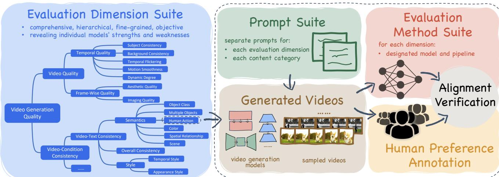

# 1. Bibliographic Information

## 1.1. Title
`VBench`: Comprehensive Benchmark Suite for Video Generative Models

## 1.2. Authors
Ziqi Huang, Yinan He, Jiashuo Yu, Fan Zhang, Chenyang Si, Yuming Jiang, Yuanhan Zhang, Tianxing Wu, Qingyang Jin, Nattapol Chanpaisit, Yaohui Wang, Xinyuan Chen, Limin Wang, Dahua Lin, Yu Qiao, and Ziwei Liu.
The authors are primarily affiliated with S-Lab at Nanyang Technological University, Shanghai Artificial Intelligence Laboratory, The Chinese University of Hong Kong, and Nanjing University. They possess extensive backgrounds in computer vision and generative AI.

## 1.3. Journal/Conference
This paper was published as a preprint on `arXiv` in November 2023. Given the prominence of the authors and the comprehensive nature of the benchmark, it is highly relevant to top-tier computer vision conferences such as `CVPR`, `ICCV`, or `NeurIPS`.

## 1.4. Publication Year
2023 (Submitted on November 29, 2023).

## 1.5. Abstract
Video generation has advanced rapidly, but evaluation remains difficult because current metrics (like `FVD`) do not align well with human perception. The authors present `VBench`, a benchmark that decomposes "video generation quality" into 16 specific, hierarchical, and disentangled dimensions (e.g., `subject consistency`, `temporal flickering`, `motion smoothness`). `VBench` provides tailored prompts and evaluation methods for each dimension, validates them against a human preference dataset, and offers insights into the current gaps between video and image generation models.

## 1.6. Original Source Link
*   **PDF Link:** [https://arxiv.org/pdf/2311.17982v1.pdf](https://arxiv.org/pdf/2311.17982v1.pdf)
*   **Project Page:** [https://vchitect.github.io/VBench-project/](https://vchitect.github.io/VBench-project/)

    ---

# 2. Executive Summary

## 2.1. Background & Motivation
The field of video generation is exploding with new models (e.g., `Gen-2`, `Pika`, `ModelScope`), yet there is no "Gold Standard" for measuring how good these models actually are. 
*   **The Problem:** Traditional metrics like `Inception Score (IS)` or `Fréchet Video Distance (FVD)` are often single-number summaries that fail to capture specific failures—like a cat turning into a dog mid-video or a background that jitters.
*   **The Gap:** Existing metrics do not align with human perception; a model might get a "good" `FVD` score but produce videos humans find unwatchable.
*   **The Need:** A diagnostic tool is required that tells researchers *exactly* what is wrong: is it the color, the motion, the consistency, or the artistic quality?

## 2.2. Main Contributions / Findings
1.  **A Comprehensive Dimension Suite:** It breaks down quality into 16 fine-grained dimensions across two levels: `Video Quality` and `Video-Condition Consistency`.
2.  **Tailored Evaluation Methods:** Each dimension uses a specialized state-of-the-art model (like `DINO`, `RAFT`, or `GRiT`) to automate scoring.
3.  **Human Alignment:** The authors collected a massive human preference dataset to prove that `VBench` scores match human judgments.
4.  **Actionable Insights:** The study reveals a "Trade-off" between `Temporal Consistency` and `Dynamic Degree` (models that are very stable often don't move much) and highlights the "Compositionality Gap" where video models struggle to place multiple objects correctly compared to image models.

    ---

# 3. Prerequisite Knowledge & Related Work

## 3.1. Foundational Concepts
To understand this paper, a beginner should be familiar with several core AI concepts:
*   **Generative Models:** Algorithms that create new data (images, videos) from scratch. Current leaders are `Diffusion Models`, which learn to turn random noise into structured images by reversing a "noising" process.
*   **Text-to-Video (T2V):** The task of generating a video based on a text prompt (e.g., "A golden retriever playing in the snow").
*   **Zero-Shot Learning:** The ability of a model to perform a task it wasn't specifically trained for (e.g., using an image-text model to evaluate a video).
*   **Disentanglement:** In evaluation, this means separating variables so that one metric (like `color`) isn't affected by another (like `motion`).

## 3.2. Previous Works & Existing Metrics
The authors cite several common metrics that `VBench` aims to improve upon:
*   **FID (Fréchet Inception Distance):** Measures how similar generated images are to real images by comparing feature distributions from a pre-trained `Inception` network.
*   **FVD (Fréchet Video Distance):** An extension of `FID` for video. It uses a 3D-Convolutional network to capture temporal information.
    *   **Limitation:** It is a "black box" metric; it doesn't tell you *why* a video is bad.
*   **CLIP (Contrastive Language-Image Pre-training):** A model trained on millions of image-text pairs. It calculates a "similarity score" between a text prompt and an image (or video frame).
    *   **Formula for CLIP Similarity:**
        \$
        \text{Similarity} = \cos(\theta) = \frac{A \cdot B}{\|A\|\|B\|}
        \$
        Where $A$ is the text embedding and $B$ is the image embedding.

## 3.3. Technological Evolution
Evaluation moved from simple human surveys to automated metrics like `IS` and `FID`. However, as models became more sophisticated, these metrics became too coarse. `VBench` represents the "Diagnostic Era" of evaluation, moving from "Is this video good?" to "Is the subject identity consistent across all 16 frames?"

---

# 4. Methodology

## 4.1. Principles
`VBench` decomposes video quality into a hierarchical structure. 
1.  **Video Quality:** Focuses on the visual and temporal aspects of the video itself, ignoring the prompt.
2.  **Video-Condition Consistency:** Focuses on how well the video follows the user's text instructions.

    The following figure (Figure 1 from the original paper) illustrates this hierarchical decomposition:

    
    *该图像是示意图，展示了 VBench 的评估维度套件、提示套件和评估方法套件。图中详细分解了视频生成质量的多个维度，并提供了相应的评估方法和生成视频的示例，为视频生成模型的评估提供了全面框架。*

## 4.2. Core Methodology In-depth (Layer by Layer)

### 4.2.1. Video Quality - Temporal Dimensions
This layer evaluates how the video changes over time.

**1. Subject Consistency:**
Does the main character look like the same person/animal throughout the video? The authors use `DINO` (a self-supervised Vision Transformer) features because they are sensitive to object identity.
The subject consistency score $S_{subject}$ is calculated as:
\$
S_{subject} = \frac{1}{T - 1} \sum_{t = 2}^{T} \frac{1}{2} ( \langle d_1 \cdot d_t \rangle + \langle d_{t - 1} \cdot d_t \rangle )
\$
*   $T$: Total number of frames.
*   $d_i$: The `DINO` image feature of the $i^{th}$ frame.
*   $\langle \cdot \rangle$: The dot product operation (cosine similarity).
*   **Explanation:** This formula checks how similar every frame is to the very first frame ($d_1$) and to the frame immediately before it ($d_{t-1}$).

**2. Background Consistency:**
Does the scenery stay stable? This uses `CLIP` image features to ensure the "global" scene doesn't warp unnaturally.
\$
S_{background} = \frac{1}{T - 1} \sum_{t = 2}^{T} \frac{1}{2} ( \langle c_1 \cdot c_t \rangle + \langle c_{t - 1} \cdot c_t \rangle )
\$
*   $c_i$: The `CLIP` image feature of the $i^{th}$ frame.

**3. Temporal Flickering:**
This measures high-frequency "jitter." The authors use static prompts to generate "still" videos and measure pixel-wise differences.
\$
S_{flicker} = \frac{1}{N} \sum_{i = 1}^{N} ( \frac{1}{T - 1} \sum_{t = 1}^{T - 1} MAE(f_{i}^{t}, f_{i}^{t+1}) )
\$
*   $N$: Number of videos.
*   $f_{i}^{t}$: Frame $t$ in video $i$.
*   `MAE`: Mean Absolute Error (average pixel difference).
    The score is then normalized: $S_{flicker-norm} = \frac{255 - S_{flicker}}{255}$.

**4. Motion Smoothness:**
Checks if movement follows physical laws. It uses a **Video Frame Interpolation (VFI)** model. If you remove a frame and the model can perfectly "guess" what it looked like using surrounding frames, the motion is smooth.

**5. Dynamic Degree:**
Some models "cheat" on consistency by making the video static. This metric uses `RAFT` (an optical flow estimator) to measure how much movement is actually happening.

### 4.2.2. Video Quality - Frame-Wise Dimensions
*   **Aesthetic Quality:** Uses a `LAION` aesthetic predictor to score how "beautiful" or "artistic" each frame is.
*   **Imaging Quality:** Uses `MUSIQ` to detect technical flaws like blur, noise, or over-exposure.

### 4.2.3. Video-Condition Consistency
This layer measures semantic accuracy using specialized detection models.
*   **Object Class:** Uses `GRiT` (Generative Region-to-Text Transformer) to detect if the requested object (e.g., "dog") is actually there.
*   **Multiple Objects:** Checks if *all* requested objects appear in the same frame.
*   **Human Action:** Uses `UMT` (Unmasked Teacher) to classify if the human is performing the correct action (e.g., "barbequing").
*   **Spatial Relationship:** Checks if objects are in the right place (e.g., "cat to the left of the chair").

    ---

# 5. Experimental Setup

## 5.1. Datasets (The Prompt Suite)
The authors created a specialized **Prompt Suite** instead of using random captions.
*   **Per-Dimension Suite:** ~100 prompts tailored to test specific things (e.g., "a person running" for `Motion Smoothness`).
*   **Per-Category Suite:** 800 prompts across 8 categories (`Animal`, `Architecture`, `Food`, `Human`, `Lifestyle`, `Plant`, `Scenery`, `Vehicles`).

## 5.2. Evaluation Metrics
The metrics are the 16 dimensions described in the Methodology. Each metric outputs a score normalized to a `[0, 1]` or $[0\%, 100\%]$ range.

## 5.3. Baselines (The Models Evaluated)
The authors benchmarked four leading open-source models:
1.  **LaVie:** A cascaded latent diffusion model.
2.  **ModelScope:** A widely used text-to-video diffusion model.
3.  **VideoCrafter:** A toolkit for high-quality video generation.
4.  **CogVideo:** A large-scale transformer-based model.
5.  **Reference Baselines:** `Empirical Max` (best possible scores from real video datasets like `WebVid-10M`) and `Empirical Min` (scores from random noise).

    ---

# 6. Results & Analysis

## 6.1. Core Results Analysis
The experimental results show that no single model wins in every category.
*   **The Stability vs. Motion Trade-off:** `LaVie` excels at `Background Consistency` (97.47%) and `Temporal Flickering` (98.30%) but has a very low `Dynamic Degree` (49.72%). In contrast, `VideoCrafter` is highly dynamic (89.72%) but scores poorly on consistency.
*   **Human Alignment:** As seen in Figure 5, `VBench` automated scores have a Spearman's correlation coefficient ($\rho$) of up to $99\%$ with human preferences in dimensions like `Motion Smoothness` and `Aesthetic Quality`.

    The following are the results from Table 1 of the original paper:

    <table>
    <thead>
    <tr>
    <th>Models</th>
    <th>Subject Consistency</th>
    <th>Background Consistency</th>
    <th>Temporal Flickering</th>
    <th>Motion Smoothness</th>
    <th>Dynamic Degree</th>
    <th>Aesthetic Quality</th>
    <th>Imaging Quality</th>
    <th>Object Class</th>
    </tr>
    </thead>
    <tbody>
    <tr>
    <td>LaVie</td>
    <td>91.41%</td>
    <td>97.47%</td>
    <td>98.30%</td>
    <td>96.38%</td>
    <td>49.72%</td>
    <td>54.94%</td>
    <td>61.90%</td>
    <td>91.82%</td>
    </tr>
    <tr>
    <td>ModelScope</td>
    <td>89.87%</td>
    <td>95.29%</td>
    <td>98.28%</td>
    <td>95.79%</td>
    <td>66.39%</td>
    <td>52.06%</td>
    <td>58.57%</td>
    <td>82.25%</td>
    </tr>
    <tr>
    <td>VideoCrafter</td>
    <td>86.24%</td>
    <td>92.88%</td>
    <td>97.60%</td>
    <td>91.79%</td>
    <td>89.72%</td>
    <td>44.41%</td>
    <td>57.22%</td>
    <td>87.34%</td>
    </tr>
    <tr>
    <td>CogVideo</td>
    <td>92.19%</td>
    <td>95.42%</td>
    <td>97.64%</td>
    <td>96.47%</td>
    <td>42.22%</td>
    <td>38.18%</td>
    <td>41.03%</td>
    <td>73.40%</td>
    </tr>
    </tbody>
    </table>

## 6.2. Key Insights
*   **The "Human" Bottleneck:** Even though the `WebVid` dataset has 26% human content, the `Human` category scores are among the lowest. This suggests that simply adding more data isn't enough; models need better "priors" for human anatomy.
*   **Compositionality Gap:** Image models (like `SDXL`) are much better at handling "two cats on a blue rug" than current video models. Video models often "melt" objects together or ignore one entirely.

    ---

# 7. Conclusion & Reflections

## 7.1. Conclusion Summary
`VBench` provides a necessary, fine-grained, and human-aligned compass for the video generation community. By breaking down quality into 16 disentangled dimensions, it allows researchers to pinpoint exactly where their models fail—whether it's low-level imaging noise or high-level semantic action.

## 7.2. Limitations & Future Work
*   **Model Availability:** The benchmark is currently limited to open-source models. Closed-source models (like `Sora` or `Gen-3`) are not yet included.
*   **Ethical Dimensions:** The current version does not explicitly measure "safety," "bias," or "fairness," which are critical for real-world deployment.
*   **Task Expansion:** The authors plan to extend `VBench` to `Image-to-Video` and `Video-to-Video` editing tasks.

## 7.3. Personal Insights & Critique
`VBench` is an excellent contribution because it treats evaluation as a **debugging process** rather than just a leaderboard. 
*   **Innovation:** Using a Video Frame Interpolation model to measure `Motion Smoothness` is a clever way to leverage existing AI capabilities for evaluation.
*   **Potential Issue:** The "trade-off" observation is particularly insightful. It suggests that current models might be "gaming" consistency metrics by generating static scenes. `VBench` correctly identifies this by including `Dynamic Degree`.
*   **Critique:** One unverified assumption is that the 16 dimensions are truly "disentangled." In reality, a very blurry frame (`Imaging Quality`) might naturally lead to a lower `Object Class` detection score simply because the detector can't see the object. Further work could explore how these dimensions correlate with each other.