# 什么推动了物理规划中联合嵌入预测世界模型的成功？

吉米·杨 Meta FAIR jimmytyyang@meta.com 巴西尔·特尔维尔 Meta FAIR 巴黎高校/INRIA basileterv@meta.com 让·庞斯 巴黎高等师范学院/巴黎高科 jean.ponce@ens.fr 阿德里安·巴尔德斯 Meta FAIR abardes@meta.com 扬·勒cun Meta FAIR yann@meta.com

# 摘要

一个长期以来的挑战是开发能够解决广泛物理任务并能够推广到新的、未见过的任务和环境的智能体。最近一种流行的方法是通过状态-动作轨迹训练世界模型，然后使用该模型与规划算法一起解决新任务。规划通常在输入空间进行，但最近一系列方法引入了优化学习到的世界模型表示空间的规划算法，承诺忽略无关细节将实现更高效的规划。在本研究中，我们将这一系列模型表征为 JEPA-WMs，并探讨使这一类算法有效的技术选择。我们提出对几个关键组件进行全面研究，目的是在该系列中寻找最佳方法。我们使用模拟环境和现实世界机器人数据进行了实验，研究了模型架构、训练目标和规划算法如何影响规划成功率。我们结合这些发现，提出一个在导航和操作任务中均超越两个既定基线 DINO-WM 和 V-JEPA-2-AC 的模型。代码、数据和检查点可在 https://github.com/facebookresearch/jepa-wms 获取。

# 1 引言

为了构建有能力的物理智能体，Ha和Schmidhuber（2018）提出了世界模型的概念，即在给定过去观察和行动的背景下，预测未来世界状态的模型。这样的世界模型应在一种抽象层次上进行预测，从而允许在其上训练策略（Hafner等，2024；Mendonca等，2021；Guo等，2022），或者以样本效率高的方式进行规划（Sobal等，2025；Hansen等，2024）。

关于世界建模已经存在大量文献，主要来自强化学习（RL）领域。无模型强化学习（RL）（Mnih et al., 2015；Fujimoto et al., 2018；Mnih et al., 2016；Haarnoja et al., 2018；Schulman et al., 2017；Yarats et al., 2022）需要大量样本，这在奖励稀疏的环境中是个问题。为了解决这一问题，基于模型的强化学习在训练策略或Q函数时使用给定的或学习到的环境模型（Silver et al., 2018）。结合自监督预训练目标，基于模型的强化学习催生了新的模拟环境中的世界建模算法（Ha & Schmidhuber, 2018；Seo et al., 2022；Schrittwieser et al., 2020；Hafner et al., 2024；Hansen et al., 2024）。最近，大规模世界模型得到了蓬勃发展（Hu et al., 2023；Yang et al., 2023；Brooks et al., 2024；Bruce et al., 2024；Parker-Holder et al., 2024；Bartoccioni et al., 2025；Agarwal et al., 2025；Bar et al., 2025）。对于数据丰富的特定领域，例如驾驶模拟（Hu et al., 2023；Bartoccioni et al., 2025）或自我中心的视频游戏（Bruce et al., 2024）。

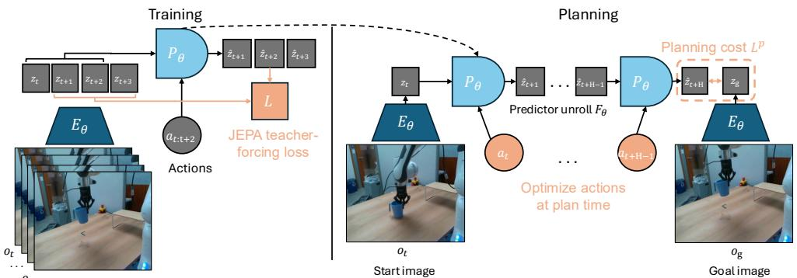  

Figure 1: Left: Training of JEPA-WM: the encoder $E _ { \phi , \theta }$ embeds video and optionally proprioceptive observation, which is fed to the predictor $P _ { \theta }$ , along with actions, to predict (in parallel across timesteps) the next state embedding. Right: Planning with JEPA-WM: sample action sequences, unroll the predictor on them, compute a planning cost $L ^ { p }$ for each trajectory, and use this cost to $A _ { \theta }$ and proprioceptive encoder $E _ { \theta } ^ { p r o p }$ are not explicitly displayed in this figure for readability.

根据 Parker-Holder 等（2024）和 Ball 等（2025）的研究，一些方法在相对较长的时间段内实现了令人印象深刻的仿真精度。

在本次演示中，我们构建了一个世界模型，其中某个（机器人）智能体配备了（视觉）传感器，作为一个动态系统运作，状态、观测和行动均由参数编码器嵌入特征空间，而动态本身也以依赖于这些特征的参数预测器的形式被学习。编码器/预测器对就是我们所称的世界模型。我们将重点关注从视频中学习的以行动为条件的联合嵌入预测世界模型（或 JEPAWMs）（Sobal 等，2025；Zhou 等，2024a；Assran 等，2025）。这些模型适应于 LeCun（2022）提出的联合嵌入预测体系结构（JEPAs）的规划问题，其中通过学习一个编码器/预测器对构造某些数据的表示，使得某个数据样本的一个视图的嵌入能够很好地预测另一个视图的嵌入。我们使用 JEPA-WM 这个术语来指代这一系列方法，我们在方程（1）到（4）中对其进行了形式化，作为统一的实现方案而非新算法。在实践中，我们优化以寻找一个没有理论保证计划可行性的行动序列，这更接近于轨迹优化，但我们仍然坚持使用广泛使用的规划一词。

在这些JEPA-WM中，PLDM（Sobal et al., 2025）表明，在潜在空间中学习的世界模型作为JEPA进行训练，提供了比其他目标条件强化学习（GCRL）方法更强的泛化能力，尤其是在次优训练轨迹上。DINO-WM（Zhou et al., 2024a）展示了在没有奖励的情况下，比较目标条件规划任务中的潜在世界模型时，基于冻结DINOv2编码器训练的JEPA模型优于DreamerV3（Hafner et al., 2024）和TD-MPC2（Hansen et al., 2024），尤其是当我们剥夺这些模型的奖励注释时。DINO-World（Baldassarre et al., 2025）显示基于DINOv2训练的JEPA-WM在密集预测和直观物理方面的能力优于COSMOS。V-JEPA-2-AC（Assran et al., 2025）模型能够在使用图像子目标的对象操作贪婪规划中超越视觉语言动作（VLA）基准，如Octo（Octo Model Team et al., 2024）。本文的重点是学习动态（预测器），而非表示（编码器），与DINO-WM和V-JEPA-2-AC（Zhou et al., 2024a; Assran et al., 2025）一致。鉴于此类模型日益重要，我们旨在填补文献中的一个空白，即深入研究如何有效学习预训练视觉编码器的嵌入空间中的动态模型，以便用于操作和导航规划任务。我们的贡献可以总结如下：（i）我们研究了JEPA-WM训练和规划的几个关键组件：多步推演、预测器架构、训练上下文长度、使用或不使用本体感觉、编码器类型、模型大小、数据增强；以及规划优化器。我们利用这些洞察提出了JEPA-WM的优化方案，超越DINO-WM和V-JEPA-2-AC。

# 2 相关工作

世界建模与规划。《走向机器智能之路》（LeCun, 2022）将模型预测控制（MPC）作为自主机器的核心组件。

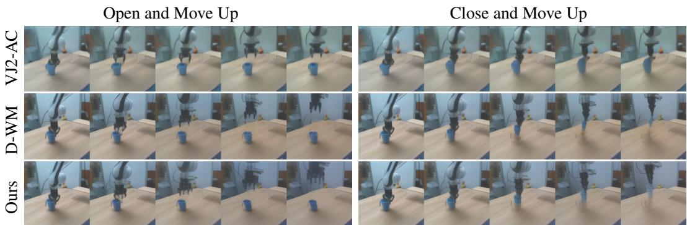  

Figure 2: Comparison of different methods on the counterfactual Franka arm lift cup task, where we hardcode 2 actions, either "open and move up" or "close and move up". Each shows 5 model actions in open-loop rollout. Left: open and move up" action. Right: close and move up" First row: V-JEPA-2-AC. Second row: DINO-WM. Third row: our best model, described in Section 5.3.

智能（AMI）。通过自监督学习（SSL）学习的世界模型（Fung et al., 2025）已在许多强化学习研究中被应用，用于利用信息增益估计（Sekar et al., 2020）或好奇心（Pathak et al., 2017）来控制探索，首先学习世界模型以转移到少数据的机器人任务（Mendonca et al., 2023）或提高样本效率（Lukasz Kaiser et al., 2020）。此外，世界模型被用于规划，通过使用逆问题重建先前帧来找到子目标，以达到表示为最后一帧的目标，或通过想象看不见的环境中的目标（Mendonca et al., 2021）。世界模型可以是生成式的（Brooks et al., 2024；Hu et al., 2023；Ball et al., 2025；Agarwal et al., 2025），或在潜在空间中训练，使用JEPA损失（Garrido et al., 2024；Sobal et al., 2025；Assran et al., 2025；Zhou et al., 2024a；Bar et al., 2025）。它们可以在潜在空间中进行规划（Zhou et al., 2024a；Sobal et al., 2025；Bar et al., 2025），以最大化折现奖励的总和（Hansen et al., 2024），或学习一个策略（Hafner et al., 2024）。潜在空间规划的其他方法包括局部线性动态模型（Watter et al., 2015）、基于梯度的轨迹优化（Srinivas et al., 2018）和基于扩散的规划器（Janner et al., 2022；Zhou et al., 2024b）。这些方法与JEPA-WM在其动态模型类别、优化策略或训练假设上存在差异；我们在A节中提供了详细比较。

目标导向强化学习。目标导向强化学习（GCRL）提供了一种自监督的方法，以利用在无标记（无奖励）数据上进行的大规模预训练。基础方法如LEAP（Nasiriany et al., 2019）和HOCGRL（Li et al., 2022）表明，通过强化学习学习的目标导向策略可以被纳入规划中。PTP（Fang et al., 2022a）以分层方式分解了达成目标的问题，利用潜在空间中的条件子目标生成器为低层模型无关政策。FLAP（Fang et al., 2022b）通过离线强化学习获取目标导向策略，并在学习到的有损表示空间中通过引导子目标进行在线微调。RE-CON（Shah et al., 2021）学习了距离和动作的潜变量模型，以及图像的非参数拓扑记忆。IQL-TD-MPC（Xu et al., 2023）扩展了带有隐式Q学习（IQL）（Kostrikov et al., 2022）的TD-MPC。HIQL（Park et al., 2023）提出了一种基于离线数据的目标导向强化学习的分层模型无关方法。

机器人学。经典的机器人问题方法依赖于模型预测控制（MPC）循环（Garcia等，1989；Borrelli等，2017），利用机器人的分析物理模型及其传感器进行频繁的重规划，类似于麻省理工学院的人形机器人（Chignoli等）或BiconMP（Meduri等，2022）。对于外部感知，我们使用相机来感知环境状态，类似于长期存在的视觉伺服问题（Hutchinson等，1996）。当前操作中的最先进技术是通过视觉-语言-动作（VLA）模型实现的，诸如RT-X（Vuong等，2023）、RT-1（等，2023）和RT-2（Zitkovich等，2023）。LAPA（Ye等，2024）更进一步，利用没有动作的机器人轨迹，使用VQ-VAE目标在机器人视频上学习离散潜在动作。物理智能的第一个模型$\pi _ { 0 }$（Black等，2024）利用Open-X实体数据集及流配对生成动作轨迹。

# 3 背景

本节规范了从预训练视觉编码器学习的JEPA-WM的通用设置，但并未引入新的方法。我们在图1中总结了JEPA-WM的训练和规划。

训练方法。在JEPA-WM中，我们使用冻结的视觉编码器 $E _ { \phi } ^ { v i s }$ 嵌入观察数据，并可选地使用一个浅层的本体感知编码器 $E _ { \theta } ^ { p r o p }$。将每个编码器应用于相应的 $E _ { \phi , \theta } = ( E _ { \phi } ^ { v i s } , E _ { \theta } ^ { p r o p } )$。一个动作编码器 $A _ { \theta }$ 嵌入了角色，并与合成预测器 $P _ { \theta }$ 共同处理窗口内的 $w$ 个观察 $o _ { t - w : t } := \left( o _ { t - w } , \ldots , o _ { t } \right)$，包括视觉和（可选的）本体感知输入以及过去的动作 $a _ { t - w : t }$，它们的共同训练预测目标是在 $B$ 个批次元素上的 $L$，这是在视觉预测和目标，以及本体感知预测和目标之间逐对计算的损失。在我们的实验中，我们选择 $L$ 为均方误差（MSE）。本研究中选用的编码器和预测器架构为ViT（Dosovitskiy et al., 2021），与我们的基线相同（Zhou et al., 2024a; Assran et al., 2025）。在DINO-WM（Zhou et al., 2024a）中，动作和本体感知编码器仅为线性层，其输出与视觉编码器输出沿嵌入维度拼接，这被称为特征条件化（Garrido et al., 2024），与序列条件化不同，后者将动作和本体感知编码为词元，拼接到视觉词元序列中，这在V-JEPA-2（Assran et al., 2025）中采用。我们强调 $P _ { \theta }$ 是使用帧因果注意力掩码进行训练的，因此，它同时被训练以预测从 $w = 0$ 到 $w = W - 1$ 的所有上下文长度，其中 $W$ 是一个训练超参数，设定为 $W = 3$。因果预测器被训练以预测多个动作的结果，而不仅仅是一个动作。为此，可以跳过 $f$ 个观察并将 $f$ 个相应的动作拼接形成一个更高维的动作 $f \times A$，如在DINO-WM（Zhou et al., 2024a）中所示。关于训练过程的更多细节见B部分。

$$
\mathcal { L } = \frac { 1 } { B } \sum _ { b = 1 } ^ { B } L [ P _ { \theta } \left( E _ { \phi , \theta } ( o _ { t - w : t } ^ { b } ) , A _ { \theta } ( a _ { t - w : t } ^ { b } ) \right) , E _ { \phi , \theta } \left( o _ { t + 1 } ^ { b } \right) ] ,
$$

规划。在时间范围 $H$ 的规划是一个在产品动作空间 $\mathbb{R}^{H \times A}$ 上的优化问题，其中动作空间为 $A$，在训练时使用帧跳（frameskip）时可以采取 $f \times A$ 的动作。给定初始观察和目标观察对 $o_{t}, o_{g}$，每条动作轨迹 $a_{t : t + H - 1} := (a_{t}, \dots , a_{t + H - 1})$ 应该使用规划目标 $L^{p}$ 进行评估。与训练时类似，考虑一种不相似性度量 $L$（例如 $L_{1}, L_{2}$ 距离或负余弦相似度），在每种模态上逐对应用，表示为 $L_{vis}$ 用于两个视觉嵌入以及 $L_{prop}$ 用于本体嵌入。在使用同时接受本体感知和视觉输入的模型进行规划时，给定 $\alpha \geq 0$，我们希望最小化的规划目标 $L_{\alpha}^{p}$ 与我们世界模型相关的函数 $G_{\phi, \theta}$。我们递归地定义 $F_{\phi, \theta}$ 为从 $z_{t} = E_{\phi, \theta}(o_{t})$ 在动作上的预测器的展开，最大上下文长度为 $w$（固定为 $W^{p}$，见表 S4.1）。

$$
L _ { \alpha } ^ { p } ( o _ { t } , a _ { t : t + H - 1 } , o _ { g } ) = ( L _ { v i s } + \alpha L _ { p r o p } ) ( G _ { \phi , \theta } ( o _ { t } , a _ { t : t + H - 1 } ) , E _ { \phi , \theta } ( o _ { g } ) ) ,
$$

$$
\begin{array} { r l } & { F _ { \phi , \theta } : \big ( o _ { t } , a _ { t - w : t + k - 1 } \big ) \mapsto \hat { z } _ { t + k } , } \\ & { \qquad \hat { z } _ { i + 1 } = P _ { \theta } \big ( \hat { z } _ { i - w : i } , A _ { \theta } \big ( a _ { i - w : i } \big ) \big ) , \quad i = t , \dots , t + k - 1 , \quad z _ { t } = E _ { \phi , \theta } \big ( o _ { t } \big ) } \end{array}
$$

在我们的案例中，我们将 $G _ { \phi , \theta }$ 视为展开函数 $F _ { \phi , \theta }$，但可以选择 $G _ { \phi , \theta }$ 为所有中间展开步骤的一个函数，而不仅仅是最后一步。我们在 D 节中提供了关于规划优化器的详细信息。

# 4 积累的设计选择

我们的基本配置是没有自身感知的 DINO-WM，使用 ViT-S 编码器和相同嵌入维度的深度为 6 的预测器。我们根据设计选择的影响范围来优先考虑：规划时间的选择影响所有评估，因此我们首先优化这些选择，并为每个环境固定最佳规划器进行后续实验；接下来是训练和架构选择；缩放实验验证我们的发现。每个组件都是独立于基本配置进行变化，以便隔离其影响。规划器。各种优化算法可以与解决最小化方程 2 的问题相关，该方程是可微的。Zhou 等（2024a）；Hansen 等（2024）；Sobal 等（2025）；

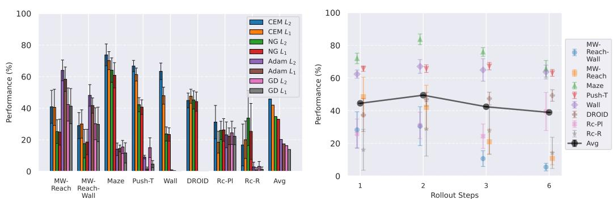  

Figure 3: Left: Comparison of planning optimizers: NG is the Nevergrad-based interface for trajectory optimization that we introduce, compared to the Cross-Entropy Method (CEM), with $L _ { 1 }$ or $L _ { 2 }$ distance. Right: Effect of adding multistep rollout loss terms: models are trained with total loss $\mathcal { L } _ { 1 } + \cdots + \mathcal { L } _ { k }$ . Rc-Pl and Rc-R denote the Place and Reach tasks of Robocasa.

Assran 等人（2025）；Bar 等人（2025）使用交叉熵方法（CEM）（或称为 MPPI 的变种（Williams 等人，2015）），如 D 节所示。由于这是一种基于种群的优化方法，且不依赖于成本函数的梯度，我们引入一个可以利用 NeverGrad（Bennet 等人，2021）中的任何优化方法的规划器。在我们的实验中，我们选择默认的 NGOpt 优化器（匿名，2024），其被指定为“元”优化器。我们不调整该优化器的任何参数。我们在本文余下部分称此规划器为 NG，具体细节见 D 节。我们还实验了基于梯度的规划器（GD 和 Adam），这些规划器通过反向传播直接优化动作序列，具体细节见 D 节。四种考虑的优化器共同的规划超参数是定义预测器依赖的成本函数 $G _ { \theta }$、规划视野 $H$、在环境中执行的计划动作数 $m \leq H$ 以及馈送给预测器的历史预测的最大滑动上下文窗口大小，记作 $W ^ { p }$。CEM 和 NG 或 Adam 和 GD 共同的参数是并行评估成本的候选动作轨迹数量，记作 $N$，以及并行成本评估的迭代次数 $J$。在探索了 CEM 和 NG 通用的规划超参数对成功的影响后，我们将其固定为相同的值，具体总结见附录表 S4.1。我们使用 $L _ { 1 }$ 或 $L _ { 2 }$ 嵌入空间距离作为成本 $L _ { \alpha } ^ { p }$ 中的相异度度量 $L$。图 3（左）中的结果是本研究中考虑的模型的平均结果。

多步推演训练。在每次训练迭代中，除了方程 1 中逐帧教师强迫损失外，我们还计算额外的损失项，即 $k$ 步推演损失 $\mathcal{L}_k$，对于 $k \geq 1$，定义为 $\hat{z}_{t + k - 1}^{b} = F_{\phi, \theta}(o_t, a_{t - w : t + k - 2})$，请参见方程。注意到 ${\mathcal{L}}_1 = {\mathcal{L}}$。在实践中，我们会丢弃累积的梯度来计算 $\hat{z}_{t + H}$，仅反向传播最后预测的误差。我们研究了该损失的不同变体，如第 B 节所详细描述，包括 V-JEPA-2-AC 中使用的变体。我们将用到至 $\mathcal{L}_k$ 损失的损失项之和训练的模型称为 $k$ 步。我们训练的模型最多具有 6 步损失，这需要超过默认的 $W = 3$ 最大上下文大小，因此我们将 $W = 7$ 设定为训练它们，类似于后续引入的具有增大 $W$ 的模型。

$$
\mathcal { L } _ { k } = \frac { 1 } { B } \sum _ { b = 1 } ^ { B } L [ P _ { \theta } ( \hat { z } _ { t - w : t + k - 1 } ^ { b } , A _ { \theta } ( a _ { t - w : t + k - 1 } ^ { b } ) ) , E _ { \phi , \theta } \left( o _ { t + k } ^ { b } \right) ] ,
$$

本体感觉。我们比较了 DINO-WM 的标准设置（Zhou 等，2024a），在该设置中，我们与预测器和动作编码器共同训练本体感觉编码器，与仅有视觉输入的设置进行比较。我们强调，与 V-JEPA-2-AC 相反，我们使用视觉和本体感觉损失项来训练预测器、本体感觉编码器和动作编码器。训练上下文大小。我们旨在测试是否允许预测器在训练期间查看更长的上下文能够更好地展开更长的动作序列。我们测试的值范围为 $W = 1$ 到 $W = 7$。

  

Figure 4: Left: Models trained with proprioceptive input are denoted "prop", while pure visual world models are named "no-prop". Right: Comparison of JEPA-WMs trained on top of various pretrained visual encoders, all of size ViT-L for fair comparison. Rc-Pl and Rc-R denote the Place and Reach tasks of Robocasa.

编码器类型。如 Zhou 等人（2024a）所提出，局部特征保留了空间细节，这对解决手头任务至关重要。因此，我们使用 DINOv2 的局部特征以及最近提出的 DINOv3（Siméoni 等人，2025），在密集任务上表现更为强大。我们在视频编码器之上训练一个预测器，即 V-JEPA（Bardes 等人，2024）和 V-JEPA-2（Assran 等人，2025）。我们考虑它们的 ViT-L 版本。在探索采用的帧编码策略后，选择 $O _ { t - W + 1 } , \dots , O _ { t + 1 }$ 帧，并将每对帧独立编码为 2 帧视频。关于所考虑的所有编码器的编码方法比较的详细信息请见第 B 节。帧预处理和编码被统一为每个时间步具有相同数量的视觉嵌入词元，因此主要的区别在于这些编码器的权重，这些权重我们是现成使用的。

预测器架构。Zhou 等人（2024a）和 Assran 等人（2025）的预测器架构之间的主要区别在于，前者使用特征条件，结合正弦余弦位置嵌入，而后者则使用序列条件和旋转位置嵌入（RoPE）（Su 等人，2024）。在前者中，动作嵌入 $A _ { \theta } ( \bar { a } )$ 在嵌入维度上与视觉特征 $E _ { \theta } ( o )$ 进行拼接，预测器的隐藏维度从 $D$ 增加到 $D + f _ { a }$，其中 $f _ { a }$ 为动作的嵌入维度。然后，这些特征与 3D 正弦余弦位置嵌入一起处理。在后者中，动作作为单独的词元编码，并在序列维度上与视觉词元进行拼接，保持预测器的隐藏维度为 $D$（与编码器一致）。在预测器的每个模块中使用旋转位置嵌入 (RoPE)。我们还测试了一种将特征条件与 RoPE 混合的架构。另一种有效的条件技术是 AdaLN（Xu 等人，2019），Bar 等人（2025）采用了该方法，我们也进行了测试，并在此情况下使用 RoPE。这种方法允许动作信息影响预测器的所有层，而不仅仅是在输入端，从而可能防止动作信息在网络中的消失。详细信息见 B 节。模型缩放。我们将编码器的大小提高到 ViT-B 和 ViT-L，使用带有寄存器的 DINOv2 ViT-B 和 ViT-L（Darcet 等人，2024）。在增加编码器大小时，我们预计预测任务会更困难，因此需要更大的预测器。因此，我们相应地增加预测器的嵌入维度以匹配编码器。我们还研究了预测器深度的影响，将其从 3 变为 12。

# 5 实验

# 5.1 评估设置。

数据集。对于 Metaworld，我们通过在线训练 TD-MPC2 (Hansen et al., 2024) 智能体收集一个数据集，并评估两个任务，“Reach”和“Reach-Wall”，分别表示为 MW $R$ 和 MW-RW。我们使用 Zhou et al. (2024a) 发布的离线轨迹数据集，即 Push-T (Chi et al., 2023)、Wall 和 PointMaze。训练集占每个数据集的 $90 \%$。我们在 DROID (et al., 2024) 上进行训练，并通过从遥操作轨迹定义自定义的抓取和放置任务，在 Robocasa (Nasiriany et al., 2024) 上进行零样本评估，这些任务分别表示为“Place”和“Reach”，标记为 Rc-Pl 和 Rc-R。我们不对 DROID 模型在 Robocasa 轨迹上进行微调。我们还在实验室拍摄的真实 Franka 机械臂的 16 个视频上进行评估，这些视频与 DROID 分布更接近，并将此任务标记为 DROID。在 DROID 上，我们跟踪计划器输出的动作与定义初始和目标状态的数据集中轨迹的真实动作之间的 $L _ { 1 }$ 误差。然后，我们对该动作误差的相反数进行重新缩放，以构成一个动作评分，这是一个需要最大化的指标。我们在 C 节中提供有关我们的数据集和环境的详细信息。

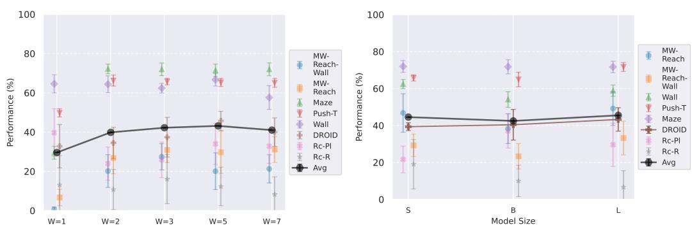  

Figure 5: Left: Maximum number of timesteps of state embedding seen by the predictor at train time in equation 1, the predictor takes up to $( E _ { \phi , \theta } ( o _ { t - W + 1 : t } ) , A _ { \theta } ( \bar { a } _ { t - W + 1 : t } ) )$ as context. Right: Comparison of model size: we vary from ViT-S to ViT-L the visual encoder size, as well as the predictor embedding dimension, keeping predictor depth constant at 6. Rc-Pl and $\operatorname { R c - R }$ denote the Place and Reach tasks of Robocasa.

目标定义。我们从Metaworld提供的专家策略中采样目标框架，从Push-T、DROID和Robocasa的数据集中，以及从Wall和Maze的随机二维状态采样器中提取目标框架，更多细节见C部分。对于具有本体感知的模型，我们计划使用本体感知嵌入距离，将$\alpha = 0.1$设定在公式2中，DROID和Robocasa除外，我们将$\alpha = 0$设定，以便与V-JEPA-2-AC进行比较。指标。我们希望最大化的主要指标是成功率，但同时跟踪其他几个指标，这些指标独立于规划过程来跟踪世界模型的质量，并且比成功率噪声更小。這些指标包括在预测器展开过程中的嵌入空间误差、在展开过程中的本体感知解码误差、开放循环推演的视觉解码（以及这些解码与真实未来帧之间的LPIPS）。更多细节见E.2部分。

统计显著性。为了考虑训练的可变性，我们对表1中的最终模型使用每个模型3个种子进行训练。为了考虑评估的可变性，在每个周期，我们启动 $e = 96$ 个实验，每个实验都有一个不同的初始状态和目标状态，这些状态要么从数据集中（PushT、Robocasa、DROID）抽样，要么由模拟器（Metaworld、PointMaze、Wall）生成。我们在DROID的评估中采用 $e = 64$，这对于获得可靠的评估至关重要，即使我们比较的是连续动作得分指标。考虑到策划实验的成本较高，我们在Robocasa中使用 $e = 32$，因为它需要进行12次重新规划，如表S4.1所述。我们对这些实验进行平均以获得成功率。尽管我们在每个周期内对三个种子及其评估实验的成功率进行了平均，但我们仍然发现训练过程中存在较大的可变性。因此，为了获取每个模型的总评分，我们对最后 $n$ 个训练周期的成功率进行平均，其中所有数据集的 $n = 10$，而对于在DROID上训练的模型，$n = 100$。在比较设计选择的图中显示的误差条是最后几个周期成功率的标准差，仅反映这种可变性。

# 5.2 结果

一个重要的事实是，即使对于能够忠实推演大量动作的模型，成功完成规划任务也并不是一个立竿见影的结果。我们在 E.1 节中详细阐述这一论点，并提供所研究模型的推演和规划情景的可视化。比较规划优化器。我们比较了四种规划优化器：交叉熵方法（CEM）、Nevergrad（NG）、Adam 和梯度下降（GD）。CEM 是 CMA-ES 家族的一种变体（Hansen & Ostermeier, 1996；Hansen, 2023），具有对角协方差和简化的更新规则。NG 使用 NGOpt 向导，根据优化空间参数化和预算选择对角 CMA-ES（Hansen et al., 2019），见算法 2。我们在图 3 中观察到，CEM 的 $L _ { 2 }$ 规划器表现最佳。

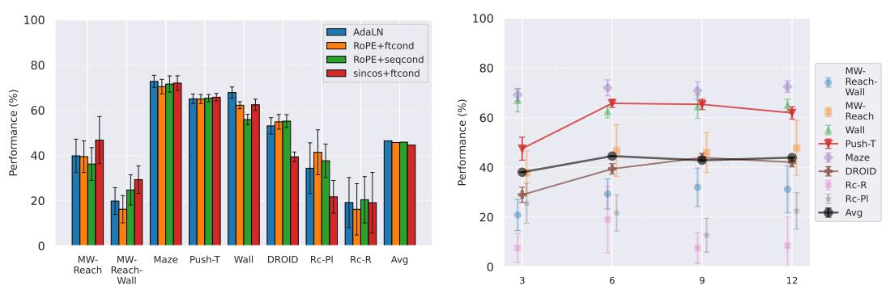  

Figure 6: Left: Comparing predictor architectures: we denote positional embedding in the predictor as sincos or RoPE; the feature conditioning technique as "ftcond" and the sequence conditioning as "seqcond". The Adaptive LayerNorm conditioning technique is denoted "AdaLN". Right: Comparison of predictor depth: we vary the predictor depth from 3 to 12, keeping the encoder fixed to DINOv2-S. Rc-Pl and Rc-R denote the Place and Reach tasks of Robocasa.

(i) 基于梯度的方法：Adam $L _ { 2 }$ 在 Metaworld 上实现了最佳的整体性能，优于所有其他优化器，而梯度下降（GD）与 CEM 也具有竞争力。这可以通过 Metaworld 任务的特性来解释：这些任务具有相对平滑的成本景观，目标可以被贪婪地到达，从而使基于梯度的方法表现出色。相比之下，在需要非贪婪规划的二维导航任务（如 Wall、Push-T、Maze）中，基于梯度的方法相对于基于采样的方法表现非常糟糕，因为梯度下降会陷入局部极小值。在 DROID 上，基于梯度的方法的表现也明显不如基于采样的方法：这些任务需要对复杂现实对象操作的丰富而精确的理解，导致多模态成本景观。而 Robocasa 任务虽然是模拟的，但其本质更接近于 Metaworld，因此基于梯度的方法再次表现得相对不错。

(ii) 基于采样的方法：在二维导航任务中，CEM明显优于NG，因为这些任务需要精确的动作序列，而CEM对紧凑动作分布的快速收敛是有利的，而NG的慢速、更具探索性的优化则不利。为了比较这两种方法，我们在图S4.1中绘制了每个规划步骤的优化过程收敛情况，观察到NG收敛较慢，表明在动作轨迹空间中的探索更多。在DROID和Robocasa上，CEM和NG的表现相似。使用NG时，我们的规划超参数比CEM少，后者需要指定前$K$条轨迹参数和提议高斯分布的初始化$\mu^{\mathfrak{J}}，\sigma^{\overline{{0}}}$——这些参数对性能有重大影响。关键是，在实际操作数据（DROID和Robocasa）上，NG的表现与CEM相当，而无需超参数调优，这使其成为在转向新的任务或数据集时的实际替代方案，而CEM调优可能代价高昂。在所有规划设置和模型中，$L_{2}$成本始终优于$L_{1}$成本。为了最小化后续研究中的变动部分，我们将每个数据集的规划设置固定为CEM $L_{2}$，在所有环境中表现最好或竞争力较强。多步骤推演预测器训练。在规划时，预测器需要通过从其之前的预测中预测未来的嵌入来忠实地推演一条动作序列。我们在图3中观察到，从纯教师强制模型转向2步推演损失模型时，性能有所提高，但在模拟环境中训练的模型则表现降低。我们的规划最大上下文长度为$W^{p}=2$，因此添加推演损失项$\mathcal{L}_{k}$（$k>3$）可能会使模型在测试时执行的预测任务的专业化程度降低，解释了性能的下降。有趣的是，对于在DROID上训练的模型，最佳的推演步骤数为六。自我感知的影响。我们在图4中观察到，使用自我感知输入训练的模型表现显著优于未经训练的模型。在Metaworld中，大多数失败的回合是由于手臂快速到达目标位置，然后在目标位置附近震荡。因此，对与目标的确切距离有更精确的信息提高了性能。在二维导航任务中，自我感知输入还使智能体能够提出更精确的计划。我们未展示Robocasa的结果，因为DROID和Robocasa之间的自我感知空间不一致，使得使用自我感知的模型在零-shot迁移中毫无意义。

最大上下文大小。训练更长上下文需要更多迭代以收敛成功率。我们回顾选择在所有实验中使用 $W ^ { p } = 2$ 进行规划，因为它能够提供最大的成功率，同时更加计算高效。预测器需要两个上下文帧来推断速度并用于预测任务。推断加速度需要三个帧。我们确实在图5中看到，使用 $W = 1$ 和 $W = 2$ 训练的模型之间存在显著的性能差距，这表明预测器在进行预测时受益于使用此上下文。另一方面，在固定的训练计算预算下，增大 $W$ 意味着我们将数据集切分成更少但更长的独特轨迹切片，长度为 $W + 1$，因此梯度步数减少。在 DROID 上，$W$ 设置过低会导致丢弃一些长度低于 $W + 1$ 的视频。然而，我们观察到在 DROID 上训练的模型其最佳 $W$ 为 5，高于模拟数据集的最佳 $W$ 3。这可能是由于 DROID 的动态更加复杂，需要更长的上下文来显著推断现实世界中的手臂和物体动态。一项简单的实验表明一个非常著名但基本的性质：训练最大上下文 $W$ 和规划最大上下文 $W ^ { p }$ 必须选择使得 $W ^ { p } \leq W$。否则，我们要求模型执行一个在训练时未见过的预测任务，如果 $W ^ { p } > W$，我们会看到预测在展开过程中迅速下降。为了解决这个问题，5.1 节中显示的 $W = 1$ 模型性能来自于使用 $W ^ { p } = 1$ 进行规划。编码器类型。在图4中，我们看到 DINO 编码器相比 V-JEPA 编码器具有明显优势。我们认为这是由于 DINO 在物体情境化能力上更强，这在需要精确感知智能体和物体位置的任务中至关重要。有趣的是，DINOv3 在 Robocasa 和 DROID 这类更具摄影真实感的环境中明显优于 DINOv2，这可能是因为 DINOv3 的预训练数据集更适合这些图像。在 Maze 和 Wall 上，使用 DINOv3 训练的模型收敛到较低成功率所需时间更长。

预测器架构。在图6中，我们观察到，尽管带有RoPE的AdaLN在各个环境中取得了最佳的平均性能，但这一优势是微小的，并且结果是任务依赖的：在Metaworld中，sincos+ftcond实际上表现最佳。我们并没有看到使用RoPE代替sincos位置嵌入时有显著的改进。AdaLN有效性的一个可能解释是，这种条件化在变换器预测器的每个模块中进行干预，可能避免了在各层之间动作信息的消失。正如Peebles和Xie（2023）所解释的，它在计算效率上也优于其他条件化方法。扩展预测器嵌入维度时，一个重要的考虑是保持动作维度与视觉维度的比例，这需要在特征条件化的情况下增加动作嵌入维度。为了将条件化方案的影响与由于不同动作比例导致的容量差异区分开来，我们进行了额外的实验，使用相等的动作比例（见E.1节），结果显示不同条件化方案之间存在任务依赖的偏好，这不能仅归因于动作比例。模型扩展。我们在图5和图6中展示，增加编码器大小（结合预测器宽度）或预测器深度并没有改善在模拟环境中的性能。然而，在DROID上，我们观察到编码器大小和预测器深度与规划性能之间有明显的正相关关系。这表明，真实世界的动态更能从高容量模型中受益，而模拟环境在较低容量时则会趋于饱和。值得注意的是，对于大多数模拟环境，最佳预测器深度似乎为6，而对于最简单的2D导航任务（如Wall和Maze）可能低至3。此外，较大的模型在简单数据集上可能实际上是有害的：在规划时，尽管我们在相同的动作空间上进行优化，但规划过程会探索视觉嵌入空间，较大的嵌入空间使得规划优化更难区分相邻状态（见图S5.9）。

# 5.3 我们在 JEPA-WMS 类别中提出的最优解

我们结合研究结果，为每个机器人环境提出最优模型，并与当前的JEPA-WM方法进行比较：DINO-WM（Zhou et al., 2024a）和V-JEPA-2-AC（Assran et al., 2025）。对于模拟环境，我们使用一个具有深度为6的ViT-S编码器和ViT-S预测器，配备AdaLN调节和RoPE位置嵌入。我们利用本体感受和2步推演损失来训练模型，最大上下文为$W = 3$。

Table 1: Comparison of our best model to DINO-WM and V-JEPA-2-AC. MW-R and MW-RW denote the Reach and Reach-Wall tasks of Metaworld. Rc-Pl and Rc-R denote the Place and Reach tasks of Robocasa. Best model is in bold.   

<table><tr><td>Model</td><td>Maze</td><td>Wall</td><td>Push-T</td><td>MW-R</td><td>MW-RW</td><td>Rc-R</td><td>Rc-Pl</td><td>DROID</td></tr><tr><td>DWM</td><td>81.6 (3.4)</td><td>64.1 (4.6)</td><td>66.0 (4.7)</td><td>44.8 (8.9)</td><td>35.1 (9.4)</td><td>19.1 (13.4)</td><td>21.7 (7.2)</td><td>39.4 (2.1)</td></tr><tr><td>VJ2AC</td><td>—</td><td></td><td></td><td></td><td></td><td>16.2 (8.3)</td><td>33.1 (7.2)</td><td>42.9 (2.5)</td></tr><tr><td>Ours</td><td>83.9 (2.3)</td><td>78.8 (3.9)</td><td>70.2 (2.8)</td><td>58.2 (9.3)</td><td>41.6 (10.0)</td><td>25.4 (16.6)</td><td>30.7 (8.0)</td><td>48.2 (1.8)</td></tr></table>

根据我们的模型规模研究，DROID 和 Robocasa 使用 DINOv3 ViT-L 编码器以及深度为 12 的 ViT-L 预测器，不考虑自我感知。我们在所有环境中使用 CEM $L _ { 2 }$。在所有环境中我们使用 DINOv2，唯独在超真实的 DROID 和 Robocasa 中使用 DINOv3。如表 1 所示，我们在大多数环境中超越了 DINO-WM 和 V-JEPA-2-AC。我们在表 S5.1 中提供了所有规划器配置的全面比较。图 2 中我们提出了模型与 DINO-WM 和 V-JEPA-2-AC 的对象交互能力的定性比较，通过一个简单的反事实实验，我们从相同的初始状态展开了两个不同的动作序列，一个是机器人举起杯子，另一个是不举起。我们的模型展示了对其行动对环境影响的更好预测能力。

# 6 结论

在本文中，我们研究了JEPA-WMs在机器人环境中规划的几个训练和规划设计选择的影响。我们发现，多个组件起着重要作用，例如使用本体感知输入、多步推演损失或选择视觉编码器。我们发现，具有精细物体分割能力的图像编码器比视频编码器更适合我们考虑的操控和导航任务。我们发现，具备足够的上下文来推断速度是重要的，但上下文过长会损害性能，这显然是因为在训练期间观察到的独特轨迹较少，并且从长上下文预测时可能会有更少有用的梯度。在架构方面，我们发现动作条件技术很重要，AdaLN在平均表现上是一个强有力的选择，相较于序列和特征条件，尽管结果依赖于任务。我们发现，模型规模（编码器大小与预测器宽度以及预测器深度）扩展并不能提高模拟环境中的性能。然而，在真实数据（DROID和Robocasa）上，较大的编码器和更深的预测器会带来一致的改善，这表明扩展收益依赖于任务复杂性。我们引入了一个与Nevergrad优化器进行规划的接口，为探索优化器和超参数留下了空间。在规划方面，我们发现CEM $L _ { 2 }$整体表现最佳。NG规划器在现实世界操控数据（DROID和Robocasa）上的表现与CEM相似，同时需要较少的超参数调优，使其在过渡到新任务或数据集时成为一种实用替代方案。基于梯度的规划器（GD和Adam）在具有平滑成本景观的任务（如Metaworld）上表现出色，但在2D导航或接触丰富的操控任务中由于局部极小值而表现不佳。最后，我们应用我们的学习成果并提出的模型超越了同时期的JEPA-WM方法、DINO-WM和V-JEPA-2-AC。

# 伦理声明

本研究专注于为物理智能体学习世界模型，旨在实现更自主和智能的机器人。我们并不预期该工作的特定风险，但承认基于此工作的进一步研究可能会对机器人领域产生影响，而这一领域并不排除误用的风险。我们也意识到训练大型模型对环境的影响，并倡导高效的训练程序和共享预训练模型，以减少冗余计算。

# 可重复性声明

本项目使用的所有代码、模型检查点和基准测试将发布在项目的存储库中。我们在一个共同的训练和评估框架下推广并改进了 DINO-WM 和 V-JEPA-2-AC。我们希望这一代码基础设施能帮助加速物理智能体学习世界模型领域的研究和基准测试。关于训练和架构的超参数、以及在 C 节中使用的数据集和环境的详细信息，我们在 B 节中进行说明。我们还在 D 节中提供了有关规划算法的详细信息。E.1 节中的额外实验和 E.2 节中对各种评估指标相关性的研究应能使我们的主张更加清晰。

# 致谢

我们感谢Quentin Garrido在整个项目中提供的帮助，以及他对方法论和概念化的深刻建议。我们感谢Daniel Dugas在项目中给予的建设性讨论，并为我们提供的用于评估的Franka Arm视频。

# REFERENCES

Niket Agarwal, Arslan Ali, Maciej Bala, Yogesh Balaji, Erik Barker, Tiffany Cai, Prithvijit Chattopadhyay, Yongxin Chen, Yin Cui, Yifan Ding, et al. Cosmos world foundation model platform for physical ai. arXiv preprint arXiv:2501.03575, 2025.

Anonymous. Ngiohtuned, a new black-box optimization wizard for real world machine learning. Submitted to Transactions on Machine Learning Research, 2024. URL https: / / openreview.net/forum?id $=$ OFDiCoIStW. Rejected.

Mido Assran, Adrien Bardes, David Fan, Quentin Garrido, Russell Howes, Mojtaba, Komeili, Matthew Muckley, Ammar Rizvi, Claire Roberts, Koustuv Sinha, Artem Zholus, Sergio Arnaud, Abha Geji, Ada Martin, Francois Robert Hogan, Daniel Dugas, Piotr Bojanowski, Vasil Khalidov, Patrick Labatut, Francisco Massa, Marc Szafraniec, Kapil Krishnakumar, Yong Li, Xiaodong Ma, Sarath Chandar, Franziska Meier, Yann LeCun, Michael Rabbat, and Nicolas Ballas. V-jepa 2: Self-supervised video models enable understanding, prediction and planning, 2025.

Federico Baldassarre, Marc Szafraniec, Basile Terver, Vasil Khalidov, Francisco Massa, Yann LeCun, Patrick Labatut, Maximilian Seitzer, and Piotr Bojanowski. Back to the features: Dino as a foundation for video world models, 2025. URL https : / /arxiv. org/abs /2507.19468.

Philip J. Ball, Jakob Bauer, Frank Belletti, Bethanie Brownfield, Ariel Ephrat, Shlomi Fruchter, Agrim Gupta, Kristian Holsheimer, Aleksander Holynski, Jiri Hron, Christos Kaplanis, Marjorie Limont, Matt McGill, Yanko Oliveira, Jack Parker-Holder, Frank Perbet, Guy Scully, Jeremy Shar, Stephen Spencer, Omer Tov, Ruben Villegas, Emma Wang, Jessica Yung, Cip Baetu, Jordi Berbel, David Bridson, Jake Bruce, Gavin Buttimore, Sarah Chakera, Bilva Chandra, Paul Collins, Alex Cullum, Bogdan Damoc, Vibha Dasagi, Maxime Gazeau, Charles Gbadamosi, Woohyun Han, Ed Hirst, Ashyana Kachra, Lucie Kerley, Kristian Kjems, Eva Knoepfel, Vika Koriakin, Jessica Lo, Cong Lu, Zeb Mehring, Alex Moufarek, Henna Nandwani, Valeria Oliveira, Fabio Pardo, Jane Park, Andrew Pierson, Ben Poole, Helen Ran, Tim Salimans, Manuel Sanchez, Igor Saprykin, Amy Shen, Sailesh Sidhwani, Duncan Smith, Joe Stanton, Hamish Tomlinson, Dimple Vijaykumar, Luyu Wang, Piers Wingfield, Nat Wong, Keyang Xu, Christopher Yew, Nick Young, Vadim Zubov, Douglas Eck, Dumitru Erhan, Koray Kavukcuoglu, Demis Hassabis, Zoubin Gharamani, Raia Hadsell, Aäron van den Oord, Inbar Mosseri, Adrian Bolton, Satinder Singh, and Tim Rocktäschel. Genie 3: A new frontier for world models. 2025.

Amir Bar, Gaoyue Zhou, Danny Tran, Trevor Darrell, and Yann LeCun. Navigation world models. In Proceedings of the IEEE/CVF Conference on Computer Vision and Pattern Recognition (CVPR), pp. 1579115801, June 2025.

Adrien Bardes, Quentin Garrido, Jean Ponce, Xinlei Chen, Michael Rabbat, Yann LeCun, Mido Assran, and Nicolas Ballas. Revisiting feature prediction for learning visual representations from video, 2024. ISSN 2835-8856.

Florent Bartoccioni, Elias Ramzi, Victor Besnier, Shashanka Venkataramanan, Tuan-Hung Vu, Yihong Xu, Loick Chambon, Spyros Gidaris, Serkan Odabas, David Hurych, Renaud Marlet, Alexandre Boulch, Mickael Chen, Éloi Zablocki, Andrei Bursuc, Eduardo Valle, and Matthieu Cord. Vavim and vavam: Autonomous driving through video generative modeling. arXiv preprint arXiv:2502.15672, 2025.

Samy Bengio, Oriol Vinyals, Navdeep Jaitly, and Noam Shazeer. Scheduled sampling for sequence prediction with recurrent neural networks, 2015. URL https: / /arxiv. org/abs/1506. 03099.

Pauline Bennet, Carola Doerr, Antoine Moreau, Jeremy Rapin, Fabien Teytaud, and Olivier Teytaud. Nevergrad: black-box optimization platform. SIGEVOlution, 14(1):815, April 2021. doi: 10. 1145/3460310.3460312.URL https://doi.org/10.1145/3460310.3460312.

Kevin Black, Noah Brown, Danny Driess, Adnan Esmail, Michael Equi, Chelsea Finn, Niccolo Fusai, Lachy Groom, Karol Hausman, Brian Ichter, Szymon Jakubczak, Tim Jones, Liyiming Ke, Sergey Levine, Adrian Li-Bell, Mohith Mothukuri, Suraj Nair, Karl Pertsch, Lucy Xiaoyang Shi,

James Tanner, Quan Vuong, Anna Walling, Haohuan Wang, and Ury Zhilinsky. $\pi _ { 0 }$ : A visionlanguage-action flow model for general robot control, 2024. URL https : / /arxiv.org/ abs/2410.24164.

Francesco Borrelli, Alberto Bemporad, and Manfred Morari. Predictive Control for Linear and Hybrid Systems. Cambridge University Press, USA, 1st edition, 2017. ISBN 1107652871.

Tim Brooks, Bill Peebles, Connor Holmes, Will DePue, Yufei Guo, Li Jing, David Schnurr, Joe Taylor, Troy Luhman, Eric Luhman, et al. Video generation models as world simulators, 2024. URL https://openai.com/research/ video-generation-modelsas-world-simulators.

Jake Bruce, Michael D Dennis, Ashley Edwards, Jack Parker-Holder, Yuge Shi, Edward Hughes, Matthew Lai, Aditi Mavalankar, Richie Steigerwald, Chris Apps, et al. Genie: Generative interactive environments. In Forty-first International Conference on Machine Learning, 2024.

Cheng Chi, Zhenjia Xu, Siyuan Feng, Eric Cousineau, Yilun Du, Benjamin Burchfiel, Russ Tedrake, and Shuran Song. Diffusion policy: Visuomotor policy learning via action diffusion. The International Journal of Robotics Research, pp. 02783649241273668, 2023.

Matthew Chignoli, Donghyun Kim, Elijah Stanger-Jones, and Sangbae Kim. The mit humanoid robot: Design, motion planning, and control for acrobatic behaviors. In 2020 IEEE-RAS 20th International Conference on Humanoid Robots (Humanoids), pp. 18. doi: 10.1109/ HUMANOIDS47582.2021.9555782.

Timothée Darcet, Maxime Oquab, Julien Mairal, and Piotr Bojanowski. Vision transformers need registers. In ICRL, 2024.

Alexey Dosovitskiy, Lucas Beyer, Alexander Kolesnikov, Dirk Weissenborn, Xiaohua Zhai, Thomas Unterthiner, Mostafa Dehghani, Matthias Minderer, Georg Heigold, Sylvain Gelly, Jakob Uszkoreit, and Neil Houlsby. An image is worth 16x16 words: Transformers for image recognition at scale. In International Conference on Learning Representations, 2021.

Jeffrey L. Elman. Finding structure in time. Cognitive Science, 14(2):179211, 1990. ISSN 0364-0213. doi: https://doi.org/10.1016/0364-0213(90)90002-E. URL https : / /www. sciencedirect.com/science/article/pii/036402139090002E.

Alexander Khazatsky et al. Droid: A large-scale in-the-wild robot manipulation dataset, 2024.

Anthony Brohan et al. Rt-1: Robotics transformer for real-world control at scale, 2023.

Kuan Fang, Patrick Yin, Ashvin Nair, and Sergey Levine. Planning to practice: Efficient online fine-tuning by composing goals in latent space. In ICLR 2022 Workshop on Generalizable Policy Learning in Physical World, 2022a.

Kuan Fang, Patrick Yin, Ashvin Nair, Homer Rich Walke, Gengchen Yan, and Sergey Levine. Generalization with lossy affordances: Leveraging broad ofine data for learning visuomotor tasks. In 6th Annual Conference on Robot Learning, 2022b.

Justin Fu, Aviral Kumar, Ofir Nachum, George Tucker, and Sergey Levine. D4rl: Datasets for deep data-driven reinforcement learning. arXiv preprint arXiv:2004.07219, 2020.

Scott Fujimoto, Herke van Hoof, and David Meger. Addressing function approximation error in actor-critic methods. In Jennifer Dy and Andreas Krause (eds.), Proceedings of the 35th International Conference on Machine Learning, volume 80 of Proceedings of Machine Learning Research, pp. 15871596. PMLR, 1015 Jul 2018.

Pascale Fung, Yoram Bachrach, Asli Celikyilmaz, Kamalika Chaudhuri, Delong Chen, Willy Chung, Emmanuel Dupoux, Hongyu Gong, Hervé Jégou, Alessandro Lazaric, Arjun Majumdar, Andrea Madotto, Franziska Meier, Florian Metze, Louis-Philippe Morency, Théo Moutakanni, Juan Pino, Basil Terver, Joseph Tighe Pden Tmasello, nd Jitena Malik. mboie  agents: Modein the world, 2025. URL https://arxiv.org/abs/2506.22355.

C. E. Garcia, D.M. Prett, and M. Morari. Model predictive control: theory and practice—a srvey. Automatica, 25(3):335348, May 1989. ISSN 0005-1098. doi: 10.1016/0005-1098(89)90002-2. URL https://doi.org/10.1016/0005-1098 (89) 90002-2.

Quentin Garrido, Mahmoud Assran, Nicolas Ballas, Adrien Bardes, Laurent Najman, and Yann LeCun. Learning and leveraging world models in visual representation learning, 2024.

Zhaohan Guo, Shantanu Thakoor, Miruna Pislar, Bernardo Avila Pires, Florent Altché, Corentin Tallec, Alaa Saade, Daniele Calandriello, Jean-Bastien Grill, Yunhao Tang, Michal Valko, Remi Munos, Mohammad Gheshlaghi Azar, and Bilal Piot. Byol-explore: Exploration by bootstrapped prediction. In S. Koyejo, S. Mohamed, A. Agarwal, D. Belgrave, K. Cho, and A. Oh (eds.), Advances in Neural Information Processing Systems, volume 35, pp. 3185531870, 2022.

David Ha and Jürgen Schmidhuber. Recurrent world models facilitate policy evolution. In S. Bengio, H. Wallach, H. Larochelle, K. Grauman, N. Cesa-Bianchi, and R. Garnett (eds.), Advances in Neural Information Processing Systems, volume 31, 2018.

Tuomas Haarnoja, Aurick Zhou, Pieter Abbeel, and Sergey Levine. Soft actor-critic: Off-policy maximum entropy deep reinforcement learning with a stochastic actor. In ICML, volume 80, pp. 18561865. PMLR, 2018.

Danijar Hafner, Jurgis Pasukonis, Jimmy Ba, and Timothy Lillicrap. Mastering diverse domains through world models, 2024.

N. Hansen and A. Ostermeier. Adapting arbitrary normal mutation distributions in evolution strategies: the covariance matrix adaptation. In Proceedings of IEEE International Conference on Evolutionary Computation, pp. 312317, 1996. doi: 10.1109/ICEC.1996.542381.

Nicklas Hansen, Hao Su, and Xiaolong Wang. Td-mpc2: Scalable, robust world models for continuous control. In The Twelfth International Conference on Learning Representations, 2024.

Nikolaus Hansen. The cma evolution strategy: A tutorial, 2023. URL https: / /arxiv. org/ abs/1604.00772.

Nikolaus Hansen, Youhei Akimoto, and Petr Baudis. CMA-ES/pycma on Github. Zenodo, DOI:10.5281/zenodo.2559634, February 2019. URL https : //doi.org/10 .5281/ zenodo.2559634.

Anthony Hu, Lloyd Russell, Hudson Yeo, Zak Murez, George Fedoseev, Alex Kendall, Jamie Shotton, and Gianluca Corrado. Gaia-1: A generative world model for autonomous driving, 2023. URLhttps://arxiv.org/abs/2309.17080.

S. Hutchinson, G. Hager, and P. Corke. A tutorial on visual servo control. IEEE Trans. on Robotics and Automation, 12(5):651670, October 1996.

Herbert Jaeger. Tutorial on training recurrent neural networks, covering bppt, rtrl, ekf and the echo state network approach. GMD-Forschungszentrum Informationstechnik, 2002., 5, 01 2002.

Michael Janner, Yilun Du, Joshua Tenenbaum, and Sergey Levine. Planning with diffusion for flexible behavior synthesis. In ICML, 2022.

Ilya Kostrikov, Ashvin Nair, and Sergey Levine. Offine reinforcement learning with implicit qlearning. In International Conference on Learning Representations, 2022.

Yann LeCun. A path towards autonomous machine intelligence. Open Review, Jun 2022.

Jinning Li, Chen Tang, Masayoshi Tomizuka, and Wei Zhan. Hierarchical planning through goalconditioned offline reinforcement learning, 2022.

Avadesh Meduri, Paarth Shah, Julian Viereck, Majid Khadiv, Ioannis Havoutis, and Ludovic Righetti. Biconmp: A nonlinear model predictive control framework for whole body motion planning. IEEE Transactions on Robotics, 39:905922, 2022. URL https : / /api. semanticscholar.org/CorpusID:246035621.

Russell Mendonca, Oleh Rybkin, Kostas Daniilidis, Danijar Hafner, and Deepak Pathak. Discovering and achieving goals via world models. In M. Ranzato, A. Beygelzimer, Y. Dauphin, P.S. Liang, and J. Wortman Vaughan (eds.), Advances in Neural Information Processing Systems, volume 34, pp. 2437924391, 2021.

Russell Mendonca, Shikhar Bahl, and Deepak Pathak. Structured world models from human videos, 2023.

Volodymyr Mnih, Koray Kavukcuoglu, David Silver, Andrei A. Rusu, Joel Veness, Marc G. Bellemare, Alex Graves, Martin Riedmiller, Andreas K. Fidjeland, Georg Ostrovski, Stig Petersen, Charles Beattie, Amir Sadik, Ioannis Antonoglou, Helen King, Dharshan Kumaran, Daan Wierstra, Shane Legg, and Demis Hassabis. Human-level control through deep reinforcement learning. Nature, 518:529533, 2015.

Volodymyr Mnih, Adria Puigdomenech Badia, Mehdi Mirza, Alex Graves, Timothy Lillicrap, Tim Harley, David Silver, and Koray Kavukcuoglu. Asynchronous methods for deep reinforcement learning. In Proceedings of The 33rd International Conference on Machine Learning, volume 48 of Proceedings of Machine Learning Research, pp. 19281937. PMLR, 2022 Jun 2016.

Suraj Nair and Chelsea Finn. Hierarchical foresight: Self-supervised learning of long-horizon tasks via visual subgoal generation. In International Conference on Learning Representations, 2020.

Soroush Nasiriany, Vitchyr H. Pong, Steven Lin, and Sergey Levine. Planning with goal-conditioned policies. In NeurIPS, 2019.

Soroush Nasiriany, Abhiram Maddukuri, Lance Zhang, Adeet Parikh, Aaron Lo, Abhishek Joshi, Ajay Mandlekar, and Yuke Zhu. Robocasa: Large-scale simulation of everyday tasks for generalist robots. In Robotics: Science and Systems (RSS), 2024.

Octo Model Team, Dibya Ghosh, Homer Walke, Karl Pertsch, Kevin Black, Oier Mees, Sudeep Dasari, Joey Hejna, Charles Xu, Jianlan Luo, Tobias Kreiman, You Liang Tan, Lawrence Yunliang Chen, Pannag Sanketi, Quan Vuong, Ted Xiao, Dorsa Sadigh, Chelsea Finn, and Sergey Levine. Octo: An open-source generalist robot policy. In Proceedings of Robotics: Science and Systems, Delft, Netherlands, 2024.

Seohong Park, Dibya Ghosh, Benjamin Eysenbach, and Sergey Levine. Offine goal-conditioned RL with latent states as actions. In ICML Workshop on New Frontiers in Learning, Control, and Dynamical Systems, 2023.

Jack Parker-Holder, Philip Ball, Jake Bruce, Vibhavari Dasagi, Kristian Holsheimer, Christos Kaplanis, Alexandre Moufarek, Guy Scully, Jeremy Shar, Jimmy Shi, Stephen Spencer, Jessica Yung, Michael Dennis, Sultan Kenjeyev, Shangbang Long, Vlad Mnih, Harris Chan, Maxime Gazeau, Bonnie Li, Fabio Pardo, Luyu Wang, Lei Zhang, Frederic Besse, Tim Harley, Anna Mitenkova, Jane Wang, Jeff Clune, Demis Hassabis, Raia Hadsell, Adrian Bolton, Satinder Singh, and Tim Rocktäschel. Genie 2: A large-scale foundation world model. 2024.  URL https://deepmind.google/discover/blog/ genie-2-a-large-scale-foundation-world-model/.

Deepak Pathak, Pulkit Agrawal, Alexei A. Efros, and Trevor Darrell. Curiosity-driven exploration by self-supervised prediction. In Proceedings of the 34th International Conference on Machine Learning - Volume 70, ICML'17, pp. 27782787. JMLR.org, 2017.

William Peebles and Saining Xie. Scalable diffusion models with transformers. In ICCV, 2023.

Julian Schrittwieser, Ioannis Antonoglou, Thomas Hubert, Karen Simonyan, Laurent Sifre, Simon Schmitt, Arthur Guez, Edward Lockhart, Demis Hassabis, Thore Graepel, Timothy Lillicrap, and David Silver. Mastering atari, go, chess and shogi by planning with a learned model. Nature, 588 (7839):604609, December 2020. ISSN 1476-4687. doi: 10.1038/s41586-020-03051-4.

John Schulman, Filip Wolski, Prafulla Dhariwal, Alec Radford, and Oleg Klimov. Proximal policy optimization algorithms. CoRR, abs/1707.06347, 2017.

Ramanan Sekar, Oleh Rybkin, Kostas Daniilidis, Pieter Abbeel, Danijar Hafner, and Deepak Pathak. Planning to explore via self-supervised world models. In Proceedings of the 37th International Conference on Machine Learning, ICML'20. JMLR.org, 2020.

Younggyo Seo, Danijar Hafner, Hao Liu, Fangchen Liu, Stephen James, Kimin Lee, and Pieter Abbeel. Masked world models for visual control. In 6th Annual Conference on Robot Learning, 2022.

Dhruv Shah, Benjamin Eysenbach, Nicholas Rhinehart, and Sergey Levine. Rapid exploration for open-world navigation with latent goal models. In 5th Annual Conference on Robot Learning, 2021.

David Silver, Thomas Hubert, Julian Schrittwieser, Ioannis Antonoglou, Matthew Lai, Arthur Guez, Marc Lanctot, Laurent Sifre, Dharshan Kumaran, Thore Graepel, Timothy Lillicrap, Karen Simonyan, and Demis Hassabis. A general reinforcement learning algorithm that masters chess, shogi, and go through self-play. Science, 362(6419):11401144, 2018. doi: 10.1126/science. aar6404.

Oriane Siméoni, Huy V. Vo, Maximilian Seitzer, Federico Baldassare, Maxime Oquab, Cijo Jose, Vasil Khalidov, Marc Szafraniec, Seungeun Yi, Michaël Ramamonjisoa, Francisco Massa, Daniel Haziza, Luca Wehrstedt, Jianyuan Wang, Timothée Darcet, Théo Moutakanni, Leonel Sentana, Claire Roberts, Andrea Vedaldi, Jamie Tolan, John Brandt, Camille Couprie, Julien Mairal, Hervé Jégou, Patrick Labatut, and Piotr Bojanowski. DINOv3, 2025. URL https : / /arxiv. org/ abs/2508.10104.

Vlad Sobal, Wancong Zhang, Kynghyun Cho, Randall Balestriero, Tim Rudner, and Yann Lecun. Learning from reward-free offline data: A case for planning with latent dynamics models, 02 2025.

Aravind Srinivas, Allan Jabri, Pieter Abbeel, Sergey Levine, and Chelsea Finn. Universal planning networks: Learning generalizable representations for visuomotor control. In ICML, 2018.

Jianlin Su, Murtadha Ahmed, Yu Lu, Shengfeng Pan, Wen Bo, and Yunfeng Liu. Roformer: Enhanced transformer with rotary position embedding. Neurocomput., 568, 2024.

Quan Vuong, Sergey Levine, Homer Rich Walke, Karl Pertsch, Anikait Singh, Ria Doshi, Charles Xu, Jianlan Luo, Liam Tan, Dhruv Shah, Chelsea Finn, Max Du, Moo Jin Kim, Alexander Khazatsky, Jonathan Heewon Yang, Tony Z. Zhao, Ken Goldberg, Ryan Hoque, Lawrence Yunliang Chen, Simeon Adebola, Gaurav S. Sukhatme, Gautam Salhotra, Shivin Dass, Lerrel Pinto, Zichen Jeff Cui, Siddhant Haldar, Anant Rai, Nur Muhammad Mahi Shafiullah, Yuke Zhu, Yifeng Zhu, Soroush Nasiriany, Shuran Song, Cheng Chi, Chuer Pan, Wolfram Burgard, Oier Mees, Chenguang Huang, Deepak Pathak, Shikhar Bahl, Russell Mendonca, Gaoyue Zhou, Mohan Kumar Srirama, Sudeep Dasari, Cewu Lu, Hao-Shu Fang, Hongjie Fang, Henrik I Christensen, Masayoshi Tomizuka, Wei Zhan, Mingyu Ding, Chenfeng Xu, Xinghao Zhu, Ran Tian, Youngwoon Lee, Dorsa Sadigh, Yuchen Cui, Suneel Belkhale, Priya Sundaresan, Trevor Darrell, Jitendra Malik, Ilija Radosavovic, Jeannette Bohg, Krishnan Srinivasan, Xiaolong Wang, Nicklas Hansen, Yueh-Hua Wu, Ge Yan, Hao Su, Jiayuan Gu, Xuanlin Li, Niko Suenderhauf, Krishan Rana, Ben Burgess-Limerick, Federico Ceola, Kento Kawaharazuka, Naoaki Kanazawa, Tatsuya Matsushima, Yutaka Matsuo, Yusuke Iwasawa, Hiroki Furuta, Jihoon Oh, Tatsuya Harada, Takayuki Osa, Yujin Tang, Oliver Kroemer, Mohit Sharma, Kevin Lee Zhang, Beomjoon Kim, Yoonyoung Cho, Junhyek Han, Jaehyung Kim, Joseph J Lim, Edward Johns, Norman Di Palo, Freek Stulp, Antonin Raffin, Samuel Bustamante, João Silvério, Abhishek Padalkar, Jan Peters, Bernhard Schölkopf, Dieter Büchler, Jan Schneider, Simon Guist, Jiajun Wu, Stephen Tian, Haochen Shi, Yunzhu Li, Yixuan Wang, Mingtong Zhang, Heni Ben Amor, Yifan Zhou, Keyvan Majd, Lionel Ott, Giulio Schiavi, Roberto Martín-Martín, Rutav Shah, Yonatan Bisk, Jeffrey T Bingham, Tianhe Yu, Vidhi Jain, Ted Xiao, Karol Hausman, Christine Chan, Alexander Herzog, Zhuo Xu, Sean Kirmani, Vincent Vanhoucke, Ryan Julian, Lisa Lee, Tianli Ding, Yevgen Chebotar, Jie Tan, Jacky Liang, Igor Mordatch, Kanishka Rao, Yao Lu, Keerthana Gopalakrishnan, Stefan Welker, Nikhil J Joshi, Coline Manon Devin, Alex Irpan, Sherry Moore, Ayzaan Wahid, Jialin Wu, Xi Chen, Paul Wohlhart, Alex Bewley, Wenxuan Zhou, Isabel Leal, Dmitry Kalashnikov, Pannag R Sanketi, Chuyuan Fu, Ying Xu, Sichun Xu, brian ichter, Jasmine Hsu, Peng Xu,

Anthony Brohan, Pierre Sermanet, Nicolas Heess, Michael Ahn, Rafael Rafailov, Acorn Pooley, Kendra Byrne, Todor Davchev, Kenneth Oslund, Stefan Schaal, Ajinkya Jain, Keegan Go, Fei Xia, Jonathan Tompson, Travis Armstrong, and Danny Driess. Open x-embodiment: Robotic learning datasets and RT- $\mathbf { \nabla } \cdot \mathbf { X }$ models. In Towards Generalist Robots: Learning Paradigms for Scalable Skill Acquisition $@$ CoRL2023, 2023.

Manuel Watter, Jost Tobias Springenberg, Joschka Boedecker, and Martin Riedmiller. Embed to control: A locally linear latent dynamics model for control from raw images. In NeurIPS, 2015.

Grady Williams, Andrew Aldrich, and Evangelos Theodorou. Model predictive path integral control using covariance variable importance sampling, 2015.

Jingjing Xu, Xu Sun, Zhiyuan Zhang, Guangxiang Zhao, and Junyang Lin. Understanding and improving layer normalization. Curran Associates Inc., Red Hook, NY, USA, 2019.

Yingchen Xu, Rohan Chitnis, Bobak T Hashemi, Lucas Lehnert, Urun Dogan, Zheqing Zhu, and Olivier Delalleau. IQL-TD-MPC: Implicit q-learning for hierarchical model predictive control. In ICML Workshop on New Frontiers in Learning, Control, and Dynamical Systems, 2023.

Mengjiao Yang, Yilun Du, Kamyar Ghasemipour, Jonathan Tompson, Dale Schuurmans, and Pieter Abbeel. Learning interactive real-world simulators. In ICLR, 2023.

Denis Yarats, Rob Fergus, Alessandro Lazaric, and Lerrel Pinto. Mastering visual continuous control: Improved data-augmented reinforcement learning. In ICLR, 2022.

Seonghyeon Ye, Joel Jang, Byeongguk Jeon, Sejune Joo, Jianwei Yang, Baolin Peng, Ajay Mandlekar, Reuben Tan, Yu-Wei Chao, Bill Yuchen Lin, Lars Liden, Kimin Lee, Jianfeng Gao, Luke Zettlemoyer, Dieter Fox, and Minjoon Seo. Latent action pretraining from videos, 2024. URL https://arxiv.org/abs/2410.11758.

Tianhe Yu, Deirdre Quillen, Zhanpeng He, Ryan Julian, Avnish Narayan, Hayden Shively, Adithya Bellathur, Karol Hausman, Chelsea Finn, and Sergey Levine. Meta-world: A benchmark and evaluation for multi-task and meta reinforcement learning, 2019.

Richard Zhang, Phillip Isola, Alexei A. Efros, Eli Shechtman, and Oliver Wang. The unreasonable effectiveness of deep features as a perceptual metric. In CVPR, 2018.

Gaoyue Zhou, Hengkai Pan, Yann LeCun, and Lerrel Pinto. Dino-wm: World models on pre-trained visual features enable zero-shot planning, 2024a. URL https: / /arxiv. org/abs /2411. 04983.

Juangyao Zhou, Sivaramakrishnan Swaminathan, Rajkumar Vasudeva Raju, J. Swaroop Guntupalli, Wolfgang Lehrach, Joseph Ortiz, Antoine Dedieu, Miguel Lázaro-Gredilla, and Kevin Murphy. Diffusion model predictive control. arXiv preprint arXiv:2410.05364, 2024b.

Yuke Zhu, Josiah Wong, Ajay Mandlekar, Roberto Martín-Martín, Abhishek Joshi, Soroush Nasiriany, Yifeng Zhu, and Kevin Lin. robosuite: A modular simulation framework and benchmark for robot learning. In arXiv preprint arXiv:2009.12293, 2020.

3rianna Zitkovich, Tianhe Yu, Sichun Xu, Peng Xu, Ted Xiao, Fei Xia, Jialin Wu, Paul Wohlhart, Stefan Welker, Ayzaan Wahid, Quan Vuong, Vincent Vanhoucke, Huong Tran, Radu Soricut, Anikait Singh, Jaspiar Singh, Pierre Sermanet, Pannag R. Sanketi, Grecia Salazar, Michael S. Ryoo, Krista Reymann, Kanishka Rao, Karl Pertsch, Igor Mordatch, Henryk Michalewski, Yao Lu, Sergey Levine, Lisa Lee, Tsang-Wei Edward Lee, Isabel Leal, Yuheng Kuang, Dmitry Kalashnikov, Ryan Julian, Nikhil J. Joshi, Alex Irpan, Brian Ichter, Jasmine Hsu, Alexander Herzog, Karol Hausman, Keerthana Gopalakrishnan, Chuyuan Fu, Pete Florence, Chelsea Finn, Kumar Avinava Dubey, Danny Driess, Tianli Ding, Krzysztof Marcin Choromanski, Xi Chen, Yevgen Chebotar, Justice Carbajal, Noah Brown, Anthony Brohan, Montserrat Gonzalez Arenas, and Kehang Han. Rt-2: Vision-language-action models transfer web knowledge to robotic control. In Jie Tan, Marc Toussaint, and Kourosh Darvish (eds.), Proceedings of The 7th Conference on Robot Learning, volume 229 of Proceedings of Machine Learning Research, pp. 21652183. PMLR, 0609 Nov 2023.

Lukasz Kaiser, Mohammad Babaeizadeh, Piotr Milos, Blazej Osiski, Roy H Campbell, Konrad Czechowski, Dumitru Erhan, Chelsea Finn, Piotr Kozakowski, Sergey Levine, Afroz Mohiuddin, Ryan Sepassi, George Tucker, and Henryk Michalewski. Model based reinforcement learning for atari. In International Conference on Learning Representations, 2020.

# APPENDIX

# COntents

1 Introduction 1

2 Related work 2

3 Background 3

4 Studied design choices 4

# 5 Experiments 6

5.1 Evaluation Setup. 6   
5.2 Results . . 7   
5.3 Our proposed optimum in the class of JEPA-WMs . 9

# 6 Conclusion 10

# Appendix 19

A Extended Related Work 20   
B Training details 20   
C Planning environments and datasets 25   
D Planning Optimization 28   
E Additional experiments 31   
E.1 Additional results 31   
E.2 Evaluation metrics 33   
E.3 Is there a proxy for success rate? 35   
E.4 Success over epochs . 36

# A Extended Related Work

Alternative latent-space planning paradigms. Several approaches have been proposed for planning in learned latent spaces, differing from JEPA-WMs in their dynamics model class, optimization strategy, or training assumptions. Locally-linear latent dynamics models, such as Embed to Control (E2C) (Watter et al., 2015), learn a latent space where dynamics are locally linear, enabling the use of iterative Linear Quadratic Regulator (iLQR) for trajectory optimization. E2C is derived directly from an optimal control formulation in latent space and can operate on raw pixel observations without requiring explicit reward signals during training, using instead a reconstruction-based objective combined with dynamics constraints. Gradient-based trajectory optimization through learned dynamics, as in Universal Planning Networks (UPN) (Srinivas et al., 2018), uses differentiable forward models to directly backpropagate planning gradients through predicted trajectories. We compare to this paradigm in our experiments (gradient descent planner in Section 5.2), finding it effective for smooth cost landscapes but prone to local minima in navigation tasks. Diffusion-based planners (Janner et al., 2022; Zhou et al., 2024b) generate trajectory distributions via iterative denoising, offering multi-modal planning and implicit constraint satisfaction. While Diffuser typically requires offline RL datasets with reward annotations (Janner et al., 2022), recent work like DMPC (Zhou et al., 2024b) demonstrates diffusion-based MPC on continuous control tasks, though direct comparison with visual goal-conditioned JEPA-WMs remains challenging due to different experimental settings and assumptions. Our work focuses on systematically studying design choices within the JEPA-WM framework, which offers reward-free training from visual observations and flexible testtime goal specification—a complementary setting to these alternative paradigms.

# B TRAINING DETAILS

Predictor. We train using the AdamW optimizer, with a constant learning rate on the predictor, action encoder and optional proprioceptive encoder. We use a cosine scheduler on the weight decay coefficient. For the learning rate, we use a constant learning rate without any warmup iterations. We summarize training hyperparameters common to environments in Table S2.1. We display the environment-specific ones in Table S2.2. Both the action and proprioception are first embedded with a linear kernel applied to each timestep, of input dimension action_dim or proprio_dim (equal to the unit action or proprioceptive dimension times the frameskip) and output dimension action_embed_dim or proprio_embed_dim. We stress that, for memory requirements, for our models with 6-step and $W = 7$ , the batch size is half the default batch size displayed in Table S2.2, which leads to longer epochs, as in Table S2.3. For our models trained on DROID, to compare to V-JEPA2-AC and because of the dataset complexity compared to simulated ones, we increase the number of epochs to 315, and limit the iterations per epoch to 300, as displayed in Table S2.2.

Action conditioning of the predictor. We study four predictor conditioning variants to inject action information in Figure 6. The conditioning method determines where and how action embeddings are incorporated into the predictor architecture:

• Feature conditioning with sincos positional embeddings: Action embeddings $A _ { \theta } ( a )$ are concatenated with visual token features $E _ { \theta } ( o )$ along the embedding dimension. Each timestep's concatenated features are then processed with 3D sinusoidal positional embeddings. This increases the feature dimension and the hidden dimension of the predictor from $D$ to $D + f _ { a }$ , where $f _ { a }$ is the action embedding dimension.   
Sequence conditioning with RoPE: Actions are encoded as separate tokens and concatenated with visual tokens along the sequence dimension, keeping the predictor's hidden dimension to $D$ (as in the encoder). Rotary Position Embeddings (RoPE) is used at each block of the predictor.   
•Feature conditioning with RoPE: This conditioning scheme combines feature concatenation (as in the first variant) with RoPE positional embeddings instead of sincos.   
• AdaLN conditioning with RoPE: Action embeddings modulate the predictor through Adaptive Layer Normalization at each transformer block. Specifically, action embeddings are projected to produce scale and shift parameters that modulate the layer normalization statistics. This approach allows action information to influence all layers of the predictor

rather than only at input, potentially preventing vanishing of action information through the network. Combined with RoPE for positional encoding, this design is also more computeefficient as it avoids increasing feature or sequence dimensions.

One can estimate the strength of the action conditioning of the predictor by looking at the action $\frac { f _ { a } } { D + f _ { a } }$ , where $f _ { a }$ isthin, on thee total $\begin{array} { r } { \frac { 1 } { h w + 1 } = \frac { 1 } { 2 5 7 } } \end{array}$ for standard patch sizes, with $h$ and $w$ being the height and width of the token grid, namely 16 (as explained in Table S2.4). Thus, feature conditioning typically yields a higher action ratio than sequence conditioning.

The inductive bias we expect from these designs relates to how strongly actions can influence predictions. AdaLN's per-layer modulation should provide the most consistent action conditioning throughout the predictor depth, which may explain its superior empirical performance, see Figure 6.

Table S2.1: Training hyperparameters of some of the studied models common to all environments. If left empty, the hyperparameter value is the same as the leftmost column. WM-V refers to models trained with V-JEPA and V-JEPA2 encoders.   

<table><tr><td>Hyperparameter</td><td>WM</td><td>WM-L</td><td>WM-V</td></tr><tr><td>data</td><td></td><td></td><td></td></tr><tr><td>W</td><td>3</td><td>3</td><td>3</td></tr><tr><td>f</td><td>5</td><td>-</td><td>-</td></tr><tr><td>resolution</td><td>224</td><td>224</td><td>256</td></tr><tr><td>optimization</td><td></td><td></td><td></td></tr><tr><td>br</td><td>5e-4</td><td></td><td></td></tr><tr><td>start_weight_decay</td><td>1e-7</td><td></td><td></td></tr><tr><td>final_weight_decay</td><td>1e-6</td><td></td><td></td></tr><tr><td>AdamW β1</td><td>0.9</td><td></td><td></td></tr><tr><td>AdamW β2</td><td>0.995</td><td></td><td></td></tr><tr><td>clip-grad</td><td>1</td><td></td><td></td></tr><tr><td>architecture</td><td></td><td></td><td></td></tr><tr><td>patch_size</td><td>14</td><td></td><td>16</td></tr><tr><td>pred_depth</td><td>6</td><td></td><td>-</td></tr><tr><td>pred_embed_dim</td><td>384</td><td>1024</td><td>1024</td></tr><tr><td>enc_embed_dim</td><td>384</td><td>1024</td><td>1024</td></tr><tr><td>hardware</td><td></td><td></td><td></td></tr><tr><td>dtype</td><td>bfloat16</td><td></td><td></td></tr><tr><td>accelerator</td><td>H100 80G</td><td></td><td></td></tr></table>

Table S2.2: Environment-specific training hyperparameters. proprio_embed_dim is used only for models using proprioception. For $\mathbf { W M } _ { W }$ -6-step, the batch size is half the default batch size displayed here. We do not train but only evaluate DROID models on Robocasa.   

<table><tr><td>Hyperparameter</td><td>Metaworld</td><td>Push-T</td><td>Maze</td><td>Wall</td><td>DROID</td></tr><tr><td>optimization</td><td></td><td></td><td></td><td></td><td></td></tr><tr><td>batch_size</td><td>256</td><td>256</td><td>128</td><td>128</td><td>128</td></tr><tr><td>epochs</td><td>50</td><td>50</td><td>50</td><td>50</td><td>315</td></tr><tr><td>architecture</td><td></td><td></td><td></td><td></td><td></td></tr><tr><td>action_dim</td><td>20</td><td>10</td><td>10</td><td>10</td><td>7</td></tr><tr><td>action_embed_dim</td><td>20</td><td>10</td><td>10</td><td>10</td><td>10</td></tr><tr><td>proprio_dim</td><td>4</td><td>4</td><td>4</td><td>4</td><td>7</td></tr><tr><td>proprio_embed_dim</td><td>20</td><td>20</td><td>20</td><td>10</td><td>10</td></tr></table>

Train time. We compute the average train time per epoch for each combination of world model and dataset in Table S2.3.

Table S2.3: Model-specific training times in minutes per epoch on 16 H100 80 GB GPUs for Maze and Wall, on 32 H100 GPUs for Push-T and Metaworld. We denote WM-B, WM-L the variants of the base model with size ViT-B and ViT-L, WM-prop the variant with proprioception and WM-V the variant with V-JEPA encoders. For DROID, we display the train time for 10 epochs since we train for 315 epochs.   

<table><tr><td>Model</td><td>Metaworld</td><td>Push-T</td><td>Maze</td><td>Wall</td><td>DROID</td></tr><tr><td>1-step</td><td>23</td><td>48</td><td>5</td><td>1</td><td>7</td></tr><tr><td>2-step</td><td>23</td><td>49</td><td>5</td><td>1</td><td>8</td></tr><tr><td>3-step</td><td>23</td><td>50</td><td>5</td><td>1</td><td>9</td></tr><tr><td>6-step</td><td>30</td><td>64</td><td>16</td><td>2</td><td>17</td></tr><tr><td>W = 7</td><td>20</td><td>42</td><td>5</td><td>1</td><td>13</td></tr><tr><td>WM-B</td><td>23</td><td>50</td><td>5</td><td>1</td><td>8</td></tr><tr><td>WM-L</td><td>25</td><td>50</td><td>5</td><td>1</td><td>8</td></tr><tr><td>WM-prop</td><td>24</td><td>50</td><td>5</td><td>1</td><td>7</td></tr><tr><td>WM-V</td><td>25</td><td>60</td><td>7</td><td>2</td><td>9</td></tr></table>

Visual decoder. We train one decoder per encoder on VideoxMix2M (Bardes et al., 2024) with a sum of L2 pixel space and perceptual loss (Zhang et al., 2018). With a ViT-S encoder, we choose a ViT-S decoder with depth 12. When the encoder is a ViT-L we choose a ViT-L decoder with depth 12. We train this decoder for 50 epochs with batch size 128 on trajectory slices of 8 frames.

State decoder. We train a depth 6 ViT-S decoder to regress the state from one CLS token (Darcet et al., 2024). A linear projection at the entry projects each patch token from the frozen encoder to the right embedding dimension, 384. At the exit, a linear layer projects the CLS token to a vector with the same number of dimensions as the state to decode.

V-JEPA-2-AC reproduction. To reproduce the V-JEPA-2-AC results, we find a bug in the code that yields the official results of the paper. The 2-step rollout loss is miscomputed, what is actually computed for this loss term is $\| P _ { \phi } ( a _ { 1 : T } , s _ { 1 } , z _ { 1 } ) - z _ { T } \| _ { 1 }$ in the paper's notations. This means that the model, when receiving as input a groundtruth embedding $z _ { 1 }$ , concatenated with a prediction $\hat { z } _ { 2 }$ ,is trained to output $\hat { z } _ { 2 }$ . We fix this bug and retrain the models. When evaluating the public checkpoint of the V-JEPA-2-AC on our DROID evaluation protocol, the action score is much lower than our retrained V-JEPA-2-AC models after bug fixing. Interestingly, the public checkpoint of the V-JEPA2-AC predictor, although having much worse performance at planning, yields image decodings after unrolling very comparable to the fixed models, and seems to pass the simple counterfactual test, as shown in Figure 2.

Regarding planning, VJEPA2-AC does not normalize the action space to mean 0 and variance 1, contrary to DINO-WM, so we also do not normalize with our models, for comparability to V-JEPA2-AC. The VJEPA2-AC CEM planner does clip the norm of the sampled actions to 0.1, which is below the typical std of the DROID actions. We find this clipping useful to increase planning performance and adopt it. Moreover, the authors use momentum in the update of the mean and std, which should be useful when the number of CEM iterations is high, but we do not find it to make a difference although we use 15 CEM iterations, hence do not adopt it in the planning setup on DROID. The planning procedure in V-JEPA-2-AC optimizes over four dimensions, the first three ones corresponding to the delta of the end-effector position in cartesian space, and the last one to the gripper closure. The 3 orientation dimensions of the proprioceptive state are $2 \pi$ -periodic, so they often rapidly vary from a negative value above $\pi$ to one positive below $\pi$ .The actions do not have this issue and have values continuous in time.

Data augmentation ablations. In V-JEPA-2-AC, the adopted random-resize-crop effectively takes a central crop with aspect ratio 1.35, instead of the original DROID (et al., 2024) aspect ratio of $1 2 8 0 / 7 2 0 \simeq 1 . 7 8$ , and resizes it to $2 5 6 \times 2 5 6$ On simulated datasets where videos are natively of aspect ratio 1, this augmentation does not have effect. DINO-wM does not use any data augmentation. We try applying the pretraining augmentation of V-JEPA2, namely a random-resize-crop with aspect ratio in [0.75, 1.33] and scale in [0.3, 1.0], but without its random horizontal flip with probability 0.5 (which would change the action-state correspondence), and resizing to $2 5 6 \times 2 5 6$ We find this detrimental to performance, as the agent sometimes is not fully visible in the crop.

Table S2.4: Detailed comparison of encoder configurations used in our experiments. All encoders use frozen weights during predictor training.   

<table><tr><td>Configuration</td><td>DINOv2 ViT-L</td><td>DINOv3 ViT-L</td><td>V-JEPA ViT-L</td><td>V-JEPA2 ViT-L</td></tr><tr><td>Encoder Architecture</td><td></td><td></td><td></td><td></td></tr><tr><td>Encoder type</td><td>Image</td><td>Image</td><td>Video</td><td>Video</td></tr><tr><td>Model size</td><td>ViT-L/14</td><td>ViT-L/16</td><td>ViT-L/16</td><td>ViT-L/16</td></tr><tr><td>Patch embedding</td><td>Conv2d(14, 14)</td><td>Conv2d(16, 16)</td><td>Conv3d(2, 16, 16)</td><td>Conv3d(2, 16, 16)</td></tr><tr><td>Embedding dimension</td><td>1024</td><td>1024</td><td>1024</td><td>1024</td></tr><tr><td>Patches per timestep</td><td>16 × 16 = 256</td><td>16 × 16 = 256</td><td>16 × 16 = 256</td><td>16 × 16 = 256</td></tr><tr><td>Input normalization</td><td>ImageNet stats</td><td>ImageNet stats</td><td>ImageNet stats</td><td>ImageNet stats</td></tr><tr><td>Positional encoding</td><td>Sincos</td><td>RoPE</td><td>Sincos</td><td>RoPE</td></tr><tr><td>Attention mask</td><td>Full</td><td>Full</td><td>Full</td><td>Full</td></tr><tr><td>Input Preprocessing</td><td></td><td></td><td></td><td></td></tr><tr><td>Input resolution</td><td>224 × 224</td><td>256 × 256</td><td>256 × 256</td><td>256 × 256</td></tr><tr><td>Input frame count</td><td>1 per timestep</td><td>1 per timestep</td><td>2 per timestep</td><td>2 per timestep</td></tr><tr><td>Frame duplication</td><td>No</td><td>No</td><td>Yes (duplicate each)</td><td>Yes (duplicate each)</td></tr></table>

Ablations on models trained with video encoders. When using V-JEPA and V-JEPA-2 encoders, before settling on training loss and encoding procedure, we perform some ablations. First, we find that the best performing loss across MSE, $L _ { 1 }$ and smooth $L _ { 1 }$ is the MSE prediction error, even though V-JEPA and V-JEPA-2 were trained with an $L _ { 1 }$ prediction error. Then, to encode the frame sequence, one could also leverage the ability of video encoders to model dependency between frames. To avoid leakage from information of future frames to past frames, we must in this case us a frame-causal attention mask in the encoder, just as in the predictor. We have a frameskip $f$ between the consecutive frames sampled from the trajectory dataset, considering them consecutive without duplicating them will result in $( W + 1 ) / 2$ visual embedding timesteps. In practice, we find that duplicating each frame before encoding them as a video gives better performance than without duplication. Still, these two alternative encoding techniques yield much lower performance than using video encoders as frame encoders by duplicating each frame and encoding each pair independently. V-JEPA-2-AC (Assran et al., 2025) does use the latter encoding technique. They encode the context video by batchifying the video and duplicating each frame, accordingly to the method which we find to work best by far on all environments. In this case, for each video of $T$ frames, the encoder processes a batch of $T$ frames, so having a full or causal attention mask is equivalent.

Encoder comparison details. Given the above chosen encoding method for video encoders, we summarize the encoder configurations in Table S2.4. The key differences are: (1) encoder weights themselves—DINOv2/v3 trained with their several loss terms on images vs V-JEPA/2 trained with masked prediction on videos; (2) frame preprocessing—video encoders require frame duplication (each frame duplicated to form a 2-frame input); (3) patch sizes—14 for DINOv2 (256 tokens/frame, 224 resolution) vs 16 for others (256 tokens/frame, 256 resolution for V-JEPA/2, DINOv3). We use raw patch tokens without aggregation or entry/exit projections and use all encoders frozen, without any finetuning. DINOv2/v3's superior performance on our tasks likely stems from better fine-grained object segmentation capabilities crucial for manipulation and navigation, as discussed in the main text.

Multistep rollout variants ablations. We ablate several rollout strategies as illustrated in Figure S2.1, following the scheduled sampling (Bengio et al., 2015) and TBPTT (Jaeger, 2002) literature for sequence prediction in embedding space. When using transformers, one advantage we have compared to the classical RNN architecture, is the possibility to perform next-timestep prediction in parallel for all timesteps in a more computationally efficient way, thanks to a carefully designed attention mask. In our case, each timestep is a frame, made of $H \times W$ patch tokens. We seek to train a predictor to minimize rollout error, similarly to training RNNs to generate text (Bengio et al., 2015). One important point is that, in our planning task, we feed a context of one state (frame and optionally proprioception) $o _ { t }$ , then recursively call the predictor as described in equation 3, equation 4 to produce a sequence of predictions $\hat { z } _ { t + 1 } , \dotsc , \hat { z } _ { t + k }$ .Since our predictor is a ViT, the input and output sequence of embeddings have same length. At each unrolling step, we only take the last timestep of the output sequence and concatenate it to the context for the next call to the predictor. We use a maximum sliding window $W ^ { p }$ of two timesteps in the context at test time, see Section 4 and Table S4.1. At training time, we add multistep rollout loss terms, defined in equation 5 to better align training task and unrolling task at planning time. Let us define the order of a prediction as the number of cals to the predictor function required to obtain it from a groundtruth embedding. For a predicted embedding $z _ { t } ^ { ( k ) }$ t e e  on $t$ and its prediction order as $k$ There are various ways to implement such losses with a ViT predictor.

1. Increasing order rollout illustrated in Figure S2.1. In this setup, the prediction order is increasing with the timestep. This strategy has two variants.

(a) The "Last-gradient only" variant is the most similar to the unrolling at planning time. We concatenate the latest timestep outputted by the predictor to the context for the next unrolling step.   
(b) The "All-gradients" variant generalizes the previous variant, by computing strictly more (non-redundant) additional loss terms although using the same number of predictor unrolling steps. These additional loss terms correspond to other combinations of context embeddings.

2. "Equal-order": In this variant, at each unrolling step $k$ , the predictor input is the full out$z _ { t } ^ { ( k - 1 ) } , \dots , z _ { t + \tau } ^ { ( k - 1 ) }$ zdepivdf teghtst timestepzt+τ $z _ { t + \tau } ^ { ( k - 1 ) }$ $z _ { t + \tau }$ .

In all the above methods, we can add sampling schedule (Bengio et al., 2015), i.e. have a probability $p$ $z _ { t } ^ { ( k ) }$ $z _ { t }$ b

The takeaways from our ablations are the following:

The "Equal-order" strategy gives worse results. This is due to the fact that, with this implementation, the predictor does not take as input a concatenation (over time dimension) of ground truth embeddings and its predictions. Yet, at planning time, the unrolling function keeps a sliding context of ground truth embeddings as well as predictions. Hence, although this strategy uses more gradient (more timesteps have their loss computed in parallel) than the "Last-gradient only" variant, it is less aligned with the task expected from the predictor at planning time.   
•The strategy that yields best success rate is the 2-step "Last-gradient only" variant with random initial context.   
•Even though the "All-gradients" variant has an ensemble of loss terms that strictly includes the ones of the "Last-gradient only" strategy, it does not outperform it.   
Across all strategies, we find simultaneously beneficial in terms of success rate and training time to perform TBTT (Jaeger, 2002), detaching the gradient on all inputs before each pass in the predictor.

In a nutshell, what matters is to train the predictor to receive as input a mix of encoder outputs and predictor outputs. This makes the predictor more aligned with the planning task, where it unrolls from some encoder outputs, then concatenates to it its own predictions.

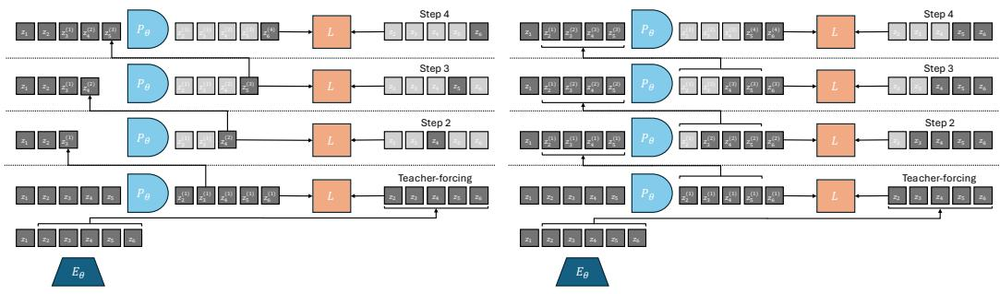

Figure S2.1: Two rollout strategies with any predictor network predicting the next timestep (frame) simultaneously for all timesteps. Predictor is used as an RNN by recursively feeding it a mix of its previous predictions and groundtruth embeddings. We vertically represent the "predictor unrolling step" dimension. For a predicted embedding $z _ { t } ^ { ( \bar { k } ) }$ , we denote the timestep it corresponds to as $t$ and its prediction order as $k$ . The embeddings that enter in the loss computation are in grey whereas those which do not are in light grey. Left: "Last-gradient-only" strategy. We sample a random groundtruth embedding prefix, $\left( z _ { 1 } , \ldots , z _ { t } \right)$ (in this figure $t = 2$ ), and concatenate only the latest prediction to the predictor context at the next unrolling step. Strategy used in V-JEPA-2-AC with a groundtruth embedding prefix always equal to $z _ { 1 }$ . Right: "All-gradients" strategy, we compute all available prediction tasks without redundancies, e.g. we exclude from loss computation prediction task that avreaybeelueosat reiusstes . $L ( z _ { t } ^ { ( \bar { t } - 1 ) } , z _ { t } )$ .

# C PLANNING ENVIRONMENTS AND DATASETS

At train time, we normalize the action and optional proprioceptive input by subtracting the empirical mean and dividing by the empirical standard deviation, which are computed on each dataset. At plaig e  m anddat ctns  heraliz  pa diyWe e the plan in the simulator, we thus denormalize the plan resulting from the optimization before stepping it in the environment. For comparability with V-JEPA-2-AC, we do not normalize actions for DROID. We stress that, in all environments considered, we are scarce in data, except for Push-T, where we have a bigger dataset, compared to the task complexity.

We summarize dataset statistics in Table S3.1. Each trajectory dataset is transformed into a dataset of trajectory slices, of length $W + 1$ for training.

Table S3.1: Datasets statistics. We denote the number of trajectories in the dataset under Dataset Size, the length of trajectories under Traj. Len.   

<table><tr><td colspan="2">Dataset Size</td><td>Traj. Len.</td></tr><tr><td>PointMaze</td><td>2000</td><td>100</td></tr><tr><td>Push-T</td><td>18500</td><td>100-300</td></tr><tr><td>Wall</td><td>1920</td><td>50</td></tr><tr><td>Metaworld</td><td>12600</td><td>100</td></tr><tr><td>DROID</td><td>8000</td><td>20-50</td></tr></table>

DROID. We use the same dataloader as in V-JEPA-2-AC, which defines actions as delta in measured robot positions. One could either feed all three available cameras of DROID (left, right, wrist) simultaneously (e.g. by concatenating them) or alternatively to the model. We choose to use only one view point as simultaneous input. For training, we find that allowing the batch sampler to sample from either the left or right camera allows for slightly lower validation loss than using only one of them.

For evaluation, we collected a set of 16 videos with our own DROID setup, positioning the camera to closely match the left camera setup from the original DROID dataset. These evaluation videos specifically focus on object interaction and arm navigation scenarios, allowing us to assess the model's performance on targeted manipulation tasks.

As discussed in Section 5.1, we define the Action Score as a rescaling of the opposite of the Action Error, namely $8 0 0 ( 0 . 1 - E )$ if $E < 0 . 1$ else 0, where $E$ is the Action Error. We display the Action Score in all figures discussed in Section 5.2.

Robocasa. Robocasa (Nasiriany et al., 2024) is a simulation framework, based on Robosuite (Zhu et al., 2020), with several robotic embodiments, including the Franka Panda Arm, which is the robot used in the DROID dataset. Robocasa features over 2,500 3D assets across $1 5 0 +$ object categories and numerous interactable furniture pieces. The framework includes 100 everyday tasks and provides both human demonstrations and automated trajectory generation to efficiently expand training data. It is licensed under the MIT License.

We evaluate DROID models on Robocasa. The already existing pick-and-place tasks require too long horizons to be solved by our current planning procedure. Hence, we need define custom easier pick-and-place task where the arm and target object start closer to the target position. To get a goal frame, we need to teleoperate a trajectory to obtain successful pick-and-place trajectories. We can then use the last frame of these trajectories as goal frame for planning. We needed to tune the camera view point to roughly correspond to the DROID left or right camera viewpoint, otherwise our models were not able to unroll well a sequence of actions. We also customize the gripper to use the same RobotiQ gripper as in DROID. We collect 16 such trajectories to form our evaluation set in the kitchen scene with various object classes. We define the "Reach" condition as having the end-effector at less than 0.2 (in simulator units, corresponding to roughly 5 cms in DROID) from the target object, the "Pick" condition as having lifted the object at more than 0.05 from its initial altitude, and the "Place" condition as having the object at less than 0.15 from the target position of the object. Our teleoperated trajectories all involve three segments, namely reaching the object (segment 1), picking it up (segment 2), and placing it at the target position (segment 3), delimited by these conditions. These three segments allow to define 6 subtasks, namely "Reach-Pick-Place", "Reach-Pick", "Pick-Place", "Reach", "Pick", and "Place". The success definition of each of these tasks is as follows:

Reach-Pick-Place": starting from the beginning of segment 1, success is 1 if the "Pick" and "Place" conditions are met.   
Reach-Pick starting from the beginning of segment 1, success is 1 if the "Pick" condition is met.   
Pick-Place": starting from the beginning of segment 2, success is 1 if the "Place" condition is met.   
Reach": starting from the beginning of segment 1, success is 1 if the "Reach" condition is met.   
"Pick": starting from the beginning of segment 2, success is 1 if the "Pick" condition is met.   
Place": starting from the beginning of segment 3, success is 1 if the "Place" condition is met.

We focus on the "Place" and "Reach" tasks. Our models have low success rate on the "Pick" task, as they slightly misestimate the position of the end-effector, which proves crucial, especially for small objects.

To allow for zero-shot transfer from DROID to Robocasa, we perform 5 times action repeat of the actions outputted by our DROID model, since we trained on DROID sampled at 4 fps and the control frequency of Robocasa is $2 0 \ : \mathrm { H z }$ . We also rescale the actions outputted by our planner to match the action magnitude of Robocasa, namely [-1, 1] for the delta position of the end-effector in cartesian space, and [0, 1] for the gripper closure.

Metaworld. The Metaworld (Yu et al., 2019) environment is licensed under the MIT License. The 42 Metaworld tasks we consider are listed in Table S3.2. We gather a Metaworld dataset via TDMPC2 online agents trained on the visual and full state (39-dimensional) input from the Metaworld environment, on 42 Metaworld tasks, listed in Table S3.2. We launch the training of each TD-MPC2 agent for three seeds per task. The re-initialization of the environment at each new training episode is therefore different, even within a given seed and task. This randomness governs the initial position of the arm and of the objects present in the scene, as well as the goal positions of the arm and potential objects. Each episode has length 100. We keep the first 100 episodes of each combination of seed and task, to limit the proportion of "expert" trajectories in the dataset, thus promoting data diversity. This results in 126 buffers, each of 100 episodes, hence 12600 episodes of length 100.

We introduce a planning evaluation procedure for each of the Metaworld tasks considered. These are long-horizon tasks that require to perform at least 60 actions to be solved, meaning it should be solvable if planning at horizon $H = \bar { 6 } 0 / f$ , if using frameskip $f$ . This allows us to explore the use of JEPA-WMs in a context where MPC is a necessity. At planning time, we reset the environment with a different for each episode, randomizing the initial position of the arm, of the objects present in the scene, as well as the goal positions of the arm and potential objects. We then play the expert policy provided in the open-source Metaworld package for 100 steps. The last frame (and optionally proprioception) of this episode is set as the goal $o _ { g }$ for the planning objective of equation 2. We then reset the environment again with the same random seed, and let the agent plan for 100 steps to reach the goal.

Push-T. In this environment introduced by (Chi et al., 2023) (MIT License), a pusher ball agent interacts with a T-shaped block. Success is achieved when both the agent and the T-block, which start from a randomly initialized state, reach a target position. For Push-T, the dataset provided in DINO-WM is made of 18500 samples, that are replays of the original released expert trajectories with various level of noise. At evaluation time, we sample an initial and goal state from the validation split, such that the initial attained the goal in $H$ steps, with $H$ the planning horizon. Indeed, otherwise, the task can require very long-horizon planning, and is not well solved with our planners.

PointMaze. In this environment introduced by (Fu et al., 2020) (Apache 2.0 license), a forceactuated 2-DoF ball in the Cartesian directions $x$ and $y$ must reach a target position. The agent's dynamics incorporate its velocity, aceleration, and inertia, making the movement realistic. The PointMaze train set is made of 2000 fully random trajectories. At evaluation time, we sample a random initial and goal state from the simulator's sampler.

Wall. This 2D navigation environment introduced in (Zhou et al., 2024a) (MIT License) features two rooms separated by a wall with a door. The agent's task is to navigate from a randomized starting location in one room to a goal in one of the two rooms, potentially passing through the door. The Wall dataset is made of 1920 random trajectories each with 50 time steps. At planning time, we also sample a random initial and goal state from the simulator's sampler.

Table S3.2: A list of all of the Meta-World tasks and a description of each task.   

<table><tr><td>Task</td><td>Description</td></tr><tr><td>turn on faucet</td><td>Rotate the faucet counter-clockwise. Randomize faucet positions</td></tr><tr><td>sweep</td><td>Sweep a puck off the table. Randomize puck positions</td></tr><tr><td>assemble nut</td><td>Pick up a nut and place it onto a peg. Randomize nut and peg positions</td></tr><tr><td>turn off faucet</td><td>Rotate the faucet clockwise. Randomize faucet positions</td></tr><tr><td>push</td><td>Push the puck to a goal. Randomize puck and goal positions</td></tr><tr><td>pull lever</td><td>Pull a lever down 90 degrees. Randomize lever positions</td></tr><tr><td>push with stick</td><td>Grasp a stick and push a box using the stick. Randomize stick positions.</td></tr><tr><td>get coffee</td><td>Push a button on the coffee machine. Randomize the position of the coffee machine</td></tr><tr><td>pull handle side</td><td>Pull a handle up sideways. Randomize the handle positions</td></tr><tr><td>pull with stick</td><td>Grasp a stick and pull a box with the stick. Randomize stick positions</td></tr><tr><td>disassemble nut</td><td>pick a nut out of the a peg. Randomize the nut positions</td></tr><tr><td>place onto shelf</td><td>pick and place a puck onto a shelf. Randomize puck and shelf positions</td></tr><tr><td>press handle side</td><td>Press a handle down sideways. Randomize the handle positions</td></tr><tr><td>hammer</td><td>Hammer a screw on the wall. Randomize the hammer and the screw positions</td></tr><tr><td>slide plate</td><td>Slide a plate into a cabinet. Randomize the plate and cabinet positions</td></tr><tr><td>slide plate side</td><td>Slide a plate into a cabinet sideways. Randomize the plate and cabinet positions</td></tr><tr><td>press button wall</td><td>Bypass a wall and press a button. Randomize the button positions</td></tr><tr><td>press handle</td><td>Press a handle down. Randomize the handle positions</td></tr><tr><td>pull handle</td><td>Pull a handle up. Randomize the handle positions</td></tr><tr><td>soccer</td><td>Kick a soccer into the goal. Randomize the soccer and goal positions</td></tr><tr><td>retrieve plate side</td><td>Get a plate from the cabinet sideways. Randomize plate and cabinet positions</td></tr><tr><td>retrieve plate</td><td>Get a plate from the cabinet. Randomize plate and cabinet positions</td></tr><tr><td>close drawer</td><td>Push and close a drawer. Randomize the drawer positions</td></tr><tr><td>press button top</td><td>Press a button from the top. Randomize button positions</td></tr><tr><td>reach</td><td>reach a goal position. Randomize the goal positions</td></tr><tr><td>press button top wall</td><td>Bypass a wall and press a button from the top. Randomize button positions</td></tr><tr><td>reach with wall</td><td>Bypass a wall and reach a goal. Randomize goal positions</td></tr><tr><td>insert peg side</td><td>Insert a peg sideways. Randomize peg and goal positions</td></tr><tr><td>pull</td><td>Pull a puck to a goal. Randomize puck and goal positions</td></tr><tr><td>push with wall</td><td>Bypass a wall and push a puck to a goal. Randomize puck and goal positions</td></tr><tr><td>pick out of hole</td><td>Pick up a puck from a hole. Randomize puck and goal positions</td></tr><tr><td>pick&amp;place w/ wall</td><td>Pick a puck, bypass a wall and place the puck. Randomize puck and goal positions</td></tr><tr><td>press button</td><td>Press a button. Randomize button positions</td></tr><tr><td>pick&amp;place</td><td>Pick and place a puck to a goal. Randomize puck and goal positions</td></tr><tr><td>unplug peg</td><td>Unplug a peg sideways. Randomize peg positions</td></tr><tr><td>close window</td><td>Push and close a window. Randomize window positions</td></tr><tr><td>open door</td><td>Open a door with a revolving joint. Randomize door positions</td></tr><tr><td>close door</td><td>Close a door with a revolving joint. Randomize door positions</td></tr><tr><td>open drawer</td><td>Open a drawer. Randomize drawer positions</td></tr><tr><td>close box</td><td>Grasp the cover and close the box with it. Randomize the cover and box positions</td></tr><tr><td>lock door</td><td>Lock the door by rotating the lock clockwise. Randomize door positions</td></tr><tr><td>pick bin</td><td>Grasp the puck from one bin and place it into another bin. Randomize puck positions</td></tr></table>

# D PLANNING OPTIMIZATION

In this section, we detail the optimization procedures for planning in our experiments. Given a modeling function $F _ { \phi , \theta }$ , a dissimilarity criterion $( L _ { v i s } + \alpha L _ { p r o p } )$ , an initial and goal observation pair $o _ { t } , o _ { g }$ , we remind we have the objective function $\bar { L } _ { \alpha } ^ { p } ( \stackrel { . } { o _ { t } } , a _ { t : t + H - 1 } , o _ { g } ) \stackrel { . } { = } ( L _ { v i s } +$ $\alpha L _ { p r o p } ) ( F _ { \phi , \theta } ( o _ { t } ^ { \smile } , a _ { t : t + H - 1 } ) , E _ { \phi , \theta } ( o _ { g } ) )$ .

Model Predictive Control. In Metaworld only we perform MPC, a procedure where replanning is allowed after executing a plan in the environment. We set the maximum number of actions that can be stepped in the environment to 100, which constitutes an episode. At each step of the episode where we plan, we use either the CEM or NG planner.

Cross-Entropy Method. The CEM optimisation algorithm proceeds as in Algorithm 1. In essence, we fit parameters of a time-dependent multivariate Gaussian with diagonal covariance.

# Algorithm 1 Cross-Entropy Method

1: $\mu ^ { 0 } \in \mathbb { R } ^ { H \times A }$ is zero and covariance matrix $\sigma ^ { 0 } \mathbf { I } \in \mathbb { R } ^ { ( H \times A ) ^ { 2 } }$ is theidentiyNber tion steps $J$ .   
2: for $j = 1$ to $J$ do   
3: Sample $N$ independent trajectories $( \{ a _ { t } , \dots , a _ { t + H - 1 } \} ) \sim { \mathcal { N } } ( \mu ^ { j } , ( \sigma ^ { j } ) ^ { 2 } \mathrm { I } )$   
4: For each of the $N$ trajectories, unroll predictor to predict the resulting trajectory, $\begin{array} { r l } { \hat { z } _ { i } } & { { } = } \end{array}$ $P _ { \theta } ( \hat { z } _ { i - 1 } , a _ { i - 1 } ) , \quad i = t + 1 , \ldots , t + H$ Computte cost $L _ { \alpha } ^ { p } \bigl ( o _ { t } , a _ { t : t + H - 1 } , o _ { g } \bigr )$ for each candidate trajectory.   
5: Select top $K$ action sequences with the lowest cost, denote them $( \{ a _ { t } , \dotsc , a _ { t + H - 1 } \} ) _ { 1 , \dotsc , K }$ . Update

$$
\mu ^ { j + 1 } = { \frac { 1 } { K } } \sum _ { k = 1 } ^ { K } ( \{ a _ { t } , \dots , a _ { t + H - 1 } \} ) _ { k }
$$

$$
\sigma ^ { j + 1 } = { \sqrt { \frac { 1 } { K - 1 } \sum _ { k = 1 } ^ { K } \left[ { \bigl ( } \{ a _ { t } , \dotsc , a _ { t + H - 1 } \} { \bigr ) } _ { k } - \mu ^ { j + 1 } { \bigr ] } ^ { 2 } \right. } }
$$

6Step the first $m$ actions of $\mu ^ { J }$ . where $m \leq H$ is a planning hyperparameter in the environment. If we are in MPC mode, the process then repeats at the next time step with the new context observation.

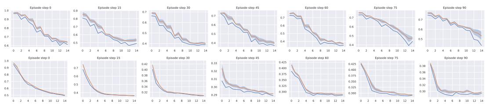  
Figure S4.1: Planning a 100-steps Metaworld episode with the base DINO-WM at the end of training of WM, for the same Metaworld environment episode seed, with our two planners. We display the average objective of the top $K$ imagined trajectories and its standard deviation (orange), and the best imagined trajectory's planning loss $L _ { \alpha } ^ { p }$ (blue. Bottom: Planning with CEM. Top: Plannig with NG. Failure episode for both: with NG the arms stays stuck against the wall, hence the higher planning objective, whereas with CEM this episode fails because of imprecision around the goal position.

NG Planner. We design a procedure to use any NeverGrad optimizer with our planning objective $L _ { \alpha } ^ { p } \bigl ( o _ { t } , a _ { t : t + H - 1 } , o _ { g } \bigr )$ , with the same number of action trajectories evaluated in parallel and total budget as CEM, as detailed in Algorithm 2. As discussed in Section 5.2, in all the evaluation setups we consider in this study, the NGOpt meta-optimizer always chooses the diagonal variant of the CMA-ES algorithm with a particular parameterization. The diagonal version of CMA is advised when the search space is big. We stress that after trying other parameterizations of the Diagonal CMA algorithm, like its elitist version (with a scale factor of 0.895 instead of 1, which is the default value), success rate can drop by $20 \%$ on Wall, Maze and Push-T.

Gradient Descent Planner. We also experiment with gradient-based planners that directly optimize the action sequence through backpropagation. Unlike sampling-based methods (CEM, NG), the planners leverage the differentiability of the world model to compute gradients of the planning objective $L _ { \alpha } ^ { p }$ with respect to actions. The Gradient Descent (GD) planner initializes actions either from a standard Gaussian (scaled by $\sigma _ { 0 }$ ) or from zero, then performs $J$ gradient descent steps with learning rate $\lambda$ .After each gradient step, Gaussian noise with standard deviation $\sigma _ { \mathrm { n o i s e } }$ is added to the actions to encourage exploration and help escape local minima. Action clipping is applied to enforce bounds on specific action dimensions. The default hyperparameters are $J = 5 0 0$ iterations, $\lambda = 1$ , $\sigma _ { 0 } = 1$ , and $\sigma _ { \mathrm { n o i s e } } = 0 . 0 0 3$ .

# Algorithm 2 NeverGrad planner

1: optimizer chosen by nevergrad.optimizers.NGOpt from budget $N \times J$ , on space $\mathbb { R } ^ { \overline { { H } } \times A }$ , with $N$ workrs.   
2: for $j = 1$ to $J$ do   
3: optimizer.ask() $N$ trajectories sequentially.   
4: For each of the $N$ trajectories, unroll predictor to predict the resulting trajectory, $\begin{array} { r l } { \hat { z } _ { i } } & { { } = } \end{array}$ $P _ { \theta } ( \widehat { z } _ { i - 1 } , a _ { i - 1 } ) , \quad i = t + 1 , \ldots , t + H$ Compute cost $L _ { \alpha } ^ { p } \bigl ( o _ { t } , a _ { t : t + H - 1 } , o _ { g } \bigr )$ for each candidate trajectory.   
5: optimizer.tell() the cost $L _ { \alpha } ^ { p } \bigl ( o _ { t } , a _ { t : t + H - 1 } , o _ { g } \bigr )$ of the $N$ trajectories sequentially.   
6:Step the first $m$ actions of optimizer.provide_recommendation (), where $m \leq H$ is a planning hyperparameter in the environment. If we are in MPC mode, the process then repeats at the next time step with the new context observation.

Adam Planner. The Adam planner extends the GD planner by using the Adam optimizer instead of vanilla stochastic gradient descent. Adam maintains exponential moving averages of the gradient (first moment) and squared gradient (second moment), which can provide more stable optimization dynamics. The default hyperparameters are $\beta _ { 1 } = 0 . 9$ , $\beta _ { 2 } = 0 . 9 9 5$ , $\bar { \epsilon } = 1 0 ^ { - 8 }$ , with the same defaults as GD for other parameters $J = 5 0 0$ , $\lambda = 1$ , $\sigma _ { 0 } = 1$ , $\sigma _ { \mathrm { n o i s e } } = 0 . 0 0 3 )$ .

Planning hyperparameters. We display in Table S4.1 the hyperparameters used to plan on each environment. We keep the planning hyperparameters of DINO-WM (Zhou et al., 2024a) for Push-T, Wall and Maze, but reduce the number of "top" actions, denoted $K$ , to 10 instead of 30. We obtain these parameters after careful grid search on DINO-WM. The success rate is very sensitive to these parameters, keeping the world model fixed.

Table S4.1: Environment-specific hyperparameters for planning, corresponding to the notations of Section D. The number of steps per planning episode is denoted $M$ and the frameskip is denoted $f$ . $H$ is the planning horizon, $m$ the number of actions to step in the environment, $K$ the number of top actions in CEM, $N$ the number of trajectories evaluated in parallel, $J$ the number of iterations of the optimizer. The total number of replanning steps for an evaluation episode is $\frac { M } { f m }$ -

<table><tr><td></td><td>N</td><td>H</td><td>m</td><td>K</td><td>J</td><td>W p</td><td>f</td><td>M</td></tr><tr><td>PointMaze</td><td>300</td><td>6</td><td>6</td><td>10</td><td>30</td><td>2</td><td>5</td><td>30</td></tr><tr><td>Push-T</td><td>300</td><td>6</td><td>6</td><td>10</td><td>30</td><td>2</td><td>5</td><td>30</td></tr><tr><td>Wall</td><td>300</td><td>6</td><td>6</td><td>10</td><td>30</td><td>2</td><td>5</td><td>30</td></tr><tr><td>Metaworld</td><td>300</td><td>6</td><td>3</td><td>10</td><td>15</td><td>2</td><td>5</td><td>100</td></tr><tr><td>Robocasa</td><td>300</td><td>3</td><td>1</td><td>10</td><td>15</td><td>2</td><td>5</td><td>60</td></tr><tr><td>DROID</td><td>300</td><td>3</td><td>3</td><td>10</td><td>15</td><td>2</td><td>1</td><td>m</td></tr></table>

# E ADDITIONAL EXPERIMENTS

E.1 ADDITIONAL RESULTS

Equalized action ratio experiments. To isolate the effect of the conditioning scheme from capacity differences due to action ratio, we train new models for each of the considered environments where we downscale the image resolution to $1 2 8 \times 1 2 8$ with a DINOv3-L encoder (patch size 16), yielding $8 \times 8 = 6 4$ visual patches. This produces matched action ratios: sequence conditioning achieves $1 / ( h w + 1 ) = 1 / 6 5$ , while feature conditioning achieves ${ f _ { a } } / ( D + { f _ { a } } ) = 1 6 / 1 0 4 0$ Both variants use the same predictor architecture, RoPE positional encoding, frozen encoder, and training data.

Results reveal task-dependent preferences: Sequence conditioning outperforms feature conditioning on DROID, Robocasa, and Metaworld (3D manipulation tasks). Conversely, feature conditioning significantly outperforms on Wall (2D navigation). Performance is comparable on Maze and Push-T. Notably, the Wall result replicates the trend from Figure 6 (different resolution/model size), confirming statistical robustness.

We cannot provide a precise explanation of the underlying mechanism explaining why we observe such differences. What we can say for sure is that, despite matched action ratios, the conditioning schemes differ fundamentally in how action information propagates:

Feature conditioning: Action embeddings are concatenated to each visual token. At the first transformer block, action-visual mixing occurs only within the MLP (after self-attention), which combines information across embedding dimensions but processes each spatial token separately. Sequence conditioning: The action token participates in self-attention from the first block, allowing immediate broadcasting to all visual tokens through attention mechanisms.

Observations on Wall task: Training and validation rollout losses are identical between methods, indicating both models predict dynamics equally well. However, during planning, sequenceconditioned models occasionally select very high magnitude actions, while feature-conditioned models consistently choose moderate actions. This suggests the conditioning scheme affects not only prediction but also the structure of the learned latent dynamics relevant for planning.

We hypothesize that for spatially simple tasks (Wall), feature conditioning's direct action-to-token pathway yields dynamics better suited for planning optimization, while sequence conditioning's attention-based routing is more beneficial for complex spatial reasoning in manipulation. However, further analysis would be needed to conclusively establish this mechanism.

Additional planner ablations. In Table S5.1, we compare the performance of our model to the DINO-WM and VJEPA-2-AC baselines across all planner configurations tested in Figure 3. Our optimal JEPA-WM consistently outperforms the baselines on most tasks and planners, as in Table 1.

In Figure S5.2 (Left), we display Figure 3 again for completeness, along with Figure S5.2 (Right), where we compare the performance of all planners on all environments but with proprioception. We adopt the default configuration described in the beginning of Section 4, namely DINO-WM ViTS but with proprioception. We can draw the same conclusions as for without proprioception, in Figure 3.

Let us detail the failure cases of the GD planner. On the Wall task, the GD planner gets zero performance, although the task is visually simplistic. We identify two main failure cases. Either the agent goes into the wall without being able to pass the door, which is a classical failure case for better CEM or NG planners. Or the agent finds a local planning cost minimum by going to the borders of the image, when starting close to them. We illustrate both of these in Figure S5.1.

Object manipulation on Robocasa and DROID. We show in Figure S5.4 a successful planning episode with our proposed JEPA-WM on Robocasa on the "Place" task. Our model is able to perform the "Place" task but has a much lower success rate at the "Pick" task, as it misestimates the position of the arm. We illustrate the shift in camera calibration / action calibration in Figure S5.3 on the "Reach" task. On all episodes, the model always predicts a state shifted to the left compared to the ground-truth. This phenomenon is less clear on DROID, as we illustrate in Figure S5.5.

Table S5.1: Comparison of different models across all planner configurations. MW-R and MW-RW denote the Reach and Reach-Wall tasks of Metaworld. Rc-Pl and Rc-R denote the Place and Reach tasks of Robocasa. In bold is the best of the three models for a given planning optimizer, underlined is the best across all planning optimizers.   

<table><tr><td>Model</td><td>Planner</td><td>Maze</td><td>Wall</td><td>Push-T</td><td>MW-R</td><td>MW-RW</td><td>Rc-R</td><td>Rc-Pl</td><td>DROID</td></tr><tr><td>CEM L2</td><td>DWM</td><td>81.6 (3.4)</td><td>64.1 (4.6)</td><td>66.0 (4.7)</td><td>44.8 (8.9)</td><td>35.1 (9.4)</td><td>19.1 (13.4)</td><td>21.7 (7.2)</td><td>39.4 (2.1)</td></tr><tr><td></td><td>VJ2AC Ours</td><td>83.9 (2.3)</td><td>78.8 (3.9)</td><td>70.2 (2.8)</td><td>58.2 (9.3)</td><td>41.6 (10.0)</td><td>16.2 (8.3) 25.4 (16.6)</td><td>33.1 (7.2) 30.7 (8.0)</td><td>42.9 (2.5) 48.2 (1.8)</td></tr><tr><td>CEM L1</td><td>DWM</td><td></td><td></td><td></td><td></td><td></td><td></td><td></td><td></td></tr><tr><td></td><td>VJ2AC</td><td>78.8 (2.9)</td><td>48.7 (4.0)</td><td>61.6 (4.5)</td><td>45.1 (10.4)</td><td>34.0 (9.1)</td><td>14.4 (11.3) 13.2 (10.3)</td><td>19.6 (7.4) 30.9 (7.3)</td><td>41.7 (2.7) 38.5 (5.7)</td></tr><tr><td></td><td>Ours</td><td>79.7 (3.1)</td><td>46.7 (3.6)</td><td>63.4 (2.1)</td><td>55.1 (8.5)</td><td>40.8 (9.2)</td><td>17.6 (12.3)</td><td>30.5 (8.7)</td><td>47.2 (1.8)</td></tr><tr><td></td><td></td><td></td><td></td><td></td><td></td><td></td><td></td><td></td><td></td></tr><tr><td>NG L2</td><td>DWM</td><td>54.2 (3.8)</td><td>25.3 (4.2)</td><td>47.6 (5.4)</td><td>28.1 (7.8)</td><td>27.9 (10.0)</td><td>25.8 (16.7)</td><td>27.1 (8.6)</td><td>36.0 (3.6)</td></tr><tr><td></td><td>VJ2AC</td><td>72.7 (4.5)</td><td>35.4 (5.9)</td><td>48.0 (3.0)</td><td>29.3 (8.6)</td><td>21.0 (7.7)</td><td>22.1 (8.9) 30.5 (10.7)</td><td>31.1 (7.0) 36.9 (9.1)</td><td>36.2 (3.2) 39.9 (1.9)</td></tr><tr><td></td><td>Ours</td><td></td><td></td><td></td><td></td><td></td><td></td><td></td><td></td></tr><tr><td>NG L1</td><td>DWM</td><td>52.3 (4.0)</td><td>24.6 (5.2)</td><td>46.2 (5.1)</td><td>27.5 (8.5)</td><td>28.6 (8.9)</td><td>21.6 (15.5)</td><td>26.0 (8.0)</td><td>35.4 (3.3)</td></tr><tr><td></td><td>VJ2AC</td><td></td><td></td><td></td><td></td><td></td><td>18.4 (11.8)</td><td>29.4 (5.1)</td><td>33.7 (3.9)</td></tr><tr><td></td><td>Ours</td><td>69.5 (2.1)</td><td>30.9 (4.1)</td><td>48.2 (5.1)</td><td>27.8 (8.2)</td><td>21.3 (8.9)</td><td>25.7 (12.0)</td><td>32.0 (9.9)</td><td>40.0 (2.2)</td></tr><tr><td>Adam L2</td><td>DWM</td><td>14.8 (1.5)</td><td>0.1 (0.3)</td><td>8.0 (2.4)</td><td>62.0 (8.3)</td><td>49.9 (9.9)</td><td>2.8 (3.7)</td><td>21.5 (8.6)</td><td>0.0 (0.0)</td></tr><tr><td></td><td>VJ2AC</td><td></td><td></td><td></td><td></td><td></td><td>0.0 (0.0)</td><td>5.9 (5.1)</td><td>0.0 0.0)</td></tr><tr><td></td><td>Ours</td><td>17.7 (3.3)</td><td>1.1 (1.1)</td><td>9.0 (2.1)</td><td>55.3 (9.9)</td><td>39.7 (9.7)</td><td>0.0 (0.0)</td><td>10.5 (5.0)</td><td>0.0 (0.0)</td></tr><tr><td>Adam L1</td><td>DWM</td><td>12.6 (2.8)</td><td>0.1 (0.3)</td><td>2.1 (1.5)</td><td>50.7 (8.5)</td><td>37.2 (8.3)</td><td>0.9 (1.4)</td><td>22.1 (7.5)</td><td>0.0 (0.0)</td></tr><tr><td></td><td>VJ2AC</td><td></td><td></td><td></td><td></td><td></td><td>0.0 (0.0)</td><td>3.5 (2.8)</td><td>0.0 (0.0)</td></tr><tr><td></td><td>Ours</td><td>16.1 (3.5)</td><td>0.0 (0.2)</td><td>0.9 (0.9)</td><td>53.2 (7.4)</td><td>43.1 (6.4)</td><td>0.2 (0.7)</td><td>7.5 (3.9)</td><td>0.0 (0.0)</td></tr><tr><td>GD L2</td><td>DWM</td><td>14.5 (1.9)</td><td>0.1 (0.3)</td><td>8.1 (2.4)</td><td>62.2 (8.2)</td><td>50.0 (10.1)</td><td>2.9 (3.8)</td><td>21.9 (8.4)</td><td>0.0 (0.0)</td></tr><tr><td></td><td>VJ2AC</td><td></td><td></td><td></td><td></td><td></td><td>0.0 (0.0)</td><td>8.1 (3.6)</td><td>0.0 (0.0)</td></tr><tr><td></td><td>Ours</td><td>17.7 (3.3)</td><td>1.1 (1.1)</td><td>9.1 (1.9)</td><td>55.3 (9.9)</td><td>39.7 (9.7)</td><td>0.0 (0.0)</td><td>10.5 (5.0)</td><td>0.0 (0.0)</td></tr><tr><td>GD L1</td><td>DWM</td><td>12.4 (2.6)</td><td>0.1 (0.3)</td><td>2.0 (1.3)</td><td>50.9 (8.5)</td><td>37.1 (8.4)</td><td>1.0 (1.4)</td><td>22.2 (7.3)</td><td>0.0 (0.0)</td></tr><tr><td></td><td>VJ2AC</td><td></td><td></td><td></td><td></td><td></td><td>0.0 (0.0)</td><td>4.0 (2.6)</td><td>0.0 (0.0)</td></tr><tr><td></td><td>Ours</td><td>16.1 (3.5)</td><td>0.0 (0.2)</td><td>0.9 (0.9)</td><td>53.3 (7.3)</td><td>40.1 (12.3)</td><td>0.2 (0.7)</td><td>7.5 (3.9)</td><td>0.0(0.0)</td></tr></table>

Object manipulation on Metaworld. Our agent solves the pose control tasks like reach and reach-wall. In addition, long-term action unrolling with object interaction seems to be well-captured by our models, as shown in Figure S5.6 for the bin-picking task. Yet, for tasks involving object manipulation, it hallucinates grasping the object. In Figure S5.7, the visual decoding of the unrolling of the action plan shows a gap between the imagined consequences of the actions and their consequences in the simulator. This calls for a separate optimization procedure for the action dimension that corresponds to the end-effector's gripper.

Action precision Push-T. The results in Figure S5.12 clearly show that CEM performs better than NG for the Push-T task. The Push-T task requires very precise actions, since if the ballis slightly off the position where it should be to push the T-shape, it misses the shape and fails at the task. Hence it proves essential to only step actions after convergence of the planner. Yet, we see in Figure S5.8 that the NG planner is more explorative and should therefore be parametrized differently for this type of task. Interestingly, the larger model converges faster and brings higher maximal success rate on this task.

Embedding space and model size. We see in Figure S5.9 that the relative difference in embedding space distance to the goal is approximately ten times smaller in the ViT-L model than in the ViT-S model. This is consistent with the fact that the ViT-L model has a higher capacity and can therefore embed more information in its latent space, in which two states of Metaworld are closer to each other than in the ViT-S model embedding space.

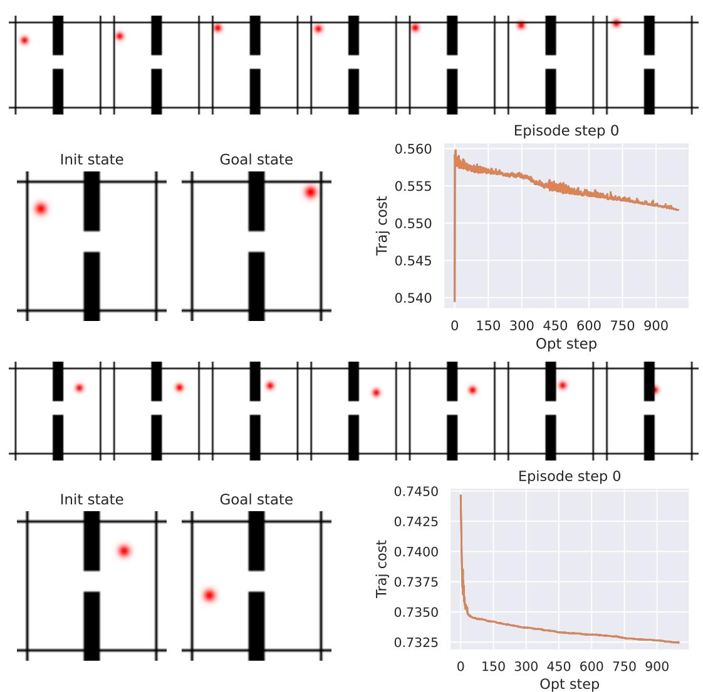  
Figure S5.1: Two typical failure cases with the Gradient-Descent (GD) planner on the Walltask. For each failure case, we show: (top) the planned trajectory visualization, (bottom left) initial and goal states, (bottom right) planning cost evolution throughout gradient descent iterations. First failure case (top 3 subfigures): the agent finds a local planning cost minimum by going to the borders of the image when starting close to them. Second failure case (bottom 3 subfigures): the agent goes into the wall without being able to pass the door.

# E.2 EvALuatIoN MeTRicS

The metric we seek to optimize for planning tasks is the success rate, which can be noisy, highly dependent on the initial seed, and sparse at the beginning of training. We therefore derive several other useful metrics and study their correlation with the success rate.

Embedding space error throughout unrolling. Throughout training, every 300 training iterations, we roll the predicor o  batch  the valiation  r $n$ steps. For each of these steps, we compute the $L _ { 1 }$ and $L _ { 2 }$ loss between the predicted embedding and the embedding of the ground truth corresponding future frame. The $L _ { 2 }$ loss at step 1 is the teacher-forcing loss term $\mathcal { L }$ .

Proprioceptive decoding error throughout unrolling. Prior to training of the predictors, we train a small ViT probe, called "state decoder" on top of the frozen encoder to regress the state, i.. proprioception and optionally other simulator state information. Then, when training the predictors we study in this paper, every 300 training iterations, we unroll the predictor for $n$ steps on a batch of the validation split and use our state decoder on the predicted features. This yields $n$ state predictions, of which we compute the distance to the ground truth future $n$ states.

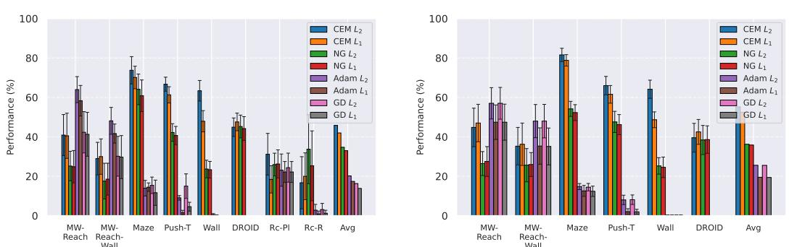  
Figure S5.2: Comparison of planning optimizers. NG is the Nevergrad-based interface for trajectory optimization that we introduce, CEM is the Cross-Entropy Method, and GD is the Gradient Descent Planner with $L _ { 1 }$ or $L _ { 2 }$ distance. Left: comparison of the GD, CEM and NG planners on DINOWM without proprioception. Right: comparison of CEM and NG planners on DINO-WM with proprioception.

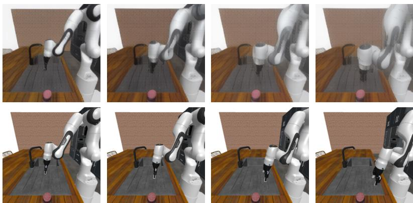  
Figure S5.3: Planning at horizon 3 with our proposed JEPA-WM on Robocasa, with our best model presented in Section 5.3. The model is trained on DROID and evaluated zero-shot on Robocasa on the "Reach" task, where the goal is to reach the object. Top: the model's visual decoding of the action plan. Bottom: the ground-truth action stepping in simulator. The model predicts a state shifted to the left compared to the ground-truth.

Visual decoder. Just like the state decoder, we train a visual decoder to reconstruct, from the embeddings outputted by the frozen encoder, the associated frames. We decode each frame independently to avoid artificial consistency across frames, as the decoder is a probing tool. Indeed, in models like COSMOS (Agarwal et al., 2025), the powerful diffusion decoder accounts for beautiful visualisations, although the underlying latent world model might not be as accurate. Every 300 training iterations, we unroll the predictor on a given sequence of actions, and compare the decoding of the predicted embeddings to the ground truth future frames, both qualitatively and with the LPIPS metric (Zhang et al., 2018).

Action error. To evaluate models without having to step actions in a real robot or a simulator, we compare the actions outputted by the planner and the groundtruth actions of the trajectory sampled from the dataset to define initial and goal state. On DROID, throughout training, the total action error increases, and even more if we do not clip the actions magnitude in the planner, as done in VJEPA-2-AC, since we do not normalize the actions. This is because most of the action error comes from the gripper closure and gripper orientation action dims, as detailed in Figure S5.10. Hence, on DROID, we track the action error on the three first dimensions, corresponding to the end-effector position control, which is more relevant for the tasks we consider.

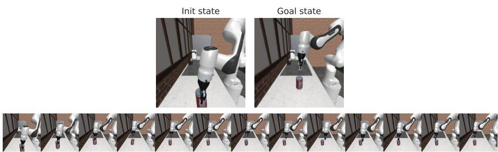  
Figure S5.4: Planning episode with our proposed JEPA-WM on Robocasa, with DINOv2 ViT-S encoder, 2-step rollout, AdaLN predictor. The model is trained on DROID and evaluated zero-shot on Robocasa on the 'place' task. The planning cost is the embedding space distance to the goal frame embedding.

# E.3 Is THERE A PROXY FOR SUCCESS RATE?

Evaluating several independent planning recipes is compute-intensive, even more so as the model size increases, as well as the planning budget $N \times H \times J \times W ^ { p }$ , see Table S4.1. Hence, we look for validation metrics to track throughout the training that correlate well with the success rate. Each epoch of each model and evaluation setup (among four) is a data point with a value for a validation metric and an associated success rate. Considering each epoch as an independent sample allows us to compute the Spearman correlation between each quantitative metric and the success rate. The results in Table S5.2, Table S5.5, Table S5.3 and Table S5.4 first show that the correlation with training loss (Vis emb) is higher for the easier Wall task. Since we want to find the metric that correlates most to the success rate, we average the Spearman correlations instead of computing them on the union of data points, to avoid Simpson's paradox. This yields the rightmost column of each table. In both environments, the metric most correlated with the success rate is the planning objective, that is, the Vis Emb loss. Interestingly, only in Metaworld, which requires better long-horizon unrolling capability, do the unroll metrics at step $H > 1$ correlate better than step-1 metrics.

Since we are essentially in a supervised learning setting, training a regressor of future embeddings, it is clear that lower validation prediction losses (at all unrolling steps) means a more accurate world mode.Thi is be serve hevisual dcding  valiatonrollouts hrouhou a

Why the success rate does not correlate well to these losses is due to several factors. The validation prediction task is not fully aligned with the goal-conditioned planning task. The planning optimization task we use to evaluate models is a heuristic, where the objective is to minimize the embedding space distance of the last imagined state to the goal.

As we see in DROID experiments Figure S5.10, letting the planner sample actions that are OOD for the predictor can severely harm the plan accuracy and occult the improvement of the predictor throout tainoecavet  tha  bter wormoel that des ot pren e pl procedure from getting stuck in local cost minima, as we see with the score obtained with gradientbased planners in Table S5.1.

Table S5.2: Negative Spearman Correlation Coefficients between smoothed success rate and several validation metrics on Metaworld. In bold is highest value, underlined is 2nd highest. We denote the visual embedding prediction errors Vis Emb and the proprioceptive decoding error Proprio dec, at horizons $H$ from one to three. We display the mean success rate over the last 10 epochs averaged over the four eval setups in the last row.   

<table><tr><td>Model name</td><td>WM</td><td>WMw</td><td>WM-prop</td><td>WM-2-step</td><td>WM-L</td><td>Mean</td></tr><tr><td>Proprio dec H = 1</td><td>0.40</td><td>0.44</td><td>0.40</td><td>0.26</td><td>0.20</td><td>0.34</td></tr><tr><td>Proprio dec H = 2</td><td>0.41</td><td>0.34</td><td>0.45</td><td>0.27</td><td>0.21</td><td>0.34</td></tr><tr><td>Proprio dec H = 3</td><td>0.38</td><td>0.44</td><td>0.40</td><td>0.33</td><td>0.18</td><td>0.35</td></tr><tr><td>Vis emb L2 H = 1</td><td>0.44</td><td>0.51</td><td>0.62</td><td>0.39</td><td>0.23</td><td>0.44</td></tr><tr><td>Vis emb L2 H = 2</td><td>0.42</td><td>0.46</td><td>0.62</td><td>0.39</td><td>0.24</td><td>0.42</td></tr><tr><td>Vis emb L2 H = 3</td><td>0.36</td><td>0.44</td><td>0.59</td><td>0.37</td><td>0.20</td><td>0.39</td></tr><tr><td>Vis emb L1 H = 1</td><td>0.45</td><td>0.55</td><td>0.69</td><td>0.41</td><td>0.24</td><td>0.47</td></tr><tr><td>Vis emb L1 H = 2</td><td>0.45</td><td>0.52</td><td>0.72</td><td>0.43</td><td>0.25</td><td>0.47</td></tr><tr><td>Vis emb L1 H = 3</td><td>0.42</td><td>0.52</td><td>0.72</td><td>0.42</td><td>0.22</td><td>0.46</td></tr><tr><td>SR</td><td>29.7 ±3.8</td><td>24.9 ±7.6</td><td>39.2 ±4.1</td><td>28.7 ±5.8</td><td>19.4 ±5.8</td><td></td></tr></table>

Table S5.3: Negative Spearman Correlation Coefficients across data points of the four eval setups between smoothed success rate and several validation metrics on the Push-T task. The rightmost mean column is the average of Spearman correlation of each model.In bold is highest value, underlined is 2nd highest. We display the mean success rate over the last 10 epochs in the last row.   

<table><tr><td>Model name</td><td>WM</td><td>WMw</td><td>WM-prop</td><td>WM-2-step</td><td>WM-L</td><td>Mean</td></tr><tr><td>Proprio dec H = 1</td><td>0.70</td><td>0.73</td><td>0.85</td><td>0.71</td><td>0.81</td><td>0.76</td></tr><tr><td>Proprio dec H = 2</td><td>0.78</td><td>0.66</td><td>0.87</td><td>0.79</td><td>0.84</td><td>0.79</td></tr><tr><td>Proprio dec H = 3</td><td>0.76</td><td>0.70</td><td>0.78</td><td>0.83</td><td>0.86</td><td>0.79</td></tr><tr><td>Vis emb L2 H = 1</td><td>0.80</td><td>0.73</td><td>0.88</td><td>0.82</td><td>0.87</td><td>0.82</td></tr><tr><td>Vis emb L2 H = 2</td><td>0.85</td><td>0.76</td><td>0.91</td><td>0.84</td><td>0.87</td><td>0.85</td></tr><tr><td>Vis emb L2 2H = 3</td><td>0.86</td><td>0.70</td><td>0.89</td><td>0.80</td><td>0.87</td><td>0.82</td></tr><tr><td>Vis emb L1 H = 1</td><td>0.87</td><td>0.79</td><td>0.92</td><td>0.83</td><td>0.90</td><td>0.86</td></tr><tr><td>Vis emb L1 H = 2</td><td>0.88</td><td>0.78</td><td>0.93</td><td>0.84</td><td>0.88</td><td>0.86</td></tr><tr><td>Vis emb L1 H = 3</td><td>0.87</td><td>0.75</td><td>0.91</td><td>0.83</td><td>0.87</td><td>0.85</td></tr></table>

# E.4 SUCCESS OVER EPOCHS

We display in Figure S5.11 and Figure S5.12 the evolution of success rate over training epochs for some of the models that compose the design choice study of this paper.

Table S5.4: Negative Spearman Correlation Coefficients across data points of the eight eval setups between smoothed success rate and several validation metrics on the Wall task. In bold is highest value, underlined is 2nd highest. We denote the visual embedding prediction errors Vis Emb and the proprioceptive decoding error Proprio dec, at horizons $H$ from one to three.   

<table><tr><td>Model name</td><td>WM</td><td>WMw</td><td>WM-prop</td><td>WM-2-step</td><td>WM-3-step</td><td>WM-L</td><td>Mean</td></tr><tr><td>Proprio dec H = 1</td><td>0.25</td><td>0.38</td><td>0.19</td><td>0.23</td><td>0.26</td><td>0.16</td><td>0.25</td></tr><tr><td>Proprio dec H = 2</td><td>0.23</td><td>0.51</td><td>0.22</td><td>0.30</td><td>0.14</td><td>0.28</td><td>0.28</td></tr><tr><td>Proprio dec H = 3</td><td>0.22</td><td>0.49</td><td>0.39</td><td>0.26</td><td>0.34</td><td>0.23</td><td>0.32</td></tr><tr><td>Vis emb L2 H = 1</td><td>0.72</td><td>0.94</td><td>0.74</td><td>0.73</td><td>0.69</td><td>0.75</td><td>0.76</td></tr><tr><td>Vis emb L2 H = 2</td><td>0.69</td><td>0.94</td><td>0.69</td><td>0.70</td><td>0.61</td><td>0.74</td><td>0.73</td></tr><tr><td>Vis emb L2 H = 3</td><td>0.68</td><td>0.94</td><td>0.65</td><td>0.69</td><td>0.56</td><td>0.70</td><td>0.70</td></tr><tr><td>Vis emb L1 H = 1</td><td>0.78</td><td>0.96</td><td>0.81</td><td>0.77</td><td>0.73</td><td>0.80</td><td>0.81</td></tr><tr><td>Vis emb L1 H = 2</td><td>0.74</td><td>0.96</td><td>0.76</td><td>0.72</td><td>0.69</td><td>0.79</td><td>0.78</td></tr><tr><td>Vis emb L1 H = 3</td><td>0.73</td><td>0.96</td><td>0.73</td><td>0.72</td><td>0.64</td><td>0.75</td><td>0.75</td></tr></table>

Table S5.5: Negative Spearman Correlation Coefficients across data points of the eight eval setups between smoothed success rate and several validation metrics on the Point Maze environment. The rightmost mean column is the average of Spearman correlation of each model. In bold is highest value, underlined is 2nd highest.   

<table><tr><td>Model name</td><td>WM</td><td>WMw</td><td>WM-prop</td><td>WM-2-step</td><td>WM-3-step</td><td>WM-L</td><td>Mean</td></tr><tr><td>Proprio dec H = 1</td><td>0.15</td><td>0.19</td><td>0.15</td><td>0.14</td><td>0.25</td><td>0.09</td><td>0.16</td></tr><tr><td>Proprio dec H = 2</td><td>0.13</td><td>0.21</td><td>0.10</td><td>0.35</td><td>0.23</td><td>0.21</td><td>0.21</td></tr><tr><td>Proprio dec H = 3</td><td>0.10</td><td>0.34</td><td>0.25</td><td>0.10</td><td>0.27</td><td>0.10</td><td>0.19</td></tr><tr><td>Vis emb L2 H = 1</td><td>0.43</td><td>0.50</td><td>0.82</td><td>0.53</td><td>0.42</td><td>0.19</td><td>0.48</td></tr><tr><td>Vis emb L2 H = 2</td><td>0.23</td><td>0.24</td><td>0.74</td><td>0.50</td><td>0.53</td><td>0.03</td><td>0.38</td></tr><tr><td>Vis emb L2 H = 3</td><td>0.21</td><td>0.30</td><td>0.67</td><td>0.46</td><td>0.49</td><td>0.17</td><td>0.38</td></tr><tr><td>Vis emb L1 H = 1</td><td>0.58</td><td>0.68</td><td>0.86</td><td>0.54</td><td>0.38</td><td>0.36</td><td>0.57</td></tr><tr><td>Vis emb L1 H = 2</td><td>0.37</td><td>0.49</td><td>0.78</td><td>0.55</td><td>0.50</td><td>0.19</td><td>0.48</td></tr><tr><td>Vis emb L1 H = 3</td><td>0.29</td><td>0.38</td><td>0.74</td><td>0.51</td><td>0.50</td><td>0.29</td><td>0.45</td></tr></table>

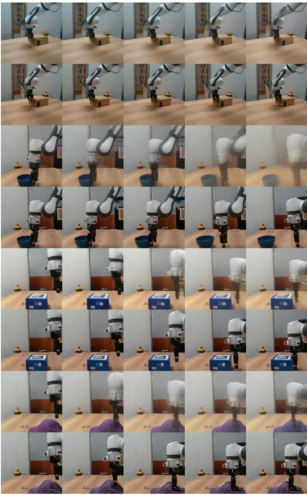  
Figure S5.5: Unrolling a trajectory with our proposed JEPA-WM on some of our collected Franka arm trajectories, with our best model presented in Section 5.3. For each pair of rows, the top one is the model's visual decoding of the action unrolling, the bottom one is the ground-truth trajectory of the dataset. The model sometimes does not grasp wel interaction with objects, which is the most frequent failure case.

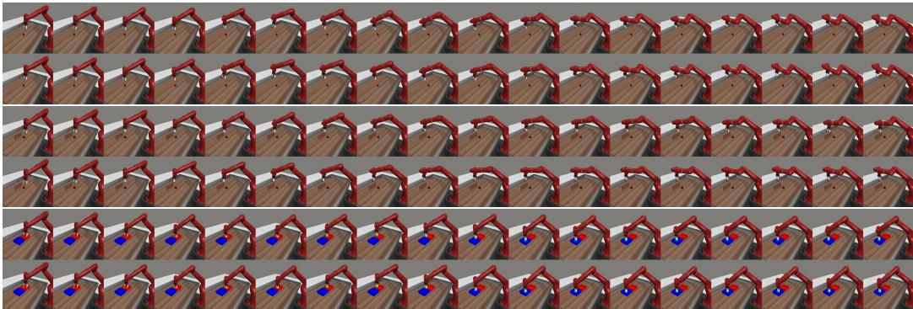  
Figure S5.6: Samples of DINO-WM open-loop rollouts on the validation split, each on 18 model actions corresponding to 90 elementary actions in simulator. For each of the three pairs of rows, the groundtruth action stepping in simulator is below the decoding of the predictor rollout.

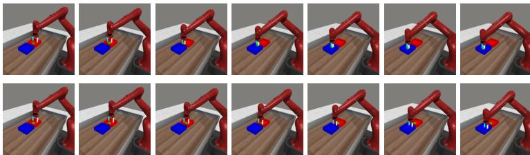  
Figure S5.7: Upper row: Visual decoding of the unrolling of the action plan outputted by the NG planner, at step 1 of the Metaworld episode, on the bin-picking task. The world model's predictions resulting from the plan indicate that the object is picked. Lower row: Stepping of half of the plan in the simulator. The object is not picked and the plan leads the robotic arm to the target location without the object.

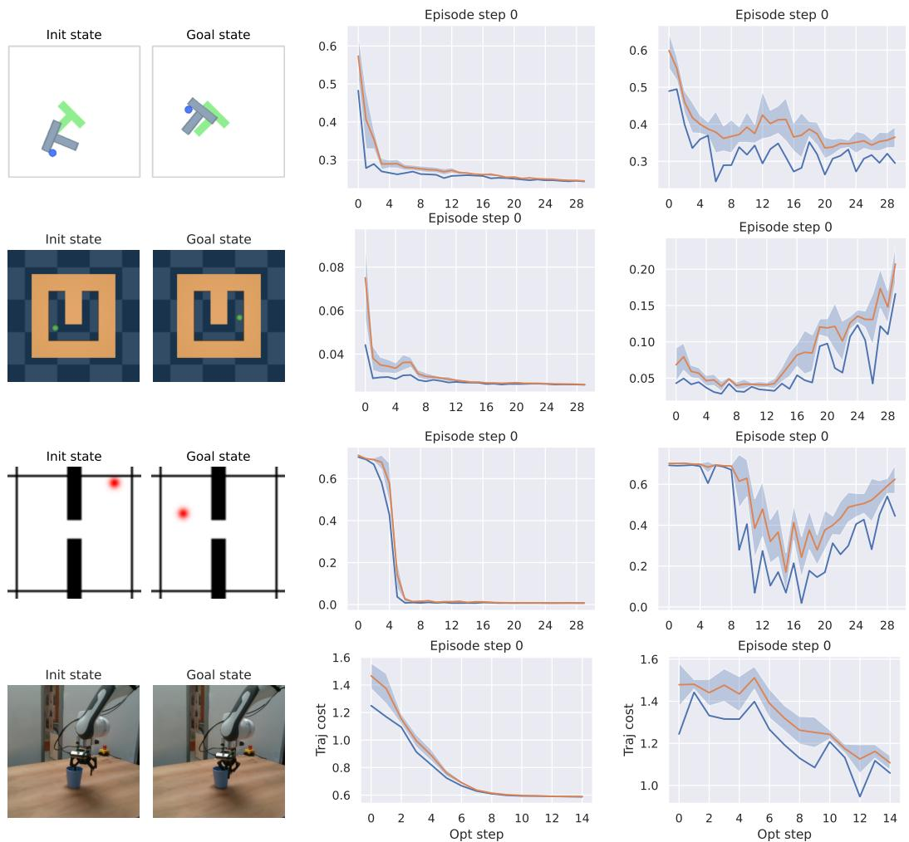  
Figure S5.8: Convergence of planning optimization for all 2D environments and DROID. The model evaluated is the base WM model, at the end of training. Left: episode initial and goal state. Center: CEM planner. Right: NG planner. We display the planning cost of the best trajectory throughout the optimization steps.

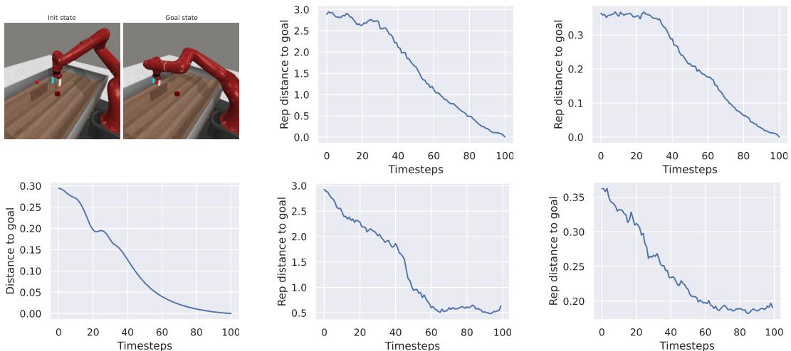  
Figure S5.9: Same Metaworld reach-wall task setup: trajectory of the Base model (bottom center), the Large model (bottom right) and the expert policy (all other subfigures). Left: expert's executed episode first and last state at top, expert's distance of arm to goal position in the simulator space at bottom. Center: WM ViT-S encoder embedding space $L _ { 2 }$ distance to goal, expert trajectory on top, WM planned episode at bottom. Right: WM-L encoder embedding space, expert trajectory on top, WM planned episode at bottom.

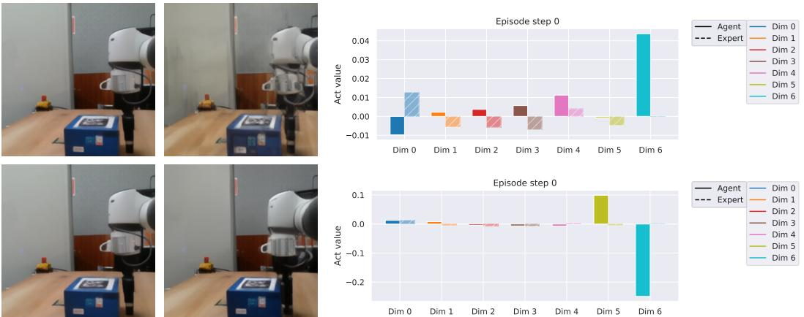  
Figure S5.10: Top row: model at the end of the first training epoch. Bottom row: model at the end of training. Left: visual decoding of the horizon 1 plan. Right: comparison of the actions outputted by the planner (blue) and the groundtruth actions (orange) for the 7 action dimensions. The first three dimensions correspond to end-effector position control, the three next to end-effector orientation control, the last one to the gripper closure. The action error mostly comes from the gripper and orientation control dimensions. Hence, although only the model at the end of training correctly plans to approach the gripper from the box, its total action error is higher than at the beginning of training, if we consider all 7 dimensions.

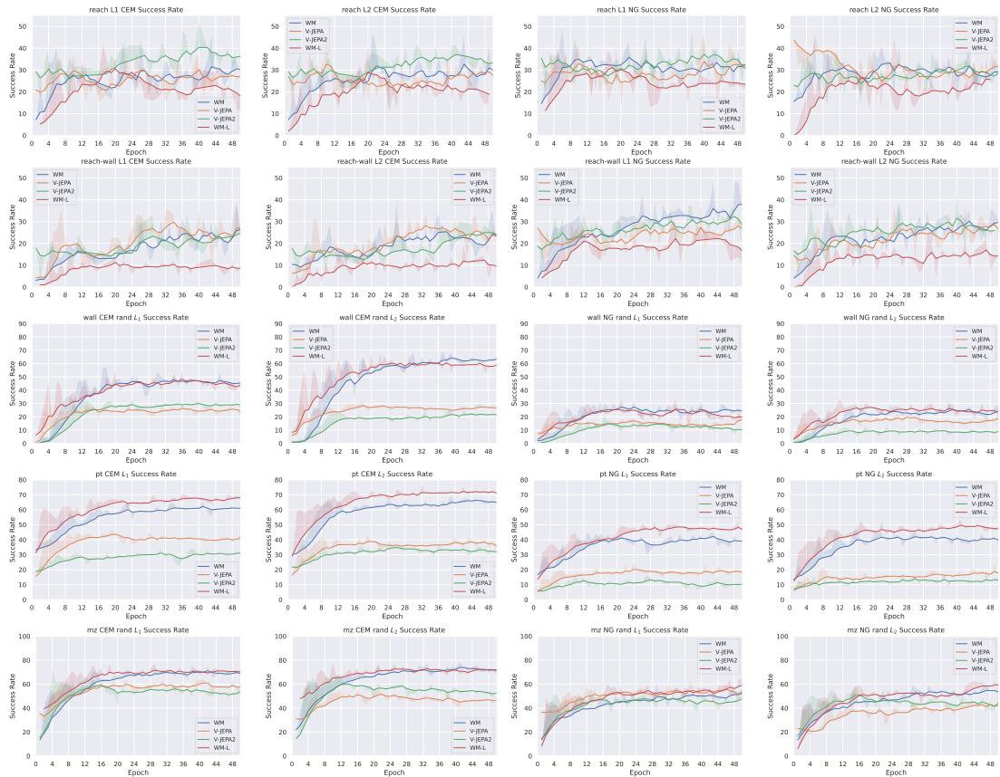  
Figure S5.11: Success rate evolution for several evaluation setups on all tasks, comparing image and video encoders. At each epoch, we evaluate the success rate on 96 independent episodes and report the average. We denote WM the base model for the design choice study, namely DINO-WM (Zhou et al., 2024a) without proprioception, and WM-L its Vit-L version. We display the results for the models learned on top of V-JEPA and V-JEPA2.

  
Figure S5.12: Success rate evolution for several evaluation setups on all tasks, comparing multistep rollout, proprioception and model size. We denote WM-B, WM-L the variants of the base model with size ViT-B and ViT-L, WM-prop the variant with proprioception, and the multistep rollout models as WM- $k$ -step. Row 1: Metaworld reach, row 2: Metaworld reach-wall, row 3: Wall, row 4: Push-T, row 5: Point Maze. At each epoch, we evaluate the success rate on 96 independent episodes and report the average.