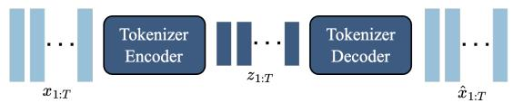
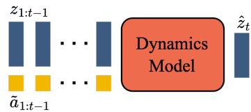
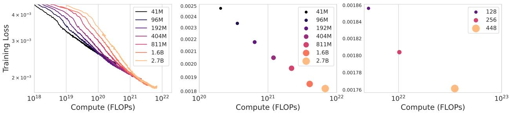
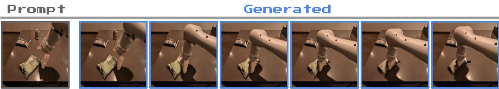
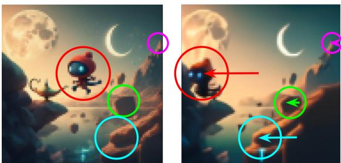
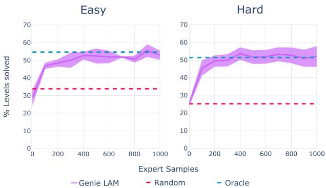

# 1. 论文基本信息

## 1.1. 标题
Genie: Generative Interactive Environments (Genie: 生成式交互环境)

论文的核心主题是介绍一个名为 `Genie` 的模型，它能够从未标记的互联网视频中学习，并根据文本、图片甚至手绘草图等提示，生成可供用户实时交互和控制的虚拟世界。

## 1.2. 作者
论文作者团队来自 **Google DeepMind** 和 <strong>英属哥伦比亚大学 (University of British Columbia)</strong>。作者名单非常长，并且标注了多位“核心贡献者”，这通常表明这是一个由大型研究团队协作完成的、资源密集型的大型项目。主要联系人是 Ashley Edwards 和 Jack Parker-Holder。

## 1.3. 发表期刊/会议
这篇论文以预印本 (Preprint) 的形式提交到了 **arXiv**。arXiv 是一个开放获取的学术论文存档网站，允许研究者在同行评审之前分享他们的研究成果。虽然它不是正式的期刊或会议，但它是人工智能和机器学习领域发布最新、最前沿研究成果的主要平台。

## 1.4. 发表年份
2024年2月23日。

## 1.5. 摘要
我们介绍 `Genie`，这是第一个以无监督方式从未标记的互联网视频中训练出来的生成式交互环境。该模型可以根据文本、合成图像、照片甚至草图等提示，生成无穷无尽、可由动作控制的虚拟世界。`Genie` 的参数量达到110亿，可被视为一个基础世界模型 (foundation world model)。它由三个部分组成：一个时空视频分词器 (spatiotemporal video tokenizer)、一个自回归动力学模型 (autoregressive dynamics model) 和一个简单且可扩展的潜在动作模型 (latent action model)。尽管在训练时没有任何真实动作标签或其他在世界模型文献中常见领域特定要求，`Genie` 仍能让用户在生成的环境中逐帧进行操作。此外，其学习到的潜在动作空间有助于训练智能体模仿未见视频中的行为，为未来训练通用智能体开辟了道路。

## 1.6. 原文链接
- **原文链接:** https://arxiv.org/abs/2402.15391
- **PDF 链接:** https://arxiv.org/pdf/2402.15391v1.pdf
- **发布状态:** 预印本 (Preprint)。

  ---

# 2. 整体概括

## 2.1. 研究背景与动机
近年来，生成式人工智能 (Generative AI) 在文本（如 GPT 系列）和图像（如 DALL-E, Stable Diffusion）领域取得了巨大成功。视频生成被视为下一个前沿，但目前的视频生成模型大多是“被动”的——它们可以根据提示生成一段视频，但用户无法像玩视频游戏一样进入并与之**交互**。

-   **核心问题:** 如何利用互联网上浩瀚的、无标签的视频数据，来创建一个用户可以“进入”并逐帧控制的**生成式交互环境**？
-   <strong>当前挑战/空白 (Gap):</strong>
    1.  <strong>传统世界模型 (World Models) 的局限:</strong> 传统的世界模型可以模拟环境动态并用于训练智能体，但它们通常需要**带有动作标签**的数据（即在 $t$ 时刻执行了动作 $a$，环境从状态 $s_t$ 变为 $s_{t+1}$）。这种带标签的数据集规模有限且获取成本高昂，无法利用海量的互联网视频。
    2.  **视频生成模型的局限:** 现有的视频生成模型虽然可以生成高质量视频，但其控制通常是**视频级别**的（例如，通过一个文本描述生成整个视频），而不是**帧级别**的（即用户在每一帧都可以决定下一步做什么）。它们生成的是“电影”，而非“游戏”。
-   **本文的切入点/创新思路:**
    本文的思路是，我们能否在**完全没有动作标签**的情况下，仅仅通过观察大量视频，让模型**自发地学习**出环境中的“可行动作”？`Genie` 的核心创新在于提出了一个<strong>潜在动作模型 (Latent Action Model, LAM)</strong>，它以一种无监督的方式从连续的视频帧中推断出离散的、有意义的动作。通过学习这些“潜在动作”，`Genie` 将被动的视频数据转化为了一个可以主动控制的动态系统，从而弥合了视频生成与交互式环境之间的鸿沟。

## 2.2. 核心贡献/主要发现
-   **提出 Genie 模型:** 论文提出了 `Genie`，这是**第一个**能够仅从无标签的互联网视频中学习，并生成可交互、可控制虚拟世界的生成模型。它开创了一种新的生成式AI范式：<strong>生成式交互环境 (Generative Interactive Environments)</strong>。

-   <strong>构建了一个基础世界模型 (Foundation World model):</strong> `Genie` 模型参数量达到 **110亿**，具备强大的泛化能力。它可以接收从未见过的图像（包括手绘草图、照片）作为初始场景，并将其转化为一个可玩的虚拟世界，展现了作为基础模型的潜力。

-   **创新的三组件架构:**
    1.  <strong>时空视频分词器 (Spatiotemporal Video Tokenizer):</strong> 一种高效的视频压缩方法，同时考虑了空间和时间信息。
    2.  <strong>潜在动作模型 (Latent Action Model):</strong> 本文的核心创新，能够**无监督地**从视频中学习出一组离散的、可控制的动作。
    3.  <strong>动力学模型 (Dynamics Model):</strong> 一个大规模的自回归模型，根据当前帧和用户选择的潜在动作来预测下一帧。

-   **证明了无监督动作学习的可行性与价值:** 论文证明，即使没有真实的动作标签，模型也能学习到一致且有意义的潜在动作（如在平台游戏中学习到“左”、“右”、“跳”）。

-   **展示了训练通用智能体的潜力:** 论文通过实验表明，`Genie` 学习到的潜在动作可以被用来训练智能体模仿未见过的视频中的行为，这为利用海量无标签视频数据来训练更通用的AI智能体提供了一条充满希望的新路径。

    ---

# 3. 预备知识与相关工作

## 3.1. 基础概念
-   <strong>世界模型 (World Model):</strong>
    世界模型是一种能够学习环境动态的内部表征的神经网络。简单来说，它试图在自己的“头脑”中构建一个关于世界如何运作的模拟器。给定当前的环境状态（如一帧游戏画面）和一个动作（如“向左走”），世界模型可以预测出下一时刻的环境状态（下一帧游戏画面）。这使得智能体可以在模型内部进行“想象”和规划，而无需在真实环境中进行昂贵的试错。

-   <strong>Transformer 与自注意力机制 (Self-Attention):</strong>
    `Transformer` 是一种最初用于自然语言处理的深度学习架构，其核心是<strong>自注意力机制 (Self-Attention)</strong>。该机制允许模型在处理一个序列（如一个句子）中的某个元素时，能够权衡序列中所有其他元素的重要性。对于视频来说，这意味着模型在生成下一帧时，可以“关注”到过去所有帧中的相关区域和动态。其计算公式如下：
    $$
    \mathrm{Attention}(Q, K, V) = \mathrm{softmax}\left(\frac{QK^T}{\sqrt{d_k}}\right)V
    $$
    -   $Q$ (Query): 当前元素（例如，正在预测的像素块）的查询向量。
    -   $K$ (Key): 序列中所有元素（例如，视频中所有其他像素块）的关键向量。$Q$ 和 $K$ 的点积计算了它们之间的相似度或“关注度”。
    -   $V$ (Value): 序列中所有元素的值向量。
    -   $d_k$: 关键向量的维度，用于缩放点积结果，防止梯度消失。
    -   `softmax`: 将关注度得分归一化，使其成为权重。
        最终结果是值向量 $V$ 的加权和，权重由查询 $Q$ 和所有键 $K$ 的相似度决定。

-   <strong>视觉 Transformer (Vision Transformer, ViT):</strong>
    `ViT` 将 `Transformer` 架构成功应用于计算机视觉任务。其核心思想是将一张图像分割成多个固定大小的<strong>图块 (patches)</strong>，然后将这些图块线性嵌入成向量序列，再输入到标准的 `Transformer` 编码器中。这样，图像处理问题就被转化为了序列处理问题。

-   <strong>向量量化变分自编码器 (Vector Quantized-Variational Autoencoder, VQ-VAE):</strong>
    `VQ-VAE` 是一种生成模型，由一个编码器、一个解码器和一个<strong>码本 (codebook)</strong> 组成。
    1.  <strong>编码器 (Encoder):</strong> 将输入数据（如图像）压缩成一个连续的潜在向量。
    2.  <strong>向量量化 (Vector Quantization):</strong> 将这个连续的潜在向量替换为码本中**最接近**的离散编码向量（码字）。码本是一个包含有限数量（如1024个）离散向量的集合。
    3.  <strong>解码器 (Decoder):</strong> 从这个离散的码字重构出原始输入。
        通过这种方式，`VQ-VAE` 可以学习到数据的离散表征，非常适合将视频帧这样的高维连续数据转换为离散的<strong>词元 (tokens)</strong>，便于后续的 `Transformer` 模型处理。

-   **MaskGIT:**
    `MaskGIT` 是一种用于图像生成的 `Transformer` 模型。其训练方式是随机<strong>遮盖 (mask)</strong> 输入图像的一部分像素（或词元），然后让模型预测被遮盖的内容。在生成图像时，它从一个完全被遮盖的画布开始，通过多次迭代，每次预测一部分最有把握的词元，并逐步“揭开”遮盖，直到生成完整的图像。`Genie` 的动力学模型就采用了类似 `MaskGIT` 的迭代生成策略。

## 3.2. 前人工作
-   <strong>世界模型 (World Models):</strong> 早期工作如 `Ha and Schmidhuber (2018)` 和 `Dreamer (Hafner et al., 2020, 2021)` 等，已经证明了学习环境模型对于强化学习的有效性。但它们都依赖于**动作-状态对**数据进行训练。近期的大规模模型如用于自动驾驶的 `GAIA-1` 和用于机器人操控的 `UniSim`，虽然功能强大，但同样需要动作甚至文本标签，限制了其数据来源。

-   <strong>视频生成模型 (Video Models):</strong> 近年来，基于 `Transformer` 的视频生成模型发展迅速，如 `Phenaki` 和 `MaskViT`。这些模型能够生成高质量视频，但主要关注视频级别的控制（如文本到视频），而非 `Genie` 所追求的帧级别交互性。`Genie` 在架构上借鉴了这些模型，特别是时空 `Transformer` 的思想，但目标截然不同。

-   <strong>可玩视频生成 (Playable Video Generation, PVG):</strong> `Menapace et al. (2021)` 提出了 `PVG` 的概念，同样是学习从视频中提取潜在动作以实现控制。但 `PVG` 的研究局限于在**已有的、静态的**视频场景中进行交互，而不能像 `Genie` 那样从一个简单的提示（如手绘草图）**生成一个全新的、可玩的**环境。

-   <strong>使用潜在动作训练智能体 (Training Agents with Latent Actions):</strong> `VPT (Baker et al., 2022)` 是一个里程碑式的工作，它通过观看大量《我的世界》视频来训练智能体。但 `VPT` 的核心是先用一小部分带有人类动作标签的数据训练一个<strong>逆动力学模型 (Inverse Dynamics Model)</strong>，该模型的作用是根据视频帧预测玩家的动作。然后，用这个模型去给海量的无标签视频“打上”动作标签，再进行模仿学习。相比之下，`Genie` 的方法更进一步，它完全**不需要任何带标签的数据**来学习动作，而是以无监督方式直接学习潜在动作空间。

## 3.3. 技术演进
该领域的技术演进可以看作一条从**被动生成**到**主动交互**的路径：
1.  **图像生成:** 模型从数据集中学习并生成静态图像。
2.  **视频生成:** 模型学习时间动态，生成一系列连续的帧，但用户无法干预。
3.  **可控视频生成:** 用户可以通过文本或其他高级指令来影响生成视频的**整体内容**。
4.  <strong>可玩/交互式生成 (Genie):</strong> 用户可以在**每一帧**做出低级动作选择，实时影响环境的演变，实现了从“看电影”到“玩游戏”的跨越。

## 3.4. 差异化分析
`Genie` 与其他工作的核心区别可以总结在下表中（改编自原文 Table 1）：

| 模型类别 | 训练数据 | 控制粒度 |
| :--- | :--- | :--- |
| **传统世界模型** | 视频 + **动作标签** | 帧级别 |
| **视频生成模型** | 视频 (+ 文本标签) | 视频级别 |
| <strong>Genie (本文)</strong> | **仅视频** | **帧级别** |

`Genie` 的独特性在于它同时实现了 **帧级别控制**（世界模型的特性）和 **仅需视频数据** 的训练方式（视频生成模型的特性），成功地将二者的优点结合起来。

---

# 4. 方法论

## 4.1. 方法原理
`Genie` 的核心思想是**分而治之**。它将“生成一个可交互世界”这一复杂任务分解为三个子任务，并由三个专门的模块协同完成：
1.  **如何理解并压缩视频？** -> <strong>视频分词器 (Video Tokenizer)</strong>：将高维度的视频帧压缩成低维、离散的“词元”序列，方便 `Transformer` 处理。
2.  **如何从视频中发现“动作”？** -> <strong>潜在动作模型 (Latent Action Model, LAM)</strong>：在没有标签的情况下，自动从视频中识别出导致帧间变化的关键“动作”，并将其编码为一组离散的ID。
3.  **如何根据“动作”演化世界？** -> <strong>动力学模型 (Dynamics Model)</strong>：学习物理规律或游戏规则，根据历史帧和用户选择的“动作”，预测世界的下一帧状态。

    这三个模块共同构成了一个完整的系统。训练分为两个阶段：首先单独训练好视频分词器，然后将其冻结，再联合训练潜在动作模型和动力学模型。

下图（原文 Figure 3）展示了 `Genie` 的整体训练流程：

*该图像是示意图，展示了Genie模型训练过程。图中左侧显示输入的$T$帧视频，通过视频标记器（Video Tokenizer）转化为离散的 Video tokens $\pmb{\mathscr{z}}$。然后，潜在动作模型（Latent Action Model）推导出每帧之间的潜在动作 $\tilde{\pmb{a}}$。这些信息随后被传递给动态模型（Dynamics Model），以循环的方式生成下一帧的预测。*

## 4.2. 核心方法详解 (逐层深入)

在深入了解各组件之前，需要先理解它们共同使用的基础架构：**ST-Transformer**。

### 4.2.1. ST-Transformer (时空变换器)
处理视频时，`Transformer` 的一个主要挑战是其自注意力机制的计算复杂度。如果一个视频有 $T$ 帧，每帧有 $H \times W$ 个图块（tokens），那么总共有 $T \times H \times W$ 个 tokens。标准的 `Transformer` 会让每个 token 与所有其他 tokens 计算注意力，计算量与 $(T \times H \times W)^2$ 成正比，这对于长视频来说是不可接受的。

`ST-Transformer` 是一种更高效的替代方案，它将全注意力分解为**空间注意力**和**时间注意力**交替进行。
-   <strong>空间注意力 (Spatial Attention):</strong> 在**每一帧内部**独立进行。每个图块只与同一帧内的其他图块计算注意力。这一步的计算量与 $T \times (H \times W)^2$ 成正比。
-   <strong>时间注意力 (Temporal Attention):</strong> 在**跨时间维度上**进行。每个图块只与所有帧中**位于相同空间位置**的图块计算注意力。这一步的计算量与 $(H \times W) \times T^2$ 成正比。

    通过这种分解，计算复杂度的主要瓶颈（空间注意力）只与帧数 $T$ **线性相关**，而非平方相关，从而大大提高了处理长视频的效率。下图（原文 Figure 4）直观地展示了这种结构。

    
    *该图像是示意图，展示了ST-transformer架构的组成。它包含多个时空块，每个块包括空间层、时间层和前馈层。图中展示了输入tokens、前馈层以及输出tokens之间的关系，其中空间关注和时间关注分别处理`H imes W`和$T$时间步的tokens。*

### 4.2.2. 组件一：视频分词器 (Video Tokenizer)
**目标：** 将原始视频 $\pmb{x}_{1:T} \in \mathbb{R}^{T \times H \times W \times C}$ 压缩成离散的词元序列 $\pmb{z}_{1:T} \in \mathbb{I}^{T \times D}$。

**架构：** 该分词器是一个基于 `ST-Transformer` 的 `VQ-VAE`，论文中称之为 `ST-ViViT`。

**流程：**
1.  <strong>编码 (Encoding):</strong> 一个 `ST-Transformer` 编码器接收视频片段 $\pmb{x}_{1:T}$，输出每个帧的连续潜在表示。由于 `ST-Transformer` 的时间注意力是因果的（causal，即当前帧只能关注过去和当前的帧），因此在 $t$ 时刻的潜在表示 $\tilde{\pmb{z}}_t$ 包含了从 $\pmb{x}_1$ 到 $\pmb{x}_t$ 的所有信息。这使得分词器具备了**时间感知能力**。
2.  <strong>量化 (Quantization):</strong> 每个连续潜在表示 $\tilde{\pmb{z}}_t$ 都会在码本中找到最接近的离散码字 $z_t$，完成从连续到离散的转换。
3.  <strong>解码 (Decoding):</strong> 另一个 `ST-Transformer` 解码器接收离散的词元序列 $\pmb{z}_{1:T}$，并尝试重构出原始的视频片段 $\hat{\pmb{x}}_{1:T}$。
4.  **训练目标:** 训练的目标是最小化重构视频 $\hat{\pmb{x}}_{1:T}$ 和原始视频 $\pmb{x}_{1:T}$ 之间的差异（如均方误差），同时通过一些正则化项来优化码本。

    **与之前工作的区别：** 许多视频模型的分词器只在空间上进行压缩（相当于一个图像 `VQ-VAE` 逐帧应用），而 `Genie` 的 `ST-ViViT` 同时利用了时间和空间相关性，从而能更好地捕捉视频的动态信息，提升了最终的生成质量。

### 4.2.3. 组件二：潜在动作模型 (Latent Action Model, LAM)
**目标：** 在没有任何动作标签的情况下，从视频对 $(x_t, x_{t+1})$ 中自动推断出一个离散的潜在动作 $a_t$。

**架构：** LAM本身也是一个类似自编码器的结构，其编码器和解码器均采用 `ST-Transformer` 架构，并使用 `VQ-VAE` 的思想来学习离散的动作码本。

**流程：**
1.  <strong>编码 (Encoding):</strong> LAM 的编码器接收**历史帧** $\pmb{x}_{1:t}$ 和**下一帧** $x_{t+1}$ 作为输入。它的任务是推断出是什么“动作”导致了从 $x_t$ 到 $x_{t+1}$ 的转变。编码器会输出一个连续的潜在动作向量 $\tilde{a}_t$。
2.  <strong>量化 (Quantization):</strong> 连续的动作向量 $\tilde{a}_t$ 被量化，映射到动作码本 $\mathcal{A}$ 中最接近的离散动作 $a_t$。在 `Genie` 的实验中，动作码本的大小被有意设置得很小（例如，$|A|=8$），以确保动作集简洁、可控，便于人类玩家或AI智能体使用。
3.  <strong>解码 (Decoding):</strong> LAM 的解码器接收**历史帧** $\pmb{x}_{1:t}$ 和刚刚推断出的**离散动作** $a_t$ 作为输入，并尝试重构出下一帧 $\hat{x}_{t+1}$。
4.  **训练信号:** 训练的损失函数是重构帧 $\hat{x}_{t+1}$ 和真实帧 $x_{t+1}$ 之间的差异。这里的直觉是：为了让解码器能够仅凭历史和动作就成功重构未来，动作 $a_t$ **必须**捕获从过去到未来**最关键的变化信息**。例如，如果角色跳起来了，这个“跳跃”信息对于预测下一帧至关重要，因此模型会被激励将这种变化编码为一个特定的潜在动作。

    **重要提示：** 在训练完成后，LAM 的编码器和解码器都会被**丢弃**。唯一被保留下来并用于 `Genie` 推理的是那个学习到的<strong>动作码本 (VQ codebook)</strong>。在推理时，动作不再由 LAM 推断，而是由用户直接提供。

### 4.2.4. 组件三：动力学模型 (Dynamics Model)
**目标：** 作为 `Genie` 的核心引擎，根据历史帧的词元表示和用户选择的动作，生成下一帧的词元表示。

**架构：** 这是一个 decoder-only 的 `MaskGIT` 风格的 `Transformer`，同样基于 `ST-Transformer` 构建。

**流程：**
1.  **输入:** 在时间步 $t$，动力学模型接收两个输入：
    -   **历史帧词元:** $\pmb{z}_{1:t-1}$，由视频分词器提供。
    -   **历史动作:** $\tilde{\pmb{a}}_{1:t-1}$，这是从动作码本中查询到的动作嵌入向量。这些动作在训练时由 LAM 推断，在推理时由用户提供。
2.  **预测:** 模型自回归地预测下一帧的词元 $\hat{\pmb{z}}_t$。由于其 `ST-Transformer` 架构，它可以一次性接收所有历史信息 $\pmb{z}_{1:T-1}$ 和 $\tilde{\pmb{a}}_{1:T-1}$，并并行地预测出所有未来的帧词元 $\hat{\pmb{z}}_{2:T}$。
3.  **训练目标:** 训练的损失是标准的交叉熵损失 (cross-entropy loss)，用于衡量预测的词元分布与真实词元之间的差异。训练时会随机遮盖一部分输入词元，迫使模型学习从不完整的信息中恢复内容，增强其生成能力。
4.  **动作注入方式:** 一个重要的实现细节是，动作 $\tilde{a}_{t-1}$ 并不是简单地与帧词元 $z_{t-1}$ 拼接 (concatenate)，而是作为<strong>加性嵌入 (additive embeddings)</strong> 添加到 `Transformer` 的内部表示中。实验发现这种方式能带来更好的可控性。

### 4.2.5. 推理过程：生成可玩的视频
下图（原文 Figure 8）清晰地展示了 `Genie` 在推理（即玩游戏）时的完整流程：

*该图像是示意图，展示了Genie推理过程中的迭代生成。提示帧通过编码器进行标记，与用户采取的潜在动作结合后传递给动态模型，以生成后续帧信息。最后，预测的帧标记通过解码器转回图像空间。*

1.  <strong>启动 (Prompting):</strong> 用户提供一个初始图像 $x_1$ 作为世界的起点（可以是照片、草图等）。
2.  **编码第一帧:** 视频分词器的编码器将 $x_1$ 转换为其词元表示 $z_1$。
3.  **循环生成:**
    a. **用户输入动作:** 用户从 $\{0, 1, ..., |\mathcal{A}|-1\}$ 中选择一个动作ID，例如 $a_1=2$。
    b. **查询动作嵌入:** 系统使用 $a_1$ 从 LAM 的动作码本中查找到对应的动作嵌入向量 $\tilde{a}_1$。
    c. **预测下一帧词元:** 动力学模型接收当前的词元历史（初始时只有 $z_1$）和动作嵌入 $\tilde{a}_1$，预测出下一帧的词元 $\hat{z}_2$。
    d. **解码为图像:** 视频分词器的解码器将词元 $\hat{z}_2$ 转换回像素空间的图像 $\hat{x}_2$，并展示给用户。
    e. **更新历史:** 将新生成的词元 $\hat{z}_2$ 添加到历史中。
    f. **重复:** 用户观看新生成的帧 $\hat{x}_2$，并选择下一个动作 $a_2$，整个过程不断重复，形成一个连续的交互式视频流。

---

# 5. 实验设置

## 5.1. 数据集
-   **Platformers Dataset:**
    -   **来源:** 从公开的互联网视频网站上收集。通过包含“2D platformer games”（2D平台游戏）等关键词，以及“speedrun”、“playthrough”等行为词，同时排除“movie”、“unboxing”等无关词的标题进行初步筛选。
    -   **规模:** 初始数据集包含5500万个16秒的视频片段（约24.4万小时）。为了提升数据质量，研究团队手动标记了1万个视频的质量，并训练了一个 `ResNet18` 分类器来对整个数据集进行筛选。最终用于训练的高质量数据集包含 **680万** 个视频片段，总时长约 **3万小时**。视频分辨率为 160x90，帧率为 10 FPS。
    -   **特点:** 该数据集规模巨大，风格多样，涵盖了数以百计的不同2D平台游戏，但完全**没有动作标签**。
    -   **选择理由:** 2D平台游戏具有清晰的动作（走、跑、跳）和物理规则，非常适合用于验证 `Genie` 的无监督动作学习和世界建模能力。其巨大的多样性也考验了模型的泛化能力。

-   **Robotics Dataset:**
    -   **来源:** 结合了 `RT-1` 论文中使用的机器人演示数据集，以及其他真实和模拟的机器人数据。
    -   **规模:** 约13万个机器人演示片段 + 20.9万个真实机器人片段。
    -   **特点:** 包含机器人手臂进行各种操作的视频。同样，论文强调**未使用任何动作标签**，仅将其作为纯视频数据进行训练。
    -   **选择理由:** 为了验证 `Genie` 方法的**通用性**，证明它不仅适用于游戏视频，也能在更接近现实世界的机器人操作场景中学到有意义的控制。

## 5.2. 评估指标
-   <strong>FVD (Frechet Video Distance, 弗雷歇视频距离):</strong>
    1.  **概念定义:** FVD 是一个用于评估生成视频质量的常用指标。它通过比较**生成视频**和**真实视频**在特征空间中的分布相似度来衡量视频的保真度和时间连贯性。FVD 分数**越低**，表示生成视频的质量越高，与真实视频越相似。它使用一个在大型视频数据集上预训练的 3D 卷积网络来提取视频特征。
    2.  **数学公式:**
        $$
        \mathrm{FVD} = d^2((m_r, C_r), (m_g, C_g)) = \|m_r - m_g\|_2^2 + \mathrm{Tr}(C_r + C_g - 2(C_r C_g)^{1/2})
        $$
    3.  **符号解释:**
        -   $m_r, C_r$: 真实视频特征向量集的均值和协方差矩阵。
        -   $m_g, C_g$: 生成视频特征向量集的均值和协方差矩阵。
        -   $\|\cdot\|_2^2$: 向量的L2范数的平方。
        -   $\mathrm{Tr}(\cdot)$: 矩阵的迹（主对角线元素之和）。

-   **ΔPSNR:**
    1.  **概念定义:** 这是论文作者为衡量模型的**可控性**而专门设计的指标。其核心思想是：如果潜在动作真的能控制视频生成，那么使用从真实视频推断出的“正确”动作序列生成的视频，应该比使用“随机”动作序列生成的视频更接近真实视频。ΔPSNR 量化了这种接近程度的差异。该值**越高**，说明动作对生成结果的影响越大，可控性越强。
    2.  **数学公式:**
        $$
        \Delta _ { t } \mathrm { P S N R } = \mathrm { P S N R } ( x _ { t } , \hat { x } _ { t } ) - \mathrm { P S N R } ( x _ { t } , \hat { x } _ { t } ^ { \prime } )
        $$
    3.  **符号解释:**
        -   $x_t$: 时间 $t$ 的**真实**视频帧。
        -   $\hat{x}_t$: 使用从真实视频 $x_{1:t}$ 中推断出的潜在动作序列 $\tilde{\mathbf{a}}_{1:t-1}$ 生成的视频帧。
        -   $\hat{x}'_t$: 使用从一个随机分布中采样的动作序列生成的视频帧。
        -   $\mathrm{PSNR}(A, B)$: 峰值信噪比 (Peak Signal-to-Noise Ratio)，衡量图像 $A$ 和 $B$ 之间差异的指标，值越高表示两图越相似。

## 5.3. 对比基线
在视频生成质量方面，论文主要进行了内部的<strong>消融实验 (Ablation Studies)</strong> 来比较不同设计选择的优劣，而非与外部已发表的视频生成模型直接对比。

在**训练智能体**部分，`Genie` 的方法与以下基线进行了比较：
-   **Oracle BC (Behavioral Cloning) Agent:** 一个标准的模仿学习智能体，它在训练时可以访问**真实的专家动作标签**。这代表了性能的**上限**，因为 `Genie` 的方法无法获取这些信息。
-   **Random Agent:** 一个在环境中随机执行动作的智能体，代表了性能的**下限**。

    ---

# 6. 实验结果与分析

## 6.1. 核心结果分析

### 6.1.1. 模型规模扩展性 (Scaling Results)
论文研究了增加模型参数量和批量大小对性能的影响。下图（原文 Figure 9）展示了这些结果。

*该图像是显示不同模型规模的训练结果的图表。左侧为不同模型规模的训练曲线，中间为每个模型规模的最终训练损失，右侧为2.3B模型在不同批处理大小下的最终训练损失。*

-   <strong>模型大小的影响（左、中图）:</strong> 实验训练了一系列从 4000万 到 27亿 参数的动力学模型。结果显示，随着模型参数量的增加，最终的训练损失持续稳定下降。这表明 `Genie` 的架构具有良好的扩展性，更大的模型能带来更好的性能。这个结论支撑了他们最终训练一个 110亿 参数模型的决定。
-   <strong>批量大小的影响（右图）:</strong> 对一个 23亿 参数的模型，分别使用 128、256 和 448 的批量大小进行训练。结果同样显示，增加批量大小可以有效降低训练损失。

### 6.1.2. 质性结果：生成多样且可控的世界
`Genie` 最令人印象深刻的是其强大的泛化和交互能力。

-   **对任意图像提示的泛化:** 如下图（原文 Figure 10），`Genie` 可以接收来自各种分布外 (Out-of-Distribution) 的图像作为初始帧，并将其“激活”成一个可玩世界。这些提示包括：
    -   由 `Imagen2` 等文生图模型生成的图像（第一行）。
    -   人类手绘的简单草图（第二行）。
    -   现实世界的照片（第三行）。
        在每组例子中，当重复执行同一个潜在动作时，游戏角色都表现出了一致且符合逻辑的移动，证明 `Genie` 不仅仅是记住了训练数据，而是学习到了关于“可玩世界”的通用概念。

        
        *该图像是示意图，展示了如何通过不同的提示（文本生成图像、手绘草图和真实照片）使用Genie生成虚拟环境。在每组示例中，左侧为提示帧，右侧为执行潜在动作四次后的结果帧，显示了清晰的角色移动。*

-   **学习物理和视觉特性:**
    -   `Genie` 还能模拟一些物理效果，如下图（原文 Figure 11）所示，模型学会了模拟可变形物体（如薯片袋）的动态。

        
        *该图像是插图，展示了模拟可变形物体的过程，包括模型在执行同一动作时的十步轨迹。模型成功学习了物体（如薯片袋）的物理特性。*

    -   它还学会了平台游戏中常见的<strong>视差滚动 (parallax scrolling)</strong> 效果，即背景的不同层以不同速度移动，从而产生深度感。如下图（原文 Figure 12），前景的移动速度明显快于中景和远景。

        
        *该图像是插图，展示了平台游戏中常见的视差效果。在左侧生成的图像中，前景的移动幅度大于中景和背景，背景的移动幅度则较小。*

-   **在机器人领域的通用性:** 在 `Robotics` 数据集上训练的模型同样学会了有意义的动作。如下图（原文 Figure 13），模型在没有任何动作标签的情况下，自发地将潜在动作与“向下”、“向上”、“向左”等语义上一致的机器人手臂运动关联起来。这证明了 `Genie` 方法的通用性。

    
    *该图像是一个示意图，展示了机器人在不同起始帧下的可控一致潜在动作。每列显示了使用相同潜在动作五次后的结果帧，分别对应“向下”、“向上”和“向左”三种动作。尽管没有进行标签训练，相同的动作在不同的提示帧中保持一致，且具有语义意义。*

### 6.1.3. 训练智能体
为了验证学习到的潜在动作的实用价值，论文进行了一项模仿学习实验。

-   **实验设置:** 在一个从未见过的 `CoinRun` 游戏环境中，让 `Genie` 的 LAM (已在平台游戏视频上预训练好) 去给专家玩 `CoinRun` 的视频打上“潜在动作”标签。然后训练一个策略网络，学习在 `CoinRun` 中根据当前画面预测专家会采取哪个“潜在动作”。最后，只需要极少量（例如200个）的真实动作样本来建立一个从“潜在动作”到“真实游戏按键”的简单映射。
-   **结果分析:** 如下图（原文 Figure 15），在简单和困难两种设置下，使用 `Genie` 潜在动作训练的智能体 (`Genie LAM`) 的性能，在仅用少量样本进行适配后，几乎与能够看到全部真实动作的<strong>上限模型 (`Oracle`)</strong> 相当，并且远超随机智能体。

    
    *该图像是一个图表，展示了在简单（Easy）和困难（Hard）环境中，基于不同专家样本的关卡解决百分比。图中显示了 Genie LAM、随机（Random）和 Oracle 的表现，其中 Genie LAM 在两种环境中均稳步提高，最终解决了较高比例的关卡。*

-   **结论:** 这个结果极其重要，它表明 `Genie` 从海量互联网视频中学到的潜在动作空间是**有意义且可迁移的**。它捕捉到了通用的“动作概念”，可以被快速适配到新的、未见过的环境中，为利用无标签视频训练通用智能体提供了强有力的证据。

## 6.2. 消融实验/参数分析
论文通过消融实验验证了其关键设计选择的合理性。

### 6.2.1. 潜在动作模型 (LAM) 的输入选择
LAM 可以选择使用原始的像素图像 (`Pixel-input`) 或经过分词器处理后的词元 (`Token-input`) 作为输入来推断动作。

以下是原文 Table 2 的结果：

<table>
<thead>
<tr>
<th></th>
<th>Dataset</th>
<th>#Params</th>
<th>FVD (↓)</th>
<th>ΔPSNR (↑)</th>
</tr>
</thead>
<tbody>
<tr>
<td>Token-input</td>
<td>Platformers</td>
<td>2.3B</td>
<td>38.8</td>
<td>1.33</td>
</tr>
<tr>
<td>Pixel-input (Genie)</td>
<td>Platformers</td>
<td>2.5B</td>
<td>40.1</td>
<td><b>1.91</b></td>
</tr>
<tr>
<td>Token-input</td>
<td>Robotics</td>
<td>1B</td>
<td>257.8</td>
<td>1.65</td>
</tr>
<tr>
<td>Pixel-input (Genie)</td>
<td>Robotics</td>
<td>1B</td>
<td><b>136.4</b></td>
<td><b>2.07</b></td>
</tr>
</tbody>
</table>

-   **分析:** 尽管在 `Platformers` 数据集上，`Token-input` 的 FVD 略好，但在两个数据集上，`Pixel-input`（即 `Genie` 的最终选择）的**可控性指标 ΔPSNR 都明显更高**。在 `Robotics` 数据集上，`Pixel-input` 在 FVD 和 ΔPSNR 上双双胜出。这表明视频分词过程可能会丢失一些对推断动作至关重要的细微动态信息，因此直接从原始像素学习动作是更优的选择。

### 6.2.2. 视频分词器架构选择
论文比较了三种不同的分词器架构：
1.  `ViT`: 仅在空间维度压缩，无时间感知。
2.  `C-ViViT`: 一种时空 `Transformer`，在时间和空间上都使用全注意力机制，计算量大。
3.  `ST-ViViT` (ours): 本文提出的时空 `Transformer`，交替使用空间和时间注意力，更高效。

    以下是原文 Table 3 的结果：

    <table>
    <thead>
    <tr>
    <th></th>
    <th>#Params</th>
    <th>Memory</th>
    <th>FVD (↓)</th>
    <th>ΔPSNR (↑)</th>
    </tr>
    </thead>
    <tbody>
    <tr>
    <td>ViT</td>
    <td>230M</td>
    <td>0.3GB</td>
    <td>114.5</td>
    <td>1.39</td>
    </tr>
    <tr>
    <td>C-ViViT (Villegas et al., 2023)</td>
    <td>225M</td>
    <td>1.6GB</td>
    <td>272.7</td>
    <td>1.37</td>
    </tr>
    <tr>
    <td><b>ST-ViViT (ours)</b></td>
    <td>205M</td>
    <td>0.9GB</td>
    <td><b>81.4</b></td>
    <td><b>1.66</b></td>
    </tr>
    </tbody>
    </table>

-   **分析:** 本文提出的 `ST-ViViT` 架构在视频保真度 (FVD) 和可控性 (ΔPSNR) 两个指标上都取得了**最佳**性能。它的内存消耗介于两者之间，远低于计算量巨大的 `C-ViViT`。这证明了 `ST-ViViT` 在性能和效率之间取得了很好的平衡，是 `Genie` 架构的理想选择。

    ---

# 7. 总结与思考

## 7.1. 结论总结
`Genie` 是一项开创性的工作，它成功地展示了如何仅从海量的、无标签的互联网视频中学习并创建一个**生成式交互环境**。其核心贡献包括：
1.  **提出了一种新的AI范式:** 将被动的视频生成模型转变为用户可以主动参与和控制的动态世界。
2.  **设计了一个可扩展的110亿参数基础世界模型:** 该模型由创新的视频分词器、无监督的潜在动作模型和大规模的动力学模型组成。
3.  **实现了前所未有的泛化能力:** `Genie` 可以被任何图像（甚至手绘草图）驱动，生成一个全新的、风格一致、可交互的虚拟世界。
4.  **开辟了通用智能体训练的新路径:** 证明了从无标签视频中学习到的潜在动作空间是有效且可迁移的，为解决强化学习中环境多样性和数据稀缺性的瓶颈问题提供了新的思路。

## 7.2. 局限性与未来工作
论文作者坦诚地指出了当前 `Genie` 模型的局限性：
-   **长期一致性问题:** 作为一种自回归模型，`Genie` 在长时间生成后可能会出现“幻觉”，产生不符合逻辑的未来，导致环境的一致性下降。
-   **有限的记忆:** 当前模型只能处理16帧的上下文，这限制了它对更长历史的记忆能力，难以建模需要长程依赖的复杂动态。
-   **推理速度:** `Genie` 目前的生成速度大约为 1 FPS（每秒一帧），对于流畅的实时交互来说太慢了，需要未来的硬件和算法优化来提升效率。

    未来工作方向包括：
-   **扩展数据源:** 将模型训练扩展到更多样化的互联网视频，以模拟更真实、更多样的环境。
-   **深化智能体训练研究:** 进一步探索利用 `Genie` 作为模拟器来训练更强大、更通用的AI智能体。

## 7.3. 个人启发与批判
-   **启发:**
    1.  **无监督学习的巨大潜力:** `Genie` 最具启发性的一点是其对无监督学习范式的极致运用。它证明了在没有明确指导信号的情况下，大规模模型能够从海量数据中发现并学习到底层结构（如“动作”），这是通向更通用人工智能的关键一步。
    2.  <strong>“世界模型”</strong>的重新定义: `Genie` 扩展了“世界模型”的内涵。传统的世界模型是为特定任务或环境（如雅达利游戏）服务的模拟器，而 `Genie` 则是一个可以**按需生成**任何世界的“元模拟器”或“世界生成引擎”。
    3.  **数据驱动的创造力:** 这项工作模糊了创造与模拟的界限。用户的一个简单想法（一张草图）可以被数据驱动的模型扩展成一个完整的、可交互的世界，这为未来的游戏设计、创意工具和教育应用打开了无限的想象空间。

-   **批判性思考:**
    1.  <strong>“可玩性”</strong>的主观性: 尽管 ΔPSNR 提供了可控性的量化指标，但一个环境是否“好玩”或“有意义”是高度主观的。学习到的8个潜在动作在不同的生成世界中是否总能保持直观和一致？例如，在一个新生成的科幻世界中，“跳跃”动作是否依然有效？这需要更多的人类评估。
    2.  **数据偏见的影响:** 模型的能力完全源于其训练数据（3万小时的2D平台游戏视频）。这意味着它学习到的“物理规律”和“交互逻辑”可能带有强烈的游戏偏见。将其应用于需要真实物理模拟的场景（如机器人）时，这种偏见可能成为一个严重障碍。
    3.  **可解释性与安全性:** 潜在动作是模型自发学习的，其具体含义并不透明。在需要高安全性和可靠性的应用中，这种黑箱式的控制方式可能存在风险。
    4.  **技术门槛:** 尽管论文在附录中提供了一个可在单个GPU上运行的简化案例，但复现110亿参数的主模型对于绝大多数研究机构来说是不现实的。作者选择不发布模型和数据集，虽然出于安全考虑可以理解，但也确实阻碍了社区对这项工作的快速跟进和验证。