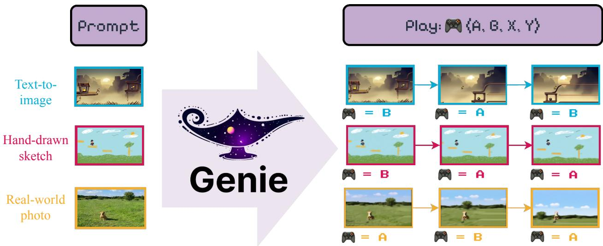
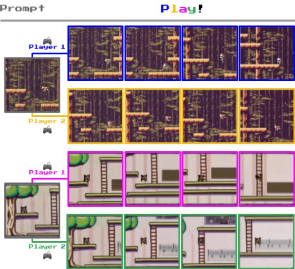
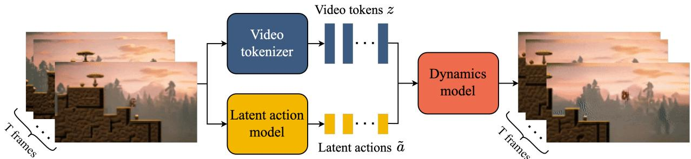
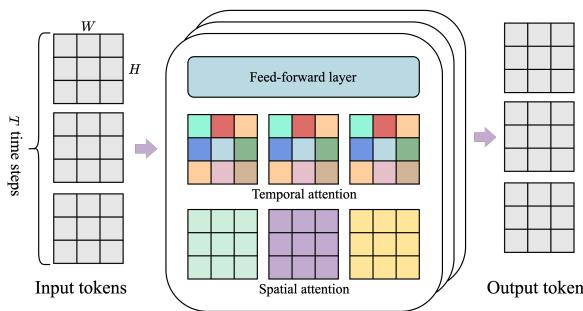
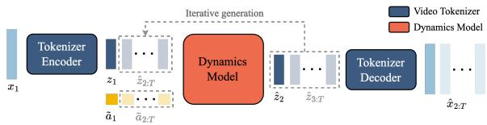
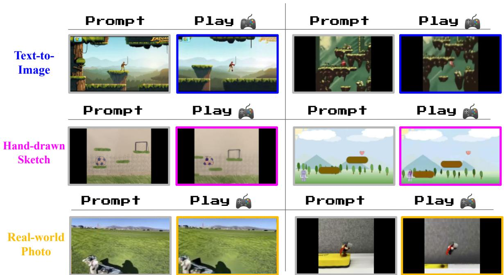
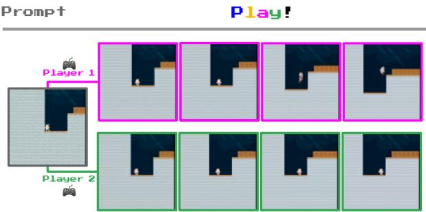
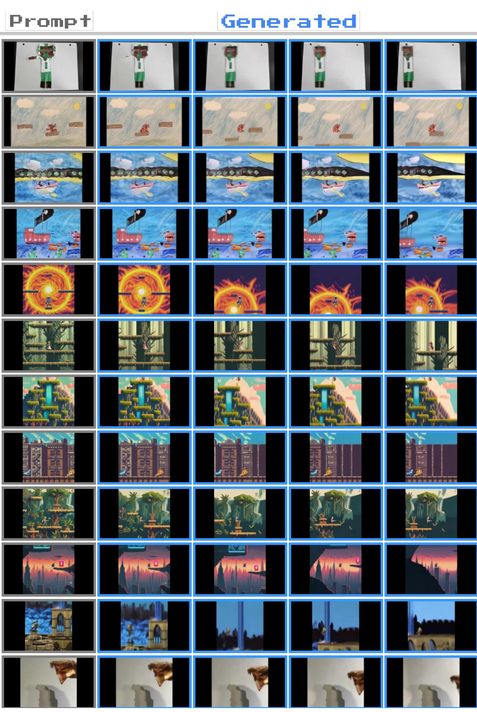

# Genie: 生成式互动环境

杰克·布鲁斯\*,1，迈克尔·丹尼斯\*,1，阿什利·爱德华兹\*,1，杰克·帕克-霍尔德\*,1，玉戈（吉米）$\mathbf { s h i } ^ { * } , 1$，爱德华·休斯1，马修·来1，阿迪提·马瓦兰卡1，瑞奇·施泰格瓦尔德1，克里斯·阿普斯1，优素福·艾塔尔1，萨拉·贝希特尔1，费里亚尔·贝哈巴尼1，斯蒂芬妮·陈1，尼古拉斯·赫斯1，露西·冈萨雷斯1，西蒙·奥辛德罗1，舍尔吉尔·奥扎伊尔1，斯科特·里德1，景唯·张1，康拉德·佐尔纳1，杰夫·克伦1,2，南多·德·弗雷塔斯1，萨廷德尔·辛格1 和蒂姆·罗克塔谢尔\*,1 \*共同贡献，1谷歌DeepMind，2不列颠哥伦比亚大学

  
Figure 1 | A whole new world: Genie is capable of converting a variety of different prompts into interactive, playable environments that can be easily created, stepped into, and explored. This is made possible via a latent action interface, learned fully unsupervised from Internet videos. On the right we see a few generated steps for taking two latent actions. See more examples on our website.

我们引入了Genie，这是第一个从未标记的互联网视频中以无监督方式训练的生成交互环境。该模型可以根据文本、合成图像、照片甚至草图生成各种可控操作的虚拟世界。Genie拥有110亿个参数，可以视为一个基础世界模型。它由时空视频标记器、自回归动态模型和简单可扩展的潜在动作模型组成。尽管训练过程中没有任何真实动作标签或世界模型文献中通常存在的其他领域特定要求，Genie仍然使用户能够在生成的环境中逐帧进行操作。此外，学习到的潜在动作空间使训练智能体模仿未见视频中的行为成为可能，为未来通用智能体的训练铺平了道路。关键词：生成性人工智能、基础模型、世界模型、视频模型、开放性。

# 1. 引言

近年来，生成性人工智能不断涌现，模型能够生成新颖且创造性的内容。得益于架构如变压器（Vaswani et al., 2017）的突破、硬件的进步以及近期对模型和数据集扩展的关注，我们现在能够生成连贯的对话语言（Brown et al., 2020；Radford et al., 2018, 2019），以及从文本提示中生成清晰且美观的图像（Ramesh et al., 2021, 2022；Rombach et al., 2022；Saharia et al., 2022）。早期迹象表明，视频生成将是另一个前沿领域，最近的研究结果表明，这类模型也可能从规模中受益（Blattmann et al., 2023a；Esser et al., 2023；Ho et al., 2022a；Hong et al., 2023）。然而，视频生成模型与语言工具如ChatGPT之间的交互和参与程度依然存在差距，更不用说更具沉浸感的体验了。如果能利用来自互联网的大量视频数据，我们不仅能够训练生成新图像或视频的模型，还能够创建完整的互动体验，该如何呢？我们提出生成性互动环境，这是一种生成性人工智能的新范式，通过单一的文本或图像提示来生成互动环境。我们的方法Genie基于超过200,000小时的公开网络游戏视频的大型数据集进行训练，尽管在训练过程中没有使用动作或文本注释，但它能够通过学习的潜在动作空间在逐帧基础上进行控制（参见表1以比较其他方法）。Genie拥有110亿参数，展现了基础模型通常具备的特性——它可以将未见过的图像作为提示，从而能够创建并玩耍完全想象的虚拟世界（例如图2）。

Genie 基于最先进的视频生成模型的思想（Gupta 等，2023；Villegas 等，2023），核心设计选择为时空（ST）变换器（Xu 等，2020），该组件在我们所有模型组件中均有应用。Genie 采用了一种新颖的视频标记器，并通过因果动作模型提取潜在动作。视频标记和潜在动作都传递给动态模型，该模型利用 MaskGIT（Chang 等，2022）自回归预测下一帧。我们对架构进行了严格的比例分析，涉及批次和模型大小，参数范围从 40M 到 2.7B。结果表明，在额外计算资源的支持下，我们的架构能优雅地扩展，最终形成 11B 参数的模型。我们在过滤后的 30,000 小时互联网游戏视频集上训练 Genie，这些视频来自数百款 2D 平台游戏，为该环境构建了基础世界模型。

  
Figure 2 | Diverse trajectories: Genie is a generative model that can be used as an interactive environment. The model can be prompted in various ways, either with a generated image (top) or a hand-drawn sketch (bottom). At each time step, the model takes a user-provided latent action to generate the next frame, producing trajectories with interesting and diverse character actions.

为了展示我们方法的普遍性，我们还在来自 RT1 数据集（Brohan 等，2023）的无动作机器人视频上训练了一个单独的模型，学习具有一致潜在动作的生成环境。最后，我们展示了从互联网视频中学习的潜在动作可以用于推断未见过的无动作视频中的策略，表明 Genie 可能是解锁无限数据以训练下一代通用智能体的关键（Bauer 等，2023；Clune，2019；Open Ended Learning Team 等，2021；Reed 等，2022）。表 1 | 一类新型生成模型：Genie 是一种新颖的视频和世界模型，能够逐帧控制，只需在训练时使用视频数据。

<table><tr><td>Model Class</td><td>Training Data</td><td>Controllability</td></tr><tr><td>World Models</td><td>Video + Actions</td><td>Frame-level</td></tr><tr><td>Video Models</td><td>Video + Text</td><td>Video-level</td></tr><tr><td>Genie</td><td>Video</td><td>Frame-level</td></tr></table>

# 2. 方法论

Genie 是一个基于视频数据训练的生成交互环境。在本节中，我们将在解释模型主要组件之前，先介绍一些基础知识。Genie 架构中的多个组件基于视觉变换器（Vision Transformer, ViT）（Dosovitskiy 等, 2021；Vaswani 等, 2017）。值得注意的是，变换器的二次内存成本对视频处理提出了挑战，因为视频中可能包含多达 $O(10^{4})$ 个词元。因此，我们采用了一种高效的 ST-transformer 架构（受到 Xu 等（2020）的启发，见图4），在所有模型组件中平衡模型容量与计算约束。

与传统的变换器不同，ST-transformer 包含 $L$ 个时空块，这些块交错排列了空间和时间注意力层，后面接一个前馈层（FFW），作为标准注意力块。空间层中的自注意力会关注每个时间步内的 $1 \times H \times W$ 个词元，而时间层则关注 $T \times 1 \times 1$ 个沿 $T$ 个时间步的词元。与序列变换器类似，时间层假设具有因果结构，并采用因果掩码。关键是，我们架构中计算复杂度的主导因素（即空间注意力层）随着帧数线性增长，而非平方增长，这使得该架构在具有一致动态的扩展交互视频生成中更为高效。此外，请注意，在 ST 块中，我们仅在空间和时间组件之后包含一个 FFW，省略了后空间 FFW，以便能够扩展模型的其他组件，我们观察到这样显著提高了结果。

# 2.1. 模型组件

如图 3 所示，我们的模型包含三个关键组件：1）一个潜在动作模型，用于推断每对帧之间的潜在动作 $\pmb { a }$；2）一个视频标记器，将原始视频帧转换为离散标记 $\pmb { \mathscr { z } }$；3）一个动力学模型，给定潜在动作和过去的帧标记，预测视频的下一帧。该模型遵循标准自回归视频生成流程分为两个阶段进行训练：我们首先训练视频标记器，以供动力学模型使用。然后，我们共同训练潜在动作模型（直接从像素出发）和动力学模型（在视频标记上进行）。潜在动作模型（LAM）为实现可控视频生成，我们在每个未来帧的预测中以之前帧采取的动作作为条件。然而，这种动作标签在互联网上的视频中很少可用，且动作标注的成本往往较高。因此，我们以完全无监督的方式学习潜在动作（见图 5）。首先，一个编码器将所有之前的帧 $\pmb { x } _ { 1 : t } = \left( x _ { 1 } , \cdots , x _ { t } \right)$ 以及下一帧 $x _ { t + 1 }$ 作为输入，并输出相应的一组连续潜在动作 $\tilde { \pmb { a } } _ { 1 : t } = ( \tilde { a } _ { 1 } , \cdots , \tilde { a } _ { t } )$。解码器随后将所有之前的帧和潜在动作作为输入，预测下一帧 $\hat { x } _ { t + 1 }$。为了训练模型，我们利用基于 VQ-VAE 的目标（van den Oord et al., 2017），这使我们能够将预测的动作数量限制在一小组离散代码中。我们将 VQ 词典的词汇大小 $| A |$（即最大潜在动作数量）限制为一个较小的值，以适应人类操作的可玩性并进一步增强可控性（在我们的实验中，我们使用 $| { \cal A } | = 8$）。由于解码器仅能访问历史记录和潜在动作，$\tilde { a } _ { t }$ 应编码过去与未来之间对解码器成功重建未来帧最有意义的变化。请注意，这个解码器仅存在于 LAM 的训练信号中。实际上，除了 VQ 词典，整个 LAM 在推理时会被丢弃，并替换为用户提供的动作。

  
Figure 3 | Genie model training: Genie takes in $T$ frames of video as input, tokenizes them into discrete tokens $\pmb { \mathscr { z } }$ via the video tokenizer, and infers the latent actions $\tilde { \pmb { a } }$ between each frame with the latent action model. Both are then passed to the dynamics model to generate predictions for the next frames in an iterative manner.

  
Figure 4 | ST-transformer architecture. The architecture is composed of $L$ spatiotemporal blocks, each containing a spatial layer, temporal layer and feed-forward layer. Each color represents a single self-attention map, with the spatial layer attending over the $H \times W$ tokens from within a single time step, and temporal the same token from across the $T$ time steps.

  
Figure 5 | Latent action model: learns actions $a _ { t }$ unsupervised from unlabelled video frames.

我们将 ST-transformer 架构应用于潜在动作模型。时间层中的因果掩码允许我们将整个视频 $x _ { 1 : T }$ 作为输入，并生成每帧之间的所有潜在动作 $\tilde { \pmb { a } } _ { 1 : T - 1 }$。

视频标记器 根据之前的研究（Gupta et al., 2023; Villegas et al., 2023; Yan et al., 2023），我们将视频压缩为离散的标记以降低维度并实现更高质量的视频生成（见图6）。我们再次利用 VQ-VAE，输入为 $T$ 帧视频 $\pmb { x } _ { 1 : T } = ( x _ { 1 } , x _ { 2 } , \cdots , x _ { T } ) \in \mathbb { R } ^ { T \times H \times W \times C }$，为每帧生成离散表示 $\mathfrak { z } _ { 1 : T } = \left( z _ { 1 } , z _ { 2 } , \cdots , z _ { T } \right) \in \mathbb { I } ^ { T \times D }$，其中 $D$ 是离散潜在空间的大小。标记器使用标准的 VQ-VQAE 目标对整个视频序列进行训练。

  
Figure 6 | Video tokenizer: a VQ-VAE with STtransformer.

与之前关注于标记化阶段仅进行空间压缩的工作不同（Gupta et al., 2023; Hong et al., 2022; Wu et al., 2022），我们在编码器和解码器中均采用ST-transformer，以在编码中融入时间动态，从而提高视频生成质量。由于ST-transformer的因果特性，每个离散编码${ { \mathscr Z } _ { t } }$包含视频$\boldsymbol { x } _ { 1 : t }$中所有之前帧的信息。Phenaki（Villegas et al., 2023）也使用了一种时间感知的标记器C-ViViT，但该架构计算密集，因为其成本随着帧数的增加呈平方增长；相比之下，我们基于ST-transformer的标记器（STViViT）在计算效率方面要高得多，其成本的主导因素随着帧数的增加呈线性增长。

  
Figure 7 | Dynamics model: takes in video tokens and action embeddings, and predicts future masked video tokens.

动态模型 动态模型是一个仅解码的MaskGIT（Chang等，2022）变换器（见图7）。在每个时间步$t \in [1, T]$，它输入经过标记的视频$\mathfrak{z}_{1:t-1}$和停止梯度的潜在动作$\tilde{\mathbf{a}}_{1:t-1}$，并预测下一个帧的标记$\hat{\boldsymbol{z}}_t$。我们再次利用ST变换器，其因果结构使我们能够使用来自所有$(T - 1)$帧的标记$\pmb{z}_{1:T-1}$和潜在动作$\tilde{\pmb{a}}_{1:T-1}$作为输入，并为所有后续帧生成预测$\hat{\pmb{z}}_{2:T}$。模型的训练使用预测标记$\hat{\pmb{z}}_{2:T}$与真实标记$\mathfrak{z}_{2:T}$之间的交叉熵损失。在训练时，我们根据均匀分布在0.5和1之间采样的伯努利分布掩码率随机掩盖输入标记$z_{2:T-1}$。注意，训练世界模型（包括基于变换器的模型）的常见做法是将时间$t$的动作与相应帧连接起来（Micheli等，2023；Robine等，2023）。然而，我们发现将潜在动作视为潜在动作和动态模型的加性嵌入，有助于提高生成的可控性。

# 2.2. 推理：可控动作的视频生成

我们现在描述如何在推理时使用Genie进行可控动作视频生成（见图8）。玩家首先用图像 $x_{1}$ 提示模型，作为初始帧。该图像通过视频编码器进行词元化，得到 ${\mathfrak{z}}_{1}$。然后，玩家通过选择 $[0, |A|)$ 范围内的任意整数值，指定一个离散潜在动作 $a_{1}$。动态模型接收帧词元 $z_{1}$ 和对应的潜在动作 $\tilde{a}_{1}$，后者是通过以离散输入 $a_{1}$ 索引VQ代码本得到的，以预测下一个帧词元 ${z_{2}}$。这个过程被重复执行，以自回归的方式生成剩余的序列 $\hat{\pmb{z}}_{2:T}$，同时将动作持续传递给模型，而词元则通过编码器的解码器解码成视频帧 $\hat{x}_{2:T}$。注意，我们可以通过将初始帧和从视频中推断的动作传递给模型来重新生成数据集中的真实视频，或者通过改变动作生成全新的视频（或轨迹）。

  
Figure 8 | Genie Inference: the prompt frame is tokenized, combined with the latent action taken by the user, and passed to the dynamics model for iterative generation. The predicted frame tokens are then decoded back to image space via the tokenizer's decoder.

# 3. 实验结果

数据集 我们在一个大型数据集上训练Genie，该数据集来自公开可用的2D平台游戏视频（以下称为“平台游戏”）。我们通过筛选与平台游戏相关的关键词过滤公开视频，构建了平台游戏数据集，生成了5500万个16秒的视频片段，帧率为10FPS，分辨率为$1 6 0 \mathbf { x } 9 0$。最终数据集包含680万个16秒的视频片段（相当于30,000小时），其规模与其他流行的互联网视频数据集相当（Bain et al., 2021；Wang et al., 2023）。更多详细信息请见附录B.1。除非另有说明，结果是基于在该数据集上训练的11B参数模型。

  
Figure 9 | Scaling results. Left: Training curves for different model sizes, Middle: Final training loss for each model size, averaged over the last 300 updates, Right: Final training loss for a 2.3B model with different batch sizes.

为了验证我们方法的普适性，我们还考虑了用于训练 RT1 的机器人数据集 Brohan 等（2023），将他们的约 130k 次机器人演示数据集与一组单独的仿真数据集和来自先前工作的 209k 次真实机器人数据合并（Kalashnikov 等，2018）。请注意，我们并未使用这些数据集中的任何动作，而仅仅将它们视为视频。为简便起见，从这里开始我们将该数据集称为“机器人”。

指标 我们通过两个因素考察Genie的视频生成性能，即视频保真度（视频生成的质量）和可控制性（潜在动作对视频生成的影响程度）。对于视频保真度，我们使用Frechet视频距离（FVD），这是一种视频级指标，已被证明与人类对视频质量的评估高度一致（Unterthiner等，2019）。对于可控制性，我们设计了一个基于峰值信噪比（PSNR）的指标，我们称之为 $\begin{array} { r } { \Delta _ { t } \mathrm { P S N R } . } \end{array}$ ，它衡量在基于真实标注数据 $( \widehat { x } _ { t } )$ 和从随机分布 $( \hat { x } _ { t } ^ { \prime } )$ 采样时，视频生成的差异程度：

$$
\Delta _ { t } \mathrm { P S N R } = \mathrm { P S N R } ( x _ { t } , \hat { x } _ { t } ) - \mathrm { P S N R } ( x _ { t } , \hat { x } _ { t } ^ { \prime } ) ,
$$

其中 $x _ { t }$ 表示时间 t 的真实帧，$\hat { x } _ { t }$ 表示从真实帧推断出的潜在动作 $\tilde { \mathbf { a } } _ { 1 : t }$ 得到的帧，$\hat { x } _ { t } ^ { \prime }$ 表示从从分类分布随机采样的潜在动作序列生成的相同帧。因此，$\Delta _ { t } \mathrm { P S N R }$ 越大，表明从随机潜在动作生成的视频与真实值的差异越大，这表明潜在动作的可控性水平越高。我们在所有实验中报告了 $t = 4$ 时的 $\Delta _ { t } \mathrm { P S N R }$。训练细节 我们的视频标记器使用 2 亿参数，补丁大小为 4，代码本的嵌入大小为 32，包含 1024 个独特代码，经过研究，我们发现这是在标记器重建质量与后续视频预测性能之间取得最佳平衡的有效配置。潜在动作模型包含 3 亿参数，补丁大小为 16，代码本的嵌入大小为 32，包含 8 个独特代码（潜在动作）。对于所有建模组件，我们使用帧序列长度为 16，帧率为 10。此外，我们在训练动态模型时采用了 bfloat16 和 QK 归一化，这已被证明可以在大规模情况下稳定训练（Dehghani 等，2023；Henry 等，2020）。推理时，我们使用随机采样以温度为 2 进行每帧的 25 次 MaskGIT 步骤采样。有关更多详细信息，请参见附录 C。

# 3.1. 扩展结果

在本节中，我们研究了模型的扩展性行为。为此，我们进行了一系列研究，探索模型大小和批量大小的影响。有关架构和计算使用的更多细节，请参见附录 D。扩展模型大小在固定的视频标记器和动作模型架构下，我们训练了一系列动态模型，参数范围从 40M 到 2.7B。图 9 显示我们的架构随模型参数的增加而优雅地扩展，每次增大模型大小都对应着最终训练损失的一致降低。这强烈表明，我们的方法在扩展中受益，我们在主要的 Genie 模型中加以利用。

  
Figure 10 | Playing from Image Prompts: We can prompt Genie with images generated by text-toimage models, hand-drawn sketches or real-world photos. In each case we show the prompt frame and a second frame after taking one of the latent actions four consecutive times. In each case we see clear character movement, despite some of the images being visually distinct from the dataset.

规模化批量大小 我们还研究了规模化批量大小的影响，考虑到一个2.3B的模型，批量大小为128、256和448，分别对应1.9M、3.8M和6.6M个词元。如图9所示，增加批量大小在模型性能方面带来了类似的有利提升。Genie模型 显然，增加模型大小和批量大小都有助于提高模型性能。因此，在最终模型中，我们训练了一个10.1B的动态模型，批量大小为512，总共进行了$1 2 5 \mathrm { k }$步，使用256个TPUv5p。当与分词器和动作模型结合时，总参数量达到了10.7B，训练的数据量为942B个词元，我们将其称为Genie模型。对于我们的网站，我们训练了一个更大的解码器，将词元映射到360p视频，增加了额外的参数。

# 3.2. 定性结果

我们现在展示来自Genie模型的定性结果。我们展示了一个在Platformers数据集上训练的11B参数模型和一个在Robotics数据集上训练的较小模型。我们的模型在不同领域生成高质量、可控的视频。值得注意的是，我们仅使用来自分布外（OoD）的图像提示来定性评估Platformers训练的模型，这些提示包括由文本到图像模型生成的图像、手绘草图甚至现实照片。对如此显著的分布外输入的泛化能力突显了我们方法的鲁棒性以及在大规模数据上训练的价值，这在使用真实动作作为输入时是不可行的。图10展示了我们的模型根据分布外图像生成的实例，包括（顶 row）由Imagen2生成的图像（Ho等，2022a；van den Oord等），（第二行）手绘草图和（底 row）现实世界的照片。Genie能够让这些想象中的世界栩栩如生，当我们与每个示例互动时，可以观察到类似游戏的行为。我们在附录A中展示了模型的更多生成内容，并强调了潜在动作的一致性。

  
Figure 11 | Learning to simulate deformable objects: we show frames from a ten step trajectory in the model, taking the same action. Genie is capable of learning the physical properties of objects such as bags of chips.

  
Figure 12 | Emulating parallax, a common feature in platformer games. From this initial textgenerated image, the foreground moves more than the near and far middle ground, while the background moves only slightly.

我们模型的另一个新兴能力是理解三维场景并模拟视差，这在平台游戏中常见。在图12中，我们展示了由Imagen2生成的一幅图像，图中采取潜在动作时，前景与背景的移动速率不同（不同颜色箭头的长度表示）。我们在机器人数据集上训练了一个2.5B参数的模型，使用与平台游戏上找到的最佳超参数相同，在测试集上达到了82.7的FVD。如图13所示，该模型成功从视频数据中学习到不同且一致的动作，不需要文本或动作标签（例如杨等（2023））。值得注意的是，我们的模型不仅学习了机器人手臂的控制，还学习了各种物体的交互和变形（图11）。我们相信，这表明我们的方法为利用来自互联网的大型视频数据集创建机器人的基础世界模型提供了途径，并且可以用于各种应用的低级可控仿真。

  
Figure 13 | Controllable, consistent latent actions in Robotics: trajectories beginning from three different starting frames from our Robotics dataset. Each column shows the resulting frame from taking the same latent action five times. Despite training without action labels, the same actions are consistent across varied prompt frames and have semantic meaning: down, up and left.

# 3.3. 训练智能体

我们相信，Genie 未来有可能作为训练通用智能体的基础世界模型。在图 14 中，我们展示了该模型已经可以用于在未见的强化学习环境中，根据起始帧生成多样化的轨迹。我们进一步研究了从互联网视频中学习到的潜在动作是否可以用于模仿未见视频中的行为。我们使用一个冻结的 LAM 对来自目标环境的一系列专家视频进行离散潜在动作标记，然后训练一个策略，该策略预测在给定观察情况下，专家采取潜在动作的可能性。接着，我们使用一个小数据集，其中包含专家的真实标注动作，以将潜在动作映射为真实动作（更多细节见附录 E）。

  
Figure 14 | Playing from RL environments: Genie can generate diverse trajectories given an image of an unseen RL environment.

我们在程序生成的2D平台环境CoinRun（Cobbe等，2020）中评估了困难和容易两种设置，并与具有专家行为的最优决策（BC）模型进行比较，该模型作为上界，随机智能体作为下界（见图15）。基于LAM的策略在仅使用200个专家样本进行适应的情况下，达到了与最优决策相同的分数，尽管几乎可以肯定从未见过CoinRun。这提供了证据，表明学习到的潜在动作在迁移上是连贯且有意义的，因为潜在动作到真实动作的映射中不包含关于当前观察的信息。

# 3.4. 消融实验

潜在行动模型的设计选择 在设计我们的潜在行动模型时，我们仔细考虑了使用何种输入。尽管我们最终选择使用原始图像（像素），但我们将这一选择与使用标记图像（将图5中的x替换为z）进行比较。我们将这一替代方法称为“标记输入”模型（见表2）。虽然该模型在Platformers数据集上获得了稍低的FVD评分，但在Robotics数据集上并未保持这一优势。更重要的是，在这两个环境中，标记输入模型的可控性较差（以$\Delta _ { t } \mathrm { P S N R }$衡量）。这表明在标记过程中可能丢失了关于视频动态和运动的一些信息，因此使用原始视频作为输入对潜在行动模型是有利的。

  
Figure 15 | BC results. Mean percentage of levels solved out of 100 samples, averaged over 5 seeds with $9 5 \%$ confidence intervals.

表 2 | 潜在动作模型输入消融。我们看到 Genie 实现了更高的可控性。

<table><tr><td></td><td>Dataset</td><td>#Params</td><td>FVD (1)</td><td>ΔPSNR(↑)</td></tr><tr><td>Token-input</td><td>Platformers</td><td>2.3B</td><td>38.8</td><td>1.33</td></tr><tr><td>Pixel-input (Genie)</td><td>Platformers</td><td>2.5B</td><td>40.1</td><td>1.91</td></tr><tr><td>Token-input</td><td>Robotics</td><td>1B</td><td>257.8</td><td>1.65</td></tr><tr><td>Pixel-input (Genie)</td><td>Robotics</td><td>1B</td><td>136.4</td><td>2.07</td></tr></table>

分词器架构消融实验 我们比较了三种分词器的性能，包括 1)（仅空间）ViT，2)（时空）ST-ViViT 和 3)（时空）CViViT（表 3）。为进行比较，我们为所有分词器使用相似数量的参数，补丁大小为 10，批量大小为 128，序列长度为 16。然后，我们在这三种不同的分词器上训练相同的动力学和潜在动作模型，并报告它们的 FVD 以及 $\Delta _ { t } \mathrm { P S N R }$。表 3 | 分词器架构消融实验：我们的 ST-ViViT 架构产生了性能最佳的分词器。

<table><tr><td></td><td>#Params</td><td>Memory</td><td>FVD (↓)</td><td>∆tPSNR(↑)</td></tr><tr><td>ViT</td><td>230M</td><td>0.3GB</td><td>114.5</td><td>1.39</td></tr><tr><td>C-ViViT (Villegas et al., 2023)</td><td>225M</td><td>1.6GB</td><td>272.7</td><td>1.37</td></tr><tr><td>ST-ViViT (ours)</td><td>205M</td><td>0.9GB</td><td>81.4</td><td>1.66</td></tr></table>

我们提出的 ST-ViViT 架构在视频生成（FVD）和 $\Delta _ { t } \mathrm { P S N R }$ 方面提供了改善，并在内存使用方面实现了合理的权衡，相较于 C-ViViT 和仅基于空间的 ViT。这证明了其在高保真和可控性的视频生成能力。尽管 C-ViViT 采用了完整的时空注意力机制，这导致其在相同参数数量下的内存消耗显著高于其他两个架构，但这并没有转化为更好的性能。事实上，C-ViViT 显示出过拟合的趋势，在训练期间需要强有力的正则化，这可能解释了其性能显著较低的原因。

# 4. 相关工作

世界模型 生成交互环境可以视为一类世界模型（Ha 和 Schmidhuber, 2018；Oh 等, 2015），它们使得基于动作输入进行下一帧预测成为可能（Bamford 和 Lucas, 2020；Chiappa 等, 2017；Eslami 等, 2018；Hafner 等, 2020, 2021；Kim 等, 2020, 2021；Micheli 等, 2023；Nunes 等, 2020；Pan 等, 2022；Robine 等, 2023）。这样的模型对于训练智能体非常有用，因为它们可以在不需要直接环境体验的情况下用于学习策略。然而，学习模型本身通常需要从环境中直接获得的基于动作的数据。相对而言，我们的方法旨在仅通过视频以无监督的方式学习世界模型。最近，对世界模型的扩展有了新的关注。GAIA-1（Hu 等, 2023）和 UniSim（Yang 等, 2023）分别为自主驾驶和机器人操控学习世界模型。这些方法需要文本和动作标签，而我们专注于从公共互联网视频中仅使用视频数据进行训练。 视频模型 我们的工作与视频模型相关，视频模型通常基于初始帧（或文本）预测视频中剩余的帧（Blattmann 等, 2023b；Brooks 等, 2024；Clark 等, 2019；Finn 等, 2016；Ho 等, 2022a,b；Höppe 等, 2022；Kalchbrenner 等, 2023）。

我们的研究方法与最近的基于转化器的模型最为相似，例如Phenaki（Villegas等，2023）、TECO（Yan等，2023）和MaskViT（Gupta等，2023），因为我们在标记图像上使用MaskGIT（Chang等，2022）和ST-Transformer（Xu等，2020）。尽管视频模型变得越来越可控（例如（Huang等，2022）），我们追求更具智能体特征的目标，并明确从数据中学习潜在的动作空间，使用户或智能体能够使用潜在的动作条件预测来“操控”模型。可玩视频生成精灵超越了可玩视频生成（PVG）（Menapace等，2021），在该方法中，潜在动作用于控制直接从视频中学习的世界模型（Menapace等，2021、2022）。与精灵不同，PVG考虑的是领域特定的静态示例，而不是通过提示生成全新的环境。因此，超越这一设定的规模要求进行了非平凡的架构更改，放弃归纳偏见以换取一般方法。环境生成 我们的工作还与程序内容生成（PCG，例如Risi和Togelius，2020a，b）相关，其中机器学习在生成游戏关卡方面被证明非常有效（Summerville等，2018），最近通过直接编写游戏代码的语言模型（Sudhakaran等，2023；Todd等，2023）。语言模型本身也可以被视为交互环境（Wong等，2023），尽管缺乏视觉组成部分。相较之下，在我们的设定中，关卡可以直接从像素学习和生成，这使我们能够利用互联网视频数据的多样性。使用潜在动作训练智能体 之前的研究工作已使用潜在动作进行观察模仿（Edwards等，2019）、规划（Rybkin等，2019）和预训练强化学习智能体（Schmidt和Jiang，2024；Ye等，2022）。这些方法与我们的潜在动作模型有相似的目标，但尚未大规模应用。VPT（Baker等，2022）是一种近期方法，使用从人类提供的带动作标签数据中学习的逆动力学模型，对互联网规模视频进行标注，然后用于训练策略。相较之下，我们展示了可以利用从互联网视频中学习的潜在动作来推断任意环境的策略，避免了对成本高且可能不具通用性的真实动作的需求。

# 5. 结论与未来工作

我们提出了Genie，一种新的生成性人工智能，能够让任何人甚至儿童畅想、创造并进入生成的世界，就像我们可以进入人类设计的模拟环境一样。尽管Genie仅基于视频数据进行训练，但它仍然能够被提示生成多样化的交互式和可控环境。模型还有明显的改进空间。Genie继承了一些其他自回归变换器模型的弱点，并可能产生不切实际的未来场景。尽管我们在时空表示方面取得了一定进展，但我们仍然局限于16帧的记忆，这使得在较长时间跨度内获得一致的环境变得具有挑战性。最后，Genie目前的操作速度约为1帧每秒，需要进一步的技术进步来实现高效的交互帧率。尽管如此，我们相信Genie为未来的研究开辟了广阔的潜力。考虑到其通用性，该模型可以从更大比例的互联网视频中进行训练，以模拟多样化、现实和想象的环境。此外，我们仅简单提及了使用Genie训练智能体的能力，但考虑到丰富和多样化环境的缺乏是强化学习的关键限制之一，我们可以开辟新的路径，创造出更具通用能力的智能体。

# 更广泛的影响

社会影响精灵可以让大量人们生成自己的游戏体验。这对那些希望以新的方式表达创造力的人来说是积极的，例如儿童可以设计并进入自己想象的世界。我们也意识到，随着技术的显著进步，探索利用这一技术来增强现有人类游戏生成和创造力的可能性将是至关重要的——并赋能相关行业利用精灵实现下一代可玩世界的发展。训练数据与权重：我们选择不公开训练好的模型检查点、模型的训练数据集或与本文或网站相关的数据示例。我们希望有机会进一步与研究（和视频游戏）社区互动，并确保未来的发布尊重、安全和负责任。可重复性：我们理解，计算资源有限的研究人员可能很难再现我们的主要结果。为了缓解这一问题，我们在附录F中描述了一个规模较小的、完全可重复的示例，该示例可以在单个中档TPU（或GPU）上运行。鉴于许多设计选择在这两种环境之间是可转换的，我们相信这将使更广泛的社区能够探讨未来架构改进以及依据我们的工作产生的额外研究方向。

# 致谢

我们感谢Mateusz Malinowski、Philip Ball和Louis Kirsch对我们论文草稿的审阅；Cassidy Hardin、David Bridson、Eric Lau、Lars Lowe Sjoesund、Lucas Smaira和Bernardo Avila Pires对我们的Platformers数据集的帮助；Ruben Villegas对我们视频模型训练和评估的宝贵讨论；以及Adrian Bolton、Rushil Mistry、Hannah Openshaw、Zoubin Ghahramani、Raia Hadsell、Koray Kavukcuoglu、Daan Wierstra、Doina Precup和Ed Hirst的战略建议和指导。我们使用了DeepMind Jax生态系统（Babuschkin等，2010），特别感谢Andy Brock搭建了我们用于模型训练的内部框架，以及Arthur Brussee提供的初始接口，使我们能够“玩”我们的模型。最后，感谢Seneca和Caspian Clune的创意草图，可能使他们成为有史以来最年轻的游戏设计师。

# 作者贡献

我们根据姓氏按字母顺序列出作者。请将所有通信发送至 Ashley Edwards（edwardsashley@google.com）和 Jack Parker-Holder（jparkerholder@google.com）。

# 核心贡献者

杰克·布鲁斯：项目领导，视频分词器研究，动作模型研究，动态模型研究，扩展，模型演示，基础设施 迈克尔·丹尼斯：动态模型研究，扩展，指标，模型演示，基础设施 阿什利·爱德华兹：精灵概念，项目领导，动作模型研究，智能体训练，模型演示 爱德华·休斯：动态模型研究，基础设施 马修·莱：数据集管理，基础设施 阿迪提·马瓦兰卡：动作模型研究，指标，智能体训练 杰克·帕克-霍尔德：精灵概念，项目领导，动态模型研究，扩展，数据集管理 余戈（吉米）石：视频分词器研究，动态模型研究，数据集管理，指标 里奇·斯泰格瓦尔德：数据集管理，指标

# 部分贡献者和顾问

• 克里斯·阿普斯：项目管理 • 优素福·艾塔尔：技术建议 • 萨拉·贝赫特尔：技术建议 • 菲利亚尔·贝哈巴尼：战略建议 • 史蒂芬妮·陈：技术建议 • 杰夫·克伦：技术建议、战略建议 • 露西·冈萨雷斯：项目管理 • 尼古拉斯·赫斯：战略建议 • 西蒙·奥辛德罗：技术建议 • 舒尔吉尔·奥扎尔：技术建议 • 斯科特·里德：技术建议 • 景伟·张：技术建议 • 康拉德·佐尔纳：规模扩展、技术建议

# 赞助商

南多·德·弗雷塔斯：战略建议 蒂姆·罗克塔舍尔：精灵概念，项目领导 萨廷德尔·辛格：战略建议

# References

I.Babuschkin, K. Bauml, A. BelS. Bhupatiraju, J.Bruce, P. Buchlovsky, D. Budden, T. Cai, A.Clark, I. Danihelka, et al. The deepmind jax ecosystem, 2020. URL http://github. com/deepmind, 2010.

M. Bain, A. Nagrani, G. Varol, and A. Zisserman. Frozen in time: A joint video and image encoder for end-to-end retrieval. In 2021 IEEE/CVF International Conference on Computer Vision (ICCV), pages 17081718, Los Alamitos, CA, USA, oct 2021. IEEE Computer Society. doi: 10.1109/ICCV48922. 2021.00175.

B. Baker, I. Akkaya, P. Zhokov, J. Huizinga, J. Tang, A. Ecoffet, B. Houghton, R. Sampedro, and J. Clune. Video pretraining (vpt): Learning to act by watching unlabeled online videos. Advances in Neural Information Processing Systems, 35:2463924654, 2022.

C. Bamford and S. M. Lucas. Neural game engine: Accurate learning ofgeneralizable forward models from pixels. In Conference on Games, 2020.

J. Bauer, K. Baumli, F. Behbahani, A. Bhoopchand, N. Bradley-Schmieg, M. Chang, N. Clay, A. Collister, V. Dasagi, L. Gonzalez, K. Gregor, E. Hughes, S. Kashem, M. Loks-Thompson, H. Openshaw, J. ParkerHolder, S. Pathak, N. Perez-Nieves, N. Rakicevic, T. Rocktäschel, Y. Schroecker, S. Singh, J. Sygnowski, K. Tuyls, S. York, A. Zacherl, and L. M. Zhang. Human-timescale adaptation in an open-ended task space. In A. Krause, E. Brunskill, K. Cho, B. Engelhardt, S. Sabato, and J. Scarlett, editors, Proceedings of the 40th International Conference on Machine Learning, volume 202 of Proceedings of Machine Learning Research, pages 18871935. PMLR, 2329 Jul 2023.

A. Blatta, T. Dockhor, S. Kulal D. Mendelevitch M. Kilian, D. Lorez,Y. Levi, Z. English,V.Volei, A. Letts, V. Jampani, and R. Rombach. Stable video diffusion: Scaling latent video diffusion models to large datasets, 2023a.

A. Blattmann, R. Rombach, H. Ling, T. Dockhorn, S. W. Kim, S. Fidler, and K. Kreis. Align your latents: High-resolution video synthesis with latent diffusion models. 2023 IEEE/CVF Conference on Computer Vision and Pattern Recognition (CVPR), pages 2256322575, 2023b.

A. Brohan, N. Brown, J. Carbajal, Y. Chebotar, J. Dabis, C. Finn, K. Gopalakrishnan, K. Hausman, A.Herzog, J. Hsu, J. Ibarz, B. Ichter, A. Irpan, T. Jackson, S. Jesmonth, N. J. Joshi, R. Julan, D. Kalashnikov, Y. Kuang, I. Leal, K.-H. Lee, S. Levine, Y. Lu, U. Malla, D. Manjunath, I. Mordatch, O. Nachum, C. Parada, J. Peralta, E. Perez, K. Pertsch, J. Quiambao, K. Rao, M. Ryoo, G. Salazar, P. Sanketi, K. Sayed, J. Singh, S. Sontakke, A. Stone, C. Tan, H. Tran, V. Vanhoucke, S. Vega, Q. Vuong, F. Xia, T. Xiao, P. Xu, S. Xu, T. Yu, and B. Zitkovich. Rt-1: Robotics transformer for real-world control at scale. In Robotics: Science and Systems, 2023.

T.Bros, B.Peebe, C. Hoe, W. DePue Y.Guo, L. Jin D. Schnu J.Tayor T. Luhm, E. Lun, C. W. Y. Ng, R. Wang, and A. Ramesh. Video generation models as world simulators. 2024. URL https://openai.com/research/video-generation-models-as-world-simulators.

T.Brown, B. Mann, N. Ryder, M. Subbiah, J. D. Kaplan, P. Dhariwal, A. Neelakantan, P. Shyam, G. Sastry, A. Askell, et al. Language models are few-shot learners. Advances in neural information processing systems, 33:18771901, 2020.

H. Chang, H. Zhang, L. Jiang, C. Liu, and W. T. Freeman. Maskgit: Masked generative image transformer. In Proceedings of the IEEE/CVF Conference on Computer Vision and Pattern Recognition (CVPR), pages 1131511325, June 2022.

S. Chiappa, S. Racaniere, D. Wierstra, and S. Mohamed. Recurrent environment simulators. In International Conference on Learning Representations, 2017.   
A. Clark, J. Donahue, and K. Simonyan. Efficient video generation on complex datasets. CoRR, abs/1907.06571, 2019. URL http://arxiv.org/abs/1907.06571.   
J. Clune. Ai-gas: Ai-generating algorithms, an alternate paradigm for producing general artificial intelligence. arXiv preprint arXiv:1905.10985, 2019.   
K. Cobbe, C. Hesse, J. Hilton, and J. Schulman. Leveraging procedural generation to benchmark pages 20482056, 2020.   
M. Dehani J. Djolonga, B. Musta, P. adewsi, J. Heek, J. Gilmr, A.P.Steier, M.ron R.Geirhos, I. Alabdulmohsin, R. Jenatton, L. Beyer, M. Tschannen, A. Arnab, X. Wang, C. Riquelme Ruiz, M. Minderer, J. Puigcerver, U. Evci, M. Kumar, S. V. Steenkiste, G. F. Elsayed, A. Mahendran, F. Yu, A. Oliver, F. Huot, J. Bastings, M. Collier, A. A. Gritsenko, V. Birodkar, C. N. Vasoncelos, Y. Tay, T. Mensink, A. Kolesnikov, F. Pavetic, D. Tran, T. Kipf, M. Lucic, X. Zhai, D. Keysers, J. J. Harmsen, and N. Houlsby. Scaling vision transformers to 22 billion parameters. In A. Krause, E. Brunskill, K. Cho, B. Engelhardt, S. Sabato, and J. Scarlett, editors, Proceedings of the Inial CoerecMachi Lvolu0roi MaciL Research, pages 74807512. PMLR, 2329 Jul 2023.   
A. Dosovitskiy, L. Beyer, A. Kolesnikov, D. Weissenborn, X. Zhai, T. Unterthiner, M. Dehghani, M. Minderer, G. Heigold, S. Gelly, J. Uszkoreit, and N. Houlsby. An image is worth 16x16 words: Transformers for image recognition at scale. In International Conference on Learning Representations, 2021. URL https://openreview.net/forum?id $\equiv$ YicbFdNTTy.   
A. Edwards, H. Sahni, Y. Schroecker, and C. Isbell. Imitating latent policies from observation. In International conference on machine learning, pages 17551763. PMLR, 2019.   
S. M. A. Eslami, D. J. Rezende, F. Besse, F. Viola, A. S. Morcos, M. Garnelo, A. Ruderman, A. A. Rusu, I. Danihelka, K. Gregor, D. P. Reichert, L. Buesing, T. Weber, O. Vinyals, D. Rosenbaum, N. Rabinowitz, H. King, C. Hillier, M. Botvinick, D. Wierstra, K. Kavukcuoglu, and D. Hassabis. Neural scene representation and rendering. Science, 360(6394):12041210, 2018. doi: 10.1126/ science.aar6170.   
P. Esser, J. Chiu, P. Atighehchian, J. Granskog, and A. Germanidis. Structure and content-guided video synthesis with diffusion models. In 2023 IEEE/CVF International Conference on Computer Vision (ICCV), 2023.   
C. Finn, I. Goodfellow, and S. Levine. Unsupervised learning for physical interaction through video prediction. In Proceedings of the 30th International Conference on Neural Information Processing Systems, NIPS'16, page 6472, Red Hook, NY, USA, 2016. Curran Associates Inc. ISBN 9781510838819.   
A. Gupta, S. Tian, Y. Zhang, J. Wu, R. Martín-Martín, and L. Fei-Fei. Maskvit: Masked visual preo eiceve aloearRr 2023.   
D. Ha and J. Schmidhuber. Recurrent world models facilitate policy evolution. In Proceedings of the 32Nd International Conference on Neural Information Processing Systems, NeurIPS'18, pages 24552467, 2018.   
D. Hafner, T. Lillicrap, J. Ba, and M. Norouzi. Dream to control: Learning behaviors by latent imagination. In International Conference on Learning Representations, 2020.   
D. Hafner, T. P. Lillicrap, M. Norouzi, and J. Ba. Mastering atari with discrete world models. In International Conference on Learning Representations, 2021.   
K. He, X. Zhang, S. Ren, and J. Sun. Deep residual learning for image recognition. In 2016 IEEE Conference on Computer Vision and Pattern Recognition (CVPR), pages 770778, 2016. doi: 10.1109/ CVPR.2016.90.   
A. Henry, P. R. Dachapally, S. S. Pawar, and Y. Chen. Query-key normalization for transformers. In Findings of the Association for Computational Linguistics: EMNLP 2020, pages 42464253, Online, Nov. 2020. Association for Computational Linguistics. doi: 10.18653/v1/2020.findings-emnlp.379.   
J. Ho, W. Chan, C. Saharia, J. Whang, R. Gao, A. Gritsenko, D. P. Kingma, B. Poole, M. Norouzi, D. J. Fleet, and T. Salimans. Imagen video: High definition video generation with diffusion models, 2022a.   
J. Ho, T. Salimans, A. Gritsenko, W. Chan, M. Norouzi, and D. J. Fleet. Video diffusion models. In S. Koyejo, S. Mohamed, A. Agarwal, D. Belgrave, K. Cho, and A. Oh, editors, Advances in Neural Information Processing Systems, volume 35, pages 86338646. Curran Associates, Inc., 2022b.   
W. Hong, M. Ding, W. Zheng, X. Liu, and J. Tang. Cogvideo: Large-scale pretraining for text-to-video generation via transformers. arXiv preprint arXiv:2205.15868, 2022.   
W. Hong, M. Ding, W. Zheng, X. Liu, and J. Tang. Cogvideo: Large-scale pretraining for text-to-video generation vi transormers. In The leventh International Conferenceon LearninRepresentations, 2023. URL https://openreview.net/forum?id $\cdot ^ { = }$ rB6TpjAuSRy.   
T. Höppe, A. Mehrjou, S. Bauer, D. Nielsen, and A. Dittadi. Diffusion models for video prediction and infilling. Transactions on Machine Learning Research, 2022. ISSN 2835-8856.   
A. Hu, L. Russell, H. Yeo, Z. Murez, G. Fedoseev, A. Kendall, J. Shotton, and G. Corrado. Gaia-1: A generative world model for autonomous driving, 2023.   
J. Huang, Y. Jin, K. M. Yi, and L. Sigal. Layered controllable video generation. In Computer Vision ECCV 2022: 17th European Conference, Tel Aviv, Israel, October 2327, 2022, Proceedings, Part XVI, page 546564, Berlin, Heidelberg, 2022. Springer-Verlag. ISBN 978-3-031-19786-4.   
N. P. Jouppi, D. H. Yoon, G. Kurian, S. Li, N. Patil, J. Laudon, C. Young, and D. Patterson. A domainspecific supercomputer for training deep neural networks. Communications of the ACM, 63(7): 6778, 2020.   
D. Kalashnikov, A. Irpan, P. Pastor, J. Ibarz, A. Herzog, E. Jang, D. Quillen, E. Holly, M. Kalakrishnan, V. Vanhoucke, et al. Qt-opt: Scalable deep reinforcement learning for vision-based robotic manipulation. arXiv preprint arXiv:1806.10293, 2018.   
N. Kalchbrenner, A. van den Oord, K. Simonyan, I. Danihelka, O. Vinyals, A. Graves, and K. Kavukcuoglu. Video pixel networks. In D. Precup and Y. W. Teh, editors, Proceedings of the 34th International Conference on Machine Learning, volume 70 of Proceedings of Machine Learning Research, pages 1771-1779. PMLR, 0611 Aug 2017. URL https://proceedings .mlr .press/ v70/kalchbrenner17a.html.

S. Kapturowski, G. Ostrovski, J. Quan, R. Munos, and W. Dabney. Recurrent experience replay in distributed reinforcement learning. In International conference on learning representations, 2018.

S. W. Kim, Y. Zhou, J. Philion, A. Torralba, and S. Fidler. Learning to simulate dynamic environments with gamegan. In Proceedings of the IEEE/CVF Conference on Computer Vision and Pattern Recognition (CVPR), June 2020.

S. W. Kim, J. Philion, A. Torralba, and S. Fidler. Drivegan: Towards a controllable high-quality neural simulation. In Proceedings of the IEEE/CVF Conference on Computer Vision and Pattern Recognition (CVPR), pages 58205829, June 2021.

G. Le Moing, J. Ponce, and C. Schmid. Ccvs: Context-aware controllable video synthesis. In M. Ranzato, A. Beygelzimer, Y. Dauphin, P. Liang, and J. W. Vaughan, editors, Advances in Neural Information Processing Systems, volume 34, pages 1404214055. Curran Associates, Inc., 2021.

W. Lotter, G. Kreiman, and D. Cox. Deep predictive coding networks for video prediction and unsupervised learning. In International Conference on Learning Representations, 2017. URL https : //openreview.net/forum?id $\equiv$ B1ewdt9xe.

P. Luc, A. Clark, S. Dieleman, D. de Las Casas, Y. Doron, A. Cassirer, and K. Simonyan. Transformationbased adversarial video prediction on large-scale data. CoRR, abs/2003.04035, 2020.

W. Menapace, S. Lathuilière, S. Tulyakov, A. Siarohin, and E. Ricci. Playable video generation. In IEEE Conference on Computer Vision and Pattern Recognition, CVPR 2021, virtual, June 19-25, 2021, pages 1006110070. Computer Vision Foundation / IEEE, 2021.

W. Menapace, S. Lathuilière, A. Siarohin, C. Theobalt, S. Tulyakov, V. Golyanik, and E. Ricci. Playable environments: Video manipulation in space and time. In Proceedings of the IEEE/CVF Conference on Computer Vision and Pattern Recognition, 2022.

V. Micheli, E. Alonso, and F. Fleuret. Transformers are sample-efficient world models. In The Eleventh International Conference on Learning Representations, 2023.

M. S. Nunes, A. Dehban, P. Moreno, and J. Santos-Victor. Action-conditioned benchmarking of robotic video prediction models: a comparative study. In 2020 IEEE International Conference on Robotics and Automation (ICRA), pages 83168322, 2020. doi: 10.1109/ICRA40945.2020.9196839.

J. Oh, X. Guo, H. Lee, R. Lewis, and S. Singh. Action-conditional video prediction using deep networks in atari games. In Proceedings of the 28th International Conference on Neural Information Processing Systems - Volume 2, NIPS'15, page 28632871, Cambridge, MA, USA, 2015. MIT Press.

Open Ended Learning Team, A. Stooke, A. Mahajan, C. Barros, C. Deck, J. Bauer, J. Sygnowski, M. Trebacz, M. Jaderberg, M. Mathieu, N. McAleese, N. Bradley-Schmieg, N. Wong, N. Porcel, R. Raileanu, S. Hughes-Fitt, V. Dalibard, and W. M. Czarnecki. Open-ended learning leads to generally capable agents. CoRR, abs/2107.12808, 2021.

M. Oquab, T. Darcet, T. Moutakanni, H. Vo, M. Szafraniec, V. Khalidov, P. Fernandez, D. Haziza, F. Massa, A. El-Nouby, et al. Dinov2: Learning robust visual features without supervision. arXiv preprint arXiv:2304.07193, 2023.

M. Pan, X. Zhu, Y. Wang, and X. Yang. Iso-dream: Isolating and leveraging noncontrollable visual dynamics in world models. In S. Koyejo, S. Mohamed, A. Agarwal, D. Belgrave, K. Cho, and A. Oh, editors, Advances in Neural Information Processing Systems, volume 35, pages 2317823191. Curran Associates, Inc., 2022.

A. Radford, K. Narasimhan, T. Salimans, and I. Sutskever. Improving language understanding by generative pre-training. 2018.   
A. Radford, J. Wu, R. Child, D. Luan, D. Amodei, I. Sutskever, et al. Language models are unsupervised multitask learners. OpenAI blog, 1(8):9, 2019.   
S. Rajbhandari, J. Rasley, O. Ruwase, and Y. He. Zero: Memory optimizations toward training trillion parameter models. In SC20: International Conference for High Performance Computing, Networking, Storage and Analysis, pages 116. IEEE, 2020.   
A. Ramesh, M. Pavlov, G. Goh, S. Gray, C. Voss, A. Radford, M. Chen, and I. Sutskever. Zero-shot text-to-image generation. In M. Meila and T. Zhang, editors, Proceedings of the 38th International Corec n Machine Learning, volume 139 ofProceding  MachineLearniResearch, pages 88218831. PMLR, 1824 Jul 2021.   
A. Ramesh, P. Dhariwal, A. Nichol, C. Chu, and M. Chen. Hierarchical text-conditional image generation with clip latents, 2022.   
S. Reed, K. Zolna, E. Parisotto, S. G. Colmenarejo, A. Novikov, G. Barth-maron, M. Giménez, Y. Sulsky, J. Kay, J. T. Springenberg, T. Eccles, J. Bruce, A. Razavi, A. Edwards, N. Heess, Y. Chen, R. Hadsell, O. Vinyals, M. Bordbar, and N. de Freitas. A generalist agent. Transactions on Machine Learning Research, 2022. ISSN 2835-8856. Featured Certification, Outstanding Certification.   
S. Risi and J. Togelius. Increasing generality in machine learning through procedural content generation. Nature Machine Intelligence, 2, 08 2020a. doi: 10.1038/s42256-020-0208-z.   
S. Risi and J. Togelius. Procedural content generation: From automatically generating game levels to increasing generality in machine learning. Nature, 2020b.   
JRbine, M. Höan, T. Uelr, ad . Harmel. Transorme-as worl models are with $1 0 0 \mathrm { k }$ interactions. In The Eleventh International Conference on Learning Representations, 2023.   
R. Rombach, A. Blattmann, D. Lorenz, P. Esser, and B. Ommer. High-resolution image synthesis with latent diffusion models. In Proceedings of the IEEE/CVF Conference on Computer Vision and Pattern Recognition (CVPR), pages 1068410695, June 2022.   
O. Rybkin\*, K. Pertsch\*, K. G. Derpanis, K. Danilidis, and A. Jaegle. Learning what you can do before doing anything. In International Conference on Learning Representations, 2019.   
C. Saharia, W. Chan, S. Saxena, L. Li, J. Whang, E. Denton, S. K. S. Ghasemipour, R. Gontijo-Lopes, B. K. Ayan, T. Salimans, J. Ho, D. J. Fleet, and M. Norouzi. Photorealistic text-to-image diffusion models with deep language understanding. In A. H. Oh, A. Agarwal, D. Belgrave, and K. Cho, editors, Advances in Neural Information Processing Systems, 2022.   
D. Schmidt and M. Jiang. Learning to act without actions. In The Twelfth International Conference on Learning Representations, 2024.   
M. Shoeybi, M. Patwary, R. Puri, P. LeGresley, J. Casper, and B. Catanzaro. Megatron-lm: Training multi-billion parameter language models using model parallelism. CoRR, abs/1909.08053, 2019. URL http://arxiv.org/abs/1909.08053.   
U.Singer, A. Polyak, T. Hayes, X. Yin, J. An, S. Zhang, Q. Hu, H. Yang, O. Ashual, O. Gafni, D. Parikh, S. Gupta, and Y. Taigman. Make-a-video: Text-to-video generation without text-video data. In The Eleventh International Conference on Learning Representations, 2023.

S. Sudhakaran, M. González-Duque, C. Glanois, M. Freiberger, E. Najarro, and S. Risi. Promptguided level generation. In Proceedings of the Companion Conference on Genetic and Evolutionary Computation, pages 179182, 2023.

A. Summerville, S. Snodgrass, M. Guzdial, C. Holmgärd, A. K. Hoover, A. Isaksen, A. Nealen, and J. Togelius. Procedural content generation via machine learning (PCGML). IEEE Trans. Games, 10 (3):257270, 2018.

T .re M. U. asr ..e n J.Tge. evel   ar models. In Proceedings of the 18th International Conference on the Foundations of Digital Games, pages 18, 2023.

F. Torabi, G. Warnell, and P. Stone. Behavioral cloning from observation. arXiv preprint arXiv:1805.01954, 2018.

T. Unterthiner, S. van Steenkiste, K. Kurach, R. Marinier, M. Michalski, and S. Gelly. FVD: A new metric for video generation, 2019.

A. van den Oord, A. Razavi, B. Uria, Çalar Ünlü, C. Nash, C. Wolff, C. Durkan, D. Ding, D. Góry, E. Gladchenko, F. Riedel, H. Qi, J. Kelly, J. Bauer, J. Donahue, J. Zhang, M. Malinowski, M. Bikowski, P. Luc, R. Riachi, R. Strudel, T. P. I. Sander Dieleman, Y. Ganin, and Z. Eaton-Rosen. Imagen 2. URL https://deepmind.google/technologies/imagen-2/.

A. van den Oord, O. Vinyals, and K. Kavukcuoglu. Neural discrete representation learning. In Proceedings of the 31st International Conference on Neural Information Processing Systems, NIPS'17, page 63096318, Red Hook, NY, USA, 2017. Curran Associates Inc. ISBN 9781510860964.

A. Vaswani, N. Shazeer, N. Parmar, J. Uszkoreit, L. Jones, A. N. Gomez, L. Kaiser, and I. Polosukhin. Attention is all you need. In Advances in Neural Information Processing Systems, pages 59986008, 2017.

R. Villegas, M. Babaeizadeh, P.-J. Kindermans, H. Moraldo, H. Zhang, M. T. Saffar, S. Castro, J. Kunze, and D. Erhan. Phenaki: Variable length video generation from open domain textual descriptions. In International Conference on Learning Representations, 2023.

J. C. Walker, A. Razavi, and A. van den Oord. Predicting video with VQVAE, 2021.

Y. Wan, Y. He, Y. Li, K. Li, J. Yu, X. Ma, X.Chen, Y. Wa P. Luo, Z. Liu, Y. Wan, L. Wa and Y. Qiao. Internvid: A large-scale video-text dataset for multimodal understanding and generation, 2023.

L. Wong, G. Grand, A. K. Lew, N. D. Goodman, V. K. Mansinghka, J. Andreas, and J. B. Tenenbaum. Frowor model  wordmodels Translatin om natural lnguage the probabilisic ne of thought, 2023.

CWu, J. Liang, L. Ji, F. Yang, Y. Fang, D. Jiang, and N. Duan. Nüw: Visual syntheis pre-trainig or neural visual world creation. In European conference on computer vision, pages 720736. Springer, 2022.

M. Xu, W. Dai, C. Liu, X. Gao, W. Lin, G.-J. Qi, and H. Xiong. Spatial-temporal transformer networks for traffic flow forecasting. arXiv preprint arXiv:2001.02908, 2020.

W. Yan, Y. Zhang, P. Abbeel, and A. Srinivas. Videogpt: Videogeneration using vq-vae and transformers, 2021.

W. Yan, D. Hafner, S. James, and P. Abbeel. Temporally consistent transformers for video generation. In A. Krause, E. Brunskill, K. Cho, B. Engelhardt, S. Sabato, and J. Scarlett, editors, Procedings of the 40th International Conference on Machine Learning, volume 202 of Proceedings of Machine Learning Research, pages 3906239098. PMLR, 2329 Jul 2023.

M. Yang, Y. Du, K. Ghasemipour, J. Tompson, D. Schuurmans, and P. Abbeel. Learning interactive real-world simulators. arXiv preprint arXiv:2310.06114, 2023.

W. Ye, Y. Zhang, P. Abbeel, and Y. Gao. Become a proficient player with limited data through watching pure videos. In The Eleventh International Conference on Learning Representations, 2022.

L. Yu, Y. Cheng, K. Sohn, J. Lezama, H. Zhang, H. Chang, A. G. Hauptman, M. Yang, Y. Hao, I. Essa, and L. Jiang. Magvit: Masked generative video transformer. In 2023 IEEE/CVF Conference on Computer Vision and Pattern Recognition (CVPR), pages 1045910469, Los Alamitos, CA, USA, jun 2023. IEEE Computer Society. doi: 10.1109/CVPR52729.2023.01008.

# Additional Example Trajectories

  
Figure 16 | More example trajectories: the model is prompted with either hand-drawn sketches, images generated from text-to-image generative models or realistic photos. Actions that drive the dynamics of the trajectory are provided by human input.

  
Figure 17 | Controllable, consistent latent actions in Platformers: trajectories beginning from four different starting frames from our Platformers dataset. Each column shows the resulting frame from taking the same latent action five times. Despite training without action labels, not only are the same actions consistent across varied prompt frames, but also have semantic meaning: left, right, jump, and no-op.

# Dataset

# B.1. Platformers Dataset

Initial Dataset We generated a dataset by filtering publicly available Internet videos, using the following criteria:

The title contains keywords relating to 2D platformer games.   
The title or description must contain an action word, such as "speedrun" or "playthrough".   
The title must not contain negating words such as "movie" or "unboxing".

We then split each video into 16s clips at 10 FPS, which corresponds to 160 frames per clip. Our resulting dataset contains 55M videos, which totals around 244k hours. When selecting keywords, we manually spot checked results to check that they typically produced 2D platformer gameplay videos which are not outnumbered by other sorts of videos which happen to share similar keywords.

F We n th     e    p qualy, our model performance. We propose a scalable approach to systematically filter the data, using a learned classifier as in Baker et al. (2022). First, we define high quality videos as those that display clear gameplay and do not contain distractor items such as menu screen or streamer faces. We then filter this data as follows:

1.Our team hand labelled 10k videos, with roughly ten hours of total human effort. The labels ranged from 5 (best) to 1 (worst) quality.   
2. We trained a 11M parameter ResNet18 (He et al., 2016) with binary classification where we deleted all entries rated 2-4 and classified 5 as good and 1 as bad.   
3.We then apply a decision rule based on model prediction and confidence to determine whether to keep the video.

Consistent to findings in prior work Baker et al. (2022); Oquab et al. (2023), having high quality data outweighs the quantity of data  even though the curated datasaet is only just over $1 0 \%$ the size of the original dataset, the model trained on the curated dataset outperforms in terms of FVD, see Table 4. Our final dataset is 6.8M videos for a total of over 30k hours.

Table 4 | Effect of dataset curation.   

<table><tr><td></td><td>#Params</td><td>FVD (1)</td></tr><tr><td>Original dataset (55M videos)</td><td>580M</td><td>61.4</td></tr><tr><td>Curated dataset (6.8M videos)</td><td>580M</td><td>54.8</td></tr></table>

# Training details

# C.1. Latent Action Model Training

We found a benefit from increasing the number of codes (i.e. number of actions), at the cost of reduced playability for human and AI agents.

Table 5 | Platformers action model hyperparameters   

<table><tr><td>Component</td><td>Parameter</td><td>Value</td></tr><tr><td rowspan="3">Encoder</td><td>num_layers</td><td>20</td></tr><tr><td>d_model</td><td>1024</td></tr><tr><td>num_heads</td><td>16</td></tr><tr><td rowspan="3">Decoder</td><td>num_layers</td><td>20</td></tr><tr><td>d_model</td><td>1024</td></tr><tr><td>num_heads</td><td>16</td></tr><tr><td>Codebook</td><td>num_codes</td><td>8</td></tr><tr><td rowspan="2"></td><td>patch_size</td><td>16</td></tr><tr><td>latent_dim</td><td>32</td></tr></table>

Note that the model inputs are normalized between 0 and 1 and the final outputs of the decoder are placed through a sigmoid.

# C.2. Video Tokenizer Training

Here we describe our video tokenizer training. We found it more effective to scale our decoder than the encoder, and a marginal gain from increasing batch size (see Table 6).

Table 6 | Tokenizer batch size scaling hyperparameters.   

<table><tr><td>batch_size</td><td>training hardware</td><td>FLOPs</td><td>PSNR</td></tr><tr><td>64</td><td>64 TPUv2</td><td>4.22 × 1020</td><td>35.7</td></tr><tr><td>384</td><td>64 TPUv3</td><td>2.57 × 1021</td><td>36.5</td></tr></table>

Table 7 | Platformers video tokenizer hyperparameters.   

<table><tr><td>Component</td><td>Parameter</td><td>Value</td></tr><tr><td>Encoder</td><td>num_layers d_model num_heads</td><td>12 512 8</td></tr><tr><td>Decoder</td><td>k/qsize num_layers</td><td>64 20</td></tr><tr><td></td><td>d_model</td><td>1024</td></tr><tr><td></td><td>num_heads</td><td>16</td></tr><tr><td></td><td>k/qsize</td><td>64</td></tr><tr><td></td><td></td><td></td></tr><tr><td>Codebook</td><td>num_codes</td><td>1024</td></tr><tr><td></td><td>patch_size</td><td>4</td></tr><tr><td></td><td>latent_dim</td><td>32</td></tr></table>

We train our video tokenizer for $3 0 0 \mathrm { k }$ steps using the AdamW optimizer, with cosine decay, using the hyperparameters in Table 8.

Table 8 | Video tokenizer optimizer hyperparameters   

<table><tr><td>Parameter</td><td>Value</td></tr><tr><td>max_lr</td><td>3e-4</td></tr><tr><td>min_lr</td><td>3e-4</td></tr><tr><td>β1</td><td>0.9</td></tr><tr><td>β2</td><td>0.9</td></tr><tr><td>weight_decay</td><td>1e-4</td></tr><tr><td>warmup_steps</td><td>10k</td></tr></table>

# C.3. Dynamics Model Training

# Scaling Experiments Details

I experiments.

Scaling model size For all models we use a batch size of 256. We train all models for $2 0 0 \mathrm { k }$ steps, thus use a total of 750B training tokens for each run. All runs make use of batch parallelism and stage-3 ZeRO sharding (Rajbhandari et al., 2020), while our larger models also make use of tensor parallelism (Shoeybi et al., 2019). For this experiment we make use of TPUv2 and TPUv3 (Jouppi et al., 2020). See Table 10 for more details.

Table 9 | Dynamics model optimizer hyperparameters   

<table><tr><td>Parameter</td><td>Value</td></tr><tr><td>max_lr</td><td>3e-5</td></tr><tr><td>min_lr</td><td>3e-6</td></tr><tr><td>β1</td><td>0.9</td></tr><tr><td>β2</td><td>0.9</td></tr><tr><td>weight_decay</td><td>1e-4</td></tr><tr><td>warmup_steps</td><td>5k</td></tr></table>

Table 10 | Model size scaling architectures and compute usage. All models were trained for 200k steps with a batch size of 256, equating to 750B tokens.   

<table><tr><td>Parameters</td><td>num _layers</td><td>num_heads</td><td>d_model</td><td>k/q size</td><td>training hardware</td><td>training time</td><td>FLOPs</td></tr><tr><td>41M</td><td>18</td><td>8</td><td>512</td><td>64</td><td>64 TPUv2</td><td>3 days</td><td>2.05 × 1020</td></tr><tr><td>96M</td><td>16</td><td>16</td><td>768</td><td>64</td><td>64 TPUv2</td><td>6 days</td><td>3.58 × 1020</td></tr><tr><td>192M</td><td>20</td><td>18</td><td>1024</td><td>64</td><td>64 TPUv2</td><td>9 days</td><td>6.4 × 1020</td></tr><tr><td>404M</td><td>21</td><td>12</td><td>1536</td><td>128</td><td>64 TPUv2</td><td>18 days</td><td>1.2 × 1021</td></tr><tr><td>811M</td><td>20</td><td>20</td><td>2048</td><td>128</td><td>128 TPUv3</td><td>7 days</td><td>2.2 × 1021</td></tr><tr><td>1.6B</td><td>28</td><td>22</td><td>2560</td><td>128</td><td>128 TPUv3</td><td>12 days</td><td>4.04 × 1021</td></tr><tr><td>2.7B</td><td>36</td><td>22</td><td>3072</td><td>128</td><td>256 TPUv3</td><td>16 days</td><td>6.91 × 1021</td></tr></table>

Scaling batch size All models use the same architecture with 2.3B parameters, as shown in Table 11, and train for $2 0 0 \mathrm { k }$ steps. The only difference between the three runs is hardware—the 128, 256 and 448 batch size models train on 64 TPUv3, 128 TPUv3 and 64 TPUv5p respectively.

Table 11 | Batch size scaling hyperparameters. All models use the following architecture for 200k steps, differing only in batch size.   

<table><tr><td>Parameters</td><td>num_layers</td><td>num_heads</td><td>d_model</td><td>k/q size</td></tr><tr><td>2.3B</td><td>34</td><td>20</td><td>2560</td><td>128</td></tr></table>

Genie Model The parameter count, model architecture as well as compute usage of the dynamics model for the final Genie model is listed in Table 12. We train a 10.1B dynamics model with a batch size of 512, for a total of $1 2 5 \mathrm { k }$ steps using 256 TPUv5.

# Behavioral Cloning Details

In this section we provide more details about our behavioral cloning experiments. We train within the Procgen CoinRun environment (Cobbe et al., 2020) and evaluate in a held out test set. We assume we have a dataset of expert sequences in this environment from an agent trained with R2D2 (Kapturowski et al., 2018). We then train an agent to imitate from this data. Notably, the oracle agent has access to the corresponding ground-truth expert actions. We now discuss how we can utilize a pre-trained LAM to infer the actions taken.

# E.1. Genie LAM

In order to train an agent to imitate from unseen videos, we can use a frozen LAM from a Genie model trained on Internet videos. Given an expert sequence $\langle x _ { t } , x _ { t + 1 } \rangle$ we extract the corresponding latent action label $a _ { t } \gets L A M ( x _ { t } , x _ { t + 1 } )$ . We then train a policy $\pi ( \boldsymbol { a } _ { t } | \boldsymbol { x } _ { t } )$ to predict the likelihood of the expert taking latent action $a _ { t }$ given observation $x _ { t }$ . Note that this procedure is similar to prior works that learn from videos (Baker et al., 2022; Torabi et al., 2018). However, these approaches use ground-truth actions for labeling videos whereas we utilize latent actions learnt completely offline.

Table 12 | Genie dynamics model hyperparameters.   

<table><tr><td>Parameters</td><td>num_layers</td><td>num_heads d_model k/q size</td><td></td><td></td><td>FLOPs</td></tr><tr><td>10.1B</td><td>48</td><td>36</td><td>5120</td><td>128</td><td>6.6 × 1022</td></tr></table>

During inference, we must map latent actions emitted by the policy to real actions. To do this, we utilize a small set of action-labeled expert sequences. Given an expert sequence $\left. x _ { t } , u _ { t } , x _ { t + 1 } \right.$ (we denote $u _ { t }$ for ground-truth actions to avoid confusion with predicted latent actions), we use the LAM to obtain a latent action $a _ { t }$ and fill a dictionary $D$ consisting of mapped latents to a list of corresponding real actions. In summary, given an observation $x _ { t }$ from the environment, we can obtain the most likely latent action as $a _ { t } \sim \pi ( s _ { t } )$ , and then take the corresponding real action as $u _ { t } \sim D [ a _ { t } ]$ .

Note that other works have used data extracted from the agent's policy to obtain a mapping from latent to real actions (Edwards et al., 2019; Ye et al., 2022), but we found using expert data enabled us to better evaluate the quality of the learnt policy. As shown in the main text, the agent was capable of adapting with as few as 200 expert labels.

# E.2. Architecture

We train a transformer as the policy for both the oracle and latent BC agents. We utilize our proposed ST-ViViT architecture for encoding the frames $\pmb { x } _ { 1 : t } = \left( x _ { 1 } , \cdot \cdot \cdot x _ { t } \right)$ . All previous actions are placed through a one-hot and then combined with the corresponding frame encoding as an additive embedding. We use a sequence length of 4 during both training and inference and a batch size of 16.

Table 13 | BC model optimizer hyperparameters   

<table><tr><td>Parameter</td><td>Value</td></tr><tr><td>max_lr</td><td>3e-5</td></tr><tr><td>min_lr</td><td>3e-6</td></tr><tr><td>β1</td><td>0.9</td></tr><tr><td>β2</td><td>0.96</td></tr><tr><td>weight_decay</td><td>1e-4</td></tr><tr><td>warmup_steps</td><td>5k</td></tr></table>

Table 14 | BC policy hyperparameters   

<table><tr><td>Component</td><td>Parameter</td><td>Value</td></tr><tr><td rowspan="2">Encoder</td><td>num_layers</td><td>12</td></tr><tr><td>d_model patch_size</td><td>512 4</td></tr><tr><td>Policy</td><td>linear_layer</td><td>512</td></tr></table>

Both the oracle and Genie LAM are trained with a cross-entropy loss where targets are either real or latent actions, respectively. During inference, we obtain the final prediction by sampling from the predicted logits. Note we found the oracle agent performed better when we randomly sampled actions $1 0 \%$ of the time.

# Reproducible Case Study

In this section we describe a self-contained, fully reproducible case study that can be trained with a single mid range TPU/GPU in under a week.

# F.1. Data Collection

First we need to collect the data to train our model. We use the CoinRun environment from the Procgen benchmark (Cobbe et al., 2020) since it has thousands of visually diverse levels with fairly simple platformer-like dynamics. Using the "hard" mode, we collect data using a random policy with no action repeats. We sample level seeds between zero and 10,000 and collect 1,000 timesteps for each level, for a total of 10M transitions.

# F.2. Video Tokenizer Training

Our video tokenizer for CoinRun follows the same setup as described in Section 2.1, trained with the optimizer configuration as in Section C.2. The primary difference in this example is we use smaller model sizes (see Table 15), and then use a batch size of 48 sequences, of length 16, for a total of 768 images per batch. This is sufficient to fit in a single TPU with 16G memory. The model is trained for three days using a single TPU which is sufficient to complete 300k steps.

Table 15 | CoinRun video tokenizer hyperparameters   

<table><tr><td>Component</td><td>Parameter</td><td>Value</td></tr><tr><td rowspan="3">Encoder</td><td>num_layers</td><td>8</td></tr><tr><td>d_model</td><td>512</td></tr><tr><td>num_heads</td><td>8</td></tr><tr><td rowspan="4">Decoder</td><td>num_layers</td><td>8</td></tr><tr><td>d_model</td><td>512</td></tr><tr><td>num_heads</td><td>8</td></tr><tr><td></td><td></td></tr><tr><td rowspan="2">Codebook</td><td>num_codes</td><td>1024</td></tr><tr><td>patch_size</td><td>4</td></tr><tr><td></td><td>latent_dim</td><td>32</td></tr></table>

# F.3. Dynamics $^ +$ Latent Action Model Training

Once we have trained the video tokenizer we can then jointly train the latent action and dynamics models. Once again we seek to fit our model training inside 16G memory, so we use a batch size of 36 sequences consisting of 16 frames each, for a total of 576 images. We train both the latent action model and dynamics model in parallel, using the setup described above (see: Section C.1 for the latent action model and Section C.3 for the dynamics model).

We train both the latent action and dynamics models in parallel for $2 0 0 \mathrm { k }$ steps, using the optimizer hyperparameters in Table 9. We find this model generates consistent playable latent actions, resembling the original environment.

Table 16 | CoinRun action model hyperparameters   

<table><tr><td>Component</td><td>Parameter</td><td>Value</td></tr><tr><td rowspan="3">Encoder</td><td>num_layers</td><td>8</td></tr><tr><td>d_model</td><td>512</td></tr><tr><td>num_heads</td><td>8</td></tr><tr><td>Decoder</td><td>num_layers</td><td>8</td></tr><tr><td rowspan="2"></td><td>d_model</td><td>512</td></tr><tr><td>num_heads</td><td>8</td></tr><tr><td>Codebook</td><td>num_codes</td><td>6</td></tr><tr><td></td><td>latent_dim</td><td>32</td></tr></table>

Table 17 | CoinRun dynamics model hyperparameters   

<table><tr><td>Component</td><td>Parameter</td><td>Value</td></tr><tr><td>Architecture</td><td>num_layers</td><td>12</td></tr><tr><td rowspan="4">Sampling</td><td>d_model</td><td>512</td></tr><tr><td>num_layers</td><td>8</td></tr><tr><td>temperature</td><td>1.0</td></tr><tr><td>maskgit_steps</td><td>25</td></tr></table>