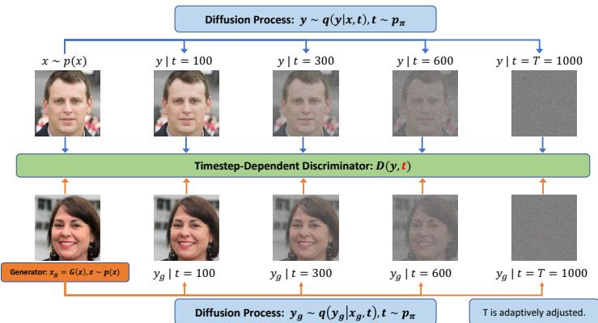
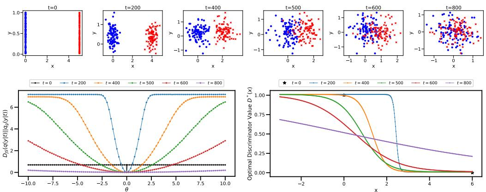
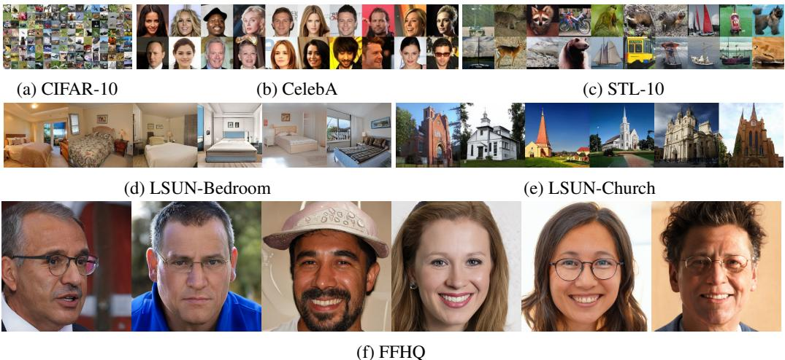
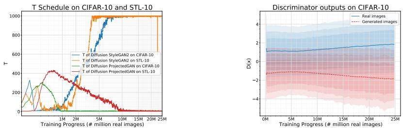
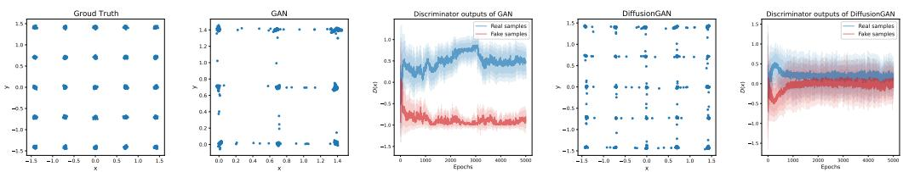
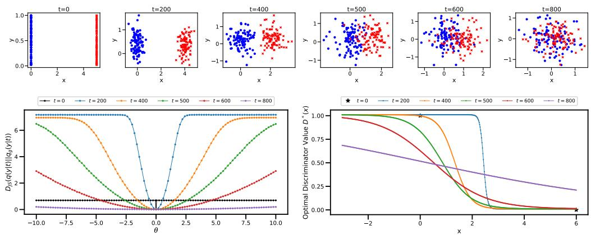
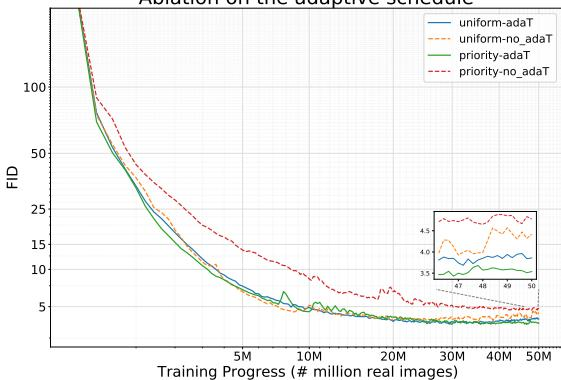
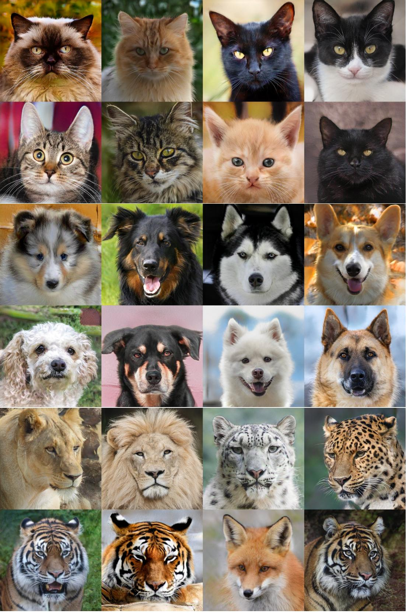

# 扩散生成对抗网络：通过扩散训练生成对抗网络

王振东1,2，郑煌杰1,2，彭程 $\mathbf { H e } ^ { 2 }$，陈伟煦2，周明源1 1德克萨斯大学奥斯汀分校，2微软Azure人工智能 {zhendong.wang, huangjie.zheng}@utexas.edu，{penhe,wzchen}@microsoft.com mingyuan.zhou@mccombs.utexas.edu

# 摘要

生成对抗网络（GAN）在稳定训练方面具有挑战性，向判别器输入注入实例噪声的有效性在实践中并不理想。在本文中，我们提出了一种新的GAN框架——扩散GAN，利用正向扩散链生成服从高斯混合分布的实例噪声。扩散GAN由三个组件组成，包括自适应扩散过程、依赖扩散时间步的判别器以及生成器。观察到的数据和生成的数据都通过相同的自适应扩散过程进行扩散。在每个扩散时间步，噪声与数据的比率不同，依赖时间步的判别器学习区分扩散的真实数据与扩散的生成数据。生成器通过反向传播学习判别器的反馈，这一过程通过自适应调整长度的正向扩散链，以平衡噪声和数据水平。我们理论上表明，判别器的时间步依赖策略给生成器提供了一致且有益的指导，帮助生成器匹配真实数据分布。我们在多个数据集上展示了扩散GAN相较于强大的GAN基线的优势，证明其能够生成更加真实的图像，并在稳定性和数据效率方面超过最先进的GAN。

# 1 引言

生成对抗网络（GANs）（Goodfellow 等，2014）及其变体（Brock 等，2018；Karras 等，2019；2020a；Zhao 等，2020）在合成照片级真实感高分辨率图像方面取得了巨大的成功。然而，实际应用中的GANs知名于其面临多种问题，从非收敛和训练不稳定到模式崩溃（Arjovsky 和 Bottou，2017；Mescheder 等，2018）。因此，针对GANs提出了广泛的分析和修改，包括改善网络架构（Karras 等，2019；Radford 等，2016；Sauer 等，2021；Zhang 等，2019），深入理解GAN训练的理论（Arjovsky 和 Bottou，2017；Heusel 等，2017；Mescheder 等，2017；2018），改变目标函数（Arjovsky 等，2017；Bellemare 等，2017；Deshpande 等，2018；Li 等，2017a；Nowozin 等，2016；Zheng 和 Zhou，2021；Yang 等，2021），对权重和/或梯度进行正则化（Arjovsky 等，2017；Fedus 等，2018；Mescheder 等，2018；Miyato 等，2018a；Roth 等，2017；Salimans 等，2016），利用边信息（Wang 等，2018；Zhang 等，2017；2020b），添加从数据到潜在表示的映射（Donahue 等，2016；Dumoulin 等，2016；Li 等，2017b），以及应用可微分数据增强（Karras 等，2020a；Zhang 等，2020a；Zhao 等，2020）。

一种简单的技术来稳定生成对抗网络（GAN）的训练是注入实例噪声，即在判别器输入中添加噪声，这可以扩大生成器和判别器分布的支撑，防止判别器过拟合（Arjovsky 和 Bottou，2017；Sønderby 等人，2017）。然而，这种技术在实践中难以实现，因为找到合适的噪声分布具有挑战性（Arjovsky 和 Bottou，2017）。Roth 等人（2017）表明，在高维判别器输入中添加实例噪声效果不佳，并提出通过为判别器添加零中心梯度惩罚来近似实现。Mescheder 等人（2018）理论和实证上证明了该方法的收敛性，他们还展示了在非饱和生成对抗网络中添加零中心梯度惩罚可以实现稳定训练，并且相比于WGAN-GP（Arjovsky 等人，2017），生成质量更好或相当。然而，Brock 等人（2018）警告称，零中心梯度惩罚和其他类似的正则化方法可能在稳定训练的同时牺牲生成性能。到目前为止，尚无现有工作能够实证证明在高维图像数据上使用实例噪声进行GAN训练的成功。

  

图：扩散生成对抗网络的流程图。顶部行的图像表示真实图像的正向扩散过程，而底部行的图像表示生成的假图像的正向扩散过程。判别器学习在所有扩散步骤中区分扩散后的真实图像和扩散后的假图像。

为了注入适当的实例噪声以促进GAN训练，我们引入了Diffusion-GAN，它使用扩散过程生成高斯混合分布的实例噪声。我们在图1中展示了Diffusion-GAN的图形表示。在Diffusion-GAN中，扩散过程的输入可以是实际图像或生成的图像，扩散过程由一系列步骤组成，这些步骤逐渐向图像添加噪声。扩散步骤的数量并不是固定的，而是依赖于数据和生成器。我们还设计了可微分的扩散过程，这意味着我们可以计算输出相对于输入的导数。这使我们能够通过扩散过程将梯度从判别器传播到生成器，并相应地更新生成器。与传统GAN直接比较真实与生成图像不同，Diffusion-GAN比较它们的噪声版本，这些噪声版本是通过从扩散步骤中的高斯混合分布中采样获得的，并借助我们的时间步相关判别器。该分布的特点是其组件具有不同的噪声与数据比，这意味着某些组件添加的噪声比其他组件更多。通过从该分布中采样，我们可以实现两个好处：首先，我们可以通过减少数据和生成器分布差异过大而导致的梯度消失问题来稳定训练；其次，我们可以通过创建同一图像的不同噪声版本来增强数据，这可以提高数据效率和生成器的多样性。我们提供了理论分析来支持我们的方法，并显示Diffusion-GAN的最小-最大目标函数，即衡量数据与生成器分布之间的差异，在每个点上都是连续且可微的。这意味着生成器理论上始终可以从判别器接收有用的梯度，并提高其性能。我们的主要贡献包括：1）我们理论和实证地展示了扩散过程如何被利用，以提供模型和领域无关的可微分增强，实现数据高效且无泄漏的稳定GAN训练。2）大量实验表明，Diffusion-GAN提升了包括StyleGAN2（Karras等，2020b）、Projected GAN（Sauer等，2021）和InsGen（Yang等，2021）在内的强基线的稳定性和生成性能，在合成逼真图像的任务中取得了最先进的结果，评估指标包括Fréchet Inception Distance (FID)（Heusel等，2017）和Recall评分（Kynkäänniemi等，2019）。

# 2 基础知识：生成对抗网络与基于扩散的生成模型

GAN（Goodfellow等，2014）是一类生成模型，旨在通过在两个神经网络之间建立一个最小-最大博弈来学习目标数据集的数据分布 $p ( { \pmb x } )$：生成器和判别器。生成器 $G$ 的输入是从简单先验分布 $p ( z )$ 中抽取的随机噪声向量 $_ { z }$，例如标准正态分布或均匀分布，试图生成与数据相似的逼真样本 $G ( z )$。判别器 $D$ 接收来自 $p ( { \pmb x } )$ 的真实数据样本 $_ { \textbf { \em x } }$ 或由 $G$ 生成的假样本 $G ( z )$，并试图正确地将其分类为真实或虚假。$G$ 的目标是使 $D$ 产生错误判断，而 $D$ 的目标是准确区分 $G ( z )$ 和 $_ { \textbf { \em x } }$。GAN 的最小-最大目标函数为

$$
\operatorname* { m i n } _ { G } \operatorname* { m a x } _ { D } V ( G , D ) = \mathbb { E } _ { { \pmb { x } } \sim p ( { \pmb x } ) } [ \log ( D ( { \pmb x } ) ) ] + \mathbb { E } _ { { \pmb z } \sim p ( { \pmb z } ) } [ \log ( 1 - D ( G ( { \pmb z } ) ) ) ] .
$$

在实践中，这个基本的目标函数通常会被修改以提高生成对抗网络（GANs）的稳定性和性能（Goodfellow et al., 2014; Miyato et al., 2018a; Fedus et al., 2018），但生成器 $G$ 和判别器 $D$ 之间对抗学习的基本概念仍然保持不变。

基于扩散的生成模型（Ho 等, 2020b；Sohl-Dickstein 等, 2015；Song 和 Ermon, 2019）假设 $\begin{array} { r } { p _ { \theta } ( \pmb { x } _ { 0 } ) : = \int p _ { \theta } ( \pmb { x } _ { 0 : T } ) d \pmb { x } _ { 1 : T } } \end{array}$，其中 $\pmb { x } _ { 1 } , \ldots , \pmb { x } _ { T }$ 是与数据相同维度的潜在变量 $\pmb { x } _ { 0 } \sim p ( \pmb { x } _ { 0 } )$。存在一个前向扩散链，在 $T$ 步中逐渐向数据 ${ \pmb x } _ { 0 } \sim { \pmb q } ( { \pmb x } _ { 0 } )$ 添加噪声，其方差调度为预定义的 $\beta _ { t }$ 和方差 $\sigma ^ { 2}$：

$$
\begin{array} { r } { q ( { \pmb x } _ { 1 : T } \mid { \pmb x } _ { 0 } ) : = \prod _ { t = 1 } ^ { T } q ( { \pmb x } _ { t } \mid { \pmb x } _ { t - 1 } ) , \quad q ( { \pmb x } _ { t } \mid { \pmb x } _ { t - 1 } ) : = \mathcal { N } ( { \pmb x } _ { t } ; \sqrt { 1 - \beta _ { t } } { \pmb x } _ { t - 1 } , \beta _ { t } \sigma ^ { 2 } I ) . } \end{array}
$$

一个显著的属性是，在任意时间步 $t$，$\mathbf { \Delta } _ { \mathbf { \mathcal { X } } _ { t } }$ 可以以闭合形式进行采样，如下所示：

$$
\begin{array} { r } { q ( { \boldsymbol x } _ { t } \mid { \boldsymbol x } _ { 0 } ) = \mathcal { N } ( { \boldsymbol x } _ { t } ; \sqrt { \bar { \alpha } _ { t } } { \boldsymbol x } _ { 0 } , ( 1 - \bar { \alpha } _ { t } ) \sigma ^ { 2 } I ) , \mathrm { w h e r e } \alpha _ { t } : = 1 - \beta _ { t } , \bar { \alpha } _ { t } : = \prod _ { s = 1 } ^ { t } \alpha _ { s } . } \end{array}
$$

然后使用变分下界（Blei et al., 2017）来优化反向扩散链，表示为

$$
\begin{array} { r } { p _ { \theta } ( \pmb { x } _ { 0 : T } ) : = \mathcal { N } ( \pmb { x } _ { T } ; \mathbf { 0 } , \sigma ^ { 2 } \pmb { I } ) \prod _ { t = 1 } ^ { T } p _ { \theta } ( \pmb { x } _ { t - 1 } \mid \pmb { x } _ { t } ) . } \end{array}
$$

# 3 扩散-氮化镓：方法与理论分析

为了构建扩散生成对抗网络（Diffusion-GAN），我们描述了如何通过扩散注入实例噪声，如何通过反向传播训练生成器，以及如何自适应调整扩散强度。我们还提供了理论分析，并通过一个玩具示例进行说明。

# 3.1 通过扩散注入实例噪声

我们旨在从生成网络 $G$ 中生成真实样本 $\scriptstyle { \pmb { x } } _ { g }$，该网络将从简单先验分布 $p ( z )$ 中抽样的潜变量 $_ { z }$ 映射到高维数据空间，例如图像。生成器样本的分布 $\pmb { x } _ { g } = G ( \pmb { z } )$ ，$z \sim p ( z )$ 用以下公式表示：$\begin{array} { r } { p _ { g } ( \pmb { x } ) = \int p ( \pmb { x } _ { g } \vert z ) \bar { p } ( z ) d z } \end{array}$。为了使生成器更加稳健和多样化，我们通过应用扩散过程向生成样本 $\scriptstyle { \mathbf { { \pmb x } } _ { g } }$ 注入实例噪声，该过程在每一步添加高斯噪声。扩散过程可以看作是一个马尔可夫链，从原始样本 $_ { \textbf { \em x } }$ 开始，逐渐抹去其信息，直到在 $T$ 步后达到噪声水平 $\sigma ^ { 2 }$。

我们定义了一种混合分布 $q ( \pmb { y } \vert \pmb { x } )$，它建模在扩散过程中任一步骤获得的带噪声样本 $\textbf { { y } $，每一步 $t$ 具有混合权重 $\pi _ { t }$。混合成分 $q ( \pmb { y } | \pmb { x } , t )$ 是均值与 $_ { \textbf { \em x } }$ 成比例的高斯分布，方差依赖于步骤 $t$ 的噪声水平。我们对真实样本 $\textstyle { \pmb x } \sim p ( { \pmb x } )$ 和生成样本 $\pmb { x } _ { g } \sim p _ { g } ( \pmb { x } ) $ 使用相同的扩散过程和混合分布。更具体地说，扩散诱导的混合分布表达为，其中 $q ( \pmb { y } \vert \pmb { x } )$ 是一个 $T$ 组件的混合分布，混合权重 $\pi _ { t }$ 是非负的且总和为一，而混合成分 $q ( \pmb { y } | \pmb { x } , t )$ 是通过扩散得到的，如方程（1）所示。

$$
\begin{array} { r } { \pmb { x } \sim p ( \pmb { x } ) , \pmb { y } \sim q ( \pmb { y } \mid \pmb { x } ) , q ( \pmb { y } \mid \pmb { x } ) : = \sum _ { t = 1 } ^ { T } \pi _ { t } q ( \pmb { y } \mid \pmb { x } , t ) , } \end{array}
$$

$$
\begin{array} { r } { \pmb { x } _ { g } \sim p _ { g } ( \pmb { x } ) , \pmb { y } _ { g } \sim q ( \pmb { y } _ { g } | \pmb { x } _ { g } ) , q ( \pmb { y } _ { g } | \pmb { x } _ { g } ) : = \sum _ { t = 1 } ^ { T } \pi _ { t } q ( \pmb { y } _ { g } | \pmb { x } _ { g } , t ) , } \end{array}
$$

该混合物的样本

$$
\begin{array} { r l } & { q ( { \pmb y } \mid { \pmb x } , t ) = \mathcal { N } ( { \pmb y } ; \sqrt { \bar { \alpha } _ { t } } { \pmb x } , ( 1 - \bar { \alpha } _ { t } ) \sigma ^ { 2 } { \pmb I } ) . } \\ & { \mathrm { ~ a n ~ b e ~ d r a w n ~ a s ~ } t \sim p _ { \pi } : = \mathrm { D i s c r e t e } ( \pi _ { 1 } , \dots , \pi _ { T } ) , { \pmb y } \sim q ( { \pmb y } \mid { \pmb x } , t ) . } \end{array}
$$

通过从这个混合分布中抽样 $\textbf { { y } }$，我们可以获得不同噪声程度的真实样本和生成样本的噪声版本。在扩散过程中，我们进行的步数越多，添加到 $\textbf { { y } $ 的噪声就越多，而我们从 $_ { \textbf { \em x } }$ 中保留的信息就越少。然后，我们可以利用这种扩散引起的混合分布来训练一个与时间步相关的鉴别器 $D$，以区分真实和生成的噪声样本，以及一个生成器 $G$，使生成的噪声样本的分布与真实噪声样本的分布匹配。接下来，我们介绍扩散生成对抗网络（Diffusion-GAN），它利用扩散引起的混合分布训练其鉴别器和生成器。

# 3.2 对抗训练

扩散生成对抗网络通过求解最小-最大博弈目标来训练其生成器和鉴别器如下：

$$
V ( G , D ) = \mathbb { E } _ { \alpha \sim p ( x ) , t \sim p _ { \pi } , y \sim q ( y | x , t ) } [ \log ( D _ { \phi } ( y , t ) ) ] + \mathbb { E } _ { z \sim p ( z ) , t \sim p _ { \pi } , y _ { g } \sim q ( y | G _ { \theta } ( z ) , t ) } [ \log ( 1 - D _ { \phi } ( y _ { g } , t ) ) ] .
$$

这里，$p ( { \pmb x } )$是真实数据分布，$p _ { \pi }$是一个离散分布，它为每个扩散步骤$t \in \{ 1 , \ldots , T \}$分配不同的权重$\pi _ { t }$，而$q ( \pmb { y } | \pmb { x } , t )$是给定原始数据$_ { \textbf { \em x } }$和扩散步骤$t$的扰动样本$\textbf { { y } }$的条件分布。根据公式(2)，通过高斯重参数化，扰动函数可以写成$\pmb { y } \doteq \sqrt { \bar { \alpha } _ { t } } \pmb { x } + \sqrt { 1 - \bar { \alpha } _ { t } } \sigma \epsilon$，其中$\begin{array} { r } { 1 - \bar { \alpha } _ { t } = 1 - \prod _ { s = 1 } ^ { t } \alpha _ { s } } \end{array}$是步骤$t$的累积噪声水平，$\sigma$是比例因子，$\epsilon \sim \mathcal { N } ( 0 , I )$是高斯噪声。

方程（3）中的目标函数鼓励鉴别器对受扰的真实数据分配高概率，对受扰的生成数据分配低概率，对于任何扩散步骤 $t$。另一方面，生成器则试图产生能够在任何扩散步骤 $t$ 欺骗鉴别器的样本。注意，受扰生成样本 ${ \pmb y } _ { g } \sim \ b q ( { \pmb y } | G _ { \theta } ( { \pmb z } ) , t )$ 可以重写为 $y _ { g } = \sqrt { { \bar { \alpha } } _ { t } } G _ { \theta } ( z ) + \sqrt { ( 1 - { \bar { \alpha } } _ { t } ) } \sigma \epsilon , \epsilon \sim { \mathcal N } ( 0 , I )$。这意味着方程（3）中的目标函数关于生成器参数是可微的，我们可以使用梯度下降法通过反向传播来优化它。方程（3）中的目标函数与原始 GAN (Goodfellow et al., 2014) 使用的目标函数类似，只是它涉及扩散步骤和扰动函数。我们可以表明，这个目标函数同样最小化真实分布和生成分布之间的 Jensen-Shannon (JS) 散度的近似，但与受扰样本和扩散步骤相关，如下所示：

$$
\mathcal { D } _ { \mathrm { J S } } ( p ( \pmb { y } , t ) | | p _ { g } ( \pmb { y } , t ) ) = \mathbb { E } _ { t \sim p _ { \pi } } [ \mathcal { D } _ { \mathrm { J S } } ( p ( \pmb { y } | t ) | | p _ { g } ( \pmb { y } | t ) ) ] .
$$

JS散度衡量两个概率分布之间的相似性，当这两个分布完全相同时，其最小值为零。等式(4)中的等式证明见附录C。由此结果自然产生的问题是，最小化扰动分布之间的JS散度是否意味着最小化原始分布之间的JS散度，即，等式(3)的最优生成器是否也是$\mathcal { D } _ { \mathrm { J S } } ( p ( \pmb { x } ) || p _ { g } ( \pmb { x } ) )$的最优生成器。我们将在3.4节中对此问题给出肯定的回答并提供理论依据。

# 3.3 自适应扩散

通过扰动函数和时间步长依赖性，我们有了一种优化鉴别器的新策略。我们希望鉴别器 $D$ 面临一个具有挑战性的任务，既不能过于简单以至于造成数据过拟合（Karras 等，2020a；Zhao 等，2020），也不能过于困难以阻碍学习。因此，我们调整扩散过程的强度，该过程根据 $D$ 能多大程度上区分 $\textbf { { y } }$ 和 ${ \pmb y } _ { g }$ 向它们添加噪声。当扩散步骤 $t$ 较大时，噪声与数据的比率更高，任务也更难。我们使用 $1 - \bar { \alpha } _ { t }$ 来衡量扩散强度，随着 $t$ 增大而增加。为了控制扩散强度，我们自适应地修改最大步骤数 $T$。我们的策略是让鉴别器首先从最简单的样本（即原始数据样本）学习，然后通过提供来自更大 $t$ 的样本来逐渐增加难度。为此，我们使用依赖于指标 $r _ { d }$ 的自适应进度表，该指标估计鉴别器在多大程度上对数据进行了过拟合：

$$
r _ { d } = \mathbb { E } _ { y , t \sim p ( y , t ) } [ { \mathrm { s i g n } } ( D _ { \phi } ( y , t ) - 0 . 5 ) ] , \quad T = T + { \mathrm { s i g n } } ( r _ { d } - d _ { t a r g e t } ) * C ,
$$

其中 $r _ { d }$ 与 Karras 等人（2020a）中的相同，$C$ 是一个常数。我们每四个小批量计算一次 $r _ { d }$ 并更新 $T$。我们有两种选项来选择用于从扩散过程采样 $t$ 的分布 $p _ { \pi }$：

$$
t \sim p _ { \pi } : = \left\{ \begin{array} { l l } { \mathrm { u n i f o r m : } } & { \mathrm { D i s c r e t e } \left( \frac { 1 } { T } , \frac { 1 } { T } , \dots , \frac { 1 } { T } \right) , } \\ { \mathrm { p r i o r i t y : } } & { \mathrm { D i s c r e t e } \left( \frac { 1 } { \sum _ { t = 1 } ^ { T } t } , \frac { 2 } { \sum _ { t = 1 } ^ { T } t } , \dots , \frac { T } { \sum _ { t = 1 } ^ { T } t } \right) , } \end{array} \right.
$$

“优先级”选项对较大的 $t$ 赋予更多权重，这意味着当 $T$ 增加时，鉴别器将看到来自新步骤的更多新样本。这是因为我们希望鉴别器关注尚未见过的新样本和更困难的样本，因为这表明它对较容易的样本有信心。请注意，即使启用“优先级”选项，鉴别器仍然可以看到来自较小 $t$ 的样本，因为 $q ( \pmb { y } \vert \pmb { x } )$ 是覆盖扩散链所有步骤的高斯混合模型。为了避免在训练期间 $T$ 的突然变化，我们使用一个探索列表 $\pmb { t } _ { e p l }$，其中包含从 $p _ { \pi }$ 采样的 $t$ 值。我们保持 $\mathbf { \Delta } \mathbf { \mathcal { t } } _ { e p l }$ 固定，直到我们更新 $T$，并从 $\mathbf { \Delta } \mathbf { \mathcal { t } } _ { e p l }$ 中采样 $t$ 以生成给鉴别器的噪声样本。这样，模型可以在提高 $T$ 之前充分探索每个 $t$。我们在附录 $\mathrm { F }$ 的算法 1 中给出了 Diffusion-GAN 的训练细节。

# 3.4 理论分析与实例

为了更好地理解我们提出的方法的理论性质，我们提出了两个定理来解答关于使用基于扩散的实例噪声注入训练GAN的两个重要问题。这些定理的证明延迟到附录B。第一个问题，标记为 (a)，是关于在扩散过程中向真实样本和生成样本添加噪声是否可以促进学习。第二个问题，标记为 $\mathbf{(b)}$，是关于最小化噪声样本及噪声水平的联合分布之间的JS散度 $p(\pmb{y}, t)$ 和 $p_g(\pmb{y}, t)$ ，是否能够导致与最小化真实样本和生成样本的原始分布之间的JS散度 $p(\pmb{x})$ 和 $\bar{p}_g(\pmb{x})$ 相同的最优生成器。为了回答问题 (a)，我们证明，对于任何噪声水平 $t$ 和任何凸函数 $f$ 的选择，真实样本和生成样本的边际分布之间的 $f$-散度（Nowozin et al., 2016）$q(\pmb{y}|t)$ 和 $q(\pmb{y}_g \mid t)$ 是一个光滑函数，可以通过判别器计算和优化。这意味着基于扩散的噪声注入不会在GAN的目标函数中引入任何奇点或不连续性。JS散度是 $f$-散度的特例，其中 $f(u) = - \bar{\log(2u)} - \log(2 - 2u)$。

定理 1（GANs训练中的有效梯度）。设 $p ( { \pmb x } )$ 是在 $\mathcal { X }$ 上的固定分布，$_ { z }$ 是在另一个空间 $\mathcal { Z }$ 上的随机噪声。定义 $G _ { \theta } : { \mathcal { Z } } \to { \mathcal { X }$ 为一个参数为 $\theta$ 的函数，其输入为 $_ z$，且 $p _ { g } ( \pmb { x } )$ 为 $G _ { \theta } ( z )$ 的分布。设 $q ( { \pmb y } | { \pmb x } , t ) = \mathcal { N } ( \pmb { y } ; \sqrt { \bar { \alpha } _ { t } } \pmb { x } , ( 1 - \bar { \alpha } _ { t } ) \sigma ^ { 2 } \pmb { I } )$，其中 ${ { \bar { \alpha } } _ { t } } ~ \in ~ ( 0 , 1 )$ 且 $\sigma > 0$。设 $\begin{array} { r } { q ( \pmb { y } | t ) = \int p ( \pmb { x } ) q ( \pmb { y } | \pmb { x } , t ) d \pmb { x } } \end{array}$ 和 $\begin{array} { r } { q _ { g } ( \pmb { y } | t ) = \int p _ { g } ( \pmb { x } ) q ( \pmb { y } | \pmb { x } , t ) d \pmb { x } } \end{array}$。则对任意 $t$，如果函数 $G _ { \theta }$ 连续且可微，则 $f$ 散度 $\mathcal { D } _ { f } ( q ( \dot { \pmb { y } } | t ) || q _ { g } ( \pmb { y } | t ) )$ 关于 $\theta$ 是连续且可微的。

定理1表明，在扩散噪声注入$q ( \pmb { y } | \pmb { x } , t )$的帮助下，$\forall t$，$\textbf { { y } }$和${ \pmb y } _ { g }$定义在同一个支持空间上，即整个$\mathcal { X }$，且$\mathscr { D } _ { f } ( q ( \pmb { y } | t ) | | q _ { g } ( \pmb { y } | t ) )$在处处连续且可微。那么，自然会产生一个问题：如果$\mathcal { D } _ { f } ( \bar { q } ( \pmb { y } | t ) | | q _ { g } ( \pmb { y } | t ) )$保持近乎恒定值，从而提供很少有用的梯度，该如何处理。因此，我们通过经验表明，通过在扩散链的所有步骤上定义的混合物注入噪声，总是有很大机会抽样到一个足够大的$t$，以提供有用的梯度，以下是一个玩具示例。玩具示例。我们使用Arjovsky等人（2017）中的相同简单示例来说明我们的方法。设$\pmb { x } = ( 0 , z )$为真实数据，$\bar { \boldsymbol { x } } _ { g } = ( \theta , \bar { z } )$为由一个参数生成器生成的数据，其中$z$是$[ 0 , 1 ]$中的均匀随机变量。真实分布和生成分布之间的JS散度$\mathcal { D } _ { \mathrm { J S } } ( p ( \pmb { x } ) | | p ( \pmb { x } _ { g } ) )$是不连续的：当$\theta = 0$时为0，其他情况为$\log 2$，因此它并未提供一个有用的梯度来引导$\theta$朝向零。

我们向真实数据和生成数据引入基于扩散的噪声，如图2的第一行所示。带噪声的数据 $\textbf{y}$ 和 ${\pmb y}_{g}$ 的支持范围覆盖整个空间 $\mathbb{R}^{2}$，它们的密度重叠程度取决于扩散步长 $t$ 。在图2的第二行左侧，我们绘制了带噪声的分布之间的JS散度 $\mathcal{D}_{\mathrm{JS}}(q(\pmb{y}|t)||q_{g}(\pmb{y}|t))$ 随 $\theta$ 的变化情况，针对不同的 $t$ 值。伴随 $t \approx 0$ 的黑线表示原始的JS散度，在 $\theta = 0$ 处存在不连续性。随着 $t$ 的增加，JS散度曲线变得更加平滑，并且在更大的 $\theta$ 范围内具有非零梯度。然而，一些值的 $t$，例如此示例中的 $t = 200$，仍然存在近似恒定的平坦区域。为避免这种情况，我们使用所有步骤的混合，以确保总是有较高的可能性获得有用的梯度。对于判别器优化，如图2的第二行右侧所示，原始JS散度下的最优判别器是不连续且不可达的。通过基于扩散的噪声，最优判别器随 $t$ 变化：较小的 $t$ 使其更加自信，而较大的 $t$ 则使其更加谨慎。因此，扩散充当了一种平衡判别器能力的尺度。这表明使用可微分的前向扩散链可以提供各种水平的梯度平滑度，以帮助生成器的训练。

  
urThe toy example inherited from Arovsky et al. 07The frst row plots the distributions  data with diffusion noise injected for $t$ . The second row shows the JS divergence and the optimal discriminator value with and without our noise injection.

定理 2（非泄漏噪声注入）。设 ${ \pmb x } \sim p ( { \pmb x } ) , { \pmb y } \sim q ( { \pmb y } | { \pmb x } )$ 且 ${ \pmb x } _ { g } \sim p _ { g } ( { \pmb x } ) , { \pmb y } _ { g } \sim q ( \pmb { y } _ { g } | \pmb { x } _ { g } )$，其中 $q ( \pmb { y } | \pmb { x } )$ 是转移密度。给定某个 $q ( \pmb { y } \vert \pmb { x } )$，如果 $\textbf { { y } }$ 可以重新参数化为 ${ \pmb y } = f ( { \pmb x } ) + h ( { \pmb \epsilon } )$，其中 $\epsilon \sim p ( \epsilon )$，$p ( \epsilon )$ 是已知分布，且 $f$ 和 $h$ 都是单映射函数，则我们可以得到 $p ( \pmb { y } ) = p _ { g } ( \pmb { y } ) \Leftrightarrow p ( \pmb { x } ) = p _ { g } ( \pmb { x } )$。

为回答问题 $\mathbf { ( b ) }$，我们提出定理 2，该定理展示了原始和扩展数据分布相等的充分条件。根据定理 2，函数 $f$ 将每个 $_ { \textbf { \em x } }$ 映射到一个唯一的 $\textbf { { y } }$，函数 $h$ 将每个 $\epsilon$ 映射到一个唯一的噪声项，且 $\epsilon$ 的分布是已知的，并且与 $_ { \textbf { \em x } }$ 独立。在这些假设下，定理证明了 $\textbf { { y } }$ 的分布当且仅当 $_ { \textbf { \em x } }$ 的分布与 $\scriptstyle { \pmb { x } } _ { g }$ 的分布相同时，$\textbf { { y } }$ 的分布与 ${ \pmb y } _ { g }$ 的分布相同。如果我们将 $\mathbf { \nabla } _ { \mathbf { \boldsymbol { y } } } \left| \mathbf { \nabla } _ { t } \right.$ 视为定理中引入的 $\textbf { { y } }$，那么对 $\forall t$ ，方程 (2) 符合所做的假设。这意味着，通过最小化 $q ( \pmb { y } | t )$ 和 $q _ { g } ( \pmb { y } \vert t )$ 之间的散度，这与最小化 $p ( { \pmb x } ) \mid t$ 和 $p _ { g } ( \pmb { x } ) \vert t$ 之间的散度相同，我们同时也在最小化 $p ( { \pmb x } )$ 和 $p _ { g } ( \pmb { x } )$ 之间的散度。这表明噪声注入不会影响生成样本的质量，我们可以安全地使用我们的噪声注入来改善生成模型的训练。

# 3.5 相关工作

所提出的扩散生成对抗网络（Diffusion-GAN）可以与之前关于稳定生成对抗网络（GAN）训练的工作、基于扩散的生成模型的构建以及数据高效的GAN训练中差分增强的构造进行关联。对这些相关工作的详细讨论已推迟到附录A中。

# 4 实验

我们进行广泛的实验以回答以下问题：（a）扩散生成对抗网络（Diffusion-GAN）是否会在基准数据集上优于最先进的生成对抗网络（GAN）基线？（b）基于扩散的噪声注入是否有助于在领域无关任务中提升GAN的学习？（c）我们的方法是否能提高用极少量数据训练的数据高效GAN的性能？数据集。我们在图像数据集上进行实验，涵盖从低分辨率（例如，$3 2 \times$ 32）到高分辨率（例如，$1 0 2 4 \times 1 0 2 4$）以及从低多样性到高多样性：CIFAR-10（Krizhevsky，2009）、STL-10（Coates等，2011）、LSUN-Bedroom（Yu等，2015）、LSUN-Church（Yu等，2015）、AFHQ（猫/狗/野生）（Choi等，2020）和FFHQ（Karras等，2019）。这些基准数据集的更多细节见附录E。评估协议。我们使用FID（Heusel等，2017）测量图像质量。按照Karras等（2019；2020b）的做法，我们使用$5 0 \mathrm { k}$生成样本来测量FID，训练集全体作为参考。我们使用显示给判别器的真实图像数量来评估收敛性（Karras等，2020a；Sauer等，2021）。除非另有说明，所有模型都使用2500万张图像进行训练以确保收敛（使用更多或更少图像训练的情况在表注中指定）。我们进一步报告由Kynkänniemi等（2019）引入的改进召回率评分，以测量生成模型的样本多样性。

Table 1: Image generation results on benchmark datasets: CIFAR-10, CelebA, STL-10, LSUN-Bedroom, LSUN-Church, and FFHQ. We highlight the best and second best results in each column with bold and underline, respectively. Lower FIDs indicate better fidelity, while higher Recalls indicate better diversity.   

<table><tr><td rowspan="3">Methods</td><td colspan="2">CIFAR-10 (32 × 32)</td><td colspan="2">CelebA</td><td colspan="2">STL-10</td><td colspan="2">LSUN-Bedroom</td><td colspan="2">LSUN-Church</td><td colspan="2">FFHQ</td></tr><tr><td colspan="2"></td><td colspan="2">(64 × 64)</td><td colspan="2">(64 × 64)</td><td colspan="2">(256 × 256)</td><td colspan="2">(256 × 256)</td><td colspan="2">(1024 × 1024)</td></tr><tr><td>FID</td><td>Recall</td><td>FID</td><td>Recall</td><td>FID</td><td>Recall</td><td>FID</td><td>Recall</td><td>FID</td><td>Recall</td><td>FID</td><td>Recall</td></tr><tr><td>StyleGAN2 (Karras et al., 2020a)</td><td>8.32*</td><td>0.41*</td><td>2.32</td><td>0.55</td><td>11.70</td><td>0.44</td><td>3.98</td><td>0.32</td><td>3.93</td><td>0.39</td><td>4.41</td><td>0.42</td></tr><tr><td>StyleGAN2 + DiffAug (Zhao et al., 2020)</td><td>5.79*</td><td>0.42*</td><td>2.75</td><td>0.52</td><td>12.97</td><td>0.39</td><td>4.25</td><td>0.19</td><td>4.66</td><td>0.33</td><td>4.46</td><td>0.41</td></tr><tr><td>StyleGAN2 + ADA (Karras et al., 2020a)</td><td>2.92*</td><td>0.49*</td><td>2.49</td><td>0.53</td><td>13.72</td><td>0.36</td><td>7.89</td><td>0.05</td><td>4.12</td><td>0.18</td><td>4.47</td><td>0.41</td></tr><tr><td>Diffusion StyleGAN2</td><td>3.19</td><td>0.58</td><td>1.69</td><td>0.67</td><td>11.43</td><td>0.45</td><td>3.65</td><td>0.32</td><td>3.17</td><td>0.42</td><td>2.83</td><td>0.49</td></tr></table>

  

Figure 3: Randomly generated images from Diffusion StyleGAN2 trained on CIFAR-10, CelebA, STL-10, LSUN-Bedroom, LSUN-Church, and FFHQ datasets.

实现与资源。我们基于 StyleGAN2 (Karras 等, 2020b)、ProjectedGAN (Sauer 等, 2021) 和 InsGen (Yang 等, 2021) 的代码构建视频扩散生成对抗网络（Diffusion-GANs）以回答问题 (a)、(b) 和 (c)。Diffusion GAN 继承了其对应基本 GAN 的所有网络架构和训练超参数，具体细节在附录 G 中提供。特别针对 StyleGAN2 和 InsGen，我们将判别器构建为 $D _ { \phi } ( \pmb { y } , t )$，其中 $t$ 通过其映射网络注入。对于 ProjectedGAN，我们在经验上发现判别器中的 $t$ 可以忽略，以简化实现并最小化对 ProjectedGAN 的修改。更多实现细节见附录 H。通过应用基于扩散的噪声注入，我们将我们的模型称为 Diffusion StyleGAN2/ProjectedGAN/InsGen。在接下来的实验中，如果结果不可用，我们将使用其官方代码训练相关模型，而其他模型的结果均来自参考文献，并标记为 \*。我们根据继承的训练配置的需求，使用 4 或 8 块 NVIDIA V100 GPU 进行所有实验。

# 4.1 与最先进生成对抗网络的比较

我们将Diffusion-GAN与其最先进的GAN主干网络StyleGAN2（Karras et al., 2020a）进行比较，并从数据增强的角度评估其有效性，我们还将其与StyleGAN2 $^ +$ DiffAug（Zhao et al., 2020）和StyleGAN2 $^ +$ ADA（Karras et al., 2020a）进行比较，比较指标为样本保真度（FID）和样本多样性（Recall），在广泛的基准数据集上进行测试。我们在表1和图3中呈现定量和定性结果。在定性方面，从Diffusion StyleGAN2生成的图像都是照片级真实，且具有良好的多样性，分辨率范围从低分辨率$(32 \times 32)$到高分辨率$(1024 \times 1024)$。附录L中可以找到额外的随机生成图像。在定量方面，Diffusion StyleGAN2在所有6个基准数据集中，在生成多样性方面（以Recall衡量）均优于所有GAN基线，并在6个基准数据集中有5个的FID上明显超越它们。

  

Figure 4: Plot of adaptively adjusted maximum diffusion steps $T$ and discriminator outputs of Diffusion-GANs.

从数据增强的角度来看，我们观察到扩散式StyleGAN2在各种数据集上的表现始终明显优于主干模型StyleGAN2，这在实证上验证了我们的定理2。相反，ADA（Karras et al., 2020b）和Diffaug（Zhao et al., 2020）技术在足够大的数据集上，例如LSUN-Bedroom和LSUN-Church，有时会损害生成性能，这在Yang et al.（2021）对FFHQ的研究中也得到了观察。这可能是因为它们泄露增强的风险掩盖了数据增强的好处。为了调查自适应扩散过程在训练中的工作原理，我们在图4中展示了我们自适应扩散的最大时间步 $T$ 和判别器输出的收敛情况。我们看到$T$是自适应调整的：Diffusion StyleGAN2的$T$随着训练的进行而增加，而Diffusion ProjectedGAN的$T$则是先上升后下降。请注意，$T$是根据判别器的过拟合状态进行调整的。第二面板显示，使用基于扩散的混合分布进行训练的判别器始终表现良好，并为生成器提供有用的学习信号，这验证了我们在第3.4节和定理1中的分析。内存和时间成本。一般而言，Diffusion-GAN的内存和时间成本与相应的GAN基线相当。更具体地说，从ADA（Karras et al., 2020a）切换到我们的基于扩散的增强，增加的内存成本为负，增加的训练时间成本为负，增加的推理时间成本为零。例如，对于CIFAR-10，使用四个NVIDIA V100 GPU，每$4 \mathrm { k }$图像的训练时间大约为StyleGAN2的8.0秒，StyleGAN2-ADA的9.8秒，以及Diffusion-StyleGAN2的9.5秒。

# 4.2 扩散氮化镓在领域无关增强中的有效性

为了验证我们的方法是否具有领域无关性，我们将扩散生成对抗网络（Diffusion-GAN）应用于生成对抗网络（GAN）的输入特征向量。我们在低维和高维特征向量上进行实验，此时常用的图像增强方法不再适用。25高斯示例。我们在流行的25高斯生成任务上进行实验。25高斯数据集是一个二维玩具数据集，由25个二维高斯分布的混合生成。每个数据点是一个二维特征向量。我们训练了一个小型GAN模型，其生成器和判别器均由多层感知机（MLP）参数化，具有两个128单元的隐藏层和LeakyReLu非线性激活函数。训练结果如图5所示。我们观察到原始GAN表现出严重的模式崩溃，只捕获了少数几种模式。它的判别器对真实样本和假样本的输出迅速偏离。这表明判别器发生了严重过拟合，导致其停止为生成器提供有效的学习信号。然而，DiffusionGAN成功捕获了所有25个高斯模式，判别器在控制之下能够持续提供有效的学习信号。我们从两个角度解释了改进：首先，无泄漏增强有助于提供更多关于数据空间的信息；其次，鉴于自适应调整的基于扩散的噪声注入，判别器表现良好。

ProjectedGAN。为了验证我们基于自适应扩散的噪声注入能够改善GAN在高维特征向量上的学习，我们直接将其应用于ProjectedGAN的判别器特征空间（Sauer等，2021）。ProjectedGAN通常利用预训练的神经网络提取有意义的特征，以进行判别器和生成器的对抗学习。遵循Sauer等（2021）的做法，我们对EfficientNet-v0提取的特征向量进行自适应扩散，并保持其他训练部分不变。我们在表2中报告了Diffusion ProjectedGAN在多个基准数据集上的性能，这验证了我们的方法是与领域无关的。在ProjectedGAN框架下，我们观察到当噪声适当地注入到高维特征空间时，Diffusion ProjectedGAN在FID和召回率方面均表现出明显的改善。我们在STL-10和LSUN-Bedroom/Church数据集上通过Diffusion ProjectedGAN达到了最先进的FID结果。

  

Figure 5: The 25-Gaussians example. We show the true data samples, the generated samples from vanilla GANs, the discriminator outputs of the vanilla GANs, the generated samples from our Diffusion-GAN, and the discriminator outputs of Diffusion-GAN.

Table 2: Domain-agnostic experiments on ProjectedGAN.   

<table><tr><td rowspan="2">Domain-agnostic Tasks</td><td colspan="2">CIFAR-10 (32 × 32)</td><td colspan="2">STL-10 (64 × 64)</td><td colspan="2">LSUN-Bedroom (256 × 256)</td><td colspan="2">LSUN-Church (256 × 256)</td></tr><tr><td>FID</td><td>Recall</td><td>FID</td><td>Recall</td><td>FID</td><td>Recall</td><td>FID</td><td>Recall</td></tr><tr><td>ProjectedGAN (Sauer et al., 2021)</td><td>3.10</td><td>0.45</td><td>7.76</td><td>0.35</td><td>2.25</td><td>0.55</td><td>3.42</td><td>0.56</td></tr><tr><td>Diffusion ProjectedGAN</td><td>2.54</td><td>0.45</td><td>6.91</td><td>0.35</td><td>1.43</td><td>0.58</td><td>1.85</td><td>0.65</td></tr></table>

# 4.3 Diffusion-GAN在有限数据下的有效性

我们评估Diffusion-GAN是否能够提供数据高效的GAN训练。我们首先生成五个FFHQ $( 1 0 2 4 \times 1 0 2 4 )$ 数据集划分，分别由200、500、1000、2000和5000张图像组成，其中200和500张图像被视为极其有限的数据情况。我们还考虑AFHQ-Cat、-Dog和-Wild $( 5 1 2 \times 5 1 2 )$，每个数据集图像数约为5000张。受到InsGen（Yang等，2021）在小型数据集上成功的激励，我们在其基础上构建了我们的Diffusion-GAN。我们注意到在有限数据的情况下，InsGen在性能上显著优于StyleGAN2 $+ .$ ADA和$+$ Diffug，目前在数据高效的GAN训练中保持着最先进的性能。表3的结果表明，我们的Diffusion-GAN方法可以进一步提高InsGen在有限数据设置中的性能。

Table 3: FFHQ $1 0 2 4 \times 1 0 2 4 )$ FID results with 200, 500, 1k, 2k, and 5k training samples; AFHQ $( 5 1 2 \times 5 1 2 )$ FID results. To ensure convergence, all models are trained across 10M images for FFHQ and 25M images for AFHQ. We bold the best number in each column.   

<table><tr><td>Models</td><td>FFHQ (200)</td><td>FFHQ (500)</td><td>FFHQ (1k)</td><td>FFHQ (2k)</td><td>FFHQ (5k)</td><td>Cat</td><td>Dog</td><td>Wild</td></tr><tr><td>InsGen (Yang et al., 2021)</td><td>102.58</td><td>54.762</td><td>34.90</td><td>18.21</td><td>9.89</td><td>2.60*</td><td>5.44*</td><td>1.77*</td></tr><tr><td>Diffusion InsGen</td><td>63.34</td><td>50.39</td><td>30.91</td><td>16.43</td><td>8.48</td><td>2.40</td><td>4.83</td><td>1.51</td></tr></table>

# 5 结论

我们提出了Diffusion-GAN，这是一种新颖的GAN框架，使用变长的正向扩散链和高斯混合分布生成实例噪声以进行GAN训练。这种方法使得模型和领域无关的可微增广成为可能，利用扩散的优势，而无需昂贵的反向扩散链。我们理论上证明并实证演示了Diffusion-GAN可以防止判别器过拟合并提供非泄漏增广。我们还展示了Diffusion-GAN能够生成高分辨率的逼真图像，具有高保真度和多样性，根据FID和Recall在标准基准数据集上优于相应的最先进GAN基线。 致谢：Z. Wang、H. Zheng 和 M. Zhou 感谢NSF-IIS 2212418和IFML的支持。 参考文献： - Martín Arjovsky和Léon Bottou. 针对生成对抗网络的原则性训练方法。在2017年国际表征学习会议(ICLR)，法国图伦，2017年4月24-26日，会议论文集。OpenReview.net，2017。URL https://openreview.net/forum?id=Hk4_qw5xe - Martin Arjovsky、Soumith Chintala 和 Léon Bottou. Wasserstein生成对抗网络。在第34届国际机器学习大会论文集-卷70，页214-223，2017。 - Marc G Bellemare、Ivo Danihelka、Will Dabney、Shakir Mohamed、Balaji Lakshminarayanan、Stephan Hoyer 和 Rémi Munos. Cramer距离作为偏置Wasserstein梯度的解决方案。arXiv预印本 arXiv:1705.10743，2017。 - David M Blei、Alp Kucukelbir 和 Jon D McAuliffe. 变分推断：给统计学家的综述。美国统计协会杂志，112(518)：859-877，2017。 - Ashish Bora、Eric Price 和 Alexandros G. Dimakis. AmbientGAN：从有损测量生成模型。在国际表征学习会议，2018。URL https://openreview.net/forum?id=Hy7fDog0b - Andrew Brock、Jeff Donahue 和 Karen Simonyan. 大规模GAN训练用于高保真的自然图像合成。arXiv预印本 arXiv:1809.11096，2018。 - Yunjey Choi、Youngjung Uh、Jaejun Yoo 和 Jung-Woo Ha. StarGAN v2：多领域多样性图像合成。2020年第IEEE/CVF计算机视觉与模式识别会议(CVPR)，页8185-8194，2020。 - Adam Coates、Andrew Ng 和 Honglak Lee. 关于无监督特征学习中的单层网络分析。在第十四届国际人工智能与统计会议论文集，页215-223。JMLR研讨会和会议论文集，2011。 - Jia Deng、Wei Dong、Richard Socher、Li-Jia Li、Kai Li 和 Li Fei-Fei. Imagenet：大规模分层图像数据库。在2009年IEEE计算机视觉与模式识别会议，页248-255。IEEE，2009。 - Ishan Deshpande、Ziyu Zhang 和 Alexander G Schwing. 采用切片Wasserstein距离的生成建模。在IEEE计算机视觉与模式识别会议论文集，页3483-3491，2018。 - Prafulla Dhariwal 和 Alexander Quinn Nichol. 扩散模型在图像合成中超越GAN。在A. Beygelzimer、Y. Dauphin、P. Liang和J. Wortman Vaughan主编的《神经信息处理系统进展》2021。URL https://openreview.net/forum?id=AAWuCvzaVt - Jeff Donahue、Philipp Krähenbühl 和 Trevor Darrell. 对抗特征学习。arXiv预印本 arXiv:1605.09782，2016。 - Vincent Dumoulin、Ishmael Belghazi、Ben Poole、Olivier Mastropietro、Alex Lamb、Martin Arjovsky 和 Aaron Courville. 对抗学习推断。arXiv预印本 arXiv:1606.00704，2016。 - William Fedus、Mihaela Rosca、Balaji Lakshminarayanan、Andrew M Dai、Shakir Mohamed 和 Ian Goodfellow. 多条路径走向平衡：GAN不需要在每一步减少散度。在国际表征学习会议，2018。 - Ian Goodfellow、Jean Pouget-Abadie、Mehdi Mirza、Bing Xu、David Warde-Farley、Sherjil Ozair、Aaron Courville 和 Yoshua Bengio. 生成对抗网络。在神经信息处理系统的进展中，页2672-2680，2014。 - Ishaan Gulrajani、Faruk Ahmed、Martin Arjovsky、Vincent Dumoulin 和 Aaron C Courville. 改进Wasserstein GAN的训练。在神经信息处理系统的进展中，页5767-5777，2017。 - Martin Heusel、Hubert Ramsauer、Thomas Unterthiner、Bernhard Nessler 和 Sepp Hochreiter. 采用双时间尺度更新规则训练的GAN收敛到局部Nash均衡。在神经信息处理系统的进展中，页6626-6637，2017。 - Jonathan Ho、Ajay Jain 和 P. Abbeel. 去噪扩散概率模型。arXiv，abs/2006.11239，2020a。 - Jonathan Ho、Ajay Jain 和 Pieter Abbeel. 去噪扩散概率模型。《神经信息处理系统进展》，33：6840-6851，2020b。 - Tero Karras、Samuli Laine 和 Timo Aila. 基于风格的生成对抗网络生成器架构。在IEEE/CVF计算机视觉与模式识别会议论文集，页4401-4410，2019。 - Tero Karras、Miika Aittala、Janne Hellsten、Samuli Laine、Jaakko Lehtinen 和 Timo Aila. 使用有限数据训练生成对抗网络。《神经信息处理系统进展》，33：12104-12114，2020a。 - Tero Karras、Samuli Laine、Miika Aittala、Janne Hellsten、Jaakko Lehtinen 和 Timo Aila. 分析和改进StyleGAN的图像质量。在IEEE/CVF计算机视觉与模式识别会议论文集，页8110-8119，2020b。 - Diederik P. Kingma 和 Max Welling. 自编码变分贝叶斯。CoRR，abs/1312.6114，2014。 - Zhifeng Kong 和 Wei Ping. 快速采样扩散概率模型。arXiv预印本 arXiv:2106.00132，2021。 - Alex Krizhevsky. 从小图像中学习多层特征。2009。 - Tuomas Kynkäänniemi、Tero Karras、Samuli Laine、Jaakko Lehtinen 和 Timo Aila. 改进生成模型评估的精确度和召回率指标。《神经信息处理系统进展》，32，2019。 - Chun-Liang Li、Wei-Cheng Chang、Yu Cheng、Yiming Yang 和 Barnabás Póczos. MMD GAN：朝向更深入理解时刻匹配网络。《神经信息处理系统进展》，30，2017a。 - Chunyuan Li、Hao Liu、Changyou Chen、Yuchen Pu、Liqun Chen、Ricardo Henao 和 Lawrence Carin. Alice：朝向理解对抗学习以实现联合分布匹配。《神经信息处理系统进展》，30，2017b。 - Bingchen Liu、Yizhe Zhu、Kunpeng Song 和 Ahmed Elgammal. 朝向更快且稳定的高保真数图像合成的GAN训练。在国际表征学习会议，2020。 - Eric Luhman 和 Troy Luhman. 在迭代生成模型中进行知识蒸馏以提高采样速度。arXiv预印本 arXiv:2101.02388，2021。 - Lars Mescheder、Sebastian Nowozin 和 Andreas Geiger. GAN的数值问题。《神经信息处理系统进展》，30，2017。 - Lars Mescheder、Andreas Geiger 和 Sebastian Nowozin. 哪些GAN训练方法实际上收敛？在国际机器学习会议，页3481-3490。PMLR，2018。 - Takeru Miyato、Toshiki Kataoka、Masanori Koyama 和 Yuichi Yoshida. 生成对抗网络的谱规范化。在国际表征学习会议，2018a。URL https://openreview.net/forum?id=B1QRgziT- - Takeru Miyato、Toshiki Kataoka、Masanori Koyama 和 Yuichi Yoshida. 生成对抗网络的谱规范化。在国际表征学习会议，2018b。 - Alex Nichol、Prafulla Dhariwal、Aditya Ramesh、Pranav Shyam、Pamela Mishkin、Bob McGrew、Ilya Sutskever 和 Mark Chen. Glide：朝向以文本为指导的扩散模型生成和编辑逼真的图像。arXiv预印本 arXiv:2112.10741，2021。 - Sebastian Nowozin、Botond Cseke 和 Ryota Tomioka. f-gan：利用变分散度最小化训练生成神经采样器。在《神经信息处理系统进展》中，2016。 - Kushagra Pandey、Avideep Mukherjee、Piyush Rai 和 Abhishek Kumar. Diffusevae：从低维潜在空间高效、可控且高保真生成。arXiv预印本 arXiv:2201.00308，2022。 - Alec Radford、Luke Metz 和 Soumith Chintala. 使用深度卷积生成对抗网络进行无监督表征学习。arXiv预印本 arXiv:1511.06434，2015。 - Alec Radford、Luke Metz 和 Soumith Chintala. 使用深度卷积生成对抗网络进行无监督表征学习。CoRR，abs/1511.06434，2016。 - Aditya Ramesh、Prafulla Dhariwal、Alex Nichol、Casey Chu 和 Mark Chen. 使用CLIP潜在变量进行分层文本条件图像生成。arXiv预印本 arXiv:2204.06125，2022。 - Kevin Roth、Aurelien Lucchi、Sebastian Nowozin 和 Thomas Hofmann. 通过正则化来稳定生成对抗网络的训练。《神经信息处理系统进展》，30，2017。 - Tim Salimans、Ian Goodfellow、Wojciech Zaremba、Vicki Cheung、Alec Radford 和 Xi Chen. 改进GAN训练的技术。在《神经信息处理系统进展》中，页2234-2242，2016。 - Robin San-Roman、Eliya Nachmani 和 Lior Wolf. 生成扩散模型的噪声估计。arXiv预印本 arXiv:2104.02600，2021。 - Axel Sauer、Kashyap Chitta、Jens Müller 和 Andreas Geiger. 投影GAN收敛更快。《神经信息处理系统进展》，34，2021。 - Jascha Sohl-Dickstein、Eric A. Weiss、Niru Maheswaranathan 和 Surya Ganguli. 使用非平衡热力学的深度无监督学习。arXiv，abs/1503.03585，2015。 - Casper Kaae Sønderby、Jose Caballero、Lucas Theis、Wenzhe Shi 和 Ferenc Huszár. 图像超分辨率的分摊MAP推断。在2017年国际表征学习会议(ICLR)会议论文集，法国图伦，2017年4月24-26日。URL https://openreview.net/forum?id=S1RP6GLle。 - Jiaming Song、Chenlin Meng 和 Stefano Ermon. 去噪扩散隐式模型。arXiv预印本 arXiv:2010.02502，2020。 - Jiaming Song、Chenlin Meng 和 Stefano Ermon. 去噪扩散隐式模型。在国际表征学习会议，2021a。URL https://openreview.net/forum?id=StlgiarCHLP。 - Yang Song 和 Stefano Ermon. 通过估计数据分布梯度进行生成建模。在《神经信息处理系统进展》中，页11918-11930，2019。 - Yang Song、Jascha Sohl-Dickstein、Diederik P Kingma、Abhishek Kumar、Stefano Ermon 和 Ben Poole. 通过随机微分方程进行基于评分的生成建模。在国际表征学习会议，2021b。URL https://openreview.net/forum?id=PxTIG12RRHS。 - Ngoc-Trung Tran、Viet-Hung Tran、Ngoc-Bao Nguyen、Trung-Kien Nguyen 和 Ngai-Man Cheung. 关于GAN训练的数据增广。IEEE图像处理交易，30：1882-1897，2021。 - Ting-Chun Wang、Ming-Yu Liu、Jun-Yan Zhu、Andrew Tao、Jan Kautz 和 Bryan Catanzaro. 使用条件GAN进行高分辨率图像合成和语义操作。在IEEE计算机视觉与模式识别会议论文集，页8798-8807，2018。 - Zhisheng Xiao、Karsten Kreis 和 Arash Vahdat. 使用去噪扩散GAN解决生成学习困境。arXiv预印本 arXiv:2112.07804，2021。 - Ceyuan Yang、Yujun Shen、Yinghao Xu 和 Bolei Zhou. 从实例区分中数据高效实例生成。《神经信息处理系统进展》，34：9378-9390，2021。 - Fisher Yu、Ari Seff、Yinda Zhang、Shuran Song、Thomas Funkhouser 和 Jianxiong Xiao. LSUN：使用深度学习和人类参与构建的大规模图像数据集。arXiv预印本 arXiv:1506.03365，2015。 - Han Zhang、Tao Xu、Hongsheng Li、Shaoting Zhang、Xiaogang Wang、Xiaolei Huang 和 Dimitris N Metaxas. StackGAN：通过堆叠生成对抗网络将文本转化为逼真的图像。在IEEE国际计算机视觉会议论文集，页5907-5915，2017。 - Han Zhang、Ian Goodfellow、Dimitris Metaxas 和 Augustus Odena. 自注意力生成对抗网络。在国际机器学习会议，页7354-7363。PMLR，2019。 - Han Zhang、Zizhao Zhang、Augustus Odena 和 Honglak Lee. 生成对抗网络的一致性正则化。在国际表征学习会议，2020a。URL https://openreview.net/forum?id=S1lxKlSKPH。 - Hao Zhang、Bo Chen、Long Tian、Zhengjue Wang 和 Mingyuan Zhou. 变分异质编码随机GAN用于联合图像文本建模。在国际表征学习会议，2020b。URL https://openreview.net/forum?id=H1x5wRVtvS。 - Shengyu Zhao、Zhijian Liu、Ji Lin、Jun-Yan Zhu 和 Song Han. 数据高效GAN训练的可微增广。《神经信息处理系统进展》，33：7559-7570，2020。 - Huangjie Zheng 和 Mingyuan Zhou. 利用链式法则和贝叶斯定理比较概率分布。在A. Beygelzimer、Y. Dauphin、P. Liang 和 J. Wortman Vaughan 主编的《神经信息处理系统进展》中，2021。URL https://openreview.net/forum?id=f-ggKIDTu5D。 - Huangjie Zheng、Pengcheng He、Weizhu Chen 和 Mingyuan Zhou. 截断扩散概率模型。arXiv预印本 arXiv:2202.09671，2022。

# 附录

# 相关工作

# 稳定 GAN 训练。

GANs 训练困难的根本原因之一通常归因于 GANs 旨在最小化的 JS 散度。这是因为当数据分布和生成器分布的支持集不重叠时，特别是在支持低维流形的高维数据中，JS 散度的梯度可能无法提供有用的指导来优化生成器（Arjovsky 和 Bottou，2017；Arjovsky 等，2017；Mescheder 等，2018；Roth 等，2017）。因此，Arjovsky 等（2017）建议使用 Wasserstein-1 距离，理论上即使两个分布具有不相交的支持集也能为生成器提供有用的梯度。然而，Wasserstein GANs 通常需要在 1-Lipschitz 约束下使用评价器函数，这在实际中难以满足，因此通过权重剪切（Arjovsky 等，2017）、梯度惩罚（Gulrajani 等，2017）和谱归一化（Miyato 等，2018a）等启发式方法实现。

尽管最小化散度的视角在推动Wasserstein GAN和基于梯度惩罚的正则化构建中发挥了重要作用，但应谨慎仅依赖此视角理解GAN训练，这不仅由于理论上的散度与实际使用的最小-最大目标函数之间存在差异，还因为不同散度与不同训练和正则化策略之间可能存在混淆（Fedus等，2018；Mescheder等，2018）。例如，Mescheder等（2018）提供了一个简单示例，理论上Wasserstein GAN被预测成功，而普通GAN被预测失败，但在实践中，每次生成器更新时对判别器更新次数有限的Wasserstein GAN未能收敛，而使用无饱和损失的普通GAN可以缓慢收敛。Fedus等（2018）提供了大量实证证据，反对将GAN仅从在每个训练步骤中最小化特定散度的角度来理解，并强调梯度惩罚在稳定GAN训练中所发挥的重要作用。

扩散模型。由于使用了前向扩散链，所提议的Diffusion-GAN可以与基于扩散（或基于得分）的深度生成模型（Ho et al., 2020b；SohlDickstein et al., 2015；Song and Ermon, 2019）相关联，这些模型同时采用前向（推理）和反向（生成）扩散链。这些基于扩散的生成模型在训练时稳定，并能生成高保真度的照片现实图像（Dhariwal and Nichol, 2021；Ho et al., 2020b；Nichol et al., 2021；Ramesh et al., 2022；Song and Ermon, 2019；Song et al., 2021b）。然而，由于需要遍历反向扩散链，生成速度 notoriously 缓慢，这涉及到经过相同的基于 U-Net 的生成网络数百甚至数千次（Song et al., 2021a）。因此，已经提出了多种方法来降低基于扩散的生成模型的生成成本（Kong and Ping, 2021；Luhman and Luhman, 2021；Pandey et al., 2022；San-Roman et al., 2021；Song et al., 2021a；Xiao et al., 2021；Zheng et al., 2022）。一个关键的区别是，Diffusion-GAN在训练和生成过程中都不需要反向扩散链。更具体地说，它的生成器在单步内将噪声映射为生成样本。Diffusion-GAN在生成速度上可以与标准GAN相媲美，且使用相同的生成器规模。例如，从DDPM（Ho et al., 2020b）在Nvidia 2080 Ti GPU上采样$50,000$张$32 \times 32$大小的图像大约需要20小时，而使用Diffusion-GAN则不到一分钟。可微增强。由于Diffusion-GAN在发送数据和生成样本到判别器之前会对它们进行变换，因此我们也可以将其与为数据高效GAN训练而提出的可微增强（Karras et al., 2020a；Zhao et al., 2020）相关联。Karras et al.（2020a）介绍了一种具有18种变换的随机增强管道，并开发了一种控制增强概率的自适应机制。Zhao et al.（2020）建议使用颜色 $^+$ 转换 $^+$ 贴片作为对生成图像和真实图像的可微增强。虽然在某些数据集上提供了良好的经验结果，但这些增强方法是基于领域特定知识开发的，并有可能将增强信息泄露到生成过程中（Karras et al., 2020a）。在我们的实验中观察到，当将其应用于新数据集时，有时会恶化结果，这可能是因为增强泄漏的风险超过了扩大训练集的好处，特别是在训练集规模已足够大的情况下。相比之下，Diffusion-GAN使用可微的前向扩散过程随机变换数据，因此可以被视为一种领域无关和模型无关的增强方法。换句话说，Diffusion-GAN可以应用于非图像数据甚至潜在特征，对于这些数据，适当的增强定义较为困难，并且可以轻易地集成到现有的GAN中以提高生成性能。此外，我们在理论上证明并在实验中表明，增强泄漏对Diffusion-GAN并不是一个问题。Tran et al.（2021）提供了一种关于确定性非泄漏变换的理论分析，该变换具有可微和可逆的映射函数。Bora et al.（2018）对特定的随机变换（如高斯投影、卷积 $^+$ 噪声和随机块像素）展示了类似的定理，而我们的定理2包括了更多令人满意的可能性，如附录B中讨论的内容。

# B 证明

定理 $^ { l }$ 的证明 为简便起见，设 $\mathbf { \boldsymbol { x } } \sim \mathbb { P } _ { \boldsymbol { r } }$，$\mathbf { \boldsymbol { x } _ { g } } \sim \mathbb { P } _ { g }$，$\boldsymbol { y } \sim \mathbb { P } _ { \boldsymbol { r } ^ { \prime } , t }$，$\mathbf { \boldsymbol { y } _ { g } } \sim \mathbb { P } _ { \boldsymbol { g } ^ { \prime } , t }$，$a _ { t } = \sqrt { \bar { \alpha } _ { t } }$，$b _ { t } = ( 1 - \bar { \alpha } _ { t } ) \sigma ^ { 2 }$。然后，

$$
\begin{array} { c } { \displaystyle p _ { r ^ { \prime } , t } ( y ) = \int _ { \mathcal { X } } p _ { r } ( x ) N ( y ; a _ { t } x , b _ { t } I ) d x } \\ { \displaystyle p _ { g ^ { \prime } , t } ( y ) = \int _ { \mathcal { X } } p _ { g } ( x ) N ( y ; a _ { t } x , b _ { t } I ) d x } \\ { \displaystyle z \sim p ( z ) , \boldsymbol { x } _ { g } = 2 \theta ( z ) , y _ { g } = a _ { t } x _ { g } + b _ { t } \epsilon , \epsilon \sim p ( \epsilon ) } \\ { \mathcal { D } _ { f } ( p _ { r ^ { \prime } , t } ( y ) | | p _ { g ^ { \prime } , t } ( y ) ) = \int _ { \mathcal { X } } p _ { g ^ { \prime } , t } ( y ) f \left( \frac { p _ { r ^ { \prime } , t } ( y ) } { p _ { g ^ { \prime } , t } ( y ) } \right) d y } \\ { = \mathbb { E } _ { y \sim p _ { g } , \boldsymbol { t } ( y ) } \left[ f \left( \frac { p _ { r ^ { \prime } , t } ( y ) } { p _ { g ^ { \prime } , t } ( y ) } \right) \right] } \\ { = \mathbb { E } _ { z \sim p ( z ) , \epsilon \sim p ( \epsilon ) } \left[ f \left( \frac { p _ { r ^ { \prime } , t } ( a _ { t } t , \beta ( z ) + b _ { t } \epsilon ) } { p _ { g ^ { \prime } , t } ( a _ { t } \beta _ { g } ( z ) + b _ { t } \epsilon ) } \right) \right] } \end{array}
$$

由于 $\mathcal { N } ( \pmb { y } ; a _ { t } \pmb { x } , b _ { t } \pmb { I } )$ 被假设为各向同性高斯分布，为了简化后续证明，我们首先展示单变量高斯的情况，该结果可以通过乘法法则轻松扩展到多变量高斯分布。我们首先证明在温和的条件下，$p _ { r ^ { \prime } , t } ( y )$ 和 $p _ { g ^ { \prime } , t } ( y )$ 是关于 $y$ 的连续函数。

$$
\begin{array} { l } { \displaystyle \operatorname* { l i m } _ { \Delta y \to 0 } p _ { r ^ { \prime } , t } ( y - \Delta y ) = \operatorname* { l i m } _ { \Delta y \to 0 } \int _ { \mathcal X } p _ { r } ( x ) \mathcal N ( y - \Delta y ; a _ { t } x , b _ { t } ) d x } \\ { = \displaystyle \int _ { \mathcal X } p _ { r } ( x ) \operatorname* { l i m } _ { \Delta y \to 0 } \mathcal N ( y - \Delta y ; a _ { t } x , b _ { t } ) d x } \\ { = \displaystyle \int _ { \mathcal X } p _ { r } ( x ) \operatorname* { l i m } _ { \Delta y \to 0 } \frac 1 { C _ { 1 } } \exp \left( \frac { \left( ( y - \Delta y ) - a _ { t } x \right) ^ { 2 } } { C _ { 2 } } \right) d x } \\ { = \displaystyle \int _ { \mathcal X } p _ { r } ( x ) \mathcal N ( y ; a _ { t } x , b _ { t } ) d x } \\ { = p _ { r ^ { \prime } , t } ( y ) , } \end{array}
$$

其中 $C_{1}$ 和 $C_{2}$ 是常数。因此，$p_{r^{\prime}, t}(y)$ 是定义在 $y$ 上的连续函数。$p_{g^{\prime}, t}(y)$ 的连续性证明与此完全相同。接下来，考虑到 $g_{\theta}$ 也是一个连续函数，可以明显看出 $\tilde{\mathcal{D}}_{f}(p_{r^{\prime}, t}(\pmb{y}) \| p_{g^{\prime}, t}(\pmb{y}))$ 是关于 $\theta$ 的连续函数。接下来，我们证明 $\mathcal{D}_{f}(p_{r^{\prime}, t}(\pmb{y}) \| p_{g^{\prime}, t}(\pmb{y}))$ 是可导的。根据链式法则，证明 $\mathcal{D}_{f}(p_{r^{\prime}, t}(\pmb{y}) \| p_{g^{\prime}, t}(\pmb{y}))$ 可导等价于证明 $p_{r^{\prime}, t}(y)$、$p_{g^{\prime}, t}(y)$ 和 $f$ 是可导的。通常，$f$ 是在可导性下定义的（Nowozin et al., 2016）。

$$
\begin{array} { r l } { \displaystyle \nabla _ { \theta } p _ { r ^ { \prime } , t } \big ( a _ { t } g _ { \theta } ( z ) + b _ { t } \epsilon \big ) = \nabla _ { \theta } \int _ { \mathcal { X } } p _ { r } ( x ) \mathcal { N } \big ( a _ { t } g _ { \theta } ( z ) + b _ { t } \epsilon ; a _ { t } x , b _ { t } \big ) d x } & { } \\ { = \displaystyle \int _ { \mathcal { X } } p _ { r } ( x ) \frac { 1 } { C _ { 1 } } \nabla _ { \theta } \exp \bigg ( \frac { \vert \vert a _ { t } g _ { \theta } ( z ) + b _ { t } \epsilon - a _ { t } x \vert \vert _ { 2 } ^ { 2 } } { C _ { 2 } } \bigg ) d x , } \end{array}
$$

$$
\begin{array} { r l } & { \nabla _ { \theta } p _ { g ^ { \prime } , t } ( a _ { t } g _ { \theta } ( z ) + b _ { t } \epsilon ) = \nabla _ { \theta } \displaystyle \int _ { \mathcal { X } } p _ { g } ( x ) \mathcal { N } ( a _ { t } g _ { \theta } ( z ) + b _ { t } \epsilon ; a _ { t } x , b _ { t } ) d x } \\ & { \qquad = \nabla _ { \theta } \mathbb { E } _ { z ^ { \prime } \sim p ( z ^ { \prime } ) } \left[ \mathcal { N } ( a _ { t } g _ { \theta } ( z ) + b _ { t } \epsilon ; a _ { t } g _ { \theta } ( z ^ { \prime } ) , b _ { t } ) \right] } \\ & { \qquad = \mathbb { E } _ { z ^ { \prime } \sim p ( z ^ { \prime } ) } \left[ \displaystyle \frac { 1 } { C _ { 1 } } \nabla _ { \theta } \exp \left( \frac { \left| \vert a _ { t } g _ { \theta } ( z ) + b _ { t } \epsilon - a _ { t } g _ { \theta } ( z ^ { \prime } ) \right| \vert _ { 2 } ^ { 2 } } { C _ { 2 } } \right) \right] , } \end{array}
$$

因此，$p _ { r ^ { \prime } , t } ( y )$ 和 $p _ { r ^ { \prime } , t } ( y )$ 可微分，从而结束了证明。□

定理 2 的证明。我们有 $p ( \pmb { y } ) = \int p ( \pmb { x } ) q ( \pmb { y } | \pmb { x } ) d \pmb { x }$ 和 $p _ { g } ( \pmb { y } ) = \int p _ { g } ( \pmb { x } ) q ( \pmb { y } | \pmb { x } ) d \pmb { x }$。$\Leftarrow$ 如果 $p ( { \pmb x } ) = p _ { g } ( { \pmb x } )$，那么 $p ( \pmb { y } ) = p _ { g } ( \pmb { y } )$。$\Rightarrow$ 设 $y \sim p ( y )$ 和 ${ \pmb y } _ { g } \sim p _ { g } ( { \pmb y } )$。在关于 $q ( \pmb { y } \vert \pmb { x } )$ 的假设下，我们有

$$
\begin{array} { c } { { { \pmb y } = f ( { \pmb x } ) + g ( { \pmb \epsilon } ) , { \pmb x } \sim p ( { \pmb x } ) , { \pmb \epsilon } \sim p ( { \pmb \epsilon } ) } } \\ { { { \pmb y } _ { g } = f ( { \pmb x } _ { g } ) + g ( { \pmb \epsilon } _ { g } ) , { \pmb x } _ { g } \sim p _ { g } ( { \pmb x } ) , { \pmb \epsilon } _ { g } \sim p ( { \pmb \epsilon } ) . } } \end{array}
$$

由于 $f$ 和 $g$ 是一一映射函数，$f ( { \pmb x } )$ 和 $g ( \epsilon )$ 是可识别的，这表明 $f ( \pmb { x } ) \overset { D } { = } f ( \pmb { x } _ { g } ) \Rightarrow \pmb { x } \overset { D } { = } \pmb { x } _ { g }$。根据矩生成函数（MGF）的性质，鉴于 $f ( { \pmb x } )$ 与 $g ( \epsilon )$ 独立，我们对于 $\forall s$ 有 $M _ { \pmb { y } } ( \pmb { s } ) = E _ { \pmb { y } \sim p ( \pmb { y } ) } [ e ^ { \pmb { s } ^ { T } \pmb { y } } ]$ 表示随机变量 $\textbf { { y } }$ 的矩生成函数，其他形式相同。根据矩生成函数唯一性定理，给定 $\textbf { \textit { y } } \overset { D } { = } \textbf { \textit { y } } _ { g }$ 和 $g ( \epsilon ) \overset { D } { = } g ( \epsilon _ { g } )$，我们有 $M _ { y } ( s ) = M _ { y _ { g } } ( s )$ 和 $M _ { g ( \epsilon ) } ( s ) = M _ { g ( \epsilon _ { g } ) } ( s )$ 对于 $\forall s$。因此，我们可以得到 $M _ { f ( \pmb { x } ) } = M _ { f ( \pmb { x } _ { g } ) }$ 对于 $\forall s$。所以，$M _ { f ( \pmb { x } ) } = M _ { f ( \pmb { x } _ { g } ) } \Rightarrow f ( \pmb { x } ) \triangleq f ( \pmb { x } _ { g } ) \Rightarrow p ( \pmb { x } ) = p ( \pmb { x } _ { g } ) _ { \uparrow }$。由此证明结束。

$$
\begin{array} { c l c r } { { } } & { { } } & { { M _ { \pmb { y } } ( \pmb { s } ) = M _ { f ( \pmb { x } ) } ( \pmb { s } ) \cdot M _ { g ( \pmb { \epsilon } ) } ( \pmb { s } ) } } \\ { { } } & { { } } & { { M _ { \pmb { y } _ { g } } ( \pmb { s } ) = M _ { f ( \pmb { x } _ { g } ) } ( \pmb { s } ) \cdot M _ { g ( \pmb { \epsilon } _ { g } ) } ( \pmb { s } ) . } } \end{array}
$$

讨论。接下来，我们讨论哪个 $q ( \pmb { y } \vert \pmb { x } )$ 符合我们对它的假设。我们遵循 Kingma 和 Welling（2014）所用的分布重参数化讨论。三种基本方法是：1. 可处理的逆累积分布函数。在这种情况下，让 $\epsilon \sim \mathcal { U } ( 0 , I )$，并且 $\psi ( \epsilon , y , x )$ 是 $q ( \pmb { y } \vert \pmb { x } )$ 的逆累积分布函数。根据 $\psi ( \epsilon , y , x )$，如果 ${ \pmb y } = f ( { \pmb x } ) + { \dot { g } } ( { \pmb \epsilon } )$，例如，$y \sim \mathrm { C a u c h y } ( x , \gamma )$ 和 $y \sim \mathrm { L o g i s t i c } ( x , s )$，则定理 2 成立。 2. 类似于高斯示例，$y \sim \mathcal { N } ( x , \sigma ^ { 2 } I ) \Rightarrow y = x + \sigma \cdot \epsilon，\epsilon \sim \mathcal { N } ( \mathbf { 0 } , I )$。对于任意“位置-尺度”分布家，我们可以选择标准分布（位置 $= 0$，尺度 $= 1$）作为辅助变量 $\epsilon$，并设定 $g ( . ) = \mathrm { l o c a t i o n } + \mathrm { s c a l e } \cdot \epsilon$。示例包括：拉普拉斯分布、椭圆分布、学生 t 分布、逻辑斯蒂分布、均匀分布、三角分布和高斯分布。隐式分布。$q ( \pmb { y } \vert \pmb { x } )$ 可以通过神经网络建模，这意味着 ${ \boldsymbol { \mathsf { y } }} = f ( \pmb { x } ) + g ( \pmb { \epsilon } )，\pmb { \epsilon } \sim p ( \pmb { \epsilon } )$，其中 $f$ 和 $g$ 是一对一的非线性变换。

# C 导出

# JSD中的等式推导

$$
\begin{array} { r l } & { \quad _ { J } S D ( p ( y , t ) , p _ { g } ( y , t ) ) } \\ & { = \frac { 1 } { 2 } D _ { \mathrm { K L } } [ p ( y , t ) | | \frac { p ( y , t ) + p _ { g } ( y , t ) } { 2 } | + \frac { 1 } { 2 } D _ { \mathrm { K L } } [ p _ { g } ( y , t ) | | \frac { p ( y , t ) + p _ { g } ( y , t ) } { 2 } |    } \\ & {    - \frac { 1 } { 2 } E _ { y , t \sim p ( y , t ) } [ \log \frac { 2 \cdot p ( y , t ) } { p ( y , t ) + p _ { g } ( y , t ) } | + \frac { 1 } { 2 } E _ { y , t \sim p _ { g } ( y , t ) } [ \log \frac { 2 \cdot p _ { g } ( y , t ) } { p ( y , t ) + p _ { g } ( y , t ) } ]    } \\ & { = \frac { 1 } { 2 } E _ { t \sim p _ { g } ( t ) , y \cdot p ( y , t ) } [ \log \frac { 2 \cdot p ( y , t ) } { p ( y | ) + p _ { g } ( y | ) + p _ { g } ( y | ) }   } \\ & { \quad   + \frac { 1 } { 2 } E _ { t \sim p _ { g } ( t ) , y \cdot p _ { g } ( y , t ) } [ \log \frac { 2 \cdot p _ { g } ( y | ) p _ { \pi } ( t ) } { p ( y | ) + p _ { g } ( y | ) + p _ { g } ( y | ) \cdot p _ { \pi } ( t ) } ]   } \\ & { \quad   + \frac { 1 } { 2 } E _ { t \sim p _ { g } ( t ) , y \cdot p _ { g } ( y | ) } [ \log \frac { 2 \cdot p _ { g } ( y | ) p _ { \pi } ( t ) } { p ( y | ) \cdot p _ { \pi } ( t ) + p _ { g } ( y | ) \cdot p _ { \pi } ( t ) } ]   } \\ &  = \mathbb { E } _ { t \sim p _ { g } ( t ) } [ \frac { 1 }  2 \end{array}
$$

# 玩具示例的详细信息

在这里，我们提供了JS散度玩具示例的详细分析。符号说明。设 $\mathcal { X }$ 是一个紧致的度量集（如图像空间 $[ 0 , 1 ] ^ { d }$），$\operatorname { P r o b } ( \mathcal { X } )$ 表示 $\mathcal { X }$ 的概率分布。设 $\mathbb { P } _ { r }$ 和 $\mathbb { P } _ { g }$ 为生成器分布。两个分布 $\mathbb { P } _ { r }, \mathbb { P } _ { g } \in \mathrm { P r o b } ( \mathcal { X } )$ 之间的JSD定义为：

$$
\mathcal { D } _ { \mathrm { J S } } ( \mathbb { P } _ { r } | | \mathbb { P } _ { g } ) = \frac { 1 } { 2 } \mathcal { D } _ { \mathrm { K L } } ( \mathbb { P } _ { r } | | \mathbb { P } _ { m } ) + \frac { 1 } { 2 } \mathcal { D } _ { \mathrm { K L } } ( \mathbb { P } _ { g } | | \mathbb { P } _ { m } ) ,
$$

其中 $\mathbb { P } _ { m }$ 是混合体 $( \mathbb { P } _ { r } + \mathbb { P } _ { g } ) / 2$，而 ${ \mathcal { D } } _ { \mathrm { K L } }$ 表示 Kullback-Leibler 散度，即 $\begin{array} { r } { \mathcal { D } _ { \mathrm { K L } } ( \mathbb { P } _ { r } | | \mathbb { P } _ { g } ) = \int _ { \mathcal { X } } p _ { r } ( x ) \log ( \frac { p _ { r } ( x ) } { p _ { \theta } ( x ) } ) d x } \end{array}$。更一般地，$f$ ve(诺伊 0) 在 $\mathbb { P } _ { r }$ 和 $\mathbb { P } _ { g }$ 之间的定义为：

$$
\mathcal { D } _ { f } ( \mathbb { P } _ { r } | | \mathbb { P } _ { g } ) = \int _ { \mathcal { X } } p _ { g } ( \pmb { x } ) f \left( \frac { p _ { r } ( \pmb { x } ) } { p _ { g } ( \pmb { x } ) } \right) d \pmb { x } ,
$$

其中生成函数 $f : \mathbb { R }_{ + } \to \mathbb { R }$ 是一个凸且下半连续的函数，满足 $f(1) = 0$。我们参考 Nowozin 等人（2016）的更多细节。我们回顾 Arjovsky 和 Bottou（2017）中引入的典型示例，并遵循其符号表示。

示例。设 $Z \sim U [ 0 , 1 ]$ 是单位区间上的均匀分布。设 $X \sim \mathbb { P } _ { r }$ 是 $( 0 , Z ) \in \dot { \mathbb { R } } ^ { 2 }$ 的分布，包含一个位于 $\mathbf { X } $ 轴上的 0 和一个位于 y 轴上的随机变量 $\textsf { Z }$。设 $X _ { g } \sim \mathbb { P } _ { g }$ 是 $( \theta , Z ) \in \mathbb { R } ^ { 2 }$ 的分布，其中 $\theta$ 是一个实参数。在这种情况下，$\mathcal { D } _ { \mathrm { J S } } ( \mathbb { P } _ { r } | | \mathbb { P } _ { g } )$ 不是连续的，这无法提供用于训练的可用梯度。推导如下：

$$
\mathcal { D } _ { \mathrm { J S } } ( \mathbb { P } _ { r } | | \mathbb { P } _ { g } ) = \left\{ 0 \begin{array} { l l } { 0 } & { \mathrm { i f ~ } \theta = 0 , } \\ { \log 2 } & { \mathrm { i f ~ } \theta \neq 0 . } \end{array} \right.
$$

  

Figure 6: We show the data distribution and $\mathcal { D } _ { J S } ( \mathbb { P } _ { r } | | \mathbb { P } _ { g } )$ .

$$
\begin{array} { r l } { { 2 } _ { J \mathrm { S } } ( \mathbb { P } _ { r } | | \mathbb { P } _ { g } ) = \displaystyle \frac { 1 } { 2 } \mathbb { E } _ { \boldsymbol { x } \sim p _ { r } ( x ) } [ \log \frac { 2 \cdot p _ { r } ( x ) } { p _ { r } ( x ) + p _ { g } ( x ) } ] + \frac { 1 } { 2 } \mathbb { E } _ { \boldsymbol { y } \sim p _ { g } ( y ) } [ \log \frac { 2 \cdot p _ { g } ( y ) } { p _ { r } ( y ) + p _ { g } ( y ) } ] } & { } \\ { = \displaystyle \frac { 1 } { 2 } \mathbb { E } _ { \boldsymbol { x } _ { 1 } = 0 , \boldsymbol { x } _ { 2 } \sim U [ 0 , 1 ] } [ \log \frac { 2 \cdot 1 [ \boldsymbol { x } _ { 1 } = 0 ] \cdot U ( \boldsymbol { x } _ { 2 } ) } { 1 [ \boldsymbol { x } _ { 1 } = 0 ] \cdot U ( \boldsymbol { x } _ { 2 } ) + 1 [ \boldsymbol { x } _ { 1 } = \theta ] \cdot U ( \boldsymbol { x } _ { 2 } ) } ] } & { } \\ { + \displaystyle \frac { 1 } { 2 } \mathbb { E } _ { \boldsymbol { y } _ { 1 } = \boldsymbol { \theta } , \boldsymbol { y } _ { 2 } \sim U [ 0 , 1 ] } [ \log \frac { 2 \cdot 1 [ \boldsymbol { y } _ { 1 } = \boldsymbol { \theta } ] \cdot U ( \boldsymbol { y } _ { 2 } ) } { 1 [ \boldsymbol { y } _ { 1 } = 0 ] \cdot U ( \boldsymbol { y } _ { 2 } ) + 1 [ \boldsymbol { y } _ { 1 } = \theta ] \cdot U ( \boldsymbol { y } _ { 2 } ) } ] } & { } \\  = \displaystyle \frac { 1 } { 2 } [ \log \frac { 2 \cdot 1 [ \boldsymbol { x } _ { 1 } = 0 ] } { 1 [ \boldsymbol { x } _ { 1 } = 0 ] + 1 [ \boldsymbol { x } _ { 1 } = \theta ] } \Big | x _ { 1 } = 0 ] + \frac { 1 } { 2 } [ \log \frac { 2 \cdot 1 [ \boldsymbol { y } _ { 1 } = \boldsymbol { \theta } ] }  1 [ \boldsymbol { y } _ { 1 } = 0 ] + \end{array}
$$

尽管这个简单的例子使用了互斥的分布支持，但当支持的交集为一个测度为零的非空集合时，仍然得出相同的结论（Arjovsky 和 Bottou, 2017）。当两个低维流形以一般位置相交时，恰好便是这种情况（Arjovsky 和 Bottou, 2017）。为了避免由不重叠的分布支持引起的潜在问题，一个常见的解决方案是使用 Wasserstein-1 距离，理论上仍然可以提供可用的梯度（Arjovsky 和 Bottou, 2017；Arjovsky 等, 2017）。在这种情况下，Wasserstein-1 距离为 $| \theta |$ 。基于扩散的噪声注入通常情况下，注入扩散噪声后，我们可以得到，

$$
\begin{array} { l } { { \displaystyle p _ { r ^ { \prime } , t } = \int _ { \mathcal X } p _ { r } ( { \pmb x } ) \mathcal N ( { \pmb y } ; \sqrt { \bar { \alpha } _ { t } } { \pmb x } , ( 1 - \bar { \alpha } _ { t } ) \sigma ^ { 2 } I ) d { \pmb x } } } \\ { { \displaystyle p _ { g ^ { \prime } , t } = \int _ { \mathcal X } p _ { g } ( { \pmb x } ) \mathcal N ( { \pmb y } ; \sqrt { \bar { \alpha } _ { t } } { \pmb x } , ( 1 - \bar { \alpha } _ { t } ) \sigma ^ { 2 } I ) d { \pmb x } } } \\ { { \displaystyle \mathcal D _ { J S } ( p _ { r ^ { \prime } , t } | | p _ { g ^ { \prime } , t } ) = \frac { 1 } { 2 } \mathbb E _ { p _ { r ^ { \prime } , t } } \left[ \log \frac { 2 p _ { r ^ { \prime } , t } } { p _ { r ^ { \prime } , t } + p _ { g ^ { \prime } , t } } \right] + \frac { 1 } { 2 } \mathbb E _ { p _ { g ^ { \prime } , t } } \left[ \log \frac { 2 p _ { g ^ { \prime } , t } } { p _ { r ^ { \prime } , t } + p _ { g ^ { \prime } , t } } \right] } } \end{array}
$$

对于之前的例子，我们有 $Y _ { t } ^ { \prime }$ 和 $Y _ { g , t } ^ { \prime }$，使得，

$Y _ { t } ^ { \prime } = ( y _ { 1 } , y _ { 2 } ) \sim p _ { r ^ { \prime } , t } = \mathcal { N } ( y _ { 1 } \mid 0 , b _ { t } ) f ( y _ { 2 } ) , Y _ { g , t } ^ { \prime } = ( y _ { g , 1 } , y _ { g , 2 } ) \sim p _ { g ^ { \prime } , t } = \mathcal { N } ( y _ { g , 1 } \mid a _ { t } \theta , b _ { t } ) f ( y _ { g , 2 } ) ,$ 其中 $\begin{array} { r } { f ( \cdot ) = \int _ { 0 } ^ { 1 } \mathcal { N } ( \cdot \vert a _ { t } Z , b _ { t } ) U ( Z ) d Z } \end{array}$ , $a _ { t }$ 和 $b _ { t }$ 是 $\sqrt { \bar { \alpha } _ { t } }$ 和 $( 1 - \bar { \alpha } _ { t } ) \sigma ^ { 2 }$ 的缩写。$Y _ { t } ^ { \prime }$ 和 $Y _ { g , t } ^ { \prime }$ 的支持都为整个度量空间 $\mathbb { R } ^ { 2 }$，并且它们之间的重叠程度取决于 $t$，如图 2 所示。随着 $t$ 的增加，$Y _ { t } ^ { \prime }$ 和 $Y _ { g , t } ^ { \prime }$ 的高密度区域逐渐靠近，因为权重 $a _ { t }$ 正在减小至 0。然后，我们推导出 JS 散度，该散度显然是连续和可微的。

$$
\begin{array} { r l } & { \mathcal { D } J s ( \boldsymbol { p } _ { r ^ { \prime } , t } | | \boldsymbol { p } _ { g ^ { \prime } , t } ) } \\ & { = \displaystyle \frac { 1 } { 2 } \mathbb { E } _ { \boldsymbol { y } _ { 1 } \sim \mathcal { N } ( \boldsymbol { y } _ { 1 } \mid \boldsymbol { 0 } , \boldsymbol { b } _ { t } ) , \boldsymbol { y } _ { 2 } \sim f ( \boldsymbol { y } _ { 2 } ) } [ \log \frac { 2 \cdot \mathcal { N } ( \boldsymbol { y } _ { 1 } \mid \boldsymbol { 0 } , \boldsymbol { b } _ { t } ) f ( \boldsymbol { y } _ { 2 } ) } { \mathcal { N } ( \boldsymbol { y } _ { 1 } \mid \boldsymbol { 0 } , \boldsymbol { b } _ { t } ) f ( \boldsymbol { y } _ { 2 } ) + \mathcal { N } ( \boldsymbol { y } _ { 1 } \mid \boldsymbol { a } _ { t } \theta , \boldsymbol { b } _ { t } ) f ( \boldsymbol { y } _ { 2 } ) } ] } \\ & { \quad + \displaystyle \frac { 1 } { 2 } \mathbb { E } _ { \boldsymbol { y } _ { g , 1 } \sim \mathcal { N } ( \boldsymbol { y } _ { g , 1 } \mid \boldsymbol { 0 } , \boldsymbol { b } _ { t } ) , \boldsymbol { y } _ { g , 2 } \sim f ( \boldsymbol { y } _ { g , 2 } ) } [ \log \frac { 2 \cdot \mathcal { N } ( \boldsymbol { y } _ { g , 1 } \mid \boldsymbol { a } _ { t } \theta , \boldsymbol { b } _ { t } ) f ( \boldsymbol { y } _ { g , 2 } ) } { \mathcal { N } ( \boldsymbol { y } _ { g , 1 } \mid \boldsymbol { 0 } , \boldsymbol { b } _ { t } ) f ( \boldsymbol { y } _ { g , 2 } ) + \mathcal { N } ( \boldsymbol { y } _ { g , 1 } \mid \boldsymbol { a } _ { t } \theta , \boldsymbol { b } _ { t } ) f ( \boldsymbol { y } _ { g , 2 } ) } ] } \\ &  = \displaystyle \frac { 1 } { 2 } \mathbb { E } _ { \boldsymbol { y } _ { 1 } \sim \mathcal { N } ( \boldsymbol { 0 } , \boldsymbol { b } _ { t } ) } [ \log \frac  2 \cdot \mathcal { N } ( \boldsymbol { y } _ { 1 } \mid \boldsymbol { 0 } , \ \end{array}
$$

我们在图2的第二行中展示了随着$t$值增加的$\mathcal { D } _ { J S } ( p _ { r ^ { \prime } , t } | | p _ { g ^ { \prime } , t } )$以及$\theta$网格。如左侧面板所示，$t = 0$时的黑线显示了原始的JSD，其甚至不连续；而随着扩散水平$t$的增加，线条变得更加平滑和平坦。明显可以看出，这些平滑的曲线为$\theta$提供了良好的学习信号。请记住，在这种情况下，Wasserstein-1距离为$| \theta |$。与此同时，我们可以观察到在强烈扩散的情况下，例如$t = 8 0 0$，曲线变得更加平坦，这表明梯度较小，学习过程显著变慢。这使我们认识到自适应扩散能够提供不同水平的梯度平滑，并且可能更有利于训练。右侧面板显示了整个空间$\mathcal { X }$上的最优鉴别器输出。通过扩散，最优鉴别器在该空间内明确定义且梯度平滑，而在没有扩散的情况下，最优鉴别器仅在两个星状点有效。有趣的是，我们发现较小的$t$使最优鉴别器变得更为果断，而较大的$t$使鉴别器变得更加中立。这里的扩散就像一个尺度，平衡了鉴别器的能力。

# E 数据集描述

CIFAR-10 数据集包含 5 万张训练图像，分为 10 个类别。STL-10 数据集源自 ImageNet（Deng et al., 2009），包含 10 万张未标记的图像，同样分为 10 个类别，我们将其调整为 64 × 64 的分辨率。对于 LSUN 数据集，我们从 LSUNBedroom 中抽取 20 万张图像，从 LSUN-Church 中使用全部 12.5 万张图像，均调整为 256 × 256 的分辨率进行训练。AFHQ 数据集每个类别（狗、猫和野生动物）约包含 5 千张 512 × 512 的图像；我们为每个类别训练一个独立的网络。FFHQ 数据集包含从 Flickr 爬取的 7 万张图像，分辨率为 1024 × 1024，我们使用所有图像进行训练。

# F 算法

我们在算法1中提供Diffusion-GAN算法。

# G 超参数

Diffusion-GAN 基于 GAN 主干网络构建，因此我们保持原始 GAN 主干网络的学习超参数不变。Diffusion-GAN 引入了四个新的超参数：噪声标准差 $\sigma$，$T$ 增加阈值 $d _ { t a r g e t }$，以及 $t$ 采样分布 $p _ { \pi }$。

在我们所有的实验中，$\sigma$ 固定为 0.05（像素值重新缩放至 [-1, 1]），并且表现良好。$T_{max}$ 可以固定为 500 或 1000，这取决于数据集的多样性。我们建议对于多样性数据集使用较大的 $T_{max}$。$d_{target}$ 通常固定为 0.6，这对性能影响不大。$p_{\pi}$ 有两个选择，分别是 'uniform' 和 'priority'。一般来说，$(\sigma = 0.05, T_{max} = 500, d_{target} = 0.6, p_{\pi} = \stackrel{<}{^ { . }})$ 是新的数据集的良好起点。在我们的实验中，我们发现基于 StyleGAN2 的模型对 $d_{target}$ 的值不敏感，因此在所有数据集中我们都将其设置为 $d_{target} = 0.6$，仅在 FFHQ 数据集中将 $d_{target}$ 设置为 0.8，且当 $i \leq$ 训练迭代次数时进行步骤 I：更新判别器。

样本小批量的 $m$ 个噪声样本 $\{ z _ { 1 } , z _ { 2 } , \dots , z _ { m } \} \sim p _ { z } ( z )$ 。• 通过 $\pmb { x } _ { g } = G ( \pmb { z } )$ 获得生成样本 $\{ \pmb { x } _ { g , 1 } , \pmb { x } _ { g , 2 } , \dotsc , \pmb { x } _ { g , m } \}$ 。样本小批量的 $m$ 个数据示例 $\{ \pmb { x } _ { 1 } , \pmb { x } _ { 2 } , \dots , \pmb { x } _ { m } \} \sim p ( \pmb { x } )$ 。从 $t _ { e p l }$ 列表中均匀抽取 $\{ t _ { 1 } , t _ { 2 } , \ldots , t _ { m } \}$ ，允许重复抽样。对于 $j \in \{ 1 , 2 , \dots , m \}$ ，采样 $\begin{array} { r } { \dot { \pmb y } _ { j } \sim q ( \pmb y _ { j } | \pmb x _ { j } , t _ { j } ) } \end{array}$ 和 $\mathbf { y } _ { g , j } \sim q ( \pmb { y } _ { g , j } | \pmb { x } _ { g , j } , t _ { j } )$ 。通过最大化方程（3）更新鉴别器。第二步：更新生成器。

样本小批量 $m$ 个噪声样本 $\{ z _ { 1 } , z _ { 2 } , . . . , z _ { m } \} \sim p _ { z } ( z )$ 生成样本 $\{ \pmb { x } _ { g , 1 } , \pmb { x } _ { g , 2 } , \ldots , \pmb { x } _ { g , m } \}$ 通过 $\pmb { x } _ { g } = G ( \pmb { z } )$。从 $t _ { e p l }$ 列表中有放回地抽样 $\{ t _ { 1 } , t _ { 2 } , \ldots , t _ { m } \}$。对于 $j \in \{ 1 , 2 , \dots , m \}$，抽样 $\dot { \mathbf { y } } _ { g , j } \sim q ( \pmb { y } _ { g , j } | \pmb { x } _ { g , j } , t _ { j } )$。通过最小化方程 (3) 来更新生成器。

步骤III：如果 i 模，则更新扩散 $4 = = 0$，然后通过公式 (5) 更新 T，样本 $t_{epl} = [0, \ldots, 0, t_{1}, \ldots, t_{32}]$，其中 $t_{k} \sim p_{\pi}$，对于 $k \in \{1, \ldots, 32\}$。$p_{\pi}$ 在公式 (6) 中定义。$\{\bar{t}_{epl}$ 有 64 个维度。$\}$ 结束如果 结束循环（$d_{target} = 0.8$ 对于 FFHQ 略优于 0.6 的 FID）。我们在表 4 中报告了 Diffusion ProjectedGAN 的 $d_{target}$。我们还评估了两种 $t$ 采样分布 $p_{\pi}$，['priority', 'uniform']，在公式 (6) 中定义。在大多数情况下，'priority' 的表现略好，而在某些情况下，例如 FFHQ，'uniform' 表现更好。总体而言，我们没有修改模型架构和训练超参数，例如学习率和批量大小。前向扩散配置和模型训练配置如下。

Table 4: $d _ { t a r g e t }$ for Diffusion ProjectedGAN   

<table><tr><td>Datasets</td><td>rd</td></tr><tr><td>CIFAR-10 (32 × 32, 50k images)</td><td>0.45</td></tr><tr><td>STL-10 (64 × 64, 100k images)</td><td>0.6</td></tr><tr><td>LSUN-Church (256 × 256, 120k images)</td><td>0.2</td></tr><tr><td>LSUN-Bedroom (256 × 256, 200k images)</td><td>0.2</td></tr></table>

扩散配置。对于基于扩散的噪声注入，我们设置了一个线性递增的时间表用于 $\beta_{t}$，其中 $t \in \{1, 2, \dots, T\}$。在 StyleGAN2 中进行像素级注入时，我们遵循 Ho 等人（2020b）的设置，令 $\beta_{0} = 0.0001$ 和 $\beta_{T} = 0.02$。我们自适应地调整 $T$ 的范围，从 $T_{\mathrm{min}} = 5$ 到 $T_{\mathrm{max}} = 1000$。图像像素通常被重新缩放到 $[-1, 1]$，因此我们设定高斯噪声的标准差 $\sigma = 0.05$。在 Diffusion ProjectedGAN 中进行特征级注入时，我们设定 $\beta_{0} = 0.0001$，$\beta_{T} = 0.01$，$T_{\mathrm{min}} = 5$，$T_{\mathrm{max}} = 500$，并且 $\sigma = 0.5$。我们在表 5 中列出了所有这些值。 模型配置。对于基于 StyleGAN2 的模型，我们借用 Karras 等人（2020a）提供的配置设置，包括 ['auto', 'stylegan2', 'cifar', 'paper 256', 'paper512', 'stylegan2']。我们基于 'cifar' 创建了 'stl' 配置，并对其进行了小幅修改，将 gamma 项更改为 0.01。对于 ProjectedGAN 模型，我们使用 Sauer 等人（2021）推荐的默认配置，该配置基于 FastGAN（Liu 等人，2020）。我们在表 6 中报告了用于我们实验的配置设置。

Table 5: Diffusion config.   

<table><tr><td rowspan=1 colspan=1>Diffusion config for pixel, priorityDiffusion config for pixel, uniform</td><td rowspan=1 colspan=1>β0 = 0.0001, βT = 0.02, Tmin = 5, Tmax = 1000, σ = 0.05β0 = 0.0001, βT = 0.02, Tmin = 5, Tmax = 500, σ = 0.05</td></tr><tr><td rowspan=1 colspan=1>Diffusion config for feature</td><td rowspan=1 colspan=1>β0 = 0.0001, βT = 0.01, Tmin = 5, Tmax = 500, σ = 0.5</td></tr></table>

Table 6: The config setting of StyleGAN2-based models and ProjectedGAN-based models. For StyleGAN2- bas models, we borrow the con settins provided by Karras et al. (020a), whichincludes [uto,tylegan2', 'cifar', 'pape $^ { \cdot 2 5 6 }$ , 'paper512', 'paper1024']. We create the 'stl' config based on 'cifar' with small modifications that we change the gamma term to be 0.01. For ProjectedGAN models, we use the recommended default config (Sauer et al., 2021), which is based on FastGAN.   

<table><tr><td rowspan=1 colspan=1>Dataset</td><td rowspan=1 colspan=1>Models</td><td rowspan=1 colspan=1>Config</td><td rowspan=1 colspan=1>Specification</td></tr><tr><td rowspan=1 colspan=1>CIFAR-10 (32 × 32)</td><td rowspan=1 colspan=1>StyleGAN2Diffusion StyleGAN2ProjectedGANDiffusion ProjectedGAN</td><td rowspan=1 colspan=1>cifarcifardefaultdefault</td><td rowspan=1 colspan=1>diffusion-pixel, arget = 0.6, &#x27;priority&#x27;diffusion-featurediffusion-feature</td></tr><tr><td rowspan=1 colspan=1>STL-10 (64 × 64)</td><td rowspan=1 colspan=1>StyleGAN2Diffusion StyleGAN2ProjectedGANDiffusion ProjectedGAN</td><td rowspan=1 colspan=1>stlstldefaultdefault</td><td rowspan=1 colspan=1>diffusion-pixel, darget = 0.6, &#x27;prioritydiffusion-featurediffusion-feature</td></tr><tr><td rowspan=1 colspan=1>LSUN-Bedroom (256 × 256)</td><td rowspan=1 colspan=1>StyleGAN2Diffusion StyleGAN2ProjectedGANDiffusion ProjectedGAN</td><td rowspan=1 colspan=1>paper256paper256efaultdefault</td><td rowspan=1 colspan=1>diffusion-pixel, dtarget = 0.6, &#x27;priority&#x27;diffusion-featurediffusion-feature</td></tr><tr><td rowspan=1 colspan=1>LSUN-Church (256 × 256)</td><td rowspan=1 colspan=1>StyleGAN2Diffusion StyleGAN2ProjectedGANDiffusion ProjectedGAN</td><td rowspan=1 colspan=1>paper256paper256defaultdefault</td><td rowspan=1 colspan=1>diffusion-pixel, darget = 0.6, &#x27;priority&#x27;diffusion-featurediffusion-feature</td></tr><tr><td rowspan=1 colspan=1>AFHQ-Cat/Dog/Wild (512 × 512)</td><td rowspan=1 colspan=1>StyleGAN2Diffusion StyleGAN2InsGenDiffusion InsGen</td><td rowspan=1 colspan=1>paper512paper512defaultpaper512</td><td rowspan=1 colspan=1>diffusion-pixel, dtarget = 0.6, &#x27;priority&#x27;diffusion-pixel, dtarget = 0.6, &#x27;uniform&#x27;</td></tr><tr><td rowspan=1 colspan=1>FFHQ (1024 × 1024)</td><td rowspan=1 colspan=1>StyleGAN2Diffusion StyleGAN2InsGenDiffusion InsGen</td><td rowspan=1 colspan=1>stylegan2stylegan2defaultstylegan2</td><td rowspan=1 colspan=1>diffusion-pixel, dtarget = 0.8, &#x27;uniform&#x27;diffusion-pixel, dtarget = 0.6, &#x27;uniform&#x27;</td></tr></table>

# H 实现细节

我们实现了一种额外的扩散采样管道，扩散配置在附录G中设置。前向扩散过程中的$T$被自适应调整并裁剪到$[ T _ { \mathrm { m i n } } , T _ { \mathrm { m a x } } ]$。如算法1所示，在每个更新步骤中，我们从每个数据点$_ { \textbf { \em x } }$的$t _ { e p l }$中采样$t$，然后使用在扩散步骤$t$中的解析高斯分布来采样$\textbf { { y } }$。接下来，我们用$\textbf { { y } }$和$t$替代$_ { \textbf { \em x } }$进行优化。扩散式StyleGAN2。我们继承了Karras等人（2020a）实现的StyleGAN2中的所有网络架构。我们修改了原始的映射网络，该网络用于标签条件并在无条件图像生成任务中未使用，将$t$注入到鉴别器中。具体来说，我们将映射网络的原始输入——类标签$c$，改为我们的离散值时间步$t$。然后，我们使用扩散样本$\textbf { { y } }$和$t$训练生成器和鉴别器。扩散项目式GAN。为了简化实现并最小化对项目式GAN的修改，我们构建鉴别器为$D _ { \phi } ( \pmb { y } )$，其中忽略$t$。我们的方法作为一种数据增强方法插入。优化阶段唯一的变化是鉴别器输入的是扩散图像$\textbf { { y } }$而不是原始图像$_ { \textbf { \em x } }$。扩散式InsGen。为了简化实现并最小化对InsGen的修改，我们保持其对比学习部分不变。我们类似于扩散式StyleGAN2修改了原始鉴别器网络以注入$t$。然后，我们使用扩散样本$\textbf { { y } }$和$t$训练生成器和鉴别器。

  
Ablation on the adaptive schedule   

Figure 7: Ablation study on the $T$ adaptiveness.

# 关于混合程序和 $T$ 自适应性的消融研究

注意，公式（6）中描述的混合过程，在以下内容中称为“优先混合”，是基于我们的直觉设计的。在这里，我们通过将优先混合与统一混合在三个代表性数据集上进行比较，开展了一项消融研究。我们在表7中报告了FID结果，这表明在某些数据集中，统一混合的效果可能优于优先混合，因此Diffusion-GAN可能通过根据训练数据优化其混合过程进一步改进。虽然优化混合过程超出了本文的重点，但在未来的研究中值得进一步探讨。表 "混合过程的消融研究" 中，"优先混合"指的是公式（6）中的混合过程，而"统一混合"则指以均匀随机的方式抽样 $t$。

<table><tr><td></td><td>CIFAR-10</td><td>STL-10</td><td>FFHQ</td></tr><tr><td>Priority Mixing</td><td>3.19</td><td>11.43</td><td>3.22</td></tr><tr><td>Uniform Mixing</td><td>3.44</td><td>11.75</td><td>2.83</td></tr></table>

我们进一步进行了消融研究，以探讨 $T$ 是否需要进行自适应调整。如图 7 所示，我们观察到采用自适应扩散策略时，FID 的训练曲线收敛更快，并且最终的 FID 值更低。

# J MORE GAN 变种

为了进一步验证我们通过扩散基础混合实现的噪声注入，我们将基于扩散的训练引入到另外两种更具代表性的GAN变体中：DCGAN（Radford等，2015）和SNGAN（Miyato等，2018b），它们的GAN架构与StyleGAN2有很大不同。我们在表8中提供了CIFAR-10的FID值。我们观察到，Diffusion-DCGAN和Diffusion-SNGAN明显优于其相应的基线GAN。

Table 8: FIDs on CIFAR-10 for DCGAN, Diffusion-DCGAN, SNGAN, and Diffusion-SNGAN.   

<table><tr><td></td><td>DCGAN (Radford et al., 2015) Diffusion-DCGAN | SNGAN (Miyato et al., 2018b) Diffusion-SNGAN</td><td></td><td></td><td></td></tr><tr><td>CIFAR-10</td><td>28.65</td><td>24.67</td><td>20.76</td><td>17.23</td></tr></table>

<table><tr><td>Method</td><td>IS ↑</td><td>FID ↓</td><td>Recall ↑</td><td>NFE↓</td></tr><tr><td>DDPM (Ho et al., 2020a)</td><td>9.46</td><td>3.21</td><td>0.57</td><td>1000</td></tr><tr><td>DDIM (Song et al., 2020)</td><td>8.78</td><td>4.67</td><td>0.53</td><td>50</td></tr><tr><td>Denoising Diffusion GAN (Xiao et al., 2021)</td><td>9.63</td><td>3.75</td><td>0.57</td><td>4</td></tr><tr><td>StyleGAN2 (Karras et al., 2020a)</td><td>9.18</td><td>8.32</td><td>0.41</td><td>1</td></tr><tr><td>StyleGAN2 + DiffAug (Zhao et al., 2020)</td><td>9.40</td><td>5.79</td><td>0.42</td><td>1</td></tr><tr><td>StyleGAN2 + ADA (Karras et al., 2020a)</td><td>9.83</td><td>2.92</td><td>0.49</td><td>1</td></tr><tr><td>Diffusion StyleGAN2</td><td>9.94</td><td>3.19</td><td>0.58</td><td>1</td></tr></table>

Table 9: Inception Score for CIFAR-10. For sampling time, we use the number of function evaluations (NFE).

# CIFAR-10 的 K 版概念分数

我们在表9中报告了Diffusion StyleGAN2在CIFAR-10数据集上的生成模型评估指标（Inception Score, IS）（Salimans等，2016），并且包含了其他最先进的生成对抗网络（GAN）和扩散模型作为基线。请注意，CIFAR-10是一个众所周知的数据集，几乎所有基线都对其进行了测试，因此我们在此选择CIFAR-10，并引用其原始论文中报告的IS值以进行公平比较。

# L 生成的更多图像

我们在图8、图9和图10中提供了更多随机生成的图像，涵盖了LSUN-卧室、LSUN-教堂、AFHQ和FFHQ数据集。

  

Figure 8: More generated images for LSUN-Bedroom (FID 1.43, Recall 0.58) and LSUN-Church (FID 1.85, Recall 0.65) from Diffusion ProjectedGAN.

  

Figure 9: More generated images for AFHQ-Cat (FID 2.40), AFHQ-Dog (FID 4.83) and AFHQ-Wild (FID 1.51) from Diffusion InsGen.

  

Figure 10: More generated images for FFHQ from Diffusion StyleGAN2 (FID 3.71, Recall 0.43).