# 对抗分布匹配用于扩散蒸馏以提高图像和视频合成的效率

严作 $\mathbf { L u } ^ { 1 , 2 }$ , 任玉熙², 夏鑫², 林善传 $\mathbf { L i n } ^ { 2 }$ , 王星², 肖雪峰²\*, 安迪·$\mathbf { M } \mathbf { a } ^ { 1 , 3 , 4 \dagger }$ , 谢晓华1,3,4,5, 黎建煌1,3,4,5 1中山大学 2字节跳动Seed Vision 3广东省信息安全技术重点实验室，中国 4教育部机器智能与高级计算重点实验室，中国 5广州白云实验室（黄埔），中国 oliveryanzuolu@gmail.com, xiaoxuefeng.ailab@bytedance.com, majh8@mail.sysu.edu.cn

# 摘要

分布匹配蒸馏（DMD）是一种有前景的评分蒸馏技术，它将预训练的教师扩散模型压缩为高效的一步或多步学生生成器。然而，它对反向Kullback-Leibler（KL）散度最小化的依赖在某些应用中可能导致模式崩溃（或模式寻求）。为了解决这一固有缺陷，我们提出了对抗性分布匹配（ADM），一个新颖的框架，利用基于扩散的判别器以对抗的方式对齐真实和虚假评分估计器之间的潜在预测，以便进行评分蒸馏。在极具挑战性的一步蒸馏的背景下，我们进一步通过在潜在空间和像素空间使用混合判别器进行对抗蒸馏来改进预训练生成器。与DMD2预训练中使用的均方误差不同，我们的方法结合了从教师模型收集的常微分方程（ODE）对的分布损失，从而为下一阶段的评分蒸馏微调提供了更好的初始化。通过将对抗蒸馏预训练与ADM微调结合成一个统一的流程，称为DMDX，我们提出的方法在SDXL上实现了优于DMD2的一步性能，同时消耗更少的GPU时间。额外的实验应用多步ADM蒸馏于SD3-Medium、SD3.5-Large和CogVideoX，树立了高效图像和视频合成的新基准。

# 1. 引言

近期加速扩散模型的方法[12, 17, 63, 65]专注于通过蒸馏减少采样步骤。蒸馏过程通常训练一个更高效的生成器（即学生模型），该模型近似于预训练教师模型的输出分布。该领域观察到多个路径平行发展，包括渐进蒸馏[23, 58]、一致性蒸馏[18, 34, 35, 43, 55, 66, 69, 70, 92]、评分蒸馏[3, 16, 21, 38, 55, 59, 61, 8487, 93]、校正流[27, 28, 30, 71, 81]和对抗蒸馏[23, 24, 43, 55, 60, 61, 85, 91]。它们目前作为不同但不排他的研究方向出现。

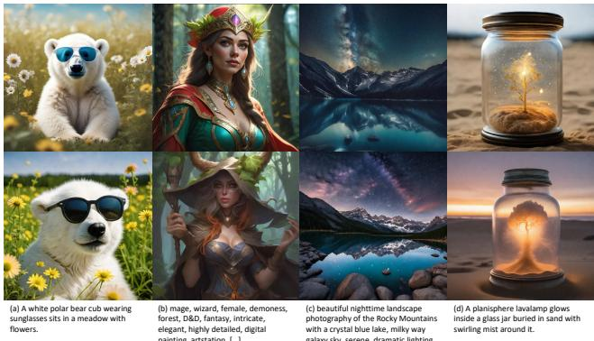  
Figure 1. In these images, some are generated by the baseline SDXL via 50NFE, the others with our DMDX in 1NFE. Can you tell which is the accelerated one? Answers in the footnote#.

分布匹配蒸馏（DMD）是一种前景看好的评分蒸馏方法，它将强大的文本到图像扩散模型SDXL-Base蒸馏成一个高保真度的一步生成器。虽然DMD的主要贡献在于引入额外的正则化项以约束分布匹配损失，但其前身Diff-Instruct开创性地使用伪评分估计器来近似学生模型的输出分布。这与对抗性扩散蒸馏（ADD）中的蒸馏损失形成对比，后者直接使用学生模型本身作为评分估计器。从理论上讲，DMD和ADD中的蒸馏损失之间存在内在的对应关系，由于变分评分蒸馏（VSD）和评分蒸馏采样（SDS）在文本到3D生成中的应用，VSD和SDS之间可以等价地找到对应关系，其中SDS表示VSD的一个特殊实例，通过使用单点Dirac分布作为变分分布。因此，DMD中的VSD损失表现优于ADD中的SDS损失。直观上，由于扩散模型在为少步生成蒸馏时容量显著下降，学生模型不再像教师模型那样作为一个合适的评分估计器。因此，ADD中的基于评分的蒸馏损失对最终性能几乎没有贡献。

然而，DMD损失的优化依赖于反Kullback-Leibler (KL)散度的最小化，这种方法强制将低概率区域驱动为零，导致模型只关注少数主导模式，可能导致模式崩溃[45]。为了增强样本多样性，DMD [86] 采用了基于常微分方程 (ODE) 的正则化器，并使用合成数据，而DMD2 [85] 则引入了基于生成对抗网络 (GAN) [8] 的正则化器，并使用真实数据以抵消这一副作用。后续的一些工作，如时刻匹配蒸馏 (MMD) [59]、分数恒等蒸馏 (SiD) [93] 和分数隐式匹配 (SIM) [38]，均使用了Fisher散度的变体，将伪评分估计器与预训练的真实评分估计器进行对齐[16]。尽管取得了巨大成功，但它们在分布匹配方面的能力受限于对预定义显式散度度量形式的依赖。在这项工作中，我们想提出并探讨一个问题：我们能否通过开发一个学习隐式、数据驱动的差异度量的框架，从而绕过预定义散度的局限性，实现对复杂高维分布的更灵活和更细致的匹配？由于在复杂的多模态文本条件图像甚至视频生成中多方面的对齐要求可能无法完全捕捉到，这激励我们探索更自适应的差异学习范式。作为我们的第一个贡献，我们展示了如何在对抗的方式下，对真实和伪评分估计器之间的潜在预测进行对齐，以实现基于教师模型及动态可学习参数的评分蒸馏，称为对抗分布匹配 (ADM)。这与DMD和DMD2中用于抵消反KL散度模式崩溃效应的基于ODE或GAN的正则化器不同。相反，我们通过GAN训练进行分布匹配，以替代和规避DMD损失，我们将在第4.1.3节中提供更多讨论。

我们的第二个贡献与极具挑战的一步蒸馏有关，我们观察到，分数蒸馏存在更高的梯度爆炸和消失的风险。我们将这一问题更多归因于学生与教师分布之间支撑集的重叠程度较低，而不仅仅是 DMD2 [85] 中归因于伪分数估计器的近似误差。换句话说，尽管分数蒸馏能产生更优的生成质量，但在极少的步骤中进行蒸馏时，尤其对初始化提出了更高的要求，我们将在第 4.3.2 节中提供更深入的分析。尽管我们注意到 DMD2 实现中，基于常微分方程（ODE）的合成数据预训练被用于 SDXL 一步蒸馏，但均方误差损失可能仍不足以提供学生与教师分布之间更多的支撑集重叠区域。我们的实验表明，当为分布匹配提供更好的初始化时，双时间尺度更新规则（TTUR）[2] 对最终性能的影响非常有限。自然地，我们的第三个贡献集中在为进一步的基于分数的微调提供更好的初始化。我们采用对抗蒸馏，以平衡样本质量与模式收敛，灵感来源于 SDXL-Lightning [23] 和 LADD [60]。通过这种分布级别的损失优化，我们可以对学生模型进行预训练，以捕获教师模型分布的更多潜在模式，特别是通过在潜在和像素空间中使用混合鉴别器，这将在第 4.2 节中介绍。为了促进多样性，我们还提出为生成器采用立方时间步调计划，以偏向更高的噪声水平。通过将对抗蒸馏预训练与 ADM 微调结合成一个统一的流程，称为 DMDX，我们的一步 SDXL 在功能评估次数（NFE）上提供了与基线相竞争的保真度，达到了 $5 0 \times$ 加速，如图 1 所示。对包括 SD3-Medium、SD3.5-Large [6] 和 CogVideoX [83] 在内的最佳现有扩散模型的多步骤 ADM 蒸馏的更多实验，始终在高效图像和视频合成上达到了新的基准。

# 2. 相关工作

渐进蒸馏在[58]中被提出，用于将多步预测蒸馏为沿轨迹相同距离的一步预测。SDXL-Lightning [23]通过利用GAN训练扩展了这一理念，首次实现了一步高分辨率$( 1 0 2 4 \mathrm { p x } )$生成。这种涉及多阶段过程的方法可能相当繁琐，因为它需要从前一个步骤进行迭代蒸馏，每次减少采样步数。一致性蒸馏在[7, 34, 35, 64, 66]中被提出，以强制扩散模型的一致性属性，即对于属于同一轨迹的任意噪声时间步，针对原始样本的预测是一致的。后续的努力将其扩展到轨迹一致性，以放宽训练目标，即针对任意后续时间步的噪声样本的预测是一致的，包括CTM [18]、TCD [92]、TSCD [55]和PCM [69]。整流流(Layered Flow) [27, 28]旨在通过多次重流过程获取更快的直线路径，这些过程不断学习来自前任的多个常微分方程对的速度。PeRFlow [81]尝试将轨迹分割为多个部分，并使用真实数据样本进行分段整流。在本文中，我们经验发现，直线性也可以通过对抗性蒸馏范式来满足，而无需反复收集大量合成数据。分数蒸馏直观地尝试保持在学生模型分布中以特定噪声水平出现的样本具有与教师模型分布中相同的概率。基于依赖单一散度可能带来问题的动机，一项并行工作混合分数蒸馏（SMD） [16]与我们的观点一致，并明确设计了一类用于优化的$\alpha$-倾斜杰森-香农（JS）散度。相比之下，我们以对抗方式隐式测量虚假分数估计器和真实分数估计器之间的差距，从而促进了一个更强大且自适应的差距学习范式。在对抗蒸馏中，使用鉴别器将学生模型分布与特定目标分布对齐[40, 94]。而方法UFOGen [79]、DMD2 [85]和APT [24]直接与真实数据分布对齐，SDXL-Lightning [23]和Hyper-SD [55]则利用教师模型的中间时间步预测作为近似目标。受到LADD [60]的启发，我们的对抗蒸馏预训练与生成的基于ODE的合成数据进行对齐。人类反馈学习首先由ReFL [78]在扩散模型中提出，该模型包括奖励模型训练和偏好微调的两个阶段。HyperSD [55]将其视为一种独立技术，最终应用LoRA插入来使低步生成器的输出分布偏向人类偏好。随后的研究，特别是[36, 39]，进一步尝试整合CFG和基于分数的散度。

# 3. 前言

# 3.1. 扩散模型

给定具有标准差 $\sigma _ { \mathrm { d a t a } }$ 的训练数据分布 $p _ { \mathrm { d a t a } }$，扩散模型通过反向扩散过程生成样本，该过程逐步向数据样本 $\pmb { x } _ { 0 } \sim p _ { d a t a }$ 添加噪声，其中 $\alpha _ { t } \geq 0 , \sigma _ { t } > 0$ 是指定的噪声调度，使得 $\alpha _ { t } / \sigma _ { t }$ 对 $t$ 单调递减，并且较大的 $t$ 表示更大的噪声。我们考虑两种不同的去噪模型的表述。

$$
\mathbf { \boldsymbol { q } } ( \mathbf { \boldsymbol { x } } _ { t } | \mathbf { \boldsymbol { x } } ) \sim \mathcal { N } ( \alpha _ { t } \mathbf { \boldsymbol { x } } , \sigma _ { t } ^ { 2 } \mathbf { \boldsymbol { I } } ) ,
$$

DDPM和DDIM假设时间调度是离散的，$t \in [ 1 , T ]$（通常$T = 1000$）以及噪声预测参数化。训练目标由下式给出，其中$w(t)$是加权函数，$\epsilon_{\theta}$是具有参数$\theta$的神经网络。噪声调度定义为$\alpha_t = \sqrt{\bar{\alpha}_t}, \sigma_t = \sqrt{1 - \bar{\alpha}_t}$，使得${\pmb x}_t = \sqrt{\bar{\alpha}_t} {\pmb x}_0 + \sqrt{1 - \bar{\alpha}_t} \epsilon$。对于DDIM采样，它通过求解概率流常微分方程$(PF - ODE)$来实现，表达式为$\begin{array}{r} d \bar{\bf x}_t = \epsilon_{\theta} \bigg( \frac{\bar{\bf x}_t}{\sqrt{\bar{\sigma}_t^2 + 1}} \bigg) d \bar{\boldsymbol{\sigma}}_t \end{array}$，其中$\begin{array}{r} \bar{\mathbfit{x}}_t = \frac{\mathbfit{x}_t}{\sqrt{\bar{\alpha}_t}} \end{array}$，$\begin{array}{r} \bar{\sigma}_t = \sqrt{\frac{1 - \bar{\alpha}_t}{\bar{\alpha}_t}} \end{array}$，从$\pmb{x}_T \sim \mathcal{N}(\mathbf{0}, I)$开始，并在$\scriptstyle{\mathbf{\mathit{x}}}_0$处停止。

$$
\begin{array} { r } { \mathbb { E } _ { \pmb { x } _ { 0 } , t , \epsilon \sim \mathcal { N } ( \mathbf { 0 } , I ) } [ w ( t ) \| \epsilon _ { \theta } ( \pmb { x } _ { t } , t ) - \epsilon \| _ { 2 } ^ { 2 } ] , } \end{array}
$$

流匹配 [26, 27, 30] 使用速度预测参数化 [58] 和连续时间系数（通常 $\alpha _ { t } = 1 - t , \sigma _ { t } = t$，其中 $t \in [ 0 , T = 1 ] \forall$）。条件概率路径或我们所称的速度可以表示为 $\begin{array} { r } { \pmb { v } _ { t } = \frac { d \alpha _ { t } } { d t } \pmb { x } _ { 0 } + \frac { \bar { d } \sigma _ { t } } { d t } \epsilon } \end{array}$，其中 $w ( t )$ 是加权函数，${ \pmb v } _ { \theta }$ 是由 $\theta$ 参数化的神经网络。采样过程从 $t = T$ 开始，$\pmb { x } _ { T } \sim \mathcal { N } ( \mathbf { 0 } , I )$，并在 $t = 0$ 处停止，通过 $d { \pmb x } _ { t } = { \pmb v } _ { \theta } ( { \pmb x } _ { t } , t ) d t$ 解 PF-ODE。

$$
\begin{array} { r } { \mathbb { E } _ { \pmb { x } _ { 0 } , t , \epsilon \sim \mathcal { N } ( \mathbf { 0 } , I ) } [ w ( t ) \| \pmb { v } _ { \theta } ( \pmb { x } _ { t } , t ) - \pmb { v } _ { t } \| _ { 2 } ^ { 2 } ] , } \end{array}
$$

# 3.2. 分布匹配蒸馏

DMD [85, 86] 通过最小化目标分布 $p _ { \mathrm { r e a l } }$ 和高效生成器输出分布 $p _ { \mathrm { f a k e } }$ 之间的反向 KL 散度，将预训练的扩散模型 ${ \cal F } _ { \phi } ( { \bf x } _ { t } , t )$ 蒸馏为一步或多步高效生成器 $G _ { \theta } ( \pmb { x } _ { t } , t )$ 。DMD 目标对于 $\theta$ 的梯度为，其中 $\mathbf z ~ \sim ~ \mathcal N ( \mathbf 0 , I )$，$t ^ { \prime }$ 从预定义生成器调度中随机选择，$t \sim \mathcal { U } ( 0 , T )$，并且通过随机扩散生成器输出 $\hat { \textbf { \textit { x } } } _ { 0 } ~ = ~ G _ { \theta } ( z , t ^ { \prime } )$，获得噪声样本 $\pmb { x } _ { t } = \pmb { q } ( \pmb { x } _ { t } | \hat { \pmb { x } } _ { 0 } )$ 。评分函数 $s _ { \mathrm { r e a l } } ( { \pmb x } _ { t } ) = \nabla _ { { \pmb x } _ { t } } \log p _ { \mathrm { r e a l } } ( { \pmb x } _ { t } )$ 和 $s _ { \mathrm { f a k e } } ( \pmb { x } _ { t } ) = \nabla _ { \pmb { x } _ { t } } \log p _ { \mathrm { f a k e } } ( \pmb { x } _ { t } )$ 是向量场，分别指向在给定噪声水平下，数据密度更高的方向 [17, 65]。

$$
\begin{array} { r } { \nabla _ { \theta } \mathcal { L } _ { \mathrm { D M D } } = \underset { z , t ^ { \prime } , t , x _ { t } } { \mathbb { E } } - [ ( s _ { \mathrm { r e a l } } ( { x _ { t } } ) - s _ { \mathrm { f a k e } } ( { x _ { t } } ) ) \frac { d G _ { \theta } ( z , t ^ { \prime } ) } { d \theta } ] , } \end{array}
$$

真实分数估计器是教师模型 $\mathbf { \mathcal { F } } _ { \phi } ( \mathbf { \boldsymbol { x } } _ { t } , t )$ 本身，而虚假分数估计器 $\mathbf { \boldsymbol { f } } _ { \psi } ( \mathbf { \boldsymbol { x } } _ { t } , t )$ 的初始化与 $\mathbf { \mathcal { F } } _ { \phi } ( \mathbf { \boldsymbol { x } } _ { t } , t )$ 相同，并通过动态学习来描述 $p _ { \mathrm { f a k e } }$，其预训练损失如公式 (2) 和 (3) 所示。实际上，公式 (4) 中的梯度计算为，因此训练损失的实现如下，其中 $s g ( \cdot )$ 表示停止梯度操作。

$$
g r a d ( \hat { { \pmb x } } _ { 0 } , { \pmb x } _ { t } , t ) = \frac { { \pmb f } _ { \psi } ( { \pmb x } _ { t } , t ) - { \pmb F } _ { \phi } ( { \pmb x } _ { t } , t ) } { \| \hat { { \pmb x } } _ { 0 } - { \pmb F } _ { \phi } ( { \pmb x } _ { t } , t ) \| _ { 1 } }
$$

$$
\mathcal { L } _ { \mathrm { D M D } } ( \theta ) = \underset { z , t ^ { \prime } , t , { \pmb x } _ { t } } { \mathbb { E } } [ \| \hat { \pmb x } _ { 0 } - s g ( \hat { \pmb x } _ { 0 } - g r a d ( \hat { \pmb x } _ { 0 } , { \pmb x } _ { t } , t ) ) \| _ { 2 } ^ { 2 } ] ,
$$

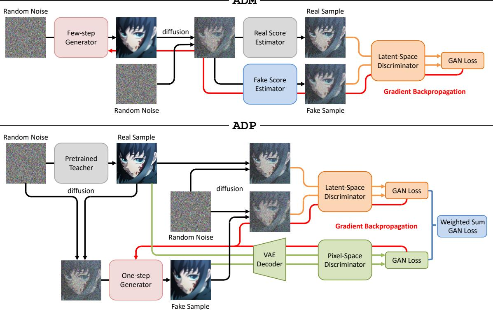

# 4. 方法论

# 4.1. 对抗分布匹配

我们使用通过对抗性判别器获得的隐式数据驱动差异度量，而不是使用预定义的伪分布和真实分布之间的散度。具体来说，我们的判别器 $D _ { \tau } ( \pmb { x } _ { t } , t )$ 由一个冻结的潜在扩散模型构成，该模型的初始化与教师模型 $\mathbf { \mathcal { F } } _ { \phi } ( \mathbf { \boldsymbol { x } } _ { t } , t )$ 相同，并在不同的 UNet [57] 或 DiT [49] 模块上添加了多个可训练的头。给定从步生成器输出 $\hat { \pmb { x } } _ { 0 } = \pmb { G } _ { \theta } ( \pmb { z } , t ^ { \prime } )$ 扩散得来的噪声样本 ${ \pmb x } _ { t } = { \pmb q } ( { \pmb x } _ { t } | \hat { \pmb x } _ { 0 } )$，分数估计器不再是 Eq. (5) 中使用的 $\pmb { x } _ { 0 } ^ { \mathrm { f a k e } } = \pmb { f } _ { \psi } ( \pmb { x } _ { t } , t )$ 和 ${ \pmb x } _ { 0 } ^ { \mathrm { r e a l } } = { \pmb F } _ { \phi } ( { \pmb x } _ { t } , t )$。

相反，我们设置一个固定的时间步长间隔 $\Delta t$（默认为 $T / 64$），并针对 $(t - \Delta t)$ 解决 PF-ODE，以便获得假样本 $\pmb{x}_{t - \Delta t}^{\mathrm{fake}}$ 和真实样本 $\pmb{x}_{t - \Delta t}^{\mathrm{real}}$，用作评分预测并输入到鉴别器中。鉴别器通过从冻结的主干网络层中层次聚合特征，并通过多个可学习的头动态加权，建立一个自适应差异度量，该度量利用扩散先验和数据驱动的可训练动态。我们使用铰链损失 [22] 训练生成器 $G_{\theta}(\pmb{x}_{t}, t)$ 和鉴别器 $D_{\tau}(\pmb{x}_{t}, t)$，以及假样本 $\pmb{x}_{t - \Delta t}^{\mathrm{fake}}$ 和真实样本 $\pmb{x}_{t - \Delta t}^{\mathrm{real}}$。

$$
\mathcal { L } _ { \mathrm { G A N } } ( \theta ) = \underset { { \substack { \mathbf { x } _ { t - \Delta t } ^ { \mathrm { f a k e } } } } } { \mathbb { E } } [ - D _ { \tau } ( { \boldsymbol x } _ { t - \Delta t } ^ { \mathrm { f a k e } } , t - \Delta t ) ]
$$

$$
\begin{array} { r } { \mathcal { L } _ { \mathrm { G A N } } ( \tau ) = \underset { x _ { t - \Delta t } ^ { \mathrm { f a k e } } , x _ { t - \Delta t } ^ { \mathrm { r e a l } } } { \mathbb { E } } \left[ \operatorname* { m a x } ( 0 , 1 + D _ { \tau } ( x _ { t - \Delta t } ^ { \mathrm { f a k e } } , t - \Delta t ) ) \right. } \\ { \left. + \operatorname* { m a x } ( 0 , 1 - D _ { \tau } ( x _ { t - \Delta t } ^ { \mathrm { r e a l } } , t - \Delta t ) ) \right] } \end{array}
$$

结合动态学习的虚假模型，我们在附录 A 中阐明了训练过程。整体流程如图 2 所示。

# 4.1.1. 判别器时间步 $( t - \Delta t )$ 的动机

鉴于评分蒸馏的最终目标是使学生模型和教师模型在不同噪声水平下的概率流完全一致，因此在测量分布之间的差异时必须考虑时间步的信息。这与我们使用预训练扩散模型的判别器设计相一致，并且我们在PF-ODE的过程中迈出小步，成功地保留了评分估计器的输入时间步信息。

# 4.1.2. 数据驱动效应

利用判别器进行分布差异度量的灵活性不仅体现在得分函数的噪声水平上，还体现在蒸馏过程中。随着蒸馏的迭代，模型接触到越来越多样的数据，导致两个分布之间的模态差异发生变化。在训练的早期阶段，差异显著时，需要更全面的评估，而在后期阶段，当差异变得较小时，则可能需要更局部、精细的优化。换句话说，受到数据量的驱动，各个训练阶段所采用的发散度量可以有所不同。

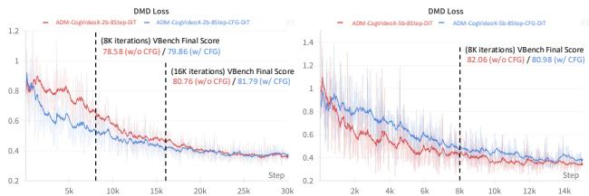  
Figure 3. Changes of DMD loss over multi-step ADM distillation for CogVideoX. Note that we did not optimize this objective directly during ADM distillation but recorded it over iterations.

# 4.1.3. 与 DMD 和 DMD2 的关系

为了解决 DMD 损失中的模态崩溃问题，在 DMD [85] 和 DMD2 [85] 的蒸馏中分别额外使用了基于 ODE 的正则化器和基于 GAN 的正则化器。然而，这两个正则化器并没有从根本上解决逆 KL 散度带来的寻模行为，如图 4(a) 所示，而是通过损失之间的权衡来进行平衡。在 ADM 中，我们的对抗损失实际上起到了 DMD 损失的作用，利用隐式、数据驱动的差异度量实现得分蒸馏，而不是使用预定义的散度。因此，我们在 ADM 中使用 GAN 训练的动机与 DMD2 [85] 不同，我们不需要额外的正则化器。直观而言，可学习的判别器能够近似任何非线性函数，从而隐式测量分布的散度，这可能本质上涵盖了 DMD 损失中的逆 KL 散度。如图 3 所示，我们可视化了在 CogVideoX [83] 上进行多步 ADM 蒸馏时公式 (6) 中 DMD 损失的变化。尽管并未直接在公式 (6) 上进行优化，但结果表明存在一个非常稳定的下降趋势，这支持了我们的假设。更多理论讨论见第 4.3.3 节。

# 4.2. 对抗蒸馏预训练

为了稳定极其困难的一步蒸馏，我们选择通过在合成数据上进行对抗蒸馏预训练来为 ADM 微调提供更好的初始化。我们的预训练配置在几个方面参考了 Rectified Flow [27]，具体包括 1) 以离线方式收集教师模型的 ODE 对；2) 通过在纯噪声和 ODE 对的干净数据样本之间进行线性插值来构造噪声样本；3) 将生成器的预测目标更改为 ODE 对的速度。

针对对抗训练，我们公式化了一个从教师模型初始化的潜在空间判别器 $D _ { \tau _ { 1 } } ( \pmb { x } _ { t } , t )$ 和一个从SAM [19]模型的视觉编码器初始化的像素空间判别器 $D _ { \tau _ { 2 } } ( \pmb { x } )$，如图2所示。我们还在主干网络上附加了多个可训练的头部，类似于ADM中的做法。这些都有助于提高判别能力，促进学生模型在教师模型分布中发现更多潜在的模态。具体来说，设 $\tilde { \pmb { x } } _ { 0 } = \pmb { G } _ { \theta } ( \pmb { x } _ { t } , t )$ 表示生成器的预测PF-ODE端点，其中 $\mathbf { \Delta } _ { \mathbf { \mathcal { X } } _ { t } }$ 表示在随机时间步 $t \in [ 0 , T ]$ 下，在一对ODE $( { \pmb x } _ { T } , { \pmb x } _ { 0 } )$之间插值的噪声样本。对于潜在空间判别器，我们用另一种随机噪声和时间步 $t ^ { \prime } ~ \in ~ ( 0 , T ]$ 对生成器输出进行扩散，得到 $\tilde { \mathbf { x } } _ { t ^ { \prime } } = \mathbf { q } ( \tilde { \mathbf { x } } _ { t ^ { \prime } } | \tilde { \mathbf { x } } _ { 0 } )$ 作为其输入。对于像素空间判别器，生成器输出将首先通过VAE解码器解码，然后输入到视觉编码器中。训练目标，同样基于Hinge损失 [22]，鼓励生成器输出 $\tilde { \mathbf { x } } _ { 0 }$ 更接近合成数据样本 $\scriptstyle { \mathbf { { \mathit { x } } } } _ { 0 }$：

$$
\mathcal { L } _ { \mathrm { G A N } } ( \theta ) = \underset { \tilde { \mathbf { x } } _ { 0 } , t ^ { \prime } } { \mathbb { E } } - [ \lambda _ { 1 } D _ { \tau _ { 1 } } ( \tilde { { \mathbf { x } } } _ { t ^ { \prime } } , t ^ { \prime } ) + \lambda _ { 2 } D _ { \tau _ { 2 } } ( \tilde { { \mathbf { x } } } _ { 0 } ) ]
$$

$$
\begin{array} { r } { \mathcal { L } _ { \mathrm { G A N } } ( \tau _ { 1 } , \tau _ { 2 } ) = \underset { x _ { 0 } , \tilde { x } _ { 0 } , t ^ { \prime } } { \mathbb { E } } [ \lambda _ { 1 } \cdot \operatorname* { m a x } ( 0 , 1 + D _ { \tau _ { 1 } } ( \tilde { x } _ { t ^ { \prime } } , t ^ { \prime } ) ) } \\ { + \lambda _ { 2 } \cdot \operatorname* { m a x } ( 0 , 1 + D _ { \tau _ { 2 } } ( \tilde { x } _ { 0 } ) ) } \\ { + \lambda _ { 1 } \cdot \operatorname* { m a x } ( 0 , 1 - D _ { \tau _ { 1 } } ( x _ { t ^ { \prime } } , t ^ { \prime } ) ) } \\ { + \lambda _ { 2 } \cdot \operatorname* { m a x } ( 0 , 1 - D _ { \tau _ { 2 } } ( x _ { 0 } ) ) ] } \end{array}
$$

我们实证发现，设置平衡系数 $\lambda _ { 1 } = 0 . 8 5 , \lambda _ { 2 } = 0 . 1 5$ 可以产生视觉一致的结果。

# 4.2.1. 立方体生成器时间步调度

直观上，更高的噪声水平通过削弱潜在表示中编码的限制性信息，鼓励探索新的模式。因此，我们建议为生成器采用立方时间步调度。该调度通过 $[ 1 ~ -$ $( t / T ) ^ { 3 } ] * T$ 将均匀的 $[ 0 , T )$ 样本进行映射，非线性地将值集中在接近 $T$ 的区域，并施加类似于 LADD [60] 的重噪声。

# 4.2.2. 均匀鉴别器时间步调度

与最小可行模型（ADM）中首先使用鉴别器进行评分蒸馏不同，潜在空间鉴别器的使用在对抗蒸馏工作中是很常见的。受到SDXL-Lightning [23]的启发，他们发现扩散编码器在较低时间步上集中训练高频细节，而在较高时间步上关注低频结构，我们为鉴别器时间步$t^{\prime}$设定了统一的$(0, T]$，以便在预训练期间捕捉两者的优势。

# 4.2.3. 与 LADD 的关系

我们对合成数据进行对抗蒸馏的动机受到了 LADD [60] 的启发，但有多个不同之处：1）我们通过以 Rectified Flow [27] 风格的常微分方程（ODE）对来构建噪声样本，而不是随机噪声；2）我们开发了一种立方生成器时间步调度，以促进确定性欧拉采样，而不是一致性采样；3）我们引入了一个额外的像素空间编码器，以增强鉴别器的能力并发现更多模态。

# 4.3. 讨论

# 4.3.1. ADM与ADP的区别

一个问题可能是，这两种带有潜空间判别器的对抗方法之间有什么区别？在得分蒸馏中的有效性与得分函数 $\nabla _ { \pmb { x } } \log p ( \pmb { x } ; \pmb { \sigma } ( t ) )$ 在不同噪声水平 $\sigma ( t )$ 下的定义相关。相比之下，对抗蒸馏仅在 $t = 0$ 时对干净数据样本的分布进行对齐。而在预训练中，潜空间判别器通过随机扩散生成器输出捕获不同尺度和细节的信息，对于ADM而言，核心不仅仅是通过解决两个得分估计器的PF-ODE。换句话说，ADM还通过在不同噪声水平下的高密度噪声样本来额外监督完整的去噪过程。这导致在ADM中，当两个分布在支持集上初始化时重叠较少，噪声样本保持在彼此不熟悉的区域，判别器可以轻松区分它们，从而导致极端的梯度信号。然而，由于高斯噪声是各向同性的，我们在ADP中人为地创建了重叠区域，以使随机扩散样本的区分变得更加困难，导致相对平滑的梯度。因此，我们的ADM仍然属于得分蒸馏，因为它鼓励整个概率流更接近，而预训练属于对抗蒸馏，因为它只关注 $t = 0$ 时的干净数据分布。

# 4.3.2. 预训练的重要性

另一个我们尚未讨论的问题是，为什么我们需要对一步得分蒸馏进行预训练？以 DMD 损失中使用的反向 KL 散度为例：

$$
\mathbb { D } _ { \mathrm { K L } } ( p _ { \mathrm { f a k e } } \Vert p _ { \mathrm { r e a l } } ) = \int p _ { \mathrm { f a k e } } ( x ) \log \frac { p _ { \mathrm { f a k e } } ( x ) } { p _ { \mathrm { r e a l } } ( x ) } d x .
$$

在采用单步蒸馏时，生成器输出在视觉保真度和结构完整性方面较多步采样更差，导致 $p _ { \mathrm { f a k e } } ( { \pmb x } ) 0$，其中$lT$接近零 $0 \cdot ( - \infty )$，这使得优化避免了 $p _ { \mathrm { r e a l } } ( { \pmb x } ) > 0$ 而 $p _ { \mathrm { f a k e } } ( \pmb { x } )$ 的密度极小，这一现象称为零强迫。 $p _ { \mathrm { f a k e } }$ 并未完全覆盖 $p _ { \mathrm { r e a l } }$ 的支持，而是收敛到 $p _ { \mathrm { r e a l } }$ 的一个模式子集，诱导出寻模行为，如图4(a)所示。在训练过程中，这有时会表现为梯度消失。相反，扩散模型通常通过一步生成的模糊样本也不在教师模型的分布内，导致 $p _ { \mathrm { r e a l } } ( { \pmb x } ) 0$，而 $p _ { \mathrm { f a k e } } ( { \pmb x } ) > 0$ 在某些区域中，积分算子 $\begin{array} { r } { p _ { \mathrm { f a k e } } ( \pmb { x } ) \log \frac { p _ { \mathrm { f a k e } } ( \pmb { x } ) } { 0 } } \end{array}$ 发散至 $+ \infty$，从而导致数值不稳定和梯度爆炸。类似地，当学生分布和教师分布的支持集几乎完全重叠时，前向KL散度接近 $+ \infty$，其中 $p _ { \mathrm { f a k e } } ( { \pmb x } ) > 0$，而JS散度饱和至常数 $\log 2$，费舍尔散度可能会退化得无定义。因此，当这种假设被破坏时，许多单一的散度不再适用，更好初始化与更多重叠区域变得至关重要，如图4(b)所示。

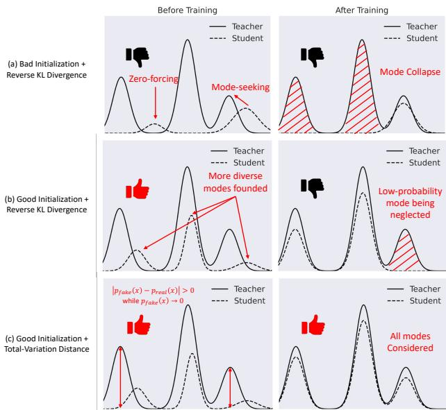  
Figure 4. Illustration for theoretical discussion.

# 4.3.3. 理论目标

最后一个问题是，理论上为什么ADM优于DMD损失？实际上，我们使用的Hinge GAN已经被证明能够最小化全变差距离（Total-Variation Distance, TVD）。

$$
T V ( p _ { \mathrm { f a k e } } , p _ { \mathrm { r e a l } } ) = \int | p _ { \mathrm { f a k e } } ( { \pmb x } ) - p _ { \mathrm { r e a l } } ( { \pmb x } ) | d { \pmb x }
$$

换言之，当鉴别器足够丰富且经过良好训练时，收敛时的Hinge损失理论最优解可以最小化总变差（TVD）。当假分布和真实分布的支持集几乎没有重叠时，TVD相较于反向KL散度具有两个关键优势：1）对称性：TVD无论初始分布如何，都能提供相同的差异度量，而不对称的反向KL可能会表现出寻求模态的行为，忽视总体分布的其他部分。例如，如图4(c)所示，TVD在$p _ { \mathrm { f a k e } } ( { \pmb x } ) 0$而$p _ { \mathrm { r e a l } } ( { \pmb x } ) ~ > ~ 0 $时仍然维持显著的损失值，并提供覆盖模态的优化方向，而反向KL散度在这种情况下由于梯度消失的问题面临困难，如第4.3.2节讨论的那样。2）有界性：TVD的值界定在[0,1]之间，因此在训练过程中减轻了异常值的干扰，尤其是在我们的高维多模态文本条件图像和视频分布中，避免了反向KL散度因梯度爆炸而导致的数值不稳定。

Table 1. Quantitative results on fully fine-tuning SDXL-Base.   

<table><tr><td>Method</td><td>Step NFE</td><td></td><td>CLIP Score</td><td>Pick Score</td><td>HPSv2</td><td>MPS</td></tr><tr><td>ADD [61] (512px)</td><td>1</td><td>1</td><td>35.0088</td><td>22.1524</td><td>27.0971</td><td>10.4340</td></tr><tr><td>LCM [34]</td><td>1</td><td>2</td><td>28.4669</td><td>20.1267</td><td>23.8246</td><td>4.8134</td></tr><tr><td>Lightning [23]</td><td>1</td><td>1</td><td>33.4985</td><td>21.9194</td><td>27.1557</td><td>10.2285</td></tr><tr><td>DMD2 [85]</td><td>1</td><td>1</td><td>35.2153</td><td>22.0978</td><td>27.4523</td><td>10.6947</td></tr><tr><td>DMDX (Ours)</td><td>1</td><td>1</td><td>35.2557</td><td>22.2736</td><td>27.7046</td><td>11.1978</td></tr><tr><td>SDXL-Base [56]</td><td>25</td><td>50</td><td>35.0309</td><td>22.2494</td><td>27.3743</td><td>10.7042</td></tr></table>

Table 2. Quantitative results on LoRA fine-tuning SD3-Medium and fully fine-tuning SD3.5-Large.   

<table><tr><td>Method</td><td>Step NFE</td><td></td><td>CLIP Score</td><td>Pick Score</td><td>HPSv2</td><td>MPS</td></tr><tr><td>TSCD [61]</td><td>4</td><td>8</td><td>34.0185</td><td>21.9665</td><td>27.2728</td><td>10.8600</td></tr><tr><td>PCM [69] (Shift=1)</td><td>4</td><td>4</td><td>33.5042</td><td>21.9703</td><td>27.3680</td><td>10.5707</td></tr><tr><td>PCM [69] (Shift=3)</td><td>4</td><td>4</td><td>33.3818</td><td>21.9396</td><td>27.1146</td><td>10.5635</td></tr><tr><td>PCM [69] (Stoch.)</td><td>4</td><td>4</td><td>33.4185</td><td>21.8822</td><td>27.3177</td><td>10.5200</td></tr><tr><td>Flash [3]</td><td>4</td><td>4</td><td>34.3978</td><td>22.0904</td><td>27.2586</td><td>10.6634</td></tr><tr><td>ADM (Ours)</td><td>4</td><td>4</td><td>34.9076</td><td>22.5471</td><td>28.4492</td><td>11.9543</td></tr><tr><td>SD3-Medium[ [6]</td><td>25</td><td>50</td><td>34.7633</td><td>22.2961</td><td>27.9733</td><td>11.3652</td></tr><tr><td>LADD [60]</td><td>4</td><td>4</td><td>34.7395</td><td>22.3958</td><td>27.4923</td><td>11.4372</td></tr><tr><td>ADM (Ours)</td><td>4</td><td>4</td><td>34.9730</td><td>22.8842</td><td>27.7331</td><td>12.2350</td></tr><tr><td>SD3.5-Large [6]</td><td>25</td><td>50</td><td>34.9668</td><td>22.5087</td><td>27.9688</td><td>11.5826</td></tr></table>

<table><tr><td>Method</td><td>Step</td><td>NFE</td><td>Final Score</td><td>Quality Score</td><td>Semantic Score</td></tr><tr><td>ADM</td><td>8</td><td>8</td><td>78.584</td><td>80.825</td><td>69.621</td></tr><tr><td>+ Longer Training ×2</td><td>8</td><td>8</td><td>80.764</td><td>83.031</td><td>71.693</td></tr><tr><td>ADM w/ CFG</td><td>8</td><td>16</td><td>79.865</td><td>80.938</td><td>75.569</td></tr><tr><td>+ Longer Training ×2</td><td>8</td><td>16</td><td>81.796</td><td>83.008</td><td>76.947</td></tr><tr><td>CogVideoX-2b [83]</td><td>100</td><td>200</td><td>80.036</td><td>80.801</td><td>76.974</td></tr><tr><td>ADM</td><td>8</td><td>8</td><td>82.067</td><td>83.227</td><td>77.423</td></tr><tr><td>ADM w/ CFG</td><td>8</td><td>16</td><td>80.982</td><td>82.165</td><td>76.251</td></tr><tr><td>CogVideoX-5b [83]</td><td>100</td><td>200</td><td>81.226</td><td>81.785</td><td>78.987</td></tr></table>

Table 3. Quantitative results on fully fine-tuning CogVideoX.

# 5. 实验

模型。对于一步蒸馏，我们在 SDXL-Base [56] 上采用对抗蒸馏预训练（ADP）和 ADM 微调，称为 DMDX。对于多步蒸馏，我们仅在文本到图像模型 SD3-Medium、SD3.5-Large [6] 和文本到视频模型 CogVideoX-2b、CogVideoX-5b [83] 上采用 ADM 训练。与大多数并行工作一致，我们在文本到图像模型中未使用无分类器引导（CFG） [11]。我们尝试在文本到视频模型上进行集成 CFG 实验，具体方法详见第 5.2 节。数据集。此项工作中提出的 ADP 和 ADM 均不需要视觉数据。对于图像生成器，我们利用来自 JourneyDB [67] 的文本提示，该提示具有高度的细节性和特异性用于训练。对于视频生成器，我们从 OpenVid1M [47]、Vript [82] 和 Open-Sora-Plan-v1.1.0 [50] 收集训练提示。评估。图像生成器在来自 COCO 2014 [25] 的 10K 提示上进行评估，遵循 DMD2 [85]。我们报告 CLIP 分数 [52] 和人类偏好基准 PickScore [20]、HPSv2 [75] 和 MPS [90]，与包括 Hyper-SD [55] 和 Emu3 [73] 在内的许多并行工作一致。但我们不将 Hyper-SD 包含在一步定量比较中，因为一步 Hyper-SDXL 已直接在基于人类反馈的 ReFL [78] 上进行优化。相反，我们在 SD3-Medium [13] 上与其提出的 TSCD 算法进行比较，因为 4 步 Hyper-SD3 LoRA 未经过 ReFL 优化。视频生成器在 VBench [14] 上进行评估，该评估涵盖了多个质量和语义维度。

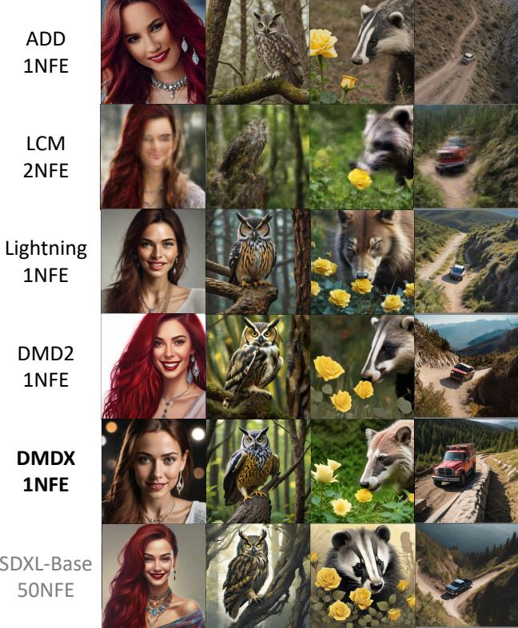  
Figure 5. Qualitative results on fully fine-tuning SDXL-Base

超参数。尽管在我们提出的自适应判别器（ADP）和自适应生成模型（ADM）中需要训练多个模型，我们仍然在没有大量超参数调整的情况下实现了令人满意的视觉保真度和结构完整性。在本工作其余部分中，我们仅根据不同实验调整生成器的学习率。判别器和假模型的优化器设置在所有实验中保持一致。除非特别注明需要更长的训练时间，否则我们仅训练8K次，文本到图像和文本到视频模型的批量大小分别为128和8。更具体的实现细节见附录B。

# 5.1. 高效图像合成

表 1 定量比较了我们将 ADP 和单步 ADM 蒸馏相结合的两阶段方法与现有的一步蒸馏方法在完全微调 SDXL-Base 上的表现。结果表明，我们的方法在图像与文本对齐以及人类偏好方面均表现出色，这与图 5 中的定性比较一致，包括更好的肖像美感、动物毛发细节、主体与背景分离以及物理结构。

<table><tr><td>Ablation</td><td>CLIP Score</td><td>Pick Score</td><td>HPSv2</td><td>MPS</td></tr><tr><td colspan="5">Ablation on adversarial distillation.</td></tr><tr><td>A1: Rectified Flow [27]</td><td>27.4376</td><td>20.0211</td><td>23.6093</td><td>4.4518</td></tr><tr><td>A2: DINOv2 as pixel-space</td><td>34.1836</td><td>21.8750</td><td>27.1039</td><td>10.2407</td></tr><tr><td>A3: λ1 = 0.7, λ2 = 0.3</td><td>33.6943</td><td></td><td>21.6344 26.8902</td><td>9.9633</td></tr><tr><td>A4: λ1 = 1.0, λ2 = 0.0</td><td>33.8929</td><td></td><td>21.7395 26.7869</td><td>10.0757</td></tr><tr><td>A5: w/o ADM (ADP only)</td><td>35.7723</td><td>22.0095</td><td> 27.3499</td><td>10.6646</td></tr><tr><td colspan="5">Ablation on score distillation.</td></tr><tr><td>B1: ADM w/o ADP</td><td>32.5020</td><td>21.7631</td><td>26.8732</td><td>10.8986</td></tr><tr><td>B2: DMD LosS w/o ADP</td><td>32.7482</td><td>21.0341</td><td>25.9680</td><td>8.8977</td></tr><tr><td>B3: DMD LosS w/ ADP</td><td>34.5119</td><td>21.9366</td><td>27.3985</td><td>10.6046</td></tr><tr><td>B4: DMDX (Ours)</td><td>35.2557</td><td>22.2736</td><td>27.7046</td><td>11.1978</td></tr></table>

Table 4. Quantitative results on ablation studies.

对于多步ADM蒸馏，它可以作为独立的分数蒸馏方法。我们尝试了完全微调和LoRA微调配置，表2中的定量结果证明了我们的优越性能。定性结果见附录C。

# 5.2. 高效视频合成

如表3所示，除常规的8步ADM蒸馏外，我们还尝试将无分类器引导（CFG）[11]集成到文本到视频的任务中。具体而言，我们通过在范围[5.0, 7.0]内随机采样，为真实模型分配CFG比例，而通过从真实模型的值中显式减去2.0来分配少步生成器的比例。实证结果表明，随着目标采样步数的减少，这一减法偏移需要逐步增大。虚假模型没有CFG。VBench [14]的结果表明，我们的少步生成器在加速$92.96\%$的情况下实现了与基线模型相当的性能。我们对2B模型进行了更长时间训练的额外评估，动机是观察到DMD损失在8K迭代时收敛不良，如图3所示。实验结果表明，DMD损失在ADM蒸馏过程中也通过可学习的鉴别器得到了大致优化。更多定量和定性结果请参见附录C。

# 5.3. 消融研究

在表4中，我们对完全微调SDXL-Base进行了大量消融研究，以验证我们的有效性。定性比较见附录C。ADP的影响。可得出以下结论：1）单次重流过程的效果非常有限（A1），而实现有效修正的多次过程则需要相当大的计算开销。2）与广泛采用的DINOv2 [48] 相比，使用SAM [19] 提供了更高的成像保真度（A2 / A5），这可能是由于SAM的分辨率较高，为$1 0 2 4 \mathrm { p x }$（相比DINOv2的518px）。3）像素空间的权重$\lambda _ { 2 }$不应过大或过小。过大的权重会导致结构完整性下降（A3 / A5），而权重不足则会导致模糊（A4 / A5）。附录$\textrm { C }$中的定性结果提供了更明显的区分。

Table 5. Ablation study on two time-scale update rule.   

<table><tr><td>TTUR</td><td>Training Time</td><td>CLIP Score</td><td>Pick Score</td><td>HPSv2</td><td>MPS</td></tr><tr><td>1</td><td>×1.00</td><td>35.2557</td><td>22.2736</td><td>27.7046</td><td>11.1978</td></tr><tr><td>4</td><td>× 1.85</td><td>35.2583</td><td>22.2773</td><td>27.7255</td><td>11.2720</td></tr><tr><td>8</td><td>×2.53</td><td>35.3299</td><td>22.2883</td><td>27.7586</td><td>11.2838</td></tr></table>

Table 6. Quantitative diversity evaluation on PartiPrompts [88].   

<table><tr><td></td><td>ADD</td><td>LCM</td><td>Lightning</td><td>DMD2</td><td>Ours</td><td>Teacher</td></tr><tr><td>LPIPS↑</td><td>0.6071</td><td>0.6257</td><td>0.6707</td><td>0.6715</td><td>0.7156</td><td>0.6936</td></tr></table>

ADM 的影响。我们总结了关键发现：1) 缺少 ADP 会导致性能显著下降 $\left( \mathtt { B } 1 / \mathtt { B } 4 \right)$，这与我们在第 4.3.2 节的分析一致。2) 在没有正则化项的情况下，DMD 损失的表现不如独立的 ADM（B1/B2），这表明其鲁棒性较差。3) 尽管 DMD 损失优化也受益于 ADP（B2/B3），但其分布匹配能力仍低于 ADM（B3/B4）。TTUR 的影响。表 5 展示了不同 TTUR 设置对最终性能和训练时长的影响。结果表明，增加 TTUR 仅能带来微小的性能提升，而训练时间几乎加倍，使得这种权衡显得明显不划算。这突显了我们提出的 ADP 在单步蒸馏中的关键作用，并且建议 DMD2 中的训练不稳定性可能源于支持集重叠不足。多样性评估。按照 DMD2 [85]，我们在 Partiprompts [88] 上以不同种子生成每个提示的 4 个样本，并报告了表 6 中平均成对 LPIPS 相似度 [89]。结果表明，我们的方法在多样性上显著优于其他方法。更多随机策划的多种子样本见附录 C。

# 6. 限制因素

我们意识到一个弱点是教师模型可能需要上下文无关文法（CFG）来产生准确的评分预测。我们的实验表明，这在评分蒸馏方法中普遍存在，而不是我们方法特有的限制。这限制了对诸如 FLUX.1-dev [1] 的指导蒸馏模型的应用，这可能成为未来研究的一个有前景的主题。

# 致谢

本研究部分得到中国国家自然科学基金（U22A2095, 12326618, 62276281）、广东省基础与应用基础研究基金（2024A1515011882）以及广东省信息安全技术重点实验室项目（2023B1212060026）的支持。

# References

[1] Black Forest Labs. Flux.1-dev. https : / / huggingface.co/black-forest-labs/FLux.1- dev, 2024. 8   
[2] Naresh Babu Bynagari. Gans trained by a two time-scale update rule converge to a local nash equilibrium. In NeurIPS, 2017. 2   
[3] Clement Chadebec, Onur Tasar, Eyal Benaroche, and Benjamin Aubin. Flash diffusion: Accelerating any conditional diffusion model for few steps image generation. arXiv preprint arXiv:2406.02347, 2024. 1, 7, 2   
[4] Tianqi Chen, Bing Xu, Chiyuan Zhang, and Carlos Guestrin. Training deep nets with sublinear memory cost. arXiv preprint arXiv:1604.06174, 2016. 2   
[5] Alexey Dosovitskiy, Lucas Beyer, Alexander Kolesnikov, Dirk Weissenborn, Xiaohua Zhai, Thomas Unterthiner, Mostafa Dehghani, Matthias Minderer, Georg Heigold, Sylvain Gelly, Jakob Uszkoreit, and Neil Houlsby. An image is worth 16x16 words: Transformers for image recognition at scale. In ICLR, 2021. 1   
[6] Patrick Esser, Sumith Kulal, Andreas Blattmann, Rahim Entezari, Jonas Müller, Harry Saini, Yam Levi, Dominik Lorenz, Axel Sauer, Frederic Boesel, Dustin Podell, Tim Dockhorn, Zion English, Kyle Lacey, Alex Goodwin, Yannik Marek, and Robin Rombach. Scaling rectified flow transformers for high-resolution image synthesis. In ICML, 2024. 2, 7, 1   
[7] Zhengyang Geng, Ashwini Pokle, William Luo, Justin Lin, and J Zico Kolter. Consistency models made easy. In ICLR, 2025.2   
[8] Ian J. Goodfellow, Jean Pouget-Abadie, Mehdi Mirza, Bing Xu, David Warde-Farley, Sherjil Ozair, Aaron Courville, and Yoshua Bengio. Generative adversarial nets. In NeurIPS, 2014. 2   
[9] Kaiming He, Xiangyu Zhang, Shaoqing Ren, and Jian Sun. Deep residual learning for image recognition. In CVPR, pages 770778, 2016. 1   
10] Dan Hendrycks and Kevin Gimpel. Gaussian error linear units (gelus). arXiv preprint arXiv:1606.08415, 2016. 1   
11] Jonathan Ho and Tim Salimans. Classifier-free diffusion guidance. In NeurIPS Workshops, 2021. 7, 8   
12] Jonathan Ho, Ajay Jain, and Pieter Abbeel. Denoising diffusion probabilistic models. In NeurIPS, 2020. 1, 3   
13] Edward J. Hu, Yelong Shen, Phillip Wallis, Zeyuan AllenZhu, Yuanzhi Li, Shean Wang, Lu Wang, and Weizhu Chen. Lora: Low-rank adaptation of large language models. In ICLR, 2022. 7, 8   
[14] Ziqi Huang, Yinan He, Jiashuo Yu, Fan Zhang, Chenyang Si, Yuming Jiang, Yuanhan Zhang, Tianxing Wu, Qingyang Jin, Nattapol Chanpaisit, Yaohui Wang, Xinyuan Chen, Limin Wang, Dahua Lin, Yu Qiao, and Ziwei Liu. Vbench: Comprehensive benchmark suite for video generative models. In CVPR, 2024. 7, 8, 2, 3   
[15] Sam Ade Jacobs, Masahiro Tanaka, Chengming Zhang, Minjia Zhang, Shuaiwen Leon Song, Samyam Rajbhandari, and Yuxiong He. Deepspeed ulysses: System optimizations for enabling training of extreme long sequence transformer models. arXiv preprint arXiv:2309.14509, 2023. 2   
[16] Tejas Jayashankar, J. Jon Ryu, and Gregory Wornell. Scoreof-mixture training: Training one-step generative models made simple via score estimation of mixture distributions. arXiv preprint arXiv:2502.09609, 2025. 1, 2, 3   
[17] Tero Karras, Miika Aittala, Timo Aila, and Samuli Laine. Elucidating the design space of diffusion-based generative models. In NeurIPS, 2022. 1, 3   
[18] Dongjun Kim, Chieh-Hsin Lai, Wei-Hsiang Liao, Naoki Murata, Yuhta Takida, Toshimitsu Uesaka, Yutong He, Yuki Mitsufuji, and Stefano Ermon. Consistency trajectory models: Learning probability flow ode trajectory of diffusion. In ICLR, 2024. 1, 3   
[19] Alexander Kirillov, Eric Mintun, Nikhila Ravi, Hanzi Mao, Chloe Rolland, Laura Gustafson, Tete Xiao, Spencer Whitehead, Alexander C. Berg, Wan-Yen Lo, Piotr Dollár, and Ross Girshick. Segment anything. In ICCV, pages 3992 4003, 2023. 5, 8, 1   
[20] Yuval Kirstain, Adam Polyak, Uriel Singer, Shahbuland Matiana, Joe Penna, and Omer Levy. Pick-a-pic: An open dataset of user preferences for text-to-image generation. In NeuriPS, 2023. 7   
[21] Jonas Kohler, Albert Pumarola, Edgar Schönfeld, Artsiom Sanakoyeu, Roshan Sumbaly, Peter Vajda, and Ali Thabet. Imagine flash: Accelerating emu diffusion models with backward distillation. arXiv preprint arXiv:2405.05224, 2024. 1   
[22] Jae Hyun Lim and Jong Chul Ye. Geometric gan. arXiv preprint arXiv:1705.02894, 2017. 4, 5, 6   
[23] Shanchuan Lin, Anran Wang, and Xiao Yang. Sdxllightning: Progressive adversarial diffusion distillation. arXiv preprint arXiv:2402.13929, 2024. 1, 2, 3, 5, 7   
[24] Shanchuan Lin, Xin Xia, Yuxi Ren, Ceyuan Yang, Xuefeng Xiao, Lu Jiang, and ByteDance Seed. Diffusion adversarial post-training for one-step video generation. arXiv preprint arXiv:2501.08316, 2025. 1, 3   
[25] Tsung-Yi Lin, Michael Maire, Serge Belongie, Lubomir Bourdev, Ross Girshick, James Hays, Pietro Perona, Deva Ramanan, C. Lawrence Zitnick, and Piotr Dollár. Microsoft coco: Common objects in context. In ECCV, 2014. 7   
[26] Yaron Lipman, Ricky T. Q. Chen, Heli Ben-Hamu, Maximilian Nickel, and Matt Le. Flow matching for generative modeling. arXiv preprint arXiv:2210.02747, 2023. 3   
[27] Xingchao Liu, Chengyue Gong, and Qiang Liu. Flow straight and fast: Learning to generate and transfer data with rectified flow. In ICLR, 2022. 1, 3, 5, 8   
[28] Xingchao Liu, Xiwen Zhang, Jianzhu Ma, Jian Peng, and Oiang Liu. Instaflow: One step is enough for high-qualitv diffusion-based text-to-image generation. In ICLR, 2024. 1, 3   
[29] Iya Loshchilov and Fran Hutter. Decopld weight decy regularization. In ICLR, 2019. 2   
[30] Cheng Lu and Yang Song. Simplifying, stabilizing and scaling continuous-time consistency models. arXiv preprint arXiv:2410.11081, 2024. 1, 3   
[31] Yanzuo Lu, Manlin Zhang, Yiqi Lin, Andy J. Ma, Xiaohua Xie, and Jianhuang Lai. Improving pre-trained masked autoencoder via locality enhancement for person reidentification. In PRCV, pages 509521, 2022. 5   
[32] Yanzuo Lu, Meng Shen, Andy J Ma, Xiaohua Xie, and JianHuang Lai. Mlnet: Mutual learning network with neighborhood invariance for universal domain adaptation. In AAAI, pages 39003908, 2024. 5   
[33] Yanzuo Lu, Manlin Zhang, Andy J Ma, Xiaohua Xie, and Jianhuang Lai. Coarse-to-fine latent diffusion for poseguided person image synthesis. In CVPR, pages 64206429, 2024.5   
[34] Simian Luo, Yiqin Tan, Longbo Huang, Jian Li, and Hang Zhao. Latent consistency models: Synthesizing highresolution images with few-step inference. arXiv preprint arXiv:2310.04378, 2023. 1, 2, 7   
[35] Simian Luo, Yiqin Tan, Suraj Patil, Daniel Gu, Patrick von Platen, Apolinário Passos, Longbo Huang, Jian Li, and Hang Zhao. Lcm-lora: A universal stable-diffusion acceleration module. arXiv preprint arXiv:2311.05556, 2023. 1, 2   
[36] Weijian Luo. Diff-instruct++: Training one-step text-toimage generator model to align with human preferences. In TMLR, 2024. 3   
[37] Weijian Luo, Tianyang Hu, Shifeng Zhang, Jiacheng Sun, Zhenguo Li, and Zhihua Zhang. Diff-instruct: A universal approach for transferring knowledge from pre-trained diffusion models. In NeurIPS, pages 7652576546, 2023. 1   
[38] Weijian Luo, Zemin Huang, Zhengyang Geng, J. Zico Kolter, and Guo-jun Qi. One-step diffusion distillation through score implicit matching. In NeurIPS, 2024. 1, 2   
[39] Weijian Luo, Colin Zhang, Debing Zhang, and Zhengyang Geng. David and goliath: Small one-step model beats large diffusion with score post-training. In ICML, 2025. 3   
[40] Yihong Luo, Xiaolong Chen, Xinghua Qu, Tianyang Hu, and Jing Tang. You only sample once: Taming one-step text-toimage synthesis by self-cooperative diffusion gans. In ICLR, 2025. 3   
[41] Hongxu Ma, Guanshuo Wang, Fufu Yu, Qiong Jia, and Shouhong Ding. Ms-detr: Towards effective video moment retrieval and highlight detection by joint motion-semantic learning. In ACMMM, 2025. 5   
[42] Hongxu Ma, Chenbo Zhang, Lu Zhang, Jiaogen Zhou, Jihong Guan, and Shuigeng Zhou. Fine-grained zero-shot object detection. In ACMMM, 2025. 5   
[43] Xiaofeng Mao, Zhengkai Jiang, Fu-Yun Wang, Wenbing Zhu, Jiangning Zhang, Hao Chen, Mingmin Chi, and Yabiao Wang. Osv: One step is enough for high-quality image to video generation. arXiv preprint arXiv:2409.11367, 2024. 1   
[44] Yuxi Mi, Zhizhou Zhong, Yuge Huang, Qiuyang Yuan, Xuan Zhao, Jianqing Xu, Shouhong Ding, Shaoming Wang, Rizen Guo, and Shuigeng Zhou. Data synthesis with diverse styles for face recognition via 3dmm-guided diffusion. In CVPR, pages 2120321214, 2025. 5   
[45] Thomas Minka. Divergence measures and message passing. Microsoft Research, Technical Report, 2005. 2   
[46] Movie Gen Team. Movie gen: A cast of media foundation models. https://ai.meta.com/static resource/movie-gen-research-paper,2024.2   
[47] Kepan Nan, Rui Xie, Penghao Zhou, Tiehan Fan, Zhenheng Yang, Zhijie Chen, Xiang Li, Jian Yang, and Ying Tai. Openvid-1m: A large-scale high-quality dataset for text-tovideo generation. arXiv preprint arXiv:2407.02371, 2024. 7   
[48] Maxime Oquab, Timothée Darcet, Théo Moutakanni, Huy Vo, Marc Szafraniec, Vasil Khalidov, Pierre Fernandez, Daniel Haziza, Francisco Massa, Alaaeldin El-Nouby, Mahmoud Assran, Nicolas Ballas, Wojciech Galuba, Russell Howes, Po-Yao Huang, Shang-Wen Li, Ishan Misra, Michael Rabbat, Vasu Sharma, Gabriel Synnaeve, Hu Xu, Hervé Jegou, Julien Mairal, Patrick Labatut, Armand Joulin, and Piotr Bojanowski. Dinov2: Learning robust visual features without supervision. TMLR, 2024. 8, 1, 5   
[49] William Peebles and Saining Xie. Scalable diffusion models with transformers. In ICCV, 2023. 4, 1   
[50] PKU-Yuan Lab and Tuzhan AI. Open-sora-planvl.1.0. https://huggingface.co/datasets/ LanguageBind/Open-Sora-Plan-v1.1.0,2024.7   
[51] Ben Poole, Ajay Jain, Jonathan T Barron, and Ben Mildenhall. Dreamfusion: Text-to-3d using 2d diffusion. In ICLR, 2023. 1, 2   
[52] Alec Radford, Jong Wook Kim, Chris Hallacy, Aditya Ramesh, Gabriel Goh, Sandhini Agarwal, Girish Sastry, Amanda Askell, Pamela Mishkin, Jack Clark, Gretchen Krueger, and Ilya Sutskever. Learning transferable visual models from natural language supervision. In ICML, 2021. 7,6   
[53] Samyam Rajbhandari, Jeff Rasley, Olatunji Ruwase, and Yuxiong He. Zero: Memory optimizations toward training trillion parameter models. In SC, 2020. 2   
[54] Prajit Ramachandran, Barret Zoph, and Quoc V. Le. Searching for activation functions. arXiv preprint arXiv:1710.05941, 2017. 1   
[55] Yuxi Ren, Xin Xia, Yanzuo Lu, Jiacheng Zhang, Jie Wu, Pan Xie, Xing Wang, and Xuefeng Xiao. Hyper-sd: Trajectory segmented consistency model for efficient image synthesis. In NeurIPS, 2024. 1, 3, 7   
[56] Robin Rombach, Andreas Blattmann, Dominik Lorenz, Patrick Esser, and Björn Ommer. High-resolution image synthesis with latent diffusion models. In CVPR, 2022. 1, 7, 5   
[57] Olaf Ronneberger, Philipp Fischer, and Thomas Brox. U-net: Convolutional networks for biomedical image segmentation. In MICCAI, 2015. 4, 1   
[58] Tim Salimans and Jonathan Ho. Progressive distillation for fast sampling of diffusion models. In ICLR, 2022. 1, 2, 3   
[59] Tim Salimans, Thomas Mensink, Jonathan Heek, and Emiel Hoogeboom. Multistep distillation of diffusion models via noment matohina, In NaurIDS, 2024   
[UV] AUI DauI, 1uCIIE DucUI, 1II DUCNIII, Aicas Blattmann, Patrick Esser, and Robin Rombach. Fast highresolution image synthesis with latent adversarial diffusion distillation. arXiv preprint arXiv:2403.12015, 2024. 1, 2, 3, 5, 7   
[61] Axel Sauer, Dominik Lorenz, Andreas Blattmann, and Robin Rombach. Adversarial diffusion distillation. In ECCV, 2024.   
[62] Meng Shen, Yanzuo Lu, Yanxu Hu, and Andy J. Ma. Collaborative learning of diverse experts for source-free universal domain adaptation. In ACM MM, pages 20542065, 2023. 5   
[63] Jiaming Song, Chenlin Meng, and Stefano Ermon. Denoising diffusion implicit models. In ICLR, 2021. 1, 3   
[64] Yang Song and Prafulla Dhariwal. Improved techniques for training consistency models. In ICLR, 2024. 2   
[65] Yang Song, Jascha Sohl-Dickstein, Diederik P. Kingma, Abhishek Kumar, Stefano Ermon, and Ben Poole. Score-based generative modeling through stochastic differential equations. In ICLR, 2021. 1, 3   
[66] Yang Song, Prafulla Dhariwal, Mark Chen, and Ilya Sutskever. Consistency models. In ICML, 2023. 1, 2   
[67] Keqiang Sun, Junting Pan, Yuying Ge, Hao Li, Haodong Duan, Xiaoshi Wu, Renrui Zhang, Aojun Zhou, Zipeng Qin, Yi Wang, Jifeng Dai, Yu Qiao, Limin Wang, and Hongsheng Li. Journeydb: A benchmark for generative image understanding. arXiv preprint arXiv:2307.00716, 2023. 7   
[68] Zhiqiang Tan, Yunfu Song, and Zhijian Ou. Calibrated adversarial algorithms for generative modelling. Stat, 8:e224, 2019. 6   
[69] Fu-Yun Wang, Zhaoyang Huang, Alexander William Bergman, Dazhong Shen, Peng Gao, Michael Lingelbach, Keqiang Sun, Weikang Bian, Guanglu Song, Yu Liu, Hongsheng Li, and Xiaogang Wang. Phased consistency model. arXiv preprint arXiv:2405.18407, 2024. 1, 3, 7, 2   
[70] Fu-Yun Wang, Zhaoyang Huang, Weikang Bian, Xiaoyu Shi, Keqiang Sun, Guanglu Song, Yu Liu, and Hongsheng Li. Animatelcm: Computation-efficient personalized style video generation without personalized video data. In SIGGRAPH ASIA Technical Communications, 2024. 1   
[71] Fu-Yun Wang, Ling Yang, Zhaoyang Huang, Mengdi Wang, and Hongsheng Li. Rectified diffusion: Straightness is not your need in rectified flow. arXiv preprint arXiv:2410.07303, 2024. 1   
[72] Shibo Wang and Pankaj Kanwar. Bfloat16: The secret to high performance on cloud tpus. https: / cloud.google.com / blog / products / ai machine-learning/bfloat16-the-secret to-high-performance-on-cloud-tpus,2019.2   
[73] Xinlong Wang, Xiaosong Zhang, Zhengxiong Luo, Quan Sun, Yufeng Cui, Jinsheng Wang, Fan Zhang, Yueze Wang, Zhen Li, Qiying Yu, Yingli Zhao, Yulong Ao, Xuebin Min, Tao Li, Boya Wu, Bo Zhao, Bowen Zhang, Liangdong Wang, Guang Liu, Zheqi He, Xi Yang, Jingjing Liu, Yonghua Lin, Tiejun Huang, and Zhongyuan Wang. Emu3: Next-token prediction is all you need. arXiv preprint arXiv:2409.18869, 2024. 7   
[74] Zhengyi Wang, Cheng Lu, Yikai Wang, Fan Bao, Chongxuan Li, Hang Su, and Jun Zhu. Prolificdreamer: High-fidelity and aiverse text-to-sa generaton witn variauonal score aistiuation. In NeurIPS, 2023. 2   
[75] Xiaoshi Wu, Yiming Hao, Keqiang Sun, Yixiong Chen, Feng Zhu, Rui Zhao, and Hongsheng Li. Human preference score v2: A solid benchmark for evaluating human preferences of text-to-image synthesis. arXiv preprint arXiv:2306.09341, 2023. 7   
[76] Yuxin Wu and Kaiming He. Group normalization. In ECCV, 2018. 1   
[77] Xuefeng Xiao, Lianwen Jin, Yafeng Yang, Weixin Yang, Jun Sun, and Tianhai Chang. Building fast and compact convolutional neural networks for offline handwritten chinese character recognition. Pattern Recognition, 72:7281, 2017. 5   
[78] Jiazheng Xu, Xiao Liu, Yuchen Wu, Yuxuan Tong, Qinkai Li, Ming Ding, Jie Tang, and Yuxiao Dong. Imagereward: Learning and evaluating human preferences for textto-image generation. In NeurIPS, 2023. 3, 7   
[79] Yanwu Xu, Yang Zhao, Zhisheng Xiao, and Tingbo Hou. Ufogen: You forward once large scale text-to-image generation via diffusion gans. In CVPR, 2024. 3   
[80] Zunnan Xu, Zhentao Yu, Zixiang Zhou, Jun Zhou, Xiaoyu Jin, Fa-Ting Hong, Xiaozhong Ji, Junwei Zhu, Chengfei Cai, Shiyu Tang, et al. Hunyuanportrait: Implicit condition control for enhanced portrait animation. In CVPR, pages 15909 15919, 2025. 5   
[81] Hanshu Yan, Xingchao Liu, Jiachun Pan, Jun Hao Liew, Qiang Liu, and Jiashi Feng. Perflow: Piecewise rectified flow as universal plug-and-play accelerator. In NeurIPS, 2024. 1, 3   
[82] Dongjie Yang, Suyuan Huang, Chengqiang Lu, Xiaodong Han, Haoxin Zhang, Yan Gao, Yao Hu, and Hai Zhao. Vript: A video is worth thousands of words. arXiv preprint arXiv:2406.06040, 2024. 7   
[83] Zhuoyi Yang, Jiayan Teng, Wendi Zheng, Ming Ding, Shiyu Huang, Jiazheng Xu, Yuanming Yang, Wenyi Hong, Xiaohan Zhang, Guanyu Feng, Da Yin, Xiaotao Gu, Yuxuan Zhang, Weihan Wang, Yean Cheng, Ting Liu, Bin Xu, Yuxiao Dong, and Jie Tang. Cogvideox: Text-to-video diffusion models with an expert transformer. arXiv preprint arXiv:2408.06072, 2024. 2, 3, 5, 7   
[84] Hongwei Yi, Shitong Shao, Tian Ye, Jiantong Zhao, Qingyu Yin, Michael Lingelbach, Li Yuan, Yonghong Tian, Enze Xie, and Daquan Zhou. Magic 1-for-1: Generating one minute video clips within one minute. arXiv preprint arXiv:2502.07701, 2025. 1   
[85] Tianwei Yin, Michaël Gharbi, Taesung Park, Richard Zhang, Eli Shechtman, Fredo Durand, and William T. Freeman. Improved distribution matching distillation for fast image synthesis. In NeurIPS, 2024. 1, 2, 3, 5, 7, 8   
[86] Tianwei Yin, Michaël Gharbi, Richard Zhang, Eli Shechtman, Frédo Durand, William T. Freeman, and Taesung Park. One-step diffusion with distribution matching distillation. In CVPR, pages 66136623, 2024. 1, 2, 3   
[87] Tianwei Yin, Qiang Zhang, Richard Zhang, William T Freeman, Fredo Durand, Eli Shechtman, and Xun Huang. From slow bidirectional to fast causal video generators. arXiv nrenrint arYiv:2412 07772, 20241   
[88] Jiahui Yu, Yuanzhong Xu, Jing Yu Koh, Thang Luong, Gunjan Baid, Zirui Wang, Vijay Vasudevan, Alexander Ku, Yinfei Yang, Burcu Karagol Ayan, Ben Hutchinson, Wei Han, Zarana Parekh, Xin Li, Han Zhang, Jason Baldridge, and Yonghui Wu. Scaling autoregressive models for content-rich text-to-image generation. TMLR, 2022. 8   
[89] Richard Zhang, Phillip Isola, Alexei A. Efros, Eli Shechtman, and Oliver Wang. The unreasonable effectiveness of deep features as a perceptual metric. In CVPR, pages 586 595, 2018. 8   
[90] Sixian Zhang, Bohan Wang, Junqiang Wu, Yan Li, Tingting Gao, Di Zhang, and Zhongyuan Wang. Learning multidimensional human preference for text-to-image generation. In CVPR, pages 80188027, 2024. 7   
[91] Zhixing Zhang, Yanyu Li, Yushu Wu, Yanwu Xu, Anil Kag, Ivan Skorokhodov, Willi Menapace, Aliaksandr Siarohin, Junli Cao, Dimitris Metaxas, Sergey Tulyakov, and Jian Ren. Sf-v: Single forward video generation model. In NeurIPS, 2024. 1   
[92] Jianbin Zheng, Minghui Hu, Zhongyi Fan, Chaoyue Wang, Changxing Ding, Dacheng Tao, and Tat-Jen Cham. Trajectory consistency distillation: Improved latent consistency distillation by semi-linear consistency function with trajectory mapping. arXiv preprint arXiv:2402.19159, 2024. 1, 3   
[93] Mingyuan Zhou, Huangjie Zheng, Zhendong Wang, Mingzhang Yin, and Hai Huang. Score identity distillation: Exponentially fast distillation of pretrained diffusion models for one-step generation. In ICML, 2024. 1, 2   
[94] Mingyuan Zhou, Huangjie Zheng, Yi Gu, Zhendong Wang, and Hai Huang. Adversarial score identity distillation: Rapidly surpassing the teacher in one step. In ICLR, 2025. 3

# Adversarial Distribution Matching for Diffusion Distillation Towards Efficient Image and Video Synthesis

Supplementary Material

# A. Adversarial Distribution Matching

During the ADM distillation process, the fake score estimator, generator, and discriminator are updated alternately. The Algorithm 1 below clarifies the training procedure. Our ablation experiments in Sec. 5.3 demonstrate that TTUR has minimal impact on the final performance. Therefore, in our experiments, we set TTUR to 1, meaning that the fake model and generator are updated at the same frequency.

# Algorithm 1 ADM Training Procedure

1: Input: pretrained teacher model as real score estimator $F _ { \phi }$   
2:Output: few-step generator $G _ { \theta }$ with schedule $\{ t _ { 0 } , t _ { 1 } , . . . , t _ { N } \}$   
3:Initialize: fake score estimator $f _ { \psi } \gets F _ { \phi }$ , generator $G _ { \theta } \gets F _ { \phi }$   
latent-space discriminator $D _ { \tau }  F _ { \phi }$ with multiple trainable heads,   
generator iteration genIter $ 0$ , global iteration globalIter $ 0$   
4: while genIter $<$ maxIter do   
5: globalIter $+ = 1$   
6:   
7: / / update fake score estimator $f _ { \psi }$   
8: sample pure noise $\mathbf { \boldsymbol { z } } \sim \mathcal { N } ( \mathbf { 0 } , I )$   
9: solve the PF-ODE w.r.t. $N$ steps in schedule $\pmb { x } _ { 0 } \gets \pmb { G } _ { \theta } ( \pmb { z } , \cdot )$   
10: sample new pure noise $z _ { f }$ and random timestep $t _ { f }$   
11: update $\psi$ with $( \pmb { x } _ { 0 } , t _ { f } , \pmb { z } _ { f } )$ and pretrain loss in Eq. (2) or Eq. (3)   
12: if not (globalIter $\% \mathrm { T } \mathrm { \bar { T } U R } ) = = 0$ then continue   
13:   
14: / / update generator $G _ { \theta }$   
15: sample pure noise $\hat { z }$ and random index $n \in [ 1 , N ]$   
16: solve the PF-ODE w/o grad following $t _ { N }  t _ { N - 1 }  . . .  t _ { n }$   
i.e. $\hat { z } = \hat { \pmb { x } } _ { t _ { N } }  \hat { \pmb { x } } _ { t _ { N - 1 } }  . . .  \hat { \pmb { x } } _ { t _ { n } }$ .   
17: solve the PF-ODE w/ grad w.r.t. $t _ { 0 }$ , i.e. $\hat { \pmb { x } } _ { 0 } = \pmb { G } _ { \theta } ( \hat { \pmb { x } } _ { t _ { n } } , t _ { n } )$   
18: sample new pure noise $z _ { g }$ and random timestep $t \sim \mathcal { U } ( 0 , T )$   
29: difse ssa mple $\scriptstyle { \hat { \mathbf { x } } } _ { 0 }$ vi $z _ { g }$ an eo $\pmb { x } _ { t } = \pmb { q } ( \pmb { x } _ { t } | \hat { \pmb { x } } _ { 0 } )$   
$f _ { \psi }$ $( t - \Delta t )$ $\pmb { x } _ { t - \Delta t } ^ { \mathrm { f a k e } }$   
21: solve the PF-ODE of $\mathbf { \Delta } _ { F _ { \phi } }$ w.t. $( t - \Delta t )$ to obtain $\pmb { x } _ { t - \Delta t } ^ { \mathrm { r e a l } }$   
22: update $\theta$ with $( { \pmb x } _ { t - \Delta t } ^ { \mathrm { f a k e } } , t - \Delta t )$ and Eq. (7)   
23: genIter $+ = 1$   
24:   
25: / / update discriminator $\scriptstyle { D _ { \tau } }$   
26: uppdate $\tau$ with $( { \pmb x } _ { t - \Delta t } ^ { \mathrm { f a k e } } , { \pmb x } _ { t - \Delta t } ^ { \mathrm { r e a l } } , t - \Delta t )$ and Eq. (8)   
27: end while

# B. Implementation Details

# B.1. 2D Discriminator Design

In Fig. 6, we thoroughly illustrate the design of our discriminators and the difference between two training stages. For all the trainable heads appended to discriminator backbone for text-to-image experiments, we have a fixed 2D design following SDXL-Lightning [23], which consists of simple blocks of $4 \times 4$ 2D convolution with a stride of 2, group normalization [76] with 32 groups, and SiLU activation [10, 54] layer. The difference is that we will append multiple heads at different layers of the network. Whether it is the output of UNet [57], DiT [49] or ViT [5], we uniformly reshape it into [Batch, Channel, Height, W idth] and then use it as the input to the discriminator head. For SDXL [56], we take the output of the last ResNet [9] of each block (including down-sampling, mid and upsampling blocks), yielding a total of 7 discriminator heads. For SD3 series [6] models, we take the output of each DiT block, yielding 24 and 38 discriminator heads for SD3- Medium and SD3.5-Large, respectively. For SAM [19] and DINOv2 [48], we take the output of layers 3, 6, 9 and 12, yielding 4 discriminator heads.

<table><tr><td></td><td>Training Iteration</td><td>GPU Number</td><td>Elapsed Time</td><td>GPU Hours</td><td>Micro BatchSize Memory</td><td>Max</td></tr><tr><td>DMD2</td><td>20K</td><td>64</td><td>60 hours</td><td>3840</td><td>2</td><td>-</td></tr><tr><td>DMDX</td><td>8K+8K</td><td>32</td><td>70 hours</td><td>2240</td><td>4</td><td>39.6 GiB</td></tr><tr><td>- ADP</td><td>8K</td><td>32</td><td>55 hours</td><td>1760</td><td>4</td><td>39.6 GiB</td></tr><tr><td>- ADM</td><td>8K</td><td>32</td><td>15 hours</td><td>480</td><td>4</td><td>24.1 GiB</td></tr></table>

Table 7. Comparisons on A100 GPU efficiency with DMD2. The elapsed time for ADP already includes collection of ODE pairs.

# B.2. 3D Discriminator Design

Our 3D discriminator head for text-to-video latent diffusion models consists of simple blocks of $3 \times 3 \times 3$ 3D convolution with a stride of 1, $3 \times 3$ 2D convolution with a stride of 2, group normalization with 32 groups and SiLU activation layer. This is similar to the design in 2D discriminator head except that we additionally insert several 3D convolution layers to extract time-dependent feature. The output of specific blocks within video DiT backbone are reshaped into [Batch, Channel, Time, Height, Width] and input to corresponding discriminator head. In practice, we extract features every 3 DiT blocks due to the computational effort of 3D convolution, yielding a total of 10 and 14 discrimiantor heads for 2B and 5B models, respectively.

# B.3. GPU efficiency.

In Tab. 7, we present the training configurations and GPU consumption of our proposed method compared to DMD2. The table demonstrates that we actually achieve better performance over DMD2 with less GPU time and don't impose excessive demands on GPU memory. Although maintaining more networks during training process, our implementation attains manageable memory footprint with several optimizations detailed later.

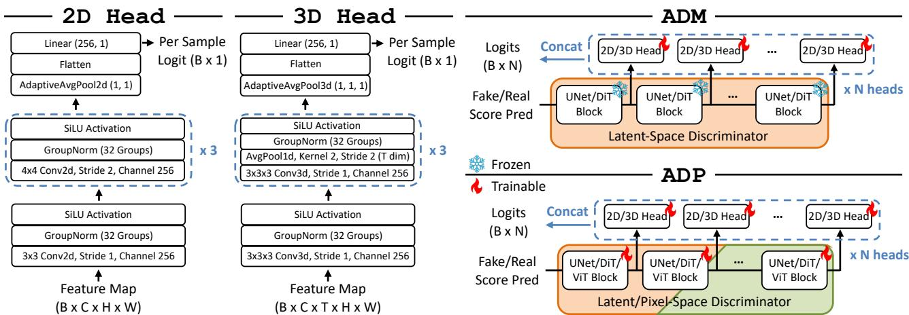  
Figure 6. Illustration of our discriminator design and the difference between ADM and ADP.

# B.4. Memory efficiency.

To reduce GPU memory footprint and improve efficiency, we utilize several acceleration techniques in our implementation including Fully Sharded Data Parallel (FSDP) [53], gradient checkpoint [4] and BF16 mixed precision [72]. For text-to-video models, we additionally integrate, Context Parallel (CP) [83] and Sequence Parallel (SP) [15] following common practice in MovieGen[46] to speed up training and inference. More importantly, a CPU offloading technique that has been built into Pytorch FSDP is essential for training multiple networks to save memory.

With CPU offloading enabled, each parameter along with the corresponding gradient and optimizer state can be offoaded from the GPU to CPU memory. In conjunction with gradient checkpointing, the GPU memory footprint in the forward and backward process is nearly the same as when there is only one single network, because the peak memory is now determined by the maximum activation of each block. This comes at the cost of increased CPU memory and longer time per iteration. While the CPU memory is usually sufficient and cheap, our more effective approaches require fewer iterations to achieve convergence and satisfactory results, and as Tab. 7 show that our DMDX takes less time than DMD2 on one-step SDXL distillation.

# B.5. Hyperparameters.

For all models of the optimizer (including generator, fake model and discriminator in both text-to-image and text-tovideo experiments), we use AdamW [29] optimizer without weight decay, with beta parameters (0.0, 0.99) to capture the changes in distribution more up-to-date. The learning rates of discriminator and fake model across all of our experiments are fixed at 5e-6 and 1e-6, respectively.

For SDXL, the learning rates for generator during ADP and ADM training are 1e-6 and 1e-7, respectively. As for multi-step ADM distillation, the learning rates for generator of SD3-Medium LoRA training and SD3.5-Large fully finetuning are given to 1e-6 and 1e-8, respectively. In case of text-to-video diffusion distillation, we set the same learning rate 1e-7 for different 8-step CogVideoX generators.

Among all the ADM experiments, the Classifier-Free Guidance (CFG) is required for real model as DMD does [85]. For SDXL, SD3-Medium, SD3.5-Large, and CogVideoX, the uniformly random sampling ranges for the CFG values are set to [6.0, 8.0], [6.0, 8.0], [3.0, 4.0], and [5.0, 7.0], respectively. The chosen ranges are based on the recommended CFG values from the original baseline's inference with some allowable variations. We observed that this setting is adequate for achieving satisfactory distilled performance without requiring extensive tuning.

The fake model training does not incorporate CFG and uses the same loss function as the standard pre-training of diffusion models, except that we didn't set any dropout. For noise-parameterized models, the prediction target is noise, while for velocity-parameterized models, it is velocity.

# C. Main Results

# C.1. Efficient Image Synthesis

Fig. 7 qualitatively compares our method with other stateof-the-art distillation techniques on SD3 [6] series models. The results demonstrate that our method is competitive to the original model in terms of color, detail, structure and image-text alignment, while outperforming other methods including TSCD, PCM [69], Flash [3] and LADD [60].

# C.2. Efficient Video Synthesis

Tabs. 8 and 9 present the details of VBench [14] results on the base model and few-step generators of CogVideoX [83]. In Figs. 11 to 16, we present several cases for qualitative comparisons between our CogVideoX [83] generators and baseline model. The results show that our 8-step generators are generally semantically comparable to the original model, even with semantic enhancements on some cases, e.g., the change of light in Fig. 11 and the movement of the sheep in Fig. 14. While in terms of imaging quality, generators with CFG are generally more detailed and have more delicate textures than those without CFG. The deficiencies in detail are reflected in, for example, the slightly rough hand and the incorrect number of fingers in Fig. 15, whereas the one with CFG is much more natural. As well as the generator without CFG is also much higher in color contrast, which visually looks sometimes too vibrant to be sufficiently realistic. These demonstrate the importance of CFG for text-to-video models, which might not be fully reflected by quantitative metrics.

Table 8. VBench [14] detailed results on overall scores and separate score for each quality dimension.   

<table><tr><td rowspan="2">Method</td><td rowspan="2">Step NFE</td><td rowspan="2"></td><td rowspan="2">Final Score</td><td colspan="2">Quality Semantic Subject</td><td rowspan="2">Consistency</td><td rowspan="2">Background Consistency</td><td rowspan="2">Temporal Flickering</td><td rowspan="2">Motion</td><td colspan="3">Dynamic Aesthetic Imaging</td></tr><tr><td>Score</td><td>Score</td><td>Smoothness</td><td>Degree Quality</td><td>Quality</td></tr><tr><td>ADM</td><td>8</td><td>8</td><td>78.58</td><td>80.82</td><td>69.62</td><td>96.72</td><td>96.55</td><td>97.01</td><td>98.14</td><td>48.61</td><td>57.80</td><td>65.28</td></tr><tr><td>+Longer Training ×2</td><td>8</td><td>8</td><td>80.76</td><td>83.03</td><td>71.69</td><td>96.58</td><td>96.71</td><td>98.12</td><td>97.68</td><td>73.33</td><td>57.90</td><td>65.72</td></tr><tr><td>ADM w/ CFG</td><td>8</td><td>16</td><td>79.86</td><td>80.93</td><td>75.56</td><td>96.16</td><td>96.96</td><td>96.86</td><td>97.69</td><td>54.44</td><td>59.78</td><td>63.18</td></tr><tr><td>+Longer Training ×2</td><td>8</td><td>16</td><td>81.79</td><td>83.00</td><td>76.94</td><td>96.83</td><td>96.90</td><td>98.51</td><td>98.07</td><td>63.05</td><td>61.03</td><td>64.62</td></tr><tr><td>CogVideoX-2b</td><td>100</td><td>200</td><td>80.03</td><td>80.80</td><td>76.97</td><td>92.53</td><td>95.22</td><td>97.79</td><td>97.00</td><td>69.44</td><td>60.38</td><td>60.69</td></tr><tr><td>ADM</td><td>8</td><td>8</td><td>82.06</td><td>83.22</td><td>77.42</td><td>96.42</td><td>96.87</td><td>96.96</td><td>97.69</td><td>68.88</td><td>61.17</td><td>69.01</td></tr><tr><td>ADM w/ CFG</td><td>8</td><td>16</td><td>80.98</td><td>82.16</td><td>76.25</td><td>96.15</td><td>96.59</td><td>95.99</td><td>98.57</td><td>56.66</td><td>61.01</td><td>68.68</td></tr><tr><td>CogVideoX-5b</td><td>100</td><td>200</td><td>81.22</td><td>81.78</td><td>78.98</td><td>92.52</td><td>96.68</td><td>98.34</td><td>96.97</td><td>70.55</td><td>61.67</td><td>61.88</td></tr></table>

Table 9. VBench [14] detailed results on separate score for each semantic dimension.   

<table><tr><td>Method</td><td></td><td>Step NFE</td><td>Object Class</td><td>Multiple Objects</td><td>Human Action</td><td>Color</td><td>Spatial Relationship</td><td>Scene</td><td>Appearance Style</td><td>Temporal Style</td><td>Overall Consistency</td></tr><tr><td>ADM</td><td>8</td><td>8</td><td>83.97</td><td>47.19</td><td>87.40</td><td>77.79</td><td>62.93</td><td>42.64</td><td>24.16</td><td>22.35</td><td>25.27</td></tr><tr><td>+Longer Training ×2</td><td>8</td><td>8</td><td>87.84</td><td>56.53</td><td>85.00</td><td>80.28</td><td>69.52</td><td>44.33</td><td>23.15</td><td>22.60</td><td>25.11</td></tr><tr><td>ADM w/CFG</td><td>8</td><td>16</td><td>89.55</td><td>64.78</td><td>92.60</td><td>82.31</td><td>62.61</td><td>52.73</td><td>24.31</td><td>24.46</td><td>26.12</td></tr><tr><td>+Longer Training ×2</td><td>8</td><td>16</td><td>91.67</td><td>71.58</td><td>92.20</td><td>82.01</td><td>71.79</td><td>50.26</td><td>23.54</td><td>24.54</td><td>26.30</td></tr><tr><td>CogVideoX-2b</td><td>100</td><td>200</td><td>80.01</td><td>67.23</td><td>98.60</td><td>89.98</td><td>49.05</td><td>68.60</td><td>24.04</td><td>25.37</td><td>25.68</td></tr><tr><td>ADM</td><td>8</td><td>8</td><td>92.94</td><td>65.89</td><td>95.80</td><td>84.97</td><td>72.92</td><td>56.06</td><td>22.63</td><td>23.64</td><td>26.17</td></tr><tr><td>ADM w/ CFG</td><td>8</td><td>16</td><td>89.41</td><td>69.89</td><td>97.00</td><td>71.35</td><td>81.26</td><td>53.90</td><td>21.48</td><td>23.79</td><td>25.92</td></tr><tr><td>CogVideoX-5b</td><td>100</td><td>200</td><td>87.64</td><td>67.34</td><td>99.60</td><td>83.93</td><td>68.24</td><td>56.35</td><td>25.16</td><td>25.82</td><td>27.79</td></tr></table>

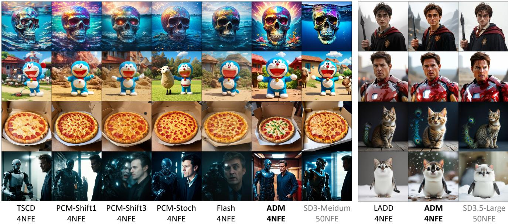  
Fgre7. Qualitaive reults n LoRA fe-tuni SD3-Mediu nd fule-tuning SD3.5-Large

# C.3. Ablation Studies

As for ablation on adversarial distillation shown in Fig. 8, the two main problems with other baseline settings are structure and blurriness. When using MSE loss for a single reflow process as in Rectified Flow [27], it is obvious that it is struggling to generate a structurally visible image. And switching the SAM [19] model to DINOv2 [48], we can clearly see the structural collapse of both the robot and the face in the figure, which is unexpected and may be caused by the fact that its input resolution is only $5 1 8 \mathrm { p x }$ ,and the images we generate are all $1 0 2 4 \mathrm { p x }$ need to be resized before they can be input. Another possible explanation is that the prior knowledge used by SAM for instance segmentation is richer than that provided by DINOv2 for discriminative self-supervised learning, which facilitates the generation of local fine-grained details. The structural problems encountered when increasing the weight of pixel-space $\lambda _ { 2 }$ are similar, while decreasing its weight causes a very noticeable blurring that is clearly visible in the figure, so we suggest setting $\lambda _ { 1 } = 0 . 8 5 , \lambda _ { 2 } = 0 . 1 5$ is a reasonable configuration.

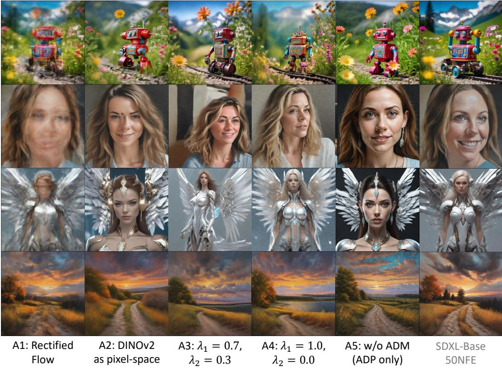  
Figure 8. Qualitative comparisons for ablation studies on adversarial distillation.

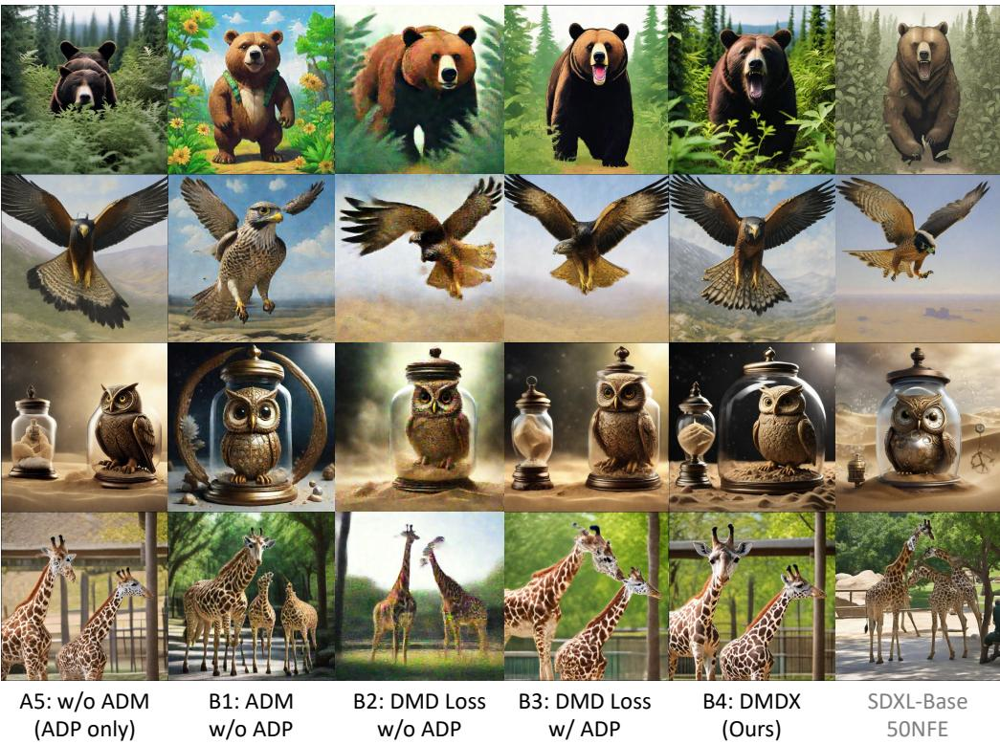  
Figure 9. Qualitative comparisons for ablation studies on score distillation.

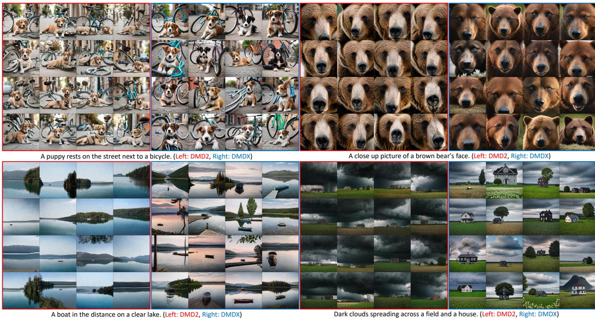  
Figure 10. Qualitative diversity comparisons with DMD2.

In Fig. 9, we provide qualitative comparisons for ablation studies on score distillation. Compared to the baseline without ADM (ADP only), we can see that the ADM distillation indeed serves as a fine-tuning process to refine the generator in terms of both color, detail and the most notable structure. Although standalone ADM can also produce efficient generator, the noise artifact within 1-step generations as similarly observed by [23, 85] still exists, and with our ADP this issue can be addressed well. Notably, the visualization results demonstrate that employing the DMD loss without ADP integration induces substantially severe noise artifacts. Compared to using ADM alone, its qualitative disadvantage is much more pronounced than the gap observed in the quantitative results. With ADP, the DMD loss generates relatively good results, yet it remains inferior to ADM in terms of visual fidelity and structural integrity. This indicates that its distribution matching capability is weaker than that of ADM, which is consistent with our analysis in the quantitative results of Sec. 5.3.

Additionally, we showcase additional randomly curated multi-seed samples in Fig. 10 compared with DMD2, clearly demonstrating that our images exhibit richer variations in texture, color, brightness, contrast and structural composition.

# D. Broader Impact

Considering that many current methods leverage generated data from foundation models as assistance [44], our acceleration approach for diffusion models can substantially expedite this process, thereby benefiting numerous downstream tasks such as recognition [77], detection [42], retrieval [31, 41], domain adaptation [32, 62], etc. Alternatively, we can train LoRA to acquire an acceleration plugin, enhancing the efficiency of customized vertical models for image [33] or video [80] generation.

# E. Prompt List

Below we list the text prompts used for the generated content shown in this paper (from top to bottom, from left to right). Note that since models like SDXL-Base [56] only use CLIP [52] as a text encoder, which only supports a maximum of 77 tokens, the response and text-image alignment may be insufficient for some long prompts and its limited capacity in understanding.

# We use the following prompts for Fig. 5:

•A beautiful woman facing to the camera, smiling confidently, colorful long hair, diamond necklace, deep red lip, medium shot, highly detailed, realistic, masterpiece.   
• An owl perches quietly on a twisted branch deep within an ancient forest. Its sharp yellow eyes are keen and watchful.   
A young badger delicately sniffing a yellow rose, with a lion lurking in the background.   
•A pickup truck going up a mountain switchback. We use the following prompts for Fig. 7:   
• A photograph of a giant diamond skull in the ocean, featuring vibrant colors and detailed textures.   
A still of Doraemon from "Shaun the Sheep" by Aardman Animation.   
•A pizza is displayed inside a pizza box.   
• movie still of a man and a robot in a moment of horror, movie still, cinematic composition, cinematic light, by edgar wright and david lynch   
harry potter as a skyrim character   
film still of Tom Cruise as Ironman in the Avengers   
A beautiful award winning picture of a cute cat in front of a dark background. The cat is a cat-peacock hybrid and has a peacock tail and short peacock feathers on the body. fuffy, extremely detailed, stunning, high quality, atmospheric lighting   
a cute animal that's a penguin cat hybrid We use the following prompts for Fig. 8:   
• A colorful tin toy robot runs a steam engine on a path near a beautiful flower meadow in the Swiss Alps with a montin panorama in the backround,captured inl shot with motion blur and depth of field.   
A portrait painting of Leighann Vail.   
A photo of a mechanical angel woman with crystal wings, in the sci-fi style of Stefan Kostic, created by Stanley Lau and Artgerm.   
•A painting depicting a foothpath at Indian summer with an epic evening sky at sunset and low thunder clouds. We use the following prompts for Fig. 9:   
A bear walks through a group of bushes with a plant in its mouth.   
A falcon in flight, depicted in a highly detailed painting by Ilya Repin, Phil Hale, and Kent Williams.   
•A steampunk pocketwatch owl is trapped inside a glass jar b d  ass mist.   
Some giraffes are walking around the zoo exhibit.

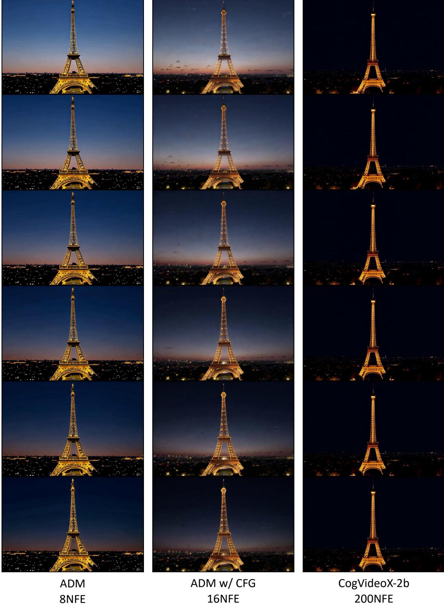  
E .

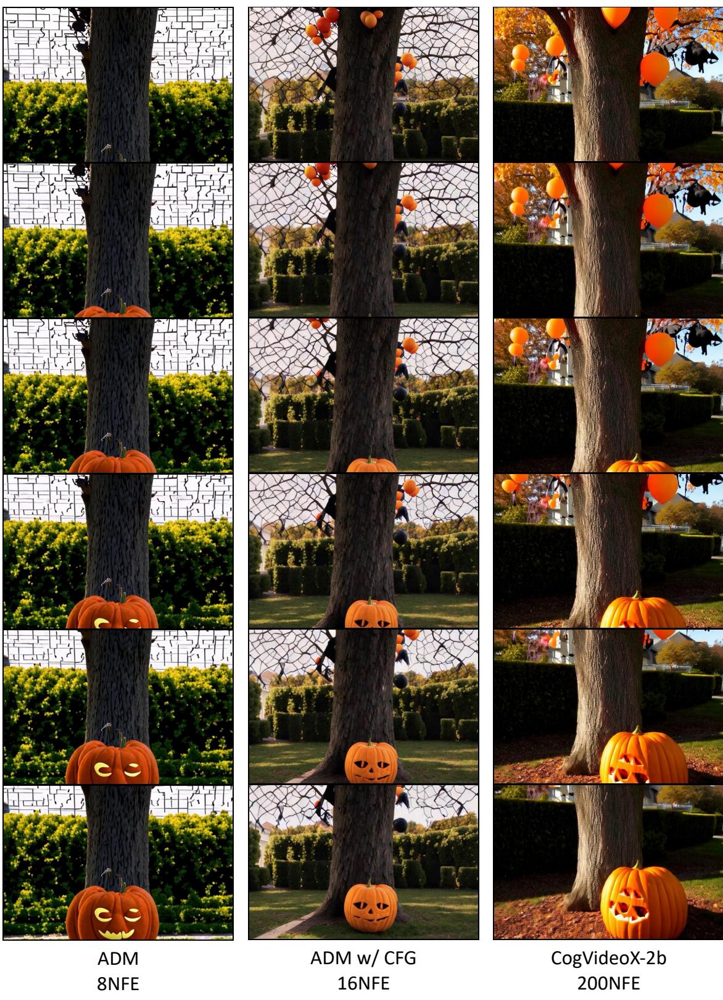  
a path leading up to a quaint house, all bathed in the soft glowof autumn sunlight.

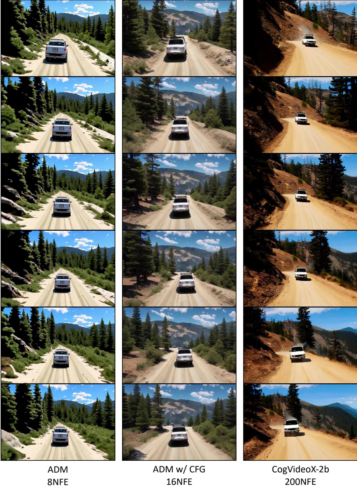  
.

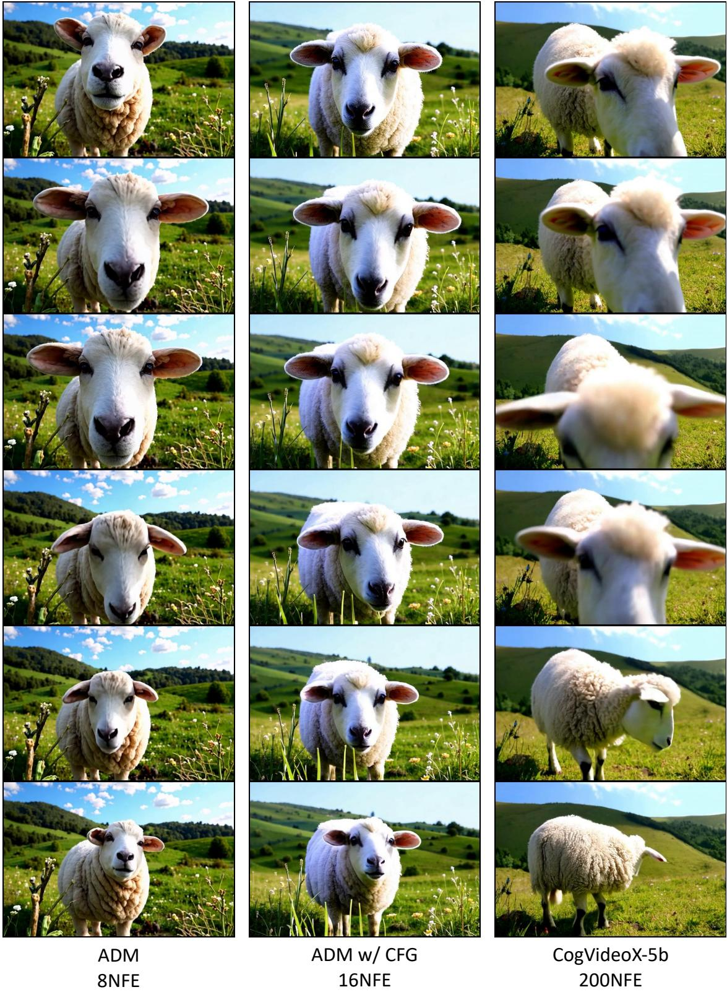  
up, framed by the picturesque landscape, embodying tranquility and the simple beauty of nature.

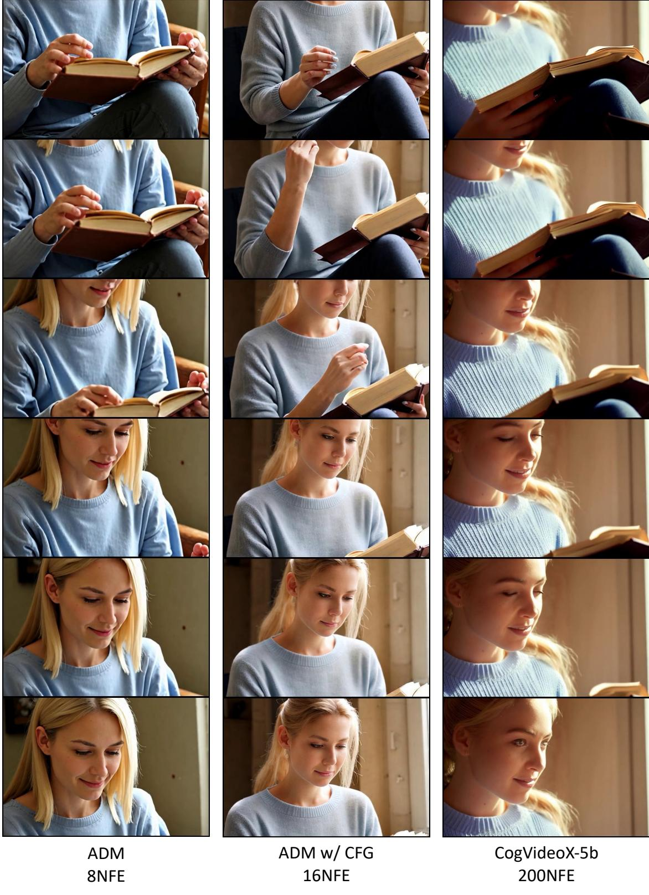  
Fi- io T scene ends with a close-up of her thoughtful smile, suggesting a moment of discovery or reflection.

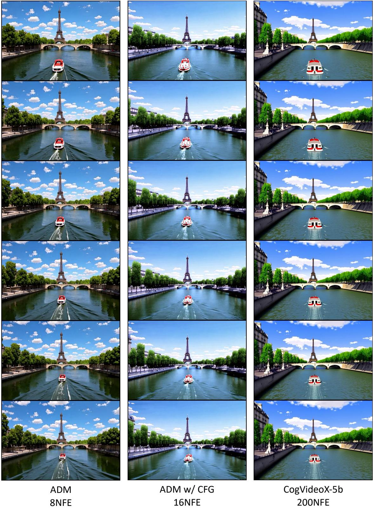  
Fli- o: capturing the essence of a peaceful day in Paris.