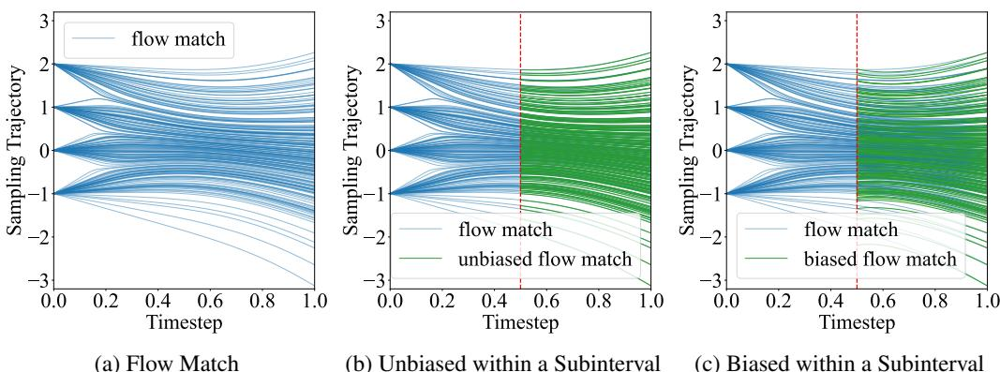
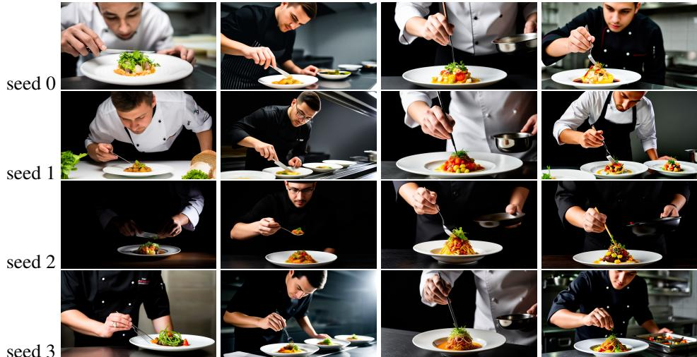
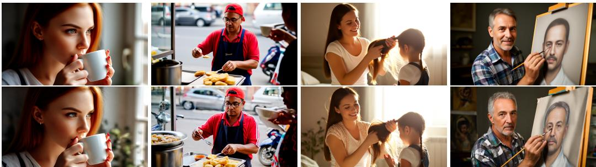
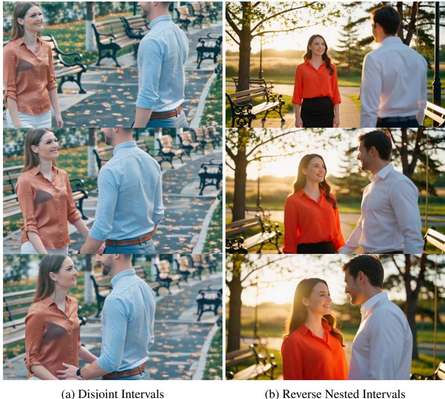

# 1. Bibliographic Information

## 1.1. Title
Phased DMD: Few-step Distribution Matching Distillation via Score Matching within Subintervals

## 1.2. Authors
The authors are Xiangyu Fan, Zesong Qiu, Zhuguanyu Wu, Fanzhou Wang, Zhiqian Lin, Tianxiang Ren, Dahua Lin, Ruihao Gong, and Lei Yang. The primary affiliations are SenseTime Research and Beihang University, indicating a strong background in industrial research and computer vision.

## 1.3. Journal/Conference
The paper is available as a preprint on arXiv. It mentions compliance with the ICLR Code of Ethics, suggesting that the International Conference on Learning Representations (ICLR) could be a target venue. ICLR is a top-tier conference in the field of machine learning and artificial intelligence, known for its rigorous peer-review process.

## 1.4. Publication Year
The paper was submitted to arXiv with a future publication date of October 31, 2025. This indicates it is a very recent work submitted for review.

## 1.5. Abstract
The abstract introduces `Distribution Matching Distillation` (DMD) as a method to distill large score-based models into efficient one-step generators. It highlights a key limitation: one-step models struggle with complex tasks like intricate motion in video generation due to limited capacity. While extending DMD to multiple steps seems logical, it introduces instability and efficiency issues. A proposed solution, `stochastic gradient truncation`, is found to severely reduce generation diversity.

To overcome these challenges, the paper proposes **Phased DMD**, a multi-step distillation framework that integrates phase-wise distillation with a `Mixture-of-Experts` (MoE) architecture. The method is based on two core ideas: 1) **progressive distribution matching**, where the model is refined progressively over subintervals of the Signal-to-Noise Ratio (SNR) range, and 2) **score matching within subintervals**, for which the authors provide a rigorous mathematical derivation to ensure the training objective is accurate. The authors validate Phased DMD on large-scale models like Qwen-Image (20B) and Wan2.2 (28B), demonstrating that it preserves output diversity and key generative capabilities better than existing methods.

## 1.6. Original Source Link
*   **Original Source Link:** https://arxiv.org/abs/2510.27684
*   **PDF Link:** https://arxiv.org/pdf/2510.27684.pdf
*   **Publication Status:** The paper is currently a preprint on arXiv.

# 2. Executive Summary

## 2.1. Background & Motivation
*   **Core Problem:** State-of-the-art diffusion models for image and video generation have become extremely large and computationally expensive, making their inference slow. Model distillation is a key technique to accelerate them. While `Distribution Matching Distillation` (DMD) can create high-quality one-step generators, their limited model capacity makes them fall short on complex tasks (e.g., rendering fine text or generating dynamic motion).
*   **Importance and Gaps:** A natural solution is to extend distillation to a few steps, balancing quality and speed. However, naively extending DMD to multiple steps leads to deep computational graphs, increasing memory usage and causing training instability. An existing solution, the `stochastic gradient truncation strategy` (SGTS), stabilizes training but at a significant cost: it collapses the diversity of generated samples to the level of a one-step model, defeating the purpose of multi-step generation.
*   **Innovative Idea:** The paper proposes that instead of training a single monolithic model for all generation steps, the problem can be decomposed. Inspired by progressive training methods (like ProGAN) and `Mixture-of-Experts` (MoE) architectures, the authors introduce **Phased DMD**. The core idea is to divide the denoising process into distinct phases, each corresponding to a subinterval of the Signal-to-Noise Ratio (SNR). In each phase, a specialized "expert" network is trained to denoise within its assigned SNR range. This simplifies the learning task for each expert and naturally builds an MoE generator, increasing model capacity without adding inference cost.

## 2.2. Main Contributions / Findings
The paper makes three primary contributions:
1.  **Proposal of Phased DMD:** It introduces a novel, data-free distillation framework for creating few-step diffusion models. Phased DMD combines the principles of progressive learning and MoE, allowing it to achieve a higher performance ceiling than standard DMD while maintaining comparable memory usage to single-step methods during training.
2.  **Theoretical Derivation for Subinterval Score Matching:** A critical challenge in phased distillation is that intermediate phases do not have access to the original clean data ($x_0$). The paper provides a rigorous mathematical derivation for the correct score-matching objective within an SNR subinterval, using only the noisy samples from the previous phase. This theoretical grounding is essential for the validity and success of the DMD framework in a phased context.
3.  **State-of-the-Art Validation:** Phased DMD is validated by distilling massive, state-of-the-art text-to-image (Qwen-Image, 20B parameters) and text-to-video (Wan2.2, 28B parameters) models. The experiments show that Phased DMD effectively mitigates the diversity loss seen in other few-step methods while preserving the unique, high-level capabilities of the teacher models, such as complex text rendering and high-dynamics motion generation.

# 3. Prerequisite Knowledge & Related Work

## 3.1. Foundational Concepts
### 3.1.1. Diffusion Models
Diffusion models are a class of generative models that learn to create data by reversing a noise-injection process. The core idea involves two processes:
*   **Forward Process (Noising):** This is a fixed process where clean data $x_0$ is gradually corrupted by adding Gaussian noise over a series of timesteps $t$. In the continuous-time formulation used by the paper, any noisy sample $x_t$ at time $t \in [0, 1]$ can be generated directly from $x_0$:
    \$
    x_t = \alpha_t x_0 + \sigma_t \epsilon
    \$
    where $\epsilon$ is standard Gaussian noise, and $\alpha_t$ and $\sigma_t$ are predefined scheduling functions that control the signal and noise levels, respectively. As $t$ goes from 0 to 1, the signal $\alpha_t x_0$ diminishes and the noise $\sigma_t \epsilon$ dominates, until at $t=1$, $x_1$ is nearly pure noise. The **Signal-to-Noise Ratio (SNR)**, defined as $\text{SNR}(t) = \alpha_t^2 / \sigma_t^2$, decreases as $t$ increases.
*   **Reverse Process (Denoising):** This is the generative process. The model learns to reverse the noising process, starting from pure noise $x_1$ and iteratively denoising it to produce a clean sample $x_0$. This is achieved by training a neural network to predict the noise added at each step, or equivalently, to predict the "score" of the noisy data distribution.

### 3.1.2. Score Matching
The **score function** of a probability distribution `p(x)` is defined as the gradient of its log-probability with respect to the data, i.e., $\nabla_x \log p(x)$. This function points in the direction of the steepest increase in data density. Score-based generative models train a neural network, the score estimator $s_\theta(x_t, t)$, to approximate the true score of the noisy data distribution at each time $t$, $\nabla_{x_t} \log p(x_t)$.
*   **Denoising Score Matching (DSM):** Directly computing the true score is intractable. DSM provides an equivalent and practical objective. It trains the model to denoise a sample $x_t$ by predicting the original noise $\epsilon$ that was added. The equivalence between this and explicit score matching is a foundational result that allows diffusion models to be trained effectively.

### 3.1.3. Distribution Matching Distillation (DMD)
DMD is a technique for distilling a pre-trained, multi-step diffusion model (the "teacher") into a highly efficient one-step or few-step model (the "student" or "generator"). It is a **data-free** adversarial framework with three components:
1.  **Generator ($G_\phi$):** The student model being trained. It takes noise as input and generates a sample in one or a few steps.
2.  **Teacher Score Estimator ($T_{\hat{\theta}}$):** The frozen, pre-trained diffusion model. It provides an estimate of the score for the *real* data distribution.
3.  **Fake Score Estimator ($F_\theta$):** A trainable score model, initialized from the teacher. Its job is to estimate the score of the *generated* (fake) data distribution produced by $G_\phi$.

    The training is adversarial:
*   **Generator Update:** The generator $G_\phi$ is updated to produce samples that "trick" the score estimators. It aims to minimize the discrepancy between the teacher's score and the fake score on its generated samples. This pushes the generated distribution $p_{fake}$ to match the real distribution $p_{real}$.
*   **Fake Score Estimator Update:** The fake model $F_\theta$ is updated via score matching on the samples produced by the current generator $G_\phi$, so it accurately represents the score of $p_{fake}$.

    This process minimizes the reverse Kullback-Leibler (KL) divergence $D_{KL}(p_{fake} || p_{real})$.

### 3.1.4. Mixture-of-Experts (MoE)
MoE is a neural network architecture that uses multiple specialized sub-networks, called "experts," instead of a single large model. A "gating network" determines which expert(s) should process a given input. In diffusion models, experts can be specialized for different SNR ranges. For example, a low-SNR expert (handling high noise) might focus on global structure and composition, while a high-SNR expert (handling low noise) focuses on refining fine details and textures. This allows the model to have a much larger capacity without increasing the computational cost at inference time, as only a subset of experts are activated for any given input.

## 3.2. Previous Works
*   **DMD (Yin et al., 2024a):** This is the foundational method for the paper. It established the data-free, adversarial distillation framework described above for one-step generation. Its main limitation, which Phased DMD addresses, is the capacity bottleneck of a single-step generator.
*   **Few-step DMD with SGTS (Huang et al., 2025):** This work attempted to extend DMD to multiple steps. To handle the resulting training instability and high memory usage, it proposed the `stochastic gradient truncation strategy` (SGTS). During training, the N-step generation process is randomly stopped at an intermediate step $j$, and the gradient is backpropagated *only* from that final denoising step. The current paper critiques this approach, arguing that because the process can terminate after just one step ($j=1$), the model is implicitly trained as a one-step generator in those iterations, leading to a significant loss of generative diversity.
*   **TDM (Luo et al., 2025):** The paper identifies Trajectory Distribution Matching (TDM) as the most closely related work, as it also extends DMD to few-step distillation. However, Phased DMD differs in three crucial ways:
    1.  **Theoretical Soundness:** TDM allegedly uses an incorrect formulation for training the fake score estimator in its intermediate steps, which violates the principles of score matching. Phased DMD provides a theoretically correct derivation.
    2.  **Model Architecture:** Phased DMD inherently produces an MoE model, where each phase trains a distinct expert.
    3.  **SNR Intervals:** TDM uses disjoint SNR intervals for different steps, while Phased DMD uses "reverse nested" intervals (e.g., phase 1 on $(t_1, 1)$, phase 2 on $(t_2, 1)$), which the authors find to be empirically superior.

## 3.3. Technological Evolution
The acceleration of diffusion models has progressed rapidly:
1.  **Early Models:** Original models like DDPM required thousands of steps for high-quality generation.
2.  **Faster Samplers:** Techniques like DDIM introduced deterministic samplers that required fewer steps (e.g., 50-250).
3.  **Model Distillation:** `Progressive Distillation` was an early approach where a student model learns to perform two steps of the teacher in a single step, halving the step count iteratively.
4.  **One-Step Distillation:** A major breakthrough came with methods like `Consistency Models` and DMD, which could distill a teacher into a model that generates high-quality samples in just one step.
5.  **Few-Step Distillation:** The current frontier is creating models that can generate in 2-8 steps, offering a better trade-off between the quality of multi-step models and the speed of one-step models. This paper's work on Phased DMD is a significant contribution to this area, aiming to solve the quality and diversity issues in few-step distillation.

## 3.4. Differentiation Analysis
*   **vs. Standard DMD:** Phased DMD is a **multi-step** method, whereas the original DMD is **one-step**. Phased DMD uses an **MoE** architecture, while standard DMD uses a single network.
*   **vs. DMD with SGTS:** Both are few-step methods, but Phased DMD avoids the diversity collapse of SGTS by using **explicit supervision at intermediate phases** instead of random truncation. Its phased training is structured and progressive, not stochastic.
*   **vs. TDM:** Phased DMD provides a **theoretically correct objective** for subinterval score matching, a key difference from TDM. It also uses **nested SNR intervals** and explicitly frames the outcome as an **MoE model**, which are distinct design choices.

# 4. Methodology

## 4.1. Principles
The core principle of Phased DMD is to **decompose a complex, end-to-end generation task into a sequence of simpler, phased sub-tasks**. Instead of training a single generator to map pure noise ($x_1$) directly to a clean image ($x_0$) in a few steps, Phased DMD trains a series of "expert" models. Each expert is responsible for a specific "phase" of the denoising process, corresponding to a particular subinterval of the Signal-to-Noise Ratio (SNR).

This phased approach draws inspiration from two sources:
1.  **Progressive Training (like ProGAN):** Just as ProGAN progressively increases image resolution, Phased DMD progressively increases the SNR level (i.e., reduces noise). The model first learns the coarse structure of the data distribution in the low-SNR (high noise) regime and then refines the details in subsequent high-SNR (low noise) phases.
2.  **Mixture-of-Experts (MoE):** Each phase trains a specialized expert. When combined for inference, these experts form an MoE generator. This increases the model's overall capacity and allows for specialized learning without increasing inference computation, as only one expert is active per step.

    A crucial theoretical challenge is that for intermediate phases, the training process doesn't have access to clean data ($x_0$). The methodology's rigor lies in deriving a valid score-matching objective for the fake diffusion model that works only with the noisy outputs from the previous phase.

## 4.2. Core Methodology In-depth

### 4.2.1. Preliminaries: Diffusion and DMD
The paper starts by defining the continuous-time diffusion process. A sample $x_t$ at time $t$ is generated from a clean sample $x_0$ by:
$$
p ( \pmb { x } _ { t } | \pmb { x } _ { 0 } ) = \mathcal { N } ( \pmb { x } _ { t } ; \alpha _ { t } \pmb { x } _ { 0 } , \sigma _ { t } ^ { 2 } \pmb { I } )
$$
*   $\pmb{x}_t$: The noisy sample at time $t$.
*   $\pmb{x}_0$: The clean data sample.
*   $\alpha_t, \sigma_t$: Time-dependent scalars controlling the signal and noise levels.
*   $\mathcal{N}(\cdot; \mu, \Sigma)$: A Gaussian distribution with mean $\mu$ and covariance $\Sigma$.

    A key property is that noise can be added sequentially. The distribution of $x_t$ given a less noisy sample $x_s$ (where $s < t$) is also Gaussian:
$$
p ( \pmb { x } _ { t } | \pmb { x } _ { s } ) = \mathcal { N } ( \pmb { x } _ { t } ; \alpha _ { t | s } \pmb { x } _ { s } , \sigma _ { t | s } ^ { 2 } I )
$$
*   $\alpha_{t|s} = \alpha_t / \alpha_s$
*   $\sigma_{t|s}^2 = \sigma_t^2 - \alpha_{t|s}^2 \sigma_s^2$

    The standard DMD framework aims to match the generated distribution $p_{fake}(x_0)$ to the real one $p_{real}(x_0)$ by minimizing the reverse KL divergence. This is approximated by matching the scores of their diffused versions, $p_{fake}(x_t)$ and $p_{real}(x_t)$. The gradient for updating the generator $G_\phi$ is:
$$
\nabla \phi D _ { K L } \approx \mathbb { E } _ { \epsilon \sim \mathcal { N } , x _ { 0 } = G _ { \phi } ( \epsilon ) , t \sim \mathcal{T} , x _ { t } \sim p ( x _ { t } | x _ { 0 } ) } [ w _ { t } ( T _ { \hat { \theta } } ( x _ { t } ) - F _ { \theta } ( x _ { t } ) ) ] \frac{d G}{d \phi}
$$
*   $G_\phi(\epsilon)$: The generator producing a sample $x_0$ from noise $\epsilon$.
*   $T_{\hat{\theta}}(x_t)$: The teacher model's score estimate for $x_t$.
*   $F_\theta(x_t)$: The fake model's score estimate for $x_t$.
*   $w_t$: A time-dependent weighting factor.
*   $\mathcal{T}$: A distribution for sampling time $t$.

### 4.2.2. Phased DMD: Progressive Distillation
Instead of a single end-to-end process, Phased DMD uses an $N$-step generation process divided into phases. For simplicity, let's consider a 2-phase, $N$-step process. The timesteps are $1=t_0 > t_1 > \dots > t_k > \dots > t_N=0$.
*   **Phase 1 (Low-SNR Expert):** The first expert, $G_{\phi_1}$, is trained. It takes initial noise $x_{t_0}$ and performs the first set of denoising steps to produce an intermediate sample $x_{t_k}$. The goal of this phase is *not* to generate a clean image, but to match the distribution of its output $p_{fake}(x_{t_k})$ to the distribution of real data diffused to the same timestep, $p_{real}(x_{t_k})$.
*   **Phase 2 (High-SNR Expert):** The second expert, $G_{\phi_2}$, takes the output from the first phase, $x_{t_k}$, and performs the remaining steps to produce the final clean sample $x_{t_N} = x_0$. This phase is trained to match the final generated distribution $p_{fake}(x_0)$ to $p_{real}(x_0)$.

    The generator update objective for an expert in phase $k$, $G_{\phi_k}$, is generalized as follows:
$$
\nabla \phi _ { k } D _ { K L } \approx \mathbb { E } [ w _ { t | t _ { k } } ( T _ { \hat { \theta } } ( \boldsymbol { x } _ { t } ) - F _ { \theta _ { k } } ( \boldsymbol { x } _ { t } ) ) ] \frac{d G_{\phi_k}}{d \phi_k}
$$
The expectation is over:
1.  Initial noise $\epsilon \sim \mathcal{N}$.
2.  An intermediate sample $x_{t_k}$ produced by the pipeline of experts up to phase $k$.
3.  A time $t$ sampled from the subinterval $(t_k, 1)$, i.e., $t \sim \mathcal{T}(t; t_k, 1)$. The paper finds that sampling from this "reverse nested" interval works better than sampling from a disjoint interval like $(t_k, t_{k-1})$.
4.  A noisy sample $x_t$ created by adding noise to $x_{t_k}$ according to $p(x_t|x_{t_k})$.

    This structure has several benefits: the computational graph for backpropagation is shallow in each phase (only through one expert), reducing memory and improving stability. It also naturally creates an MoE generator, as $G_{\phi_1}, G_{\phi_2}, \dots$ are distinct experts.

### 4.2.3. Score Matching within Subintervals
This is the theoretical heart of the paper. In any phase $k>1$, we need to train the fake score estimator $F_{\theta_k}$. However, the standard training objective requires clean samples $x_0$, which we don't have. We only have the noisy samples $x_s$ (where $s=t_{k-1}$) produced by the previous phase's generator.

The authors derive the correct training objective for a flow-based diffusion model $\psi_\theta$ on a subinterval $(s, 1)$ given only samples $x_s \sim p(x_s)$. The derivation starts from the general score matching objective and uses the law of total probability to switch from an expectation over $x_t \sim p(x_t)$ to an expectation over $x_s \sim p(x_s)$ and $x_t \sim p(x_t|x_s)$.
The resulting objective is:
$$
\begin{array} { r l } & { J _ { f l o w } ( \theta ) = \mathbb { E } _ { x _ { s } \sim p ( x _ { s } ) , \epsilon \sim \mathcal { N } , t \sim \mathcal { T } ( t ; s , 1 ) , x _ { t } = \alpha _ { t | s } x _ { s } + \sigma _ { t | s } \epsilon } \\ & { [ \| \psi _ { \theta } ( x _ { t } ) - ( ( \alpha _ { s } ^ { 2 } \sigma _ { t } + \alpha _ { t } \sigma _ { s } ^ { 2 } ) / ( \alpha _ { s } ^ { 2 } \sigma _ { t | s } ) \epsilon - ( 1 / \alpha _ { s } ) x _ { s } ) \| ^ { 2 } ] } \end{array}
$$
This formula defines the correct target for the model's prediction $\psi_\theta(x_t)$ using only the available quantities: the intermediate sample $x_s$, the noise $\epsilon$, and the scheduling functions $\alpha, \sigma$.

To handle numerical instability when $t$ is very close to $s$ (making $\sigma_{t|s} \to 0$), the authors introduce a clamping function and rearrange the terms, leading to the final, stable objective for training the fake score estimator $F_{\theta_k} \equiv \psi_\theta$ in phase $k$ (where $s=t_{k-1}$):
$$
\begin{array} { r l } & { J _ { f l o w } ( \pmb { \theta } ) = \mathbb { E } _ { \pmb { x _ { s } } \sim p ( \pmb { x _ { s } } ) , \epsilon \sim \mathcal { N } , t \sim \mathcal { T } ( t ; s , 1 ) , \pmb { x _ { t } = \alpha _ { t \mid s } } \pmb { x _ { s } } + \sigma _ { t \mid s } \epsilon } } \\ & { [ \mathrm { clamp } ( 1 / ( \sigma _ { t \mid s } ) ^ { 2 } ) \lVert \sigma _ { t \mid s } \psi _ { \pmb { \theta } } ( \pmb { x _ { t } } ) - ( ( \alpha _ { s } ^ { 2 } \sigma _ { t } + \alpha _ { t } \sigma _ { s } ^ { 2 } ) / \alpha _ { s } ^ { 2 } ) \epsilon - ( \sigma _ { t \mid s } / \alpha _ { s } ) \pmb { x _ { s } } ) \rVert ^ { 2 } ] } \end{array}
$$
*   $\pmb{x_s}$: The sample from the previous phase's generator.
*   $\epsilon$: Standard Gaussian noise.
*   $t$: Timestep sampled from the subinterval $(s, 1)$.
*   $\psi_\theta$: The fake score model being trained.
*   $\text{clamp}(\cdot)$: A function to prevent numerical overflow.

    The correctness of this objective is validated with a 1D toy experiment, shown in Figure 2 of the paper. Training with the correct subinterval objective (Eq. 13) produces sampling trajectories that perfectly match those of a model trained on the full interval with access to clean data. In contrast, using a naive, incorrect target leads to biased trajectories.

The following figure (Figure 2 from the original paper) illustrates this validation.

*该图像是一个插图，展示了不同场景下的创意表达。从左到右，包含了一个学生在黑板上写字的场景、一位男士在窗前看月亮并拿着纸条、一只猫在旁边、一台显示出绚丽色彩电脑的插画，最后是穿着晚礼服的模特。整体传达了想象力和创造力的主题。*

*   **(a)** Shows the ideal sampling trajectories when the model is trained on the full interval with access to clean data.
*   **(b)** Shows the trajectories when the model is trained only on the subinterval $0.5 < t < 1$ using the **correct** objective (Eq. 13). The trajectories almost perfectly overlap with (a), validating the derived formula.
*   **(c)** Shows the trajectories when trained on the same subinterval but with a **naive, incorrect** objective. The trajectories are clearly biased and do not match the ideal ones.

# 5. Experimental Setup

## 5.1. Datasets
The Phased DMD method is **data-free**, meaning it does not require access to the original training dataset of the teacher model. The distillation process only uses the teacher model itself.

However, for **evaluation**, the authors constructed specific test sets:
*   **Generative Diversity Evaluation:** A custom set of **21 text prompts** was used. These prompts describe general content without overly specific details to allow for variation. For each prompt, 8 images were generated with different random seeds.
*   **Motion Quality Evaluation:** A set of **220 text prompts** for Text-to-Video (T2V) and **220 image-prompt pairs** for Image-to-Video (I2V) were used. One video was generated per prompt with a fixed seed.

    The experiments were conducted by distilling large-scale, pre-trained models, demonstrating the scalability of the proposed method:
*   `Wan2.1-T2V-14B` & `Wan2.2-T2V-A14B`: Large-scale text-to-video models with 14B and 28B parameters, respectively. The `Wan2.2` model already has an MoE architecture, allowing for a fair comparison of distillation methods under an equivalent parameter budget.
*   `Qwen-Image-20B`: A 20B parameter text-to-image model known for high-quality text rendering.

## 5.2. Evaluation Metrics
The paper uses several metrics to evaluate generative diversity and the preservation of model capabilities.

### 5.2.1. DINOv3 Cosine Similarity
*   **Conceptual Definition:** This metric measures the diversity of generated images in a deep feature space. Images are passed through a pre-trained DINOv3 vision model to extract feature embeddings. The pairwise cosine similarity between the embeddings of images generated from the same prompt (but different seeds) is calculated. A lower mean similarity indicates that the images are more distinct in feature space, implying higher diversity.
*   **Mathematical Formula:** For two feature vectors $A$ and $B$, the cosine similarity is:
    \$
    \text{Similarity}(A, B) = \frac{A \cdot B}{\|A\| \|B\|} = \frac{\sum_{i=1}^{n} A_i B_i}{\sqrt{\sum_{i=1}^{n} A_i^2} \sqrt{\sum_{i=1}^{n} B_i^2}}
    \$
*   **Symbol Explanation:**
    *   `A, B`: Feature vectors (embeddings) of the two images.
    *   $n$: The dimension of the feature vectors.

### 5.2.2. LPIPS (Learned Perceptual Image Patch Similarity)
*   **Conceptual Definition:** LPIPS measures the perceptual distance between two images. It is designed to align better with human judgment of similarity than traditional metrics like MSE or SSIM. It works by feeding two images through a deep network (like VGG or AlexNet), extracting features from multiple layers, and computing the distance between these feature activations. A higher LPIPS distance between generated images for the same prompt indicates greater perceptual diversity.
*   **Mathematical Formula:** The distance between a reference image $x$ and a distorted image $x_0$ is:
    \$
    d(x, x_0) = \sum_l \frac{1}{H_l W_l} \sum_{h,w} \| w_l \odot (\hat{y}_{hw}^l - \hat{y}_{0hw}^l) \|_2^2
    \$
*   **Symbol Explanation:**
    *   $l$: Index of the network layer.
    *   $H_l, W_l$: Height and width of the feature map at layer $l$.
    *   $\hat{y}^l, \hat{y}_0^l$: Feature activations from layer $l$ for images $x$ and $x_0$, normalized channel-wise.
    *   $w_l$: A learned weight vector to scale the importance of each channel.
    *   $\odot$: Element-wise product.

### 5.2.3. Mean Absolute Optical Flow
*   **Conceptual Definition:** This metric quantifies the amount of motion in a generated video. Optical flow is the pattern of apparent motion of objects between consecutive frames. The mean absolute optical flow is calculated by averaging the magnitude of the flow vectors over all pixels and all frames. A higher value indicates more intense and dynamic motion.
*   **Mathematical Formula:** Not a single standard formula, but conceptually it is:
    \$
    \text{Flow} = \frac{1}{T \cdot H \cdot W} \sum_{t=1}^{T-1} \sum_{i=1}^{H} \sum_{j=1}^{W} \sqrt{u(i,j,t)^2 + v(i,j,t)^2}
    \$
*   **Symbol Explanation:**
    *   `T, H, W`: Number of frames, height, and width of the video.
    *   `u(i,j,t), v(i,j,t)`: The horizontal and vertical components of the optical flow vector at pixel `(i,j)` between frame $t$ and $t+1$.

### 5.2.4. VBench Dynamic Degree
*   **Conceptual Definition:** This is a metric from the VBench benchmark suite, specifically designed to evaluate video generation models. It measures the degree of temporal dynamics in a video. It is reported as a percentage, where a higher value signifies that the model is better at generating videos with significant and realistic motion.

## 5.3. Baselines
The proposed Phased DMD is compared against three key baselines:
1.  **Base Model:** The original, large, multi-step teacher model (e.g., Wan2.2, Qwen-Image). It represents the "gold standard" for quality and diversity but is very slow.
2.  **DMD:** The original one-step distillation method. It is fast but suffers from limited capacity and diversity.
3.  **DMD with SGTS:** A few-step distillation baseline that uses the stochastic gradient truncation strategy. It is more stable than naive few-step DMD but, as the paper shows, suffers from a severe loss of generative diversity.

# 6. Results & Analysis

The paper's experiments consistently demonstrate that Phased DMD outperforms existing distillation methods, particularly in preserving generative diversity and key model capabilities. All experiments use a 4-step, 2-phase configuration.

## 6.1. Core Results Analysis

### 6.1.1. Preservation of Generative Diversity
The following are the results from Table 2 of the original paper:

<table>
<thead>
<tr>
<th rowspan="2">Method</th>
<th colspan="2">Wan2.1-T2V-14B</th>
<th colspan="2">Wan2.2-T2V-A14B</th>
<th colspan="2">Qwen-Image</th>
</tr>
<tr>
<th>DINOv3 ↓</th>
<th>LPIPS ↑</th>
<th>DINOv3 ↓</th>
<th>LPIPS ↑</th>
<th>DINOv3 ↓</th>
<th>LPIPS ↑</th>
</tr>
</thead>
<tbody>
<tr>
<td>Base model</td>
<td>0.708</td>
<td>0.607</td>
<td>0.732</td>
<td>0.531</td>
<td>0.907</td>
<td>0.483</td>
</tr>
<tr>
<td>DMD</td>
<td>0.825</td>
<td>0.522</td>
<td>-</td>
<td>-</td>
<td>-</td>
<td>-</td>
</tr>
<tr>
<td>DMD with SGTS</td>
<td>0.826</td>
<td>0.521</td>
<td>0.828</td>
<td>0.447</td>
<td>0.941</td>
<td>0.309</td>
</tr>
<tr>
<td>Phased DMD (Ours)</td>
<td><b>0.782</b></td>
<td><b>0.544</b></td>
<td><b>0.768</b></td>
<td><b>0.481</b></td>
<td>0.958</td>
<td><b>0.322</b></td>
</tr>
</tbody>
</table>

*   **Analysis:** The results clearly show that `DMD` and `DMD with SGTS` suffer a significant drop in diversity compared to the base model across all metrics (higher DINOv3 similarity, lower LPIPS distance). Notably, `DMD with SGTS` performs on par with or even slightly worse than one-step `DMD`, confirming the paper's hypothesis that SGTS harms diversity. In contrast, **Phased DMD consistently outperforms both baselines**, achieving diversity scores much closer to the original base model. For example, on Wan2.2, its DINOv3 score (0.768) is much better than SGTS (0.828) and closer to the base model (0.732).

    The qualitative results in Figure 3 of the paper provide visual evidence.

    
    *该图像是展示两幅不同生成图像的比较，其中左侧为模糊的森林景观，右侧为坐在长椅上的女性。图像上方分别标记了生成分数0.677和0.888，反映了两幅图像的质量差异。*

For the prompt "A mother braiding her daughter hair...", the `DMD with SGTS` model (c) generates images with very similar compositions (close-up view) across different seeds. Phased DMD (d), however, produces a wider variety of compositions and viewpoints, much like the base model (a).

### 6.1.2. Retaining Base Models' Key Capabilities
Phased DMD excels at preserving the unique strengths of the teacher models.

**Motion Dynamics (Wan2.2):**
The following are the results from Table 3 of the original paper:

<table>
<thead>
<tr>
<th rowspan="2">Method</th>
<th colspan="2">T2V</th>
<th colspan="2">I2V</th>
</tr>
<tr>
<th>Optical Flow ↑</th>
<th>Dynamic Degree ↑</th>
<th>Optical Flow ↑</th>
<th>Dynamic Degree ↑</th>
</tr>
</thead>
<tbody>
<tr>
<td>Base model</td>
<td>10.26</td>
<td>79.55 %</td>
<td>9.32</td>
<td>82.27 %</td>
</tr>
<tr>
<td>DMD with SGTS</td>
<td>3.23</td>
<td>65.45 %</td>
<td>7.87</td>
<td>80.00 %</td>
</tr>
<tr>
<td>Phased DMD(Ours)</td>
<td><b>7.57</b></td>
<td><b>74.55 %</b></td>
<td><b>9.84</b></td>
<td><b>83.64 %</b></td>
</tr>
</tbody>
</table>

*   **Analysis:** The `DMD with SGTS` baseline shows a dramatic drop in motion intensity, with its Optical Flow score for T2V (3.23) being less than a third of the base model's (10.26). **Phased DMD preserves motion far better**, achieving an Optical Flow of 7.57. The paper attributes this to its phased structure, where the low-SNR expert, responsible for dynamics and structure, is explicitly trained and preserved. This is further supported by visual examples (Figures 6 and 7), where Phased DMD generates videos with fast-paced motion and correct camera angles, while `DMD with SGTS` produces slower, static scenes.

**Text Rendering (Qwen-Image):**
The following figure (Figure 4 from the original paper) showcases the text rendering capabilities of the model distilled with Phased DMD.

*该图像是一个示意图，展示了三种生成模型在动作捕捉场景中的表现：基线模型（Base）、SGTS DMD和Phased DMD。每个模型的输出展示了不同的运动模态，比较了运动生成的流畅性和多样性，以验证不同方法的有效性。*

*   **Analysis:** The images demonstrate that the distilled model successfully retains Qwen-Image's SOTA ability to render legible and contextually appropriate text, a challenging task that often degrades during distillation.

## 6.2. Ablation Studies / Parameter Analysis

### 6.2.1. Merit of the MoE / Phased Approach
The paper argues that the phased structure allows for a beneficial separation of concerns. The low-SNR expert learns the global composition and structure, while the high-SNR expert learns texture and detail. Once the low-SNR expert is trained, it can be frozen. The high-SNR expert can then be trained for longer to improve quality without risking a collapse in structural diversity.

The following figure (Figure 5 from the original paper) supports this claim.

*   **Analysis:** This figure shows images generated with the same low-SNR expert but with high-SNR experts from different training stages (100 vs. 400 iterations). The overall composition and subject identity remain identical across columns, while the lighting, texture, and fine details (e.g., skin and hair) are visibly improved with more training. This demonstrates that the high-SNR phase refines quality without altering the fundamental structure established in the low-SNR phase.

### 6.2.2. Importance of Reverse Nested Intervals
In Appendix E.2, the paper investigates the choice of the time sampling interval during training. It compares its proposed "reverse nested" interval, $t \sim \mathcal{T}(t; t_k, 1)$, with a "disjoint" interval, $t \sim \mathcal{T}(t; t_k, t_{k-1})$, used by prior work like TDM.

*   **Analysis:** As shown in the figure above, using disjoint intervals leads to significant artifacts, including unnatural colors and degraded facial structures. The reverse nested interval, which always includes the highest noise levels (up to $t=1$), yields correct and high-quality results. This is because high noise levels are crucial for DMD training, as they ensure sufficient overlap between the generated and real distributions, allowing the teacher to provide a meaningful guidance signal.

# 7. Conclusion & Reflections

## 7.1. Conclusion Summary
The paper successfully identifies and addresses a critical challenge in few-step diffusion model distillation: the trade-off between training stability, generation quality, and diversity. The proposed **Phased DMD** framework provides an elegant and effective solution by decomposing the distillation process into progressive phases. This approach, which naturally yields a `Mixture-of-Experts` (MoE) generator, simplifies the learning task in each phase and enhances the model's overall capacity. The rigorous derivation of the **score matching objective for subintervals** provides the necessary theoretical foundation, allowing the method to work correctly without access to clean data in intermediate stages. Through extensive experiments on massive state-of-the-art models, the authors demonstrate that Phased DMD significantly outperforms existing methods in preserving the generative diversity and unique capabilities of the teacher models.

## 7.2. Limitations & Future Work
The authors acknowledge a few limitations and suggest avenues for future research:
*   **Base Model Dependency:** The improvement in diversity from Phased DMD is less pronounced for teacher models that are inherently less diverse to begin with, such as Qwen-Image. The method enhances, but does not create, diversity.
*   **Generalizability:** While demonstrated within the DMD (reverse KL divergence) framework, the core idea of phased distillation could be generalized to other distillation objectives, such as the Fisher divergence used in SID. This remains an area for future exploration.
*   **Data-Free Paradigm:** The paper strictly adheres to the data-free distillation paradigm. The authors note that incorporating pre-generated trajectory data from the teacher model could potentially further improve diversity and dynamics, but this would sacrifice the data-free advantage. Exploring a hybrid approach could be a future direction.

## 7.3. Personal Insights & Critique
*   **Key Insight:** The paper's most significant contribution is the conceptual link it forges between progressive training, MoE architectures, and diffusion model distillation. The idea of breaking down the denoising trajectory into manageable, expert-handled phases is both intuitive and powerful. It provides a structured way to tackle few-step distillation that avoids the pitfalls of naive extensions or stochastic approximations like SGTS.
*   **Theoretical Rigor:** The derivation of the subinterval score matching objective is a standout element. It addresses a non-trivial theoretical problem that is critical for the method's validity. This mathematical rigor elevates the paper beyond a purely empirical solution and provides a solid foundation for future work in this area.
*   **Potential Issues & Unexplored Aspects:**
    *   **Hyperparameter Sensitivity:** The choice of phase boundaries (the timesteps $t_k$) seems like a critical hyperparameter that could significantly impact performance. The paper uses a 2-phase setup, but the optimal number of phases and their specific boundaries for different tasks or models are not deeply explored.
    *   **Training Cost:** Although memory usage per phase is low, the overall training process is sequential (phase 1 must finish before phase 2 starts). This might increase the total wall-clock training time compared to an end-to-end approach, though this is not analyzed in the paper.
    *   **MoE Overhead:** While the paper argues that the memory overhead of the MoE model is manageable with techniques like LoRA, it still results in a larger model checkpoint size compared to a single-network generator, which could be a practical consideration for deployment.
*   **Broader Applicability:** The core principle of "phased learning" with theoretically sound objectives for sub-problems is highly generalizable. It could be applied to distill other types of complex generative models or even in different domains like reinforcement learning, where a complex policy could be learned in phases. The work stands as a strong example of how decomposing a problem can lead to more stable and effective learning.