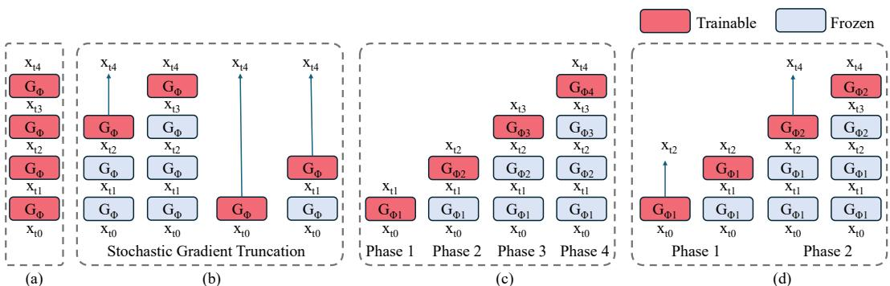
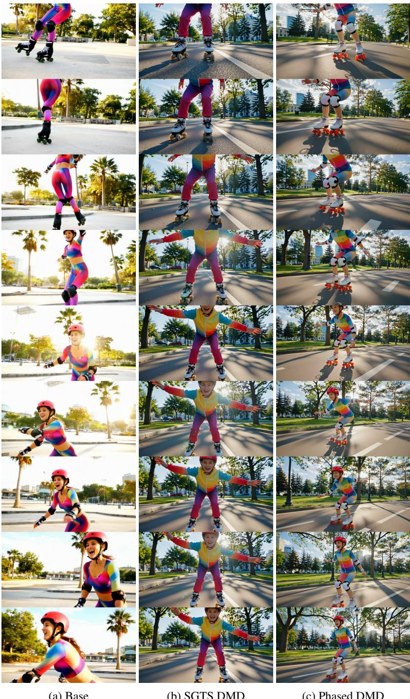

# 1. 论文基本信息

## 1.1. 标题
**Phased DMD: Few-step Distribution Matching Distillation via Score Matching within Subintervals**

*   **中文直译：** 分阶段 DMD：通过子区间内的分数匹配实现少步分布匹配蒸馏
*   **标题解析：**
    *   `Phased DMD`: 这是论文提出的核心方法名称，意为“分阶段的分布匹配蒸馏”。`Phased`（分阶段）是其关键特征。
    *   `Few-step Distribution Matching Distillation`: 这点明了研究任务的领域和目标。它不是像原始 `DMD` 那样追求“单步生成”，而是旨在实现“少步生成”（如 2-4 步），在生成速度和质量之间取得更好的平衡。`Distribution Matching Distillation (DMD)` 是其所基于的核心技术。
    *   `Score Matching within Subintervals`: 这揭示了实现“分阶段”的技术核心。该方法通过在信噪比 (SNR) 的“子区间”内进行“分数匹配” (Score Matching) 来训练模型，这是本文方法论的理论基石。

## 1.2. 作者
*   **作者列表:** Xiangyu Fan, Zesong Qiu, Zhuguanyu Wu, Fanzhou Wang, Zhiqian Lin, Tianxiang Ren, Dahua Lin, Ruihao Gong, Lei Yang.
*   **隶属机构:**
    *   `SenseTime Research` (商汤科技研究院)
    *   `Beihang University` (北京航空航天大学)
*   **背景分析:** 主要作者来自业界顶尖的人工智能公司商汤科技，这表明该研究具有很强的应用导向，旨在解决大规模模型在实际部署中遇到的效率问题。Dahua Lin（林达华）是该领域的知名学者。这种产学研结合的背景通常意味着研究工作能够接触到最前沿的大型模型和计算资源。

## 1.3. 发表期刊/会议
*   **发表状态:** 预印本 (Preprint)。论文提供了 arXiv 链接，并标注了未来的发布日期。
*   **目标会议推测:** 从论文主题（生成模型、模型蒸馏）和参考文献中提到的 ICLR（International Conference on Learning Representations）来看，该论文极有可能投稿至 NeurIPS, ICLR, CVPR 等人工智能领域的顶级会议。

## 1.4. 发表年份
*   **预印本发布日期:** 2025年10月31日 (根据论文元数据)。这是一个未来的占位日期，表明论文是在此之前提交到 arXiv 的。其 arXiv ID `2510.27684` 也遵循了 `YYMM.NNNNN` 的格式。

## 1.5. 摘要
论文摘要清晰地阐述了研究的全貌：
1.  **问题背景:** <strong>分布匹配蒸馏 (Distribution Matching Distillation, DMD)</strong> 是一种能将大型<strong>基于分数的生成模型 (score-based generative models)</strong> 蒸馏成高效单步生成器的方法。然而，单步模型由于自身容量有限，在处理复杂生成任务（如文本到视频生成中的复杂物体运动）时表现不佳。
2.  **现有方案的缺陷:** 直接将 `DMD` 扩展到多步会增加内存消耗和计算图深度，导致训练不稳定。虽然有工作提出<strong>随机梯度截断策略 (stochastic gradient truncation strategy, SGTS)</strong> 来解决稳定性问题，但作者观察到这种方法会显著降低生成结果的<strong>多样性 (diversity)</strong>，使其与单步模型相当。
3.  <strong>提出的方法 (Phased DMD):</strong> 为了解决上述问题，论文提出了 `Phased DMD`，一个结合了“分阶段蒸馏”和<strong>专家混合模型 (Mixture-of-Experts, MoE)</strong> 思想的多步蒸馏框架。该方法建立在两个关键思想之上：
    *   <strong>渐进式分布匹配 (progressive distribution matching):</strong> 将信噪比 (SNR) 范围划分为多个子区间，逐步地将模型向更高 SNR 水平进行精炼，以更好地捕捉复杂分布。
    *   <strong>子区间内的分数匹配 (score matching within subintervals):</strong> 为了确保每个子区间内的训练目标是准确的，作者进行了严格的数学推导。
4.  **实验与结果:** `Phased DMD` 在多个最先进的大型图像和视频生成模型（如 200 亿参数的 Qwen-Image 和 280 亿参数的 Wan2.2）上进行了验证。实验结果表明，与标准 `DMD` 相比，`Phased DMD` 在保留模型关键生成能力的同时，能更好地保持输出的多样性。

## 1.6. 原文链接
*   **arXiv 链接:** [https://arxiv.org/abs/2510.27684](https://arxiv.org/abs/2510.27684)
*   **PDF 链接:** [https://arxiv.org/pdf/2510.27684.pdf](https://arxiv.org/pdf/2510.27684.pdf)

# 2. 整体概括

## 2.1. 研究背景与动机
*   **核心问题:** 当前最先进的扩散模型虽然生成效果惊人，但其迭代采样的过程非常耗时，计算成本高昂，这极大地阻碍了它们在实时应用和资源受限环境下的部署。
*   <strong>当前挑战 (Gap):</strong>
    1.  **单步蒸馏的性能瓶颈:** 以 `DMD` 为代表的单步蒸馏技术虽然能实现极速生成，但模型表达能力有限，无法完美复现大型教师模型在复杂任务（如精细的文本渲染、逼真的动态场景）上的高质量和高保真度。
    2.  **少步蒸馏的训练困境:** 将单步蒸馏直接扩展为多步，会因为反向传播链条过长而导致训练不稳定、内存占用激增。
    3.  **现有稳定方案的副作用:** `SGTS` 等为解决训练稳定性而设计的策略，虽然有效，但其“随机截断”的机制可能在训练中频繁退化为单步蒸馏，从而导致最终模型丧失了多步生成应有的多样性。
*   **创新切入点:** 论文作者受到扩散过程不同阶段（不同信噪比 SNR）关注点不同的启发（低 SNR 阶段关注结构，高 SNR 阶段关注细节），提出了一个“**分而治之**”的策略。他们不再试图用一个模型去学习整个多步生成过程，而是将这个过程分解成多个“阶段”，为每个阶段训练一个“专家模型”。这种设计不仅降低了每个模型的学习难度，还自然地形成了一个<strong>专家混合模型 (MoE)</strong> 架构，在不增加推理成本的情况下提升了模型总容量。

## 2.2. 核心贡献/主要发现
*   **主要贡献:**
    1.  **提出 Phased DMD 框架:** 提出了一个无需原始训练数据（data-free）的少步扩散模型蒸馏框架 `Phased DMD`。该框架巧妙地将分阶段蒸馏与 `MoE` 思想结合，实现了比标准少步蒸馏更高的性能上限，同时保持了与单步蒸馏相似的内存效率。
    2.  **建立子区间分数匹配的理论基础:** 从理论上推导并验证了在扩散过程的任意子区间内进行分数匹配的正确训练目标。这一推导至关重要，因为它保证了在无法访问原始干净样本（$x_0$）的中间蒸馏阶段，依然能够对模型进行正确的、无偏的训练。
*   **关键发现:**
    1.  `Phased DMD` 在多个超大型文本到图像/视频模型上取得了最先进的蒸馏效果，证明了该方法的可扩展性。
    2.  实验证明，该方法在大幅提升生成速度的同时，能有效缓解困扰其他少步蒸馏方法的多样性下降问题，并更好地保留了基础模型的复杂能力（如 Qwen-Image 的文本渲染和 Wan2.2 的动态运动生成）。

# 3. 预备知识与相关工作

## 3.1. 基础概念
### 3.1.1. 扩散模型 (Diffusion Models)
扩散模型是一类生成模型，它通过两个过程来学习生成数据：
*   <strong>前向过程 (Forward Process):</strong> 这是一个固定的过程，它从一个真实的、干净的数据样本（如一张图片 $x_0$）开始，在多个时间步上逐步、少量地向其添加高斯噪声。经过足够多的步骤后，原始数据样本会逐渐变成一个纯粹的噪声样本，其分布接近于标准正态分布 $\mathcal{N}(0, I)$。在本文的连续时间设定下，任意时刻 $t$ 的带噪样本 $x_t$ 可以直接通过 $x_0$ 计算得到：
    $$
    p ( \pmb { x } _ { t } | \pmb { x } _ { 0 } ) = \mathcal { N } ( \pmb { x } _ { t } ; \alpha _ { t } \pmb { x } _ { 0 } , \sigma _ { t } ^ { 2 } \pmb { I } )
    $$
    其中 $\alpha_t$ 和 $\sigma_t$ 是与时间 $t$ 相关的预设系数，控制着信号和噪声的比例。
*   <strong>反向过程 (Reverse Process):</strong> 这是模型需要学习的部分。模型的目标是学习如何逆转前向过程，即从一个纯噪声样本开始，逐步地、迭代地去除噪声，最终恢复出一个干净、真实的样本。这个去噪步骤是通过训练一个神经网络来预测每一步应该去除的噪声或直接预测干净样本来实现的。

### 3.1.2. 分数匹配 (Score Matching)
*   <strong>分数函数 (Score Function):</strong> 在概率论中，一个概率密度函数 `p(x)` 的分数函数被定义为其对数概率对 $x$ 的梯度，即 $\nabla_x \log p(x)$。这个向量指向了数据点 $x$ 处概率密度增长最快的方向。
*   <strong>分数匹配 (Score Matching):</strong> 这是一种训练模型来估计数据分布分数函数的方法。训练一个神经网络 $s_\theta(x)$，使其输出尽可能接近真实数据分布的得分函数 $\nabla_x \log p_{data}(x)$。由于直接计算 $\nabla_x \log p_{data}(x)$ 通常很困难，实践中常使用等价的<strong>去噪分数匹配 (Denoising Score Matching, DSM)</strong>。
*   **与扩散模型的联系:** 扩散模型的反向去噪过程，在理论上等价于在每个时间步 $t$ 估计带噪数据分布 $p(x_t)$ 的分数函数 $\nabla_{x_t} \log p(x_t)$。因此，训练扩散模型本质上就是在所有时间步 $t$ 上进行分数匹配。

### 3.1.3. 信噪比 (Signal-to-Noise Ratio, SNR)
信噪比是衡量扩散过程中信号与噪声相对强度的指标。在本文中，它被定义为 $\mathrm{SNR}(t) = \alpha_t^2 / \sigma_t^2$。
*   **高 SNR:** 意味着信号（$\alpha_t$）远大于噪声（$\sigma_t$）。这对应于扩散过程的后期（时间 $t$ 接近 0），此时的样本已经非常接近干净数据，只剩下少量噪声。模型在此阶段主要任务是**优化细节和纹理**。
*   **低 SNR:** 意味着噪声远大于信号。这对应于扩散过程的早期（时间 $t$ 接近 1），此时的样本几乎是纯噪声。模型在此阶段的主要任务是**构建内容的整体结构和布局**。

### 3.1.4. 专家混合模型 (Mixture-of-Experts, MoE)
MoE 是一种神经网络架构模式，它不是使用一个庞大的、密集的网络来处理所有任务，而是由两部分组成：
1.  <strong>多个专家网络 (Experts):</strong> 每个专家都是一个独立的、通常规模较小的神经网络，它们被训练来专门处理输入数据的某个子集或任务的某个方面。
2.  <strong>门控网络 (Gating Network):</strong> 这是一个小型的网络，它的作用是接收输入，并决定将这个输入分配给哪个或哪些专家来处理。
    在推理时，门控网络会为每个输入选择一个或少数几个最相关的专家来激活，其他专家则保持不活动。这样可以在不显著增加（甚至不增加）单次推理计算量的情况下，大幅增加模型的总参数量和容量。

## 3.2. 前人工作
### 3.2.1. 分布匹配蒸馏 (Distribution Matching Distillation, DMD)
`DMD` 是一种用于将慢速的多步扩散模型蒸馏为快速的单步或少步生成器的方法。其核心思想源于<strong>变分分数蒸馏 (Variational Score Distillation, VSD)</strong>，并采用了类似<strong>生成对抗网络 (Generative Adversarial Networks, GANs)</strong> 的对抗训练机制。`DMD` 框架包含三个关键组件：
1.  <strong>教师模型 (Teacher Model, $T_{\hat{\theta}}$):</strong> 一个预训练好的、强大的多步扩散模型。它被认为是真实数据分布 $p_{real}$ 的精确分数估计器，在蒸馏过程中其参数**固定不变**。
2.  <strong>生成器 (Generator, $G_{\phi}$):</strong> 一个待训练的、快速的（通常是单步）生成网络。它的目标是学习生成与真实数据分布 $p_{real}$ 难以区分的样本。
3.  <strong>伪分数模型 (Fake Score Model, $F_{\theta}$):</strong> 一个与教师模型结构相同的扩散模型。它的任务是学习估计由生成器 $G_{\phi}$ 产生的**伪数据分布 $p_{fake}$ 的分数**。这个模型在蒸馏过程中是**可训练的**。

    训练过程是交替进行的：
*   **生成器更新:** 生成器 $G_{\phi}$ 产生一批伪样本 $x_0^{fake}$。这些样本被加入噪声得到 $x_t^{fake}$。然后，教师模型和伪分数模型分别在 $x_t^{fake}$ 上进行评估。它们的分数差异 $T_{\hat{\theta}}(x_t^{fake}) - F_{\theta}(x_t^{fake})$ 被用作梯度信号来更新生成器 $G_{\phi}$，使其生成的样本更接近真实分布（即让教师模型和伪分数模型对它的打分更接近）。
*   **伪分数模型更新:** 伪分数模型 $F_{\theta}$ 在生成器产生的伪样本上进行标准的去噪分数匹配训练，以确保它能准确地估计当前伪数据分布 $p_{fake}$ 的分数。

### 3.2.2. 少步蒸馏中的随机梯度截断策略 (SGTS)
直接将 `DMD` 扩展到 $N$ 步，意味着生成器的计算图深度变为 $N$。在反向传播时，长链条的梯度计算会导致训练不稳定和内存消耗大。`SGTS` 提出了一种解决方案：在每次训练迭代中，从 $\{1, 2, ..., N\}$ 中随机选择一个步数 $j$。模型只执行前 $j$ 步生成，并在第 $j$ 步之后停止。梯度只从第 $j$ 步的输出回传，而前 `j-1` 步的梯度连接被“截断”（detach）。
*   **优点:** 这样每次反向传播的链条长度最多为 1，大大提升了训练的稳定性和内存效率。
*   <strong>缺点 (本文发现):</strong> 当随机选择的步数 $j=1$ 时，这次迭代就完全退化为一次单步蒸馏。由于这种情况频繁发生，导致整个训练过程偏向于优化单步生成，最终得到的少步模型在生成多样性上表现不佳，与单步模型无异。

## 3.3. 技术演进
生成模型的加速技术演进路线大致如下：
1.  <strong>原始扩散模型 (DDPM):</strong> 需要上千步采样，非常缓慢。
2.  <strong>快速采样器 (DDIM, DPM-Solver):</strong> 通过确定性采样或更高效的常微分方程求解器，将步数减少到几十步（如 20-50 步），但仍然不够快。
3.  <strong>单步生成 (One-step Generation):</strong> 追求极致速度。代表性工作有<strong>一致性模型 (Consistency Models)</strong> 和 **DMD**。它们通过蒸馏技术，将教师模型的知识压缩到一个单步即可生成高质量图像的网络中。
4.  <strong>少步生成 (Few-step Generation):</strong> 在速度和质量之间寻求最佳平衡。研究者发现单步生成在复杂任务上仍有瓶颈，因此希望通过 2-8 步生成来进一步提升质量，同时保持比传统采样器快得多的速度。本文的 `Phased DMD` 正是这一技术脉络中的最新进展，它旨在解决少步蒸馏中存在的稳定性和多样性问题。

## 3.4. 差异化分析
*   **与标准 DMD 的区别:** `Phased DMD` 是**少步**的，而 `DMD` 最初是为**单步**设计的。`Phased DMD` 通过分阶段训练和 `MoE` 架构，解决了 `DMD` 模型容量受限的问题。
*   **与朴素少步 DMD 的区别:** 朴素少步 `DMD` 存在训练不稳定的问题。`Phased DMD` 通过将整个过程分解为多个独立的单步蒸馏阶段，巧妙地规避了长计算链，从而保证了训练的稳定性，且内存开销与单步蒸馏相当。
*   **与采用 SGTS 的少步 DMD 的区别:** `SGTS` 虽然解决了稳定性问题，但牺牲了生成多样性。`Phased DMD` 通过其分阶段的设计，确保每个阶段都得到充分和正确的训练，从而更好地保持了多样性，避免了训练过程退化为单步蒸馏。
*   <strong>与 TDM (另一篇少步蒸馏工作) 的区别:</strong>
    1.  **理论完备性:** `TDM` 缺乏在子区间内进行分数匹配的正确理论推导，导致其伪分数模型的训练目标是错误的。而 `Phased DMD` 提供了严格的数学推导。
    2.  **模型架构:** `Phased DMD` 天然地产生一个 `MoE` 模型，而 `TDM` 不是。
    3.  **区间划分:** `TDM` 使用不相交的 SNR 区间，而 `Phased DMD` 使用反向嵌套的区间（即每个阶段的训练区间都是 $[t_k, 1]$），作者发现后者效果更好。

# 4. 方法论

本部分将深入拆解 `Phased DMD` 的核心技术方案，融合公式进行分步讲解。

## 4.1. 方法原理
`Phased DMD` 的核心直觉是“分而治之”。一个完整的从纯噪声到清晰图像的生成过程，跨越了非常大的信噪比 (SNR) 范围。让单个网络学会处理所有 SNR 区域的去噪任务是困难的。`Phased DMD` 将这个复杂的任务分解为几个更简单的“阶段性”任务。

假设一个 2 步生成过程，它从时间 $t_0=1$ 的纯噪声开始，先生成 $t_1=0.5$ 时的半成品，再从半成品生成 $t_2=0$ 的最终图像。`Phased DMD` 会训练两个专家：
*   <strong>专家1 (低 SNR 专家):</strong> 专门负责第一阶段，即从 $t_0=1$ 的噪声生成 $t_1=0.5$ 的图像结构。
*   <strong>专家2 (高 SNR 专家):</strong> 专门负责第二阶段，即从 $t_1=0.5$ 的图像结构生成 $t_2=0$ 的精细细节。

    这两个专家共同构成了一个 `MoE` 生成器。这种设计不仅降低了每个专家的学习难度，还通过其架构的解耦特性，带来了额外的优势（如在训练后期可以冻结结构专家，只微调细节专家）。

## 4.2. 核心方法详解 (逐层深入)
为了理解 `Phased DMD`，我们首先需要回顾标准 `DMD` 的数学原理，然后看 `Phased DMD` 是如何在此基础上进行扩展和创新的。

### 4.2.1. 回顾：分布匹配蒸馏 (DMD)
`DMD` 的目标是训练一个生成器 $G_{\phi}$，使其输出的分布 $p_{fake}$ 尽可能接近真实数据分布 $p_{real}$。这通过最小化它们之间的<strong>反向 KL 散度 (reverse KL divergence)</strong> 来实现：
$$
D _ { K L } \big ( p _ { f a k e } \big | \big | p _ { r e a l } \big ) = \mathbb { E } _ { \epsilon \sim \mathcal { N } , x _ { 0 } = G _ { \phi } ( \epsilon ) } \bigl [ \log p _ { f a k e } ( \pmb { x } _ { 0 } ) - \log p _ { r e a l } ( \pmb { x } _ { 0 } ) \bigr ]
$$
由于直接计算对数概率 $\log p(x_0)$ 很困难，`DMD` 利用了扩散模型的思想，将样本加入噪声，在带噪空间中进行比较。对于任意时刻 $t$，上式可以写为：
$$
D _ { K L } = \mathbb { E } _ { \epsilon \sim \mathcal { N } , x _ { 0 } = G _ { \phi } ( \epsilon ) , t \sim \mathcal { T } , x _ { t } \sim p ( x _ { t } | x _ { 0 } ) } [ \log p _ { f a k e } ( x _ { t } ) - \log p _ { r e a l } ( x _ { t } ) ]
$$
这里的 $\mathcal{T}$ 是一个在 `[0,1]` 上的时间步采样分布。

**关键一步**在于利用分数匹配理论将对数概率的梯度（即分数）与扩散模型的输出联系起来。对于一个以流预测 (flow prediction) 为目标的扩散模型 $\psi_{\theta}(x_t)$，其训练目标（Eq. 5）可以等价地写成与分数相关的形式。这使得对数概率的差异可以被两个分数模型（教师 $T$ 和伪模型 $F$）的输出差异来近似：
$$
D _ { K L } \approx \mathbb { E } _ { \epsilon \sim \mathcal { N } , x _ { 0 } = G _ { \phi } ( \epsilon ) , t \sim \mathcal { T } , x _ { t } \sim p ( x _ { t } | x _ { 0 } ) } [ \lambda _ { t } ( T _ { \hat { \theta } } ( x _ { t } ) - F _ { \theta } ( x _ { t } ) ) ]
$$
其中，$\lambda_t$ 是一个与时间相关的权重。$T_{\hat{\theta}}$ (教师) 估计真实分布的分数，而 $F_{\theta}$ (伪模型) 估计伪分布的分数。当 $p_{fake}$ 接近 $p_{real}$ 时，它们的对数概率和分数都应该接近，因此这个差异项会趋于零。

对生成器参数 $\phi$ 求导，得到生成器的更新梯度：
$$
\nabla \phi D _ { K L } \approx \mathbb { E } _ { \epsilon \sim \mathcal { N } , x _ { 0 } = G _ { \phi } ( \epsilon ) , t \sim 7 , x _ { t } \sim p ( x _ { t } | x _ { 0 } ) } [ w _ { t } ( T _ { \hat { \theta } } ( x _ { t } ) - F _ { \theta } ( x _ { t } ) ) ] d G / d \phi
$$
其中 $w_t$ 是另一个权重。这个梯度直观地告诉生成器 $G_{\phi}$：调整你的参数，让你生成的样本经过加噪后，能同时“欺骗”教师模型和伪分数模型，使它俩给出的分数尽可能一致。

### 4.2.2. Phased DMD 的核心创新
`Phased DMD` 将上述过程分解为多个阶段。我们以一个 $K$ 阶段的蒸馏为例，时间步划分为 $1 = t_0 > t_1 > \dots > t_K = 0$。

#### 步骤 1: 中间步骤的分布匹配 (Distribution Matching at Intermediate Timesteps)
在第 $k$ 个阶段（$1 \le k \le K$），我们的目标不是直接生成最终样本 $x_0$，而是从前一阶段的输出 $x_{t_{k-1}}$ 生成当前阶段的输出 $x_{t_k}$。这个阶段由第 $k$ 个专家 $G_{\phi_k}$ 负责。

此时，KL 散度的比较发生在中间时刻 $t_k$ 的分布上。生成器的更新目标（Eq. 11）变为：
$$
\nabla \phi _ { k } D _ { K L } \approx \mathbb { E } [ w _ { t | t_k } ( T _ { \hat { \theta } } ( \boldsymbol { x } _ { t } ) - F _ { \theta _ { k } } ( \boldsymbol { x } _ { t } ) ) \frac { d G _ { \phi _ { k } } } { d \phi _ { k } } ]
$$
这个公式的期望是在以下采样过程中计算的：
1.  首先，通过由前 $k$ 个专家组成的流水线 `pipeline` 从噪声 $\epsilon$ 生成中间样本 $x_{t_k}$。注意，前 `k-1` 个专家的参数是固定的。
    $\pmb{x}_{t_k} = \text{pipeline}(G_{\phi_1}, \dots, G_{\phi_k}, \{t_1, \dots, t_k\}, \epsilon, S)$
2.  然后，从子区间 $(t_k, 1)$ 中随机采样一个时间步 $t$，即 $t \sim \mathcal{T}(t; t_k, 1)$。
3.  根据 $x_{t_k}$ 和 $t$ 对样本进行加噪，得到 $x_t \sim p(x_t|x_{t_k})$。
4.  计算教师模型 $T_{\hat{\theta}}$ 和本阶段专属的伪模型 $F_{\theta_k}$ 在 $x_t$ 上的输出差异，并以此更新第 $k$ 个专家 $G_{\phi_k}$。

    这种设计有几个优点：
*   **稳定性:** 每次只训练一个专家 $G_{\phi_k}$，梯度只回传一步，避免了长计算链。
*   **效率:** 内存开销与单步蒸馏类似。
*   **MoE 架构:** 自然地产生了一个由 $\{G_{\phi_1}, \dots, G_{\phi_K}\}$ 组成的 `MoE` 生成器。

#### 步骤 2: 子区间内的分数匹配 (Score Matching within Subintervals)
上述步骤引入了一个关键挑战：在训练第 $k$ 个阶段的伪模型 $F_{\theta_k}$ 时，我们只有中间样本 $x_{t_k}$，而没有原始的干净样本 $x_0$。标准的去噪分数匹配目标（即预测加入的噪声 $\epsilon$）是基于 $x_0$ 的，因此不再适用。

为了解决这个问题，作者推导了<strong>仅依赖于中间样本 $x_s$ 在子区间 $(s, 1)$ 内进行分数匹配的正确目标</strong>。
从等价的分数匹配目标出发（Eq. 12 的第一行）：
$$
J _ { f l o w } ( \theta ) = \mathbb { E } _ { t \sim \mathcal { T } ( t ; s , 1 ) , x _ { t } \sim p ( x _ { t } ) } [ \| \psi _ { \theta } ( x _ { t } ) + x _ { t } / \alpha _ { t } + ( \sigma _ { t } + \sigma _ { t } ^ { 2 } / \alpha _ { t } ) \nabla x _ { t } \log ( p ( x _ { t } ) ) \| ^ { 2 } ]
$$
利用 $p(x_t) = \int p(x_t|x_s)p(x_s)dx_s$ 和分数匹配的等价性，可以推导出只依赖于 $x_s$ 的去噪形式目标。对于一个以流（flow）$\psi_{\theta}$ 为预测目标的模型，其在子区间 `[s, 1]` 内的正确训练目标由 Eq. 12 给出：
$$
J_{flow}(\theta) = \mathbb { E } _ { x _ { s } \sim p ( x _ { s } ) , t \sim \mathcal { N } , t \sim \mathcal { T } ( t ; s , 1 ) , x _ { t } = \alpha _ { t } | s x _ { s } + \sigma _ { t } | s } [ \| \psi _ { \theta } ( x _ { t } ) - ( ( \alpha _ { s } ^ { 2 } \sigma _ { t } + \alpha _ { t } \sigma _ { s } ^ { 2 } ) / ( \alpha _ { s } ^ { 2 } \sigma _ { t | s } ) \epsilon - ( 1 / \alpha _ { s } ) x _ { s } ) \| ^ { 2 } ]
$$
**公式解读:**
*   **输入:** $x_t$ 是由中间样本 $x_s$ 在子区间内加噪得到的，即 $x_t = \alpha_{t|s} x_s + \sigma_{t|s} \epsilon$。这里的 $\alpha_{t|s} = \alpha_t / \alpha_s$ 和 $\sigma^2_{t|s} = \sigma_t^2 - (\alpha_t/\alpha_s)^2 \sigma_s^2$ 是子区间扩散的系数。
*   **模型预测:** 神经网络 $\psi_{\theta}(x_t)$。
*   <strong>目标 (Target):</strong> 模型需要预测的目标不再是简单的 $\epsilon$ 或 $x_0$，而是一个与 $x_s$ 和 $\epsilon$ 都有关的复杂表达式：
    $$
    \text{Target} = \frac{\alpha_s^2 \sigma_t + \alpha_t \sigma_s^2}{\alpha_s^2 \sigma_{t|s}} \epsilon - \frac{1}{\alpha_s} x_s
    $$
这个推导是本文的**核心理论贡献**。它表明，即使没有 $x_0$，只要有中间状态 $x_s$，我们仍然可以构建一个无偏的训练目标来学习该子区间的去噪模型。

在实践中，当 $t \to s$ 时，$\sigma_{t|s} \to 0$，会导致数值不稳定。因此，作者引入了一个带权重和钳位 (clamping) 的最终实用目标 (Eq. 13)：
$$
J _ { f l o w } ( \pmb { \theta } ) = \mathbb { E } [ \mathrm { c l a m p } ( 1 / ( \sigma _ { t \mid s } ) ^ { 2 } ) \lVert \sigma _ { t \mid s } \psi _ { \pmb { \theta } } ( \pmb { x _ { t } } ) - ( ( \alpha _ { s } ^ { 2 } \sigma _ { t } + \alpha _ { t } \sigma _ { s } ^ { 2 } ) / \alpha _ { s } ^ { 2 } ) \epsilon - ( \sigma _ { t \mid s } / \alpha _ { s } ) \pmb { x _ { s } } ) \rVert ^ { 2 } ]
$$
这个公式是 Eq. 12 的加权和重缩放版本，以提高训练的稳定性。

下图（原文 Figure 1）直观地对比了不同蒸馏方法。
*该图像是三个示意图，分别展示了不同的采样轨迹匹配方法。左侧图(a)展示了流匹配，中央图(b)显示了在子区间内无偏的匹配，右侧图(c)则呈现了在子区间内有偏的匹配。各图中，蓝色和绿色线条代表不同的匹配策略，并展示了时间步长与采样轨迹之间的关系。*
*   **(a) Few-step DMD:** 朴素的少步蒸馏，计算图深度为 $N$，不稳定。
*   **(b) Few-step DMD with SGTS:** 使用随机梯度截断，解决了稳定性问题，但可能导致多样性下降。
*   **(c) Phased DMD:** 本文方法。将过程分解为多个阶段，每个阶段都是一个独立的单步蒸馏，因此计算图深度始终为 1。
*   **(d) Phased DMD with SGTS:** 本文方法与 `SGTS` 的结合。例如，可以用 2 个阶段来完成 4 步采样，每个阶段内部包含 2 步，并使用 `SGTS` 稳定每个阶段的内部训练。这是一种更灵活的配置。

# 5. 实验设置

## 5.1. 数据集
本文的蒸馏方法是<strong>数据无关 (data-free)</strong> 的，意味着在蒸馏过程中不依赖原始的训练数据集。训练过程仅需要一个预训练好的教师模型。

评估过程使用了作者构建的测试集：
*   **多样性评估集:** 包含 21 个文本提示 (prompts)。这些提示只提供简短的内容描述，没有过多细节限制，以便于评估模型在不同随机种子下的生成多样性。
*   **动态性评估集:**
    *   文本到视频 (T2V): 包含 220 个文本提示。
    *   图像到视频 (I2V): 包含 220 个图像-提示对。
*   **能力保持评估集:** 使用了 Qwen-Image 官网提供的示例提示，来验证模型是否保留了如文本渲染等关键能力。

## 5.2. 评估指标
### 5.2.1. DINOv3 Cosine Similarity
1.  **概念定义:** 该指标用于衡量两张图片在**语义特征空间**中的相似度。它首先使用一个强大的预训练视觉模型 DINOv3 提取每张图片的特征向量，然后计算这些向量之间的余弦相似度。对于多样性评估，我们会计算同一提示下、不同随机种子生成的图片两两之间的平均相似度。**值越低，表示图片间的特征差异越大，即多样性越高**。
2.  **数学公式:**
    $$
    \text{Cosine Similarity}(A, B) = \frac{A \cdot B}{\|A\| \|B\|} = \frac{\sum_{i=1}^{n} A_i B_i}{\sqrt{\sum_{i=1}^{n} A_i^2} \sqrt{\sum_{i=1}^{n} B_i^2}}
    $$
3.  **符号解释:**
    *   `A, B`: 分别代表两张图片经过 DINOv3 提取后的 n 维特征向量。

### 5.2.2. LPIPS (Learned Perceptual Image Patch Similarity)
1.  **概念定义:** `LPIPS` 是一种比传统像素级指标（如 MSE, PSNR）更符合人类视觉感知的图像相似度度量。它通过一个预训练的深度网络（如 VGG, AlexNet）提取两张图片的深层特征，并计算这些特征在不同层级上的加权 L2 距离。与 DINOv3 类似，对于多样性评估，我们会计算两两图片间的 `LPIPS` 距离。**值越高，表示图片间的感知差异越大，即多样性越高**。
2.  **数学公式:**
    $$
    d(x, x_0) = \sum_l \frac{1}{H_l W_l} \sum_{h,w} \| w_l \odot (\hat{y}^l_{hw} - \hat{y}^l_{0,hw}) \|_2^2
    $$
3.  **符号解释:**
    *   $d(x, x_0)$: 图片 $x$ 和 $x_0$ 之间的 LPIPS 距离。
    *   $l$: 网络的第 $l$ 个卷积层。
    *   $\hat{y}^l_{hw}, \hat{y}^l_{0,hw}$: 分别是从图片 $x$ 和 $x_0$ 的第 $l$ 层提取的、在空间位置 `(h, w)` 上的特征图块（经过归一化）。
    *   $w_l$: 第 $l$ 层的通道权重，用于校准不同通道的重要性。

### 5.2.3. Optical Flow
1.  **概念定义:** <strong>光流 (Optical Flow)</strong> 是一种用于描述视频中像素运动的技术。它计算连续帧之间每个像素的位移向量。通过计算整个视频中所有像素运动向量的平均绝对值，可以得到一个量化视频**运动强度**的指标。**值越高，表示视频中的物体或镜头运动越剧烈**。

### 5.2.4. VBench Dynamic Degree
1.  **概念定义:** 这是来自视频生成领域的一个综合性基准测试 `VBench` 中的一个子指标。它旨在评估生成视频的**动态性**。该指标通过一个分类器来判断视频是否包含显著的运动。`Dynamic Degree` 报告的是被判定为“动态”的视频在总视频中所占的**百分比**。**值越高，表明模型生成动态场景的能力越强**。

## 5.3. 对比基线
实验将 `Phased DMD` 与以下模型进行了比较：
*   **Base model:** 原始的、未蒸馏的大型教师模型（如 Qwen-Image-20B, Wan2.2-28B）。它代表了性能的上限，但速度最慢（40步采样）。
*   **DMD:** 朴素的少步蒸馏方法（4步采样），但由于计算成本高，仅在最小的模型上进行了实验。
*   **DMD with SGTS:** 目前主流的、更实用的少步蒸馏基线（4步采样），它使用 `SGTS` 来保证训练稳定。这是 `Phased DMD` 的主要比较对象。

    所有实验均采用 4 步、2 阶段的配置，即将 4 步采样过程分解为两个阶段进行蒸馏。

# 6. 实验结果与分析

## 6.1. 核心结果分析
### 6.1.1. 生成多样性的保持
多样性是衡量生成模型好坏的关键指标之一，尤其是在需要创意生成的场景。实验旨在验证 `Phased DMD` 是否能解决 `SGTS` 带来的多样性下降问题。

以下是原文 Table 2 的结果：

<table>
<thead>
<tr>
<th rowspan="2">Method</th>
<th colspan="2">Wan2.1-T2V-14B</th>
<th colspan="2">Wan2.2-T2V-A14B</th>
<th colspan="2">Qwen-Image</th>
</tr>
<tr>
<th>DINOv3 ↓</th>
<th>LPIPS ↑</th>
<th>DINOv3 ↓</th>
<th>LPIPS ↑</th>
<th>DINOv3 ↓</th>
<th>LPIPS ↑</th>
</tr>
</thead>
<tbody>
<tr>
<td>Base model</td>
<td>0.708</td>
<td>0.607</td>
<td>0.732</td>
<td>0.531</td>
<td>0.907</td>
<td>0.483</td>
</tr>
<tr>
<td>DMD</td>
<td>0.825</td>
<td>0.522</td>
<td>-</td>
<td>-</td>
<td>-</td>
<td>-</td>
</tr>
<tr>
<td>DMD with SGTS</td>
<td>0.826</td>
<td>0.521</td>
<td>0.828</td>
<td>0.447</td>
<td>0.941</td>
<td>0.309</td>
</tr>
<tr>
<td>Phased DMD (Ours)</td>
<td><strong>0.782</strong></td>
<td><strong>0.544</strong></td>
<td><strong>0.768</strong></td>
<td><strong>0.481</strong></td>
<td><strong>0.958</strong></td>
<td><strong>0.322</strong></td>
</tr>
</tbody>
</table>

**分析:**
*   `DINOv3` 指标越低越好，`LPIPS` 指标越高越好。
*   在 Wan2.1 和 Wan2.2 模型上，`Phased DMD` 的多样性指标显著优于 `DMD with SGTS`，并且更接近 `Base model` 的水平。例如，在 Wan2.2 上，`Phased DMD` 的 DINOv3 相似度（0.768）远低于 `DMD with SGTS`（0.828），而 LPIPS 距离（0.481）则远高于后者（0.447）。
*   这证实了论文的核心论点：`SGTS` 确实会损害多样性，而 `Phased DMD` 能有效缓解这一问题。
*   在 Qwen-Image 上，提升虽然存在但幅度较小。作者解释说这可能是因为 Qwen-Image 基础模型本身输出的多样性就有限。

    下图（原文 Figure 3）直观展示了这种多样性差异。

    
    *该图像是展示两幅不同生成图像的比较，其中左侧为模糊的森林景观，右侧为坐在长椅上的女性。图像上方分别标记了生成分数0.677和0.888，反映了两幅图像的质量差异。*

*   **(c) DMD with SGTS** 在不同随机种子下生成的图片构图非常相似（例如，厨师都处于画面中央的近景）。
*   **(d) Phased DMD** 生成的图片则展现了更多样的构图和视角，更接近 **(a) Base model** 的表现。

### 6.1.2. 基础模型关键能力的保留
除了多样性，蒸馏后的模型是否能保留教师模型的“特长”也至关重要。
*   <strong>对于视频模型 Wan2.2 (动态性和镜头控制):</strong>

    以下是原文 Table 3 的结果：

    <table>
    <thead>
    <tr>
    <th rowspan="2">Method</th>
    <th colspan="2">T2V</th>
    <th colspan="2">I2V</th>
    </tr>
    <tr>
    <th>Optical Flow ↑</th>
    <th>Dynamic Degree ↑</th>
    <th>Optical Flow ↑</th>
    <th>Dynamic Degree ↑</th>
    </tr>
    </thead>
    <tbody>
    <tr>
    <td>Base model</td>
    <td>10.26</td>
    <td>79.55 %</td>
    <td>9.32</td>
    <td>82.27 %</td>
    </tr>
    <tr>
    <td>DMD with SGTS</td>
    <td>3.23</td>
    <td>65.45 %</td>
    <td>7.87</td>
    <td>80.00 %</td>
    </tr>
    <tr>
    <td>Phased DMD(Ours)</td>
    <td><strong>7.57</strong></td>
    <td><strong>74.55 %</strong></td>
    <td><strong>9.84</strong></td>
    <td><strong>83.64 %</strong></td>
    </tr>
    </tbody>
    </table>

**分析:**
*   `Optical Flow` 和 `Dynamic Degree` 都是越高越好。
*   `Phased DMD` 在所有运动相关指标上都显著优于 `DMD with SGTS`。例如，在 T2V 任务中，其光流值（7.57）是后者的两倍多（3.23）。
*   作者认为，这是因为 `Phased DMD` 的第一阶段专门训练负责结构的低 SNR 专家，而视频的动态性正是在这个阶段决定的。这种专门训练更好地保留了教师模型在低 SNR 区间的能力。

    下图（原文 Figure 7）展示了镜头控制能力的对比。

    

*   **提示:** 包含“low angle shot”（低角度拍摄）的指令。
*   **结果:** `DMD with SGTS` 生成了平视或近景的画面，忽略了镜头指令。而 `Phased DMD` 和 `Base model` 则正确地执行了低角度拍摄，展现了更好的指令遵循能力。

*   <strong>对于图像模型 Qwen-Image (文本渲染):</strong>

    下图（原文 Figure 4）展示了 `Phased DMD` 蒸馏 Qwen-Image 后的效果。

    
    **分析:**

*   图片中的文字（如“你好 世界”、“Hello World”）清晰、准确，没有明显的拼写错误或伪影。这表明 `Phased DMD` 成功地保留了 Qwen-Image 强大的文本渲染能力。

## 6.2. 消融实验/参数分析
### 6.2.1. 子区间分数匹配目标的正确性
为了验证 Eq. 13 中推导的子区间训练目标的必要性，作者进行了一个一维玩具实验。
下图（原文 Figure 2）展示了实验结果。

*该图像是一个插图，展示了不同场景下的创意表达。从左到右，包含了一个学生在黑板上写字的场景、一位男士在窗前看月亮并拿着纸条、一只猫在旁边、一台显示出绚丽色彩电脑的插画，最后是穿着晚礼服的模特。整体传达了想象力和创造力的主题。*

*   <strong>(a) 全区间训练:</strong> 作为基准，使用标准目标在整个时间区间 `[0, 1]` 上训练。
*   <strong>(b) 正确的子区间目标:</strong> 使用本文推导的 Eq. 13 在子区间 `[0.5, 1]` 上训练。其采样轨迹与 (a) 在该区间内**完美重合**。
*   <strong>(c) 错误的子区间目标:</strong> 使用一个朴素的、错误的目标（简单地用 $x_s$ 替换 $x_0$）进行训练。其采样轨迹与 (a) **明显偏离**。
    **结论:** 这个实验有力地证明了本文推导的子区间分数匹配目标是**正确且必要**的，是保证 `Phased DMD` 理论完备性的基石。

### 6.2.2. MoE 架构的优势
`Phased DMD` 产生的 `MoE` 架构允许对不同阶段的专家进行解耦训练。
下图（原文 Figure 5）展示了这一优势。

**实验设计:** 使用一个训练好的低 SNR 专家（负责构图），然后分别搭配训练了 100 次迭代和 400 次迭代的高 SNR 专家（负责细节）进行生成。
**分析:**

*   对比上下两行，可以发现图片的**整体构图和物体位置几乎没有变化**。
*   变化主要体现在**光照和纹理细节**上。训练 400 次的专家生成的光影更自然、细节更丰富。
    **结论:** 这表明 `MoE` 架构成功地将结构和细节的学习解耦。在训练后期，可以冻结结构专家以保持多样性和构图，同时继续训练细节专家以提升生成质量，从而优雅地解决了质量与多样性之间的权衡问题。

# 7. 总结与思考

## 7.1. 结论总结
这篇论文提出了一种名为 `Phased DMD` 的新型少步扩散模型蒸馏框架，旨在解决现有方法在速度、质量和多样性之间的矛盾。其核心思想是将复杂的端到端生成过程分解为多个独立的、更简单的阶段，并为每个阶段训练一个专家模型，从而自然地构建了一个 `MoE` 架构。
*   **贡献:**
    1.  设计了稳定且高效的**分阶段蒸馏**流程，有效避免了传统少步蒸馏的训练困境。
    2.  从理论上推导并验证了在扩散子区间内进行**分数匹配的正确目标**，为方法的有效性提供了坚实的数学基础。
*   **意义:**
    1.  `Phased DMD` 在多个超大型模型上取得了优异的成果，证明了其在工业级应用中的巨大潜力。
    2.  它不仅提升了生成速度，还显著改善了困扰先前工作的**多样性下降**问题，并更好地保留了教师模型的**关键能力**（如动态性、文本渲染）。

## 7.2. 局限性与未来工作
*   **作者指出的局限性:**
    1.  方法的提升效果取决于基础模型本身的能力。如果基础模型本身输出多样性就不足，那么 `Phased DMD` 带来的多样性改善也相对有限。
    2.  虽然本文在 `DMD` (基于 KL 散度) 框架下实现了分阶段蒸馏，但这个思想是通用的，可以推广到其他蒸馏目标，如 `SiD` (基于 Fisher 散度)，这被作者留作未来的探索方向。
*   **未来工作:**
    作者提到，他们坚持了<strong>数据无关 (data-free)</strong> 的范式。未来可能会探索结合由基础模型预生成的轨迹数据来进一步提升性能，但这将以牺牲 data-free 的优势为代价。

## 7.3. 个人启发与批判
*   **启发:**
    1.  <strong>“分而治之”</strong>思想的巧妙应用: 将复杂的学习任务沿其自然流程（扩散过程的 SNR 轴）分解，并将过程分解与模型架构的解耦（MoE）相结合，是一个非常优雅且强大的设计模式。这对于解决其他具有清晰阶段性特征的复杂任务（如代码生成、长视频生成）也具有借鉴意义。
    2.  **理论与实践的紧密结合:** 论文没有止步于提出一个有效的框架，而是深入挖掘其背后的理论基础，推导出关键的“子区间分数匹配”目标，并用实验验证了其必要性。这种严谨的学术作风是高质量研究的典范。
*   **批判性思考与潜在问题:**
    1.  **超参数敏感性:** 论文主要展示了 4 步 2 阶段的配置。但阶段数量、每个阶段的步数以及划分阶段的时间点（$t_k$）是如何选择的？这些关键超参数的选择依据和对最终性能的影响，论文中没有进行深入的消融分析，这可能是未来工作可以补充的一点。
    2.  **模型存储成本:** `Phased DMD` 会产生多个专家模型，虽然推理时每次只激活部分专家，计算成本低，但总的模型参数量和存储成本会比单个蒸馏模型更大。论文中提到了使用 **LoRA (Low-Rank Adaptation)** 技术，让所有专家共享主干网络，只训练和存储各自的低秩适配器权重，这是一个很好的缓解方案，但在实验部分没有详细说明其带来的具体开销节省。
    3.  <strong>“SGTS 降低多样性”</strong>的根源: 论文观察到了一个非常有趣的现象，即 `SGTS` 会显著降低多样性。实验结果也支持了这一观点。但这背后的根本原因是什么？为什么偶尔的单步训练迭代会对最终模型的全局多样性产生如此强的“正则化”效应？对这一现象的更深层次的理论分析将非常有价值。