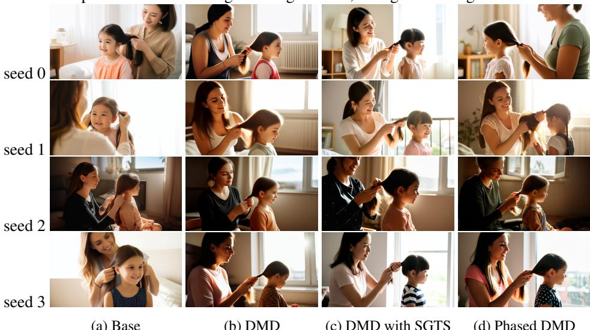

# PHASED DMD: FEW-STEP DISTRIBUTION MATCHING DISTILLATION VIA SCORE MATCHING WITHIN SUBIN-TERVALS  

Xiangyu Fan1, Zesong Qiu1, Zhuguanyu Wu1, Fanzhou Wang1, Zhiqian Lin1, Tianxiang Ren1, Dahua Lin1, Ruihao Gong1,2, Lei Yang1,2  1SenseTime Research, 2Beihang University

## ABSTRACT  

AbstractDistribution Matching Distillation (DMD) distills score- based generative models into efficient one- step generators, without requiring a one- to- one correspondence with the sampling trajectories of their teachers. However, limited model capacity causes one- step distilled models underperform on complex generative tasks, e.g., synthesizing intricate object motions in text- to- video generation. Directly extending DMD to multi- step distillation increases memory usage and computational depth, leading to instability and reduced efficiency. While prior works propose stochastic gradient truncation as a potential solution, we observe that it substantially reduces the generation diversity of multi- step distilled models, bringing it down to the level of their one- step counterparts. To address these limitations, we propose Phased DMD, a multi- step distillation framework that bridges the idea of phase- wise distillation with Mixture- of- Experts (MoE), reducing learning difficulty while enhancing model capacity. Phased DMD is built upon two key ideas: progressive distribution matching and score matching within subintervals. First, our model divides the SNR range into subintervals, progressively refining the model to higher SNR levels, to better capture complex distributions. Next, to ensure the training objective within each subinterval is accurate, we have conducted rigorous mathematical derivations. We validate Phased DMD by distilling state- of- the- art image and video generation models, including Qwen- Image (20B parameters) and Wan2.2 (28B parameters). Experimental results demonstrate that Phased DMD preserves output diversity better than DMD while retaining key generative capabilities. We will release our code and models.

## 1 INTRODUCTION  

Recently, state- of- the- art (SOTA) diffusion models have made significant progress in image and video generation. In image generation, SOTA models (Wu et al., 2025; OpenAI, 2025; Team, 2025b; Cao et al., 2025; GoogleAI, 2025a; Seedream et al., 2025) demonstrate precise prompt control, enabling complex text- to- image rendering and accurate layout specification. In video generation, these models (Wan et al., 2025; Kong et al., 2024; GoogleAI, 2025b; OpenAI, 2024) exhibit substantial improvements in dynamic scene generation, such as fast- moving objects in sports and complex camera movements like ego- centric videos. Simultaneously, the increasing parameter sizes and computational demands of base models highlight the importance of accelerating diffusion model sampling.

Several techniques have been proposed to accelerate diffusion models, including classifier- free guidance (CFG) distillation (Meng et al., 2023), step distillation (Song et al., 2023; Wang et al., 2024; Salimans & Ho, 2022; Yin et al., 2024a; Luo et al., 2023; Luo, 2024; Zhou et al., 2024; Huang et al., 2024a; Lin et al., 2024; 2025a;; Frans et al., 2024; Geng et al., 2025), SVDQuant (Li\\*, et al., 2025), Mixture- of- Expert (MoE) models (Balaji et al., 2022; Feng et al., 2023; Wantal et al., 2025), and parallel computation (Fang et al., 2024). Among these, step distillation methods based on Variational Score Distillation(VSD), including diff- instruct (Luo et al., 2023), DMD (Yin et al., 2024a), SID (Zhou et al., 2024), achieve high- quality generation by distilling models into single- step generators. However, the limited network capacity (Lin et al., 2024) of single- step distilled models hinders their ability to handle complex tasks like intricate text rendering or dynamic scene generation, which are critical for the widespread adoption of these foundational models.

Figure 1: Schematic diagram of (a) Few-step DMD (Yin et al., 2024a), (b) Few-step DMD with stochastic gradient truncation strategy (SGTS) (Huang et al., 2025), (c) Phased DMD and (d) Phased DMD with SGTS.   

Few- step distillation balances computational cost and generation quality (Luo et al., 2025). Yet, as shown in Fig. 1a, directly applying VSD to few- step distillation (Yin et al., 2024a) introduces challenges such as increased computational graph depth and higher memory overhead. Furthermore, the lack of explicit constraints on intermediate generator steps reduces training stability and leads to suboptimal performance in few- step models. To address these issues, Huang et al. (2025) proposed a stochastic gradient truncation strategy (SGTS), where multi- step sampling may terminate at a random step and the gradient backpropagation is restricted to the final denoising step (see Fig. 1b). This approach improves training convergence and stability by supervising all intermediate steps while enhancing memory efficiency via gradient detachment for non- final steps. However, SGTS can terminate sampling after just one step during training, distilling a one- step generator for that iteration. Consequently, the generative diversity of few- step generators trained with SGTS is reduced to a level akin to that of one- step generators.

The diffusion theory (Song et al., 2020) suggests the existence of infinitely many neural networks as score estimators across a range of signal- to- noise ratios (SNR), spanning from zero to infinity. During the generation process, diffusion models exhibit distinct temporal dynamics (Balaji et al., 2022; Ouyang et al., 2024). Specifically, the low- SNR stage focuses on modeling image structures and video dynamics, while the high- SNR stage refines visual details. In practice, a single neural network is typically employed throughout the denoising process, requiring the model to simultaneously learn and perform a variety of denoising tasks. Recent studies (Balaji et al., 2022; Feng et al., 2023; Wan et al., 2025) have introduced an MoE architecture into diffusion models. By assigning specialized experts to different SNR levels, MoE enhances model capacity and generative performance without increasing inference cost. The performance improvement is particularly pronounced in video generation (Wan et al., 2025), where the low- SNR expert excels at capturing dynamic content. In this work, we propose Phased DMD, a novel distillation framework for few- step generation. Our approach is inspired by a broader vision: By decomposing a complex task into learnable phases, each phase naturally forms an expert, collectively enhancing the model's capacity in a MoE manner. Our method is built upon two key components: - Progressive distribution matching: Conceptually similar to ProGAN (Karras et al., 2017), which progressively trains a generator to handle higher resolutions, Phased DMD divides SNR into subintervals and progressively distills models toward higher SNR levels. - Score matching within SNR subintervals: As each phase is trained within a subinterval, the training objective undergoes a transformation. To ensure theoretical rigor, we derive the training objective for the fake score estimator within each subinterval. As illustrated in Fig. 1c, Phased DMD offers several advantages: First, by partitioning SNR into subintervals, the model learns complex data distributions incrementally, improving training stability and generative performance. Second, each phase involves only a single gradient- recorded sampling step, avoiding additional computational and memory overhead. Third, notably, Phased DMD naturally produces a few- step MoE generative model, regardless of whether the teacher model adopts an MoE architecture. Last, as shown in Fig. 1d, Phased DMD can be combined with SGTS , enabling 4- step inference across 2 phases while simplifying the complexity of both training and inference. We validate Phased DMD by distilling SOTA image and video generation models, including Qwen- Image (Wu et al., 2025) with 20B parameters and Wan2.1/Wan2.2 (Wan et al., 2025) with 14/28B parameters. Experimental results demonstrate that Phased DMD better preserves output diversity compared to standard DMD while maintaining the base models' key capabilities, such as faithful text rendering in Qwen- Image and realistic dynamic motion in Wan2.2. Our contributions are summarized as follows: : We propose Phased DMD, a data- free distillation framework for few- step diffusion models. This framework combines ideas from DMD and MoE, achieving higher performance ceilings while maintaining memory usage similar to single- step distillation. : We derive the theoretical training objective for subinterval diffusion models without relying on external information, such as clean samples. We highlight the necessity of this correctness for DMD distillation. . Without requiring GAN loss or regression loss, Phased DMD achieves SOTA results on textto- image and text- to- video generation models. To the best of our knowledge, this is the largest reported distillation validation. Experimental results show that our method effectively reduces diversity loss while preserving the base models' key capabilities, including complex text rendering and high- dynamic video generation.  

## 2 METHOD  

To clarify the principle of phased DMD, we begin by introducing the theoretical background and notations related to diffusion models (Kingma et al., 2023; Zhang et al., 2024), score matching (Song et al., 2020; Karras et al., 2022), and distribution matching distillation (Yin et al., 2024b; a). We explicitly highlight why the principle of DMD is applicable only to score- based generative models. Building on this foundation, we present the motivation behind Phased DMD and explain how it inherently achieves improved generative diversity. Following this, we detail the two key components of Phased DMD : progressive distribution matching and score matching within subnetivals.

## 2.1 PRELIMINARY  

#### 2.1.1 DIFFUSION MODELS AND SCORE MATCHING  

Consider a continuous- time Gaussian diffusion process defined over the interval \(0\leq t\leq 1\) .The ground- truth distribution is denoted \(p(x_{0})\) .For any \(0\leq t\leq 1\) , the forward diffusion process is described by the following conditional distribution:

\[p(\pmb {x}_t|\pmb {x}_0) = \mathcal{N}(\pmb {x}_t;\alpha_t\pmb {x}_0,\sigma_t^2\pmb {I}) \quad (1)\]  

where \(\sigma_{t}\) and \(\sigma_{t}^{2}\) are positive, scalar- valued functions of \(t\) . The signal- to- noise ratio (SNR) is defined as \(\mathrm{SNR}(t) = \alpha_{t}^{2} / \sigma_{t}^{2}\) It is assumed that \(\mathrm{SNR}(t)\) is strictly monotonically decreasing over time. No additional constraints are imposed on the relationship between \(\alpha_{t}\) and \(\sigma_{t}\) , ensuring the notations are compatible with different kinds of diffusion models (Ho et al., 2020; Karras et al., 2022; Song et al., 2022; Podell et al., 2023) and flow models (Liu et al., 2022; Esser et al., 2024). The diffusion process is Markovian (Kingma et al., 2023), meaning that \(p\big(\pmb {x}_t|\pmb {x}_s,\pmb {x}_0\big) = p\big(\pmb {x}_t|\pmb {x}_s\big)\) . Furthermore, \(p(\pmb {x}_t|\pmb {x}_s)\) is also Gaussian, and can be expressed as:

\[p(x_{t}|x_{s}) = \mathcal{N}(\pmb{x}_{t};\alpha_{t\mid s}x_{s},\sigma_{t\mid s}^{2}\pmb {I}) \quad (2)\]  

where \(\alpha_{t\mid s} = \alpha_{t} / \alpha_{s}\) and \(\sigma_{t\mid s}^{2} = \sigma_{t}^{2} - \alpha_{t\mid s}^{2}\sigma_{s}^{2}\) .For any \(0\leq s< t\leq 1\) , the marginal distribution of \(x_{s}\) and \(x_{t}\) are given by p(x) = p(x)px)px)dx0 and p(xuality) = p(x)px)dx0. If only \(p(x_{s})\) is observed and not \(p(x_{0})\) , the marginal distribution of \(\mathbf{\mathcal{x}}_{t}\) can alternatively be expressed as: \(p(\pmb{x}_{t}) = \int p(\pmb {x}_{t}|\pmb{x}_{s})p(\pmb{x}_{s})d\pmb{x}_{s}\) . Thus, we have the following equivalence:  

\[p(\boldsymbol{x}_t) = \int p(\boldsymbol{x}_t|\boldsymbol{x}_0)p(\boldsymbol{x}_0)d\boldsymbol{x}_0 = \int p(\boldsymbol{x}_t|\boldsymbol{x}_s)p(\boldsymbol{x}_s)d\boldsymbol{x}_s \quad (3)\]  

In the training process, \(\alpha_{t}\) and \(\sigma_{t}\) are predefined functions of \(t\) , while \(\mathbf{x}_0\) is sampled from the dataset distribution \(\boldsymbol{x}_0\sim p(\boldsymbol{x}_0)\) . Timestep \(t\) is sampled from a predefined distribution over the interval [0, 1], such as a uniform or logit- normal distribution (Esser et al., 2024), i.e., \(t\sim T(t;0,1)\) . The sample \(\boldsymbol {x}_t\) is then given by \(\mathbf{x}_t = \alpha_t\boldsymbol {x}_0 + \sigma_t\mathbf{\epsilon}\) , where \(\pmb {\epsilon}\sim \mathcal{N}(\pmb {\epsilon};0,\mathbf{I})\) . We use \(t\sim T\) and \(\epsilon \sim \mathcal{N}\) for brevity in later paragraphs unless otherwise specified. Song et al. (2020) unified diffusion models under the theoretical framework of score- based generative models and demonstrated that the continuous diffusion process is fundamentally governed by a Stochastic Differential Equation (SDE). Here, we adopt flow velocity prediction as an example and demonstrate its connection to score matching. Let \(\psi_{\pmb{\theta}}\) denote a diffusion model parameterized by \(\pmb \theta\) . The relationship between flow matching and score matching is expressed below.

\[\begin{array}{rl} & {J_{flow}(\pmb {\theta}) = \mathbb{E}_{\pmb {x}_0\sim p(\pmb {x}_0),\pmb {\epsilon}\sim \mathcal{N},t\sim \mathcal{T},\pmb {x}_t = \alpha_t\pmb{x}_0 + \sigma_t\pmb {\epsilon}}||\pmb {\psi}_{\pmb \theta}(\pmb {x}_t) - (\pmb {\epsilon} - \pmb {x}_0)||^2]}\\ & {= \mathbb{E}_{\pmb {x}_0\sim p(\pmb {x}_0),t\sim \mathcal{T},\pmb {x}_t\sim p(\pmb {x}_t|\pmb {x}_0)}||\pmb {\psi}_{\pmb \theta}(\pmb {x}_t) + \pmb {x}_t / \alpha_t + (\sigma_t + \sigma_t^2 /\alpha_t)\nabla \pmb {x}_t\log (p(\pmb {x}_t|\pmb {x}_0))||^2]}\\ & {\qquad = \mathbb{E}_{t\sim \mathcal{T},\pmb {x}_t\sim p(\pmb {x}_t)}||\pmb {\psi}_{\pmb \theta}(\pmb {x}_t) + \pmb {x}_t / \alpha_t + (\sigma_t + \sigma_t^2 /\alpha_t)\nabla \pmb {x}_t\log (p(\pmb {x}_t))||^2] \end{array} \quad (4)\]  

Eq. 5 is derived based on the equivalence between denoising score matching (DSM) and explicit score matching (ESM), as originally proven in Vincent (2011). In Supp. A, we provide the detailed derivation of Eq. 5. Additionally, we demonstrate the connection between sample prediction (a.k.a. x- prediction) and score matching in Appendix A.

#### 2.1.2 DISTRIBUTION MATCHING DISTILLATION  

Let \(\boldsymbol{G_{\phi}}\) denote the generator parameterized by \(\phi\) . The objective of DMD is to minimize the reverse Kullback- Leibler (KL) divergence between the real data distribution \(p_{real}(\pmb {x}_0)\) and the generated data distribution \(p_{fake}(\pmb {x}_0)\) , produced by \(\boldsymbol{G_{\phi}}\) .

\[D_{KL}(p_{fake}||p_{real}) = \mathbb{E}_{\epsilon \sim \mathcal{N},\pmb{x}_0 = \pmb{G}\phi (\pmb {\epsilon})}[\log p_{fake}(\pmb {x}_0) - \log p_{real}(\pmb {x}_0)] \quad (6)\]  

We use \(D_{KL}\) to abbreviate \(D_{KL}(p_{fake}||p_{real})\) in later paragraphs. To leverage the pretrained diffusion models as score estimators, the generated samples are diffused and the objective becomes:

\[D_{KL} = \mathbb{E}_{\epsilon \sim \mathcal{N},\pmb {x}_0 = \pmb{G}_\phi (\pmb {\epsilon}),t\sim \mathcal{T},\pmb {x}_t\sim p(\pmb {x}_t|\pmb {x}_0)}[\log p_{fake}(\pmb {x}_t) - \log p_{real}(\pmb {x}_t)] \quad (7)\]  

By combining Eq. 5 and Eq. 7, we can approximate the objective as:

\[D_{KL}\approx \mathbb{E}_{\epsilon \sim \mathcal{A},\pmb {x}_0 = \mathcal{G}_{\pmb {\phi}}}(\pmb {\epsilon}),t\sim \mathcal{T},\pmb {x}_t\sim p(\pmb {x}_t|x_{03})[\lambda_t(\pmb {T}_{\pmb {\theta}}(\pmb {x}_t) - \pmb {F}_{\pmb {\theta}}(\pmb {x}_t))] \quad (8)\]  

where \(\lambda_{t} = 1 / (\sigma_{t} + \sigma_{t}^{2} / \alpha_{t})\) , \(\textbf{F}_{\pmb{\theta}}\) denotes the fake diffusion model and \(\pmb{T}_{\pmb{\theta}}\) denotes the teacher diffusion model. \(\pmb{\theta}\) is initialized from \(\hat{\pmb{\theta}}\) and \(\boldsymbol {F}_{\theta}\) is updated on \(p_{fake}\) \((\boldsymbol{x}_{0})\) according to Eq. 4. The derivation from Eq. 7 to Eq. 8 is valid under the condition that the models are score- based generative models. Formally, this approximation holds if \(\pmb{F}_{\pmb{\theta}}(\pmb{x}_{t})\approx a_{t}\nabla \pmb{x}_{t}\log (p_{fake}(\pmb{x}_{t})) + b_{t}\pmb{x}_{t}\) and \(\mathbf{\zeta}_{\pmb {T}_{\pmb{\theta}}} (\pmb {x}_{t})\approx a_{t}\nabla \boldsymbol{x}_{t}\log (p_{real}(\pmb{x}_{t})) + b_{t}\xrightarrow[]{} = \mathbf{\zeta}_{\pmb {\theta}}\) where \(a_{t}\) is any non- zero function of \(t\) and \(b_{t}\) is any function of \(t\) . Taking the gradient of Eq. 8 with respect to the generator parameters, we have:

\[\nabla \phi D_{KL}\approx \mathbb{E}_{\epsilon \sim \mathcal{N},\pmb{x}_0 = \pmb{G}^\epsilon (\epsilon),t\sim \mathcal{T},\pmb{x}_t\sim p(\pmb{x}_t|\pmb{x}_0)}[w_t(\pmb{T}_\theta (\pmb {x}_t) - \pmb {F}_\theta (\pmb {x}_t))]d = \pmb {G} = e \quad (9)\]  

where \(w_{t} = \lambda_{t}\alpha_{t}\) . Similar to GANs (Goodfellow et al., 2014), DMD employs an adversarial training process consisting of two stages in each iteration. In the fake diffusion optimization stage, \(F_{\pmb{\theta}}\) is optimized on the generated distribution using Eq. 4, allowing it to serve as a score estimator for \(p_{fake}(\pmb {x}_{t})\) . In the generator optimization stage, \(G_{\phi}\) is updated according to Eq. 9, encouraging the generated distribution to more closely approximate the real distribution. For training stability, \(F_{\pmb{\theta}}\) receives more frequent updates, enabling it to accurately estimate the score of the evolving generated distribution (Yin et al., 2024a).

### 2.2 FROM ONE-STEP DISTILLATION TO FEW-STEP DISTILLATION  

In \(N\cdot\) step distillation, we have a scheduler \(\pmb{S}\) with \(N + 1\) timesteps, \(\mathbf{t} = \{t_0, t_1, t_2, \ldots , t_N\}\) , where \(0 = t_{N}< t_{i}< t_{i - 1}< t_{0} = 1\) for any \(i\in \{2,\dots,N - 1\}\) . The sampling process begins with \(x_{t_0} = \epsilon \sim \mathcal{N}(\epsilon ;0,T)\) . The sample \(x_{0}\) is then generated iteratively: for \(i = 0,1,\dots,N - 1\) , we compute \(\begin{array}{r}x_{t_{i + 1}} = S(G_{\phi}(\pmb{x}_{t_i}),\pmb{x}_{t_i},t_i,t_{i + 1}) \end{array}\) . Let pipeline \(\mathcal{(G}_{\phi},t,\epsilon ,S)\) denote this iterative sampling procedure. Eq. 9 is thus adapted as follows:

\[\nabla \phi D_{K L}\approx \mathbb{E}_{\epsilon \sim \mathcal{N},\pmb{x}_{0} = \mathrm{pipeline}(G_{\phi},\pmb {t},\epsilon ,\mathcal{S}),t\sim \mathcal{T},\pmb {x}\sim p(\pmb{x}_{t}|\pmb{x}_{0})[w_{t}(\pmb{T}_{\theta}(\pmb{x}_{t}) - \pmb {F}_{\theta}(\pmb {x}_{t}))]d G / d\phi \quad (10)\]  

As shown in Fig. 1a, the depth of the computational graph during generator optimization increases linearly with \(N\) , which reduces training stability and increases memory overhead. To address this issue, Huang et al. (2025) introduced a stochastic gradient truncation strategy (SGTS), depicted in Fig. 1b. In this strategy, an index \(j\) is randomly selected from \(\{1,2,\ldots ,N\}\) , the corresponding timestep \(t_{j}\) is set to 0. The sampling pipeline is then executed only for steps \(i = 0,1,\ldots ,j - 1\) . Crucially, when \(j = 1\) , the training iteration reduces to a one- step distillation. Consequently, while SGTS improves memory efficiency and training stability, it reduces the generative diversity of the few- step models, as the generated distribution is biased toward that of a one- step generator.

### 2.3 PHASED DMD  

In contrast to DMD with SGTS, which can degenerate into one- step distillation in certain iterations, Phased DMD avoids this issue by partitioning the distillation process into distinct phases and applying supervision at intermediate timesteps. In each phase except the last, the generator is optimized to minimize the reverse KL divergence at an intermediate timestep, while the fake diffusion model is updated via score matching within a subinterval of the diffusion process.

### 2.3.1 DISTRIBUTION MATCHING AT INTERMEDIATE TIMESTEPS  

The motivation for Phased DMD can be understood by revisiting Eq. 10. To sample \(x_{t}\) , prior methods (Yin et al., 2024a; Huang et al., 2025) first generate \(x_{0}\) and then diffuse it to \(x_{t}\) according to Eq. 1. In Phased DMD, the pipeline is modified to generate intermediate samples \(x_{t_k}\) , where \(0< k\leq N\) , instead of \(x_{0}\) . The sample \(x_{t_k}\) is then diffused according to Eq. 2, with \(s = t_k\) and \(t\) is sampled from the subinterval \((t_{k},1)\) , i.e., \(t\sim \mathcal{T}(t;t_{k},1)\) . As illustrated in Fig. 1c, Phased DMD progressively distills the generator toward higher SNR levels. In each phase \(k\) , only a single expert \(G_{\phi_{k}}\) is trained. This expert maps the distribution \(p(\boldsymbol{x}_{t_{k - 1}})\) to \(p(\boldsymbol{x}_{t_{k}})\) . The generator optimization objective for the \(k\) - th phase is given by:

\[\begin{array}{rl} & {\nabla \phi_{k}D_{K L}\approx \mathbb{E}_{\epsilon \sim \mathcal{N},\pmb{x}_{t_{k}} = \mathrm{pipeline}(G_{\phi_{1}}, G_{\phi_{2}},\dots G_{\phi_{k}},\{t_{1},t_{2},\dots, t_{k}\} ,\epsilon ,S),t\sim \mathcal{T}(t;t_{k},1),\pmb{x}_{t}\sim p(\pmb{x}_{t}|\pmb{x}_{t_{k}})}\\ & {\qquad [w_{t|s}(T_{\hat{\pmb{\theta}}}(\pmb{x}_{t}) - F_{\hat{\pmb{\theta}}_{k}}(\pmb{x}_{t}))] d G / d\phi_{k}} \end{array} \quad (11)\]  

where \(w_{t|s} = \lambda_{t}\alpha_{t|s}\) . Empirically, we find that sampling \(t\sim \mathcal{T}(t;t_{k},1)\) instead of \(t\sim\) \(\mathcal{T}(t;t_{k},t_{k - 1})\) , aligns better with the progressive design of Phased DMD and yields superior performance (Appendix E.2). At the onset of each phase, the fake diffusion model \(F_{\phi_{k}}\) is re- initialized from the pretrained teacher model \(T_{\theta}\) and is trained independently of the models from previous phases. Although the resulting MoE generator requires more GPU memory than a single- network generator, the overhead is manageable for three reasons. First, an optimizer is required only for the \(k\) - th trainable expert. Second, this overhead can be substantially reduced using Low- Rank Adaptation (LoRA) (Hu et al., 2021). Specifically, all experts can share a common backbone network, with individual experts activated by switching their respective LoRA weights. Finally, Phased DMD can be combined with SGTS (as shown in Fig. 1d), and the number of distillation phases can be less than the number of sampling steps.  

#### 2.3.2 SCORE MATCHING WITHIN SUBINTERVALS  

A key challenge in Phased DMD is that clean data samples \(x_{0}\) are inaccessible in all but the final phase. Consequently, the training objective for the fake diffusion model \(F_{\theta_{k}}\) in Eq. 4 is no longer applicable. To address this, we derive a training objective based on score matching within subinterval. Assume we have observations \(x_{s}\sim p(x_{s})\) at an intermediate timestep \(s\) where \(0< s< 1\)

Figure 2: Sampling trajectories for 200 samples in a 1D toy experiment. (a) Training with the full-interval objective (Eq. 4). (b) Training on \(0.5 < t < 1\) with the correct subinterval objective (Eq. 13). (c) Training on \(0.5 < t < 1\) with an incorrect target: \(\| (\psi_{\boldsymbol \theta}(\boldsymbol{x}_t) - (\pmb {\epsilon} - \pmb{x}_s)\|^2\)   

The diffusion model \(\psi_\theta\) can be optimized within the subinterval \((s, 1)\) using the following objective, derived from Eq. 5:

\[\begin{array}{rl} & {J_{flow}(\pmb {\theta}) = \mathbb{E}_{t\sim \mathcal{T}(t; s,1),x_t\sim p(x_t)}[\| \psi_\theta (\pmb {x}_t) + \pmb {x}_t / \alpha_t + (\sigma_t + \sigma_t^2 /\alpha_t)\nabla \pmb {x}_t\log (p(\pmb {x}_t))\| ^2 ]}\\ & {= \mathbb{E}_{x_s\sim p(\pmb {x}_s),t\sim \mathcal{T}(t; s,1),x_t\sim p(x_t|x_s)}[\| \psi_\theta (\pmb {x}_t) + \pmb {x}_t / \alpha_t + (\sigma_t + \sigma_t^2 /\alpha_t)\nabla \pmb {x}_t\log (p(\pmb {x}_t|x_s))\| ^2 ]}\\ & {= \mathbb{E}_{x_s\sim p(x_s),\epsilon \sim \mathcal{N},t\sim \mathcal{T}(t; s,1),x_t = \alpha_{t|s}x_s + \sigma_t|x_s}\epsilon [\| \psi_\theta (\pmb {x}_t) - ((\alpha_s^2\sigma_t + \alpha_t\sigma_s^2) / (\alpha_s^2\sigma_{t|s})\epsilon -(1 / \alpha_s)x_s)\| ^2 ]} \end{array} \quad (12)\]  

In the \(k\) - th phase of Phased DMD, the distribution \(p(\mathbf{x}_s)\) is approximated using the output of the MoE generator pipeline \(\pmb {G}_{\phi_1},\pmb {G}_{\phi_2},\dots,\pmb {G}_{\phi_k}\) . As \(\sigma_{t|s}\to 0\) when \(t\rightarrow s\) , the formulation in Eq. 12 encounters singularity and numerical instability. To mitigate this, we apply a clamping function, resulting in the final objective:

\[\begin{array}{rl} & {J_{flow}(\pmb {\theta}) = \mathbb{E}_{\pmb {x}_s\sim \beta (\pmb {x}_s),\pmb {\epsilon}\sim \mathcal{N},t\sim \mathcal{T}(t;s,1),\pmb {x}_t = \alpha_{t|s}\pmb {x}_s + \sigma_{t|s}\epsilon}}\\ & {\left[\operatorname {clamp}(1 / (\sigma_{t|s})^2)\| \sigma_{t|s}\psi_\pm (\pmb {x}_t) - (({\alpha}_s^2\sigma_t + \alpha_t\sigma_s^2) / {\alpha}_s^2)\pmb {\epsilon} - (\sigma_{t|s} / \alpha_s)x_s)\| ^2 \right]} \end{array} \quad (13)\]  

Here, \(\operatorname {clamp}(1 / (\sigma_{t|s})^2)\) restricts the value within a predefined range to prevent overflow. We design a one- dimensional toy experiment to validate the effect of this training objective, as shown in Fig. 2. The close overlap of the sampling trajectories in Fig. 2b demonstrates that, within the defined subinterval, the flow model trained with Eq. 13 is equivalent to one trained with the standard objective in Eq. 4. Conversely, Fig. 2c illustrates how an incorrect formulation of the objective leads to a biased estimation. Refer detailed settings of toy example to Appendix D.  

## 3 EXPERIMENTS AND RESULTS  

We apply Phased DMD to state- of- the- art (SOTA) image and video generative models. All experiments are conducted using a 4- step, 2- phase configuration, as illustrated in Fig. 1d. Consequently, each base model is distilled into two expert networks. To demonstrate that the performance improvement stems primarily from our novel distillation paradigm rather than merely an increase in trainable parameters, we include the Wan.2.2- T2V- A14B model (Wan et al., 2025) in our experiments. This model already features an MoE structure, and both standard DMD and our Phased DMD distill it into two experts. This allows for a direct comparison under equivalent parameter budgets. Owing to its computational demands, the vanilla DMD (Yin et al., 2024a) method was applied only to the smallest model configuration, namely the Wan.2.1- T2V- 14B. An overview of the experimental configurations is provided in Tab. 1, with detailed descriptions available in Appendix C.

### 3.1 PRESERVATION OF GENERATIVE DIVERSITY  

To evaluate generative diversity, we constructed a text- to- image test set comprising 21 prompts. Each prompt provides a short description of the image content without detailed specifications. For each prompt, we generated 8 images using seeds from 0 to 7. For the base model, images are sampled using 40 steps with a CFG scale of 4. All distilled models are sampled using 4 steps and a CFG scale of 1. As shown in Fig. 3b, images generated by the 4- step DMD model exhibit a loss of fine details. While the 4- step DMD model with SGTS improves image quality, this comes at the cost of reduced diversity. Fig. 3c reveals that the generated images often adopt a similar close- up view and demonstrate limited variation in composition across different random seeds. In contrast, Phased DMD better preserves diversity, producing images with a wider range of natural compositions, as illustrated in Fig. 3d. Generative diversity is evaluated using two complementary metrics: (1) the mean pairwise cosine similarity of DINOv3 features (Simoni et al., 2023), where lower values indicate higher diversity, and (2) the mean pairwise LPIPS distance (Zhang et al., 2018), where higher values denote greater diversity. Both metrics are computed across images generated from the same prompt using different seeds. The quantitative results are presented in Tab. 2. As expected, the base models achieve the highest diversity. Notably, DMD with SGTS yields slightly lower diversity than vanilla DMD. Our Phased DMD outperforms both distillation baselines, demonstrating its superior capability for preserving the generative diversity of the original model. The diversity improvement on Qwen-Image is marginal. We argue this stems from the base model's own limited output diversity.

Table 1: Overview of Experimental Setup.   

<table><tr><td>Base Model</td><td>Task</td><td>DMD</td><td>DMD with SGTS</td><td>Phased DMD (Ours)</td></tr><tr><td>Wan2.1-T2V-14B</td><td>T21</td><td>√</td><td>√</td><td>√</td></tr><tr><td>Wan2.2-T2V-A14B</td><td>T21, T2V, I2V</td><td>×</td><td>√</td><td>√</td></tr><tr><td>Qwen-Image-20B</td><td>T21</td><td>×</td><td>√</td><td>√</td></tr></table>  

Table 2: Two metrics for quantitative diversity evaluation: average pairwise DINOv3 cosine similarity (lower is better) and LPIPS distance (higher is better). Phased DMD outperforms the vanilla DMD and DMD with SGTS in preserving generative diversity of the base models.

Table 2.2: Two metrics for quantitative diversity evaluation: average pairwise DINOv3 cosine sim- larity (lower is better) and LPIPS distance (higher is better). Phased DMD outperforms the vanilla DMD and DMD with SGTS in preserving generative diversity of the base models.   

<table><tr><td>Method</td><td>Wan2.1-T2V-14B DINOv3↓ LPIPS↑</td><td>Wan2.2-T2V-A14B DINOv3↓ LPIPS↑</td><td>Qwen-Image DINOv3↓ LPIPS↑</td></tr><tr><td>Base model</td><td>0.708</td><td>0.607</td><td>0.732</td></tr><tr><td>DMD</td><td>0.825</td><td>0.522</td><td>-</td></tr><tr><td>DMD with SGTS</td><td>0.826</td><td>0.521</td><td>0.427</td></tr><tr><td>Phased DMD (Ours)</td><td>0.782</td><td>0.544</td><td>0.681</td></tr></table>  

### 3.2 RETAIN BASE MODELS' KEY CAPABILITIES  

Wan2.2 video generation models exhibit remarkable capabilities in motion dynamics and camera control. However, we observe that DMD with SGTS degrade these properties, as they do not specifically address the low- SNR base expert. Phased DMD inherently resolves this issue by dividing distillation into phases and explicitly eliminating dependency on \(x_0\) except in the final phase.

In the first phase, only the low- SNR expert attends and is distilled according to Eq. 11 and Eq. 13. Since the pre- trained low- SNR expert is also trained on the low- SNR subinterval, this alignment better preserves its capabilities. As shown in Fig. 6, DMD with SGTS generates slower motion dynamics compared to the base model and Phased DMD. Similarly, Fig. 7 show that DMD with SGTS tends to produce close- up views, while Phased DMD and the base model better adhere to the prompt's camera instructions. We evaluate motion quality using a set of 220 text prompts for T2V and 220 image- prompt pairs for I2V, generating one video per prompt with a fixed seed 42. Motion intensity is quantified using the mean absolute optical flow computed with Unimatch (Xu et al., 2023) and the dynamic degree metric from VBench (Huang et al., 2024b). As Tab. 3 shows, Phased DMD produces significantly stronger motion dynamics than DMD with SGTS, confirming its superior ability to preserve the base model's motion capabilities. Additional comparative videos are provided in the supplementary material.

Figure 3: Samples (seeds 0-3) from the Wan2.1-T2V-14B base model (40 steps, CFG=4) and its distilled variants (4 steps, CFG=1): (a) Base, (b) DMD, (c) DMD with SGTS, (d) Phased DMD.   

Figure 4: Examples generated by the Owen-Image distilled with Phased DMD.

Qwen- Image is recognized for its faithful adherence to prompts and high- quality text rendering. To evaluate the preservation of these capabilities after distillation, we applied Phased DMD to Qwen- Image and generated images using prompts from its official website (Team, 2025a). As shown in Fig. 4, the model distilled with Phased DMD exhibits well- preserved capabilities, producing high- quality images with accurate text rendering.

### 3.3 MERIT OF MOE  

Our empirical findings reveal that during the distillation process, DMD initially captures structural information before learning finer textural details. Before the complete acquisition of textural details, the generated images and videos tend to exhibit overly smooth features, such as blurry hair and plastic- like skin textures. On the other hand, the mode- seeking nature of reverse KL divergence leads to a decline in generative diversity as training iterations increase. Phased DMD addresses the trade- off between quality and diversity by dividing DMD into distinct training phases. In the low- SNR phases, the composition of images and videos is effectively established. During the subsequent high- SNR phases, the low- SNR expert is frozen, allowing for extended training to enhance generation quality without degrading the structural composition of the outputs. As illustrated in Fig. 5, extending the training of high- SNR experts primarily affects lighting and textural details, while leaving the overall structural composition of the images unchanged.

Figure 5: Samples generated with high-SNR experts from different training stages (top: 100 iterations; bottom: 400 iterations) and a shared low-SNR expert. Each column uses identical prompts and seeds.   

## 4 RELATED WORKS  

Our work builds on Variational Score Distillation (VSD), comprising a trainable generator, a fake score estimator, and a pretrained teacher score estimator. The closest related work is TDM (Luo et al., 2025), which also extends DMD to few- step distillation. Yet, Phased DMD differs in three key ways: (a) TDM lacks theoretical grounding, leading to incorrect fake flow training; (b) our framework inherently produces MoE models; and (c) we use reverse nested SNR intervals, unlike TDM's disjoint intervals. Full discussions about related work are presented in Appendix B.

## 5 CONCLUSION AND DISCUSSION  

Phased DMD primarily enhances structural aspects of generation, such as image composition diversity, motion dynamics, and camera control. However, for base models like Qwen- Image, whose outputs are inherently less diverse, the improvement is less pronounced. While this work demonstrates phased distillation within the DMD framework, the approach is generalizable to other objectives like Fisher divergence in SiD (Zhou et al., 2024), which we leave for future exploration. It is conceivable that other methods for enhancing diversity and dynamics, such as incorporating trajectory data pre- generated by the base model, could be integrated. However, this would compromise the data- free advantage central to DMD. While we may explore such directions in the future, this work prioritizes the data- free paradigm.

## 6 ETHICS STATEMENT  

6 ETHICS STATEMENTThis work complies with the ICLR Code of Ethics. The proposed method follows DMD and is a data- free distillation framework. However, the base model used for distillation may generate human figures due to the presence of human data in the training set, potentially raising concerns about privacy and consent. To address this, we focus solely on human motion dynamics, with no use of personally identifiable information. Regarding the video generation model, while it offers positive applications in content creation, it also carries risks of misuse for deceptive content or surveillance. We acknowledge these risks and emphasize that our model is intended strictly for scientific research and positive use cases.

## 7 REPRODUCIBILITY STATEMENT  

7 REPRODUCIBILITY STATEMENTWe have taken extensive measures to ensure reproducibility. To reproduce Phased DMD, the core equations are provided in Sec.2 of the main text, with detailed derivations in Appendix A. For the toy example to verify the effectiveness of score matching with subintervals, relevant details can be found in the Appendix D. To replicate our experiments, details of the experimental setup, hyperparameters, evaluation metrics and implementation choices are available in Sec. 3 of the main text and Appendix 3. Code and models will also be released.

## REFERENCES  

REFERENCESYogesh Balaji, Seungjun Nah, Xun Huang, Arash Vahdat, Jiaming Song, Qinsheng Zhang, Karsten Kreis, Miika Aittila, Timo Aila, Samuli Laine, et al. edifici tax- to- image diffusion models with an ensemble of expert denoisers. arXiv preprint arXiv:2211.01324, 2022. Siyu Cao, Hangting Chen, Peng Chen, Yiji Cheng, Yutao Cui, Xinchi Deng, Ying Dong, Kip- per Gong, Tianpeng Gu, Xiusen Gu, et al. Hunyuaimage 3.0 technical report. arXiv preprint arXiv:2509.23951, 2025. Patrick Esser, Sumith Sulal, Andreas Blattmann, Rahim Entezari, Jonas Muller, Harry Saini, Yam Levi, Dominik Lorenz, Axel Sauer, Frederic Boesel, Dustin Podell, Tim Dockhorn, Zion English, Kyle Lacey, Alex Goodwin, Yannik Marek, and Robin Rombach. Scaling rectified flow transformers for high- resolution image synthesis, 2024. URL https://arxiv.org/abs/ 2403.03206. Jiarui Fang, Jinzhe Pan, Xibo Sun, Aoyu Li, and Jiannan Wang. xdit: an inference engine for diffusion transformers (dits) with massive parallelism. arXiv preprint arXiv:2411.01738, 2024. Zhida Feng, Zhenyu Zhang, Xintong Yu, Yewei Fang, Lanxin Li, Xuyi Chen, Yuxiang Lu, Jiaxiang Liu, Weichong Yin, Shikun Feng, et al. Ernie- vilt Gray 2.0: Improving text- to- image diffusion model with knowledge- enhanced mixture- of- denoting- experts. In Proceedings of the IEEE/CVF Conference on Computer Vision and Pattern Recognition, pp. 10135- 10145, 2023. Kevin Frans, Danijar Hafner, Sergey Levine, and Pieter Abbeel. One step diffusion via shortcut models. arXiv preprint arXiv:2410.12557, 2024. Zhengyang Geng, Mingyang Deng, Xingjian Bai, J Zico Kolter, and Kaiming He. Mean flows for one- step generative modeling. arXiv preprint arXiv:2505.13447, 2025. Ian J. Goodfellow, Jean Pouget- Abadie, Mehdi Mirza, Bing Xu, David Warde- Farley, Sherjill Ozair, Aaron Courville, and Yoshua Bengio. Generative adversarial networks, 2014. URL https://arxiv.org/abs/1406.2661. GoogleAI. Image generation with gemini (aka nano banana), 2025a. URL https://ai.google.dev/gemini- api/docs/image- generation.GoogleAI. Generate videos with veo 3 in gemini api, 2025b. URL https://ai.google.dev/gemini- api/docs/video?example=dialogue. Jonathan Ho, Ajay Jain, and Pieter Abbeel. Denoising diffusion probabilistic models. Advances in neural information processing systems, 33:6840–6851, 2020. OpenAI. Video generation models as world simulators, 2024. URL https://openai.com/index/video-generation-models-as-world-simulators/. OpenAI. Introducing 4o image generation, 2025. URL https://openai.com/index/introducing- 4o-image-generation/. Wenqi Ouyang, Yi Dong, Lei Yang, Jianlou Si, and Xingang Pan. I2vedit: First- frame- guided video editing via image- to- video diffusion models. In SIGGRAPH Asia 2024 Conference Papers, pp. 1- 11, 2024. Dustin Podell, Zion English, Kyle Lacey, Andreas Blattmann, Tim Dockhorn, Jonas Müller, Joe Penna, and Robin Rombach. Sdxt: Improving latent diffusion models for high- resolution image synthesis, 2023. URL https://arxiv.org/abs/2307.01952. Tim Salimans and Jonathan Ho. Progressive distillation for fast sampling of diffusion models. arXiv preprint arXiv:2202.00512, 2022. Team Seedream, Yunpeng Chen, Yu Gao, Lixue Gong, Meng Guo, Qiushan Guo, Zhiyao Guo, Xiaoxia Hou, Weilin Huang, Yixuan Huang, et al. Seedream 4.0: Toward next- generation multimodal image generation. arXiv preprint arXiv:2509.20427, 2025. Oriane Simeoni, Huy V. Vo, Maximilian Seitzer, Federico Baldassarre, Maxime Oquab, Cijo Jose, Vasil Khalidov, Marc Szafraniec, Seungeun Yi, Michael Ramamonijosea, Francisco Massa, Daniel Haziza, Luca Wehrstedt, Jianyuan Wang, Timothée Darcet, Theo Moutakanni, Leonel Sentana, Claire Roberts, Andrea Vedaldi, Jamie Tolan, John Brandt, Camille Couprie, Julien Mairal, Hervé Jegou, Patrick Labatut, and Piotr Bojanowski. DINOv3, 2025. URL https://arxiv.org/abs/2508.10104. Jiaming Song, Chenlin Meng, and Stefano Ermon. Denoising diffusion implicit models, 2022. URL https://arxiv.org/abs/2010.02502. Yang Song, Jascha Sohl- Dickstein, Diederik P Kingma, Abhishek Kumar, Stefano Ermon, and Ben Poole. Score- based generative modeling through stochastic differential equations. arXiv preprint arXiv:2011.13456, 2020. Yang Song, Prafulla Dhariwal, Mark Chen, and Ilya Sutskever. Consistency models, 2023. URL https://arxiv.org/abs/2303.01469. Qwen Team. Qwen- image: Crafting with native text rendering, 2025a. URL https://qwenlm.github.io/blog/qwen- image/. Tencenet Hongyuan Team. Hyunyuanimage 2.1: An efficient diffusion model for high- resolution (2k) text- to- image generation. https://github.com/Tencenet- Hunyuan/HunyuanImage- 2.1, 2025b. Pascal Vincent. A connection between score matching and denoising autoencoders. Neural computation, 23(7):1661- 1674, 2011.  

Team Wan, Ang Wang, Baole Ai, Bin Wen, Chaojie Mao, Chen- Wei Xie, Di Chen, Feiwu Yu, Haiming Zhao, Jianxiao Yang, Jianyuan Zeng, Jiayu Wang, Jingfeng Zhang, Jingren Zhou, Jinkai Wang, Jixuan Chen, Kai Zhu, Kang Zhao, Keyu Yan, Lianghua Huang, Mengyang Feng, Ningyi Zhang, Pandeng Li, Pingyu Wu, Ruihang Chu, Ruili Feng, Shiwei Zhang, Siyang Sun, Tao Fang, Tianxing Wang, Tianyi Gui, Tingyu Weng, Tong Shen, Wei Lin, Wei Wang, Wei Wang, Wenmeng Zhou, Wente Wang, Wenting Shen, Wenyuan Yu, Xianzhong Shi, Xiaoming Huang, Xin Xu, Yan Kou, Yangyu Lv, Yifei Li, Yijing Liu, Yiming Wang, Yingya Zhang, Yitong Huang, Yong Li, You Wu, Yu Liu, Yulin Pan, Yun Zheng, Yuntao Hong, Yupeng Shi, Yutong Feng, Zeyinzi Jiang, Zhen Han, Zhi- Fan Wu, and Ziyu Liu. Wan: Open and advanced large- scale video generative models. arXiv preprint arXiv:2503.20314, 2025.

Zhang, Pandeng Li, Pingyu Wu, Ruihang Chu, Ruili Feng, Shiwei Zhang, Siyang Sun, Tao Fang, Tianxing Wang, Tianyi Gui, Tingyu Weng, Tong Shen, Wei Lin, Wei Wang, Wei Wang, Wenmeng Zhou, Wente Wang, Wenting Shen, Wenyuan Yu, Xinzhong Shi, Xiaoming Huang, Xin Xu, Yan Kou, Yangyu Lv, Yifei Li, Yijing Liu, Yiming Wang, Yingya Zhang, Yitong Huang, Yong Li, You Wu, Yu Liu, Yulin Pan, Yun Zheng, Yuntao Hong, Yupeng Shi, Yutong Feng, Zeyinzi Jiang, Zhen Han, Zhi- Fan Wu, and ZijIa Liu. Wan: Open and advanced large- scale video generative models. arXiv preprint arXiv:2503.20314, 2025. Fu- Yun Wang, Zhaoyang Huang, Alexander Bergman, Dazhong Shen, Peng Gao, Michael Lingle- bach, Keqiang Sun, Weikang Bian, Guanglu Song, Yu Liu, et al. Phased consistency models. Advances in neural information processing systems, 37:83951- 84009, 2024. Zhengyi Wang, Cheng Lu, Yikai Wang, Fan Bao, Chongxuan Li, Hang Su, and Jun Zhu. Prolificdreamer: High- fidelity and diverse text- to- 3d generation with variational score distillation. Advances in neural information processing systems, 36:8406- 8441, 2023. Chenfei Wu, Jiahao Li, Jingren Zhou, Junyang Lin, Kaiyuan Gao, Kun Yan, Sheng ming Yin, Shuai Bai, Xiao Xu, Yilei Chen, Yuxiang Chen, Zecheng Tang, Zekai Zhang, Zhengyi Wang, An Yang, Bowen Yu, Chen Cheng, Dayiheng Liu, Deqing Li, Hang Zhang, Hao Meng, Hu Wei, Jingyuan Ni, Kai Chen, Kuan Cao, Liang Peng, Lin Qu, Minggang Wu, Peng Wang, Shuting Yu, Tingkun Wen, Wensen Feng, Xiaoxiao Xu, Yi Wang, Yichang Zhang, Yongqiang Zhu, Yujia Wu, Yuxuan Cai, and Zenan Liu. Qwen- image technical report, 2025. URL https://arxiv.org/abs/2508.02324. Haofei Xu, Jing Zhang, Jianfei Cai, Hamid Rezatofighi, Fisher Yu, Dacheng Tao, and Andreas Geiger. Unifying flow, stereo and depth estimation. IEEE Transactions on Pattern Analysis and Machine Intelligence, 2023. Tianwei Yin, Michael Gharbi, Taesung Park, Richard Zhang, Eli Shechtman, Fredo Durand, and Bill Freeman. Improved distribution matching distillation for fast image synthesis. Advances in neural information processing systems, 37:47455- 47487, 2024a. Tianwei Yin, Michael Gharbi, Richard Zhang, Eli Shechtman, Fredo Durand, William T. Freeman, and Taesung Park. One- step diffusion with distribution matching distillation, 2024b. URL https://arxiv.org/abs/2311.18828. Pengze Zhang, Hubery Yin, Chen Li, and Xiaohua Xie. Tackling the singularities at the endpoints of time intervals in diffusion models. In Proceedings of the IEEE/CVF Conference on Computer Vision and Pattern Recognition, pp. 6945- 6954, 2024. Richard Zhang, Phillip Isola, Alexei A Efros, Eli Shechtman, and Oliver Wang. The unreasonable effectiveness of deep features as a perceptual metric. In CVPR, 2018. Mingyuan Zhou, Huangjie Zheng, Zhendong Wang, Mingzhang Yin, and Hai Huang. Score identity distillation: Exponentially fast distillation of pretrained diffusion models for one- step generation. In Forty- first International Conference on Machine Learning, 2024.

## A DETAILED DERIVATION OF METHOD  

We show the detailed derivation of Eq. 5 as follows:

\[\begin{array}{r l} & {J_{f l o w}(\pmb {\rho})\coloneqq \mathbb{E}_{x_{0}\sim p(x_{0}),\epsilon \sim \mathcal{N},t\sim \mathcal{T},x_{t} = \alpha_{t}x_{0} + \sigma_{t}\epsilon}\big\{\| \psi_{\pmb \theta}(x_{t}) - (\epsilon -x_{0})\|^{2}\big\}}\\ & {\qquad = \mathbb{E}_{x_{0}\sim p(x_{0}),\epsilon \sim \mathcal{N},t\sim \mathcal{T},x_{t} = \alpha_{t}x_{0} + \sigma_{t}\epsilon}\big\{\| \psi_{\pmb \theta}(x_{t}) - (\epsilon -(x_{t} - \sigma_{t}\epsilon) / \alpha_{t})\|^{2}\big\}}\\ & {\qquad = \mathbb{E}_{x_{0}\sim p(x_{0}),\epsilon \sim \mathcal{N},t\sim \mathcal{T},x_{t} = \alpha_{t}x_{0} + \sigma_{t}\epsilon}\big\{\| \psi_{\pmb \theta}(x_{t}) + x_{t} / \alpha_{t} - (1 + \sigma_{t} / \alpha_{t})\epsilon \|^{2}\big\}}\\ & {\qquad = \mathbb{E}_{x_{0}\sim p(x_{0}),t\sim \mathcal{T},\pmb {x}_{t}\sim p(\pmb{x}_{t}\| x_{0})\big\{\| \psi_{\pmb \theta}(x_{t}) + x_{t} / \alpha_{t} + (\sigma_{t} + \sigma_{t}^{2} / \alpha_{t})\nabla x_{t}\log (p(x_{t}\| x_{0}))\| ^{2}\big\}}\\ & {\qquad = \mathbb{E}_{t\sim \mathcal{T},\pmb {x}_{t}\sim p(\pmb{x}_{t})\big\{\| \psi_{\pmb \theta}\big(\pmb{x}_{t}\big) + x_{t} / \alpha_{t} + (\sigma_{t} + \sigma_{t}^{2} / \alpha_{t})\nabla x_{t}\log (p(\pmb {x}_{t}))\|^{2}\big\}} \end{array} \quad (13)\]  

In the derivation, we use the the score of \(p(x_{t}|x_{0})\) i.e., \(\nabla x_{t}\log (p(x_{t}|x_{0})) = -(1 / \sigma_{t})\epsilon\) , and the equivalence between DSM and ESM (Vincent, 2011). We show the detailed derivation of Eq. 12 as follows:  

\[\begin{array}{r l} & {J_{f l o w}(\pmb \theta) = \mathbb{E}_{t\sim \mathcal{T}(t;s,1),\pmb{x}_{t}\sim p(\pmb{x}_{t})}\big[\| \psi_{\pmb \theta}(x_{t}) + \pmb{x}_{t} / \alpha_{t} + (\sigma_{t} + \sigma_{t}^{2} / \alpha_{t})\nabla \pmb{x}_{t}\log (p(x_{t}))\|^{2}\big]}\\ & {= \mathbb{E}_{\pmb{x}_{s}\sim p(\pmb{x}_{s}),t\sim \mathcal{T}(t;s,1),\pmb{x}_{t}\sim p(\pmb{x}_{t}|x_{s})}\left[\| \psi_{\pmb \theta}(\pmb{x}_{t}) + \pmb{x}_{t} / \alpha_{t} + (\sigma_{t} + \sigma_{t}^{2} / \alpha_{t})\nabla \pmb{x}_{t}\log (p(x_{t}|x_{s}))\|^{2}\right]}\\ & {= \mathbb{E}_{\pmb{x}_{s}\sim p(\pmb x_{s}),\pmb{\epsilon}\sim \mathcal{N},t\sim \mathcal{T}(t;s,1),\pmb{x}_{t} = \alpha_{t}|_{s}\pmb{x}_{s} + \sigma_{t}|_{s}\epsilon \big[\| \psi_{\pmb \theta}(\pmb {x}_{t}) + \pmb{x}_{t} / \alpha_{t} - ((\sigma_{t} + \sigma_{t}^{2} / \alpha_{t}) / \sigma_{t}|_{s})\pmb {\epsilon}\|^{2}\big]}\\ & {= \mathbb{E}_{\pmb{x}_{s},\pmb {\epsilon}\sim p(\pmb{x}_{s}),\pmb{\epsilon}\sim N,t\sim \mathcal{T}(t;s,1),\pmb{x}_{t} = \alpha_{t}|_{s}\pmb{x}_{s} + \sigma_{-t}|_{s}\epsilon \big[\| \psi_{\pmb \theta}(\pmb {x}_{t}) + (\alpha_{t}|_{s}\pmb{x}_{s} + \sigma_{t}|_{s}\pmb {\epsilon}) / \alpha_{t} - (((\sigma_{t} + \sigma_{t}^{2} / \alpha_{t}) / \sigma_{t}|_{s})\epsilon \|^{2}\bigg]}\\ & {= \mathbb{E}_{\pmb{x}_{s}\sim p(\pmb {x}_{s}),\pmb{\epsilon}\sim N,t\sim \mathcal{T}(t;s,1),\pmb{x}_{t} = \alpha_{t}|_{s}\pmb {x}_{s} + \sigma_{t}|_{s}\pmb {\epsilon}[\| \psi_{\pmb \theta}(\pmb{x}_{t})-((\alpha_{s}^{2}\sigma_{t}+\alpha_{t}\sigma_{s}^{2})/(\alpha_{s}^{2}\sigma_{t}|_{s})\epsilon-(1/\sigma_{s})\pmb{x}_{s}))\big]\widetilde{\pmb{x}_{s}}]} \end{array} \quad (14)\]  

The relationship between sample prediction (x- prediction) and score matching is derived as follows:

\[\begin{array}{r l} & {J_{s a m p l e}(\pmb {\theta}) = \mathbb{E}_{x_{0}\sim p(x_{0}),\epsilon \sim \mathcal{N},t\sim \mathcal{T},x_{t} = \alpha_{t}x_{0} + \sigma_{t}\epsilon}\big[\| \pmb {\mu}_{\theta}(x_{t}) - x_{0}[2\big]\bigg]}\\ & {\qquad = \mathbb{E}_{x_{0}\sim p(x_{0}),\epsilon \sim \mathcal{N},t\sim \mathcal{T},x_{t} = \alpha_{t}x_{0} + \sigma_{t}\epsilon}\big[\| \pmb{\mu}_{\theta}(x_{t}) - (x_{t} - \sigma_{t}\epsilon) / \alpha_{t}\big]^{2}\bigg]}\\ & {\qquad = \mathbb{E}_{x_{0}\sim p(x_{0}),\epsilon \sim \mathcal{N},t\sim \mathcal{T},x_{t} = \alpha_{t}\pmb{x}_{0} + \sigma_{t}\epsilon}\big[\| \pmb{\mu}_{\theta}(x_{t}) - x_{t} / \alpha_{t} + (\sigma_{t} / \alpha_{t})\pmb{\epsilon}\}^{2}\bigg]} \end{array} \quad (14)\]  

The training objective for x- prediction diffusion models within a subinterval is as follows:

\[\begin{array}{r l} & {J_{\ast m p l e}(\pmb \theta) = \mathbb{E}_{t\sim \mathcal T,x_{t}\sim p(\pmb x_{t})}\big[\| \pmb{\mu}_{\pmb \theta}(\pmb x_{t}) - \pmb x_{t} / \alpha_{t} - (\sigma_{t}^{2} / \alpha_{t})\nabla \pmb{x}_{t}\log (p(\pmb {x}_{t}))\|^{2}\big]}\\ & {\quad = \mathbb{E}_{\pmb{x}_{s}\sim p(\pmb {x}_{s}),t\sim \mathcal T(t;s,1),\pmb x_{t}\sim p(\pmb{x}_{t}|x_{s})}\big[\| \pmb {\mu}_{\pmb \theta}(\pmb x_{t}) - \pmb{x}_{t} / \alpha_{t} - (\sigma_{t}^{2} / \alpha_{t})\nabla \pmb{x}_{t}\log (p(\pmb{x}_{s}|x_{s}))\|^{2}\big]}\\ & {\quad = \mathbb{E}_{\pmb{x}_{s}\sim p(\pmb {x}_{s}),\epsilon \sim \mathcal N,t\sim \mathcal T(t;s,1),\pmb{x}_{t} = \alpha_{t}|_{s}\pmb{x}_{s} + \sigma_{t}|_{s}\epsilon}\big[\| \pmb {\mu}_{\pmb \theta}(\pmb x_{t}) - \pmb {x}_{t} / \alpha_{t} + ((\sigma_{t}^{2} / \alpha_{t}) / \sigma_{t}|_{s})\pmb {\epsilon}\|^{2}\big]}\\ & {\quad = \mathbb{E}_{\pmb{x}_{s}\sim p(\pmb{x}_{s}),\epsilon \sim \mathcal N,t\sim \mathcal T(t;s,1),\pmb{x}_{t} = \alpha_{t}|_{s}\pmb{x}_{s} + \sigma_{t}|_{s}\epsilon}\big[\| \pmb {\mu}_{\pmb \theta}(\pmb{x}_{t}) - (\alpha_{t}|_{s}\pmb{x}_{s} + \sigma_{t}|_{s}\epsilon) / \alpha_{t} + ((\sigma_{t}^{2} / (\alpha_{t}\sigma_{t}|_{s})\epsilon)\|^{2}\big]}\\ & {\quad = \mathbb{E}_{\pmb{x}_{s}\sim p(\pmb {x}_{s}),\epsilon \sim \mathcal N,t\sim \mathcal T(t;s,1),\pmb{x}_{t} = \alpha_{t}|_{s}\pmb{x}_{s} + \sigma_{t}|_{s}\epsilon}\big[\| \pmb {\mu}_{\pmb \theta}(x_{t}) - (1/_{s})_{s}\pmb {x}_{s} - (\alpha_{t}\sigma_{s}^{2} / \alpha_{s}\sigma_{s}|_{s})\epsilon \|^{2}\big]} \end{array} \quad (15)\]  

Optimizing within the subinterval according to Eq. 15 gives an unbiased estimation of x- prediction. In contrast, the objective \(\big[\| \mu_{\theta}(x_t) - x_s\| ^2 \big]\) yields a biased estimation.

## B RELATED WORKS  

Our work is situated within the framework of Variational Score Distillation (VSD) (Wang et al., 2023). VSD involves three components: a trainable generator, a fake score estimator, and a pretrained teacher score estimator. The generator is optimized to produce a distribution that approximates the real data distribution. Concurrently, the fake score estimator learns to estimate the score of the generator's output distribution. The update direction for the generator is then determined by the discrepancy between the teacher's score (for the real distribution) and the fake score estimator's score. Similar to GANs, the VSD framework is adversarial. The fake score estimator must be precisely optimized to learn the score of the current generated distribution. This accurate estimation is crucial, as it combines with the fixed teacher model (which provides the score for the real data) to produce a correct guidance signal for the generator. This principle explains why DMD2 (Yin et al., 2024a) operates successfully without external real data, in contrast to its predecessor DMD (Yin et al., 2024b). A key advantage of VSD over GANs for distilling pre- trained diffusion models is initialization. The pre- trained model serves a dual role: it is a powerful multi- step generator and an accurate estimator of the real data distribution's score. This allows it to effectively initialize all three components in the VSD framework, leading to significantly enhanced training stability.  

Several methods are built upon the VSD framework, including Diff- Instruct (Luo et al., 2023), DMD (Yin et al., 2024a), SID (Zhou et al., 2024), and FGM (Huang et al., 2024a). The fundamental distinction between these approaches lies in the specific divergence they minimize. DMD, for instance, optimizes the reverse KL divergence between the real and generated distributions. A key advantage of this choice is its computational efficiency compared to alternatives like the Fisher divergence used in SID (Zhou et al., 2024). Specifically, during generator optimization, DMD does not require gradients to be backpropagated through the fake and teacher score estimators, whereas SID does. This does not imply the two estimators are trainable in this stage for SID, but rather reflects a difference in the computational graph. This property makes DMD more amenable to engineering implementation and scalable to large base models. Similar to our work, TDM (Luo et al., 2025) also aimed to extend DMD to few- step distillation. However, our approach differs from TDM in three key aspects: (a) The lack of proper theoretical grounding in TDM renders its fake flow training formulation incorrect, undermining the foundations of DMD. (b) Our framework inherently produces MoE models for few- step generation. (c) While TDM uses disjoint SNR intervals, our method employs reverse nested intervals, where each interval is a subset of the subsequent one.  

## C EXPERIMENTAL DETAILS  

We conduct experiments on three tasks: text- to- image, text- to- video and image- to- video generation. The following global settings are applied across all experiments: a batch size of 64; a fake diffusion model learning rate of 4e- 7 with full- parameter training; a generator learning rate of 5e- 5 using LoRA with a rank of 64 and an alpha value of 8. The AdamW optimizer is used for both the fake diffusion model and the generator, with hyperparameter \(\beta_{1} = 0\) , \(\beta_{2} = 0.999\) . The fake diffusion model is updated five times for every generator update. For the Wan2. x base models, distillation for the text- to- image task is performed at a data resolution of frame \(= 1\) , width \(= 1280\) , height \(= 720\) . For the Wan2.2- T2V- A14B model, distillation for the text- to- video and image- to- video task uses a mixture of data resolutions: (81, 720, 1280), (81, 1280, 720), (81, 480, 832), (81, 832, 480). For the Qwen- Image model, distillation for the text- to- image task uses a mixture of data resolutions: (1, 1382, 1382), (1, 1664, 928), (1, 928, 1664), (1, 1472, 1104), (1, 1104, 1472), (1, 1584, 1056), (1, 1056, 1584).  

## D TOY EXAMPLE DETAILS  

We construct a toy example where \(x_{0}\) takes only four values: {- 1, 0, 1, 2}. A minimal model is designed, consisting of four MLPs with \(\text{dim} = 512\) , conditioned solely on \(t\) . Fig. 1a shows training on the full interval using Eq. 4, Fig. 1b shows training on subintervals using Eq. 13, and Fig. 1c shows training on subintervals using Eq. 4, simply replacing \(x_{0}\) with \(x_{s}\) . As shown in Fig. 4b, when the correct objective is used, the trajectories on subintervals perfectly align with those on the full interval. In contrast, using an incorrect objective introduces trajectory deviations, as illustrated in Fig. 4c. Such a trajectory deviation signifies that the trained model no longer satisfies the score- matching objective (i.e., Eq. 5 is violated), thus contravening a core principle of DMD.

## E MORE RESULTS  

## E.1 MOTION DYNAMICS AND CAMERA CONTROL  

As shown in Fig. 6, DMD with SGTS generates slower motion dynamics compared to the base model and Phased DMD. Similarly, Fig. 7 show that DMD with SGTS tends to produce close- up views, while Phased DMD and the base model better adhere to the prompt's camera instructions.

## E.2 ABLATION ON DIFFUSION TIMESTEP SUBINTERVALS  

Empiritically, we observe that sampling \(t\sim \mathcal{T}\big(t;t_{k},1\big)\) outperforms sampling \(t\sim \mathcal{T}\big(t;t_{k},t_{k - 1}\big)\) in terms of generation quality. Fig. 8 illustrates the results of these two methods in the Wan2.2 T2V distillation task. Specifically, sampling \(t\sim \mathcal{T}\big(t;t_{k},1\big)\) yields normal color tones and accurate structures, whereas sampling \(t\sim \mathcal{T}\big(t;t_{k},t_{k - 1}\big)\) results in low- contrast tones and degraded facial structures. At the beginning of each phase in Phased DMD, there is a substantial gap between the distribution of samples generated by the few- step generator and the distribution of real samples. The generated samples fall outside the domain of the teacher model, leading to inaccurate score estimations. This discrepancy is particularly pronounced in the high- SNR (low noise level) range, where samples are less corrupted by noise. In contrast, in the low- SNR (high noise level) range, the diffused generated distribution overlaps more significantly with the diffused real distribution, enabling the teacher model to provide more accurate score estimations. Consequently, noise injection at high noise levels plays a crucial role in DMD training. To validate this analysis, we perform ablation studies on vanilla DMD for the Wan2.1 T21 task. Specifically, the diffusion timestep \(t\) is fixed at 0.357 for one experiment and at 0.882 for another. Wang et al. (2023) has proven that \(D_{KL}(p_{fake}(x_t)\| p_{real}(x_t) = 0\Leftrightarrow D_{KL}(p_{fake}(x_0)\| p_{real}(x_0) = 0\) for any \(0< t< 1\) . Thus, both experiments are theoretically valid. However, the experiment with a diffusion timestep \(t = 0.357\) fails to converge, as illustrated in Fig. 9, while the experiment with \(t = 0.882\) demonstrates correct results. This controlled experiment highlights that incorporating high noise levels is essential for effective DMD training.

Figure 6: Comparison of video frames generated by the Wan2.2-T2V-A14B base model and its distilled versions using DMD with SGTS and Phased DMD. Each video consists of 81 frames and frames with indices \(\{0,10,\dots,80\}\) are combined as a preview. The base model was sampled with 40 steps and CFG of 4, while the distilled models used 4 steps and CFG of 1 (see fixed at 42). The prompt is “A parkour athlete swiftly runs horizontally along a brick wall in an urban setting. Pushing off powerfully with one foot, they launch themselves explosively into a twisting front flip. The camera tenaciously stays with them in mid-air as they tuck their legs tightly to their chest to rapidly accelerate the rotation, then extend them forcefully outwards again, precisely spotting their landing on the concrete below. The dynamic movement is vividly captured against a backdrop of city lights and shadows.”

Figure 7: Comparison of video frames generated by the WAN2.2-T2V-A14B base model and its distilled versions using DMD with SGTS and Phased DMD. Each video consists of 81 frames and frames with indices \(\{0,10,\dots,80\}\) are combined as a preview. The base model was sampled with 40 steps and CFG of 4, while the distilled models used 4 steps and CFG of 1 (seed fixed at 42). The prompt is "Day time, sunny lighting, low angle shot, warm colors. A dynamic individual in a vibrant, multi-colored outfit and a red helmet executes a fast-paced slalom on roller skates through a bustling urban park. The camera starts focused on the skates carving sharp turns on the pavement and tilts up to reveal their entire body leaning into the motion. Their face shows a mix of joy and deep concentration. The warm afternoon sun filters through the lush greenery, with the azure sky visible above, creating a scene bursting with energy."

Figure 8: The effect of noise injection intervals. Luo et al. (2025) employs disjoint noise injection timestep intervals for different generation steps, where the intervals do not overlap. In contrast, we adopt reverse nested intervals, where the diffusion timestep interval in each phase terminates at 1.0. Integrating disjoint intervals into Phased DMD leads to unnatural colors and deteriorated facial structures, as illustrated on the left. Conversely, adopting reverse nested intervals yields correct results.

Figure 9: The effect of noise injection timestep in DMD training. In DMD training, noise is injected into the generated samples at a low noise level (left) and a high noise level (right). The training fails to converge correctly when noise is injected exclusively at a low noise level.