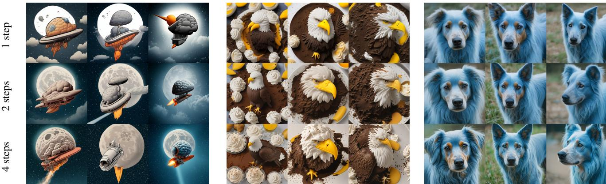
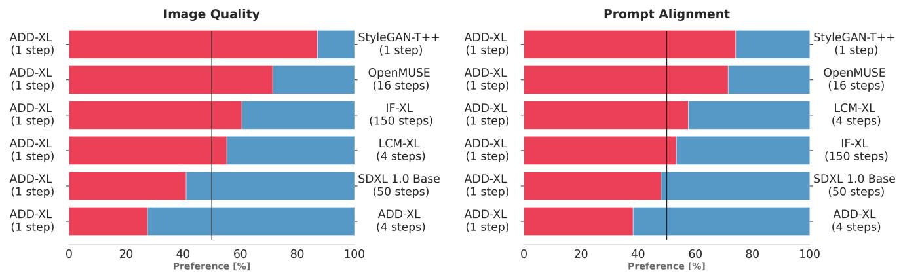
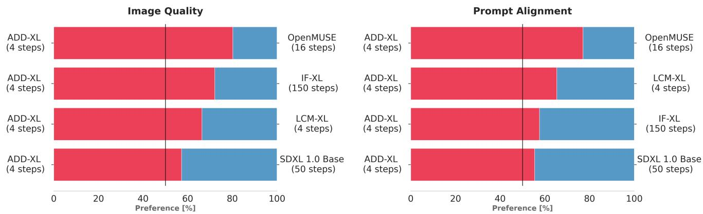

# 1. Bibliographic Information
## 1.1. Title
Adversarial Diffusion Distillation

## 1.2. Authors
*   **Axel Sauer, Dominik Lorenz, Andreas Blattmann, Robin Rombach**
*   **Affiliation:** All authors are from Stability AI, a prominent research organization and company known for developing open-source generative AI models, most notably Stable Diffusion. Their collective expertise lies in generative modeling, particularly diffusion models and GANs, with Robin Rombach being one of the original authors of the Latent Diffusion Models paper.

## 1.3. Journal/Conference
The paper was published on **arXiv**, an open-access repository for electronic preprints of scientific papers. This indicates it is a research paper shared with the community before or during the peer-review process for a formal conference or journal. arXiv is a primary venue for disseminating cutting-edge research in fields like machine learning and computer vision.

## 1.4. Publication Year
2023 (Submitted on November 28, 2023).

## 1.5. Abstract
The paper introduces a novel training method called **Adversarial Diffusion Distillation (ADD)**. The goal of ADD is to enable large-scale, foundational image diffusion models to generate high-quality images in an extremely small number of steps (1-4). This is achieved by combining two techniques: **score distillation**, which uses a pre-trained, large-scale diffusion model as a "teacher" to guide the training, and an **adversarial loss**, which pushes the model to produce realistic images even with a single sampling step. The authors' analyses show that ADD significantly surpasses existing few-step generation methods like GANs and Latent Consistency Models (LCMs) in single-step performance. Remarkably, with just four sampling steps, their model can match the quality of state-of-the-art diffusion models like SDXL. The paper concludes that ADD is the first method to successfully enable single-step, real-time image generation from foundation models.

## 1.6. Original Source Link
*   **Original Source:** https://arxiv.org/abs/2311.17042
*   **PDF Link:** https://arxiv.org/pdf/2311.17042.pdf
*   **Publication Status:** Preprint.

    ---

# 2. Executive Summary
## 2.1. Background & Motivation
*   **Core Problem:** State-of-the-art **Diffusion Models (DMs)**, such as Stable Diffusion XL (SDXL), produce stunningly realistic and complex images. However, their power comes at a cost: they are inherently slow. The image generation process is iterative, requiring dozens or even hundreds of sequential steps to refine a noisy image into a clear one. This high computational demand makes them unsuitable for real-time applications like interactive design, gaming, or live video processing.
*   **Existing Gaps:** On the other hand, **Generative Adversarial Networks (GANs)** are incredibly fast, capable of producing an image in a single forward pass. However, despite significant research, GANs have struggled to match the sample quality, diversity, and compositional understanding of large-scale DMs. They are also notoriously difficult to train and scale. Previous methods to speed up DMs, known as "distillation" techniques, managed to reduce the step count to around 4-8 steps but often at the cost of noticeable quality degradation (e.g., blurriness, artifacts).
*   **Innovative Idea:** The authors propose to combine the best of both worlds. Their central idea is to distill a powerful, pre-trained DM into a new model that can operate in a single step, like a GAN, but without sacrificing the quality learned by the DM. They achieve this with a hybrid training objective:
    1.  An **adversarial loss** (from GANs) forces the model's single-step output to be sharp and realistic, directly on the manifold of real images.
    2.  A **score distillation loss** uses the original, slow DM as a teacher to guide the student model, ensuring it retains the rich knowledge, text-alignment, and compositional abilities of its teacher.

## 2.2. Main Contributions / Findings
*   **Proposal of ADD:** The paper introduces **Adversarial Diffusion Distillation (ADD)**, a novel and general method for converting pre-trained DMs into high-speed, real-time image generators.
*   **State-of-the-Art Few-Step Performance:** ADD achieves unprecedented quality in the low-step regime.
    *   In a **single step**, ADD-trained models significantly outperform strong baselines like Latent Consistency Models (LCMs) and the best text-to-image GANs.
    *   In just **four steps**, the ADD-distilled model (`ADD-XL`) outperforms its own teacher, the powerful SDXL model (which typically uses 50 steps), according to human preference studies.
*   **Real-Time Generation with Foundation Models:** ADD is the first method to unlock the ability to generate high-fidelity images from large-scale foundation models (like SDXL) in a single step, making real-time applications feasible.
*   **Iterative Refinement Capability:** Unlike pure GANs, ADD models retain the iterative structure of diffusion models. This means that while a high-quality image can be generated in one step, it can be further refined by applying additional sampling steps, offering a flexible trade-off between speed and quality.

    ---

# 3. Prerequisite Knowledge & Related Work
## 3.1. Foundational Concepts
### 3.1.1. Diffusion Models (DMs)
Diffusion Models are a class of generative models that learn to create data (like images) by reversing a noise-adding process. The core idea can be broken down into two parts:
*   **Forward Process:** This is a fixed process where you start with a real image and gradually add a small amount of Gaussian noise over many timesteps ($T$). By the final timestep $T$, the image is indistinguishable from pure random noise.
*   **Reverse Process:** This is the generative part. The model, typically a U-Net neural network, is trained to reverse the forward process. At each timestep $t$, it takes a noisy image and predicts the noise that was added. By subtracting this predicted noise, it can take a small step towards a cleaner image. To generate a new image from scratch, you start with pure random noise and iteratively apply this denoising network for $T$ steps until a clean image is formed. The slowness of DMs comes from this iterative application of the large denoising network.

### 3.1.2. Latent Diffusion Models (LDMs)
Training DMs directly on high-resolution images is computationally very expensive. Latent Diffusion Models (LDMs), such as Stable Diffusion, solve this by operating in a compressed **latent space**.
1.  An **encoder** (part of a Variational Autoencoder, or VAE) first compresses a high-resolution image into a much smaller latent representation.
2.  The diffusion and denoising processes happen entirely within this smaller, computationally cheaper latent space.
3.  Once the denoising is complete, a **decoder** (from the VAE) maps the final clean latent representation back into a full-resolution image.
    This makes training and inference significantly faster and less memory-intensive. ADD is built upon LDMs.

### 3.1.3. Generative Adversarial Networks (GANs)
GANs are another class of generative models based on a two-player game:
*   **Generator:** A neural network that takes random noise as input and tries to generate realistic-looking data (e.g., images). Its goal is to fool the Discriminator.
*   **Discriminator:** A neural network that is trained to distinguish between real data (from the training set) and fake data (from the Generator).
    The two networks are trained together. The Generator gets better at creating realistic images, while the Discriminator gets better at spotting fakes. This adversarial process drives the Generator to produce high-fidelity samples. A key advantage of GANs is that generation is a single forward pass through the Generator network, making them extremely fast.

### 3.1.4. Score Distillation Sampling (SDS)
SDS is a technique for using a pre-trained 2D text-to-image diffusion model to optimize or generate content in other domains, like 3D models (as seen in DreamFusion). It's a way of "distilling" the knowledge of the powerful 2D model without needing a 3D dataset. The core idea is to treat the output of the model you're training (e.g., a rendered image of a 3D model) as a noisy version of what the diffusion model *thinks* it should be. The diffusion model then provides a gradient (a "score") indicating how to update the 3D model's parameters to make its rendered image more aligned with the text prompt. ADD adapts this concept to distill a diffusion model into another diffusion model.

## 3.2. Previous Works
*   **Model Distillation for DMs:**
    *   **Progressive Distillation:** This method, proposed by Salimans and Ho (2022), trains a student model to perform two steps of the teacher model in a single step. By repeating this process, the number of required sampling steps can be halved each time (e.g., from 64 to 32, then 16, 8, etc.). However, this requires a costly iterative training process.
    *   **Guidance Distillation:** This technique aims to distill the effect of classifier-free guidance (CFG) into the model itself, removing the need for an extra forward pass during inference and potentially reducing step counts.
*   **Consistency Models (CMs) & Latent Consistency Models (LCMs):**
    *   Consistency Models enforce a constraint that any point on a single ODE trajectory (the path from noise to image) should map to the same final image. This allows the model to jump directly from a noisy state to a clean one in a single step.
    *   **Latent Consistency Models (LCMs)** apply this concept to Latent Diffusion Models. They have shown impressive results for 4-step inference. `LCM-LoRA` further made this approach more efficient by training a small adapter module. The authors identify LCMs as a key baseline, but note their single-step outputs often suffer from blurriness and artifacts.
*   **GANs for Text-to-Image Synthesis:**
    *   Models like **StyleGAN-T** and **GigaGAN** have attempted to scale GAN architectures to large, diverse datasets for text-to-image generation. While they achieve very fast inference, their sample quality and ability to follow complex text prompts generally fall short of top-tier diffusion models.
*   **Hybrid Approaches:**
    *   Some works have tried to incorporate adversarial losses into the diffusion training process to improve sample quality, such as **Denoising Diffusion GANs**. The current paper builds on this line of thinking but combines it with a score distillation objective for knowledge transfer.

## 3.3. Technological Evolution
The field has seen a clear progression:
1.  **Early Generative Models (VAEs, GANs):** Fast but struggled with quality and training stability.
2.  **Emergence of Diffusion Models:** Achieved state-of-the-art quality and diversity but were impractically slow (1000+ steps).
3.  **Efficiency Improvements for DMs:** Techniques like DDIM samplers and LDMs reduced the cost, making DMs more practical (20-50 steps).
4.  **Few-Step Generation (Distillation & Consistency):** Methods like Progressive Distillation and LCMs pushed the boundary to 4-8 steps, but with a noticeable quality drop, especially in the 1-2 step regime.
5.  **ADD's Position:** This paper sits at the current frontier, aiming to close the final gap by achieving high-fidelity generation in just **1-4 steps**, effectively merging the speed of GANs with the quality of DMs.

## 3.4. Differentiation Analysis
*   **vs. LCMs:** While both ADD and LCMs aim for few-step generation, their core mechanisms differ. LCMs enforce a consistency property on the ODE trajectory. ADD, in contrast, uses a direct adversarial objective to force the single-step output to be realistic and a distillation objective to inherit knowledge. The authors argue the adversarial component is crucial for avoiding the artifacts seen in other methods at 1-2 steps.
*   **vs. GANs:** Unlike traditional GANs that are trained from scratch, ADD starts with a powerful, pre-trained diffusion model. This initialization provides a massive head start, improving training stability and leveraging the vast knowledge already encoded in the DM. Furthermore, ADD retains an iterative structure, allowing for refinement, whereas GANs are strictly single-step.
*   **vs. Progressive Distillation:** ADD's training is not iterative. It directly trains the student model for few-step inference in a single training run, making it more efficient.
*   **vs. Previous Hybrid Methods:** ADD's novelty lies in the specific combination of a modern GAN training setup (multi-scale discriminator, advanced feature networks) with a score distillation loss acting as a powerful teacher signal, which proves highly effective for distilling large-scale foundation models.

    ---

# 4. Methodology
## 4.1. Principles
The core principle of Adversarial Diffusion Distillation (ADD) is to train a "student" diffusion model to produce high-quality images in very few steps by learning from two distinct sources of feedback simultaneously:
1.  **Feedback from a Discriminator:** An adversarial discriminator, similar to one used in GANs, looks at the student's generated images and tells it whether they look "real" or "fake." This pressure forces the student to generate sharp, artifact-free images that lie on the manifold of natural images, even from a single step.
2.  **Feedback from a Teacher:** A powerful, pre-trained, and frozen "teacher" diffusion model (like SDXL) provides guidance. The student's output is compared to what the expert teacher would have produced. This ensures the student doesn't just learn to make realistic-looking images but also inherits the teacher's deep knowledge of concepts, styles, and text-to-image composition.

    By combining these two objectives, ADD creates a student model that is both fast (like a GAN) and knowledgeable (like a large DM).

## 4.2. Core Methodology In-depth (Layer by Layer)
The training setup, illustrated in Figure 2 of the paper, involves three main networks:

*   **The ADD-Student ($ \hat{x}_{\theta} $):** A U-Net based diffusion model, initialized with the weights of a pre-trained DM (e.g., SDXL). Its weights, denoted by $\theta$, are trainable.
*   **The Discriminator ($ D_{\phi} $):** A network designed to distinguish real from generated images. Its weights, denoted by $\phi$, are also trainable.
*   **The DM-Teacher ($ \hat{x}_{\psi} $):** A large, pre-trained DM (e.g., SDXL). Its weights, denoted by $\psi$, are frozen and are not updated during training.

    The following figure from the original paper (Figure 2) illustrates the overall training procedure.

    ![Figure 2. Adversarial Diffusion Distillation. The ADD-student is trained as a denoiser that receives diffused input images `x _ { s }` and outputs samples $\\hat { x } _ { \\theta } ( x _ { s } , s )$ and optimizes two objectives: a) adversarial loss: the model aims to fool a discriminator which is trained to distinguish the generated samples ${ \\hat { x } } _ { \\theta }$ from real images `x _ { 0 }` . b) distillation loss: the model is trained to match the denoised targets ${ \\hat { x } } _ { \\psi }$ of a frozen DM teacher.](images/2.jpg)
    *该图像是示意图，展示了对抗扩散蒸馏（ADD）模型的训练流程。图中展示了ADD-student如何接收经过扩散处理的输入图像 $x_s$，并输出样本 $\hat{x}_\theta(x_s, s)$。模型优化两个目标：对抗损失和蒸馏损失。对抗损失用于欺骗判别器，以区分生成样本与真实图像；蒸馏损失则使模型匹配被冻结的扩散模型教师的去噪目标 $\hat{x}_\psi$。*

### 4.2.1. Integrated Explanation of the Training Procedure
The training proceeds as follows for each training batch:

**Step 1: Prepare the Student's Input**
A real image $x_0$ is taken from the training dataset. Noise is added to it to create a noisy input $x_s$, simulating an intermediate step in a diffusion process. This is done using the standard forward diffusion formula:
$x_s = \alpha_s x_0 + \sigma_s \epsilon$
where $\epsilon$ is random noise, and $\alpha_s$ and $\sigma_s$ are coefficients that determine the noise level corresponding to a specific timestep $s$. The timestep $s$ is sampled from a small set of chosen student timesteps, for example, $\{t_1, t_2, t_3, 1000\}$. The inclusion of $s=1000$ (pure noise) is crucial so the model learns to generate images from scratch, as required during inference.

**Step 2: The Student Generates an Image**
The ADD-student network takes the noisy input $x_s$ and the timestep $s$ and produces a predicted clean image, $\hat{x}_{\theta}(x_s, s)$, in a single forward pass.

**Step 3: Calculate the Overall Loss**
The student's weights $\theta$ are updated based on a total loss function $\mathcal{L}$, which is a weighted sum of two components: the adversarial loss and the distillation loss.

$$
\mathcal { L } = \mathcal { L } _ { \mathrm { adv } } ^ { \mathrm { G } } ( \hat { x } _ { \theta } ( x _ { s } , s ) , \phi ) + \lambda \mathcal { L } _ { \mathrm { d i s t i l l } } ( \hat { x } _ { \theta } ( x _ { s } , s ) , \psi )
$$

*   $\mathcal{L}_{\mathrm{adv}}^{\mathrm{G}}$ is the adversarial loss for the generator (the student).
*   $\mathcal{L}_{\mathrm{distill}}$ is the distillation loss.
*   $\lambda$ is a hyperparameter that balances the two losses.

    Let's break down each loss component.

### 4.2.2. The Adversarial Loss ($ \mathcal{L}_{\mathrm{adv}} $)
This loss is responsible for making the generated images look realistic. The design follows that of StyleGAN-T.

*   **Discriminator Architecture:** Instead of a single large discriminator, the authors use a pre-trained and frozen Vision Transformer (ViT) as a feature extractor $F$. Multiple small, trainable "discriminator heads" $D_{\phi,k}$ are attached to different layers of this ViT. This multi-level approach allows the discriminator to assess image realism at various levels of abstraction.
*   **Conditioning:** The discriminator is conditioned on both the text prompt embedding ($c_{\text{text}}$) and an image embedding ($c_{\text{img}}$) extracted from the original real image $x_0$. This conditioning helps the discriminator make more informed judgments and encourages the student to generate images that are consistent with both the text and the original image structure (when $s < 1000$).
*   **Generator's Adversarial Loss ($\mathcal{L}_{\mathrm{adv}}^{\mathrm{G}}$):** The student's goal is to maximize the output of the discriminator for its generated images. This is formulated as minimizing the negative of the discriminator's scores:
    $$
    \mathcal { L } _ { \mathrm { adv } } ^ { \mathrm { G } } ( \hat { x } _ { \theta } ( x _ { s } , s ) , \phi ) = - \mathbb { E } _ { s , \epsilon , x _ { 0 } } \Big [ \sum _ { k } \mathcal { D } _ { \phi , k } \big ( F _ { k } \big ( \hat { x } _ { \theta } ( x _ { s } , s ) \big ) \big ) \Big ]
    $$
    *   $\mathbb{E}_{s, \epsilon, x_0}$ denotes the expectation over all possible timesteps, noises, and real images.
    *   $F_k(\cdot)$ extracts features from an image at layer $k$.
    *   $D_{\phi,k}(\cdot)$ is the discriminator head for layer $k$.
        The student tries to make the sum of discriminator head outputs as large as possible.

*   **Discriminator's Loss ($\mathcal{L}_{\mathrm{adv}}^{\mathrm{D}}$):** The discriminator is trained simultaneously to minimize its own loss, which encourages it to output high scores for real images ($x_0$) and low scores for fake ones ($\hat{x}_{\theta}$). The paper uses the hinge loss formulation:
    $$
    \begin{array} { r l } & { \mathcal { L } _ { \mathrm { adv } } ^ { \mathrm { D } } \big ( \hat { x } _ { \theta } ( x _ { s } , s ) , \phi \big ) } \\ & { = \quad \mathbb { E } _ { x _ { 0 } } \Big [ \displaystyle \sum _ { k } \operatorname* { m a x } \bigl ( 0 , 1 - \mathcal { D } _ { \phi , k } \bigl ( F _ { k } ( x _ { 0 } ) \bigr ) \bigr ) + \gamma R 1 ( \phi ) \Big ] } \\ & { \quad + \mathbb { E } _ { \hat { x } _ { \theta } } \Big [ \displaystyle \sum _ { k } \operatorname* { m a x } \bigl ( 0 , 1 + \mathcal { D } _ { \phi , k } \bigl ( F _ { k } ( \hat { x } _ { \theta } ) \bigr ) \bigr ) \Big ] , } \end{array}
    $$
    *   The first term pushes the discriminator output for real images ($D(F(x_0))$) to be $\ge 1$.
    *   The second term pushes the output for fake images ($D(F(\hat{x}_\theta))$) to be $\le -1$.
    *   $R1(\phi)$ is the R1 gradient penalty, a regularization term that stabilizes GAN training by penalizing large gradients in the discriminator. $\gamma$ is its weight.

### 4.2.3. The Score Distillation Loss ($ \mathcal{L}_{\mathrm{distill}} $)
This loss ensures the student learns the rich knowledge from the teacher model.

*   **Procedure:**
    1.  Take the student's generated image $\hat{x}_{\theta}$.
    2.  Add some noise to it, creating a noised version $\hat{x}_{\theta,t} = \alpha_t \hat{x}_{\theta} + \sigma_t \epsilon'$. This is necessary because the teacher DM is trained on noisy inputs, and giving it a perfectly clean image would be out-of-distribution.
    3.  Feed this noisy image $\hat{x}_{\theta,t}$ to the frozen teacher model. The teacher then predicts a denoised version, $\hat{x}_{\psi}(\hat{x}_{\theta,t}, t)$.
    4.  The distillation loss measures the distance between the student's original output $\hat{x}_{\theta}$ and the teacher's denoised prediction $\hat{x}_{\psi}$.

*   **Formula:** The loss is formulated as:
    $$
    \mathcal { L } _ { \mathrm { d i s t i l l } } ( \hat { x } _ { \theta } ( x _ { s } , s ) , \psi ) = \mathbb { E } _ { t , \epsilon ^ { \prime } } \left[ c ( t ) d ( \hat { x } _ { \theta } , \hat { x } _ { \psi } ( \mathrm { s g } ( \hat { x } _ { \theta , t } ) ; t ) ) \right]
    $$
    *   $\mathbb{E}_{t, \epsilon'}$ is the expectation over different noise levels $t$ and noise samples $\epsilon'$.
    *   $\mathrm{sg}(\cdot)$ is the stop-gradient operation. This is crucial because we only want to update the student ($\theta$), not the teacher ($\psi$). The gradient should flow from the loss back to $\hat{x}_{\theta}$, but not through the teacher's computation path.
    *   `d(x, y)` is a distance metric, typically the squared L2 norm: $d(x, y) = ||x - y||_2^2$.
    *   `c(t)` is a weighting function that depends on the noise level $t$. The paper explores different options for `c(t)`, including exponential weighting and the weighting used in Score Distillation Sampling (SDS), finding that different schedules trade off between sample diversity and text alignment.

### 4.2.4. Inference and Iterative Refinement
During inference, to generate a new image:
1.  Start with pure Gaussian noise, $x_{1000}$.
2.  For a **single-step generation**, simply pass $x_{1000}$ through the trained ADD-student network to get the final image.
3.  For **multi-step generation** (e.g., 4 steps), the ADD model can be used iteratively. The output of one step can be used as the starting point for the next, following a standard diffusion sampling schedule. This allows for refinement of the initial sample, which is a key advantage over single-step GANs. The following figure from the paper (Figure 4) shows how image quality improves with more steps.

    
    *该图像是一个示意图，展示了不同采样步骤（1步、2步、4步）生成的图像结果。左侧为太空飞船主题的图像，在采样步骤增加时图像质量明显提升；右侧显示了以鸡蛋为主题的蛋糕和带有蓝色毛发的狗的图像，展示了在ADD方法下的图像合成效果。*

---

# 5. Experimental Setup
## 5.1. Datasets
*   **Training Dataset:** The paper does not explicitly name the dataset used for training, but given that the models are based on Stable Diffusion 1.5 and SDXL, it's implied they are trained on a large-scale, diverse dataset of image-text pairs, similar or identical to the LAION dataset subsets used for the original models.
*   **Evaluation Dataset:** The quantitative evaluations are performed on the **COCO 2017 validation set**.
    *   **Source & Scale:** COCO (Common Objects in Context) is a large-scale object detection, segmentation, and captioning dataset. The 2017 validation set contains 5,000 images. For text-to-image evaluation, the associated captions are used as prompts.
    *   **Characteristics:** It features complex scenes with multiple common objects.
    *   **Example:** An image might show "A group of people playing frisbee in a park," which tests the model's ability to generate multiple interacting objects and understand spatial relationships.
    *   **Reason for Choice:** COCO is a standard and widely accepted benchmark for evaluating text-to-image models, allowing for fair comparison with prior work. The "zero-shot" evaluation means the models are evaluated on COCO without having been fine-tuned on it.

## 5.2. Evaluation Metrics
### 5.2.1. Fréchet Inception Distance (FID)
*   **Conceptual Definition:** FID is a widely used metric to assess the quality of images generated by a model. It measures the similarity between the distribution of generated images and the distribution of real images. A lower FID score indicates that the two distributions are closer, meaning the generated images are more realistic and diverse. It captures both fidelity (photorealism) and diversity.
*   **Mathematical Formula:**
    $$
    \mathrm{FID}(x, g) = \left\| \mu_x - \mu_g \right\|_2^2 + \mathrm{Tr}\left( \Sigma_x + \Sigma_g - 2(\Sigma_x \Sigma_g)^{1/2} \right)
    $$
*   **Symbol Explanation:**
    *   $x$ and $g$ represent the distributions of real and generated images, respectively.
    *   $\mu_x$ and $\mu_g$ are the mean vectors of the features of real and generated images, extracted from a pre-trained InceptionV3 network.
    *   $\Sigma_x$ and $\Sigma_g$ are the covariance matrices of these features.
    *   $\| \cdot \|_2^2$ is the squared L2 norm.
    *   $\mathrm{Tr}(\cdot)$ is the trace of a matrix (the sum of the elements on the main diagonal).

### 5.2.2. CLIP Score
*   **Conceptual Definition:** CLIP Score measures how well an image aligns with a given text prompt. It uses the pre-trained CLIP (Contrastive Language-Image Pre-training) model, which is designed to understand the relationship between text and images. A higher CLIP score indicates better semantic correspondence between the generated image and the input prompt.
*   **Mathematical Formula:**
    $$
    \text{CLIP Score} = 100 \times \cos(E_I, E_T)
    $$
*   **Symbol Explanation:**
    *   $E_I$ is the image embedding (a vector representation) produced by the CLIP image encoder for the generated image.
    *   $E_T$ is the text embedding produced by the CLIP text encoder for the input prompt.
    *   $\cos(\cdot, \cdot)$ is the cosine similarity between the two embedding vectors. A value closer to 1 means the vectors are more aligned.

### 5.2.3. Human Preference Studies (ELO Score)
*   **Conceptual Definition:** Since automated metrics like FID and CLIP can have flaws, the authors also rely on human evaluation, which is considered the gold standard. They conduct studies where human raters are shown images generated by different models for the same prompt and asked to choose which one is better based on two criteria: **image quality** and **prompt adherence**.
*   **ELO Score:** To rank multiple models based on these pairwise comparisons, they use the ELO rating system, which is borrowed from chess. Each model starts with a score (e.g., 1000). When two models are compared, the winner gains points and the loser loses points. The number of points exchanged depends on their initial score difference. A higher final ELO score indicates a model that is consistently preferred by human evaluators.

## 5.3. Baselines
The paper compares ADD against a comprehensive set of state-of-the-art models:
*   **Standard Diffusion Models:**
    *   `SD1.5` and `SDXL`: The base Latent Diffusion Models, used with a standard fast sampler (`DPM Solver`) at 25 steps to represent strong, multi-step performance.
*   **Distilled/Few-Step Diffusion Models:**
    *   `LCM-1.5` and `LCM-XL`: Latent Consistency Models, a major competing approach for few-step generation.
    *   `InstaFlow`: Another fast, one-step generation method based on Rectified Flows.
    *   `Progressive Distillation` and `CFG-Aware Distillation`: Other distillation techniques.
*   **Other Architectures:**
    *   `IF-XL` (Imagen): A cascaded pixel diffusion model from Google.
    *   `OpenMUSE`: A transformer-based model designed for fast inference.
    *   `StyleGAN-T++`: An improved version of the state-of-the-art text-to-image GAN, retrained by the authors with their improved discriminator architecture to serve as a strong GAN baseline.

        ---

# 6. Results & Analysis
## 6.1. Core Results Analysis
The main findings demonstrate ADD's superiority in few-step image generation, validated through both automated metrics and human studies.

### 6.1.1. Human Preference Studies
Human evaluations are the most compelling results in the paper. The following figures (Figures 5 and 6 from the paper) present the outcomes.

The study in Figure 5 compares single-step `ADD-XL` against other fast generators. `ADD-XL` (1 step) is strongly preferred over `StyleGAN-T++` and even outperforms `LCM-XL` (4 steps), winning 55.4% of pairwise comparisons for image quality.

*该图像是一个比较图表，展示了不同图像生成模型在图像质量和提示对齐方面的偏好百分比。添加的模型表示为 ADD-XL，并包含一到四个步骤的比较，对比其他模型如 StyleGAN-T++ 和 SDXL 1.0 Base。*

The second study, shown in Figure 6, is even more striking. It compares `ADD-XL` (4 steps) against powerful, multi-step models. `ADD-XL` (4 steps) is preferred over `SDXL` (50 steps) in 51.5% of comparisons for image quality and 53.6% for prompt alignment. This is a remarkable result, showing that the distilled model not only matches but **exceeds the performance of its own teacher** while being over 10 times faster.

*该图像是一个图表，展示了在图像质量和提示对齐方面，ADD-XL（4步）与其他模型的偏好对比。图中红色和蓝色条形分别表现了不同模型在样本生成过程中的表现，展示了ADD-XL在少步骤采样中的优势。*

Figure 7 plots the ELO scores against inference time, visually confirming that ADD models achieve the best performance-to-speed ratio by a large margin.

*该图像是一个散点图，展示了不同模型的推理速度与ELO分数的关系。图中红色点标示了ADD-XL模型在仅一步推理下的速度与性能，相较于其他模型，ADD-XL在低步数下表现出较高的推理速度。*

### 6.1.2. Quantitative Comparison of Distillation Methods
Table 2 compares `ADD-M` (based on SD1.5) against other distillation methods on the COCO benchmark.

The following are the results from Table 2 of the original paper:

<table>
<thead>
<tr>
<th>Method</th>
<th>#Steps</th>
<th>Time (s)</th>
<th>FID ↓</th>
<th>CLIP ↑</th>
</tr>
</thead>
<tbody>
<tr>
<td>DPM Solver [37]</td>
<td>25</td>
<td>0.88</td>
<td>20.1</td>
<td>0.318</td>
</tr>
<tr>
<td></td>
<td>8</td>
<td>0.34</td>
<td>31.7</td>
<td>0.320</td>
</tr>
<tr>
<td>Progressive Distillation [43]</td>
<td>1</td>
<td>0.09</td>
<td>37.2</td>
<td>0.275</td>
</tr>
<tr>
<td></td>
<td>2</td>
<td>0.13</td>
<td>26.0</td>
<td>0.297</td>
</tr>
<tr>
<td></td>
<td>4</td>
<td>0.21</td>
<td>26.4</td>
<td>0.300</td>
</tr>
<tr>
<td>CFG-Aware Distillation [31]</td>
<td>8</td>
<td>0.34</td>
<td>24.2</td>
<td>0.300</td>
</tr>
<tr>
<td>InstaFlow-0.9B [36]</td>
<td>1</td>
<td>0.09</td>
<td>23.4</td>
<td>0.304</td>
</tr>
<tr>
<td>InstaFlow-1.7B [36]</td>
<td>1</td>
<td>0.12</td>
<td>22.4</td>
<td>0.309</td>
</tr>
<tr>
<td>UFOGen [71]</td>
<td>1</td>
<td>0.09</td>
<td>22.5</td>
<td>0.311</td>
</tr>
<tr>
<td>ADD-M</td>
<td>1</td>
<td>0.09</td>
<td><strong>19.7</strong></td>
<td><strong>0.326</strong></td>
</tr>
</tbody>
</table>

**Analysis:** In a single step, `ADD-M` achieves an FID of 19.7, which is not only better than all other single-step methods (`InstaFlow`, `UFOGen`) but is also **better than the standard DPM Solver using 25 steps** (FID 20.1). This quantitatively confirms that ADD can achieve state-of-the-art quality in a single inference pass. It also achieves the highest CLIP score, indicating superior text alignment.

## 6.2. Ablation Studies / Parameter Analysis
The authors conducted a thorough ablation study (Table 1) to validate their design choices. The default settings for the study are marked in gray.

The following are the results from Table 1 of the original paper:

<table>
<tr>
<td colspan="4" align="center"><b>(a) Discriminator feature networks.</b></td>
<td colspan="4" align="center"><b>(d) Loss terms.</b></td>
</tr>
<tr>
<td><b>Arch</b></td>
<td><b>Objective</b></td>
<td><b>FID ↓</b></td>
<td><b>CS ↑</b></td>
<td><b>Loss</b></td>
<td><b>FID ↓</b></td>
<td><b>CS ↑</b></td>
<td></td>
</tr>
<tr>
<td>ViT-S</td>
<td>DINOv1</td>
<td>21.5</td>
<td>0.312</td>
<td>Ladv</td>
<td>20.8</td>
<td>0.315</td>
<td></td>
</tr>
<tr>
<td bgcolor="lightgray">ViT-S</td>
<td bgcolor="lightgray">DINOv2</td>
<td bgcolor="lightgray">20.6</td>
<td bgcolor="lightgray">0.319</td>
<td>Ldistill</td>
<td>315.6</td>
<td>0.076</td>
<td></td>
</tr>
<tr>
<td>ViT-L</td>
<td>DINOv2</td>
<td>24.0</td>
<td>0.302</td>
<td bgcolor="lightgray">Ladv + λLdistill,exp</td>
<td bgcolor="lightgray">20.6</td>
<td bgcolor="lightgray">0.319</td>
<td></td>
</tr>
<tr>
<td>ViT-L</td>
<td>CLIP</td>
<td>23.3</td>
<td>0.308</td>
<td>Ladv + λLdistill,sds</td>
<td>22.3</td>
<td>0.325</td>
<td></td>
</tr>
<tr>
<td></td>
<td></td>
<td></td>
<td></td>
<td>Ladv + λLdistill,nfsd</td>
<td>21.8</td>
<td>0.327</td>
<td></td>
</tr>
<tr>
<td colspan="4" align="center"><b>(b) Discriminator conditioning.</b></td>
<td colspan="4" align="center"><b>(e) Teacher type.</b></td>
</tr>
<tr>
<td><b>ctext</b></td>
<td><b>cimg</b></td>
<td><b>FID ↓</b></td>
<td><b>CS ↑</b></td>
<td><b>Student</b></td>
<td><b>Teacher</b></td>
<td><b>FID ↓</b></td>
<td><b>CS ↑</b></td>
</tr>
<tr>
<td>×</td>
<td>×</td>
<td>21.2</td>
<td>0.302</td>
<td bgcolor="lightgray">SD2.1</td>
<td bgcolor="lightgray">SD2.1</td>
<td bgcolor="lightgray">20.6</td>
<td bgcolor="lightgray">0.319</td>
</tr>
<tr>
<td>✓</td>
<td>×</td>
<td>21.2</td>
<td>0.307</td>
<td>SD2.1</td>
<td>SDXL</td>
<td>21.3</td>
<td>0.321</td>
</tr>
<tr>
<td>×</td>
<td>✓</td>
<td>21.1</td>
<td>0.316</td>
<td>SDXL</td>
<td>SD2.1</td>
<td>29.3</td>
<td>0.314</td>
</tr>
<tr>
<td bgcolor="lightgray">✓</td>
<td bgcolor="lightgray">✓</td>
<td bgcolor="lightgray">20.6</td>
<td bgcolor="lightgray">0.319</td>
<td>SDXL</td>
<td>SDXL</td>
<td>28.41</td>
<td>0.325</td>
</tr>
<tr>
<td colspan="4" align="center"><b>(c) Student pretraining.</b></td>
<td colspan="4" align="center"><b>(f) Number of sampling steps.</b></td>
</tr>
<tr>
<td><b>Initialization</b></td>
<td><b>FID ↓</b></td>
<td><b>CS ↑</b></td>
<td></td>
<td><b>Steps</b></td>
<td><b>FID ↓</b></td>
<td><b>CS ↑</b></td>
<td></td>
</tr>
<tr>
<td>Random</td>
<td>293.6</td>
<td>0.065</td>
<td></td>
<td bgcolor="lightgray">1</td>
<td bgcolor="lightgray">20.6</td>
<td bgcolor="lightgray">0.319</td>
<td></td>
</tr>
<tr>
<td bgcolor="lightgray">Pretrained</td>
<td bgcolor="lightgray">20.6</td>
<td bgcolor="lightgray">0.319</td>
<td></td>
<td>2</td>
<td>20.8</td>
<td>0.321</td>
<td></td>
</tr>
<tr>
<td></td>
<td></td>
<td></td>
<td></td>
<td>4</td>
<td>20.3</td>
<td>0.317</td>
<td></td>
</tr>
</table>

*   **Discriminator Design (a, b):** A smaller ViT (`ViT-S`) trained with the DINOv2 objective works best as the feature network. Combining both text ($c_{\text{text}}$) and image ($c_{\text{img}}$) conditioning for the discriminator yields the best results.
*   **Importance of Pre-training (c):** Initializing the student with pre-trained diffusion model weights is absolutely critical. A randomly initialized student network completely fails to train (FID 293.6), confirming that ADD effectively leverages the knowledge of existing models.
*   **Both Losses are Essential (d):** The adversarial loss alone (`L_adv`) achieves a decent FID (20.8), but the distillation loss alone (`L_distill`) fails completely (FID 315.6). It is the **combination** of the two that produces the best FID of 20.6. This confirms the central hypothesis that both realism (from the adversarial loss) and knowledge transfer (from the distillation loss) are necessary.
*   **Iterative Refinement (f):** While the model performs exceptionally well in a single step, applying more steps (2 or 4) can lead to further improvements, as shown by the slight decrease in FID to 20.3 at 4 steps.

    ---

# 7. Conclusion & Reflections
## 7.1. Conclusion Summary
The paper successfully introduces **Adversarial Diffusion Distillation (ADD)**, a novel and highly effective method for creating extremely fast text-to-image generators from pre-trained diffusion models. By synergistically combining an adversarial loss for image fidelity and a score distillation loss for knowledge transfer, ADD overcomes the primary limitation of diffusion models—their slow inference speed. The results are state-of-the-art: ADD outperforms existing few-step methods like LCMs in a single step and, remarkably, surpasses its powerful teacher model (SDXL) in just four steps. This work represents a significant breakthrough, enabling real-time, high-quality image generation with large foundation models for the first time.

## 7.2. Limitations & Future Work
*   **Explicit Limitations Mentioned by Authors:** The paper notes that the enhanced realism and prompt alignment from ADD can come at the cost of **slightly decreased sample diversity** compared to its teacher model. The teacher model, with its stochastic, multi-step sampling process, may explore a wider range of outputs for a given prompt.
*   **Implicit Limitations & Future Directions:**
    *   **Optimal Loss Weighting:** The authors note that finding the optimal weighting function `c(t)` for the distillation loss is an area for future improvement. They experimented with a few schedules, but a more dynamic or learned schedule could potentially yield even better results.
    *   **Training Cost:** While ADD makes *inference* extremely fast, the *training* process itself is complex, involving three large networks (student, teacher, discriminator). The computational resources required for this training are substantial.
    *   **Generalization to Other Domains:** The paper focuses exclusively on image generation. Applying ADD to distill diffusion models for other modalities, such as video, audio, or 3D synthesis, is a promising avenue for future research.

## 7.3. Personal Insights & Critique
*   **Elegant Synergy:** The core idea of ADD is both simple and powerful. It's not just a mechanical combination of two techniques; it's a recognition that the weaknesses of one approach are the strengths of the other. The adversarial loss fixes the artifact and blurriness issues that plague pure distillation methods in the 1-2 step regime, while the distillation loss solves the text alignment and compositional understanding problems that plague pure GANs.
*   **Paradigm Shift for Real-Time AI:** This work could have a profound impact on the practical application of generative AI. By reducing generation time from several seconds to a fraction of a second (e.g., under 100ms on an A100 GPU), ADD makes it possible to integrate high-quality generative models into interactive applications, creative tools, and services where latency is critical.
*   **The Student Surpassing the Master:** The most fascinating result is that the 4-step ADD-XL model is preferred over the 50-step SDXL teacher. This suggests that the distillation process is not just about imitation; it can also be a form of regularization. The adversarial pressure might be forcing the model to discard less plausible or noisy modes from the teacher's output distribution, resulting in generations that are, on average, more coherent and realistic to human observers.
*   **Potential for Abuse:** As with all powerful generative technologies, the ability to generate high-fidelity images in real-time at scale increases the potential for misuse in creating misinformation or synthetic media. The rapid advancement in generation speed necessitates parallel progress in detection and mitigation strategies.
*   **Future Trajectory:** ADD sets a new benchmark for generative model efficiency. Future research will likely build on this foundation, exploring more sophisticated distillation objectives, applying the technique to even larger and more capable foundation models, and extending it beyond the image domain. This paper feels less like an endpoint and more like the beginning of a new chapter in efficient generative modeling.