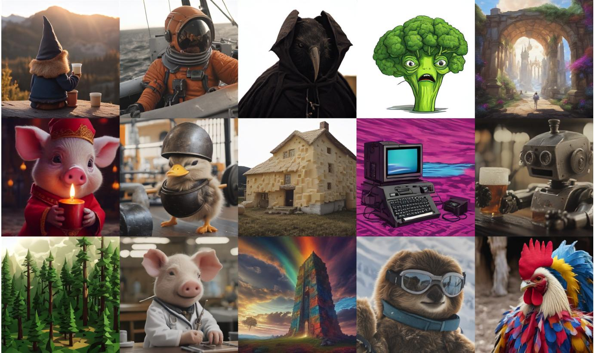
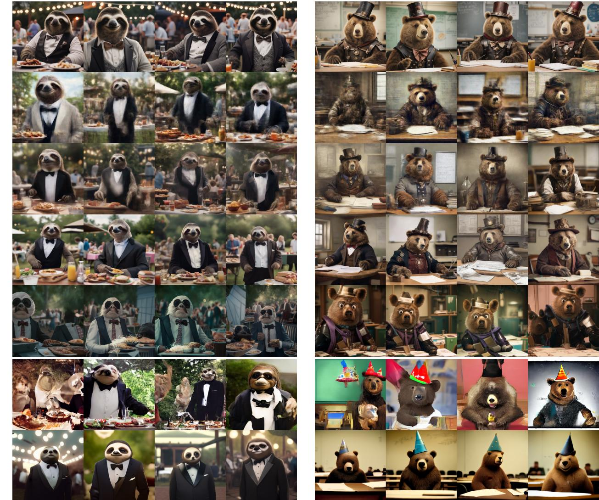
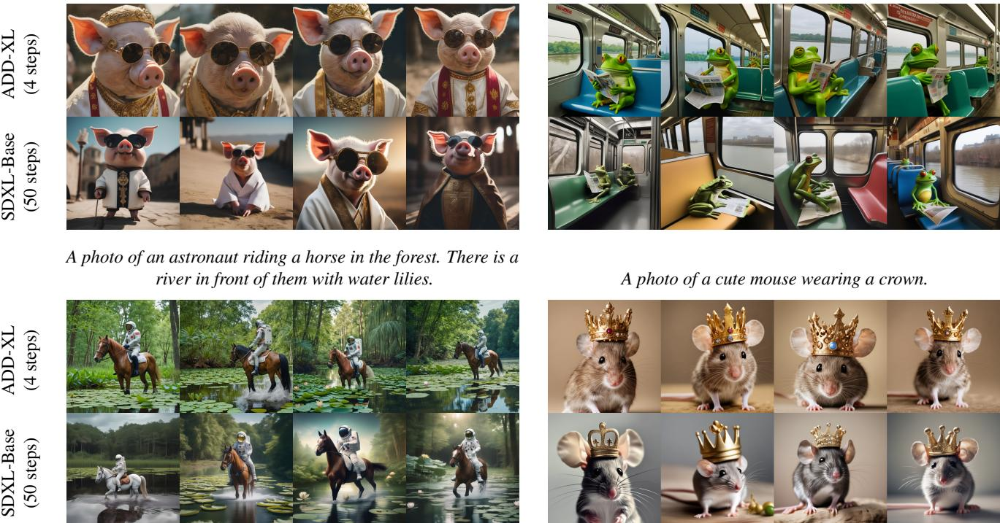

# 1. 论文基本信息

## 1.1. 标题
对抗性扩散蒸馏 (Adversarial Diffusion Distillation)

## 1.2. 作者
Axel Sauer, Dominik Lorenz, Andreas Blattmann, Robin Rombach。所有作者均隶属于 Stability AI。Stability AI 是一家在生成式人工智能领域，特别是图像生成方面，具有重要影响力的公司，其最著名的工作是开源了 Stable Diffusion 模型，极大地推动了该领域的发展和应用。

## 1.3. 发表期刊/会议
该论文于2023年11月28日作为预印本发表在 arXiv 上。arXiv 是一个开放获取的学术论文预印本平台，被广泛用于物理学、数学、计算机科学等领域。在快节奏的机器学习领域，许多重要研究成果会先在 arXiv 上发布，以抢占先机。

## 1.4. 发表年份
2023

## 1.5. 摘要
本文介绍了一种名为<strong>对抗性扩散蒸馏 (Adversarial Diffusion Distillation, ADD)</strong> 的新型训练方法。该方法能够高效地对大规模基础图像扩散模型进行采样，仅需 1-4 个步骤即可生成高质量图像。其核心思想是结合使用两种技术：一是利用<strong>分数蒸馏 (score distillation)</strong>，将一个大规模、现成的图像扩散模型作为“教师”提供指导信号；二是通过<strong>对抗性损失 (adversarial loss)</strong> 来确保即使在极少的采样步数（例如一到两步）下，生成的图像仍然具有高保真度。实验分析表明，ADD 在单步生成方面明显优于现有的少步数方法（如 GANs、潜在一致性模型），并且仅需四步就能达到最先进扩散模型（如 SDXL）的性能水平。ADD 是首个实现使用基础模型进行单步、实时图像合成的方法。

## 1.6. 原文链接
- **原文链接:** https://arxiv.org/abs/2311.17042
- **PDF 链接:** https://arxiv.org/pdf/2311.17042.pdf
- **发布状态:** 预印本 (Preprint)。

# 2. 整体概括

## 2.1. 研究背景与动机
- **核心问题：** 当前最先进的<strong>扩散模型 (Diffusion Models, DMs)</strong> 虽然能生成质量极高的图像，但其工作原理是一个迭代去噪的过程，通常需要数十甚至上百个采样步骤才能完成一次生成。这种缓慢的推理速度严重阻碍了它们在需要实时响应的应用场景（如实时视频编辑、交互式设计工具）中的使用。
- <strong>现有挑战与空白 (Gap)：</strong>
    1.  <strong>扩散模型 (DMs) 的速度瓶颈：</strong> 尽管在图像质量和遵循复杂文本提示方面表现卓越，但其迭代采样的天性使其计算成本高昂。
    2.  <strong>生成对抗网络 (GANs) 的质量瓶颈：</strong> GANs 以其单步生成、速度快的特点著称。然而，尽管研究人员尝试将其扩展到大规模数据集，GANs 生成的图像质量和文本对齐能力通常仍不及顶级的扩散模型，且训练过程不稳定，难以扩展。
    3.  <strong>现有加速方法（如蒸馏）的妥协：</strong> 以往的扩散模型蒸馏方法（如渐进式蒸馏、一致性模型）虽然能将步数减少到 4-8 步，但在更少的步数（1-2步）下，生成的图像往往会出现模糊、失真等明显伪影，质量下降严重。
- **本文的切入点/创新思路：**
  本文的目标是<strong>“鱼与熊掌兼得”</strong>——结合扩散模型的高质量和 GANs 的高速度。其核心思路非常巧妙：**不再将 DMs 和 GANs 视为两种对立的技术路线，而是将它们各自的优势融合到一个统一的训练框架中。**
    -   利用 **GAN 的对抗性训练** 强制模型在单步内就生成“看起来真实”的图像，直接落在真实图像的分布流形上，从而解决少步数生成时的模糊问题。
    -   利用 **DM 的分数蒸馏** 作为强大的“教师”，将预训练好的大型扩散模型（如 SDXL）所包含的丰富知识（如对复杂文本的理解、构图能力）“蒸馏”给学生模型，从而保证生成图像的内容质量和文本对齐度。

## 2.2. 核心贡献/主要发现
- **提出了 ADD 方法：** 引入了一种名为<strong>对抗性扩散蒸馏 (Adversarial Diffusion Distillation, ADD)</strong> 的新方法，可以将预训练的扩散模型转化为一个仅需 1-4 步就能生成高保真度图像的实时生成器。这是通过新颖地结合**对抗性损失**和**分数蒸馏损失**实现的。
- **性能上的巨大突破：**
    -   在**单步生成**场景下，ADD 显著优于所有强大的基线模型，包括<strong>潜在一致性模型 (Latent Consistency Models, LCM)</strong> 和最先进的 GANs。
    -   在**四步生成**场景下，ADD 的性能甚至超越了其多步（例如 50 步）的教师模型 SDXL，实现了“青出于蓝而胜于蓝”。
- **解锁实时基础模型生成：** ADD 是第一个在保持基础模型（如 SDXL 这种数十亿参数的大模型）高质量输出的同时，实现**单步实时图像合成**的方法，为生成式 AI 的实时应用开辟了新的可能性。
- **保留迭代优化的能力：** 与纯 GAN 方法不同，ADD 训练出的模型仍然保留了扩散模型的特性，即可以通过增加采样步骤（例如从1步增加到4步）来进一步**迭代地优化**生成结果。

# 3. 预备知识与相关工作

## 3.1. 基础概念
为了更好地理解本文，以下是一些关键的基础概念：

- <strong>扩散模型 (Diffusion Models, DMs):</strong>
  这是一种生成模型，其工作方式分为两个过程：
    1.  <strong>前向过程 (Forward Process):</strong> 从一张清晰的真实图像开始，逐步、多次地向其添加少量高斯噪声，直到图像完全变成纯粹的噪声。这个过程是固定的、不可学习的。
    2.  <strong>反向过程 (Reverse Process):</strong> 模型的核心任务。从一个纯噪声图像开始，学习如何逐步、多次地“去噪”，最终还原出一张清晰的、与真实数据分布相似的图像。这个去噪网络（通常是 U-Net 架构）是需要训练的。DMs 的优点是生成质量高、训练稳定，缺点是反向过程需要很多步骤，生成速度慢。

- <strong>生成对抗网络 (Generative Adversarial Networks, GANs):</strong>
  这是一种包含两个神经网络的模型，它们相互博弈、共同进化：
    1.  <strong>生成器 (Generator):</strong> 接收一个随机噪声向量，并试图生成以假乱真的数据（如图像）。
    2.  <strong>判别器 (Discriminator):</strong> 接收真实数据和生成器伪造的数据，并试图区分它们。
        训练的目标是让生成器变得越来越强，直到判别器无法分辨其生成的数据是真是假。GANs 的优点是生成速度快（通常只需一次前向传播），缺点是训练不稳定（模式崩溃），且在复杂任务上质量常不如 DMs。

- <strong>模型蒸馏 (Model Distillation):</strong>
  一种模型压缩技术，旨在将一个大型、复杂的“教师模型”所拥有的知识迁移到一个小型、轻量的“学生模型”中。其基本思想是，让学生模型去模仿教师模型的输出。在本文的语境中，目标不是压缩模型大小，而是**减少生成步骤**，即让学生模型学会用更少的步骤完成教师模型需要很多步才能做到的事情。

- <strong>分数蒸馏采样 (Score Distillation Sampling, SDS):</strong>
  一种巧妙的技术，它允许使用一个预训练好的文本到图像扩散模型作为一种**损失函数**，来指导另一个模型的生成过程。直观来说，当你想生成某个东西（比如一个3D模型或一张图像）时，你可以将当前生成的结果渲染成一张2D图片，然后问那个预训练的DM：“嘿，根据文本提示，我这个生成结果看起来对吗？如果不对，我应该朝哪个方向修改才能让它看起来更对？”SDS 就是利用 DM 的梯度来提供这个“修改方向”，从而将 DM 的知识“蒸馏”出来。

- <strong>分类器无关引导 (Classifier-Free Guidance, CFG):</strong>
  一种在扩散模型中广泛使用的技术，用于增强生成图像与文本提示的对齐度。它通过在有条件（文本提示）和无条件（无提示）的预测之间进行插值来实现。虽然效果好，但它需要在每次采样时都计算两次模型输出，增加了计算和内存开销。本文提出的 ADD 方法在推理时**不使用** CFG，进一步提升了效率。

## 3.2. 前人工作
- **加速扩散模型采样：**
    -   <strong>更快的求解器 (Faster Solvers):</strong> 如 `DPM-Solver`，通过更高效的常微分方程 (ODE) 求解算法来减少采样步数，但步数减少到很低时质量仍会下降。
    -   <strong>渐进式蒸馏 (Progressive Distillation):</strong> 一种逐步进行的蒸馏方法，将一个50步的模型蒸馏成25步，再将25步的模型蒸馏成12步，以此类推。效果不错，但训练过程是迭代的，比较耗时。
    -   <strong>一致性模型 (Consistency Models, CMs) / 潜在一致性模型 (Latent Consistency Models, LCMs):</strong> 通过在 ODE 轨迹上强制施加一致性约束，使得模型可以直接从任意时间步预测出最终的清晰图像。LCMs 是 CMs 在潜在空间（Latent Space）中的应用，在4步采样时取得了非常好的效果，是本文的一个重要对比基线。但当步数降至1-2步时，其输出仍常伴有模糊和伪影。

- **结合 GANs 与 DMs：**
    -   **用 GAN 加速 DM 采样：** 如 `Denoising Diffusion GANs`，在扩散过程的最后几步使用 GAN 来加速生成。
    -   **用对抗性训练提升 DM 质量：** 如 `Adversarial Score Matching`，在扩散模型的训练目标中加入对抗性损失，以提升样本质量。
    -   **用 DM 指导 GAN 生成：** 如 `Score GANs`，使用来自 DM 的分数函数来代替传统的判别器训练 GAN。`DiffInstruct` 也是一种无需判别器，直接从 DM 蒸馏知识到生成器的方法。

## 3.3. 技术演进
图像生成技术的发展脉络大致如下：
1.  **GANs 时代：** 以 StyleGAN 系列为代表，实现了高质量图像生成，并以其单步快速生成著称。但其训练不稳定、难以处理非常多样化的大型数据集、文本控制能力有限。
2.  **扩散模型兴起：** 以 DDPM、Imagen、Stable Diffusion (SD) 为代表，凭借其卓越的图像质量、强大的文本控制能力和可扩展性，成为当前的主流。主要瓶颈是生成速度。
3.  **速度与质量的融合：** 近期研究的焦点。一方面，通过改进采样器、蒸馏等方法为 DM 加速（如 LCM）；另一方面，尝试改进 GANs 的训练和架构以提升其质量（如 StyleGAN-T）。
4.  **本文的定位：** ADD 处在技术演进的最前沿，它没有选择“DM vs GAN”的单一路径，而是开创性地将两者的核心优势——**GAN 的对抗性真实感**和 **DM 的知识引导**——结合起来，旨在创造一种既快又好的新范式。

## 3.4. 差异化分析
- **与 LCM 等纯蒸馏方法的区别：**
  LCM 主要依赖于一致性损失，其目标是让学生模型在不同时间步的预测都指向同一个最终结果。这在4步以上效果很好，但在1-2步时，由于约束不够强，模型倾向于输出一个“安全”的平均结果，导致图像模糊。**ADD 引入了对抗性损失**，它像一个严厉的考官，直接评判单步生成的图像是否“真实”，迫使模型输出清晰、细节丰富的图像，从而解决了模糊问题。

- **与 StyleGAN-T 等纯 GAN 方法的区别：**
  大规模 GAN 的训练非常困难，且难以利用现有的大型预训练模型。**ADD 的两个巨大优势是：**
    1.  **利用预训练权重：** ADD 学生模型可以直接从一个预训练好的扩散模型（如 SDXL）初始化。这为训练提供了一个极好的起点，大大提升了稳定性和最终性能。
    2.  **利用 DM 作为教师：** 纯 GAN 依赖判别器来判断真假，但判别器本身不具备复杂的语义理解能力。ADD 额外引入了分数蒸馏损失，相当于有了一个强大的、预训练好的 DM 教师在旁边“指点”，告诉学生模型如何更好地理解和对齐文本提示，从而在内容和构图上远超纯 GAN。

        下图（原文 Figure 2）直观展示了 ADD 的训练流程，清晰地体现了对抗性损失和蒸馏损失这两个并行的目标。

        ![Figure 2. Adversarial Diffusion Distillation. The ADD-student is trained as a denoiser that receives diffused input images `x _ { s }` and outputs samples $\\hat { x } _ { \\theta } ( x _ { s } , s )$ and optimizes two objectives: a) adversarial loss: the model aims to fool a discriminator which is trained to distinguish the generated samples ${ \\hat { x } } _ { \\theta }$ from real images `x _ { 0 }` . b) distillation loss: the model is trained to match the denoised targets ${ \\hat { x } } _ { \\psi }$ of a frozen DM teacher.](images/2.jpg)
        *该图像是示意图，展示了对抗扩散蒸馏（ADD）模型的训练流程。图中展示了ADD-student如何接收经过扩散处理的输入图像 $x_s$，并输出样本 $\hat{x}_\theta(x_s, s)$。模型优化两个目标：对抗损失和蒸馏损失。对抗损失用于欺骗判别器，以区分生成样本与真实图像；蒸馏损失则使模型匹配被冻结的扩散模型教师的去噪目标 $\hat{x}_\psi$。*

# 4. 方法论

本节将深入拆解 ADD 方法的技术细节。其核心是为一个初始化的学生模型设计一个复合训练目标，该目标由两部分组成：**对抗性损失**和**蒸馏损失**。

## 4.1. 方法原理
ADD 的核心思想是训练一个学生模型（`ADD-student`），使其在接收一个带噪声的输入时，能够一步到位地生成一个高质量、高保真度的清晰图像。为了实现这一目标，学生模型在训练中同时被两种力量驱动：
1.  **对抗性力量：** 来自一个判别器，它迫使学生生成的图像在视觉上与真实图像无法区分，确保了图像的清晰度和真实感。
2.  **指导性力量：** 来自一个固定的、预训练好的教师扩散模型，它通过分数蒸馏的方式，指导学生生成的图像在内容、结构和语义上与教师模型一致，确保了图像的质量和文本对齐度。

    整个训练流程涉及三个网络：
-   <strong>ADD-student ($\theta$)：</strong> 需要训练的学生模型，其架构为 U-Net，权重 $\theta$ 从一个预训练的扩散模型初始化。
-   <strong>判别器 (Discriminator, $\phi$)：</strong> 一个可训练的判别器网络，权重为 $\phi$。
-   <strong>教师 DM ($\psi$)：</strong> 一个固定的、预训练好的扩散模型，权重 $\psi$ 在训练中保持不变。

## 4.2. 核心方法详解 (逐层深入)
下面我们将结合公式，分步解析 ADD 的完整训练过程。

### 4.2.1. 训练数据准备
对于每一个训练迭代：
1.  从真实图像数据集 $x_0$ 中采样一张图像。
2.  通过前向扩散过程对其加噪，得到带噪图像 $x_s$。该过程定义为：
    $x_s = \alpha_s x_0 + \sigma_s \epsilon$
    其中，$\epsilon$ 是标准高斯噪声，$\alpha_s$ 和 $\sigma_s$ 是与时间步 $s$ 相关的噪声调度系数。$s$ 从一个预设的离散时间步集合 $T_{student}$ 中均匀采样。

### 4.2.2. 学生模型生成
学生模型接收带噪图像 $x_s$ 和时间步 $s$，并输出预测的清晰图像 $\hat{x}_{\theta}(x_s, s)$。这个输出 $\hat{x}_{\theta}$ 将被用于计算后续的两个损失。

### 4.2.3. 对抗性损失 ($\mathcal{L}_{\mathrm{adv}}$)
这是训练的第一个分支，目标是让 $\hat{x}_{\theta}$ 看起来像真实图像。

1.  **判别器架构：** 判别器并非一个单一的网络，而是由一个**固定的预训练特征网络** $F$（如 DINOv2 ViT）和一组<strong>可训练的轻量级判别器头 (discriminator heads)</strong> $\mathcal{D}_{\phi, k}$ 组成。判别器头作用于特征网络 $F$ 的不同层级输出的特征 $F_k$ 上。这种设计比直接在像素上操作更稳定、更有效。

2.  **判别器条件化：** 为了提升性能，判别器可以接收额外的条件信息。本文中，判别器同时接收两种条件：
    -   **文本条件 $c_{\mathrm{text}}$：** 来自文本编码器（如 CLIP）的文本嵌入。
    -   **图像条件 $c_{\mathrm{img}}$：** 来自另一个特征提取网络（如 DINOv2）对真实图像 $x_0$ 提取的图像嵌入。这鼓励学生模型有效利用输入信息。

3.  **损失函数公式：**
    -   <strong>学生（生成器）的对抗性损失</strong> $\mathcal{L}_{\mathrm{adv}}^{\mathrm{G}}$ 的目标是最大化判别器对自己生成样本的“真实”评分，其公式如下：
        $$
        \mathcal { L } _ { \mathrm { a d v } } ^ { \mathrm { G } } ( \hat { x } _ { \theta } ( x _ { s } , s ) , \phi ) = - \mathbb { E } _ { s , \epsilon , x _ { 0 } } \Big [ \sum _ { k } \mathcal { D } _ { \phi , k } \big ( F _ { k } \big ( \hat { x } _ { \theta } ( x _ { s } , s ) \big ) \big ) \Big ]
        $$
        **符号解释：**
        -   $\mathbb{E}_{s, \epsilon, x_0}$: 表示对随机采样的时间步 $s$、噪声 $\epsilon$ 和真实图像 $x_0$ 取期望。
        -   $\hat{x}_{\theta}(x_s, s)$: 学生模型生成的图像。
        -   $F_k(\cdot)$: 固定特征网络的第 $k$ 层输出的特征。
        -   $\mathcal{D}_{\phi, k}(\cdot)$: 作用于第 $k$ 层特征上的可训练判别器头。
        -   整个公式的含义是，学生模型希望其生成的图像经过特征提取后，在每个判别器头上的得分越高越好。

    -   **判别器的对抗性损失** $\mathcal{L}_{\mathrm{adv}}^{\mathrm{D}}$ 采用铰链损失 (hinge loss)，目标是为真实样本打高分（大于1），为生成样本打低分（小于-1）。同时，还包含一个 R1 梯度惩罚项来稳定训练。
        $$
        \begin{array} { r l } & { \mathcal { L } _ { \mathrm { a d v } } ^ { \mathrm { D } } \big ( \hat { x } _ { \theta } ( x _ { s } , s ) , \phi \big ) } \\ & { = \quad \mathbb { E } _ { x _ { 0 } } \Big [ \displaystyle \sum _ { k } \operatorname* { m a x } \bigl ( 0 , 1 - \mathcal { D } _ { \phi , k } \bigl ( F _ { k } ( x _ { 0 } ) \bigr ) \bigr ) + \gamma R 1 ( \phi ) \Big ] } \\ & { \quad + \mathbb { E } _ { \hat { x } _ { \theta } } \Big [ \displaystyle \sum _ { k } \operatorname* { m a x } \bigl ( 0 , 1 + \mathcal { D } _ { \phi , k } \bigl ( F _ { k } ( \hat { x } _ { \theta } ) \bigr ) \bigr ) \Big ] , } \end{array}
        $$
        **符号解释：**
        -   第一行是针对真实图像 $x_0$ 的损失，判别器希望 $\mathcal{D}_{\phi, k}(F_k(x_0))$ 的值大于 1。
        -   $\gamma R1(\phi)$: R1 梯度惩罚项，用于惩罚判别器在真实数据点附近的梯度大小，防止梯度爆炸，使训练更稳定。
        -   第二行是针对生成图像 $\hat{x}_{\theta}$ 的损失，判别器希望 $\mathcal{D}_{\phi, k}(F_k(\hat{x}_{\theta}))$ 的值小于 -1。

### 4.2.4. 蒸馏损失 ($\mathcal{L}_{\mathrm{distill}}$)
这是训练的第二个分支，目标是让学生模型 $\hat{x}_{\theta}$ 的输出在语义和结构上与教师模型对齐。

1.  **教师模型的使用：** 教师模型是一个预训练好的扩散模型，它不能直接处理学生生成的“清晰”图像 $\hat{x}_{\theta}$，因为这不符合它的输入分布（它期望输入带噪图像）。因此，需要先将 $\hat{x}_{\theta}$ **重新加噪**：
    $\hat{x}_{\theta, t} = \alpha_t \hat{x}_{\theta} + \sigma_t \epsilon'$
    其中 $t$ 是教师模型的时间步，$\epsilon'$ 是新的随机噪声。

2.  **获取教师目标：** 教师模型接收这个重新加噪的图像 $\hat{x}_{\theta, t}$，并进行一次去噪，得到其预测的清晰图像 $\hat{x}_{\psi}(\hat{x}_{\theta, t}, t)$。这个 $\hat{x}_{\psi}$ 就是学生模型需要学习的目标。

3.  **损失函数公式：** 蒸馏损失衡量学生模型的输出 $\hat{x}_{\theta}$ 与教师模型的目标 $\hat{x}_{\psi}$ 之间的差异。
    $$
    \mathcal { L } _ { \mathrm { d i s t i l l } } ( \hat { x } _ { \theta } ( x _ { s } , s ) , \psi ) = \mathbb { E } _ { t , \epsilon ^ { \prime } } \left[ c ( t ) d ( \hat { x } _ { \theta } , \hat { x } _ { \psi } ( \mathrm { s g } ( \hat { x } _ { \theta , t } ) ; t ) ) \right]
    $$
    **符号解释：**
    -   $\mathbb{E}_{t, \epsilon'}$: 表示对教师时间步 $t$ 和新噪声 $\epsilon'$ 取期望。
    -   $\mathrm{sg}(\cdot)$: <strong>停止梯度 (stop-gradient)</strong> 操作。这至关重要，意味着在计算这个损失时，梯度不会流回生成 $\hat{x}_{\theta, t}$ 的过程。我们只关心如何更新学生模型以匹配教师的目标，而不是让学生去影响教师的输入。
    -   `d(x, y)`: 一个距离函数，本文中为 L2 距离，即 $\|x - y\|_2^2$。
    -   `c(t)`: 一个与时间步 $t$ 相关的权重函数。论文探讨了多种选择，如指数权重、SDS 权重等，它们会影响不同噪声水平下的损失贡献。
    -   整个公式的含义是，学生模型应该调整其权重，使得其输出 $\hat{x}_{\theta}$ 尽可能接近教师模型给出的“正确答案” $\hat{x}_{\psi}$。

### 4.2.5. 总体损失函数
最后，学生模型的总训练目标是上述两个损失的加权和：
$$
\mathcal { L } = \mathcal { L } _ { \mathrm { a d v } } ^ { \mathrm { G } } ( \hat { x } _ { \theta } ( x _ { s } , s ) , \phi ) + \lambda \mathcal { L } _ { \mathrm { d i s t i l l } } ( \hat { x } _ { \theta } ( x _ { s } , s ) , \psi )
$$
其中，$\lambda$ 是一个超参数，用于平衡对抗性损失和蒸馏损失的重要性。

通过同时优化这个复合损失，ADD 学生模型学会了在单步内生成既符合真实图像分布（由 $\mathcal{L}_{\mathrm{adv}}$ 保证）、又包含正确内容和结构（由 $\mathcal{L}_{\mathrm{distill}}$ 保证）的高质量图像。

# 5. 实验设置

## 5.1. 数据集
- **评估数据集:** 实验的定量评估主要在 **COCO 2017** 数据集的验证集上进行。COCO (Common Objects in Context) 是一个大规模的物体检测、分割和图像描述数据集。
- **特点与选择理由:** 它包含多样化的日常场景和复杂的物体关系，其丰富的文本标注（captions）使其成为评估文本到图像生成模型在<strong>零样本 (zero-shot)</strong> 设定下性能的黄金标准。零样本意味着模型在未见过 COCO 数据集的情况下，直接使用其文本描述来生成图像，这能很好地检验模型的泛化能力和文本理解能力。

## 5.2. 评估指标
论文使用了自动化指标和人类偏好研究来全面评估模型性能。

### 5.2.1. FID (Fréchet Inception Distance)
- **概念定义:** FID 是一种广泛用于评估生成模型图像质量的指标。它通过比较生成图像集和真实图像集在 Inception-V3 模型提取的特征空间中的分布相似度来衡量性能。FID 分数越低，表示两个分布越接近，即生成图像的质量和多样性越好。它同时考量了保真度（清晰度）和多样性。
- **数学公式:**
  $$
  \mathrm{FID}(x, g) = \left\| \mu_x - \mu_g \right\|_2^2 + \mathrm{Tr}\left( \Sigma_x + \Sigma_g - 2(\Sigma_x \Sigma_g)^{1/2} \right)
  $$
- **符号解释:**
    -   $x$ 和 $g$ 分别代表真实图像和生成图像的集合。
    -   $\mu_x$ 和 $\mu_g$ 分别是真实图像和生成图像的 Inception 特征向量的均值。
    -   $\Sigma_x$ 和 $\Sigma_g$ 分别是真实图像和生成图像的 Inception 特征向量的协方差矩阵。
    -   $\|\cdot\|_2^2$ 表示欧几里得距离的平方。
    -   $\mathrm{Tr}(\cdot)$ 表示矩阵的迹（对角线元素之和）。

### 5.2.2. CLIP Score
- **概念定义:** CLIP Score 用于衡量生成的图像与其对应的文本提示之间的语义相似度，即**文本-图像对齐度**。它使用预训练的 CLIP (Contrastive Language-Image Pre-Training) 模型来分别计算图像和文本的嵌入向量，然后计算这两个向量之间的余弦相似度。CLIP Score 越高，表示图像内容与文本描述越匹配。
- **数学公式:**
  $$
  \text{CLIP Score} = 100 \times \cos(\mathbf{v}_{\text{image}}, \mathbf{v}_{\text{text}})
  $$
- **符号解释:**
    -   $\mathbf{v}_{\text{image}}$: 由 CLIP 图像编码器为生成图像计算出的特征向量。
    -   $\mathbf{v}_{\text{text}}$: 由 CLIP 文本编码器为输入提示计算出的特征向量。
    -   $\cos(\cdot, \cdot)$: 计算两个向量之间的余弦相似度。

### 5.2.3. 人类偏好研究与 ELO Score
- **概念定义:** 由于自动化指标可能存在偏差，本文还进行了大规模的人类偏好研究。评估者会看到由不同模型针对同一提示生成的图像，并被要求从“图像质量”和“提示对齐度”两个维度进行选择。ELO Score 是一种源自国际象棋排名系统的评分机制，用于根据两两对比的胜负结果来为每个模型计算一个综合排名分数。分数越高，表示该模型在人类评估中表现越好。
- **数学公式:**
    -   <strong>预期胜率 (Expected Outcome):</strong> 对于两个评分为 $R_1$ 和 $R_2$ 的模型，模型1的预期胜率 $E_1$ 为：
        $$
        E_1 = \frac{1}{1 + 10^{\frac{R_2 - R_1}{400}}}
        $$
    -   <strong>评分更新 (Rating Update):</strong> 一场比赛后，模型的评分 $R_i$ 将根据实际结果 $S_i$（赢为1，输为0）进行更新：
        $$
        R_i' = R_i + K \cdot (S_i - E_i)
        $$
- **符号解释:**
    -   $R_1, R_2$: 两个模型当前的 ELO 评分。
    -   $E_i$: 模型 $i$ 的预期胜率。
    -   $R_i'$: 模型 $i$ 更新后的评分。
    -   $S_i$: 模型 $i$ 的实际比赛结果。
    -   $K$: 一个常数，决定了单次比赛结果对评分更新的影响权重。

## 5.3. 对比基线
本文将 ADD 与当前最先进的各种快速生成模型进行了比较，包括：
-   **标准扩散模型:** `SD1.5`, `SDXL-Base-1.0` (使用 DPM Solver 采样器)。作为性能和质量的标杆。
-   **蒸馏扩散模型:** `LCM-1.5`, `LCM-XL`。这是当前最强的少步数生成方法之一，是 ADD 的直接竞争对手。
-   **其他快速生成模型:**
    -   `IF-XL`: 一种基于像素空间的级联扩散模型。
    -   `OpenMUSE`: 一种基于 Transformer 的快速生成模型。
    -   `InstaFlow`, `UFOGen`: 其他近期提出的单步生成方法。
-   **GAN 模型:** `StyleGAN-T++`。作者们改进并重新训练了一个强大的 GAN 基线，以进行公平比较。

# 6. 实验结果与分析

## 6.1. 核心结果分析
实验结果有力地证明了 ADD 方法的优越性，尤其是在极少步数生成场景下。

### 6.1.1. 与其他蒸馏方法的比较
如下方原文 Table 2 所示，在以 SD1.5 为基础模型进行的蒸馏方法比较中，ADD-M（本文方法的中等规模版本）在**单步**生成上取得了最佳性能。

- **FID:** ADD-M (1步) 的 FID 为 19.7，不仅远低于其他单步方法如 InstaFlow (22.4) 和 UFOGen (22.5)，甚至优于使用标准 DPM 求解器进行 **8步** 采样的原始 SD1.5 模型 (31.7) 和使用25步采样的原始模型 (20.1)。
- **CLIP Score:** ADD-M (1步) 的 CLIP Score 为 0.326，同样是所有方法中最高的，表明其文本对齐度最佳。

  这表明 ADD 在单步内就能达到甚至超越传统方法多步采样的质量。

以下是原文 Table 2 的结果：

<table>
<thead>
<tr>
<th>Method</th>
<th>#Steps</th>
<th>Time (s)</th>
<th>FID ↓</th>
<th>CLIP ↑</th>
</tr>
</thead>
<tbody>
<tr>
<td>DPM Solver [37]</td>
<td>25</td>
<td>0.88</td>
<td>20.1</td>
<td>0.318</td>
</tr>
<tr>
<td></td>
<td>8</td>
<td>0.34</td>
<td>31.7</td>
<td>0.320</td>
</tr>
<tr>
<td>Progressive Distillation [43]</td>
<td>1</td>
<td>0.09</td>
<td>37.2</td>
<td>0.275</td>
</tr>
<tr>
<td></td>
<td>2</td>
<td>0.13</td>
<td>26.0</td>
<td>0.297</td>
</tr>
<tr>
<td></td>
<td>4</td>
<td>0.21</td>
<td>26.4</td>
<td>0.300</td>
</tr>
<tr>
<td>CFG-Aware Distillation [31]</td>
<td>8</td>
<td>0.34</td>
<td>24.2</td>
<td>0.300</td>
</tr>
<tr>
<td>InstaFlow-0.9B [36]</td>
<td>1</td>
<td>0.09</td>
<td>23.4</td>
<td>0.304</td>
</tr>
<tr>
<td>InstaFlow-1.7B [36]</td>
<td>1</td>
<td>0.12</td>
<td>22.4</td>
<td>0.309</td>
</tr>
<tr>
<td>UFOGen [71]</td>
<td>1</td>
<td>0.09</td>
<td>22.5</td>
<td>0.311</td>
</tr>
<tr>
<td>ADD-M</td>
<td>1</td>
<td>0.09</td>
<td>19.7</td>
<td>0.326</td>
</tr>
</tbody>
</table>

### 6.1.2. 人类偏好研究
人类评估的结果更具说服力。下图（原文 Figure 5 和 Figure 6）展示了基于 SDXL 的大型模型 ADD-XL 的表现。

*该图像是一个比较图表，展示了不同图像生成模型在图像质量和提示对齐方面的偏好百分比。添加的模型表示为 ADD-XL，并包含一到四个步骤的比较，对比其他模型如 StyleGAN-T++ 和 SDXL 1.0 Base。*

从图中可以得出两个惊人的结论：
1.  <strong>ADD-XL (1步) 优于 LCM-XL (4步):</strong> 在“图像质量”和“提示对齐度”两项评估中，仅需单步生成的 ADD-XL 的人类偏好度都显著高于需要四步生成的强劲对手 LCM-XL。这说明 ADD 在效率上取得了巨大飞跃。
2.  <strong>ADD-XL (4步) 优于 SDXL (50步):</strong> 更令人印象深刻的是，当 ADD-XL 使用4步进行迭代优化时，其在两个维度上的人类偏好度均超过了其教师模型 SDXL 使用50步生成的结果。这实现了“学生超越教师”的壮举，表明 ADD 不仅是加速，更是一种能够提升模型潜能的训练方法。

### 6.1.3. 性能与速度权衡
下图（原文 Figure 7）将 ELO 评分与推理速度相结合，直观地展示了各模型的性价比。

*该图像是一个散点图，展示了不同模型的推理速度与ELO分数的关系。图中红色点标示了ADD-XL模型在仅一步推理下的速度与性能，相较于其他模型，ADD-XL在低步数下表现出较高的推理速度。*

可以看到，ADD-XL（红色点）位于图表的右上角区域，意味着它在拥有极快推理速度的同时，也保持了极高的性能（ELO 分数），在性能-速度权衡曲线上占据了绝对的优势地位。

### 6.1.4. 定性结果
定性结果同样展示了 ADD 的强大能力。
-   <strong>单步高质量生成 (原文 Figure 1, Figure 3):</strong> 图像清晰、细节丰富，构图复杂，完全没有其他少步数方法常见的模糊感。

    
    *该图像是一个插图，展示了多种风格各异的角色和场景，包括奇幻、科幻和日常生活元素，体现了高保真度的图像合成效果。*

-   <strong>迭代优化能力 (原文 Figure 4):</strong> 从1步到4步，图像的细节和质量得到逐步改善，展示了其与纯 GAN 不同的迭代求精能力。

    
    *该图像是一个示意图，展示了不同采样步骤（1步、2步、4步）生成的图像结果。左侧为太空飞船主题的图像，在采样步骤增加时图像质量明显提升；右侧显示了以鸡蛋为主题的蛋糕和带有蓝色毛发的狗的图像，展示了在ADD方法下的图像合成效果。*

-   <strong>与教师模型对比 (原文 Figure 8):</strong> 与其教师 SDXL 相比，ADD-XL 生成的图像在真实感上更胜一筹，但也观察到其多样性略有下降，这可能是对抗性训练带来的一个副作用。

    
    *该图像是插图，展示了采用Adversarial Diffusion Distillation（ADD）方法生成的插图效果。上方左侧的四幅作品展示了不同样式的猪，右侧是青蛙在公交车上的场景；下方左侧展示了宇航员骑马穿越森林的画面，右侧是可爱的小老鼠戴着皇冠的图片。这些插图展示了在4步与50步采样下的视觉效果对比。*

## 6.2. 消融实验/参数分析
作者进行了一系列详尽的消融实验来验证 ADD 设计中各个组件的有效性。以下是原文 Table 1 的结果与分析：

以下是原文 Table 1 的结果：

<table>
<thead>
<tr>
<th colspan="4">(a) Discriminator feature networks. Small, modern DINO networks perform best.</th>
</tr>
<tr>
<th>Arch</th>
<th>Objective</th>
<th>FID ↓</th>
<th>CS ↑</th>
</tr>
</thead>
<tbody>
<tr>
<td>ViT-S</td>
<td>DINOv1</td>
<td>21.5</td>
<td>0.312</td>
</tr>
<tr style="background-color:#f0f0f0;">
<td>ViT-S</td>
<td>DINOv2</td>
<td>20.6</td>
<td>0.319</td>
</tr>
<tr>
<td>ViT-L</td>
<td>DINOv2</td>
<td>24.0</td>
<td>0.302</td>
</tr>
<tr>
<td>ViT-L</td>
<td>CLIP</td>
<td>23.3</td>
<td>0.308</td>
</tr>
</tbody>
<thead>
<tr>
<th colspan="4">(b) Discriminator conditioning. Combining image and text conditioning is most effective.</th>
</tr>
<tr>
<th>ctext</th>
<th>cimg</th>
<th>FID ↓</th>
<th>CS ↑</th>
</tr>
</thead>
<tbody>
<tr>
<td>×</td>
<td>×</td>
<td>21.2</td>
<td>0.302</td>
</tr>
<tr>
<td>✓</td>
<td>×</td>
<td>21.2</td>
<td>0.307</td>
</tr>
<tr>
<td>×</td>
<td>✓</td>
<td>21.1</td>
<td>0.316</td>
</tr>
<tr style="background-color:#f0f0f0;">
<td>✓</td>
<td>✓</td>
<td>20.6</td>
<td>0.319</td>
</tr>
</tbody>
<thead>
<tr>
<th colspan="4">(c) Student pretraining. A randomly initialized student network collapses.</th>
</tr>
<tr>
<th>Initialization</th>
<th>FID ↓</th>
<th>CS ↑</th>
</tr>
</thead>
<tbody>
<tr>
<td>Random</td>
<td>293.6</td>
<td>0.065</td>
</tr>
<tr style="background-color:#f0f0f0;">
<td>Pretrained</td>
<td>20.6</td>
<td>0.319</td>
</tr>
</tbody>
<thead>
<tr>
<th colspan="4">(d) Loss terms. Both losses are needed and exponential weighting of L_distill is beneficial.</th>
</tr>
<tr>
<th>Loss</th>
<th>FID ↓</th>
<th>CS ↑</th>
</tr>
</thead>
<tbody>
<tr>
<td>Ladv</td>
<td>20.8</td>
<td>0.315</td>
</tr>
<tr>
<td>Ldistill</td>
<td>315.6</td>
<td>0.076</td>
</tr>
<tr style="background-color:#f0f0f0;">
<td>Ladv + λLdistill,exp</td>
<td>20.6</td>
<td>0.319</td>
</tr>
<tr>
<td>Ladv + λLdistill,sds</td>
<td>22.3</td>
<td>0.325</td>
</tr>
<tr>
<td>Ladv + λLdistill,nfsd</td>
<td>21.8</td>
<td>0.327</td>
</tr>
</tbody>
<thead>
<tr>
<th colspan="4">(e) Teacher type. The student adopts the teacher's traits (SDXL has higher FID & CS).</th>
</tr>
<tr>
<th>Student</th>
<th>Teacher</th>
<th>FID ↓</th>
<th>CS ↑</th>
</tr>
</thead>
<tbody>
<tr style="background-color:#f0f0f0;">
<td>SD2.1</td>
<td>SD2.1</td>
<td>20.6</td>
<td>0.319</td>
</tr>
<tr>
<td>SD2.1</td>
<td>SDXL</td>
<td>21.3</td>
<td>0.321</td>
</tr>
<tr>
<td>SDXL</td>
<td>SD2.1</td>
<td>29.3</td>
<td>0.314</td>
</tr>
<tr>
<td>SDXL</td>
<td>SDXL</td>
<td>28.41</td>
<td>0.325</td>
</tr>
</tbody>
<thead>
<tr>
<th colspan="4">(f) Sampling Steps (Ablation). Multiple steps do not significantly change results in ablation.</th>
</tr>
<tr>
<th>Steps</th>
<th>FID ↓</th>
<th>CS ↑</th>
</tr>
</thead>
<tbody>
<tr style="background-color:#f0f0f0;">
<td>1</td>
<td>20.6</td>
<td>0.319</td>
</tr>
<tr>
<td>2</td>
<td>20.8</td>
<td>0.321</td>
</tr>
<tr>
<td>4</td>
<td>20.3</td>
<td>0.317</td>
</tr>
</tbody>
</table>

<strong>关键结论 (灰色行是默认或最佳设置):</strong>
- <strong>(a) 判别器特征网络:</strong> 现代的、小尺寸的 DINOv2 (ViT-S) 作为特征网络时效果最好。更大的模型（ViT-L）或不同的训练目标（CLIP）反而导致性能下降。
- <strong>(b) 判别器条件:</strong> 结合**图像条件**和**文本条件**能达到最佳效果，且图像条件的作用比文本条件更显著。
- <strong>(c) 学生模型预训练:</strong> **预训练至关重要。** 从随机权重开始训练的学生模型完全无法收敛（FID 高达 293.6），而使用预训练的扩散模型权重则效果优异。这凸显了 ADD 能够利用现有生态的巨大优势。
- <strong>(d) 损失项:</strong> **对抗性损失和蒸馏损失缺一不可。** 单独使用蒸馏损失效果极差（FID 高达 315.6），几乎不工作。单独使用对抗性损失效果尚可，但结合两者后性能达到最佳。不同的蒸馏权重策略（exp, sds, nfsd）会带来不同的权衡，指数权重（exp）在 FID 上表现更好（多样性更高），而 SDS/NFSD 在 CLIP Score 上表现更好（对齐度更高）。
- <strong>(e) 教师模型类型:</strong> 学生模型会继承教师模型的特性。例如，当教师是 SDXL 时，学生的 FID 和 CS 分数也趋向于 SDXL 的特点（更高的 FID 和更高的 CS）。
- <strong>(f) 采样步数 (消融):</strong> 在该消融实验配置下，增加采样步数（从1到4）对 FID 和 CS 指标的改善并不明显，但在人类评估中，多步的效果提升是显著的。

# 7. 总结与思考

## 7.1. 结论总结
本文成功地提出并验证了 <strong>对抗性扩散蒸馏 (Adversarial Diffusion Distillation, ADD)</strong>，一种通用且高效的训练方法，用于将大型预训练扩散模型转化为一个极速的少步数（1-4步）图像生成器。通过巧妙地结合**对抗性损失**（保证真实感）和**分数蒸馏损失**（保证内容质量），ADD 解决了现有少步数生成方法普遍存在的图像模糊和质量下降问题。

主要贡献和发现可以总结为：
1.  **实现了性能与速度的统一：** ADD 在单步生成时，性能就已超越了当前最强的少步数生成方法（如 LCM-XL 4步），并且在4步生成时，性能甚至超越了其多步（50步）的教师模型（SDXL）。
2.  **解锁了实时应用：** ADD 首次使得基于数十亿参数级别基础模型的**单步、实时、高质量**图像生成成为可能，为生成式 AI 在交互式应用领域的落地扫清了主要障碍。
3.  **方法论的创新：** 本文展示了一种“集大成”的有效思路——不再孤立地看待 GAN 和扩散模型，而是将它们的核心机制融合，取长补短，创造出性能更强大的新范式。

## 7.2. 局限性与未来工作
尽管 ADD 取得了巨大成功，但论文作者也指出了其存在的局限性和未来可以探索的方向：
- <strong>多样性与真实感的权衡 (Diversity-Fidelity Trade-off):</strong> 实验结果表明，ADD-XL 生成的图像虽然在真实感上超越了其教师模型 SDXL，但在样本的多样性上略有下降。这可能是由于对抗性训练的“模式寻求”倾向导致的，模型更倾向于生成它最有把握的高质量图像。
- **蒸馏损失的权重设计：** 论文中提到了不同的蒸馏损失权重函数（`exp`, `sds`, `nfsd`）会影响最终结果的偏向（多样性 vs. 对齐度）。选择一个最优的权重函数，或者在训练过程中动态地调度这个权重，是一个值得进一步研究的方向。

## 7.3. 个人启发与批判
这篇论文给我带来了深刻的启发，也引发了一些思考：
- **启发1：融合而非对立的思维范式。** 近年来，扩散模型和 GAN 似乎是两条平行的技术路线。本文最大的亮点在于打破了这种思维定式。它告诉我们，不同技术范式并非总是你死我活的竞争关系，它们的底层优势可以被解构并重新组合，从而创造出 1+1>2 的效果。对抗性损失为蒸馏提供了“锐度”，分数蒸馏为 GAN 提供了“语义”，这种思想非常具有启发性，可以推广到更多领域。
- **启发2：善用生态系统的重要性。** 与从零开始训练一个巨大的 GAN 相比，ADD 能够直接利用现有的、强大的预训练扩散模型（如 Stable Diffusion），这极大地降低了门槛，并提高了训练的稳定性和最终性能。这体现了在当前“大模型时代”，如何巧妙地站在巨人的肩膀上进行创新，可能比一切从零开始更具价值和效率。
- **批判性思考与潜在问题：**
    - **训练复杂性：** ADD 的训练流程涉及三个模型（学生、教师、判别器）和两个复杂的损失函数。虽然最终效果拔群，但整个系统的调试、超参数调整（如损失权重 $\lambda$）可能会比标准扩散模型或 GAN 的训练更复杂，对计算资源的要求也更高。
    - **理论解释的深度：** 论文从实验上完美证明了方法的有效性，但在理论层面，对于为什么“对抗性损失+分数蒸馏”的组合能如此好地工作，其深层数学原理还可以进一步挖掘。例如，这两种损失在梯度空间中是如何相互作用和互补的？
    - **应用的可迁移性：** 该方法在文本到图像生成上取得了成功。它是否能同样有效地应用于其他模态，如视频生成、3D生成或音频合成？在这些领域，模糊和伪影同样是少步数生成的核心痛点，ADD 的思想似乎具有很强的迁移潜力，值得未来探索。

      总而言之，Adversarial Diffusion Distillation 是一项里程碑式的工作，它不仅在技术上实现了惊人的性能突破，更在思路上为生成模型领域的发展指明了一个充满潜力的新方向。