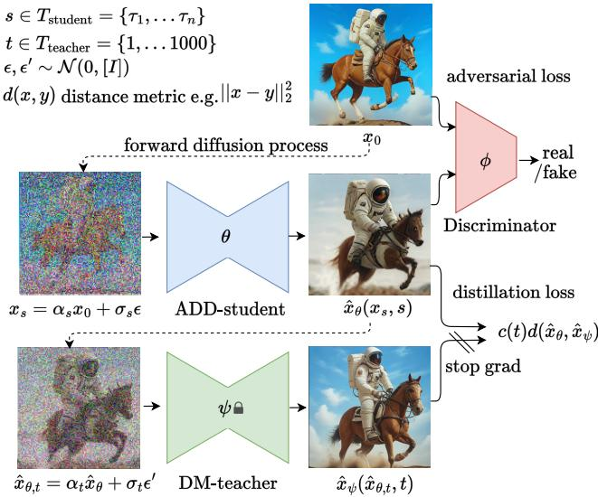
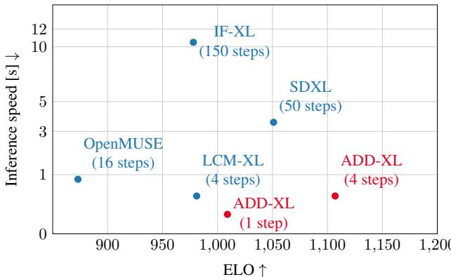
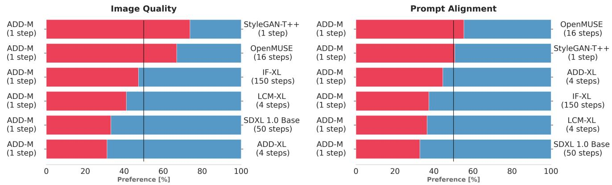
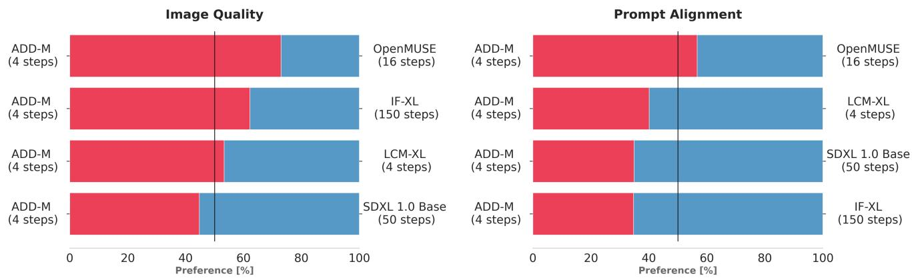
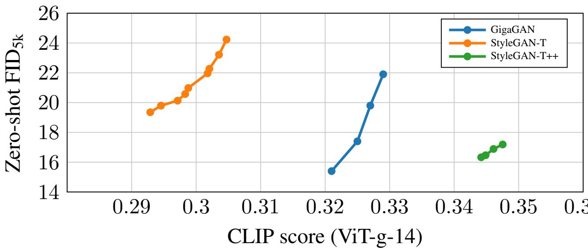
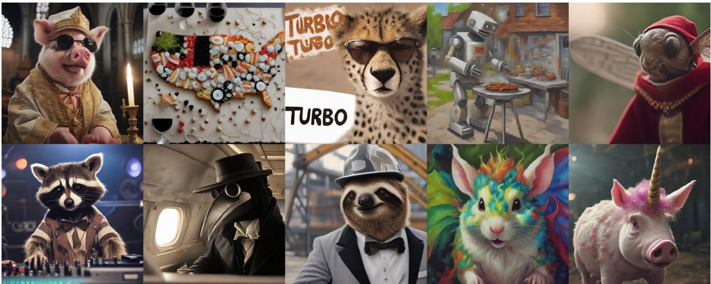
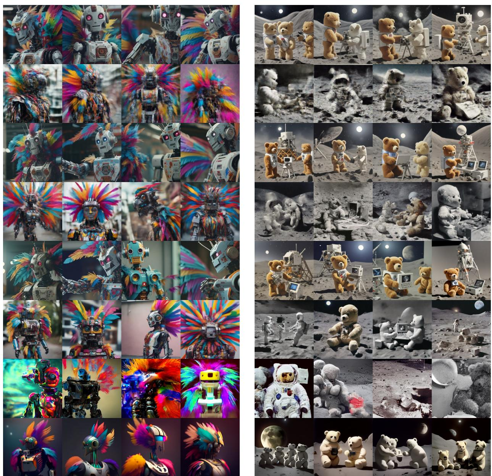
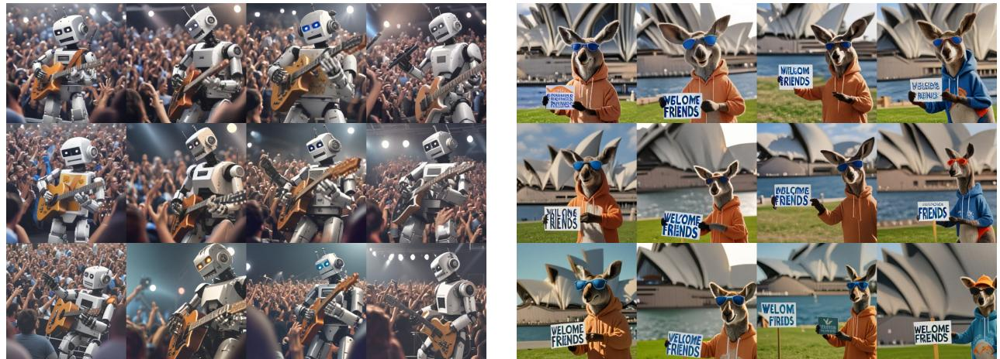

# 对抗性扩散蒸馏

Axel Sauer Dominik Lorenz Andreas Blattmann Robin Rombach 稳定AI 代码： https://github.com/Stability-AI/generative-models 模型权重： https://huggingface.co/stabilityail

  
Figure 1. Generating high-fidelity $5 1 2 ^ { 2 }$ images in a single step. All samples are generated with a single U-Net evaluation trained with adversarial diffusion distillation (ADD).

# 摘要

# 1. 引言

我们引入了对抗扩散蒸馏（Adversarial Diffusion Distillation，简称 A D D），这是一种新颖的训练方法，可以在仅需 14 步的情况下高效采样大规模基础图像扩散模型，同时保持较高的图像质量。我们利用得分蒸馏，将大规模的现成图像扩散模型作为教师信号，并结合对抗损失，以确保即便在一步或两步的低采样阶段也能保持高图像保真度。我们的分析显示，我们的模型在单步采样时明显优于现有的少步方法（如 GANs 和潜在一致性模型），并且在仅用四步的情况下就达到了最先进扩散模型（SDXL）的性能。ADD 是首个实现基础模型单步实时图像合成的方法。

扩散模型（DMs）在生成建模领域中扮演了核心角色，并且最近在高质量图像和视频合成方面取得了显著进展。DMs 的一个主要优点是其可扩展性和迭代特性，使其能够处理复杂任务，如从自由形式的文本提示中合成图像。然而，DMs 中的迭代推理过程需要大量的采样步骤，这在目前制约了它们的实时应用。另一方面，生成对抗网络（GANs）以其单步公式和固有速度为特征。尽管尝试扩展到大规模数据集，GANs 在样本质量方面往往不及 DMs。本工作的目标是将 DMs 的优越样本质量与 GANs 的固有速度相结合。

我们的方法在概念上非常简单：我们提出对抗扩散蒸馏（ADD），这是一种通用方法，将预训练扩散模型的推理步骤数量减少到14个采样步骤，同时保持高采样保真度，并可能进一步提高模型的整体性能。为此，我们引入了两种训练目标的组合：(i) 对抗损失和 (ii) 相应于得分蒸馏采样（SDS）的蒸馏损失。对抗损失迫使模型在每次前向传播时直接生成位于真实图像流形上的样本，从而避免模糊和其他在其他蒸馏方法中常见的伪影。蒸馏损失使用另一个预训练（并固定）的扩散模型作为教师，以有效利用预训练扩散模型的广泛知识，并保持在大型扩散模型中观察到的强组合性。在推理过程中，我们的方法不使用无分类器引导，进一步减少内存需求。我们保留了模型通过迭代精炼提高结果的能力，这一点相较于之前的一步GAN方法具有优势。我们的贡献可以总结如下： • 我们引入ADD，一种将预训练扩散模型转换为高保真、实时图像生成器的方法，仅使用14个采样步骤。我们的方法利用对抗训练和得分蒸馏的新颖组合，并对几种设计选择进行了细致的消融实验。 ADD显著优于强基线，如LCM、LCM-XL和单步GAN，能够处理复杂的图像组合，同时在仅一步推理中保持高图像真实感。 • 使用四个采样步骤，ADD-XL在$5 1 2 ^ { 2 }$ px的分辨率下超越了其教师模型SDXL-Base。

# 2. 背景

尽管扩散模型在合成和编辑高分辨率图像 [3, 53, 54] 和视频 [4, 21] 的表现上取得了显著成绩，但其迭代特性限制了其实时应用。潜在扩散模型 [54] 试图通过在更易于计算的潜在空间 [11] 中表示图像来解决这个问题，但它们仍然依赖于具有数十亿参数的大模型的迭代应用。除了为扩散模型使用更快的采样器 [8, 37, 64, 74]，关于模型蒸馏的研究也在不断增加，如渐进式蒸馏 [56] 和引导蒸馏 [43]。这些方法将迭代采样步骤的数量减少到 4-8 步，但可能显著降低原始性能。此外，它们还需要一个迭代训练过程。一致性模型 [66] 通过对常微分方程（ODE）轨迹施加一致性正则化来解决后者的问题，并在少样本设定下对基于像素的模型表现出强大的性能。潜在扩散模型的蒸馏（LCMs） [38] 专注于蒸馏这些模型，并且在 4 个采样步骤下取得了令人印象深刻的表现。最近，LCM-LoRA [40] 引入了一种低秩适配 [22] 训练方法，以高效地学习 LCM 模块，这些模块可以插入不同的检查点以适用于 SD 和 SDXL [50, 54]。InstaFlow [36] 提出了使用整流流 [35] 来促进更好的蒸馏过程。

  
Figure 2. Adversarial Diffusion Distillation. The ADD-student is trained as a denoiser that receives diffused input images $x _ { s }$ and outputs samples $\hat { x } _ { \theta } ( x _ { s } , s )$ and optimizes two objectives: a) adversarial loss: the model aims to fool a discriminator which is trained to distinguish the generated samples ${ \hat { x } } _ { \theta }$ from real images $x _ { 0 }$ . b) distillation loss: the model is trained to match the denoised targets ${ \hat { x } } _ { \psi }$ of a frozen DM teacher.

所有这些方法都有共同的缺陷：经过四个步骤合成的样本通常显得模糊，并且有明显的伪影。在较少的采样步骤下，这个问题会进一步加剧。生成对抗网络（GANs）也可以被训练成独立的单步模型用于文本到图像的合成。它们的采样速度令人印象深刻，但性能仍然落后于基于扩散的模型。这在一定程度上可以归因于稳定训练对抗目标所需的精细平衡的GAN特定架构。扩大这些模型规模并在不打破这种平衡的情况下整合神经网络架构的进展， notoriously具有挑战性。此外，目前最先进的文本到图像的GAN并没有像无分类器引导这样的可用方法，而这对于大规模的去噪模型（DMs）至关重要。分数蒸馏采样，也称为分数雅可比链，是一种最近提出的方法，旨在将基础文本到图像模型的知识蒸馏到3D合成模型中。虽然大多数基于分数蒸馏采样的工作在3D对象的每场景优化的上下文中使用SDS，但该方法也应用于文本到3D视频合成和图像编辑的相关领域。

  
A cinematic shot of a professor sloth wearing a tuxedo at a BBQ party.   
A high-quality photo of a confused bear in calculus class. The bear is wearing a party hat and steampunk armor.   
y F single step.

最近，文献[13]的作者展示了基于评分的模型与生成对抗网络（GAN）之间的强关系，并提出了评分GAN，这种模型使用来自去噪模型的评分扩散流进行训练，而非使用判别器。类似地，DiffInstruct [42]是一种泛化了SDS的方法，能够将预训练的扩散模型蒸馏为一个无判别器的生成器。相反，也有一些方法旨在通过对抗训练来改善扩散过程。为了实现更快的采样，引入了去噪扩散GAN [70]，这是一种能在较少步骤下实现采样的方法。为了提高质量，在对抗评分匹配[24]和CTM [29]的一致性目标中的评分匹配目标上增加了判别器损失。我们的方法将对抗训练和评分蒸馏结合在一个混合目标中，以解决当前顶尖的少步生成模型中的问题。

# 3. 方法

我们的目标是以尽可能少的采样步骤生成高保真样本，同时保持与最先进水平相匹配的质量：“一只乘坐火箭飞向月球的大脑。”“一只由巧克力粉、芒果和奶油制成的白头鹰”“一只蓝色的狗。”

最先进的模型 [7, 50, 53, 55]。对抗目标 [14, 60] 天生适合快速生成，因为它训练一个在图像流形上单步输出样本的模型。然而，将生成对抗网络（GAN）扩展到大规模数据集的尝试 [58, 59] 表明，不应仅仅依赖判别器，还需要使用预训练的分类器或 CLIP 网络来改善文本对齐。如[59]所述，过度使用判别网络会引入伪影，导致图像质量下降。相反，我们利用预训练扩散模型的梯度，通过评分蒸馏目标来改善文本对齐和样本质量。此外，我们不是从头开始训练，而是用预训练的扩散模型权重初始化我们的模型；已知预训练生成网络可以显著改善对抗损失下的训练 [15]。最后，我们不是使用仅限解码器的架构用于GAN训练 [26, 27]，而是采用标准的扩散模型框架。该设置自然支持迭代精细化。

# 3.1. 训练过程

我们的训练过程在图2中概述，涉及三个网络：ADD学生网络从预训练的UNet-DM初始化，权重为$\theta$，一个可训练权重$\phi$的判别器，以及一个权重被冻结的DM教师，权重为$\psi$。在训练期间，ADD学生网络生成来自噪声数据$x _ { s }$的样本$\hat { x } _ { \theta } ( x _ { s } , s )$。这些噪声数据点是通过向真实图像数据集$x _ { 0 }$应用前向扩散过程生成的，表达式为$x _ { s } = \alpha _ { s } x _ { 0 } + \sigma _ { s } \epsilon$。在我们的实验中，我们使用与学生DM相同的系数$\alpha _ { s }$和$\sigma _ { s }$，并均匀地从一组$T _ { \mathrm { s t u d e n t } } ~ = ~ \{ \tau _ { 1 } , . . . , \tau _ { n } \}$中选择样本$s$，该集合包含$N$个选定的学生时间步。在实践中，我们选择$N = 4$。重要的是，我们设定$\tau _ { n } = 1000$并在训练期间强制执行零终端信噪比[33]，因为模型在推理过程中需要从纯噪声开始。

对于对抗目标，生成样本 ${ \hat { x } } _ { \theta }$ 和真实图像 $x _ { 0 }$ 被传递至判别器，判别器旨在区分两者。判别器的设计与对抗损失的详细描述见第 3.2 节。为了从 DM 教师中提取知识，我们将学生样本 ${ \hat { x } } _ { \theta }$ 通过教师的前向过程扩散为 $\widehat { \boldsymbol { x } } _ { \boldsymbol { \theta } , t }$，并使用教师的去噪预测 $\hat { x } _ { \psi } ( \hat { x } _ { \theta , t } , t )$ 作为重建目标，计算蒸馏损失 ${ \mathcal { L } } _ { \mathrm { d i s t i l l } }$，详见第 3.3 节。因此，整体目标是

$$
\mathcal { L } = \mathcal { L } _ { \mathrm { a d v } } ^ { \mathrm { G } } ( \hat { x } _ { \theta } ( x _ { s } , s ) , \phi ) + \lambda \mathcal { L } _ { \mathrm { d i s t i l l } } ( \hat { x } _ { \theta } ( x _ { s } , s ) , \psi )
$$

虽然我们在像素空间中构建我们的方法，但将其适配到在潜在空间中操作的LDM是非常简单的。当使用具有共享潜在空间的教师和学生LDM时，可以在像素空间或潜在空间中计算蒸馏损失。我们在像素空间中计算蒸馏损失，因为这样在蒸馏潜在扩散模型时会产生更稳定的梯度。

# 3.2. 对抗损失

对于判别器，我们遵循文献[59]中提出的设计和训练过程，briefly summarize；有关详细信息，请读者参考原作。我们使用一个冻结的预训练特征网络$F$和一组可训练的轻量级判别器头$\mathcal { D } _ { \phi , k }$。对于特征网络$F$，Sauer等人[59]发现视觉变换器(ViTs)[9]效果良好，我们在第4节对ViTs目标和模型规模的不同选择进行了消融实验。可训练的判别器头应用于特征$F _ { k }$在特征网络的不同层上。为了提高性能，判别器可以通过投影[46]基于额外信息进行条件化。通常，在图像生成文本的设置中使用文本嵌入$c _ { \mathrm { t e x t } }$。但是，与标准的GAN训练不同，我们的训练配置还允许对给定的图像进行条件化。当$\tau < 1000$时，ADD学生会从输入图像$x _ { 0 }$获取一些信号。因此，对于给定的生成样本$\hat { x } _ { \theta } ( x _ { s } , s )$，我们可以基于来自$x _ { 0 }$的信息对判别器进行条件化。这鼓励ADD学生有效利用输入。在实践中，我们使用一个额外的特征网络提取图像嵌入$c _ { \mathrm { i m g } }$。

  
F LL further improves our model (bottom row).

根据[57, 59]，我们采用铰链损失[32]作为对抗目标函数。因此，ADD学生的对抗目标 $\mathcal { L } _ { \mathrm { a d v } } ( \hat { x } _ { \theta } ( x _ { s } , s ) , \phi )$ 表示为，而判别器则被训练以最小化其中 $R 1$ 表示R1梯度惩罚[44]。我们并不是在像素值上计算梯度惩罚，而是在每个判别器头 $\mathcal { D } _ { \phi , k }$ 的输入上计算。我们发现，当训练输出分辨率大于 $1 2 8 ^ { 2 } { \mathfrak { p x } }$ 时，$R 1$ 惩罚尤其有利。

$$
\begin{array} { r l } & { \mathcal { L } _ { \mathrm { a d v } } ^ { \mathrm { G } } ( \hat { x } _ { \theta } ( x _ { s } , s ) , \phi ) } \\ & { \quad \quad \quad = - \mathbb { E } _ { s , \epsilon , x _ { 0 } } \Big [ \sum _ { k } \mathcal { D } _ { \phi , k } \big ( F _ { k } \big ( \hat { x } _ { \theta } ( x _ { s } , s ) \big ) \big ) \Big ] , } \end{array}
$$

$$
\begin{array} { r l } & { \mathcal { L } _ { \mathrm { a d v } } ^ { \mathrm { D } } \big ( \hat { x } _ { \theta } ( x _ { s } , s ) , \phi \big ) } \\ & { = \quad \mathbb { E } _ { x _ { 0 } } \Big [ \displaystyle \sum _ { k } \operatorname* { m a x } \bigl ( 0 , 1 - \mathcal { D } _ { \phi , k } \bigl ( F _ { k } ( x _ { 0 } ) \bigr ) \bigr ) + \gamma R 1 ( \phi ) \Big ] } \\ & { \quad + \mathbb { E } _ { \hat { x } _ { \theta } } \Big [ \displaystyle \sum _ { k } \operatorname* { m a x } \bigl ( 0 , 1 + \mathcal { D } _ { \phi , k } \bigl ( F _ { k } ( \hat { x } _ { \theta } ) \bigr ) \bigr ) \Big ] , } \end{array}
$$

# 3.3. 评分蒸馏损失

公式 (1) 中的蒸馏损失被表述为，其中 sg 表示停止梯度操作。直观上，损失通过距离度量 $d$ 来衡量由 ADD 学生生成的样本 $x \theta$ 与 DM 教师输出之间的不匹配 $\begin{array} { c c l } { \hat { x } _ { \psi } ( \hat { x } _ { \theta , t } , t ) } & { = } & { ( \hat { x } _ { \theta , t } \textrm { -- } } \end{array}$ $\sigma _ { t } \hat { \epsilon } _ { \psi } ( \hat { x } _ { \theta , t } , t ) ) / \alpha _ { t }$，该损失在时间步长 $t$ 和噪声 $\epsilon ^ { \prime }$ 上进行平均。值得注意的是，教师模型并不直接应用于 ADD 学生的生成结果 ${ \hat { x } } _ { \theta }$，而是应用于扩散输出 $\hat { x } _ { \theta , t } = \alpha _ { t } \hat { x } _ { \theta } + \sigma _ { t } \epsilon ^ { \prime }$，因为未扩散的输入将对于教师模型而言是超出分布的 [68]。

$$
\begin{array} { r l } & { \mathcal { L } _ { \mathrm { d i s t i l l } } ( \hat { x } _ { \theta } ( x _ { s } , s ) , \psi ) } \\ & { \quad \quad \quad = \mathbb { E } _ { t , \epsilon ^ { \prime } } \left[ c ( t ) d ( \hat { x } _ { \theta } , \hat { x } _ { \psi } ( \mathrm { s g } ( \hat { x } _ { \theta , t } ) ; t ) ) \right] , } \end{array}
$$

在以下内容中，我们定义距离函数 $d ( x , y ) : = | | x - y | | _ { 2 } ^ { 2 }$ 。关于加权函数 $c ( t )$，我们考虑两种选择：指数加权，其中 $c ( t ) = \alpha _ { t }$ （噪声水平较高的样本贡献较少），以及得分蒸馏采样（SDS）加权 [51]。在补充材料中，我们演示了当 $d ( x , y ) = | | x - y | | _ { 2 } ^ { 2 }$ 以及 $c ( t )$ 选择特定值时，我们的蒸馏损失变得等同于 SDS 目标 $\mathcal { L } _ { \mathrm { { S D S } } }$，正如 [51] 中所提议的那样。我们的方法的优势在于能够直接可视化重建目标，并且自然地促进多个连续去噪步骤的执行。最后，我们还评估了无噪声得分蒸馏（NFSD）目标，这是最近提出的 SDS 变体 [28]。

# 4. 实验

在我们的实验中，我们训练了两个不同能力的模型，ADD-M（参数量为860M）和ADD-XL（参数量为3.1B）。对于ADD-M的消融实验，我们使用了Stable Diffusion (SD) 2.1主干网络[54]，而为了与其他基线进行公平比较，我们使用SD1.5。ADD-XL采用了SDXL[50]主干网络。所有实验均在标准化分辨率$5 1 2 \mathrm { x } 5 1 2$ 像素下进行；高分辨率生成模型的输出会被下采样到此尺寸。我们在所有实验中采用了$\lambda = 2 . 5$的蒸馏加权因子。此外，R1惩罚强度（d）损失项。两个损失是必要的，对${ \mathcal { L } } _ { \mathrm { d i s t i l l } }$的指数加权是有利的。（a）鉴别器特征网络。小型现代DINO网络表现最佳。

<table><tr><td>Arch</td><td>Objective</td><td>FID ↓</td><td>CS ↑</td></tr><tr><td>ViT-S</td><td>DINOv1</td><td>21.5</td><td>0.312</td></tr><tr><td>ViT-S</td><td>DINOv2</td><td>20.6</td><td>0.319</td></tr><tr><td>ViT-L</td><td>DINOv2</td><td>24.0</td><td>0.302</td></tr><tr><td>ViT-L</td><td>CLIP</td><td>23.3</td><td>0.308</td></tr></table>

<table><tr><td>Initialization</td><td>FID ↓</td><td>CS ↑</td></tr><tr><td>Random</td><td>293.6</td><td>0.065</td></tr><tr><td>Pretrained</td><td>20.6</td><td>0.319</td></tr></table>

(b) 判别器条件。结合图像和文本条件是最有效的。

<table><tr><td>ctext</td><td>Cimg</td><td>FID ↓</td><td>CS ↑</td></tr><tr><td>×</td><td>X</td><td>21.2</td><td>0.302</td></tr><tr><td>✓</td><td>X</td><td>21.2</td><td>0.307</td></tr><tr><td>X</td><td>✓</td><td>21.1</td><td>0.316</td></tr><tr><td>✓</td><td>✓</td><td>20.6</td><td>0.319</td></tr></table>

<table><tr><td>Loss</td><td>FID ↓</td><td>CS ↑</td></tr><tr><td>Ladv</td><td>20.8</td><td>0.315</td></tr><tr><td>Ldistill</td><td>315.6</td><td>0.076</td></tr><tr><td>Ladv + λLdistillexp</td><td>20.6</td><td>0.319</td></tr><tr><td>Ladv + λistill,sds</td><td>22.3</td><td>0.325</td></tr><tr><td>Ladv + λLdistill,nfsd</td><td>21.8</td><td>0.327</td></tr></table>

(c) 学生预训练。一个随机初始化的学生网络崩溃。

<table><tr><td>Steps</td><td>FID ↓</td><td>CS ↑</td></tr><tr><td>1</td><td>20.6</td><td>0.319</td></tr><tr><td>2</td><td>20.8</td><td>0.321</td></tr><tr><td>4</td><td>20.3</td><td>0.317</td></tr></table>

<table><tr><td>Student</td><td>Teacher</td><td>FID ↓</td><td>CS ↑</td></tr><tr><td>SD2.1</td><td>SD2.1</td><td>20.6</td><td>0.319</td></tr><tr><td>SD2.1</td><td>SDXL</td><td>21.3</td><td>0.321</td></tr><tr><td>SDXL</td><td>SD2.1</td><td>29.3</td><td>0.314</td></tr><tr><td>SDXL</td><td>SDXL</td><td>28.41</td><td>0.325</td></tr></table>

(e) 教师类型。学生采用教师的特征（SDXL 具有更高的 FID 和 CS）。(f) 教师步骤。一个教师步骤就足够了。

Table 1. ADD ablation study. We report COCO zero-shot $\mathrm { F I D 5 k }$ (FID) and CLIP score (CS). The results are calculated for a single student Default settings are marked ingray

$\gamma$ 设置为 $1 0 ^ { - 5 }$ 。对于鉴别器的条件设置，我们使用预训练的 CLIP-ViT-g-14 文本编码器 [52] 计算文本嵌入 $c _ { \mathrm { t e x t } }$ ，并使用 DINOv2 ViT-L 编码器 [47] 的 CLS 嵌入计算图像嵌入 $c _ { \mathrm { i m g } }$ 。对于基线模型，我们使用最优的公开可用模型：潜在扩散模型 [50, 54] $\mathrm { \ S D 1 . } 5 ^ { \mathrm { 1 } }$ ，SDXL²）级联像素扩散模型 [55] $\left( \mathrm { I F } \mathrm { - } \mathrm { X L } ^ { 3 } \right.$ ，蒸馏扩散模型 [39, 41] （LCM-1.5, LCM-1.5-XL4），和 OpenMUSE 5 [48]，它是 MUSE [6] 的重实现，MUSE 是一个专门为快速推理开发的变换器模型。注意，我们在比较时使用 SDXL-Base-1.0 模型而未包括其附加的精炼器模型；这是为了确保公平比较。由于没有公开的最先进的 GAN 模型，我们使用改进后的鉴别器重新训练了 StyleGAN-T [59] 。这个基线（StyleGAN $\mathrm { { \cdot } T } { + } { + }$ ）在 FID 和 CS 指标上显著优于之前最好的 GAN，详情见补充材料。我们通过 FID [18] 量化样本质量，通过 CLIP 分数 [17] 量化文本对齐质量。对于 CLIP 分数，我们使用在 LAION-2B [61] 上训练的 ViT-g-14 模型。两项指标都是在 COCO2017 [34] 的 5k 样本上进行评估的。

# 4.1. 消融研究

我们的训练设置在对抗损失、蒸馏损失、初始化和损失互作等方面开辟了多个设计空间。我们在表1中对几种选择进行了消融研究；每个表格下方都突出显示了关键见解。判别器特征网络（表1a）。Stein等人[67]的最新研究表明，使用CLIP[52]或DINO[5, 47]目标训练的ViT特别适合用于评估生成模型的性能。同样，这些模型在作为判别器特征网络时也似乎有效，其中DINOv2成为最佳选择。判别器条件化（表1b）。与先前的研究类似，我们观察到对判别器进行文本条件化可以增强结果。值得注意的是，图像条件化优于文本条件化，而$c _ { \mathrm { t e x t } }$和$c _ { \mathrm { i m g } }$的组合产生了最佳结果。学生预训练（表1c）。我们的实验显示了对ADD-学生进行预训练的重要性。能够使用预训练的生成器相比纯GAN方法具有显著优势。GAN的一大问题是缺乏可扩展性；Sauer等人[59]和Kang等人[25]观察到在达到一定网络容量后性能的饱和。这一观察与DM[49]的普遍平滑缩放规律形成对比。然而，ADD可以有效利用更大预训练DM（见表1c）并受益于稳定的DM预训练。损失项（表1d）。我们发现这两种损失都是必不可少的。单独使用蒸馏损失效果不佳，但当与对抗损失结合时，结果有明显改善。不同的加权方案导致不同的表现，指数加权方案倾向于产生更多样化的样本，较低的FID、SDS和NFSD加权方案能提高质量和文本对齐效果。虽然我们在所有其他消融实验中使用指数加权方案作为默认设置，但在训练最终模型时选择了NFSD加权。选择最佳的加权函数是一个改善的机会。或者，可以考虑在训练过程中调度蒸馏权重，正如在3D生成建模文献[23]中探讨的那样。

  
ADD-XLX   y and prompt alignment.

Table 2. Distillation Comparison We compare ADD to other distillation methods via COCO zero-shot $\mathrm { F I D } _ { 5 \mathrm { k } }$ (FID) and CLIP score (CS). All models are based on SD1.5.   

<table><tr><td>Method</td><td>#Steps</td><td>Time (s)</td><td>FID ↓</td><td>CLIP ↑</td></tr><tr><td>DPM Solver [37]</td><td>25</td><td>0.88</td><td>20.1</td><td>0.318</td></tr><tr><td></td><td>8</td><td>0.34</td><td>31.7</td><td>0.320</td></tr><tr><td>Progressive Distillation [43]</td><td>1</td><td>0.09</td><td>37.2</td><td>0.275</td></tr><tr><td></td><td>2</td><td>0.13</td><td>26.0</td><td>0.297 0.300</td></tr><tr><td></td><td>4</td><td>0.21</td><td>26.4</td><td></td></tr><tr><td>CFG-Aware Distillation [31]</td><td>8</td><td>0.34</td><td>24.2</td><td>0.300</td></tr><tr><td>InstaFlow-0.9B [36]</td><td>1</td><td>0.09</td><td>23.4</td><td>0.304</td></tr><tr><td>InstaFlow-1.7B [36]</td><td>1</td><td>0.12</td><td>22.4</td><td>0.309</td></tr><tr><td>UFOGen [71]</td><td>1</td><td>0.09</td><td>22.5</td><td>0.311</td></tr><tr><td>ADD-M</td><td>1</td><td>0.09</td><td>19.7</td><td>0.326</td></tr></table>

教师类型。（表1e）。有趣的是，更大尺寸的学生和教师并不一定会导致更好的FID和CS。相反，学生会采用教师的特征。SDXL通常获得更高的FID，这可能是因为其输出多样性较低，但它展现了更高的图像质量和文本对齐性[50]。教师步骤。（表1f）。虽然我们的蒸馏损失公式按照设计允许与教师进行多个连续步骤，但我们发现多个步骤并不会明确导致更好的性能。

# 4.2. 与最先进技术的定量比较

在与其他方法的主要比较中，我们避免使用自动化指标，因为用户偏好研究更为可靠。我们的研究旨在评估提示遵循度和整体图像质量。作为性能指标，我们计算成对比较的胜率百分比及多种方法比较时的ELO分数。对于报告的ELO分数，我们计算提示遵循度和图像质量之间的均值分数。关于ELO分数计算和研究参数的详细信息列在补充材料中。

  
Figure 7. Performance vs. speed. We visualize the results reported in Fig. 6 in combination with the inference speeds of the respective models. The speeds are calculated for generating a single sample at resolution $5 1 2 \mathrm { x } 5 1 2$ on an A100 in mixed precision.

图 5 和图 6 展示了研究结果。最重要的结果是：首先，ADD-XL 在单步情况下优于 LCM-XL（4 步）。其次，ADD-XL 在大多数比较中能够用四步超越 SDXL（50 步）。这使得 ADD-XL 在单步和多步设置中都成为最先进的技术。图 7 可视化了 ELO 分数与推理速度的关系。最后，表 2 比较了使用相同基础模型的不同少步采样和蒸馏方法。ADD 在八步情况下优于所有其他方法，包括标准 DPM 解算器。

# 4.3. 质性结果

为了补充我们之前的定量研究，本节展示了定性结果。为了描绘更全面的图景，我们提供了额外的样本和定性描述。一个小猪牧师戴着墨镜的电影镜头。一张地铁车厢内部的照片。座位上坐着青蛙，其中一只正在看报纸。窗外显示了背景中的河流。

  
FX diffusion model samples. ADD-XL's overall sample diversity tends to be lower.

补充材料中的比较。图3比较了ADD-XL（1步）与当前最佳基线在少步数情况下的表现。图4展示了ADD-XL的迭代采样过程。这些结果展示了我们模型在初始样本基础上进行改进的能力。这种迭代改进是相对于纯GAN方法（如StyleGAN）的另一个显著优势。最后，图8直接将ADD-XL与其教师模型SDXL-Base进行了比较。如第4.2节用户研究所示，ADD-XL在质量和提示对齐方面均优于其教师模型。增强的真实感是以略微降低的样本多样性为代价的。

# 5. 讨论

本工作介绍了对抗扩散蒸馏，这是一种将预训练的扩散模型蒸馏为快速、少步图像生成模型的通用方法。我们结合对抗目标和评分蒸馏目标，以蒸馏公共的Stable Diffusion和SDXL模型，利用判别器处理真实数据，同时通过扩散教师获取结构理解。我们的方法在一到两步的超快速采样阶段表现尤为出色，并且我们的分析表明，在该阶段它优于所有现有的方法。此外，我们保持了使用多步精细化样本的能力。事实上，使用四个采样步骤，我们的模型在性能上超越了广泛使用的多步生成器，如SDXL、IF和OpenMUSE。我们的模型能够在单步生成高质量图像，为基础模型的实时生成开辟了新的可能性。

# 致谢

我们要感谢乔纳斯·穆勒对草稿、校样和排版的反馈；帕特里克·埃塞尔对校样的反馈以及构建早期模型演示的支持；弗雷德里克·博塞尔生成数据和提供有益的讨论；明国·康和泰成·朴提供GigaGAN样本；理查德·文库、哈里·赛尼和萨米·卡马维护计算基础设施；雅拉·瓦尔德提供创意采样支持；以及瓦内萨·绍尔的整体支持。

# References

[1] Amanda Askell, Yuntao Bai, Anna Chen, Dawn Drain, Deep Ganguli, Tom Henighan, Andy Jones, Nicholas Joseph, Ben Mann, Nova DasSarma, Nelson Elhage, Zac Hatfield-Dodds, Danny Hernandez, Jackson Kernion, Kamal Ndousse, Cather

ine Olsson, Dario Amodei, Tom Brown, Jack Clark, Sam McCandlish, Chris Olah, and Jared Kaplan. A general language assistant as a laboratory for alignment, 2021. 13   
[2] Yuntao Bai, Andy Jones, Kamal Ndousse, Amanda Askell, Anna Chen, Nova DasSarma, Dawn Drain, Stanislav Fort, Deep Ganguli, Tom Henighan, Nicholas Joseph, Saurav Kadavath, Jackson Kernion, Tom Conerly, Sheer El-Showk, Nelson Elhage, Zac Hatfield-Dodds, Danny Hernandez, Tristan Hume, Scott Johnston, Shauna Kravec, Liane Lovitt, Neel Nanda, Catherine Olsson, Dario Amodei, Tom Brown, Jack Clark, Sam McCandlish, Chris Olah, Ben Mann, and Jared Kaplan. Training a helpful and harmless assistant with reinforcement learning from human feedback, 2022. 13   
[3] Yogesh Balaji, Seungjun Nah, Xun Huang, Arash Vahdat, Jiaming Song, Qinsheng Zhang, Karsten Kreis, Miika Aittala, Timo Aila, Samuli Laine, Bryan Catanzaro, Tero Karras, and Ming-Yu Liu. ediff-i: Text-to-image diffusion models with an ensemble of expert denoisers. ArXiv, abs/2211.01324, 2022. 1, 2   
[4] A. Blattmann, Robin Rombach, Huan Ling, Tim Dockhorn, Seung Wook Kim, Sanja Fidler, and Karsten Kreis. Align your latents: High-resolution video synthesis with latent diffusion models. 2023 IEEE/CVF Conference on Computer Vision and Pattern Recognition (CVPR), pages 2256322575, 2023. 1,2   
[5] Mathilde Caron, Hugo Touvron, Ishan Misra, Hervé Jégou, Julien Mairal, Piotr Bojanowski, and Armand Joulin. Emerging properties in self-supervised vision transformers. In Proceedings of the IEEE/CVF international conference on computer vision, pages 96509660, 2021. 6   
[6] Huiwen Chang, Han Zhang, Jarred Barber, AJ Maschinot, Jose Lezama, Lu Jiang, Ming-Hsuan Yang, Kevin Murphy, William T Freeman, Michael Rubinstein, et al. Muse: Text-toimage generation via masked generative transformers. Proc. ICML, 2023. 6   
[7] Xiaoliang Dai, Ji Hou, Chih-Yao Ma, Sam Tsai, Jialiang Wang, Rui Wang, Peizhao Zhang, Simon Vandenhende, Xiaofang Wang, Abhimanyu Dubey, et al. Emu: Enhancing image generation models using photogenic needles in a haystack. arXiv preprint arXiv:2309.15807, 2023. 4   
[8] Tim Dockhorn, Arash Vahdat, and Karsten Kreis. Genie: Higher-order denoising diffusion solvers. Advances in Neural Information Processing Systems, 35:3015030166, 2022. 2   
[9] Alexey Dosovitskiy, Lucas Beyer, Alexander Kolesnikov, Dirk Weissenborn, Xiaohua Zhai, Thomas Unterthiner, Mostafa Dehghani, Matthias Minderer, Georg Heigold, Sylvain Gelly, et al. An image is worth 16x16 words: Transformers for image recognition at scale. arXiv preprint arXiv:2010.11929, 2020. 4   
[10] Arpad E. Elo. The Rating of Chessplayers, Past and Present. Arco Pub., New York, 1978. 13   
[11] Patrick Esser, Robin Rombach, and Björn Ommer. Taming transformers for high-resolution image synthesis. 2021 IEEE/CVF Conference on Computer Vision and Pattern Recognition (CVPR), pages 1286812878, 2020. 2   
[12] Patrick Esser, Johnathan Chiu, Parmida Atighehchian, Jonathan Granskog, and Anastasis Germanidis. Structure and content-guided video synthesis with diffusion models,   
2023. 1 [] Jean-Yves Frani, Mike Garrel Ludovic Dos Sanos, Thibaut Issenhuth, Emmanuel de Bézenac, Mickaël Chen, and Alain Rakotomamonjy. Unifying gans and score-based diffusion as generative particle models. arXiv preprint arXiv:2305.16150, 2023. 3 [14] Ian J. Goodfellow, Jean Pouget-Abadie, Mehdi Mirza, Bing Xu, David Warde-Farley, Sherjil Ozair, Aaron C. Courville, and Yoshua Bengio. Generative adversarial networks. Communications of the ACM, 63:139  144, 2014. 1, 2, 4 [15] Timofey Grigoryev, Andrey Voynov, and Artem Babenko. When, why, and which pretrained gans are useful? ICLR,   
2022. 4 [16] Amir Hertz, Kfir Aberman, and Daniel Cohen-Or. Delta denoising score. In Proceedings of the IEEE/CVF International Conference on Computer Vision, pages 23282337, 2023. 3 [17] Jack Hessel, Ari Holtzman, Maxwell Forbes, Ronan Le Bras, and Yejin Choi. CLIPScore: A reference-free evaluation metric for image captioning. In Proc. EMNLP, 2021. 6 [18] Martin Heusel, Hubert Ramsauer, Thomas Unterthiner, Bernhard Nessler, and Sepp Hochreiter. GANs trained by a two time-scale update rule converge to a local Nash equilibrium. NeurIPS, 2017. 6, 12 [19] Jonathan Ho. Classifier-free diffusion guidance. ArXiv, abs/2207.12598, 2022. 2 [20] Jonathan Ho, Ajay Jain, and P. Abbeel. Denoising diffusion probabilistic models. ArXiv, abs/2006.11239, 2020. 1 [21] Jonathan Ho, William Chan, Chitwan Saharia, Jay Whang, Ruiqi Gao, Alexey A. Gritsenko, Diederik P. Kingma, Ben Poole, Mohammad Norouzi, David J. Fleet, and Tim Salimans. Imagen video: High definition video generation with diffusion models. ArXiv, abs/2210.02303, 2022. 1, 2 [22] J. Edward Hu, Yelong Shen, Phillip Wallis, Zeyuan Allen-Zhu, Yuanzhi Li, Shean Wang, and Weizhu Chen. Lora: Low-rank adaptation of large language models. ArXiv, abs/2106.09685,   
2021. 2 [23] Yukun Huang, Jianan Wang, Yukai Shi, Xianbiao Qi, ZhengJun Zha, and Lei Zhang. Dreamtime: An improved optimization strategy for text-to-3d content creation. arXiv preprint arXiv:2306.12422, 2023. 6 [24] Alexia Jolicoeur-Martineau, Rémi Piché-Taillefer, Rémi Tachet des Combes, and Ioannis Mitliagkas. Adversarial score matching and improved sampling for image generation. arXiv preprint arXiv:2009.05475, 2020. 3 [25] Minguk Kang, Jun-Yan Zhu, Richard Zhang, Jaesik Park, Eli Shechtan, Sylvain Paris, and Tesung Park. Scaling up gans for text-to-image synthesis. In Proceedings of the IEEE/CVF Conference on Computer Vision and Pattern Recognition, pages 1012410134, 2023. 1, 2, 6, 14 [26] Tero Karras, Samuli Laine, and Timo Aila. A style-based generator architecture for generative adversarial networks.   
2019 IEEE/CVF Conference on Computer Vision and Pattern Recognition (CVPR), pages 43964405, 2018. 1, 4, 14 [27] Tero Karras, Samuli Laine, Miika Aittala, Janne Hellsten, Jaakko Lehtinen, and Timo Aila. Analyzing and improving the image quality of stylegan. 2020 IEEE/CVF Conference on Computer Vision and Pattern Recognition (CVPR), pages 81078116, 2019. 1, 4   
[28] Oren Katzir, Or Patashnik, Daniel Cohen-Or, and Dani Lischinski. Noise-free score distillation. arXiv preprint arXiv:2310.17590, 2023. 5   
[29] Dongjun Kim, Chieh-Hsin Lai, Wei-Hsiang Liao, Naoki Murata, Yuhta Takida, Toshimitsu Uesaka, Yutong He, Yuki Mitsufuji, and Stefano Ermon. Consistency trajectory models: Learning probability flow ode trajectory of diffusion. arXiv preprint arXiv:2310.02279, 2023. 3   
[30] Yuval Kirstain, Adam Polyak, Uriel Singer, Shahbuland Matiana, Joe Penna, and Omer Levy. Pick-a-pic: An open dataset of user preferences for text-to-image generation, 2023. 12   
[31] Yanyu Li, Huan Wang, Qing Jin, Ju Hu, Pavlo Chemerys, Yun Fu, Yanzhi Wang, Sergey Tulyakov, and Jian Ren. Snapfusion: Text-to-image diffusion model on mobile devices within two seconds. arXiv preprint arXiv:2306.00980, 2023. 7   
[32] Jae Hyun Lim and Jong Chul Ye. Geometric gan. arXiv preprint arXiv:1705.02894, 2017. 5   
[33] Shanchuan Lin, Bingchen Liu, Jiashi Li, and Xiao Yang. Common diffusion noise schedules and sample steps are flawed, 2023. 4   
[34] Tsung-Yi Lin, Michael Maire, Serge Belongie, Lubomir Bourdev, Ross Girshick, James Hays, Pietro Perona, Deva Ramanan, C. Lawrence Zitnick, and Piotr Dollár. Microsoft coco: Common objects in context, 2015. 6   
[35] Xingchao Liu, Chengyue Gong, et al. Flow straight and fast: Learning to generate and transfer data with rectified flow. In The Eleventh International Conference on Learning Representations, 2022. 2   
[36] Xingchao Liu, Xiwen Zhang, Jianzhu Ma, Jian Peng, and Qiang Liu. Instaflow: One step is enough for high-quality diffusion-based text-to-image generation. arXiv preprint arXiv:2309.06380, 2023. 2, 3, 7, 15   
[37] Cheng Lu, Yuhao Zhou, Fan Bao, Jianfei Chen, Chongxuan Li, and Jun Zhu. Dpm-solver: A fast ode solver for diffusion probabilistic model sampling in around 10 steps. Advances in Neural Information Processing Systems, 35:57755787, 2022. 2, 7   
[38] Simian Luo, Yiqin Tan, Longbo Huang, Jian Li, and Hang Zhao. Latent consistency models: Synthesizing high-resolution images with few-step inference. ArXiv, abs/2310.04378, 2023. 2, 13   
[39] Simian Luo, Yiqin Tan, Longbo Huang, Jian Li, and Hang Zhao. Latent consistency models: Synthesizing highresolution images with few-step inference. arXiv preprint arXiv:2310.04378, 2023. 6   
[40] Simian Luo, Yiqin Tan, Suraj Patil, Daniel Gu, Patrick von Platen, Apolin ario Passos, Longbo Huang, Jian Li, and Hang Zhao. Lcm-lora: A universal stable-diffusion acceleration module. ArXiv, abs/2311.05556, 2023. 2, 3, 13, 15   
[41] Simian Luo, Yiqin Tan, Suraj Patil, Daniel Gu, Patrick von Platen, Apolinário Passos, Longbo Huang, Jian Li, and Hang Zhao. Lcm-lora: A universal stable-diffusion acceleration module. arXiv preprint arXiv:2311.05556, 2023. 6   
[42] Weijian Luo, Tianyang Hu, Shifeng Zhang, Jiacheng Sun, aproach for transferring knowledgefrom pre-trained diffusion models. arXiv preprint arXiv:2305.18455, 2023. 3   
[43] Chenlin Meng, Robin Rombach, Ruiqi Gao, Diederik Kingma, Stefano Ermon, Jonathan Ho, and Tim Salimans. On distillation of guided diffusion models. In Proceedings of the IEEE/CVF Conference on Computer Vision and Pattern Recognition, pages 1429714306, 2023. 2, 7   
[44] Lars Mescheder, Andreas Geiger, and Sebastian Nowozin. Which training methods for gans do actually converge? In International conference on machine learning, pages 3481 3490. PMLR, 2018. 5   
[45] Gal Metzer, Elad Richardson, Or Patashnik, Raja Giryes, and Daniel Cohen-Or. Latent-nerf for shape-guided generation of 3d shapes and textures. 2023 IEEE/CVF Conference on Computer Vision and Pattern Recognition (CVPR), pages 1266312673, 2022. 2   
[46] Takeru Miyato and Masanori Koyama. cgans with projection discriminator. arXiv preprint arXiv:1802.05637, 2018. 4   
[47] Maxime Oquab, Timothée Darcet, Théo Moutakanni, Huy Vo, Marc Szafraniec, Vasil Khalidov, Pierre Fernandez, Daniel Haziza, Francisco Massa, Alaaeldin El-Nouby, et al. Dinov2: Learning robust visual features without supervision. arXiv preprint arXiv:2304.07193, 2023. 6   
[48] Suraj Patil, William Berman, and Patrick von Platen. Amused: An open muse model. https://github.com/huggingface/ diffusers, 2023. 6, 15   
[49] William Peebles and Saining Xie. Scalable diffusion models with transformers. In Proceedings of the IEEE/CVF International Conference on Computer Vision, pages 41954205, 2023.6   
[50] Dustin Podell, Zion English, Kyle Lacey, Andreas Blattmann, Tim Dockhorn, Jonas Müller, Joe Penna, and Robin Rombach. Sdxl: Improving latent diffusion models for high-resolution image synthesis. arXiv preprint arXiv:2307.01952, 2023. 2, 4, 5, 6, 7, 8, 12, 13   
[51] Ben Poole, Ajay Jain, Jonathan T Barron, and Ben Mildenhall. Dreamfusion: Text-to-3d using 2d diffusion. arXiv preprint arXiv:2209.14988, 2022. 2, 5, 12   
[52] Alec Radford, Jong Wook Kim, Chris Hallacy, Aditya Ramesh, Gabriel Goh, Sandhini Agarwal, Girish Sastry, Amanda Askell, Pamela Mishkin, Jack Clark, et al. Learning transferable visual models from natural language supervision. In International conference on machine learning, pages 87488763. PMLR, 2021. 6, 12   
[53] Aditya Ramesh, Prafulla Dhariwal, Alex Nichol, Casey Chu, and Mark Chen. Hierarchical text-conditional image generation with clip latents. ArXiv, abs/2204.06125, 2022. 1, 2, 4   
[54] Robin Rombach, A. Blattmann, Dominik Lorenz, Patrick Esser, and Björn Ommer. High-resolution image synthesis with latent diffusion models. 2022 IEEE/CVF Conference on Computer Vision and Pattern Recognition (CVPR), pages 1067410685, 2021. 1, 2, 5, 6, 8   
[55] Chitwan Saharia, William Chan, Saurabh Saxena, Lala Li, Jay Whang, Emily L Denton, Kamyar Ghasemipour, Raphael Gontijo Lopes, Burcu Karagol Ayan, Tim Salimans, et al. Photorealistic text-to-image diffusion models with deep language   
[70] Zhisheng Xiao, Karsten Kreis, and Arash Vahdat. Tackling the generative learning trilemma with denoising diffusion gans. arXiv preprint arXiv:2112.07804, 2021. 3   
[71] Yanwu Xu, Yang Zhao, Zhisheng Xiao, and Tingbo Hou. Ufogen: You forward once large scale text-to-image generation via diffusion gans. arXiv preprint arXiv:2311.09257, 2023. 7   
[72] Chun-Han Yao, Amit Raj, Wei-Chih Hung, Yuanzhen Li, Michael Rubinstein, Ming-Hsuan Yang, and Varun Jampani. Artic3d: Learning robust articulated 3d shapes from noisy web image collections. arXiv preprint arXiv:2306.04619, 2023. 4   
[73] Jiahui Yu, Yuanzhong Xu, Jing Yu Koh, Thang Luong, Gunjan Baid, Zirui Wang, Vijay Vasudevan, Alexander Ku, Yinfei Yang, Burcu Karagol Ayan, Ben Hutchinson, Wei Han, Zarana Parekh, Xin Li, Han Zhang, Jason Baldridge, and Yonghui Wu. Scaling autoregressive models for content-rich text-toimage generation, 2022. 12   
[74] Qinsheng Zhang and Yongxin Chen. Fast sampling of diffusion models with exponential integrator. arXiv preprint arXiv:2204.13902, 2022. 2 understanding. Advances in Neural Information Processing Systems, 35:3647936494, 2022. 4, 6   
[56] Tim Salimans and Jonathan Ho. Progressive distillation for fast sampling of diffusion models. CoRR, abs/2202.00512, 2022. 2   
[57] Axel Sauer, Kashyap Chitta, Jens Müller, and Andreas Geiger. Projected gans converge faster. Advances in Neural Information Processing Systems, 34:1748017492, 2021. 5   
[58] Axel Sauer, Katja Schwarz, and Andreas Geiger. Stylegan-xl: Scaling stylegan to large diverse datasets. ACM SIGGRAPH 2022 Conference Proceedings, 2022. 1, 4   
[59] Axel Sauer, Tero Karras, Samuli Laine, Andreas Geiger, and Timo Aila. Stylegan-t: Unlocking the power of gans for fast large-scale text-to-image synthesis. Proc. ICML, 2023. 2, 3, 4, 5, 6, 14   
[60] Juergen Schmidhuber. Generative adversarial networks are special cases of artificial curiosity (1990) and also closely related to predictability minimization (1991), 2020. 4   
[61] Christoph Schuhmann, Romain Beaumont, Richard Vencu, Cade Gordon, Ross Wightman, Mehdi Cherti, Theo Coombes, Aarush Katta, Clayton Mullis, Mitchell Wortsman, et al. LAION-5B: An open large-scale dataset or trainig next generation image-text models. In NeurIPS, 2022. 6   
[62] Uriel Singer, Shelly Sheynin, Adam Polyak, Oron Ashual, Iurii Makarov, Filippos Kokkinos, Naman Goyal, Andrea Vedaldi, Devi Parikh, Justin Johnson, et al. Text-to-4d dynamic scene generation. arXiv preprint arXiv:2301.11280, 2023. 3   
[63] Jascha Narain Sohl-Dickstein, Eric A. Weiss, Niru Maheswaranathan, and Surya Ganguli. Deep unsupervised learning using nonequilibrium thermodynamics. ArXiv, abs/1503.03585, 2015. 1   
[64] Jiamig Sng, Cheni Meng, and Sefano Ermon. Deosing diffusion implicit models. In International Conference on Learning Representations, 2021. 2   
[65] Yang Song, Jascha Narain Sohl-Dickstein, Diederik P. Kingma, Abhishek Kumar, Stefano Ermon, and Ben Poole. Score-based generative modeling through stochastic differential equations. ArXiv, abs/2011.13456, 2020. 1   
[66] Yang Song, Prafulla Dhariwal, Mark Chen, and Ilya Sutskever. Consistency models. In International Conference on Machine Learning, 2023. 2   
[67] George Stein, Jesse C Cresswell, Rasa Hosseinzadeh, Yi Sui, Brendan Leigh Ross, Valentin Villecroze, Zhaoyan Liu, Anthony L Caterini, J Eric T Taylor, and Gabriel Loaiza-Ganem. Exposing flaws of generative model evaluation metrics and their unfair treatment of diffusion models. arXiv preprint arXiv:2306.04675, 2023. 6, 14   
[68] Haochen Wang, Xiaodan Du, Jiahao Li, Raymond A Yeh, and Greg Shakhnarovich. Score jacobian chaining: Lifting pretrained 2d diffusion models for 3d generation. In Proceedings of the IEEE/CVF Conference on Computer Vision and Pattern Recognition, pages 1261912629, 2023. 2, 5   
[69] Zhengyi Wang, Cheng Lu, Yikai Wang, Fan Bao, Chongxuan Li, Hang Su, and Jun Zhu. Prolificdreamer: High-fidelity and diverse text-to-3d generation with variational score distillation. ArXiv, abs/2305.16213, 2023. 2

# Appendix

# A. SDS As a Special Case of the Distillation Loss

$\begin{array} { r } { c ( t ) = \frac { \alpha _ { t } } { 2 \sigma _ { t } } w ( t ) } \end{array}$ where $w ( t )$ and choose $d ( x , y ) = | | x - y | | _ { 2 } ^ { 2 }$ , the distillation loss in Eq. (4) is equivalent to the score distillation objective:

$$
\begin{array} { r l } & { \frac { d } { d t } \frac { d \hat { x } _ { \theta } ^ { \mathrm { A S F } } } { d t } } \\ & { \quad = \mathrm { E } _ { t , \epsilon } \bigg [ \epsilon ( t ) \frac { d } { d t } \big \| \hat { x } _ { \theta } - \hat { x } _ { \theta } \big ( \langle \partial _ { t } \hat { x } _ { \theta } \epsilon \rangle \hat { x } _ { t } \big ) \big \| _ { 2 } ^ { 2 } \bigg ] } \\ & { \quad \quad = \mathrm { E } _ { t , \epsilon } \bigg [ 2 \epsilon ( t ) \big [ \hat { x } _ { \theta } - \hat { x } _ { \theta } ( \langle \hat { x } _ { \theta } , \hat { x } _ { \theta } \rangle ) \big ] \frac { d \hat { x } _ { \theta } } { d \theta } \bigg ] } \\ & { \quad \quad = \mathrm { E } _ { t , \epsilon } \bigg [ \frac { \alpha } { \epsilon _ { \theta } } w ( t ) \Big [ \frac { 1 } { \alpha _ { \epsilon } } \big ( \hat { x } _ { \theta } , \hat { x } _ { \theta } \epsilon \big ) + \hat { x } _ { \theta } - \hat { x } _ { \theta } ( \langle \hat { x } _ { \theta } , \epsilon \rangle ) \frac { d \hat { x } _ { \theta } } { d \theta } \bigg ] } \\ & { \quad \quad = \mathrm { E } _ { t , \epsilon } \bigg [ \frac { 1 } { \alpha _ { \epsilon } } w ( t ) \Big [ \big ( \alpha _ { \epsilon } \hat { x } _ { \theta } - \hat { x } _ { \theta } , t \big ) - \big ( \alpha _ { t } \hat { x } _ { \epsilon } ( \hat { x } _ { \theta } , \epsilon ) - \hat { x } _ { \theta } , t \big ) \Big ] \frac { d \hat { x } _ { \theta } } { d \theta } \bigg ] } \\ &  \quad \quad = \mathrm { E } _ { t , \epsilon } \bigg [ \frac { w } { \alpha _ { \epsilon } } w ( t ) \Big [ \big ( \alpha _ { t } \hat { x } _ { \theta } - \hat { x } _ { \theta } , t \big ) - \big ( \alpha _ { t } \hat { x } _ { \epsilon } ( \hat  \end{array}
$$

# B. Details on Human Preference Assessment

For te valuain result preente Fur we mpl u evaluati nd  ot y c u I [8 I- ]v i aravecomoornthecau aer exmosW Mo o  e ndh computed Appendix B.2 are listed below.

# B.1. Experimental Setup

Given all models for one particular study (e.g. ADD-XL, OpenMUSE6, $\mathrm { I F - X L }$ , SDXL [50] and LCM-XL8 [38, 40] in s order between models are fully randomized. Frequent attention checks are in place to ensure data quality.

# B.2. ELO Score Calculation

To calculate rankings when comparing more than two models based on v1 comparisons we use ELO Scores (hier-icompare instruction-tuned generative LLMs [1, 2]. For a set of competing players with initial ratings $R _ { \mathrm { i n i t } }$ participating in a the expected and and actual outcome of that game. Before the game with two players with ratings $R _ { 1 }$ and $R _ { 2 }$ , the expected outcome for the two players are calculated as

$$
\begin{array} { l } { E _ { 1 } = \frac { 1 } { 1 + 1 0 ^ { \frac { R _ { 2 } - R _ { 1 } } { 4 0 0 } } } , } \\ { E _ { 2 } = \frac { 1 } { 1 + 1 0 ^ { \frac { R _ { 1 } - R _ { 2 } } { 4 0 0 } } } . } \end{array}
$$

After observing the result of the game, the ratings $R _ { i }$ are updated via the rule

$$
R _ { i } ^ { ' } = R _ { i } + K \cdot \left( S _ { i } - E _ { i } \right) , \quad i \in \{ 1 , 2 \}
$$

where $S _ { i }$ indicates the outcome of the match for player $i$ . In our case we have $S _ { i } = 1$ if player $i$ wins and $S _ { i } = 0$ if player $i$ looses. The constant $K$ can be see as weight putting emphasis on more recent games. We choose $K = 1$ and bootstrap thefnalLnk   ve  is basdal ankala w shuffled order. Before comparing the models we choose the start rating for every model as $R _ { \mathrm { i n i t } } = 1 0 0 0$ .

# C. GAN Baselines Comparison

For training our state-of-the-art GAN baseline StyleGAN- $\mathrm { \Delta T + + }$ , we follow the training procedure outlined in [59]. The main differences are extended training ${ \bf \Gamma } \sim 2 { \bf M }$ iterations with a batch size of 2048, which is comparable to GigaGAN's schedule [25]), theirove discriminator architecure propose in Section 3., and R1 penalty appled at eac discriminatorhead.

Fig. 11 shows that StyleGAN $\mathrm { { . T } + + }$ outperforms the previous best GANs by achieving a comparable zero-shot FID to GGAN t eCLIP reHereoare DMs  etweoel cas ue en be es oaiv [s  eaple GigaGA ve I nL o pa SD1.5, but its sample quality is still inferior, as noted by the authors.

  
Figure 11. Comparing text alignment tradeoffs at $2 5 6 \times 2 5 6$ pixels. We compare FIDCLIP score curves of StyleGAN-T, StyleGAN- $^ { \mathrm { T } + + }$ and GigaGAN. For increasing CLIP score, all methods use via decreasing truncation [26] for values $\boldsymbol { \psi } = \{ 1 . 0 , 0 . 9 , \dots , 0 . 3 \}$ .

  
Figure 12. Additional single step $5 1 2 ^ { 2 }$ images generated with ADD-XL. All samples are generated with a single U-Net evaluation trained with adversarial diffusion distillation (ADD).

# D. Additional Samples

W models in Figure 13.

  
A cinematic shot of robot with colorful feathers.   
Teddy bears working on new AI research on the moon in the 1980s.   
, InstaFlow [36], and OpenMuse [48].

"a robot is playing the guitar at a rock concert in front of a large crowd."

"A portrait photo of a kangaroo wearing an orange hoodie and blue sunglasses standing on the grass in front of the Sydney Opera House holding a sign on the chest that says Welcome Friends!"

  
s epeh