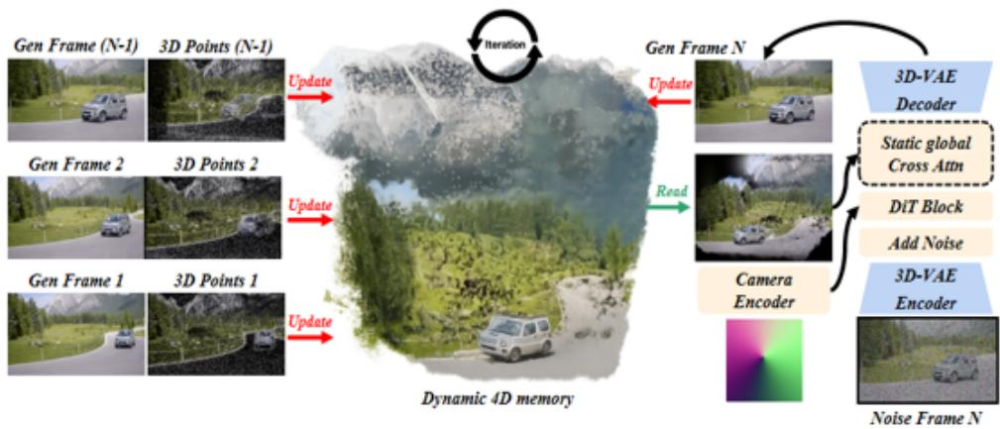
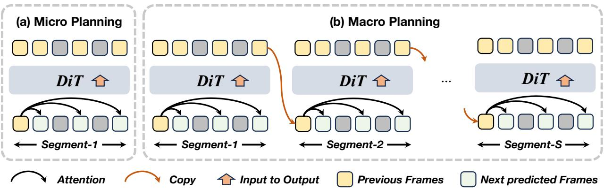
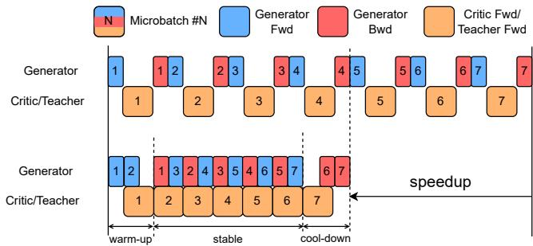
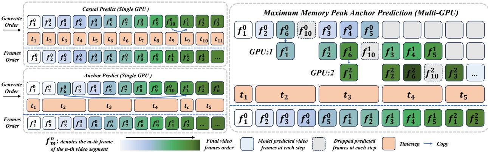

# TeleWorld：基于4D世界模型的动态多模态合成研究

电世界团队

世界模型旨在赋予人工智能系统以连贯和时间一致的方式表示、生成和与动态环境互动的能力。尽管近期的视频生成模型展示了令人印象深刻的视觉质量，但它们在实时交互、长期一致性和动态场景的持久记忆方面仍然存在局限，阻碍了其向实用世界模型的演进。在本报告中，我们提出了TeleWorld，一个实时多模态四维世界建模框架，统一了视频生成、动态场景重建和长期世界记忆于一个闭环系统。TeleWorld引入了一种新颖的生成-重建引导范式，其中生成的视频流被持续重建为动态的四维时空表示，进而指导后续生成以保持空间、时间和物理的一致性。为了支持低延迟的长期生成，我们采用了一种自回归扩散基础的视频模型，并结合了宏观-微观规划（MMPL）——一种减少从帧级到段级误差累积的分层规划方法，同时高效的分布匹配蒸馏（DMD）使得在实际计算预算下实现实时合成成为可能。我们的方法实现了动态目标建模与静态场景表示的无缝集成，推动世界模型朝着实用、交互和计算可访问的系统发展。广泛的实验表明，TeleWorld在静态和动态世界理解、长期一致性以及实时生成效率方面表现优异，使其成为朝着交互式、具备记忆的多模态生成和具身智能的世界模型实用化的重要一步。通讯作者：李学龙（xuelong li@ieee.org）

# 1 引言

对能够理解、模拟和与物理世界互动的人工智能系统的追求推动了世界建模研究的显著进展 Dinet al. (2025); Zhu et al. (2025)。最近的进展展示了世界模型的前景，强调了对世界的明确重建和实时生成是互为补充、相辅相成的能力。世界模型的核心旨在赋予人工智能系统类人感知和互动能力，使机器不仅能够观察和表征动态环境，还可以实时预测、生成并有意义地与之互动。Guo et al. (2025b); Xiao et al. (2025); Guo et al. (2025a); Zuoet al. (2025); Won et al. (2025); Wang et al. (2025c); Hu et al. (2025); Jin et al. (2025); Chen et al. (2025a)

让我们开始讨论什么是世界模型。世界模型的定义在不同的研究领域中有所不同，反映了这一新兴领域的多面性。不同的研究者有不同的解释，但一般来说，世界模型涵盖了多个相互关联的研究方向，包括但不限于视频生成、3D重建、具身人工智能和自动驾驶。从一般意义上讲，任何能够自然地表示世界并与之互动的模型都可以被视为世界模型。然而，视频生成方向已成为更受欢迎的世界模型研究领域，这得益于其高质量的任务能力（即，视频生成的结果还可以应用于具身人工智能和自动驾驶等领域），以及对用户的更大可访问性和互动性。然而，视频生成模型本身存在多个基本缺陷，阻碍其演变为更实用的世界模型。

首先，由于视频扩散模型中多步骤去噪管道的结构限制，视频生成在满足世界模型的实时生成和交互需求方面受到严重制约。其次，长期视频生成在延续较长时间的过程中仍然面临显著的时序一致性挑战。扩展的世界探索和交互往往会遭遇误差累积和质量下降的问题。第三，世界模型需要对生成的世界保留一定的记忆，这本质上是四维的——跨越空间的三维和时间的动态维度，正如人类对世界的感知一样。现有的世界模型和视频生成方法通常仅捕捉过去视频序列或三维表征中的记忆，而实现四维记忆在视频生成通往世界模型的过程中仍然是一项重大难题。最后，高质量视频生成模型通常计算成本较高，这使得以快速、高效、可持续的方式进行训练和部署，并具备实时能力，变得困难。按照视频生成方法实现的世界模型在硬件需求上对许多研究人员来说都是过于高昂的。我们将关键问题总结为：（1）建模动态四维场景：目前的世界模型主要具备三维建模能力，难以有效地建模和记忆具有完全时空一致性的动态环境。（2）确保长期一致性：在延长生成周期内保持高保真度和时序一致性依然具有挑战性，常导致色彩漂移和质量下降等问题。（3）平衡实时效率与质量：实现实时生成和高效训练是一个主要挑战，因为这需要将高模型质量与可管理的计算成本进行协调。

在本报告中，我们提出了TeleWorld，一个实用的实时4D世界模型，通过一个统一框架整合生成、重建和引导，解决了这些基本挑战。首先，我们提出了一种“生成-重建-引导”的闭环范式，在视频生成过程中使用4D时空场记录动态场景。这个重建过程与生成同步进行，在新的内容合成时不断更新世界表示。随后，4D场的渲染结果作为引导，驱动后续的生成，确保空间一致性、时间连贯性和物理合理性。这种基于重建的方法通过对生成世界的持续、一致的理解，实现了长期动态记忆。在生成阶段，我们采用了具备规划能力的自回归扩散视频生成模型。借鉴基于规划的生成方面的最新进展，我们的宏观-微观规划（MMPL）框架（Xiang等，2025）以分层方式运作：微观规划预测短视频片段中的关键锚帧，以建立局部时间连贯性，而宏观规划则自回归地将这些片段连接起来，实现长时间范围内的全局一致性。这种方法减少了从帧级到片段级的误差积累，使得在较长时间内能够进行稳定、高质量的生成。我们的video生成架构实现了更快的视频合成，同时在规划过程中更好地整合了来自4D场景的信息。

为了进一步加速视频合成，我们在 TeleWorld 的基础上采用了分布匹配蒸馏（DMD）Yin 等（2024）。虽然 DMD 对于实时视频生成至关重要，但将其应用于超过 10B 参数的自回归模型并非易事，因为这同时引入了一个大型 KV 缓存，并需要与三个超过 10B 的模型——生成器、教师和评论家——一起工作。即使使用完全分片数据并行（FSDP）Zhao 等（2023），这种组合的内存占用超出了 64 个 NVIDIA H100 GPU 的容量（Millon（2025））。为了解决这一挑战，我们提出了一种大规模分布匹配蒸馏的新训练系统。具体而言，我们将生成器、教师和评论家分配到不同的 GPU 集合中，并使用 Ray（Moritz 等（2017））协调它们的执行。此外，我们采用上下文并行性在设备之间分片生成器的 KV 缓存，大大降低了每个 GPU 的内存消耗。此外，我们精心设计了一个流水线执行调度，以最小化 GPU 的闲置时间（即流水线气泡），提高整体训练效率。通过这些优化技术，我们成功地在仅使用 32 个 H100 GPU 的情况下训练了用于 Teleworld-18B 的 DMD。这些系统级优化使得在实际计算预算下，能够以适度的训练开销实现实时视频生成。通过这些创新，TeleWorld 实现了动态物体建模与静态场景表示在一个一致的 4D 框架中的无缝集成，推动了世界模型朝着适合多模态生成和具身智能应用的实用、互动和可计算的系统迈进。我们方法的贡献可以总结如下：我们提出了一个实时的“生成-重构-引导”闭环框架，该框架能够以实时速度将世界模型中的长期记忆重构为动态点云，同时保持快速的世界更新和时间一致性。我们介绍了一种动态四维世界模型，该模型不仅提供三维空间的记忆和生成能力，还能够在场景中实现移动物体的记忆和生成，达到真正的时空一致性。我们提出了一种新颖的训练系统，解锁大规模自回归扩散模型的蒸馏训练，允许在可获取的硬件配置上高效训练，同时实现实时生成能力而不损害模型质量。TeleWorld 代表了一种全面的世界建模方法，架起了视频生成、3D 重建和持久记忆在一个统一系统中的桥梁，使其成为交互式人工智能系统和具身智能应用的实用基础。

# 2 相关工作

# 2.1 世界模型

世界模型的构成问题是当前研究者们经常讨论的一个话题。主流讨论围绕着世界模型本质上是一个可导航和交互的环境这个观点展开。因此，大部分研究集中在如何构建这样的环境。随着近年来生成模型的兴起，世界模型逐渐分为两大类：基于3D的世界模型和基于视频的世界模型。前者首先构建一个三维世界，然后为用户渲染它，而后者则通过视频生成来构建世界。 基于3D的世界模型领域中的一个显著例子是Wonderworld Yu et al. (2025)，它展示了仅凭一张2D图像就能生成交互式3D环境的能力。这突显了利用非常有限的初始数据构建可导航虚拟世界的可能性。该方法优先考虑维持空间一致性、准确的几何解读以及用户移动和行为的低延迟反馈。该领域的进步已经扩展了这些功能。例如，Matrix-3D Yang et al. (2025a) 实现了广泛的全方向3D世界创建，用户可以利用全景3D重建技术进行探索。同时，HunyuanWorld 1.0 Team et al. (2025) 通过采用语义结构化的3D网格模型，提供了完全沉浸式的 $360^{\circ}$ 环境，确保与标准计算机图形工作流程的顺畅整合。 与此同时，World Labs已进入商业领域并推出其首款产品Marble。该多模态世界模型能够从单张图像、视频片段或文本提示中创建高保真、持久的3D世界。该公司通过专注于生成可下载的持久3D环境来区分自己。

基于视频的世界模型。例如，Cosmos NVIDIA 等（2025）在机器人和自主系统的真实模拟中取得了突破性表现。同时，Genie 3 Ball 等（2025）引入了实时交互功能，允许用户生成和导航具有高度一致性的可控 3D 世界。相比之下，Hunyuan-Voyager Huang 等（2025b）通过 RGB-D 视频输出 3D 点云，Hunyuan-GameCraft2 Tang 等（2025）专为具混合历史条件的游戏视频设计，以及 Adobe 的 RELIC Hong 等（2025），采用紧凑的 KV 缓存以实现长期记忆，优先考虑显式的 3D 一致性和空间重建。基于视频的方法为动态、用户中心的应用提供了明显优势：它在运动和时间一致性方面提供了更高的感知质量，支持更直观和响应迅速的交互，得益于其逐帧生成的特性，并且能够迅速进行“冷启动”场景扩展——有效地从最小初始输入无缝“梦外”扩展。然而，目前的基于视频的世界模型主要限于处理静态 3D 环境，往往难以有效建模这些世界中的动态物体。

  
FiureStructure  TeleWorldWe propose dynami "Generation-Reconstruction-Guidance"closed-loopframeworoTee se hetohe  un nh poThe results serveas gidance to direct the current round of video generation and motion synthesi, and this proces repeats iteratively.

# 2.2 实时视频生成

近期长视频生成领域的进展主要得益于自回归扩散模型（Teng et al.，2025）。如Causvid（Yin et al.，2025）和Self-Forcing（Huang et al.，2025c）等技术被引入，以通过将每个新帧的生成基于先前生成的内容来提高训练的稳定性和时间一致性。尽管这些方法能够生成较长的序列，但它们仍然容易受到长时间跨度内的误差传播的影响，早期帧中的微小不一致会逐渐放大，从而降低视觉质量。此外，维持长时间范围的时间一致性仍然是一个基本挑战——模型常常会“遗忘”早期场景的几何形状或物体身份，导致较长生成的叙述不连贯或视觉伪影。在此背景下，实时视频生成旨在提供低延迟的交互式合成。然而，如何将此类系统扩展至高质量、高分辨率的输出，尤其是涉及如10Bplus架构等大参数模型，面临着显著的困难。此类模型的实时蒸馏尤其要求苛刻，因为它需要在不牺牲保真度的情况下压缩空间和时间知识，同时在部署过程中管理严重的计算和内存限制。尽管Millon（2025）在一个14B模型上通过动态KV缓存管理克服了这一挑战，但基本问题在不为KV缓存分片的情况下依然没有解决。这些挑战——误差积累、长期记忆衰退以及为实时使用蒸馏高质量大模型的困难——激励了TeleWorld的设计。TeleWorld并不仅仅依赖隐式神经表示或递归潜在状态，而是引入了一个显式的4D时空场，不断记录和重建不断演变的世界。这种显式表示在时间上保留几何和外观信息，有效缓解了常见的失效模式，如遗忘和不一致，同时支持高保真度的长视频生成和实时推理。此外，由于使用上下文并行性将生成器的KV缓存跨设备分片，TeleWorld-18B仅使用32个H100 GPU即可进行长视频蒸馏训练。

# 3 种方法

# 3.1 “生成-重建-引导”循环

我们引入了一种动态的“生成-重建-引导”闭环框架，用于统一的4D时空建模。该框架构建了一个实时的、原生的4D世界表示，随着每段新生成的视频片段不断更新，确保与不断演变的视觉内容完美同步。核心创新在于动态物体建模与静态场景建模之间的无缝对齐，使其在一致的空间结构中实现统一集成。在这个循环中，重建是指从生成的帧中恢复一致的4D场景表示的过程，而引导则指利用重建的4D场景和用户的键盘命令来指导下一轮视频生成。生成和重建步骤实时进行，指导与生成之间的延迟仅为最小值。这个循环过程不断更新构建的动态场景的4D时空记忆，允许通过键盘控制有效地驱动运动和交互。

  

图2 我们的宏观-微观规划框架分为两个层次：(1) 微观规划，在此阶段通过智能体传播生成帧；(2) 宏观规划，将片段通过自回归链连接——每一步的输出帧引导下一步的预测，确保长期时间一致性。如图所示，三个用绿色标记的预测帧 $\mathcal { P } _ { \mathcal { M } _ { s } } = \{ x _ { s } ^ { t _ { a } } , x _ { s } ^ { t _ { b } } , x _ { s } ^ { t _ { c } \}$ 在整个视频序列中保持记忆和稳定性。

# 3.2 长记忆自回归视频生成

# 3.2.1 微观与宏观规划

受MMPL Xiang等（2025）分析的启发，我们观察到自回归模型的误差会随着传播步骤的增加而累积，而非自回归模型通过联合优化将误差与步骤数量解耦。为利用这两种范式的互补优势，我们在我们的TeleWorld中引入了宏观-微观规划（MMPL），这是一种统一的规划方法，由两个关键组件组成：微观规划和宏观规划。微观规划。微观规划 $\mathcal { M } _ { s }$ 通过从初始帧 $x _ { s } ^ { 1 }$ 预测一组稀疏的关键帧 $\mathcal { P } _ { \mathcal { M } _ { s } } = \{ x _ { s } ^ { t _ { a } } , x _ { s } ^ { t _ { b } } , x _ { s } ^ { t _ { c } } \}$ 为第 $s$ 个段构建一个短期叙述。这些预规划帧作为后续合成的稳定锚点，时间戳设置为 $t _ { a } = 2$（早期邻接），$t _ { b } = N / 2$（中点），和 $t _ { c } = N$（段结束）。该过程的公式化如下：

$$
p ( \mathcal { P } _ { \mathcal { M } _ { s } } \mid x _ { s } ^ { 1 } ) = p ( x _ { s } ^ { t _ { a } } , x _ { s } ^ { t _ { b } } , x _ { s } ^ { t _ { c } } \mid x _ { s } ^ { 1 } ) .
$$

所有帧在仅以 $x _ { s } ^ { 1 }$ 为条件的情况下进行联合优化，这互相约束了它们的残差误差，并消除了累积漂移——与顺序自回归生成不同。这个设计确保了段内一致性，并为后续的内容填充提供了一个抗漂移的基础。宏观规划。虽然微观规划提供了段级时间故事线，但在捕捉整个视频全球依赖关系方面仍然有限。为了实现长距离一致性，我们将其扩展为宏观规划，记作 $\mathcal { M } ^ { + }$ 。这通过在各个段之间顺序链接重叠的微观计划来构建一个全球故事线：一个段的终端预规划帧初始化下一个段，形成沿视频时间线的段级自回归链。形式上，给定一段长度为 $T$ 的完整视频，将其划分为 $S$ 个段，令 $x _ { s } ^ { 1 }$ 为第 $s$ 段的初始帧。宏观规划产生的规划帧集合记作 ${ \mathcal { P } } _ { { \mathcal { M } } ^ { + } }$ 。该过程定义为

$$
p ( \mathcal P _ { \mathcal M ^ { + } } \mid \boldsymbol x _ { 1 } ^ { 1 } ) = \prod _ { s = 1 } ^ { S } p ( \mathcal P _ { \mathcal M _ { s } } \mid \boldsymbol x _ { s } ^ { 1 } ) , \quad \boldsymbol x _ { s + 1 } ^ { 1 } : = \boldsymbol x _ { s } ^ { t _ { c } } , \quad \mathcal P _ { \mathcal M ^ { + } } : = \bigcup _ { s = 1 } ^ { S } \mathcal P _ { \mathcal M _ { s } } .
$$

这里，$\mathcal { M } _ { s }$ 是段 $s$ 的微观规划。通过将段层次化连接，宏观规划将逐帧自回归依赖关系转换为稀疏的段级规划步骤序列。这确保了全球叙事的流畅性，缓解了时间漂移，并将错误积累从 $T$ 帧缩减到仅 $S$ 段，其中 $S \ll T$。这种层次化连接使世界模型能够在段之间保留长期记忆。随后，我们通过交叉段锚帧的在线4D重建来锚定这些记忆，将所有关键帧嵌入到一个连贯的时空场中。这进一步明确并稳定了段间和段内的记忆，确保其精确性和一致性。然而，当自回归地链式连接微观规划时，直接将一个段的尾部潜在变量作为下一个段的前缀，往往会由于初始和时间压缩的潜在帧之间的分布不匹配而引起边界闪烁和颜色偏移。为了稳定段间转换，我们采用了一种抗漂移的重新编码和解码策略。具体来说，我们从当前段的初始和终端规划令牌的串联中重建一个短视频剪辑。为了确保解码过程中的时间连续性，终端令牌会被复制并插入以形成一个连续的潜在序列。第二个副本的重新编码潜在变量然后作为下一个段的初始条件。有关实施细节，请参考我们之前的工作 MMPL Xiang et al. (2025)。

# 3.2.2 基于MMPL的内容填充

根据第 3.2.1 节，微计划 $\mathcal { M } _ { s }$ 将每个视频片段划分为两个子片段——例如，$\left\lfloor x _ { s } ^ { t _ { a } } , x _ { s } ^ { t _ { b } } \right\rfloor$ 和 $\lfloor x _ { s } ^ { t _ { b } } , x _ { s } ^ { t _ { c } } \rfloor$ 。在这些规划锚点的指导下，我们引入基于 MMPL 的内容填充。微计划提供三种关键帧：早期帧 $( x _ { s } ^ { t _ { a } } )$、中点帧 ($x _ { s } ^ { t _ { b } }$) 和终点帧 ($x _ { s } ^ { t _ { c } }$)。受早期基于帧的生成方法的启发，我们将内容填充分为两个顺序阶段：1. 使用初始帧和早期规划帧作为起始，中点规划帧作为结束，对第一个子片段进行填充。2. 通过将所有帧扩展到中点作为新的起始，终点帧作为结束，从而生成其余内容。这个过程可以正式表示为：

$$
p ( \mathcal { C } _ { s } \mid \mathcal { P } _ { \mathcal { M } _ { s } } ) = p \big ( x _ { s } ^ { t _ { a } + 1 : t _ { b } - 1 } \mid x _ { s } ^ { 1 : t _ { a } } , x _ { s } ^ { t _ { b } } \big ) \cdot p \big ( x _ { s } ^ { t _ { b } + 1 : t _ { c } - 1 } \mid x _ { s } ^ { 1 : t _ { b } } , x _ { s } ^ { t _ { c } } \big ) ,
$$

在这里，$\mathit { \Delta } \mathit { \mathcal { C } } _ { s }$表示一个$s$，而$x _ { s } ^ { t _ { a } }$、$x _ { s } ^ { t _ { b } }$和$x _ { s } ^ { t _ { c } }$代表其对应的内容，$x _ { s } ^ { 1 : t _ { a } }$和$x _ { s } ^ { 1 : t _ { b } }$表明每个子段的生成都依赖于该段内所有前置帧以及其边界信息。$x _ { s } ^ { t _ { a } + 1 : t _ { b } - 1 }$和$x _ { s } ^ { t _ { b } + 1 : t _ { c } - 1 }$对应待填充的内容。重要的是，方程3中的因式分解表明，每个子段内的内容填充仅依赖于其对应的规划帧。这使多个子段在其内部规划帧准备就绪后能够并行优化。通过在多个GPU上分布分段优化，所提出的基于MMPL的内容填充能够实现并发执行，显著加速长视频的合成。

# 3.3 实时四维重建

# 3.3.1 关键帧重建

如引言中所述，我们提出了一种实时4D重建模块，以进一步提供场景中移动物体的动态记忆。考虑到MMPL架构中的规划策略，我们的重建过程也同步遵循宏观规划。重建任务沿着宏观结构持续向后推进，使重建速度能够紧密跟随生成过程。同时，微观规划使用在相应操作下重建的渲染结果作为指导。通过这种方式，重建的开销被最小化，重建的输入保持尽可能稀疏，从而防止在长序列中由于扩展世界生成导致重建任务的失败。我们将这种方法称为关键帧重建。Sl $\mathcal{P}_{\mathcal{M}_{s}} = \{ x_{s}^{t_{a}}, x_{s}^{t_{b}}, x_{s}^{t_{c}} \}$ 需要进行4D重建。这些规划帧本质上在视频中充当锚点——它们首先以最小的误差和最高的质量生成，并确定视频的运动轨迹。使用它们进行4D重建也为世界模型中的长视频生成任务引入了足够丰富的记录。每个视频片段的开始、中间和结尾将用于在4D时空场中记录信息。在内容填充过程中，中间的运动将根据这些记录的线索进行填充。

# 3.3.2 移动物体分割

受到4D-VGGT Wang等人（2025b）的启发，我们利用其动态显著性图作为动态掩码。为了聚合时间信息，我们采用跨帧的帧间滑动窗口策略，定义为 $\mathcal { W } ( t ) = \{ t - n , \ldots , t - 1 , t + 1 , \ldots , t + n \}$。在这个窗口内，涵盖三个层集 $L$ ，包括一个 $( i , j )$。$w$ 浅层捕获语义显著性，$w _ { \mathrm { m i d d l e } }$ 反映运动不稳定性，而 $w _ { \mathrm { d e e p } }$ 提供空间先验以抑制离群点。最终，通过阈值处理获得每帧动态掩码：$M _ { t } = \mathrm { | D y n } > \alpha \mathrm { | }$，随后进行特征聚类以进行精细化。在我们的框架中，还进行了网络级别的早期掩码策略以支持4D重建和叠加。静态场景元素被合并并逐步扩展，而稀疏的动态组件则随时间分别呈现。然而，由于我们的输入仅限于预规划帧 $\mathcal { P } _ { \mathcal { M } _ { s } } = \{ x _ { s } ^ { t _ { a } } , x _ { s } ^ { t _ { b } } , x _ { s } ^ { t _ { c } } \}$，渲染的动态内容依然十分稀疏。这要求基于预规划序列中的早期帧预测后续动态区域——这是我们通过视频生成中的宏观规划来应对的挑战。从宏观角度来看，平滑的连续运动被分解为嵌入在场景中的类似关键帧的动态片段。具体而言，遵循4D-VGGT Wang等人（2025b），为了减轻动态像素引入的几何不一致性，我们还仅在浅层和中层（第1~5层）中通过抑制其关键（K）向量来掩盖动态图像标记。

# 3.4 指导原则

# 3.4.1 键盘控制

随着Mao等人（2025）、Tang等人（2025）、Hong等人（2025）对世界模型中键盘控制的广泛采用，我们也利用四个WASD键以及方向键来模拟运动和视角变化，如下所示。这些输入相应地映射到相机姿态。这些信号被条件化以引导模型的生成。我们将这些控制映射为沿输入帧深度比例的相机运动。→ : 相机向右转（→）。← : 相机向左转（←）。↑ : 相机向上倾斜（↑）。 视角 ↓ : 相机向下倾斜（↓）。 变化 = → : 相机向上倾斜并向右转 $( \uparrow \to )$ 。 $\downarrow $ : 相机向下倾斜并向右转（$( \downarrow )$ ）。 ↓← : 相机向下倾斜并向左转 $( \downarrow )$ 。 · : 相机保持静止（·）。 W : 相机向前移动（W）。 A : 相机向左移动（A）。 S : 相机向后移动（S）。 D : 相机向右移动（D）。 运动 W $^ { \prime } { + } \mathrm { D }$ : 相机向前和右移动（W+D）。 $\mathrm { S } { + } \mathrm { D }$ : 相机向后和右移动（S+D）。 $\mathrm { S } { + } \mathrm { A }$ : 相机向后和左移动（S+A）。 无 : 相机保持静止（·）。此外，为了尽可能增强视频生成的连贯性和一致性，我们努力避免保持静态相机位置。因此，即使用户未提供任何键盘输入，相机姿态也会以非常缓慢的速度向前漂移——我们称之为待机动画。

# 3.4.2 视图条件引导

随后，我们需要对处理后的键盘输入进行编码，以便用于世界模型网络。如在 ReCamMaster 中讨论的，通过帧维度的条件化是一种将目标相机姿态集成到 DiT 网络中的更有效的方法。基于这一见解，我们采用了类似的结构，并将以下机制纳入 TeleWorld 的 DiT 网络中：为了更好地与键盘引导视频实现同步和内容一致性，我们建议沿帧维度将引导视频的词元与目标视频的词元进行级联：

$$
\left\{ \begin{array} { l } { x _ { s } = \mathrm { p a t c h i f y } \left( z _ { s } \right) , \quad x _ { t } = \mathrm { p a t c h i f y } \left( z _ { t } \right) , } \\ { x _ { i } = \left[ x _ { s } , x _ { t } \right] _ { \mathrm { f r a m e - d i m } } , } \end{array} \right.
$$

其中 $x _ { i } \in \mathbb { R } ^ { b \times 2 f \times s \times d }$ 是扩散变换器的输入。换句话说，与传统的视频生成过程相比，输入的标记数量翻倍。此外，由于 3D 自注意力本身能够处理所有标记，因此不需要额外的注意力层进行跨视频聚合。

# 3.5 分布匹配蒸馏

我们的方法与现有的分布匹配蒸馏（DMD）框架无缝集成，无需任何架构修改。具体来说，MMPL 视频生成管道在训练和推理过程中调整注意力可见范围和预测顺序。在标准自强管道的基础上，DMD 可以直接应用于 MMPL，并在 TeleWorld 框架内部署。当与并行解码相结合时，所生成的系统提供了显著的推理加速，在 TeleWorld-1.3B 模型上实现了超过 32 FPS 的持续吞吐量，而在 TeleWorld-18B 模型上为 8 FPS，均在 NVIDIA H100 GPU 上评估。尽管 DMD 对于实时视频生成至关重要，但它对训练基础设施带来了重大挑战，尤其是在应用于我们的 18B 模型时。训练设置需要同时协调三个扩散模型——自回归生成器、评论者和教师——使得在单个 80GB HBM GPU 中托管所有组件变得不可行。为了解决这一限制，我们采用 Ray, Moritz 等人（2017）将模型权重分配到多个 GPU。此外，利用 TeleTron 提供的 Ulysses 序列并行能力，我们在 GPU 之间分片生成器的 KV 缓存，使其能够适应内存限制。

为了缓解由于模型并行性导致的GPU资源利用不足，我们设计了一种新颖的管道训练计划，重叠生成器、判别器和教师模型的计算，从而最小化GPU空闲时间（即管道气泡）。生成器和判别器步骤的执行计划如图3所示。对于生成器步骤，允许图中所示的重叠程度需要通过显式资源分配，仔细匹配生成器前向和后向阶段的组合执行时间与判别器/教师阶段的时间。在实践中，我们发现生成器:判别器:教师的GPU比例为4:1:1可实现近乎完美的重叠。此外，为了简化DMD优化并确保阶段持续时间的可预测性，我们在训练期间固定生成器管道中的去噪步骤数量，而不是随机抽样。我们注意到必须维护两个KV缓存的副本以支持正确的反向传播；然而，由于KV缓存已经在设备之间通过上下文并行分片，因此这一开销是可以管理的。因此，我们的管道系统实现了与非管道基线相比约50%的端到端训练加速。综合来看，高效的KV缓存分片、模型并行性和管道执行使我们的训练系统能够自然扩展到未来具有大幅更大参数量的自回归扩散模型。

# 3.6 在线视频超分辨率的流式和定时生成

# 3.6.1 定时生成

尽管不同分段的内容填充可以并行化（第3.2.2节），但一个关键的限制仍然存在：在所有分段的规划帧完全生成之前，无法开始并行执行，这导致不可避免的前缀延迟，从而降低了总体吞吐量。

  
(a) Pipeline execution schedule for generator steps.

  
(b) Pipeline execution schedule for critic steps.   
Figure 3 Pipeline execution schedules for Distribution-Matching Distillation. (a) Generator-step pipeline with7 mtc e The ork  h together r siplicity, and ther ce leng denotes the aximumof the execuion timeThe upper hal  the us the on-pipel asee whiuc o  G bb Uitime.Thewe our proposed pipeline schedule. In the stable phase, the generator backward stage of micro-batch $_ i$ and the generator forward stage of micro-batch $i + 2$ are executed concurrently with the critic/teacher forward stage of micro-batch $i + 1$ . The execution time of all stages are carefully balanced by allocating appropriate numbers of GPUs to each coponent, eabli near-perverap.Thismethomiiiz GUbubbles nd achieve ent paralan o e the eerator parameer maozdurnthe cpdate the pipel olow smpr proucconsme execution pattern.

为了解决这个问题，我们引入了一种自适应工作负载调度策略，该策略动态地安排微规划、宏规划和内容填充的执行顺序，以最大化并行性。由于宏规划形成了一种自回归链，其由段级微规划构成，因此规划帧在各个段之间顺序生成。这允许较早段的内容填充一旦其自身的规划帧准备就绪，即可开始，而无需等待后续段的完成。举例来说，当 $t _ { a } = 2$ 、$t _ { b } = 6$ 和 $t _ { c } = 10$ 时，当前段的规划帧 $x _ { s } ^ { t _ { c } }$ 立即作为下一个段的初始帧 $x _ { s + 1 } ^ { 1 }$。因此，下一个段可以开始其 M P hiheu e latntee $x _ { s } ^ { t _ { a } + 1 : t _ { b } - 1 }$)。这种阶段性独立性自然促进了段间的并行生成，具体在公式 (4) 中进行了正式表达：

$$
\begin{array} { r l } & { \mathrm { S e g m e n t ~ s } \cdot \qquad x _ { s } ^ { t _ { a } + 1 : t _ { b } - 1 } \sim p _ { \theta } ( x \mid x _ { s } ^ { 1 } , x _ { s } ^ { t _ { a } } , x _ { s } ^ { t _ { b } } ) , } \\ & { \mathrm { S e g m e n t ~ s } + 1 ; \quad \{ x _ { s + 1 } ^ { t _ { a } } , x _ { s + 1 } ^ { t _ { b } } , x _ { s + 1 } ^ { t _ { c } } \} \sim p _ { \theta } ( x \mid x _ { s + 1 } ^ { 1 } ) , \quad x _ { s + 1 } ^ { 1 } \in \{ x _ { s } ^ { t _ { b } } , x _ { s } ^ { t _ { c } } \} . } \end{array}
$$

在此，下一个段的初始帧 $x _ { s + 1 } ^ { 1 }$ 可以选择为 $x _ { s } ^ { t _ { b } }$ 或 $x _ { s } ^ { t _ { c } }$ 。为了保持实时生成的实用性，我们选择最大吞吐量预测，如下所示：

为了尽可能减少延迟，我们采用了最小内存峰值预测策略。当 $x _ { s } ^ { t _ { b } }$ 被用作 $x _ { \mathrm { s + 1 } } ^ { 1 }$ 时，介于 $x ^ { t _ { b } + 1 } : x ^ { t _ { c } - 1 }$ 之间的中间帧会被跳过，从而绕过具有最深时间上下文和最高生成延迟的区域。此模式最小化了峰值内存使用，并降低了每段的延迟，但在段之间引入了帧重用，略微降低了总体吞吐量。如图4所示，$f _ { 4 } ^ { 0 }$ 和 $f _ { 6 } ^ { 1 }$ 实际上是同步生成的。这意味着任何直接用户输入引发的变化将在一秒钟后生成。因此，目前观察到的世界输出对应于用户输入一秒钟前捕获的预缓冲变化。

# 3.6.2 流式变分自编码器

为了实现实时视频生成以进行直播，我们设计了一种基于 StreamDiffusionV2 原则的可流式传输变分自编码器（VAE）。在直播环境中，核心挑战是最小化首帧的延迟并确保连续、低延迟的输出，这与处理长序列的批量视频生成根本不同。我们的 Stream-VAE 是一种低延迟的视频变分自编码器变体，专门优化用于流式推理。它并不是一次编码整个视频序列，而是对短的、连续的视频片段进行处理——在我们的实现中通常为 4 帧。这种分块处理对于保持稳定的输出流至关重要。

  
Figure 4 Multi-GPU parallel inference via adaptive workload scheduling. Given the initial frame $f _ { 1 } ^ { 0 }$ , segment 0 first generates its planning frames $f _ { 2 } ^ { 0 }$ , $f _ { 6 } ^ { 0 }$ , and $f _ { 1 0 } ^ { 0 }$ . These planning frames then guide the content population of the intermediate frames $f _ { 3 } ^ { 0 }$ , $f _ { 4 } ^ { 0 }$ , and $f _ { 5 } ^ { 0 }$ . While segment 0 is still populating these frames, segment 1 can immediately start its Micro Planning by taking $f _ { 1 0 } ^ { 0 }$ as the initial frame $f _ { 1 } ^ { 1 }$ and generating its own planning frames $f _ { 2 } ^ { 1 }$ , $f _ { 6 } ^ { 1 }$ , and $f _ { 1 0 } ^ { 1 }$ . This staged execution enables overlapping planning and populating across segments, maximizing multi-GPU parallelism. Here, each $t _ { i }$ denotes an inference step in the diffusion sampling process.

Stream-VAE的架构在其3D卷积层中纳入了中间特征的战略性缓存。当每个新的帧块输入模型时，网络会重用从先前帧块中计算出的相关时间特征，从而在帧块边界之间保持时间一致性，而无需重新编码较长历史。这一设计显著减少了冗余计算和内存开销，从而实现高效的增量编码和解码。通过将Stream-VAE集成到我们的流水线中，我们确保视频的潜在表示被生成并能够以最小延迟传递给用户，形成我们实时流系统的基础阶段。

# 3.6.3 视频超分辨率

为了后续的视频质量增强，我们结合了一个受 FlashVSR 启发的流式超分辨率模块。该组件负责将解码后的潜变量实时地放大为高分辨率视频帧。我们从 FlashVSR 采用的一个关键创新是其局部约束稀疏注意机制。该机制将自注意力操作限制在局部时空窗口内，显著降低了通常困扰视频超分辨率模型的计算复杂度。它有效地弥补了训练和推理之间常遇到的分辨率差距，而不牺牲细节的质量。此外，我们利用了 FlashVSR 的轻量级条件解码器，该解码器专为快速特征重构而设计。解码器在上采样过程中以 StreamVAE 的输出提取特征为条件，从而确保高保真度结果，同时保持低计算成本。关键是，这个超分辨率模块被设计为与我们的 Stream-VAE 完全流式地协同工作。它处理与 VAE 输出流对齐的短视频片段（例如，5 帧），并在每个片段可用时逐步应用超分辨率。这个集成的按块处理管道使我们的模型能够在 960 $\times$ 1760 分辨率的视频上以约 17 帧每秒的速度实现超分辨率解码，确保高质量实时视频生成变得可行。总之，通过整合定时生成、流式 VAE 和视频超分辨率技术，我们的系统使 TeleWorld-18B 模型实现了稳定的 8 帧每秒性能，并在四块 NVIDIA H100 GPU 的设置下生成高质量的 960 $\times$ 1760 视频。

# 4 实验与讨论

# 4.1 多模态数据集准备

我们在这里介绍数据集。为了支持大规模训练和统一评估，我们构建了TeleWorld-500K，这是一个针对可控相机和动态4D标注视频的精心策划的数据集。TeleWorld-500K通过两个流程构建。

# 4.1.1 策展流程

(1) 数据收集。我们通过结合系统化的网络抓取与选择性手动收集的方法，组建了一个大规模的真实世界视频剪辑库。数据来源包括YouTube、Pexels、Pixabay、Mixkit和Bilibili等主要公共平台，以确保广泛涵盖多样化的视觉内容和场景。(2) 自动化质量过滤。在初步池中，我们应用了多阶段的自动化过滤管道以消除低质量内容。使用LAION美学评分器保留美学评分高于6的剪辑，PaddleOCR Liao等（2022）则检测并移除包含显著叠加文本、水印或字幕的视频。此外，极短、损坏或视觉不一致的剪辑也被自动丢弃，以保持整体数据集的完整性。(3) 动态感知选择。为了确保数据集包含适合可控摄像机和物体建模的有意义动态，我们进行了基于运动的过滤。使用TTT3R Chen等（2025b），我们估计每个剪辑的摄像机运动，并排除视点变化微乎其微的序列。此外，为了保留具有显著前景物体运动的视频，视觉-语言模型Qwen-2.5-VL-72B Bai等（2025）分析了每个剪辑，并过滤掉没有可检测移动主体的内容。(4) 专家评审与数据集最终定稿。剩余的剪辑经过二十位领域专家的仔细人工检查，总计690人小时，以去除任何残余的低质量或不合适内容。这一精心的策展工作形成了最终的TeleWorld-500K数据集，包含50万个高质量视频剪辑，展示了多样的真实世界环境、明显的摄像机运动和丰富的动态交互，为训练世界模型提供了坚实的基础。

# 4.1.2 注释流程

(1) 动态物体分割。为了对移动物体进行标注，我们首先采用了Huang等人（2025a）提出的“视频中任意运动分割”技术，该方法以视频作为输入并预测所有移动前景物体的掩膜。它在第一帧上为每个不同的物体提供初始掩膜，并分配独特的颜色以保持跨帧的一致身份标记。 (2) 摄像机轨迹标注。使用第一帧的物体掩膜作为初始化，我们采用了Wang等人（2025b）提出的4D-VGGT来恢复稠密的运动与摄像机标注。4D-VGGT是一个统一的摄像机轨迹标注框架，能够以端到端的方式联合估计点云、深度图、摄像机内参和摄像机姿态。对于每个视频，它重构移动物体的三维轨迹，并估计每帧的摄像机姿态。 (3) 语义描述生成。为了生成精确的文本描述，我们采用了大型视觉语言模型Qwen-2.5-VL-72B（Bai等人，2025）来生成文本注释，描述移动物体和摄像机运动的外观以及整体场景上下文。这些标题补充了移动物体的三维轨迹，提供与场景级动态对应的全面语义信息。

# 4.2 WorldScore 基准测试

本节评估TeleWorld在WorldScore基准测试中的表现，该基准由Duan等人（2025）提出，目前是衡量“世界生成”能力最全面的协议之一。与主要评估局部视觉质量的图像或短视频基准不同，WorldScore评估模型是否能在不同视点、场景转换和时间演进中构建和保持一致的世界。该基准关注沉浸感、感知质量和运动行为。本节中的所有结果均来自官方WorldScore排行榜，以确保可比性。WorldScore评估由两个主要聚合维度组成。首先，WorldScore-Static衡量生成的世界在相机穿越多个视点时是否保持稳定和连贯。这侧重于空间保真度、布局保持和跨视图语义一致性。其次，WorldScore-Dynamic衡量世界随时间的演变，包括物体运动、场景变化和时间稳定性。该维度评估模型是否生成连贯、语义上有依据且与基础世界结构一致的运动模式。官方评估流程计算一系列子指标，并将它们整合为两个最终聚合分数。WorldScore报告了12个指标。相机控制、物体控制和内容对齐衡量可控性。它们共同描述模型在多大程度上遵循布局约束、保持所需实体并响应语义指令。三维一致性、光度一致性、风格一致性和主观质量衡量结构和感知稳定性。这些指标反映模型在几何体、一致性、照明和美学方面的稳定性。运动准确性、运动幅度和运动平滑性衡量动态行为，捕捉时间真实性、运动幅度适宜性和连续性。这些指标共同构成静态世界结构和动态世界演变的综合评估。表1 在WorldScore基准上的定量比较。我们报告静态和动态世界生成的排行榜分数（WorldScore-Static/Dynamic）以及相应的可控性和一致性指标（相机控制、物体控制、内容对齐、三维/光度/风格一致性和主观质量）。

<table><tr><td>Model Name</td><td>WS-Static</td><td>WS-Dynamic</td><td>CamCtrl</td><td>ObjCtrl</td><td>ContAlign</td><td>3DCons</td><td>PhotoCons</td><td>StyleCons</td><td>SubjQual</td></tr><tr><td>TeleWorld</td><td>78.23</td><td>66.73</td><td>76.58</td><td>74.44</td><td>73.20</td><td>87.35</td><td>88.82</td><td>85.59</td><td>61.66</td></tr><tr><td>Voyager Huang et al. (2025b)</td><td>77.62</td><td>54.53</td><td>85.95</td><td>66.92</td><td>68.92</td><td>81.56</td><td>85.99</td><td>84.89</td><td>71.09</td></tr><tr><td>WonderWorld Yu et al. (2025)</td><td>72.69</td><td>50.88</td><td>92.98</td><td>51.76</td><td>71.25</td><td>86.87</td><td>85.56</td><td>70.57</td><td>49.81</td></tr><tr><td>LucidDreamer Chung et al. (2023)</td><td>70.40</td><td>49.28</td><td>88.93</td><td>41.18</td><td>75.00</td><td>90.37</td><td>90.20</td><td>48.10</td><td>58.99</td></tr><tr><td>WonderJourney Yu et al. (2023)</td><td>63.75</td><td>44.63</td><td>84.60</td><td>37.10</td><td>35.54</td><td>80.60</td><td>79.03</td><td>62.82</td><td>66.56</td></tr><tr><td>CogVideoX-I2V Yang et al. (2025b)</td><td>62.15</td><td>59.12</td><td>38.27</td><td>40.07</td><td>36.73</td><td>86.21</td><td>88.12</td><td>83.22</td><td>62.44</td></tr><tr><td>Text2Room Höllein et al. (2023)</td><td>62.10</td><td>43.47</td><td>94.01</td><td>38.93</td><td>50.79</td><td>88.71</td><td>88.36</td><td>37.23</td><td>36.69</td></tr><tr><td>InvisibleStitch Engstler et al. (2025)</td><td>61.12</td><td>42.78</td><td>93.20</td><td>36.51</td><td>29.53</td><td>88.51</td><td>89.19</td><td>32.37</td><td>58.50</td></tr><tr><td>Gen-3Runway (2024)</td><td>60.71</td><td>57.58</td><td>29.47</td><td>62.92</td><td>50.49</td><td>68.31</td><td>87.09</td><td>62.82</td><td>63.85</td></tr><tr><td>Wan2.1 Wang et al. (2025a)</td><td>57.56</td><td>52.85</td><td>23.53</td><td>40.32</td><td>45.44</td><td>78.74</td><td>78.36</td><td>77.18</td><td>59.38</td></tr><tr><td>Hailuo HailuoAI (2024)</td><td>57.55</td><td>56.36</td><td>22.39</td><td>69.56</td><td>73.53</td><td>67.18</td><td>62.82</td><td>54.91</td><td>52.44</td></tr><tr><td>LTX-Video HaCohen et al. (2024)</td><td>55.44</td><td>56.54</td><td>25.06</td><td>53.41</td><td>39.73</td><td>78.41</td><td>88.92</td><td>53.50</td><td>49.08</td></tr><tr><td>Allegro Zhou et al. (2024)</td><td>55.31</td><td>51.97</td><td>24.84</td><td>57.47</td><td>51.48</td><td>70.50</td><td>69.89</td><td>65.60</td><td>47.41</td></tr><tr><td>CogVideoX-T2V Yang et al. (2025b)</td><td>54.18</td><td>48.79</td><td>40.22</td><td>51.05</td><td>68.12</td><td>68.81</td><td>64.20</td><td>42.19</td><td>44.67</td></tr><tr><td>EasyAnimate Xu et al. (2024)</td><td>52.85</td><td>51.65</td><td>26.72</td><td>54.50</td><td>50.76</td><td>67.29</td><td>47.35</td><td>73.05</td><td>50.31</td></tr><tr><td>VideoCrafter2 Chen et al. (2023)</td><td>52.57</td><td>47.49</td><td>28.92</td><td>39.07</td><td>72.46</td><td>65.14</td><td>61.85</td><td>43.79</td><td>56.74</td></tr><tr><td>DynamiCrafter Xing et al. (2023)</td><td>52.09</td><td>47.19</td><td>25.15</td><td>47.36</td><td>25.00</td><td>72.90</td><td>60.95</td><td>78.85</td><td>54.40</td></tr><tr><td>SceneScape Fridman et al. (2024)</td><td>50.73</td><td>35.51</td><td>84.99</td><td>47.44</td><td>28.64</td><td>76.54</td><td>62.88</td><td>21.85</td><td>32.75</td></tr><tr><td>VideoCrafter1-I2V Chen et al. (2023)</td><td>50.47</td><td>47.64</td><td>25.46</td><td>24.25</td><td>35.27</td><td>74.42</td><td>73.89</td><td>65.17</td><td>54.85</td></tr><tr><td>VideoCrafter1-T2V Chen et al. (2023)</td><td>47.10</td><td>43.54</td><td>21.61</td><td>50.44</td><td>60.78</td><td>64.86</td><td>51.36</td><td>38.05</td><td>42.63</td></tr><tr><td>T2V-Turbo Li et al. (2024)</td><td>45.65</td><td>40.20</td><td>27.80</td><td>30.68</td><td>69.14</td><td>38.72</td><td>34.84</td><td>49.65</td><td>68.74</td></tr><tr><td>Vchitect-2.0 Fan et al. (2025)</td><td>42.28</td><td>38.47</td><td>26.55</td><td>49.54</td><td>65.75</td><td>41.53</td><td>42.30</td><td>25.69</td><td>44.58</td></tr><tr><td>4D-fy Bahmani et al. (2024)</td><td>27.98</td><td>32.10</td><td>69.92</td><td>55.09</td><td>0.85</td><td>35.47</td><td>1.59</td><td>32.04</td><td>0.89</td></tr></table>

# 4.2.1 定量结果：

我们将TeleWorld与23个基线模型进行了比较，涵盖了3D、4D和基于视频的方法。这些基线包括3D世界生成器，如Voyager Huang等（2025b）、WonderWorld Yu等（2025）、LucidDreamer Chung等（2023）、WonderJourney Yu等（2023）、Text2Room Hölein等（2023）、InvisibleStitch Engstler等（2025）和SceneScape Fridman等（2024）；4D导向系统，如4Dfy Bahmani等（2024）；以及一系列图像到视频和文本到视频系统，包括Gen-3 Runway（2024）、Wan2.1 Wang等（2025a）、Hailuo HailuoAI（2024）、LTX-Video HaCohen等（2024）、Allegro Zhou等（2024）、CogVideoX Yang等（2025b）、EasyAnimate Xu等（2024）、DynamiCrafter Xing等（2023）、VideoCrafter Chen等（2023）、T2V-Turbo Li等（2024）和Vchitect Fan等（2025）。所有比较模型均在相同的协议下进行评估。TeleWorld在未专门针对WorldScore基准的单次生成设置下，在视频和I2V配置下进行测试。TeleWorld在总体指标上取得了最佳性能，WorldScore-Static得分为78.23，WorldScore-Dynamic得分为66.73。下一个最佳模型在静态设置下的得分为77.62（Voyager Huang等（2025b））以及在动态设置下的得分为59.12（CogVideoX-I2V Yang等（2025b））。因此，TeleWorld在静态世界生成上超越了最强基线0.61分，在动态世界生成上超越了7.61分。静态性能的相对小幅度差距表明，TeleWorld在时间推理、运动建模和世界稳定性方面具有明显优势。值得注意的是，TeleWorld是唯一在静态和动态轨道中同时排名第一的方法，这表明它在优化某一操作模式时并未牺牲另一种模式。在可控性方面，TeleWorld在相机控制（76.58）、对象控制（74.44，所有系统中最佳）和内容对齐（73.20）方面均表现出平衡的得分。这表明它尊重多模态用户约束，而并非专注于单一维度。尤其是在对象控制得分方面，TeleWorld表明其维护了一个隐含的、持久的世界状态，能够在长序列中保持对象的身份和排列，这与其闭环生成-重建设计一致。TeleWorld在结构和感知一致性方面表现优异，得分分别为87.35（3D一致性）、88.82（光度一致性）、85.59（风格一致性）和61.66（主观质量）。这些结果反映生成内容表现得就像一个连贯的内部4D表示的投影——与我们框架捕捉和强制全球时空结构的能力一致，同时保持视觉保真度。动态性能进一步增强了TeleWorld的优势。其WorldScore-Dynamic为66.73，分解为较强的运动准确性（53.94）、适中的运动幅度（31.5）和较高的运动平滑性（34.18）。这一特征表明运动是合理的、良好调节的，并且没有时间上的不连续性——避免了基线系统中常见的运动不足或不稳定状态。这种稳定性源于TeleWorld使用学习到的内部状态来指导时间演变，而不是局部近似变化。跨范式分析显示，TeleWorld弥补了一个关键的能力空白：它匹配了3D系统的结构一致性，同时保留了视频模型的条件灵活性，并且在避免视频模型常见的语义漂移和世界崩塌的情况下，其视觉质量与视频模型相抗衡。这使得TeleWorld在一个之前困难的领域中占据了一席之地——结构化基础、灵活条件和时空稳定生成——支持其作为朝向交互式、记忆增强世界模型的实际步骤的角色。总而言之，实证证据表明，TeleWorld提供了平衡、稳定且可扩展的世界生成能力。它并不依赖于极端的指标优化或单轴专业化，而是展示了一个统一模型能够对可控性、一致性、感知保真度和动态行为进行联合优化。动态得分的提升，加上结构和语义稳定性，表明TeleWorld特别适合长时间跨度和多条件的生成任务。这些结果将TeleWorld确立为未来涉及长距离视频合成、可控仿真、交互环境以及需要连贯时空演变而非孤立视觉质量的世界建模任务的强有力候选者。

# 5 结论

总之，TeleWorld 是一个拥有 18B 参数的模型，能够以 8 FPS 的速度实时生成高分辨率视频（960 × 1760），在 WorldScores 基准测试中排名第一。它引入了一种新颖的生成-重建-引导闭环，为 4D 时空世界建模提供了一种新的解决方案框架。该模型能够生成长时间、时空一致的 4D 场景视频，同时保持持久的 4D 记忆，为后续的世界模型研究提供了有价值的参考。为了进一步加速场景视频的生成，我们提出了一个可扩展且高效的训练系统，使分布匹配蒸馏（Distribution Matching Distillation）在大规模自回归视频生成模型中变得可行。通过在专用 GPU 群组中解耦生成器、教师和评论器，利用上下文并行化对生成器 KV 缓存进行分片，及引入精心平衡的流水线执行调度，我们的系统克服了在 10B 规模及以上应用 DMD 时的高内存和效率障碍。这些系统级优化使得在有限的 GPU 预算下进行 TeleWorld-18B 的 DMD 训练成为可能，同时保持高硬件利用率。总之，我们的方法弥合了最先进的蒸馏技术与大规模视频扩散模型之间的鸿沟，在实际计算限制下实现实时长时域视频合成。

# 贡献者

项目负责人：黄海宾，张驰，李雪龙 核心贡献者：陈雅博，梁远志，王杰朋 贡献者（按字母顺序列出）：周成成，刘光策，王皓源，刘佳伦，程俊飞，刘俊奇，周俊宇，翁其珍，张世文，李天，陈廷熙，李伟，李伟琛，杨晓燕，张鑫，吴萱儿，向寻智，黄宇扬，姜自晨，顾子霄，李作信

# References

Bahmani, Sherwin, Skorokhodov, Ivan, Rong, Victor, Wetzstein, Gordon, Guibas, Leonidas, Wonka, Peter, Tulyakov, Sergey, Park, Jeong Joon, Tagliasacchi, Andrea, & Lindell, David B. 2024. 4D-FY: Text-to-4D Generation Using Hybrid Score Distillation Sampling. Pages 7996-8006 of: Proceedings of the IEEE/CVF Conference on Computer Vision and Pattern Recognition.

Bai, Shuai, Chen, Keqin, Liu, Xuejing, Wang, Jialin, Ge, Wenbin, Song, Sibo, Dang, Kai, Wang, Peng. Wang, Shijie, Tang, Jun, et al. 2025. Qwen2. 5-vl technical report. arXiv preprint arXiv:2502.13923.

Ball Philip J., Bauer, Jakob, Belletti, Frank, Brownfield, Bethanie, Ephrat, Ariel, Fruchter, Shlomi, Gupta, Agrim, Holsheimer, Kristian, Holynski, Aleksander, Hron, Jiri, Kaplanis, Christos, Limont, Marjorie, McGill, Matt, Oliveira, Yanko, Parker-Holder, Jack, Perbet, Frank, Scully, Guy, Shar, Jeremy, Spencer, Stephen, Tov, Omer, Villegas, Ruben, Wang, Emma, Yung, Jessica, Baetu, Cip, Berbel, Jordi, Bridson, David, Bruce, Jake, Buttimore, Gavin, Chakera, Sarah, Chandra, Bilva, Collins, Paul, Cullum, Alex, Damoc, Bogdan, Dasagi, Vibha, Gazeau, Maxime, Gbadamosi, Charles, Han, Woohyun, Hirst, Ed, Kachra, Ashyana, Kerley, Lucie, Kjems, Kristian, Knoepfel, Eva, Koriakin, Vika, Lo, Jessica, Lu, Cong, Mehring, Zeb, Moufarek, Alex, Nandwani, Henna, Oliveira, Valeria, Pardo, Fabio, Park, Jane, Pierson, Andrew, Poole, Ben, Ran, Helen, Salimans, Tim, Sanchez, Manuel, Saprykin, Igor, Shen, Amy, Sidhwani, Sailesh, Smith, Duncan, Stanton, Joe, Tomlinson, Hamish, Vijaykumar, Dimple, Wang, Luyu, Wingfield, Piers, Wong, Nat, Xu, Keyang, Yew, Christopher, Young, Nick, Zubov, Vadim, Eck, Douglas, Erhan, Dumitru, Kavukcuoglu, Koray, Hassabis, Demis, Gharamani, Zoubin, Hadsell, Raia, van den Oord, Aäron, Mosseri, Inbar, Bolton, Adrian, Singh, Satinder, & Rocktäschel, Tim. 2025. Genie 3: A New Frontier for World Models.

Chen, Anthony, Zheng, Wenzhao, Wang, Yida, Zhang, Xueyang, Zhan, Kun, Jia, Peng, Keutzer, Kurt, & Zhang, Shanghang. 2025a. GeoDrive: 3D Geometry-Informed Driving World Model with Precise Action Control.

Chen, Haoxin, Xia, Menghan, He, Yingqing, Zhang, Yong, Cun, Xiaodong, Yang, Shaoshu, Xing, Jinbo, Liu Yaofang, Chen, Qifeng, Wang, Xintao, Weng, Chao, & Shan, Ying. 2023. VideoCrafter1: Open Diffusior Models for High-Quality Video Generation. arXiv preprint.

Chen, Xingyu, Chen, Yue, Xiu, Yuliang, Geiger, Andreas, & Chen, Anpei. 2025b. TTT3R: 3D Reconstructio as Test-Time Training. arXiv preprint arXiv:2509.26645.

Chung, Jaeyoung, Lee, Suyoung, Nam, Hyeongjin, Lee, Jaerin, & Lee, Kyoung Mu. 2023. LucidDreamer Domain-free Generation of 3D Gaussian Splatting Scenes. arXiv preprint arXiv:2311.13384.

Ding, Jingtao, Zhang, Yunke, Shang, Yu, Feng, Jie, Zhang, Yuheng, Zong, Zefang, Yuan, Yuan, Su Hongyuan, Li, Nian, Piao, Jinghua, Deng, Yucheng, Sukiennik, Nicholas, Gao, Chen, Xu, Fengli, & Li, Yong. 2025. Understanding World or Predicting Future? A Comprehensive Survey of World Models.

Duan, Haoyi, Yu, Hong-Xing, Chen, Sirui, Fei-Fei, Li, & Wu, Jiajun. 2025. WorldScore: A Unified Evaluation Benchmark for World Generation.   
Engstler, Paul, Vedaldi, Andrea, Laina, Iro, & Rupprecht, Christian. 2025. Invisible Stitch: Generating Smooth 3D Scenes with Depth Inpainting. Pages 457-468 of: 2025 International Conference on 3D Vision (3DV).   
Fan, Weichen, Si, Chenyang, Song, Junhao, Yang, Zhenyu, He, Yinan, Zhuo, Long, Huang, Ziqi, Dong, Ziyue, He, Jingwen, Pan, Dongwei, et al. 2025. VChitect-2.0: Parallel Transformer for Scaling Up Video Diffusion Models. arXiv preprint arXiv:2501.08453.   
Feng, Tianrui, Li, Zhi, Yang, Shuo, Xi, Haocheng, Li, Muyang, Li, Xiuyu, Zhang, Lvmin, Yang, Keting, Peng, Kelly, Han, Song, Agrawala, Maneesh, Keutzer, Kurt, Kodaira, Akio, & Xu, Chenfeng. 2025. StreamDiffusionV2: A Streaming System for Dynamic and Interactive Video Generation.   
Fridman, Rafail, Abecasis, Amit, Kasten, Yoni, & Dekel, Tali. 2024. SceneScape: Text-Driven Consistent Scene Generation. Advances in Neural Information Processing Systems, 36.   
Guo, Junliang, Ye, Yang, He, Tianyu, Wu, Haoyu, Jiang, Yushu, Pearce, Tim, & Bian, Jiang. 2025a. MineWorld: a Real-Time and Open-Source Interactive World Model on Minecraft.   
Guo, Yanjiang, Shi, Lucy Xiaoyang, Chen, Jianyu, & Finn, Chelsea. 2025b. Ctrl-World: A Controllable Generative World Model for Robot Manipulation.   
HaCohen, Yoav, Chiprut, Nisan, Brazowski, Benny, Shalem, Daniel, Moshe, Dudu, Richardson, Eitan, Levin, Eran, Shiran, Guy, Zabari, Nir, Gordon, Ori, et al. 2024. LTX-Video: Realtime Video Latent Diffusion. arXiv preprint arXiv:2501.00103.   
HailuoAI. 2024. Hailuo. https://hailuoai.video/. Accessed: 2025-02-24.   
Hölin, Lukas, Cao, Ang, Owens, Andrew, Johnson, Justin, & NieBner, Matthias. 2023 (October). Text2Room: Extracting Textured 3D Meshes from 2D Text-to-Image Models. Pages 7909-7920 of: Proceedings of the IEEE/CVF International Conference on Computer Vision (ICCV).   
Hong, Yicong, Mei, Yiqun, Ge, Chongjian, Xu, Yiran, Zhou, Yang, Bi, Sai, Hold-Geoffroy, Yannick, Roberts, Mike, Fisher, Matthew, Shechtman, Eli, Sunkavalli, Kalyan, Liu, Feng, Li, Zhengqi, & Tan, Hao. 2025. RELIC: Interactive Video World Model with Long-Horizon Memory.   
Hu, Mengkang, Chen, Tianxing, Zou, Yude, Lei, Yuheng, Chen, Qiguang, Li, Ming, Mu, Yao, Zhang, Hongyuan, Shao, Wenqi, & Luo, Ping. 2025. Text2World: Benchmarking Large Language Models for Symbolic World Model Generation.   
Huang, Nan, Zheng, Wenzhao, Xu, Chenfeng, Keutzer, Kurt, Zhang, Shanghang, Kanazawa, Angjoo, & Wang, Qianqian. 2025a. Segment Any Motion in Videos. In: Proceedings of the Computer Vision and Pattern Recognition Conference.   
Huang, Tianyu, Zheng, Wangguandong, Wang, Tengfei, Liu, Yuhao, Wang, Zhenwei, Wu, Junta, Jiang, Jie, Li, Hui, Lau, Rynson, Zuo, Wangmeng, & Guo, Chunchao. 2025b. Voyager: Long-Range and WorldConsistent Video Diffusion for Explorable 3D Scene Generation. ACM Trans. Graph., 44(6).   
Huang, Xun, Li, Zhengqi, He, Guande, Zhou, Mingyuan, & Shechtman, Eli. 2025c. Self Forcing: Bridging the Train-Test Gap in Autoregressive Video Diffusion. CoRR.   
Jin, Bu, Gu, Songen, Hu, Xiaotao, Zheng, Yupeng, Guo, Xiaoyang, Zhang, Qian, Long, Xiaoxiao, & Yin, Wei. 2025. OccTENS: 3D Occupancy World Model via Temporal Next-Scale Prediction.   
Li, Jiachen, Feng, Weixi, Fu, Tsu-Jui, Wang, Xinyi, Basu, Sugato, Chen, Wenhu, & Wang, William Yang. 2024. T2V-Turbo: Breaking the Quality Bottleneck of Video Consistency Model with Mixed Reward Feedback. arXiv preprint arXiv:2405.18750.

Liao, Minghui, Zou, Zhisheng, Wan, Zhaoyi, Yao, Cong, & Bai, Xiang. 2022. Real-time scene text detection with differentiable binarization and adaptive scale fusion. IEEE transactions on pattern analysis and machine intelligence.

Mao, Xiaofeng, Lin, Shaoheng, Li, Zhen, Li, Chuanhao, Peng, Wenshuo, He, Tong, Pang, Jiangmiao, Chi, Mingmin, Qiao, Yu, & Zhang, Kaipeng. 2025. Yume: An Interactive World Generation Model. arXiv preprint arXiv:2507.17744.   
Millon, Erwann. 2025. Krea Realtime 14B: Real-time Video Generation.   
Moritz, Philipp, Nishihara, Robert, Wang, Stephanie, Tumanov, Alexey, Liaw, Richard, Liang, Eric, Paul, William, Jordan, Michael I., & Stoica, Ion. 2017. Ray: A Distributed Framework for Emerging AI Applications. CoRR, abs/1712.05889.   
NVIDIA, :, Agarwal, Niket, Ali, Arslan, Bala, Maciej, Balaji, Yogesh, Barker, Erik, Cai, Tiffany, Chattopadhyay, Prithvijit, Chen, Yongxin, Cui, Yin, Ding, Yifan, Dworakowski, Daniel, Fan, Jiaojiao, Fenzi, Michele, Ferroni, Francesco, Fidler, Sanja, Fox, Dieter, Ge, Songwei, Ge, Yunhao, Gu, Jinwei, Gururani, Siddharth, He, Ethan, Huang, Jiahui, Huffan, Jacob, Jannaty, Pooya, Jin, Jingyi, Kim, Seung Wook, Klár, Gergely, Lam, Grace, Lan, Shiyi, Leal-Taixe, Laura, Li, Anqi, Li, Zhaoshuo, Lin, Chen-Hsuan, Lin, Tsung-Yi, Ling, Huan, Liu, Ming-Yu, Liu, Xian, Luo, Alice, Ma, Qianli, Mao, Hanzi, Mo, Kaichun, Mousavian, Arsalan, Nah, Seungjun, Niverty, Sriharsha, Page, David, Paschalidou, Despoina, Patel, Zeeshan, Pavao, Lindsey, Ramezanali, Morteza, Reda, Fitsum, Ren, Xiaowei, Sabavat, Vasanth Rao Naik, Schmerling, Ed, Shi, Stella, Stefaniak, Bartosz, Tang, Shitao, Tchapmi, Lyne, Tredak, Przemek, Tseng, Wei-Cheng, Varghese, Jibin, Wang, Hao, Wang, Haoxiang, Wang, Heng, Wang, Ting-Chun, Wei, Fangyin, Wei, Xinyue, Wu, Jay Zhangjie, Xu, Jiashu, Yang, Wei, Yen-Chen, Lin, Zeng, Xiaohui, Zeng, Yu, Zhang, Jing, Zhang, Qinsheng, Zhang, Yuxuan, Zhao, Qingqing, & Zolkowski, Artur. 2025. Cosmos World Foundation Model Platform for Physical AI.   
Runway. 2024. Introducing Gen-3 Alpha: A New Frontier for Video Generation. https://runwayml.com/ research/introducing-gen-3-alpha. Accessed: 2025-02-24.   
Tang, Junshu, Liu, Jiacheng, Li, Jiaqi, Wu, Longhuang, Yang, Haoyu, Zhao, Penghao, Gong, Siruis, Yuan, Xiang, Shao, Shuai, & Lu, Qinglin. 2025. Hunyuan-GameCraft-2: Instruction-following Interactive Game World Model.   
Team, HunyuanWorld, Wang, Zhenwei, Liu, Yuhao, Wu, Junta, Gu, Zixiao, Wang, Haoyuan, Zuo, Xuhui, Huang, Tianyu, Li, Wenhuan, Zhang, Sheng, Lian, Yihang, Tsai, Yulin, Wang, Lifu, Liu, Sicong, Jiang, Puhua, Yang, Xianghui, Guo, Dongyuan, Tang, Yixuan, Mao, Xinyue, Yu, Jiaao, Yu, Junlin, Zhang, Jihong, Chen, Meng, Dong, Liang, Jia, Yiwen, Zhang, Chao, Tan, Yonghao, Zhang, Hao, Ye, Zheng, He, Peng, Wu, Runzhou, Chen, Minghui, Li, Zhan, Qin, Wangchen, Wang, Lei, Sun, Yifu, Niu, Lin, Yuan, Xiang, Yang, Xiaofeng, He, Yingping, Xiao, Jie, Tao, Yangyu, Zhu, Jianchen, Xue, Jinbao, Liu, Kai, Zhao, Chongqing, Wu, Xinming, Liu, Tian, Chen, Peng, Wang, Di, Liu, Yuhong, Linus, Jiang, Jie, Wang, Tengfei, & Guo, Chunchao. 2025. HunyuanWorld 1.0: Generating Immersive, Explorable, and Interactive 3D Worlds from Words or Pixels.   
Teng, Hansi, Jia, Hongyu, Sun, Lei, Li, Lingzhi, Li, Maolin, Tang, Mingqiu, Han, Shuai, Zhang, Tianning, Zhang, W. Q., Luo, Weifeng, Kang, Xiaoyang, Sun, Yuchen, Cao, Yue, Huang, Yunpeng, Lin, Yutong, Fang, Yuxin, Tao, Zewei, Zhang, Zheng, Wang, Zhongshu, Liu, Zixun, Shi, Dai, Su, Guoli, Sun, Hanwen, Pan, Hong, Wang, Jie, Sheng, Jiexin, Cui, Min, Hu, Min, Yan, Ming, Yin, Shucheng, Zhang, Siran, Liu, Tingting, Yin, Xianping, Yang, Xiaoyu, Song, Xin, Hu, Xuan, Zhang, Yankai, & Li, Yuqiao. 2025. MAGI-1: Autoregressive Video Generation at Scale. CoRR.   
Wang, Ang, Ai, Baole, Wen, Bin, Mao, Chaojie, Xie, Chen-Wei, Chen, Di, Yu, Feiwu, Zhao, Haiming, Yang, Jianxiao, Zeng, Jianyuan, Wang, Jiayu, Zhang, Jingfeng, Zhou, Jingren, Wang, Jinkai, Chen, Jixuan, Zhu, Kai, Zhao, Kang, Yan, Keyu, Huang, Lianghua, Meng, Xiaofeng, Zhang, Ningyi, Li, Pandeng, Wu, Pingyu, Chu, Ruihang, Feng, Ruili, Zhang, Shiwei, Sun, Siyang, Fang, Tao, Wang, Tianxing, Gui, Tianyi, Weng, Tingyu, Shen, Tong, Lin, Wei, Wang, Wei, Wang, Wei, Zhou, Wenmeng, Wang, Wente, Shen, Wenting, Yu, Wenyuan, Shi, Xianzhong, Huang, Xiaoming, Xu, Xin, Kou, Yan, Lv, Yangyu, Li, Yifei, Liu, Yijing, Wang, Yiming, Zhang, Yingya, Huang, Yitong, Li, Yong, Wu, You, Liu, Yu, Pan, Yulin, Zheng, Yun, Hong, Yuntao, Shi, Yupeng, Feng, Yutong, Jiang, Zeyinzi, Han, Zhen, Wu, Zhi-Fan, & Liu, Ziyu. 2025a. Wan: Open and Advanced Large-Scale Video Generative Models. CoRR.   
Wang, Haonan, Zhou, Hanyu, Liu, Haoyue, & Yan, Luxin. 2025b. 4D-VGGT: A General Foundation Model with SpatioTemporal Awareness for Dynamic Scene Geometry Estimation.   
Wang, Zeqing, Wei, Xinyu, Li, Bairui, Guo, Zhen, Zhang, Jinrui, Wei, Hongyang, Wang, Keze, & Zhang, Lei. 2025c. Video Verse: How Far is Your T2V Generator from a World Model?   
Won, John, Lee, Kyungmin, Jang, Huiwon, Kim, Dongyoung, & Shin, Jinwoo. 2025. Dual-Stream Diffusion for World-Model Augmented Vision-Language-Action Model.   
Xiang, Xunzhi, Chen, Yabo, Zhang, Guiyu, Wang, Zhongyu, Gao, Zhe, Xiang, Quanming, Shang, Gonghu, Liu, Junqi, Huang, Haibin, Gao, Yang, et al. 2025. Macro-from-Micro Planning for High-Quality and Parallelized Autoregressive Long Video Generation. arXiv preprint arXiv:2508.03334.   
Xiao, Junjin, Yang, Yandan, Chang, Xinyuan, Chen, Ronghan, Xiong, Feng, Xu, Mu, Zheng, Wei-Shi, & Zhang, Qing. 2025. World-Env: Leveraging World Model as a Virtual Environment for VLA Post-Training.   
Xing, Jinbo, Xia, Menghan, Zhang, Yong, Chen, Haoxin, Wang, Xintao, Wong, Tien-Tsin, & Shan, Ying. 2023. Dynamicrafter: Animating Open-Domain Images with Video Diffusion Priors.   
Xu, Jiaqi, Zou, Xinyi, Huang, Kunzhe, Chen, Yunkuo, Liu, Bo, Cheng, MengLi, Shi, Xing, & Huang, Jun. 2024. EasyAnimate: A High-Performance Long Video Generation Method Based on Transformer Architecture. arXiv preprint arXiv:2405.18991.   
Yang, Zhongqi, Ge, Wenhang, Li, Yuqi, Chen, Jiaqi, Li, Haoyuan, An, Mengyin, Kang, Fei, Xue, Hua, Xu, Baixin, Yin, Yuyang, Li, Eric, Liu, Yang, Wang, Yikai, Guo, Hao-Xiang, & Zhou, Yahui. 2025a. Matrix-3D: Omnidirectional Explorable 3D World Generation.   
Yang, Zhuoyi, Teng, Jiayan, Zheng, Wendi, Ding, Ming, Huang, Shiyu, Xu, Jiazheng, Yang, Yuanming, Hong, Wenyi, Zhang, Xiaohan, Feng, Guanyu, Yin, Da, Zhang, Yuxuan, Wang, Weihan, Cheng, Yean, Xu, Bin, Gu, Xiaotao, Dong, Yuxiao, & Tang, Jie. 2025b. CogVideoX: Text-to-Video Diffusion Models with An Expert Transformer.   
Yin, Tianwei, Gharbi, Michaël, Zhang, Richard, Shechtman, Eli, Durand, Fredo, Freeman, William T., & Park, Taesung. 2024. One-step Diffusion with Distribution Matching Distillation.   
Yin, Tianwei, Zhang, Qiang, Zhang, Richard, Freeman, William T., Durand, Frédo, Shechtman, Eli, & Huang, Xun. 2025. From Slow Bidirectional to Fast Causal Video Generators. In: CVPR.   
Yu, Hong-Xing, Duan, Haoyi, Hur, Junhwa, Sargent, Kyle, Rubinstein, Michael, Freeman, Wiiam T, Cole, Forrester, Sun, Deqing, Snavely, Noah, Wu, Jiajun, & Herrmann, Charles. 2023. WonderJourney: Going from Anywhere to Everywhere. arXiv preprint arXiv:2312.03884.   
Yu, Hong-Xing, Duan, Haoyi, Herrmann, Charles, Freeman, William T., & Wu, Jiajun. 2025 (June). WonderWorld: Interactive 3D Scene Generation from a Single Image. Pages 59165926 of: Proceedings of the IEEE/CVF Conference on Computer Vision and Pattern Recognition (CVPR).   
Zhao, Yanli, Gu, Andrew, Varma, Rohan, Luo, Liang, Huang, Chien-Chin, Xu, Min, Wright, Less, Shojanazeri, Hamid, Ott, Myle, Shleifer, Sam, Desmaison, Alban, Balioglu, Can, Damania, Pritam, Nguyen, Bernard, Chauhan, Geeta, Hao, Yuchen, Mathews, Ajit, & Li, Shen. 2023. PyTorch FSDP: Experiences on Scaling Fully Sharded Data Parallel.   
Zhou, Yuan, Wang, Qiuyue, Cai, Yuxuan, & Yang, Huan. 2024. Allegro: Open the Black Box of CommercialLevel Video Generation Model. arXiv preprint arXiv:2410.15458.

Zhu, Zheng, Wang, Xiaofeng, Zhao, Wangbo, Min, Chen, Li, Bohan, Deng, Nianchen, Dou, Min, Wang, Yuqi, Shi, Botian, Wang, Kai, Zhang, Chi, You, Yang, Zhang, Zhaoxiang, Zhao, Dawei, Xiao, Liang, Zhao, Jian, Lu, Jiwen, & Huang, Guan. 2025. Is Sora a World Simulator? A Comprehensive Survey on General World Models and Beyond. Zuo, Sicheng, Zheng, Wenzhao, Huang, Yuanhui, Zhou, Jie, & Lu, Jiwen. 2025 (June). GaussianWorld: Gaussian World Model for Streaming 3D Occupancy Prediction. Pages 6772-6781 of: Proceedings of the IEEE/CVF Conference on Computer Vision and Pattern Recognition (CVPR).