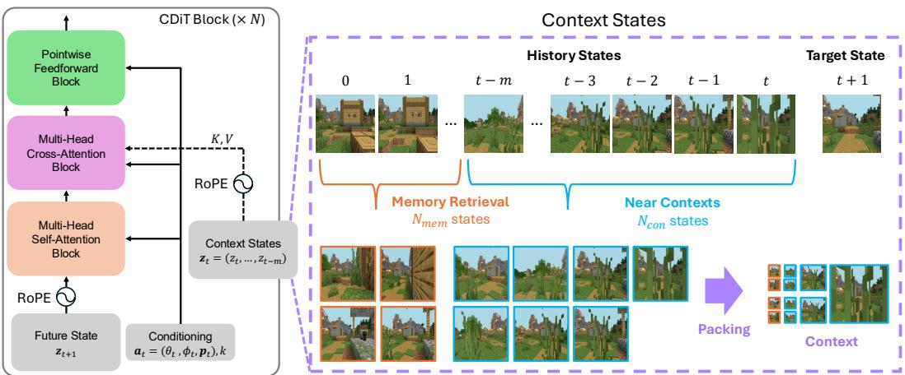
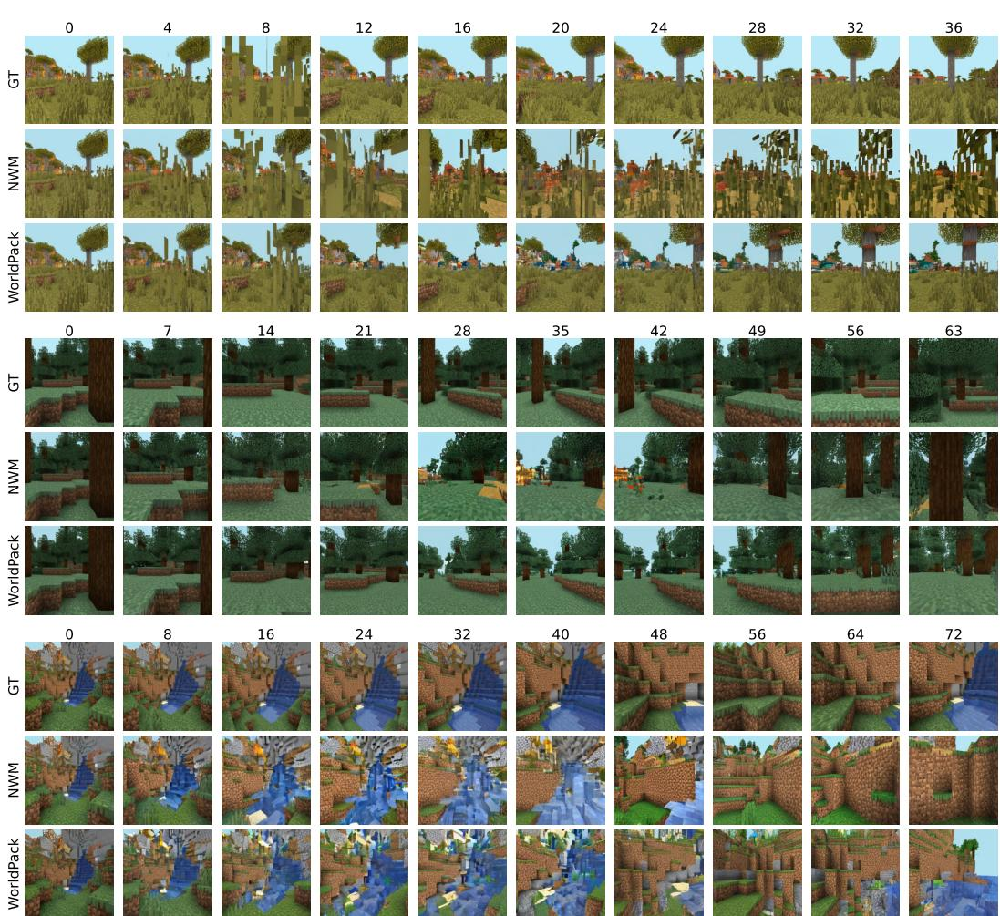

# 1. Bibliographic Information

## 1.1. Title
WorldPack: Compressed Memory Improves Spatial Consistency in Video World Modeling

The title clearly states the paper's core contribution: a method named `WorldPack` that uses "compressed memory" to solve a specific problem—improving "spatial consistency"—within the domain of "video world modeling."

## 1.2. Authors
- Yuta Oshima (The University of Tokyo)
- Yusuke Iwasawa (The University of Tokyo)
- Masahiro Suzuki (The University of Tokyo)
- Yutaka Matsuo (The University of Tokyo)
- Hiroki Furuta (Google DeepMind)

  The authors are primarily from The University of Tokyo's Matsuo Lab, a prominent AI research group in Japan, with one author from Google DeepMind. This collaboration suggests a blend of academic research and industry expertise, particularly in large-scale AI models.

## 1.3. Journal/Conference
The paper is available as a preprint on arXiv. The references to several other works as being published in 2025 (e.g., at the International Conference on Machine Learning, ICML) suggest that this paper was likely prepared for submission to a top-tier AI or machine learning conference in 2025, such as ICML, NeurIPS, or ICLR. These venues are highly competitive and influential in the field of artificial intelligence.

## 1.4. Publication Year
The paper was submitted to arXiv with a listed publication date of December 2, 2025. This is likely a placeholder or a typo on the submission form, as the content reflects research from 2024.

## 1.5. Abstract
The abstract introduces video world models as powerful tools for generating future visual scenes based on past observations and actions. It identifies a key challenge: maintaining long-term temporal and spatial consistency, which is difficult due to the high computational cost of processing long input sequences (long contexts). The paper proposes `WorldPack`, a video world model that uses an efficient "compressed memory" system to achieve better spatial consistency, fidelity, and quality, even with a shorter effective context length. This compressed memory has two main components: `trajectory packing` for context efficiency and `memory retrieval` for maintaining consistency. The model's effectiveness is demonstrated on `LoopNav`, a Minecraft-based benchmark designed to test long-term consistency, where `WorldPack` is shown to outperform state-of-the-art models.

## 1.6. Original Source Link
- **Original Source Link:** https://arxiv.org/abs/2512.02473
- **PDF Link:** https://arxiv.org/pdf/2512.02473v1.pdf
- **Publication Status:** This is a preprint on arXiv, meaning it has not yet undergone formal peer review for publication in a journal or conference.

# 2. Executive Summary

## 2.1. Background & Motivation
- **Core Problem:** State-of-the-art video world models struggle to maintain **spatial consistency** over long time horizons. This means that as the model generates a long sequence of video frames, the spatial layout of the environment can become distorted. For example, an object seen at a location might disappear or change shape when the agent returns to that same location later.
- **Importance and Challenges:** This problem is critical for applications like robotics, autonomous driving, and interactive game engines, where a reliable and consistent internal model of the world is essential for decision-making and planning. The primary reason for this inconsistency is the **prohibitive computational cost** of processing long sequences of past video frames. Most models are limited to a short "context window," causing them to "forget" what they saw in the distant past.
- **Innovative Idea:** The paper's core idea is to create a more efficient memory system that can retain long-term spatial information without a massive increase in computational cost. Instead of just using the most recent frames, `WorldPack` develops a "compressed memory" that intelligently packs a long history of frames and retrieves specific, important past frames to ensure the generated world remains consistent.

## 2.2. Main Contributions / Findings
1.  **Proposal of WorldPack:** The paper introduces `WorldPack`, a video world model specifically designed to improve long-term spatial consistency. Its novelty lies in its compressed memory system.
2.  **Compressed Memory Mechanism:** `WorldPack`'s memory system is composed of two key techniques:
    *   **Trajectory Packing:** This method compresses past frames hierarchically. More recent frames are stored at high resolution, while older frames are progressively compressed. This allows the model to "see" much further into the past than a standard model with the same computational budget.
    *   **Memory Retrieval:** This mechanism actively searches the agent's history for past frames that are spatially relevant to the current prediction (e.g., frames showing the same location from a similar viewpoint). These relevant frames are then added to the context, providing crucial information for maintaining consistency.
3.  **Demonstrated Superior Performance:** The paper provides strong empirical evidence that `WorldPack` significantly outperforms existing state-of-the-art models like `Oasis`, `Mineworld`, `DIAMOND`, and `NWM` on the `LoopNav` benchmark. This benchmark is specifically designed to test spatial memory by having an agent navigate a path and return to its starting point.
4.  **High Computational Efficiency:** Despite considering a much longer history of frames (19 frames vs. 4 for the baseline), `WorldPack` achieves this with only a marginal increase in inference time (~9%) and even a slight reduction in memory usage, demonstrating the efficiency of its compression technique.

# 3. Prerequisite Knowledge & Related Work

## 3.1. Foundational Concepts
### 3.1.1. Video World Models
A **video world model** is a type of generative AI model that learns the dynamics of an environment directly from video data. Its goal is to function as a "neural world simulator." Given a sequence of past video frames and a sequence of actions taken by an agent (e.g., "move forward," "turn left"), the model predicts the next video frame. By repeatedly predicting the next frame, it can generate long video rollouts of what would happen in the future. These models are crucial for tasks where an agent needs to plan by "imagining" the consequences of its actions.

### 3.1.2. Latent Diffusion Models (LDMs)
**Diffusion models** are a class of powerful generative models that learn to create data by reversing a noise-adding process.
- **Forward Process (Adding Noise):** You start with a clean image (or video frame) and gradually add a small amount of Gaussian noise over many steps. After enough steps, the image becomes pure noise. This process is fixed and doesn't involve any learning.
- **Reverse Process (Denoising):** The model, typically a neural network, is trained to reverse this process. It takes a noisy image and a timestep (indicating how much noise is present) and learns to predict the noise that was added. By subtracting this predicted noise, it can gradually denoise the image, step-by-step, until a clean image is generated from pure noise.

  **Latent Diffusion Models (LDMs)** improve this process by performing the diffusion in a compressed "latent space" instead of the high-resolution pixel space.
1.  An **autoencoder** (specifically a VAE - Variational Autoencoder) is trained to compress an image into a much smaller latent representation and then decompress it back to the original image.
2.  The diffusion process is then applied to these small latent representations, which is much more computationally efficient.
3.  To generate a new image, the model generates a clean latent representation through the reverse diffusion process and then uses the decoder part of the VAE to convert it into a full-resolution image.

### 3.1.3. Transformers and Diffusion Transformers (DiT)
The **Transformer** is a neural network architecture originally designed for natural language processing, which excels at handling sequential data. Its key innovation is the **self-attention mechanism**, which allows the model to weigh the importance of different elements in an input sequence when processing any given element.

A **Diffusion Transformer (DiT)** adapts the Transformer architecture for use in diffusion models. Instead of using the more traditional U-Net architecture, a DiT treats the noisy latent representation of an image as a sequence of patches (tokens) and uses a Transformer to process them. This has been shown to be highly scalable and effective for high-fidelity image and video generation.

### 3.1.4. Conditional Diffusion Transformer (CDiT)
`WorldPack` uses a `CDiT` as its backbone. A standard `DiT` would process all input frames (both past context and the current target frame) together using self-attention. The computational cost of self-attention grows quadratically with the sequence length. If you have $m$ frames, each with $n$ patches, the total sequence length is $m*n$, and the cost is proportional to $(m*n)^2$.

A **Conditional Diffusion Transformer (CDiT)** is more efficient. It separates the processing of the target frame and the context frames:
- **Self-attention** is applied only within the patches of the frame being denoised (the target frame).
- **Cross-attention** is used to condition the target frame on the context frames. The target frame's patches act as "queries," and the past frames' patches act as "keys" and "values."
  This reduces the complexity from quadratic in the number of frames to linear, making it feasible to use longer contexts.

### 3.1.5. Rotary Position Embeddings (RoPE)
Standard Transformers use absolute positional embeddings to inform the model about the order of tokens. This can be problematic when dealing with sequences of varying lengths or when inserting new elements (like retrieved memories).

**Rotary Position Embeddings (RoPE)** is a more flexible alternative. Instead of adding positional information, it rotates the token embeddings based on their position. This encodes position in a relative way. The attention score between two tokens depends only on their relative distance, not their absolute positions. This makes `RoPE` ideal for `WorldPack`, as it can handle retrieved memory frames from arbitrary points in the past without disrupting the model's understanding of time.

## 3.2. Previous Works
- **General-Purpose World Simulators:** The paper situates its work in the context of large video generation models like OpenAI's Sora (Brooks et al., 2024) and Google's Veo (Google DeepMind, 2024), which are positioned as "general-purpose world simulators."
- **Action-Conditioned Video World Models:** The paper compares itself to several state-of-the-art world models:
    - **NWM (Bar et al., 2024):** This is the direct baseline model that `WorldPack` builds upon. It uses a `CDiT` architecture for controllable video generation but is limited by a short context length (4 frames).
    - **Oasis (Decart et al., 2024):** A world model using a Vision Transformer (ViT) autoencoder and a `DiT` backbone. It uses a technique called `Diffusion Forcing` to improve generation quality.
    - **Mineworld (Guo et al., 2025):** An interactive world model for Minecraft based on a pure Transformer architecture.
    - **DIAMOND (Alonso et al., 2024):** A diffusion-based world model for Atari games that uses a U-Net architecture.
- **Long-Context Video Generation:** The paper draws inspiration from techniques in long-video generation:
    - **Autoregressive Generation:** Generating frames one by one, conditioned on a sliding window of recent frames. This is the standard approach that `WorldPack` extends.
    - **Architectural Advances:** Using more efficient architectures like State Space Models (`SSM`) or retrieval mechanisms to handle long-range dependencies. `WorldPack`'s memory retrieval falls into this category.
    - **Frame Compression (Zhang & Agrawala, 2025):** The paper explicitly credits this work for the idea of compressing past frames at varying rates to balance efficiency and long-term consistency. `WorldPack` adapts this technique for video world modeling.

## 3.3. Technological Evolution
The field has evolved from generating short, unconditional video clips to creating long, interactive simulations conditioned on user actions. A key bottleneck has consistently been the management of context. Early models used very short contexts. More recent models like `Oasis` increased context length (to 32 frames), but at a significant computational cost. The current frontier, which `WorldPack` addresses, is finding ways to incorporate information from a *very long* history (effectively infinite) in a computationally tractable way. This marks a shift from simply extending the context window to developing more intelligent memory systems.

## 3.4. Differentiation Analysis
`WorldPack`'s main innovation is its **hybrid memory system**, which combines two complementary ideas:
- **Difference from Standard Models (NWM, DIAMOND):** These models use a short, fixed-length context of recent frames. `WorldPack` breaks this limitation by using `trajectory packing` to see much further into the past.
- **Difference from Long-Context Models (Oasis):** `Oasis` uses a longer but still fixed context. `WorldPack` is more dynamic. Its `trajectory packing` provides a compressed view of the recent past, while its `memory retrieval` can "jump" back in time to fetch specific, highly relevant frames, even if they are very old.
- **Difference from Frame Compression (Zhang & Agrawala, 2025):** While `WorldPack` adopts the core idea of `trajectory packing` from this work, it combines it with a novel, pose-based `memory retrieval` mechanism tailored for navigation tasks in 3D environments. This retrieval is crucial for spatial reasoning, a challenge not central to general long-video generation.

# 4. Methodology

## 4.1. Principles
The core principle of `WorldPack` is to create a context-efficient video world model that can maintain long-term spatial consistency. It achieves this by augmenting a standard autoregressive video generation model with a compressed memory system. This system ensures that the model has access to both a compressed summary of its recent history and salient, retrieved memories from its distant past, all within a fixed computational budget.

## 4.2. Core Methodology In-depth (Layer by Layer)
The methodology can be broken down into three main parts: the base model architecture, the memory retrieval mechanism, and the trajectory packing system.

### 4.2.1. Base Model: Video World Modeling with CDiT and RoPE
The foundation of `WorldPack` is an action-conditioned latent video diffusion model. The goal is to learn a transition model $F_{\theta}$ that predicts the latent representation of the next frame $\mathbf{z}_{t+1}$ given a history of past latent frames $\mathbf{z}_{t-m:t}$ and the current action $\mathbf{a}_t$.

\$
\mathbf{z}_{t+1} \sim F_{\boldsymbol{\theta}}(\mathbf{z}_{t+1} \mid \mathbf{z}_{t-m:t}, \mathbf{a}_t)
\$

- **$\mathbf{z}_{i}$**: The latent representation of frame $i$, obtained by encoding the raw pixel frame $\mathbf{x}_i$ with a VAE encoder: $\mathbf{z}_i = \text{Enc}(\mathbf{x}_i)$.
- **$\mathbf{a}_t$**: The action taken by the agent at time $t$.
- **$F_{\boldsymbol{\theta}}$**: The model, parameterized by $\theta$.

  `WorldPack` implements $F_{\boldsymbol{\theta}}$ using a **Conditional Diffusion Transformer (CDiT)**. As explained previously, `CDiT` efficiently processes the context by using self-attention only on the target frame $\mathbf{z}_{t+1}$ and cross-attention to incorporate information from the past frames $\mathbf{z}_{t-m:t}$ and action $\mathbf{a}_t$.

To handle memories retrieved from arbitrary points in time, the model uses **Rotary Position Embeddings (RoPE)**. This allows the model to understand the temporal relationship between frames based on their relative distance, providing stable and consistent temporal representations regardless of where in the history a memory frame was retrieved from.

The overall architecture is depicted in Figure 1 from the paper.

*该图像是一个示意图，展示了 WorldPack 模型的结构。左侧部分说明了 CDiT 模块的组成，包括点wise前馈块、多头交叉注意块和多头自注意块，以及 RoPE 时间嵌入。右侧部分展示了上下文状态的处理，包括历史状态、目标状态以及记忆检索和打包过程。*

### 4.2.2. Memory Retrieval
To maintain spatial consistency, especially when an agent returns to a previously visited location, the model needs to be reminded of what that location looked like. The memory retrieval module is designed to find these relevant past frames. It does this without relying on direct visual comparison or camera field-of-view data, which may not always be available. Instead, it uses the agent's position and orientation (pose) information.

The process is as follows: to predict the frame at the current time, the model computes an importance score for each past frame $i$. This score is based on the spatial relationship between the agent's current pose and its pose at time $i$.

Let the current pose be defined by position $\mathbf{p} = (x_t, y_t, 0)^\top$ and viewing direction $\mathbf{d}$. The viewing direction is a unit vector calculated from the yaw $\theta_t$ and pitch $\phi_t$:
\$
\mathbf{d} = (\cos\phi_t \cos\theta_t, \cos\phi_t \sin\theta_t, \sin\phi_t)^\top
\$

For each past frame $i$, with position $\mathbf{p}_i$ and direction $\mathbf{d}_i$, three geometric quantities are computed:

1.  **Forward Projection ($s_i$):** This measures how far the past position $\mathbf{p}_i$ is in front of (or behind) the current agent along its current viewing direction $\mathbf{d}$.
    \$
    s_i = (\mathbf{p}_i - \mathbf{p})^\top \mathbf{d}
    \$
2.  **Lateral Distance ($\ell_i$):** This measures the perpendicular distance from the past position $\mathbf{p}_i$ to the current agent's line of sight.
    \$
    \ell_i = \| (\mathbf{p}_i - \mathbf{p}) - s_i \mathbf{d} \|
    \$
3.  **Directional Similarity ($\cos \Delta\theta_i$):** This is the cosine similarity (dot product) between the past viewing direction $\mathbf{d}_i$ and the current viewing direction $\mathbf{d}$. It measures how aligned the two views are.
    \$
    \cos \Delta\theta_i = \mathbf{d}_i^\top \mathbf{d}
    \$

Using these quantities, the final importance score for frame $i$ is calculated with the following formula:

\$
\mathrm{score}_i = w_c \cdot \max(\cos \Delta\theta_i, 0) \exp\left(-\frac{s_i^2}{2\sigma_s^2}\right) \exp\left(-\frac{\ell_i^2}{2\sigma_\ell^2}\right) + w_a \cdot \max(-\cos \Delta\theta_i, 0) \exp\left(-\frac{(s_i - \mu_s)^2}{2\sigma_s^2}\right) \exp\left(-\frac{\ell_i^2}{2\sigma_\ell^2}\right)
\$

- **Explanation of the Formula:**
    - The formula consists of two terms.
    - **First Term:** This term gives a high score to past frames that are **spatially close** ($\ell_i$ and $s_i$ are small) and have a **similar viewing direction** ($\cos \Delta\theta_i > 0$). The exponential terms act as Gaussian kernels, penalizing frames that are far away.
    - **Second Term:** This term is designed to retrieve frames with an **opposite viewing direction** ($\cos \Delta\theta_i < 0$) at a characteristic distance in front of the agent (controlled by $\mu_s$). This could be useful for situations like turning around, to remember what was just behind.
    - **$w_c, w_a, \sigma_s, \sigma_\ell, \mu_s$**: These are hyperparameters that control the weights and shapes of the scoring function. The paper sets them to $\sigma_\ell=10.0, \mu_s=1.0, \sigma_s=0.01, w_c=1.0, w_a=1.0$.

      Frames with the highest scores are selected as memories. To avoid redundancy, an "exclusion window" of 20 frames is used, preventing the selection of frames that are too close in time to each other.

### 4.2.3. Trajectory Packing
Once the most recent frames and the retrieved memory frames are selected, `trajectory packing` is used to compress them efficiently into a fixed-length context for the `CDiT` model. The key idea is hierarchical compression: recent frames get more "space" (higher resolution) in the context, while older or memory frames are compressed more aggressively.

This compression is done by adjusting the patch size when tokenizing the latent frames. A larger patch size results in fewer tokens and thus a lower effective resolution.

The effective context length $\ell$ for a frame is determined by its temporal distance. For a recent past frame at time `t-i` and a retrieved memory frame $M_j$ with temporal distance $d_j$, their context lengths are:

\$
\ell_{t-i} = \frac{L_f}{\lambda^i}, \quad \ell_{M_j} = \frac{L_f}{\lambda^{d_j}}
\$

- **$L_f$**: The base context length (number of tokens) for the most recent, uncompressed frame.
- **$\lambda > 1$**: A compression factor. The paper uses $\lambda=2$, meaning each step doubles the patch size (e.g., $2\times2$, $4\times4$, $8\times8$).
- **$i, d_j$**: The temporal distance from the current frame.

  The total packed context length $L_{\text{pack}}$ is the sum of the lengths of all frames included in the context:
\$
L_{\text{pack}} = S \cdot L_f + \sum_{i=S+1}^{N_{\text{con}}} \ell_{t-i} + \sum_{j=1}^{N_{\text{mem}}} \ell_{M_j}
\$

- **$N_{\text{con}}$**: Number of consecutive recent frames.
- **$N_{\text{mem}}$**: Number of retrieved memory frames.
- **$S$**: Number of recent frames that are kept uncompressed.

  In practice, the paper uses a specific packing scheme:
- A total of **19** historical frames are used.
- The most recent frames are kept at high resolution.
- Older frames are compressed with ratios of $2^2=4$ and $2^4=16$.
- The **last 8 slots** in the context are reserved for frames selected by the `memory retrieval` module.
  This allows the model to have a very long "visible history" (19 frames) while keeping the effective context length for the `CDiT` model very small (2.84, compared to the baseline's 4).

# 5. Experimental Setup

## 5.1. Datasets
### 5.1.1. LoopNav
- **Source and Domain:** `LoopNav` (Lian et al., 2025) is a benchmark specifically designed to evaluate long-term spatial memory in video world models. It is built within the **Minecraft** game environment.
- **Characteristics:** The benchmark consists of navigation tasks where an agent explores an area and then must return to a previously visited location. This "loop" structure makes it ideal for testing if a model can remember and consistently reconstruct scenes.
- **Tasks:** Two main task types are used:
    1.  **Spatial Memory Retrieval (ABA):** The agent travels from point A to B, and then must return from B to A. The model observes the A $\to$ B path and must generate the B $\to$ A path. Since the A $\to$ B path contains the ground truth for the return journey, this task directly tests the model's ability to **retrieve** information from its context.
    2.  **Spatial Reasoning (ABCA):** The agent travels from A to B to C, and then must return from C to A. The model observes the A $\to$ B $\to$ C path and must generate the C $\to$ A path. This is more challenging as it requires the model to **reason** about spatial relationships over a longer, more complex trajectory.

        The following figure from the paper illustrates these two tasks.

        ![Figure 2: Illustration of the two LoopNav benchmark tasks. (Left) Spatial Memory Retrieval Task: the agent explores along $\\mathbf { A } { \\xrightarrow { } } \\mathbf { B }$ (blue path) and must reconstruct earlier observations on the return path $\\mathbf { B } \\to \\mathbf { A }$ (red path). (Right) Spatial Reasoning Task: the agent explores along $\\mathbf { A } { } \\mathbf { B } { } \\mathbf { C }$ (blue path) and must reconstruct the environment on the longer return path $\\mathrm { C } { } \\mathrm { A }$ (red path), requiring reasoning across accumulated spatial memory.](images/2.jpg)
        *该图像是示意图，展示了两个LoopNav基准任务。左侧为空间记忆检索任务，代理沿路径 $\mathbf{A} \xrightarrow{} \mathbf{B}$ （蓝色路径）探险，并需在返回路径 $\mathbf{B} \to \mathbf{A}$ （红色路径）上重构先前观察。右侧为空间推理任务，代理沿路径 $\mathbf{A} \mathbf{B} \mathbf{C}$ （蓝色路径）探险，并需在较长的返回路径 $\mathbf{C} \to \mathbf{A}$ （红色路径）上重构环境，要求利用累积的空间记忆进行推理。*

### 5.1.2. RECON
- **Source and Domain:** The RECON dataset (Shah et al., 2021) contains real-world video data collected by a mobile robot navigating indoor environments.
- **Purpose:** This dataset is used to verify that `WorldPack`'s benefits are not limited to simulated environments like Minecraft but also apply to real-world visual data.

## 5.2. Evaluation Metrics
The paper uses a suite of metrics to evaluate the quality of the generated videos.

### 5.2.1. SSIM (Structural Similarity Index Measure)
- **Conceptual Definition:** `SSIM` measures the similarity between two images by comparing their structural information, luminance, and contrast. Unlike pixel-wise metrics like PSNR, it is designed to align better with human perception of image quality. A higher `SSIM` score (closer to 1) indicates greater similarity.
- **Mathematical Formula:**
  \$
  \text{SSIM}(x, y) = \frac{(2\mu_x\mu_y + c_1)(2\sigma_{xy} + c_2)}{(\mu_x^2 + \mu_y^2 + c_1)(\sigma_x^2 + \sigma_y^2 + c_2)}
  \$
- **Symbol Explanation:**
    - `x, y`: The two images being compared.
    - $\mu_x, \mu_y$: The mean of image $x$ and $y$.
    - $\sigma_x^2, \sigma_y^2$: The variance of image $x$ and $y$.
    - $\sigma_{xy}$: The covariance of $x$ and $y$.
    - $c_1, c_2$: Small constants to stabilize the division.

### 5.2.2. LPIPS (Learned Perceptual Image Patch Similarity)
- **Conceptual Definition:** `LPIPS` measures the perceptual similarity between two images using deep learning. It feeds both images through a pre-trained deep neural network (like VGG or AlexNet) and calculates the distance between their feature activations at different layers. A lower `LPIPS` score indicates that the images are more perceptually similar. It is considered a strong metric for evaluating the realism of generated images.
- **Mathematical Formula:**
  \$
  d(x, x_0) = \sum_l \frac{1}{H_l W_l} \sum_{h,w} \| w_l \odot ( \hat{y}_{hw}^l - \hat{y}_{0hw}^l ) \|_2^2
  \$
- **Symbol Explanation:**
    - $d(x, x_0)$: The `LPIPS` distance between images $x$ and $x_0$.
    - $l$: Index for the network layer.
    - $\hat{y}^l, \hat{y}_0^l$: The feature activations for each image from layer $l$.
    - $H_l, W_l$: The spatial dimensions of the feature maps.
    - $w_l$: A channel-wise weighting factor to scale the importance of different channels.

### 5.2.3. PSNR (Peak Signal-to-Noise Ratio)
- **Conceptual Definition:** `PSNR` is a classic metric that measures the ratio between the maximum possible power of a signal and the power of corrupting noise that affects its fidelity. In images, it measures pixel-level reconstruction quality. A higher `PSNR` indicates less pixel-wise error. However, it often correlates poorly with human perception of quality.
- **Mathematical Formula:**
  \$
  \text{PSNR} = 10 \cdot \log_{10} \left( \frac{\text{MAX}_I^2}{\text{MSE}} \right)
  \$
  where `\text{MSE} = \frac{1}{mn} \sum_{i=0}^{m-1} \sum_{j=0}^{n-1} [I(i,j) - K(i,j)]^2`
- **Symbol Explanation:**
    - $\text{MAX}_I$: The maximum possible pixel value of the image (e.g., 255 for an 8-bit image).
    - $\text{MSE}$: Mean Squared Error between the original image $I$ and the generated image $K$.
    - `m, n`: The dimensions of the images.

### 5.2.4. DreamSim
- **Conceptual Definition:** `DreamSim` (Fu et al., 2023) is another deep feature-based perceptual similarity metric. It is specifically trained using synthetic data to learn a feature space that aligns well with human judgments of similarity. Like `LPIPS`, a lower `DreamSim` score indicates higher perceptual similarity.

### 5.2.5. FVD (Fréchet Video Distance)
- **Conceptual Definition:** `FVD` measures the quality and temporal coherence of generated videos. It computes the Fréchet distance between the feature distributions of real videos and generated videos. The features are extracted from a pre-trained video classification network (e.g., I3D). A lower `FVD` score indicates that the generated videos are more similar to real videos in both appearance and motion.

## 5.3. Baselines
The paper compares `WorldPack` against several strong baseline models:
- **NWM (Bar et al., 2024):** The direct predecessor of `WorldPack`, using a `CDiT` with a context length of 4. This serves as the primary baseline to show the improvement from the compressed memory system.
- **Oasis (Decart et al., 2024):** A powerful `DiT`-based model with a long context length of 32.
- **Mineworld (Guo et al., 2025):** A Transformer-based world model for Minecraft with a context length of 15.
- **DIAMOND (Alonso et al., 2024):** A U-Net based diffusion model with a context length of 4.

  These baselines are representative as they cover different architectures (`CDiT`, `DiT`, Transformer, U-Net) and context lengths, providing a comprehensive comparison.

# 6. Results & Analysis

## 6.1. Core Results Analysis
The main results, presented in Tables 1 and 2, consistently show that `WorldPack` outperforms all baseline models across various metrics, tasks, and difficulty levels (navigation ranges).

- **Superior Perceptual Quality:** `WorldPack` achieves the best (lowest) scores on `LPIPS` and `DreamSim` across almost all settings. This is a key finding, as these metrics are known to correlate well with human perception. It indicates that the videos generated by `WorldPack` are more realistic and semantically correct.
- **Competitive Structural Similarity:** On `SSIM`, `WorldPack`'s performance is competitive but not always superior. The authors correctly point out that `SSIM` can favor blurry or overly smoothed predictions, which may have low pixel-wise error but poor perceptual fidelity.
- **Robustness to Difficulty:** The performance gap between `WorldPack` and the baselines is maintained or even increases as the navigation range gets larger (from 5 to 50). This suggests that the compressed memory system is particularly beneficial for long-horizon tasks where maintaining spatial memory is more challenging.
- **Qualitative Improvement:** Figure 3 provides a visual comparison. The frames generated by `WorldPack` appear much closer to the ground truth than those from the `NWM` baseline, especially later in the rollout. This confirms the quantitative results and highlights the model's improved ability to maintain consistency.

  
  *该图像是图表，展示了预测结果的可视化比较，包括真实值（GT）、NWM 和 WorldPack。WorldPack 在后期的预测中与真实值更为相似，显示了其在空间一致性方面的优势。*

## 6.2. Data Presentation (Tables)
The following are the results from Table 1 of the original paper:

<table>
<thead>
<tr>
<th rowspan="2">Nav. Range</th>
<th rowspan="2">Model</th>
<th rowspan="2">Context</th>
<th rowspan="2">Trajectory</th>
<th colspan="2">SSIM ↑</th>
<th colspan="2">LPIPS ↓</th>
</tr>
<tr>
<th>ABA</th>
<th>ABCA</th>
<th>ABA</th>
<th>ABCA</th>
</tr>
</thead>
<tbody>
<tr>
<td rowspan="5">5</td>
<td>Oasis</td>
<td>32</td>
<td>32</td>
<td>0.36</td>
<td>0.34</td>
<td>0.76</td>
<td>0.82</td>
</tr>
<tr>
<td>Mineworld</td>
<td>15</td>
<td>15</td>
<td>0.31</td>
<td>0.32</td>
<td>0.73</td>
<td>0.72</td>
</tr>
<tr>
<td>DIAMOND</td>
<td>4</td>
<td>4</td>
<td>0.40</td>
<td>0.37</td>
<td>0.75</td>
<td>0.79</td>
</tr>
<tr>
<td>NWM</td>
<td>4</td>
<td>4</td>
<td>0.33</td>
<td>0.31</td>
<td>0.64</td>
<td>0.67</td>
</tr>
<tr>
<td>WorldPack (ours)</td>
<td>2.84</td>
<td>19</td>
<td>0.39</td>
<td>0.35</td>
<td><b>0.52</b></td>
<td><b>0.56</b></td>
</tr>
<tr>
<td rowspan="5">15</td>
<td>Oasis</td>
<td>32</td>
<td>32</td>
<td>0.37</td>
<td>0.38</td>
<td>0.82</td>
<td>0.81</td>
</tr>
<tr>
<td>Mineworld</td>
<td>15</td>
<td>15</td>
<td>0.34</td>
<td>0.32</td>
<td>0.74</td>
<td>0.74</td>
</tr>
<tr>
<td>DIAMOND</td>
<td>4</td>
<td>4</td>
<td>0.38</td>
<td>0.39</td>
<td>0.78</td>
<td>0.79</td>
</tr>
<tr>
<td>NWM</td>
<td>4</td>
<td>4</td>
<td>0.30</td>
<td>0.33</td>
<td>0.67</td>
<td>0.65</td>
</tr>
<tr>
<td>WorldPack (ours)</td>
<td>2.84</td>
<td>19</td>
<td><b>0.48</b></td>
<td><b>0.46</b></td>
<td><b>0.57</b></td>
<td><b>0.55</b></td>
</tr>
<tr>
<td rowspan="5">30</td>
<td>Oasis</td>
<td>32</td>
<td>32</td>
<td>0.33</td>
<td>0.35</td>
<td>0.86</td>
<td>0.85</td>
</tr>
<tr>
<td>Mineworld</td>
<td>15</td>
<td>15</td>
<td>0.33</td>
<td>0.28</td>
<td>0.77</td>
<td>0.77</td>
</tr>
<tr>
<td>DIAMOND</td>
<td>4</td>
<td>4</td>
<td><b>0.37</b></td>
<td><b>0.35</b></td>
<td>0.81</td>
<td>0.81</td>
</tr>
<tr>
<td>NWM</td>
<td>4</td>
<td>4</td>
<td>0.32</td>
<td>0.30</td>
<td>0.69</td>
<td>0.71</td>
</tr>
<tr>
<td>WorldPack (ours)</td>
<td>2.84</td>
<td>19</td>
<td>0.32</td>
<td>0.28</td>
<td><b>0.61</b></td>
<td><b>0.63</b></td>
</tr>
<tr>
<td rowspan="5">50</td>
<td>Oasis</td>
<td>32</td>
<td>32</td>
<td>0.36</td>
<td>0.36</td>
<td>0.86</td>
<td>0.83</td>
</tr>
<tr>
<td>Mineworld</td>
<td>15</td>
<td>15</td>
<td>0.31</td>
<td>0.32</td>
<td>0.78</td>
<td>0.75</td>
</tr>
<tr>
<td>DIAMOND</td>
<td>4</td>
<td>4</td>
<td><b>0.37</b></td>
<td><b>0.38</b></td>
<td>0.83</td>
<td>0.81</td>
</tr>
<tr>
<td>NWM</td>
<td>4</td>
<td>4</td>
<td>0.28</td>
<td>0.33</td>
<td>0.72</td>
<td>0.65</td>
</tr>
<tr>
<td>WorldPack (ours)</td>
<td>2.84</td>
<td>19</td>
<td>0.27</td>
<td>0.31</td>
<td><b>0.63</b></td>
<td><b>0.63</b></td>
</tr>
</tbody>
</table>

The following are the results from Table 2 of the original paper:

<table>
<thead>
<tr>
<th rowspan="2">Nav. Range</th>
<th rowspan="2">Model</th>
<th rowspan="2">Context</th>
<th rowspan="2">Trajectory</th>
<th colspan="2">PSNR ↑</th>
<th colspan="2">DreamSim ↓</th>
<th colspan="2">FVD ↓</th>
</tr>
<tr>
<th>ABA</th>
<th>ABCA</th>
<th>ABA</th>
<th>ABCA</th>
<th>ABA</th>
<th>ABCA</th>
</tr>
</thead>
<tbody>
<tr>
<td rowspan="2">5</td>
<td>NWM</td>
<td>4</td>
<td>4</td>
<td>12.3</td>
<td>10.0</td>
<td>0.33</td>
<td>0.44</td>
<td>747</td>
<td>759</td>
</tr>
<tr>
<td>WorldPack (ours)</td>
<td>2.84</td>
<td>19</td>
<td><b>12.6</b></td>
<td><b>11.1</b></td>
<td><b>0.30</b></td>
<td><b>0.35</b></td>
<td>760</td>
<td><b>670</b></td>
</tr>
<tr>
<td rowspan="2">15</td>
<td>NWM</td>
<td>4</td>
<td>4</td>
<td>11.5</td>
<td>11.5</td>
<td>0.44</td>
<td>0.38</td>
<td>665</td>
<td>773</td>
</tr>
<tr>
<td>WorldPack (ours)</td>
<td>2.84</td>
<td>19</td>
<td><b>12.0</b></td>
<td><b>11.7</b></td>
<td><b>0.40</b></td>
<td><b>0.36</b></td>
<td><b>551</b></td>
<td><b>669</b></td>
</tr>
<tr>
<td rowspan="2">30</td>
<td>NWM</td>
<td>4</td>
<td>4</td>
<td>11.1</td>
<td>10.0</td>
<td>0.45</td>
<td>0.49</td>
<td>755</td>
<td>819</td>
</tr>
<tr>
<td>WorldPack (ours)</td>
<td>2.84</td>
<td>19</td>
<td><b>11.3</b></td>
<td><b>11.1</b></td>
<td><b>0.41</b></td>
<td><b>0.42</b></td>
<td><b>570</b></td>
<td><b>679</b></td>
</tr>
<tr>
<td rowspan="2">50</td>
<td>NWM</td>
<td>4</td>
<td>4</td>
<td>10.2</td>
<td>9.8</td>
<td>0.47</td>
<td>0.48</td>
<td>841</td>
<td>810</td>
</tr>
<tr>
<td>WorldPack (ours)</td>
<td>2.84</td>
<td>19</td>
<td><b>10.7</b></td>
<td><b>10.5</b></td>
<td><b>0.42</b></td>
<td><b>0.41</b></td>
<td><b>562</b></td>
<td><b>455</b></td>
</tr>
</tbody>
</table>

## 6.3. Ablation Studies / Parameter Analysis
The ablation studies are crucial for understanding which components of `WorldPack` contribute to its success.

### 6.3.1. The Importance of Memory Retrieval
Figure 4 analyzes the performance on the final segments of long trajectories, where spatial memory is most critical.

*该图像是图表，展示了ABCA-30和ABCA-50的预测性能，比较了基础模型（无压缩记忆）、仅 trajectory packing 及 trajectory packing $^ +$ memory retrieval 三种情况。图中包含DreamSim、LPIPS、PSNR和SSIM四项指标的变化趋势，以评估不同方法在不同帧索引下的表现。*

- **Finding:** The results show that `trajectory packing` alone provides only a marginal improvement over the baseline model. However, when `memory retrieval` is added (`trajectory packing + memory retrieval`), there is a **substantial performance gain**.
- **Analysis:** This demonstrates that simply having a longer, compressed history of *recent* events is not sufficient. For tasks that require returning to a location seen long ago, the model must be able to selectively access that specific past information. `Memory retrieval` provides this crucial capability.

### 6.3.2. Synergy of Packing and Retrieval
Figure 5 compares the performance of using each component in isolation versus using them together.

![Figure 5: Comparison of using trajectory packing only, memory retrieval only, and their combination in WorldPack (ABA task, navigation range $= 5$ ). In the trajectory packingonly setting, the most recent 19 trajectories are compresed into a context of size 2.84. In the memory retrievalonly setting, the most recent 1 trajectory and 3 retrieved memories are used, yielding a context of size 4 without packing. While either component alone provides modest improvements over the base model, the largest performance gain is obtained when both are combined, demonstrating that the two mechanisms are essential for world modeling with long-term spatial memory awareness.](images/5.jpg)
*该图像是图表，展示了在不同设置下（基本模型、加上记忆、加上轨迹打包、同时加上打包和记忆）对 DreamSim、LPIPS、PSNR 和 SSIM 四个指标的性能比较。结果表明，结合两种机制的效果最好，显著提高了模型的表现。*

- **Finding:** Both `trajectory packing only` and `memory retrieval only` improve over the baseline. However, the performance gain is modest. The combination of both (`WorldPack`) achieves the best results by a significant margin.
- **Analysis:** This result highlights the synergistic relationship between the two components. `Trajectory packing` provides a rich, long-term context, while `memory retrieval` injects highly salient, targeted information into that context. Neither component is fully effective without the other.

### 6.3.3. Real-World Data and Computational Efficiency
The following are the results from Table 3 of the original paper:

| Model             | Context | Trajectory | DreamSim ↓ | LPIPS ↓ | PSNR ↑ | SSIM ↑ |
|-------------------|---------|------------|------------|---------|--------|--------|
| Baseline          | 4       | 4          | 0.23       | 0.48    | 12.7   | 0.36   |
| Packing only      | 2.84    | 19         | 0.18       | 0.45    | 13.4   | 0.40   |
| WorldPack (ours)  | 2.84    | 19         | **0.17**   | **0.44**| **13.6** | **0.40** |

- **Real-World Performance:** Table 3 shows that `WorldPack` also outperforms the baseline on the `RECON` real-world dataset, confirming its general applicability beyond simulated environments.

  The following are the results from Table 4 of the original paper:

  | Model             | Context | Trajectory | Inference Time (1-step, sec) | Memory Usage (GB) |
  |-------------------|---------|------------|------------------------------|-------------------|
  | Baseline          | 4       | 4          | 0.430                        | 22.08             |
  | WorldPack (ours)  | 2.84    | 19         | 0.468                        | 21.78             |

- **Efficiency:** Table 4 shows that `WorldPack` processes a much longer trajectory (19 frames vs. 4) with only a 9% increase in inference time and a slight *decrease* in memory usage. This is because the effective context length fed into the expensive `CDiT` model is smaller (2.84 vs. 4), demonstrating the high computational efficiency of the packing mechanism.

# 7. Conclusion & Reflections

## 7.1. Conclusion Summary
The paper successfully introduces `WorldPack`, a video world model that significantly improves long-term spatial consistency in video generation. The core innovation is a compressed memory system that combines `trajectory packing` to efficiently retain a long history of observations and `memory retrieval` to selectively recall spatially relevant past scenes. Through extensive experiments on the `LoopNav` benchmark, the authors demonstrate that `WorldPack` substantially outperforms strong state-of-the-art models in both quantitative metrics and qualitative evaluations, all while maintaining high computational efficiency.

## 7.2. Limitations & Future Work
- **Simulator-Centric Evaluation:** The authors acknowledge that the primary evaluation is conducted in a simulated Minecraft environment. While they show promising results on one real-world dataset (`RECON`), further validation on more diverse and complex real-world data is necessary.
- **Focus on Simulation, Not Action:** The study focuses on the world model's ability to generate consistent scenes (its simulation capability). The authors suggest that a valuable future direction would be to investigate how these improved spatial memory capabilities can be leveraged for downstream tasks like **policy learning and planning**, where an agent must make decisions based on the model's predictions.

## 7.3. Personal Insights & Critique
- **Strengths:**
    - **Elegant and Effective Solution:** The paper presents a clever and pragmatic solution to a well-defined, important problem. Instead of designing a completely new architecture, it intelligently combines and adapts existing ideas (`CDiT`, `RoPE`, frame compression) with a novel, task-specific component (`memory retrieval`).
    - **Strong Empirical Validation:** The choice of the `LoopNav` benchmark is excellent, as it directly targets the problem of spatial consistency. The comprehensive experiments, including thorough ablation studies, provide convincing evidence for the method's effectiveness and the importance of each of its components.
    - **High Practicality:** The demonstration of high computational efficiency makes `WorldPack` a practical and attractive approach. Improving performance while keeping computational costs low is a significant achievement.

- **Potential Issues and Areas for Improvement:**
    - **Pose-Dependent Retrieval:** The `memory retrieval` mechanism is based on the agent's position and orientation (pose). This works well in environments like simulators or robotics setups where pose information is readily available. However, its applicability might be limited in scenarios where accurate pose cannot be easily obtained (e.g., generating video from a found-footage clip). A future research direction could be to learn a retrieval function based on visual similarity alone, which would be more general.
    - **Heuristic-Based Scoring:** The formula for the retrieval score is heuristic, with several manually set hyperparameters. While it is shown to work well, a learned scoring function might be more robust and adaptable to different environments and tasks.
    - **Complexity of Interactions:** The current evaluation focuses on navigation and visual reconstruction. The model's ability to maintain consistency for more complex interactions, such as an agent modifying the environment (e.g., adding or removing blocks in Minecraft), remains an open question and a challenging avenue for future work.