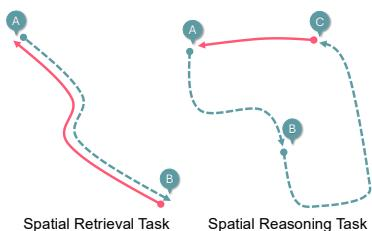
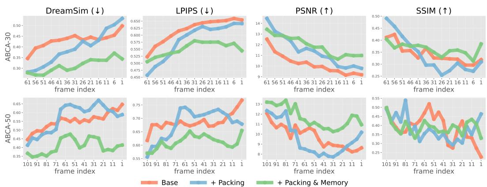
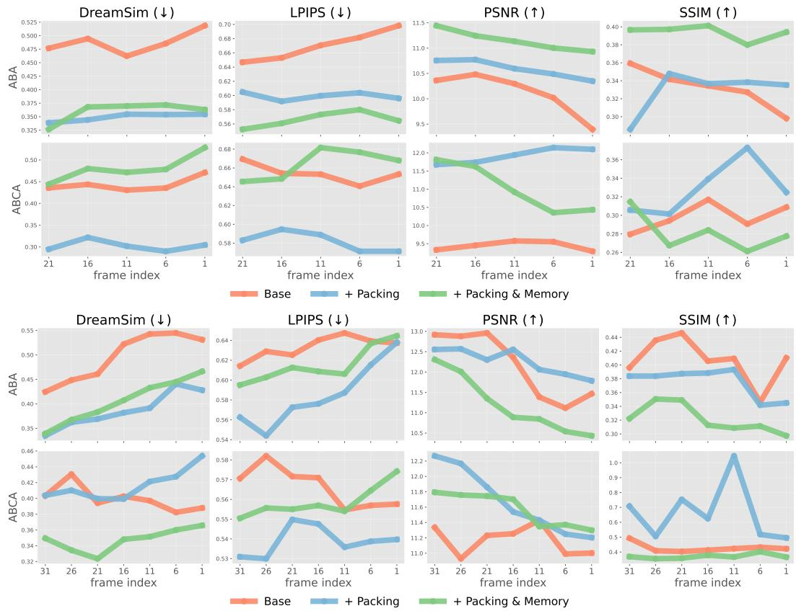
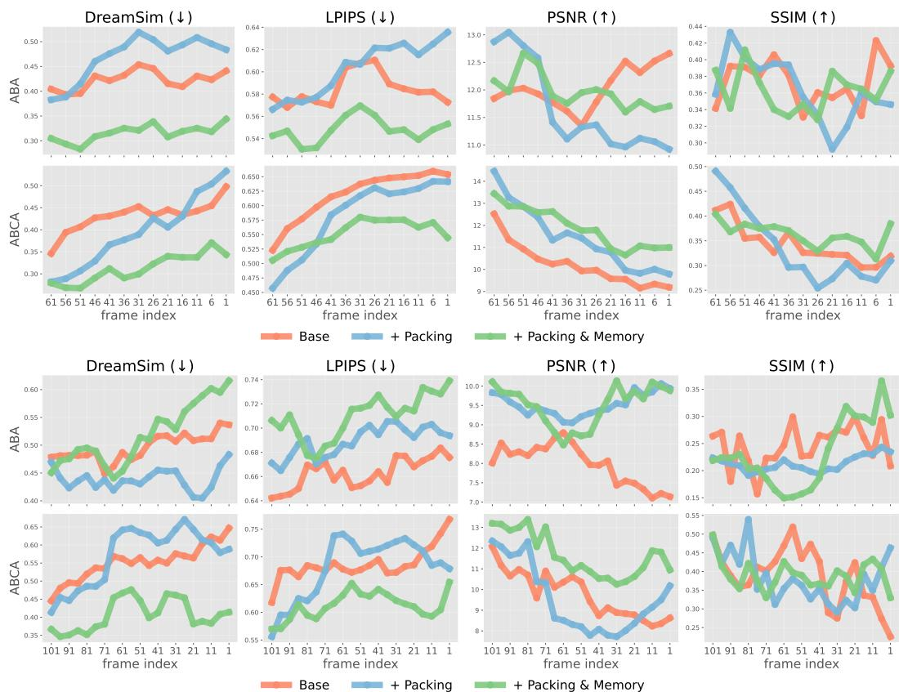

# WorldPack: 压缩内存改善视频世界建模中的空间一致性

大岛裕太^1、岩泽佑介^1、铃木正浩^1、松尾丰^1、古田洋樹^{2, \dagger} 东京大学 谷歌 DeepMind yuta.oshima@weblab.t.u-tokyo.ac.jp

# 摘要

视频世界模型因其能够基于过去的观察和导航动作生成高保真未来视觉观测而受到广泛关注。由于长时上下文输入的计算成本过高，时空一致的长期世界建模一直是一个长期存在的问题，即便是最近的最先进模型也未能解决。在本文中，我们提出了WorldPack，这是一种具有高效压缩记忆的视频世界模型，尽管上下文长度大大缩短，但在长期生成中显著提高了空间一致性、保真度和质量。我们的压缩记忆由轨迹打包和记忆检索组成；轨迹打包实现了高上下文效率，记忆检索保持了推演中的一致性，并帮助需要空间推理的长期生成。我们的性能通过LoopNav进行评估，这是一个专门用于评估长期一致性的Minecraft基准，我们验证了WorldPack显著优于强大的最先进模型。

# 1 引言

视频世界模型，即基于视频生成模型的神经世界模拟器，近年来因其能够根据过去的观察和导航动作生成高保真未来视觉观测而引起了广泛关注（Brooks et al., 2024; Bruce et al., 2024; Kang et al., 2024）。通过从过去的观察和智能体动作预测和生成未来的视觉观测，这些模型有潜力作为传统模拟环境的替代方案。它们的应用范围广泛，包括机器人模拟（Bar et al, 2024; Hu et al., 2025; Zhu et al., 2025）、自动驾驶（Hu et al., 2023; Russell et al., 2025; Wang et al., 2023; Zhao et al., 2024; Gao et al., 2024）及游戏引擎中的AI驱动内容生成（Alonso et al., 2024; Valevski et al., 2024）。尽管前景广阔，实现在长时间范围内的时间和空间一致的世界建模依然是一个长期挑战，即便是在最新的最先进视频生成模型面前（Decart et al., 2024; Guo et al., 2025）。这一困难源于处理长上下文输入所需的 prohibitively high 计算成本，这限制了现有模型仅能处理相对较短的时间窗口（Alonso et al., 2024; Bar et al., 2024）。因此，之前观察到的信息很容易被丢弃，导致空间布局和物体排列随时间的推移而出现不一致。例如，在一个视图中可见的物体在视角变化时可能会突然消失或位置偏移，从而削弱了这些模型作为世界模拟器的可靠性。在本文中，我们提出了WorldPack，一个长上下文感知的视频世界模型，能够在保持高生成质量的同时实现高效的压缩内存。尽管在相对较短的上下文长度下运行，WorldPack显著改善了长期空间一致性。该压缩内存包含两个关键组成部分：轨迹打包，通过以紧凑形式保留更多近期信息以提升上下文效率，以及记忆检索，选择性地回忆与预测目标具有实质视觉重叠的过去场景。这些机制共同确保在后期阶段仍能保持一致的推理结果，在这些阶段，可靠的空间推理至关重要。我们采用条件扩散变换器（CDiT）（Bar et al., 2024）作为基础主干架构，并结合了基于RoPE的时间嵌入（Su et al., 2023），使得无论其与目标场景的时间距离如何，都能有效利用记忆。我们的实验在LoopNav（Lian et al., 2025）上评估了WorldPack，该基准旨在评估基于Minecraft环境的长时间范围内的时间和空间一致性。在空间记忆检索任务（测量回忆过去观察的能力）和空间推理任务（评估长时间范围内推理一致性）中，WorldPack表现出卓越的场景预测性能。值得注意的是，它在多个质量指标下（包括SSIM（Wang et al., 2004）、LPIPS（Zhang et al., 2018）、PSNR和DreamSim（Fu et al., 2023））的验证中，显著超越了强大的最先进基线，如Oasis、MineWorld（Guo et al., 2025）、Diamond（Alonso et al., 2024）和NWM（Bar et al., 2024）。

# 2 相关工作

视频世界模型。最近在视频扩散模型方面的进展，使得生成照片级真实感的高分辨率视频成为可能，将其定位为“通用世界模拟器”，能够根据文本生成具有合理动态的多样化场景（Brooks 等，2024；Google DeepMind，2024；Kang 等，2024；Bansal 等，2024；Chefer 等，2025；Wu 等，2025；Oshima 等，2025）。基于这一进展，视频世界模型因其能够生成基于过去场景序列和导航行为条件的高保真未来视觉观测而受到广泛关注（Alonso 等，2024；Bruce 等，2024；Mao 等，2025）。其应用涵盖了多个领域，如游戏引擎（Valevski 等，2024；Decart 等，2024；Guo 等，2025）、自动驾驶（Hu 等，2023；Russell 等，2025；Wang 等，2023；Zhao 等，2024；Gao 等，2024；Hu 等，2024；Guo 等，2024）和机器人技术（Bar 等，2024；Hu 等，2025；Zhu 等，2025）。这些研究强调了在决策任务（如驾驶和导航）中保持长期时间和空间一致性的重要性。然而，由于处理模型上下文中长序列观测所需的高计算成本，即使是最先进的模型，实现这种一致性仍然是一个未解决的挑战（Decart 等，2024；Guo 等，2025）。

长时段视频生成。先前的视频生成研究积极探索将固定长度的视野扩展为长期推理的方法。一类研究专注于采样策略，例如使用粗到细处理的时间超分辨率（Ho 等，2022b；Yin 等，2023）、基于最近帧条件的自回归生成（He 等，2022；Henschel 等，2024）以及在推理时适应预训练模型以实现更长生成的技术，而无需重新训练（Qiu 等，2023；Kim 等，2024）。另一个方向引入建筑性进展，以捕捉长程依赖关系，包括结构化状态空间模型（Gu 等，2021；Gu & Dao，2023）用于高效的时间建模（Oshima 等，2024；Po 等，2025）和动态选择具有重叠视野的过去帧的空间检索机制（Yu 等，2025；Xiao 等，2025）。与此同时，稳定化方法减轻长期生成过程中的退化，例如，通过将下一个标记预测与全序列扩散相结合（Chen 等，2024；Ruhe 等，2024；Jin 等，2024；Kodaira 等，2025），或者通过引入基于历史的引导来保留过去信息（Song 等，2025）。最近，Zhang & Agrawala（2025）提出将以不同速率压缩的过去帧纳入上下文，以平衡效率和长期一致性。我们将这种技术转移到视频世界建模的长时段生成中，其中在基于动作的推理中保持空间一致性在许多下游任务（例如，机器人技术、自动驾驶等）中面临独特挑战，并证明压缩检索的过去状态有助于改善长时段推理中的空间推理。

# 3.0 前言

我们首先将潜在扩散模型（Rombach 等，2022）扩展到时间域，构建视频扩散模型（He 等，2022；Ho 等，2022a）。给定一系列帧 $\mathbf { x } _ { 0 : T } = \left( \mathbf { x } _ { 0 } , \mathbf { x } _ { 1 } , \ldots , \mathbf { x } _ { T } \right)$ ，我们首先使用预训练的变分自编码器（VAE）对帧进行编码为潜在表示 ${ \bf z } _ { 0 : T } = ( { \bf z } _ { 0 } , { \bf z } _ { 1 } , \ldots , { \bf z } _ { T } )$ ，即 $\mathbf { z } _ { i } = \operatorname { E n c } ( \mathbf { x } _ { i } )$。在这种设置下，所有潜在帧共享相同的噪声水平 $k$ ，反向扩散过程通过迭代去噪来恢复干净序列：

  

Figure 1: WorldPack consists of (1) CDiT with RoPE-based timestep embedding, (2) memory retrieval of the past states, and (3) packing the trajectory into the context.

$$
\begin{array} { r } { p _ { \theta } ( \mathbf { z } _ { 0 : T } ^ { k - 1 } \mid \mathbf { z } _ { 0 : T } ^ { k } ) = \mathcal { N } \big ( \mathbf { z } _ { 0 : T } ^ { k - 1 } ; \mu _ { \theta } ( \mathbf { z } _ { 0 : T } ^ { k } , k ) , \sigma _ { k } ^ { 2 } I \big ) , } \end{array}
$$

$\mathbf { z } _ { 0 : T } ^ { k }$ 在帧之间提供了 $k$ 个全局指导，但将序列长度限制为训练时使用的长度，并且缺乏对长时间推演的灵活性。为了解决这个限制，我们采用自回归形式。模型不是联合生成整个序列，而是根据最近的 $m$ 个潜在帧来预测下一个帧：

$$
p _ { \theta } \big ( \mathbf { z } _ { t + 1 } \mid \mathbf { z } _ { t - m + 1 : t } \big ) ,
$$

生成过程是顺序进行的。这种设置自然扩展了视频长度超出训练范围，并支持长期一致性生成。最后，为了获得交互式视频世界模型，我们进一步将动作序列引入公式中。给定过去的潜在状态 $\mathbf { z } _ { t - m : t }$ 和当前动作 $\mathbf { a } _ { t }$，我们学习一个随机转移模型 $F _ { \theta }$：

$$
\mathbf { z } _ { t + 1 } \sim F _ { \boldsymbol { \theta } } ( \mathbf { z } _ { t + 1 } \mid \mathbf { z } _ { t - m : t } , \mathbf { a } _ { t } ) .
$$

该公式近似环境动态 $p ( \mathbf { z } _ { t + 1 } \mid \mathbf { z } _ { \leq t } , \mathbf { a } _ { \leq t } )$ ，同时在压缩的潜在空间中进行操作。预测的下一个状态可以被解码回像素空间以进行可视化，从而实现基于动作的 video 生成和长期世界模拟。

# 4 WORLDPACK

WorldPack采用条件扩散变压器（CDiT）作为历史和动作条件的主干网络，并结合基于RoPE的时间嵌入，使得无论时间距离如何都能有效地使用记忆（第4.1节）。压缩记忆结合了来自过去状态的一致性长时间推理的记忆检索（第4.2节）和上下文效率的轨迹打包（第4.3节）。

# 4.1 条件扩散变换器的视频世界建模

根据第3节，我们将 $F _ { \theta }$ 设计为一种概率映射，以模拟随机环境。为此，我们采用CDiT（Bar et al., 2024），这是一种时间自回归的变换器模型，其中高效的CDiT模块在输入序列上重复应用 $N$ 次（见图1）。与标准变换器在所有词元上应用自注意力不同，CDiT将自注意力限制在去噪的目标帧词元上，并对过去的帧应用交叉注意力，从而实现高效学习。这种交叉注意力通过跳跃连接为表示提供上下文，并集成对输入动作的条件。虽然标准的DiT（Peebles & Xie, 2023）可以直接应用，但其计算复杂度与上下文长度呈二次方关系，即 $O ( m ^ { 2 } n ^ { 2 } d )$，其中每帧有 $n$ 个词元，$m$ 帧，词元维度为 $d$。相比之下，CDiT的复杂度主要由交叉注意力决定，为 $O ( m n ^ { 2 } d )$，其与上下文长度呈线性关系，使得使用更长的上下文成为可能。此外，我们的模型必须整合与当前时间步长在任意时间距离处的记忆上下文。为此，我们采用旋转位置嵌入（RoPE）（Su et al., 2023）作为位置感知设计。RoPE使得无论上下文长度变化，时间表示保持一致，提供稳定的嵌入，即使对于在任意距离选择的记忆帧。这使得对具有长期依赖性的序列进行记忆感知推理成为可能。

# 4.2 记忆检索

以前的视视频世界模型在整合记忆时，通常根据相机视野的重叠程度来设计过去帧的重要性（Yu et al., 2025；Xiao et al., 2025）。然而，显式的相机视野并不总是可用，例如在现实环境中。因此，我们对评分函数进行了泛化，以便仅通过位置和方向（航向角和俯仰角）来预测帧的重要性。我们将当前位置表示为 $\mathbf { p } = ( x _ { t } , \dot { y } _ { t } , 0 ) ^ { \top }$，并将从航向角 $\theta _ { t }$ 和俯仰角 $\phi _ { t }$ 计算得出的观察方向表示为单位向量：

$$
{ \bf d } = ( \cos \phi _ { t } \cos \theta _ { t } , \cos \phi _ { t } \sin \theta _ { t } , \sin \phi _ { t } ) ^ { \top } .
$$

对于每个过去的帧 $i$，智能体的位置为 $\mathbf { p } _ { i } = ( x _ { i } , y _ { i } , 0 ) ^ { \top }$，对应的方向是

$$
\mathbf { d } _ { i } = ( \cos \phi _ { i } \cos \theta _ { i } , \cos \phi _ { i } \sin \theta _ { i } , \sin \phi _ { i } ) ^ { \top } .
$$

基于这些，我们计算：

$$
\begin{array} { c c } { { s _ { i } = ( { \bf p } _ { i } - { \bf p } ) ^ { \top } { \bf d } , } } & { { ~ \mathrm { ( f o r w a r d ~ p r o j e c t i o n ) } } } \\ { { \ell _ { i } = \left\| ( { \bf p } _ { i } - { \bf p } ) - s _ { i } { \bf d } \right\| , } } & { { ~ \mathrm { ( l a t e r a l ~ d i s t a n c e ) } } } \\ { { \cos \Delta \theta _ { i } = { \bf d } _ { i } ^ { \top } { \bf d } , } } & { { ~ \mathrm { ( d i r e c t i o n a l ~ s i m i l a r i t y ) } . } } \end{array}
$$

帧 $i$ 的重要性分数定义为

$$
\begin{array} { r l } & { \mathrm { s c o r e } _ { i } = w _ { c } \cdot \mathrm { m a x } ( \cos \Delta \theta _ { i } , 0 ) \exp \left( - \frac { s _ { i } ^ { 2 } } { 2 \sigma _ { s } ^ { 2 } } \right) \exp \left( - \frac { \ell _ { i } ^ { 2 } } { 2 \sigma _ { \ell } ^ { 2 } } \right) } \\ & { \phantom { \mathrm { s c o r e } } + w _ { a } \cdot \mathrm { m a x } ( - \cos \Delta \theta _ { i } , 0 ) \exp \left( - \frac { \left( s _ { i } - \mu _ { s } \right) ^ { 2 } } { 2 \sigma _ { s } ^ { 2 } } \right) \exp \left( - \frac { \ell _ { i } ^ { 2 } } { 2 \sigma _ { \ell } ^ { 2 } } \right) . } \end{array}
$$

在实践中，为了避免冗余，我们引入了一个20帧的排除窗口（相当于每秒20帧时的1秒），确保这一范围内的帧不会仅根据其得分被选择。这鼓励检索的上下文跨越更广泛的时间范围，防止模型过度强调时间上相邻的帧，并允许其利用长期的空间信息。我们将参数设置为 $\sigma _ { \ell } = 10.0 , \mu _ { s } = 1.0 , \sigma _ { s } = 0.01 , w _ { c } = 1.0 , w _ { a } = 1.0$ 。该设计优先考虑与当前视角方向空间上接近且对齐的帧，同时也纳入了在特定距离外对面的帧。因此，即使在没有有关相机视场的明确信息的情况下，也能实现有效的记忆检索。

# 4.3 将路径嵌入上下文

之前的视频世界模型受限于固定的上下文长度，这使得它们无法融入长期历史。因此，尽管它们对最近的观察保持敏感，但很难预测依赖于更早事件的场景。为了解决这个问题，我们提出了轨迹打包。轨迹打包通过分层压缩和分配轨迹，使得在固定长度的上下文内有效利用长期历史。具体而言，过去的帧根据其时间距离以不同分辨率进行编码：最近的帧以高分辨率保留，而较旧的帧则以较低分辨率进行压缩和存储。此外，通过结合记忆检索，甚至超出名义上下文长度的帧如果被认为是重要的，也可以选择性地整合到上下文中。这种设计使得模型能够同时保留最近的观察、长期历史和显著记忆元素，从而在预测时实现对广泛时间尺度的推理。

正式地，将存储在内存中的近期潜在帧表示为 $\mathbf { z } _ { t } , \mathbf { z } _ { t - 1 } , \ldots , \mathbf { z } _ { t - N _ { \mathrm { c o n } } }$，其中 $\mathbf { z } _ { t }$ 表示最近的帧，$\mathbf { z } _ { t - N _ { \mathrm { c o n } } }$ 表示最旧的帧。这里，$N _ { \mathrm { c o n } }$ 表示在上下文窗口中保持的连续过去帧的数量。此外，我们将记忆帧定义为 $\mathbf { z } _ { M _ { 1 } } , \mathbf { z } _ { M _ { 2 } } , \ldots , \mathbf { z } _ { M _ { N _ { \mathrm { m e m } } } }$，即使超出了名义上下文长度，这些帧也是重要的。其中，$N _ { \mathrm { { m e m } } }$ 表示检索到的记忆帧的数量。轨迹打包以统一的方式处理常规的过去潜在帧和记忆帧，采用层次压缩。每个过去潜在帧 $\mathbf { z } _ { t - i }$ 和记忆帧 $\mathbf { z } _ { M _ { j } }$ 在经过 Transformer 分块后分配一个有效上下文长度 $\ell _ { t - i }$ 或 $\ell _ { M _ { j } }$，压缩率由帧的时间距离或重要性决定：

$$
\ell _ { t - i } = { \frac { L _ { f } } { \lambda ^ { i } } } , \quad \ell _ { M _ { j } } = { \frac { L _ { f } } { \lambda ^ { d _ { j } } } } ,
$$

其中 $L _ { f }$ 是最近帧的基础上下文长度，$\lambda > 1$ 控制较旧或记忆帧的压缩程度，$d _ { j }$ 表示记忆帧 $\mathbf { z } _ { M _ { j } }$ 的时间距离或基于选择的尺度。例如，$\bar { \lambda ( \mathbf { = } 2 , i = 2 }$ 对应于一个 $4 \times 4$ 的分块核，而 $i = 4$ 对应于一个 $8 \times 8$ 的核。然后，总的打包上下文长度为：

$$
L _ { \mathrm { p a c k } } = S \cdot L _ { f } + \sum _ { i = S + 1 } ^ { N _ { \mathrm { c o n } } } \ell _ { t - i } + \sum _ { j = 1 } ^ { N _ { \mathrm { m e m } } } \ell _ { M _ { j } } ,
$$

其中 $S$ 表示为最新帧保留的未压缩槽位数量。该公式确保了最近的帧以其原始分辨率保留。相比之下，较旧和静态的帧则逐渐压缩，从而允许模型在不增加计算成本的情况下融入长期历史信息。

在实践中，我们通过应用几何压缩更有效地表示帧（Zhang & Agrawala, 2025）。具体而言，我们设置压缩比为 $\bar { 2 } ^ { 0 ^ { - } , 2 ^ { 2 } }$ 和 $2 ^ { 4 }$，这分别对应于上下文长度为 1、2 和 16，且在总共 19 个上下文长度中进行训练。此外，我们用通过记忆检索选择的帧替换最后 8 帧。该设计允许近期帧以高分辨率保留。相比之下，较老的帧被压缩为较低分辨率，从而使模型能够保持长期历史，同时保持计算效率。进一步地，考虑到不同压缩级别之间的分布差异，我们为每个压缩比分配独立的输入投影层，而不是共享单一投影。这些层通过从基础模型的预训练分块层（kernel size 为 $( 4 , 4 )$）进行插值初始化。因此，模型实现了广义的时间表示，能够处理从任意历史上下文中选择的记忆上下文。

# 5 空间一致性评估

我们主要集中在评估视频世界模型保留长期空间记忆的能力。为此，我们利用LoopNav（Lian et al., 2025），这是一个在Minecraft环境中构建的基准。LoopNav旨在loop风格的导航任务中，其中智能体探索环境的一部分，然后返回到先前的位置。该设计提供了一种精确且有针对性的方法来测试模型是否能够回忆和重建先前观察到的场景，使LoopNav成为评估空间记忆的独特基准。空间记忆检索任务（ABA）。LoopNav的最基本设置是$\mathbf { A { } B { } A }$轨迹（图2；左）。在这种情况下，从A到B的段落充当探索阶段，为模型提供上下文观察。返回路径从B到A构成重建阶段，在这一阶段，模型必须展示在再生先前位置的观察时的空间一致性。由于真实序列已经被观察，因此该场景最好被视为一个空间检索任务，明确探测模型是否能够重现嵌入上下文的信息。空间推理任务（ABCA）。在这里，$\mathbf { A { } B { } C }$构成探索阶段，而$\mathrm { C } { } \mathrm { A }$被评估为重建阶段（图2；右）。与$\mathbf { A { } B { } A }$循环不同，这个任务挑战模型依赖累积的空间记忆来沿着扩展路径重建环境，可能涉及从不同视角或早期时间步观察的区域。该设置与空间推理任务密切相关，其中成功要求利用上下文知识生成连贯的未来观察，而不仅仅是简单地检索帧。评估指标。为了评估，我们使用LPIPS（Zhang et al., 2018）来评估语义级别的感知保真度，并使用SSIM（Wang et al., 2004）来评估低级结构一致性。我们还采用DreamSim（Fu et al., 2023），该方法基于深层特征表示测量感知相似性，及PSNR捕捉像素级重建质量。由于没有单一指标能完全反映语义准确性或长期空间一致性，我们通过人类观察者的定性检查来补充这些定量结果。

  

Figure 2: Illustration of the two LoopNav benchmark tasks. (Left) Spatial Memory Retrieval Task: the agent explores along $\mathbf { A } { \xrightarrow { } } \mathbf { B }$ (blue path) and must reconstruct earlier observations on the return path $\mathbf { B } \to \mathbf { A }$ (red path). (Right) Spatial Reasoning Task: the agent explores along $\mathbf { A } {  } \mathbf { B } {  } \mathbf { C }$ (blue path) and must reconstruct the environment on the longer return path $\mathrm { C } {  } \mathrm { A }$ (red path), requiring reasoning across accumulated spatial memory.

# 6 实验

# 6.1 实验设置

基线。Oasis（Decart et al., 2024）是一个世界模型，采用ViT（Dosovitskiy et al., 2020）作为空间自编码器，使用DiT（Peebles & Xie, 2023）作为潜在扩散主干，经过Diffusion Forcing（Chen et al., 2024）进行训练。它以用户可控的条件生成帧，公开可用的Oasis-500M模型在上下文长度为32时进行评估。Mineworld（Guo et al., 2025）是基于纯Transformer架构的交互式世界模型，从成对的游戏帧和动作中生成新场景，其预训练的检查点在上下文长度为15时进行评估。DIAMOND（Alonso et al., 2024）是一个基于扩散的世界模型，建立在UNet架构（Ronneberger et al., 2015）之上，生成条件于过去观察和动作的帧，并在上下文长度为4时进行评估。NWM（Bar et al., 2024）是一个可控视频生成模型，预测基于导航动作的未来观察，采用CDiT，使用上下文长度为4。

# 6.2 结果

在多步推演生成中（表1和表2），尽管WorldPack的上下文长度最短，但在SSIM和LPIPS方面超过了基准模型Oasis、Mineworld、DIAMOND和NWM，并且在PSNR、DreamSim和FVD方面也超越了NWM。然而，SSIM的结果并未显著优于其他方法，仅部分具备竞争力。这一趋势可以通过基于失真的度量固有的限制来解释，这种度量偏向于空间平均或模糊的预测，从而最小化逐像素差异，但牺牲了感知保真度（Blau & Michaeli, 2018）。事实上，Lian等人（2025）也报告了SSIM与可视化中的感知质量仅表现出微弱相关性。此外，定性评估确认WorldPack在长期一致性方面表现良好，即使在推演扩展时，与真实标注数据仅有小的偏差（图3）。综合来看，这些结果在ABA和ABCA任务中均显示出一致的改进，无论是定量指标还是定性评估。特别是所提出的压缩记忆机制在实现高上下文效率和维持长期空间一致性方面起着至关重要的作用，即使在最短的上下文长度下也是如此。表1展示了在不同类型和难度任务上的模型性能。ABA表示空间记忆检索任务，ABCA表示空间推理任务。导航范围（5、15、30、50）指的是智能体被要求移动的区域大小。评估结果显示在结构一致性方面表现更佳，而LPIPS（↓）则反映了感知保真度。我们参考了Lian等人（2025）的基准评估结果。

<table><tr><td rowspan="2">Nav. Range</td><td rowspan="2">Model</td><td rowspan="2">Context</td><td rowspan="2">Trajectory</td><td colspan="2">SSIM ↑</td><td colspan="2">LPIPS ↓</td></tr><tr><td>ABA</td><td>ABCA</td><td>ABA</td><td>ABCA</td></tr><tr><td rowspan="5">5</td><td>Oasis</td><td>32</td><td>32</td><td>0.36</td><td>0.34</td><td>0.76</td><td>0.82</td></tr><tr><td>Mineworld</td><td>15</td><td>15</td><td>0.31</td><td>0.32</td><td>0.73</td><td>0.72</td></tr><tr><td>DIAMOND</td><td>4</td><td>4</td><td>0.40</td><td>0.37</td><td>0.75</td><td>0.79</td></tr><tr><td>NWM</td><td>4</td><td>4</td><td>0.33</td><td>0.31</td><td>0.64</td><td>0.67</td></tr><tr><td>WorldPack (ours)</td><td>2.84</td><td>19</td><td>0.39</td><td>0.35</td><td>0.52</td><td>0.56</td></tr><tr><td rowspan="5">15</td><td>Oasis</td><td>32</td><td>32</td><td>0.37</td><td>0.38</td><td>0.82</td><td>0.81</td></tr><tr><td>Mineworld</td><td>15</td><td>15</td><td>0.34</td><td>0.32</td><td>0.74</td><td>0.74</td></tr><tr><td>DIAMOND</td><td>4</td><td>4</td><td>0.38</td><td>0.39</td><td>0.78</td><td>0.79</td></tr><tr><td>NWM</td><td>4</td><td>4</td><td>0.30</td><td>0.33</td><td>0.67</td><td>0.65</td></tr><tr><td>WorldPack (ours)</td><td>2.84</td><td>19</td><td>0.48</td><td>0.46</td><td>0.57</td><td>0.55</td></tr><tr><td rowspan="5">30</td><td>Oasis</td><td>32</td><td>32</td><td>0.33</td><td>0.35</td><td>0.86</td><td>0.85</td></tr><tr><td>Mineworld</td><td>15</td><td>15</td><td>0.33</td><td>0.28</td><td>0.77</td><td>0.77</td></tr><tr><td>DIAMOND</td><td>4</td><td>4</td><td>0.37</td><td>0.35</td><td>0.81</td><td>0.81</td></tr><tr><td>NWM</td><td>4</td><td>4</td><td>0.32</td><td>0.30</td><td>0.69</td><td>0.71</td></tr><tr><td>WorldPack (ours)</td><td>2.84</td><td>19</td><td>0.32</td><td>0.28</td><td>0.61</td><td>0.63</td></tr><tr><td rowspan="5">50</td><td>Oasis</td><td>32</td><td>32</td><td>0.36</td><td>0.36</td><td>0.86</td><td>0.83</td></tr><tr><td>Mineworld</td><td>15</td><td>15</td><td>0.31</td><td>0.32</td><td>0.78</td><td>0.75</td></tr><tr><td>DIAMOND</td><td>4</td><td>4</td><td>0.37</td><td>0.38</td><td>0.83</td><td>0.81</td></tr><tr><td>NWM</td><td>4</td><td>4</td><td>0.28</td><td>0.33</td><td>0.72</td><td>0.65</td></tr><tr><td>WorldPack (ours)</td><td>2.84</td><td>19</td><td>0.27</td><td>0.31</td><td>0.63</td><td>0.63</td></tr></table>

Table 2: Evaluation of models on spatial memory (ABA) and reasoning (ABCA) tasks under different navigation ranges. PSNR $( \uparrow )$ reflects pixel-level reconstruction accuracy, DreamSim (↓) captures perceptual similarity based on deep features, and FVD (↓) measures temporal video quality.   

<table><tr><td rowspan="2">Nav. Range Model</td><td rowspan="2"></td><td rowspan="2">Context Trajectory</td><td rowspan="2"></td><td colspan="2">PSNR ↑</td><td colspan="2">DreamSim ↓</td><td colspan="2">FVD ↓</td></tr><tr><td>ABA</td><td>ABCA</td><td>ABA</td><td>ABCA</td><td>ABA ABCA</td><td></td></tr><tr><td rowspan="2">5</td><td>NWM</td><td>4</td><td>4</td><td>12.3</td><td>10.0</td><td>0.33</td><td>0.44</td><td>747</td><td>759</td></tr><tr><td>WorldPack (ours)</td><td>2.84</td><td>19</td><td>12.6</td><td>11.1</td><td>0.30</td><td>0.35</td><td>760</td><td>670</td></tr><tr><td rowspan="2">15</td><td>NWM</td><td>4</td><td>4</td><td>11.5</td><td>11.5</td><td>0.44</td><td>0.38</td><td>665</td><td>773</td></tr><tr><td>WorldPack (ours)</td><td>2.84</td><td>19</td><td>12.0</td><td>11.7</td><td>0.40</td><td>0.36</td><td>551</td><td>669</td></tr><tr><td rowspan="2">30</td><td>NWM</td><td>4</td><td>4</td><td>11.1</td><td>10.0</td><td>0.45</td><td>0.49</td><td>755</td><td>819</td></tr><tr><td>WorldPack (ours)</td><td>2.84</td><td>19</td><td>11.3</td><td>11.1</td><td>0.41</td><td>0.42</td><td>570</td><td>679</td></tr><tr><td rowspan="2">50</td><td>NWM</td><td>4</td><td>4</td><td>10.2</td><td>9.8</td><td>0.47</td><td>0.48</td><td>841</td><td>810</td></tr><tr><td>WorldPack (ours)</td><td>2.84</td><td>19</td><td>10.7</td><td>10.5</td><td>0.42</td><td>0.41</td><td>562</td><td>455</td></tr></table>

# 6.3 消融实验

为了研究记忆检索的影响，我们聚焦于仅使用最近框架时预测变得困难的情况。在没有记忆检索的情况下，轨迹打包仅压缩来自过去上下文的最近 $N _ { \mathrm { c o n } }$ 帧并将其作为输入。然而，在ABA和ABCA任务中，这一设置丢失了预测终端BA和CA段所需的关键线索，并且当导航范围较大时，性能下降尤为严重。为了评估这一影响，我们在LoopNav基准上测量了轨迹终端帧的预测准确性。图4；上部分展示了导航范围为 $= 3 0$ 的ABCA任务中最后61帧的预测性能，而图4；下部分展示了导航范围为 $= 5 0$ 的最后101帧的性能。在这两种情况下，我们比较了三种设置：基础模型（没有压缩内存）、仅轨迹打包，以及轨迹打包结合记忆检索。

  

Figure 3: Visualization of rollouts. We compare ground truth (GT), NWM (Bar et al., 2024), and WorldPack. WorldPack can predict more similar states than NWM, especially in the latter part of the rollouts.

结果表明，仅使用轨迹打包对基础模型的提升有限，仅仅得益于对近期帧的扩展访问。相反，结合记忆检索则会带来显著的性能提升。这表明，通过丰富压缩上下文的检索信息，模型能够选择性地利用那些不包含在最近帧中的场景线索，而这些线索对于准确预测是至关重要的。这些结果清楚地表明，记忆检索是实现长期空间一致性和高质量预测的不可或缺的组成部分。关于其他轨迹终端帧预测性能的结果见附录A。接下来，我们比较仅采用WorldPack的两个组件之一，即轨迹打包或记忆检索时的性能。比较是在导航范围为$= 5$的ABA任务下进行的。当仅使用轨迹打包时，最近的19条轨迹被压缩为大小为2.84的上下文。相比之下，当仅使用记忆检索时，模型利用最近的1条轨迹和3个检索到的记忆，形成大小为4的上下文而不进行打包。如图5所示，仅打包和仅记忆的设置都对基础模型产生了提升，但增益仍然有限。相反，结合两者的组件实现了最显著的性能提升。这一结果表明，通过轨迹打包实现的高效长期上下文保留以及超出近期上下文的重要帧的选择性检索，对于需要长期空间记忆感知的世界建模都是不可或缺的。

  
Figure Prediction performance on the terminal frames of ABCA trajectories with different navigation ranges. Top: last 61 frames in ABCA-30. Bottom: last 101 frames in ABCA-50. We compare base model (no compressed memory), trajectory packing only, and trajectory packing $^ +$ memory retrieval. Incorporating memory retrieval leads to substantial improvements, demonstrating that the model can exploit informative cues beyond the most recent frames.

  

Figure 5: Comparison of using trajectory packing only, memory retrieval only, and their combination in WorldPack (ABA task, navigation range $= 5$ ). In the trajectory packingonly setting, the most recent 19 trajectories are compresed into a context of size 2.84. In the memory retrievalonly setting, the most recent 1 trajectory and 3 retrieved memories are used, yielding a context of size 4 without packing. While either component alone provides modest improvements over the base model, the largest performance gain is obtained when both are combined, demonstrating that the two mechanisms are essential for world modeling with long-term spatial memory awareness.

# 6.4 基于真实世界数据的实验

为了验证 WorldPack 在 Minecraft 等模拟器环境之外的实际可用性，我们使用真实世界数据进行了实验。具体而言，我们在 RECON 数据集（Shah et al., 2021）上评估了我们的方法，该数据集是以往视频生成世界模型研究中常用的数据集之一（Shah et al., 2022；Sridhar et al., 2024；Bar et al., 2024）。在我们的实验中，我们使用前 20 帧作为上下文，并生成后续帧。定量结果如表 3 所示。这些结果表明，WorldPack 在真实世界数据上也实现了强大的生成性能，确认了其在模拟环境之外的有效性。

# 6.5 计算效率分析

我们展示了扩散模型的单步推理时间和内存成本（表4）。与基线相比，WorldPack显著延长了过去轨迹的可视长度，从4帧扩展到19帧。尽管引入内存压缩和检索过程会带来轻微的开销，但推理时间的增加微乎其微，大约为$9\%$。值得注意的是，由于压缩机制降低了输入到CDiT中的词元数量，内存消耗得以减少（有效上下文从4帧减少到2.84帧，如上下文列所示）。这些实验结果证实了WorldPack以高计算效率处理更长轨迹长度的能力。

Table 3: Evaluation of models on RECON dataset, real-world generation performance. Metrics include DreamSim (↓), LPIPS (↓), PSNR (↑), and SSIM (↑).   

<table><tr><td>Model</td><td>Context</td><td>Trajectory</td><td>DreamSim ↓</td><td>LPIPS ↓</td><td>PSNR ↑</td><td>SSIM ↑</td></tr><tr><td>Baseline</td><td>4</td><td>4</td><td>0.23</td><td>0.48</td><td>12.7</td><td>0.36</td></tr><tr><td>Packing only</td><td>2.84</td><td>19</td><td>0.18</td><td>0.45</td><td>13.4</td><td>0.40</td></tr><tr><td>WorldPack (ours)</td><td>2.84</td><td>19</td><td>0.17</td><td>0.44</td><td>13.6</td><td>0.40</td></tr></table>

Table 4: Inference time and memory usage comparison.   

<table><tr><td>Model</td><td>Context</td><td>Trajectory</td><td>Inference Time (1-step, sec)</td><td>Memory Usage (GB)</td></tr><tr><td>Baseline</td><td>4</td><td>4</td><td>0.430</td><td>22.08</td></tr><tr><td>WorldPack (ours)</td><td>2.84</td><td>19</td><td>0.468</td><td>21.78</td></tr></table>

# 7 讨论与局限性

我们的评估是在模拟环境中进行的，假设这些环境足以评估视频世界模型的空间记忆能力。我们在空间记忆任务和空间推理任务中展示了定性和定量的改进。展望未来，超越模拟环境并纳入真实世界数据是至关重要的（Yang et al., 2023; Wu et al., 2022）。本研究主要集中在视频世界模型的模拟能力，因此评估了它们的场景生成性能。作为未来的方向，我们认为探索视频世界模型的策略学习和规划（Alonso et al., 2024）将进一步深化对空间记忆能力实用性的讨论。

# 8 结论

在本文中，我们介绍了一种通过上下文压缩实现的长上下文感知视频世界模型——WorldPack。记忆检索模块通过选择性地利用非近期的上下文空间信息来促进场景生成。轨迹打包通过压缩过去的观察，能够在不增加计算成本的情况下保留长期信息。我们希望这项研究能够进一步推动视频世界模型中长上下文记忆的处理。

# 致谢

我们感谢 Sherry Yang 和 Heiga Zen 对本工作的支持以及对初稿的审阅。同时，我们也感谢来自谷歌日本的资助支持。MS 获得了 JSPS KAKENHI 资助编号 JP23H04974 的支持。大语言模型的使用 在本文中，我们主要利用大语言模型来润色写作和提出改写建议。

# REFERENCES

Eloi Alonso, Adam Jelley, Vincent Micheli, Anssi Kanervisto, Amos Storkey, Tim Pearce, and François Fleuret. Diffusion for world modeling: Visual details matter in atari. arXiv preprint arXiv:2405.12399, 2024.

Hritik Bansal, Zongyu Lin, Tianyi Xie, Zeshun Zong, Michal Yarom, Yonatan Bitton, Chenfanfu Jiang, Yizhou Sun, Kai-Wei Chang, and Aditya Grover. Videophy: Evaluating physical commonsense for video generation. arXiv preprint arXiv:2406.03520, 2024.

Amir Bar, Gaoyue Zhou, Danny Tran, Trevor Darrell, and Yann LeCun. Navigation world models, 2024.URL https://arxiv.org/abs/2412.03572.

Yochai Blau and Tomer Michaeli. The perception-distortion tradeoff. In 2018 IEEE/CVF Conference on Computer Vision and Pattern Recognition, pp. 62286237, 2018. doi: 10.1109/CVPR.2018. 00652.

Tim Brooks, Bill Peebles, Connor Holmes, Will DePue, Yufei Guo, Li Jing, David Schnurr, Joe Taylor, Troy Luhman, Eric Luhman, Clarence Ng, Ricky Wang, and Aditya Ramesh. Video generation models as world simulators, 2024. URL https: / /openai. com/research/ video-generation-models-as-world-simulators.

Jake Bruce, Michael Dennis, Ashley Edwards, Jack Parker-Holder, Yuge Shi, Edward Hughes, Matthew Lai, Aditi Mavalankar, Richie Steigerwald, Chris Apps, et al. Genie: Generative interactive environments. arXiv preprint arXiv:2402.15391, 2024.

Hila Chefer, Uriel Singer, Amit Zohar, Yuval Kirstain, Adam Polyak, Yaniv Taigman, Lior Wolf, and Shelly Sheynin. VideoJAM: Joint appearance-motion representations for enhanced motion generation in video models. In Forty-second International Conference on Machine Learning, 2025. URLhttps://openreview.net/forum?id $=$ yMJcHWcb2Z.

Boyuan Chen, Diego Marti Monso, Yilun Du, Max Simchowitz, Russ Tedrake, and Vincent Sitzmann. Diffusion forcing: Next-token prediction meets full-sequence diffusion, 2024. URL ht tps : //arxiv.org/abs/2407.01392.

Decart, Julian Quevedo, Quinn McIntyre, Spruce Campbell, Xinlei Chen, and Robert Wachen. Oasis: A universe in a transformer. 2024. URL https: //oasis-model. github.io/.

Alexey Dosovitskiy, Lucas Beyer, Alexander Kolesnikov, Dirk Weissenborn, Xiaohua Zhai, Thomas Unterthiner, Mostafa Dehghani, Matthias Minderer, Georg Heigold, Sylvain Gelly, et al. An image is worth 16x16 words: Transformers for image recognition at scale. arXiv preprint arXiv:2010.11929, 2020.

Stephanie Fu, Netanel Tamir, Shobhita Sundaram, Lucy Chai, Richard Zhang, Tali Dekel, and Phillip Isola. Dreamsim: Learning new dimensions of human visual similarity using synthetic data. In Advances in Neural Information Processing Systems, volume 36, pp. 5074250768, 2023.

Shenyuan Gao, Jiazhi Yang, Li Chen, Kashyap Chitta, Yihang Qiu, Andreas Geiger, Jun Zhang, and Hongyang Li. Vista: A generalizable driving world model with high fidelity and versatile controllability, 2024.

Google DeepMind. Veo 2, 2024. URL https: //deepmind.google/technologies/veo/ veo-2/.

Albert Gu and Tri Dao. Mamba: Linear-time sequence modeling with selective state spaces. arXiv preprint arXiv:2312.00752, 2023.

Albert Gu, Karan Goel, and Christopher Ré. Efficiently modeling long sequences with structured state spaces. arXiv preprint arXiv:2111.00396, 2021.

Junliang Guo, Yang Ye, Tianyu He, Haoyu Wu, Yushu Jiang, Tim Pearce, and Jiang Bian. Mineworld: a real-time and open-source interactive world model on minecraft. arXiv preprint arXiv:2504.08388, 2025.

Xi Guo, Chenjing Ding, Haoxuan Dou, Xin Zhang, Weixuan Tang, and Wei Wu. Infinitydrive: Breaking time limits in driving world models, 2024. URL https : / / arxiv . org/abs / 2412. 01522.

Yingqing He, Tianyu Yang, Yong Zhang, Ying Shan, and Qifeng Chen. Latent video diffusion models for high-fidelity long video generation. arXiv preprint arXiv:2211.13221, 2022.

Roberto Henschel, Levon Khachatryan, Daniil Hayrapetyan, Hayk Poghosyan, Vahram Tadevosyan, Zhangyang Wang, Shant Navasardyan, and Humphrey Shi. Streamingt2v: Consistent, dynamic, and extendable long video generation from text. arXiv preprint arXiv:2403.14773, 2024.

Jonathan Ho, William Chan, Chitwan Saharia, Jay Whang, Ruiqi Gao, Alexey Gritsenko, Diederik P Kingma, Ben Poole, Mohammad Norouzi, David J Fleet, et al. Imagen video: High definition video generation with diffusion models. arXiv preprint arXiv:2210.02303, 2022a.

Jonathan Ho, William Chan, Chitwan Saharia, Jay Whang, Ruiqi Gao, Alexey Gritsenko, Diederik P Kingma, Ben Poole, Mohammad Norouzi, David J Fleet, et al. Imagen video: High definition video generation with diffusion models. arXiv:2210.02303, 2022b.

Anthony Hu, Lloyd Russell, Hudson Yeo, Zak Murez, George Fedoseev, Alex Kendall, Jamie Shotton, and Gianluca Corrado. Gaia-1: A generative world model for autonomous driving, 2023.

Xiaotao Hu, Wei Yin, Mingkai Jia, Junyuan Deng, Xiaoyang Guo, Qian Zhang, Xiaoxiao Long, and Ping Tan. Drivingworld: Constructingworld model for autonomous driving via video gpt. arXiv preprint arXiv:2412.19505, 2024.

Yucheng Hu, Yanjiang Guo, Pengchao Wang, Xiaoyu Chen, Yen-Jen Wang, Jianke Zhang, Koushil Sreenath, Chaochao Lu, and Jianyu Chen. Video prediction policy: A generalist robot policy with predictive visual representations. In Forty-second International Conference on Machine Learning, 2025.URL https://openreview.net/forum?id $= _ { C }$ 0dhw1du33.

Yang Jin, Zhicheng Sun, Ningyuan Li, Kun Xu, Kun Xu, Hao Jiang, Nan Zhuang, Quzhe Huang, Yang Song, Yadong Mu, and Zhouchen Lin. Pyramidal flow matching for efficient video generative modeling. 2024.

Bingyi Kang, Yang Yue, Rui Lu, Zhijie Lin, Yang Zhao, Kaixin Wang, Gao Huang, and Jiashi Feng. How far is video generation from world model?: A physical law perspective. arXiv preprint arXiv:2406.16860, 2024.

Jihwan Kim, Junoh Kang, Jinyoung Choi, and Bohyung Han. Fifo-diffusion: Generating infinite videos from text without training. NeurIPS, 2024.

Diederik $\mathrm { \bf P }$ Kingma and Max Welling. Auto-encoding variational bayes. arXiv preprint arXiv:1312.6114, 2013.

Akio Kodaira, Tingbo Hou, Ji Hou, Masayoshi Tomizuka, and Yue Zhao. Streamdit: Real-time streaming text-to-video generation, 2025. URL https: //arxiv.org/abs /2507.03745.

Kewei Lian, Shaofei Cai, Yilun Du, and Yitao Liang. Toward memory-aided world models: Benchmarking via spatial consistency, 2025. URL https : / /arxiv.org/abs /2505.22976.

Xiaofeng Mao, Shaoheng Lin, Zhen Li, Chuanhao Li, Wenshuo Peng, Tong He, Jiangmiao Pang, Mingmin Chi, Yu Qiao, and Kaipeng Zhang. Yume: An interactive world generation model. arXiv preprint arXiv:2507.17744, 2025.

Y. Oshima, M. Suzuki, Y. Matsuo, and H. Furuta. Inference-time text-to-video alignment with diffusion latent beam search, 2025. arXiv preprint arXiv:2501.19252.

Yuta Oshima, Shohei Taniguchi, Masahiro Suzuki, and Yutaka Matsuo. SSM meets video diffusion models: Efficient video generation with structured state spaces. In 5th Workshop on practical ML for limited/low resource settings, 2024. URL https: / /openreview.net/ forum?id= jzbeme6FdW.

William Peebles and Saining Xie. Scalable diffusion models with transformers, 2023. URL ht tps : //arxiv.org/abs/2212.09748.

Ryan Po, Yotam Nitzan, Richard Zhang, Berlin Chen, Tri Dao, Eli Shechtman, Gordon Wetzstein, and Xun Huang. Long-context state-space video world models, 2025. URL ht tps : / / arxiv. org/abs/2505.20171.

Haonan Qiu, Menghan Xia, Yong Zhang, Yingqing He, Xintao Wang, Ying Shan, and Ziwei Liu. Freenoise: Tuning-free longer video diffusion via noise rescheduling, 2023.

Robin Rombach, Andreas Blattmann, Dominik Lorenz, Patrick Esser, and Björn Ommer. Highresolution image synthesis with latent diffusion models. arXiv preprint arXiv:2112.10752, 2022.

Olaf Ronneberger, Philipp Fischer, and Thomas Brox. U-net: Convolutional networks for biomedical image segmentation, 2015.

David Ruhe, Jonathan Heek, Tim Salimans, and Emiel Hoogeboom. Rolling diffusion models, 2024. URLhttps://arxiv.org/abs/2402.09470.

Lloyd Russell, Anthony Hu, Lorenzo Bertoni, George Fedoseev, Jamie Shotton, Elahe Arani, and Gianluca Corrado. Gaia-2: A controllable multi-view generative world model for autonomous driving, 2025.

Dhruv Shah, Benjamin Eysenbach, Nicholas Rhinehart, and Sergey Levine. Rapid Exploration for Open-World Navigation with Latent Goal Models. In 5th Annual Conference on Robot Learning, 2021.URL https://openreview.net/forum?id ${ . } = { }$ d_SWJhyKfVw.

Dhruv Shah, Ajay Sridhar, Arjun Bhorkar, Noriaki Hirose, and Sergey Levine. GNM: A General Navigation Model to Drive Any Robot. In arXiV, 2022. URL https : / / arxiv . org/abs / 2210.03370.

Kiwhan Song, Boyuan Chen, Max Simchowitz, Yilun Du, Russ Tedrake, and Vincent Sitzmann. History-guided video diffusion, 2025. URL https : / /arxiv. org/abs/2502 .06764.

Ajay Sridhar, Dhruv Shah, Catherine Glossop, and Sergey Levine. Nomad: Goal masked diffusion policies for navigation and exploration. In 2024 IEEE International Conference on Robotics and Automation (ICRA), pp. 6370, 2024. doi: 10.1109/ICRA57147.2024.10610665.

Jianlin Su, Yu Lu, Shengfeng Pan, Ahmed Murtadha, Bo Wen, and Yunfeng Liu. Roformer: Enhanced transformer with rotary position embedding, 2023. URL https: / /arxiv. org/abs /2104 . 09864.

Dani Valevski, Yaniv Leviathan, Moab Arar, and Shlomi Fruchter. Diffusion models are real-time game engines. arXiv preprint arXiv:2408.14837, 2024.

Xiaofeng Wang, Zheng Zhu, Guan Huang, Xinze Chen, Jiagang Zhu, and Jiwen Lu. Drivedreamer: Towards real-world-driven world models for autonomous driving. arXiv preprint arXiv:2309.09777, 2023.

Zhou Wang, A.C. Bovik, H.R. Sheikh, and E.P. Simoncelli. Image quality assessment: from error visibility to structural similarity. IEEE Transactions on Image Processing, 13(4):600612, 2004.

Philipp Wu, Alejandro Escontrela, Danijar Hafner, Ken Goldberg, and Pieter Abbeel. Daydreamer World models for physical robot learning. Conference on Robot Learning, 2022.

Ziyi Wu, Anil Kag, Ivan Skorokhodov, Willi Menapace, Ashkan Mirzaei, Igor Gilitschenski, Sergey Tulyakov, and Aliaksandr Siarohin. DenseDPO: Fine-grained temporal preference optimization for video diffusion models. NeurIPS, 2025.

Zeqi Xiao, Yushi Lan, Yifan Zhou, Wenqi Ouyang, Shuai Yang, Yanhong Zeng, and Xingang Pan. Worldmem: Long-term consistent world simulation with memory, 2025. URL https : //arxiv.org/abs/2504.12369.

Mengjiao Yang, Yilun Du, Kamyar Ghasemipour, Jonathan Tompson, Dale Schuurmans, and Pieter Abbeel. Learning interactive real-world simulators. arXiv preprint arXiv:2310.06114, 2023.

Shengming Yin et al. Nuwa-xl: Diffusion over diffusion for extremely long video generation. arXiv preprint arXiv:2303.12346, 2023.

Jiwen Yu, Jianhong Bai, Yiran Qin, Quande Liu, Xintao Wang, Pengfei Wan, Di Zhang, and Xihui Liu. Context as memory: Scene-consistent interactive long video generation with memory retrieval. arXiv preprint arXiv:2506.03141, 2025.

Lvmin Zhang and Maneesh Agrawala. Packing input frame contexts in next-frame prediction models for video generation. Arxiv, 2025.

Richard Zhang, Phillip Isola, Alexei A Efros, Eli Shechtman, and Oliver Wang. The unreasonable effectiveness of deep features as a perceptual metric. In CVPR, 2018.

Guosheng Zhao, Xiaofeng Wang, Zheng Zhu, Xinze Chen, Guan Huang, Xiaoyi Bao, and Xingang Wang. Drivedreamer-2: Llm-enhanced world models for diverse driving video generation. arXiv preprint arXiv:2403.06845, 2024.

Chuning Zhu, Raymond Yu, Siyuan Feng, Benjamin Burchfiel, Paarth Shah, and Abhishek Gupta. Unified world models: Coupling video and action diffusion for pretraining on large robotic datasets. In Proceedings of Robotics: Science and Systems (RSS), 2025.

# APPENDIX

  
A Prediction Performance for Last Frames   
Figure 6: Prediction performanceon the terminal frames of ABCA trajectories with different navigation ranges. Top: last 21 frames in ABA-5 and ABCA-5. Bottom: last 31 frames in ABA-15 and ABCA-15. We compare base model (no compressed memory), trajectory packing only, and trajectory packing $^ +$ memory retrieval. Incorporating memory retrieval leads to substantial improvements, demonstrating that the model can exploit informative cues beyond the most recent frames.

  
Figure 7: Prediction performanceon the terminal frames of ABCA trajectories with different navigation ranges. Top: last 61 frames in ABA-30 and ABCA-30. Bottom: last 101 frames in ABA-50 and ABCA-50. We compare base model (no compressed memory), trajectory packing only, and trajectory packing $^ +$ memory retrieval. Incorporating memory retrieval leads to substantial improvements, demonstrating that the model can exploit informative cues beyond the most recent frames.