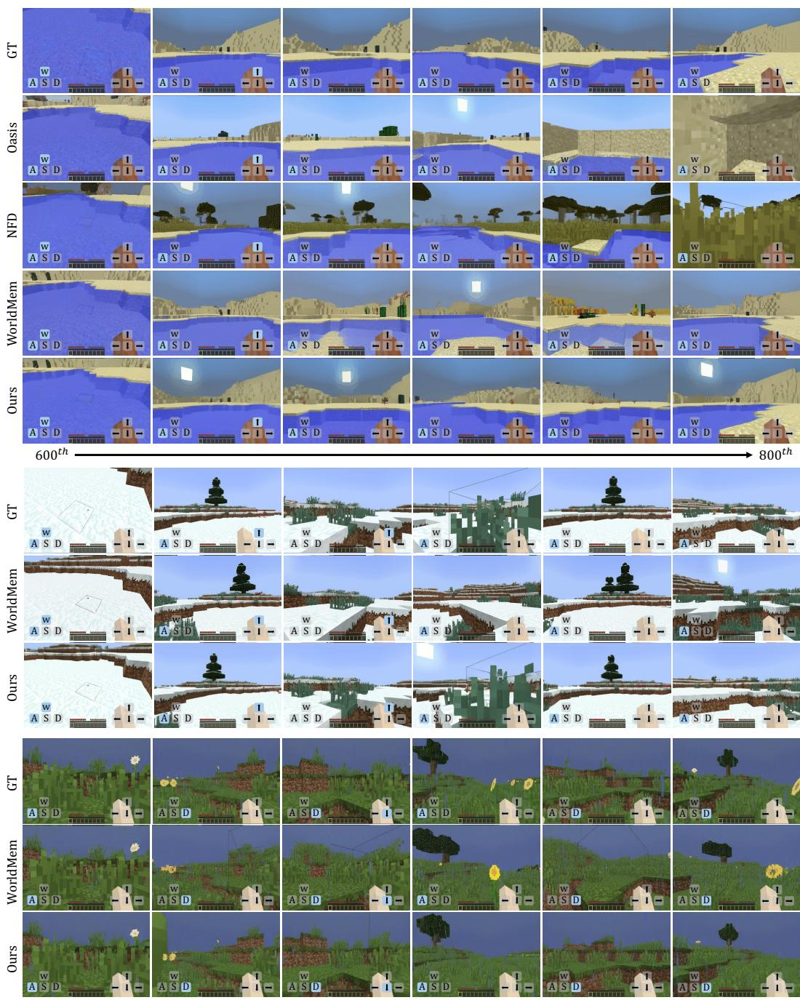
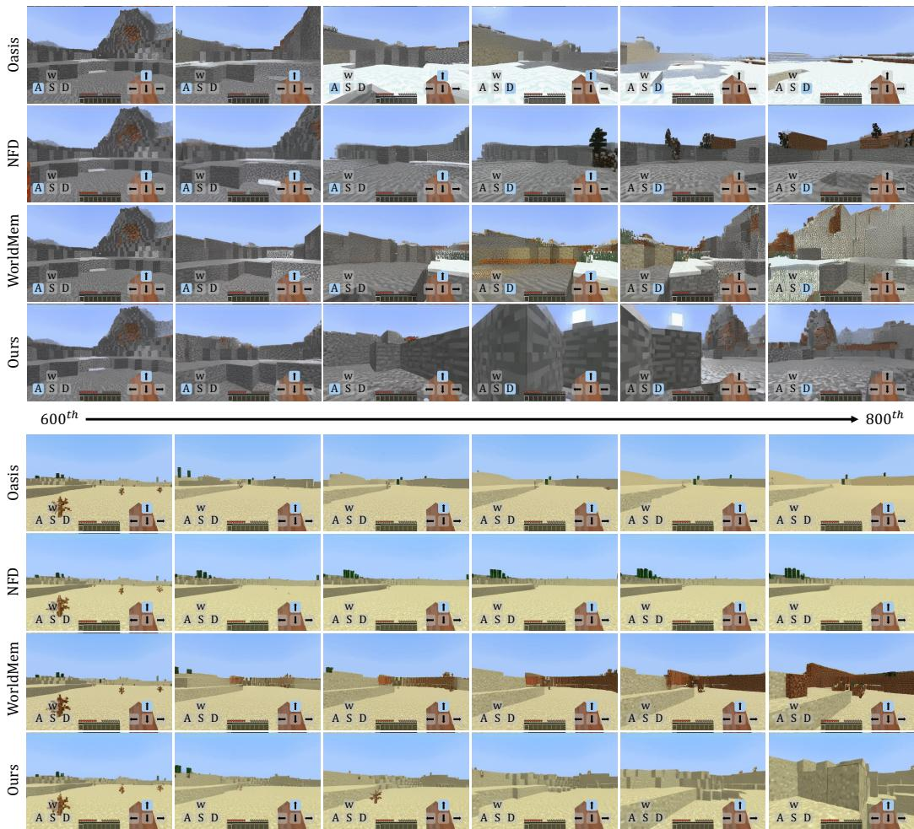

# 1. Bibliographic Information

## 1.1. Title
Memory Forcing: Spatio-Temporal Memory for Consistent Scene Generation on Minecraft

The title clearly states the paper's core contribution: a technique named "Memory Forcing" that utilizes a combination of spatial and temporal memory to achieve consistent scene generation. The application domain is explicitly identified as Minecraft, a popular open-world game that serves as a challenging benchmark for world modeling and interactive AI.

## 1.2. Authors
Junchao Huang, Xinting Hu, Boyao Han, Shaoshuai Shi, Zhuotao Tian, Tianyu He, Li Jiang.

The authors are affiliated with several prominent academic institutions and corporate research labs, including:
*   The Chinese University of Hong Kong, Shenzhen
*   Shenzhen Loop Area Institute
*   The University of Hong Kong
*   Voyager Research, Didi Chuxing
*   Microsoft Research

    This collaboration between academia and industry research giants like Microsoft and Didi Chuxing suggests a strong focus on both foundational research and practical, scalable applications.

## 1.3. Journal/Conference
The paper is available on arXiv, which is a preprint server for academic articles. The provided publication date of October 2025 indicates this is likely a placeholder for a future submission to a top-tier conference in computer vision or machine learning, such as CVPR, NeurIPS, or ICLR. While not yet peer-reviewed, its availability on arXiv allows for early dissemination of its findings to the research community.

## 1.4. Publication Year
The publication timestamp is `2025-10-03T17:35:16.000Z`, as stated on the preprint.

## 1.5. Abstract
The abstract introduces the core challenge for autoregressive video diffusion models in interactive environments like Minecraft: balancing the generation of novel content during exploration with maintaining spatial consistency when revisiting areas. The authors identify a trade-off: `temporal-only memory` is good for exploration but lacks long-term consistency, while adding `spatial memory` improves consistency but can hurt generation quality in new scenes. The paper proposes **Memory Forcing**, a learning framework to resolve this trade-off. It consists of two main components:
1.  **Training Protocols:** `Hybrid Training` teaches the model to use temporal memory for exploration and spatial memory for revisits. `Chained Forward Training` simulates inference-time error accumulation to encourage reliance on spatial memory.
2.  **Geometry-indexed Spatial Memory:** An efficient memory system using `Incremental 3D Reconstruction` to build a 3D cache and `Point-to-Frame Retrieval` to efficiently access relevant past views.
    The abstract concludes that experiments show Memory Forcing achieves superior spatial consistency and generative quality while remaining computationally efficient for long video sequences.

## 1.6. Original Source Link
*   **Official Source:** https://arxiv.org/abs/2510.03198
*   **PDF Link:** https://arxiv.org/pdf/2510.03198v1.pdf
*   **Publication Status:** This is a preprint and has not yet undergone formal peer review.

# 2. Executive Summary

## 2.1. Background & Motivation
The core problem this paper addresses is the **long-term consistency** of generative world models in interactive 3D environments. Autoregressive video models, which generate future frames based on past ones, are a promising approach for simulating such worlds. However, they are fundamentally limited by their `context window`—the finite number of past frames they can consider. This limitation creates a critical trade-off:

*   **Exploration vs. Consistency:** When an agent explores a new area, the model needs to generate novel, high-quality content. Here, recent temporal frames (what the agent just saw) are the most useful context. However, when the agent returns to a previously visited location, the model must remember what that location looked like to maintain a consistent world. Relying only on recent temporal frames will cause the model to "forget" the location and regenerate it differently, breaking the illusion of a stable world.
*   **The Failure of Naive Memory:** A simple solution is to add a long-term spatial memory, allowing the model to retrieve past views of the current location. However, prior work has shown this can degrade performance in new scenes. If the model is exploring an area it has never seen before, there is no relevant spatial memory to retrieve. An over-reliance on this (empty or irrelevant) memory can harm the quality of newly generated frames.
*   **Training-Inference Mismatch:** A standard training technique called `teacher forcing` feeds the model with ground-truth past frames. During inference (actual gameplay), the model must rely on its *own* previously generated frames, which may contain errors. This mismatch can lead to error accumulation, where small mistakes cascade into major scene distortions.

    The paper's motivation is to create a model that can **intelligently switch** between relying on short-term temporal memory for exploration and long-term spatial memory for revisits, thereby solving the exploration-consistency trade-off.

## 2.2. Main Contributions / Findings
The paper makes three primary contributions to address this challenge:

1.  **Memory Forcing Framework:** A novel learning framework that explicitly trains a video diffusion model to balance the use of temporal and spatial memory. This is the central conceptual contribution.
2.  **Specialized Training Protocols:**
    *   **Hybrid Training:** A strategy that exposes the model to distinct gameplay scenarios during training. On data featuring exploration (`VPT` dataset), it's trained with only temporal context. On data with frequent revisits (`MineDojo` dataset), it's trained with both spatial and temporal context. This teaches the model *when* to use each type of memory.
    *   **Chained Forward Training (CFT):** A technique that mitigates the training-inference mismatch. During training, it uses the model's own predictions as context for subsequent steps, simulating inference conditions. This "forces" the model to learn to correct its own drift, particularly by relying on the stable long-term spatial memory during revisits.
3.  **Efficient Geometry-indexed Spatial Memory:** A highly efficient and robust memory system that outperforms prior methods. Instead of retrieving past frames based on appearance or camera pose (which can be slow and unreliable), it builds a sparse 3D point cloud of the world. It then retrieves relevant past frames by checking which historical frames contributed to the points currently visible to the agent. This approach is much faster and scales with the size of the explored area, not the length of the gameplay session.

    The key finding is that this combined approach successfully resolves the trade-off. The resulting model achieves state-of-the-art performance in long-term spatial consistency, generalization to unseen environments, and overall generative quality, all while being significantly more computationally efficient than previous memory-augmented models.

# 3. Prerequisite Knowledge & Related Work

## 3.1. Foundational Concepts

*   **Autoregressive Models:** These are models that generate data sequences one step at a time, where each new step is conditioned on the previous steps. For example, in language, a model predicts the next word based on the sentence so far. In this paper, the model predicts the next video frame based on a history of previous frames and player actions.
*   **Diffusion Models:** These are a class of powerful generative models. The core idea involves two processes:
    1.  **Forward Process (Noising):** Start with a clean image (or video frame) and gradually add a small amount of random noise over many steps until it becomes pure noise. This process is fixed and does not involve learning.
    2.  **Reverse Process (Denoising):** Train a neural network to reverse this process. The network takes a noisy image and a timestep as input and predicts the noise that was added. By repeatedly subtracting the predicted noise, the model can generate a clean image starting from pure random noise. This paper uses a diffusion model as the backbone for generating each video frame.
*   **Diffusion Transformer (DiT):** A specific architecture for diffusion models proposed by Peebles & Xie (2023). It replaces the commonly used U-Net backbone with a Transformer. Transformers are known for their scalability and strong performance in various domains, and DiT showed that they are also highly effective for diffusion-based image generation. This paper's model uses a DiT backbone.
*   **Teacher Forcing:** A common training strategy for autoregressive models. During training, at each step, the model is given the ground-truth previous element as input to predict the current element. For example, to predict frame $t$, it is given the real frame `t-1`. This makes training stable and efficient. However, it creates a discrepancy with inference time, where the model must use its *own* generated frame $\hat{x}_{t-1}$ as input, which might be imperfect. This can lead to compounding errors, a problem known as **exposure bias**.
*   **3D Reconstruction:** The process of creating a three-dimensional representation of an object or scene from a set of two-dimensional images. This paper uses a learning-based approach to create a `point cloud` (a set of 3D points in space) from the video frames generated during gameplay. This 3D representation serves as the geometric index for its memory system.

## 3.2. Previous Works

*   **Diffusion Forcing (Chen et al., 2024):** This work provides the foundational autoregressive framework for the paper. It allows a diffusion model to be conditioned on a flexible combination of clean (ground-truth) and noisy (to-be-generated) frames within a single sequence, which is essential for autoregressive generation.
*   **WorldMem (Xiao et al., 2025):** This is a key baseline and direct predecessor in terms of adding long-term memory to Minecraft world models. WorldMem stores all past frames in a memory bank and retrieves relevant ones based on **pose similarity** (i.e., finding past frames where the camera was in a similar position and orientation). The current paper identifies two major flaws with this approach:
    1.  **Inefficiency:** Retrieval requires searching through the entire memory bank, which grows linearly with time. This becomes very slow for long sequences ($O(n)$ complexity).
    2.  **Poor Generalization:** The paper notes that WorldMem struggles to generate high-quality novel scenes, likely due to an over-reliance on its spatial memory mechanism.
*   **NFD (Cheng et al., 2025) and Oasis (Decart et al., 2024):** These are representative temporal-only autoregressive models for Minecraft. They achieve high-quality frame generation for short sequences by relying only on a sliding window of recent frames. However, they have no mechanism for long-term memory, so they fail to maintain spatial consistency when revisiting locations.
*   **VGGT (Wang et al., 2025a) and DUSt3R (Wang et al., 2024):** These are state-of-the-art models for learning-based 3D reconstruction. They can predict depth maps and relative camera poses from pairs or sets of images. The paper leverages `VGGT` to perform the incremental 3D reconstruction needed for its geometry-indexed memory.

## 3.3. Technological Evolution
The field of interactive world modeling has evolved rapidly:
1.  **Early Autoregressive Models:** Initial approaches focused on predicting future frames based on past frames within a short context window. These models were good at short-term dynamics but lacked any long-term memory.
2.  **Diffusion-based World Models (`NFD`, `Oasis`):** The advent of diffusion models brought a significant leap in visual fidelity. These models could generate much higher-quality and more realistic interactive video sequences. However, they were still constrained by the temporal context window and suffered from a lack of spatial consistency.
3.  **Introduction of Long-Term Memory (`WorldMem`):** Researchers began to address the consistency problem by adding explicit external memory modules. `WorldMem` was a pioneering effort, using a pose-based retrieval system. This proved the concept was viable but exposed new challenges related to efficiency and the trade-off between consistency and new scene generation.
4.  **Memory Forcing (This Paper):** This paper represents the next step in this evolution. It moves beyond simply *adding* a memory module and focuses on *how the model learns to use it*. It introduces a more sophisticated training paradigm to balance memory usage and a more efficient, geometry-based retrieval mechanism to overcome the scaling issues of previous methods.

## 3.4. Differentiation Analysis
Compared to previous work, this paper's core innovations are:
*   **Training Paradigm vs. Architectural Change:** While `WorldMem` focused on the architectural addition of a memory bank, Memory Forcing's main innovation is in the **training process**. `Hybrid Training` and `Chained Forward Training` are designed to explicitly teach the model the nuanced skill of when and how to rely on its different memory sources. This is a more fundamental solution to the consistency-vs-exploration trade-off.
*   **Geometric vs. Pose-based Retrieval:** The memory retrieval mechanism is fundamentally different. `WorldMem` asks, "Where have I been that is near my current camera pose?" This can be brittle and inefficient. Memory Forcing asks, "Which past frames are responsible for the geometry I am looking at right now?" This is more robust to changes in viewing angle and is far more efficient, as it doesn't require a linear scan of all past frames. The complexity becomes constant time ($O(1)$) with respect to sequence length.
*   **Solving the Trade-off:** The paper explicitly frames its contribution as solving the trade-off that `WorldMem`'s approach created. It doesn't just improve consistency; it does so while also improving (or at least not degrading) the model's ability to generate high-quality new scenes.

# 4. Methodology

## 4.1. Principles
The central principle of Memory Forcing is to train a video generation model to develop a **dynamic memory access policy**. The model should learn to rely on its short-term **temporal memory** (recent frames) when exploring new environments to ensure high-quality, fluid generation. Conversely, when it revisits a previously seen location, it must learn to query its long-term **spatial memory** to retrieve relevant past views and ensure the regenerated scene is consistent with what it saw before. This is achieved by combining a sophisticated training strategy that exposes the model to both scenarios with an efficient, geometry-aware memory architecture.

## 4.2. Core Methodology In-depth (Layer by Layer)

### 4.2.1. Preliminaries: Autoregressive Video Diffusion
The method builds upon autoregressive video diffusion models. A video sequence is denoted as $X^{1:T} = x_1, x_2, \ldots, x_T$. In the diffusion framework, each frame $x_t$ is corrupted with noise to a certain level $k_t$. The model, parameterized by $\theta$, is trained to predict the original noise $\epsilon$ from the noisy sequence $\tilde{X}^{1:T}$. The training objective is to minimize the difference between the true noise and the predicted noise:

\$
\mathcal { L } = \mathbb { E } _ { k ^ { 1 : T } , X ^ { 1 : T } , \epsilon ^ { 1 : T } } \left[ \vert \epsilon ^ { 1 : T } - \epsilon _ { \theta } ( \tilde { X } ^ { 1 : T } , k ^ { 1 : T } ) \vert ^ { 2 } \right]
\$

*   $X^{1:T}$: The sequence of clean video frames.
*   $k^{1:T}$: The sequence of noise levels for each frame.
*   $\epsilon^{1:T}$: The sequence of random noise vectors sampled from a standard normal distribution.
*   $\tilde{X}^{1:T}$: The sequence of noisy frames, created by adding noise $\epsilon^{1:T}$ to $X^{1:T}$ according to levels $k^{1:T}$.
*   $\epsilon_{\theta}(\cdot)$: The neural network (the DiT model) that takes the noisy frames and noise levels as input and predicts the noise.

    For interactive gameplay in Minecraft, the model is also conditioned on a sequence of player actions $\mathcal{A}^{1:T}$, so the prediction becomes $\epsilon_{\theta}(\tilde{X}^{1:T}, k^{1:T}, \mathcal{A}^{1:T})$.

### 4.2.2. Memory-Augmented Architecture
The model's architecture is based on a Diffusion Transformer (DiT). To incorporate long-term memory, it is augmented with `Memory Cross-Attention` layers within each DiT block.

The overall data flow for generating a new frame is illustrated in the paper's Figure 2.

![Figure 2: Memory Forcing Pipeline. Our framework combines spatial and temporal memory for video generation. 3D geometry is maintained through streaming reconstruction of key frames along the camera trajectory. During generation, Point-to-Frame Retrieval maps spatial context to historical frames, which are integrated with temporal memory and injected together via memory crossattention in the DiT backbone. Chained Forward Training creates larger pose variations, encouraging the model to effectively utilize spatial memory for maintaining long-term geometric consistency.](images/2.jpg)
*该图像是示意图，展示了Memory Forcing框架的流程。图中结合了空间和时间记忆，用于视频生成。3D几何通过关键帧的流式重建进行维护。在生成过程中，Point-to-Frame检索将空间上下文映射到历史帧，随后与时间记忆结合，通过内存交叉注意力注入到DiT骨干中。*

1.  **Context Assembly:** The model takes recent temporal frames and player actions as primary input.
2.  **Memory Retrieval:** The `Geometry-indexed Spatial Memory` system (detailed in 4.2.4) retrieves a set of relevant historical frames.
3.  **Memory Injection:** The retrieved historical frames are fed into the `Memory Cross-Attention` layers. Here, the current frame's internal representations (tokens) act as queries, while the retrieved historical frames provide the keys and values. The formula is:

    \$
    \mathrm { A t t e n t i o n } ( \tilde { Q } , \tilde { K } _ { \mathrm { s p a t i a l } } , V _ { \mathrm { s p a t i a l } } ) = \mathrm { S o f t m a x } \left( \frac { \tilde { Q } \tilde { K } _ { \mathrm { s p a t i a l } } ^ { T } } { \sqrt { d } } \right) V _ { \mathrm { s p a t i a l } }
    \$

    *   $\tilde{Q}$: Queries derived from the current frame's tokens.
    *   $\tilde{K}_{\mathrm{spatial}}, V_{\mathrm{spatial}}$: Keys and Values derived from the retrieved historical spatial memory frames.
    *   The queries and keys are augmented with **Plücker coordinates**, a mathematical representation of lines in 3D space, to encode the relative camera poses between the current view and the historical views. This gives the model geometric context about how the views relate to each other.

### 4.2.3. Autoregressive Diffusion Training with Memory Forcing
This is the core of the methodology, comprising two novel training protocols.

#### 4.2.3.1. Hybrid Training
This protocol teaches the model *when* to use spatial vs. temporal memory by training it on different types of data with different memory configurations. The training context window $\mathcal{W}$ of size $L$ is split into two halves:
*   The first $L/2$ frames are always the most recent temporal context, $\mathcal{T}_{\mathrm{fixed}}$.
*   The second $L/2$ frames, $\mathcal{M}_{\mathrm{context}}$, are chosen dynamically based on the dataset.

    The full context window $\mathcal{W}$ is constructed as:
\$
{ \mathcal { W } } = [ { \mathcal { T } } _ { \mathrm { f i xed } } , { \mathcal { M } } _ { \mathrm { c o n t e x t } } ] = \left\{ { \begin{array} { l l } { [ { \mathcal { T } } _ { \mathrm { f i xed } } , { \mathcal { M } } _ { \mathrm { s p a t i a l } } ] } & {\text{on revisit-heavy data (MineDojo)}} \\ { [ { \mathcal { T } } _ { \mathrm { f i xed } } , { \mathcal { T } } _ { \mathrm { e x t e n ded } } ] } & {\text{on exploration-heavy data (VPT)}} \end{array} } \right.
\$

*   $\mathcal{M}_{\mathrm{spatial}}$: Long-term spatial memory frames retrieved using the geometry-indexed system.
*   $\mathcal{T}_{\mathrm{extended}}$: Additional temporal frames from earlier in the sequence (but still relatively recent).

    By training on the `MineDojo` dataset (synthetic trajectories with many revisits) with spatial memory, the model learns to use this memory for consistency. By training on the `VPT` dataset (human gameplay with more exploration) with only temporal memory, it learns to generate novel scenes without relying on spatial cues.

#### 4.2.3.2. Chained Forward Training (CFT)
This protocol addresses the train-test mismatch (exposure bias) from teacher forcing. Instead of always using ground-truth frames as context, CFT uses the model's own (quickly generated) predictions from previous steps.

`Algorithm 1` from the paper details this process:

**Algorithm 1 Chained Forward Training (CFT)**
> **Require:** Video $\mathbf{x}$, conditioning inputs $\mathcal{C}$, forward steps $T$, window size $W$, model $\epsilon_{\theta}$
> 1: Initialize $\mathcal{F}_{\mathrm{pred}} \leftarrow \emptyset$, $\mathcal{L}_{\mathrm{total}} \leftarrow 0$
> 2: **for** $j = 0$ **to** $T - 1$ **do**
> 3:    Construct window $\mathcal{W}_j$:
> 4:    **for** $k \in [j, j + W - 1]$ **do**
> 5:        **if** $k \in \mathcal{F}_{\mathrm{pred}}$ **then**
> 6:            $\mathcal{W}_j[k - j] \leftarrow \mathcal{F}_{\mathrm{pred}}[k]$ {Use predicted frame}
> 7:        **else**
> 8:            $\mathcal{W}_j[k - j] \leftarrow \mathbf{x}_k$ {Use ground truth frame}
> 9:        **end if**
> 10:   **end for**
> 11:   Compute $\mathcal{L}_j \gets \|\epsilon - \epsilon_{\theta}(\mathcal{W}_j, \mathcal{C}_j, t)\|^2$, update $\mathcal{L}_{\mathrm{total}} \leftarrow \mathcal{L}_{\mathrm{total}} + \mathcal{L}_j$
> 12:   **if** $j < T - 1$ **then**
> 13:       $\hat{\mathbf{x}}_{j + W - 1} \leftarrow \mathrm{denoise}(\mathcal{W}_j, \mathcal{C}_j)$ {Generate with fewer steps, no gradients}
> 14:       $\mathcal{F}_{\mathrm{pred}}[j + W - 1] \leftarrow \hat{\mathbf{x}}_{j + W - 1}$ {Store for next window}
> 15:   **end if**
> 16: **end for**
> 17: **return** $\mathcal{L}_{\mathrm{chain}} \leftarrow \mathcal{L}_{\mathrm{total}} / T$

The training objective for CFT is:
\$
\mathcal { L } _ { \mathrm { c h a i n } } = \frac { 1 } { T } \sum _ { j = 0 } ^ { T - 1 } \mathbb { E } _ { t , \epsilon } \left[ \| \epsilon - \epsilon _ { \theta } ( \mathcal { W } _ { j } ( \mathbf { x } , \hat { \mathbf { x } } ) , \mathcal { C } _ { j } , t ) \| ^ { 2 } \right]
\$

*   $\mathcal{W}_j(\mathbf{x}, \hat{\mathbf{x}})$: The context window at step $j$, which contains a mix of ground-truth frames ($\mathbf{x}$) and previously predicted frames ($\hat{\mathbf{x}}$).
*   $\mathcal{C}_j$: The conditioning inputs for window $j$, including actions $A_j$, poses $\mathcal{P}_j$, and spatial memory $\mathcal{M}_{\mathrm{spatial}}$.

    This process forces the model to become robust to its own prediction errors. When pose drift occurs due to chained predictions, the temporal context becomes less reliable. This encourages the model to rely more on the stable, globally-consistent spatial memory to correct its trajectory and maintain scene consistency.

### 4.2.4. Geometry-indexed Spatial Memory
This is the hardware of the memory system, composed of two parts.

#### 4.2.4.1. Incremental 3D Reconstruction
The system builds and maintains a global 3D point cloud of the explored world in a streaming fashion.
1.  **Keyframe Selection:** Not every frame is used for reconstruction. A frame is selected as a **keyframe** only if it provides significant new spatial information or if there isn't enough historical context available for the current view.
2.  **Depth Estimation:** The `VGGT` network is used to predict relative depth maps for frames in a processing window.
3.  **Scale Alignment:** A critical step described in Appendix A.1 is the `Cross-Window Scale Alignment Module`. Since `VGGT` produces depth maps with relative, not absolute, scale, the scale can differ between processing windows. This module finds overlapping regions between new and old frames and computes a scale factor to ensure all depth maps are in a consistent global scale.
4.  **Back-projection:** Using the camera's pose (position and orientation), the depth map is back-projected to create a 3D point cloud. The camera extrinsics matrix $\mathbf{E}$ is calculated as:
    \$
    { \bf E } = \left[ \begin{array} { c c } { { \bf R } ( pitch , yaw ) } & { - { \bf R C } } \\ { { \bf 0 } ^ { T } } & { 1 } \end{array} \right]
    \$
    *   $\mathbf{R}(pitch, yaw)$: The rotation matrix derived from the camera's orientation.
    *   $\mathbf{C} = [x, y, z]^T$: The camera's position vector.
5.  **Global Integration:** The newly reconstructed points are integrated into the global point cloud. A **voxel downsampling** strategy is used to keep the point cloud sparse and prevent its density from growing uncontrollably in frequently visited areas. This ensures memory usage scales with explored area, not time.

#### 4.2.4.2. Point-to-Frame Retrieval
This is the retrieval mechanism. When the model needs to generate a new frame:
1.  **Projection:** The global 3D point cloud is projected onto the current camera's view plane to determine which points are visible.
2.  **Source Frame Counting:** Each point in the cloud is tagged with the index of the keyframe it was created from. The system counts the occurrences of each source frame index among the currently visible points.
3.  **Selection:** The top-k (in this paper, k=8) most frequently occurring source frames are selected as the spatial memory for the current step. The selection is formalized as:
    \$
    \mathcal { H } _ { t } = \arg \operatorname* { m a x } _ { k = 1 , \ldots , 8 } \mathrm { C o u n t } ( \operatorname { s o u r c e } ( p _ { i } ) : p _ { i } \in \mathcal { P } _ { \mathrm { v i s i b l e } } ^ { t } )
    \$
    *   $\mathcal{P}_{\mathrm{visible}}^t$: The set of points from the global point cloud visible at time $t$.
    *   $\mathrm{source}(p_i)$: A function that returns the source frame index for point $p_i$.
    *   $\mathcal{H}_t$: The set of top-8 historical frames retrieved for time $t$.

        This method is highly efficient ($O(1)$ complexity) because the number of visible points is bounded, regardless of how long the agent has been playing. It is also robust because it relies on shared 3D geometry rather than sensitive camera pose or appearance matching.

# 5. Experimental Setup

## 5.1. Datasets
The experiments utilize a combination of existing and newly constructed datasets to evaluate the model from multiple angles.

*   **Training Datasets:**
    *   **VPT (Baker et al., 2022):** A large-scale dataset of human Minecraft gameplay videos. This data is characterized by natural exploration and complex behaviors. It is used in `Hybrid Training` to teach the model new scene generation with an extended temporal context.
    *   **MineDojo (Fan et al., 2022):** A framework for creating synthetic data in Minecraft. The authors generate a dataset following the configuration of `WorldMem`, which includes long action sequences with frequent revisits to the same locations. This is used in `Hybrid Training` to teach the model to use spatial memory for consistency.
*   **Evaluation Datasets (Constructed using MineDojo):**
    *   **Long-term Memory:** 150 long video sequences (1,500 frames each) with significant revisits, designed to specifically test the model's ability to maintain spatial consistency over time.
    *   **Generalization Performance:** 150 sequences (800 frames each) from nine Minecraft terrain types *not seen* during training. This tests the model's ability to adapt to novel environments.
    *   **Generation Performance:** 300 sequences (800 frames each) in new environments to assess the general quality and coherence of the generated video.

## 5.2. Evaluation Metrics
The paper uses four standard metrics to evaluate the quality of the generated videos.

*   **Fréchet Video Distance (FVD)**
    1.  **Conceptual Definition:** FVD measures the perceptual quality and temporal consistency of generated videos. It compares the distribution of features extracted from generated videos to the distribution of features from real videos. A lower FVD score indicates that the generated videos are more similar to real videos in terms of appearance, motion, and temporal dynamics.
    2.  **Mathematical Formula:** FVD is calculated as the Fréchet distance (or Wasserstein-2 distance) between two multivariate Gaussian distributions fitted to the features:
        \$
        \text{FVD}(g, r) = \left\| \mu_g - \mu_r \right\|_2^2 + \text{Tr}\left(\Sigma_g + \Sigma_r - 2(\Sigma_g \Sigma_r)^{1/2}\right)
        \$
    3.  **Symbol Explanation:**
        *   $g$ and $r$ represent the sets of generated and real video features, respectively.
        *   $\mu_g$ and $\mu_r$ are the mean vectors of the features.
        *   $\Sigma_g$ and $\Sigma_r$ are the covariance matrices of the features.
        *   $\text{Tr}(\cdot)$ denotes the trace of a matrix.
*   **Learned Perceptual Image Patch Similarity (LPIPS)**
    1.  **Conceptual Definition:** LPIPS measures the perceptual similarity between two images (or frames). Unlike pixel-wise metrics like PSNR, it uses features from a pre-trained deep neural network (like AlexNet or VGG) to compare images in a way that aligns better with human perception. A lower LPIPS score means the images are more perceptually similar.
    2.  **Mathematical Formula:**
        \$
        d(x, x_0) = \sum_l \frac{1}{H_l W_l} \sum_{h,w} \left\| w_l \odot (\hat{y}_{hw}^l - \hat{y}_{0hw}^l) \right\|_2^2
        \$
    3.  **Symbol Explanation:**
        *   $x$ and $x_0$ are the two images being compared.
        *   $l$ indexes the layers of the deep network.
        *   $\hat{y}^l, \hat{y}_0^l$ are the feature activations from layer $l$ for each image, normalized channel-wise.
        *   $w_l$ are channel-wise weights to scale the importance of each channel's contribution.
        *   The summation is over all spatial locations `(h, w)`.
*   **Peak Signal-to-Noise Ratio (PSNR)**
    1.  **Conceptual Definition:** PSNR is a classic metric that measures the pixel-level reconstruction quality of an image by comparing it to a ground-truth image. It is based on the mean squared error (MSE) between the two images. A higher PSNR indicates lower error and better pixel-wise fidelity.
    2.  **Mathematical Formula:**
        \$
        \text{PSNR} = 10 \cdot \log_{10}\left(\frac{\text{MAX}_I^2}{\text{MSE}}\right)
        \$
    3.  **Symbol Explanation:**
        *   $\text{MAX}_I$ is the maximum possible pixel value of the image (e.g., 255 for an 8-bit grayscale image).
        *   `\text{MSE} = \frac{1}{mn} \sum_{i=0}^{m-1} \sum_{j=0}^{n-1} [I(i,j) - K(i,j)]^2`, where $I$ is the ground-truth image and $K$ is the generated image of size $m \times n$.
*   **Structural Similarity Index Measure (SSIM)**
    1.  **Conceptual Definition:** SSIM measures the structural similarity between two images, considering luminance, contrast, and structure. It is designed to be more consistent with human perception of image quality than PSNR. An SSIM value is between -1 and 1, where 1 indicates a perfect match.
    2.  **Mathematical Formula:**
        \$
        \text{SSIM}(x, y) = \frac{(2\mu_x\mu_y + c_1)(2\sigma_{xy} + c_2)}{(\mu_x^2 + \mu_y^2 + c_1)(\sigma_x^2 + \sigma_y^2 + c_2)}
        \$
    3.  **Symbol Explanation:**
        *   $\mu_x, \mu_y$ are the means of images $x$ and $y$.
        *   $\sigma_x^2, \sigma_y^2$ are the variances of images $x$ and $y$.
        *   $\sigma_{xy}$ is the covariance of $x$ and $y$.
        *   $c_1 = (k_1 L)^2$ and $c_2 = (k_2 L)^2$ are stabilization constants, where $L$ is the dynamic range of pixel values.

## 5.3. Baselines
The proposed method is compared against three representative baseline models:
*   **Oasis (Decart et al., 2024):** A strong temporal-only autoregressive video model for Minecraft.
*   **NFD (Cheng et al., 2025):** Another state-of-the-art temporal-only model known for its high-quality generation.
*   **WorldMem (Xiao et al., 2025):** The key baseline with long-term spatial memory, using a pose-based retrieval mechanism.

    This selection allows for a comprehensive comparison against both models that excel at new scene generation (Oasis, NFD) and models designed for long-term consistency (WorldMem).

# 6. Results & Analysis

## 6.1. Core Results Analysis
The main quantitative results are presented in Table 1, which evaluates the models on three distinct tasks: Long-term Memory, Generalization, and Generation Performance.

The following are the results from Table 1 of the original paper:

<table>
<thead>
<tr>
<th rowspan="2">Method</th>
<th colspan="4">Long-term Memory</th>
<th colspan="4">Generalization Performance</th>
<th colspan="4">Generation Performance</th>
</tr>
<tr>
<th>FVD ↓</th>
<th>PSNR ↑</th>
<th>SSIM↑</th>
<th>LPIPS ↓</th>
<th>FVD ↓</th>
<th>PSNR ↑</th>
<th>SSIM ↑</th>
<th>LPIPS ↓</th>
<th>FVD ↓</th>
<th>PSNR ↑</th>
<th>SSIM↑</th>
<th>LPIPS ↓</th>
</tr>
</thead>
<tbody>
<tr>
<td>Oasis</td>
<td>196.8</td>
<td>16.83</td>
<td>0.5654</td>
<td>0.3791</td>
<td>477.3</td>
<td>14.74</td>
<td>0.5175</td>
<td>0.5122</td>
<td>285.7</td>
<td>14.51</td>
<td>0.5063</td>
<td>0.4704</td>
</tr>
<tr>
<td>NFD</td>
<td>220.8</td>
<td>16.35</td>
<td>0.5819</td>
<td>0.3891</td>
<td>442.6</td>
<td>15.49</td>
<td>0.5564</td>
<td>0.4638</td>
<td>349.6</td>
<td>14.64</td>
<td>0.5417</td>
<td>0.4343</td>
</tr>
<tr>
<td>WorldMem</td>
<td>122.2</td>
<td>19.32</td>
<td>0.5983</td>
<td>0.2769</td>
<td>328.3</td>
<td>16.23</td>
<td>0.5178</td>
<td>0.4336</td>
<td>290.8</td>
<td>14.71</td>
<td>0.4906</td>
<td>0.4531</td>
</tr>
<tr>
<td>Ours</td>
<td><strong>84.9</strong></td>
<td><strong>21.41</strong></td>
<td><strong>0.6692</strong></td>
<td><strong>0.2156</strong></td>
<td><strong>253.7</strong></td>
<td><strong>19.86</strong></td>
<td><strong>0.6341</strong></td>
<td><strong>0.2896</strong></td>
<td><strong>185.9</strong></td>
<td><strong>17.99</strong></td>
<td><strong>0.6155</strong></td>
<td><strong>0.3031</strong></td>
</tr>
</tbody>
</table>

*   **Long-term Memory:** In this setting, the proposed method (`Ours`) dramatically outperforms all baselines. It achieves a much lower FVD (84.9 vs. 122.2 for `WorldMem`) and LPIPS, and significantly higher PSNR and SSIM. This confirms its superior ability to maintain spatial consistency when revisiting locations. The temporal-only models (`Oasis`, `NFD`) perform poorly, as expected.
*   **Generalization Performance:** When tested on unseen terrains, the proposed method again shows a clear advantage. It achieves the best scores across all four metrics by a large margin. This result is particularly important because it demonstrates that the `Memory Forcing` framework successfully overcomes the key limitation of `WorldMem`, which struggles with novel scenes.
*   **Generation Performance:** Even in general new environments, the proposed method is superior. This indicates that the `Hybrid Training` strategy was effective in teaching the model to rely on its strong temporal generation capabilities when spatial memory is not relevant.

    The qualitative results in Figure 3 and Figure 4 corroborate these findings. Figure 3 shows that when returning to a location, the proposed model regenerates it almost identically to the ground truth, while `WorldMem` produces artifacts and the other baselines fail completely. Figure 4 shows that in new and unseen environments, the proposed model generates high-quality, coherent scenes, while baselines suffer from artifacts, inconsistencies, or oversimplified visuals.

    
    *该图像是图表，展示了不同模型在重新访问先前观察区域时，维持空间一致性和场景连贯性的能力比较。通过GT、Oasis、NFD、WorldMem和Ours模型的结果展示，模型在生成过程中如何处理这些元素。*

### 6.2. Efficiency of Geometry-Indexed Spatial Memory
Table 2 provides a compelling analysis of the computational efficiency of the proposed memory system compared to `WorldMem`.

The following are the results from Table 2 of the original paper:

<table>
<thead>
<tr>
<th rowspan="2">Frame Range</th>
<th colspan="2">0-999</th>
<th colspan="2">1000-1999</th>
<th colspan="2">2000-2999</th>
<th colspan="2">3000-3999</th>
<th colspan="2">Total (0-3999)</th>
</tr>
<tr>
<th>Speed (FPS ↑)</th>
<th>Mem. (Count ↓)</th>
<th>Speed (FPS ↑)</th>
<th>Mem. (Count ↓)</th>
<th>Speed (FPS ↑)</th>
<th>Mem. (Count ↓)</th>
<th>Speed (FPS ↑)</th>
<th>Mem. (Count ↓)</th>
<th>Speed (FPS ↑)</th>
<th>Mem. (Count ↓)</th>
</tr>
</thead>
<tbody>
<tr>
<td>WorldMem</td>
<td>10.11</td>
<td>+1000</td>
<td>3.43</td>
<td>+1000</td>
<td>2.06</td>
<td>+1000</td>
<td>1.47</td>
<td>+1000</td>
<td>4.27</td>
<td>4000</td>
</tr>
<tr>
<td>Ours</td>
<td>18.57</td>
<td>+25.45</td>
<td>27.08</td>
<td>+19.70</td>
<td>41.36</td>
<td>+14.55</td>
<td>37.84</td>
<td>+12.95</td>
<td><strong>31.21</strong></td>
<td><strong>72.65</strong></td>
</tr>
</tbody>
</table>

*   **Retrieval Speed:** `WorldMem`'s retrieval speed degrades drastically as the sequence length increases (from 10.11 FPS to 1.47 FPS). This is a direct consequence of its $O(n)$ linear search over an ever-growing memory bank. In contrast, the proposed method's speed remains high and even increases, likely because a more complete 3D map allows for faster and more stable retrieval. Overall, it is **7.3 times faster**.
*   **Memory Storage:** `WorldMem` stores every frame, resulting in 4000 frames stored after a 4000-frame sequence. The proposed method's selective keyframe approach stores only 72.65 frames on average, a **98.2% reduction**. This confirms that memory usage scales with spatial coverage, not time.

    These results demonstrate that the `Geometry-indexed Spatial Memory` is not just more effective but also vastly more scalable for long-term interactive applications.

## 6.3. Ablation Studies / Parameter Analysis
Table 3 analyzes the contribution of the key components of the `Memory Forcing` framework.

The following are the results from Table 3 of the original paper:

<table>
<thead>
<tr>
<th colspan="2">Training Strategies</th>
<th colspan="2">Retrieval Strategies</th>
<th colspan="4">Metrics</th>
</tr>
<tr>
<th>FT</th>
<th>HT-w/o-CFT</th>
<th>MF</th>
<th>Pose-based</th>
<th>3D-based</th>
<th>FVD ↓</th>
<th>PSNR ↑</th>
<th>SSIM ↑</th>
<th>LPIPS ↓</th>
</tr>
</thead>
<tbody>
<tr>
<td>✓</td>
<td></td>
<td></td>
<td></td>
<td>✓</td>
<td>366.1</td>
<td>15.09</td>
<td>0.5649</td>
<td>0.4122</td>
</tr>
<tr>
<td></td>
<td>✓</td>
<td></td>
<td></td>
<td>✓</td>
<td>230.4</td>
<td>16.24</td>
<td>0.5789</td>
<td>0.3598</td>
</tr>
<tr>
<td></td>
<td></td>
<td>✓</td>
<td>Pose-based</td>
<td></td>
<td>225.9</td>
<td>16.24</td>
<td>0.5945</td>
<td>0.3722</td>
</tr>
<tr>
<td></td>
<td></td>
<td>✓</td>
<td></td>
<td>✓</td>
<td><strong>165.9</strong></td>
<td><strong>18.17</strong></td>
<td><strong>0.6222</strong></td>
<td><strong>0.2876</strong></td>
</tr>
</tbody>
</table>

*   **Training Strategy Analysis:**
    *   **FT (Fine-Tuning):** Simply fine-tuning a pre-trained model on the new data yields the worst performance (FVD 366.1). This shows the model cannot learn to balance memory usage on its own.
    *   **HT-w/o-CFT (Hybrid Training without CFT):** Adding `Hybrid Training` provides a massive improvement (FVD drops to 230.4). This confirms the effectiveness of explicitly teaching the model when to use spatial vs. temporal memory.
    *   **MF (Full Memory Forcing with CFT):** The full method, which includes `Chained Forward Training`, achieves the best results. This demonstrates that CFT is crucial for bridging the train-test gap and making the model robust enough to rely on its spatial memory to correct inference-time drift.
*   **Retrieval Mechanism Comparison:** The last two rows compare the full training strategy (MF) with pose-based retrieval versus the proposed 3D-based retrieval. The 3D-based approach is substantially better across all metrics (e.g., FVD 165.9 vs. 225.9). This provides strong evidence that geometry-indexed retrieval is more accurate and provides more useful context to the model than simple pose-based retrieval.

# 7. Conclusion & Reflections

## 7.1. Conclusion Summary
The paper successfully identifies and addresses a fundamental challenge in autoregressive world modeling: the trade-off between generating novel content and maintaining long-term spatial consistency. The proposed **Memory Forcing** framework offers an elegant solution through two key innovations. First, its training protocols (`Hybrid Training` and `Chained Forward Training`) intelligently "force" the model to learn a dynamic policy for using either temporal or spatial memory based on the context of the task (exploration vs. revisit). Second, its `Geometry-indexed Spatial Memory` provides a highly efficient and robust mechanism for storing and retrieving long-term spatial information, overcoming the scalability issues of prior work. The comprehensive experimental results convincingly demonstrate that this approach leads to state-of-the-art performance in consistency, generalization, and generation quality, all while being significantly more computationally efficient.

## 7.2. Limitations & Future Work
The authors acknowledge two main limitations:
1.  **Domain Specificity:** The method has been validated primarily in Minecraft. Generalizing it to other, more visually complex games or real-world scenarios may require domain-specific adaptations.
2.  **Resolution:** The model operates at a relatively low resolution of $384 \times 224$. Applying the framework to high-fidelity, high-resolution video generation would be a significant next step.

    For future work, the authors suggest:
*   Extending the framework to more diverse environments and real-world applications.
*   Investigating domain adaptation techniques to ease this transfer.
*   Integrating advanced acceleration methods to further enhance real-time performance.

## 7.3. Personal Insights & Critique
This paper presents a very well-thought-out and comprehensive piece of research.
*   **Key Insight:** The most impressive aspect is the focus on the **learning problem** rather than just the architectural one. Many papers propose adding a new module (like a memory bank), but this work astutely recognizes that the model also needs to be taught *how to use it*. The `Hybrid Training` and `Chained Forward Training` are clever solutions that directly target the core challenges of memory utilization and exposure bias.
*   **Engineering Excellence:** The `Geometry-indexed Spatial Memory` is a significant engineering contribution. It replaces a brute-force $O(n)$ solution with an elegant and scalable $O(1)$ one. This is crucial for any system intended for long-running, interactive applications. The idea of using visible geometry as the query key is much more robust than using camera pose, which can be ambiguous (e.g., looking at different things from the same spot).
*   **Potential Issues/Critique:**
    *   **System Complexity:** The overall system is quite complex, involving a diffusion model, a separate 3D reconstruction model (`VGGT`), a custom memory management system, and a multi-stage training process. This could make it difficult to reproduce and build upon.
    *   **Dependency on Reconstruction Quality:** The performance of the memory system is fundamentally tied to the quality of the underlying 3D reconstruction from `VGGT`. Errors or artifacts in the predicted depth maps could lead to an incorrect 3D representation and, consequently, faulty memory retrieval. An end-to-end trained system that jointly learns generation and reconstruction could potentially be more robust, although likely much harder to train.
*   **Broader Applicability:** The core principles of Memory Forcing could have a significant impact beyond gaming. In robotics, an agent needs to build a map of its environment and remain consistent when returning to places. In autonomous driving simulation, maintaining a persistent world is critical. The concept of training a model on different data "regimes" to learn different behaviors is a powerful idea that could be applied to a wide range of conditional generation tasks.