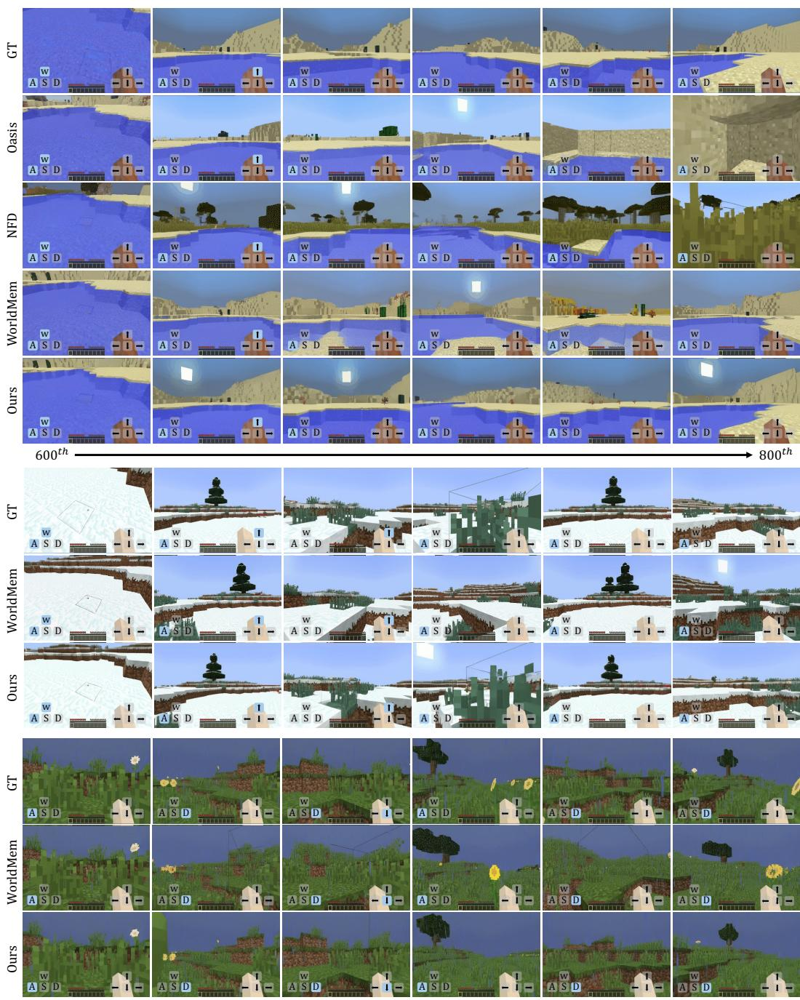
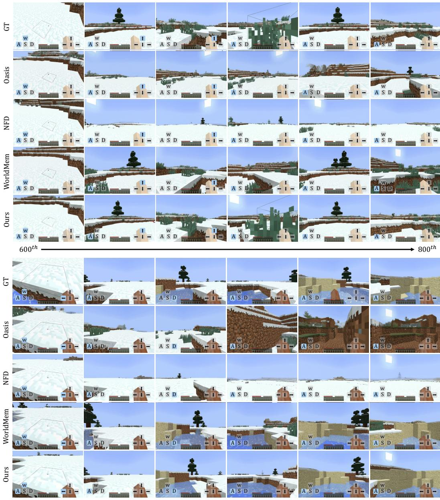
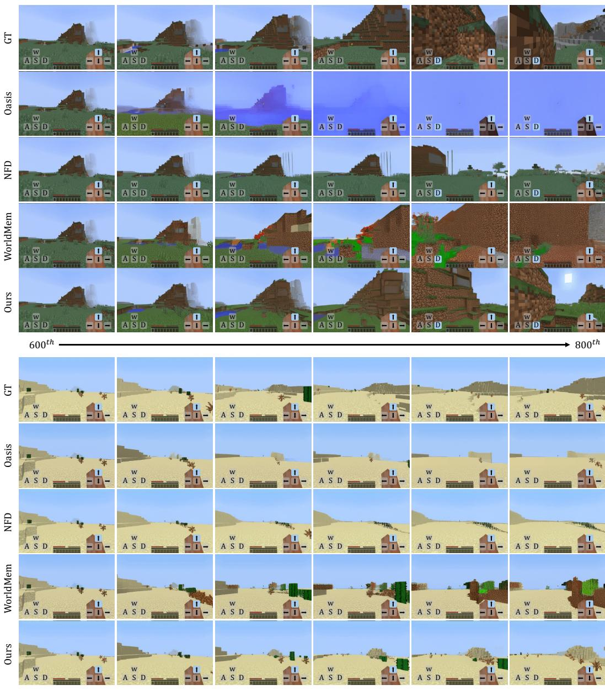

# 1. 论文基本信息

## 1.1. 标题
**Memory Forcing: Spatio-Temporal Memory for Consistent Scene Generation on Minecraft**

**中文翻译：记忆强制：在 Minecraft 上利用时空记忆实现一致性场景生成**

这篇论文的核心主题是提出一种名为“记忆强制” (`Memory Forcing`) 的新框架，旨在解决在如 Minecraft 这类交互式环境中生成长视频时的一个核心矛盾：既要保证在探索新区域时画面的**生成质量**，又要确保在重访旧地时场景的**空间一致性**。它通过一种创新的训练策略和高效的记忆系统，强制模型学会在不同情境下（探索 vs. 重访）智能地使用不同类型的记忆（近期的时间记忆 vs. 长期的空间记忆）。

## 1.2. 作者
*   Junchao Huang (香港中文大学（深圳），深圳环路研究院)
*   Xinting Hu (香港大学)
*   Boyao Han (香港中文大学（深圳）)
*   Shaoshuai Shi (滴滴出行，Voyager Research)
*   Zhuotao Tian (深圳环路研究院)
*   Tianyu He (微软亚洲研究院)
*   Li Jiang (香港中文大学（深圳），深圳环路研究院)

    作者团队来自多所顶尖学术机构（港中大深圳、港大）和知名企业研究院（滴滴、微软），表明这是一个产学研紧密合作的研究项目，结合了学术界的理论深度和工业界对实际应用效率的关注。

## 1.3. 发表期刊/会议
论文的发表日期显示为未来的 `2025-10-03`，并且提供了 `arXiv` 预印本链接。这通常意味着该论文已经或即将投稿到计算机视觉或机器学习领域的顶级会议，如 CVPR, ICCV, ECCV, NeurIPS, ICML, ICLR 等。考虑到研究主题（视频生成、世界模型），这些会议都是非常合适的目标。

## 1.4. 发表年份
2025 (根据预印本信息和参考文献格式推断)

## 1.5. 摘要
自回归视频扩散模型在构建世界模型和生成交互式场景方面表现出色，尤其是在 Minecraft 这样的游戏中。为了真实地模拟游戏过程，模型不仅要在探索新场景时生成自然的内容，还必须在重访旧区域时保持空间上的一致性。在有限的计算资源下，模型需要在有限的上下文窗口内压缩和利用历史信息，这带来了一个<strong>权衡（trade-off）</strong>：
1.  **仅依赖时间记忆**：无法保证长期的空间一致性。
2.  **增加空间记忆**：虽然能增强一致性，但当模型过度依赖不充分的空间信息时，可能会降低在新场景中的生成质量。

    为了解决这个问题，本文提出了 <strong>记忆强制 (`Memory Forcing`)</strong>，一个将特定训练协议与几何索引的空间记忆相结合的学习框架。
*   <strong>混合训练 (`Hybrid Training`)</strong>：通过模拟不同的游戏模式，引导模型在探索时依赖时间记忆，在重访时结合空间记忆。
*   <strong>链式前向训练 (`Chained Forward Training`)</strong>：通过模型自身的推理轨迹（rollouts）来扩展自回归训练，这种链式预测会产生更大的视角变化，从而鼓励模型依赖空间记忆来维持一致性。
*   **几何索引的空间记忆**：通过 <strong>点到帧检索 (`Point-to-Frame Retrieval`)</strong> 高效地从历史中检索信息，该方法将当前可见的 3D 点映射回其来源帧。同时，通过 <strong>增量式 3D 重建 (`Incremental 3D Reconstruction`)</strong> 维护一个显式的 3D 缓存。

    大量的实验表明，`Memory Forcing` 在各种环境中都取得了卓越的长期空间一致性和生成质量，同时在处理长序列时保持了计算效率。

## 1.6. 原文链接
*   **arXiv 页面:** https://arxiv.org/abs/2510.03198
*   **PDF 链接:** https://arxiv.org/pdf/2510.03198v1.pdf
*   **发布状态:** 预印本 (Preprint)

    ---

# 2. 整体概括

## 2.1. 研究背景与动机
### 2.1.1. 核心问题
当前，使用人工智能生成交互式虚拟世界（即“世界模型”）是一个热门研究方向，而 Minecraft 因其开放性和复杂性成为了理想的试验场。这类模型需要像人类玩家一样，能够根据指令（如前进、转向）生成连贯、真实的下一帧画面。然而，现有技术面临一个根本性的难题：**长期记忆的困境**。

### 2.1.2. 现有挑战与空白 (Gap)
由于计算资源（显存、延迟）的限制，模型一次只能“看到”一小段历史视频（即“上下文窗口”）。这导致了两种典型的失败模式，如下图（原文 Figure 1）所示：


*该图像是示意图，展示了依赖长期空间记忆和短期时间记忆的自回归视频扩散变换器在游戏场景生成中的应用。左侧图(a)显示如何通过长期空间记忆生成下一帧，而右侧图(b)则表明仅依赖短期时间记忆会导致失败。涉及的模型结构和记忆体之间的关系通过虚拟轨迹进行阐述。*

1.  **时间记忆模型的“失忆症”**：这类模型（如 `NFD`）只依赖于最近的几十帧画面。当它们探索一个新区域时，表现很好。但如果它们掉头走回刚刚经过的地方，由于“记忆”中已经没有旧场景的信息，它们会重新生成一个完全不同的场景，破坏了世界的空间一致性。这就像一个人转身后就忘了背后长什么样。
2.  **空间记忆模型的“偏执症”**：为了解决“失忆症”，一些模型（如 `WorldMem`）引入了长期的空间记忆，比如存储经过的所有地方的图像。当重访旧地时，它们能准确地恢复场景。但问题是，当它们去到一个全新的、没有任何历史记录的地方时，由于过度依赖记忆，而此时又没有相关记忆可用，它们的生成质量会急剧下降，产生模糊或错误的图像。这就像一个人过于依赖地图，到了地图上没有标示的地方就寸步难行。

    <strong>核心空白 (Gap)</strong>：现有方法无法让模型**智能地、动态地**在“依赖近期经验进行探索”和“调用长期记忆进行重访”这两种模式之间切换，导致模型要么“健忘”，要么“死板”。

### 2.1.3. 论文的切入点
`Memory Forcing` 的核心思路是，**不让模型自己“凭感觉”决定用哪种记忆，而是通过一种特殊的训练方法“强制”它学会**：
*   **在探索新场景时**：主要依赖时间记忆，保证创造力。
*   **在重访旧场景时**：主要依赖空间记忆，保证一致性。

    同时，为了让空间记忆既有效又高效，论文设计了一套基于 3D 几何的记忆存储和检索系统，避免了传统方法中信息冗余和检索速度慢的问题。

## 2.2. 核心贡献/主要发现
这篇论文的主要贡献可以总结为以下三点：

1.  **提出了 `Memory Forcing` 框架**：这是一个创新的学习框架，专门用于训练视频生成模型，使其能够平衡探索新场景时的生成质量和重访旧场景时的一致性，解决了前述的核心权衡问题。

2.  **设计了一套协同工作的技术方案**：
    *   **两种训练协议**：
        *   `Hybrid Training`：通过在两种不同类型的数据集上采用不同的记忆策略进行训练，教会模型适应不同情境。
        *   `Chained Forward Training`：通过在训练中引入模型自己的（可能不完美的）预测，模拟真实生成过程中的误差累积，迫使模型学会依赖更稳定的空间记忆来纠错和保持一致性。
    *   **一种高效的记忆系统**：
        *   `Geometry-indexed Spatial Memory`：它通过流式 3D 重建构建一个稀疏的场景几何模型，并利用 `Point-to-Frame Retrieval` 技术实现高效、精准的记忆检索。

3.  **取得了全面的性能提升**：实验证明，该方法在**长期空间一致性**、**新场景生成质量**和**对未见地形的泛化能力**上均显著优于现有最先进的模型。同时，其记忆系统的**检索速度**和**存储效率**也远超基于图像检索的先前工作。

    ---

# 3. 预备知识与相关工作

## 3.1. 基础概念
### 3.1.1. 自回归模型 (Autoregressive Models)
自回归模型是一种序列生成模型，其核心思想是“逐个生成”。在生成序列的第 $t$ 个元素时，模型会把前面已经生成的所有元素 $(1, 2, ..., t-1)$ 作为输入。这个过程就像我们写句子一样，写下一个词时会参考前面已经写好的部分。在视频生成中，这意味着模型根据前面的一系列帧来预测下一帧的画面。

### 3.1.2. 扩散模型 (Diffusion Models)
扩散模型是近年来在图像生成领域取得巨大成功的一类生成模型。其工作原理分为两个过程：
1.  <strong>前向过程（加噪）</strong>：从一张清晰的原始图像开始，逐步地、多次地向其添加少量高斯噪声，直到图像完全变成纯粹的噪声。
2.  <strong>反向过程（去噪）</strong>：训练一个神经网络模型，学习如何逆转这个过程。即输入一张带有噪声的图像，模型能预测并去除其中的噪声，使其向更清晰的图像恢复一步。

    在生成新图像时，我们从一个完全随机的噪声图像开始，反复使用这个去噪模型进行迭代，最终就能“无中生有”地生成一张清晰、真实的图像。

### 3.1.3. 世界模型 (World Models)
世界模型是智能体（agent）在内部学习到的一个关于其所处环境如何运作的模拟器。这个模型可以预测在当前状态下，如果执行某个动作，环境的未来状态会是什么样子。拥有一个好的世界模型，智能体就可以在“脑海中”进行规划和想象，而无需在真实世界中进行昂贵或危险的尝试。本文中的视频生成模型就可以被看作是一种视觉世界模型，它学习了 Minecraft 世界的物理和视觉规律。

### 3.1.4. Transformer 与注意力机制 (Attention Mechanism)
Transformer 是一种最初用于自然语言处理的神经网络架构，其核心是 <strong>自注意力机制 (Self-Attention)</strong>。该机制允许模型在处理序列中的一个元素时，能够同时“关注”到序列中所有其他元素，并根据相关性计算每个元素的重要性权重。这使得模型能够捕捉长距离的依赖关系。在本文中，`DiT` (Diffusion Transformer) 就是将 Transformer 架构用于扩散模型，而<strong>交叉注意力机制 (Cross-Attention)</strong> 则被用来融合当前生成帧的信息（作为 `query`）和从记忆中检索出的历史帧信息（作为 `key` 和 `value`）。

## 3.2. 前人工作
*   **自回归视频模型**：早期的模型通过生成离散的 `token` 来构建视频，但视觉质量不高。近期的基于扩散的方法（如 `Diffusion Forcing`）通过在帧级别进行操作，显著提升了生成质量。
*   **交互式游戏世界模型**：许多研究都致力于为 Minecraft 等复杂游戏构建世界模型。
    *   `Oasis` 和 `NFD`：这些是强大的交互式模型，但它们只依赖于短期的时间记忆，因此在重访场景时会产生不一致性。
    *   `LSVM`：采用状态空间模型（State Space Model）来压缩历史信息，虽然高效（$O(1)$ 复杂度），但其记忆范围受限于训练序列的长度，无法实现真正的长期记忆。
    *   `WorldMem`：这是一个重要的对比基线。它通过检索与当前<strong>相机姿态 (pose)</strong> 相似的历史帧来实现长期记忆。但它的缺点是：
        1.  **效率低下**：它需要存储所有历史帧，随着游戏时间变长，记忆库越来越大，检索速度呈线性下降（$O(n)$ 复杂度）。
        2.  **生成质量受损**：在探索新区域时，由于过度依赖可能不相关的记忆，其生成质量会下降。
*   **3D 重建与记忆检索**：
    *   `DUSt3R` 和 `VGGT`：这些是基于学习的 3D 重建方法，能够从多张 2D 图像中估计深度和相机姿态，是本文几何记忆系统的技术基础。
    *   `VMem`：一种与本文思路类似的工作，使用 `surfel`（表面元素）索引的视图选择来进行记忆检索，证明了基于几何的检索的潜力。

## 3.3. 技术演进
视频世界模型的发展脉络大致如下：
1.  **无记忆模型**：早期的模型一次只生成一帧，或依赖极短的上下文。
2.  **短期时间记忆模型**：利用一个滑动窗口来存储最近的几十帧，如 `NFD`。这解决了短期连贯性问题，但无法处理长期重访。
3.  <strong>长期空间记忆模型（第一代）</strong>：引入外部记忆库，通过姿态或外观相似性检索历史帧，如 `WorldMem`。这解决了重访一致性问题，但带来了新的问题：效率低下和新场景生成质量差。
4.  <strong>动态与高效的长期记忆模型（本文）</strong>：本文的工作处于这个最前沿阶段。它不仅实现了长期记忆，还通过**动态训练策略**解决了“探索 vs. 重访”的权衡问题，并通过**基于几何的稀疏表示**解决了效率问题，代表了该领域的一个重要进步。

## 3.4. 差异化分析
与最相关的先前工作 `WorldMem` 相比，本文的核心创新点在于：
*   **记忆检索方式**：`WorldMem` 使用<strong>基于姿态 (pose-based)</strong> 的检索，即寻找过去与当前位置和朝向相似的帧。这种方式对微小的姿态变化敏感，且容易检索到冗余信息。而 `Memory Forcing` 使用<strong>基于几何 (geometry-based)</strong> 的 `Point-to-Frame Retrieval`，它关心的是“当前视野里看到了哪些三维空间中的点”，然后找到最初生成这些点的帧。这种方式更鲁棒，且与视图内容直接相关。
*   **记忆存储方式**：`WorldMem` 存储**所有**经过的帧，导致记忆库线性增长。而 `Memory Forcing` 只存储有**新空间信息**的<strong>关键帧 (keyframes)</strong>，并将其组织成一个稀疏的 3D 点云，使得存储开销只与探索的空间范围有关，而不是游戏时长。
*   **训练策略**：`WorldMem` 使用单一的训练策略。而 `Memory Forcing` 独创了 `Hybrid Training` 和 `Chained Forward Training`，主动地教模型如何以及何时使用记忆，这是之前工作所没有的。
*   **效率**：由于上述差异，`Memory Forcing` 的记忆检索复杂度为 **$O(1)$**（常数时间），而 `WorldMem` 为 **$O(n)$**（线性时间），在长序列上优势巨大。

    ---

# 4. 方法论

本部分将深入拆解 `Memory Forcing` 框架的技术细节，严格遵循原文的公式和逻辑。

## 4.1. 方法原理
`Memory Forcing` 的核心思想是通过**专门设计的训练过程**和**高效的记忆架构**，让模型学会在两种模式间自适应切换：
1.  **探索模式**：当进入一个全新的区域时，由于缺乏相关的空间记忆，模型应更多地依赖**时间记忆**（即最近的几帧画面）来发挥创造力，生成自然、连贯的新场景。
2.  **重访模式**：当回到一个曾经来过的地方时，模型应优先利用从**空间记忆**中检索到的精确历史信息，以确保生成与过去完全一致的场景，避免几何和纹理的错乱。

## 4.2. 核心方法详解 (逐层深入)

### 4.2.1. 记忆增强的生成模型架构 (`Memory-Augmented Architecture`)
如原文 Figure 2 所示，整个模型基于一个 <strong>扩散 Transformer (DiT)</strong> 主干网络。为了将长期空间记忆融入生成过程，模型架构进行了如下设计：

![Figure 2: Memory Forcing Pipeline. Our framework combines spatial and temporal memory for video generation. 3D geometry is maintained through streaming reconstruction of key frames along the camera trajectory. During generation, Point-to-Frame Retrieval maps spatial context to historical frames, which are integrated with temporal memory and injected together via memory crossattention in the DiT backbone. Chained Forward Training creates larger pose variations, encouraging the model to effectively utilize spatial memory for maintaining long-term geometric consistency.](images/2.jpg)
*该图像是示意图，展示了记忆强制框架在Minecraft中的应用，包括关键帧融合和相机轨迹的生成。图中展示了如何通过延长时序记忆和点到帧检索来维持空间一致性和生成质量。*

1.  <strong>空间记忆提取 (`Spatial Memory Extraction`)</strong>：使用 `Point-to-Frame Retrieval`（详见 4.2.3 节）从一个持续更新的 3D 几何缓存中，高效地选出与当前视角最相关的历史帧作为空间记忆。

2.  <strong>记忆交叉注意力 (`Memory Cross-Attention`)</strong>：这是将空间记忆注入 `DiT` 模型的关键模块。在 `DiT` 的每个 Transformer 块中，都增加了一个交叉注意力层。
    *   <strong>查询 (Query, Q)</strong>：来自当前正在生成的、带有噪声的帧的 `token`。
    *   <strong>键 (Key, K) 和 值 (Value, V)</strong>：都来自从空间记忆中检索出的历史帧的 `token`。

        其计算过程严格遵循原文公式：
    $$
    \mathrm { A t t e n t i o n } ( \tilde { Q } , \tilde { K } _ { \mathrm { s p a t i a l } } , V _ { \mathrm { s p a t i a l } } ) = \mathrm { S o f t m a x } \left( \frac { \tilde { Q } \tilde { K } _ { \mathrm { s p a t i a l } } ^ { T } } { \sqrt { d } } \right) V _ { \mathrm { s p a t i a l } }
    $$
    **符号解释**:
    *   $\tilde{Q}$：查询向量，来自当前帧的 `token`。
    *   $\tilde{K}_{\mathrm{spatial}}$：键向量，来自检索到的空间记忆帧的 `token`。
    *   $V_{\mathrm{spatial}}$：值向量，同样来自空间记忆帧的 `token`。
    *   $d$：键向量的维度。
    *   **特殊之处**: 论文提到，$\tilde{Q}$ 和 $\tilde{K}_{\mathrm{spatial}}$ 在送入注意力计算前，会与 <strong>普吕克坐标 (Plücker coordinates)</strong> 进行增强。普吕克坐标是一种在 3D 空间中表示直线（在此处是相机视线）的方式，用它来增强 `token` 相当于为模型提供了关于当前视角和历史视角之间**相对姿态**的精确几何信息，帮助模型更好地理解空间关系。

### 4.2.2. 记忆强制的自回归扩散训练 (`Autoregressive Diffusion Training with Memory Forcing`)
这是本文方法的核心创新，包含两种协同工作的训练策略。

#### 4.2.2.1. 混合训练 (`Hybrid Training`)
该策略旨在通过不同的数据源，教会模型应对不同的游戏场景。假设模型的上下文窗口总长度为 $L$：
*   **固定时间上下文**：窗口的前 $L/2$ 帧始终是最近的连续帧，作为基础的时间上下文 $\mathcal{T}_{\mathrm{fixed}}$。
*   **动态上下文**：窗口的后 $L/2$ 帧则根据训练数据的类型动态选择：
    *   **当使用 `VPT` 数据集时** (该数据集来自人类玩家录像，充满探索行为)：后 $L/2$ 帧选择更早期的**时间帧**，组成一个**扩展的时间上下文** $\mathcal{T}_{\mathrm{extended}}$。这鼓励模型学习在没有空间记忆辅助的情况下，仅靠时间线索进行生成。
    *   **当使用 `MineDojo` 合成数据集时** (该数据集被设计为频繁重访区域)：后 $L/2$ 帧选择通过几何检索得到的**空间记忆帧** $\mathcal{M}_{\mathrm{spatial}}$。这强制模型学习如何利用空间记忆来保证重访时的一致性。

        这个动态构建的上下文窗口 $\mathcal{W}$ 可以形式化地表示为：
$$
{ \mathcal { W } } = [ { \mathcal { T } } _ { \mathrm { f i x e d } } , { \mathcal { M } } _ { \mathrm { c o n t e x t } } ] = \left\{ { \begin{array} { l l } { [ { \mathcal { T } } _ { \mathrm { f i x e d } } , { \mathcal { M } } _ { \mathrm { s p a t i a l } } ] } & \text{在 MineDojo 数据集上} \\ { [ { \mathcal { T } } _ { \mathrm { f i x e d } } , { \mathcal { T } } _ { \mathrm { e x t e n d e d } } ] } & \text{在 VPT 数据集上} \end{array} } \right.
$$
**符号解释**:
*   $\mathcal{W}$：完整的上下文窗口。
*   $\mathcal{T}_{\mathrm{fixed}}$：固定的近期时间上下文。
*   $\mathcal{M}_{\mathrm{context}}$：动态选择的上下文部分。
*   $\mathcal{M}_{\mathrm{spatial}}$：从长期记忆中检索的空间记忆帧。
*   $\mathcal{T}_{\mathrm{extended}}$：较早的远期时间帧。

#### 4.2.2.2. 链式前向训练 (`Chained Forward Training`, CFT)
`CFT` 旨在解决训练与测试之间的<strong>偏差 (gap)</strong>。在传统的自回归训练（称为 `teacher-forcing`）中，模型总是使用<strong>真实的 (ground-truth)</strong> 历史帧来预测下一帧。但在实际生成时，模型需要使用它**自己生成的**历史帧，一旦生成出现小错误，这个错误就会在后续的生成中被不断放大，导致最终结果崩溃。

`CFT` 通过在训练中模拟这个过程来缓解该问题。其流程如原文 `Algorithm 1` 所示：

```
Algorithm 1 Chained Forward Training (CFT)

Require: 视频 x, 条件输入 C, 前向步数 T, 窗口大小 W, 模型 ϵ_θ
1: 初始化 F_pred = ∅, L_total = 0
2: for j = 0 to T - 1 do
3:   构建窗口 W_j:
4:   for k in [j, j + W - 1] do
5:     if k in F_pred then
6:       W_j[k - j] = F_pred[k]  // 使用预测的帧
7:     else
8:       W_j[k - j] = x_k      // 使用真实的帧
9:     end if
10:  end for
11:  计算 L_j = ||ϵ - ϵ_θ(W_j, C_j, t)||^2, 更新 L_total = L_total + L_j
12:  if j < T - 1 then
13:    x̂_{j + W - 1} = denoise(W_j, C_j) // 用少量步数快速生成，无梯度
14:    F_pred[j + W - 1] = x̂_{j + W - 1} // 存储预测结果用于下一个窗口
15:  end if
16: end for
17: return L_chain = L_total / T
```

**流程拆解**:
1.  模型在一个长视频序列上滑动一个大小为 $W$ 的窗口。
2.  在第 $j$ 个窗口，模型会使用一部分**真实的帧**和一部分**先前窗口生成的预测帧** `F_pred` 来构建输入 $W_j$。
3.  然后，模型基于这个混合的输入计算损失 $L_j$ 并更新参数（第 11 行）。
4.  接着，模型会快速地（用较少的去噪步骤，且不计算梯度）生成这个窗口的最后一帧 $x̂_{j+W-1}$，并将其存入 `F_pred`（第 13-14 行）。
5.  在处理下一个窗口 $j+1$ 时，这个刚刚生成的 $x̂_{j+W-1}$ 就会被用作输入的一部分。

    `CFT` 的训练目标是最小化链式损失 $\mathcal{L}_{\mathrm{chain}}$：
$$
\mathcal { L } _ { \mathrm { c h a i n } } = \frac { 1 } { T } \sum _ { j = 0 } ^ { T - 1 } \mathbb { E } _ { t , \epsilon } \left[ \| \epsilon - \epsilon _ { \theta } ( \mathcal { W } _ { j } ( \mathbf { x } , \hat { \mathbf { x } } ) , \mathcal { C } _ { j } , t ) \| ^ { 2 } \right] , \quad t \sim \mathrm { U n i f o r m } ( 0 , T _ { \mathrm { n o i s e } } ) , \epsilon \sim \mathcal { N } ( 0 , \mathbf { I } )
$$
**符号解释**:
*   $\mathcal{W}_{j}(\mathbf{x}, \hat{\mathbf{x}})$：表示第 $j$ 个窗口，其中混合了真实帧 $\mathbf{x}$ 和模型预测帧 $\hat{\mathbf{x}}$。
*   $\mathcal{C}_{j}$：第 $j$ 个窗口的条件输入，包括玩家动作 $A_j$、相机姿态 $\mathcal{P}_j$ 和检索到的空间记忆 $\mathcal{M}_{\mathrm{spatial}}$。
*   $\epsilon_{\theta}$：带参数 $\theta$ 的去噪模型。
*   $\epsilon$：采样的标准高斯噪声。
*   $t$：噪声水平。

    **核心作用**：由于链式预测会放大姿态变化和累积误差，时间上下文变得不再可靠。这**强制**模型去更多地依赖稳定不变的**空间记忆** $\mathcal{M}_{\mathrm{spatial}}$ 来维持场景一致性，从而学会在真实生成环境中更好地利用长期记忆。

### 4.2.3. 几何索引的空间记忆 (`Geometry-indexed Spatial Memory`)
这是一个高效的长期记忆系统，由两部分组成。

#### 4.2.3.1. 点到帧检索 (`Point-to-Frame Retrieval`)
当模型需要为当前帧 $t$ 检索空间记忆时，它执行以下操作：
1.  将维护的全局 3D 点云投影到当前相机的视角下，得到当前可见的点集 $\mathcal{P}_{\mathrm{visible}}^{t}$。
2.  对于每一个可见的点 $p_i$，系统知道它是从哪一帧历史图像中重建出来的，这个来源帧的索引记为 $source(p_i)$。
3.  统计所有可见点的来源帧索引，选出被引用次数最多的前 8 帧作为当前时刻的空间记忆 $\mathcal{H}_t$。

    这个过程的数学表达为：
$$
\mathcal { H } _ { t } = \arg \operatorname* { m a x } _ { k = 1 , \ldots , 8 } \mathrm { C o u n t } ( \operatorname { s o u r c e } ( p _ { i } ) : p _ { i } \in \mathcal { P } _ { \mathrm { v i s i b l e } } ^ { t } )
$$
**符号解释**:
*   $\mathcal{H}_t$：在时间 $t$ 检索到的包含 8 个历史帧的集合。
*   $\mathcal{P}_{\mathrm{visible}}^{t}$：在时间 $t$ 的相机姿态下可见的 3D 点集。
*   $source(p_i)$：返回点 $p_i$ 的来源帧索引。
*   `Count(...)`：计算来源帧在可见点中出现的次数。

    **优点**：这种检索方式的计算复杂度是<strong>常数时间 $O(1)$</strong>，因为它只与当前可见的点云数量有关，而与历史序列的总长度无关，因此扩展性极强。

#### 4.2.3.2. 增量式 3D 重建 (`Incremental 3D Reconstruction`)
这个模块负责在游戏进行中，流式地构建和维护全局的 3D 点云。
*   **关键帧选择**：系统并不会处理每一帧，而是只选择有价值的<strong>关键帧 (keyframe)</strong> 进行 3D 重建，以避免冗余。一帧被选为关键帧的条件是：
    $$
    \mathrm { IsK e yf r a m e } ( t ) = \mathrm { N o v e l C o v e r a g e } ( I _ { t } , \mathcal { G } _ { \mathrm { g l o b a l } } ) \ \mathbf { o r } \ ( | \mathcal { H } _ { t } | < \tau _ { \mathrm { h i s t } } )
    $$
    **条件解释**:
    1.  `NovelCoverage(...)` 为真：当前帧 $I_t$ 提供了相对于现有全局几何 $\mathcal{G}_{\mathrm{global}}$ 足够多的**新空间覆盖**。
    2.  $|\mathcal{H}_t| < \tau_{\mathrm{hist}}$：当前视角下可检索到的历史信息太少（例如，少于 $L/2=4$ 帧），说明进入了全新区域，需要立即建立新的几何信息。
*   **3D 几何重建**：
    1.  使用 `VGGT` 模型为选定的关键帧生成相对深度图。
    2.  通过论文附录中描述的 **`Cross-Window Scale Alignment`** 模块，将新生成的相对深度图与全局几何在尺度上对齐，保证全局一致性。
    3.  利用相机姿态（位置和朝向）将 2D 深度图<strong>反向投影 (back-projection)</strong> 成 3D 点云。相机外参矩阵 $\mathbf{E}$ 的计算公式为：
        $$
        { \bf E } = \left[ \begin{array} { c c } { { \bf R } ( p i t c h , y a w ) } & { - { \bf R C } } \\ { { \bf 0 } ^ { T } } & { 1 } \end{array} \right]
        $$
        **符号解释**:
        *   $\mathbf{R}(pitch, yaw)$：由相机的俯仰角和偏航角构成的旋转矩阵。
        *   $\mathbf{C}$：相机在 3D 空间中的位置坐标 $[x, y, z]^T$。
    4.  最后，通过<strong>体素下采样 (voxel downsampling)</strong> 将新生成的点云整合到全局表示中，这能控制点云的密度，确保检索效率。

        **总结**：这个几何记忆系统通过**只存储有价值的新信息**（关键帧选择）和**保持固定密度的表示**（体素下采样），实现了存储和计算开销只随**探索的空间大小**增长，而非**游戏时间**，从而解决了长期运行的效率瓶颈。

---

# 5. 实验设置

## 5.1. 数据集
论文使用了多个数据集来全面评估模型的各项能力。
*   **训练数据集**:
    1.  **VPT (Video Pre-training)**: 一个大规模的人类玩 Minecraft 的视频数据集（超过 4000 小时）。这些数据充满了探索未知区域的行为，非常适合训练模型的**新场景生成能力**。
    2.  <strong>合成数据集 (from MineDojo)</strong>: 这是一个遵循 `WorldMem` 论文配置生成的合成数据集（11k 个视频，每个 1500 帧）。视频中的智能体被设计为在特定区域内频繁移动和回头，从而产生大量的**重访场景**，非常适合训练模型的**长期记忆能力**。

*   <strong>评估数据集 (均从 MineDojo 构建)</strong>:
    1.  **Long-term Memory Dataset**: 包含 150 个长视频序列（1500 帧），专门用于评估模型在重访旧地时的空间一致性。
    2.  **Generalization Performance Dataset**: 包含 150 个视频序列（800 帧），覆盖了 9 种**训练中未见过**的 Minecraft 地形（如极端山丘、针叶林、石岸等），用于评估模型的泛化能力。
    3.  **Generation Performance Dataset**: 包含 300 个视频序列（800 帧），用于评估模型在探索新环境时的生成质量。

## 5.2. 评估指标
论文使用了四种标准的视频/图像质量评估指标，从不同维度衡量生成视频的质量。

### 5.2.1. Fréchet Video Distance (FVD)
*   **概念定义**: FVD 是一种衡量两组视频（通常是真实视频和生成视频）之间在**感知层面**相似度的指标。它不比较像素级的差异，而是通过一个预训练的神经网络（通常是 I3D 网络）提取视频的特征，然后在特征空间中计算两组视频特征分布的 Fréchet 距离（也称 Wasserstein-2 距离）。FVD 分数**越低**，表示生成视频在内容、动态和视觉质量上与真实视频越接近。它同时考虑了**单帧质量**和**时间连贯性**。
*   **数学公式**:
    $$
    \text{FVD}(x, g) = \left\| \mu_x - \mu_g \right\|_2^2 + \text{Tr}\left( \Sigma_x + \Sigma_g - 2(\Sigma_x \Sigma_g)^{1/2} \right)
    $$
*   **符号解释**:
    *   $x$ 和 $g$：分别代表真实视频和生成视频的集合。
    *   $\mu_x$ 和 $\mu_g$：真实视频和生成视频特征向量的均值。
    *   $\Sigma_x$ 和 $\Sigma_g$：真实视频和生成视频特征向量的协方差矩阵。
    *   $\|\cdot\|_2^2$：L2 范数的平方。
    *   $\text{Tr}(\cdot)$：矩阵的迹（主对角线元素之和）。

### 5.2.2. Learned Perceptual Image Patch Similarity (LPIPS)
*   **概念定义**: LPIPS 是一种衡量两张图像之间**感知相似度**的指标。与 PSNR 或 SSIM 不同，LPIPS 模仿人类的视觉感知系统。它使用一个在大型图像数据集上预训练好的深度神经网络（如 VGG, AlexNet）来提取两张图像的深层特征，并计算这些特征之间的距离。LPIPS 分数**越低**，表示两张图像在人眼看来长得越像。
*   **数学公式**:
    $$
    \text{LPIPS}(x, x_0) = \sum_l \frac{1}{H_l W_l} \sum_{h,w} \left\| w_l \odot (\hat{y}_{hw}^l - \hat{y}_{0,hw}^l) \right\|_2^2
    $$
*   **符号解释**:
    *   $x, x_0$：要比较的两张图像。
    *   $l$：表示网络的第 $l$ 个卷积层。
    *   $\hat{y}^l, \hat{y}_0^l$：从第 $l$ 层提取的特征图，经过归一化。
    *   $H_l, W_l$：第 $l$ 层特征图的高度和宽度。
    *   $w_l$：一个可学习的权重，用于缩放不同通道的重要性。
    *   $\odot$：逐元素相乘。

### 5.2.3. Peak Signal-to-Noise Ratio (PSNR)
*   **概念定义**: PSNR 是一种衡量图像**像素级**保真度的指标。它通过计算原始图像和生成（或压缩）图像之间像素差的均方误差（MSE）来衡量失真程度。PSNR 值**越高**，表示生成图像与原始图像在像素上越接近，失真越小。
*   **数学公式**:
    $$
    \text{PSNR} = 10 \cdot \log_{10} \left( \frac{\text{MAX}_I^2}{\text{MSE}} \right)
    $$
    其中，均方误差 (Mean Squared Error, MSE) 定义为：
    $$
    \text{MSE} = \frac{1}{mn} \sum_{i=0}^{m-1} \sum_{j=0}^{n-1} [I(i,j) - K(i,j)]^2
    $$
*   **符号解释**:
    *   $\text{MAX}_I$：图像像素值的最大可能值（例如，对于 8 位灰度图是 255）。
    *   `I, K`：原始图像和生成图像。
    *   `m, n`：图像的高度和宽度。
    *   `I(i,j), K(i,j)`：在坐标 `(i,j)` 处的像素值。

### 5.2.4. Structural Similarity Index Measure (SSIM)
*   **概念定义**: SSIM 是一种衡量两张图像**结构相似性**的指标。它认为人类视觉系统对场景中物体的结构信息更敏感。SSIM 从亮度、对比度和结构三个方面来比较图像。SSIM 的取值范围为 [-1, 1]，值**越接近 1**，表示两张图像在结构上越相似。
*   **数学公式**:
    $$
    \text{SSIM}(x, y) = \frac{(2\mu_x\mu_y + c_1)(2\sigma_{xy} + c_2)}{(\mu_x^2 + \mu_y^2 + c_1)(\sigma_x^2 + \sigma_y^2 + c_2)}
    $$
*   **符号解释**:
    *   `x, y`：要比较的两张图像。
    *   $\mu_x, \mu_y$：图像 $x$ 和 $y$ 的平均值。
    *   $\sigma_x^2, \sigma_y^2$：图像 $x$ 和 $y$ 的方差。
    *   $\sigma_{xy}$：图像 $x$ 和 $y$ 的协方差。
    *   $c_1, c_2$：用于维持稳定性的两个小常数。

## 5.3. 对比基线
论文将自己的方法与三个具有代表性的基线模型进行了比较：
*   **Oasis** 和 **NFD**：这两个是**纯时间记忆**模型的代表。它们在短期生成和交互方面表现出色，但缺乏长期记忆机制。将它们作为基线，可以凸显 `Memory Forcing` 在长期一致性上的优势。
*   **WorldMem**：这是一个**长期空间记忆**模型的代表，也是与本文最直接的竞争对手。它使用基于姿态的检索，但存在效率和新场景生成质量的问题。与它对比，可以证明 `Memory Forcing` 在解决这些问题的同时，保持了强大的长期记忆能力。

    所有模型都在相同的 16 帧上下文窗口下进行训练和评估，确保了比较的公平性。

---

# 6. 实验结果与分析

## 6.1. 核心结果分析
论文从三个核心能力维度（长期记忆、泛化性、生成质量）对模型进行了定量和定性评估。

### 6.1.1. 定量结果分析 (Table 1)
以下是原文 Table 1 的结果，该表格展示了不同方法在三个评估数据集上的表现。

<table>
<thead>
<tr>
<th rowspan="2">Method</th>
<th colspan="4">Long-term Memory</th>
<th colspan="4">Generalization Performance</th>
<th colspan="4">Generation Performance</th>
</tr>
<tr>
<th>FVD ↓</th>
<th>PSNR ↑</th>
<th>SSIM ↑</th>
<th>LPIPS ↓</th>
<th>FVD ↓</th>
<th>PSNR ↑</th>
<th>SSIM ↑</th>
<th>LPIPS ↓</th>
<th>FVD ↓</th>
<th>PSNR ↑</th>
<th>SSIM ↑</th>
<th>LPIPS ↓</th>
</tr>
</thead>
<tbody>
<tr>
<td>Oasis</td>
<td>196.8</td>
<td>16.83</td>
<td>0.5654</td>
<td>0.3791</td>
<td>477.3</td>
<td>14.74</td>
<td>0.5175</td>
<td>0.5122</td>
<td>285.7</td>
<td>14.51</td>
<td>0.5063</td>
<td>0.4704</td>
</tr>
<tr>
<td>NFD</td>
<td>220.8</td>
<td>16.35</td>
<td>0.5819</td>
<td>0.3891</td>
<td>442.6</td>
<td>15.49</td>
<td>0.5564</td>
<td>0.4638</td>
<td>349.6</td>
<td>14.64</td>
<td>0.5417</td>
<td>0.4343</td>
</tr>
<tr>
<td>WorldMem</td>
<td>122.2</td>
<td>19.32</td>
<td>0.5983</td>
<td>0.2769</td>
<td>328.3</td>
<td>16.23</td>
<td>0.5178</td>
<td>0.4336</td>
<td>290.8</td>
<td>14.71</td>
<td>0.4906</td>
<td>0.4531</td>
</tr>
<tr>
<td>Ours</td>
<td><strong>84.9</strong></td>
<td><strong>21.41</strong></td>
<td><strong>0.6692</strong></td>
<td><strong>0.2156</strong></td>
<td><strong>253.7</strong></td>
<td><strong>19.86</strong></td>
<td><strong>0.6341</strong></td>
<td><strong>0.2896</strong></td>
<td><strong>185.9</strong></td>
<td><strong>17.99</strong></td>
<td><strong>0.6155</strong></td>
<td><strong>0.3031</strong></td>
</tr>
</tbody>
</table>

**分析**:
*   <strong>在长期记忆 (Long-term Memory) 任务上</strong>: `Ours` (本文方法) 取得了压倒性优势。FVD (84.9) 远低于所有基线，特别是 `WorldMem` (122.2)，表明其视频感知质量最高。同时，PSNR (21.41) 和 SSIM (0.6692) 大幅领先，说明其在重访场景时能够以极高的保真度恢复原始场景。这证明了其空间记忆系统的有效性。
*   <strong>在泛化性能 (Generalization Performance) 任务上</strong>: 在面对从未见过的地形时，`Ours` 的所有指标依然是最佳的。尤其是与 `WorldMem` 相比，FVD 从 328.3 降至 253.7，LPIPS 从 0.4336 降至 0.2896，这表明本文方法在探索新环境时的生成质量没有像 `WorldMem` 那样出现严重退化。这验证了 `Hybrid Training` 策略成功地让模型学会了在没有空间记忆时依赖时间记忆。
*   <strong>在生成性能 (Generation Performance) 任务上</strong>: 同样，`Ours` 全面领先。这说明 `Memory Forcing` 框架不仅没有损害模型原有的生成能力，反而通过更好的训练策略（如 `CFT`）提升了整体的生成质量和稳定性。

    **结论**: `Memory Forcing` 成功地解决了“探索 vs. 重访”的权衡问题。它既能在需要时调用强大的长期记忆，也能在不需要时优雅地进行新场景生成，实现了“鱼与熊掌兼得”。

### 6.1.2. 定性结果分析 (Figures 3, 4, 6, 8)

*   <strong>长期记忆能力 (Figure 3 &amp; 8)</strong>: 这些图像直观地展示了模型在重访一个有标志性建筑（如一座小山）的场景时的表现。
    *   `Oasis` 和 `NFD` 完全“忘记”了小山的存在，生成了完全不同的地形，体现了纯时间记忆模型的“失忆症”。
    *   `WorldMem` 能够记起小山，但生成的细节不准确，甚至出现伪影（如 Figure 3 第四行第五帧），一致性不完美。
    *   `Ours` 则精确地恢复了场景的几何结构和外观，与真实标注数据 (Ground Truth) 几乎无法区分，展示了其卓越的空间一致性。

        
        *该图像是插图，展示了不同模型在Minecraft场景生成上的表现，包括GT、NFD、WorldMen和Ours。通过比较这些模型在多个时间步的输出，可以观察到生成内容的自然性和空间一致性。*

*   <strong>泛化与生成能力 (Figure 4 &amp; 6)</strong>: 这些图像展示了模型在新环境中的表现。
    *   `Ours` 生成的画面清晰、稳定，并且能响应玩家的移动，例如远处的景物会随着玩家走近而变得清晰。
    *   `WorldMem` 在新场景中质量下降明显，画面模糊。
    *   `NFD` 生成的远景缺乏变化，感觉场景是“贴图”。
    *   `Oasis` 生成的远景过于简化，缺乏细节。

        
        *该图像是插图，展示了在Minecraft中不同方法生成场景的对比，包括Oasis、NFD、WorldMem和我们的模型在不同时间步（600和800处）的效果。图中显示了四种方法在生成场景一致性和质量方面的差异。*

这些定性结果与定量数据高度一致，生动地证明了 `Memory Forcing` 的优越性。

## 6.2. 效率分析 (Table 2)
本节评估本文提出的 `Geometry-indexed Spatial Memory` 相比 `WorldMem` 的检索方法的效率。

以下是原文 Table 2 的结果：

<table>
<thead>
<tr>
<th rowspan="2">Frame Range</th>
<th colspan="2">0-999</th>
<th colspan="2">1000-1999</th>
<th colspan="2">2000-2999</th>
<th colspan="2">3000-3999</th>
<th colspan="2">Total (0-3999)</th>
</tr>
<tr>
<th>Speed (FPS ↑)</th>
<th>Mem. (Count ↓)</th>
<th>Speed (FPS ↑)</th>
<th>Mem. (Count ↓)</th>
<th>Speed (FPS ↑)</th>
<th>Mem. (Count ↓)</th>
<th>Speed (FPS ↑)</th>
<th>Mem. (Count ↓)</th>
<th>Speed (FPS ↑)</th>
<th>Mem. (Count ↓)</th>
</tr>
</thead>
<tbody>
<tr>
<td>WorldMem</td>
<td>10.11</td>
<td>+1000</td>
<td>3.43</td>
<td>+1000</td>
<td>2.06</td>
<td>+1000</td>
<td>1.47</td>
<td>+1000</td>
<td>4.27</td>
<td>4000</td>
</tr>
<tr>
<td>Ours</td>
<td>18.57</td>
<td>+25.45</td>
<td>27.08</td>
<td>+19.70</td>
<td>41.36</td>
<td>+14.55</td>
<td>37.84</td>
<td>+12.95</td>
<td><strong>31.21</strong></td>
<td><strong>72.65</strong></td>
</tr>
</tbody>
</table>

**分析**:
*   <strong>检索速度 (Speed, FPS)</strong>: `WorldMem` 的速度随着序列长度（即记忆库大小）的增加而急剧下降，从最初的 10.11 FPS 掉到最后阶段的 1.47 FPS，这验证了其 $O(n)$ 线性复杂度的瓶颈。而 `Ours` 的速度不仅没有下降，反而随着 3D 地图的完善而有所提升，始终保持在很高的水平。在 3000-3999 帧的范围内，`Ours` 的速度是 `WorldMem` 的 **25.7 倍**。
*   <strong>存储开销 (Memory, Count)</strong>: `WorldMem` 存储了所有 4000 帧。而 `Ours` 在整个 4000 帧的序列中，平均只存储了 72.65 个关键帧，存储量减少了 **98.2%**。这证明了其选择性关键帧策略和稀疏几何表示的巨大优势。

    **结论**: `Geometry-indexed Spatial Memory` 在效率和可扩展性上远超基于姿态的密集检索方法，是实现真正可用的长期交互式世界模型的关键。

## 6.3. 消融实验/参数分析
消融实验旨在验证 `Memory Forcing` 框架中各个组件的必要性。

以下是原文 Table 3 的结果：

<table>
<thead>
<tr>
<th colspan="2">Training Strategies</th>
<th colspan="2">Retrieval Strategies</th>
<th colspan="4">Metrics</th>
</tr>
<tr>
<th>HT-w/o-CFT</th>
<th>MF</th>
<th>Pose-based</th>
<th>3D-based</th>
<th>FVD ↓</th>
<th>PSNR ↑</th>
<th>SSIM ↑</th>
<th>LPIPS ↓</th>
</tr>
</thead>
<tbody>
<tr>
<td>✓</td>
<td></td>
<td>✓</td>
<td></td>
<td>366.1</td>
<td>15.09</td>
<td>0.5649</td>
<td>0.4122</td>
</tr>
<tr>
<td></td>
<td>✓</td>
<td></td>
<td></td>
<td>230.4</td>
<td>16.24</td>
<td>0.5789</td>
<td>0.3598</td>
</tr>
<tr>
<td>✓</td>
<td></td>
<td></td>
<td>✓</td>
<td>225.9</td>
<td>16.24</td>
<td>0.5945</td>
<td>0.3722</td>
</tr>
<tr>
<td></td>
<td>✓</td>
<td></td>
<td>✓</td>
<td><strong>165.9</strong></td>
<td><strong>18.17</strong></td>
<td><strong>0.6222</strong></td>
<td><strong>0.2876</strong></td>
</tr>
</tbody>
</table>

**分析**:
*   **训练策略分析**:
    *   第一行 (`HT-w/o-CFT` + `Pose-based`) 和第三行 (`HT-w/o-CFT` + `3D-based`) 使用了 `Hybrid Training` 但没有 `CFT`。与第二行和第四行（使用了 `MF`，即包含 `CFT`）相比，性能有明显差距。例如，在同样使用 3D 检索的情况下，加入 `CFT`（从第三行到第四行）使 FVD 从 225.9 降低到 165.9。这证明了 **`Chained Forward Training` 对于教会模型依赖空间记忆、提升最终性能至关重要**。
    *   仅仅进行微调（`FT`，表格中隐含的第一种策略）表现最差，说明简单地在混合数据上训练不足以让模型学会动态切换记忆模式。

*   **检索机制比较**:
    *   对比第一行 (`Pose-based`) 和第三行 (`3D-based`)，在相同的 `HT-w/o-CFT` 训练策略下，使用 `3D-based` 检索使得 FVD 从 366.1 大幅下降到 225.9。
    *   对比第二行和第四行，在完整的 `MF` 训练策略下，`3D-based` 检索同样显著优于 `Pose-based`。
    *   这证明了<strong>本文提出的 `Geometry-indexed (3D-based)` 检索机制远优于 `WorldMem` 使用的 `Pose-based` 检索</strong>，能够提供更准确、更相关的空间记忆。

        **结论**: 消融实验清晰地表明，`Memory Forcing` 的每一个核心组件——`Hybrid Training`、`Chained Forward Training` 和 `Geometry-indexed Spatial Memory`——都是不可或缺的，它们共同作用，才取得了最终的卓越性能。

---

# 7. 总结与思考

## 7.1. 结论总结
本文成功地提出了 `Memory Forcing`，一个新颖且有效的学习框架，用于解决自回归视频生成模型在长期交互式任务中的核心矛盾——**探索时的生成质量**与**重访时的空间一致性**之间的权衡。

其主要贡献和发现可以归纳为：
1.  **创新的训练范式**：通过 `Hybrid Training` 和 `Chained Forward Training`，首次从训练层面“强制”模型学习在不同场景下（探索 vs. 重访）自适应地依赖不同类型的记忆（时间 vs. 空间），有效解决了现有方法的“失忆症”或“偏执症”。
2.  **高效的记忆系统**：设计的 `Geometry-indexed Spatial Memory` 通过流式 3D 重建和 `Point-to-Frame Retrieval`，实现了常数时间复杂度的长期记忆检索和与空间覆盖范围成正比的存储开销，相比先前工作在效率和扩展性上取得了巨大突破。
3.  **全面的性能验证**：在 Minecraft 环境下的大量实验证明，`Memory Forcing` 在长期一致性、新场景生成质量和泛化能力上均显著超越了当前最先进的基线模型，同时保持了极高的计算效率。

    总而言之，这项工作为构建更真实、更一致、可长期运行的交互式虚拟世界模型铺平了道路。

## 7.2. 局限性与未来工作
论文作者也坦诚地指出了当前工作存在的局限性及未来的研究方向：

*   **领域泛化性**：目前的方法主要在 Minecraft 这一种游戏环境中进行了验证。Minecraft 的“方块世界”特性简化了 3D 重建的难度。该框架是否能直接推广到具有更复杂几何、光照和动态物体的其他游戏或真实世界场景，还需要进一步的研究和领域自适应调整。
*   **分辨率限制**：当前模型的输出分辨率为 `384x224`，这在需要更高视觉保真度的应用中可能会成为一个限制。
*   **未来工作**：
    1.  **扩展到更多样化的环境**：计划将该框架应用到其他游戏和真实世界场景中，并研究相应的领域自适应技术。
    2.  **提升分辨率和效率**：探索更高分辨率的视频生成，并结合先进的加速技术，进一步提升模型的效率和性能，以满足更多样的实时交互需求。

## 7.3. 个人启发与批判
### 7.3.1. 启发
*   <strong>“强制学习”</strong>的范式很巧妙：`Memory Forcing` 的核心思想——不是让模型“自由发挥”，而是通过精心设计的数据和训练任务来“塑造”模型的行为模式——非常有启发性。这种“教”而非“猜”的思路，可能适用于许多需要模型在不同模式间切换的复杂任务。
*   **`Chained Forward Training` 的通用价值**：`CFT` 本质上是一种解决自回归模型训练-测试偏差的通用技术。它通过在训练中暴露模型自身的错误，迫使其学习更鲁棒的策略。这个思想可以广泛应用于其他自回归生成任务，如长文本生成、语音合成等。
*   **从“是什么”到“在哪里”的转变**：记忆检索从基于外观/姿态的相似性（`WorldMem`）转变为基于几何位置的索引（本文），是一个重要的认知升级。它将记忆与世界的空间结构绑定，使其更加稳定和高效，为构建持久的虚拟世界提供了坚实的基础。

### 7.3.2. 批判性思考
*   **对 3D 重建模块的依赖**：整个框架的性能在很大程度上依赖于底层 3D 重建模块（`VGGT`）的准确性。如果 `VGGT` 在某些复杂场景下（如透明材质、复杂光影）出错，可能会生成错误的点云，进而污染空间记忆，导致“记忆错乱”。模型的鲁棒性在多大程度上受限于此，值得进一步探讨。
*   **数据集划分的合理性**：将 `VPT` 数据集用于“探索”训练，`MineDojo` 合成数据集用于“重访”训练，这种明确的划分虽然有效，但与真实游戏体验存在差异。真实的游戏过程是探索和重访交织在一起的。模型在处理这种混合、无明确边界的序列时表现如何，实验中并未直接展示。
*   **动态物体的处理**：当前的记忆系统假设世界是基本静态的。在 Minecraft 中这基本成立，但对于包含大量移动物体（如其他玩家、动物）的环境，当前的 3D 点云记忆可能会将动态物体错误地“固化”在场景中。如何扩展记忆系统以处理动态元素，将是未来一个重要的挑战。