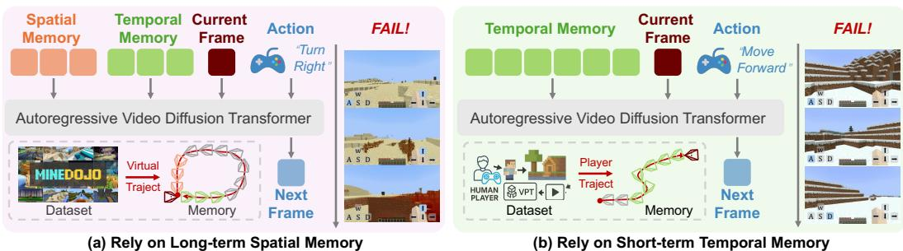
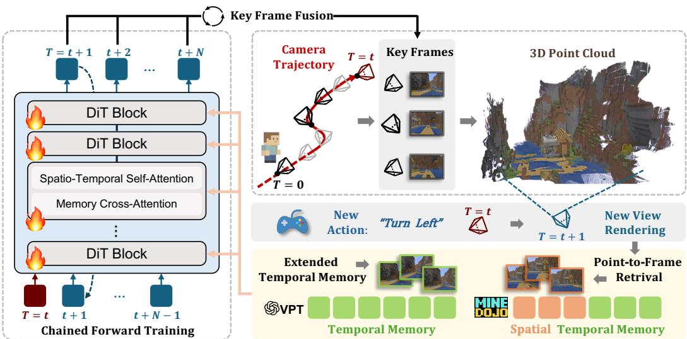
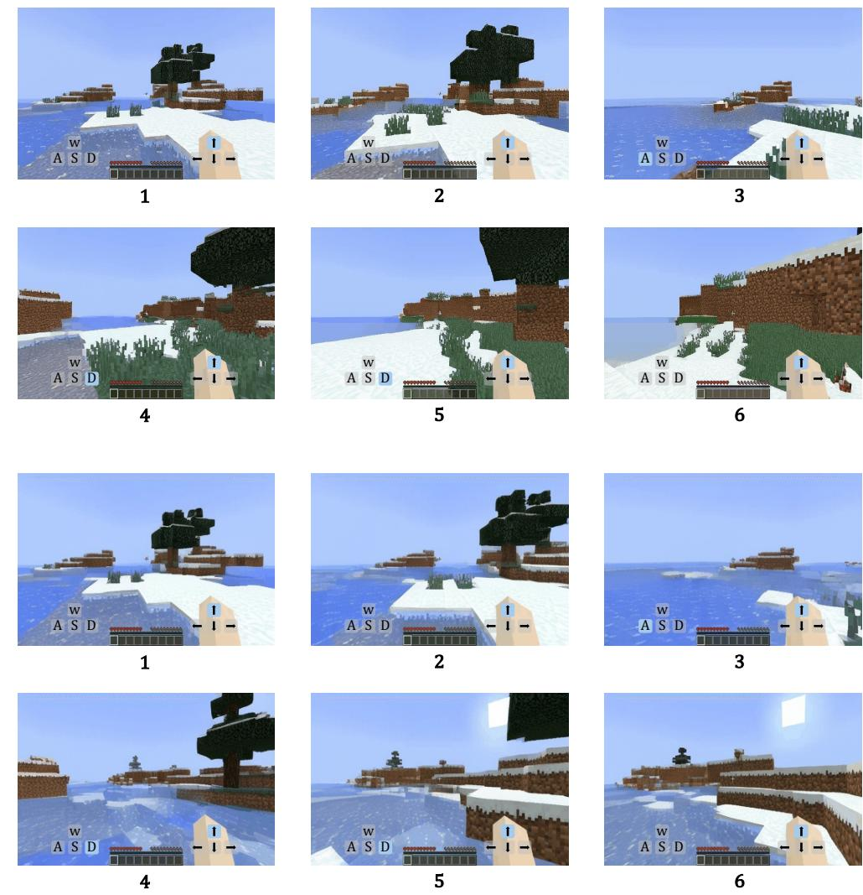
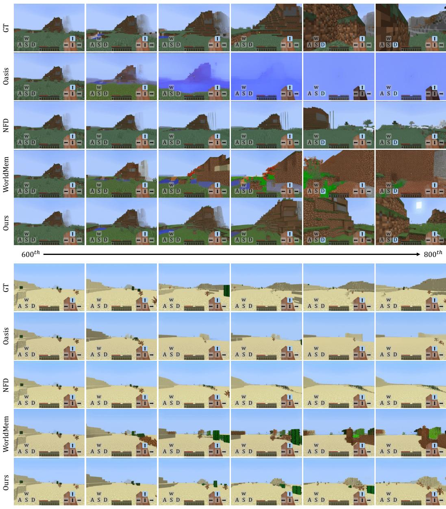
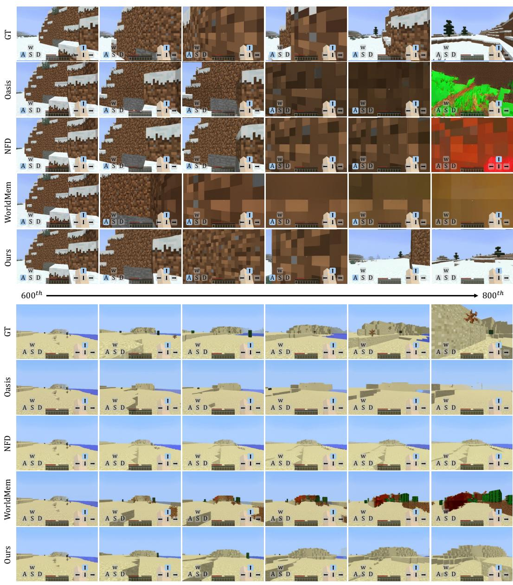
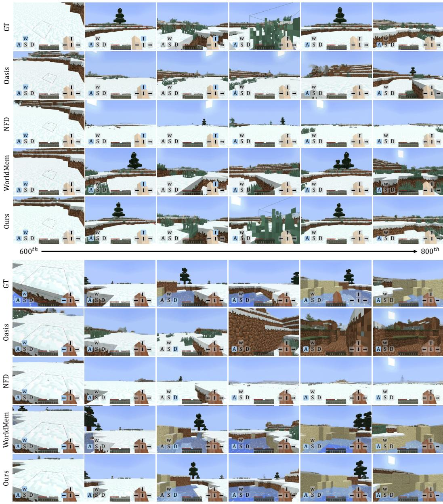

# 记忆驱动：用于Minecraft一致场景生成的时空记忆

黄君超1,2 胡鑫婷3 韩博耀1 施少帅4 田卓涛2 何天宇5 蒋莉1,2† 1香港中文大学（深圳） 深圳湾区域研究院 3香港大学 4滴滴出行 Voyager Research 5微软研究 项目页面：https://junchao-cs.github.io/MemoryForcing-demo/

# 摘要

自回归视频扩散模型已被证明在世界建模和交互场景生成方面有效，以《Minecraft》游戏玩法作为代表性应用。为了忠实模拟玩家体验，模型必须在探索新场景时生成自然内容，并在重新访问已探索区域时保持空间一致性。在有限的计算预算下，模型必须在有限的上下文窗口内压缩并利用历史线索，这暴露了一个权衡：仅基于时间的记忆缺乏长期空间一致性，而增加空间记忆虽然增强一致性，但可能在模型过度依赖不足的空间上下文时降低新场景生成的质量。我们提出了记忆强制（Memory Forcing），一个将训练协议与几何索引的空间记忆相结合的学习框架。混合训练（Hybrid Training）揭示了不同的游戏玩法模式，指导模型在探索期间依赖时间记忆，并在重访时结合空间记忆。链式前向训练（Chained Forward Training）通过模型推演（rollouts）扩展了自回归训练，其中链式预测产生更大的姿态变化，并鼓励依赖空间记忆来保持一致性。点到帧检索（Point-to-Frame Retrieval）通过将当前可见点映射到其源帧高效地检索历史，而增量3D重建（Incremental 3D Reconstruction）则维护并更新一个显式的3D缓存。大量实验表明，记忆强制在多样环境中实现了卓越的长期空间一致性和生成质量，同时保持了对长序列的计算效率。

# 1 引言

基于扩散的自回归视频模型（Bar et al., 2025；Chen et al., 2024；Song et al., 2025）最近作为强大的世界建模工具出现，显示出在交互场景生成方面的强大能力（Feng et al., 2024；Parker-Holder et al., 2024），特别是在像Minecraft这样的开放世界环境中，其中多维控制使得丰富的用户交互成为可能。这些模型（Decart et al., 2024；Guo et al., 2025；Cheng et al., 2025）学习在过去观察和用户行为的条件下预测未来帧，从而实现响应玩家输入的自回归（AR）推演。在AR范式中，模型必须以过去帧的上下文窗口为条件，但延迟和内存限制限制了窗口大小。因此，在这一有限窗口内压缩和优先考虑历史信息（即内存）至关重要。在之前的工作中，内存的分配表现出两种典型的失败模式，如图1所示。包含长时间空间记忆的模型在重访时保持了一致性（图1(a)），但在探索新场景时失败。相反，仅依赖时间的模型在重访时无法保持空间一致性（图1(b)）。此外，强制教师训练（Huang et al., 2025）低估了推理时间的漂移，导致对短期时间线索的过度依赖，而在测试时对检索内存的使用不足。这些观察促使建立一个训练框架，使模型能够在探索和重访阶段调节对时间和空间记忆的依赖，从而平衡探索灵活性和重访一致性。

  

Figure 1: Two paradigms of autoregressive video models and their fail cases. (a) Long-term spatial memory models maintain consistency when revisiting areas yet deteriorate in new environments. (b) Temporal memory models excel in new scenes yet lack spatial consistency when revisiting areas.

为了解决这些局限性，我们引入了记忆强制（Memory Forcing），这是一种训练框架，迫使模型在固定窗口下灵活有效地使用时间和空间记忆。具体而言，混合训练（Hybrid Training）使用不同的数据分布来模拟互补的游戏模式，以便模型学习在新场景探索中依赖时间记忆，并在重访时结合空间记忆以保持一致性。在实践中，我们对VPT（Baker等，2022）（人类游戏，面向探索）采用仅时间条件的设定，对MineDojo（Fan等，2022）（具有频繁重访和相邻视点的模拟轨迹）采用空间和时间条件的设定，从而在两个任务中实现均衡最优。此外，我们引入了链式前向训练（Chained Forward Training），通过模型推演增强自回归学习：它逐步用模型自己的预测替换真实的时间上下文，增强窗口间的姿态/视点漂移，从而鼓励依赖空间记忆以保持重访的一致性。

超越训练协议，我们为模型配备了几何索引空间记忆。之前的帧级检索（Xiao et al., 2025; Chen et al., 2025）基于外观，敏感于视角和光照变化，容易在相邻姿态下累积近重复视图。随着序列的增长，冗余和查找延迟随着存储库的大小而增加。状态空间方法（Po et al., 2025）将历史压缩为潜在状态，并缓解了这一效率问题，但缺乏明确的空间索引，使得指定保留哪些空间证据和丢弃哪些冗余变得困难。相反，我们通过流式 3D 重建保持粗糙的场景表示，并通过点到帧映射检索历史：当前可见的 3D 点被逆向追踪到其源帧，以选择一个紧凑的、与姿态相关的视图集合。这种几何锚定的访问方法对视角变化具有稳健性，限制候选集（前 $k$），并随着可见空间覆盖的变化而扩展，而不是序列长度。我们在 Minecraft 基准（Fan et al., 2022）上进行了全面实验，涉及三个关键维度：具有空间重访的长期记忆、对未知地形的泛化以及在新环境中的生成性能。与仅使用时间记忆和空间记忆的基线相比，我们的方法在这三个设置中均表现出卓越的性能，同时我们的几何索引空间记忆展示了 $7 . 3 \times$ 更快的检索速度和 $9 8 . 2 \%$ 更少的内存存储。这些结果表明，记忆强制有效地解决了空间一致性与生成质量之间的权衡，同时保持计算效率。总之，我们的贡献有三方面：•我们引入了记忆强制，这是一种培训框架，使视频扩散模型能够在固定的上下文预算下平衡探索与重访一致性，以进行 Minecraft 的自回归视频生成。•我们开发了混合训练与链式前馈训练策略，教会模型使用时间记忆进行探索，并结合空间记忆进行重访，以及通过流式 3D 重建与点到帧检索构建的几何索引空间记忆以实现高效的记忆检索。•广泛的实验表明，记忆强制在新环境中实现了空间一致性和生成质量的优越性能，同时保持了对扩展序列的计算效率。

  

Figure 2: Memory Forcing Pipeline. Our framework combines spatial and temporal memory for video generation. 3D geometry is maintained through streaming reconstruction of key frames along the camera trajectory. During generation, Point-to-Frame Retrieval maps spatial context to historical frames, which are integrated with temporal memory and injected together via memory crossattention in the DiT backbone. Chained Forward Training creates larger pose variations, encouraging the model to effectively utilize spatial memory for maintaining long-term geometric consistency.

# 2 相关工作

自回归视频模型。自回归视频生成（Harvey et al., 2022；Li et al., 2025b；Xie et al., 2025；Wu et al., 2024；Teng et al., 2025；Henschel et al., 2025；Yang et al., 2025b）通过依赖于前面的帧进行视频合成。早期基于词元的方法（Wu et al., 2024；Kondratyuk et al., 2023）实现了时间一致性，但牺牲了视觉保真度。近期基于扩散的方法（Voleti et al., 2022；Hong et al., 2024；Chen et al., 2024；Song et al., 2025）通过掩蔽条件和逐帧噪声控制实现了更高的质量。

互动游戏世界模型。世界模型根据当前状态和动作预测未来状态（Ha & Schmidhuber, 2018a;b；Hafner等，2019；2020）。最近的视频生成进展使得复杂游戏环境中的互动世界模型成为可能（OpenAI, 2024；Feng等，2024；Parker-Holder等，2024；Valevski等，2024；Zhang等，2025；He等，2025；Yu等，2025b；Che等，2024）。Minecraft 丰富的动作空间和环境动态激发了众多游戏世界模型的研究（Decart等，2024；Guo等，2025；Cheng等，2025；Po等，2025；Chen等，2025；Xiao等，2025）。虽然像 MineWorld（Guo等，2025）和 NFD（Cheng等，2025）这样的模型展现了强大的交互能力，但它们缺乏长期记忆。状态空间方法（Po等，2025）引入了记忆机制，但仍然受到训练上下文长度的限制。WorldMem（Xiao等，2025）利用基于姿态的检索技术实现了长期记忆，但在新场景生成方面有限，也缺乏实时交互能力。3D 重建与记忆检索。基于学习的 3D 重建由 DUSt3R（Wang等，2024）开创，后续进行多视角扩展（Wang等，2025a;c；Yang等）。基于 SLAM 的方法如 VGGT-SLAM（Maggio等，2025）通过增量子图对齐来处理长序列。在视频生成中的记忆检索，现有方法包括利用视场重叠的基于姿态的方法（Xiao等，2025；Yu等，2025a）和基于 3D 几何的 VMem（Li等，2025a）方法，该方法采用 surfel 索引的视图选择。

我们引入了记忆强制（Memory Forcing），这是一种学习框架，将训练协议与几何索引空间记忆相结合，以实现长期空间一致性。我们的方法通过混合训练（Hybrid Training）和链式前向训练（Chained Forward Training, CFT）解决了生成的时间记忆与重访的空间记忆之间的基本权衡。第3.1节提供了自回归视频扩散模型和互动游戏世界建模的背景。第3.2节介绍了我们的记忆增强模型架构。第3.3节详细说明了我们的记忆强制训练协议。第3.4节介绍了我们的显式三维记忆维护与检索方法。

# 3.1 准备工作

自回归视频扩散模型。自回归视频扩散模型通过预测未来帧来生成视频序列，条件是基于过去的观测。遵循扩散强制（Chen et al., 2024），我们将视频序列表示为 $\mathbf { \bar { \Phi } } _ { X ^ { 1 : T } } ^ { \mathbf { \Phi } } = x _ { 1 } , x _ { 2 } , \ldots , x _ { T }$，其中每一帧 $x _ { t }$ 被分配一个独立的噪声水平 $k _ { t } \in [ 0 , 1 ]$。该模型学习预测噪声 $\epsilon _ { \theta } ( \tilde { X } ^ { 1 : T } , k ^ { 1 : T } )$，其中 $\tilde { X } ^ { 1 : T }$ 表示噪声序列，$k ^ { 1 : T } = k _ { 1 } , k _ { 2 } , \ldots , k _ { T }$ 为噪声水平。训练目标为最小化：

$$
\mathcal { L } = \mathbb { E } _ { k ^ { 1 : T } , X ^ { 1 : T } , \epsilon ^ { 1 : T } } \left[ \vert \epsilon ^ { 1 : T } - \epsilon _ { \theta } ( \tilde { X } ^ { 1 : T } , k ^ { 1 : T } ) \vert ^ { 2 } \right]
$$

该框架通过允许在序列中任意组合干净帧和噪声帧，支持自回归生成的灵活条件模式。交互式游戏世界模型。交互式游戏环境为视频生成模型带来了独特的挑战。玩家在复杂的3D环境中导航，其中动作$\mathcal { A } ^ { 1 : T }$包括移动指令、摄像机旋转和对象交互，这些动作直接影响即时视觉变化和长期环境状态演化。对于基于动作的生成，该模型预测条件于视觉观察和动作的噪声：$\epsilon _ { \theta } ( \tilde { X } ^ { 1 : T } , \bar { k } ^ { 1 : T } , \mathcal { A } ^ { 1 : T } )$，使模型能够生成与玩家输入适当响应的一致视频序列。

# 3.2 记忆增强架构

如图 2 所示，我们遵循之前的研究（Cheng et al., 2025），采用时空自注意力（SpatioTemporal Self-Attention）进行高效建模，使用 adaLN-zero 条件化进行动作整合，并在扩散变换器（Diffusion Transformer, DiT）主干网络中引入 3D 位置嵌入。为了在生成过程中融入长期空间记忆，我们引入了几个特定于记忆的组件：空间记忆提取。我们使用 VGGT（Wang et al., 2025a）网络与我们的跨窗口尺度对齐技术，以实现流式重建。通过点帧检索（Point-to-Frame Retrieval，见第 3.4 节），有效提取历史帧，以提供长期空间记忆访问。记忆交叉注意力。遵循之前的工作（Xiao et al., 2025），我们在每个 DiT 结构块中集成交叉注意力模块，以在生成过程中利用长期空间记忆。检索的历史帧作为键（keys）和值（values），而当前帧的词元则作为查询（queries）：

$$
\mathrm { A t t e n t i o n } ( \tilde { Q } , \tilde { K } _ { \mathrm { s p a t i a l } } , V _ { \mathrm { s p a t i a l } } ) = \mathrm { S o f t m a x } \left( \frac { \tilde { Q } \tilde { K } _ { \mathrm { s p a t i a l } } ^ { T } } { \sqrt { d } } \right) V _ { \mathrm { s p a t i a l } }
$$

其中 $\tilde { Q }$ 和 $\tilde { K } _ { \mathrm { s p a t i a l } }$ 是通过 Plücker 坐标增强的查询和关键字，用于编码当前视点与历史视点之间的相对位姿信息。

# 3.3 自回归扩散训练与记忆强制

内存增强的视频生成模型面临根本的能力权衡。高度依赖长期空间记忆的模型在生成与先前访问场景一致的内容时表现良好，但在生成新场景时由于相关空间记忆不足而退化。因此，我们提出了记忆强制训练协议，旨在教会模型动态平衡这两种能力，学习何时依赖时间上下文与空间记忆。混合训练。我们的混合训练方法在固定的上下文窗口内操作，该窗口由 $L$ 帧组成。我们战略性地将窗口的一半 $( L / 2$ 帧) 分配为固定的时间上下文帧，而剩余的 $L / 2$ 帧则根据场景上下文灵活分配。完整的上下文窗口构造可以形式化为：

$$
{ \mathcal { W } } = [ { \mathcal { T } } _ { \mathrm { f i x e d } } , { \mathcal { M } } _ { \mathrm { c o n t e x t } } ] = \left\{ { \begin{array} { l l } { [ { \mathcal { T } } _ { \mathrm { f i x e d } } , { \mathcal { M } } _ { \mathrm { s p a t i a l } } ] } \\ { [ { \mathcal { T } } _ { \mathrm { f i x e d } } , { \mathcal { T } } _ { \mathrm { e x t e n d e d } } ] } \end{array} } \right.
$$

其中 $\mathcal { T } _ { \mathrm { f i x e d } }$ 表示固定的 $L / 2$ 最近时间上下文帧，$\mathcal { M } _ { \mathrm { s p a t i a l } }$ 表示通过我们的几何索引空间记忆 3.4 检索的长期空间记忆，$\tau _ { \mathrm { e x t e n d e d } }$ 表示来自早期时间步的额外时间帧。这种动态分配使模型能够在每个生成场景中利用最合适的记忆源。受图 1 启发，我们对不同数据集应用不同的记忆策略：针对合成数据集 (Fan et al., 2022) 使用空间记忆以应对频繁的区域回访，而针对 VPT 数据集 (Baker et al., 2022) 则使用扩展时间上下文以支持新场景生成。

# 算法 1 链式前向训练 (CFT)

要求：视频 x，条件输入 $\mathcal { C }$，前向步骤 $T$，窗口大小 $W$，模型 $\epsilon _ { \theta }$ 1: 初始化 $\mathcal { F } _ { \mathrm { p r e d } } \emptyset$，$\mathcal { L } _ { \mathrm { t o t a l } } 0$ 2: 对 $j = 0$ 到 $T - 1$ 进行循环 3: 构建窗口 ${ \mathcal { W } } _ { j }$： 4: 对于 $k \in [ j , j + W - 1 ]$ 进行循环 5: 如果 $k \in \mathcal { F } _ { \mathrm { p r e d } }$ 则 6: $\mathscr { W } _ { j } [ k - j ] { \mathscr { F } _ { \mathrm { p r e d } } [ k ] }$ {使用预测帧} 7: 其他 8: $\mathcal { W } _ { j } [ k - j ] { \bf x } _ { k }$ {使用真实帧} 9: 结束条件 10: 结束循环 11: 计算 $\mathcal { L } _ { j } \gets \| \epsilon - \epsilon _ { \theta } ( \mathcal { W } _ { j } , \mathcal { C } _ { j } , t ) \| ^ { 2 }$，更新 ${ \mathcal { L } } _ { \mathrm { t o t a l } } { \mathcal { L } } _ { \mathrm { t o t a l } } + { \mathcal { L } } _ { j }$ 12: 如果 $j < T - 1$ 则 13: $\hat { \mathbf { x } } _ { j + W - 1 } \mathrm { d e n o i s e } ( \mathcal { W } _ { j } , \mathcal { C } _ { j } )$ {生成较少步骤，无梯度} 14: $\mathcal { F } _ { \mathrm { p r e d } } [ j + W - 1 ] \hat { \mathbf { x } } _ { j + W - 1 }$ {存储用于下一个窗口} 15: 结束条件 16: 结束循环 17: 返回 $\mathcal { L } _ { \mathrm { c h a i n } } \mathcal { L } _ { \mathrm { t o t a l } } / T$

链式前向训练。我们引入链式前向训练（CFT）来增强我们的混合训练策略。CFT 顺序处理时间窗口，其中前面窗口的预测帧被纳入后续窗口，从而在序列中创建级联依赖。具体细节见算法 1。在每个步骤 $j$，我们构建一个时间窗口 ${ \mathcal { W } } _ { j }$，范围涵盖帧 $[ j , j + W - 1 ]$。在此范围内的每个帧位置 $k$，窗口包含真实帧 $\mathbf { x } _ { k }$（如果之前未预测）或预测帧 $\hat { \mathbf { x } } _ { k }$（如果在之前步骤中生成）。条件输入 $\mathcal { C } _ { j } = \{ \bar { A } _ { j } , \mathcal { P } _ { j } , \mathcal { M } _ { \mathrm { s p a t i a l } } \}$ 包括当前窗口检索的动作 $A _ { j }$、姿态 $\mathcal { P } _ { j }$ 和空间记忆 $\mathcal { M } _ { \mathrm { s p a t i a l } }$。训练目标为：

$$
\mathcal { L } _ { \mathrm { c h a i n } } = \frac { 1 } { T } \sum _ { j = 0 } ^ { T - 1 } \mathbb { E } _ { t , \epsilon } \left[ \| \epsilon - \epsilon _ { \theta } ( \mathcal { W } _ { j } ( \mathbf { x } , \hat { \mathbf { x } } ) , \mathcal { C } _ { j } , t ) \| ^ { 2 } \right] , \quad t \sim \mathrm { U n i f o r m } ( 0 , T _ { \mathrm { n o i s e } } ) , \epsilon \sim \mathcal { N } ( 0 , \mathbf { I } )
$$

该方法通过模型推演扩展了自回归训练，其中由连锁预测产生的更大姿态变化导致早期窗口的误差传播，促使模型依靠空间记忆在重新访问区域时保持一致性。此外，通过在训练期间用模型自身的预测替换真实时间上下文，该方法有助于减少自回归推理过程中通常出现的累积误差。

# 3.4 几何索引空间记忆

我们的几何索引空间记忆维护了明确的三维场景几何体，以便根据空间关系有效检索长期历史视觉信息。其核心思想是建立一个全球点云表示，其中每个三维点与其源帧关联，形成可追溯的连接回原始视觉观测。该系统通过两个关键组件操作：点到帧检索（Point-to-Frame Retrieval），用于识别空间相关的历史帧，以及增量式三维重建（Incremental 3D Reconstruction），该组件利用预测深度图和姿态导出的相机外参持续更新场景表示。点到帧检索：对于每个当前帧，我们将全球点云投影到当前相机姿态，并分析可见点的源帧索引，以识别最相关的历史帧：

$$
\mathcal { H } _ { t } = \arg \operatorname* { m a x } _ { k = 1 , \ldots , 8 } \mathrm { C o u n t } ( \operatorname { s o u r c e } ( p _ { i } ) : p _ { i } \in \mathcal { P } _ { \mathrm { v i s i b l e } } ^ { t } )
$$

其中 $\mathcal { P } _ { \mathrm { v i s i b l e } } ^ { t }$ 表示当前相机姿态下帧 $t$ 可见点的集合，源 $\left( { p _ { i } } \right)$ 表示点 $p _ { i }$ 的源帧索引，而 $\mathcal { H } _ { t }$ 包含在可见点中引用频率最高的前 8 个历史帧。此检索机制在序列长度不变的情况下保持 $O ( 1 )$ 的复杂度，确保了可扩展的处理能力。增量式 3D 重建。我们采用选择性重建方法，该方法基于空间信息内容动态确定关键帧。当帧能够揭示之前未观察到的区域或缺乏足够的历史上下文时，该帧被认定为关键帧：

$$
\mathrm { I s K e y f r a m e } ( t ) = \mathrm { N o v e l C o v e r a g e } ( I _ { t } , \mathcal { G } _ { \mathrm { g l o b a l } } ) \ \mathbf { o r } \ ( | \mathcal { H } _ { t } | < \tau _ { \mathrm { h i s t } } )
$$

NovelCoverage $\left( I _ { t } , \mathcal { G } _ { \mathrm { g l o b a l } } \right)$ 评估当前帧 $I _ { t }$ 相对于现有全局几何 $\mathcal { G } _ { \mathrm { g l o b a l } }$ 是否提供了足够的新空间覆盖，通过从当前位姿渲染全局点云，且 $\tau _ { \mathrm { h i s t } } = L / 2$ 作为最小历史帧计数阈值。当达到窗口容量时，我们联合处理关键帧、通过点到帧检索选择的历史帧以提高几何一致性，以及来自先前窗口的重叠帧，这些帧为对齐新窗口提供深度尺度参考。VGGT 为该窗口中的每帧生成相对深度图和置信度分数，随后是我们的跨窗口尺度对齐模块（详见附录 A.1），该模块通过重叠区域中的对应关系分析在窗口之间建立一致的深度尺度。3D 几何通过利用从四元数组成的位姿导出的外参进行深度图反投影重建。

$$
{ \bf E } = \left[ \begin{array} { c c } { { \bf R } ( p i t c h , y a w ) } & { - { \bf R C } } \\ { { \bf 0 } ^ { T } } & { 1 } \end{array} \right]
$$

其中 $\mathbf { R } ( p i t c h , y a w )$ 通过基于四元数的旋转组合编码观察方向，$\mathbf { C } = [ x , \overset { \cdot } { y } , z ] ^ { T }$ 指定了相机的空间位置。重建的几何体随后通过空间感知体素采样被整合到我们的全球表示中。该设计通过两个关键机制实现高效的场景表示和检索。首先，选择性关键帧重建过程仅处理和存储对新空间覆盖有贡献的帧，防止在回访已遇到区域时产生冗余计算和存储。其次，体素下采样保持了任何姿态区域内点密度的上限，确保无论时间序列长度或场景范围如何，检索复杂度都保持不变。这些机制共同确保内存消耗随空间覆盖而扩展，而非随时间长度扩展，从而实现对扩展序列的高效处理。

# 4 实验

我们进行全面实验，以通过定量和定性分析评估我们的记忆强制框架。我们展示了我们模型在构建的Minecraft环境中的长期记忆能力、泛化性和生成性能，并评估了其几何-稀疏空间记忆的存储效率。此外，我们提供了关于我们的训练方法和帧检索策略的消融研究。

# 4.1 实验设置

实施细节。我们的模型在 24 个 GPU 上以批量大小 4 经过大约 $4 0 0 \mathrm { k }$ 的训练步骤后收敛。我们使用学习率为 4e-5 的 Adam 优化器。所有训练和评估均在 NVIDIA H2ó/H100 GPU 上使用 PyTorch 进行。我们采用一个

  

Figure 3: Memory capability comparison across different models for maintaining spatial consistency and scene coherence when revisiting previously observed areas.

基于NFD（Cheng et al., 2025）的2D变分自编码器用于帧标记化，提供$1 6 \times$的空间压缩，并将每帧转化为$2 4 \times 1 4$的连续词元。视频帧被调整为$3 8 4 \times 2 2 4$的分辨率，以保持原始纵横比和足够的视觉细节。数据集。对于训练，我们使用VPT（Baker et al., 2022）数据集，该数据集将25维动作向量与对应的视频序列配对。根据以往的研究（Guo et al., 2025），我们排除了无动作的帧或图形用户界面可见的帧，以减少噪声。此外，我们利用从MineDoJo（Fan et al., 2022）生成的合成数据集进行长期记忆训练，遵循WorldMem（Xiao et al., 2025）的配置，该配置包含11k个视频，内容包括1500帧的动作序列，并频繁过渡到先前访问的空间位置。为了评估，我们使用MineDojo构建了三个数据集，以评估模型在不同方面的表现：

  

Figure 4: Generalization performance on unseen terrain types (top) and generation performance in new environments (bottom). Our method demonstrates superior visual quality and responsive movement dynamics, with distant scenes progressively becoming clearer as the agent approaches, while baselines show quality degradation, minimal distance variation, or oversimplified distant scenes.

• 长期记忆：从WorldMem数据集中（Xiao et al., 2025）提取了150个长期视频序列（1500帧），以评估模型对长期记忆的保持能力。 • 泛化性能：我们使用MineDojo（Fan et al., 2022）构建了150个视频序列（800帧），来自九个未见过的Minecraft地形，以评估模型的泛化能力。 • 生成性能：我们使用MineDojo（Fan et al., 2022）构建了300个视频序列（800帧），以评估在新环境中的生成性能。 基准线。我们将我们的方法与基准模型进行比较，包括Oasis（Decart et al., 2024）和NFD（Cheng et al., 2025），以及长期记忆模型WorldMem（Xiao et al., 2025）。为了确保公平比较，所有模型在训练和评估过程中均使用16帧的上下文窗口。所有模型遵循各自的训练配置，并在相同的合成数据集上训练约500-600k步，以确保一致的评估条件。 评估指标。我们使用已建立的视频质量指标评估模型的性能。我们通过Fréchet视频距离（FVD）和学习感知图像块相似度（LPIPS）衡量感知质量，同时通过峰值信噪比（PSNR）和结构相似性指数测量（SSIM）评估像素级的准确性。这些指标共同提供了对生成序列的视觉真实度和一致性的全面评估。

Table 1: A comparison of different methods across various capabilities and evaluation metrics.   

<table><tr><td rowspan="2">Method</td><td colspan="4">Long-term Memory</td><td colspan="4">Generalization Performance</td><td colspan="4">Generation Performance</td></tr><tr><td>FVD ↓</td><td>PSNR ↑</td><td>SSIM↑</td><td>LPIPS ↓</td><td>FVD ↓</td><td>PSNR ↑</td><td>SSIM ↑</td><td>LPIPS ↓</td><td>FVD ↓</td><td>PSNR ↑</td><td>SSIM↑</td><td>LPIPS ↓</td></tr><tr><td>Oasis</td><td>196.8</td><td>16.83</td><td>0.5654</td><td>0.3791</td><td>477.3</td><td>14.74</td><td>0.5175</td><td>0.5122</td><td>285.7</td><td>14.51</td><td>0.5063</td><td>0.4704</td></tr><tr><td>NFD</td><td>220.8</td><td>16.35</td><td>0.5819</td><td>0.3891</td><td>442.6</td><td>15.49</td><td>0.5564</td><td>0.4638</td><td>349.6</td><td>14.64</td><td>0.5417</td><td>0.4343</td></tr><tr><td>WorldMem</td><td>122.2</td><td>19.32</td><td>0.5983</td><td>0.2769</td><td>328.3</td><td>16.23</td><td>0.5178</td><td>0.4336</td><td>290.8</td><td>14.71</td><td>0.4906</td><td>0.4531</td></tr><tr><td>Ours</td><td>84.9</td><td>21.41</td><td>0.6692</td><td>0.2156</td><td>253.7</td><td>19.86</td><td>0.6341</td><td>0.2896</td><td>185.9</td><td>17.99</td><td>0.6155</td><td>0.3031</td></tr></table>

Table 2: Comparison of retrieval efficiency between WorldMem and our Geometry-indexed Spatial Memory across different sequence lengths. "Mem." denotes the number of frames in memory bank.   

<table><tr><td>Frame Range</td><td colspan="2">0-999</td><td colspan="2">1000-1999</td><td colspan="2">2000-2999</td><td colspan="2">3000-3999</td><td colspan="2">Total (0-3999)</td></tr><tr><td>Method</td><td>Speed (PS )</td><td>Mem. (Count ↓)</td><td>Speed (FPS ↑)</td><td>Mem. (Count ↓)</td><td>Speed (FPS ↑)</td><td>Mem. (Count ↓)</td><td>Speed (FPS ↑)</td><td>Mem. (Count ↓)</td><td>Speed (FPS ↑)</td><td>Mem. (Count ↓)</td></tr><tr><td>WorldMem</td><td>10.11</td><td>+1000</td><td>3.43</td><td>+1000</td><td>2.06</td><td>+1000</td><td>1.47</td><td>+1000</td><td>4.27</td><td>4000</td></tr><tr><td>Ours</td><td>18.57</td><td>+25.45</td><td>27.08</td><td>+19.70</td><td>41.36</td><td>+14.55</td><td>37.84</td><td>+12.95</td><td>31.21</td><td>72.65</td></tr></table>

# 4.2 模型能力评估

对于所有定量和定性评价，我们生成600-800帧（200帧），以评估使用实验设置中描述的数据集进行长序列生成的能力。长期记忆。我们评估模型在重新访问先前观察到的区域时保持空间一致性和场景连贯性的能力，使用我们的长期记忆评估数据集。如表1所示，我们的方法在所有指标上都取得了优越的性能，表明长序列生成中的视觉保真度得到增强。图3进一步显示，我们的模型在返回先前访问的位置时表现出最精确的记忆。虽然WorldMem表现出一些记忆保留能力，但在生成场景时产生不准确和不稳定的视图生成，并且存在视觉伪影（例如，第五帧在第四行中）。相比之下，其余基线模型缺乏长期记忆机制，导致空间不一致性，摄像机视点变化不当改变了场景几何形状和地形特征。泛化性能。使用我们包含九种新地形场景的泛化评估数据集，我们的方法展示了强大的泛化性能，显著优于所有基线模型，如表1所示，表明对未见环境的强适应性。图4的上部展示了定性泛化结果，我们的模型在新地形上生成了稳定且一致的输出。相反，WorldMem和NFD在它们的生成中表现出伪影，而Oasis展示了场景不一致性。生成性能。我们使用生成性能数据集的全面评估表明，我们的方法在表1中的各项指标上都优于所有基线模型，突显了平衡长期和短期记忆的有效性。图4的下部展示了新环境中的生成性能，我们的模型在接近时表现出响应性运动动态，远处场景逐渐变得清晰。相比之下，WorldMem在该场景中经历了显著的质量降级，NFD在远处场景中无论智能体运动如何变化都显示出微小变化，而Oasis生成了简化过度的远处场景，缺乏适当的基于距离的视觉过渡。

# 4.3 基于几何索引的空间记忆效率

表2评估了我们的几何索引空间记忆与WorldMem的检索方法在20个4000帧MineDojo视频中的计算效率和存储需求。虽然WorldMem存储所有历史帧并在整个集合中执行线性复杂度的检索，但我们选择的关键帧方法在0-3999帧范围内将内存库大小减少了$9 8 . 2 \%$，同时实现了$7 . 3 \times$的更快检索速度。随着序列长度的增加，效率提升加大，在3000-3999帧范围内达到$2 5 . 7 \times$的加速，因为WorldMem的速度变得越来越慢。WorldMem的内存库随着序列长度线性增长，而我们的几何索引空间记忆则随着空间覆盖的扩展而扩展，仅存储具有新几何信息的关键帧。我们的速度包括完整的3D记忆管道（重建和检索），而WorldMem的速度则包括对所有存储帧的基于位姿的检索。

Table 3: Ablation study comparing training strategies and retrieval mechanisms. FT: full-parameter fine-tuning, HT-w/o-CFT: hybrid training without CFT, MF: Memory Forcing with HT and CFT.   

<table><tr><td colspan="2">Training Strategies FT</td><td colspan="2">Retrieval Strategies</td><td colspan="4">Metrics</td></tr><tr><td>HT-w/o-CFT</td><td>MF</td><td>Pose-based</td><td>3D-based</td><td>FVD ↓</td><td>PSNR ↑</td><td>SSIM ↑</td><td>LPIPS ↓</td></tr><tr><td>✓</td><td></td><td></td><td>;</td><td>366.1</td><td>15.09</td><td>0.5649</td><td>0.4122</td></tr><tr><td></td><td></td><td></td><td></td><td>230.4</td><td>16.24</td><td>0.5789</td><td>0.3598</td></tr><tr><td>✓</td><td></td><td>;</td><td></td><td>225.9</td><td>16.24</td><td>0.5945</td><td>0.3722</td></tr><tr><td></td><td></td><td></td><td>✓</td><td>165.9</td><td>18.17</td><td>0.6222</td><td>0.2876</td></tr></table>

# 4.4 消融研究

表3展示了对来自长期记忆与生成性能数据集的300个视频进行的消融研究，分析了我们的训练策略和检索机制的贡献。训练策略分析。我们比较了三种训练方法：在VPT预训练后进行的全参数微调（FT）、不包含链式前向训练的混合训练（HT-w/o-CFT），以及我们的完整记忆强制训练策略（MF）。直接微调的表现有限，因为模型在时间记忆和空间记忆之间难以平衡，通常过度依赖一种模态而牺牲另一种。HT-w/o-CFT通过整合真实和合成数据显示出改进，但在空间重访场景中不足以训练模型对空间记忆的依赖。我们的记忆强制训练方法通过使模型在探索新场景时自适应地利用时间上下文，同时在重访先前观察过的区域时利用空间记忆，以实现最佳性能，有效解决了生成质量与长期记忆保留之间的基本能力权衡。检索机制比较。我们的基于3D的方法通过利用显式几何表示，显著优于基于姿态的检索方法，实现了对空间相关历史帧的更精确识别，同时在表2中显示出更高的计算效率。

# 5 结论

我们引入了记忆强化（Memory Forcing）这一新框架，它解决了自回归视频模型中长期空间记忆与新场景生成之间的基本权衡。我们的方法包括两个关键创新：一种混合训练策略，采用链式前向训练（Chained Forward Training），旨在教会模型动态平衡时间和空间记忆的利用；高效的几何索引空间记忆（Geometry-indexed Spatial Memory），通过流式三维重构和点对帧检索实现常数时间的检索复杂度。我们的框架鼓励自适应上下文选择，依赖时间记忆进行新场景生成，同时利用空间记忆确保之前遇到区域的一致性。大量实验表明，记忆强化在空间一致性和生成质量方面表现优越，同时在处理延长序列的计算效率上保持良好，有效解决了之前增强记忆的视频模型所面临的能力权衡。局限性。尽管记忆强化在记忆保持和生成质量方面表现出色，但仍然存在几个局限性。我们当前的实现主要在Minecraft游戏场景中进行了验证，这可能无法直接推广到其他环境而无需领域特定的适应。此外，我们的模型在固定的分辨率$3 8 4 \times 2 2 4$像素下运行，这可能限制某些需要更高保真度的应用中的视觉细节。未来工作。未来的研究应集中于将我们的框架扩展到更高分辨率的多样化游戏环境和现实场景。我们计划探索保留核心记忆机制的领域适应技术，同时适应不同的视觉特征。此外，与先进加速技术的集成可能会进一步提高效率和在不同交互场景中的性能。

# REFERENCES

Bowen Baker, Ilge Akkaya, Peter Zhokov, Joost Huizinga, Jie Tang, Adrien Ecoffet, Brandon Houghton, Raul Sampedro, and Jeff Clune. Video pretraining (vpt): Learning to act by watching unlabeled online videos. Advances in Neural Information Processing Systems, 2022.

Amir Bar, Gaoyue Zhou, Danny Tran, Trevor Darrell, and Yann LeCun. Navigation world models. In Proceedings of the Computer Vision and Pattern Recognition Conference, 2025.

Haoxuan Che, Xuanhua He, Quande Liu, Cheng Jin, and Hao Chen. Gamegen-x: Interactive openworld game video generation. In The Thirteenth International Conference on Learning Representations, 2024.

Boyuan Chen, Diego Martí Monsó, Yilun Du, Max Simchowitz, Russ Tedrake, and Vincent Sitzmann. Diffusion forcing: Next-token prediction meets full-sequence diffusion. Advances in Neural Information Processing Systems, 2024.

Taiye Chen, Xun Hu, Zihan Ding, and Chi Jin. Learning world models for interactive video generation. arXiv preprint arXiv:2505.21996, 2025.

Xinle Cheng, Tianyu He, Jiayi Xu, Junliang Guo, Di He, and Jiang Bian. Playing with transformer at $^ { 3 0 + }$ fps via next-frame diffusion. arXiv preprint arXiv:2506.01380, 2025.

Etched Decart, Quinn McIntyre, Spruce Campbell, Xinlei Chen, and Robert Wachen. Oasis: A universe in a transformer. URL: https://oasis-model. github. io, 2024.

Prafulla Dhariwal and Alexander Nichol. Diffusion models beat gans on image synthesis. Advances in neural information processing systems, 2021.

Linxi Fan, Guanzhi Wang, Yunfan Jiang, Ajay Mandlekar, Yuncong Yang, Haoyi Zhu, Andrew Tang, De-An Huang, Yuke Zhu, and Anima Anandkumar. Minedojo: Building open-ended embodied agents with internet-scale knowledge. In Thirty-sixth Conference on Neural Information Processing Systems Datasets and Benchmarks Track, 2022. URL https : / / openreview. net/forum?id $=$ rc8o_j8I8PX.

Ruili Feng, Han Zhang, Zhantao Yang, Jie Xiao, Zhilei Shu, Zhiheng Liu, Andy Zheng, Yukun Huang, Yu Liu, and Hongyang Zhang. The matrix: Infinite-horizon world generation with realtime moving control. arXiv preprint arXiv:2412.03568, 2024.

Junliang Guo, Yang Ye, Tianyu He, Haoyu Wu, Yushu Jiang, Tim Pearce, and Jiang Bian. Mineworld: a real-time and open-source interactive world model on minecraft. arXiv preprint arXiv:2504.08388, 2025.

William H Guss, Brandon Houghton, Nicholay Topin, Phillip Wang, Cayden Codel, Manuela Veloso, and Ruslan Salakhutdinov. Minerl: A large-scale dataset of minecraft demonstrations. arXiv preprint arXiv:1907.13440, 2019.

David Ha and Jürgen Schmidhuber. Recurrent world models facilitate policy evolution. Advances in neural information processing systems, 2018a.

David Ha and Jürgen Schmidhuber. World models. arXiv preprint arXiv: 1803.10122, 2018b.

Danijar Hafner, Timothy Lillicrap, Jimmy Ba, and Mohammad Norouzi. Dream to control: Learning behaviors by latent imagination. arXiv preprint arXiv:1912.01603, 2019.

Danijar Hafner, Timothy Lillicrap, Mohammad Norouzi, and Jimmy Ba. Mastering atari with discrete world models. arXiv preprint arXiv:2010.02193, 2020.

William Harvey, Saeid Naderiparizi, Vaden Masrani, Christian Weilbach, and Frank Wood. Flexible diffusion modeling of long videos. Advances in neural information processing systems, 2022.

Xianglong He, Chunli Peng, Zexiang Liu, Boyang Wang, Yifan Zhang, Qi Cui, Fei Kang, Biao Jiang, Mengyin An, Yangyang Ren, et al. Matrix-game 2.0: An open-source, real-time, and streaming interactive world model. arXiv preprint arXiv:2508.13009, 2025.

Roberto Henschel, Levon Khachatryan, Hayk Poghosyan, Daniil Hayrapetyan, Vahram Tadevosyan, Zhangyang Wang, Shant Navasardyan, and Humphrey Shi. Streamingt2v: Consistent, dynamic, and extendable long video generation from text. In Proceedings of the Computer Vision and Pattern Recognition Conference, 2025.

Jonathan Ho, AjayN. Jain, and Pieter Abbeel. Denoising diffusion probabilistic models. Advances in neural information processing systems, 2020.

Yining Hong, Beide Liu, Maxine Wu, Yuanhao Zhai, Kai-Wei Chang, Linjie Li, Kevin Lin, ChungChing Lin, Jianfeng Wang, Zhengyuan Yang, et al. Slowfast-vgen: Slow-fast learning for actiondriven long video generation. arXiv preprint arXiv:2410.23277, 2024.

Xun Huang, Zhengqi Li, Guande He, Mingyuan Zhou, and Eli Shechtman. Self forcing: Bridging the train-test gap in autoregressive video diffusion. arXiv preprint arXiv:2506.08009, 2025.

Dan Kondratyuk, Lijun Yu, Xiuye Gu, José Lezama, Jonathan Huang, Grant Schindler, Rachel Hornung, Vighnesh Birodkar, Jimmy Yan, Ming-Chang Chiu, et al. Videopoet: A large language model for zero-shot video generation. arXiv preprint arXiv:2312.14125, 2023.

Runjia Li, Philip Torr, Andrea Vedaldi, and Tomas Jakab. Vmem: Consistent interactive video scene generation with surfel-indexed view memory. arXiv preprint arXiv:2506.18903, 2025a.

Zongyi Li, Shujie Hu, Shujie Liu, Long Zhou, Jeongsoo Choi, Lingwei Meng, Xun Guo, Jinyu Li, Hefei Ling, and Furu Wei. Arlon: Boosting diffusion transformers with autoregressive models for long video generation. In ICLR, 2025b.

Dominic Maggio, Hyungtae Lim, and Luca Carlone. Vggt-slam: Dense rgb slam optimized on the sl (4) manifold. arXiv preprint arXiv:2505.12549, 2025.

OpenAI. Video generation models as world simulators, 2024.

J Parker-Holder, P Ball, J Bruce, V Dasagi, K Holsheimer, C Kaplanis, A Moufarek, G Scully, J Shar, J Shi, et al. Genie 2: A large-scale foundation world model. URL: https://deepmind. google/discover/blog/genie-2-a-large-scale-foundation-world-model, 2024.

William Peebles and Saining Xie. Scalable diffusion models with transformers. In Proceedings of the IEEE/CVF international conference on computer vision, 2023.

Ryan Po, Yotam Nitzan, Richard Zhang, Berlin Chen, Tri Dao, Eli Shechtman, Gordon Wetzstein, and Xun Huang. Long-context state-space video world models. arXiv preprint arXiv:2505.20171, 2025.

Kiwhan Song, Boyuan Chen, Max Simchowitz, Yilun Du, Russ Tedrake, and Vincent Sitzmann. History-guided video diffusion. arXiv preprint arXiv:2502.06764, 2025.

Hansi Teng, Hongyu Jia, Lei Sun, Lingzhi Li, Maolin Li, Mingqiu Tang, Shuai Han, Tianning Zhang, WQ Zhang, Weifeng Luo, et al. Magi-1: Autoregressive video generation at scale. arXiv preprint arXiv:2505.13211, 2025.

Dani Valevski, Yaniv Leviathan, Moab Arar, and Shlomi Fruchter. Diffusion models are real-time game engines. In The Thirteenth International Conference on Learning Representations, 2024.

Vikram Voleti, Alexia Jolicoeur-Martineau, and Chris Pal. Mcvd-masked conditional video diffusion for prediction, generation, and interpolation. Advances in neural information processing systems, 2022.

Jianyuan Wang, Minghao Chen, Nikita Karaev, Andrea Vedaldi, Christian Rupprecht, and David Novotny. Vggt: Visual geometry grounded transformer. In Proceedings of the Computer Vision and Pattern Recognition Conference, 2025a.

Qianqian Wang, Yifei Zhang, Aleksander Holynski, Alexei A Efros, and Angjoo Kanazawa. Continuous 3d perception model with persistent state. In Proceedings of the Computer Vision and Pattern Recognition Conference, 2025b.

Shuzhe Wang, Vincent Leroy, Yohann Cabon, Boris Chidlovskii, and Jerome Revaud. Dust3r: Geometric 3d vision made easy. In Proceedings of the IEEE/CVF Conference on Computer Vision and Pattern Recognition, 2024.

Yifan Wang, Jianjun Zhou, Haoyi Zhu, Wenzheng Chang, Yang Zhou, Zizun Li, Junyi Chen, Jiangmiao Pang, Chunhua Shen, and Tong He. pi3: Scalable permutation-equivariant visual geometry learning. arXiv preprint arXiv:2507.13347, 2025c.   
Jialong Wu, Shaofeng Yin, Ningya Feng, Xu He, Dong Li, Jianye Hao, and Mingsheng Long. ivideogpt: Interactive videogpts are scalable world models. Advances in Neural Information Processing Systems, 2024.   
Yuqi Wu, Wenzhao Zheng, Jie Zhou, and Jiwen Lu. Point3r: Streaming 3d reconstruction with explicit spatial pointer memory. arXiv preprint arXiv:2507.02863, 2025.   
Zeqi Xiao, Yushi Lan, Yifan Zhou, Wenqi Ouyang, Shuai Yang, Yanhong Zeng, and Xingang Pan. Worldmem: Long-term consistent world simulation with memory. arXiv preprint arXiv:2504.12369, 2025.   
Desai Xie, Zhan Xu, Yicong Hong, Hao Tan, Difan Liu, Feng Liu, Arie Kaufman, and Yang Zhou. Progressive autoregressive video diffusion models. In Proceedings of the Computer Vision and Pattern Recognition Conference, 2025.   
Wilson Yan, Danijar Hafner, Stephen James, and Pieter Abbeel. Temporally consistent transformers for video generation. In International Conference on Machine Learning. PMLR, 2023.   
Jianing Yang, Alexander Sax, Kevin J Liang, Mikael Henaff, Hao Tang, Ang Cao, Joyce Chai, Franziska Meier, and Matt Feiszli. Fast3r: Towards 3d reconstruction of $1 0 0 0 +$ images in one forward pass. In Proceedings of the Computer Vision and Pattern Recognition Conference, 2025a.   
Shuai Yang, Wei Huang, Ruihang Chu, Yicheng Xiao, Yuyang Zhao, Xianbang Wang, Muyang Li, Enze Xie, Yingcong Chen, Yao Lu, and Song Hanand Yukang Chen. Longlive: Real-time interactive long video generation. arXiv, 2025b.   
Jiwen Yu, Jianhong Bai, Yiran Qin, Quande Liu, Xintao Wang, Pengfei Wan, Di Zhang, and Xihui Liu.Context as memory: Scene-consistent interactive long video generation with memory retrieval. arXiv preprint arXiv:2506.03141, 2025a.   
Jiwen Yu, Yiran Qin, Xintao Wang, Pengfei Wan, Di Zhang, and Xihui Liu. Gamefactory: Creating new games with generative interactive videos. arXiv preprint arXiv:2501.08325, 2025b.   
Yifan Zhang, Chunli Peng, Boyang Wang, Puyi Wang, Qingcheng Zhu, Fei Kang, Biao Jiang, Zedong Gao, Eric Li, Yang Liu, et al. Matrix-game: Interactive world foundation model. arXiv preprint arXiv:2506.18701, 2025.

# A APPENDIX

# A.1 Cross-Window SCaLe ALignMent ModuLE

The Cross-Window Scale Alignment Module addresses the challenge of maintaining consistent depth scale across processing windows when using relative depth estimation. Since VGGT produces relative depth maps that may have different scales across windows, we need to align them with previously stored geometry to maintain global consistency.

Overlap Detection and Correspondence Establishment. For each new window with frame indices $\mathcal { W } _ { n e w }$ , we first identify overlapping frames with the global frame store:

$$
\mathcal { O } = \{ f \mid f \in \mathcal { W } _ { n e w } \cap \mathcal { F } _ { g l o b a l } \}
$$

where ${ \mathcal { F } } _ { g l o b a l }$ represents all frames previously stored in the global memory.

Scale Factor Computation. For each overlapping frame $f \in { \mathcal { O } }$ , we extract the corresponding depth maps and confidence scores from both the stored global representation and the current window: 1, Stored depth: D(f ) $D _ { o l d } ^ { ( f ) } \ \in \ \mathbb { R } ^ { H \times W \times 1 }$ 2, New deph: $D _ { n e w } ^ { ( f ) } \ \in \ \mathbb { R } ^ { H \times W \times 1 }$ ; 3, Stored confidence: $C _ { o l d } ^ { ( f ) } \in \mathbb { R } ^ { H \times W }$ ; 4, New confidence: $C _ { n e w } ^ { ( f ) } \in \mathbb { R } ^ { H \times W }$ .

We concatenate all overlapping frames to form stacked representations and apply a multi-stage filtering process to ensure robust scale estimation:

•Validity Filtering: Remove pixels with invalid depths $( < 1 0 ^ { - 6 } )$ .

•Confidence Thresholding: Keep only pixels where both old and new confidences exceed a minimum threshold $\tau _ { m i n } = 0 . 1$ .

Percentile-based Selection: Among valid pixels, compute confidence percentiles and retain only the top $60 \%$ most confident pixels for both old and new estimates.

The scale factor $s$ is computed using least-squares optimization on the filtered correspondences:

$$
s ^ { * } = \arg \operatorname* { m i n } _ { s } \sum _ { i \in \mathcal { V } } ( D _ { o l d , i } - s \cdot D _ { n e w , i } ) ^ { 2 }
$$

where $\nu$ represents the set of valid pixels after filtering. This yields the closed-form solution:

$$
s = \frac { \sum _ { i \in \mathcal { V } } D _ { o l d , i } \cdot D _ { n e w , i } } { \sum _ { i \in \mathcal { V } } D _ { n e w , i } ^ { 2 } }
$$

Onhe al co  determi all deh maps n the uret indow e al: $D _ { a l i g n e d } =$ $s \cdot D _ { n e w }$ . This confidence-guided scale alignment enables eficient streaming reconstruction by maintaining consistent depth scales across processing windows, allowing the system to incrementally build coherent 3D representations without global re-optimization of the entire sequence.

# A.2 Dataset Details

We utilize the WorldMem (Xiao et al., 2025) dataset together with three additional datasets collected using MineDojo (Fan et al., 2022) to evaluate our model across multiple dimensions: memory capacity, generalization abilities, scene exploration, and efficiency. The WorldMem (Xiao et al., 2025) dataset contains 150 video sequences of 1,500 frames each, sampled from five terrain types: ice plains, desert, savanna, sunflower plains, and plains. The Scene Generation dataset includes 300 sequences of 800 frames each, while the Efficiency dataset consists of 20 sequences of 4,000 frames." The Generalization Abilities dataset comprises 150 sequences of 800 frames each, sampled from nine unseen terrains: extreme hills, taiga, stone beach, swampland, river, beach, mesa, frozen_ocean, and forest_hills.

For action configurations, all MineDojo-collected datasets adopt the same setup as WorldMem, including movement actions (left, right, forward, back) and view-control actions (look_up, look_down, turn left, turn-right). The Memory Capabilities dataset constrains agents within confined regions with diverse actions including vertical movement. For Scene Generation and Generalization datasets, we use a two-phase strategy: initial 600 frames with full action diversity, followed by restricted actions (forward, turn left, turn _right) to assess generation capabilities.

# A.3 MODEL COMPARISON

Table 4 provides a comprehensive comparison of our approach with existing video generation models for Minecraft environments, highlighting key differences in memory mechanisms, storage effciency, and capabilities across different methodological paradigms.

The first group represents traditional autoregressive video models without explicit memory mechanisms. Models like Oasis (Decart et al., 2024), Mineworld (Guo et al., 2025), and NFD (Cheng et al., 2025) rely solely on temporal context windows and demonstrate strong performance in scene generation but suffer from spatial inconsistency when revisiting previously encountered areas due to their limited memory scope.

The second group encompasses recent memory-augmented approaches that attempt to extend model capabilities through various memory mechanisms. LSVM (Po et al., 2025) employs state space models to compress historical information into hidden states, achieving constant-time complexity but with memory scope fundamentally limited by training sequence length. VRAG (Chen et al., 2025) utilizes similarity-based retrieval with fixed-length buffers, providing constant-time access but constraining long-term memory capacity. WorldMem implements pose-based retrieval with comprehensive frame storage, enabling true long-term memory but suffering from linear complexity growth as memory banks accumulate redundant information during extended sequences.

Table 4: Comparison of Video Generation Models on Minecraft   

<table><tr><td rowspan="2">Method</td><td rowspan="2">Memory Type (Complexity)</td><td rowspan="2">Memory Storage</td><td rowspan="2">Memory Scope</td><td rowspan="2">Dataset</td><td colspan="3">Dataset Size Video Length</td></tr><tr><td></td><td></td><td>Actions</td></tr><tr><td>Oasis</td><td>&#x27;</td><td>,</td><td>,</td><td>VPT</td><td>4000+ hours</td><td>64 frames</td><td>$\frac { }$</td></tr><tr><td>Mineworld</td><td></td><td></td><td></td><td>VPT</td><td>4000+ hours</td><td>64 frames</td><td></td></tr><tr><td>NFD</td><td></td><td></td><td>I</td><td>VPT</td><td>4000+ hours</td><td>64 frams</td><td></td></tr><tr><td>LSVM</td><td>State Space Model (O(1))</td><td>Compressed hidden state</td><td>Limited by training length</td><td>TECO (Yan et al., 2023)</td><td>800+ hours</td><td>150 frames</td><td></td></tr><tr><td>VRAG</td><td>Similarity-based RAG (O(1))</td><td>Fixed-length buffer</td><td>Limited by buffer size</td><td>MineRL (Guss et al., 019)</td><td>30 hours</td><td>1200 frames</td><td></td></tr><tr><td> Worldmem</td><td>Pose-based RAG (O(n))</td><td>Memory bank (Stores all frames)</td><td>Long-term</td><td>MineDojo</td><td>800+ hours</td><td>100 frames</td><td>$\frac{{ }$</td></tr><tr><td>Ours</td><td>3D-based RAG (O(1))</td><td>Scene-dependent sparse storage</td><td>Long-term</td><td>VPT+MineDojo</td><td>3500+ hours</td><td>1500 frames</td><td>25</td></tr></table>

Our Memory Forcing framework uniquely combines the advantages of both paradigms while addressing their respective limitations. Unlike traditional models, we maintain long-term spatial memory through explicit 3D scene representation. Unlike existing memory-augmented approaches, our 3D-based retrieval system achieves constant-time complexity with scene-dependent sparse storage that adapts to spatial redundancy patterns. This design enables efficient scaling to extended sequences while preserving both Long-term spatial consistency and scene generation capabilities across the most comprehensive action space among compared methods.

# A.4 ADDITIONAL QUALITATIVE COMPARISONS

We present additional qualitative analyses of different models' performance in novel scene generation. Across Figures 58, our method shows superior spatial coherence, temporal continuity, and scene detail compared to baseline models. Figure 5 demonstrates generalization on frozen ocean terrain. While WorldMem reproduces familiar training terrains like plains, our model successfully maintains the target frozen ocean environment, showing better generalization capabilities. Figures 6 and 7 compare performance across extreme hills, ice plains, and desert terrains. Baseline methods (Oasis, NFD) often generate unrealistic views, violate spatial consistency, or fail to reflect agent motion. Specialized long-term memory models (WorldMem) struggle with novel scene generation and show limited generalization in new environments. Our approach maintains geometric and temporal coherence while producing high-quality novel scenes. Figure 8 examines long-term memory scenarios. Our model effectively uses long-term memory to generate consistent, realistic scenes while preserving spatial and temporal coherence. These comparisons demonstrate that our geometry-indexed spatial memory and generative approach delivers robust performance across diverse terrains, generalization tasks, and long-term memory scenarios, outperforming existing baselines.

  
Figure 5: Generalization performance on frozen ocean. When generating frozen ocean terrain, WorldMem (Xiao et al., 2025) produces novel scenes resembling the plains terrain from the training set. By contrast, our model preserves the frozen ocean terrain across novel scene generations.

  
Figure 6: Qualitative results. Comparison of different models' novel scene generation on two terrains: extreme hills (top) and desert (bottom). In extreme hills, our method generates novel views while preserving spatial consistency, whereas Oasis (Decart et al., 2024) fails, collapsing to blue images. WorldMem (Xiao et al., 2025) and NFD (Cheng et al., 2025) produce unrealistic views that break spatial consistency. In desert, Oasis (Decart et al., 2024) and NFD (Cheng et al., 2025) fail to reflect the agent's forward motion, and WorldMem (Xiao et al., 2025) lacks temporal and spatial consistency. By contrast, our method maintains spatial coherence and produces rich, realistic views.

  
Figure 7: Qualitative results. Comparison of different models' novel scene generation on two terrains: ice plains (top) and desert (bottom). In the ice plains scenario, Oasis (Decart et al., 2024), NFD (Cheng et al., 2025), and WorldMem (Xiao et al., 2025) fail to produce correct views when the agent turns left and moves forward, remaining trapped. By contrast, our model successfully generates novel views after escaping while preserving the ice plains terrain. In the desert scenario, NFD (Cheng et al., 2025) fails to reflect the agent's forward motion, while WorldMem (Xiao et al., 2025) and Oasis (Decart et al., 2024) violate temporal and spatial consistency. Our method consistently maintains spatial coherence and generates realistic novel views.

  
Figure 8: Qualitative results on long-term memory across different models. We compare the generative capabilities of different models under long-term memory settings. Our model achieves the best spatial consistency, temporal continuity, and preserves rich scene details.