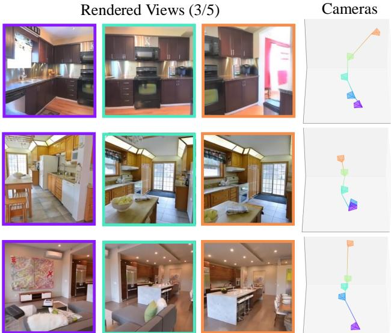

# 1. 论文基本信息

## 1.1. 标题
**RayZer: A Self-supervised Large View Synthesis Model**  
(RayZer：一种自监督大规模视图合成模型)

## 1.2. 作者
**Hanwen Jiang, Hao Tan, Peng Wang, Haian Jin, Yue Zhao, Sai Bi, Kai Zhang, Fujun Luan, Kalyan Sunkavalli, Qixing Huang, Georgios Pavlakos**
*   **研究背景与机构:** 主要作者来自德克萨斯大学奥斯汀分校 (The University of Texas at Austin)、Adobe 研究院 (Adobe Research) 以及康奈尔大学 (Cornell University)。他们在 3D 视觉、生成模型和大规模几何重建领域拥有深厚的背景。

## 1.3. 发表期刊/会议
<strong>ArXiv 预印本 (2025)</strong>  
*   **声誉:** ArXiv 是计算机视觉与机器学习领域最前沿研究的首发地。考虑到作者团队背景，该工作极具影响力和前瞻性。

## 1.4. 发表年份
<strong>2025年5月 (UTC 2025-05-01)</strong>

## 1.5. 摘要
本文提出了 **RayZer**，这是一种自监督的多视图 3D 视觉模型，它在<strong>没有任何 3D 监督（即不需要相机位姿和场景几何标注）</strong>的情况下进行训练，却表现出了显著的 3D 感知能力。RayZer 输入未经标定且没有位姿信息的图像，能够自动恢复相机参数、重建场景表示并合成新视图。在训练期间，它完全依赖自身预测的相机位姿来渲染目标视图，通过 2D 图像的光度损失进行自我迭代。

## 1.6. 原文链接
*   **原文链接:** [https://arxiv.org/abs/2505.00702](https://arxiv.org/abs/2505.00702)
*   **PDF 链接:** [https://arxiv.org/pdf/2505.00702v1.pdf](https://arxiv.org/pdf/2505.00702v1.pdf)
*   **发布状态:** 预印本 (Preprint)。

    ---

# 2. 整体概括

## 2.1. 研究背景与动机
*   **核心问题:** 现有的 3D 视觉模型（如 LRM、DUSt3R）高度依赖<strong>真实标注数据 (Ground Truth)</strong> 中的 3D 几何或相机位姿（Camera Poses）。这些位姿通常由 COLMAP 等离线算法计算，既耗时又不一定准确。
*   **重要性:** 这种对 3D 监督的依赖限制了模型在大规模未标记互联网数据上的扩展能力。如果能打破这一限制， 3D 视觉模型就能像大语言模型（LLM）一样，通过海量无标签数据实现“涌现”能力。
*   **创新思路:** 作者提出了一种“3D 感知自编码”框架。模型首先将图像分解为“位姿”和“场景”两个部分，然后再利用预测的位姿将场景渲染回图像。这种“自给自足”的闭环训练消除了对外部位姿标注的需求。

## 2.2. 核心贡献/主要发现
*   **自监督训练框架:** 首次在大规模 Transformer 模型中实现了无需 3D 监督的端到端 NVS（新视图合成）训练。
*   <strong>普吕克光线 (Plücker Ray) 先验:</strong> 仅使用“光线结构”作为唯一的 3D 先验，将相机、像素和场景有机结合。
*   **性能突破:** 在多个数据集上，RayZer 的表现达到了甚至超过了那些在训练和测试阶段都使用了真实位姿的“先知 (Oracle)”模型。

    ---

# 3. 预备知识与相关工作

## 3.1. 基础概念
*   <strong>新视图合成 (Novel View Synthesis, NVS):</strong> 指给定一组已知视角的图像，生成该场景在未知视角下的逼真图像。
*   <strong>相机位姿 (Camera Pose):</strong> 描述相机在 3D 空间中的位置和朝向。通常表示为 $SE(3)$ 变换，包含旋转矩阵 $R$ 和平移向量 $t$。
*   <strong>普吕克坐标 (Plücker Coordinates):</strong> 一种表示 3D 空间中直线的几何方式。在视觉中，它常用来描述相机光线，因为它能很好地处理无穷远点且计算线性友好。
*   <strong>潜空间集合表示 (Latent set scene representation):</strong> 不使用显式的点云或网格，而是将整个 3D 场景压缩为一组高维向量（词元 Token）。

## 3.2. 前人工作与演进
*   **从显式到隐式:** 早期研究使用网格（Meshes）或点云。后来 NeRF（神经辐射场）引入了体积渲染。
*   **Transformer 的崛起:** 最近的工作（如 SRT 和 LVSM）尝试抛弃复杂的物理渲染公式，改用纯 Transformer 来学习如何从潜空间解码出像素。
*   **本文差异:** 之前的所有大模型（LVSM, GS-LRM）在训练时必须知道“相机在哪”，而 RayZer 能够“边猜位姿边学建模”。

    ---

# 4. 方法论

## 4.1. 方法原理
RayZer 的核心思想是<strong>解耦 (Disentanglement)</strong>。它将输入图像集合分为两部分：一组用于重建场景，另一组作为“考试题”（目标视图），利用预测的位姿去渲染出目标视图，并与原始图像对比。

下图（原文 Figure 2）展示了这种自监督训练框架的抽象设计：

![Figure 2. Our proposed self-supervised training framework. This is an abstract design that we later operationalize with our RayZer model (illustrated in Fig. 3 and Sec. 4). We divide the input images into two sets $\\mathcal { T } _ { A }$ and $\\mathcal { T } _ { B }$ . We predict the scene representation from $\\mathcal { T } A$ , and use the predicted cameras of $\\mathcal { T } _ { B }$ (shown in orange) to render the scene. We leverage photometric loss between raw input $\\mathcal { T } _ { B }$ and its prediction $\\hat { \\mathcal { T } } _ { B }$ for training.](images/2.jpg)
*该图像是示意图，展示了RayZer自监督训练框架的结构。图中左侧是输入图像集$J_A$和$J_B$，通过编码器处理后生成场景和相机表示。在中间部分，编码器提取的相机信息用于生成三维场景表示。右侧则展示解码器输出的渲染结果$\hat{J}_B$，并强调训练过程中不需要任何3D监督。*

## 4.2. 核心算法详解

### 4.2.1. 数据流与划分
模型接收一组无位姿图像 $\mathcal{T} = \{I_i\}_{i=1}^K$。为了训练，将其随机划分为：
1.  **参考集 $\mathcal{T}_A$:** 用于预测场景特征。
2.  **目标集 $\mathcal{T}_B$:** 其对应的原始图像作为真值，模型需预测其位姿并渲染出图像进行对比。

### 4.2.2. 相机估计器 (Camera Estimator)
相机估计器 $\mathcal{E}_{cam}$ 是一个纯 Transformer。它接收图像词元并输出每个视角的位姿。

对于每个非参考视角，模型预测其相对于参考视角的相对位姿：
$$
p_i = \mathbf{MLP}_{pose} \left( [ \mathbf{p}_i^*, \mathbf{p}_c^* ] \right)
$$
*   **符号解释:** $[ \cdot, \cdot ]$ 表示特征拼接；$\mathbf{p}_i^*$ 是当前图的相机词元，$\mathbf{p}_c^*$ 是参考图的词元。输出 $p_i$ 随后被转换为 $SE(3)$ 矩阵 $\mathbf{P}_i$。

    内参（主要是焦距 `focal`）也通过类似的 MLP 预测：
$$
\mathrm{focal} = \mathbf{MLP}_{focal} (\mathbf{p}_c^*)
$$

### 4.2.3. 场景重建器 (Scene Reconstructor)
这是 RayZer 的核心步骤。它将预测的位姿转换为<strong>普吕克光线图 (Plücker ray maps)</strong> $\mathcal{R}_A$。每条光线由方向向量 $\mathbf{d}$ 和力矩向量 $\mathbf{m}$ 表示（共 6 维）。

光线特征 $\mathbf{r}_A$ 与图像特征 $\mathbf{f}_A$ 进行融合：
$$
\mathbf{x}_{\mathcal{A}} = \mathbf{MLP}_{fuse} ( [ \mathbf{f}_{\mathcal{A}}, \mathbf{r}_{\mathcal{A}} ] )
$$
然后通过 Transformer 编码器 $\mathcal{E}_{scene}$ 提取最终的场景潜变量 $\mathbf{z}^*$：
$$
\{ \mathbf{z}^*, \mathbf{x}_A^* \} = \mathcal{E}_{scene} ( \{ \mathbf{z}, \mathbf{x}_A \} )
$$
*   **符号解释:** $\mathbf{z}$ 是可学习的初始场景词元，$\mathbf{x}_A$ 是融合了光线和图像信息的输入。

### 4.2.4. 渲染解码器 (Rendering Decoder)
渲染器 $\mathcal{D}_{render}$ 接收场景词元 $\mathbf{z}^*$ 和**目标视角**的光线词元 $\mathbf{r}$。
$$
\{ \mathbf{r}^*, \mathbf{z}' \} = \mathcal{D}_{render} ( \{ \mathbf{r}, \mathbf{z}^* \} )
$$
最后，通过一个 MLP 回归出像素值：
$$
\hat{I} = \mathbf{MLP}_{rgb} (\mathbf{r}^*)
$$

下图（原文 Figure 3）详细展示了 RayZer 的完整架构：

![Figure 3. RayZer self-supervised learning framework.RayZer takes inunposed and uncalibratedmulti-viewage $\\mathcal { T }$ and predicts poses $\\mathcal { P }$ of all views. The predicted cameras are then converted into pixel-aligned Plücker ray maps $\\mathcal { R }$ . (Middle) RayZer uses a subset of input images, $\\mathcal { T } _ { A }$ , as well as their previously predicted camera Plücker ray maps, $\\mathcal { R } _ { A }$ , to predict a latent scene representation. Here, the Plücker ray maps, $\\mathcal { R } _ { A }$ , rv n efecivndoreotucRih)RayZera endetar a ivenh representation $\\mathbf { z } ^ { \\ast }$ and a target camera. During training, we use $\\mathcal { R } _ { B }$ , which is the previously predicted cameras Plücker ray maps of $\\mathcal { T } _ { B }$ , to render $\\hat { \\mathcal { T } } _ { B }$ This allows training RayZer end-to-end with self-supervised photometric losses between inputs $\\mathcal { T } _ { B }$ and their renderings $\\hat { \\mathcal { T } } _ { B }$ .](images/3.jpg)
*该图像是示意图，展示了RayZer自监督学习框架的各个部分，包括相机估计、场景重建和渲染过程。文中通过 `L = rac{1}{|g|} extstyle orall_{i_j eq eta} (MSE(I, ilde{I}) + au imes ext{Percep}(I, ilde{I}))` 表示损失函数。*

### 4.2.5. 自监督损失函数
整个模型通过以下光度损失进行端到端优化：
$$
\mathcal{L} = \frac { 1 } { K _ { B } } \sum _ { \hat { I } \in \hat { \mathcal { L } } _ { B } } ( \mathtt { MSE } ( I , \hat { I } ) + \lambda \cdot \mathtt { Percep } ( I , \hat { I } ) )
$$
*   **符号解释:** $\mathtt{MSE}$ 是均方误差（像素级差异）；$\mathtt{Percep}$ 是感知损失（特征级差异）；$\lambda$ 是平衡两者的权重（实验中设为 0.2）。

    ---

# 5. 实验设置

## 5.1. 数据集
1.  **DL3DV:** 一个大规模真实世界 3D 场景数据集，包含复杂的室内外环境。
2.  **RealEstate10k:** 包含大量房屋内部走动的视频片段。
3.  **Objaverse:** 合成的 3D 物体数据集。原文将其渲染为连续视频流（0-360度旋转）进行训练。

## 5.2. 评估指标
1.  <strong>PSNR (Peak Signal-to-Noise Ratio, 峰值信噪比):</strong> 
    *   **定义:** 衡量图像失真程度，数值越高代表图像质量越好。
    *   **公式:** $\mathrm{PSNR} = 10 \cdot \log_{10} \left( \frac{MAX_I^2}{MSE} \right)$
    *   **符号:** $MAX_I$ 是像素最大值（通常为 255），`MSE` 是均方误差。
2.  <strong>SSIM (Structural Similarity Index, 结构相似性):</strong>
    *   **定义:** 衡量两张图的结构、亮度、对比度的相似性，越接近 1 越好。
3.  **LPIPS (Learned Perceptual Image Patch Similarity):**
    *   **定义:** 使用深度特征衡量人眼感知的差异，数值越低代表越逼真。

## 5.3. 对比基线
*   <strong>Oracle（先知）方法:</strong> GS-LRM 和 LVSM。这些模型在训练时直接使用了真实的相机位姿。
*   <strong>Supervised（监督）方法:</strong> PF-LRM。它也预测位姿，但在训练时需要位姿标签作为监督。

    ---

# 6. 实验结果与分析

## 6.1. 核心结果分析
RayZer 在不使用任何位姿标注的情况下，性能竟然与“先知”模型持平。

以下是原文在 **DL3DV** 数据集上的结果（Table 1）：

<table>
<thead>
<tr>
<th>方法</th>
<th>训练监督</th>
<th>推理是否需 COLMAP 位姿</th>
<th colspan="3">等距采样 (Even Sample)</th>
<th colspan="3">随机采样 (Random Sample)</th>
</tr>
<tr>
<th></th>
<th></th>
<th></th>
<th>PSNR↑</th>
<th>SSIM↑</th>
<th>LPIPS↓</th>
<th>PSNR↑</th>
<th>SSIM↑</th>
<th>LPIPS↓</th>
</tr>
</thead>
<tbody>
<tr>
<td>GS-LRM</td>
<td>2D + 相机位姿</td>
<td>是</td>
<td>23.49</td>
<td>0.712</td>
<td>0.252</td>
<td>23.02</td>
<td>0.705</td>
<td>0.266</td>
</tr>
<tr>
<td>LVSM</td>
<td>相机位姿</td>
<td>是</td>
<td>23.69</td>
<td>0.723</td>
<td>0.242</td>
<td>23.10</td>
<td>0.703</td>
<td>0.257</td>
</tr>
<tr>
<td><strong>RayZer (本文)</strong></td>
<td><strong>仅 2D 图像</strong></td>
<td><strong>否</strong></td>
<td><strong>24.36</strong></td>
<td><strong>0.757</strong></td>
<td><strong>0.209</strong></td>
<td><strong>23.72</strong></td>
<td><strong>0.733</strong></td>
<td><strong>0.222</strong></td>
</tr>
</tbody>
</table>

**分析:** RayZer 在 PSNR 上比 LVSM 高出约 0.6dB。作者指出，这是因为 COLMAP 标注的位姿本身存在噪声，而 RayZer 通过自监督学习到了一个更适合渲染的潜空间位姿表示。

## 6.2. 3D 感知能力验证
为了证明预测的位姿不是乱猜的，作者进行了位姿插值实验（Table 5）。结果显示，RayZer 生成的新视角非常平滑且符合几何逻辑。

下图（原文 Figure 6）展示了模型预测的相机轨迹和渲染结果：

*该图像是图表，展示了RayZer模型预测的相机视图。图中包含3个从5个渲染视图（右侧）和对应的相机位置（左侧）可视化，颜色突出显示了图像索引。该图展示了模型在未标定图像中的三维感知能力。*

## 6.3. 消融实验
在 Table 7 中，作者验证了几个关键设计：
*   <strong>显式 3D 表示 (3DGS) vs 潜空间表示:</strong> 使用 3DGS 在无监督下无法收敛，证明了潜空间表示的鲁棒性。
*   **位姿优先 vs 场景优先:** 如果先学场景再猜位姿，效果极差。这证明了“先确定相机在哪，再重建场景”这一传统视觉直觉在深度学习中依然成立。

    ---

# 7. 总结与思考

## 7.1. 结论总结
RayZer 证明了在没有 3D 标注的情况下，大规模 Transformer 模型可以仅通过 2D 图像预测出一致的相机位姿和场景结构。它的成功归功于：
1.  **自监督解耦框架:** 强制模型将图像信息分解为几何（位姿）和内容（场景）。
2.  **普吕克光线先验:** 为模型提供了物理上的约束。
3.  **潜空间集合表示:** 避免了显式 3D 几何（如点云）在无监督下的优化不稳定性。

## 7.2. 局限性与未来工作
*   **动态场景:** 目前模型假设场景是静止的，无法处理视频中移动的人物或物体。
*   **计算开销:** Transformer 处理多视图图像的序列长度非常长，对显存要求极高。
*   **全局坐标系:** 虽然能恢复相对位姿，但将其对齐到真实的绝对地理坐标系仍需额外信息。

## 7.3. 个人启发与批判
*   **对“标注”的再思考:** 长期以来我们认为 COLMAP 位姿是“真值”，但本文告诉我们，COLMAP 只是某种观测，模型通过端到端训练可以发现比 COLMAP 更优的几何解。
*   **3D Foundation Model 的路径:** RayZer 填补了 3D 领域“预训练”的空白。未来我们可以利用数百万小时的互联网视频，无需任何标注，直接训练出一个具备极强泛化能力的 3D 感知骨干模型。这可能是通往机器 3D 常识的关键一步。