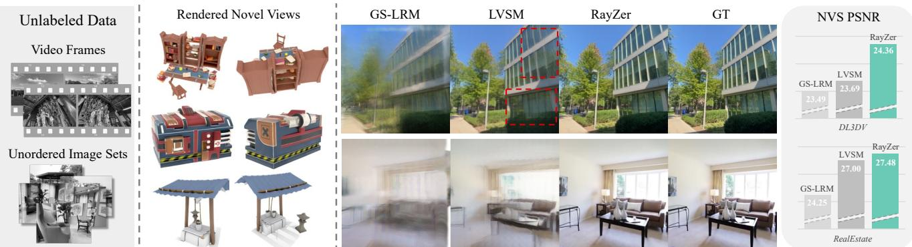
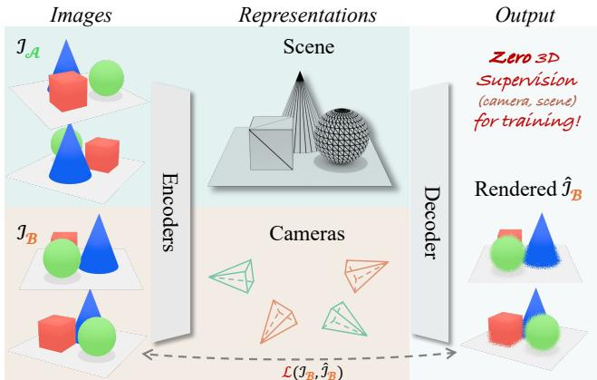
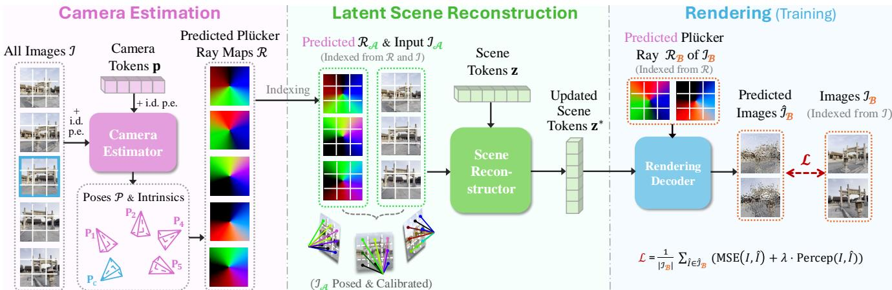
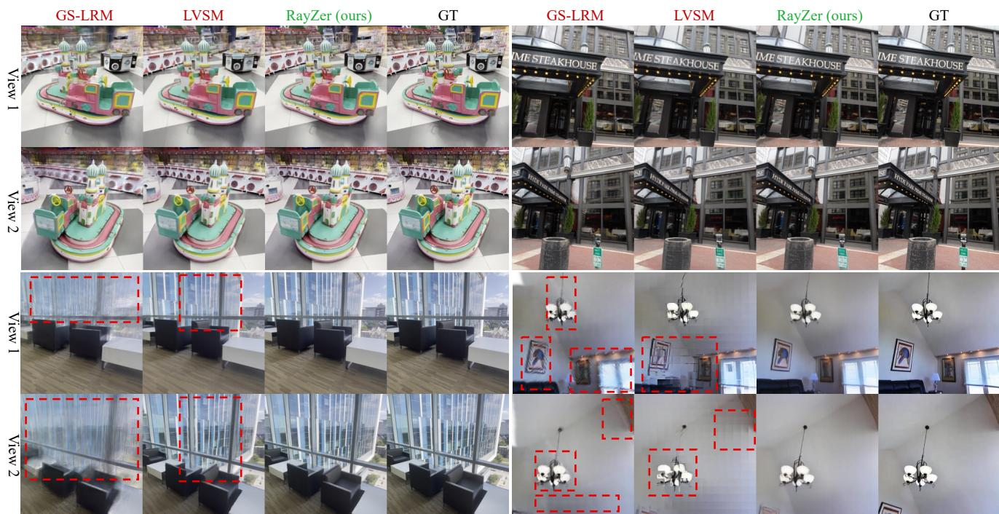
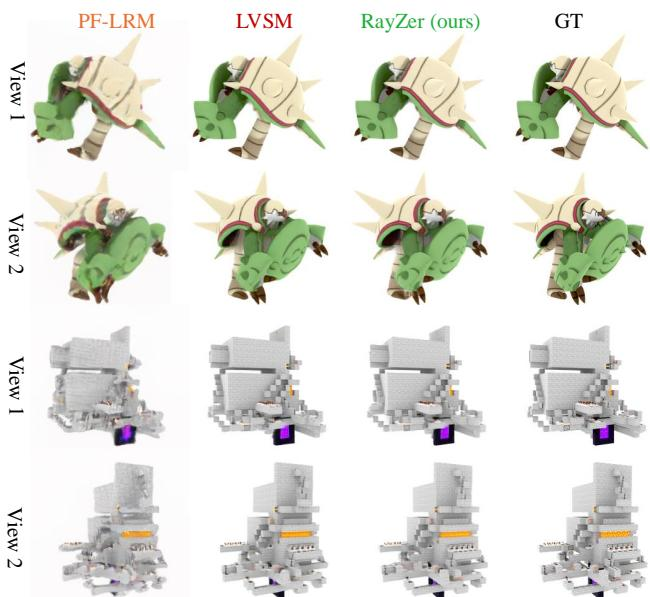
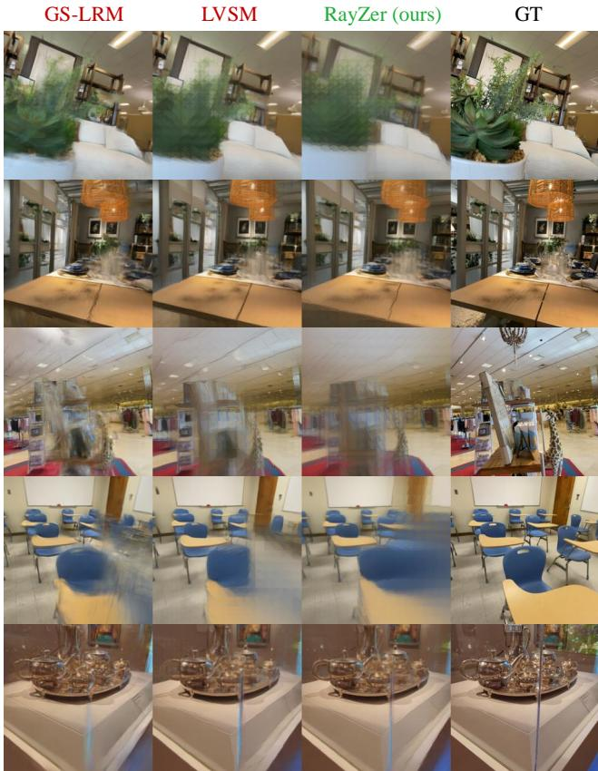
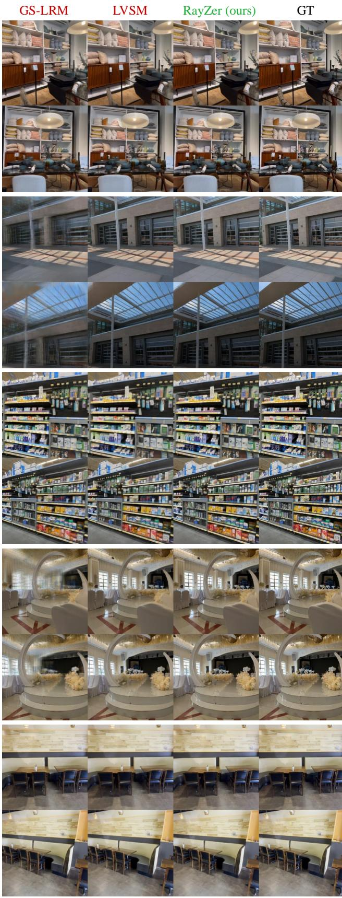
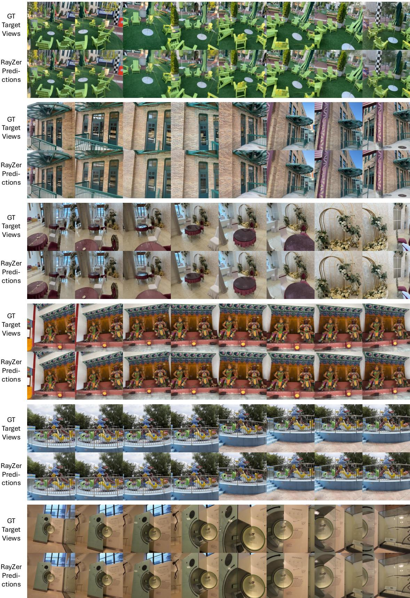
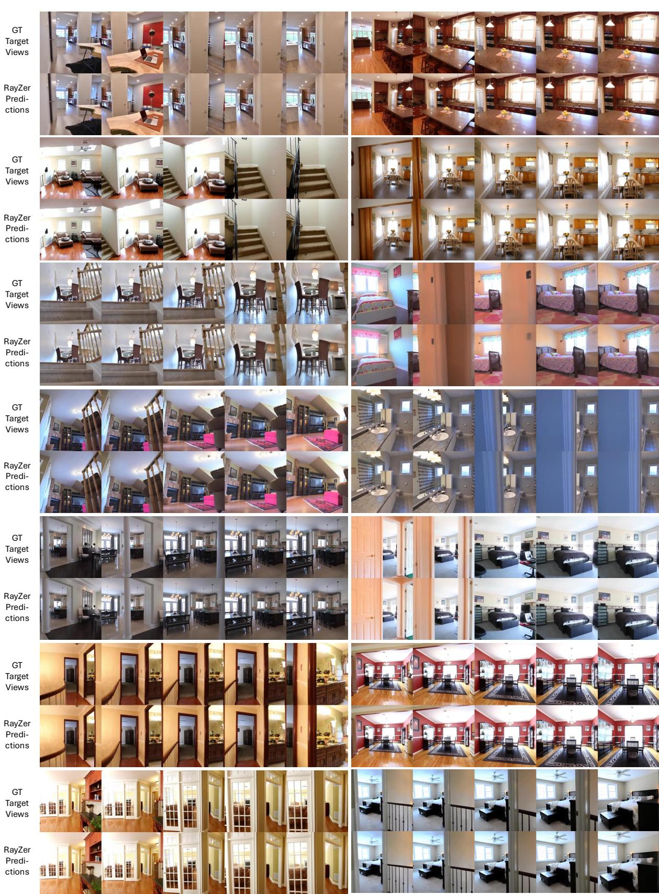
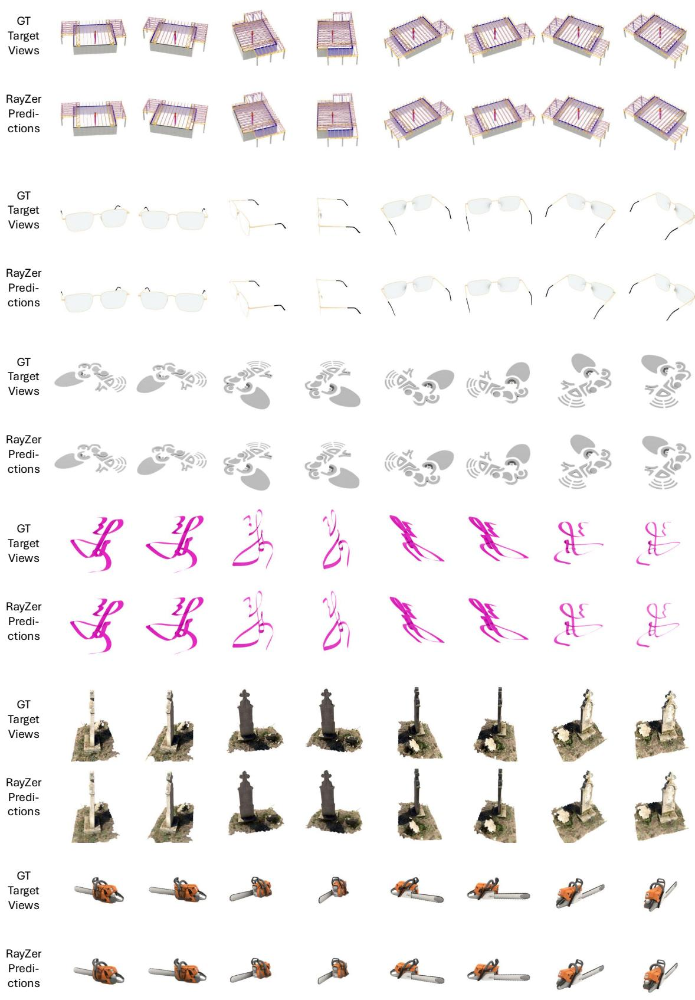

蒋汉文1 谈浩2 王鹏2 金海安3 赵跃1 赛 $\mathrm { B i ^ { 2 } }$ 张凯2 款冉2 卡利扬·桑卡瓦利2 黄启兴1 乔治奥斯·帕夫拉科斯1 1德克萨斯大学奥斯丁分校 2Adobe研究院 3康奈尔大学

  
so  OLA RS

# 摘要

我们提出了RayZer，一个自监督的多视角3D视觉模型，训练过程中不依赖任何3D监督信息，即相机位姿和场景几何，同时展现出新兴的3D感知能力。具体来说，RayZer以未标定和未校准的图像为输入，恢复相机参数，重建场景表示，并合成新视角。在训练过程中，RayZer仅依赖自预测的相机位姿来渲染目标视图，消除了对任何真实相机标注的需求，使RayZer能够使用二维图像监督进行训练。RayZer的新兴3D感知能力归因于两个关键因素。首先，我们设计了一个自监督框架，通过解耦相机和场景表示，实现输入图像的3D感知自编码。其次，我们设计了一个基于变换器的模型，其中唯一的3D先验是光线结构，同时连接相机、像素和场景。RayZer在训练和测试中显示出与依赖位姿标注的“oracle”方法可比甚至更优的合成新视角性能。项目链接： https://hwjiang1510.github.io/RayZer/

# 1. 引言

自监督学习推动了基础模型的兴起，使其能够在大量未标记数据上进行训练，并受益于缩放法则[38]。这一范式已被证明对大语言模型（LLMs）[60]、视觉语言模型（VLMs）[2]和视觉生成[56]极为有效。相比之下，3D视觉模型仍然高度依赖真实的3D几何数据和相机位姿标签[28, 77]，这些通常是通过耗时的优化方法估计的，例如COLMAP[65]，并不总是完美的。这种依赖限制了学习的可扩展性和有效性。为了打破这一限制，我们超越了监督范式，提出了一个问题：在没有任何3D监督的情况下，我们能将3D视觉模型推向何方？在本文中，我们提出了RayZer，一个使用自监督训练的大规模多视角3D模型，展现出新兴的3D感知能力。RayZer的输入是未定姿态和未校准的多视角图像，这些图像从连续的视频帧或无序的多视角捕获中采样而来。RayZer首先恢复相机参数，然后重建场景表示，最后生成新颖视图。我们自监督训练的关键见解在于使用RayZer自身预测的相机位姿来渲染提供光度监督的视图，而不是遵循使用真实位姿进行渲染的标准协议[29, 74, 92]。因此，RayZer可以在零3D监督下进行训练，即没有3D几何或相机位姿监督。在推理阶段，RayZer以前馈的方式预测相机和场景表示，而无需每个场景的优化。我们在图1中展示了推理结果。由于RayZer在训练时使用自身预测的相机位姿，因此这一自监督任务可以被理解为具备3D感知的图像自编码[41, 61, 95]。RayZer最初将输入图像解缠成相机参数和场景表示（重建）。然后将这些预测的表示重新缠绕回图像中（渲染）。为了促进这种解缠，我们控制信息流。如图2所示，我们将所有图像分为两部分：一部分预测场景表示（输入视图），而另一部分提供光度自监督（目标视图）。这是通过使用第二组的估计位姿渲染第一组预测的场景表示，从而防止不具备3D感知的简单解。为了促进自监督学习，RayZer仅由变换器构建，未包含3D表示、手工制作的渲染方程或3D信息架构。这样的设计受到其他模态中自监督大模型的启发[2, 6, 56]，使得RayZer能够灵活而有效地学习领域特定知识。RayZer中唯一融合的3D先验是射线结构，它同时建模相机、像素（图像）和场景之间的关系。具体来说，RayZer首先预测相机位姿，然后将其转换为像素对齐的Plücker射线图[57]，以指导随后的场景重建。这种基于射线的表示作为强先验，解决了结构与运动的鱿鱼和鸡蛋问题[68]，有效地使相机和场景表示在训练过程中相互规范化。我们在三个数据集上评估RayZer，包括具有不同相机配置的场景级和对象级数据。我们观察到，RayZer在新视图合成性能上与在训练和测试中使用位姿标签的“oracle”方法[33, 91]相当，甚至更佳。有趣的是，我们发现来自COLMAP的潜在噪声位姿注释可能限制“oracle”模型的性能。结果不仅展示了RayZer的有效性，还展示了3D视觉模型突破监督学习的潜力。

# 2. 相关工作

大规模三维视觉模型。三维视觉模型从数据中学习三维表示和先验知识[15, 23, 39, 58, 59, 71, 72, 93, 94]。最近，研究人员开发了大规模模型以获取一般的三维知识。一项研究方向着重于设计改进的模型架构，结合多视角立体视觉的归纳偏置[10, 14, 75, 86]和极几何[9, 13, 19, 25]。另一项工作利用完整的变换器模型，故意省略架构中的三维归纳偏置[29, 54, 62]。例如，LEAP [29]、LRMs [28, 74, 78, 91, 98]和DUSt3R [20, 43, 76, 77, 83]是首批使用变换器将二维图像转换为三维表示的工作。SRT [62]和LVSM [33]进一步用潜在表示和学习的渲染函数替代三维表示和物理渲染方程，提升了性能和可扩展性。然而，它们仍然需要真实标注的相机位姿进行监督训练和/或在推理期间准确的相机标注。为了实现可扩展的监督学习，MegaSynth [32]和Stereo4D [34]利用合成数据和立体视频扩展数据规模，然而，为不同任务整理数据可能繁琐。相对而言，RayZer探索自监督训练以摆脱监督学习的束缚。

  
Figure 2. Our proposed self-supervised training framework. This is an abstract design that we later operationalize with our RayZer model (illustrated in Fig. 3 and Sec. 4). We divide the input images into two sets $\mathcal { T } _ { A }$ and $\mathcal { T } _ { B }$ . We predict the scene representation from $\mathcal { T } A$ , and use the predicted cameras of $\mathcal { T } _ { B }$ (shown in orange) to render the scene. We leverage photometric loss between raw input $\mathcal { T } _ { B }$ and its prediction $\hat { \mathcal { T } } _ { B }$ for training.

自监督3D表示学习。从未标记的图像数据中学习3D感知表示是3D视觉中的一个长期问题。一些工作利用单视图图像。然而，它们要么仅适用于特定类别，要么只能恢复部分观察。一些研究探索了半监督学习，取得了更好的可扩展性，但性能仍高度依赖于完全监督训练初始化的模型权重。最相关的工作是从多视图图像中进行自监督学习。例如，Zhou等人和Lai等人及其后续工作使用相机运动作为二维或三维变换操作来规范化学习。然而，这种强的归纳偏置限制了学习的有效性。RUST是一个开创性的研究，旨在从未摆拍的图像中学习潜在场景表示。RayZer在三个方面有所不同。首先，RayZer最初估计相机姿态，并利用姿态条件后续的潜在重建。相比之下，RUST采用逆向管道，首先重建场景，然后估计相机姿态。其次，RayZer采用不同的显式姿态表示来改善信息解缠和3D感知，通过几何插值预测姿态以实现新视图合成。而RUST使用潜在姿态表示，使得场景与姿态的解缠变得具有挑战性，且它们并不明确具有3D感知。第三，RayZer遵循LVSM的模型架构，使用纯自注意力的变换器，这与RUST使用卷积和交叉注意力的方法不同。

基于优化的无监督结构从运动（SfM）、同时定位与地图构建（SLAM）和新视角合成（NVS）。尽管这些方法与RayZer并不直接可比，但由于输入输出形式类似，我们对此进行了讨论。具体而言，这些方法在逐场景的基础上优化目标预测，而RayZer是一个前馈参数化模型，通过在大规模数据上训练学习先验。传统的SfM、SLAM和NVS方法是无监督的。尽管一般表现良好，它们受到复杂手工工作流程的限制，导致对密集视图输入的需求、速度较慢以及对超参数的敏感性。最近基于优化的NeRF和3DGS方法同样可以从未标定图像中执行NVS。然而，它们没有可学习的模型参数来编码先验，因此需要利用具有3D监督训练的现成模型作为正则化或提供初始化。

# 3. 准备工作

我们介绍 RayZer 的两个重要组成部分，即潜在集合场景表示及其渲染方法。潜在集合场景表示。将数据压缩为潜在空间中的词元是在文本、图像、视频等领域中的一种常见做法。最近，这种表示法也扩展到 3D 研究中。在与经典的显式（例如网格和点云）、隐式（例如 NeRF 和 SDF）以及混合（例如三平面和 3DGS）表示法的对比中，潜在集合表示没有明确的 3D 感知性。它作为场景信息的压缩，其中 3D 感知属性是完全学习得到的。潜在集合场景表示可以表示为 $\mathbf { z } \in \mathbb { R } ^ { n \times d }$，其中 $n$ 是集合中词元的数量，$d$ 是潜在特征维度。

渲染潜在集合场景表示需要一个网络，记作 $R ^ { \theta }$ ，正如 SRT [62] 和 LVSM [33] 所介绍的。我们将其表述为 $v = R ^ { \theta } ( { \bf z } , r )$ ，其中 $r$ 是一条光线，$v$ 是对应像素的渲染属性，例如 RGB 值。这个表述与传统图形渲染技术 [1, 36] 是相同的，即 $v = R ( { \mathrm { s c E N E } } , \mathbb { R }$ AY)，其中 $R$ 是预定义和手工制作的渲染方程，例如 NeRF 中的 alpha-blending 射线行进。不同的是，我们的“渲染方程”是一个以权重 $\theta$ 参数化的学习模型，而我们的场景表示是之前讨论的潜在词元集合。为清晰起见，我们在以下描述中省略了模型参数化，例如权重 $\theta$ 。

# 4. RayZer

在本节中，我们首先介绍RayZer的自监督学习框架（第4.1节）。接着，我们展示RayZer模型架构的详细信息（第4.2节）。

# 4.1. RayZer 的自监督学习

我们首先构建RayZer的输入和输出。然后介绍自监督学习框架。我们专注于建模静态场景的标准设置[65]。RayZer的输入是一组未标定且未校准的多视角图像 $\mathcal { T } = \{ I _ { i } \in \mathbb { R } ^ { H \times W \times 3 } | i = 1 , . . . , K \}$，这些图像可以来自未标记的视频帧或图像集。输出是输入的参数化，即相机内参、每视角的相机位姿以及场景表示，能够实现新视图合成。为了预测这些表示，我们构建了RayZer模型，并在训练过程中采用自监督学习，不依赖于3D监督，即不使用3D几何和相机位姿注释。

为了通过自监督训练RayZer，我们控制数据的信息流。我们将输入图像$\mathcal { T }$拆分为两个不重叠的子集$\mathcal { T } _ { \mathcal { A } }$和$\mathcal { T } _ { B }$，其中$\mathcal { T } _ { A } \cup \mathcal { T } _ { B } = \mathcal { T }$且$\mathcal { T } _ { A } \cap \mathcal { T } _ { B } = \emptyset$。RayZer使用$\mathcal { T } _ { \mathcal { A } }$来预测场景表示，并使用$\mathcal { T } _ { B }$提供监督。因此，RayZer渲染与$\mathcal { T } _ { B }$对应的图像，记为$\hat { \mathcal { T } } _ { B }$，并应用光度损失：

$$
\mathcal { L } = \frac { 1 } { K _ { B } } \sum _ { \hat { I } \in \hat { \mathcal { L } } _ { B } } ( \mathtt { M S E } ( I , \hat { I } ) + \lambda \cdot \mathtt { P e r c e p } ( I , \hat { I } ) ) ,
$$

其中 $K_{B} = \vert \mathcal{T}_{B} \vert$ 是 $\mathcal{T}_{B}$ 的大小（图像数量），$I \in \mathcal{T}_{B}$ 是与预测图像 $\hat{I}$ 相对应的图像，$\lambda$ 是感知损失的权重 [35, 46]。这两个集合在训练过程中是随机抽样的。

# 4.2. RayZer 模型

概述。如第4.1节所述，RayZer 从未标定、未校准的输入图像中恢复相机参数和场景表示。RayZer 的一个关键设计元素是其级联预测相机和场景表示。这是基于这样一个事实，即使是噪声较大的相机也可以作为更好场景重建的有力条件，这与传统的运动结构方法相似，与最近的重建优先方法形成对比。该设计可以在训练过程中相互规范化姿态和场景的预测，促进自监督学习。RayZer 构建了一个纯粹的基于变换器的模型，利用其可扩展性和灵活性。如图3所示，RayZer 首先将输入图像进行词元化，并使用基于变换器的编码器预测所有视角的相机参数。在此步骤中，相机由其内参和 SE(3) 相机位姿表示。这种低维且几何定义明确的参数化有助于将图像信息与相机表示解耦。

  
Figure 3. RayZer self-supervised learning framework.RayZer takes inunposed and uncalibratedmulti-viewage $\mathcal { T }$ and predicts poses $\mathcal { P }$ of all views. The predicted cameras are then converted into pixel-aligned Plücker ray maps $\mathcal { R }$ . (Middle) RayZer uses a subset of input images, $\mathcal { T } _ { A }$ , as well as their previously predicted camera Plücker ray maps, $\mathcal { R } _ { A }$ , to predict a latent scene representation. Here, the Plücker ray maps, $\mathcal { R } _ { A }$ , rv  n efecivndoreotucRih)RayZera endetar a ivenh representation $\mathbf { z } ^ { \ast }$ and a target camera. During training, we use $\mathcal { R } _ { B }$ , which is the previously predicted cameras Plücker ray maps of $\mathcal { T } _ { B }$ , to render $\hat { \mathcal { T } } _ { B }$ This allows training RayZer end-to-end with self-supervised photometric losses between inputs $\mathcal { T } _ { B }$ and their renderings $\hat { \mathcal { T } } _ { B }$ .

RayZer 将 SE(3) 相机姿态和内部参数转化为 Plücker 光线图，表示为像素对齐的光线。基于光线的表示捕捉了 2D 光线与像素的对齐以及 3D 光线几何，提供了细致的光线级细节，体现了相机模型的物理特性。光线图作为提高后续重建阶段的条件。从 $\mathcal { T } _ { \mathcal { A } }$ 的图像和预测的 Plücker 光线中，RayZer 使用另一个基于变换器的编码器来预测潜在的场景表示（在第 3 节中介绍并在后续详细说明）。然后，RayZer 利用之前估计的 $\mathcal { T } _ { B }$ 相机来预测 $\dot { \mathcal { T } } _ { B }$，提供光度自监督（式 1）。我们现在正式介绍 RayZer 模型。

图像标记化。对于所有 $K$ 个输入图像 $\begin{array} { r l } { { \mathcal { Z } } } & { { } = } \end{array}$ $\{ I _ { i } \in \mathbb { R } ^ { H \times W \times 3 } | i = 1 , . . . , K \}$，我们按照 ViT [18] 将其分割成不重叠的块。每个块的形状为 $\mathbb { R } ^ { s \times s \times 3 }$，其中 $s$ 为块的大小。我们使用线性层将每个块编码为 $\mathbb { R } ^ { d }$ 中的一个标记，从而为每个图像生成与块对齐的标记图 $f _ { i } \in \mathbb { R } ^ { h \times w \times d }$，其中 $h = H / s$，$w = W / s$，$d$ 是潜在维度。然后，我们为标记添加位置嵌入（p.e.），使得后续模型能够感知每个标记的空间位置和相应的图像索引。具体而言，我们使用线性层将正弦空间位置嵌入 [18] 与正弦图像索引嵌入 [3] 结合起来；注意，图像索引嵌入在同一图像的所有标记之间是共享的。当在连续的视频帧上进行训练时，这些图像索引嵌入还编码了顺序先验，有利于姿态估计。最后，我们将所有图像的标记图重塑为一个集合，记作 $f \mathbf { \Psi } : \in \mathbb { R } ^ { K \bar { h } w \times d }$（回忆一下，转换器对标记的排列是不可变的）。为简洁起见，我们将在论文的其余部分使用此符号表示潜在标记集合。相机估计器。相机估计器 $\mathcal { E } _ { c a m }$ 预测相机参数，即所有输入图像的相机姿态和内参。我们使用 $\mathbb { R } ^ { 1 \times d }$ 中的可学习相机标记作为该预测的初始特征，适用于所有视角。我们将该标记重复 $K$ 次，并添加与图像索引位置嵌入，使其对应于 $K$ 个图像。我们将此相机特征初始化表示为 $\mathbf { p } \in \mathbb { R } ^ { K \times d }$。然后，我们使用由全自注意力转换器层组成的相机估计器来更新相机标记，如下所示：

$$
\{ \mathbf { f } ^ { * } , \mathbf { p } ^ { * } \} = \mathcal { E } _ { c a m } ( \{ \mathbf { f } , \mathbf { p } \} ) ,
$$

其中 $\{ \cdot , \cdot \}$ 表示沿词元维度的串联（两个词元集的并集），而 $\mathbf { f } ^ { * }$ 和 $\mathbf { p } ^ { * }$ 为更新后的词元。我们注意到，$\mathbf { f } ^ { * }$ 不用于以下计算，它仅用作上下文以更新变换器层中的 $\mathbf { p }$。为了清晰起见，我们将变换器层的公式化如下：

$$
\begin{array} { r l } & { \mathbf { y } ^ { 0 } = \{ \mathbf { f } , \mathbf { p } \} , } \\ & { \mathbf { y } ^ { l } = \mathrm { T r a n s f o r m e r L a y e r } ^ { l } ( \mathbf { y } ^ { l - 1 } ) , l = 1 , . . . , l _ { T } } \\ & { \{ \mathbf { f } ^ { * } , \mathbf { p } ^ { * } \} = \mathrm { s p l i t } ( \mathbf { y } ^ { l _ { T } } ) , } \end{array}
$$

其中 $l _ { T }$ 是层数，分割操作恢复两个词元集合，反转公式 3。这个符号在论文的其余部分保持一致。然后我们独立预测每幅图像的相机参数。对于相机位姿预测，我们遵循使用相对相机位姿来解决歧义的先前工作 [31, 89]。我们选择一个视图作为规范参考（例如，具有恒定旋转和零位移），对于每个非规范视图，我们预测其相对于规范视图的相对位姿。我们使用连续的 6D 表示对 SO(3) 旋转进行参数化 [97]，并通过以下两层 MLP 预测相对位姿：

$$
p _ { i } = \mathbf { M } \mathbf { L } \mathbf { P } _ { p o s e } \big ( \big [ \mathbf { p } _ { i } ^ { * } , \mathbf { p } _ { c } ^ { * } \big ] \big ) ,
$$

其中 $[ \cdot , \cdot ]$ 表示沿特征维度的连接，$\mathbf { p } _ { i } ^ { * }$ 和 $\mathbf { p } _ { c } ^ { * }$（均在 $\mathbb { R } ^ { d }$ 中）分别是图像 $I _ { i }$ 和标准视图的相机标记。输出 $p _ { i } \in \mathbb { R } ^ { 9 }$ 表示预测的姿态参数，随后被转换为图像 $I _ { i }$ 的 SE (3) 姿态 $\mathbf { P } _ { i }$。对于内参预测，遵循之前的研究 [24, 41]，我们使用单一焦距值对内参进行参数化，假设条件为：i) 沿 $\mathbf { X } $ 和 y 轴的焦距相同；ii) 所有视图共享相同的内参；iii) 主点位于图像中心。我们通过一个两层的多层感知器（MLP）来预测焦距：

$$
\mathrm { f o c a l } = \mathbf { M L P } _ { f o c a l } ( \mathbf { p } _ { c } ^ { * } ) .
$$

预测的焦距随后被转换为内参矩阵 K ∈ R³×³。

场景重构器。如第4.1节所述，我们从图像集$\mathcal { T } _ { \mathcal { A } }$中预测场景表示，并额外依赖于先前预测的相机参数$\mathcal { P } _ { A } = \{ ( \mathbf { P } _ { i } , \mathbf { K } ) | I _ { i } \in \mathcal { T } _ { A } \}$进行条件化。我们首先将$\mathcal { P } _ { A }$转换为每个图像的像素对齐Plücker光线[57]，记为$\mathcal { R } \in \mathbb { R } ^ { \bar { K } \times H \times W \times 6 }$，然后通过线性层将Plücker光线转换为补丁级别的词元，生成对应于图像集$\mathcal { T } _ { \mathcal { A } }$的$\mathbf { r } \in \mathbb { R } ^ { K h w \times d }$ W词元，记为$\mathbf { f } _ { A }$和$\mathbf { r } _ { A }$（分别在$\mathbb { R } ^ { K _ { A } h w \times d }$中）。我们使用一个两层的多层感知机沿特征维度融合这些词元：

$$
\begin{array} { r } { \mathbf { x } _ { \mathcal { A } } = \mathbf { M } \mathbf { L } \mathbf { P } _ { f u s e } ( [ \mathbf { f } _ { \mathcal { A } } , \mathbf { r } _ { \mathcal { A } } ] ) , } \end{array}
$$

其中 $\mathbf { x } _ { \mathcal { A } } \in \mathbb { R } ^ { K _ { \mathcal { A } } h w \times d }$ 表示美元代币。重要的是，我们在此融合中使用原始图像代币 $f$ 而非姿态变换器输出 $\mathbf { f } ^ { * }$。这一设计选择防止了来自图像集 $\mathcal { T } _ { B }$ 的信息泄露，因为生成 $\mathbf { f } ^ { * }$ 的相机估计变换器能够访问包含来自 $\mathcal { T } _ { B }$ 的全局上下文。接着，我们采用场景重建器 $\mathcal { E } _ { s c e n e }$，由完整自注意力变换器层组成，以预测潜在的场景表示。为了初始化该表示，我们使用一组可学习的代币 $\mathbf { z } \in \mathbb { R } ^ { L \times d }$，其中 $L$ 表示代币的数量。我们将该过程表述如下：

$$
\{ { \bf z } ^ { * } , { \bf x } _ { A } ^ { * } \} = \mathcal { E } _ { s c e n e } ( \{ { \bf z } , { \bf x } _ { A } \} ) .
$$

更新规则与相机估计器 $\mathcal { E } _ { c a m }$ 中的变换器层相同。这里，$\mathbf { z } ^ { \ast }$ 表示从 $\mathcal { T } _ { \mathcal { A } }$ 预测的最终潜在场景表示。同时，$\mathbf { x } _ { \mathcal { A } } ^ { * }$ 被丢弃。渲染解码器。我们首先定义渲染解码器，然后描述其训练用法。我们使用基于变换器的解码器，采用全自注意机制进行渲染，参考 LVSM [33]。对于目标图像，我们首先将其表示为像素对齐的 Plücker 射线，并使用线性层对这些射线进行编码，以获得目标标记 $\mathbf { r } \in \mathbb { R } ^ { h w \times d }$。接下来，我们通过更新标记来融合场景信息，使用由变换器层组成的解码器 $\mathcal { D } _ { { r e n d e r } }$：

$$
\{ \mathbf { r } ^ { * } , \mathbf { z } ^ { \prime } \} = \mathcal { D } _ { r e n d e r } ( \{ \mathbf { r } , \mathbf { z } ^ { * } \} ) ,
$$

在这里，$\mathbf { z } ^ { \prime }$随后被丢弃，而$\mathcal { D } _ { \mathit { r e n d e r } }$的更新规则与之前介绍的模块相同。最后，我们使用多层感知机（MLP）在块级别解码RGB值：

$$
\begin{array} { r } { \hat { I } = \mathbf { M } \mathbf { L } \mathbf { P } _ { r g b } ( \mathbf { r } ^ { * } ) , } \end{array}
$$

其中 $\hat { I } \in \mathbb { R } ^ { h w \times ( 3 s ^ { 2 } ) }$ 。我们对 $\hat { I }$ 进行重塑，以恢复 2D 空间结构，从而得到最终的渲染图像 $\mathbb { R } ^ { H \times W \times \bar { 3 } }$ 。在训练过程中，我们使用与 $\hat { \mathcal { T } } _ { B }$ 相对应的预测 Plücker 光线图 $\mathcal { R } _ { B }$ 来渲染图像 $\dot { \hat { \boldsymbol { { \mathcal { T } } } } } _ { B }$ ，然后计算如公式 1 所定义的自监督损失。

# 5. 实验

在本节中，我们介绍实验设置并呈现评估结果。在实现方面，RayZer 使用了 24 层变换器，每个相机估计器、场景编码器和渲染解码器各有 8 层。我们以 $4 \times 10^{-4}$ 的学习率和余弦调度器训练 RayZer，迭代 50,000 次，批量大小为 256。感知损失的权重为 $\lambda = 0.2$。所有实验中，我们使用了 256 的分辨率和 16 的补丁大小。更多细节见附录。

# 5.1. 实验设置

我们介绍了我们的实验设置，包括数据集、评估协议和指标，以及基线方法。

数据集。我们使用三个数据集来评估RayZer，包括两个场景级数据集DL3DV和RealEstate，以及一个对象级数据集Objaverse（渲染为视频）。我们分别在每个数据集上进行训练和测试。DL3DV的输入视图数$( { \mathcal { T } } _ { * } )$和目标视图数$( { \mathcal { T } } _ { B } )$分别设置为16和8，RealEstate为5和5，Objaverse为12和8。我们在DL3DV、RealEstate和Objaverse上分别采样输入图像的索引范围为64-96、128-192和50-65。这些值的选择基于数据的难度，特别是相机基线，遵循之前的研究。我们使用官方的DL3DV训练测试划分，并按照相关文献对RealEstate进行划分。更多细节可在附录中找到。

  
s ul Ran L  -RnL COLMA

评估协议和指标。我们评估新视图合成质量。具体而言，RayZer的评估协议不同于使用真实标定位姿渲染图像的“oracle”和监督方法。相反，我们使用预测位姿来渲染新视图，从而评估预测位姿与场景表示之间的兼容性。由于模型在没有显式位姿标注的情况下训练，学习到的位姿存在于一个不同的空间，其与标准位姿标注的直接对应关系未知。该评估协议遵循RUST [63]。我们注意到目标视图仅用于位姿估计，而不用于场景表示预测，确保没有信息泄露发生。

基线。我们将RayZer与两种方法进行比较，包括1）“oracle”方法，即使用真实标注相机位姿进行训练（作为监督）和推理（作为前提）的GS-LRM [91]和LVSM [33]（编码器-解码器版本）。LVSM还使用潜在集场景表示。因此，它是“oracle”方法的主要比较对象；2）监督方法，即PF-LRM [74]，需要相机监督来学习位姿估计和重建；因此，在推理过程中它是无位姿的。为了公平比较，我们对GS-LRM和LVSM总共使用16个转换器层。因此，它们的参数数量与RayZer相同，只是RayZer有另一个相机估计器来处理无位姿图像。我们为PF-LRM使用24个转换器层。我们还考虑了自监督方法RUST [63]，但由于它没有官方公开实现，我们在表7中详细阐述了RUST与RayZer之间的关键设计差异。

<table><tr><td></td><td>Training Supervision</td><td>Inference w. COLMAP Cam.</td><td colspan="2">Even Sample PSNR↑ SSIM* LPIPS↓</td><td colspan="3">Random Sample PSNR↑ SSIM↑ LPIPS</td></tr><tr><td colspan="7">&quot;mt  u  po&amp;s oti </td></tr><tr><td>GS-LRM LVSM</td><td>2D + Camera</td><td>Yes</td><td>23.49 0.712</td><td>0.252</td><td>23.02</td><td>0.705</td><td>0.266</td></tr><tr><td></td><td> Camera</td><td>Yes</td><td>23.69 0.723</td><td>0.242</td><td>23.10</td><td>0.703</td><td>0..257</td></tr><tr><td colspan="8">Un </td></tr><tr><td>RayZer</td><td>2D</td><td>No</td><td>24.36 0.757</td><td>0.209</td><td>23.72</td><td>0.733 0.222</td><td></td></tr></table>

Table 1. Evaluation results on DL3DV. The camera annotations used by the "oracle" models come from COLMAP. The results are reported with continuous video frames (ordered) as the input. The results for the unordered image set input are in Table. 4. The input and target views can be evenly or randomly sampled from video frames. We bold our result if it is better than the "oracle" models.

# 5.2. 结果

主要结果。表1-3总结了三个数据集的结果。值得注意的是，在训练过程中没有任何3D标注（例如，相机姿态注释），RayZer的性能与最佳“oracle”模型LVSM相当。实际上，RayZer在DL3DV和RealEstate10k上的表现甚至优于LVSM，而在Objaverse的表现稍逊。我们推测，这可能是因为DL3DV和RealEstate中的相机姿态是由COLMAP注释的，这可能存在不完美之处，从而为由COLMAP注释监督的“oracle”方法设定了上限。相比之下，我们的自监督方法使模型能够学习到一个姿态空间，最佳地促进潜在重建和新视角合成。这个假设在Objaverse的结果中得到了进一步支持，Objaverse是一个具有完美姿态注释的合成数据集，LVSM作为真正的oracle，优于RayZer。然而，微小的性能差距展示了我们自监督训练的有效性。图4中的可视化进一步支持了我们关于COLMAP噪声姿态的推测，因为LVSM和GS-LRM在COLMAP通常失效的困难案例中表现都不佳。这些结果不仅验证了我们的自监督学习方法，还展示了其突破监督学习局限性的潜力。

  
Figure 5. Visualization results on Objaverse. RayZer performs on par with LVSM and outperforms the supervised method PF-LRM.

<table><tr><td></td><td>Training Supervision</td><td>Inference w. COLMAP Cam.</td><td colspan="3">Even Sample PSNR↑ SSIMLPIPS↓</td><td colspan="3">Random Sample PSNR↑ SSIM LPIPS</td></tr><tr><td colspan="9">emet su  o  os u</td></tr><tr><td>GS-LRM</td><td>2D + Camera</td><td>Yes</td><td>24.25</td><td>0.770</td><td>0.227</td><td>23.21</td><td>0.748</td><td>0.251</td></tr><tr><td>LVSM</td><td> Camera</td><td>Yes</td><td>27.00</td><td>0.851</td><td>0.157</td><td>25.88</td><td>0.828</td><td>0.175</td></tr><tr><td colspan="9">Unsupervised methods (inputs are un-posed &amp; no pose annotations used during training)</td></tr><tr><td>RayZer</td><td>2D</td><td>No</td><td>27.48</td><td>0.861</td><td>0.146</td><td>26.32</td><td>0.835 0.164</td><td></td></tr></table>

Table 2. Evaluation results on RealEstate with continuous video frames inputs. The camera annotations come from COLMAP.

使用无序图像集进行训练。RayZer 可以利用连续的视频帧（表 1-3）或无序的图像集合（表 4）进行训练。请注意，这两种训练设置是独立应用的。如表 4 所示，我们观察到使用无序图像集训练的模型表现不如使用连续视频帧训练的模型。我们注意到，差异主要体现在姿态估计阶段，图像索引位置嵌入鼓励局部姿态平滑，这有助于在连续帧上进行姿态估计的学习。该发现表明，使用在线丰富的视频资源来扩展训练数据可能比依赖通常规模有限且包含噪声内容的无序图像集更具优势 [45, 73]。

<table><tr><td></td><td>Training Supervision</td><td>Inference w. GT Cam.</td><td colspan="2">Even Sample PSNR↑ SSIM↑ LPIPS↓</td><td colspan="3">Random Sample PSNR↑ SSIM↑LPIPS↓</td></tr><tr><td colspan="9">&quot;Oracle&quot; methods (assume inputs are posed &amp; use pose annotations during training)</td></tr><tr><td>LVSM</td><td>2D + GT Cam.</td><td>Yes</td><td>32.34</td><td>0.950</td><td>0.050 32.34</td><td>0.949</td><td>0.051</td></tr><tr><td colspan="9">Supevised methos (inputs eun-pos&amp;us poseanoatins durig ta</td></tr><tr><td></td><td>PF-LRM 2D + GT Cam. Yes (render)</td><td></td><td>25.48</td><td>0.882 0.110</td><td>25.43</td><td>0.881</td><td>0.111</td></tr><tr><td colspan="9">Unsupervised methods (inputs are un-posed &amp; no pose annotations used during training)</td></tr><tr><td>RayZer</td><td>2D</td><td>No</td><td>31.52</td><td>0.945 0.052</td><td></td><td>31.42</td><td>0.943</td><td>0.053</td></tr></table>

Table 3. Evaluation results on Objaverse with continuous video frames inputs. The camera annotations are Blender ground-truth. PF-LRM uses ground-truth poses to render novel views, same with oracle methods, and we evaluate its predicted pose in Table 5.

<table><tr><td rowspan="2"></td><td rowspan="2">Training Supervision</td><td rowspan="2">Inf. w. GT Pose</td><td rowspan="2">Continuous Inputs</td><td colspan="3">Even Sample</td><td colspan="3">Random Sample</td></tr><tr><td>PSNR↑</td><td>SSIM↑</td><td>LPIPS↓</td><td>PSNR↑</td><td>SSIM↑</td><td>LPIPS↓</td></tr><tr><td>(1)</td><td>2D</td><td>No</td><td>✓</td><td>24.36</td><td>0.757</td><td>0.209</td><td>23.72</td><td>0.733</td><td>0.222</td></tr><tr><td>(2)</td><td>2D</td><td>No</td><td>X</td><td>20.56</td><td>0.576</td><td>0.334</td><td>20.02</td><td>0.566</td><td>0.356</td></tr></table>

Table 4. Evaluating RayZer performance when using continuous or unordered images for training on DL3DV. In evaluations, the input frames are sampled from continuous video frames. (1) keeps their temporal continuity (encoded by the image index p.e.) during training. (2) randomly shuffles the images during training.

# 5.3. 相机姿态分析

RayZer 学习到的相机姿态空间。我们在图 6 中可视化了 RayZer 预测的一些相机姿态。尽管 RayZer 预测的是 SE(3) 相机姿态，但我们观察到这些姿态并不完全与真实世界的姿态空间相匹配。这个结果表明，SE(3) 姿态在转换为 Plücker 射线图时，提供了一定的灵活性。由于渲染解码器和场景表示都在潜在空间中操作，只要这些姿态与场景表示和解码器兼容，RayZer 对学习到的姿态空间与实际真实世界姿态之间的任何扭曲仍然保持鲁棒性。

对预测相机姿态的三维感知。我们进一步研究RayZer学习的姿态空间是否具有三维感知能力。为此，我们对输入视图的预测姿态进行插值，以合成更具新颖性的视图，其中新视图的相机姿态是从两个相邻输入视图插值得到的。我们使用真实相机姿态来计算插值系数，检验预测姿态是否遵循相同的几何插值规则。插值方法的细节已包含在附录中。如表5所示，RayZer的表现明显优于PF-LRM和简单的基线（复制最近渲染的输入视图）。这些结果验证了RayZer预测的姿态是可以插值的且具有三维感知能力。探测学习到的相机姿态空间。为了探测RayZer学习了多少实际姿态信息，我们遵循RUST [63]，对姿态特征拟合一个轻量级的两层MLP头。我们冻结相机估计器的变换器，并在相机监督下训练MLP。如表6所示，我们的探测结果优于监督基线（具有相同的模型架构并使用从头训练的变换器），这表明RayZer的新视图合成自我监督促进了更好的潜在姿态空间。相比之下，监督学习因低维度姿态表示挑战而面临困难 [5, 11, 44, 90, 97]。

Table 5. Evaluating 3D awareness of predicted camera poses on Objaverse. Unlike Table 3, here we render novel views by interpolating predicted poses of input views, where the interpolation coefficients are calculated from GT poses. This experiment tests whether the learned SE ( 3) poses are geometrically well-defined and 3D-aware. We also compare against a naive baseline "RayZercopy" that simply copies the nearest rendered input view.   

<table><tr><td></td><td>Training Supervision</td><td>Inference w. GT Pose</td><td colspan="3">Even Sample PSNR↑ SSIM LPIPS↓</td><td colspan="3">Random Sample PSNR↑ SSIM↑ LPIPS↓</td></tr><tr><td colspan="9">Supervised methods (inputs are un-posed &amp; use pose annotations during training)</td></tr><tr><td>PF-LRM</td><td>2D + GT Pose</td><td>No</td><td>20.63</td><td>0.819</td><td>0.160</td><td>21.27</td><td>0.827</td><td>0.154</td></tr><tr><td colspan="9">Unsupervised methods (inputs are un-posed &amp; no pose annotations used during training)</td></tr><tr><td>RayZer-copy</td><td></td><td>No</td><td>19.56</td><td>0.812</td><td>0.159</td><td>20.17</td><td>0.820</td><td>0.150</td></tr><tr><td>RayZer</td><td>2D</td><td>No</td><td>27.01</td><td>0.900</td><td>0.075</td><td>26.87</td><td>0.896</td><td>0.078</td></tr></table>

# 5.4. 消融研究

我们从场景表示、3D先验和整体模型范式三个方面消融了RayZer的主要设计选择。如表7（1）所示，当使用3DGS表示代替潜在集表示时，训练无法收敛。这验证了显式3D表示的优化难度[40, 91]，并展示了潜在表示及其学习的渲染解码器的灵活性。表7（2）和（3）消融了相机表示的先验。在没有Plücker射线图的情况下，我们观察到（2）的性能下降，显示出使用Plücker射线图来规范结构与运动问题解的有效性。此外，与（2）相比，我们观察到（3）的性能略好，直接使用相机令牌$\mathbf { p } ^ { * }$。原因在于，相机令牌$\mathbf { p } ^ { * } \in \mathbb { R } ^ { d }$可以泄露目标图像信息，而在（2）中使用的SE (3) 姿态则充当了强信息瓶颈，以强制实现这种解耦。此外，SE (3) 姿态在几何上是良好定义的，使我们能够对其进行插值，并沿着插值的相机轨迹生成新视图，而潜在相机表示则无法直接进行插值。表7（4）消融了整体范式。当模型首先预测潜在场景，然后估计姿态时，我们观察到性能下降。具体而言，姿态估计器使用场景表示和目标图像特征令牌作为输入。结果验证了我们的见解，即姿态估计可以作为场景重建的一个强有力条件，在自监督学习背景下优于传统的先姿态后场景的方法。请注意，将（3）和（4）结合起来的模型在概念上类似于RUST。

# 6. 结论

我们介绍了 RayZer，这是一种自监督的大规模多视角三维视觉模型，采用零三维监督进行训练，即没有任何三维监督信息。

  
Figure 6. Visualization of RayZer predicted cameras learned with self-supervision. We visualize 3 out of 5 rendered views due to space limit, where the image index is highlighted by its color.

<table><tr><td rowspan="2"></td><td rowspan="2">Pose Encoder (Eose)</td><td colspan="3">Rotation Acc.↑ (%)</td><td colspan="3">Translation Acc.↑ (%)</td></tr><tr><td>R@10</td><td>R@20°</td><td>R@30</td><td>t@0.1</td><td>t@0.2</td><td>t@0.3</td></tr><tr><td rowspan="2">DL3DV</td><td>supervised</td><td>39.3</td><td>63.0</td><td>77.8</td><td>15.7</td><td>33.1</td><td>44.4</td></tr><tr><td>self-supervised</td><td>47.6</td><td>72.5</td><td>84.0</td><td>20.8</td><td>44.0</td><td>60.5</td></tr><tr><td rowspan="2">RealEstate</td><td>supervised</td><td>87.0</td><td>96.4</td><td>99.6</td><td>44.6</td><td>59.3</td><td>82.5</td></tr><tr><td>self-supervised</td><td>99.6</td><td>99.9</td><td>100</td><td>61.2</td><td>84.2</td><td>92.8</td></tr><tr><td rowspan="2">Objaverse</td><td>supervised</td><td>19.8</td><td>46.7</td><td>66.0</td><td>15.1</td><td>37.2</td><td>53.8</td></tr><tr><td>self-supervised</td><td>33.6</td><td>69.2</td><td>86.8</td><td>20.1</td><td>52.7</td><td>75.5</td></tr></table>

Table 6. Effectiveness of self-supervised pre-training for pose estimation. We train a two-layer MLP (with supervised learning) to read out latent camera tokens $\mathbf { p } ^ { * }$ predicted by the pose encoder $\mathcal { E } _ { p o s e }$ , where the backbone is frozen. At the same time, we also compare with the baseline where both encoder $\mathcal { E } _ { p o s e }$ and the pose prediction MLP are trained with supervised learning from scratch.

<table><tr><td></td><td></td><td colspan="3">Even Sample PSNR SSIM LPIPS</td><td colspan="3">Random Sample PSNR SSIM LPIPS</td></tr><tr><td>(0)</td><td>RayZer</td><td>24.36</td><td>0.757</td><td>0.209</td><td>23.72</td><td>0.733</td><td>0.222</td></tr><tr><td>(1)</td><td>Representation - 3DGS + rasterization</td><td></td><td>−</td><td>failed</td><td></td><td></td><td>−</td></tr><tr><td>(2)</td><td>Prior - no Plücker ray, use SE (3) pose</td><td>22.73</td><td>0.687</td><td>0.249</td><td>21.88</td><td>0.647</td><td>0.274</td></tr><tr><td>(3)</td><td>Prior  no explicit pose, use latent camera</td><td>23.13</td><td>0.700</td><td>0.251</td><td>22.36</td><td>0.668</td><td>0.272</td></tr><tr><td>(4)</td><td>Paradigm - scene first, not pose first</td><td>13.31</td><td>0.338</td><td>0.732</td><td>13.12</td><td>0.337</td><td>0.729</td></tr></table>

Table 7. Ablation study of RayZer designs on DL3DV with continuous inputs. (1) is a variant uses the 3D Gaussian representation rather than latent scene representation with its learned rendering decoder used by RayZer; (2) does not use Plücker ray maps $\mathcal { R } _ { A }$ for conditioning latent reconstruction. Instead, it encodes the SE ( 3) poses $\mathbf { P } _ { A }$ and intrinsics $\mathbf { K }$ into tokens as condition; (3) directly uses the latent camera tokens $\mathbf { p } ^ { * }$ , rather than converting it to any explicit forms of cameras, to condition the latent scene reconstruction; (4) first reconstructs latent scene and then estimates pose as Plücker ray maps, contrasting our pose-first paradigm.

3D几何和相机标注。RayZer在新视图合成性能上达到了与之前使用位姿标签进行训练和推理的工作相当甚至更好的效果，验证了摆脱监督学习的可行性。

# References

[1] Arthur Appel. Some techniques for shading machine renderings of solids. In Proceedings of the April 30May 2, 1968, spring joint computer conference, pages 3745, 1968. [2] Yutong Bai, Xinyang Geng, Karttikeya Mangalam, Amir Bar, Alan L Yuille, Trevor Darrell, Jitendra Malik, and Alexei A vision models. In CVPR, pages 2286122872, 2024. [3] Gedas Bertasius, Heng Wang, and Lorenzo Torresani. Is space-time attention all you need for video understanding? In ICML, page 4, 2021. [4] Wenjing Bian, Zirui Wang, Kejie Li, Jia-Wang Bian, and Victor Adrian Prisacariu. Nope-nerf: Optimising neural radiance field with no pose prior. In CVPR, pages 41604169, 2023. [5] Romain Brégier. Deep regression on manifolds: a 3d rotation case study. In 2021 International Conference on 3D Vision (3DV), pages 166174. IEEE, 2021.   
[6] Tom Brown, Benjamin Mann, Nick Ryder, Melanie Subbiah, Jared D Kaplan, Prafulla Dhariwal, Arvind Neelakantan, Pranav Shyam, Girish Sastry, Amanda Askell, et al. Language models are few-shot learners. NeurIPS, 33:18771901, 2020. [7] Eric R Chan, Marco Monteiro, Petr Kellnhofer, Jiajun Wu, and Gordon Wetzstein. pi-gan: Periodic implicit generative adversarial networks for 3d-aware image synthesis. In CVPR, pages 57995809, 2021. [8] Eric R Chan, Connor Z Lin, Matthew A Chan, Koki Nagano, Boxiao Pan, Shalini De Mello, Orazio Gallo, Leonidas J Guibas, Jonathan Tremblay, Sameh Khamis, et al. Efficient geometry-aware 3d generative adversarial networks. In CVPR, pages 1612316133, 2022. [9] David Charatan, Sizhe Lester Li, Andrea Tagliasacchi, and Vincent Sitzmann. pixelsplat: 3d gaussian splats from image pairs for scalable generalizable 3d reconstruction. In CVPR, pages 1945719467, 2024.   
[10] Anpei Chen, Zexiang Xu, Fuqiang Zhao, Xiaoshuai Zhang, Fanbo Xiang, Jingyi Yu, and Hao Su. Mvsnerf: Fast generalizable radiance field reconstruction from multi-view stereo. In ICCV, pages 1412414133, 2021.   
[11] Jiayi Chen, Yingda Yin, Tolga Birdal, Baoquan Chen, Leonidas J Guibas, and He Wang. Projective manifold gradient layer for deep rotation regression. In Proceedings of the IEEE/CVF Conference on Computer Vision and Pattern Recognition, pages 66466655, 2022.   
[12] Tianqi Chen, Bing Xu, Chiyuan Zhang, and Carlos Guestrin. Training deep nets with sublinear memory cost. arXiv preprint arXiv:1604.06174, 2016.   
[13] Yuedong Chen, Haofei Xu, Qianyi Wu, Chuanxia Zheng, TatJen Cham, and Jianfei Cai. Explicit correspondence matching for generalizable neural radiance fields. arXiv preprint arXiv:2304.12294, 2023.   
[14] Yuedong Chen, Haofei Xu, Chuanxia Zheng, Bohan Zhuang, Marc Pollefeys, Andreas Geiger, Tat-Jen Cham, and Jianfei Cai. Mvsplat: Efficient 3d gaussian splatting from sparse multi-view images. In ECCV, pages 370386. Springer, 2024.   
[15] Christopher B Choy, Danfei Xu, JunYoung Gwak, Kevin Chen, and Silvio Savarese. 3d-r2n2: A unified approach for singie ana muiti-view 3a odject reconstructon. in EcC v, pages 628644. Springer, 2016.   
[16] Tri Dao. Flashattention-2: Faster attention with better parallelism and work partitioning. arXiv preprint arXiv:2307.08691, 2023.   
[17] Matt Deitke, Dustin Schwenk, Jordi Salvador, Luca Weihs, Oscar Michel, Eli VanderBilt, Ludwig Schmidt, Kiana Ehsani, Aniruddha Kembhavi, and Ali Farhadi. Objaverse: A universe of annotated 3d objects. In CVPR, pages 1314213153, 2023.   
[18] Alexey Dosovitskiy, Lucas Beyer, Alexander Kolesnikov, Dirk Weissenborn, Xiaohua Zhai, Thomas Unterthiner, Mostafa Dehghani, Matthias Minderer, Georg Heigold, Sylvain Gelly, et al. An image is worth 16x16 words: Transformers for image recognition at scale. arXiv preprint arXiv:2010.11929, 2020.   
[19] Yilun Du, Cameron Smith, Ayush Tewari, and Vincent Sitzmann. Learning to render novel views from wide-baseline stereo pairs. In CVPR, pages 49704980, 2023.   
[20] Bardienus Duisterhof, Lojze Zust, Philippe Weinzaepfel, Vincent Leroy, Yohann Cabon, and Jerome Revaud. Mast3r-sfm: a fully-integrated solution for unconstrained structure-frommotion. arXiv preprint arXiv:2409.19152, 2024.   
[21] Yang Fu, Ishan Misra, and Xiaolong Wang. Mononerf: Learning generalizable nerfs from monocular videos without camera poses. In International Conference on Machine Learning, pages 1039210404. PMLR, 2023.   
[22] Yang Fu, Sifei Liu, Amey Kulkarni, Jan Kautz, Alexei A Efros, and Xiaolong Wang. Colmap-free 3d gaussian splatting. In CVPR, pages 2079620805, 2024.   
[23] Rohit Girdhar, David F Fouhey, Mikel Rodriguez, and Abhinav Gupta. Learning a predictable and generative vector representation for objects. In ECCV, pages 484499. Springer, 2016.   
[24] Vitor Guizilini, Rares Ambrus, Sudeep Pillai, Allan Raventos, and Adrien Gaidon. 3d packing for self-supervised monocular depth estimation. In Proceedings of the IEEE/CVF conference on computer vision and pattern recognition, pages 24852494, 2020.   
[25] Yihui He, Rui Yan, Katerina Fragkiadaki, and Shoou-I Yu. Epipolar transformers. In CVPR, pages 77797788, 2020.   
[26] Benno Heigl, Reinhard Koch, Marc Pollefeys, Joachim Denzler, and Luc Van Gool. Plenoptic modeling and rendering from image sequences taken by a hand-held camera. In Mustererkennung 1999: 21. DAGM-Symposium Bonn, 15.17. September 1999, pages 94101. Springer, 1999.   
[27] Alex Henry, Prudhvi Raj Dachapally, Shubham Pawar, and Yuxuan Chen. Query-key normalization for transformers. arXiv preprint arXiv:2010.04245, 2020.   
[28] Yicong Hong, Kai Zhang, Jiuxiang Gu, Sai Bi, Yang Zhou, Difan Liu, Feng Liu, Kalyan Sunkavalli, Trung Bui, and Hao Tan. Lrm: Large reconstruction model for single image to 3d. arXiv preprint arXiv:2311.04400, 2023.   
[29] Hanwen Jiang, Zhenyu Jiang, Yue Zhao, and Qixing Huang. Leap: Liberate sparse-view 3d modeling from camera poses. arXiv preprint arXiv:2310.01410, 2023.   
[30] Hanwen Jiang, Qixing Huang, and Georgios Pavlakos. Real3d: Scaling up large reconstruction models with realworld images. arXiv preprint arXiv:2406.08479. 2024.   
[31] Hanwen Jiang, Zhenyu Jiang, Kristen Grauman, and Yuke Zhu. Few-view object reconstruction with unknown categories and camera poses. In 2024 International Conference on 3D Vision (3DV), pages 3141. IEEE, 2024.   
[32] Hanwen Jiang, Zexiang Xu, Desai Xie, Ziwen Chen, Haian Jin, Fujun Luan, Zhixin Shu, Kai Zhang, Sai Bi, Xin Sun, et al. Megasynth: Scaling up 3d scene reconstruction with synthesized data. arXiv preprint arXiv:2412.14166, 2024.   
[33] Haian Jin, Hanwen Jiang, Hao Tan, Kai Zhang, Sai Bi, Tianyuan Zhang, Fujun Luan, Noah Snavely, and Zexiang Xu. Lvsm: A large view synthesis model with minimal 3d inductive bias. arXiv preprint arXiv:2410.17242, 2024.   
[34] Linyi Jin, Richard Tucker, Zhengqi Li, David Fouhey, Noah Snavely, and Aleksander Holynski. Stereo4d: Learning how things move in 3d from internet stereo videos. arXiv preprint arXiv:2412.09621, 2024.   
[35] Justin Johnson, Alexandre Alahi, and Li Fei-Fei. Perceptual losses for real-time style transfer and super-resolution. In ECCV, pages 694711. Springer, 2016.   
[36] James T Kajiya. The rendering equation. In Proceedings of the 13th annual conference on Computer graphics and interactive techniques, pages 143150, 1986.   
[37] Angjoo Kanazawa, Shubham Tulsiani, Alexei A Efros, and Jitendra Malik. Learning category-specific mesh reconstruction from image collections. In ECCV, pages 371386, 2018.   
[38] Jared Kaplan, Sam McCandlish, Tom Henighan, Tom B Brown, Benjamin Chess, Rewon Child, Scott Gray, Alec Radford, Jeffrey Wu, and Dario Amodei. Scaling laws for neural language models. arXiv preprint arXiv:2001.08361, 2020.   
[39] Abhishek Kar, Christian Häne, and Jitendra Malik. Learning a multi-view stereo machine. NIPS, 30, 2017.   
[40] Bernhard Kerbl, Georgios Kopanas, Thomas Leimkühler, and George Drettakis. 3d gaussian splatting for real-time radiance field rendering. ACM Trans. Graph., 42(4):1391, 2023.   
[41] Zihang Lai, Sifei Liu, Alexei A Efros, and Xiaolong Wang. Video autoencoder: self-supervised disentanglement of static 3d structure and motion. In ICCV, pages 97309740, 2021.   
[42] Benjamin Lefaudeux, Francisco Massa, Diana Liskovich, Wenhan Xiong, Vittorio Caggiano, Sean Naren, Min Xu, Jieru Hu, Marta Tintore, Susan Zhang, Patrick Labatut, Daniel Haziza, Luca Wehrstedt, Jeremy Reizenstein, and Grigory Sizov. xformers: A modular and hackable transformer modelling library. https://github.com/facebookresearch/ xformers, 2022.   
[43] Vincent Leroy, Yohann Cabon, and Jérôme Revaud. Grounding image matching in 3d with mast3r. In ECCV, pages 7191. Springer, 2024.   
[44] Jake Levinson, Carlos Esteves, Kefan Chen, Noah Snavely, Angjoo Kanazawa, Afshin Rostamizadeh, and Ameesh Makadia. An analysis of svd for deep rotation estimation. Advances in Neural Information Processing Systems, 33:2255422565, 2020.   
[45] Zhengqi Li and Noah Snavely. Megadepth: Learning singleview depth prediction from internet photos. In Proceedings of the IEEE conference on computer vision and pattern recognition. pages 20412050. 2018.   
[46] Zhengqi Li, Wenqi Xian, Abe Davis, and Noah Snavely. Crowdsampling the plenoptic function. In ECCV, pages 178 196. Springer, 2020.   
[47] Chen-Hsuan Lin, Chaoyang Wang, and Simon Lucey. Sdf-srn: Learning signed distance 3d object reconstruction from static images. NeurIPS, 33:1145311464, 2020.   
[48] Chen-Hsuan Lin, Wei-Chiu Ma, Antonio Torralba, and Simon Lucey. Barf: Bundle-adjusting neural radiance fields. In ICCV, pages 57415751, 2021.   
[49] Lu Ling, Yichen Sheng, Zhi Tu, Wentian Zhao, Cheng Xin, Kun Wan, Lantao Yu, Qianyu Guo, Zixun Yu, Yawen Lu, et al. 0acal a  ee based 3d vision. In CVPR, pages 2216022169, 2024.   
[50] Paulius Micikevicius, Sharan Narang, Jonah Alben, Gregory Diamos, Erich Elsen, David Garcia, Boris Ginsburg, Michael Houston, Oleksii Kuchaiev, Ganesh Venkatesh, et al. Mixed precision training. In International Conference on Learning Representations, 2018.   
[51] Ben Mildenhall, Pratul P Srinivasan, Matthew Tancik, Jonathan T Barron, Ravi Ramamoorthi, and Ren Ng. Nerf: Representing scenes as neural radiance fields for view synthesis. Communications of the ACM, 65(1):99106, 2021.   
[52] Siva Karthik Mustikovela, Varun Jampani, Shalini De Mello, Sifei Liu, Umar Iqbal, Carsten Rother, and Jan Kautz. Selfsupervised viewpoint learning from image collections. In Proceedings of the IEEE/CVF Conference on Computer Vision and Pattern Recognition, pages 39713981, 2020.   
[53] Thu Nguyen-Phuoc, Chuan Li, Lucas Theis, Christian Richardt, and Yong-Liang Yang. Hologan: Unsupervised learning of 3d representations from natural images. In ICCV, pages 75887597, 2019.   
[54] Alex Nichol, Heewoo Jun, Prafulla Dhariwal, Pamela Mishkin, and Mark Chen. Point-e: A system for generating 3d point clouds from complex prompts. arXiv preprint arXiv:2212.08751, 2022.   
[55] Jeong Joon Park, Peter Florence, Julian Straub, Richard Newcombe, and Steven Lovegrove. Deepsdf: Learning continuous signed distance functions for shape representation. In CVPR, pages 165174, 2019.   
[56] William Peebles and Saining Xie. Scalable diffusion models with transformers. In ICCV, pages 41954205, 2023.   
[57] Julius Plucker. Xvii. on a new geometry of space. Philosophical Transactions of the Royal Society of London, (155): 725791, 1865.   
[58] Charles R Qi, Hao Su, Matthias NieBner, Angela Dai, Mengyuan Yan, and Leonidas J Guibas. Volumetric and multi-view cnns for object classification on 3d data. In CVPR, pages 56485656, 2016.   
[59] Charles R Qi, Wei Liu, Chenxia Wu, Hao Su, and Leonidas J Guibas. Frustum pointnets for 3d object detection from rgb-d data. In CVPR, pages 918927, 2018.   
[60] Alec Radford, Jeffrey Wu, Rewon Child, David Luan, Dario Amodei, Ilya Sutskever, et al. Language models are unsupervised multitask learners. OpenAI blog, 1(8):9, 2019.   
[61] David E Rumelhart, Geoffrey E Hinton, Ronald J Williams, et al. Learning internal representations by error propagation, 1985   
[62] Mehdi SM Sajjadi, Henning Meyer, Etienne Pot, Urs Bergmann, Klaus Greff, Noha Radwan, Suhani Vora, Mario Lui, Daniel Duckworth, Alexey Dosovitskiy, et al. Scene representation transformer: Geometry-free novel view synthesis through set-latent scene representations. In CVPR, pages 62296238, 2022.   
[63] Mehdi SM Sajjadi, Aravindh Mahendran, Thomas Kipf, Etienne Pot, Daniel Duckworth, Mario Lui, and Klaus Greff. Rust: Latent neural scene representations from unposed imagery. In CVPR, pages 1729717306, 2023.   
[64] Kyle Sargent, Jing Yu Koh, Han Zhang, Huiwen Chang, Charles Herrmann, Pratul Srinivasan, Jiajun Wu, and Deqing Sun. Vq3d: Learning a 3d-aware generative model on imagenet. In ICCV, pages 42404250, 2023.   
[65] Johannes L Schonberger and Jan-Michael Frahm. Structurefrom-motion revisited. In CVPR, pages 41044113, 2016.   
[66] Cameron Smith, David Charatan, Ayush Tewari, and Vincent Sitzmann. Flowmap: High-quality camera poses, intrinsics, and depth via gradient descent. arXiv preprint arXiv:2404.15259, 2024.   
[67] Randall C Smith and Peter Cheeseman. On the representation and estimation of spatial uncertainty. The International Journal of Robotics Research, 5(4):5668, 1986.   
[68] Noah Snavely. Lecture 15: Structure from motion. https : / /www.cs.cornell. edu/courses/cs5670 / 2017sp/lectures/lec15_sfm.pdf,2017.   
[69] Yonglong Tian, Dilip Krishnan, and Phillip Isola. Contrastive multiview coding. In ECCV, pages 776794. Springer, 2020.   
[70] Prune Truong, Marie-Julie Rakotosaona, Fabian Manhardt, and Federico Tombari. Sparf: Neural radiance fields from sparse and noisy poses. In CVPR, pages 41904200, 2023.   
[71] Shubham Tulsiani, Saurabh Gupta, David F Fouhey, Alexei A Efros, and Jitendra Malik. Factoring shape, pose, and layout from the 2d image of a 3d scene. In CVPR, pages 302310, 2018.   
[72] Hsiao-Yu Fish Tung, Ricson Cheng, and Katerina Fragkiadaki. Learning spatial common sense with geometry-aware recurrent networks. In CVPR, pages 25952603, 2019.   
[73] Joseph Tung, Gene Chou, Ruojin Cai, Guandao Yang, Kai Zhang, Gordon Wetzstein, Bharath Hariharan, and Noah Snavely. Megascenes: Scene-level view synthesis at scale. In European Conference on Computer Vision, pages 197214. Springer, 2024.   
[74] Peng Wang, Hao Tan, Sai Bi, Yinghao Xu, Fujun Luan, Kalyan Sunkavalli, Wenping Wang, Zexiang Xu, and Kai Zhang. Pf-lrm: Pose-free large reconstruction model for joint pose and shape prediction. arXiv preprint arXiv:2311.12024, 2023.   
[75] Qianqian Wang, Zhicheng Wang, Kyle Genova, Pratul P Srinivasan, Howard Zhou, Jonathan T Barron, Ricardo MartinBrualla, Noah Snavely, and Thomas Funkhouser. Ibrnet: Learning multi-view image-based rendering. In CVPR, pages 46904699, 2021.   
[76] Qianqian Wang, Yifei Zhang, Aleksander Holynski, Alexei A Efros, and Angjoo Kanazawa. Continuous 3d perception model with persistent state. arXiv preprint arXiv:2501.12387, 2025.   
[77] Shuzhe Wang, Vincent Leroy, Yohann Cabon, Boris Chidlovskii, and Jerome Revaud. Dust3r: Geometric 3d vision made easy. In CVPR, pages 2069720709, 2024.   
[78] Xinyue Wei, Kai Zhang, Sai Bi, Hao Tan, Fujun Luan, Valentin Deschaintre, Kalyan Sunkavalli, Hao Su, and Zexiang Xu. Meshlrm: Large reconstruction model for highquality meshes. arXiv preprint arXiv:2404.12385, 2024.   
[79] Philippe Weinzaepfel, Vincent Leroy, Thomas Lucas, Romain Brégier, Yohann Cabon, Vaibhav Arora, Leonid Antsfeld, Boris Chidlovskii, Gabriela Csurka, and Jérôme Revaud. Croco: Self-supervised pre-training for 3d vision tasks by cross-view completion. Advances in Neural Information Processing Systems, 35:35023516, 2022.   
[80] Chao-Yuan Wu, Justin Johnson, Jitendra Malik, Christoph Feichtenhofer, and Georgia Gkioxari. Multiview compressive coding for 3d reconstruction. In CVPR, pages 90659075, 2023.   
[81] Jianfeng Xiang, Jiaolong Yang, Binbin Huang, and Xin Tong. 3d-aware image generation using 2d diffusion models. In ICCV, pages 23832393, 2023.   
[82] Xinchen Yan, Jimei Yang, Ersin Yumer, Yijie Guo, and Honglak Lee. Perspective transformer nets: Learning singleview 3d object reconstruction without 3d supervision. NIPS, 29, 2016.   
[83] Jianing Yang, Alexander Sax, Kevin J Liang, Mikael Henaff, Hao Tang, Ang Cao, Joyce Chai, Franziska Meier, and Matt Feiszli. Fast3r: Towards 3d reconstruction of $1 0 0 0 +$ images in one forward pass. arXiv preprint arXiv:2501.13928, 2025.   
[84] Lihe Yang, Bingyi Kang, Zilong Huang, Xiaogang $\mathrm { X u }$ , Jiashi Feng, and Hengshuang Zhao. Depth anything: Unleashing the power of large-scale unlabeled data. In CVPR, pages 1037110381, 2024.   
[85] Lihe Yang, Bingyi Kang, Zilong Huang, Zhen Zhao, XiaoXu, JhFeng nd Heh Zo Dept v2. NeurIPS, 37:2187521911, 2025.   
[86] Alex Yu, Vickie Ye, Matthew Tancik, and Angjoo Kanazawa. pixelnerf: Neural radiance fields from one or few images. In CVPR, pages 45784587, 2021.   
[87] Yanjie Ze, Nicklas Hansen, Yinbo Chen, Mohit Jain, and Xiaolong Wang. Visual reinforcement learning with selfsupervised 3d representations. IEEE Robotics and Automation Letters, 8(5):28902897, 2023.   
[88] Biao Zhang, Jiapeng Tang, Matthias Niessner, and Peter Wonka. 3dshape2vecset: A 3d shape representation for neural fields and generative diffusion models. ACM Transactions On Graphics (TOG), 42(4):116, 2023.   
[89] Jason Y Zhang, Deva Ramanan, and Shubham Tulsiani. Relpose: Predicting probabilistic relative rotation for single objects in the wild. In ECCV, pages 592611. Springer, 2022.   
[90] Jason Y Zhang, Amy Lin, Moneish Kumar, Tzu-Hsuan Yang, Deva Ramanan, and Shubham Tulsiani. Cameras as rays: Pose estimation via ray diffusion. arXiv preprint arXiv:2402.14817, 2024.   
[91] Kai Zhang, Sai Bi, Hao Tan, Yuanbo Xiangli, Nanxuan Zhao, Kalyan Sunkavalli, and Zexiang Xu. Gs-lrm: Large reconstruction model for 3d gaussian splatting. arXiv preprint arXiv:2404.19702. 2024.   
[92] Shangzhan Zhang, Jianyuan Wang, Yinghao Xu, Nan Xue, Christian Rupprecht, Xiaowei Zhou, Yujun Shen, and Gordon Wetzstein. Flare: Feed-forward geometry, appearance and camera estimation from uncalibrated sparse views. arXiv preprint arXiv:2502.12138, 2025.   
[93] Tianyuan Zhang, Zhengfei Kuang, Haian Jin, Zexiang Xu, Sai Bi, Hao Tan, He Zhang, Yiwei Hu, Milos Hasan, William T. Freeman, Kai Zhang, and Fujun Luan. Relitlrm: Generative relightable radiance for large reconstruction models, 2024.   
[94] Zhoutong Zhang, Forrester Cole, Zhengqi Li, Michael Rubinstein, Noah Snavely, and William T Freeman. Structure and motion from casual videos. In ECCV, pages 2037. Springer, 2022.   
[95] Tinghui Zhou, Matthew Brown, Noah Snavely, and David G Lowe. Unsupervised learning of depth and ego-motion from video. In CVPR, pages 18511858, 2017.   
[96] Tinghui Zhou, Richard Tucker, John Flynn, Graham Fyffe, and Noah Snavely. Stereo magnification: Learning view synthesis using multiplane images. arXiv preprint arXiv:1805.09817, 2018.   
[97] Yi Zhou, Connelly Barnes, Jingwan Lu, Jimei Yang, and Hao Li. On the continuity of rotation representations in neural networks. In Proceedings of the IEEE/CVF conference on computer vision and pattern recognition, pages 57455753, 2019.   
[98] Chen Ziwen, Hao Tan, Kai Zhang, Sai Bi, Fujun Luan, Yicong Hong, Li Fuxin, and Zexiang Xu. Long-lrm: Long-sequence large reconstruction model for wide-coverage gaussian splats. arXiv preprint 2410.12781, 2024.

# A. Experimental Details

In this section, we introduce more details of RayZer.

Objaverse Data Details. We render Objaverse as continuous videos for training and evaluation. The frames are rendered with corresponding cameras on a unit sphere with a constant distance to the object center. Specifically, we render about 70 frames for azimuth $0 ^ { \circ }$ to $3 6 0 ^ { \circ }$ , where the elevation is randomly sampled between $\boldsymbol { - } 2 0 ^ { \circ }$ to $6 0 ^ { \circ }$ for each shape instance. We sample frames with the distance between the first frame and the last frame being 50 to 65, covering the camera azimuth rotation for about one cycle.

Camera Interpolation Details. For the experiment of interpolating predicted cameras, we use Spherical Linear Interpolation (Slerp) for interpolating the camera pose rotation. This is based on the fact that the camera of Objaverse is moving at a constant speed. Thus, Slerp ensures the correct rotation interpolation. We then find the location on the unit sphere that corresponds to this interpolated rotation angle. Thus, we ensure the interpolated cameras are still on the unit sphere, which matches the camera sampling rule for rendering. In conclusion, this interpolation assumes that 1) the camera is moving in a constant speed, and 2) the rule of sampling camera location is known. Thus, this interpolation is only applicable to the synthetic Objaverse data, and does not apply to DL3DV and RealEstate.

More Training Details. For all transformer layers in RayZer, we apply QK-Norm [27] to stabilize the training. We use a latent dimension of 768 for RayZer and all baselines methods. RayZer and LVSM both use a latent set scene representation with 3072 tokens. We use mixed precision training [50] with BF16, further accelerated by FlashAttention-V2 [16] of xFormers [42] and gradient checkpointing [12].

We train RayZer and all baselines with the same training protocol. We use 32 A100 GPUs with a total batch size of 256. During training, we warm up with 3000 iterations, using a linearly increased learning rate from 0 to $4 e - 4$ . We apply a cosine learning rate decay, while the final learning rate is $1 . 5 e \mathrm { ~ - ~ } 4$ We train all baselines with 50, 000 steps. We clip the gradient with norm larger than 1.0. We follow all other hyper-parameters of LVSM.

More Model Details. Following LVSM, we do not use bias terms in linear and normalization layers. We also apply the depth-wise initialization for transformer layers.

Ablation details. In Table 7 (2), we use a two-layer MLP to encode the camera pose and intrinsics back to a latent pose representation in $\mathbb { R } ^ { d }$ . In detail, for the predicted pose of each image (in 6D representation [97]), and the camera intrinsics (as the 4-dimensional focal length and principal points of $\mathbf { X }$ -axis and y-axis), we first concatenate them, getting a 10- dimensional pose representation. Then, we use the MLP to map it as a high-dimensional pose feature token. To predict the target views, we use a set of learnable patchaligned spatial tokens shared across all target images as the initialization. Thus, the rendering decoder takes in the spatial tokens, the scene tokens, and the pose token. After using transformer for updating, we use the updated spatial tokens to regress the pixel values.

Table 8. Ablation study of RayZer techniques to train on continuous video frames. (1) is a variant choosing the first image in the sequence as the canonical view, rather than choosing the middle frame. (2) does not use the frame sampling curriculum.   

<table><tr><td rowspan="3">RayZer</td><td rowspan="3"></td><td colspan="3">Even Sample</td><td colspan="3">Random Sample</td></tr><tr><td>PSNR</td><td>SSIM</td><td>LPIPS</td><td>PSNR</td><td>SSIM</td><td>LPIPS</td></tr><tr><td></td><td>24.36 0.757</td><td></td><td>0.209</td><td>23.72</td><td></td></tr><tr><td>(0) (1)</td><td>first frame as canonical</td><td>23.86</td><td>0.736</td><td>0.224</td><td>23.78</td><td>0.733 0.737</td><td>0.222 0.225</td></tr><tr><td></td><td></td><td></td><td></td><td>0.226</td><td></td><td></td><td></td></tr><tr><td>(2)</td><td>no curriculum</td><td>23.87</td><td>0.734</td><td></td><td>23.87</td><td>0.735</td><td>0.226</td></tr></table>

# B. RayZer Training with Continuous Inputs

RayZer takes in multi-view image inputs, which can be sampled from either continuous video frames or an unordered image set. In this section, we present two design choices to improve self-supervised learning on video frames input.

Canonical View Selection. Prior works [29, 74] usually select the first image in an image sequence as the canonical view. In contrast, we select the frame at the middle time-step as canonical. In this context, the pose prediction ${ \mathrm { M L P } } _ { p o s e }$ initialized with a zero mean for its weights will have a small pose data variance. Otherwise, when using the first frame as canonical, the variance can be much larger. Note that this difference in pose variance can be easily handled with ground-truth camera supervision, thus, prior works choose the first image as the canonical view. However, this is more important for unsupervised methods, like RayZer.

Curriculum. We gradually increase the training difficulty by sampling video frames with an increasing distance range. With proper initialization of the model for camera pose estimation, it first learns from images with small camera baselines, benefiting the training with larger camera baselines, that follows. In detail, we use a curriculum with a frame sampling range of 48-64, 96-128, and 24-32 at the beginning of training for DL3DV, RealEstate, and Objaverse, respectively. The frame sampling range is linearly increased to 64-96, 128-192, and 48-65 at the end of training for DL3DV, RealEstate, and Objaverse, respectively. The final frame sampling range is also used for the evaluation. The sampling ranges are set based on the difficulty (camera baseline) of each dataset, following prior works [9, 32, 74, 91, 98].

Experiments. We include ablations in Table 8, where removing any of the previously discussed techniques leads to a degraded performance. This demonstrates the effectiveness of our designs of selecting canonical view and using frame sampling curriculum during training.

  
Figure 7. Visualization of RayZer failure cases on DL3DV.

# C. More Results

In this section, we present more results for discussing RayZer's failure cases and show more visualizations.

Failure Case Pattern. We observe that RayZer can fail when dealing with fine-grained geometry, complicated materials, and occlusions. We present the visualization in Fig. 7. In detail, RayZer fails to handle complicated plant geometry (first row). This failure is not specific to RayZer  GS-LRM and LVSM also can not handle it. In the second and last row, RayZer fails to handle multiple stacked glasses and is not perfect on the specular reflection of the silver teapots. GS-LRM and LVSM also demonstrate imperfect results. In the third and fourth rows, all methods, including RayZer, fail to handle occlusions, where the side view of the exhibition stand is not observed in input views (third row), and the chairs in the fourth row have self-occlusion.

More Comparisons. We present more visualization results, comparing with GS-LRM and LVSM in Fig. 8. RayZer generally performs on par, while being a self-supervised method that does not require any camera pose annotations.

More Visualization. We present more visualization results comparing with ground-truth novel views in Fig. 9-11.

# D. More Discussion

Why does RayZer demonstrates strong novel view synthesis quality while the fine-tuned pose estimation is not perfect (Table 7 in the main manuscript)? We conjecture RayZer's pose space jointly learns the actual pose information and 3D-aware video frame interpolation at the same time. On datasets with small camera baselines (RealEstate), which is easy to learn, RayZer mainly focuses on learning actual pose estimation. This is supported by the accurate pose estimation performance on RealEstate. On datasets that have large camera baselines (DL3DV and Objaverse), where pose estimation is harder to learn with only self-supervision, RayZer also leverages video interpolation cues together with pose estimation to perform novel view synthesis.

Thus, the method to further enhance disentanglement of interpolation and pose estimation would be an important future direction. In RayZer, using unordered image sets for training and using continuous video frames for training can be two extreme cases in the spectrum for learning this disentanglement. In detail, learning on continuous video frames with using image index positional embeddings strongly encourages the camera pose local smoothness to enhance training performance; while training on unordered image sets fully discards this prior. Finding a balance between the two and designing a better method to encourage the camera pose local smoothness is a promising avenue to solve the structureand-motion problem with learning SE (3) camera poses in the real-world space.

  
Figure 8. Visual compression of RayZer and "oracle" methods on DL3DV.

  
second row are images rendered by RayZer.

  
the second row are images rendered by RayZer.

  
the second row are images rendered by RayZer.